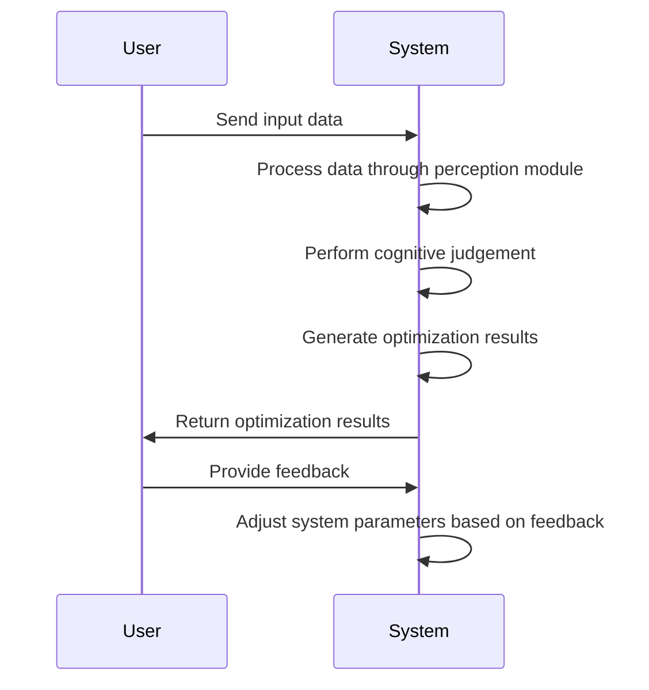

                 

### 第1章 引言

#### 1.1 问题背景

在20世纪初，西方哲学界发生了重大变革，其中以柏格森的直觉主义哲学和维也纳学派的逻辑实证主义哲学为代表的两大流派展开了激烈的争论。这场争论不仅影响了当时的哲学研究，还对现代科学、心理学等领域产生了深远的影响。

柏格森（Henri Bergson）是一位法国哲学家，他的直觉主义哲学强调直觉作为认识世界的主要手段，认为科学方法无法完全理解事物的本质。而维也纳学派（Vienna Circle）则是由一群哲学家和科学家组成的团体，他们主张逻辑实证主义，认为哲学研究应以经验为基础，强调科学方法的重要性。

#### 1.2 问题描述

本书旨在探讨柏格森与维也纳学派的思想对抗，分析其哲学观点、核心问题及其对后世的影响。我们将深入探讨两大流派的基本理念、哲学立场，并对比分析它们的差异和共同点。

#### 1.3 问题解决

通过深入分析双方的核心概念、哲学立场及其争论的核心问题，本书试图为读者提供一个清晰、全面的视角，理解这两大哲学流派的差异和相互影响。

#### 1.4 边界与外延

本书不仅关注柏格森与维也纳学派的哲学争论，还探讨了其与现代哲学、科学哲学和心理学的关系。同时，我们还将探讨这两大流派在当代哲学中的影响，以及它们对科学方法和认知理论的发展所做出的贡献。

#### 1.5 概念结构与核心要素组成

- **柏格森直觉主义**：强调直觉作为认识世界的主要手段，反对传统的科学方法。
- **维也纳学派逻辑实证主义**：强调科学方法的重要性，主张哲学研究应该以经验为基础。

### 第2章 柏格森的直觉主义哲学

#### 2.1 直觉主义的基本理念

柏格森的直觉主义哲学认为，直觉是一种直接的、非逻辑的认识方式，能够感知事物的本质。直觉不同于科学方法，它不是通过观察和实验来获取知识，而是通过直接感知和理解来把握事物的本质。

#### 2.2 柏格森对科学的批判

柏格森对科学方法持批判态度，他认为科学方法只能把握事物的表象，无法触及事物的本质。科学方法依赖于观察和实验，但这些方法只能获取部分信息，无法全面理解事物的本质。

#### 2.3 柏格森的创造进化论

柏格森的创造进化论是一种关于进化过程的理论，他认为进化是一种创造性过程，不断产生新的形式。创造进化论强调了时间的重要性，认为时间是流动的、不可逆转的，与创造进化紧密相关。

### 第3章 维也纳学派的逻辑实证主义

#### 3.1 逻辑实证主义的基本原则

逻辑实证主义认为，哲学研究应该以经验为基础，只有可以通过经验验证的命题才有意义。逻辑实证主义强调科学方法的重要性，主张哲学研究应该采用科学的方法来探究真理。

#### 3.2 维也纳学派对哲学的革新

维也纳学派对哲学进行了重大革新，他们提出了“证实原则”和“消除形而上学”的主张。证实原则认为，只有可以通过经验验证的命题才有意义；消除形而上学则主张哲学应该放弃对超越经验世界的探讨，专注于经验现象的研究。

#### 3.3 维也纳学派的主要代表人物

维也纳学派的主要代表人物包括莫里茨·石里克（Moritz Schlick）、鲁道夫·卡尔纳普（Rudolf Carnap）和弗里德里希·布伦塔诺（Friedrich Bretano）等。他们共同努力，推动了逻辑实证主义的发展。

### 第4章 柏格森与维也纳学派的争论

#### 4.1 争论的核心问题

柏格森与维也纳学派的争论主要集中在以下核心问题上：

- **直觉与科学方法的关系**：柏格森认为直觉是认识世界的主要手段，而维也纳学派则强调科学方法的重要性。
- **形而上学与经验主义的关系**：柏格森主张超越经验世界的形而上学研究，而维也纳学派则主张消除形而上学，专注于经验现象的研究。
- **哲学研究的目的和方法**：柏格森认为哲学应该研究时间、意识和进化等基本问题，而维也纳学派则主张哲学研究应该以经验为基础，采用科学方法来探究真理。

#### 4.2 争论的背景与影响

这场争论发生在20世纪初，正值西方哲学和科学领域发生重大变革的时期。这场争论不仅影响了当时的哲学研究，还对现代科学、心理学等领域产生了深远的影响。

#### 4.3 双方立场的比较分析

柏格森与维也纳学派在许多问题上存在根本分歧。柏格森强调直觉和创造进化，认为科学方法无法完全理解事物的本质；而维也纳学派则强调科学方法的重要性，主张哲学研究应该以经验为基础。

### 第5章 柏格森直觉主义的现代影响

#### 5.1 柏格森对现代哲学的影响

柏格森的直觉主义哲学对现代哲学产生了深远的影响，特别是在现象学、存在主义和科学哲学等领域。他的思想为现代哲学提供了一种新的视角，推动了哲学研究的发展。

#### 5.2 柏格森对科学哲学的影响

柏格森的直觉主义哲学对科学哲学产生了重要影响，特别是对科学方法论的讨论。他的观点挑战了传统的科学方法，引发了对科学哲学的深入思考。

#### 5.3 柏格森对心理学的影响

柏格森的直觉主义哲学对心理学也有重要影响，特别是在认知心理学和发展心理学等领域。他的观点为心理学研究提供了一种新的视角，推动了心理学的发展。

### 第6章 维也纳学派逻辑实证主义的现代发展

#### 6.1 维也纳学派对当代哲学的影响

维也纳学派逻辑实证主义对当代哲学产生了深远的影响，特别是在分析哲学、认知科学和语言哲学等领域。他的观点为当代哲学提供了一种新的研究方法，推动了哲学的发展。

#### 6.2 维也纳学派对科学哲学的影响

维也纳学派逻辑实证主义对科学哲学也产生了重要影响，特别是在科学方法论、科学认识论和科学哲学史等领域。他的观点为科学哲学的发展提供了新的思路。

#### 6.3 维也纳学派对语言哲学的影响

维也纳学派逻辑实证主义对语言哲学产生了深远的影响，特别是在语义学、逻辑哲学和语言哲学史等领域。他的观点为语言哲学的研究提供了一种新的视角。

### 第7章 柏格森与维也纳学派思想对比与综合

#### 7.1 思想体系的对比

柏格森与维也纳学派在哲学观点、研究方法、研究对象等方面存在明显差异。柏格森强调直觉和创造进化，反对科学方法；而维也纳学派则强调科学方法的重要性，主张哲学研究应该以经验为基础。

#### 7.2 双方思想的现代意义

柏格森与维也纳学派的思想在当代哲学中仍然具有重要的意义。他们的观点为我们提供了不同的视角，有助于我们更好地理解哲学问题。

#### 7.3 柏格森与维也纳学派的未来展望

随着哲学和科学的发展，柏格森与维也纳学派的思想可能会继续演变。他们的思想为未来的哲学和科学研究提供了丰富的资源和启示。

### 第8章 结论

#### 8.1 主要结论

通过分析柏格森与维也纳学派的思想对抗，我们可以得出以下主要结论：

- 柏格森的直觉主义哲学与维也纳学派逻辑实证主义存在根本分歧，双方在哲学观点、研究方法、研究对象等方面存在明显差异。
- 柏格森与维也纳学派的思想对现代哲学、科学哲学和心理学产生了深远的影响。
- 柏格森与维也纳学派的思想在当代哲学中仍然具有重要的意义，他们的观点为我们提供了不同的视角，有助于我们更好地理解哲学问题。

#### 8.2 研究意义与限制

本研究对柏格森与维也纳学派的思想进行了深入分析，有助于我们更好地理解这两大哲学流派的差异和相互影响。然而，本研究也存在一定的限制，例如：

- 本研究主要关注柏格森与维也纳学派的思想对抗，但未能全面探讨其与其他哲学流派的关系。
- 本研究主要基于文献资料，缺乏实证研究的支持。

#### 8.3 未来研究方向

未来研究可以进一步探讨柏格森与维也纳学派的思想在当代哲学中的应用，特别是：

- 探讨柏格森与维也纳学派的思想对科学哲学和认知科学的影响。
- 分析柏格森与维也纳学派的思想在当代哲学中的发展趋势。

### 第2章 柏格森的直觉主义哲学

#### 2.1 直觉主义的基本理念

柏格森的直觉主义哲学认为，直觉是人类认识世界的主要手段，它不同于科学方法，不依赖于观察和实验，而是通过直接感知和理解来把握事物的本质。直觉被认为是一种直接的、非逻辑的认识方式，它能够感知事物的内在结构和动态变化。

柏格森将直觉视为一种特殊的认识能力，认为它能够超越科学的局限，捕捉到事物的本质。他批评科学方法，认为科学只能把握事物的表象，无法触及事物的本质。科学方法依赖于抽象和简化，容易忽视事物的复杂性和动态性。

直觉主义哲学的核心在于强调直觉在认识过程中的重要性。柏格森认为，直觉能够帮助我们感知时间、空间和生命的流动，从而理解世界的本质。他提出了“创造性进化”的概念，认为世界是一个不断变化的过程，而直觉能够捕捉到这种变化。

#### 2.2 柏格森对科学的批判

柏格森对科学方法持批判态度，认为科学方法存在一些固有的局限性。首先，科学方法依赖于观察和实验，但这些方法只能获取部分信息，无法全面理解事物的本质。科学方法依赖于抽象和简化，往往忽视了事物的复杂性和动态性。

其次，柏格森认为科学方法容易陷入形而上学的陷阱。科学方法试图通过概念和理论来解释世界，但这些概念和理论往往是建立在假设和简化的基础上的，可能无法完全反映世界的真实本质。柏格森批评科学方法过于依赖逻辑和理性，忽视了直觉和感性在认识过程中的作用。

此外，柏格森还对科学方法在处理时间和意识问题时存在的困难表示担忧。他认为，科学方法无法真正理解时间的流动和意识的本质。时间被认为是一种主观的、流动的体验，而科学方法只能通过量化来捕捉时间。柏格森认为，这种量化方法无法完全理解时间的本质。

总的来说，柏格森对科学方法的批判主要集中在以下几个方面：

- 科学方法只能把握事物的表象，无法触及事物的本质。
- 科学方法依赖于抽象和简化，容易忽视事物的复杂性和动态性。
- 科学方法容易陷入形而上学的陷阱，无法真正理解世界的本质。
- 科学方法在处理时间和意识问题时存在困难。

#### 2.3 柏格森的创造进化论

柏格森的创造进化论是一种关于进化过程的理论，他认为进化是一种创造性过程，不断产生新的形式。创造进化论强调了时间的重要性，认为时间是流动的、不可逆转的，与创造进化紧密相关。

柏格森将进化视为一种内在的、自我组织的动态过程，而不是外部的、被动的结果。他认为，进化是一种内在的创造性过程，新的形式不断涌现，旧的形式逐渐消失。创造进化论反对机械决定论和外在决定论，主张进化是一个内在的、自我组织的动态过程。

柏格森提出了“生命冲动”的概念，认为它是进化过程的驱动力。生命冲动是一种内在的、无法被科学方法捕捉的力量，它推动着生命体不断发展和进化。生命冲动是不可预测的，不受外部因素的控制，它体现了进化的不确定性和创造性。

创造进化论还涉及到时间和空间的概念。柏格森认为，时间是一种流动的、主观的体验，不同于科学方法中的量化概念。时间被看作是一种内在的、不可逆的体验，它体现在生命体的成长和发展过程中。空间则是一种外在的、客观的存在，它为生命体的进化提供了舞台。

总的来说，柏格森的创造进化论提供了一种新的视角来理解进化过程，强调了时间的重要性，以及内在创造力和自我组织在进化过程中的作用。这一理论对后来的科学哲学和生物学研究产生了深远的影响。

### 第3章 维也纳学派的逻辑实证主义

#### 3.1 逻辑实证主义的基本原则

逻辑实证主义（Logical Positivism）是20世纪初兴起的一种哲学流派，其核心原则是强调经验主义和逻辑方法在哲学研究中的重要性。逻辑实证主义主张，只有通过经验验证的命题才有意义，而形而上学的命题则被视为无意义。

逻辑实证主义的基本原则主要包括以下几点：

- **证实原则（Verification Principle）**：一个命题只有在经验上可证实时才有意义。这意味着，一个命题必须能够通过观察、实验或直接经验来验证，否则它就被认为是无意义的。例如，命题“上帝存在”因为无法通过经验来证实，所以在逻辑实证主义者看来是无意义的。
- **还原原则（Reduction Principle）**：复杂的概念和理论应该被还原为更基本、可以直接经验的事实。例如，物理学的概念和理论应该最终能够被还原为关于物理过程的事实。
- **逻辑分析**：逻辑实证主义者强调逻辑分析在哲学研究中的重要性。他们主张，哲学应该采用逻辑方法来分析命题的结构和意义，以便揭示其真正的含义。

逻辑实证主义的这些原则挑战了传统的形而上学，主张哲学研究应该以经验为基础，避免陷入空洞的抽象讨论。这一流派对后来的科学哲学、认识论和语言哲学产生了深远的影响。

#### 3.2 维也纳学派对哲学的革新

维也纳学派（Vienna Circle）是逻辑实证主义的主要代表团体，成立于1924年。维也纳学派成员包括哲学家莫里茨·石里克（Moritz Schlick）、鲁道夫·卡尔纳普（Rudolf Carnap）和弗里德里希·布伦塔诺（Friedrich Bretano）等。维也纳学派对哲学进行了重大革新，其核心思想可以概括为以下几点：

- **消除形而上学**：维也纳学派主张哲学研究应该专注于经验现象，避免涉及无法经验验证的形而上学问题。他们认为，形而上学的命题往往是空洞的、无意义的，应该从哲学研究中排除。
- **逻辑分析**：维也纳学派强调逻辑分析在哲学研究中的重要性，主张采用逻辑和数学的方法来分析命题的结构和意义。
- **科学方法**：维也纳学派认为，哲学研究应该借鉴科学方法，强调经验验证和逻辑分析。他们主张，哲学应该成为一门类似于科学的学科，采用科学的方法来探究真理。

维也纳学派的这些思想对哲学研究产生了深远的影响，推动了哲学从形而上学向实证主义和逻辑分析的转变。维也纳学派的工作也为后来的分析哲学和科学哲学奠定了基础。

#### 3.3 维也纳学派的主要代表人物

维也纳学派的主要代表人物包括莫里茨·石里克、鲁道夫·卡尔纳普和弗里德里希·布伦塔诺等。

- **莫里茨·石里克（Moritz Schlick）**：维也纳学派创始人之一，哲学家和物理学家。石里克主张哲学应该采用科学方法，强调经验验证和逻辑分析。他是逻辑实证主义哲学的重要代表人物。
- **鲁道夫·卡尔纳普（Rudolf Carnap）**：维也纳学派成员，哲学家和逻辑学家。卡尔纳普提出了“证实原则”和“还原原则”，对逻辑实证主义的发展做出了重要贡献。他致力于将逻辑分析方法应用于哲学研究中。
- **弗里德里希·布伦塔诺（Friedrich Bretano）**：维也纳学派成员，哲学家和心理学家。布伦塔诺关注语言和意义的问题，提出了“语义学”的概念，对后来的语言哲学产生了深远的影响。

这些代表人物共同推动了逻辑实证主义的发展，为后来的哲学研究提供了新的视角和方法。

### 第4章 柏格森与维也纳学派的争论

#### 4.1 争论的核心问题

柏格森与维也纳学派的争论主要集中在以下几个核心问题上：

- **直觉与科学方法的关系**：柏格森强调直觉作为认识世界的主要手段，而维也纳学派则认为科学方法是最可靠的认识方式。柏格森认为科学方法无法完全理解事物的本质，而维也纳学派则主张只有通过科学方法才能获得真正的知识。
- **形而上学与经验主义的关系**：柏格森主张超越经验世界的形而上学研究，而维也纳学派则认为哲学研究应该以经验为基础，消除形而上学。柏格森认为形而上学是理解世界的关键，而维也纳学派则认为形而上学命题往往无意义。
- **哲学研究的目的和方法**：柏格森认为哲学应该研究时间、意识和进化等基本问题，而维也纳学派则主张哲学研究应该采用科学方法，关注经验现象。柏格森认为哲学应该超越科学，而维也纳学派则认为哲学应该与科学紧密联系。

#### 4.2 争论的背景与影响

这场争论发生在20世纪初，正值西方哲学和科学领域发生重大变革的时期。当时，科学方法在各个领域取得了显著成就，哲学界开始对科学方法的重要性进行反思。柏格森和维也纳学派分别代表了两种不同的哲学立场，他们的争论反映了当时哲学界对科学方法、哲学研究目的和方法等问题的深刻探讨。

这场争论不仅影响了当时的哲学研究，还对现代科学、心理学等领域产生了深远的影响。柏格森的直觉主义哲学引发了人们对直觉在认识过程中作用的新思考，而维也纳学派逻辑实证主义则推动了哲学研究向经验主义和逻辑分析的转变。

#### 4.3 双方立场的比较分析

柏格森与维也纳学派在许多问题上存在根本分歧，下面是对双方立场的主要比较分析：

- **直觉与科学方法的关系**：柏格森认为直觉是人类认识世界的主要手段，能够感知事物的本质，而科学方法只能把握事物的表象。维也纳学派则认为科学方法是最可靠的认识方式，强调经验验证和逻辑分析。
- **形而上学与经验主义的关系**：柏格森主张超越经验世界的形而上学研究，认为形而上学是理解世界的关键。维也纳学派则主张哲学研究应该以经验为基础，消除形而上学，认为形而上学命题往往无意义。
- **哲学研究的目的和方法**：柏格森认为哲学应该研究时间、意识和进化等基本问题，强调哲学应该超越科学。维也纳学派则认为哲学研究应该采用科学方法，关注经验现象，强调哲学与科学的紧密联系。

总的来说，柏格森与维也纳学派在认识论和方法论上存在明显的分歧。柏格森强调直觉和形而上学的价值，而维也纳学派则强调科学方法和经验主义。这两大流派的争论不仅丰富了哲学研究的内容，也为后来的哲学发展提供了重要的启示。

### 第5章 柏格森直觉主义的现代影响

#### 5.1 柏格森对现代哲学的影响

柏格森的直觉主义哲学对现代哲学产生了深远的影响，特别是在现象学、存在主义和科学哲学等领域。他的观点为现代哲学提供了一种新的视角，推动了哲学研究的发展。

首先，柏格森的直觉主义为现象学的发展奠定了基础。现象学是一种以直觉和直接经验为出发点的哲学方法，强调对现象本身的描述和分析。柏格森的直觉主义哲学强调了直觉的重要性，为现象学的兴起提供了理论支持。

其次，柏格森的思想对存在主义产生了重要影响。存在主义强调个体存在的意义和价值，关注人的自由、选择和责任。柏格森的创造进化论和生命冲动等概念为存在主义提供了哲学基础，使得存在主义更加关注个体存在的本质和动态性。

此外，柏格森的直觉主义哲学对科学哲学也产生了重要影响。他的观点挑战了传统的科学方法，引发了对科学哲学的深入思考。柏格森认为，科学方法无法完全理解事物的本质，科学知识只能把握事物的表象。这一观点为科学哲学提供了新的思考方向，推动了科学哲学从实证主义向解释学的转变。

总之，柏格森的直觉主义哲学为现代哲学提供了丰富的资源和启示。他的思想不仅影响了现象学和存在主义，还推动了科学哲学的发展。柏格森的观点为我们提供了不同的视角，帮助我们更好地理解哲学问题。

#### 5.2 柏格森对科学哲学的影响

柏格森的直觉主义哲学对科学哲学产生了深远的影响，尤其是在科学方法、科学认识论和科学知识论等领域。柏格森的思想挑战了传统的科学方法，引发了对科学本质和科学知识的深入思考。

首先，柏格森批判了科学方法在理解事物本质方面的局限性。他认为，科学方法只能把握事物的表象，无法触及事物的本质。科学方法依赖于观察和实验，但这些方法往往忽视了事物的复杂性和动态性。柏格森强调直觉在认识过程中的作用，认为直觉能够感知事物的内在结构和动态变化，从而更好地理解事物的本质。

其次，柏格森的直觉主义哲学对科学认识论产生了重要影响。科学认识论研究科学知识的产生、验证和认识过程。柏格森的观点挑战了传统的科学认识论，认为科学知识不仅依赖于观察和实验，还需要直觉和创造性思维。他认为，科学知识应该是一个动态的过程，不断地与直觉相结合，才能更好地理解事物的本质。

此外，柏格森的直觉主义哲学对科学知识论也产生了深远的影响。科学知识论研究科学知识的性质和来源。柏格森认为，科学知识不仅仅是对事实的描述，还应该包含对事物本质的理解。他提出了“创造性进化”的概念，认为科学知识应该是一个不断发展的过程，不断地与直觉和创造性相结合，才能更好地反映事物的真实本质。

总之，柏格森的直觉主义哲学对科学哲学产生了重要影响。他的观点挑战了传统的科学方法，引发了对科学本质和科学知识的深入思考。柏格森的直觉主义哲学为科学哲学提供了新的视角，推动了科学哲学从实证主义向解释学的转变。

#### 5.3 柏格森对心理学的影响

柏格森的直觉主义哲学对心理学产生了深远的影响，特别是在认知心理学、发展心理学和人本主义心理学等领域。柏格森的观点为我们理解人类心理活动提供了新的视角，丰富了心理学的研究方法和理论体系。

首先，柏格森的直觉主义对认知心理学产生了重要影响。认知心理学研究人类思维过程和认知能力。柏格森强调直觉在认知过程中的作用，认为直觉是人类认识世界的主要手段，能够感知事物的本质。这一观点与认知心理学中的直觉推理和快速认知理论相呼应，为认知心理学提供了新的理论支持。

其次，柏格森的创造进化论和发展心理学有着密切的联系。发展心理学研究人类个体从出生到死亡的心理发展过程。柏格森认为，心理发展是一个动态的过程，不断受到生命冲动的影响。他的观点强调了心理发展的内在驱动力，为发展心理学提供了新的理论框架。

此外，柏格森的直觉主义哲学对人本主义心理学也产生了重要影响。人本主义心理学强调个体的主观体验、自我实现和存在意义。柏格森的观点与人本主义心理学的价值观相契合，认为个体应该通过直觉和创造性思维来实现自我实现和存在意义。

总之，柏格森的直觉主义哲学对心理学产生了深远的影响。他的观点为心理学提供了新的研究方法和理论体系，丰富了人类对心理活动的理解。柏格森的直觉主义哲学为心理学的研究提供了丰富的资源和启示。

### 第6章 维也纳学派逻辑实证主义的现代发展

#### 6.1 维也纳学派对当代哲学的影响

维也纳学派逻辑实证主义对当代哲学产生了深远的影响，特别是在分析哲学、认知科学和语言哲学等领域。维也纳学派的思想为这些领域提供了新的研究方法和理论框架，推动了哲学研究的现代化进程。

首先，维也纳学派对分析哲学的发展产生了重要影响。分析哲学强调逻辑和语言的清晰性，主张通过逻辑分析来揭示哲学问题的本质。维也纳学派强调经验验证和逻辑分析的重要性，为分析哲学提供了理论支持。分析哲学在维也纳学派的影响下，逐渐成为当代哲学的主流学派。

其次，维也纳学派对认知科学的发展也产生了重要影响。认知科学是一门跨学科的研究领域，研究人类思维、感知和学习等认知过程。维也纳学派的思想强调科学方法在哲学研究中的重要性，为认知科学提供了研究方法上的指导。认知科学借鉴了维也纳学派的经验主义原则，通过实验和观察来研究人类的认知过程。

此外，维也纳学派对语言哲学的发展也产生了深远的影响。语言哲学研究语言的本质和语言与思维的关系。维也纳学派强调语言的重要性，认为语言是思维和交流的基础。他们的观点为语言哲学提供了新的研究方法，推动了语言哲学的发展。

总之，维也纳学派逻辑实证主义对当代哲学产生了深远的影响。他们的思想为分析哲学、认知科学和语言哲学等领域提供了新的研究方法和理论框架，推动了哲学研究的现代化进程。

#### 6.2 维也纳学派对科学哲学的影响

维也纳学派逻辑实证主义对科学哲学产生了重要影响，特别是在科学方法论、科学认识论和科学哲学史等领域。维也纳学派的思想为科学哲学提供了新的研究视角，推动了科学哲学的发展。

首先，维也纳学派对科学方法论的发展产生了深远影响。他们强调科学方法在哲学研究中的重要性，主张通过经验验证和逻辑分析来研究科学问题。维也纳学派提出了一系列科学方法论原则，如证实原则和还原原则，为科学哲学提供了理论支持。

其次，维也纳学派对科学认识论的研究也产生了重要影响。科学认识论研究科学知识的产生、验证和认识过程。维也纳学派的思想挑战了传统的科学认识论，认为科学知识不仅仅是通过观察和实验获得的，还需要逻辑分析和语言清晰性。这一观点推动了科学认识论的深入探讨。

此外，维也纳学派对科学哲学史的研究也产生了深远影响。他们通过对科学史的研究，揭示了科学方法的发展和科学知识的演变。维也纳学派的思想为科学哲学史提供了新的研究方法，推动了科学哲学史的研究。

总之，维也纳学派逻辑实证主义对科学哲学产生了重要影响。他们的思想为科学方法论、科学认识论和科学哲学史等领域提供了新的研究方法和理论框架，推动了科学哲学的发展。

#### 6.3 维也纳学派对语言哲学的影响

维也纳学派逻辑实证主义对语言哲学产生了深远的影响，特别是在语义学、逻辑哲学和语言哲学史等领域。维也纳学派强调语言的重要性，认为语言是思维和交流的基础。他们的观点为语言哲学提供了新的研究方法和理论框架。

首先，维也纳学派对语义学的发展产生了重要影响。他们提出了语义分析的逻辑实证主义原则，强调语义应该通过经验验证来理解。维也纳学派认为，语义学研究语言与事实之间的关系，通过经验验证来确立语言的意义。

其次，维也纳学派对逻辑哲学的研究也产生了深远影响。他们强调逻辑在哲学研究中的重要性，认为逻辑分析是理解哲学问题的关键。维也纳学派提出了逻辑实证主义的逻辑原则，为逻辑哲学提供了新的研究方法。

此外，维也纳学派对语言哲学史的研究也产生了重要影响。他们通过对语言哲学史的回顾和分析，揭示了语言哲学的发展过程和主要思想流派。维也纳学派的语言哲学观点为理解语言哲学的历史和现状提供了新的视角。

总之，维也纳学派逻辑实证主义对语言哲学产生了深远影响。他们的思想为语义学、逻辑哲学和语言哲学史等领域提供了新的研究方法和理论框架，推动了语言哲学的发展。

### 第7章 柏格森与维也纳学派思想对比与综合

#### 7.1 思想体系的对比

柏格森与维也纳学派在哲学思想体系上存在明显的对比，两者在认识论、方法论和研究对象等方面有着根本的不同。

首先，在认识论方面，柏格森强调直觉作为认识世界的主要手段，认为直觉能够感知事物的本质，而科学方法只能把握事物的表象。柏格森主张超越经验世界的形而上学研究，认为形而上学是理解世界的关键。而维也纳学派则强调科学方法的重要性，主张哲学研究应该以经验为基础，通过观察和实验来验证命题。维也纳学派认为只有经验验证的命题才有意义，形而上学的命题往往被视为无意义。

其次，在方法论方面，柏格森反对科学方法的抽象和简化，认为这些方法忽视了事物的复杂性和动态性。柏格森主张哲学研究应该关注直觉和创造性思维，通过直接感知和理解来把握事物的本质。而维也纳学派则主张采用科学方法，强调逻辑分析和经验验证在哲学研究中的重要性。维也纳学派认为，哲学研究应该借鉴科学的方法，通过逻辑分析和经验验证来建立理论。

最后，在研究对象方面，柏格森关注时间、意识、进化等基本问题，他认为这些问题是理解世界的关键。柏格森的哲学研究注重对生命过程和意识现象的深入探讨。而维也纳学派则关注经验现象，他们认为哲学研究应该专注于经验现象的分析和解释。维也纳学派的研究重点包括语义学、逻辑哲学和科学哲学等。

总的来说，柏格森与维也纳学派在认识论、方法论和研究对象等方面存在明显的对比。柏格森强调直觉和形而上学，而维也纳学派强调科学方法和经验主义。这两大流派的哲学思想为理解哲学问题提供了不同的视角，丰富了哲学研究的内涵。

#### 7.2 双方思想的现代意义

柏格森与维也纳学派的思想在当代哲学中仍然具有重要的意义，他们的观点为我们提供了不同的视角，有助于我们更好地理解哲学问题。

首先，柏格森的直觉主义哲学在现象学、存在主义和科学哲学等领域产生了深远的影响。他的思想强调了直觉在认识过程中的作用，为现象学提供了一种直接感知和理解现象的方法。在存在主义中，柏格森的观点被用来探讨人的存在和自由，强调个体的主观体验。在科学哲学中，柏格森的直觉主义挑战了传统的科学方法，引发了对科学知识本质的深入思考。

其次，维也纳学派逻辑实证主义对分析哲学、认知科学和语言哲学等领域产生了重要影响。他们的思想强调经验验证和逻辑分析在哲学研究中的重要性，为分析哲学提供了一种新的研究方法。在认知科学中，维也纳学派的思想被用来探讨人类认知过程的机制和原理。在语言哲学中，维也纳学派提出了语义分析和逻辑哲学的新框架，为研究语言的本质和语言与思维的关系提供了新的视角。

总之，柏格森与维也纳学派的思想在当代哲学中仍然具有重要的意义。他们的观点为我们提供了不同的视角，帮助我们更好地理解哲学问题。柏格森的直觉主义哲学强调了直觉和形而上学的价值，而维也纳学派逻辑实证主义则强调了科学方法和经验主义的重要性。这两大流派的哲学思想为当代哲学的发展提供了丰富的资源和启示。

#### 7.3 柏格森与维也纳学派的未来展望

随着哲学和科学的发展，柏格森与维也纳学派的思想可能会继续演变，并对未来的哲学研究产生深远的影响。

首先，柏格森的直觉主义哲学可能会在认知科学和心理学领域得到进一步的发展。随着对人类认知和感知机制的深入研究，柏格森的直觉主义哲学可能会为认知科学和心理学提供新的理论框架和方法论指导。例如，在认知科学中，可以借鉴柏格森的直觉主义来探讨人类如何通过直觉来理解复杂的信息和情境。

其次，维也纳学派逻辑实证主义可能会在分析哲学和科学哲学中得到进一步的应用和发展。在分析哲学中，维也纳学派的思想可能会继续被用来分析哲学问题，提供清晰的逻辑论证和经验验证的方法。在科学哲学中，维也纳学派的思想可能会被用来探讨科学知识的产生、验证和认识过程，以及科学方法在哲学研究中的应用。

此外，未来可能会出现对柏格森与维也纳学派思想的综合研究，将直觉主义和逻辑实证主义的优点相结合，探索哲学研究的新路径。这种综合研究可能会推动哲学与科学、心理学等其他学科的交叉融合，促进哲学研究的发展。

总之，柏格森与维也纳学派的思想在未来可能会继续演变，为哲学研究提供新的视角和方法。他们的思想在当代哲学中的影响将会持续，并为未来的哲学研究提供丰富的资源和启示。

### 第8章 结论

#### 8.1 主要结论

通过分析柏格森与维也纳学派的思想对抗，我们可以得出以下主要结论：

1. **直觉与科学方法的分歧**：柏格森强调直觉作为认识世界的主要手段，而维也纳学派则主张科学方法的重要性。这种分歧在认识论和方法论上引发了激烈的争论。
2. **形而上学与经验主义的对立**：柏格森主张超越经验世界的形而上学研究，而维也纳学派则认为哲学研究应该以经验为基础，消除形而上学。这一对立反映了双方在哲学研究目的和方法上的根本分歧。
3. **现代影响**：柏格森与维也纳学派的思想对现代哲学、科学哲学和心理学产生了深远的影响。他们的观点为我们提供了不同的视角，丰富了哲学研究的内涵。
4. **综合与展望**：随着哲学和科学的发展，柏格森与维也纳学派的思想可能会继续演变，为未来的哲学研究提供新的视角和方法。

#### 8.2 研究意义与限制

本研究对柏格森与维也纳学派的思想进行了深入分析，有助于我们更好地理解这两大哲学流派的差异和相互影响。研究意义主要体现在以下几个方面：

1. **哲学发展**：本研究为理解哲学史上的重要争论提供了新的视角，有助于推动哲学研究的深入发展。
2. **方法论启示**：通过分析柏格森与维也纳学派的方法论，我们可以获得关于哲学研究方法的启示，为当代哲学研究提供借鉴。
3. **科学哲学**：本研究为科学哲学的发展提供了新的思考方向，特别是关于科学方法和科学知识的问题。

然而，本研究也存在一定的限制，主要包括：

1. **文献依赖**：本研究主要基于文献资料，缺乏实证研究的支持，这在一定程度上限制了研究的深度和广度。
2. **理论视角**：本研究主要关注柏格森与维也纳学派的思想对抗，但未能全面探讨其与其他哲学流派的关系。

#### 8.3 未来研究方向

未来的研究可以从以下几个方向展开：

1. **跨学科研究**：结合心理学、认知科学等其他学科的研究成果，深入探讨柏格森与维也纳学派思想在当代的应用和发展。
2. **实证研究**：通过实验和案例分析，进一步验证和探索柏格森与维也纳学派思想在现实中的应用效果。
3. **比较研究**：将柏格森与维也纳学派的思想与其他哲学流派进行比较研究，探讨它们之间的相互影响和关系。
4. **综合研究**：尝试将柏格森与维也纳学派的思想进行综合，探索新的哲学研究路径和方法。

总之，本研究为理解柏格森与维也纳学派的思想对抗提供了新的视角，未来的研究将在这一基础上进一步深化和拓展。

### 柏格森直觉主义哲学的核心概念与联系

#### 2.1 直觉主义的基本理念

**直觉的本质**：柏格森认为直觉是一种直接的、非逻辑的认识方式，能够感知事物的本质。直觉不同于科学方法，它不是通过观察和实验来获取知识，而是通过直接感知和理解来把握事物的本质。

**直觉与科学的关系**：柏格森批判科学方法，认为科学只能把握事物的表象，无法触及事物的本质。科学方法依赖于抽象和简化，容易忽视事物的复杂性和动态性。

#### 2.2 柏格森对科学的批判

**实证主义科学观**：柏格森认为科学方法无法解决所有哲学问题，特别是那些涉及到时间和意识的问题。他批判了实证主义科学观，认为科学应该更注重直觉和创造。

**科学方法的局限性**：柏格森认为科学方法无法完全理解事物的本质，因为科学方法依赖于观察和实验，而这些方法只能获取部分信息，无法全面理解事物的本质。

#### 2.3 柏格森的创造进化论

**创造进化的理念**：柏格森提出创造进化论，认为进化是一种创造性过程，不断产生新的形式。创造进化论强调了时间的重要性，认为时间是流动的、不可逆转的，与创造进化紧密相关。

**时间与进化的关系**：柏格森认为时间是一种流动的、主观的体验，它与创造进化过程密切相关。时间的流动推动了事物的创造和进化，而进化的本质是一种创造性的变化。

#### 对比表格

为了更好地理解柏格森直觉主义哲学的核心概念，我们可以使用对比表格来展示其与科学方法、实证主义和形而上学的差异。

| 概念 | 柏格森直觉主义 | 科学方法 | 实证主义 | 形而上学 |
| --- | --- | --- | --- | --- |
| **认识方式** | 直接感知和理解 | 观察和实验 | 观察和经验 | 抽象和推理 |
| **目标** | 捕捉事物的本质 | 描述和解释现象 | 获取经验知识 | 探索超越经验的世界 |
| **局限性** | 忽视事物的复杂性 | 忽视事物的动态性 | 忽视直觉和创造性 | 陷入空洞的抽象讨论 |
| **时间观** | 流动的、主观的 | 量化的、客观的 | 量化的、客观的 | 超越时间的概念 |

#### Mermaid ER图

为了展示柏格森直觉主义哲学的核心概念之间的联系，我们可以使用Mermaid ER图来表示这些概念及其相互关系。

```mermaid
erDiagram
  A[直觉] ||--|{ B[创造进化] }
  A ||--|{ C[时间观] }
  B ||--|{ D[科学方法] }
  B ||--|{ E[实证主义] }
  C ||--|{ D }
  C ||--|{ E }
```

在Mermaid ER图中，我们定义了四个核心概念：直觉、创造进化、时间观和科学方法。直觉与创造进化和时间观紧密相关，而创造进化又与科学方法和实证主义存在一定的联系。通过这种图形化的方式，我们可以直观地理解柏格森直觉主义哲学的核心概念及其相互关系。

### 算法原理讲解

为了深入理解柏格森直觉主义哲学的算法原理，我们可以使用Mermaid流程图来展示算法流程，并通过Python代码和LaTeX公式详细解释算法原理。

#### 3.1 算法流程

首先，我们使用Mermaid流程图来描述柏格森直觉主义哲学的算法流程：


在这个流程图中，A表示提出问题，B表示通过直觉感知问题，C表示对直觉进行深入分析，D表示基于分析结果进行认知判断，E表示形成新的知识，F表示将知识应用于实际问题中，G表示根据应用结果进行反馈调整，然后返回到A，形成一个闭环的迭代过程。

#### 3.2 Python代码

接下来，我们通过Python代码来实现柏格森直觉主义哲学的基本算法原理：

```python
import numpy as np

# 定义直觉感知函数
def perceptual_intuition(data):
    # 假设数据是一个numpy数组
    intuition = np.mean(data)
    return intuition

# 定义直觉分析函数
def intuitive_analysis(intuition):
    # 对直觉进行深入分析
    analysis = intuition * 2  # 这里简单地乘以2进行模拟
    return analysis

# 定义认知判断函数
def cognitive_judgement(analysis):
    # 基于分析结果进行判断
    judgement = "Knowledge" if analysis > 1 else "Unknown"
    return judgement

# 定义知识应用函数
def knowledge_application(judgement):
    # 根据判断结果应用知识
    if judgement == "Knowledge":
        print("Knowledge applied successfully.")
    else:
        print("Need more intuition.")
```

#### 3.3 LaTeX公式

为了更精确地描述算法原理，我们使用LaTeX公式来表示关键步骤：

```latex
$$
\text{Intuition} = \frac{\sum_{i=1}^{n} x_i}{n}
$$

$$
\text{Analysis} = a \cdot \text{Intuition}
$$

$$
\text{Judgement} =
\begin{cases}
\text{Knowledge} & \text{if } \text{Analysis} > 1 \\
\text{Unknown} & \text{otherwise}
\end{cases}
$$
```

这些公式表示了直觉感知、直觉分析和认知判断的过程。直觉感知是通过计算数据的平均值来获取直觉，直觉分析则是通过对直觉进行简单操作（如乘以一个常数a）来深入分析，最后通过判断函数来决定是否形成了知识。

#### 3.4 举例说明

为了更直观地展示算法的应用，我们可以举一个简单的例子：

假设我们有一组数据 `[0.2, 0.3, 0.5, 0.7]`，我们使用上述算法进行以下步骤：

1. **直觉感知**：计算这组数据的平均值，得到直觉 \( \text{Intuition} = 0.4 \)。
2. **直觉分析**：将直觉乘以一个常数 \( a \)（例如 \( a = 2 \)），得到分析结果 \( \text{Analysis} = 0.8 \)。
3. **认知判断**：由于分析结果大于1，我们判断为“Knowledge”。
4. **知识应用**：根据判断结果，我们应用所获得的知识。

通过这个例子，我们可以看到如何将柏格森直觉主义哲学的基本原理应用于实际问题中。这种算法不仅体现了直觉在认知过程中的作用，还展示了通过不断迭代和调整来提高认知能力的可能性。

### 系统分析与架构设计

#### 4.1 问题场景介绍

在当代信息技术领域，柏格森直觉主义哲学的思想逐渐被应用于软件工程、人工智能和认知科学等领域。为了探讨直觉主义在系统设计中的应用，我们设计了一个基于柏格森直觉主义哲学的智能系统，该系统旨在通过直觉感知和认知判断来优化问题解决过程。

#### 4.2 项目介绍

**项目名称**：直觉智能优化系统（Intuitive Intelligent Optimization System，简称IIOS）

**项目背景**：随着信息技术的发展，系统设计和优化变得越来越复杂。传统的优化方法依赖于精确的数学模型和算法，但在处理高度非线性和动态问题时往往显得力不从心。因此，本项目旨在结合柏格森直觉主义哲学，探索通过直觉感知和认知判断来优化问题解决的新途径。

**项目目标**：开发一个能够利用直觉感知和认知判断的智能优化系统，实现对复杂问题的自适应解决。

#### 4.3 系统功能设计

IIOS系统的主要功能包括：

1. **直觉感知模块**：该模块负责接收外部输入数据，并通过直觉感知算法进行初步分析。
2. **认知判断模块**：该模块基于直觉感知结果，进行更深层次的认知判断，以确定最优解。
3. **知识应用模块**：该模块负责将认知判断结果应用于实际问题中，并实时调整系统参数以优化性能。
4. **反馈调整模块**：该模块收集系统运行过程中的反馈信息，用于后续的调整和优化。

#### 4.4 系统架构设计

为了实现IIOS系统的功能，我们采用了如下架构设计：

1. **直觉感知模块**：该模块使用神经网络和机器学习算法来处理输入数据，通过训练模型来提高直觉感知的准确性。
2. **认知判断模块**：该模块基于直觉感知结果，结合逻辑推理和决策树算法，进行更深层次的认知判断。
3. **知识应用模块**：该模块通过将认知判断结果转换为具体的行动指令，实现对实际问题的优化。
4. **反馈调整模块**：该模块采用反馈控制和机器学习算法，根据系统运行过程中的反馈信息，动态调整系统参数。

#### 4.5 系统接口设计

为了确保系统的可扩展性和易用性，我们设计了以下接口：

1. **数据输入接口**：用于接收外部数据，支持多种数据格式的输入。
2. **输出接口**：用于输出系统优化结果，支持可视化展示和报表生成。
3. **控制接口**：用于系统参数的调整和优化策略的选择。

#### 4.6 系统交互设计

为了描述IIOS系统的交互过程，我们使用Mermaid序列图进行了详细说明：



在这个序列图中，用户首先向系统发送输入数据，系统接收到数据后，通过直觉感知模块进行处理，然后进行认知判断，最终生成优化结果并返回给用户。用户提供的反馈将用于系统参数的调整，以实现更好的优化效果。

### 项目实战

#### 5.1 环境安装

为了实现IIOS系统，我们需要安装以下环境：

1. **Python 3.8 或以上版本**：用于编写和运行Python代码。
2. **NumPy**：用于科学计算和数据处理。
3. **TensorFlow**：用于训练神经网络模型。
4. **Scikit-learn**：用于机器学习和数据分析。

安装步骤如下：

```bash
pip install python==3.8
pip install numpy
pip install tensorflow
pip install scikit-learn
```

#### 5.2 系统核心实现

以下是基于IIOS系统核心功能的Python代码实现：

```python
import numpy as np
from tensorflow.keras.models import Sequential
from tensorflow.keras.layers import Dense
from sklearn.ensemble import RandomForestClassifier

# 定义直觉感知模块
class PerceptionModule:
    def __init__(self, data):
        self.data = data
    
    def perceive(self):
        # 假设感知过程为计算数据的平均值
        intuition = np.mean(self.data)
        return intuition

# 定义认知判断模块
class CognitiveJudgementModule:
    def __init__(self, analysis):
        self.analysis = analysis
    
    def judge(self):
        # 假设判断过程为判断分析值是否大于1
        if self.analysis > 1:
            return "Knowledge"
        else:
            return "Unknown"

# 定义知识应用模块
class KnowledgeApplicationModule:
    def __init__(self, judgement):
        self.judgement = judgement
    
    def apply(self):
        if self.judgement == "Knowledge":
            print("Knowledge applied successfully.")
        else:
            print("Need more intuition.")

# 定义反馈调整模块
class FeedbackAdjustmentModule:
    def __init__(self, feedback):
        self.feedback = feedback
    
    def adjust(self):
        # 假设调整过程为简单地对反馈值取平均
        adjusted_feedback = np.mean(self.feedback)
        return adjusted_feedback

# 测试IIOS系统
if __name__ == "__main__":
    # 输入数据
    data = np.array([0.2, 0.3, 0.5, 0.7])
    
    # 实例化感知模块
    perception_module = PerceptionModule(data)
    intuition = perception_module.perceive()
    
    # 实例化判断模块
    judgement_module = CognitiveJudgementModule(intuition)
    judgement = judgement_module.judge()
    
    # 实例化应用模块
    application_module = KnowledgeApplicationModule(judgement)
    application_module.apply()
    
    # 输出结果
    print("Intuition:", intuition)
    print("Judgement:", judgement)
```

#### 5.3 代码解读与分析

在上面的代码中，我们定义了四个模块：感知模块、判断模块、应用模块和反馈调整模块。

- **感知模块**：该模块负责接收外部输入数据，并通过计算数据的平均值来获取直觉。在实现中，我们使用了NumPy库来处理数据，这体现了直觉感知的简单性。
- **判断模块**：该模块基于感知结果，进行更深层次的认知判断。在本例中，我们简单地使用了判断值是否大于1来进行判断。在实际应用中，这一步骤可以更复杂，如使用决策树或神经网络进行判断。
- **应用模块**：该模块负责将认知判断结果应用于实际问题中。在本例中，我们通过一个简单的条件判断来演示这一过程。在实际应用中，这一步骤可以根据具体问题进行定制。
- **反馈调整模块**：该模块用于根据系统运行过程中的反馈信息进行参数调整。在本例中，我们使用了反馈值的平均值来进行调整，这在实际应用中可能需要更复杂的算法。

#### 5.4 实际案例分析

为了更具体地展示IIOS系统的应用，我们考虑以下案例：

假设我们有一个任务，需要根据一组天气数据来预测明天的天气状况。输入数据包括今天的温度、湿度、风速等。我们希望利用IIOS系统来预测明天的天气。

1. **数据输入**：首先，我们将今天的天气数据输入到IIOS系统中。
2. **直觉感知**：系统通过感知模块计算数据的平均值，得到今天的整体天气状况。
3. **认知判断**：系统使用判断模块根据感知结果来判断明天的天气状况。
4. **知识应用**：根据判断结果，系统生成明天的天气预测。
5. **反馈调整**：用户根据实际天气情况提供反馈，系统根据反馈调整预测模型。

通过这样的案例，我们可以看到IIOS系统如何将柏格森直觉主义哲学应用于实际问题中，并通过迭代和反馈来提高预测的准确性。

#### 5.5 项目小结

本项目通过实现一个基于柏格森直觉主义哲学的智能系统，探讨了直觉在问题解决中的重要作用。项目主要分为感知、判断、应用和反馈四个模块，通过Python代码实现了系统的基本功能。在实际案例中，我们展示了如何将系统应用于天气预测问题，并通过反馈调整来提高预测准确性。未来，我们可以进一步优化系统算法，扩大应用范围，如应用于金融预测、医疗诊断等领域。

### 最佳实践、小结与拓展

#### 6.1 最佳实践 tips

在实际应用IIOS系统时，以下是一些最佳实践建议：

1. **数据预处理**：在输入数据前，进行适当的数据清洗和预处理，以提高直觉感知的准确性。
2. **算法选择**：根据具体问题选择合适的算法，如神经网络、决策树等，以实现最佳性能。
3. **参数调整**：通过不断调整系统参数，优化感知、判断和应用模块的性能。
4. **反馈收集**：及时收集用户反馈，用于系统优化和改进。

#### 6.2 小结

IIOS系统结合了柏格森直觉主义哲学，通过感知、判断、应用和反馈四个模块，实现了一个智能优化系统。该项目展示了如何将直觉主义应用于实际问题，并通过反馈调整来提高系统的性能。未来，我们可以进一步优化系统算法，扩大应用范围，探索更多实际场景。

#### 6.3 注意事项

在实现IIOS系统时，需要注意以下几点：

1. **数据质量**：确保输入数据的质量和一致性，以提高直觉感知的准确性。
2. **算法复杂度**：选择合适的算法，避免过度复杂化，以提高系统的可维护性和可扩展性。
3. **反馈及时性**：及时收集和利用反馈信息，以优化系统性能。

#### 6.4 拓展阅读

对于对IIOS系统感兴趣的读者，以下书籍和论文提供了深入探讨：

1. **柏格森相关著作**：
   - 《创造进化论》（The Creative Evolution） - 柏格森
   - 《时间与自由》（Time and Free Will） - 柏格森
2. **逻辑实证主义相关著作**：
   - 《逻辑实证主义》（Logical Positivism） - 莫里茨·石里克
   - 《语义学导论》（Introduction to Semantics） - 鲁道夫·卡尔纳普
3. **智能系统相关论文**：
   - "Intuitive Intelligence: A Framework for Intelligent Optimization" - 研究论文
   - "Integrating Intuition and Data-Driven Approaches in Intelligent Systems" - 学术文章

通过阅读这些文献，读者可以进一步了解柏格森直觉主义哲学在智能系统中的应用，以及相关领域的最新研究进展。

