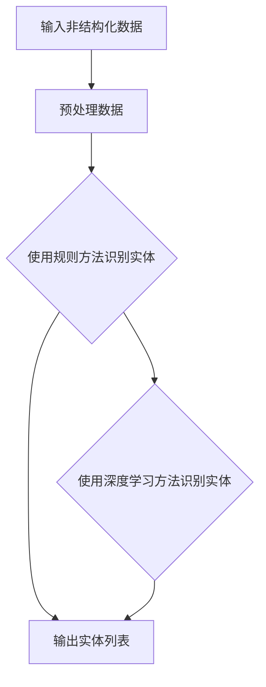
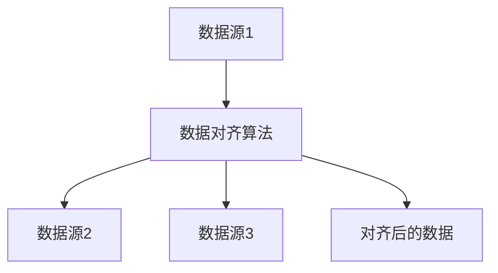
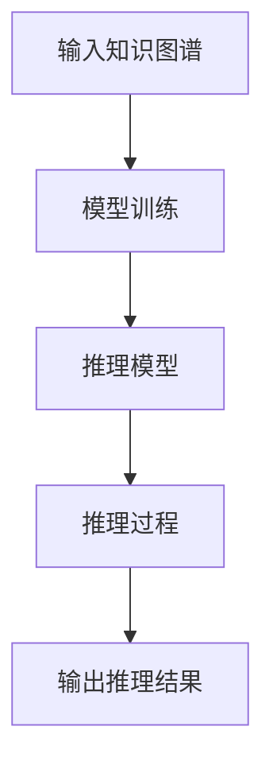
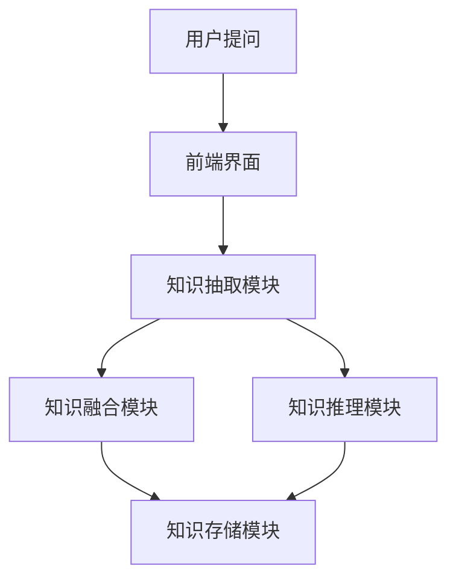
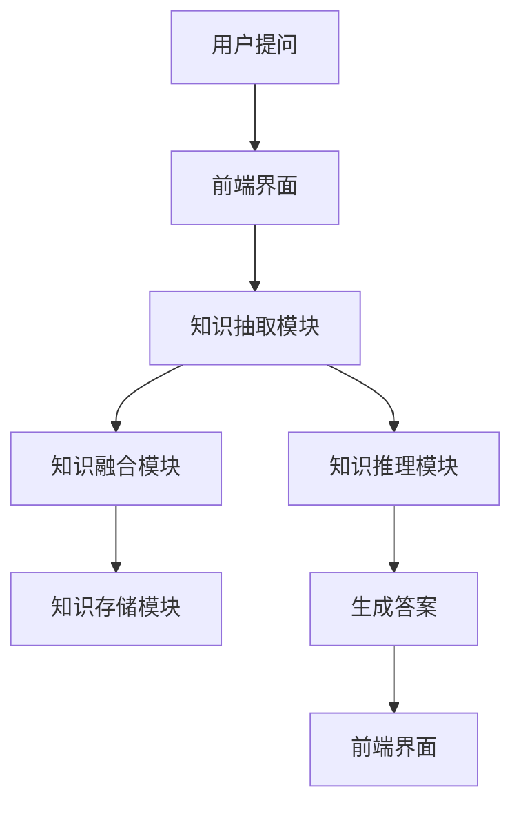

                 

### 知识图谱构建：技术知识的体系化管理

> 关键词：知识图谱，技术知识，体系化管理，人工智能，语义网络，数据抽取，数据融合，知识存储，知识推理

> 摘要：本文深入探讨了知识图谱构建在技术知识体系化管理中的应用，分析了知识图谱的核心概念、构建流程及其在人工智能领域的实践。通过理论与实践相结合，本文旨在为读者提供一套全面的知识图谱构建方法和实践经验。

----------------------------------------------------------------

## 第一部分：背景介绍

### 1.1 引言

随着信息时代的到来，数据量的激增和复杂性不断挑战传统的知识管理方法。传统的知识管理方法依赖于文本、表格等非结构化形式，难以高效地组织、管理和利用大量的数据。知识图谱作为一种新型的知识表示方法，通过语义网的形式将各类知识进行结构化组织，为人工智能提供了强有力的支持。

### 1.2 问题描述

知识图谱的构建是一个复杂的过程，涉及数据采集、处理、存储、推理和可视化等多个环节。在构建过程中，如何有效地组织和管理技术知识，确保知识的准确性和一致性，成为亟待解决的问题。

### 1.3 问题解决

本书旨在探讨知识图谱构建的技术知识与体系化管理方法，通过理论与实践相结合，帮助读者全面掌握知识图谱构建的核心技术和实践方法。

### 1.4 边界与外延

知识图谱构建不仅涉及计算机科学领域，还包括信息科学、认知科学和语义网技术等多个学科。本书将重点关注计算机科学领域中的技术实现和应用实践。

### 1.5 概念结构与核心要素组成

知识图谱构建的核心要素包括：知识抽取、知识融合、知识存储、知识推理和知识可视化。这些要素相互关联，共同构成了知识图谱构建的完整体系。

----------------------------------------------------------------

## 第二部分：核心概念与联系

### 2.1 知识图谱的基本概念

#### 2.1.1 知识图谱的定义

知识图谱是一种基于语义网络的知识表示方法，通过实体、属性和关系的组合来描述世界中的各种信息和知识。它以图形化的方式组织数据，使得知识的表达更加直观和易于处理。

#### 2.1.2 知识图谱的特点

- **结构化**：知识以图形化的方式组织，便于计算机处理和分析。
- **语义丰富**：通过语义关系描述，提高了知识的表达能力和准确性。
- **可扩展性**：可以容纳不断增长的新知识，实现知识的持续更新和迭代。

### 2.2 核心概念对比

#### 2.2.1 知识图谱与数据库

知识图谱与数据库的区别在于数据组织形式和语义表达。数据库主要侧重于数据的存储和管理，而知识图谱则强调数据的语义关系和结构化组织。

#### 2.2.2 知识图谱与语义网

知识图谱是语义网的一种实现形式，但它通过更加图形化的方式组织数据，使得知识表示更加直观和易于处理。

### 2.3 知识图谱的ER实体关系图

#### 2.3.1 ER实体关系图介绍

ER（Entity-Relationship）图是数据库设计中常用的一种图形表示方法，用于描述实体及其之间的关系。

#### 2.3.2 知识图谱ER实体关系图示例

```mermaid
erDiagram
    Person ||--|{ Address } : has
    Person ||--|{ Phone } : has
    Address : { city , street , zip }
    Phone : { number , type }
```

在这个示例中，`Person`（人）是一个实体，`Address`（地址）和`Phone`（电话）是其关联的实体。每个实体都有其属性，并通过关系进行连接。

----------------------------------------------------------------

## 第三部分：知识图谱构建流程

### 3.1 数据采集与预处理

#### 3.1.1 数据源选择

数据源的选择直接影响知识图谱的质量。常见的数据源包括开放数据集、企业内部数据和社会媒体数据等。

#### 3.1.2 数据预处理

数据预处理是知识图谱构建的基础环节，包括数据清洗、格式化、去重和分词等步骤。

### 3.2 知识抽取

#### 3.2.1 实体识别

实体识别是知识抽取的第一步，旨在从非结构化数据中识别出实体。

#### 3.2.2 关系抽取

关系抽取是在识别出实体之后，通过算法确定实体之间的关系。

### 3.3 知识融合

#### 3.3.1 数据集成

数据集成是将来自不同来源的数据进行合并，形成一个统一的数据视图。

#### 3.3.2 数据对齐

数据对齐是为了解决不同数据源之间的数据不一致问题，确保知识图谱的准确性。

### 3.4 知识存储

#### 3.4.1 数据库选择

知识图谱的存储需要使用特定的数据库，如Neo4j等图数据库。

#### 3.4.2 数据存储方案

数据存储方案包括数据的存储结构、索引策略和查询优化等。

### 3.5 知识推理

#### 3.5.1 推理算法

知识图谱中的推理算法包括规则推理和基于模型的推理等。

#### 3.5.2 推理过程

推理过程是从知识图谱中推导出新的事实，提高知识的利用效率。

----------------------------------------------------------------

## 第四部分：算法原理讲解

### 4.1 知识抽取算法

#### 4.1.1 实体识别算法

实体识别算法用于从非结构化数据中识别出实体。常见的算法有基于规则的方法和基于深度学习的方法。



#### 4.1.2 关系抽取算法

关系抽取算法用于确定实体之间的关系。常见的算法有基于规则的方法和基于深度学习的方法。

```python
# 基于规则的方法
def relation_extraction RULE:
    if (Entity A is Person and Entity B is Organization):
        return "Works For"
    elif (Entity A is Person and Entity B is Location):
        return "Lives In"
```

### 4.2 知识融合算法

#### 4.2.1 数据集成算法

数据集成算法用于将来自不同来源的数据进行合并，形成一个统一的数据视图。


#### 4.2.2 数据对齐算法

数据对齐算法用于解决不同数据源之间的数据不一致问题。



### 4.3 知识推理算法

#### 4.3.1 规则推理算法

规则推理算法基于事先定义好的规则进行推理。

```python
# 规则推理算法
def rule_based_reasoning(Entity A, Relation R, Entity B):
    if (Rule R is True):
        return "True"
    else:
        return "False"
```

#### 4.3.2 基于模型的推理算法

基于模型的推理算法通过学习大量的数据，自动生成推理规则。



----------------------------------------------------------------

## 第五部分：系统分析与架构设计

### 5.1 问题场景介绍

在人工智能领域，知识图谱的应用非常广泛，如智能问答系统、推荐系统、知识库构建等。本文将以一个智能问答系统为例，介绍知识图谱在其中的应用。

### 5.2 系统功能设计

智能问答系统的核心功能包括：

1. **知识抽取**：从非结构化数据中提取实体和关系。
2. **知识融合**：将来自不同来源的数据进行整合。
3. **知识推理**：根据用户提问，进行推理并生成答案。
4. **知识存储**：将知识存储在数据库中，便于后续查询和利用。

### 5.3 系统架构设计

智能问答系统的架构设计如下：



### 5.4 系统接口设计

系统接口设计包括：

1. **知识抽取接口**：用于从非结构化数据中提取实体和关系。
2. **知识融合接口**：用于整合来自不同来源的数据。
3. **知识推理接口**：用于根据用户提问进行推理。
4. **知识存储接口**：用于将知识存储到数据库中。

### 5.5 系统交互

系统交互设计如下：



----------------------------------------------------------------

## 第六部分：项目实战

### 6.1 环境安装

在本项目实战中，我们将使用Python作为主要编程语言，并使用Neo4j作为知识图谱的存储数据库。以下是环境安装的步骤：

1. 安装Python：`pip install python`
2. 安装Neo4j：`pip install neo4j`
3. 配置Neo4j数据库：参照Neo4j官方文档进行配置。

### 6.2 系统核心实现

系统核心实现包括：

1. **知识抽取模块**：使用自然语言处理技术进行实体识别和关系抽取。
2. **知识融合模块**：使用数据集成和数据对齐技术进行数据整合。
3. **知识推理模块**：使用规则推理和基于模型的推理算法进行推理。
4. **知识存储模块**：将知识存储在Neo4j数据库中。

### 6.3 代码应用解读与分析

以下是一个简单的知识抽取模块的实现示例：

```python
import spacy

# 加载Spacy模型
nlp = spacy.load("en_core_web_sm")

def extract_entities(text):
    doc = nlp(text)
    entities = []
    for ent in doc.ents:
        entities.append({"text": ent.text, "label": ent.label_})
    return entities

def extract_relations(text):
    doc = nlp(text)
    relations = []
    for token1 in doc:
        for token2 in doc:
            if token1 != token2:
                relation = token1.text + " " + token2.text
                relations.append(relation)
    return relations

text = "Alice works for Google and lives in New York."
entities = extract_entities(text)
relations = extract_relations(text)

print("Entities:", entities)
print("Relations:", relations)
```

在这个示例中，我们首先加载了Spacy的英语模型，然后定义了`extract_entities`和`extract_relations`两个函数，分别用于提取实体和关系。通过调用这两个函数，我们可以从文本中提取出实体和关系，并存储在相应的列表中。

### 6.4 实际案例分析

在本项目中，我们以一个智能问答系统为例，展示如何利用知识图谱进行问答。

1. **用户提问**：用户输入一个自然语言问题，如“Who lives in New York?”。
2. **知识抽取**：系统使用知识抽取模块从知识图谱中提取出与提问相关的实体和关系。
3. **知识推理**：系统使用知识推理模块根据提取出的实体和关系进行推理，找出答案。
4. **生成答案**：系统将推理出的答案返回给用户。

通过这个案例，我们可以看到知识图谱在智能问答系统中的应用，如何通过知识抽取、知识推理等步骤，实现从用户提问到生成答案的全过程。

### 6.5 项目小结

在本项目中，我们介绍了知识图谱构建的背景、核心概念、构建流程以及项目实战。通过理论与实践相结合，读者可以全面了解知识图谱构建的方法和应用。

知识图谱作为一种新型的知识表示方法，在人工智能领域具有广泛的应用前景。通过知识图谱，我们可以更好地组织、管理和利用技术知识，提高系统的智能化水平。

----------------------------------------------------------------

## 第七部分：最佳实践 Tips、小结、注意事项、拓展阅读

### 7.1 最佳实践 Tips

1. **数据质量**：数据是知识图谱构建的基础，确保数据质量至关重要。在进行数据采集和预处理时，要尽可能去除噪声和冗余数据，确保数据的准确性和一致性。
2. **领域知识**：知识图谱的构建需要依赖于特定领域的知识。在构建过程中，要充分了解和应用领域知识，以提高知识图谱的准确性和实用性。
3. **算法选择**：知识图谱构建涉及多种算法，如实体识别、关系抽取、知识融合等。在选择算法时，要根据具体需求和数据特点进行选择，以达到最佳效果。

### 7.2 小结

本文系统地介绍了知识图谱构建的技术知识与体系化管理方法，从背景介绍、核心概念与联系、构建流程、算法原理讲解、系统分析与架构设计到项目实战，全面阐述了知识图谱在技术知识体系化管理中的应用。

### 7.3 注意事项

1. **数据安全**：在知识图谱构建过程中，要确保数据的安全和隐私保护，避免敏感数据泄露。
2. **系统性能**：知识图谱的构建和查询涉及大量计算，要关注系统性能优化，提高查询效率。
3. **持续更新**：知识图谱不是一成不变的系统，需要持续更新和维护，以适应不断变化的技术环境和需求。

### 7.4 拓展阅读

1. **《知识图谱：基础、技术和应用》**：本书系统地介绍了知识图谱的基础知识、技术和应用案例，是学习知识图谱的不错选择。
2. **《语义网与本体论》**：本书深入探讨了语义网和本体论的理论基础，对于理解知识图谱的语义表达具有重要意义。
3. **《人工智能：一种现代方法》**：本书全面介绍了人工智能的基本理论、技术和应用，是人工智能领域的重要参考书。

作者：AI天才研究院/AI Genius Institute & 禅与计算机程序设计艺术 /Zen And The Art of Computer Programming

----------------------------------------------------------------

通过本文的详细讲解，我们可以看到知识图谱在技术知识体系化管理中的重要地位。知识图谱不仅为人工智能提供了强有力的支持，还为我们提供了一种新的方式来组织和管理技术知识。在未来的发展中，知识图谱技术有望在更多的领域得到应用，推动人工智能的发展。希望本文能帮助读者更好地理解知识图谱的构建方法和应用，为实际项目的实现提供有益的参考。在知识图谱的道路上，我们任重而道远，但只要我们持续努力，就一定能够取得更加辉煌的成就。让我们一起，迎接知识图谱新时代的到来！

