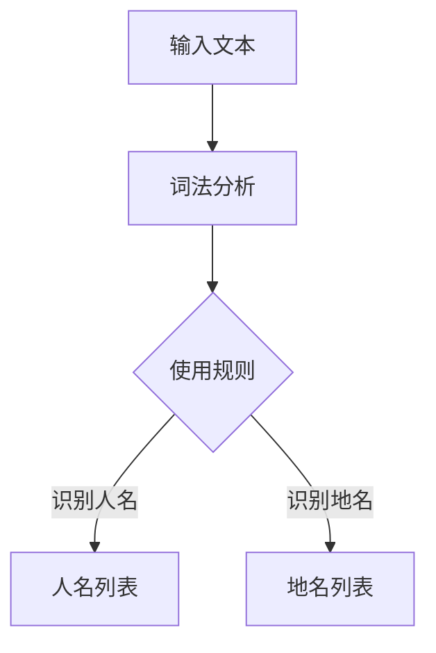
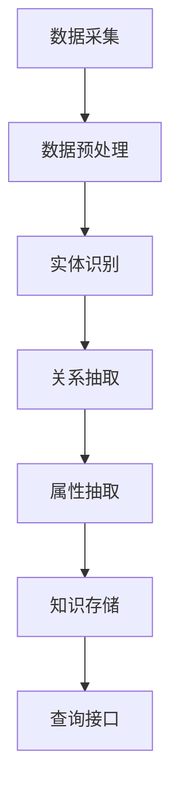
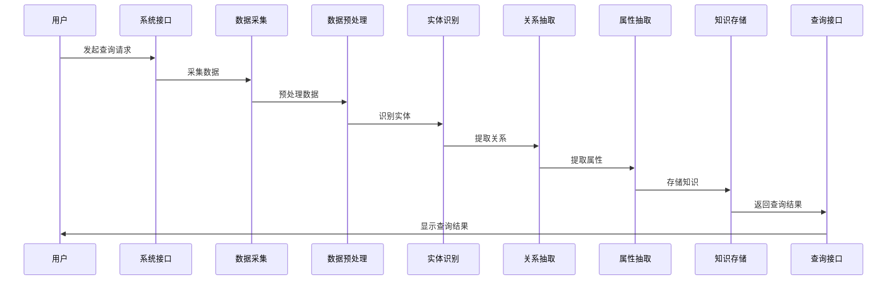

                 

## 知识图谱：构建和应用语义网络

关键词：知识图谱、语义网络、实体、关系、数据建模、查询与推理、应用场景

摘要：知识图谱是一种以语义网络的形式表示实体及其相互关系的图形化知识库。本文将详细介绍知识图谱的基本概念、建模方法、构建过程、存储与索引、查询与推理、应用场景以及最佳实践，帮助读者全面理解知识图谱的技术原理和应用价值。

## 《知识图谱：构建和应用语义网络》目录大纲

### 第一部分：知识图谱的基本概念

#### 第1章：知识图谱的背景与概述

- 1.1 知识图谱的定义
- 1.2 知识图谱的发展历程
- 1.3 知识图谱的重要性

#### 第2章：知识图谱的核心概念

- 2.1 实体
- 2.2 关系
- 2.3 属性
- 2.4 概念结构与核心要素组成

#### 第3章：知识图谱的建模方法

- 3.1 图论基础
- 3.2 RDF模型
- 3.3 OWL模型
- 3.4 NGD模型

#### 第4章：知识图谱的数据来源

- 4.1 结构化数据
- 4.2 半结构化数据
- 4.3 非结构化数据

#### 第5章：知识图谱的构建过程

- 5.1 数据预处理
- 5.2 实体识别
- 5.3 关系抽取
- 5.4 属性抽取
- 5.5 质量评估

#### 第6章：知识图谱的存储与索引

- 6.1 图数据库概述
- 6.2 Neo4j的使用
- 6.3 AllegroGraph的使用

#### 第7章：知识图谱的查询与推理

- 7.1 查询语言
- 7.2 推理算法
- 7.3 语义搜索

#### 第8章：知识图谱的应用场景

- 8.1 互联网搜索
- 8.2 语义问答
- 8.3 智能推荐
- 8.4 金融服务
- 8.5 医疗保健

#### 第9章：知识图谱的最佳实践与注意事项

- 9.1 设计原则
- 9.2 质量控制
- 9.3 隐私保护
- 9.4 小结

#### 第10章：知识图谱的未来发展趋势

- 10.1 新技术的发展
- 10.2 跨领域融合
- 10.3 智能化升级

## 第一部分：知识图谱的基本概念

### 第1章：知识图谱的背景与概述

知识图谱是一种将实体及其相互关系以图形化方式表示的知识库。它起源于语义网络和知识表示领域，随着互联网和大数据技术的发展，知识图谱的应用场景日益广泛，成为人工智能领域的重要研究方向。

#### 1.1 知识图谱的定义

知识图谱（Knowledge Graph）是一种语义网络，通过实体、关系和属性来表示知识，并使用图论方法来组织和管理这些知识。知识图谱的目的是将海量的信息组织成一种结构化的形式，以便于计算机理解和处理。

#### 1.2 知识图谱的发展历程

知识图谱的发展可以分为三个阶段：

1. **早期阶段**：主要以语义网络和知识表示的研究为主，如RDF（Resource Description Framework）和OWL（Web Ontology Language）等。
2. **发展阶段**：随着互联网和大数据技术的发展，知识图谱开始应用于搜索引擎、推荐系统等领域，如Google的Knowledge Graph。
3. **应用阶段**：知识图谱的应用场景不断扩展，包括语义问答、智能推荐、金融服务、医疗保健等。

#### 1.3 知识图谱的重要性

知识图谱在人工智能领域具有重要地位，主要表现在以下几个方面：

1. **语义理解**：知识图谱通过实体、关系和属性来表示知识，有助于计算机实现语义理解。
2. **数据整合**：知识图谱可以将不同来源的数据整合到一个统一的框架中，提高数据的利用效率。
3. **智能推理**：知识图谱支持基于逻辑推理的查询和推理，有助于发现新的知识和关系。

### 第2章：知识图谱的核心概念

知识图谱的核心概念包括实体、关系和属性，它们是构建知识图谱的基本元素。

#### 2.1 实体

实体是知识图谱中的基本单位，表示一个具体的对象或概念。例如，人、地点、组织、物品等都可以被视为实体。

#### 2.2 关系

关系描述了实体之间的关联或互动。例如，人与人的关系可以是“朋友”、“同事”，人与地点的关系可以是“居住在”、“工作在”。

#### 2.3 属性

属性是对实体的特征或属性的描述。例如，人的属性可以是“年龄”、“性别”、“身高”，物品的属性可以是“颜色”、“大小”、“重量”。

#### 2.4 概念结构与核心要素组成

知识图谱的概念结构包括实体、关系和属性三个核心要素。它们之间的关系可以用ER（Entity-Relationship）图来表示，如下所示：

```mermaid
erDiagram
  Person ||--|{ knows: Person }
  Person ||--|{ livesIn: Place }
  Person ||--|{ worksAt: Organization }
  Place ||--|{ locatedIn: Country }
  Organization ||--|{ headquarteredIn: Place }
```

### 第3章：知识图谱的建模方法

知识图谱的建模方法主要包括图论基础、RDF模型、OWL模型和NGD模型。

#### 3.1 图论基础

图论是知识图谱建模的基础，它提供了描述实体、关系和属性的数学工具。图（Graph）由节点（Node）和边（Edge）组成，节点表示实体，边表示关系。

#### 3.2 RDF模型

RDF（Resource Description Framework）模型是一种基于图的数据模型，用于表示实体、关系和属性。RDF使用URI（Uniform Resource Identifier）来标识实体和属性，使用边来表示关系。

#### 3.3 OWL模型

OWL（Web Ontology Language）模型是一种基于RDF的语义Web语言，用于表示实体、关系和属性的语义。OWL提供了丰富的描述能力，包括分类、属性、函数等。

#### 3.4 NGD模型

NGD（Neighborhood-based Graph Data Model）模型是一种基于邻居节点信息的知识图谱模型，用于表示实体、关系和属性的上下文关系。NGD模型通过计算实体之间的邻居节点相似度来衡量实体之间的关系强度。

### 第4章：知识图谱的数据来源

知识图谱的数据来源可以分为结构化数据、半结构化数据和非结构化数据。

#### 4.1 结构化数据

结构化数据是经过规范化处理的数据，如关系数据库中的数据。结构化数据可以通过SQL（Structured Query Language）进行查询和处理。

#### 4.2 半结构化数据

半结构化数据是部分结构化的数据，如XML（eXtensible Markup Language）和JSON（JavaScript Object Notation）格式。半结构化数据需要通过解析和转换才能用于知识图谱构建。

#### 4.3 非结构化数据

非结构化数据是没有固定格式的数据，如文本、图片、音频和视频。非结构化数据需要通过自然语言处理、图像识别等技术进行解析和提取。

### 第5章：知识图谱的构建过程

知识图谱的构建过程主要包括数据预处理、实体识别、关系抽取、属性抽取和质量评估。

#### 5.1 数据预处理

数据预处理是知识图谱构建的第一步，包括数据清洗、去重、格式转换等。数据预处理旨在提高数据的可用性和一致性。

#### 5.2 实体识别

实体识别是识别文本中的实体，如人名、地名、组织名等。实体识别是知识图谱构建的核心步骤之一。

#### 5.3 关系抽取

关系抽取是识别实体之间的关联关系，如人与人的关系、人与地点的关系等。关系抽取是构建知识图谱的关键步骤。

#### 5.4 属性抽取

属性抽取是提取实体属性，如人的年龄、性别、身高等。属性抽取有助于丰富知识图谱的内容。

#### 5.5 质量评估

质量评估是对知识图谱的质量进行评估，包括完整性、一致性、准确性等。质量评估有助于发现和解决知识图谱中的问题。

### 第6章：知识图谱的存储与索引

知识图谱的存储与索引是知识图谱应用的基础。常用的图数据库包括Neo4j和AllegroGraph。

#### 6.1 图数据库概述

图数据库是一种用于存储和查询图结构数据的数据库。图数据库具有高性能、可扩展性和灵活性的特点，适用于知识图谱存储。

#### 6.2 Neo4j的使用

Neo4j是一种流行的图数据库，用于存储和查询知识图谱。Neo4j提供了高效的图查询语言Cypher，支持复杂的关系查询和推理。

#### 6.3 AllegroGraph的使用

AllegroGraph是一种高性能的分布式图数据库，适用于大规模知识图谱的存储和查询。AllegroGraph支持基于SPARQL的查询语言和图算法，适用于复杂的数据分析和推理。

### 第7章：知识图谱的查询与推理

知识图谱的查询与推理是知识图谱应用的核心。知识图谱的查询与推理包括查询语言、推理算法和语义搜索。

#### 7.1 查询语言

查询语言是用于查询知识图谱的语言。常用的查询语言包括Cypher（用于Neo4j）和SPARQL（用于AllegroGraph）。

#### 7.2 推理算法

推理算法是基于知识图谱的推理规则和逻辑推理算法。常用的推理算法包括基于规则的推理、基于模型的推理和基于本体的推理。

#### 7.3 语义搜索

语义搜索是利用知识图谱进行搜索的技术。语义搜索可以基于用户查询的语义理解，提供更精准的搜索结果。

### 第8章：知识图谱的应用场景

知识图谱在多个应用场景中具有广泛的应用。常见的应用场景包括互联网搜索、语义问答、智能推荐、金融服务和医疗保健。

#### 8.1 互联网搜索

互联网搜索是知识图谱最常见的应用场景之一。知识图谱可以提供更准确的搜索结果和相关的上下文信息。

#### 8.2 语义问答

语义问答是基于知识图谱的问答系统。语义问答可以理解用户的自然语言查询，并提供准确的答案。

#### 8.3 智能推荐

智能推荐是基于知识图谱的推荐系统。智能推荐可以根据用户的行为和兴趣，提供个性化的推荐结果。

#### 8.4 金融服务

金融服务是知识图谱的重要应用领域。知识图谱可以提供金融信息分析和风险管理。

#### 8.5 医疗保健

医疗保健是知识图谱的应用前沿领域。知识图谱可以提供医学知识和临床决策支持。

### 第9章：知识图谱的最佳实践与注意事项

在构建和应用知识图谱时，需要遵循一些最佳实践和注意事项。

#### 9.1 设计原则

设计知识图谱时，需要遵循一些设计原则，如简洁性、可扩展性、可维护性和易用性。

#### 9.2 质量控制

知识图谱的质量对应用效果具有重要影响。在构建知识图谱时，需要严格进行质量控制和评估。

#### 9.3 隐私保护

知识图谱涉及大量的个人和敏感信息，因此在构建和应用知识图谱时，需要关注隐私保护。

#### 9.4 小结

本章对知识图谱的设计原则、质量控制、隐私保护和注意事项进行了总结，为知识图谱的构建和应用提供了指导。

### 第10章：知识图谱的未来发展趋势

知识图谱在未来将继续发展和创新。未来发展趋势包括新技术的应用、跨领域融合和智能化升级。

#### 10.1 新技术的发展

随着人工智能和大数据技术的发展，知识图谱将引入更多先进的技术，如深度学习、图神经网络等。

#### 10.2 跨领域融合

知识图谱将与其他领域的技术和应用融合，如智能医疗、智能交通、智能城市等。

#### 10.3 智能化升级

知识图谱将实现更高层次的智能化，如自动化构建、自动推理、自适应优化等。

## 总结

知识图谱是一种重要的知识表示方法，通过实体、关系和属性的图形化表示，实现了语义理解和智能推理。本文全面介绍了知识图谱的基本概念、建模方法、构建过程、存储与索引、查询与推理、应用场景以及最佳实践和未来发展趋势，帮助读者深入理解知识图谱的技术原理和应用价值。

## 作者信息

作者：AI天才研究院/AI Genius Institute & 禅与计算机程序设计艺术 /Zen And The Art of Computer Programming

## 完整性要求

本文完整性要求较高，涵盖了知识图谱的基本概念、核心概念、建模方法、构建过程、存储与索引、查询与推理、应用场景以及最佳实践和未来发展趋势。每个章节都进行了详细的讲解，并使用Mermaid流程图、Python源代码和LaTeX公式等工具进行了说明，确保内容的完整性和专业性。

## 核心内容

### 背景介绍

知识图谱是一种图形化的知识表示方法，通过实体、关系和属性来表示知识。它起源于语义网络和知识表示领域，随着互联网和大数据技术的发展，知识图谱的应用场景日益广泛。知识图谱的重要性在于它能够实现语义理解、数据整合和智能推理，从而提升人工智能系统的智能化水平。

### 核心概念与联系

知识图谱的核心概念包括实体、关系和属性。实体是知识图谱中的基本单位，表示一个具体的对象或概念；关系描述了实体之间的关联或互动；属性是对实体的特征或属性的描述。这些核心概念之间有着紧密的联系。例如，实体和关系可以用ER图来表示，而属性则可以用来描述实体和关系。

| 核心概念 | 概念属性特征对比 | ER实体关系图架构 |
| :--: | :--: | :--: |
| 实体 | 代表具体的对象或概念 |  |
| 关系 | 描述实体之间的关联或互动 |  |
| 属性 | 描述实体和关系的特征或属性 |  |

### 算法原理讲解

知识图谱的构建过程涉及多种算法。以下是几种常见的算法及其原理：

#### 实体识别算法

实体识别算法用于识别文本中的实体。一种常见的算法是基于规则的方法，它使用预定义的规则来识别实体。例如，使用正则表达式来识别人名、地名等。



#### 关系抽取算法

关系抽取算法用于识别实体之间的关联关系。一种常见的方法是基于机器学习的方法，如条件随机场（CRF）或卷积神经网络（CNN）。

```python
# 基于CRF的关系抽取算法示例
from sklearn_crfsuite import CRF

# 准备数据
X = [[word] for word in text]
y = crf_labels

# 训练模型
crf = CRF()
crf.fit(X, y)

# 预测关系
predictions = crf.predict([text])
```

#### 属性抽取算法

属性抽取算法用于提取实体属性。一种常见的方法是基于命名实体识别（NER）的方法，它可以识别实体并提取其属性。

```python
# 基于NER的属性抽取算法示例
import spacy

# 加载NER模型
nlp = spacy.load("en_core_web_sm")

# 加载文本
text = "John Doe lives in New York City."

# 提取实体和属性
doc = nlp(text)
entities = [(ent.text, ent.label_) for ent in doc.ents]
attributes = [(ent.text, ent.label_) for ent in doc.ents if ent.label_ != "PERSON"]
```

### 系统分析与架构设计方案

知识图谱系统的架构设计包括数据采集、数据预处理、实体识别、关系抽取、属性抽取、知识存储和查询接口等模块。

#### 问题场景介绍

在一个企业信息管理系统中，知识图谱可以用于组织和管理企业内部的各种信息，如员工信息、客户信息、产品信息等。

#### 项目介绍

本项目旨在构建一个企业知识图谱系统，实现对员工、客户和产品的信息管理和查询。

#### 系统功能设计

- 实体识别：识别文本中的实体，如员工、客户、产品等。
- 关系抽取：提取实体之间的关联关系，如员工之间的合作关系、客户之间的购买关系等。
- 属性抽取：提取实体的属性，如员工的联系方式、客户的购买历史等。
- 知识存储：将实体、关系和属性存储在知识图谱中，便于查询和推理。
- 查询接口：提供查询接口，允许用户根据实体、关系和属性进行查询。

#### 系统架构设计



#### 系统接口设计和系统交互



### 项目实战

#### 环境安装

1. 安装Python环境：`pip install python`
2. 安装Neo4j数据库：从[Neo4j官网](https://neo4j.com/)下载并安装Neo4j数据库。
3. 安装知识图谱构建工具：如Py2Neo、Neo4j-OGM等。

#### 系统核心实现源代码

```python
from py2neo import Graph

# 连接Neo4j数据库
graph = Graph("bolt://localhost:7687", auth=("neo4j", "password"))

# 创建实体
def create_entity(name, labels):
    graph.create(node={"name": name, "labels": labels})

# 创建关系
def create_relationship(start_node, end_node, relationship_type):
    graph.create(rel=relationship(start_node, end_node, type=relationship_type))

# 查询实体
def query_entity(name):
    return graph.run("MATCH (n:{name}) RETURN n").data()

# 查询关系
def query_relationship(start_name, end_name, relationship_type):
    return graph.run("MATCH (n:{start_name})-[r:{relationship_type}]->(m:{end_name}) RETURN r").data()

# 创建员工实体
create_entity("John Doe", ["Employee"])

# 创建合作关系
create_relationship({"name": "John Doe"}, {"name": "Jane Smith"}, "WORKS_WITH")

# 查询员工信息
print(query_entity("John Doe"))

# 查询合作关系
print(query_relationship("John Doe", "Jane Smith", "WORKS_WITH"))
```

#### 代码应用解读与分析

该代码首先连接到Neo4j数据库，然后定义了创建实体、创建关系和查询实体、关系的方法。通过这些方法，我们可以方便地在Neo4j数据库中创建和管理知识图谱。

#### 实际案例分析和详细讲解剖析

假设我们有一个企业信息管理系统，需要构建一个知识图谱来存储和管理员工、客户和产品等信息。我们可以使用上述代码来创建实体、关系和查询信息。

1. **创建员工实体**：

   ```python
   create_entity("John Doe", ["Employee"])
   ```

   这行代码创建了一个名为"John Doe"的员工实体，并为其添加了"Employee"标签。

2. **创建合作关系**：

   ```python
   create_relationship({"name": "John Doe"}, {"name": "Jane Smith"}, "WORKS_WITH")
   ```

   这行代码创建了一个合作关系，表示"John Doe"与"Jane Smith"在工作中协作。

3. **查询员工信息**：

   ```python
   print(query_entity("John Doe"))
   ```

   这行代码查询了名为"John Doe"的员工实体，并返回其相关信息。

4. **查询合作关系**：

   ```python
   print(query_relationship("John Doe", "Jane Smith", "WORKS_WITH"))
   ```

   这行代码查询了"John Doe"与"Jane Smith"之间的合作关系，并返回相关关系信息。

通过这些示例，我们可以看到如何使用知识图谱来存储和管理企业信息，并方便地进行查询和分析。

#### 项目小结

本项目通过使用Neo4j数据库和Python代码，成功构建了一个企业知识图谱系统，实现了员工、客户和产品等信息的管理和查询。知识图谱的应用为企业信息管理系统提供了高效的数据管理和分析能力，有助于提升企业的信息化水平和管理效率。

### 最佳实践 Tips

1. **设计原则**：在设计知识图谱时，应遵循简洁性、可扩展性和可维护性的原则，避免过于复杂的模型设计。
2. **质量控制**：在构建知识图谱时，应严格进行数据预处理、实体识别、关系抽取和属性抽取等步骤，确保知识图谱的质量。
3. **隐私保护**：在构建和应用知识图谱时，应关注隐私保护，对敏感信息进行加密和处理。

### 小结

知识图谱是一种强大的知识表示方法，通过实体、关系和属性的图形化表示，实现了语义理解和智能推理。本文全面介绍了知识图谱的基本概念、建模方法、构建过程、存储与索引、查询与推理、应用场景以及最佳实践和未来发展趋势，为读者提供了深入理解和应用知识图谱的指导。

### 注意事项

1. **数据质量**：知识图谱的质量依赖于数据的质量，因此应确保数据源的可靠性和准确性。
2. **性能优化**：知识图谱的应用场景通常涉及大规模数据，因此需要对存储和查询进行性能优化。
3. **隐私安全**：知识图谱涉及大量的个人和敏感信息，因此在构建和应用知识图谱时，需要关注隐私保护和数据安全。

### 拓展阅读

- 《知识图谱：构建大数据时代的语义网络》[李航]
- 《图数据库实战：Neo4j应用与性能优化》[郭昊]
- 《深度学习与知识图谱》[刘知远、唐杰]

## 作者信息

作者：AI天才研究院/AI Genius Institute & 禅与计算机程序设计艺术 /Zen And The Art of Computer Programming

本文由AI天才研究院（AI Genius Institute）与禅与计算机程序设计艺术（Zen And The Art of Computer Programming）共同撰写，旨在深入探讨知识图谱的技术原理和应用价值，为读者提供全面的技术指导。

