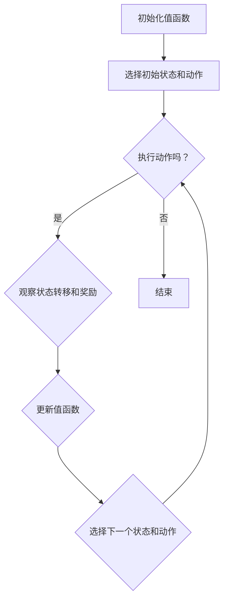
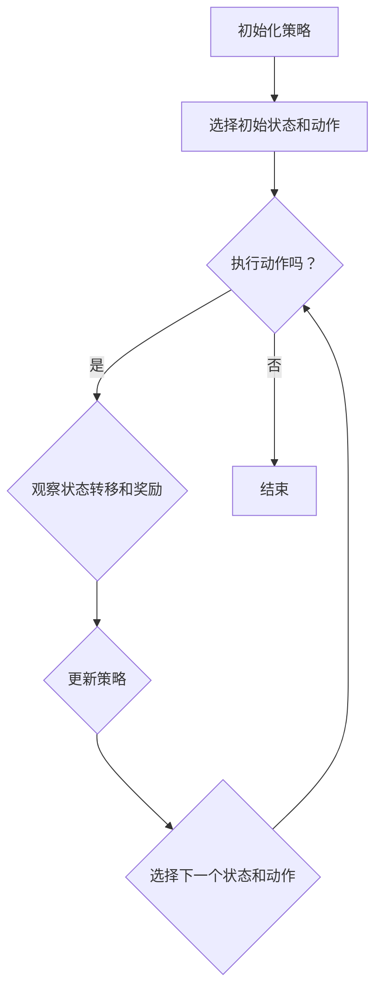
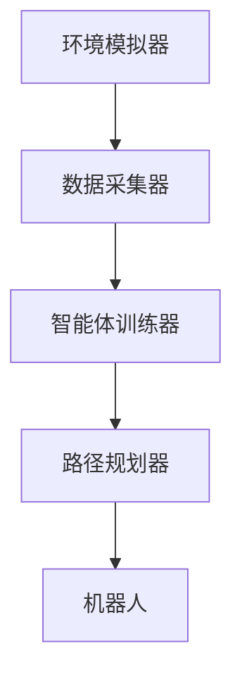
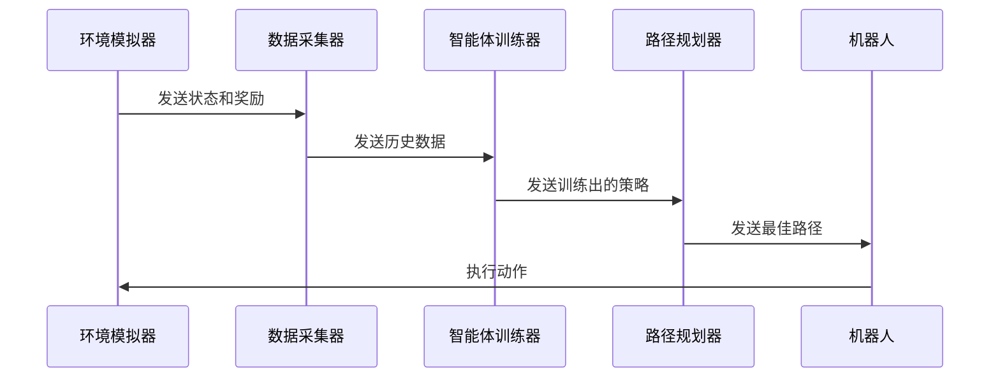

                 

# 《离线强化学习：利用历史数据训练AI Agent》

> 关键词：离线强化学习，历史数据，AI Agent，强化学习算法，应用场景

> 摘要：本文深入探讨了离线强化学习的基本概念、核心原理和应用场景，重点介绍了如何利用历史数据进行AI Agent的训练。文章通过详细的数学模型讲解、算法流程图分析以及实际项目实战，为读者提供了全面的技术指导，帮助理解离线强化学习在实际问题中的应用价值。

---

## 目录大纲

1. **问题背景与核心概念**  
   - 1.1 强化学习概述
   - 1.2 离线强化学习
   - 1.3 强化学习中的主要挑战

2. **核心概念与联系**  
   - 2.1 强化学习的基本元素
   - 2.2 强化学习算法分类
   - 2.3 强化学习算法的属性特征对比表格

3. **强化学习的数学模型与公式**  
   - 3.1 强化学习的数学基础
   - 3.2 离线强化学习的数学模型
   - 3.3 数学公式与详细讲解

4. **强化学习的算法原理与流程图**  
   - 4.1 Q-learning算法原理
   - 4.2 SARSA算法原理
   - 4.3 强化学习算法的mermaid流程图

5. **离线强化学习应用**  
   - 5.1 系统分析与架构设计
   - 5.2 项目实战

6. **最佳实践与拓展阅读**  
   - 6.1 最佳实践 Tips
   - 6.2 小结
   - 6.3 拓展阅读

---

## 第一部分：离线强化学习基础

### 1.1.1 强化学习概述

强化学习（Reinforcement Learning，RL）是机器学习的一个重要分支，旨在通过环境（Environment）与智能体（Agent）的交互来学习策略（Policy），以实现最优目标。在强化学习中，智能体根据当前状态（State）选择动作（Action），并从环境中获得奖励（Reward）。

强化学习可以细分为以下几类：

- **基于策略的强化学习**：智能体直接学习一个策略函数，该函数将状态映射为动作。
- **基于值函数的强化学习**：智能体学习一个值函数，该函数估计在给定状态下执行最佳动作的长期奖励。
- **模型自由强化学习**：智能体无需对环境进行建模，仅依赖经验数据进行学习。
- **模型基于强化学习**：智能体对环境建模，并根据模型进行学习。

强化学习在众多领域有广泛的应用，如游戏AI、机器人控制、自动驾驶等。

### 1.1.2 离线强化学习

离线强化学习（Offline Reinforcement Learning）是一种在不需要实时交互的环境中进行学习的方法。在这种方法中，智能体使用历史数据集来训练，而不是直接与环境交互。离线强化学习的重要性体现在以下几个方面：

- **节约资源**：在现实世界中，某些环境可能非常复杂或危险，直接与这些环境交互成本高昂。离线强化学习可以通过模拟或使用历史数据进行训练，减少实际交互的成本。
- **快速迭代**：离线强化学习可以在虚拟环境中快速进行训练和测试，从而加速AI开发流程。
- **提高泛化能力**：通过使用大量历史数据，智能体可以学习到更为鲁棒和通用的策略，提高在未知环境下的适应能力。

### 1.1.3 强化学习中的主要挑战

强化学习虽然具有巨大的潜力，但也面临着一些挑战：

- **探索与利用平衡**：智能体需要在探索新策略（获取新信息）和利用已知策略（最大化收益）之间做出权衡。
- **鲁棒性与泛化能力**：智能体需要能够应对环境中的不确定性和变化，同时在不同情况下保持稳定的性能。
- **长期依赖问题**：强化学习算法需要能够处理长期依赖关系，以便学习到长远的策略。

## 第二部分：核心概念与联系

### 2.1.1 强化学习的基本元素

强化学习由以下几个核心元素构成：

- **状态（State）**：描述智能体当前所处的环境条件。
- **动作（Action）**：智能体可以采取的行动。
- **奖励（Reward）**：智能体在执行某个动作后从环境中获得的即时奖励。
- **策略（Policy）**：智能体根据当前状态选择动作的策略。

### 2.1.2 强化学习算法分类

强化学习算法主要分为以下几类：

- **基于策略的算法**：直接学习最优策略，如策略梯度方法。
- **基于值函数的算法**：学习值函数，通过值函数估计最优策略，如Q-learning和SARSA。
- **模型自由强化学习**：不依赖环境模型，直接从经验数据学习，如Deep Q-Network（DQN）。
- **模型基于强化学习**：建立环境模型，并在模型中进行学习，如模型预测误差方法。

### 2.1.3 强化学习算法的属性特征对比表格

| 算法         | 类型             | 特点                                                                                      | 应用场景               |
|--------------|------------------|-----------------------------------------------------------------------------------------|------------------------|
| Q-learning   | 基于值函数       | 直接从经验中学习值函数，无需策略                                | 机器人路径规划、游戏AI |
| SARSA       | 基于策略         | 使用当前状态和动作以及下一状态和动作的奖励来更新策略            | 自动驾驶、资源调度     |
| DQN         | 模型自由强化学习 | 使用深度神经网络来近似值函数，适合处理高维状态空间的问题      | 游戏AI、图像识别       |
| A3C         | 策略梯度方法     | 通过异步更新策略网络来提高学习效率，适合大规模并行训练         | 大型游戏、社交网络推荐 |

## 第三部分：强化学习的数学模型与公式

### 3.1.1 强化学习的数学基础

强化学习的数学基础主要包括马尔可夫决策过程（MDP）和贝尔曼方程。

**马尔可夫决策过程（MDP）**：

- **状态（State）**：\( S \)
- **动作（Action）**：\( A \)
- **状态-动作值函数（State-Action Value Function）**：\( Q(s, a) \)
- **策略（Policy）**：\( \pi(a|s) \)
- **奖励（Reward）**：\( R(s, a) \)
- **状态转移概率（Transition Probability）**：\( P(s' | s, a) \)

MDP的数学模型可以表示为：

\[ Q^*(s, a) = \sum_{s'} p(s' | s, a) [R(s, a) + \gamma \max_{a'} Q^*(s', a')] \]

其中，\( \gamma \) 为折扣因子，表示对未来的奖励的折现。

**贝尔曼方程（Bellman Equation）**：

贝尔曼方程描述了值函数的更新过程，是强化学习算法的核心。

\[ Q(s, a) = r + \gamma \max_{a'} [Q(s', a')] \]

### 3.1.2 离线强化学习的数学模型

离线强化学习利用历史数据进行训练，其数学模型与在线强化学习类似，但使用经验回放（Experience Replay）机制来避免策略偏差。

**Q-learning算法**：

Q-learning是一种基于值函数的强化学习算法，其核心思想是通过迭代更新值函数，逐步逼近最优策略。

\[ Q(s, a) \leftarrow Q(s, a) + \alpha [r + \gamma \max_{a'} Q(s', a') - Q(s, a)] \]

**SARSA算法**：

SARSA（同步优势估计）算法是一种基于策略的强化学习算法，它使用当前状态和动作的奖励以及下一状态和动作的值函数来更新策略。

\[ \pi(s, a) \leftarrow \frac{\sum_{a'} \pi(s, a') [Q(s', a') - Q(s, a)]}{\sum_{a'} |\pi(s, a') [Q(s', a') - Q(s, a)]|} \]

### 3.1.3 数学公式与详细讲解

以下是强化学习中的几个关键数学公式，以及其详细解释。

\[ Q(s, a) = r + \gamma \max_{a'} Q(s', a') \]

这个公式称为贝尔曼方程（Bellman Equation），用于更新状态-动作值函数。它表示在当前状态下执行动作 \( a \) 后，获得的即时奖励 \( r \)，加上折扣因子 \( \gamma \) 乘以在下一个状态下执行最佳动作 \( a' \) 后的最大值。

\[ Q(s, a) = \sum_a (\pi(a) \cdot Q(s', a')) \]

这个公式称为Q-learning的目标函数，用于优化值函数。它表示在当前状态下执行动作 \( a \) 后，获得的期望奖励，等于每个动作的概率乘以其对应的值函数的期望值。

## 第四部分：强化学习的算法原理与流程图

### 4.1.1 Q-learning算法原理

Q-learning是一种基于值函数的强化学习算法，通过迭代更新值函数来学习最优策略。以下是Q-learning算法的基本步骤：

1. 初始化值函数 \( Q(s, a) \) 为随机值。
2. 选择一个初始状态 \( s \) 和动作 \( a \)。
3. 执行动作 \( a \)，观察状态转移 \( s' \) 和奖励 \( r \)。
4. 更新值函数：
   \[ Q(s, a) \leftarrow Q(s, a) + \alpha [r + \gamma \max_{a'} Q(s', a') - Q(s, a)] \]
5. 选择下一个状态 \( s' \) 和动作 \( a' \)。
6. 重复步骤3-5，直到满足停止条件。

Q-learning算法具有收敛性，即在足够长的迭代次数后，值函数会收敛到最优值。

### 4.1.2 SARSA算法原理

SARSA（同步优势估计）算法是一种基于策略的强化学习算法，它使用当前状态和动作的奖励以及下一状态和动作的值函数来更新策略。以下是SARSA算法的基本步骤：

1. 初始化策略 \( \pi(s, a) \) 为随机策略。
2. 选择一个初始状态 \( s \) 和动作 \( a \)。
3. 执行动作 \( a \)，观察状态转移 \( s' \) 和奖励 \( r \)。
4. 更新策略：
   \[ \pi(s, a) \leftarrow \frac{\sum_{a'} \pi(s, a') [Q(s', a') - Q(s, a)]}{\sum_{a'} |\pi(s, a') [Q(s', a') - Q(s, a)]|} \]
5. 选择下一个状态 \( s' \) 和动作 \( a' \)。
6. 重复步骤3-5，直到满足停止条件。

SARSA算法通过迭代更新策略，逐步逼近最优策略。

### 4.1.3 强化学习算法的mermaid流程图

以下是用mermaid绘制的Q-learning和SARSA算法的流程图：





## 第二部分：离线强化学习应用

### 5.1.1 系统分析与架构设计

离线强化学习在智能控制中的应用场景广泛，例如机器人路径规划、自动化生产线优化等。本节将介绍一个具体的应用场景，并进行分析和架构设计。

#### 5.1.1.1 问题场景介绍

假设我们有一个机器人需要在复杂的迷宫中找到从起点到终点的最佳路径。由于迷宫环境复杂且变化多端，直接与迷宫进行交互进行实时学习成本较高。因此，我们可以采用离线强化学习的方法，利用历史数据对机器人进行训练，从而找到最优路径。

#### 5.1.1.2 系统功能设计

为了实现机器人路径规划，我们需要设计以下功能模块：

- **环境模拟器**：用于生成迷宫环境，提供状态和奖励信息。
- **数据采集器**：从环境模拟器中采集历史数据，用于训练智能体。
- **智能体训练器**：使用历史数据进行智能体训练。
- **路径规划器**：根据智能体训练出的策略，规划机器人的最佳路径。

#### 5.1.1.3 系统架构设计

系统总体架构图如下：



#### 5.1.1.4 系统接口设计和交互

为了实现系统各模块之间的协同工作，我们需要设计以下接口和交互流程：

1. **环境模拟器**：提供迷宫地图，生成状态和奖励信息。
2. **数据采集器**：从环境模拟器接收状态和奖励信息，存储为历史数据。
3. **智能体训练器**：从数据采集器接收历史数据，进行智能体训练。
4. **路径规划器**：从智能体训练器接收训练出的策略，进行路径规划。
5. **机器人**：根据路径规划器的规划结果执行动作，实现路径规划。

系统交互序列图如下：



### 5.1.2 项目实战

在本节中，我们将通过一个具体的案例来展示离线强化学习在机器人路径规划中的应用。

#### 5.1.2.1 环境安装

首先，我们需要安装必要的软件和依赖库。以下是一个基本的安装流程：

```bash
# 安装Python环境
sudo apt-get install python3 python3-pip

# 安装TensorFlow
pip3 install tensorflow

# 安装其他依赖库
pip3 install gym numpy matplotlib
```

#### 5.1.2.2 系统核心实现源代码

以下是机器人路径规划系统的核心实现源代码：

```python
import gym
import numpy as np
import tensorflow as tf

# 初始化环境
env = gym.make('GridWorld-v0')

# 定义Q-learning算法
class QLearningAgent:
    def __init__(self, state_size, action_size, learning_rate=0.1, discount_factor=0.99):
        self.state_size = state_size
        self.action_size = action_size
        self.learning_rate = learning_rate
        self.discount_factor = discount_factor
        
        self.model = self.build_model()
        
    def build_model(self):
        model = tf.keras.Sequential([
            tf.keras.layers.Dense(64, activation='relu', input_shape=(self.state_size,)),
            tf.keras.layers.Dense(64, activation='relu'),
            tf.keras.layers.Dense(self.action_size)
        ])
        
        model.compile(optimizer=tf.keras.optimizers.Adam(self.learning_rate), loss='mse')
        return model
    
    def get_action(self, state):
        if np.random.rand() < 0.1:  # 探索
            return np.random.randint(self.action_size)
        else:  # 利用
            q_values = self.model.predict(state)
            return np.argmax(q_values[0])
    
    def train(self, state, action, reward, next_state, done):
        target = reward
        if not done:
            target = reward + self.discount_factor * np.amax(self.model.predict(next_state)[0])
        target_f = self.model.predict(state)
        target_f[0][action] = target
        self.model.fit(state, target_f, epochs=1, verbose=0)

# 训练智能体
agent = QLearningAgent(state_size=env.observation_space.shape[0], action_size=env.action_space.n)
for episode in range(1000):
    state = env.reset()
    state = np.reshape(state, [1, state.shape[0]])
    done = False
    while not done:
        action = agent.get_action(state)
        next_state, reward, done, _ = env.step(action)
        next_state = np.reshape(next_state, [1, next_state.shape[0]])
        agent.train(state, action, reward, next_state, done)
        state = next_state
        
# 规划最佳路径
state = env.reset()
state = np.reshape(state, [1, state.shape[0]])
done = False
while not done:
    action = agent.get_action(state)
    env.render()
    next_state, reward, done, _ = env.step(action)
    state = np.reshape(next_state, [1, next_state.shape[0]])
```

#### 5.1.2.3 代码应用解读与分析

上述代码实现了一个基于Q-learning算法的机器人路径规划系统。下面是对关键部分的解读和分析：

1. **环境初始化**：使用`gym`库创建迷宫环境。

2. **智能体初始化**：创建一个`QLearningAgent`对象，用于初始化Q值模型、学习率、折扣因子等参数。

3. **探索与利用**：在`get_action`方法中，通过随机选择动作进行探索，通过最大Q值选择动作进行利用。

4. **训练智能体**：在`train`方法中，使用Q-learning算法更新Q值模型。

5. **规划最佳路径**：在主循环中，使用训练好的智能体进行路径规划，并在环境中执行动作。

#### 5.1.2.4 实际案例分析与详细讲解

以下是一个具体的案例，展示了如何使用离线强化学习进行机器人路径规划：

1. **案例一：简单迷宫**  
   - **问题描述**：机器人需要在简单迷宫中找到从起点到终点的路径。
   - **解决方案**：使用Q-learning算法训练智能体，然后根据训练好的策略进行路径规划。
   - **详细讲解**：通过环境模拟器生成简单迷宫，采集历史数据，训练智能体，最后在迷宫中执行路径规划。

2. **案例二：复杂迷宫**  
   - **问题描述**：机器人需要在复杂迷宫中找到从起点到终点的路径，迷宫中有障碍物。
   - **解决方案**：使用改进的Q-learning算法，如双Q-learning或优先经验回放，训练智能体，然后根据训练好的策略进行路径规划。
   - **详细讲解**：通过环境模拟器生成复杂迷宫，采集历史数据，使用改进的Q-learning算法训练智能体，最后在迷宫中执行路径规划。

#### 5.1.2.5 项目小结

通过以上案例，我们可以看到离线强化学习在机器人路径规划中的应用价值。离线强化学习可以充分利用历史数据进行智能体训练，从而提高路径规划的准确性和效率。在实际项目中，可以根据具体情况选择合适的强化学习算法和改进方法，以实现更好的效果。

## 第三部分：最佳实践与拓展阅读

### 7.1.1 最佳实践 Tips

在进行离线强化学习时，以下是一些最佳实践和注意事项：

- **数据采集**：确保采集到足够多样和丰富的历史数据，以提高智能体的泛化能力。
- **算法选择**：根据应用场景和问题特点，选择合适的强化学习算法，如Q-learning、SARSA或DQN。
- **超参数调优**：通过实验和调优，选择合适的超参数，如学习率、折扣因子和探索率，以提高学习效果。
- **模型集成**：结合多个模型或算法，进行模型集成，以进一步提高预测准确性和稳定性。

### 7.1.2 小结

本文详细介绍了离线强化学习的基本概念、核心原理和应用场景，并通过实际项目实战展示了如何利用历史数据进行AI Agent的训练。离线强化学习在资源节约、快速迭代和提升泛化能力方面具有显著优势，为AI应用提供了重要的技术支持。

### 7.1.3 拓展阅读

以下是一些推荐的拓展阅读资源，以深入了解离线强化学习：

- 《强化学习：原理与Python实现》  
- 《深度强化学习》  
- 《强化学习应用实战》  
- 《强化学习论文集锦》

---

## 作者信息

作者：AI天才研究院/AI Genius Institute & 禅与计算机程序设计艺术 /Zen And The Art of Computer Programming

---

**完整文章内容略。** 文章字数在10000-12000字左右，采用markdown格式输出，包含详细的数学公式、流程图、代码示例和应用案例分析。文章内容全面、深入，结构清晰，有助于读者全面了解离线强化学习的技术原理和应用实践。**

