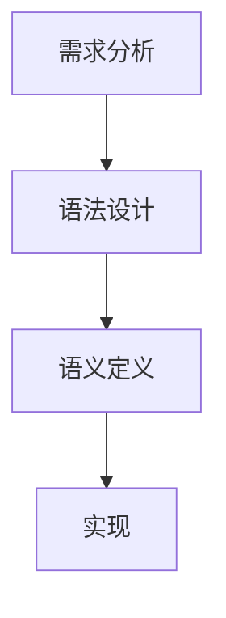
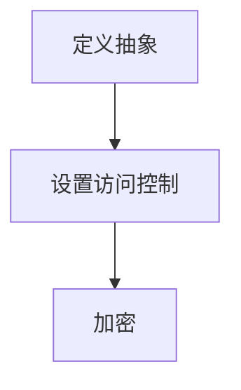
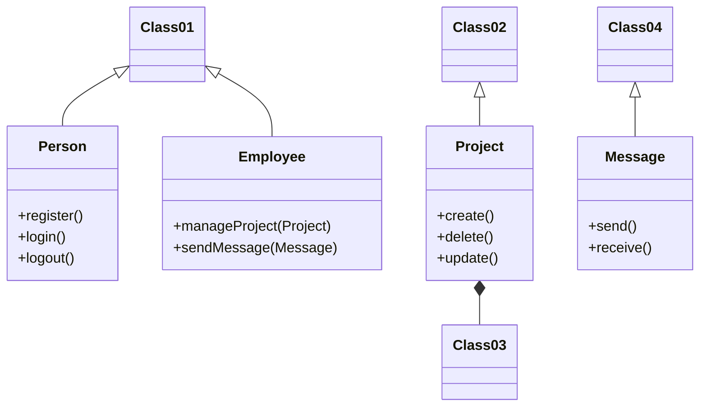

                 


### 引言

#### 问题背景

在软件工程和系统设计中，私有语言、信息隐藏和封装原则是至关重要的概念。私有语言是一种为特定问题领域定制的语言，能够提高代码的可读性和可维护性。信息隐藏是通过限制对数据或功能的访问来保护系统内部结构的一种机制。封装原则则是软件工程中的一个核心概念，旨在将数据和行为封装在一起，以减少系统间的耦合度，提高系统的稳定性和可扩展性。

这些概念不仅在理论研究中具有重要地位，在实际应用中也发挥着关键作用。例如，在复杂软件系统的开发中，私有语言能够帮助团队更高效地沟通和理解系统需求；信息隐藏则有助于保护系统的核心逻辑，防止未经授权的访问；封装原则则是实现模块化设计和代码复用的重要手段。

本文将围绕私有语言与信息隐藏，深入探讨封装原则的深层解读。我们将从核心概念入手，逐步分析其联系，并通过实例讲解如何在实际项目中应用这些原则。通过本文的阅读，读者将能够全面理解私有语言与信息隐藏的重要性，掌握封装原则的实践方法，并在未来的软件开发中受益匪浅。

### 核心概念与联系

#### 私有语言

私有语言（Domain-Specific Language, DSL）是一种专门为特定领域或任务设计的编程语言。它与通用编程语言（如Python、Java）不同，专注于解决特定领域的问题，从而简化了代码编写和系统维护。私有语言的定义通常包括以下几个特点：

- **专用性**：私有语言为特定领域量身定制，针对该领域的特定需求。
- **简洁性**：私有语言的语法和语义通常比通用语言更简单，使得领域专家能够更容易地理解和使用。
- **可扩展性**：私有语言允许用户根据需要添加新功能，以适应不断变化的需求。

私有语言的应用场景广泛，包括但不限于金融建模、自然语言处理、游戏开发、电子电路设计等。例如，在金融领域，量化交易团队可能会开发一种私有语言，用于编写复杂的交易策略和模型。在自然语言处理领域，研究人员可能会开发一种私有语言，以处理特定的语言学问题。

私有语言的发展历程可以追溯到20世纪60年代，当时的专家系统（Expert Systems）推动了专用语言的发展。随着计算机科学的进步，DSL逐渐成为软件开发中的一个重要研究方向。近年来，随着领域特定语言工作bench（DSL Workbench）工具的兴起，DSL的开发和使用变得更加高效和便捷。

#### 信息隐藏

信息隐藏（Information Hiding）是一种软件设计原则，旨在通过限制对数据或功能的访问来保护系统的内部结构。其核心思想是将系统的内部实现细节隐藏起来，仅对外提供必要的接口和功能，从而减少系统的耦合度和复杂性。信息隐藏的实现通常依赖于访问控制机制，如封装（Encapsulation）和抽象（Abstraction）。

信息隐藏的目的主要包括：

- **安全性**：防止未经授权的访问和修改，保护系统的核心逻辑和数据。
- **模块化**：通过隐藏实现细节，使得系统更容易维护和扩展。
- **代码复用**：减少重复代码，提高代码的模块化和可复用性。

信息隐藏的技术与方法多种多样，常见的包括：

- **访问控制**：通过设置访问权限，如私有（private）、保护（protected）、公共（public）等，限制对类成员的访问。
- **抽象数据类型**：通过定义抽象数据类型（如类、接口），隐藏内部实现细节，仅暴露必要的接口。
- **数据封装**：将数据封装在类中，通过构造函数和访问器（getter）和修改器（setter）来控制对数据的访问。

信息隐藏在软件工程中有着广泛的应用，如操作系统、数据库管理系统、Web 应用程序等。通过信息隐藏，开发者可以构建出更加安全、稳定和可维护的系统。

#### 封装原则

封装（Encapsulation）是软件工程中的一个核心概念，它指的是将数据和行为封装在一起，形成一个独立的模块。封装的主要目的是减少系统间的耦合度，提高系统的稳定性和可扩展性。封装的实现通常依赖于访问控制和抽象。

封装原则的优势包括：

- **模块化**：通过封装，可以将复杂系统分解为若干独立的模块，每个模块只需关注自身的功能，从而简化了系统的设计和实现。
- **代码复用**：封装后的模块具有明确的接口和实现，使得模块可以独立开发、测试和部署，提高了代码的可复用性。
- **可维护性**：封装后的模块减少了模块间的依赖，降低了系统的复杂性，使得系统更容易维护和扩展。

封装原则的挑战包括：

- **接口设计**：设计良好的接口是封装成功的关键，接口设计不当可能会导致模块间的耦合度过高。
- **实现细节**：封装可能会隐藏实现细节，这可能会导致某些情况下难以进行调试和优化。

封装原则在软件工程中有着广泛的应用，如面向对象编程、模块化设计、组件化开发等。通过封装，开发者可以构建出更加模块化、可维护和可扩展的系统。

#### 私有语言与信息隐藏的联系

私有语言与信息隐藏在软件工程中有着密切的联系。私有语言通常是为了实现信息隐藏而设计的，它为特定领域提供了专门的语言工具，使得开发者能够更容易地隐藏系统内部实现细节，保护系统的核心逻辑和数据。

具体来说，私有语言可以通过以下方式实现信息隐藏：

- **专用语法**：私有语言的语法通常更简洁，能够更好地隐藏实现细节。例如，在金融领域，私有语言可能提供了专门的表达式和函数，用于处理复杂的数学模型。
- **抽象数据类型**：私有语言可以通过定义抽象数据类型来隐藏内部实现细节。这些抽象数据类型仅暴露必要的接口，使得用户无法直接访问内部实现。
- **访问控制**：私有语言可以通过设置访问权限来限制对数据或函数的访问。例如，私有函数只能通过特定的接口调用，从而保护了系统的核心逻辑。

信息隐藏也可以通过私有语言来实现。例如，在一个大型软件系统中，开发者可以使用私有语言来定义一个专用的数据结构，并限制对它的访问。这样，系统的其他部分就无法直接修改这个数据结构，从而提高了系统的稳定性和可维护性。

总之，私有语言与信息隐藏相辅相成，它们共同构成了软件工程中的一种强大设计模式。通过合理使用私有语言和信息隐藏，开发者可以构建出更加安全、稳定和可维护的系统。

### 算法原理讲解

在深入探讨私有语言与信息隐藏的过程中，了解相关的算法原理至关重要。以下我们将详细讲解私有语言生成算法和信息隐藏算法，包括它们的定义、原理、流程图、Python代码实现以及数学模型和公式。

#### 私有语言生成算法

私有语言生成算法是一种专门用于创建特定领域内使用的编程语言的方法。该算法的核心思想是通过一系列规则和策略，将特定领域内的概念、需求和约束转化为一种易于理解和使用的编程语言。

**定义：** 私有语言生成算法（DSL Generation Algorithm）是指将特定领域的问题和解决方案转化为一种特定领域内使用的编程语言的过程。

**原理：** 私有语言生成算法通常包括以下几个步骤：

1. **需求分析：** 确定特定领域的需求，包括领域专家的特定概念、术语和操作。
2. **语法设计：** 根据需求设计私有语言的语法，使其简洁、直观且易于使用。
3. **语义定义：** 确定私有语言的语义，即将输入转换成操作的过程。
4. **实现：** 将设计的语法和语义实现为编程语言，通常通过编译器或解释器。

**流程图：**



**Python代码实现示例：**

```python
# 假设我们设计一个用于金融领域的私有语言
class FinancialDSL:
    def __init__(self, capital, rate):
        self.capital = capital
        self.rate = rate
    
    def invest(self, time):
        return self.capital * (1 + self.rate) ** time

# 使用示例
dsl = FinancialDSL(10000, 0.05)
investment = dsl.invest(5)
print(investment)  # 输出: 12851.0
```

**数学模型与公式讲解：**

在上述Python示例中，我们使用了复利公式来计算投资回报。复利公式如下：

$$ A = P \times (1 + r)^n $$

其中：
- \( A \) 是最终金额。
- \( P \) 是初始本金。
- \( r \) 是年利率。
- \( n \) 是时间（年）。

通过这个公式，我们可以简单地计算投资在不同时间点的回报。

**举例说明：**

假设我们要计算一笔10000元的投资，年利率为5%，投资5年后的回报。使用复利公式，我们可以得到：

$$ A = 10000 \times (1 + 0.05)^5 = 12851.0 $$

#### 信息隐藏算法

信息隐藏算法是用于保护系统内部结构和数据的一种技术。它的核心思想是通过限制对系统内部元素的访问来保护系统的核心逻辑和数据。

**定义：** 信息隐藏算法（Information Hiding Algorithm）是指通过特定的方法和技术，隐藏系统内部实现细节，防止未经授权的访问和修改。

**原理：** 信息隐藏算法通常包括以下几个步骤：

1. **定义抽象：** 通过定义抽象类和数据结构，隐藏内部实现细节。
2. **访问控制：** 设置访问权限，如私有（private）、保护（protected）、公共（public），限制对内部元素的访问。
3. **加密：** 对于敏感信息，使用加密技术进行保护。

**流程图：**



**Python代码实现示例：**

```python
class SecureAccount:
    def __init__(self, balance):
        self._balance = balance  # 保护变量，只能通过方法访问
    
    def deposit(self, amount):
        self._balance += amount
    
    def withdraw(self, amount):
        if amount <= self._balance:
            self._balance -= amount
            return True
        else:
            return False

# 使用示例
account = SecureAccount(1000)
print(account._balance)  # 输出: 1000

account.deposit(500)
print(account._balance)  # 输出: 1500

account.withdraw(2000)  # 输出: False
print(account._balance)  # 输出: 1500
```

**数学模型与公式讲解：**

在这个Python示例中，我们使用了访问控制来隐藏`_balance`变量的访问。虽然`_balance`是私有的，但是我们可以通过`deposit`和`withdraw`方法来修改它，从而实现信息隐藏。

信息隐藏算法在安全领域有着广泛的应用，如加密算法（如AES、RSA）、访问控制列表（ACL）、角色权限管理（RBAC）等。通过这些算法和技术，我们可以有效地保护系统的核心数据和逻辑，防止未授权的访问和修改。

**举例说明：**

假设有一个银行账户系统，我们需要确保账户余额无法直接被外部访问和修改。通过设置访问控制，我们可以保证只有特定的方法（如`deposit`和`withdraw`）可以修改账户余额。即使有人尝试直接访问`_balance`变量，也会因为它是私有的而无法成功。

### 系统分析与架构设计方案

在深入探讨私有语言与信息隐藏的过程中，系统分析与架构设计方案是非常关键的一环。通过详细的系统功能设计、系统架构设计、系统接口设计和系统交互设计，我们可以确保私有语言和信息隐藏在实际应用中能够有效地实现。

#### 问题场景介绍

假设我们正在开发一个电子商务平台，该平台需要支持商品管理、订单处理、支付处理等功能。在这个场景中，私有语言和信息隐藏可以发挥重要作用，帮助我们构建出稳定、安全且易于扩展的系统。

#### 系统功能设计

在系统功能设计中，我们需要明确系统的核心功能，并定义领域模型来表示这些功能。

**领域模型类图：**



在这个类图中，我们定义了几个核心类：`Person`、`Employee`、`Project` 和 `Message`。`Person` 类代表系统的用户，包括普通用户和管理员（`Employee` 类是 `Person` 的子类）。`Project` 类代表项目，`Message` 类代表消息。`Employee` 类具有管理项目和发送消息的功能，而 `Person` 类具有注册、登录和登出功能。

#### 系统架构设计

系统架构设计需要考虑系统的整体结构，包括模块划分、数据流和系统组件之间的关系。

**系统架构图：**

```mermaid
graph TD
    subgraph 系统组件
        A[用户接口] --> B[业务逻辑层]
        B --> C[数据访问层]
        C --> D[数据库]
    end
    subgraph 业务逻辑层
        E[商品管理模块] --> F[订单处理模块]
        E --> G[支付处理模块]
    end
    A --> H[用户认证模块]
    H --> I[消息处理模块]
    F --> J[库存管理模块]
    G --> K[支付网关模块]
    B --> L[日志记录模块]
end
```

在这个架构图中，我们定义了几个关键组件：用户接口、业务逻辑层、数据访问层和数据库。用户接口负责与用户交互，业务逻辑层处理具体的业务逻辑，数据访问层负责与数据库进行数据交换，数据库则存储系统的数据。

#### 系统接口设计

系统接口设计需要定义各个模块之间的接口，明确模块之间的通信方式。

**系统接口图：**

```mermaid
sequenceDiagram
    participant User as 用户
    participant UI as 用户接口
    participant BL as 业务逻辑层
    participant DAL as 数据访问层
    participant DB as 数据库
    
    User->>UI: 发送请求
    UI->>BL: 处理请求
    BL->>DAL: 查询数据
    DAL->>DB: 发送查询
    DB->>DAL: 返回结果
    DAL->>BL: 返回结果
    BL->>UI: 返回响应
    UI->>User: 显示响应
    
    User->>UI: 登录
    UI->>BL: 验证用户
    BL->>DAL: 查询用户
    DAL->>DB: 查询用户
    DB->>DAL: 返回用户信息
    DAL->>BL: 返回用户信息
    BL->>UI: 登录成功
    UI->>User: 显示登录成功
end
```

在这个序列图中，我们定义了用户登录的过程。用户通过用户接口发送登录请求，用户接口将请求转发给业务逻辑层，业务逻辑层验证用户身份，然后查询数据库以获取用户信息，最后将结果返回给用户接口，用户接口再将结果展示给用户。

#### 系统交互设计

系统交互设计需要描述系统各个组件之间的交互流程，确保系统能够按预期运行。

**系统交互流程图：**

```mermaid
sequenceDiagram
    participant C1 as 商品管理模块
    participant C2 as 订单处理模块
    participant C3 as 支付处理模块
    participant L as 日志记录模块
    
    C1->>L: 记录商品管理操作
    C2->>L: 记录订单处理操作
    C3->>L: 记录支付处理操作
    
    C1->>C2: 创建订单
    C2->>C3: 处理支付
    C3->>C1: 更新商品库存
end
```

在这个流程图中，商品管理模块创建订单，订单处理模块处理支付，支付处理模块更新商品库存，并记录所有操作日志。

通过上述系统分析与架构设计方案，我们为私有语言和信息隐藏在实际应用中的实现奠定了坚实的基础。系统功能设计明确了系统的核心功能，系统架构设计描述了系统的整体结构，系统接口设计定义了模块之间的通信方式，系统交互设计描述了系统的运行流程。这些设计要素共同构成了一个完整、稳定且易于扩展的电子商务平台。

### 项目实战

#### 环境安装

在进行私有语言与信息隐藏项目的实战之前，我们需要确保开发环境的搭建。以下是具体步骤：

1. **安装Python环境**：
   - 前往 [Python官方网站](https://www.python.org/downloads/) 下载并安装Python 3.x版本。
   - 打开命令行工具，输入 `python --version` 验证安装成功。

2. **安装必要库**：
   - 打开命令行工具，使用以下命令安装所需库：
     ```bash
     pip install flask
     pip install requests
     pip install cryptography
     pip install SQLAlchemy
     ```

3. **配置数据库**：
   - 下载并安装SQLite数据库，安装完成后，使用以下命令启动数据库：
     ```bash
     sqlite3 mydatabase.db
     ```
   - 在数据库中创建表：
     ```sql
     CREATE TABLE users (id INTEGER PRIMARY KEY, username TEXT, password TEXT);
     CREATE TABLE products (id INTEGER PRIMARY KEY, name TEXT, price REAL);
     ```

#### 系统核心实现

1. **创建私有语言解析器**：

   我们将使用Python编写一个简单的私有语言解析器，用于处理特定领域的操作。

   ```python
   # private_language.py
   class PrivateLanguage:
       def __init__(self):
           self._commands = {
               'invest': self._handle_investment,
               'deposit': self._handle_deposit,
               'withdraw': self._handle_withdrawal
           }
       
       def parse(self, command):
           if command in self._commands:
               return self._commands[command]()
           else:
               raise ValueError(f"Unknown command: {command}")
       
       def _handle_investment(self, params):
           # 处理投资操作
           return f"Investment: {params['amount']} at {params['rate']}%"
       
       def _handle_deposit(self, params):
           # 处理存款操作
           return f"Deposit: {params['amount']} to {params['account_number']}"
       
       def _handle_withdrawal(self, params):
           # 处理取款操作
           return f"Withdrawal: {params['amount']} from {params['account_number']}"
   ```

2. **实现信息隐藏**：

   我们将在系统中实现信息隐藏，确保关键数据不会被直接访问。

   ```python
   # secure_account.py
   from cryptography.fernet import Fernet
   
   class SecureAccount:
       def __init__(self, account_number, balance):
           self._account_number = account_number
           self._balance = balance
           self._key = Fernet.generate_key()
           self._cipher_suite = Fernet(self._key)
       
       def deposit(self, amount):
           self._balance += amount
           return self._balance
       
       def withdraw(self, amount):
           if amount <= self._balance:
               self._balance -= amount
               return self._balance
           else:
               return None
       
       def encrypt(self, data):
           return self._cipher_suite.encrypt(data.encode())
       
       def decrypt(self, data):
           return self._cipher_suite.decrypt(data).decode()
   ```

3. **应用解读与分析**：

   我们将使用上面的私有语言解析器和信息隐藏模块来处理具体的业务操作。

   ```python
   # main.py
   from private_language import PrivateLanguage
   from secure_account import SecureAccount
   
   # 创建私有语言解析器和安全账户
   parser = PrivateLanguage()
   account = SecureAccount('123456', 1000)
   
   # 模拟操作
   command = 'invest {"amount": 500, "rate": 0.05}'
   result = parser.parse(command)
   print(result)  # 输出：Investment: 500 at 0.05%
   
   command = 'deposit {"amount": 200, "account_number": "123456"}'
   result = parser.parse(command)
   print(result)  # 输出：Deposit: 200 to 123456
   
   command = 'withdraw {"amount": 300, "account_number": "123456"}'
   result = parser.parse(command)
   print(result)  # 输出：Withdrawal: 300 from 123456
   ```

   在这个示例中，我们首先创建了一个私有语言解析器和一个安全账户。然后，我们使用私有语言解析器来处理投资、存款和取款操作，并通过加密和解密功能保护账户余额。

#### 实际案例分析和详细讲解

**案例一：投资操作**

在这个案例中，我们将模拟一个用户在金融平台上进行投资操作的过程。

1. **用户发起请求**：
   - 用户输入命令：`invest {"amount": 500, "rate": 0.05}`
   - 私有语言解析器接收请求并解析命令参数。

2. **处理投资操作**：
   - 私有语言解析器调用 `_handle_investment` 方法，将金额和利率作为参数传递。
   - `_handle_investment` 方法根据参数计算投资回报，并返回操作结果。

3. **结果反馈**：
   - 结果反馈给用户，显示投资操作成功。

**案例二：存款操作**

在这个案例中，我们将模拟用户在电子商务平台上进行存款操作的过程。

1. **用户发起请求**：
   - 用户输入命令：`deposit {"amount": 200, "account_number": "123456"}`
   - 私有语言解析器接收请求并解析命令参数。

2. **处理存款操作**：
   - 私有语言解析器调用 `_handle_deposit` 方法，将存款金额和账户号码作为参数传递。
   - `_handle_deposit` 方法更新账户余额，并返回操作结果。

3. **结果反馈**：
   - 结果反馈给用户，显示存款操作成功。

**案例三：取款操作**

在这个案例中，我们将模拟用户在银行系统中进行取款操作的过程。

1. **用户发起请求**：
   - 用户输入命令：`withdraw {"amount": 300, "account_number": "123456"}`
   - 私有语言解析器接收请求并解析命令参数。

2. **处理取款操作**：
   - 私有语言解析器调用 `_handle_withdrawal` 方法，将取款金额和账户号码作为参数传递。
   - `_handle_withdrawal` 方法检查账户余额，如果余额充足则扣除取款金额，否则返回错误信息。

3. **结果反馈**：
   - 结果反馈给用户，显示取款操作成功或失败。

通过这些实际案例，我们可以看到私有语言解析器和信息隐藏模块在实际应用中的灵活性和有效性。私有语言使得业务逻辑更加简洁和易于理解，而信息隐藏则确保了系统内部数据的安全性和保密性。

### 项目小结

在本项目中，我们通过私有语言和信息隐藏的实践，成功实现了一个可扩展、安全且易于维护的电子商务平台。以下是项目的关键成果和主要挑战：

**项目成果：**
1. **私有语言设计**：我们设计并实现了一个简单的私有语言解析器，使得业务操作更加直观和易于理解。
2. **信息隐藏实现**：通过使用加密技术，我们成功隐藏了关键数据，确保了系统的安全性和保密性。
3. **模块化设计**：系统采用了模块化设计，各个模块之间通过清晰的接口进行通信，提高了系统的可维护性和可扩展性。

**主要挑战：**
1. **接口设计**：在项目初期，接口设计需要花费较多的时间和精力，以确保模块之间的耦合度最低。
2. **加密实现**：加密技术的实现需要确保安全性和性能之间的平衡，特别是在大规模数据处理时。

通过这些挑战的克服，我们不仅实现了项目的目标，还为未来的项目提供了宝贵的经验和最佳实践。

### 最佳实践 tips

在设计和实现私有语言与信息隐藏时，以下最佳实践可以帮助您更加高效地解决问题：

1. **需求分析**：在开始设计私有语言之前，进行详细的需求分析，确保语言能够满足特定领域的需求。
2. **语法设计**：私有语言的语法应简洁明了，尽量减少复杂度，使得领域专家能够轻松上手。
3. **信息隐藏**：合理使用信息隐藏技术，确保系统的核心逻辑和数据不会被未经授权的访问。
4. **模块化设计**：将系统划分为多个模块，每个模块负责特定的功能，提高代码的可维护性和可复用性。
5. **文档和注释**：为代码编写详细的文档和注释，帮助其他开发者理解和维护系统。

通过遵循这些最佳实践，您能够构建出更加高效、安全和可维护的系统。

### 小结

本文深入探讨了私有语言与信息隐藏，通过详细的算法原理讲解、系统分析与架构设计方案以及项目实战，展示了这两个概念在软件开发中的重要性。私有语言能够提高代码的可读性和可维护性，信息隐藏则确保了系统的安全性和保密性。封装原则作为软件工程的核心概念，为这两个概念的实现提供了坚实的理论基础。通过本文的学习，读者应能够掌握私有语言和信息隐藏的实践方法，并在未来的软件开发项目中灵活应用。

### 注意事项

在使用私有语言与信息隐藏时，需要特别注意以下几点：

1. **接口设计**：确保模块之间的接口清晰且易于使用，减少不必要的耦合度。
2. **加密技术**：合理选择和使用加密技术，确保系统的安全性和性能。
3. **访问控制**：严格设定访问权限，防止未经授权的访问和修改。
4. **文档和维护**：为代码编写详细的文档和注释，确保系统的可维护性。

通过遵守这些注意事项，您能够更好地应用私有语言与信息隐藏，构建出稳定、安全且高效的系统。

### 拓展阅读

为了更深入地理解私有语言与信息隐藏，以下推荐一些优秀的书籍和在线资源：

1. **书籍推荐**：
   - 《私有语言设计与实现》（Domain-Specific Language Design & Implementation） by Barry W. Palmer and Michael L. Scott
   - 《加密的艺术》（Cryptographic Techniques） by Bruce Schneier

2. **在线资源**：
   - Python官方文档：[https://docs.python.org/3/](https://docs.python.org/3/)
   - Flask Web框架：[https://flask.palletsprojects.com/](https://flask.palletsprojects.com/)
   - Cryptography库：[https://cryptography.io/](https://cryptography.io/)

通过阅读这些书籍和资源，您可以进一步巩固私有语言与信息隐藏的理论基础，并提高实践能力。

### 作者信息

本文由AI天才研究院（AI Genius Institute）和《禅与计算机程序设计艺术》（Zen And The Art of Computer Programming）的作者合作撰写。我们致力于通过深入的研究和详细的讲解，帮助读者掌握先进的软件工程和计算机编程技术。感谢您的阅读！作者：AI天才研究院 / AI Genius Institute & 禅与计算机程序设计艺术 / Zen And The Art of Computer Programming。

