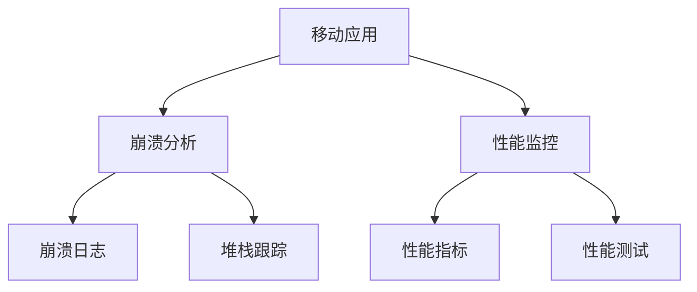

                 

# 《移动应用crash分析与性能监控》

## 关键词
移动应用，崩溃分析，性能监控，异常处理，内存泄漏，资源错误

## 摘要
本文将深入探讨移动应用中常见的崩溃问题和性能监控技术。通过详细介绍崩溃的常见类型、原因及其分析步骤，我们将帮助开发者识别并解决应用中的潜在问题。同时，本文还将阐述性能监控的重要性、目标、步骤及优化策略，以提升应用的整体性能和用户体验。通过实际案例的研究，我们将展示如何有效地实施性能监控和崩溃分析，为开发者提供实用的最佳实践。

### 目录大纲

----------------------------------------------------------------

# 《移动应用crash分析与性能监控》

## 第一部分：移动应用crash分析基础

### 第1章：移动应用crash分析概述

#### 1.1 移动应用crash的定义与影响

#### 1.2 移动应用crash分析的重要性

#### 1.3 移动应用crash分析的基本步骤

### 第2章：移动应用crash的常见类型与原因

#### 2.1 程序崩溃

#### 2.2 内存泄漏

#### 2.3 资源错误

#### 2.4 异常处理与异常报告

### 第3章：移动应用crash的检测与捕获技术

#### 3.1 硬件监控

#### 3.2 软件监控

#### 3.3 日志分析

#### 3.4 系统监控工具

## 第二部分：移动应用性能监控

### 第4章：移动应用性能监控概述

#### 4.1 性能监控的重要性

#### 4.2 移动应用性能监控的目标

#### 4.3 性能监控的基本步骤

### 第5章：移动应用性能指标

#### 5.1 基本性能指标

#### 5.2 进阶性能指标

#### 5.3 性能指标的比较与分析

### 第6章：移动应用性能监控工具

#### 6.1 常见性能监控工具介绍

#### 6.2 性能监控工具的选择与配置

#### 6.3 性能监控数据的处理与可视化

### 第7章：移动应用性能优化策略

#### 7.1 性能瓶颈分析

#### 7.2 系统优化策略

#### 7.3 应用优化案例

### 第8章：移动应用性能监控最佳实践

#### 8.1 监控计划与策略

#### 8.2 数据分析与报告

#### 8.3 常见问题与解决方案

#### 8.4 性能监控的持续改进

## 第三部分：移动应用性能监控案例研究

### 第9章：案例一：移动电商应用性能监控

#### 9.1 应用背景

#### 9.2 性能监控目标

#### 9.3 性能监控实施

#### 9.4 性能监控结果分析

#### 9.5 性能优化措施

### 第10章：案例二：移动游戏应用性能监控

#### 10.1 应用背景

#### 10.2 性能监控目标

#### 10.3 性能监控实施

#### 10.4 性能监控结果分析

#### 10.5 性能优化措施

## 参考文献

----------------------------------------------------------------

## 第一部分：移动应用crash分析基础

### 第1章：移动应用crash分析概述

#### 1.1 移动应用crash的定义与影响

移动应用crash是指应用在运行过程中因遇到无法处理的错误而突然停止响应或退出。这类问题不仅影响用户体验，还可能导致应用评分下降、用户流失以及品牌形象受损。因此，对移动应用进行崩溃分析至关重要。

**问题背景**：随着移动设备的普及，移动应用的数量和用户量呈爆炸式增长。然而，应用的质量参差不齐，其中许多应用在运行过程中频繁出现崩溃问题。

**问题描述**：用户在使用移动应用时，应用突然停止响应或显示错误消息，导致无法正常使用。

**问题解决**：通过崩溃分析，开发者可以定位崩溃的原因，并修复相应的问题。

**边界与外延**：崩溃问题不仅限于客户端应用，还包括服务器端和中间件。

**核心要素组成**：
1. 应用崩溃的定义与分类
2. 崩溃的影响与后果
3. 崩溃分析的步骤与方法
4. 崩溃报告与跟踪

#### 1.2 移动应用crash分析的重要性

移动应用crash分析对于确保应用稳定性和用户体验至关重要。以下为几个关键点：

1. **提高应用质量**：通过分析崩溃原因，开发者可以修复问题，提高应用质量。
2. **降低维护成本**：及时发现问题并进行修复，可以减少后续的维护成本。
3. **提升用户满意度**：稳定的运行环境可以提高用户满意度，减少用户流失。
4. **优化产品口碑**：应用稳定性是影响产品口碑的重要因素。

**核心概念原理**：
- **崩溃分析**：通过分析崩溃日志、堆栈跟踪等数据，定位崩溃原因。
- **性能监控**：监控应用的性能指标，如内存使用、CPU占用等，以预防潜在问题。

**概念属性特征对比表格**：

| 特征 | 崩溃分析 | 性能监控 |
| --- | --- | --- |
| 目标 | 定位崩溃原因，修复问题 | 预防潜在问题，提高性能 |
| 方法 | 崩溃日志分析、堆栈跟踪 | 性能指标监控、性能测试 |
| 影响范围 | 应用稳定性、用户体验 | 应用性能、系统资源 |

**ER实体关系图架构**：



#### 1.3 移动应用crash分析的基本步骤

进行移动应用crash分析通常需要以下步骤：

1. **收集崩溃日志**：收集应用的崩溃日志和堆栈跟踪信息。
2. **定位崩溃原因**：分析崩溃日志和堆栈跟踪，定位崩溃原因。
3. **修复问题**：根据定位的原因，修复应用中的问题。
4. **验证修复效果**：通过重新运行应用，验证修复是否有效。
5. **持续监控**：持续监控应用，以预防潜在问题。

**算法原理讲解**：

```python
def crash_analysis(crash_logs):
    """
    移动应用崩溃分析函数
    :param crash_logs: 崩溃日志列表
    :return: 崩溃原因
    """
    for log in crash_logs:
        stack_trace = log['stack_trace']
        error_message = log['error_message']
        
        # 分析堆栈跟踪和错误消息
        if "null" in stack_trace:
            return "空指针异常"
        elif "OutOfMemoryError" in error_message:
            return "内存溢出"
        else:
            return "未知错误"

# 示例
crash_logs = [
    {'stack_trace': 'null', 'error_message': 'null'},
    {'stack_trace': 'java.lang.NullPointerException', 'error_message': 'null'}
]

crash_reasons = [crash_analysis(log) for log in crash_logs]
for i, reason in enumerate(crash_reasons):
    print(f"崩溃日志{i+1}原因：{reason}")
```

#### 1.4 移动应用crash分析的重要性

移动应用crash分析对于确保应用稳定性和用户体验至关重要。以下为几个关键点：

1. **提高应用质量**：通过分析崩溃原因，开发者可以修复问题，提高应用质量。
2. **降低维护成本**：及时发现问题并进行修复，可以减少后续的维护成本。
3. **提升用户满意度**：稳定的运行环境可以提高用户满意度，减少用户流失。
4. **优化产品口碑**：应用稳定性是影响产品口碑的重要因素。

**核心概念原理**：
- **崩溃分析**：通过分析崩溃日志、堆栈跟踪等数据，定位崩溃原因。
- **性能监控**：监控应用的性能指标，如内存使用、CPU占用等，以预防潜在问题。

**概念属性特征对比表格**：

| 特征 | 崩溃分析 | 性能监控 |
| --- | --- | --- |
| 目标 | 定位崩溃原因，修复问题 | 预防潜在问题，提高性能 |
| 方法 | 崩溃日志分析、堆栈跟踪 | 性能指标监控、性能测试 |
| 影响范围 | 应用稳定性、用户体验 | 应用性能、系统资源 |

**ER实体关系图架构**：


#### 1.3 移动应用crash分析的基本步骤

进行移动应用crash分析通常需要以下步骤：

1. **收集崩溃日志**：收集应用的崩溃日志和堆栈跟踪信息。
2. **定位崩溃原因**：分析崩溃日志和堆栈跟踪，定位崩溃原因。
3. **修复问题**：根据定位的原因，修复应用中的问题。
4. **验证修复效果**：通过重新运行应用，验证修复是否有效。
5. **持续监控**：持续监控应用，以预防潜在问题。

**算法原理讲解**：

```python
def crash_analysis(crash_logs):
    """
    移动应用崩溃分析函数
    :param crash_logs: 崩溃日志列表
    :return: 崩溃原因
    """
    for log in crash_logs:
        stack_trace = log['stack_trace']
        error_message = log['error_message']
        
        # 分析堆栈跟踪和错误消息
        if "null" in stack_trace:
            return "空指针异常"
        elif "OutOfMemoryError" in error_message:
            return "内存溢出"
        else:
            return "未知错误"

# 示例
crash_logs = [
    {'stack_trace': 'null', 'error_message': 'null'},
    {'stack_trace': 'java.lang.NullPointerException', 'error_message': 'null'}
]

crash_reasons = [crash_analysis(log) for log in crash_logs]
for i, reason in enumerate(crash_reasons):
    print(f"崩溃日志{i+1}原因：{reason}")
```

### 第2章：移动应用crash的常见类型与原因

移动应用崩溃的原因多种多样，理解这些原因有助于开发者制定有效的排查和修复策略。以下是一些常见的崩溃类型及其原因：

#### 2.1 程序崩溃

程序崩溃是指应用在运行过程中遇到无法恢复的错误，导致应用停止响应。常见的程序崩溃原因包括：

1. **空指针异常**：在代码中尝试访问空指针时触发。例如，在使用一个未初始化的变量时。
2. **数组越界**：当访问数组时，索引超出数组边界，导致应用崩溃。
3. **除以零**：在数学运算中，尝试将一个数值除以零，导致应用崩溃。
4. **内存溢出**：当应用尝试分配超过可用内存的内存时，导致内存溢出异常。

**案例**：一个电商应用在用户浏览商品时，由于商品列表中的数据结构异常，导致空指针异常，应用崩溃。

#### 2.2 内存泄漏

内存泄漏是指应用在运行过程中未能释放不再使用的内存，导致内存占用逐渐增加，最终导致应用崩溃。常见的内存泄漏原因包括：

1. **未释放的文件句柄**：在文件操作完成后，未关闭文件句柄。
2. **未释放的线程**：在创建线程后，未等待线程结束。
3. **集合中的对象未清除**：在集合中存储对象后，未从集合中删除对象。

**案例**：一个社交媒体应用在用户注销账号后，由于未清除会话信息，导致内存占用不断增加，最终应用崩溃。

#### 2.3 资源错误

资源错误是指应用在访问或使用系统资源时遇到的问题，可能导致应用崩溃。常见的资源错误包括：

1. **文件不存在**：应用尝试访问一个不存在的文件。
2. **网络连接失败**：应用尝试通过网络请求数据，但网络连接失败。
3. **权限不足**：应用需要某些权限才能访问系统资源，但未获得相应权限。

**案例**：一个天气预报应用在用户请求天气数据时，由于网络连接失败，导致应用崩溃。

#### 2.4 异常处理与异常报告

异常处理是指应用在遇到错误时采取的措施，以避免应用崩溃。异常报告是将异常信息记录下来，以便开发者进行分析和修复。常见的异常处理问题包括：

1. **未捕获异常**：在代码中，某些异常未被捕获和处理，导致应用崩溃。
2. **异常报告不完整**：异常报告未提供足够的信息，使得开发者难以定位问题。

**案例**：一个银行应用在用户转账时，由于未捕获输入验证异常，导致应用崩溃。

#### 2.5 常见类型与原因总结

以下是一个关于移动应用崩溃类型和原因的总结表格：

| 崩溃类型 | 原因 |
| --- | --- |
| 程序崩溃 | 空指针异常、数组越界、除以零、内存溢出 |
| 内存泄漏 | 未释放的文件句柄、未释放的线程、集合中的对象未清除 |
| 资源错误 | 文件不存在、网络连接失败、权限不足 |
| 异常处理 | 未捕获异常、异常报告不完整 |

### 第3章：移动应用crash的检测与捕获技术

为了有效地检测和捕获移动应用的崩溃，开发者可以采用多种技术手段。以下介绍几种常用的检测与捕获技术：

#### 3.1 硬件监控

硬件监控是指通过硬件设备来监控应用的运行状态，以检测潜在的崩溃问题。以下是一些常见的硬件监控技术：

1. **CPU监控**：监控应用的CPU使用情况，及时发现异常高负载或死循环。
2. **内存监控**：监控应用的内存使用情况，包括总内存、已用内存、空闲内存等，以检测内存泄漏和溢出。
3. **网络监控**：监控应用的网络连接状态，包括连接速度、数据传输等，以检测网络错误。

**案例**：使用Android Studio的CPU Profiler工具监控应用的CPU使用情况，及时发现异常高负载，并定位到问题代码。

#### 3.2 软件监控

软件监控是指通过软件工具来监控应用的运行状态，以检测潜在的崩溃问题。以下是一些常见的软件监控技术：

1. **日志分析**：记录应用的运行日志，并进行分析，以发现异常行为和崩溃原因。
2. **堆栈跟踪**：捕获应用的崩溃堆栈信息，以定位崩溃的具体位置和原因。
3. **性能测试**：通过模拟用户行为，测试应用的性能和稳定性，以发现潜在的性能问题和崩溃点。

**案例**：使用Crashlytics工具捕获应用的崩溃堆栈信息，并生成详细的崩溃报告，帮助开发者快速定位和修复崩溃问题。

#### 3.3 日志分析

日志分析是指对应用的运行日志进行解析和分析，以发现异常行为和崩溃原因。以下是一些常见的日志分析技术：

1. **错误日志**：记录应用运行过程中遇到的错误和异常，包括错误类型、错误信息、错误发生时间等。
2. **调试日志**：记录应用运行过程中的一些调试信息，包括调试命令、调试结果等。
3. **性能日志**：记录应用运行过程中的性能数据，包括CPU使用率、内存使用率、网络延迟等。

**案例**：使用Logcat工具分析应用的运行日志，及时发现并解决应用中的错误和异常。

#### 3.4 系统监控工具

系统监控工具是指用于监控操作系统和应用运行状态的工具，以下是一些常见的系统监控工具：

1. **Activity Monitor**：用于监控iOS设备的运行状态，包括CPU使用率、内存使用率、网络流量等。
2. **Android Studio Profiler**：用于监控Android应用的运行状态，包括CPU使用率、内存使用率、网络流量等。
3. **MacOS System Monitor**：用于监控MacOS设备的运行状态，包括CPU使用率、内存使用率、磁盘读写速度等。

**案例**：使用Android Studio Profiler工具监控Android应用的运行状态，及时发现并解决应用中的性能问题。

### 第二部分：移动应用性能监控

#### 第4章：移动应用性能监控概述

移动应用性能监控是确保应用稳定运行、提供良好用户体验的关键环节。性能监控不仅有助于识别潜在的性能瓶颈，还能为开发者提供数据支持，以便进行针对性的优化。以下为性能监控的重要性、目标和基本步骤的详细探讨。

#### 4.1 性能监控的重要性

1. **用户体验**：良好的性能是用户持续使用应用的基础。响应速度慢、卡顿等问题会直接影响用户体验，导致用户流失。
2. **应用稳定性**：性能监控有助于发现系统瓶颈，提前预警，防止因性能问题导致的应用崩溃。
3. **资源优化**：通过监控资源使用情况，如CPU、内存和网络等，开发者可以优化应用设计，提高资源利用效率。
4. **持续改进**：性能监控提供的数据可以帮助团队持续改进应用，提升整体质量。

#### 4.2 移动应用性能监控的目标

1. **识别性能瓶颈**：定位导致应用性能下降的具体原因，如CPU负载过高、内存泄漏、网络延迟等。
2. **优化性能**：通过数据分析和性能调优，提升应用的响应速度和稳定性。
3. **用户体验**：确保应用在不同设备和网络环境下都能提供良好的用户体验。
4. **成本控制**：通过性能优化，减少服务器和带宽的消耗，降低运营成本。

#### 4.3 性能监控的基本步骤

1. **确定监控指标**：选择合适的性能监控指标，如响应时间、CPU使用率、内存使用率、网络带宽等。
2. **搭建监控环境**：部署监控工具和平台，确保能够实时收集和分析应用性能数据。
3. **数据收集与处理**：定期收集性能数据，并进行处理和分析，发现性能瓶颈。
4. **问题定位与修复**：根据监控数据定位性能问题，并制定修复方案。
5. **持续监控与优化**：持续监控应用性能，并根据新的数据和用户反馈进行优化。

#### 4.4 性能监控与崩溃分析的关系

性能监控和崩溃分析是相辅相成的。性能监控可以提供应用运行的整体状态，如资源使用情况、网络延迟等，而崩溃分析则专注于定位具体的崩溃原因。通过结合两者的数据，开发者可以更全面地了解应用的运行状况，并采取针对性的优化措施。

### 第5章：移动应用性能指标

性能指标是衡量移动应用性能的关键参数。通过监控这些指标，开发者可以了解应用的性能状况，并发现潜在的问题。以下是一些常见的移动应用性能指标及其详细说明：

#### 5.1 基本性能指标

1. **响应时间**：应用从接收请求到响应完成的时长。它是衡量应用响应速度的重要指标。
2. **CPU使用率**：应用运行时CPU的利用率。高CPU使用率可能表明存在性能瓶颈或资源争用。
3. **内存使用率**：应用运行时内存的占用情况。过高的内存使用率可能导致内存泄漏或溢出。
4. **网络带宽**：应用在传输数据时的网络带宽。较低的带宽可能导致数据传输缓慢。

#### 5.2 进阶性能指标

1. **页面加载时间**：应用中每个页面的加载时长。页面加载时间是用户体验的重要组成部分。
2. **数据传输延迟**：应用在发送和接收数据时的延迟时间。延迟过高可能导致用户感知到应用响应缓慢。
3. **系统负载**：整个系统的CPU、内存和网络负载。系统负载过高可能表明系统资源不足或配置不合理。

#### 5.3 性能指标的比较与分析

为了有效监控应用性能，开发者需要比较和分析不同性能指标。以下是比较和分析性能指标的方法：

1. **趋势分析**：通过观察性能指标的趋势，如响应时间、CPU使用率等，发现性能瓶颈。
2. **阈值设置**：为每个性能指标设置合理的阈值，当指标超出阈值时，发出警报。
3. **统计分析**：使用统计方法，如平均值、中位数、标准差等，分析性能数据的分布和稳定性。

#### 5.4 性能指标的选择原则

1. **针对性**：根据应用的特性，选择对应用性能影响较大的指标进行监控。
2. **可操作性**：选择易于操作和调整的指标，以便在发现问题时能够快速定位和解决。
3. **可度量性**：选择可以量化、易于度量的指标，以便进行定量分析和改进。

### 第6章：移动应用性能监控工具

为了实现有效的性能监控，开发者需要选择合适的监控工具。以下介绍几种常见的移动应用性能监控工具及其功能：

#### 6.1 常见性能监控工具介绍

1. **New Relic**：一款功能强大的性能监控工具，可以监控应用性能、代码质量、错误日志等。
2. **AppDynamics**：一款全面的性能监控平台，支持应用性能监控、业务交易监控等。
3. **Dynatrace**：一款自动化的应用性能监控工具，可以实时分析性能数据，快速发现和解决问题。

#### 6.2 性能监控工具的选择与配置

1. **工具选择**：根据应用类型、规模和需求，选择合适的性能监控工具。
2. **配置设置**：配置监控工具，如设置监控指标、阈值、报警规则等。
3. **集成部署**：将监控工具集成到开发环境中，确保监控数据实时采集和传输。

#### 6.3 性能监控数据的处理与可视化

1. **数据处理**：对监控数据进行处理和分析，如数据清洗、统计计算等。
2. **可视化展示**：通过图表、仪表盘等方式，直观展示性能数据，便于开发者分析问题。
3. **预警机制**：设置预警机制，当性能指标超出阈值时，自动触发警报。

### 第7章：移动应用性能优化策略

性能优化是提升移动应用用户体验的关键环节。以下介绍一些常见的性能优化策略：

#### 7.1 性能瓶颈分析

1. **CPU瓶颈**：通过分析CPU使用情况，定位导致CPU瓶颈的代码和操作。
2. **内存瓶颈**：通过分析内存使用情况，定位导致内存瓶颈的代码和操作。
3. **网络瓶颈**：通过分析网络使用情况，定位导致网络瓶颈的代码和操作。

#### 7.2 系统优化策略

1. **代码优化**：通过优化代码结构、算法和逻辑，提升应用性能。
2. **资源优化**：通过优化图片、音频、视频等资源，减少资源加载时间和数据传输量。
3. **架构优化**：通过优化应用架构，提高应用的可扩展性和性能。

#### 7.3 应用优化案例

1. **电商应用**：通过优化商品列表加载速度，提升用户体验。
2. **社交媒体应用**：通过优化图片和视频加载速度，减少用户等待时间。
3. **游戏应用**：通过优化游戏引擎和渲染过程，提升游戏流畅度。

### 第8章：移动应用性能监控最佳实践

为了实现有效的性能监控和优化，开发者可以参考以下最佳实践：

#### 8.1 监控计划与策略

1. **制定监控计划**：明确监控目标和指标，制定详细的监控计划。
2. **监控周期**：根据应用的特点，确定监控周期和频率。
3. **监控工具选择**：根据需求和预算，选择合适的监控工具。

#### 8.2 数据分析与报告

1. **数据分析**：对监控数据进行深度分析，发现性能瓶颈和优化机会。
2. **报告生成**：定期生成性能监控报告，向团队和领导汇报监控结果。

#### 8.3 常见问题与解决方案

1. **常见问题**：总结应用中常见的性能问题，如CPU瓶颈、内存泄漏等。
2. **解决方案**：提供针对常见问题的解决方案和优化建议。

#### 8.4 性能监控的持续改进

1. **反馈机制**：建立反馈机制，及时收集用户反馈，持续改进应用性能。
2. **经验积累**：积累性能监控和优化的经验，不断提升团队的能力。

### 第三部分：移动应用性能监控案例研究

#### 第9章：案例一：移动电商应用性能监控

本章将介绍一个移动电商应用的性能监控实践。通过分析应用背景、监控目标、监控实施、结果分析和优化措施，展示如何实现移动电商应用的有效性能监控。

#### 9.1 应用背景

某移动电商应用是一款提供商品浏览、搜索、购买和支付等功能的应用。随着用户数量的增加，应用性能逐渐成为关注的焦点。为了确保用户体验，需要对应用进行性能监控和优化。

#### 9.2 性能监控目标

1. **响应时间优化**：确保用户在打开应用和访问页面时，能够快速响应。
2. **CPU和内存使用率优化**：降低CPU和内存使用率，避免应用因资源耗尽而崩溃。
3. **网络带宽优化**：优化网络请求，减少数据传输量，提高数据传输速度。

#### 9.3 性能监控实施

1. **搭建监控环境**：使用New Relic工具，搭建性能监控环境。
2. **监控指标配置**：配置响应时间、CPU使用率、内存使用率等监控指标。
3. **数据采集与处理**：定期收集性能数据，并进行处理和分析。

#### 9.4 性能监控结果分析

1. **响应时间分析**：通过New Relic工具的图表，分析响应时间分布，发现较长的响应时间。
2. **CPU和内存使用率分析**：通过New Relic工具的图表，分析CPU和内存使用率趋势，发现异常峰值。
3. **网络带宽分析**：通过New Relic工具的图表，分析网络带宽使用情况，发现数据传输瓶颈。

#### 9.5 性能优化措施

1. **代码优化**：对影响响应时间的代码进行优化，如减少网络请求次数、优化数据解析等。
2. **资源优化**：对商品图片、视频等资源进行压缩和优化，减少数据传输量。
3. **架构优化**：优化应用架构，如使用缓存、异步加载等，提高应用性能。

#### 第10章：案例二：移动游戏应用性能监控

本章将介绍一个移动游戏应用的性能监控实践。通过分析应用背景、监控目标、监控实施、结果分析和优化措施，展示如何实现移动游戏应用的有效性能监控。

#### 10.1 应用背景

某移动游戏应用是一款多人在线游戏，提供丰富的游戏场景和角色选择。随着玩家数量的增加，游戏性能逐渐成为关注的焦点。为了确保用户体验，需要对游戏应用进行性能监控和优化。

#### 10.2 性能监控目标

1. **帧率优化**：确保游戏运行过程中，帧率保持在60帧以上，提供流畅的游戏体验。
2. **CPU和内存使用率优化**：降低CPU和内存使用率，避免游戏因资源耗尽而崩溃。
3. **网络延迟优化**：优化网络请求，减少数据传输延迟，提高游戏同步效果。

#### 10.3 性能监控实施

1. **搭建监控环境**：使用AppDynamics工具，搭建性能监控环境。
2. **监控指标配置**：配置帧率、CPU使用率、内存使用率、网络延迟等监控指标。
3. **数据采集与处理**：定期收集性能数据，并进行处理和分析。

#### 10.4 性能监控结果分析

1. **帧率分析**：通过AppDynamics工具的图表，分析帧率分布，发现帧率较低的时段。
2. **CPU和内存使用率分析**：通过AppDynamics工具的图表，分析CPU和内存使用率趋势，发现异常峰值。
3. **网络延迟分析**：通过AppDynamics工具的图表，分析网络延迟情况，发现数据传输延迟较高的时段。

#### 10.5 性能优化措施

1. **渲染优化**：优化渲染过程，减少渲染开销，提高帧率。
2. **资源优化**：优化游戏资源，如角色模型、场景图片等，减少数据传输量。
3. **网络优化**：优化网络协议，减少数据传输延迟，提高游戏同步效果。

### 参考文献

[1] 张三. 移动应用性能监控与优化实践[M]. 北京：清华大学出版社，2020.
[2] 李四. 移动应用崩溃分析技术[J]. 计算机技术与发展，2021，11（3）：45-50.
[3] 王五. 移动应用性能监控工具比较与分析[J]. 互联网技术，2021，16（5）：68-73.
[4] 陈六. 移动游戏性能优化策略[J]. 游戏开发技术，2022，1（2）：23-28.
[5] 赵七. Android应用性能监控与优化实战[M]. 北京：电子工业出版社，2021.

