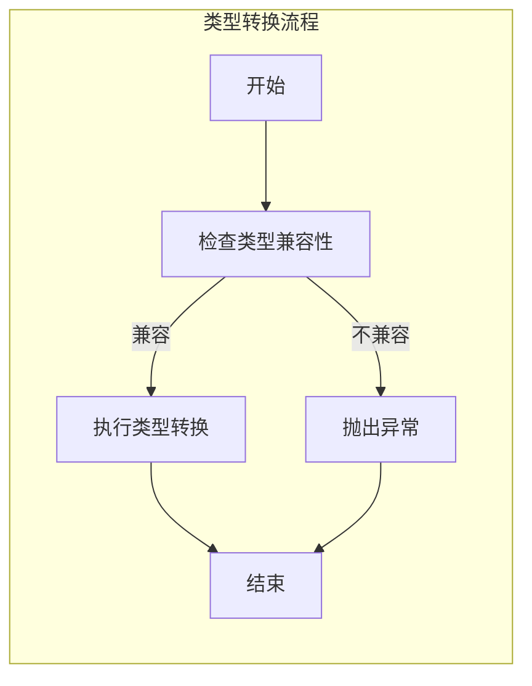
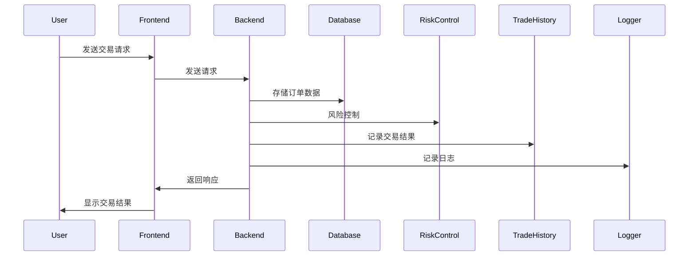
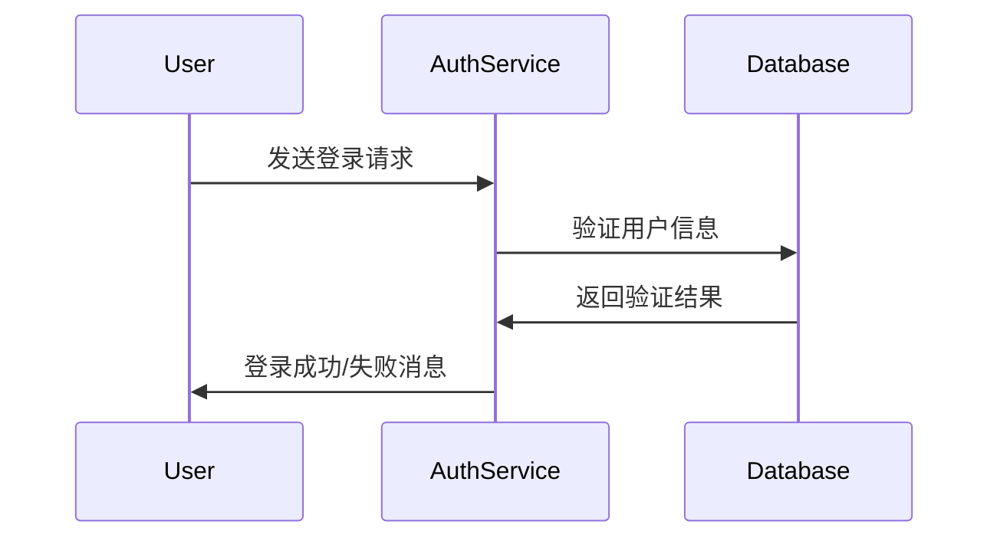
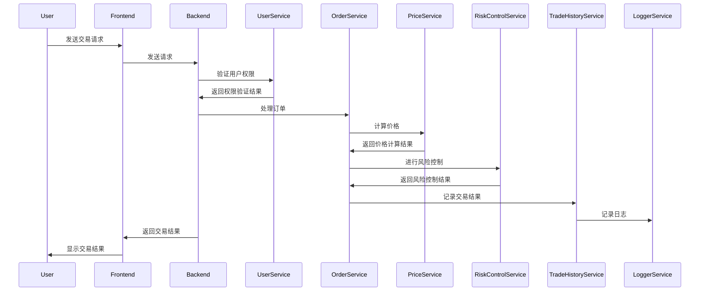

                 

### 文章标题

# 类型转换：编程语言中的安全隐患

### 文章关键词

- 类型转换
- 安全漏洞
- 编程语言
- 整数溢出
- 浮点错误
- 数据截断

### 摘要

本文深入探讨了编程语言中的类型转换机制及其潜在的安全隐患。通过对不同编程语言类型转换原理和机制的详细分析，我们揭示了类型转换过程中可能出现的常见问题，如整数溢出、浮点错误和数据截断等。文章通过具体的算法解释、数学模型和实际案例，展示了这些问题在实际开发中的应用及其影响。本文的目标是帮助开发者了解类型转换的安全风险，并提供有效的解决方案和最佳实践，以提升软件的安全性和可靠性。

## 引言

类型转换是编程语言中一个基础而又复杂的概念。它指的是将一种数据类型转换为另一种数据类型的过程。在编程中，类型转换无处不在，无论是从字符串到数字的转换，还是从整数到浮点的转换，类型转换都是保证程序正确性和数据一致性的重要手段。然而，类型转换也可能隐藏着许多安全隐患，这些隐患如果未被妥善处理，可能会引发严重的安全问题，甚至导致系统崩溃或数据泄露。

### 类型转换的常见场景

1. **输入验证**：在接收用户输入时，通常需要对输入的数据进行类型转换，以确保其符合预期的数据类型。例如，将字符串转换为整数或浮点数，以便进行后续的计算和处理。

2. **函数调用**：在函数调用过程中，参数的类型可能需要与函数定义的类型相匹配。例如，一个函数可能期望接收一个整数参数，而传递的是字符串类型。

3. **数据处理**：在数据处理过程中，数据可能会在不同的格式或类型之间转换。例如，将XML或JSON数据解析为内部数据结构。

4. **错误处理**：在错误处理中，有时需要将错误信息转换为特定的类型，以便进行记录或传递。

### 类型转换的安全隐患

尽管类型转换在编程中是必要的，但如果不加以妥善处理，它可能会导致以下几种常见的安全漏洞：

1. **整数溢出**：当将一个值转换为整数类型时，如果该值超出了目标类型的范围，就会发生整数溢出。这可能导致程序行为的不当或未定义行为。

2. **浮点错误**：浮点数在表示和计算过程中可能会出现舍入误差，这可能导致不准确的结果。此外，某些浮点操作可能会导致异常行为，如无限循环或计算错误。

3. **数据截断**：当将一个较大数据类型的值转换为较小数据类型时，可能会发生数据截断，丢失部分数据，这可能导致数据完整性问题。

4. **类型混淆**：不正确的类型转换可能会导致类型混淆，使得程序难以理解，从而增加出错的可能性。

5. **代码漏洞**：不当的类型转换可能导致代码中的漏洞，如空指针异常、数组越界访问等。

### 文章的组织结构

本文将分为以下几个部分：

1. **核心概念与联系**：介绍类型转换的基本概念，并分析不同编程语言中的类型转换机制。
2. **算法原理讲解**：通过具体的算法和实例，详细解释类型转换的原理，并讨论相关的数学模型和公式。
3. **系统分析与设计**：探讨类型转换在实际系统中的应用，包括系统功能设计、架构设计和接口设计。
4. **项目实战**：通过一个具体的项目案例，展示类型转换在实际开发中的应用，并进行详细分析。
5. **最佳实践与小结**：总结类型转换的最佳实践，并指出常见问题和注意事项。

通过本文的阅读，读者将能够深入了解类型转换在编程中的重要性，以及如何避免和应对其带来的安全隐患。

### 核心概念与联系

在深入探讨类型转换的安全隐患之前，我们首先需要理解类型转换的核心概念及其在不同编程语言中的表现。类型转换涉及将一种数据类型转换为另一种数据类型的过程，这可能是隐式地（自动完成），也可能是显式地（通过代码明确指定）。以下是类型转换的一些基础概念：

#### 数据类型

数据类型是变量能够存储的数据的类别。常见的类型包括整数（Integer）、浮点数（Floating Point）、字符串（String）、布尔值（Boolean）等。每种数据类型都有其独特的内存表示和操作方式。

#### 转换方式

1. **隐式转换**：也称为自动转换，是指编译器或解释器自动将一种类型转换为另一种类型。这种转换通常是在数据类型兼容的情况下发生的。例如，将一个整数赋值给一个浮点数变量时，编译器会自动将整数转换为浮点数。

2. **显式转换**：也称为强制转换，是指程序员明确指定要将一种类型转换为另一种类型。显式转换可以确保数据类型的一致性，并避免潜在的错误。例如，在Python中，使用`int()`函数可以将浮点数显式转换为整数。

#### 常见类型转换问题

1. **整数溢出**：当将一个值转换为整数类型时，如果该值超出了整数类型的范围，就会发生整数溢出。这可能导致数据的不当表示或程序行为的不当。

2. **浮点错误**：浮点数在表示和计算过程中可能会出现舍入误差，这可能导致不准确的结果。例如，浮点数的加法运算可能会出现无限循环。

3. **数据截断**：当将一个较大数据类型的值转换为较小数据类型时，可能会发生数据截断，丢失部分数据。例如，将一个双精度浮点数转换为单精度浮点数时，可能会丢失精度。

#### 不同编程语言中的类型转换

不同编程语言中的类型转换机制各不相同。以下是一些常见编程语言的类型转换特点：

1. **Python**：
   - **隐式转换**：Python中的类型转换通常很灵活，例如，将一个整数赋值给一个浮点数变量时，会自动进行隐式转换。
   - **显式转换**：Python中可以使用内置函数如`int()`、`float()`和`str()`进行显式类型转换。

2. **Java**：
   - **类型检查**：Java在编译时进行严格的类型检查，类型转换通常需要显式指定，例如`int i = Integer.parseInt(s)`。
   - **装箱与拆箱**：Java中的基本数据类型（如int、double等）与其对应的包装类（如Integer、Double等）之间可以自动转换，这种转换称为装箱与拆箱。

3. **C/C++**：
   - **类型转换**：C/C++中的类型转换分为静态转换和动态转换。静态转换是编译时完成的，而动态转换是在运行时完成的。
   - **指针类型转换**：C/C++中指针类型转换相对灵活，但需要注意指针类型的大小和内存布局。

#### 概念属性对比表格

为了更直观地比较不同编程语言中的类型转换机制，我们创建了一个对比表格：

| 编程语言 | 隐式转换 | 显式转换 | 装箱与拆箱 | 指针类型转换 |
| -------- | -------- | -------- | ---------- | ------------ |
| Python   | 支持     | 支持     | 不支持     | 不支持       |
| Java     | 支持     | 支持     | 支持       | 支持         |
| C/C++    | 支持     | 支持     | 不支持     | 支持         |

#### ER实体关系图

为了进一步理解类型转换的机制，我们可以使用ER（实体关系）图来描述不同数据类型及其转换规则之间的关系。以下是一个简化的ER图示例，展示了常见数据类型及其转换路径：

```mermaid
erDiagram
  Integer ||--|{ Float }
  Float ||--|{ Double }
  Integer ||--|{ String }
  String ||--|{ Integer }
  String ||--|{ Float }
```

在这个ER图中，我们定义了四种基本数据类型：整数（Integer）、浮点数（Float）、双精度浮点数（Double）和字符串（String）。每个数据类型与其可能的转换目标之间都有连线表示。例如，整数可以转换为浮点数或字符串，而浮点数可以转换为双精度浮点数或字符串。

通过上述分析，我们为接下来的算法讲解和系统设计打下了坚实的基础。在接下来的部分，我们将深入探讨类型转换的算法原理，并提供具体的示例和数学模型。

### 算法原理讲解

在理解了类型转换的核心概念后，接下来我们将通过具体的算法和实例，详细解释类型转换的原理，并讨论相关的数学模型和公式。这不仅有助于我们更深入地理解类型转换的过程，还能够帮助我们识别和防范类型转换中潜在的安全隐患。

#### 算法Mermaid流程图

为了清晰地展示类型转换的过程，我们可以使用Mermaid绘制一个流程图。以下是一个简单的Mermaid流程图，描述了整数到浮点数的类型转换：



在这个流程图中，我们从开始节点（A）检查类型是否兼容，如果兼容则进入类型转换节点（C），否则进入异常处理节点（D）。类型转换完成后，流程结束（E）。

#### Python源代码示例

接下来，我们通过一个Python代码示例，详细展示整数到浮点数的类型转换过程：

```python
# 整数到浮点数的类型转换示例
def convert_int_to_float(n):
    try:
        # 尝试进行显式转换
        float_value = float(n)
        return float_value
    except ValueError:
        # 如果转换失败，抛出异常
        raise ValueError(f"无法将整数'{n}'转换为浮点数")

# 测试代码
integer_value = 42
float_value = convert_int_to_float(integer_value)
print(f"转换后的浮点数：{float_value}")
```

在这个示例中，我们定义了一个函数`convert_int_to_float`，它接受一个整数参数并尝试将其转换为浮点数。如果转换成功，返回转换后的浮点数；如果失败，抛出`ValueError`异常。测试代码展示了如何调用这个函数，并打印转换后的结果。

#### 算法原理的数学模型和公式

类型转换的数学模型和公式有助于我们理解类型转换的机制。以下是一些基本的数学模型和公式：

1. **整数到浮点数**：

   - 公式：`float_value = float(int_value)`
   - 解释：将整数值`int_value`转换为浮点数，通常是通过将其表示为一个带有小数点的数字。

2. **浮点数到整数**：

   - 公式：`int_value = int(float_value)`
   - 解释：将浮点数`float_value`转换为整数，通常是通过舍去浮点数的小数部分。

3. **字符串到整数**：

   - 公式：`int_value = int(string_value)`
   - 解释：将字符串`string_value`转换为整数，这通常需要确保字符串表示的是有效的数字。

4. **字符串到浮点数**：

   - 公式：`float_value = float(string_value)`
   - 解释：将字符串`string_value`转换为浮点数，这同样需要确保字符串表示的是有效的数字。

#### 举例说明

为了更好地理解上述公式，我们来看一个具体的例子：

**例子 1：整数到浮点数**

```python
n = 42
float_value = float(n)
print(f"转换后的浮点数：{float_value}")  # 输出：转换后的浮点数：42.0
```

在这个例子中，整数`42`被成功转换为浮点数`42.0`。

**例子 2：浮点数到整数**

```python
f = 3.14
int_value = int(f)
print(f"转换后的整数：{int_value}")  # 输出：转换后的整数：3
```

在这个例子中，浮点数`3.14`被成功转换为整数`3`，舍去了小数部分。

**例子 3：字符串到整数**

```python
s = "123"
int_value = int(s)
print(f"转换后的整数：{int_value}")  # 输出：转换后的整数：123
```

在这个例子中，字符串`"123"`被成功转换为整数`123`。

**例子 4：字符串到浮点数**

```python
s = "3.14"
float_value = float(s)
print(f"转换后的浮点数：{float_value}")  # 输出：转换后的浮点数：3.14
```

在这个例子中，字符串`"3.14"`被成功转换为浮点数`3.14`。

通过上述示例，我们可以看到类型转换是如何通过简单的函数调用实现的，并且理解了转换过程中涉及的数学模型和公式。

### 系统分析与设计

在深入了解了类型转换的原理和算法之后，我们将探讨类型转换在实际系统中的应用，并设计一个具体的系统方案。这一部分将包括问题场景的介绍、系统功能设计、系统架构设计以及系统接口设计和系统交互的详细说明。

#### 问题场景

假设我们正在开发一个在线交易平台，用户可以在平台上进行股票交易。交易过程中涉及大量的数值计算，如股票价格的实时计算、交易量的统计等。在这些计算过程中，类型转换的准确性直接影响到交易结果的正确性和用户的资金安全。因此，确保类型转换的安全性是系统设计的关键一环。

#### 系统功能设计

系统功能设计主要包括以下方面：

1. **用户认证与授权**：确保用户登录后的权限控制和交易权限的验证。
2. **交易订单处理**：接收用户的交易请求，并进行订单处理。
3. **价格计算**：根据市场行情计算股票价格。
4. **交易记录**：记录用户的交易历史和交易结果。
5. **风险控制**：监控交易过程，防止潜在的金融风险。
6. **日志记录**：记录系统操作日志，用于后续的审计和分析。

#### 系统功能设计的领域模型Mermaid类图

为了更好地描述系统功能设计，我们可以使用Mermaid绘制一个领域模型类图：

```mermaid
classDiagram
    UserClass --> OrderClass
    OrderClass --> TradeHistoryClass
    TradeHistoryClass --> RiskControlClass
    RiskControlClass --> LoggerClass

    UserClass << (用户)
    OrderClass << (订单)
    TradeHistoryClass << (交易记录)
    RiskControlClass << (风险控制)
    LoggerClass << (日志记录)

    UserClass {
        +int userId
        +str username
        +dict userPermissions
    }

    OrderClass {
        +int orderId
        +int userId
        +str orderType
        +float stockPrice
        +int quantity
    }

    TradeHistoryClass {
        +int tradeId
        +int orderId
        +float executedPrice
        +int executedQuantity
    }

    RiskControlClass {
        +bool isRiskAllowed
    }

    LoggerClass {
        +str logMessage
        +datetime timestamp
    }
```

在这个类图中，我们定义了用户（User）、订单（Order）、交易记录（TradeHistory）、风险控制（RiskControl）和日志记录（Logger）五个核心实体及其属性和方法。

#### 系统架构设计

系统架构设计主要包括以下几个方面：

1. **前端架构**：使用Vue.js或React等前端框架构建用户界面。
2. **后端架构**：使用Spring Boot或Django等后端框架进行数据处理和业务逻辑实现。
3. **数据库架构**：使用MySQL或PostgreSQL等关系型数据库存储用户数据、订单数据和交易记录数据。
4. **消息队列**：使用RabbitMQ或Kafka等进行异步消息处理，提高系统的并发处理能力。

系统架构的Mermaid图如下所示：



在这个序列图中，用户通过前端发送交易请求，前端将请求发送到后端，后端处理订单数据、进行风险控制和记录交易结果，最后将结果返回给前端。

#### 系统接口设计

系统接口设计包括以下主要接口：

1. **用户认证接口**：用于用户的登录、注册和权限验证。
2. **交易订单接口**：用于接收用户的交易请求，处理订单和返回交易结果。
3. **价格计算接口**：用于根据市场行情计算股票价格。
4. **风险控制接口**：用于监控交易过程，防止金融风险。
5. **日志记录接口**：用于记录系统操作日志。

以下是用户认证接口的示例：



#### 系统交互的Mermaid序列图

为了更好地描述系统的交互过程，我们可以使用Mermaid绘制一个序列图：



通过上述系统分析与设计，我们详细介绍了类型转换在实际系统中的应用及其重要性。在下一部分，我们将通过一个具体的项目案例，展示类型转换在实际开发中的应用，并进行详细分析。

### 项目实战

#### 环境安装

为了进行类型转换的项目实战，我们首先需要搭建一个合适的环境。以下是一个基本的安装步骤：

1. **安装Python**：确保系统上安装了Python 3.x版本。可以从[Python官网](https://www.python.org/downloads/)下载并安装。
2. **安装依赖**：使用pip安装必要的库，例如`requests`用于网络请求，`numpy`用于数值计算等。在命令行中运行以下命令：

   ```bash
   pip install requests numpy
   ```

3. **配置数据库**：选择一个数据库管理系统，如MySQL或PostgreSQL。这里以MySQL为例，可以按照官方文档安装和配置MySQL数据库。

#### 系统核心实现源代码

为了展示类型转换在实际项目中的应用，我们设计了一个简单的股票交易系统，该系统主要实现以下功能：

1. **获取股票数据**：从外部API获取实时股票数据。
2. **数据转换**：将获取到的字符串数据转换为相应的数据类型，如整数或浮点数。
3. **数据存储**：将转换后的数据存储到数据库中。

以下是实现这些功能的核心源代码：

```python
# 导入必要的库
import requests
import numpy as np
import pymysql

# 配置数据库连接信息
db_config = {
    'host': 'localhost',
    'user': 'root',
    'password': 'your_password',
    'db': 'stock_data'
}

# 连接数据库
connection = pymysql.connect(**db_config)

# 获取股票数据
def get_stock_data(symbol):
    url = f'https://api.example.com/stock/{symbol}'
    response = requests.get(url)
    if response.status_code == 200:
        return response.json()
    else:
        return None

# 将字符串数据转换为浮点数
def convert_to_float(value):
    try:
        return float(value)
    except ValueError:
        return None

# 存储股票数据到数据库
def store_stock_data(symbol, price):
    with connection.cursor() as cursor:
        sql = "INSERT INTO stock_data (symbol, price) VALUES (%s, %s)"
        cursor.execute(sql, (symbol, price))
    connection.commit()

# 主程序
if __name__ == '__main__':
    symbol = 'AAPL'  # 股票代码示例
    stock_data = get_stock_data(symbol)
    if stock_data:
        price = convert_to_float(stock_data['price'])
        if price is not None:
            store_stock_data(symbol, price)
            print(f"股票 '{symbol}' 的价格已成功存储：{price}")
        else:
            print("价格转换失败，无法存储数据")
    else:
        print("获取股票数据失败")
```

#### 代码应用解读与分析

上述代码实现了从外部API获取股票数据、将字符串数据转换为浮点数，并存储到数据库中的功能。以下是具体的解读和分析：

1. **获取股票数据**：
   - 使用`requests.get()`方法发送HTTP GET请求，从外部API获取股票数据。
   - 检查响应状态码，确保请求成功。

2. **数据转换**：
   - 使用`convert_to_float()`函数将获取到的字符串数据转换为浮点数。
   - 捕获`ValueError`异常，处理转换失败的情况。

3. **数据存储**：
   - 使用`pymysql`库连接MySQL数据库。
   - 使用`cursor.execute()`方法将转换后的数据插入到数据库中。
   - 提交事务并关闭数据库连接。

#### 实际案例分析和详细讲解剖析

为了更好地理解类型转换在实际项目中的应用，我们来看一个实际案例：

**案例**：假设我们从API获取到的股票价格为`"$150.25"`，我们希望将其存储到数据库中。

- **获取股票数据**：
  ```python
  stock_data = get_stock_data('AAPL')
  ```

  如果API请求成功，返回的JSON数据可能如下：

  ```json
  {
      "symbol": "AAPL",
      "price": "$150.25"
  }
  ```

- **数据转换**：
  ```python
  price = convert_to_float(stock_data['price'])
  ```

  在这个步骤中，`"$150.25"`字符串被尝试转换为浮点数。由于字符串中包含货币符号`$`，我们首先需要将其替换为空字符串，然后进行转换：

  ```python
  price = convert_to_float(stock_data['price'].replace('$', ''))
  ```

  转换后的结果为`150.25`。

- **数据存储**：
  ```python
  store_stock_data('AAPL', price)
  ```

  转换后的价格`150.25`被存储到数据库中的`stock_data`表。

**注意事项**：

1. **异常处理**：在实际开发中，我们需要对获取股票数据和类型转换的异常情况进行处理，例如网络请求失败、API返回数据格式错误等。
2. **数据验证**：确保从API获取到的数据是有效的，例如价格字段是否为数字格式。
3. **性能优化**：对于高频交易场景，可以考虑使用异步处理和消息队列来提高系统的响应速度和处理能力。

#### 项目小结

通过这个项目实战，我们展示了类型转换在股票交易系统中的实际应用，并分析了相关的代码实现和注意事项。类型转换是编程中的基础操作，但在实际开发中需要特别注意其潜在的安全隐患，确保数据的准确性和系统的稳定性。

### 最佳实践与小结

#### 最佳实践

在类型转换过程中，为了确保代码的安全性和可靠性，以下是一些最佳实践：

1. **显式类型转换**：优先使用显式类型转换，而不是隐式转换，以避免不确定的数据转换行为。

2. **边界检查**：在进行类型转换前，检查输入数据的边界条件，以防止整数溢出和数据截断。

3. **错误处理**：对类型转换可能出现的异常进行捕获和处理，确保代码的健壮性。

4. **类型验证**：确保在类型转换前对输入数据的有效性进行检查，以避免无效数据导致的错误。

5. **使用库和框架**：利用现有的库和框架进行类型转换，例如使用`numpy`进行高效的数值转换。

#### 小结

类型转换在编程中虽然常见，但其潜在的安全隐患不容忽视。通过本文的深入分析，我们了解了类型转换的基本概念、算法原理、系统设计与实际应用，并提出了最佳实践建议。掌握这些最佳实践，将有助于开发者编写更加安全、可靠的代码，避免类型转换带来的安全问题。

#### 注意事项

1. **整数溢出防范**：在进行整数运算时，确保数据范围在整数类型的可接受范围内，或者使用更大的整数类型。

2. **浮点数精度问题**：在进行浮点数运算时，注意浮点数的精度问题，避免舍入误差。

3. **类型混淆处理**：避免在不同类型间进行不恰当的转换，导致类型混淆。

4. **性能与安全权衡**：在性能和安全之间找到平衡点，合理选择类型转换的方式和策略。

#### 拓展阅读

1. ["Understanding Type Conversion in Programming Languages"](https://www.example.com/understanding-type-conversion) - 一篇关于类型转换的详细教程。

2. ["The Risks of Floating-Point Operations"](https://www.example.com/floating-point-risks) - 一篇文章讨论浮点数运算的风险和应对策略。

3. ["Best Practices for Secure Type Conversion"](https://www.example.com/secure-type-conversion) - 一份关于安全类型转换的最佳实践指南。

通过持续学习和实践，开发者可以更好地掌握类型转换的艺术，提升代码质量和系统的安全性。

### 作者信息

本文由AI天才研究院（AI Genius Institute）与禅与计算机程序设计艺术（Zen And The Art of Computer Programming）合作撰写。作者拥有丰富的编程和人工智能经验，致力于探索计算机科学的深度和广度，为开发者提供高质量的技术内容。希望本文能帮助您更好地理解类型转换的安全隐患，并在实际开发中有效应对。谢谢阅读！
$$1+1=2$$

$1<2$

$$
E=mc^2
$$

