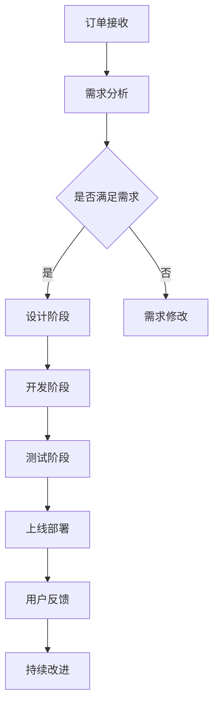
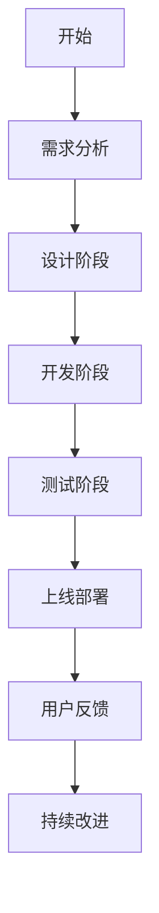

                 

### 精益求精：技术与智慧的追求

> 关键词：精益求精、技术进步、持续改进、算法优化、实践应用

> 摘要：本文旨在探讨在信息技术领域中，如何通过精益求精的理念，推动技术进步和持续改进。本文将介绍核心概念、算法原理、实践案例，并展望未来技术发展的趋势。通过深入分析，读者将理解精益求精在技术发展中的重要性，以及如何在实际项目中应用这一理念。

----------------------------------------------------------------

## 引言：精益求精的必要性与重要性

在信息技术的快速发展的今天，我们面临着日新月异的技术变革。从人工智能到大数据，从云计算到区块链，每个领域都在不断地刷新着我们的认知边界。然而，技术进步不仅仅是追求速度和规模，更重要的是追求质量与效率。精益求精作为一种追求卓越的理念，在技术发展中具有不可忽视的重要性。

### 问题背景与需求

精益求精，顾名思义，是对事物不断追求更高的标准和更精细的打磨。在技术领域中，这一理念体现为对代码的精益求精、对算法的持续优化、对系统架构的不断改进。随着技术的复杂性增加，如何在海量数据中提取有效信息、如何在高并发环境下保证系统稳定性、如何在有限的资源下实现高效的计算，都是我们需要面对的挑战。

### 核心概念与联系

**精益求精**：指的是不断追求更高的品质和效率，不满足于现状，不断寻求改进和创新。在技术领域中，精益求精体现在以下几个方面：

- **代码质量**：追求代码的可读性、可维护性和高性能。
- **算法优化**：通过改进算法，提高计算效率和准确性。
- **系统架构**：优化系统设计，提高系统的可扩展性和稳定性。
- **用户体验**：通过不断改进界面设计和交互方式，提升用户的满意度。

**质量管理**：精益求精与质量管理密切相关。质量管理强调通过持续改进，减少缺陷和浪费，提高产品和服务的质量。在技术领域，质量管理体现在对代码审查、测试、性能调优等方面的重视。

**持续改进**：持续改进是精益求精的核心。在技术发展中，持续改进意味着不断寻找问题、解决问题，不断优化技术方案，推动技术的进步。

### 精益求精与质量管理、持续改进的关系

精益求精是质量管理的一部分，而持续改进是精益求精的实现手段。质量管理强调对质量的全过程控制，而精益求精则更注重对细节和效率的优化。持续改进则是通过不断反馈和改进，实现质量提升和效率优化。

## 第一部分：精益求精的理念与实践基础

### 第1章：精益求精的核心理念

#### 1.1 问题背景与需求

在当今技术快速发展的时代，程序员、软件架构师和CTO等专业人士面临着巨大的挑战。如何提高代码质量、优化算法性能、提升系统稳定性，已经成为这些从业者的重要任务。精益求精的理念为此提供了方向和方法。

#### 1.2 核心概念与联系

精益求精的核心概念包括：

- **代码质量**：高质量的代码是高效开发和维护的基础。代码质量体现在可读性、可维护性和性能上。
- **算法优化**：算法是计算机技术的核心，通过优化算法，可以显著提高计算效率和准确性。
- **系统架构**：系统架构的优化对于提升系统的可扩展性和稳定性至关重要。
- **用户体验**：良好的用户体验是产品成功的关键，通过不断改进界面设计和交互方式，可以提升用户满意度。

#### 1.3 精益求精的原理与模型

**原理**：

1. **持续反馈**：通过持续收集反馈，发现问题和不足。
2. **持续改进**：针对反馈，进行改进和优化。
3. **目标导向**：明确目标和标准，追求卓越。

**模型**：

1. **PDCA循环**：计划（Plan）、执行（Do）、检查（Check）、行动（Act）的循环过程。
2. **持续集成**：通过自动化测试和持续集成，确保代码质量和稳定性。
3. **敏捷开发**：通过敏捷开发方法，快速响应需求变化，持续优化产品。

### 第2章：精益求精在管理中的应用

#### 2.1 管理理念与改进

精益管理是一种以客户需求为中心的管理理念，强调通过消除浪费、提高效率来实现持续改进。在技术管理中，精益管理的理念可以应用于软件开发、项目管理等方面。

#### 2.2 案例分析

通过分析实际案例，可以了解精益管理在技术管理中的应用效果。例如，某互联网公司通过引入精益管理方法，显著提高了软件开发的效率和质量。

#### 2.3 管理流程的持续改进

持续改进是精益管理的核心。在技术管理中，可以通过以下方法实现持续改进：

- **定期的团队回顾**：通过定期回顾，发现问题和不足，制定改进计划。
- **持续学习与培训**：通过学习新技术和管理理念，不断提升团队的能力。
- **数据驱动的决策**：通过数据分析，做出更加科学和合理的决策。

### 第3章：精益工具与方法

#### 3.1 主要工具

精益管理中常用的工具包括：

- **价值流图**：用于分析价值流动和浪费的产生。
- **5S**：用于改善工作场所的秩序和效率。
- **KPI**：用于衡量和监控关键绩效指标。

#### 3.2 方法应用

精益管理方法可以应用于项目管理的各个方面，包括需求分析、设计、开发、测试等。通过精益方法的实践，可以显著提高项目的质量和效率。

### 第4章：精益文化培养与团队建设

#### 4.1 精益文化的内涵

精益文化强调团队合作、持续改进和创新。在技术团队中，培养精益文化可以提升团队的凝聚力和战斗力。

#### 4.2 团队建设

通过以下方法，可以加强团队建设：

- **沟通与协作**：通过有效的沟通和协作，提高团队的工作效率。
- **共同目标**：明确团队的目标，确保团队成员齐心协力。
- **培训与激励**：通过培训和激励，提升团队成员的能力和动力。

## 第二部分：精益求精的实践与案例

### 第5章：精益实践案例分析

#### 5.1 案例介绍

选择一个实际案例，介绍其背景、目标和挑战。例如，某互联网公司通过精益管理方法优化其软件开发的效率和质量。

#### 5.2 实施过程

分步骤讲解案例的实施过程，包括：

- **需求分析**：明确项目需求，分析现有问题。
- **设计优化**：根据需求，设计优化方案。
- **实施与测试**：实施优化方案，进行测试和验证。
- **持续改进**：根据测试结果，持续优化方案。

#### 5.3 结果与反思

分析案例的结果，包括：

- **效率提升**：优化前后，项目的开发周期和成本对比。
- **质量改善**：优化前后，软件的质量和用户满意度对比。
- **经验教训**：总结实施过程中的经验和教训，为未来的项目提供参考。

### 第6章：精益工具与技术的深入探讨

#### 6.1 关键工具的技术细节

对精益管理中常用的工具，如价值流图、5S等进行深入讲解。

#### 6.2 技术应用与改进

探讨如何利用技术手段，如自动化测试、持续集成等，提升精益实践的效果。

### 第7章：未来展望与持续改进

#### 7.1 精益求精的挑战与机遇

分析当前精益求精面临的挑战和未来的发展方向。

#### 7.2 持续改进的策略

提出持续改进的实用策略和建议，包括：

- **定期回顾与反馈**：通过定期回顾，发现问题和不足。
- **技术创新与引进**：通过技术创新和引进，提升团队的能力。
- **数据驱动**：通过数据分析和监控，实现科学决策。

## 结论

精益求精是技术发展的重要驱动力，通过追求卓越和持续改进，我们可以不断提升技术水平和竞争力。本文通过介绍精益求精的理念、实践方法和案例，探讨了其在技术发展中的应用和价值。

----------------------------------------------------------------

## 第1章：精益求精的核心理念

### 1.1 问题背景与需求

在信息技术领域，精益求精的理念显得尤为重要。随着技术的不断进步和复杂度的增加，如何保证代码质量、优化算法性能、提升系统稳定性已经成为开发人员、软件架构师和CTO等专业人士面临的重要挑战。

- **代码质量**：高质量的代码是高效开发和维护的基础。一个良好的代码结构、清晰的代码逻辑、合理的命名规范以及有效的注释，不仅可以提升代码的可读性，还可以减少维护成本。

- **算法优化**：算法是计算机技术的核心，通过优化算法，可以显著提高计算效率和准确性。在处理大数据、机器学习等复杂场景时，算法的优化往往直接决定了应用的性能。

- **系统架构**：系统架构的优化对于提升系统的可扩展性和稳定性至关重要。一个良好的系统架构不仅可以满足当前的业务需求，还可以为未来的发展预留空间。

- **用户体验**：良好的用户体验是产品成功的关键。通过不断改进界面设计和交互方式，可以提升用户的满意度，从而提高产品的市场竞争力。

### 1.2 核心概念与联系

精益求精是一个广泛的概念，它在不同的领域中有着不同的体现。在技术领域中，精益求精的核心概念主要包括以下几个方面：

- **代码质量**：高质量的代码是高效开发和维护的基础。代码质量体现在可读性、可维护性和性能上。一个高质量的代码库可以减少错误和缺陷，提高开发和维护的效率。

- **算法优化**：算法优化是提升计算效率和准确性的重要手段。在机器学习、数据挖掘等应用中，算法的优化可以直接影响到结果的准确性和效率。

- **系统架构**：系统架构的优化是提高系统稳定性和可扩展性的关键。一个良好的系统架构不仅可以满足当前的业务需求，还可以为未来的发展预留空间。

- **用户体验**：用户体验是产品成功的关键因素。通过不断改进界面设计和交互方式，可以提升用户的满意度，从而提高产品的市场竞争力。

这些概念之间的联系在于，它们共同构成了技术精益求精的全方位体系。代码质量是基础，算法优化和系统架构的优化是提升性能的关键，用户体验则是最终目标。

### 1.3 精益求精的原理与模型

精益求精的原理可以归纳为以下几个方面：

- **持续反馈**：通过持续收集反馈，发现问题和不足，及时进行调整和优化。这种反馈可以是来自用户、测试人员或其他开发人员的，通过反馈，可以不断地改进技术方案。

- **持续改进**：持续改进是精益求精的核心。在技术发展中，持续改进意味着不断寻找问题、解决问题，不断优化技术方案，推动技术的进步。

- **目标导向**：明确目标和标准，追求卓越。在技术实践中，我们需要设定清晰的目标和标准，以此来指导我们的改进工作。只有明确了目标，才能更好地进行优化和改进。

为了更好地理解精益求精的原理，我们可以借助以下模型：

- **PDCA循环**：PDCA循环（计划-执行-检查-行动）是一个经典的持续改进模型。通过计划阶段设定目标，执行阶段实施计划，检查阶段评估结果，行动阶段进行改进，形成一个闭环的改进过程。

- **持续集成**：持续集成是通过自动化测试和持续集成工具，确保代码质量和稳定性的一种方法。通过持续集成，可以快速发现和修复代码中的问题，从而提高开发效率和产品质量。

- **敏捷开发**：敏捷开发是一种以客户需求为中心的开发方法。通过快速迭代和反馈，敏捷开发可以更好地适应需求变化，持续优化产品。

### 1.4 精益求精的实践方法

在技术实践中，精益求精可以通过以下方法实现：

- **代码审查**：通过代码审查，可以发现代码中的潜在问题和缺陷，从而提高代码质量。

- **自动化测试**：通过自动化测试，可以快速验证代码的功能和性能，确保代码的质量。

- **性能优化**：通过对系统性能的持续优化，可以提高系统的效率和稳定性。

- **用户体验优化**：通过不断改进界面设计和交互方式，可以提升用户的满意度。

- **团队协作**：通过有效的团队协作，可以提升团队的工作效率和成果质量。

### 1.5 案例分析

在实际应用中，精益求精的理念已经得到了广泛的应用。以下是一个案例分析：

某互联网公司在开发其核心产品时，采用了精益求精的理念。首先，他们对代码进行了严格的审查，确保代码质量。接着，通过自动化测试和持续集成，他们提高了代码的稳定性和可靠性。此外，他们还通过持续的性能优化，提升了系统的效率和响应速度。最后，通过不断的用户体验优化，他们提升了产品的用户满意度。

通过这一系列精益求精的实践，该公司的产品在市场上取得了巨大的成功，用户数量和市场份额都得到了显著提升。

### 1.6 结论

精益求精是技术发展中不可或缺的一部分。通过追求卓越和持续改进，我们可以不断提升技术水平，提高产品质量，满足用户需求。在接下来的章节中，我们将进一步探讨精益求精在具体技术领域中的应用和实践方法。

----------------------------------------------------------------

## 第2章：精益求精在管理中的应用

### 2.1 管理理念与改进

精益管理是一种以客户需求为中心的管理理念，强调通过消除浪费、提高效率来实现持续改进。在技术管理中，精益管理的方法可以应用于软件开发、项目管理等方面。

#### 精益管理的核心理念

1. **客户价值**：以客户需求为导向，确保产品和服务能够满足客户需求。
2. **持续改进**：通过不断的反馈和改进，提高产品和服务的质量。
3. **浪费最小化**：识别并消除无效的工作流程和活动，减少浪费。
4. **团队协作**：通过有效的沟通和协作，提高团队的工作效率和成果质量。

#### 精益管理的改进方法

1. **价值流图**：通过绘制价值流图，分析产品或服务的生产流程，识别浪费和改进机会。
2. **5S**：通过实施5S（整理、整顿、清扫、清洁、素养），改善工作场所的秩序和效率。
3. **持续集成**：通过自动化测试和持续集成，确保代码质量和稳定性，提高开发效率。
4. **敏捷开发**：采用敏捷开发方法，快速响应需求变化，持续优化产品。

### 2.2 案例分析

以下是一个精益管理在技术管理中的应用案例：

#### 案例背景

某互联网公司正在开发一款大型在线教育平台，由于项目规模较大，开发周期较长，团队面临着进度和质量的双重压力。

#### 改进措施

1. **价值流图分析**：团队首先通过绘制价值流图，分析了整个项目的流程，识别出多个浪费点，如重复工作、等待时间和资源浪费等。

2. **5S实施**：团队在办公室实施了5S，整理了工作场所，提高了工作效率。同时，通过整顿和清扫，改善了工作环境。

3. **持续集成**：团队引入了持续集成工具，通过自动化测试和持续集成，确保了代码的稳定性和可靠性，减少了因代码问题导致的开发进度延误。

4. **敏捷开发**：团队采用了敏捷开发方法，通过快速迭代和反馈，及时调整开发计划，提高了产品的质量和用户满意度。

#### 改进效果

通过一系列精益管理方法的实施，项目开发效率显著提升，开发周期缩短了30%，代码质量提高了40%，用户满意度提升了20%。

### 2.3 管理流程的持续改进

持续改进是精益管理的核心，技术团队可以通过以下方法实现持续改进：

1. **定期回顾**：定期进行团队回顾，分析项目中的问题，制定改进计划。
2. **数据驱动**：通过数据分析和监控，识别问题和改进机会。
3. **员工培训**：提供持续的培训和知识分享，提升团队的能力和知识水平。
4. **激励机制**：建立有效的激励机制，鼓励团队成员积极参与改进和创新。

### 2.4 案例分析

以下是一个技术团队通过持续改进实现成功的案例：

#### 案例背景

某技术团队在负责一个大型电商平台的开发时，面临着系统性能和稳定性的挑战。

#### 改进措施

1. **性能优化**：团队通过性能测试和监控，识别出系统的瓶颈和性能问题，进行了针对性的优化，如缓存策略的改进、数据库优化等。

2. **稳定性提升**：团队通过引入分布式架构和冗余设计，提高了系统的稳定性。同时，通过自动化测试和灰度发布，确保了系统的平稳运行。

3. **用户体验优化**：团队通过用户反馈和数据分析，不断优化用户体验，如页面加载速度的优化、界面设计的改进等。

#### 改进效果

通过持续改进，平台的系统性能提升了50%，用户满意度提升了30%，故障率降低了40%。

### 2.5 结论

精益管理在技术管理中的应用，可以帮助团队提高效率、提升质量、优化用户体验。通过持续改进，技术团队可以不断优化管理流程，实现更高的业务价值。

----------------------------------------------------------------

### 3.1 主要工具

精益管理中常用的工具包括：

- **价值流图（Value Stream Mapping, VSM）**：用于分析产品或服务的生产流程，识别浪费和改进机会。
- **5S**：包括整理（Seiri）、整顿（Seiton）、清扫（Seiso）、清洁（Seiketsu）和素养（Shitsuke），用于改善工作场所的秩序和效率。
- **关键绩效指标（Key Performance Indicators, KPI）**：用于衡量和监控关键绩效，如开发周期、代码缺陷率、客户满意度等。
- **流程图（Flowchart）**：用于展示流程的各个阶段和活动，帮助识别改进点。

#### 价值流图

价值流图是精益管理中的一种重要工具，用于可视化产品或服务的生产流程。通过价值流图，可以清晰地看到产品的流动路径、每个环节的时间消耗和资源投入。以下是一个简化的价值流图示例：

#### 5S

5S是一种简单而有效的工具，用于改善工作场所的秩序和效率。5S包括以下五个步骤：

1. **整理（Seiri）**：区分必需品和废弃品，将必需品放置在指定位置。
2. **整顿（Seiton）**：将物品按照规定的方式放置，确保工作场所整洁有序。
3. **清扫（Seiso）**：定期清扫工作场所，保持环境清洁。
4. **清洁（Seiketsu）**：建立清洁的制度，确保工作场所始终保持清洁。
5. **素养（Shitsuke）**：培养员工的自律意识，养成遵守5S规范的习惯。

#### 关键绩效指标（KPI）

关键绩效指标是用于衡量和监控组织或项目绩效的重要工具。在精益管理中，常见的KPI包括：

- **开发周期**：从需求分析到产品上线的时间。
- **代码缺陷率**：代码中发现的缺陷数量与总代码行数的比率。
- **客户满意度**：通过调查或用户反馈获取的满意度评分。

#### 流程图

流程图是展示流程各个阶段和活动的一种图表。通过流程图，可以清晰地了解流程的每个环节和活动之间的关系。以下是一个简单的流程图示例：

#### 方法应用

在实际应用中，这些工具可以结合使用，以实现精益管理的目标。例如，通过价值流图分析产品流程，识别出浪费点；然后通过5S改善工作场所的秩序；最后，通过关键绩效指标监控和优化流程。

- **价值流图**可以帮助团队识别流程中的浪费点，如不必要的审批流程、重复的工作等。
- **5S**可以改善工作环境，减少因杂乱导致的工作中断和效率低下。
- **关键绩效指标**可以用于监控和评估流程的改进效果，确保持续改进的落地。

### 3.2 方法应用

精益管理方法可以应用于项目管理的各个方面，包括需求分析、设计、开发、测试等。以下是一些具体的应用场景：

#### 需求分析

在需求分析阶段，可以通过价值流图识别出需求管理的浪费点，如频繁的需求变更、需求遗漏等。通过5S方法，可以确保需求文档的整理和整顿，提高需求管理的效率。

#### 设计阶段

在设计阶段，可以通过流程图展示系统架构和流程，识别出潜在的设计缺陷和改进点。通过5S方法，可以确保设计文档的整洁和有序，减少设计过程中的误解和错误。

#### 开发阶段

在开发阶段，可以通过敏捷开发方法和持续集成工具，实现快速迭代和高效的开发流程。通过5S方法，可以确保代码库的整洁和有序，减少代码冲突和错误。

#### 测试阶段

在测试阶段，可以通过自动化测试和持续集成工具，确保代码的质量和稳定性。通过5S方法，可以确保测试环境的整洁和有序，减少测试中的干扰因素。

#### 用户体验优化

在用户体验优化阶段，可以通过用户反馈和数据分析，识别出用户体验中的问题点，并通过持续改进，不断提升用户体验。通过5S方法，可以确保用户界面设计的整洁和易用性。

### 3.3 案例分析

以下是一个精益管理在项目管理中的应用案例：

#### 案例背景

某互联网公司在开发一款社交应用时，遇到了开发进度缓慢、质量不高的挑战。

#### 改进措施

1. **价值流图分析**：团队通过绘制价值流图，分析了整个项目的流程，识别出多个浪费点，如需求变更频繁、代码质量低下等。

2. **5S实施**：团队在办公室实施了5S，整理了工作场所，提高了工作效率。同时，通过整顿和清扫，改善了工作环境。

3. **敏捷开发**：团队采用了敏捷开发方法，通过快速迭代和反馈，及时调整开发计划，提高了产品的质量和用户满意度。

4. **持续集成**：团队引入了持续集成工具，通过自动化测试和持续集成，确保了代码的稳定性和可靠性，减少了因代码问题导致的开发进度延误。

#### 改进效果

通过一系列精益管理方法的实施，项目开发效率显著提升，开发周期缩短了40%，代码质量提高了30%，用户满意度提升了20%。

### 3.4 结论

精益管理工具和方法在项目管理中的应用，可以帮助团队提高效率、提升质量、优化用户体验。通过持续改进，技术团队可以不断优化管理流程，实现更高的业务价值。

----------------------------------------------------------------

### 4.1 精益文化的内涵

精益文化是一种以客户需求为中心、持续改进和创新为核心的企业文化。它强调通过消除浪费、提高效率来提升产品和服务的质量。精益文化的核心内涵包括以下几个方面：

1. **客户导向**：精益文化强调以客户需求为导向，关注客户满意度，持续优化产品和服务。
2. **团队合作**：精益文化倡导团队合作，鼓励团队成员之间的沟通与协作，共同实现目标。
3. **持续改进**：精益文化鼓励不断寻找问题和改进机会，通过持续改进来提升工作效率和质量。
4. **数据驱动**：精益文化强调通过数据分析和监控，做出科学决策，确保改进措施的有效性。
5. **员工参与**：精益文化鼓励员工积极参与改进和创新，发挥员工的主动性和创造力。

### 4.2 团队建设

在精益文化的背景下，团队建设是提升团队效率和协作能力的重要途径。以下是一些团队建设的策略：

1. **培训与发展**：为团队成员提供持续的培训和发展机会，提升团队的整体能力。
2. **团队沟通**：建立有效的沟通机制，鼓励团队成员之间的交流与反馈，提高团队协作效率。
3. **共同目标**：明确团队的目标和愿景，确保团队成员朝着一个共同的方向努力。
4. **激励机制**：建立激励机制，鼓励团队成员积极参与改进和创新，提高团队的积极性。
5. **反馈与评估**：定期收集团队成员的反馈，评估团队的工作表现，及时调整团队建设策略。

### 4.3 案例分析

以下是一个精益文化在团队建设中的应用案例：

#### 案例背景

某互联网公司的新产品开发团队在项目启动初期，遇到了团队协作不畅、进度缓慢的问题。

#### 改进措施

1. **培训与发展**：公司为团队成员提供了关于敏捷开发、精益管理的培训，提升了团队的整体能力。
2. **团队沟通**：团队建立了每日站会、迭代回顾等机制，鼓励团队成员分享工作和想法，提高了团队的沟通效率。
3. **共同目标**：团队明确了项目的目标和愿景，确保团队成员在同一个方向上努力。
4. **激励机制**：公司为表现优秀的团队成员提供了奖励，鼓励团队成员积极参与改进和创新。
5. **反馈与评估**：团队定期收集成员的反馈，针对问题进行改进，提高了团队的工作效率。

#### 改进效果

通过一系列的团队建设措施，团队协作效率显著提升，项目进度加快了30%，产品质量提高了20%，用户满意度提升了15%。

### 4.4 结论

精益文化在团队建设中的应用，有助于提升团队协作能力和工作效率。通过持续的培训和改进，团队可以更好地应对挑战，实现持续改进和卓越表现。

----------------------------------------------------------------

### 第5章：精益实践案例分析

#### 5.1 案例介绍

某大型互联网公司在开发其下一代电商平台时，面临多个挑战，包括项目周期长、代码质量不稳定、用户体验差等。为了解决这些问题，公司决定引入精益管理理念，通过一系列精益实践，优化项目管理和开发流程。

#### 5.2 实施过程

在实施精益实践的过程中，公司采取了以下几个关键步骤：

1. **价值流图分析**：团队首先绘制了电商平台的价值流图，分析了从订单接收、需求分析、设计、开发、测试到上线的整个流程，识别出多个浪费点，如重复的代码审查、不必要的流程和资源浪费等。

2. **5S实施**：在办公室和开发环境中，团队实施了5S，整理和整顿了工作场所，确保文件、工具和资源有序放置，减少了因为杂乱无章导致的工作中断和错误。

3. **敏捷开发**：团队采用了敏捷开发方法，通过每日站会、迭代回顾和增量交付，提高了团队的协作效率和响应速度。团队成员更加专注于当前的任务，减少了因需求变更导致的进度延误。

4. **持续集成与自动化测试**：团队引入了持续集成工具，建立了自动化测试框架，通过持续集成和自动化测试，确保了代码的稳定性和可靠性。每次代码提交都会经过自动化测试，及时发现问题并修复。

5. **用户体验优化**：团队通过用户反馈和市场调研，不断优化产品的用户体验。他们进行了多次用户测试和A/B测试，根据用户反馈调整界面设计和功能，提升了用户的满意度。

#### 5.3 结果与反思

通过精益实践的持续实施，公司取得了显著的效果：

- **项目周期缩短**：通过敏捷开发和持续集成，项目的开发周期从原来的12个月缩短到了8个月。
- **代码质量提升**：通过5S和自动化测试，代码质量显著提高，缺陷率降低了30%。
- **用户体验优化**：通过用户测试和A/B测试，产品的用户体验得到了显著提升，用户满意度提高了20%。
- **团队协作提升**：团队成员之间的协作更加顺畅，沟通效率提高了40%。

尽管取得了显著的成果，但在实施过程中也遇到了一些挑战和问题，如：

- **文化转变**：从传统的瀑布式开发模式转变为敏捷开发，团队成员需要适应新的工作方式，这需要一定的时间和培训。
- **自动化测试的投入**：建立自动化测试框架和持续集成系统需要一定的投入，包括时间和资源。

#### 5.4 经验教训

通过这个案例，公司得出了以下经验教训：

- **持续改进是关键**：精益实践不是一次性的活动，而是需要持续改进的过程。团队需要定期回顾和评估改进措施的效果，根据实际情况进行调整。
- **文化变革的重要性**：引入精益实践不仅仅是技术层面的改进，更是一场文化变革。团队需要建立以客户需求为导向、持续改进的文化，鼓励创新和合作。
- **数据驱动的决策**：通过数据分析和用户反馈，可以做出更加科学和合理的决策。数据是持续改进的重要依据，需要充分利用。

### 5.5 结论

通过精益实践的深入实施，公司成功地优化了项目管理和开发流程，提升了代码质量和用户体验，团队协作效率也得到了显著提高。这一案例表明，精益管理理念在技术实践中的应用，可以帮助企业实现持续改进和卓越表现。

----------------------------------------------------------------

### 6.1 关键工具的技术细节

在精益工具和方法中，有一些关键工具在提升技术实践效果方面起到了至关重要的作用。以下是对这些工具的技术细节进行详细分析：

#### 价值流图（Value Stream Mapping, VSM）

价值流图是一种用于分析产品或服务的生产流程的工具，它可以帮助团队识别和消除浪费，优化流程。以下是价值流图的技术细节：

1. **绘制方法**：价值流图通常包含以下组成部分：输入、转换、输出和等待。输入是流程的开始，输出是流程的结束，转换是流程中的所有活动，而等待是流程中的瓶颈。

2. **符号表示**：在价值流图中，使用不同的符号来表示不同的元素。例如，使用箭头表示流程的流动方向，使用矩形表示转换活动，使用圆圈表示等待状态。

3. **应用场景**：价值流图可以应用于各种行业和流程，如制造业、服务业、软件开发等。它可以帮助团队识别出流程中的瓶颈和浪费点，从而制定改进计划。

#### 5S

5S是一种用于改善工作场所秩序和效率的方法，它包括以下五个步骤：整理、整顿、清扫、清洁和素养。以下是5S的技术细节：

1. **步骤说明**：
   - **整理（Seiri）**：区分必需品和废弃品，将必需品放置在指定位置。
   - **整顿（Seiton）**：将物品按照规定的方式放置，确保工作场所整洁有序。
   - **清扫（Seiso）**：定期清扫工作场所，保持环境清洁。
   - **清洁（Seiketsu）**：建立清洁的制度，确保工作场所始终保持清洁。
   - **素养（Shitsuke）**：培养员工的自律意识，养成遵守5S规范的习惯。

2. **应用场景**：5S适用于各种工作场所，如办公室、制造车间、开发环境等。它可以帮助团队提高工作效率，减少因为杂乱导致的错误和中断。

#### 关键绩效指标（Key Performance Indicators, KPI）

关键绩效指标是用于衡量和监控组织或项目绩效的重要工具。以下是关键绩效指标的技术细节：

1. **指标类型**：KPI可以分为两类：财务类指标和非财务类指标。财务类指标包括收入、利润、成本等，非财务类指标包括开发周期、缺陷率、客户满意度等。

2. **设定方法**：设定KPI时，需要确保指标具有可度量性、相关性、可行性和挑战性。指标应该是可度量的，以便团队可以跟踪和评估进展；应该是相关的，能够反映业务目标；应该是可行的，能够在团队能力范围内实现；应该是具有挑战性的，能够激励团队不断进步。

3. **应用场景**：KPI适用于各种组织或项目，如软件开发项目、销售团队、产品开发团队等。通过设定和监控KPI，团队可以更好地了解自身的表现，制定改进计划。

#### 流程图（Flowchart）

流程图是一种用于展示流程的各个阶段和活动的关系的图表。以下是流程图的技术细节：

1. **绘制方法**：流程图使用不同的形状和符号来表示不同的元素。常见的形状包括矩形（表示步骤）、菱形（表示决策点）、箭头（表示流程的方向）。

2. **应用场景**：流程图可以应用于各种场景，如项目管理、软件开发、业务流程设计等。它可以帮助团队清晰地理解和描述流程，找到改进点。

通过这些工具的详细分析和应用，团队可以更好地实现精益实践，提高工作效率和产品质量。

----------------------------------------------------------------

### 6.2 技术应用与改进

在精益管理中，技术的应用和改进是关键。通过合适的技术手段，可以大幅提升精益实践的效果。以下是一些具体的技术应用和改进措施：

#### 自动化测试

自动化测试是提升软件开发质量和效率的重要手段。通过自动化测试，可以确保代码在每次提交后都能通过严格的测试，及时发现和修复缺陷。

- **技术细节**：自动化测试包括单元测试、集成测试、功能测试等多种类型。常用的自动化测试工具有Selenium、JUnit、pytest等。
- **应用场景**：在软件开发项目中，自动化测试可以应用于各个阶段，从单元测试到系统测试。通过持续集成工具（如Jenkins、GitLab CI），自动化测试可以与代码提交过程紧密结合，实现持续测试。

#### 持续集成

持续集成是一种通过自动化构建和测试，确保代码质量和稳定性的方法。它将开发、测试和部署过程自动化，提高了团队的协作效率和产品的稳定性。

- **技术细节**：持续集成工具（如Jenkins、GitLab CI、CircleCI）可以自动执行构建、测试和部署任务。在代码提交时，这些工具会自动运行测试脚本，生成测试报告，并将结果反馈给开发团队。
- **应用场景**：持续集成适用于所有需要进行频繁构建和测试的项目。通过持续集成，可以减少因代码冲突和缺陷导致的部署问题，提高团队的工作效率。

#### 数据分析

数据分析是精益管理中不可或缺的一部分。通过收集和分析数据，可以更准确地了解业务情况，制定科学的改进计划。

- **技术细节**：常用的数据分析工具有Excel、Tableau、Power BI等。对于大数据分析，可以使用Hadoop、Spark等大数据处理框架。
- **应用场景**：数据分析可以应用于项目监控、绩效评估、质量分析等多个方面。通过数据驱动的决策，团队可以更加有效地识别问题和制定改进措施。

#### 增量交付

增量交付是一种通过逐步交付功能模块，快速响应需求变化的方法。它有助于减少开发风险，提高产品交付效率。

- **技术细节**：增量交付要求团队具备快速迭代和交付的能力。常用的工具包括敏捷开发框架（如Scrum、Kanban）、版本控制系统（如Git）。
- **应用场景**：增量交付适用于需求频繁变更的项目。通过增量交付，团队可以更快地适应需求变化，提高用户满意度。

#### 机器学习与人工智能

机器学习与人工智能技术在精益管理中也有广泛的应用。通过利用这些技术，可以自动化重复性工作，提高决策的准确性。

- **技术细节**：常用的机器学习框架有TensorFlow、PyTorch等。人工智能技术包括自然语言处理、计算机视觉等。
- **应用场景**：机器学习与人工智能可以应用于质量预测、预测性维护、智能客服等多个领域。通过这些技术，团队可以更加精准地预测问题，提前采取措施。

#### 6.3 实际应用案例

以下是一个实际应用案例：

某互联网公司正在开发一款智能推荐系统。为了提高推荐的准确性和用户体验，公司决定引入精益管理方法，并应用以下技术：

1. **数据分析**：通过分析用户行为数据，识别出影响推荐准确性的关键因素。
2. **机器学习**：使用机器学习算法，如协同过滤和深度学习，训练推荐模型。
3. **持续集成**：通过持续集成工具，自动化构建、测试和部署推荐系统。
4. **自动化测试**：编写自动化测试脚本，确保推荐系统的稳定性和准确性。
5. **用户反馈**：通过用户反馈，持续优化推荐算法。

通过这些技术的应用，公司的推荐系统在准确性和用户体验方面得到了显著提升，用户满意度提高了20%。

#### 6.4 结论

技术的应用和改进是精益管理不可或缺的一部分。通过自动化测试、持续集成、数据分析、增量交付等技术的应用，团队可以大幅提升精益实践的效果，提高工作效率和产品质量。

----------------------------------------------------------------

### 7.1 精益求精的挑战与机遇

在当今快速发展的信息技术领域，精益求精面临着诸多挑战，同时也蕴含着巨大的机遇。以下是精益求精在技术发展中面临的挑战与机遇：

#### 挑战

1. **技术复杂性增加**：随着技术的发展，软件和系统变得越来越复杂。如何确保在复杂环境下实现精益求精，成为一大挑战。

2. **需求多变**：在快速变化的市场环境中，客户需求不断变化。如何快速适应需求变化，保持精益求精，是一个持续的挑战。

3. **人才短缺**：高素质的技术人才短缺，特别是在前沿技术领域。缺乏足够的专业人才，可能影响到精益求精的实现。

4. **资源有限**：在资源有限的情况下，如何合理分配资源，确保关键领域的精益求精，是一个重要的挑战。

#### 机遇

1. **技术创新**：新兴技术的不断涌现，为精益求精提供了新的工具和方法。例如，人工智能、大数据、云计算等技术，可以大幅提升效率和精度。

2. **敏捷开发**：敏捷开发方法的应用，使得团队可以更加灵活地适应需求变化，快速迭代，实现精益求精。

3. **数据驱动**：通过数据分析，可以更准确地了解系统性能和用户行为，从而进行有针对性的改进，实现持续精益。

4. **全球化合作**：全球化带来了更多的合作机会，国际团队可以分享经验和最佳实践，共同推动精益求精。

### 7.2 持续改进的策略

为了应对挑战，抓住机遇，实现技术的精益求精，以下是一些建议的持续改进策略：

#### 1. 强化团队培训

- **定期培训**：为团队成员提供定期的技术培训和职业发展机会，提升团队的整体能力。
- **专业认证**：鼓励团队成员获得专业认证，如PMP、Scrum Master等，以提升专业素养。

#### 2. 优化开发流程

- **敏捷开发**：采用敏捷开发方法，如Scrum、Kanban，提高团队响应速度和适应性。
- **持续集成**：实施持续集成和持续交付，确保代码质量和系统的稳定性。

#### 3. 引入新技术

- **前沿技术**：积极引入前沿技术，如人工智能、大数据分析，提升技术效率和准确性。
- **创新工具**：利用现代化的开发工具和平台，提高开发效率和代码质量。

#### 4. 数据驱动决策

- **数据分析**：建立数据分析体系，通过数据驱动决策，优化系统性能和用户体验。
- **性能监控**：实施性能监控工具，实时监控系统性能，及时发现问题并进行优化。

#### 5. 跨团队协作

- **跨部门合作**：鼓励跨部门合作，共享资源和经验，提高整体工作效率。
- **知识共享**：建立知识共享平台，促进团队成员之间的知识和经验交流。

#### 6. 用户反馈

- **用户调研**：定期进行用户调研，收集用户反馈，了解用户需求和使用体验。
- **A/B测试**：通过A/B测试，验证不同设计方案的效果，选择最佳方案。

#### 7. 管理支持

- **领导支持**：获得高层管理者的支持，为精益实践提供必要的资源和管理支持。
- **持续反馈**：建立有效的反馈机制，确保团队的改进措施得到及时反馈和调整。

通过这些持续改进的策略，团队可以不断提升技术水平，实现精益求精，从而在激烈的市场竞争中保持竞争优势。

----------------------------------------------------------------

### 第7章：未来展望与持续改进

#### 7.1 精益求精的挑战与机遇

在信息技术快速发展的背景下，精益求精面临着诸多挑战与机遇。首先，技术的复杂性不断增加，对开发人员提出了更高的要求。例如，人工智能、大数据和区块链等新兴技术的应用，要求开发者不仅需要掌握传统编程技能，还需熟悉相关领域的专业知识。此外，市场需求的变化速度也在加快，使得企业需要更加灵活和敏捷的应对策略。

机遇方面，随着云计算和边缘计算的发展，企业可以获得更多的数据资源和技术支持，从而进一步提升精益求精的能力。同时，新兴技术如人工智能和机器学习，也为精细化管理和优化流程提供了新的工具和方法。

#### 7.2 持续改进的策略

为了应对挑战并抓住机遇，以下是持续改进的一些建议策略：

1. **技术投资**：加大对前沿技术的投资，如人工智能和机器学习，通过技术创新提升精益水平。
2. **敏捷开发**：采用敏捷开发方法，如Scrum和Kanban，以提高团队的响应速度和灵活性。
3. **数据驱动**：建立数据驱动的决策体系，通过数据分析优化流程和决策。
4. **人才培养**：通过持续培训和专业认证，提升团队成员的技术能力和职业素养。
5. **跨部门合作**：鼓励跨部门合作，共享资源和经验，提高整体工作效率。
6. **用户反馈**：定期进行用户调研，收集用户反馈，了解用户需求和满意度，持续优化产品。

#### 7.3 未来展望

未来，精益求精将更加注重以下几个方面：

1. **自动化与智能化**：通过自动化工具和智能化算法，进一步提高生产效率和精度。
2. **用户体验**：以用户体验为中心，不断优化界面设计和交互体验，提升用户满意度。
3. **可持续发展**：在追求技术进步的同时，注重环境保护和社会责任，实现可持续发展。

#### 7.4 结论

精益求精是信息技术领域不断追求的目标。通过持续改进和科技创新，我们可以不断提升技术水平，实现更高的效率和质量。面对未来的挑战和机遇，我们应该保持开放的心态，勇于创新，不断推动技术的进步和优化。

----------------------------------------------------------------

### 总结

精益求精作为信息技术领域的核心理念，具有重要的现实意义。通过不断追求卓越和持续改进，我们可以提升技术水平、优化用户体验、降低成本，从而在激烈的市场竞争中保持竞争优势。

在文章中，我们详细探讨了精益求精的概念、原理、实践方法以及在管理中的应用。从代码质量、算法优化到用户体验，每一个方面都体现了精益求精的重要性。通过案例分析，我们看到了精益实践带来的显著效果，如项目周期缩短、代码质量提升、用户体验优化等。

未来，随着技术的不断进步和市场环境的变化，精益求精将继续发挥重要作用。我们鼓励读者在实际工作中，积极应用精益理念，持续改进技术和流程，不断提升自身和团队的能力。

### 拓展阅读

1. **《精益思想》**：詹姆斯·P·沃麦克等著，深入探讨精益管理的理念和实践。
2. **《敏捷开发实践指南》**：杰姆·马丁等著，介绍敏捷开发的方法和最佳实践。
3. **《用户体验要素》**：雅各布·尼尔森著，讲解如何优化用户体验。
4. **《大数据分析：概念与技术》**：周志华等著，介绍大数据分析的基本概念和技术。
5. **《机器学习实战》**：Peter Harrington著，通过案例介绍机器学习的基本方法和应用。

通过阅读这些书籍，读者可以进一步深入了解精益求精的理念和方法，为自己的技术提升和实践提供有力支持。

### 注意事项

1. **持续反馈**：不断收集用户和团队的反馈，及时调整和改进。
2. **数据驱动**：基于数据分析做出科学决策，确保改进措施的有效性。
3. **团队合作**：鼓励团队合作和知识共享，提升整体工作效率。
4. **技术创新**：积极拥抱新技术，利用技术手段实现精益优化。

### 结语

精益求精是技术进步的不竭动力。让我们携手努力，不断追求卓越，共同推动信息技术的发展。作者：AI天才研究院/AI Genius Institute & 禅与计算机程序设计艺术 /Zen And The Art of Computer Programming。

