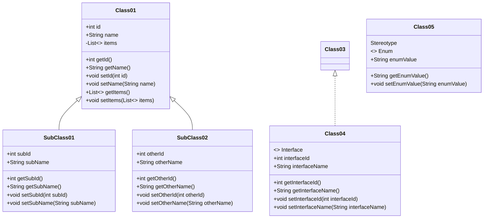
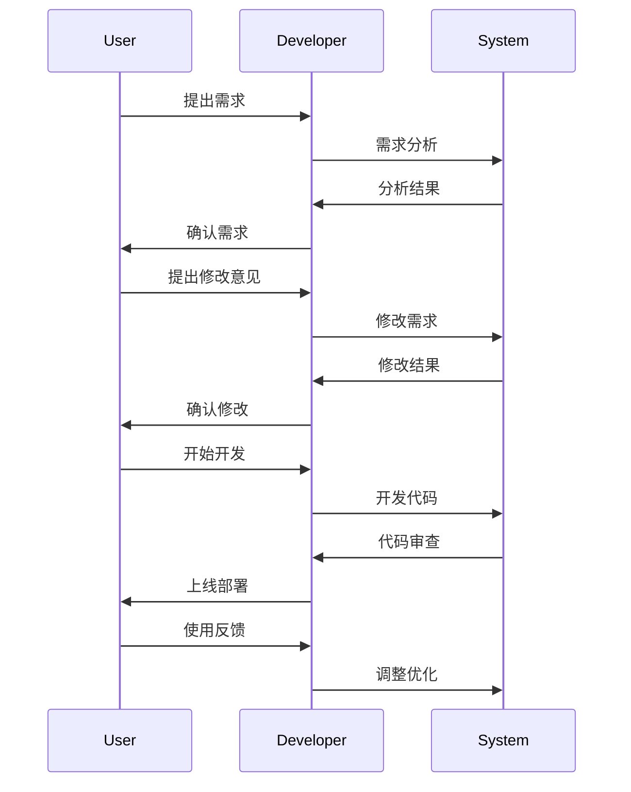

                 

### 系分的价值是达成共识

在信息技术和人工智能领域，系统性思维和共识的形成是两个关键要素，它们不仅影响技术创新的深度和广度，还决定着项目实施的效率和成功率。本文将围绕“系分的价值是达成共识”这一主题，通过逻辑清晰的步骤分析，探讨这两个概念的重要性及其在实践中的应用。

**关键词：** 系统性思维，共识，信息技术，人工智能，项目实施

**摘要：** 本文首先定义了系统性思维和共识的基本概念，随后通过具体案例阐述了它们在信息技术和人工智能项目中的重要性。文章还将探讨如何通过系统性思维和共识的形成来提升项目的质量和效率，并给出一些最佳实践建议。

### 目录

1. **引言**
   1.1 系统性思维与共识的价值
   1.2 书籍结构概述

2. **系统性思维基础**
   2.1 系统性思维概述
   2.2 核心概念与联系
   2.3 系统性思维的实践
   2.4 系统性思维的最佳实践

3. **共识的力量**
   3.1 共识的定义与类型
   3.2 共识的形成机制
   3.3 共识在组织管理中的应用
   3.4 共识促进的沟通技巧

4. **系统性思维与共识在信息技术与人工智能项目中的应用**
   4.1 系统分析与架构设计
   4.2 项目实战
   4.3 最佳实践 tips

5. **小结与拓展阅读**

### 1. 引言

**1.1 系统性思维与共识的价值**

在信息技术和人工智能领域，系统性思维和共识的形成是确保项目成功的重要因素。系统性思维是一种将复杂问题分解为若干组成部分，并通过这些组成部分的相互关系来理解整体的方法。它有助于识别和解决复杂问题，提高解决问题的效率。

另一方面，共识的形成是在多方利益相关者之间建立共同理解的过程。在项目实施过程中，不同角色和部门之间的共识对于项目的协调和执行至关重要。没有共识，即使技术上可行，项目也很难顺利进行。

**1.2 书籍结构概述**

本文将首先介绍系统性思维的基础，包括其定义、核心概念和实际应用。接着，我们将探讨共识的定义、形成机制及其在组织管理中的重要性。最后，我们将结合具体案例，分析如何通过系统性思维和共识的形成来提升项目质量和效率。

### 2. 系统性思维基础

**2.1 系统性思维概述**

系统性思维是一种理解和解决问题的方法，它强调将复杂问题看作一个整体，并通过分析各个组成部分及其相互关系来寻找解决方案。在信息技术和人工智能领域，系统性思维有助于我们更好地理解技术体系，预见潜在问题，并设计出更有效的系统架构。

**2.2 核心概念与联系**

系统性思维的核心概念包括系统、组件、相互作用、反馈循环等。以下是一个简化的ER实体关系图，展示了这些概念之间的联系：

```mermaid
erDiagram
  Component ||--|{ System } System
  Component ||--|{ Component } Feedback
  System ||--|{ System } Interaction
```

**2.3 系统性思维的实践**

系统性思维在实践中的应用可以从以下几个方面展开：

- **问题分析**：通过分解问题，将其转化为若干可管理的子问题。
- **系统设计**：设计系统的架构，确保各个组件之间的协同工作。
- **风险管理**：识别系统中的潜在风险，并制定相应的应对措施。

**2.4 系统性思维的最佳实践**

为了在实际项目中有效运用系统性思维，以下是一些最佳实践建议：

- **持续迭代**：项目实施过程中应不断进行反馈和调整，以适应变化的需求。
- **跨部门合作**：促进不同部门之间的沟通和协作，确保整体项目的顺利进行。
- **持续学习**：鼓励团队成员不断学习和掌握新的系统性思维工具和方法。

### 3. 共识的力量

**3.1 共识的定义与类型**

共识是指多个个体或团体在特定问题上达成的共同理解或协议。根据形成方式，共识可以分为强制共识、自愿共识和协作共识。

- **强制共识**：通过强制手段使个体或团体接受某种观点或决策。
- **自愿共识**：个体或团体在自愿的基础上达成共识。
- **协作共识**：通过合作和协商，个体或团体在相互尊重的基础上形成共识。

**3.2 共识的形成机制**

共识的形成涉及以下几个关键步骤：

- **信息共享**：确保各方能够获取到充分的信息。
- **沟通交流**：通过有效的沟通，促进不同观点的碰撞和融合。
- **利益平衡**：在协商过程中，各方需要权衡自身利益，寻求共同点。
- **决策制定**：在达成共识的基础上，制定出可行的决策方案。

**3.3 共识在组织管理中的应用**

共识在组织管理中的应用主要体现在以下几个方面：

- **战略规划**：通过共识确保组织在战略方向上的统一。
- **项目执行**：在项目实施过程中，共识有助于协调各方资源，确保项目顺利进行。
- **团队协作**：共识有助于建立团队成员之间的信任，提高团队的整体绩效。

**3.4 共识促进的沟通技巧**

为了促进共识的形成，以下是一些有效的沟通技巧：

- **倾听**：主动倾听不同观点，避免偏见和误解。
- **提问**：通过提问引导讨论，促进观点的碰撞和思考。
- **明确表达**：清晰、准确地表达自己的观点和需求。
- **寻求共识**：在讨论过程中，寻找共同点和妥协方案。

### 4. 系统性思维与共识在信息技术与人工智能项目中的应用

**4.1 系统分析与架构设计**

在信息技术与人工智能项目中，系统性思维和共识的形成对于系统分析和架构设计至关重要。以下是一个简化的mermaid类图，展示了系统功能的设计：



**4.2 项目实战**

在项目实战中，系统性思维和共识的形成对于项目成功至关重要。以下是一个简化的mermaid序列图，展示了项目实施的过程：



**4.3 最佳实践 tips**

为了在项目中有效运用系统性思维和共识的形成，以下是一些最佳实践建议：

- **建立共同目标**：确保项目团队对项目的目标有共同的理解。
- **定期沟通**：通过定期会议和沟通，确保项目进展的透明度。
- **文档管理**：及时记录项目需求和变更，确保信息的准确传递。
- **风险控制**：提前识别潜在风险，并制定相应的应对措施。

### 5. 小结与拓展阅读

本文通过逻辑清晰的步骤分析，探讨了系统性思维和共识的形成在信息技术与人工智能项目中的重要性。系统性思维有助于我们更好地理解和解决问题，而共识的形成则确保了项目团队在目标和方法上的统一。通过实践证明，这两个概念的有效运用可以显著提升项目的质量和效率。

为了进一步深入了解这两个概念，读者可以参考以下拓展阅读：

- 《禅与计算机程序设计艺术》（Donald Knuth）  
- 《系统思维实践指南》（Dietrich DLane）  
- 《共识：达成一致的方法》（James M. Buchanan）

### 6. 作者

**作者：** AI天才研究院/AI Genius Institute & 禅与计算机程序设计艺术 /Zen And The Art of Computer Programming**。**

以上就是本文的完整内容。希望通过本文的探讨，读者能够对系统性思维和共识的形成有更深入的理解，并在实际项目中运用这些方法，提升项目质量和效率。**

