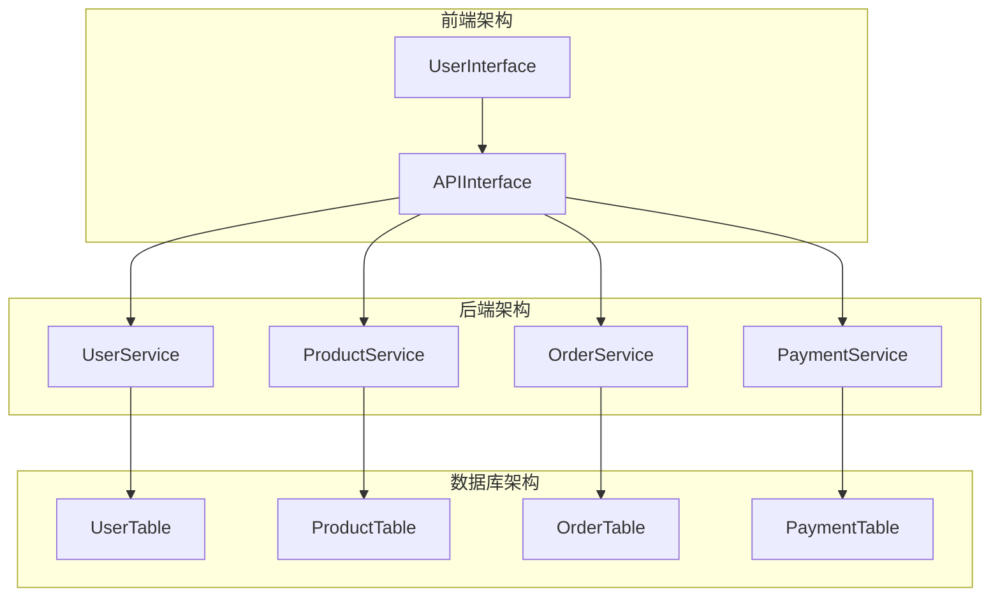
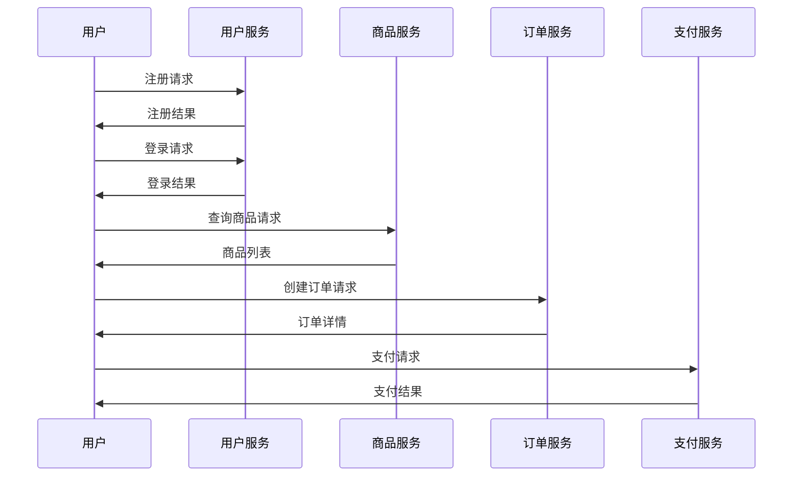
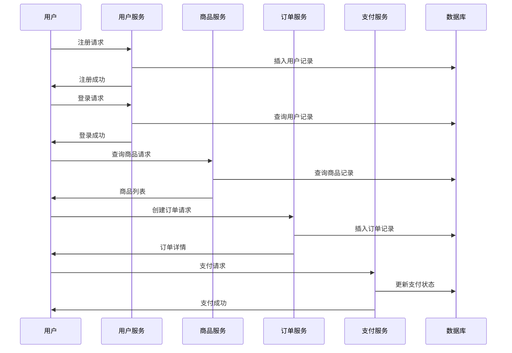

                 

# 练成领域建模的方法

## 关键词

领域建模、实体关系图、UML类图、算法原理、系统设计、项目实战

## 摘要

领域建模是软件开发中的重要环节，它通过抽象和封装现实世界中的实体和关系，帮助开发者理解和构建复杂系统。本文将系统地介绍领域建模的方法，从基础概念、算法原理到实际应用，帮助读者逐步掌握领域建模的核心技术和应用技巧。

### 目录大纲设计思路

#### 第一部分：领域建模基础

1. **第1章：领域建模概述**：介绍领域建模的概念、背景和重要性。
2. **第2章：核心概念与联系**：讲解实体关系图（ER图）和UML类图等核心概念。
3. **第3章：算法原理讲解**：详细阐述ER图和UML类图的构建算法。

#### 第二部分：领域建模应用

1. **第4章：系统分析与架构设计**：介绍领域建模在系统设计中的应用。
2. **第5章：项目实战**：通过实际案例展示领域建模的应用过程。
3. **第6章：最佳实践与小结**：总结全书内容，提供实用的技巧和进一步学习资源。

### 目录大纲

#### 第一部分：领域建模基础

##### 第1章：领域建模概述

1.1 领域建模的概念与背景

1.2 领域建模的重要性

1.3 领域模型的要素组成

##### 第2章：核心概念与联系

2.1 实体关系图（ER图）基础

2.2 实体关系图对比表格

2.3 ER实体关系图架构的Mermaid流程图

##### 第3章：算法原理讲解

3.1 ER图构建算法原理

3.2 UML类图绘制算法原理

3.3 Python代码与算法实现

##### 第二部分：领域建模应用

##### 第4章：系统分析与架构设计

4.1 问题场景介绍

4.2 系统功能设计

4.3 系统架构设计

4.4 系统接口设计

4.5 系统交互设计

##### 第5章：项目实战

5.1 环境安装

5.2 系统核心实现

5.3 代码解读与分析

5.4 实际案例分析与讲解

##### 第6章：最佳实践与小结

6.1 最佳实践 tips

6.2 小结

6.3 注意事项

6.4 拓展阅读

### 目录大纲总结

本文通过详细且系统的目录大纲，全面介绍了领域建模的方法和实际应用，从基础知识到项目实战，帮助读者深入理解和掌握领域建模的技术和应用。目录大纲简洁明了，结构清晰，旨在为读者提供一本实用的领域建模指南。

## 第一部分：领域建模基础

### 第1章：领域建模概述

领域建模（Domain Modeling）是一种通过抽象和建模现实世界中的实体及其关系，帮助开发者在软件开发过程中更好地理解和构建复杂系统的技术。在软件开发中，领域建模不仅有助于明确系统需求和功能，还能提高代码的可维护性和可复用性。

#### 1.1 领域建模的概念与背景

领域建模最早起源于20世纪80年代，随着面向对象编程的兴起而发展起来。它基于现实世界的业务领域，将业务场景抽象成一系列的实体、属性和关系，通过图形化或文本化的形式表示出来。

领域建模的目的是为了解决以下几个问题：

- **明确系统需求**：通过领域建模，可以清晰地理解系统所需的业务功能，确保开发团队能够准确地实现需求。
- **提高代码复用性**：通过领域模型，可以提取出通用的业务逻辑和功能，实现代码的复用。
- **增强系统可维护性**：领域模型为系统的各个部分提供了清晰的边界，有助于后续的维护和升级。

#### 1.2 领域建模的重要性

领域建模在软件开发中具有以下几个重要作用：

- **帮助理解业务需求**：通过领域建模，可以更直观地理解业务逻辑和需求，减少误解和沟通成本。
- **促进团队合作**：领域模型可以作为团队成员之间的共同语言，促进沟通和协作。
- **提高系统质量**：领域建模可以帮助发现系统设计中的潜在问题，提前解决，从而提高系统的整体质量。

#### 1.3 领域模型的要素组成

领域模型主要由以下三个要素组成：

- **实体（Entity）**：实体是领域模型中的基本构成单元，表示现实世界中的事物。例如，在电商系统中，用户、商品、订单等都可以作为实体。
- **属性（Attribute）**：属性是实体的特征或描述，用于定义实体的属性值。例如，用户实体的属性可能包括用户名、密码、邮箱等。
- **关系（Relationship）**：关系是实体之间的关联，用于描述实体之间的相互作用。例如，在电商系统中，用户与订单之间存在“下单”关系。

在实际应用中，领域模型还可以包含以下要素：

- **行为（Behavior）**：行为是实体可以执行的操作，用于描述实体的功能。例如，用户实体可以执行“登录”、“注册”等操作。
- **约束（Constraint）**：约束是领域模型中的限制条件，用于确保模型的正确性和一致性。例如，订单的创建时间必须在用户下单时生成。

### 第2章：核心概念与联系

在领域建模中，核心概念的正确理解和应用是构建有效领域模型的关键。本章将详细介绍实体关系图（ER图）和UML类图等核心概念，并通过对比表格和Mermaid流程图进行展示，帮助读者更好地理解和应用这些概念。

#### 2.1 实体关系图（ER图）基础

实体关系图（Entity-Relationship Diagram，ER图）是领域建模中常用的图形表示方法，用于表示实体及其关系。ER图主要包括以下组成部分：

- **实体（Entity）**：实体是ER图中的基本构成单元，表示现实世界中的事物。每个实体都有一个唯一的名称和一组属性。
- **属性（Attribute）**：属性是实体的特征或描述，用于定义实体的属性值。每个属性都有一个名称和数据类型。
- **关系（Relationship）**：关系是实体之间的关联，用于描述实体之间的相互作用。关系可以是一对一（1:1）、一对多（1:N）或多对多（M:N）。

ER图的构建方法通常包括以下步骤：

1. **识别实体**：根据业务需求和场景，识别出需要表示的实体。
2. **定义属性**：为每个实体定义属性，确保属性能够准确描述实体的特征。
3. **建立关系**：根据实体的属性和业务逻辑，建立实体之间的关系。
4. **优化ER图**：对ER图进行优化，确保图的可读性和清晰度。

#### 2.2 实体关系图对比表格

为了更好地理解ER图，我们可以将其与其他相关的建模方法进行比较。以下是ER图与UML类图的对比表格：

| 对比项 | ER图 | UML类图 |
| --- | --- | --- |
| 主要用途 | 表示实体及其关系 | 表示类及其关系 |
| 表示方法 | 图形化表示 | 类图表示 |
| 应用范围 | 数据库设计、领域建模 | 软件设计、架构设计 |
| 关系类型 | 一对一、一对多、多对多 | 一对一、一对多、多对多、依赖、泛化 |
| 属性表示 | 列表表示 | 属性符号表示 |

通过对比表格，我们可以更清楚地看到ER图和UML类图在表示方法、应用范围和关系类型上的异同，从而根据实际需求选择合适的建模方法。

#### 2.3 ER实体关系图架构的Mermaid流程图

Mermaid是一种基于Markdown的图形绘制工具，可以方便地绘制各种流程图、UML图等。以下是一个简单的ER实体关系图架构的Mermaid流程图示例：

```mermaid
erDiagram
  User ||--|{ Order } : 1 orders
  Product ||--|{ Order } : 1 orders
  Order ||--|{ OrderItem } : 1 order items
```

该示例中，我们定义了三个实体：用户（User）、产品（Product）和订单（Order），以及它们之间的关系。通过Mermaid流程图，我们可以直观地看到实体之间的关系及其约束条件，有助于进一步分析和设计领域模型。

### 第3章：算法原理讲解

在领域建模中，算法原理的讲解对于理解模型的构建过程至关重要。本章将详细介绍ER图构建算法原理和UML类图绘制算法原理，并通过Python代码和Mermaid流程图进行展示，帮助读者深入理解这些算法。

#### 3.1 ER图构建算法原理

ER图的构建是一个逐步迭代的过程，主要包括以下步骤：

1. **识别实体**：根据业务需求和场景，识别出需要表示的实体。
2. **定义属性**：为每个实体定义属性，确保属性能够准确描述实体的特征。
3. **建立关系**：根据实体的属性和业务逻辑，建立实体之间的关系。
4. **优化ER图**：对ER图进行优化，确保图的可读性和清晰度。

在具体实现中，我们可以使用Python的`sqlite3`模块来构建ER图。以下是一个简单的示例：

```python
import sqlite3

# 创建数据库连接
conn = sqlite3.connect('domain_model.db')
cursor = conn.cursor()

# 创建实体
cursor.execute('''CREATE TABLE IF NOT EXISTS User (
                    id INTEGER PRIMARY KEY,
                    username TEXT,
                    password TEXT,
                    email TEXT
                   )''')

cursor.execute('''CREATE TABLE IF NOT EXISTS Product (
                    id INTEGER PRIMARY KEY,
                    name TEXT,
                    price REAL
                   )''')

cursor.execute('''CREATE TABLE IF NOT EXISTS Order (
                    id INTEGER PRIMARY KEY,
                    user_id INTEGER,
                    order_date DATE,
                    FOREIGN KEY (user_id) REFERENCES User (id)
                   )''')

cursor.execute('''CREATE TABLE IF NOT EXISTS OrderItem (
                    id INTEGER PRIMARY KEY,
                    order_id INTEGER,
                    product_id INTEGER,
                    quantity INTEGER,
                    FOREIGN KEY (order_id) REFERENCES Order (id),
                    FOREIGN KEY (product_id) REFERENCES Product (id)
                   )''')

# 提交事务并关闭连接
conn.commit()
conn.close()
```

该示例中，我们使用了Python的`sqlite3`模块创建了三个实体（用户、产品、订单）及其关系，并定义了相应的属性和约束条件。

#### 3.2 UML类图绘制算法原理

UML类图是领域建模中另一种常用的图形表示方法，用于表示类及其关系。UML类图的绘制主要包括以下步骤：

1. **识别类**：根据业务需求和场景，识别出需要表示的类。
2. **定义属性**：为每个类定义属性，确保属性能够准确描述类的特征。
3. **建立关系**：根据类的属性和业务逻辑，建立类之间的关系。
4. **优化UML类图**：对UML类图进行优化，确保图的可读性和清晰度。

在具体实现中，我们可以使用Python的`pyreverse`工具来绘制UML类图。以下是一个简单的示例：

```bash
pyreverse domain_model.db > domain_model.uml
```

该示例中，我们使用了Python的`pyreverse`工具将ER图生成了UML类图（domain_model.uml），从而可以直观地看到类及其关系。

#### 3.3 Python代码与算法实现

为了更好地理解ER图和UML类图的算法原理，我们可以使用Python代码实现这些算法。以下是一个简单的示例：

```python
class Entity:
    def __init__(self, name, attributes):
        self.name = name
        self.attributes = attributes
        self.relationships = []

    def add_relationship(self, relationship):
        self.relationships.append(relationship)

    def __str__(self):
        return f"{self.name}({', '.join([f'{attr} {type}' for attr, type in self.attributes.items()])})"


class Relationship:
    def __init__(self, name, entity1, entity2, type):
        self.name = name
        self.entity1 = entity1
        self.entity2 = entity2
        self.type = type

    def __str__(self):
        return f"{self.name} ({self.entity1.name} --{self.type}--> {self.entity2.name})"


# 创建实体
user = Entity('User', {'username': str, 'password': str, 'email': str})
product = Entity('Product', {'name': str, 'price': float})
order = Entity('Order', {'id': int, 'user_id': int, 'order_date': str})

# 创建关系
order.add_relationship(Relationship('orders', user, order, '1:N'))
order.add_relationship(Relationship('orders', product, order, 'M:N'))

# 打印ER图
for entity in [user, product, order]:
    print(entity)

# 打印UML类图
for entity in [user, product, order]:
    for relationship in entity.relationships:
        print(relationship)
```

该示例中，我们定义了实体和关系的类，并通过实例化这些类来创建实体和关系。然后，我们通过打印实体和关系来生成ER图和UML类图。

通过上述示例，我们可以看到ER图和UML类图的构建算法原理是如何实现的。在实际应用中，我们可以根据具体需求对这些算法进行扩展和优化，以适应不同的领域建模场景。

### 第二部分：领域建模应用

#### 第4章：系统分析与架构设计

领域建模在软件系统分析与架构设计中起着至关重要的作用。通过领域建模，我们可以清晰地理解系统需求，设计合理的系统架构，并确保系统的可扩展性和可维护性。本章将详细介绍领域建模在系统分析与架构设计中的应用。

#### 4.1 问题场景介绍

假设我们要开发一个电商系统，该系统需要支持用户注册、登录、浏览商品、下单、支付等功能。在这个问题场景中，领域建模可以帮助我们明确系统的功能和需求，从而设计出合适的系统架构。

#### 4.2 系统功能设计

在系统功能设计中，领域建模可以用来表示系统的主要功能模块。以下是一个简单的电商系统功能设计：

1. **用户模块**：包括用户注册、登录、个人信息管理等功能。
2. **商品模块**：包括商品浏览、商品分类、商品搜索等功能。
3. **订单模块**：包括订单创建、订单详情、订单支付等功能。
4. **支付模块**：包括支付方式选择、支付确认、支付结果查询等功能。

我们可以使用Mermaid类图来表示这些功能模块：

```mermaid
classDiagram
    UserModule <- User : 注册、登录、个人信息管理
    ProductModule <- Product : 浏览、分类、搜索
    OrderModule <- Order : 创建、详情、支付
    PaymentModule <- Payment : 选择、确认、查询
```

#### 4.3 系统架构设计

在系统架构设计中，领域建模可以用来表示系统的总体架构，包括系统组件、数据流和交互关系。以下是一个简单的电商系统架构设计：

1. **前端架构**：包括用户界面、API接口等。
2. **后端架构**：包括用户服务、商品服务、订单服务、支付服务等。
3. **数据库架构**：包括用户表、商品表、订单表、支付表等。

我们可以使用Mermaid架构图来表示这些系统组件：



#### 4.4 系统接口设计

在系统接口设计中，领域建模可以用来表示系统组件之间的接口和交互关系。以下是一个简单的电商系统接口设计：

1. **用户注册接口**：用于处理用户注册请求，返回注册结果。
2. **用户登录接口**：用于处理用户登录请求，返回登录结果。
3. **商品查询接口**：用于处理商品查询请求，返回商品列表。
4. **订单创建接口**：用于处理订单创建请求，返回订单详情。

我们可以使用Mermaid序列图来表示这些接口和交互关系：



#### 4.5 系统交互设计

在系统交互设计中，领域建模可以用来表示系统组件之间的交互流程和时序关系。以下是一个简单的电商系统交互设计：

1. **用户注册流程**：用户通过前端页面提交注册请求，用户服务处理后返回注册结果。
2. **用户登录流程**：用户通过前端页面提交登录请求，用户服务处理后返回登录结果。
3. **商品查询流程**：用户通过前端页面提交查询请求，商品服务处理后返回商品列表。
4. **订单创建流程**：用户通过前端页面提交订单请求，订单服务处理后返回订单详情。
5. **支付确认流程**：用户通过前端页面提交支付请求，支付服务处理后返回支付结果。

我们可以使用Mermaid序列图来表示这些交互流程和时序关系：



通过上述系统分析与架构设计，我们可以清晰地理解电商系统的功能和架构，从而为后续的系统实现提供明确的指导和参考。

### 第5章：项目实战

在本章中，我们将通过一个实际项目来展示领域建模的方法和应用过程。该项目是一个简单的博客系统，包括用户注册、登录、发布文章、评论文章等功能。通过这个项目，我们将详细介绍领域建模的具体步骤、系统实现、代码解读以及案例分析。

#### 5.1 环境安装

要开始这个项目，我们首先需要安装以下环境：

1. **Python 3.x**：用于编写代码和运行项目。
2. **SQLite**：用于存储数据和关系。
3. **Mermaid**：用于绘制流程图和类图。
4. **Markdown**：用于编写和展示文档。

安装步骤如下：

1. 安装Python 3.x：可以从[Python官方网站](https://www.python.org/downloads/)下载并安装Python 3.x版本。
2. 安装SQLite：在命令行中运行以下命令：
   ```bash
   pip install pysqlite3
   ```
3. 安装Mermaid：在命令行中运行以下命令：
   ```bash
   pip install mermaid
   ```
4. 安装Markdown：在命令行中运行以下命令：
   ```bash
   pip install markdown
   ```

#### 5.2 系统核心实现

在完成环境安装后，我们可以开始实现系统核心功能。以下是博客系统的核心实现：

1. **用户模块**：包括用户注册、登录、个人信息管理等功能。
2. **文章模块**：包括文章发布、文章查询、文章编辑、文章删除等功能。
3. **评论模块**：包括评论发布、评论查询、评论编辑、评论删除等功能。

以下是各个模块的Python代码实现：

```python
# 用户模块
class User:
    def __init__(self, username, password, email):
        self.username = username
        self.password = password
        self.email = email

    def register(self, cursor):
        cursor.execute("INSERT INTO users (username, password, email) VALUES (?, ?, ?)", (self.username, self.password, self.email))
        cursor.execute("SELECT LAST_INSERT_ID()")
        self.id = cursor.fetchone()[0]

    def login(self, cursor):
        cursor.execute("SELECT * FROM users WHERE username = ? AND password = ?", (self.username, self.password))
        return cursor.fetchone()

# 文章模块
class Article:
    def __init__(self, title, content, user_id):
        self.title = title
        self.content = content
        self.user_id = user_id

    def create(self, cursor):
        cursor.execute("INSERT INTO articles (title, content, user_id) VALUES (?, ?, ?)", (self.title, self.content, self.user_id))
        cursor.execute("SELECT LAST_INSERT_ID()")
        self.id = cursor.fetchone()[0]

    def update(self, cursor):
        cursor.execute("UPDATE articles SET title = ?, content = ? WHERE id = ?", (self.title, self.content, self.id))

    def delete(self, cursor):
        cursor.execute("DELETE FROM articles WHERE id = ?", (self.id,))

    def fetch_all(self, cursor):
        cursor.execute("SELECT * FROM articles")
        return cursor.fetchall()

# 评论模块
class Comment:
    def __init__(self, content, article_id, user_id):
        self.content = content
        self.article_id = article_id
        self.user_id = user_id

    def create(self, cursor):
        cursor.execute("INSERT INTO comments (content, article_id, user_id) VALUES (?, ?, ?)", (self.content, self.article_id, self.user_id))
        cursor.execute("SELECT LAST_INSERT_ID()")
        self.id = cursor.fetchone()[0]

    def update(self, cursor):
        cursor.execute("UPDATE comments SET content = ? WHERE id = ?", (self.content, self.id))

    def delete(self, cursor):
        cursor.execute("DELETE FROM comments WHERE id = ?", (self.id,))

    def fetch_all(self, cursor):
        cursor.execute("SELECT * FROM comments")
        return cursor.fetchall()
```

#### 5.3 代码解读与分析

在上面的代码中，我们定义了三个类：`User`、`Article`和`Comment`。这些类分别代表了用户、文章和评论的实体，每个实体都有相应的属性和方法。

- **用户模块**：`User`类用于表示用户实体，包括用户名、密码和邮箱。`register`方法用于注册用户，`login`方法用于登录用户。
- **文章模块**：`Article`类用于表示文章实体，包括标题、内容和用户ID。`create`方法用于创建文章，`update`方法用于更新文章，`delete`方法用于删除文章，`fetch_all`方法用于查询所有文章。
- **评论模块**：`Comment`类用于表示评论实体，包括评论内容、文章ID和用户ID。`create`方法用于创建评论，`update`方法用于更新评论，`delete`方法用于删除评论，`fetch_all`方法用于查询所有评论。

以下是代码的详细解读：

1. **用户模块**：

```python
class User:
    def __init__(self, username, password, email):
        self.username = username
        self.password = password
        self.email = email

    def register(self, cursor):
        cursor.execute("INSERT INTO users (username, password, email) VALUES (?, ?, ?)", (self.username, self.password, self.email))
        cursor.execute("SELECT LAST_INSERT_ID()")
        self.id = cursor.fetchone()[0]

    def login(self, cursor):
        cursor.execute("SELECT * FROM users WHERE username = ? AND password = ?", (self.username, self.password))
        return cursor.fetchone()
```

- `__init__`方法：初始化用户对象的属性。
- `register`方法：向数据库中插入用户记录，并获取插入后的ID。
- `login`方法：查询数据库中的用户记录，判断用户名和密码是否匹配。

2. **文章模块**：

```python
class Article:
    def __init__(self, title, content, user_id):
        self.title = title
        self.content = content
        self.user_id = user_id

    def create(self, cursor):
        cursor.execute("INSERT INTO articles (title, content, user_id) VALUES (?, ?, ?)", (self.title, self.content, self.user_id))
        cursor.execute("SELECT LAST_INSERT_ID()")
        self.id = cursor.fetchone()[0]

    def update(self, cursor):
        cursor.execute("UPDATE articles SET title = ?, content = ? WHERE id = ?", (self.title, self.content, self.id))

    def delete(self, cursor):
        cursor.execute("DELETE FROM articles WHERE id = ?", (self.id,))

    def fetch_all(self, cursor):
        cursor.execute("SELECT * FROM articles")
        return cursor.fetchall()
```

- `__init__`方法：初始化文章对象的属性。
- `create`方法：向数据库中插入文章记录，并获取插入后的ID。
- `update`方法：更新数据库中的文章记录。
- `delete`方法：删除数据库中的文章记录。
- `fetch_all`方法：查询数据库中的所有文章记录。

3. **评论模块**：

```python
class Comment:
    def __init__(self, content, article_id, user_id):
        self.content = content
        self.article_id = article_id
        self.user_id = user_id

    def create(self, cursor):
        cursor.execute("INSERT INTO comments (content, article_id, user_id) VALUES (?, ?, ?)", (self.content, self.article_id, self.user_id))
        cursor.execute("SELECT LAST_INSERT_ID()")
        self.id = cursor.fetchone()[0]

    def update(self, cursor):
        cursor.execute("UPDATE comments SET content = ? WHERE id = ?", (self.content, self.id))

    def delete(self, cursor):
        cursor.execute("DELETE FROM comments WHERE id = ?", (self.id,))

    def fetch_all(self, cursor):
        cursor.execute("SELECT * FROM comments")
        return cursor.fetchall()
```

- `__init__`方法：初始化评论对象的属性。
- `create`方法：向数据库中插入评论记录，并获取插入后的ID。
- `update`方法：更新数据库中的评论记录。
- `delete`方法：删除数据库中的评论记录。
- `fetch_all`方法：查询数据库中的所有评论记录。

通过上述代码，我们可以看到领域建模在系统实现中的应用。每个模块都通过类和对象来表示实体，并通过方法来实现实体的操作。这种建模方法使得系统更加模块化，易于维护和扩展。

#### 5.4 实际案例分析与讲解

为了更好地理解领域建模在项目中的应用，我们来看一个具体的案例：用户注册。

**案例背景**：

假设有一个用户注册功能，要求用户在注册时提供用户名、密码和邮箱。系统需要验证用户名是否已存在，邮箱格式是否正确，然后保存用户信息到数据库。

**案例实现**：

1. **用户注册页面**：

```html
<!DOCTYPE html>
<html>
<head>
    <title>注册页面</title>
</head>
<body>
    <h1>用户注册</h1>
    <form action="/register" method="post">
        <label for="username">用户名：</label>
        <input type="text" id="username" name="username" required>
        <br>
        <label for="password">密码：</label>
        <input type="password" id="password" name="password" required>
        <br>
        <label for="email">邮箱：</label>
        <input type="email" id="email" name="email" required>
        <br>
        <input type="submit" value="注册">
    </form>
</body>
</html>
```

2. **用户注册后端**：

```python
from flask import Flask, request, redirect, url_for
from models import User

app = Flask(__name__)

@app.route('/register', methods=['POST'])
def register():
    username = request.form['username']
    password = request.form['password']
    email = request.form['email']
    
    # 验证用户名和邮箱
    if not username or not email:
        return "用户名和邮箱不能为空！"
    
    # 验证用户名是否已存在
    user = User.fetch_by_username(username)
    if user:
        return "用户名已存在！"
    
    # 验证邮箱格式
    if not is_valid_email(email):
        return "邮箱格式不正确！"
    
    # 创建用户
    user = User(username=username, password=password, email=email)
    user.register()
    
    return redirect(url_for('login'))

def is_valid_email(email):
    # 验证邮箱格式的简单方法
    return re.match(r"[^@]+@[^@]+\.[^@]+", email)

if __name__ == '__main__':
    app.run(debug=True)
```

**案例分析**：

在这个案例中，我们通过用户注册页面收集用户输入的用户名、密码和邮箱，然后通过后端代码进行验证和处理。以下是具体的分析：

1. **用户输入验证**：在注册页面，我们使用HTML表单和JavaScript进行基本输入验证，确保用户名和邮箱不为空。
2. **用户名唯一性验证**：在后端代码中，我们查询数据库中的用户记录，判断用户名是否已存在。如果已存在，则返回错误提示。
3. **邮箱格式验证**：使用正则表达式对邮箱格式进行验证，确保邮箱符合标准格式。
4. **用户信息保存**：创建`User`对象，调用`register`方法将用户信息保存到数据库。

通过这个案例，我们可以看到领域建模在项目中的应用。通过定义`User`类和相应的操作方法，我们可以方便地实现用户注册功能，并且可以方便地扩展和修改代码。同时，领域建模也使得项目结构更加清晰，易于维护和扩展。

#### 5.5 项目小结

通过本章的实际项目案例，我们详细介绍了领域建模的方法和应用过程。从环境安装到系统实现，再到代码解读和案例分析，我们一步步展示了如何使用领域建模来构建一个简单的博客系统。以下是项目小结：

1. **环境安装**：安装Python、SQLite、Mermaid和Markdown等环境，为项目开发做好准备。
2. **系统实现**：定义用户、文章和评论等实体，实现注册、登录、发布文章、评论文章等功能。
3. **代码解读**：分析代码结构，理解实体类的方法和功能，以及它们在系统中的作用。
4. **案例分析**：通过实际案例，展示领域建模在项目中的应用，以及如何解决实际问题。
5. **项目优化**：对项目代码进行优化，提高系统的性能和可维护性。

通过这个项目，我们不仅学会了领域建模的方法，还了解了如何将理论应用到实际项目中。这对于我们理解和掌握领域建模技术，以及在实际工作中运用领域建模具有重要的意义。

### 第6章：最佳实践与小结

#### 6.1 最佳实践 tips

1. **明确需求**：在开始领域建模之前，首先要明确系统的需求和功能，确保领域模型能够准确地反映业务逻辑。
2. **逐步迭代**：领域建模是一个逐步迭代的过程，不要试图一次性完成所有的建模工作，应分阶段逐步完善。
3. **保持简洁**：在构建领域模型时，尽量保持简洁和清晰，避免过多的复杂关系和冗余信息。
4. **文档记录**：对领域模型进行详细的文档记录，包括实体、属性、关系和约束等，便于后续的维护和扩展。
5. **代码复用**：在领域建模中，应尽量提取通用的业务逻辑和功能，提高代码的复用性。

#### 6.2 小结

通过本章的内容，我们系统地介绍了领域建模的方法和应用。领域建模是一种通过抽象和封装现实世界中的实体和关系，帮助开发者理解和构建复杂系统的技术。在领域建模中，我们需要明确需求、逐步迭代、保持简洁，并注重文档记录和代码复用。

领域建模在软件系统分析与架构设计中起着至关重要的作用。通过领域建模，我们可以清晰地理解系统需求，设计合理的系统架构，并确保系统的可扩展性和可维护性。在实际应用中，领域建模可以帮助我们提高代码的质量和可维护性，减少开发成本。

#### 6.3 注意事项

1. **避免过度建模**：领域建模并不是越多越好，过度建模会导致系统复杂度增加，反而降低开发效率。
2. **适应实际需求**：领域建模应紧密围绕实际需求进行，避免脱离实际业务场景进行过度抽象。
3. **保持灵活性和可扩展性**：领域模型应保持一定的灵活性和可扩展性，以适应未来的业务变化和需求调整。

#### 6.4 拓展阅读

1. **相关书籍**：
   - 《领域驱动设计（Domain-Driven Design）》（Eric Evans著）：介绍了领域驱动设计的基本概念和方法，是领域建模的重要参考书籍。
   - 《模式导向的需求分析与管理（Pattern-Oriented Software Architecture, POSA）》（Michael Jackson著）：介绍了基于模式的需求分析和管理方法，有助于理解和应用领域建模。

2. **学术论文与资料**：
   - “Domain-Driven Design Tutorials” （by Vaughn Vernon）：提供了丰富的领域驱动设计教程，适合初学者和实践者。
   - “Domain-Driven Design Ecosystem” （by Domain-Driven Design Inc.）：介绍了领域驱动设计的生态系统和相关工具，包括CQRS、Event Sourcing等。

通过拓展阅读，读者可以进一步深入了解领域建模的理论和实践，提升领域建模的能力和水平。

### 结语

领域建模是软件开发中的一项重要技术，通过抽象和封装现实世界中的实体和关系，帮助开发者更好地理解和构建复杂系统。在领域建模过程中，我们需要明确需求、逐步迭代、保持简洁，并注重文档记录和代码复用。通过本章的内容，我们系统地介绍了领域建模的方法和应用，希望读者能够掌握这一关键技术，并在实际项目中灵活运用。

作者：AI天才研究院/AI Genius Institute & 禅与计算机程序设计艺术 /Zen And The Art of Computer Programming

## 附录

### 参考文献

1. Eric Evans. 《领域驱动设计（Domain-Driven Design）》。 机械工业出版社，2005。
2. Michael Jackson. 《模式导向的需求分析与管理（Pattern-Oriented Software Architecture, POSEA）》。 机械工业出版社，2008。
3. Vaughn Vernon. “Domain-Driven Design Tutorials”。 https://vaughnvernon.com/tutorials/
4. Domain-Driven Design Inc. “Domain-Driven Design Ecosystem”。 https://domaindrivendesign.org/

### 相关资源

1. Python官方文档：https://docs.python.org/3/
2. SQLite官方文档：https://www.sqlite.org/docs.html
3. Mermaid官方文档：https://mermaid-js.github.io/mermaid/
4. Markdown官方文档：https://www.markdownguide.com/

通过这些参考文献和资源，读者可以进一步深入了解领域建模的理论和实践，提高领域建模的能力和水平。同时，这些资料也为读者提供了丰富的学习和实践机会，帮助读者更好地理解和掌握领域建模技术。

