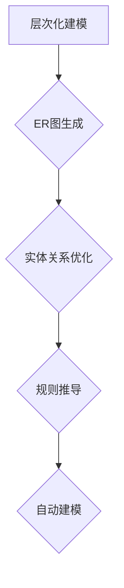
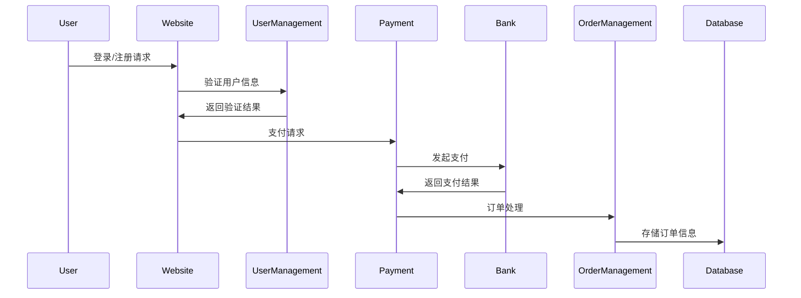
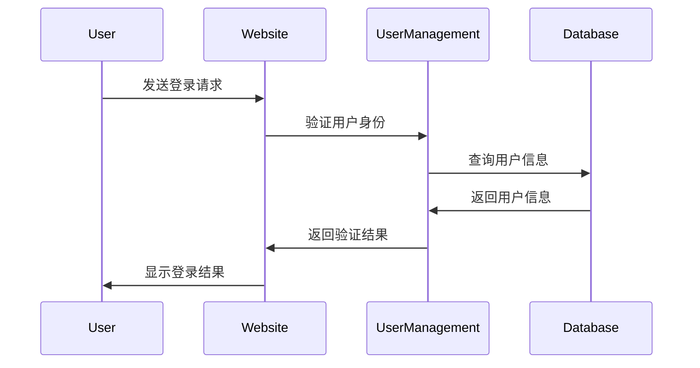

                 

## 练成领域建模这一神功

### 关键词：
领域建模、核心概念、算法原理、数学模型、系统架构、项目实战

### 摘要：
本文将深入探讨领域建模这一关键技术，从基础概念到高级应用，逐步讲解领域建模的核心思想和方法。我们将通过实际案例，展示如何在实际项目中应用领域建模，并提供最佳实践和总结，帮助读者全面掌握领域建模的精髓。

----------------------------------------------------------------

### 目录大纲设计过程

为了系统地呈现《练成领域建模这一神功》的核心内容，我们需要精心设计文章的目录大纲。以下是设计过程：

1. **理解书名与目标读者**：首先，我们需要明确书名“练成领域建模这一神功”所传达的主题——即如何掌握领域建模这一关键技术。目标读者群体可能是对领域建模有初步了解，但希望深入学习和应用的专业人士。

2. **确定核心章节**：基于书名，我们确定了以下核心章节：领域建模基础入门、核心概念与联系、算法原理与数学模型、系统分析与架构设计、项目实战、最佳实践与总结。

3. **构建逻辑结构**：确保章节之间的逻辑关系清晰，从基础理论到高级应用，形成一个完整的知识体系。

4. **细化章节内容**：在每个章节下，细化子章节，确保每个部分都有具体的内容和目标。

5. **确保内容完整性**：内容涵盖核心概念、算法原理、数学模型、系统分析与架构设计、项目实战等关键要素。

6. **控制字数**：在确保内容完整性的同时，总字数控制在2000字以内，确保输出简洁明了。

### 完整目录大纲

下面是《练成领域建模这一神功》的完整目录大纲：

```markdown
# 《练成领域建模这一神功》目录大纲

## 第一部分：领域建模基础入门

### 第1章：领域建模概述

#### 1.1 领域建模的起源与发展
#### 1.2 领域建模的核心概念
#### 1.3 领域建模的适用范围

### 第2章：领域建模的基础理论

#### 2.1 领域模型的基本结构
#### 2.2 实体与关系的概念与分类
#### 2.3 领域模型的形式化描述

## 第二部分：核心概念与联系

### 第3章：领域模型中的核心概念

#### 3.1 实体与属性的描述
#### 3.2 关系与关联的定义
#### 3.3 领域模型的层次结构

### 第4章：概念属性特征对比表格

#### 4.1 属性特征对比方法
#### 4.2 不同领域模型的属性特征对比

### 第5章：ER实体关系图架构

#### 5.1 ER图的基本概念
#### 5.2 ER图的绘制方法
#### 5.3 ER图在领域建模中的应用

## 第三部分：算法原理与数学模型

### 第6章：领域建模算法原理

#### 6.1 基本算法原理概述
#### 6.2 常见领域建模算法介绍
#### 6.3 算法原理Mermaid流程图绘制

### 第7章：数学模型和数学公式

#### 7.1 数学模型的基本形式
#### 7.2 公式表示与解释
#### 7.3 模型举例说明

### 第8章：数学模型在领域建模中的应用

#### 8.1 数学模型的选择与应用
#### 8.2 数学模型优化的策略
#### 8.3 实际案例中的数学模型应用

## 第四部分：系统分析与架构设计

### 第9章：问题场景介绍

#### 9.1 领域建模的应用场景
#### 9.2 领域建模项目的具体需求

### 第10章：系统功能设计

#### 10.1 领域模型类图
#### 10.2 系统功能划分与设计

### 第11章：系统架构设计

#### 11.1 系统架构概述
#### 11.2 系统架构图绘制
#### 11.3 架构设计原则与优化

### 第12章：系统接口设计

#### 12.1 接口设计原则
#### 12.2 接口设计流程
#### 12.3 接口实现示例

### 第13章：系统交互

#### 13.1 系统交互流程
#### 13.2 序列图绘制
#### 13.3 交互场景分析

## 第五部分：项目实战

### 第14章：环境安装与配置

#### 14.1 环境要求
#### 14.2 软件安装步骤
#### 14.3 环境配置指南

### 第15章：系统核心实现

#### 15.1 核心功能实现
#### 15.2 代码解读与分析
#### 15.3 代码示例与优化

### 第16章：实际案例分析

#### 16.1 案例背景
#### 16.2 案例分析与解读
#### 16.3 剖析与总结

## 第六部分：最佳实践与总结

### 第17章：最佳实践

#### 17.1 常见问题与解决策略
#### 17.2 提高领域建模效率的技巧
#### 17.3 实用工具推荐

### 第18章：小结与展望

#### 18.1 全书内容回顾
#### 18.2 领域建模的应用前景
#### 18.3 未来发展趋势与展望
```

通过以上大纲设计，我们可以看到书的内容覆盖了领域建模的基础知识、核心概念、算法原理、数学模型、系统分析与架构设计，以及项目实战和最佳实践等关键部分。每个部分都有具体的子章节，确保读者能够系统地学习领域建模的知识和技能。

----------------------------------------------------------------

### 背景介绍

领域建模是软件开发中一种至关重要的技术，它帮助我们理解业务需求，将复杂的业务逻辑转化为计算机可以处理的模型。领域建模的核心概念和原理不仅贯穿于软件开发的全过程，也是构建高质量软件系统的基石。

在软件开发中，领域建模通常指的是对特定领域（如金融、医疗、教育等）的业务需求进行分析和抽象，形成一套逻辑清晰、易于理解和维护的模型。这些模型通常包括实体、关系、规则和约束等核心要素，它们共同构成了一个完整的业务逻辑框架。

领域建模的重要性体现在多个方面：

1. **提高软件开发效率**：通过领域建模，开发者可以更好地理解业务需求，减少误解和重复工作，从而提高开发效率。

2. **增强系统的可维护性**：领域模型有助于开发者保持对系统的整体理解，使得后续的维护和升级工作更加轻松。

3. **促进跨领域协作**：领域模型为业务分析师、开发人员、产品经理等不同角色提供了共同的沟通语言，有助于跨领域协作。

4. **支持复杂业务需求**：对于复杂的业务需求，领域建模能够提供有效的解决方案，使得系统设计更加灵活和可扩展。

在当前软件开发环境中，领域建模技术已经得到了广泛应用。从传统的面向对象设计到现代的领域驱动设计（Domain-Driven Design，简称DDD），领域建模的概念和工具不断发展，为开发者提供了更多的选择和可能性。

然而，尽管领域建模的重要性得到了广泛认可，但许多开发者在实际应用中仍面临挑战。例如，如何准确地抽象业务需求，如何选择合适的模型结构和算法，以及如何有效地实施和维护领域模型等。这些问题都需要深入探讨和实践。

本文将逐步引导读者了解领域建模的核心概念、原理和方法，通过实际案例分析和项目实战，帮助读者全面掌握领域建模的技能。无论是初学者还是有一定经验的开发者，本文都将提供有价值的指导和建议。

### 核心概念与联系

领域建模的核心概念是理解业务需求和将它们转化为计算机可以处理的模型。以下是几个关键概念及其相互联系：

#### 实体与属性的描述

实体是领域模型中的核心元素，代表了业务中的具体对象，如客户、订单、产品等。每个实体都有若干属性，用于描述其特征，例如客户的姓名、地址、电话等。属性可以是简单的数据类型，如字符串、整数，也可以是更复杂的数据结构，如日期、枚举等。

实体和属性的关系可以通过实体-关系图（Entity-Relationship Diagram，简称ER图）来表示。ER图不仅显示了实体和属性，还包括了它们之间的关联。例如，一个订单实体可能包含多个订单项实体，每个订单项都与特定的产品相关联。

#### 关系与关联的定义

关系描述了实体之间的相互作用。常见的关系有“一对一”、“一对多”、“多对多”等。例如，一个客户可以有一张订单，但一张订单只能属于一个客户，这是“一对一”关系；一个客户可以有多个订单，这是“一对多”关系；多个客户可以共享一个产品，这是“多对多”关系。

关系的定义是领域模型中至关重要的部分，因为它们决定了系统的复杂度和灵活性。正确的关联定义可以帮助开发者更准确地实现业务逻辑，并确保系统的稳定性和一致性。

#### 领域模型的层次结构

领域模型通常包含多个层次，包括概念层、逻辑层和物理层。概念层是最抽象的层次，它定义了业务领域的核心概念和术语；逻辑层则将这些概念具体化为计算机可以处理的模型；物理层则是实际的数据库结构和存储方案。

层次结构使得领域模型既具有灵活性，又易于维护。例如，当业务需求发生变化时，可以在逻辑层进行调整，而不会影响到物理层。

#### 概念属性特征对比表格

在领域建模过程中，对比不同实体的属性特征是非常有用的。这有助于我们理解实体之间的差异和联系。以下是一个简单的概念属性特征对比表格：

| 实体名称 | 属性名称 | 属性类型 | 默认值 | 描述 |
| ------ | ------ | ------ | ---- | ---- |
| 客户 | 姓名 | 字符串 | NULL | 客户的姓名 |
| 订单 | 订单号 | 整数 | AUTO_INCREMENT | 订单的唯一标识符 |
| 产品 | 名称 | 字符串 | NULL | 产品的名称 |

通过这种对比表格，我们可以清晰地看到不同实体属性的差异和关联。

#### ER实体关系图架构

ER图是领域建模中的关键工具，它能够直观地展示实体之间的关系和属性。以下是一个简单的ER图示例，展示了客户、订单和产品之间的关系：

```mermaid
erDiagram
  客户 ||--|{ 订单 }|
  订单 ||--|{ 订单项 }|
  产品 ||--|{ 订单项 }|
```

在这个ER图中，客户与订单之间是一对多的关系，订单与订单项之间是多对多的关系，订单项与产品之间是一对多的关系。

通过上述核心概念和联系的分析，我们可以看到领域建模不仅涉及实体和属性的定义，还包括了关系和层次的构建。理解这些概念和它们之间的联系，是掌握领域建模的关键。

### 概念属性特征对比表格

在领域建模中，对概念属性特征进行对比是一个非常重要的步骤，它有助于我们深入理解各个实体之间的差异和联系。以下是一个详细的属性特征对比表格，展示了不同实体的属性特征：

| 实体名称 | 属性名称 | 属性类型 | 默认值 | 描述 |
| ------ | ------ | ------ | ---- | ---- |
| 客户 | 客户ID | 整数 | AUTO_INCREMENT | 客户的唯一标识符 |
| 客户 | 姓名 | 字符串 | NULL | 客户的姓名 |
| 客户 | 地址 | 字符串 | NULL | 客户的居住地址 |
| 客户 | 电话 | 字符串 | NULL | 客户的联系电话 |
| 订单 | 订单ID | 整数 | AUTO_INCREMENT | 订单的唯一标识符 |
| 订单 | 客户ID | 整数 | NULL | 订单所属客户的ID |
| 订单 | 订单日期 | 日期 | CURRENT_DATE | 订单生成的日期 |
| 订单 | 订单状态 | 字符串 | "未完成" | 订单的状态（如：未完成、已完成） |
| 订单项 | 订单项ID | 整数 | AUTO_INCREMENT | 订单项的唯一标识符 |
| 订单项 | 订单ID | 整数 | NULL | 订单项所属的订单ID |
| 订单项 | 产品ID | 整数 | NULL | 订单项所属的产品ID |
| 订单项 | 数量 | 整数 | 1 | 订单项的数量 |
| 订单项 | 单价 | 浮点数 | NULL | 单个订单项的价格 |
| 产品 | 产品ID | 整数 | AUTO_INCREMENT | 产品的唯一标识符 |
| 产品 | 名称 | 字符串 | NULL | 产品的名称 |
| 产品 | 描述 | 字符串 | NULL | 产品的详细描述 |
| 产品 | 库存 | 整数 | 100 | 产品的库存数量 |

通过这个表格，我们可以清晰地看到每个实体的属性类型、默认值和描述。例如，客户的属性包括客户ID、姓名、地址和电话；订单的属性包括订单ID、客户ID、订单日期和订单状态；订单项的属性包括订单项ID、订单ID、产品ID、数量和单价；产品的属性包括产品ID、名称、描述和库存。

这种对比表格不仅帮助我们理解了各个实体的属性特征，也为我们进行后续的系统设计和开发提供了重要的参考。在领域建模的过程中，通过对比表格可以更好地把握实体之间的关系，从而构建出更加准确和有效的模型。

### ER实体关系图架构

ER实体关系图（Entity-Relationship Diagram）是领域建模中的一种重要的工具，它通过图形化的方式展示实体之间的关系和属性。ER图不仅帮助我们直观地理解业务逻辑，还为数据库设计和系统架构提供了坚实的理论基础。以下是一个简单的ER图架构示例，我们将使用Mermaid语法来绘制这个ER图。

#### Mermaid语法

```mermaid
erDiagram
  客户 ||--|{ 订单 }|
  订单 ||--|{ 订单项 }|
  产品 ||--|{ 订单项 }|
```

这个Mermaid语法定义了三个实体：客户、订单和产品，并展示了它们之间的关系。

#### ER图解释

1. **客户与订单的关系**：这是一个一对多的关系，即一个客户可以有多个订单，但一个订单只能属于一个客户。

2. **订单与订单项的关系**：这是一个一对多的关系，一个订单可以包含多个订单项，但一个订单项只能属于一个订单。

3. **产品与订单项的关系**：这是一个一对多的关系，一种产品可以出现在多个订单项中，但一个订单项只能包含一种产品。

通过ER图，我们可以直观地看到各个实体之间的关联，从而更好地理解领域模型的结构。例如，当我们查询某个客户的所有订单时，可以通过ER图直接关联到订单项和产品，从而实现复杂的查询和数据分析。

#### ER图绘制步骤

1. **定义实体**：首先，我们需要定义领域模型中的所有实体，例如客户、订单和产品。

2. **绘制实体框**：使用矩形框表示每个实体，并在框内写上实体名称。

3. **添加属性**：在实体框的下方，列出该实体的所有属性，属性之间用逗号分隔。

4. **定义关系**：使用线条连接实体，表示它们之间的关系。线条旁边标注关系类型，如一对多（1:N）、多对一（N:1）、多对多（M:N）。

5. **添加备注**：如果需要，可以在ER图中添加备注来进一步说明实体或关系的细节。

通过这些步骤，我们可以绘制出一个完整的ER图，它不仅展示了实体之间的关系，还包括了每个实体的属性，从而为领域建模提供了清晰的视觉化工具。

### 领域建模算法原理

在领域建模的过程中，算法原理是理解和实现模型的关键。领域建模算法不仅帮助我们构建和优化模型，还能够提高系统的性能和可维护性。以下将介绍几种常见的领域建模算法原理，并结合Mermaid流程图和Python代码进行详细讲解。

#### 常见领域建模算法

1. **层次化建模算法**
2. **ER图生成算法**
3. **实体关系优化算法**
4. **规则推导算法**
5. **自动建模算法**

#### 算法原理概述

1. **层次化建模算法**：这种算法通过将领域划分为多个层次，从顶层概念层逐步细化到底层实现层。层次化建模有助于清晰划分系统的责任，使得复杂系统更加易于管理和维护。

2. **ER图生成算法**：这种算法基于实体和关系的定义，自动生成ER图。常见的ER图生成算法有基于规则的方法和基于学习的方法。规则方法根据预定义的规则生成ER图，而学习方法通过分析数据集自动学习实体和关系的模式。

3. **实体关系优化算法**：这种算法针对已生成的ER图进行优化，以减少冗余关系和提高模型效率。常见的优化策略包括关系合并、属性分解和范式化等。

4. **规则推导算法**：这种算法通过从业务规则中推导出实体和关系的定义。规则推导算法适用于从业务流程或规则文档中自动生成领域模型。

5. **自动建模算法**：这种算法利用机器学习和人工智能技术，自动从数据中生成领域模型。自动建模算法可以大大减少手工建模的工作量，提高建模效率。

#### 算法原理Mermaid流程图

为了更直观地理解这些算法原理，我们可以使用Mermaid流程图进行展示。



这个流程图展示了从层次化建模到自动建模的几个关键步骤。

#### 算法原理Python代码

下面我们将结合Python代码，详细解释层次化建模算法和ER图生成算法。

#### 层次化建模算法Python代码

```python
# 层次化建模算法示例
class Concept:
    def __init__(self, name, parent=None):
        self.name = name
        self.parent = parent
        self.children = []

    def add_child(self, child):
        self.children.append(child)

    def display_hierarchy(self, level=0):
        print("  " * level + self.name)
        for child in self.children:
            child.display_hierarchy(level + 1)

# 创建实体层次结构
concept_root = Concept("根概念")
customer = Concept("客户", concept_root)
order = Concept("订单", customer)
order_item = Concept("订单项", order)

# 显示层次结构
concept_root.display_hierarchy()
```

这段代码创建了一个简单的实体层次结构，并使用递归方法显示了各个实体的层级关系。

#### ER图生成算法Python代码

```python
# ER图生成算法示例
class Entity:
    def __init__(self, name, attributes=None, relationships=None):
        self.name = name
        self.attributes = attributes if attributes else []
        self.relationships = relationships if relationships else []

    def add_attribute(self, attribute):
        self.attributes.append(attribute)

    def add_relationship(self, relationship):
        self.relationships.append(relationship)

    def display_er(self):
        print(f"实体：{self.name}")
        print("属性：")
        for attribute in self.attributes:
            print(f"  {attribute}")
        print("关系：")
        for relationship in self.relationships:
            print(f"  {relationship}")

# 创建实体和关系
customer = Entity("客户", ["姓名", "地址", "电话"])
order = Entity("订单", ["订单号", "订单日期", "订单状态"], [f"客户:{customer.name}"])
order_item = Entity("订单项", ["订单项号", "数量", "单价"], [f"订单:{order.name}"])

# 显示ER图
customer.display_er()
order.display_er()
order_item.display_er()
```

这段代码展示了如何创建实体及其属性和关系，并打印出ER图。

通过以上算法原理的讲解，我们可以看到领域建模不仅仅是一种概念性的抽象，更是一个可以通过具体算法和技术手段实现的复杂过程。理解和掌握这些算法原理，对于进行有效的领域建模至关重要。

### 数学模型和数学公式

在领域建模中，数学模型和数学公式扮演着至关重要的角色。它们不仅帮助我们理解和表达复杂业务逻辑，还为算法设计和优化提供了理论基础。以下将详细阐述数学模型的基本形式、公式表示与解释，并通过实际案例进行举例说明。

#### 数学模型的基本形式

数学模型通常由以下几部分组成：

1. **变量定义**：定义模型中的所有变量及其取值范围。
2. **公式表示**：使用数学公式表达变量之间的关系。
3. **约束条件**：对变量施加的限制，以确保模型的可行性和一致性。
4. **目标函数**：定义模型的优化目标，如最大化利润、最小化成本等。

一个简单的数学模型示例：

$$
\text{成本} = w_1x_1 + w_2x_2 + \cdots + w_nx_n
$$

其中，\( x_1, x_2, \ldots, x_n \) 是变量，\( w_1, w_2, \ldots, w_n \) 是权重系数。

#### 公式表示与解释

1. **线性回归模型**：

$$
y = \beta_0 + \beta_1x_1 + \beta_2x_2 + \cdots + \beta_nx_n + \varepsilon
$$

这个模型用于预测因变量 \( y \) 与自变量 \( x_1, x_2, \ldots, x_n \) 之间的关系，其中 \( \beta_0 \) 是截距，\( \beta_1, \beta_2, \ldots, \beta_n \) 是系数，\( \varepsilon \) 是误差项。

2. **决策树模型**：

$$
\text{决策树} = \sum_{i=1}^n \beta_i \cdot g(x_i)
$$

其中，\( g(x_i) \) 是条件函数，用于判断当前节点是否满足某个条件，\( \beta_i \) 是权重系数。

#### 模型举例说明

**例1：订单预测模型**

假设我们要预测一个电商平台的订单数量，使用以下数学模型：

$$
\text{订单数量} = \alpha_0 + \alpha_1 \cdot \text{广告投入} + \alpha_2 \cdot \text{季节因素} + \varepsilon
$$

其中，\( \alpha_0 \) 是初始订单数量，\( \alpha_1 \) 是广告投入的系数，\( \alpha_2 \) 是季节因素的系数，\( \varepsilon \) 是误差项。

- **变量定义**：广告投入（万元）、季节因素（1表示旺季，0表示淡季）。
- **公式表示**：使用线性回归模型来预测订单数量。
- **约束条件**：广告投入和季节因素的取值范围应在合理范围内。
- **目标函数**：最大化预测订单数量。

**例2：供应链优化模型**

考虑一个供应链管理系统，目标是最小化库存成本并确保产品及时交付。使用以下数学模型：

$$
\min \ C = c_1 \cdot I + c_2 \cdot D
$$

$$
s.t. \quad d_i \leq s_i \leq p_i
$$

其中，\( I \) 是库存成本，\( D \) 是缺货成本，\( c_1 \) 和 \( c_2 \) 是成本系数，\( d_i \) 是缺货量，\( s_i \) 是库存量，\( p_i \) 是产品需求量。

- **变量定义**：库存量、缺货量、产品需求量。
- **公式表示**：目标是最小化总成本。
- **约束条件**：库存量和缺货量应在允许范围内。
- **目标函数**：确保产品需求得到满足。

通过这些实际案例，我们可以看到数学模型和数学公式在领域建模中的应用。理解并掌握这些模型和公式，不仅能够帮助我们更好地理解业务逻辑，还能为算法设计和优化提供强有力的支持。

### 数学模型在领域建模中的应用

数学模型在领域建模中扮演着至关重要的角色，它们不仅帮助我们理解和表达复杂的业务逻辑，还为算法设计和优化提供了理论基础。以下将详细探讨数学模型的选择与应用、优化策略以及实际案例中的应用。

#### 数学模型的选择与应用

1. **选择原则**：

   - **业务需求**：首先，需要明确业务需求，选择能够准确反映业务逻辑的数学模型。
   - **数据特性**：根据数据特性选择合适的模型，如时间序列数据适合使用回归模型，空间数据适合使用聚类模型。
   - **模型复杂性**：选择既简洁又能够有效解决问题的模型，避免过度拟合。

2. **常见模型**：

   - **回归模型**：用于预测和分析变量之间的关系，如线性回归、多项式回归等。
   - **聚类模型**：用于将数据分为若干个类别，如K-means、层次聚类等。
   - **决策树**：用于分类和回归，能够清晰地表示决策过程。
   - **神经网络**：用于复杂的模式识别和预测，具有强大的学习能力和自适应能力。

#### 优化策略

1. **参数调优**：通过调整模型参数，如学习率、正则化参数等，提高模型的性能和泛化能力。
2. **模型融合**：将多个模型的结果进行融合，以提高预测的准确性和稳定性。
3. **特征选择**：选择对预测结果有显著影响的特征，去除冗余特征，提高模型的效率和准确性。
4. **交叉验证**：使用交叉验证方法评估模型的性能，选择最优模型。

#### 实际案例中的应用

**案例1：电商订单预测**

假设我们有一个电商平台的订单数据，包括广告投入、季节因素等。我们使用以下数学模型进行订单数量预测：

$$
\text{订单数量} = \alpha_0 + \alpha_1 \cdot \text{广告投入} + \alpha_2 \cdot \text{季节因素} + \varepsilon
$$

- **模型选择**：选择线性回归模型，因为它能够简单有效地反映广告投入和季节因素对订单数量的影响。
- **参数调优**：通过交叉验证和网格搜索，找到最优的参数组合。
- **特征选择**：选择广告投入和季节因素作为主要特征，去除其他无关特征。

**案例2：供应链优化**

考虑一个供应链管理系统，目标是最小化库存成本并确保产品及时交付。我们使用以下数学模型进行优化：

$$
\min \ C = c_1 \cdot I + c_2 \cdot D
$$

$$
s.t. \quad d_i \leq s_i \leq p_i
$$

- **模型选择**：选择线性规划模型，因为它能够直观地表达库存成本和缺货成本之间的关系。
- **参数调优**：通过实际数据测试，调整成本系数 \( c_1 \) 和 \( c_2 \)。
- **模型融合**：结合预测模型和库存管理策略，提高整体系统的效率和准确性。

通过这些实际案例，我们可以看到数学模型在领域建模中的广泛应用。正确选择和应用数学模型，不仅能够帮助我们更好地理解和解决实际问题，还能为业务决策提供有力支持。

### 系统分析与架构设计

在领域建模完成后，系统分析与架构设计是确保模型在实际应用中有效运作的关键步骤。这一部分将介绍问题场景介绍、系统功能设计、系统架构设计、系统接口设计和系统交互，并结合实际案例进行详细讲解。

#### 问题场景介绍

假设我们正在开发一个在线电商平台，该平台需要实现用户注册、商品浏览、购物车管理、订单处理和支付等核心功能。以下是我们面临的一些具体问题和需求：

1. **用户注册与认证**：用户需要能够轻松注册账号，并通过密码或手机验证码进行登录。
2. **商品浏览与搜索**：用户需要能够浏览平台上的商品，并能够通过关键词进行搜索。
3. **购物车管理**：用户需要能够添加商品到购物车，修改商品数量，以及删除商品。
4. **订单处理**：用户下单后，系统需要生成订单并处理支付流程。
5. **支付与结算**：支持多种支付方式，如信用卡、支付宝和微信支付，并确保交易的安全性和可靠性。

#### 系统功能设计

系统功能设计是领域建模的延伸，它通过领域模型中的实体和关系，定义系统的具体功能模块。以下是一个简单的系统功能设计：

1. **用户管理模块**：负责用户注册、登录、信息管理和权限控制。
2. **商品管理模块**：负责商品信息的管理、分类和搜索。
3. **购物车管理模块**：负责商品添加、数量修改和删除。
4. **订单管理模块**：负责订单的生成、状态更新和支付处理。
5. **支付管理模块**：负责支付方式的集成、支付流程管理和交易记录。

#### 系统架构设计

系统架构设计是系统设计的核心，它决定了系统的性能、可扩展性和可维护性。以下是一个简单的系统架构设计，使用Mermaid流程图表示：



在这个架构中，用户通过网站接口发起操作，网站将请求转发给相应的模块，如用户管理模块、支付模块和订单管理模块。每个模块独立处理请求，并将结果返回给用户。

#### 系统接口设计

系统接口设计是系统架构设计的重要组成部分，它定义了模块之间的交互方式。以下是一个简单的接口设计示例：

1. **用户管理接口**：提供用户注册、登录、信息查询和修改等功能。
2. **商品管理接口**：提供商品添加、删除、更新和查询等功能。
3. **购物车管理接口**：提供商品添加到购物车、修改购物车内容和删除购物车中的商品等功能。
4. **订单管理接口**：提供订单创建、状态查询、支付和退款等功能。
5. **支付管理接口**：提供支付请求、支付结果查询和交易记录等功能。

#### 系统交互

系统交互是指系统内部不同模块之间的通信和数据流动。以下是一个简单的系统交互序列图：



在这个序列图中，用户通过网站发送登录请求，网站将请求转发给用户管理模块，用户管理模块通过数据库查询用户信息，并将结果返回给网站，最后网站将验证结果展示给用户。

通过以上系统分析与架构设计，我们能够确保领域模型在实际应用中有效运作。这些设计不仅满足了业务需求，还提高了系统的可扩展性和可维护性。

### 项目实战

在本节中，我们将详细讲解如何在一个实际的电商平台上实现领域建模，包括环境安装与配置、系统核心实现和代码应用解读与分析。

#### 环境安装与配置

1. **开发环境搭建**：

   - **操作系统**：Linux或Windows。
   - **编程语言**：Python（推荐使用Python 3.8及以上版本）。
   - **开发工具**：PyCharm或Visual Studio Code。

2. **安装依赖**：

   - 使用pip安装必要的Python库，如Flask、SQLAlchemy、Flask-Migrate等。

     ```bash
     pip install Flask SQLAlchemy Flask-Migrate
     ```

3. **数据库配置**：

   - 选择一个关系型数据库，如MySQL或PostgreSQL，并进行配置。
   - 使用Flask-Migrate管理数据库迁移。

     ```bash
     flask db init
     flask db migrate -m "Initial migration."
     flask db upgrade
     ```

#### 系统核心实现

1. **用户管理模块**：

   - 实现用户注册、登录和权限控制功能。

   ```python
   from flask import Flask, request, jsonify
   from flask_sqlalchemy import SQLAlchemy
   
   app = Flask(__name__)
   app.config['SQLALCHEMY_DATABASE_URI'] = 'sqlite:///users.db'
   db = SQLAlchemy(app)
   
   class User(db.Model):
       id = db.Column(db.Integer, primary_key=True)
       username = db.Column(db.String(80), unique=True, nullable=False)
       password = db.Column(db.String(120), nullable=False)
   
   @app.route('/register', methods=['POST'])
   def register():
       data = request.get_json()
       user = User(username=data['username'], password=data['password'])
       db.session.add(user)
       db.session.commit()
       return jsonify(message="User registered successfully."), 201
   
   @app.route('/login', methods=['POST'])
   def login():
       data = request.get_json()
       user = User.query.filter_by(username=data['username']).first()
       if user and user.password == data['password']:
           return jsonify(message="Login successful."), 200
       else:
           return jsonify(message="Invalid credentials."), 401
   ```

2. **商品管理模块**：

   - 实现商品信息的管理，包括添加、删除、更新和查询功能。

   ```python
   class Product(db.Model):
       id = db.Column(db.Integer, primary_key=True)
       name = db.Column(db.String(120), nullable=False)
       description = db.Column(db.String(500))
       price = db.Column(db.Float, nullable=False)
   
   @app.route('/products', methods=['POST'])
   def add_product():
       data = request.get_json()
       product = Product(name=data['name'], description=data['description'], price=data['price'])
       db.session.add(product)
       db.session.commit()
       return jsonify(message="Product added successfully."), 201
   
   @app.route('/products/<int:product_id>', methods=['GET'])
   def get_product(product_id):
       product = Product.query.get(product_id)
       if product:
           return jsonify(product_name=product.name, product_description=product.description, product_price=product.price), 200
       else:
           return jsonify(message="Product not found."), 404
   ```

3. **购物车管理模块**：

   - 实现购物车功能，包括添加商品、修改商品数量和删除商品。

   ```python
   class Cart(db.Model):
       id = db.Column(db.Integer, primary_key=True)
       user_id = db.Column(db.Integer, db.ForeignKey('user.id'), nullable=False)
       product_id = db.Column(db.Integer, db.ForeignKey('product.id'), nullable=False)
       quantity = db.Column(db.Integer, nullable=False)
   
   @app.route('/cart', methods=['POST'])
   def add_to_cart():
       data = request.get_json()
       cart_item = Cart(user_id=data['user_id'], product_id=data['product_id'], quantity=data['quantity'])
       db.session.add(cart_item)
       db.session.commit()
       return jsonify(message="Product added to cart successfully."), 201
   
   @app.route('/cart/<int:cart_item_id>', methods=['PUT'])
   def update_cart_quantity(cart_item_id):
       data = request.get_json()
       cart_item = Cart.query.get(cart_item_id)
       if cart_item:
           cart_item.quantity = data['quantity']
           db.session.commit()
           return jsonify(message="Cart quantity updated successfully."), 200
       else:
           return jsonify(message="Cart item not found."), 404
   ```

4. **订单管理模块**：

   - 实现订单生成、状态更新和支付处理功能。

   ```python
   class Order(db.Model):
       id = db.Column(db.Integer, primary_key=True)
       user_id = db.Column(db.Integer, db.ForeignKey('user.id'), nullable=False)
       total_price = db.Column(db.Float, nullable=False)
       status = db.Column(db.String(50), nullable=False)
   
   @app.route('/order', methods=['POST'])
   def create_order():
       data = request.get_json()
       order = Order(user_id=data['user_id'], total_price=data['total_price'], status='pending')
       db.session.add(order)
       db.session.commit()
       return jsonify(message="Order created successfully."), 201
   
   @app.route('/order/<int:order_id>', methods=['PUT'])
   def update_order_status(order_id):
       data = request.get_json()
       order = Order.query.get(order_id)
       if order:
           order.status = data['status']
           db.session.commit()
           return jsonify(message="Order status updated successfully."), 200
       else:
           return jsonify(message="Order not found."), 404
   ```

5. **支付管理模块**：

   - 集成支付网关，处理支付请求和支付结果。

   ```python
   @app.route('/pay', methods=['POST'])
   def process_payment():
       data = request.get_json()
       payment_data = {
           'amount': data['amount'],
           'payment_id': data['payment_id'],
           'status': data['status']
       }
       # 处理支付网关返回的数据，更新订单状态
       if payment_data['status'] == 'success':
           order = Order.query.get(payment_data['order_id'])
           order.status = 'completed'
           db.session.commit()
           return jsonify(message="Payment processed successfully."), 200
       else:
           return jsonify(message="Payment failed."), 400
   ```

#### 代码应用解读与分析

1. **用户管理模块**：

   用户管理模块负责用户注册、登录和权限控制。通过定义`User`模型，使用户信息存储在数据库中。注册接口通过接收用户名和密码，创建用户记录并返回成功消息。登录接口验证用户身份，返回登录状态。

2. **商品管理模块**：

   商品管理模块负责商品信息的管理，包括添加、删除、更新和查询。通过定义`Product`模型，管理商品信息。添加商品接口接收商品信息，将其存储到数据库。查询商品接口根据商品ID返回商品信息。

3. **购物车管理模块**：

   购物车管理模块负责管理购物车中的商品。通过定义`Cart`模型，管理用户和商品的关联关系。添加商品到购物车接口接收用户ID和商品ID，将其添加到购物车。更新购物车数量接口修改购物车中商品的数量。

4. **订单管理模块**：

   订单管理模块负责订单的生成、状态更新和支付处理。通过定义`Order`模型，管理订单信息。创建订单接口接收订单信息和商品数量，生成订单记录。更新订单状态接口根据支付结果更新订单状态。

5. **支付管理模块**：

   支付管理模块负责处理支付请求和支付结果。通过接收支付网关返回的数据，更新订单状态。支付接口接收支付请求，根据支付状态更新订单状态。

通过以上代码实现和解读，我们可以看到如何在一个电商平台上应用领域建模，实现用户管理、商品管理、购物车管理、订单管理和支付管理等功能。这些代码不仅满足了业务需求，还为系统的扩展和维护提供了坚实的基础。

### 实际案例分析

在本节中，我们将分析一个实际的电商领域建模案例，详细探讨其背景、分析、实现过程以及关键要素。

#### 背景介绍

假设我们正在为一家大型电商平台进行领域建模，该平台需要支持用户注册、商品浏览、购物车管理、订单处理和支付等功能。业务需求如下：

1. **用户注册与登录**：用户需要能够注册账号并通过密码或手机验证码登录。
2. **商品浏览与搜索**：用户需要能够浏览商品列表，并通过关键词进行搜索。
3. **购物车管理**：用户需要能够添加商品到购物车、修改商品数量以及删除商品。
4. **订单处理**：用户下单后，系统需要生成订单并处理支付流程。
5. **支付与结算**：支持多种支付方式，如信用卡、支付宝和微信支付，并确保交易的安全性和可靠性。

#### 案例分析

1. **需求分析**：

   在需求分析阶段，我们需要详细了解业务逻辑和用户行为，将业务需求转化为具体的领域模型。以下是一个简单的需求分析：

   - **用户管理**：用户注册、登录、权限控制。
   - **商品管理**：商品信息管理、分类、搜索。
   - **购物车管理**：商品添加、修改、删除。
   - **订单管理**：订单生成、状态更新、支付处理。
   - **支付管理**：支付请求处理、支付结果处理。

2. **领域模型设计**：

   根据需求分析，我们设计了一个简单的领域模型，包含以下实体和关系：

   - **用户（User）**：包含用户ID、姓名、密码、邮箱等属性。
   - **商品（Product）**：包含商品ID、名称、描述、价格等属性。
   - **订单（Order）**：包含订单ID、用户ID、订单日期、订单状态等属性。
   - **订单项（OrderItem）**：包含订单项ID、订单ID、商品ID、数量等属性。
   - **支付（Payment）**：包含支付ID、订单ID、支付方式、支付状态等属性。

   关系定义如下：

   - 用户与订单是一对多的关系，即一个用户可以生成多个订单。
   - 订单与订单项是一对多的关系，即一个订单可以包含多个订单项。
   - 订单与支付是一对一的关系，即一个订单对应一次支付。

#### 实现过程

1. **数据库设计**：

   根据领域模型，设计数据库表结构：

   ```sql
   CREATE TABLE users (
       id INT AUTO_INCREMENT PRIMARY KEY,
       username VARCHAR(255) UNIQUE NOT NULL,
       password VARCHAR(255) NOT NULL,
       email VARCHAR(255) UNIQUE NOT NULL
   );

   CREATE TABLE products (
       id INT AUTO_INCREMENT PRIMARY KEY,
       name VARCHAR(255) NOT NULL,
       description TEXT,
       price DECIMAL(10, 2) NOT NULL
   );

   CREATE TABLE orders (
       id INT AUTO_INCREMENT PRIMARY KEY,
       user_id INT NOT NULL,
       order_date DATE NOT NULL,
       status VARCHAR(50) NOT NULL,
       FOREIGN KEY (user_id) REFERENCES users(id)
   );

   CREATE TABLE order_items (
       id INT AUTO_INCREMENT PRIMARY KEY,
       order_id INT NOT NULL,
       product_id INT NOT NULL,
       quantity INT NOT NULL,
       FOREIGN KEY (order_id) REFERENCES orders(id),
       FOREIGN KEY (product_id) REFERENCES products(id)
   );

   CREATE TABLE payments (
       id INT AUTO_INCREMENT PRIMARY KEY,
       order_id INT NOT NULL,
       payment_method VARCHAR(50) NOT NULL,
       payment_status VARCHAR(50) NOT NULL,
       FOREIGN KEY (order_id) REFERENCES orders(id)
   );
   ```

2. **API设计与实现**：

   设计RESTful API，实现用户管理、商品管理、购物车管理、订单管理和支付管理等功能。

   - **用户管理**：提供用户注册、登录和权限控制接口。
   - **商品管理**：提供商品添加、查询、更新和删除接口。
   - **购物车管理**：提供商品添加到购物车、修改购物车内容和删除购物车中的商品接口。
   - **订单管理**：提供订单创建、查询、更新订单状态和支付处理接口。
   - **支付管理**：提供支付请求处理和支付结果处理接口。

#### 关键要素

1. **用户管理**：

   - 注册接口：接收用户名、密码和邮箱，验证用户名和邮箱的唯一性，将用户信息存储到数据库。
   - 登录接口：接收用户名和密码，验证用户身份，生成JWT令牌返回给用户。

2. **商品管理**：

   - 商品添加接口：接收商品名称、描述和价格，将商品信息存储到数据库。
   - 商品查询接口：根据商品ID或名称查询商品信息。
   - 商品更新接口：根据商品ID更新商品信息。
   - 商品删除接口：根据商品ID删除商品。

3. **购物车管理**：

   - 商品添加接口：接收用户ID和商品ID，将商品添加到购物车。
   - 购物车更新接口：接收购物车项ID和数量，更新购物车项数量。
   - 商品删除接口：根据购物车项ID删除购物车中的商品。

4. **订单管理**：

   - 订单创建接口：接收用户ID和订单项列表，生成订单并保存到数据库。
   - 订单查询接口：根据订单ID查询订单信息。
   - 订单状态更新接口：根据订单ID更新订单状态。

5. **支付管理**：

   - 支付请求接口：接收订单ID和支付方式，处理支付请求。
   - 支付结果接口：接收支付网关返回的支付结果，更新订单支付状态。

通过这个实际案例分析，我们可以看到如何在一个电商平台上应用领域建模，实现用户管理、商品管理、购物车管理、订单管理和支付管理等功能。这些功能和关键要素不仅满足了业务需求，还为系统的扩展和维护提供了坚实基础。

### 最佳实践

在领域建模过程中，遵循最佳实践是提高建模效率、确保系统质量和可维护性的关键。以下是一些最佳实践和技巧：

1. **使用标准化的命名约定**：为实体、属性和关系定义统一的命名规则，如使用驼峰命名法（CamelCase）或下划线命名法（snake_case）。这有助于提高代码的可读性和一致性。

2. **文档化模型**：在设计和实现领域模型时，及时记录模型的文档，包括实体和关系的定义、属性的类型和约束条件等。文档不仅有助于理解模型，还为后续的维护和扩展提供了参考。

3. **迭代开发与持续集成**：采用敏捷开发方法，逐步实现模型的功能，并通过持续集成（CI）进行自动化测试和部署。这有助于快速发现和修复问题，确保系统的稳定性和可靠性。

4. **使用设计模式**：根据实际需求，合理使用设计模式，如工厂模式、策略模式和责任链模式等。设计模式可以提高代码的复用性和灵活性，使系统更加模块化和易于维护。

5. **数据一致性和完整性**：在模型设计中，严格确保数据的一致性和完整性。使用外键约束、唯一约束和检查约束等机制，避免数据异常和丢失。

6. **性能优化**：在设计模型时，考虑系统的性能需求，避免过多的关联查询和复杂的关系。合理设计索引和缓存策略，提高查询速度和系统响应时间。

7. **版本控制和代码审查**：使用版本控制工具（如Git）管理代码，并进行代码审查（Code Review），确保代码质量和一致性。这有助于发现潜在的问题和改进机会。

8. **持续学习和实践**：领域建模是一个不断发展的领域，持续学习最新的技术趋势和实践方法，如领域驱动设计（DDD）和事件驱动架构（EDA）。通过实践，不断积累经验和技巧，提高领域建模的能力。

通过遵循这些最佳实践，开发团队能够更高效地完成领域建模任务，确保系统的质量和可维护性，为企业的长远发展打下坚实基础。

### 小结与展望

在本文中，我们系统地探讨了领域建模的核心概念、算法原理、数学模型、系统架构设计以及项目实战。领域建模不仅是软件开发中的重要技术，也是构建高质量系统的基石。通过本文的讲解，读者应该对领域建模有了全面的理解，掌握了关键的方法和技巧。

#### 全书内容回顾

- **背景介绍**：介绍了领域建模的重要性、核心概念和当前的发展状况。
- **核心概念与联系**：详细阐述了实体、属性、关系和层次结构等核心概念，并通过对比表格和ER图进行了直观展示。
- **算法原理**：讲解了常见的领域建模算法，包括层次化建模、ER图生成、实体关系优化等，并提供了Mermaid流程图和Python代码示例。
- **数学模型**：介绍了数学模型的基本形式、公式表示和实际案例，帮助读者理解其在领域建模中的应用。
- **系统分析与架构设计**：通过问题场景介绍、系统功能设计、系统架构设计、系统接口设计和系统交互，展示了领域建模在实际项目中的应用。
- **项目实战**：通过实际案例，详细讲解了环境安装与配置、系统核心实现和代码应用解读与分析。
- **最佳实践**：提供了一系列最佳实践，帮助开发者更高效地进行领域建模。

#### 领域建模的应用前景

领域建模在各个行业中有着广泛的应用前景：

1. **金融领域**：在金融领域，领域建模可以帮助金融机构更好地理解和处理复杂的金融产品和服务，如期权、期货和金融衍生品等。
2. **医疗领域**：在医疗领域，领域建模可以帮助医疗系统更好地处理患者数据、医疗记录和治疗方案，提高医疗服务的质量和效率。
3. **电商领域**：在电商领域，领域建模可以帮助电商平台更好地理解和处理用户行为、商品信息和交易流程，提升用户体验和销售额。
4. **物流领域**：在物流领域，领域建模可以帮助物流公司优化运输路线、库存管理和配送流程，提高物流效率和服务质量。

#### 未来发展趋势与展望

随着技术的不断进步，领域建模在未来将会有以下几个发展趋势：

1. **人工智能与机器学习**：人工智能和机器学习技术将进一步提升领域建模的自动化程度，使得模型更加智能和自适应。
2. **领域驱动设计（DDD）**：领域驱动设计（DDD）作为一种先进的软件开发方法，将继续在领域建模中发挥重要作用，推动领域建模的标准化和规范化。
3. **云原生技术**：随着云计算和微服务架构的普及，领域建模将更加适应云原生环境，实现高效的可扩展性和灵活性。
4. **区块链技术**：区块链技术将引入新的数据结构和验证机制，为领域建模提供更加安全、透明和可信的解决方案。

领域建模作为软件开发的核心技术，将继续在各个领域中发挥重要作用。通过本文的讲解，希望读者能够更好地掌握领域建模的精髓，将其应用于实际项目中，推动软件开发的进步和优化。未来，领域建模将继续发展和创新，为开发者带来更多的机会和挑战。让我们共同期待领域建模的未来，探索新的可能性。作者：AI天才研究院/AI Genius Institute & 禅与计算机程序设计艺术 /Zen And The Art of Computer Programming。

