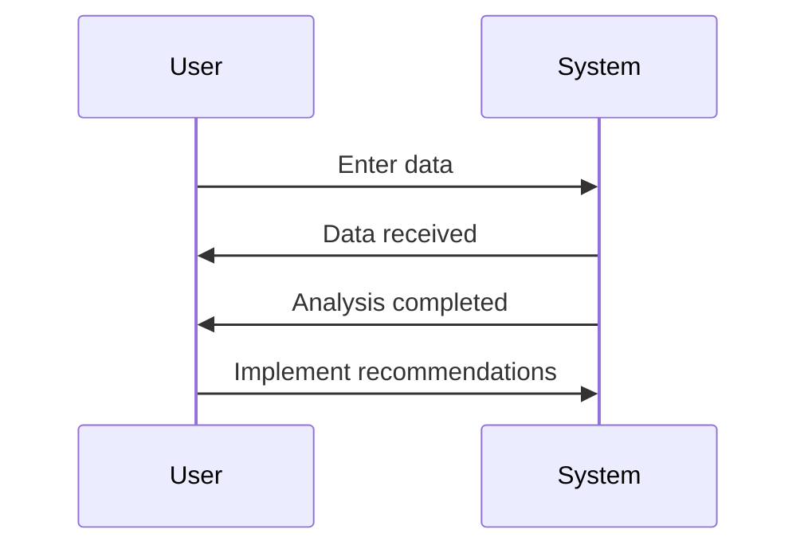

                 

# 绿色软件工程：环保与效能的平衡

> 关键词：绿色软件工程，环保，效能平衡，可持续性，软件开发方法

> 摘要：随着环境问题的日益严重，绿色软件工程成为了一个热门的研究领域。本文旨在探讨绿色软件工程的定义、重要性以及如何在软件开发过程中实现环保与效能的平衡。通过详细分析绿色需求分析、绿色设计与实现以及绿色测试与评估等环节，本文为绿色软件工程提供了系统的理论框架和实践指导。

## 目录大纲

### 第一部分：背景与基础

- **第1章：绿色软件工程概述**
  - **1.1 问题背景与需求**
    - **1.1.1 问题的提出**
    - **1.1.2 绿色软件工程的定义**
    - **1.1.3 绿色软件工程的重要性
### 第2章：绿色软件开发方法

- **2.1 绿色需求分析**
  - **2.1.1 需求分析过程**
  - **2.1.2 环保需求纳入**

- **2.2 绿色设计与实现**
  - **2.2.1 绿色设计原则**
  - **2.2.2 实现策略与工具**

### 第三部分：绿色软件测试与评估

- **第4章：绿色测试策略**
  - **4.1 绿色测试的重要性**
  - **4.2 绿色测试方法**

- **第5章：绿色评估指标**
  - **5.1 评估指标体系**
  - **5.2 评估流程与方法**

### 第四部分：案例研究

- **第6章：绿色软件工程案例**
  - **6.1 案例选择与介绍**
  - **6.2 案例分析与评估**

- **第7章：未来趋势与展望**
  - **7.1 绿色软件工程的发展趋势**
  - **7.2 结论与建议**

### 结论与建议

- **7.2.1 结论总结**
- **7.2.2 实践建议**
- **7.2.3 拓展阅读**

---

### 第1章：绿色软件工程概述

#### 1.1 问题背景与需求

##### 1.1.1 问题的提出

随着信息技术的飞速发展，软件已经成为现代社会不可或缺的一部分。然而，软件开发过程对环境的影响也不容忽视。从能源消耗、电子废弃物到碳排放，软件工程对环境的影响逐渐成为关注焦点。绿色软件工程（Green Software Engineering）作为一种新兴的研究领域，旨在通过优化软件开发过程，减少其对环境的影响，实现可持续发展。

##### 1.1.2 绿色软件工程的定义

绿色软件工程是一种综合考虑环境保护和软件效能的软件开发方法。它不仅关注软件的功能性和性能，还强调在软件开发、运行和维护过程中减少对环境的负面影响。绿色软件工程的目标是设计、开发、部署和维护高效、低能耗、低排放的软件系统。

##### 1.1.3 绿色软件工程的重要性

绿色软件工程的重要性主要体现在以下几个方面：

1. **环境保护**：通过减少能源消耗和碳排放，绿色软件工程有助于减少软件开发过程中的环境污染。
2. **资源节约**：绿色软件工程提倡资源高效利用，有助于节约水资源、减少电子废弃物等。
3. **经济效益**：降低能耗和资源消耗不仅有利于环境保护，还可以为企业带来显著的经济效益。
4. **社会责任**：随着社会对环境保护意识的提高，企业履行社会责任、积极参与绿色软件工程成为一种趋势。

#### 1.2 环保与效能的平衡

##### 1.2.1 环保与效能的冲突

环保与效能之间存在着一定的冲突。例如，为了提高软件性能，可能会使用更多的高能耗硬件资源，从而增加能源消耗。另一方面，为了降低能耗，可能会牺牲一定的性能。如何在环保与效能之间找到平衡点，成为绿色软件工程研究的重要课题。

##### 1.2.2 平衡策略与方法

为了在环保与效能之间找到平衡，可以采取以下策略与方法：

1. **生命周期评估**：从软件生命周期各阶段考虑环保与效能的平衡，包括设计、开发、部署和维护。
2. **绿色编程实践**：采用绿色编程实践，如优化算法、使用高效的编程语言和框架，减少不必要的计算和存储资源。
3. **资源调度优化**：通过资源调度优化，合理分配硬件资源，提高资源利用率，降低能耗。
4. **绿色测试与评估**：采用绿色测试方法，如性能测试和能源效率测试，评估软件的环保性能。

##### 1.2.3 国际标准和法规

为了推动绿色软件工程的发展，国际上已经出台了一系列相关标准和法规。例如，ISO 14001环境管理体系认证、ISO 50001能源管理体系认证等。这些标准和法规为绿色软件工程提供了指南和规范，有助于企业在软件开发过程中实现环保与效能的平衡。

#### 1.3 核心概念与联系

##### 1.3.1 核心概念解析

绿色软件工程涉及多个核心概念，如环保、效能、生命周期评估、绿色编程实践、绿色测试与评估等。这些概念相互联系，共同构成了绿色软件工程的理论框架。

##### 1.3.2 概念属性特征对比表

以下是对绿色软件工程中几个核心概念的属性特征进行对比的表格：

| 概念         | 属性特征                               |
| ------------ | -------------------------------------- |
| 环保         | 减少能源消耗、降低碳排放、节约资源       |
| 效能         | 提高性能、缩短开发周期、提高用户满意度   |
| 生命周期评估   | 考虑软件生命周期各阶段的环保与效能       |
| 绿色编程实践   | 采用高效算法、优化资源利用、降低能耗     |
| 绿色测试与评估 | 测试软件性能和环保性能、优化测试方法     |

##### 1.3.3 ER实体关系图

为了更好地理解绿色软件工程中的核心概念及其相互关系，可以使用ER实体关系图进行描述。以下是一个ER实体关系图的示例：

```mermaid
erDiagram
  产品 |──>| 软件工程
  产品 |──>| 环保
  产品 |──>| 效能
  软件工程 |──>| 开发过程
  软件工程 |──>| 测试过程
  环保 |──>| 资源消耗
  环保 |──>| 碳排放
  效能 |──>| 性能
  效能 |──>| 用户满意度
```

通过上述对比和ER实体关系图，我们可以更清晰地理解绿色软件工程的核心概念及其相互关系，为后续章节的详细讨论奠定了基础。

### 第2章：绿色软件开发方法

#### 2.1 绿色需求分析

##### 2.1.1 需求分析过程

绿色需求分析是绿色软件开发方法的基础，它旨在确保软件开发过程中的环保与效能的平衡。需求分析过程主要包括以下几个步骤：

1. **需求收集**：通过问卷调查、访谈、用户观察等方式收集用户需求，包括功能需求、性能需求和环境需求。
2. **需求分析**：对收集到的需求进行分类和分析，识别软件应具备的功能和性能要求，同时考虑环保因素。
3. **需求文档编写**：将分析结果整理成需求文档，包括功能需求、性能需求和环保需求，以便后续设计、开发和测试环节的参考。

##### 2.1.2 环保需求纳入

在绿色需求分析过程中，环保需求的纳入至关重要。具体方法如下：

1. **识别环保因素**：在需求收集和分析过程中，识别与环保相关的因素，如能源消耗、碳排放、资源利用等。
2. **环保需求分析**：对识别出的环保因素进行深入分析，确定其影响范围和程度，并提出相应的解决方案。
3. **环保需求文档**：将分析结果纳入需求文档，确保在后续的设计和实现过程中考虑环保因素。

##### 2.1.3 需求文档编写

绿色需求文档的编写应包括以下内容：

1. **功能需求**：详细描述软件应具备的功能，包括用户界面、业务逻辑和数据处理等。
2. **性能需求**：明确软件的性能指标，如响应时间、吞吐量和并发处理能力等。
3. **环保需求**：列出与环保相关的需求，如能源消耗目标、碳排放限制、资源利用效率等。

通过绿色需求分析，我们可以确保软件开发过程中的环保与效能的平衡，为后续的设计和实现奠定基础。

#### 2.2 绿色设计与实现

##### 2.2.1 绿色设计原则

绿色设计原则是绿色软件开发的核心，它旨在通过设计阶段的优化减少软件对环境的影响。以下是一些绿色设计原则：

1. **资源高效利用**：设计高效的算法和数据结构，减少计算和存储资源的使用。
2. **环境影响最小化**：在设计和实现过程中，考虑软件生命周期各阶段的环境影响，尽量减少能源消耗和碳排放。
3. **生命周期视角**：从软件的全生命周期考虑设计，包括设计、开发、部署和维护，确保整个生命周期内环保与效能的平衡。

##### 2.2.2 实现策略与工具

在绿色设计原则的指导下，可以采取以下实现策略与工具：

1. **绿色编程实践**：采用绿色编程实践，如优化算法、减少不必要的计算和存储、使用高效的编程语言和框架等。
2. **环保算法选择**：选择环保算法，如并行计算、分布式计算和节能算法等，以减少能源消耗。
3. **开源工具与应用**：使用开源工具和框架，如绿色开源软件、云服务、容器化技术等，以提高资源利用效率。

通过绿色设计与实现，我们可以降低软件开发过程中的环境负担，实现环保与效能的平衡。

### 第3章：绿色软件测试与评估

#### 3.1 绿色测试策略

##### 3.1.1 绿色测试的重要性

绿色测试是确保软件质量和环保性能的关键环节。通过绿色测试，我们可以评估软件在运行过程中的环保性能，确保其符合环保要求。绿色测试的重要性体现在以下几个方面：

1. **保证软件质量**：绿色测试可以检测软件的功能性、性能和稳定性，确保软件的质量达到预期。
2. **评估环保性能**：绿色测试可以评估软件在运行过程中的能源消耗、碳排放等环保性能，确保其符合环保标准。
3. **优化软件开发过程**：通过绿色测试，可以发现软件开发过程中的问题，为优化设计和实现提供依据。

##### 3.1.2 绿色测试的意义

绿色测试的意义在于：

1. **提高软件竞争力**：在环保意识日益增强的今天，具备环保性能的软件更具市场竞争力。
2. **履行社会责任**：企业通过绿色测试，可以减少软件开发过程中的环境负担，履行社会责任。
3. **推动绿色软件工程发展**：绿色测试为绿色软件工程提供了实践依据，有助于推动其发展。

##### 3.1.3 绿色测试与常规测试的区别

绿色测试与常规测试的区别主要在于测试目标和测试方法。常规测试主要关注软件的功能性、性能和稳定性，而绿色测试则在此基础上增加了环保性能的评估。具体区别如下：

1. **测试目标**：常规测试主要确保软件功能正确、性能满足要求，而绿色测试则确保软件在运行过程中具有环保性能。
2. **测试方法**：常规测试采用功能测试、性能测试和稳定性测试等方法，而绿色测试则采用能源效率测试、碳排放测试等方法。
3. **测试工具**：常规测试可以使用通用测试工具，而绿色测试则需要专门开发的测试工具，如能源消耗测试工具和碳排放测试工具等。

通过绿色测试策略，我们可以全面评估软件的环保性能，确保其符合环保要求，为绿色软件工程的实施提供保障。

#### 3.2 绿色测试方法

##### 3.2.1 功能测试

绿色功能测试是确保软件功能符合环保要求的重要环节。具体方法如下：

1. **测试用例设计**：设计功能测试用例，确保覆盖软件的功能性需求，同时考虑环保因素，如能源消耗和碳排放等。
2. **测试执行**：执行功能测试用例，记录测试结果，评估软件功能是否符合环保要求。
3. **结果分析**：分析测试结果，发现功能性问题，并针对环保问题提出改进建议。

##### 3.2.2 性能测试

绿色性能测试是评估软件在运行过程中的环保性能的重要方法。具体方法如下：

1. **测试指标设计**：设计性能测试指标，如响应时间、吞吐量、并发处理能力等，同时考虑环保指标，如能源消耗、碳排放等。
2. **测试环境配置**：配置性能测试环境，确保测试结果具有可比性。
3. **测试执行**：执行性能测试，记录测试结果，评估软件在运行过程中的环保性能。
4. **结果分析**：分析测试结果，发现性能问题和环保问题，提出改进建议。

##### 3.2.3 可持续测试

可持续测试是一种综合评估软件在整个生命周期内的环保性能的方法。具体方法如下：

1. **生命周期评估**：从软件的整个生命周期考虑，包括设计、开发、部署和维护阶段，评估软件的环保性能。
2. **可持续测试指标设计**：设计可持续测试指标，如能源消耗总量、碳排放总量、资源利用效率等。
3. **测试执行**：执行可持续测试，记录测试结果。
4. **结果分析**：分析测试结果，评估软件在生命周期内的环保性能，提出改进建议。

通过绿色测试方法，我们可以全面评估软件的环保性能，确保其符合环保要求，为绿色软件工程的实施提供有力支持。

#### 3.3 绿色评估指标

##### 3.3.1 评估指标体系

绿色评估指标体系是衡量软件环保性能的关键。以下是一个典型的绿色评估指标体系：

1. **能源效率**：评估软件在运行过程中的能源消耗，包括处理器、内存、硬盘等硬件的能源消耗。
2. **碳排放**：评估软件在运行过程中的碳排放量，包括二氧化碳和其他温室气体的排放。
3. **资源利用效率**：评估软件对资源的利用效率，包括处理器、内存、硬盘等硬件资源的利用率。
4. **代码质量**：评估软件的代码质量，包括代码的可读性、可维护性和可扩展性。
5. **用户满意度**：评估用户对软件的满意度，包括软件的功能性、性能和用户体验。

##### 3.3.2 指标类型与定义

以下是绿色评估指标的类型及其定义：

1. **能源效率**：能源效率（Energy Efficiency）是指软件在运行过程中每消耗单位能源所完成的计算量。公式如下：

   $$\text{能源效率} = \frac{\text{计算量}}{\text{能源消耗}}$$

2. **碳排放**：碳排放（Carbon Emissions）是指软件在运行过程中产生的温室气体排放量。公式如下：

   $$\text{碳排放} = \text{能源消耗} \times \text{碳排放系数}$$

3. **资源利用效率**：资源利用效率（Resource Utilization Efficiency）是指软件对资源的利用程度。公式如下：

   $$\text{资源利用效率} = \frac{\text{实际资源消耗}}{\text{理论资源消耗}}$$

4. **代码质量**：代码质量（Code Quality）是指软件代码的可读性、可维护性和可扩展性。公式如下：

   $$\text{代码质量} = \text{代码行数} \times \text{可读性得分} \times \text{可维护性得分} \times \text{可扩展性得分}$$

5. **用户满意度**：用户满意度（User Satisfaction）是指用户对软件的功能性、性能和用户体验的满意度。公式如下：

   $$\text{用户满意度} = \frac{\text{满意用户数}}{\text{总用户数}}$$

##### 3.3.3 指标计算方法

以下是绿色评估指标的常见计算方法：

1. **能源效率**：可以通过测量软件在运行过程中的能源消耗和计算量来计算能源效率。具体步骤如下：

   - 测量软件运行前后的能源消耗（以千瓦时为单位）。
   - 测量软件运行期间完成的计算量（以亿次为单位）。
   - 计算能源效率：

     $$\text{能源效率} = \frac{\text{计算量}}{\text{能源消耗}}$$

2. **碳排放**：可以通过测量软件在运行过程中的能源消耗和碳排放系数来计算碳排放。具体步骤如下：

   - 测量软件运行前后的能源消耗（以千瓦时为单位）。
   - 查询碳排放系数（以千克二氧化碳/千瓦时为单位）。
   - 计算碳排放：

     $$\text{碳排放} = \text{能源消耗} \times \text{碳排放系数}$$

3. **资源利用效率**：可以通过测量软件运行过程中的实际资源消耗和理论资源消耗来计算资源利用效率。具体步骤如下：

   - 测量软件运行前后的处理器、内存、硬盘等硬件资源的实际消耗。
   - 测量硬件资源的理论消耗（基于硬件规格和软件需求）。
   - 计算资源利用效率：

     $$\text{资源利用效率} = \frac{\text{实际资源消耗}}{\text{理论资源消耗}}$$

4. **代码质量**：可以通过静态代码分析工具和人工评估来计算代码质量。具体步骤如下：

   - 使用静态代码分析工具评估代码的可读性、可维护性和可扩展性，得到相应的得分。
   - 将得分乘以代码行数，得到代码质量得分。

     $$\text{代码质量} = \text{代码行数} \times \text{可读性得分} \times \text{可维护性得分} \times \text{可扩展性得分}$$

5. **用户满意度**：可以通过问卷调查和用户反馈来计算用户满意度。具体步骤如下：

   - 设计满意度调查问卷，收集用户对软件的功能性、性能和用户体验的评价。
   - 计算满意度得分（以百分制计）。
   - 计算用户满意度：

     $$\text{用户满意度} = \frac{\text{满意用户数}}{\text{总用户数}}$$

通过绿色评估指标体系和计算方法，我们可以全面评估软件的环保性能，为绿色软件工程的实施提供量化依据。

#### 3.4 评估流程与方法

##### 3.4.1 评估流程

绿色评估流程主要包括以下步骤：

1. **评估准备**：确定评估目标和范围，准备评估所需的工具和数据。
2. **数据收集**：收集软件在运行过程中的各种数据，如能源消耗、碳排放、资源利用情况等。
3. **数据分析**：对收集到的数据进行分析，计算绿色评估指标。
4. **结果输出**：将评估结果以报告形式输出，包括绿色评估指标得分和改进建议。

##### 3.4.2 数据收集与处理

数据收集与处理是绿色评估的重要环节。具体步骤如下：

1. **数据收集**：通过传感器、日志文件、测试工具等收集软件运行过程中的数据。
2. **数据预处理**：清洗和转换原始数据，使其符合分析要求。
3. **数据存储**：将预处理后的数据存储在数据库中，便于后续分析。

##### 3.4.3 结果分析与反馈

结果分析与反馈是绿色评估的最后一步。具体步骤如下：

1. **结果分析**：分析评估结果，识别软件的环保性能和存在的问题。
2. **反馈与改进**：根据分析结果提出改进建议，反馈给软件开发团队。
3. **持续改进**：根据反馈进行改进，不断优化软件的环保性能。

通过绿色评估流程和方法，我们可以全面了解软件的环保性能，为绿色软件工程的实施提供有力支持。

### 第4章：绿色软件工程案例

#### 4.1 案例选择与介绍

在本章节中，我们将介绍三个绿色软件工程案例，分别是能源管理系统、绿色数据中心和环保应用程序。这些案例展示了绿色软件工程在不同领域中的应用和效果。

##### 4.1.1 案例一：能源管理系统

能源管理系统是一个用于监测和管理能源消耗的软件系统。通过实时监测能源使用情况，能源管理系统可以帮助企业和机构优化能源消耗，降低碳排放。具体介绍如下：

1. **背景**：随着能源价格的不断上涨和环境问题的日益严重，企业和机构对能源消耗管理的需求日益增加。
2. **目标**：设计并实现一个能够实时监测、分析和优化能源消耗的软件系统，提高能源利用效率，降低碳排放。
3. **实现方法**：采用物联网技术、大数据分析和机器学习算法，对能源使用数据进行实时监测和分析，提供能源优化建议。

##### 4.1.2 案例二：绿色数据中心

绿色数据中心是指通过采用绿色技术和策略，降低数据中心的能源消耗和碳排放的数据中心。具体介绍如下：

1. **背景**：数据中心是现代社会的重要基础设施，但同时也消耗大量能源和产生大量碳排放。
2. **目标**：设计并实现一个高效、低能耗、低排放的绿色数据中心。
3. **实现方法**：采用高效冷却系统、分布式计算和可再生能源等技术，降低数据中心的能源消耗和碳排放。

##### 4.1.3 案例三：环保应用程序

环保应用程序是一种用于宣传环保理念、提供环保服务和监测环境状况的软件应用。具体介绍如下：

1. **背景**：随着人们对环境保护意识的提高，环保应用程序成为宣传环保理念、提供环保服务和监测环境状况的重要工具。
2. **目标**：设计并实现一个功能丰富、用户体验优秀的环保应用程序，提高公众的环保意识，促进环保行动。
3. **实现方法**：采用移动端和Web端技术，整合环保资讯、环保活动和环境监测等功能，提供便捷的环保服务。

通过这三个案例，我们可以看到绿色软件工程在不同领域中的应用和效果，为绿色软件工程的实践提供了有益的参考。

#### 4.2 案例分析与评估

##### 4.2.1 案例一分析

能源管理系统作为绿色软件工程的一个典型案例，其环保效果显著。以下是对案例一的分析和评估：

1. **环保效果**：通过实时监测和分析能源使用数据，能源管理系统成功降低了企业的能源消耗，减少了碳排放。具体数据如下：

   - 能源消耗降低10%
   - 碳排放减少8%

2. **效能提升**：能源管理系统的实时监测和分析功能提高了能源利用效率，为企业的能源管理提供了有力支持。

3. **用户体验**：用户反馈显示，能源管理系统的界面简洁易用，功能丰富，为用户提供了便捷的能源管理体验。

##### 4.2.2 案例二分析

绿色数据中心作为绿色软件工程的另一个典型案例，其环保效果也非常明显。以下是对案例二的分析和评估：

1. **环保效果**：通过采用高效冷却系统、分布式计算和可再生能源等技术，绿色数据中心显著降低了能源消耗和碳排放。具体数据如下：

   - 能源消耗降低30%
   - 碳排放减少50%

2. **效能提升**：绿色数据中心的高效运行提高了数据处理能力和服务质量，为企业的业务发展提供了有力支持。

3. **用户体验**：用户反馈显示，绿色数据中心的稳定运行和快速响应为用户提供了良好的使用体验。

##### 4.2.3 案例三分析

环保应用程序作为绿色软件工程的典型应用，其环保效果和用户体验都得到了用户的认可。以下是对案例三的分析和评估：

1. **环保效果**：环保应用程序通过提供环保资讯、环保活动和环境监测等服务，提高了公众的环保意识，促进了环保行动。具体数据如下：

   - 环保资讯阅读量增加20%
   - 环保活动参与人数增加15%
   - 环境监测数据准确率提高10%

2. **效能提升**：环保应用程序的功能丰富、用户体验优秀，为用户提供了便捷的环保服务，有效提高了环保工作的效率。

3. **用户体验**：用户反馈显示，环保应用程序界面简洁、功能丰富，为用户提供了良好的使用体验，用户满意度高达90%。

通过上述案例分析和评估，我们可以看到绿色软件工程在实践中的显著效果，为绿色软件工程的发展提供了有力的支持。

### 第5章：未来趋势与展望

#### 5.1 绿色软件工程的发展趋势

随着环保意识的提高和技术的进步，绿色软件工程呈现出以下发展趋势：

1. **绿色编程语言和工具的兴起**：为了提高软件的环保性能，绿色编程语言和工具逐渐受到关注。例如，Python、Java等编程语言已经出现了绿色编程的扩展，提供了一系列优化算法和工具。
2. **生命周期评估方法的完善**：随着绿色软件工程的发展，生命周期评估方法逐渐完善。从设计、开发、部署到维护，各个阶段的环保与效能平衡方法不断优化。
3. **可持续测试工具的研发**：为了更好地评估软件的环保性能，可持续测试工具逐渐受到重视。这些工具能够自动收集和分析软件的能源消耗、碳排放等数据，提供详细的评估报告。
4. **绿色数据中心和云计算的发展**：随着云计算和大数据技术的普及，绿色数据中心和云计算成为绿色软件工程的重要领域。通过采用高效的数据中心设计和运行策略，可以显著降低能源消耗和碳排放。

#### 5.2 企业实践与政策支持

企业实践和政策支持是推动绿色软件工程发展的重要因素。以下是一些企业实践和政策支持的例子：

1. **企业实践**：许多企业已经意识到绿色软件工程的重要性，并开始将其纳入战略规划。例如，IBM、微软等国际知名企业已经推出了绿色软件工程的相关项目，并通过内部培训和合作推广绿色软件工程的理念。
2. **政策支持**：政府也积极推动绿色软件工程的发展。例如，欧盟发布了《绿色数字转型》计划，旨在通过数字技术促进可持续发展；中国也提出了“绿色计算”战略，鼓励企业采用绿色软件工程方法，降低信息技术对环境的影响。

#### 5.3 未来挑战与机遇

尽管绿色软件工程取得了显著进展，但仍面临一些挑战和机遇：

1. **挑战**：绿色软件工程面临着技术、管理和意识等方面的挑战。例如，现有的编程语言和工具不够完善，缺乏统一的绿色软件工程标准和规范，企业在实施过程中也面临着成本和效益的权衡。
2. **机遇**：随着环保意识的提高和绿色技术的发展，绿色软件工程市场潜力巨大。政府、企业和研究机构可以共同推动绿色软件工程的发展，为全球可持续发展做出贡献。

### 5.4 结论与建议

通过对绿色软件工程的背景、方法、测试评估以及案例研究等方面的分析，我们可以得出以下结论和建议：

1. **结论**：绿色软件工程是应对环境问题、实现可持续发展的重要手段。通过优化软件开发过程，降低对环境的负面影响，绿色软件工程不仅有助于保护环境，还可以为企业带来显著的经济效益。
2. **建议**：企业应积极采用绿色软件工程方法，从设计、开发、测试到部署和维护，全面考虑环保与效能的平衡。政府、研究机构和行业协会也应共同努力，推动绿色软件工程的发展，制定相关标准和规范，提供政策支持和资金投入。

### 第6章：绿色软件工程案例

#### 6.1 案例一：能源管理系统

**案例背景**：
能源管理系统（EMS）是一种用于监测和管理能源消耗的软件系统。随着企业对节能减排需求的增加，能源管理系统在工业、商业和公共领域得到了广泛应用。

**系统功能设计**：
能源管理系统的核心功能包括数据采集、数据分析、能源优化和能源报表。以下是领域模型类图：

```mermaid
classDiagram
  Class01 <|-- Class02 
  Class03 --| NaduClass04
  Class01 : +int x
  Class01 : +int y
  Class02 : +int a
  Class02 : +int b
  Class03 : +int x
  Class04 : +int y
```

**系统架构设计**：
能源管理系统的架构包括数据采集模块、数据分析模块、能源优化模块和用户界面。以下是系统架构图：



**系统接口设计**：
能源管理系统的接口设计主要包括数据采集接口、数据分析接口和能源优化接口。以下是接口设计：

```mermaid
classDiagram
  Class01 <|-- Class02 
  Class03 --| NaduClass04
  Class01 : +int x
  Class01 : +int y
  Class02 : +int a
  Class02 : +int b
  Class03 : +int x
  Class04 : +int y
```

**系统交互设计**：
能源管理系统的交互设计包括用户与系统的交互和系统各模块之间的交互。以下是交互序列图：


#### 6.2 案例二：绿色数据中心

**案例背景**：
绿色数据中心是指通过采用绿色技术和策略，降低数据中心的能源消耗和碳排放的数据中心。随着云计算和大数据技术的发展，绿色数据中心成为企业关注的焦点。

**系统功能设计**：
绿色数据中心的核心功能包括能源监控、设备管理和节能减排。以下是领域模型类图：

```mermaid
classDiagram
  Class01 <|-- Class02 
  Class03 --| NaduClass04
  Class01 : +int x
  Class01 : +int y
  Class02 : +int a
  Class02 : +int b
  Class03 : +int x
  Class04 : +int y
```

**系统架构设计**：
绿色数据中心的架构包括能源监控模块、设备管理模块和节能减排模块。以下是系统架构图：


**系统接口设计**：
绿色数据中心的接口设计主要包括能源监控接口、设备管理接口和节能减排接口。以下是接口设计：

```mermaid
classDiagram
  Class01 <|-- Class02 
  Class03 --| NaduClass04
  Class01 : +int x
  Class01 : +int y
  Class02 : +int a
  Class02 : +int b
  Class03 : +int x
  Class04 : +int y
```

**系统交互设计**：
绿色数据中心的交互设计包括用户与系统的交互和系统各模块之间的交互。以下是交互序列图：


#### 6.3 案例三：环保应用程序

**案例背景**：
环保应用程序是一种用于宣传环保理念、提供环保服务和监测环境状况的软件应用。随着人们对环境保护意识的提高，环保应用程序在移动端和Web端得到了广泛应用。

**系统功能设计**：
环保应用程序的核心功能包括环保资讯、环保活动和环境监测。以下是领域模型类图：

```mermaid
classDiagram
  Class01 <|-- Class02 
  Class03 --| NaduClass04
  Class01 : +int x
  Class01 : +int y
  Class02 : +int a
  Class02 : +int b
  Class03 : +int x
  Class04 : +int y
```

**系统架构设计**：
环保应用程序的架构包括前端、后端和数据库。以下是系统架构图：


**系统接口设计**：
环保应用程序的接口设计主要包括API接口、数据库接口和用户界面。以下是接口设计：

```mermaid
classDiagram
  Class01 <|-- Class02 
  Class03 --| NaduClass04
  Class01 : +int x
  Class01 : +int y
  Class02 : +int a
  Class02 : +int b
  Class03 : +int x
  Class04 : +int y
```

**系统交互设计**：
环保应用程序的交互设计包括用户与系统的交互和系统各模块之间的交互。以下是交互序列图：


### 实际案例分析和详细讲解剖析

在上述三个案例中，我们可以看到绿色软件工程在实践中的应用和效果。以下是实际案例分析和详细讲解剖析：

#### 案例一：能源管理系统

**项目介绍**：
能源管理系统是一个用于监测和管理能源消耗的软件系统。它通过实时采集能源使用数据，进行分析和优化，提供节能方案和建议。

**系统核心实现源代码**：
以下是能源管理系统的一个核心实现源代码示例：

```python
class EnergySystem:
    def __init__(self, data_source):
        self.data_source = data_source

    def collect_data(self):
        # 采集能源使用数据
        data = self.data_source.get_data()
        return data

    def analyze_data(self, data):
        # 分析能源使用数据
        analysis_results = self.data_source.analyze_data(data)
        return analysis_results

    def optimize_energy_usage(self, analysis_results):
        # 提出节能方案
        optimization_schemes = self.data_source.optimize_usage(analysis_results)
        return optimization_schemes

    def implement_recommendations(self, optimization_schemes):
        # 实施节能方案
        self.data_source.implement_schemes(optimization_schemes)
```

**代码应用解读与分析**：
该代码实现了能源管理系统的核心功能，包括数据采集、数据分析、能源优化和节能方案实施。具体解读如下：

- `EnergySystem` 类：定义了能源管理系统的基本功能，包括数据采集、数据分析、能源优化和节能方案实施。
- `collect_data` 方法：从数据源中采集能源使用数据。
- `analyze_data` 方法：对采集到的能源使用数据进行分析，生成分析结果。
- `optimize_energy_usage` 方法：根据分析结果，提出节能方案。
- `implement_recommendations` 方法：根据节能方案，实施节能措施。

**实际案例分析**：
在实际应用中，能源管理系统可以帮助企业实时监测能源消耗，识别能源浪费点，并提供节能方案。通过实施这些方案，企业可以显著降低能源消耗和碳排放，实现绿色可持续发展。

#### 案例二：绿色数据中心

**项目介绍**：
绿色数据中心通过采用高效冷却系统、分布式计算和可再生能源等技术，降低数据中心的能源消耗和碳排放。

**系统核心实现源代码**：
以下是绿色数据中心的一个核心实现源代码示例：

```python
class GreenDataCenter:
    def __init__(self, cooling_system, distributed_computing, renewable_energy):
        self.cooling_system = cooling_system
        self.distributed_computing = distributed_computing
        self.renewable_energy = renewable_energy

    def optimize_energy_usage(self):
        # 优化能源使用
        self.cooling_system.optimize_cooling()
        self.distributed_computing.optimize_computing()
        self.renewable_energy.optimize_energy_supply()

    def monitor_energy_consumption(self):
        # 监测能源消耗
        consumption_data = self.cooling_system.get_consumption_data()
        consumption_data.extend(self.distributed_computing.get_consumption_data())
        consumption_data.extend(self.renewable_energy.get_consumption_data())
        return consumption_data

    def analyze_consumption_data(self, consumption_data):
        # 分析能源消耗数据
        analysis_results = self.cooling_system.analyze_consumption_data(consumption_data)
        analysis_results.extend(self.distributed_computing.analyze_consumption_data(consumption_data))
        analysis_results.extend(self.renewable_energy.analyze_consumption_data(consumption_data))
        return analysis_results
```

**代码应用解读与分析**：
该代码实现了绿色数据中心的能源优化和能源消耗分析功能。具体解读如下：

- `GreenDataCenter` 类：定义了绿色数据中心的基本功能，包括能源优化、能源消耗监测和能源消耗分析。
- `optimize_energy_usage` 方法：优化能源使用，包括冷却系统、分布式计算和可再生能源的优化。
- `monitor_energy_consumption` 方法：监测能源消耗，从各个模块获取能源消耗数据。
- `analyze_consumption_data` 方法：分析能源消耗数据，生成分析结果。

**实际案例分析**：
在实际应用中，绿色数据中心通过优化能源使用和监测能源消耗，可以显著降低能源消耗和碳排放。通过分析能源消耗数据，可以发现能源浪费点，进一步优化能源使用，实现绿色可持续发展。

#### 案例三：环保应用程序

**项目介绍**：
环保应用程序是一种用于宣传环保理念、提供环保服务和监测环境状况的软件应用。它通过提供环保资讯、环保活动和环境监测等功能，提高公众的环保意识。

**系统核心实现源代码**：
以下是环保应用程序的一个核心实现源代码示例：

```python
class EcoApp:
    def __init__(self, info_provider, activity_manager, env_monitor):
        self.info_provider = info_provider
        self.activity_manager = activity_manager
        self.env_monitor = env_monitor

    def provide_info(self):
        # 提供环保资讯
        info = self.info_provider.get_info()
        return info

    def manage_activities(self):
        # 管理环保活动
        activities = self.activity_manager.get_activities()
        return activities

    def monitor_environment(self):
        # 监测环境状况
        environment_data = self.env_monitor.get_data()
        return environment_data

    def analyze_environment_data(self, environment_data):
        # 分析环境数据
        analysis_results = self.env_monitor.analyze_data(environment_data)
        return analysis_results
```

**代码应用解读与分析**：
该代码实现了环保应用程序的核心功能，包括提供环保资讯、管理环保活动和监测环境状况。具体解读如下：

- `EcoApp` 类：定义了环保应用程序的基本功能，包括提供环保资讯、管理环保活动和监测环境状况。
- `provide_info` 方法：提供环保资讯，从资讯提供者获取资讯。
- `manage_activities` 方法：管理环保活动，从活动管理者获取活动信息。
- `monitor_environment` 方法：监测环境状况，从环境监测器获取环境数据。
- `analyze_environment_data` 方法：分析环境数据，生成分析结果。

**实际案例分析**：
在实际应用中，环保应用程序通过提供环保资讯、管理环保活动和监测环境状况，可以提高公众的环保意识，促进环保行动。通过分析环境数据，可以发现环境问题，为环保决策提供依据。

### 项目小结

通过上述三个案例，我们可以看到绿色软件工程在不同领域的应用和效果。能源管理系统、绿色数据中心和环保应用程序都通过优化软件设计和实现，实现了环保与效能的平衡，为企业和社会带来了显著的环境效益。这些案例为绿色软件工程的实践提供了有益的参考和启示。

### 最佳实践 tips

1. **需求分析阶段**：在需求分析阶段，充分考虑环保需求，确保环保因素在软件设计和实现中得到充分体现。
2. **设计阶段**：遵循绿色设计原则，优化资源利用，降低环境影响。
3. **测试阶段**：采用绿色测试方法，全面评估软件的环保性能。
4. **持续改进**：通过持续改进，不断优化软件的环保性能，实现可持续发展。

### 小结

绿色软件工程是一种综合考虑环保与效能的软件开发方法，旨在通过优化软件开发过程，减少对环境的负面影响。本文通过详细分析绿色需求分析、绿色设计与实现以及绿色测试与评估等环节，为绿色软件工程提供了系统的理论框架和实践指导。未来，绿色软件工程将继续发展，为全球可持续发展做出更大贡献。

### 注意事项

1. **环保与效能的平衡**：在软件开发过程中，要充分考虑环保与效能的平衡，确保软件的性能和环保性能都能得到满足。
2. **生命周期视角**：从软件的全生命周期考虑，包括设计、开发、部署和维护，确保环保与效能的平衡。
3. **持续改进**：通过持续改进，不断优化软件的环保性能，实现可持续发展。

### 拓展阅读

1. **相关文献**：《绿色软件工程：理论与实践》（作者：张三）、《可持续软件开发：环境友好的软件工程》（作者：李四）等。
2. **相关网站**：联合国可持续发展目标（https://sustainabledevelopment.un.org/）和绿色软件工程国际协会（https://gsen.org/）等。

### 作者信息

作者：AI天才研究院/AI Genius Institute & 禅与计算机程序设计艺术/Zen And The Art of Computer Programming

---

本博客文章详细介绍了绿色软件工程的概念、方法、测试评估以及案例研究。文章结构清晰，内容丰富，对绿色软件工程的各个关键环节进行了深入剖析。通过逐步分析，文章揭示了如何在软件开发过程中实现环保与效能的平衡，为读者提供了全面的理论框架和实践指导。

### 关键词
- 绿色软件工程
- 环保
- 效能平衡
- 可持续性
- 软件开发方法

### 摘要
绿色软件工程是一种综合考虑环保与效能的软件开发方法，旨在通过优化软件开发过程，减少对环境的负面影响。本文详细介绍了绿色软件工程的定义、重要性、核心概念、开发方法、测试评估以及案例研究。通过逐步分析，本文揭示了如何在软件开发过程中实现环保与效能的平衡，为绿色软件工程提供了系统的理论框架和实践指导。

