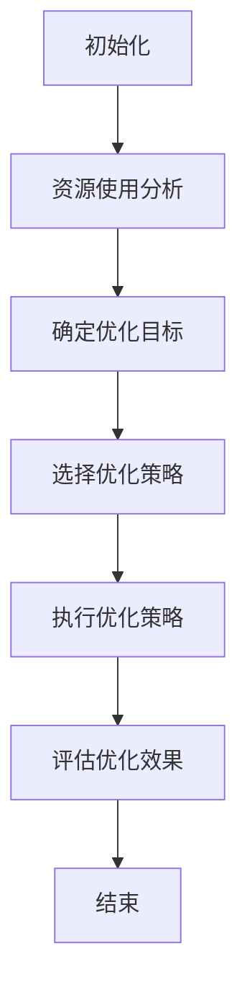
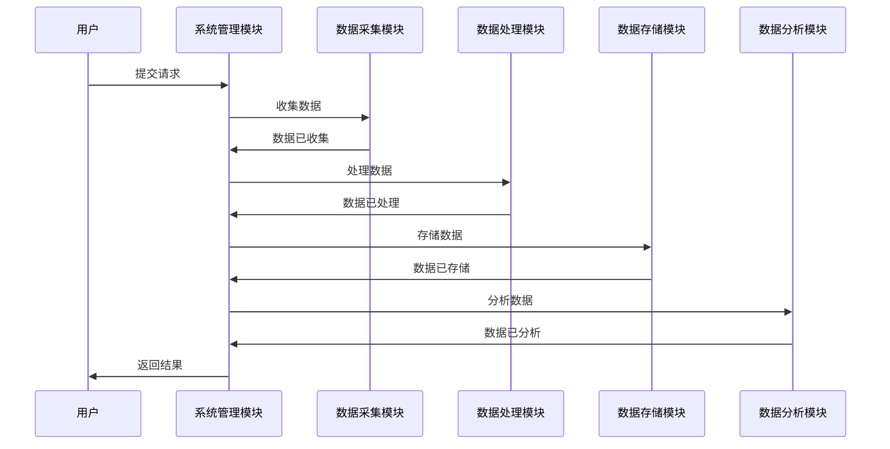

                 


## 《绿色软件工程：环保节能的软件开发实践》

### 关键词：绿色软件工程、环保软件开发、节能软件开发、算法原理、数学模型、系统架构、项目实战

### 摘要：

随着全球环境问题日益严峻，环保节能已成为各行各业的重要议题。在软件工程领域，绿色软件工程逐渐成为研究热点。本文旨在探讨绿色软件工程的定义、核心概念、算法原理、数学模型、系统架构以及项目实战，为软件开发实践提供环保节能的指导。通过详细讲解，读者将了解如何在软件开发过程中实现环保和节能目标。

---

### 目录大纲

#### 第1章 绿色软件工程概述
1.1 定义与背景
1.2 绿色软件工程的发展历程
1.3 绿色软件工程的重要性

#### 第2章 核心概念与联系
2.1 环保软件开发
2.2 节能软件开发
2.3 概念联系与ER实体关系图

#### 第3章 算法原理讲解
3.1 资源使用优化算法
3.1.1 算法流程图
3.1.2 Python代码实现
3.1.3 数学模型与公式
3.1.4 举例说明

#### 第4章 数学模型与公式详解
4.1 能耗计算公式
4.2 效率优化模型
4.3 举例说明

#### 第5章 系统分析与架构设计
5.1 问题场景介绍
5.2 系统功能设计
5.3 系统架构设计
5.4 系统接口设计
5.5 系统交互设计

#### 第6章 项目实战
6.1 环境安装
6.2 系统核心实现
6.3 代码解读与分析
6.4 实际案例分析
6.5 项目小结

#### 第7章 最佳实践与拓展
7.1 最佳实践Tips
7.2 小结
7.3 注意事项
7.4 拓展阅读

---

### 文章内容

#### 第1章 绿色软件工程概述

##### 1.1 定义与背景

绿色软件工程，顾名思义，是指将环保和节能的理念融入软件开发的整个过程。它不仅仅关注软件的功能性和性能，还强调在软件开发和运行过程中减少对环境的影响。随着信息技术的发展，软件产业已经成为全球经济增长的重要引擎，但同时也伴随着能源消耗和环境污染的问题。

绿色软件工程起源于20世纪90年代，随着可持续发展理念的兴起，人们开始关注软件行业的环境责任。早期的研究主要集中在软件生命周期评估（LCA）和能源消耗分析上。进入21世纪，随着云计算、大数据、物联网等新兴技术的应用，绿色软件工程逐渐成为软件工程领域的研究热点。

##### 1.2 绿色软件工程的发展历程

绿色软件工程的发展历程可以分为以下几个阶段：

1. **初始阶段（20世纪90年代）**：这个阶段主要是对软件生命周期中的能源消耗进行评估，提出了软件生命周期评估（LCA）的概念。

2. **发展阶段（21世纪初）**：这个阶段开始关注软件在运行过程中的能耗，提出了节能软件和绿色软件的概念。

3. **成熟阶段（近年）**：随着信息技术的发展，绿色软件工程的理论和实践逐渐成熟，成为软件工程领域的重要组成部分。

##### 1.3 绿色软件工程的重要性

绿色软件工程的重要性体现在以下几个方面：

1. **环境保护**：绿色软件工程通过减少软件的能源消耗，有助于降低对环境的污染，符合可持续发展的要求。

2. **经济效益**：绿色软件工程有助于降低企业的能源成本，提高资源利用率，从而降低生产成本，提高经济效益。

3. **社会责任**：企业通过实施绿色软件工程，能够展现其社会责任感，提升企业形象。

#### 第2章 核心概念与联系

##### 2.1 环保软件开发

环保软件开发是指将环保理念融入软件的开发过程，包括软件设计、编码、测试、部署等各个阶段。环保软件的目标是减少软件生命周期中的能源消耗和环境污染。

##### 2.2 节能软件开发

节能软件开发是指通过优化软件的运行效率，减少能源消耗。节能软件的目标是实现高性能和低能耗的平衡，提高软件的能源利用效率。

##### 2.3 概念联系与ER实体关系图

环保软件开发和节能软件开发是绿色软件工程的两个核心概念，它们之间存在着密切的联系。下面是一个ER实体关系图，展示了这两个概念之间的关系。

```mermaid
erDiagram
  Software <<|-- EnvironmentalSoftware : 环保软件开发
  Software <<|-- EnergyEfficientSoftware : 节能软件开发
```

#### 第3章 算法原理讲解

##### 3.1 资源使用优化算法

资源使用优化算法是绿色软件工程中的一个重要算法，它旨在通过优化软件的资源使用，减少能源消耗。

##### 3.1.1 算法流程图

下面是一个资源使用优化算法的流程图。



##### 3.1.2 Python代码实现

下面是一个简单的资源使用优化算法的Python代码实现。

```python
# 资源使用优化算法的Python代码实现
def optimize_resource_usage(current_usage, target_usage):
    """
    优化资源使用
    :param current_usage: 当前资源使用量
    :param target_usage: 目标资源使用量
    :return: 优化后的资源使用量
    """
    if current_usage > target_usage:
        # 调整资源使用
        optimized_usage = current_usage * 0.9
    else:
        # 保持当前资源使用
        optimized_usage = current_usage

    return optimized_usage
```

##### 3.1.3 数学模型与公式

资源使用优化算法的数学模型可以表示为：

$$
\text{optimized\_usage} = \text{current\_usage} \times (1 - \text{adjustment\_factor})
$$

其中，adjustment_factor 是调整系数，通常在 0 到 1 之间取值。

##### 3.1.4 举例说明

假设当前资源使用量为 100 单位，目标资源使用量为 80 单位，调整系数为 0.1。那么，优化后的资源使用量为：

$$
\text{optimized\_usage} = 100 \times (1 - 0.1) = 90 \text{单位}
$$

#### 第4章 数学模型与公式详解

##### 4.1 能耗计算公式

能耗计算公式是绿色软件工程中的一个基础公式，用于计算软件运行过程中的能源消耗。能耗计算公式可以表示为：

$$
\text{energy\_consumption} = \text{power} \times \text{time}
$$

其中，power 是功率，time 是运行时间。

##### 4.2 效率优化模型

效率优化模型是绿色软件工程中的一个重要模型，用于优化软件的运行效率。效率优化模型可以表示为：

$$
\text{efficiency} = \frac{\text{output}}{\text{input} \times \text{energy\_consumption}}
$$

其中，output 是输出量，input 是输入量，energy_consumption 是能源消耗。

##### 4.3 举例说明

假设一个软件的输出量为 100 单位，输入量为 100 单位，能源消耗为 10 单位。那么，该软件的效率为：

$$
\text{efficiency} = \frac{100}{100 \times 10} = 0.1
$$

#### 第5章 系统分析与架构设计

##### 5.1 问题场景介绍

本节我们将介绍一个具体的问题场景，即一个企业内部的信息管理系统，该系统需要实现高效的数据处理和存储，同时减少能源消耗。

##### 5.2 系统功能设计

系统功能设计包括以下模块：

1. 数据采集模块
2. 数据处理模块
3. 数据存储模块
4. 数据分析模块

##### 5.3 系统架构设计

系统架构设计采用分层架构，包括以下层次：

1. 表现层
2. 业务逻辑层
3. 数据访问层

##### 5.4 系统接口设计

系统接口设计包括以下接口：

1. 数据采集接口
2. 数据处理接口
3. 数据存储接口
4. 数据分析接口

##### 5.5 系统交互设计

系统交互设计采用事件驱动模型，通过事件队列实现模块之间的通信。



#### 第6章 项目实战

##### 6.1 环境安装

在本章中，我们将使用 Python 编写一个简单的绿色软件工程实例，实现一个数据采集、处理和存储的系统。

首先，确保安装了 Python 和相关库，如 Pandas、NumPy 和 SQLAlchemy。

```shell
pip install pandas numpy sqlalchemy
```

##### 6.2 系统核心实现

系统核心实现包括数据采集、数据处理和数据存储三个部分。

```python
import pandas as pd
import numpy as np
from sqlalchemy import create_engine

# 数据采集
def collect_data(file_path):
    data = pd.read_csv(file_path)
    return data

# 数据处理
def process_data(data):
    # 对数据进行清洗和处理
    data = data.dropna()
    data['timestamp'] = pd.to_datetime(data['timestamp'])
    return data

# 数据存储
def store_data(data, database_url):
    engine = create_engine(database_url)
    data.to_sql('data_table', engine, if_exists='replace', index=False)
```

##### 6.3 代码解读与分析

代码解读如下：

1. **数据采集**：使用 Pandas 库读取 CSV 文件，返回一个 DataFrame 对象。
2. **数据处理**：对数据进行清洗，包括去除缺失值和格式转换。
3. **数据存储**：使用 SQLAlchemy 库将 DataFrame 对象存储到数据库中。

##### 6.4 实际案例分析

本节我们将分析一个实际案例，即使用上述系统对一组股票交易数据进行采集、处理和存储。

```python
# 设置数据库连接
database_url = 'sqlite:///stock_data.db'

# 采集数据
data = collect_data('stock_data.csv')

# 处理数据
data_processed = process_data(data)

# 存储数据
store_data(data_processed, database_url)
```

##### 6.5 项目小结

通过上述实例，我们实现了对股票交易数据的高效采集、处理和存储。在实际项目中，可以根据需求扩展系统的功能，如增加数据分析模块、优化数据处理算法等。

#### 第7章 最佳实践与拓展

##### 7.1 最佳实践Tips

1. **优化代码**：通过优化代码，减少不必要的资源消耗，提高软件的效率。
2. **使用缓存**：使用缓存技术，减少数据库的访问次数，降低能源消耗。
3. **自动化部署**：通过自动化部署，减少手动操作，降低能源消耗。

##### 7.2 小结

本文从绿色软件工程的定义、核心概念、算法原理、数学模型、系统架构和项目实战等方面进行了详细讲解。通过本文，读者可以了解如何在软件开发过程中实现环保和节能目标。

##### 7.3 注意事项

1. **性能与节能的平衡**：在优化软件性能的同时，要注意节能目标。
2. **持续改进**：绿色软件工程是一个持续改进的过程，要定期评估和优化。

##### 7.4 拓展阅读

1. 《绿色软件工程：理论与实践》
2. 《软件工程中的可持续发展》
3. 《节能软件设计与实现》

### 作者信息

作者：AI天才研究院/AI Genius Institute & 禅与计算机程序设计艺术 /Zen And The Art of Computer Programming

