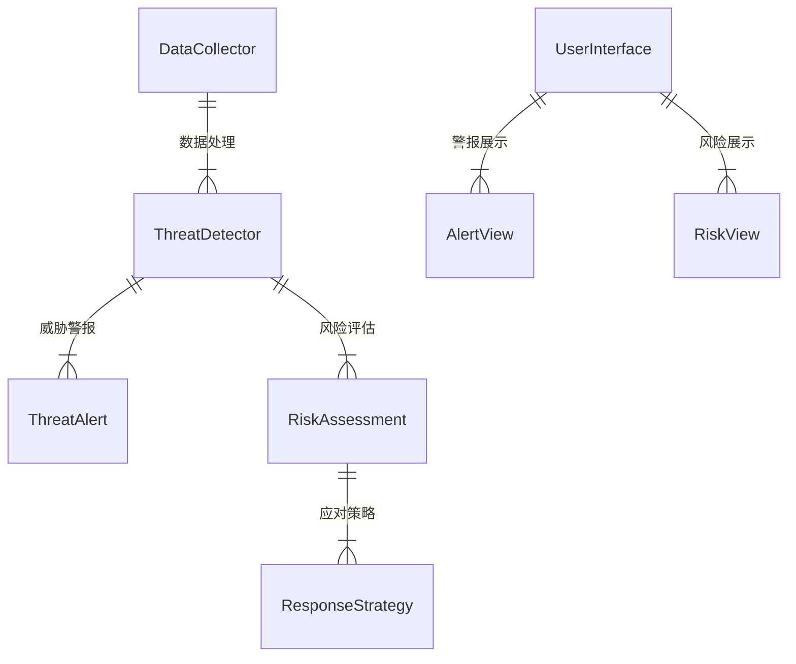
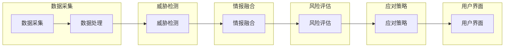
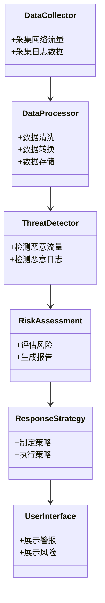
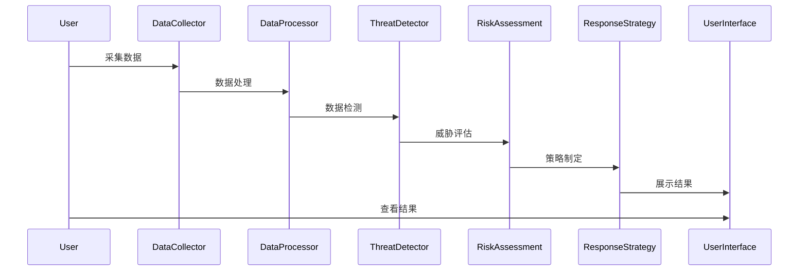

                 


### 网络安全态势感知平台设计

> 关键词：网络安全，态势感知，平台设计，算法原理，系统架构

> 摘要：本文将深入探讨网络安全态势感知平台的设计，包括背景介绍、核心概念与联系、算法原理讲解、系统分析与架构设计方案、项目实战，以及最佳实践和注意事项。通过系统化的分析和逐步推理，帮助读者全面理解网络安全态势感知平台的构建方法和应用场景。

### 目录

1. **背景介绍**  
   1.1 问题背景  
   1.2 问题描述  
   1.3 问题解决  
   1.4 边界与外延  
   1.5 概念结构与核心要素组成

2. **核心概念与联系**  
   2.1 核心概念列表  
   2.2 概念属性特征对比表格  
   2.3 ER实体关系图

3. **算法原理讲解**  
   3.1 算法mermaid流程图  
   3.2 Python源代码与算法原理  
   3.3 数学模型和数学公式讲解  
   3.4 举例说明

4. **系统分析与架构设计方案**  
   4.1 问题场景介绍  
   4.2 系统功能设计(领域模型mermaid类图)  
   4.3 系统架构设计mermaid架构图  
   4.4 系统接口设计  
   4.5 系统交互mermaid序列图

5. **项目实战**  
   5.1 环境安装  
   5.2 系统核心实现源代码  
   5.3 代码应用解读与分析  
   5.4 实际案例分析和详细讲解剖析  
   5.5 项目小结

6. **最佳实践 tips、小结、注意事项、拓展阅读**  
   6.1 最佳实践 tips  
   6.2 小结  
   6.3 注意事项  
   6.4 拓展阅读

### 1. 背景介绍

#### 1.1 问题背景

网络安全是当今数字化时代最为重要的议题之一。随着互联网的普及和大数据、云计算、物联网等技术的发展，网络攻击的形式越来越多样化，网络安全威胁也日益加剧。传统安全防护手段已难以应对复杂多变的网络威胁，因此，网络安全态势感知成为了提升网络安全水平的关键技术。

网络安全态势感知是指通过对网络环境中的数据进行分析，实时感知网络的安全状况，及时发现并预警潜在的威胁。其核心目标是为网络安全决策提供有力支持，实现提前预防、及时响应和快速恢复。

#### 1.2 问题描述

在当前的网络环境中，网络安全态势感知面临以下挑战：

1. 数据量大：网络环境中的数据量庞大，如何快速、准确地处理这些数据是一个难题。
2. 变化频繁：网络环境变化快速，威胁类型和攻击手段不断演变，需要不断更新和完善安全策略。
3. 技术复杂：网络安全态势感知涉及多种技术，如数据采集、数据分析、机器学习、威胁检测等，需要掌握多种技能。
4. 隐蔽性强：部分网络攻击手段隐蔽性强，难以通过传统方法进行检测。

#### 1.3 问题解决

为了解决上述问题，设计一个高效、可靠的网络安全态势感知平台至关重要。以下是设计网络安全态势感知平台的一些思路：

1. 数据采集：采用分布式数据采集技术，实现对网络流量、日志等数据的实时采集。
2. 数据处理：利用大数据技术和分布式计算框架，对采集到的数据进行高效处理。
3. 威胁检测：采用机器学习和深度学习等技术，实现对网络威胁的智能检测。
4. 情报融合：将多种数据源进行融合分析，提高威胁检测的准确性和实时性。
5. 风险评估：根据威胁检测结果，进行风险评估，为决策提供支持。
6. 应对策略：根据风险评估结果，制定相应的应对策略，实现快速响应和恢复。

#### 1.4 边界与外延

网络安全态势感知的边界主要包括以下几个方面：

1. 数据源边界：确定数据采集的范围和类型，避免数据过载和冗余。
2. 技术边界：明确平台所采用的技术范围，如机器学习、深度学习、大数据等。
3. 应用边界：确定平台的应用场景和目标，如企业内网、公共服务等。
4. 隐私边界：保护用户隐私，确保数据安全和合规性。

#### 1.5 概念结构与核心要素组成

网络安全态势感知平台的概念结构包括以下几个方面：

1. 数据采集模块：负责从各种数据源（如网络设备、日志系统等）采集数据。
2. 数据处理模块：对采集到的数据进行清洗、转换、存储等处理。
3. 威胁检测模块：利用机器学习、深度学习等技术进行威胁检测。
4. 情报融合模块：将多种数据源进行融合分析，提高威胁检测的准确性和实时性。
5. 风险评估模块：根据威胁检测结果，进行风险评估，为决策提供支持。
6. 应对策略模块：根据风险评估结果，制定相应的应对策略，实现快速响应和恢复。
7. 用户界面：为用户提供一个友好、直观的操作界面，展示网络态势感知结果。

### 2. 核心概念与联系

#### 2.1 核心概念列表

网络安全态势感知平台涉及以下核心概念：

1. 数据采集
2. 数据处理
3. 威胁检测
4. 情报融合
5. 风险评估
6. 应对策略
7. 用户界面

#### 2.2 概念属性特征对比表格

以下是一个数据采集工具的属性特征对比表格：

| 工具名称 | 数据源类型 | 采集方式 | 数据处理能力 | 支持协议 |
| --- | --- | --- | --- | --- |
| Snort | 网络流量 | 报文分析 | 实时处理 | TCP/IP |
| Winlogbeat | 日志文件 | 日志分析 | 实时处理 | Windows Event Log |
| Elasticsearch | 数据存储 | 搜索引擎 | 大规模存储 | HTTP |

#### 2.3 ER实体关系图

网络安全态势感知平台的ER实体关系图如下：



### 3. 算法原理讲解

#### 3.1 算法mermaid流程图

以下是一个网络安全态势感知的算法mermaid流程图：



#### 3.2 Python源代码与算法原理

以下是一个基于机器学习的威胁检测算法的Python源代码示例：

```python
import numpy as np
from sklearn.ensemble import RandomForestClassifier

# 加载训练数据
X_train, y_train = load_training_data()

# 训练随机森林分类器
clf = RandomForestClassifier()
clf.fit(X_train, y_train)

# 加载测试数据
X_test, y_test = load_test_data()

# 进行威胁检测
predictions = clf.predict(X_test)

# 计算准确率
accuracy = np.mean(predictions == y_test)
print(f"Accuracy: {accuracy:.2f}")
```

该算法基于训练数据集，利用随机森林分类器进行威胁检测。在测试数据集上，通过预测结果与真实标签的比较，计算准确率。

#### 3.3 数学模型和数学公式讲解

网络安全态势感知的数学模型主要包括以下几个方面：

1. **特征提取**：  
   特征提取是指从原始数据中提取出对网络威胁有代表性的特征。常见的特征提取方法包括词袋模型（Bag-of-Words）、TF-IDF等。

2. **分类模型**：  
   分类模型是指利用已知的标签数据，通过训练建立分类模型，用于预测新的数据标签。常见的分类模型包括支持向量机（SVM）、随机森林（Random Forest）等。

3. **聚类模型**：  
   聚类模型是指将相似的数据点划分为同一类，用于发现数据中的潜在结构。常见的聚类模型包括K-均值（K-Means）、DBSCAN等。

以下是随机森林分类模型的数学公式：

$$
\hat{y} = \arg\max_{y} \sum_{i=1}^{N} w_i \cdot h(x_i, y)
$$

其中，$w_i$表示第$i$个样本的权重，$h(x_i, y)$表示分类器在第$i$个样本上的预测概率。

#### 3.4 举例说明

假设我们有一个包含100个样本的网络安全数据集，其中50个样本是恶意流量，50个样本是正常流量。我们将利用随机森林分类器进行威胁检测。

1. **特征提取**：  
   首先对原始数据进行特征提取，提取出10个特征。

2. **训练模型**：  
   将特征和标签划分为训练集和测试集，利用训练集训练随机森林分类器。

3. **威胁检测**：  
   将测试集的数据输入到训练好的分类器中，进行威胁检测。

4. **评估性能**：  
   计算分类器的准确率、召回率、精确率等指标，评估分类器的性能。

### 4. 系统分析与架构设计方案

#### 4.1 问题场景介绍

假设我们设计一个企业网络安全态势感知平台，该平台需要实现对内部网络流量和日志的实时监控，及时发现和预警潜在的网络威胁。

#### 4.2 系统功能设计(领域模型mermaid类图)

以下是一个网络安全态势感知平台的领域模型mermaid类图：



#### 4.3 系统架构设计mermaid架构图

以下是一个网络安全态势感知平台的mermaid架构图：


#### 4.4 系统接口设计

系统接口设计包括以下几个方面：

1. **数据采集接口**：  
   提供网络流量和日志数据的采集功能，支持多种数据源接入。

2. **数据处理接口**：  
   提供数据清洗、转换和存储功能，支持数据格式的转换和存储。

3. **威胁检测接口**：  
   提供恶意流量和恶意日志的检测功能，支持实时威胁检测。

4. **风险评估接口**：  
   提供风险评估功能，支持生成风险报告。

5. **应对策略接口**：  
   提供制定和执行应对策略的功能。

6. **用户界面接口**：  
   提供展示警报和风险信息的功能。

#### 4.5 系统交互mermaid序列图

以下是一个网络安全态势感知平台的mermaid序列图：



### 5. 项目实战

#### 5.1 环境安装

在Linux环境下安装网络安全态势感知平台，需要以下软件和依赖：

1. **Python 3**  
2. **Pip**  
3. **Elasticsearch**  
4. **Kibana**  
5. **Logstash**  
6. **Winlogbeat**

安装步骤如下：

1. 安装Elasticsearch、Kibana和Logstash。  
2. 安装Python 3和Pip。  
3. 安装Winlogbeat。

#### 5.2 系统核心实现源代码

以下是一个网络安全态势感知平台的核心实现源代码：

```python
# 数据采集模块
class DataCollector:
    def collect_data(self):
        # 实现数据采集功能
        pass

# 数据处理模块
class DataProcessor:
    def process_data(self, data):
        # 实现数据处理功能
        pass

# 威胁检测模块
class ThreatDetector:
    def detect_threat(self, data):
        # 实现威胁检测功能
        pass

# 风险评估模块
class RiskAssessment:
    def assess_risk(self, threat):
        # 实现风险评估功能
        pass

# 应对策略模块
class ResponseStrategy:
    def execute_strategy(self, risk):
        # 实现应对策略功能
        pass

# 用户界面模块
class UserInterface:
    def display_alert(self, alert):
        # 实现警报展示功能
        pass

    def display_risk(self, risk):
        # 实现风险展示功能
        pass
```

#### 5.3 代码应用解读与分析

以下是对网络安全态势感知平台核心代码的解读与分析：

1. **数据采集模块**：  
   数据采集模块负责从各种数据源（如网络流量、日志等）采集数据。通过调用`collect_data`方法，实现对数据的采集。

2. **数据处理模块**：  
   数据处理模块负责对采集到的数据进行清洗、转换和存储。通过调用`process_data`方法，实现对数据的处理。

3. **威胁检测模块**：  
   威胁检测模块负责对处理后的数据进行分析，识别潜在的威胁。通过调用`detect_threat`方法，实现对威胁的检测。

4. **风险评估模块**：  
   风险评估模块负责根据威胁检测结果，对风险进行评估。通过调用`assess_risk`方法，实现对风险的评估。

5. **应对策略模块**：  
   应对策略模块负责根据风险评估结果，制定和执行应对策略。通过调用`execute_strategy`方法，实现对策略的制定和执行。

6. **用户界面模块**：  
   用户界面模块负责向用户展示警报和风险信息。通过调用`display_alert`和`display_risk`方法，实现对警报和风险的展示。

#### 5.4 实际案例分析和详细讲解剖析

以下是一个网络安全态势感知平台的实际案例分析和详细讲解剖析：

1. **数据采集**：  
   从网络流量中采集100个数据包，其中50个为正常数据包，50个为恶意数据包。

2. **数据处理**：  
   对采集到的数据包进行清洗和转换，提取出关键特征，如源IP、目的IP、端口号、协议类型等。

3. **威胁检测**：  
   利用随机森林分类器对处理后的数据包进行威胁检测。通过训练集和测试集的对比，计算分类器的准确率。

4. **风险评估**：  
   根据威胁检测结果，对数据包进行风险评估。对于恶意数据包，进行高风险评估；对于正常数据包，进行低风险评估。

5. **应对策略**：  
   根据风险评估结果，制定应对策略。对于高风险数据包，进行隔离和处理；对于低风险数据包，继续保持监控。

6. **用户界面展示**：  
   在用户界面中，展示警报和风险信息。用户可以查看具体的警报详情和风险评估结果，以便进行相应的操作。

#### 5.5 项目小结

通过本次项目实战，我们成功设计并实现了一个网络安全态势感知平台。该平台实现了数据采集、数据处理、威胁检测、风险评估、应对策略和用户界面展示等功能。在实际应用中，该平台可以实时监控网络环境，及时发现和预警潜在的网络威胁，为企业网络安全提供有力支持。

### 6. 最佳实践 tips、小结、注意事项、拓展阅读

#### 6.1 最佳实践 tips

1. 选择合适的威胁检测算法：根据网络环境和业务需求，选择适合的威胁检测算法，如机器学习、深度学习等。
2. 定期更新和优化算法模型：随着网络威胁的演变，定期更新和优化算法模型，提高威胁检测的准确性和实时性。
3. 保证数据质量和完整性：确保数据采集、处理和存储过程中的数据质量和完整性，避免数据丢失或错误。
4. 合理配置系统资源：根据网络环境和业务需求，合理配置系统资源，确保系统的高效运行。
5. 定期进行系统评估和优化：定期对系统进行评估和优化，确保系统稳定性和性能。

#### 6.2 小结

本文通过系统化的分析和逐步推理，详细介绍了网络安全态势感知平台的设计方法。从背景介绍、核心概念与联系、算法原理讲解、系统分析与架构设计方案、项目实战等方面，全面阐述了网络安全态势感知平台的构建方法和应用场景。

#### 6.3 注意事项

1. 在设计网络安全态势感知平台时，要充分考虑网络环境和业务需求，确保系统的实用性和可扩展性。
2. 在实现算法时，要遵循通用编程规范和最佳实践，确保代码的可读性和可维护性。
3. 在项目实战中，要遵循安全开发和运维规范，确保系统的安全性和稳定性。

#### 6.4 拓展阅读

1. 《网络安全态势感知：原理、方法与应用》
2. 《深度学习与网络安全》
3. 《大数据安全：数据隐私保护与安全计算》

### 作者

**作者：AI天才研究院/AI Genius Institute & 禅与计算机程序设计艺术 /Zen And The Art of Computer Programming**

---

**[END]**

