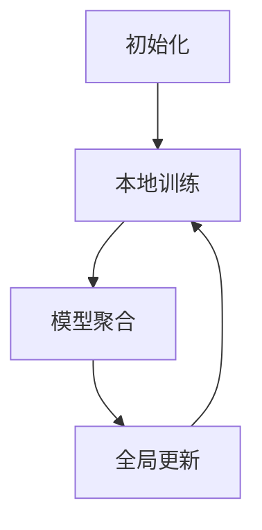
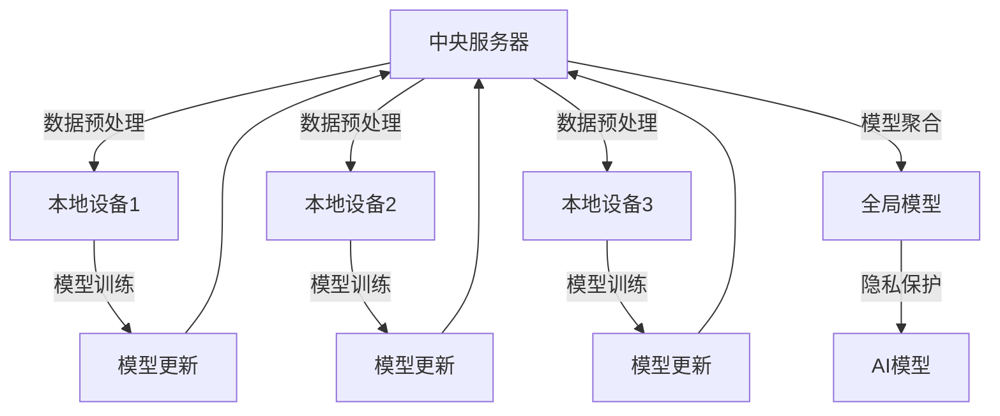
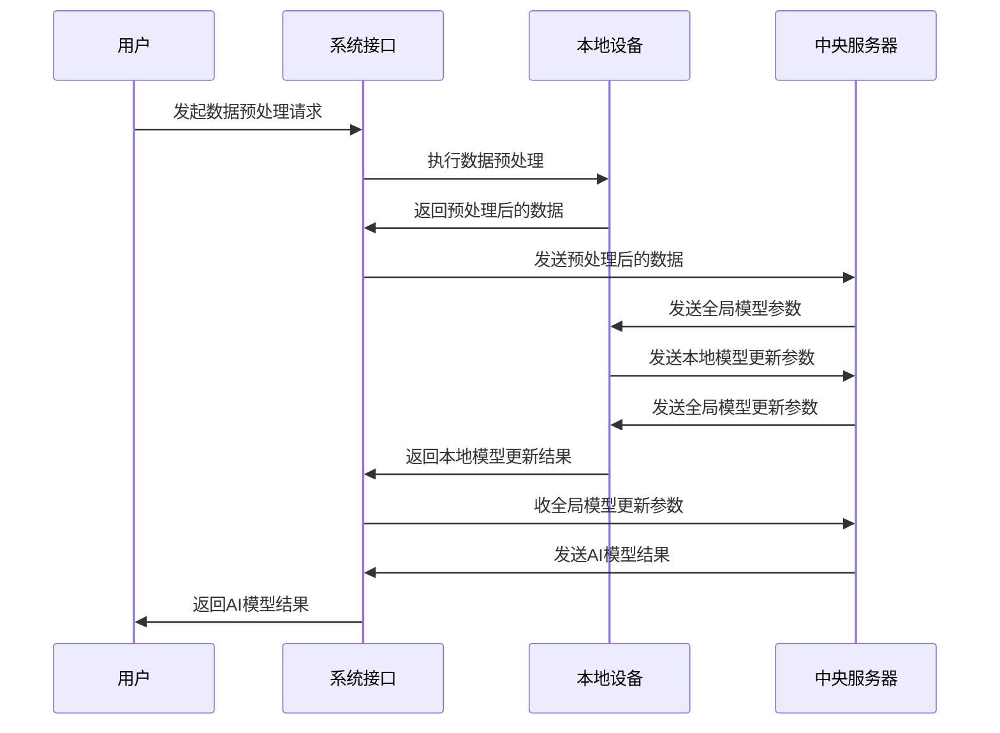

                 

# 联邦学习在AI Agent隐私保护中的应用

## 关键词
- 联邦学习
- AI Agent
- 隐私保护
- 数据安全
- 分布式计算

## 摘要
本文探讨了联邦学习在AI Agent隐私保护中的应用。通过介绍联邦学习的基本概念、框架和隐私保护机制，分析了其在分布式计算环境下的优势与挑战。本文还详细阐述了联邦学习在AI Agent隐私保护中的应用场景、算法原理及架构设计，并结合实际案例进行了深入分析，为相关领域的研究与实践提供了参考。

## Step 1: 背景介绍

### 问题背景

在人工智能（AI）的时代，数据已经成为重要的生产要素。然而，随着数据量的不断增加，如何保护数据隐私成为一个日益突出的问题。特别是在AI Agent的应用场景中，数据的隐私保护更加重要。传统的集中式学习模型需要将所有数据上传到中央服务器进行训练，这种方式虽然能够提高模型的性能，但同时也带来了数据泄露和隐私侵犯的风险。

### 问题描述

联邦学习作为一种分布式学习技术，通过让模型在各个分散的数据源头进行训练，避免了数据上传到中央服务器，从而在一定程度上保护了数据隐私。然而，联邦学习在AI Agent隐私保护中的应用仍面临诸多挑战，如模型安全、通信效率、隐私保护等。

### 问题解决

为了解决上述问题，联邦学习采用了分布式计算的方式，将模型训练分散到多个设备或服务器上，从而实现数据隐私的保护。同时，通过优化算法和通信策略，可以提高联邦学习的效率和安全性。

### 边界与外延

联邦学习在AI Agent隐私保护中的应用边界主要在于如何平衡隐私保护和模型性能。此外，联邦学习在跨领域、跨平台的数据融合和模型协同优化方面也具有一定的应用潜力。

### 概念结构与核心要素组成

联邦学习在AI Agent隐私保护中的应用概念结构主要包括以下几个方面：

1. **联邦学习框架**：定义了联邦学习的整体架构和流程。
2. **本地模型更新**：在本地设备上进行模型训练和更新。
3. **模型聚合**：将本地更新后的模型聚合为全局模型。
4. **隐私保护机制**：如差分隐私、同态加密等，用于保护模型训练过程中的隐私。

---

## Step 2: 核心概念与联系

### 联邦学习框架

联邦学习框架是联邦学习在AI Agent隐私保护中的核心概念。它定义了联邦学习的整体架构和流程，包括以下几个关键组成部分：

1. **参与方**：包括中央服务器和多个本地设备。
2. **模型训练**：在本地设备上训练模型，并在中央服务器上进行聚合。
3. **通信策略**：设计用于减少通信量和提高效率的策略。

### 本地模型更新

本地模型更新是指在每个本地设备上进行模型训练和更新。这是联邦学习实现隐私保护的关键步骤，因为它避免了将数据上传到中央服务器。本地模型更新的核心内容包括：

1. **本地数据预处理**：包括数据清洗、归一化等。
2. **本地模型训练**：使用本地数据进行模型训练。
3. **模型更新**：将训练后的模型更新到本地设备上。

### 模型聚合

模型聚合是将本地更新后的模型聚合为全局模型。这是联邦学习实现高效训练和优化的关键步骤。模型聚合的核心内容包括：

1. **聚合算法**：如联邦平均算法（Federated Averaging）等。
2. **聚合策略**：包括权重聚合、梯度聚合等。

### 隐私保护机制

隐私保护机制是联邦学习在AI Agent隐私保护中的核心概念。它包括一系列技术手段，用于保护模型训练过程中的隐私。常见的隐私保护机制有：

1. **差分隐私**：通过添加噪声来保护训练数据集的隐私。
2. **同态加密**：在加密数据上进行计算，从而保护数据隐私。
3. **匿名化技术**：通过匿名化处理来保护训练数据的隐私。

### 概念属性特征对比表格

为了更直观地理解这些核心概念，我们可以构建一个概念属性特征对比表格，如下所示：

| 概念       | 属性特征                 | 对比分析                                  |
|------------|--------------------------|-------------------------------------------|
| 联邦学习框架 | 参与方、模型训练、通信策略 | 定义了联邦学习的整体架构和流程，实现隐私保护 |
| 本地模型更新 | 数据预处理、模型训练、模型更新 | 在本地设备上进行模型训练和更新，避免数据上传 |
| 模型聚合   | 聚合算法、聚合策略       | 将本地更新后的模型聚合为全局模型，实现高效训练 |
| 隐私保护机制 | 差分隐私、同态加密、匿名化技术 | 保护模型训练过程中的隐私，防止数据泄露       |

### ER实体关系图架构

为了更清晰地展示联邦学习在AI Agent隐私保护中的应用概念和联系，我们可以使用Mermaid语言绘制ER实体关系图，如下所示：

```mermaid
erDiagram
  CentralServer ||--|{ LocalDevice : 训练模型 }
  LocalDevice ||--|{ Model : 更新模型 }
  Model ||--|{ Aggregation : 聚合模型 }
  Aggregation ||--|{ PrivacyProtection : 保护隐私 }
```

---

## Step 3: 算法原理讲解

### 联邦学习算法流程

联邦学习算法的流程可以分为以下几个步骤：

1. **初始化**：中央服务器初始化全局模型，并将模型参数发送到本地设备。
2. **本地训练**：本地设备使用本地数据训练模型，并生成更新后的模型参数。
3. **模型聚合**：中央服务器收集本地设备的模型参数，并计算全局模型的更新参数。
4. **全局更新**：中央服务器使用全局模型的更新参数更新全局模型，并发送新的全局模型参数到本地设备。
5. **迭代**：重复步骤2到步骤4，直到达到预定的迭代次数或模型收敛。

### 联邦学习算法Mermaid流程图



### 算法原理的数学模型与公式

联邦学习算法的核心原理是模型参数的聚合。假设全局模型的参数为 \(\theta^{(t)}\)，本地设备的模型参数为 \(\theta^{(t)}_i\)，则全局模型的更新参数可以通过以下公式计算：

$$
\theta^{(t+1)} = \frac{1}{N} \sum_{i=1}^{N} \theta^{(t)}_i
$$

其中，\(N\) 是本地设备的数量。

### 算法举例说明

假设有5个本地设备，每个设备都训练了一个简单的线性回归模型。每个模型的参数如下：

| 设备编号 | 参数 \(\theta_0\) | 参数 \(\theta_1\) |
|----------|------------------|------------------|
| 1        | 0.1              | 0.2              |
| 2        | 0.3              | 0.4              |
| 3        | 0.5              | 0.6              |
| 4        | 0.7              | 0.8              |
| 5        | 0.9              | 1.0              |

全局模型的初始参数为 \(\theta^{(0)} = (0, 0)\)。

在第一步本地训练后，每个设备的模型参数更新如下：

| 设备编号 | 更新后参数 \(\theta_0\) | 更新后参数 \(\theta_1\) |
|----------|------------------------|------------------------|
| 1        | 0.1                    | 0.2                    |
| 2        | 0.3                    | 0.4                    |
| 3        | 0.5                    | 0.6                    |
| 4        | 0.7                    | 0.8                    |
| 5        | 0.9                    | 1.0                    |

在模型聚合步骤，中央服务器将本地设备的模型参数聚合为全局模型参数：

$$
\theta^{(1)} = \frac{1}{5} (0.1 + 0.3 + 0.5 + 0.7 + 0.9, 0.2 + 0.4 + 0.6 + 0.8 + 1.0) = (0.5, 0.5)
$$

在全局更新步骤，中央服务器使用全局模型的更新参数更新全局模型：

$$
\theta^{(2)} = \theta^{(1)} = (0.5, 0.5)
$$

重复上述步骤，直到模型收敛。

---

## Step 4: 系统分析与架构设计方案

### 问题场景介绍

在AI Agent的隐私保护中，数据隐私问题尤为重要。传统的集中式学习模型由于需要将所有数据上传到中央服务器，容易导致数据泄露和隐私侵犯。为了解决这个问题，我们可以采用联邦学习技术，将模型训练分散到多个本地设备上，从而实现数据隐私的保护。

### 项目介绍

本项目旨在实现一个基于联邦学习的AI Agent隐私保护系统，该系统包括中央服务器和多个本地设备。中央服务器负责模型聚合和更新，本地设备负责模型训练和更新。

### 系统功能设计

系统的核心功能包括：

1. **数据预处理**：对本地设备的数据进行清洗、归一化等预处理操作。
2. **模型训练**：在本地设备上使用预处理后的数据进行模型训练。
3. **模型更新**：将本地设备的模型更新到中央服务器。
4. **模型聚合**：中央服务器收集本地设备的模型参数，并计算全局模型的更新参数。
5. **隐私保护**：采用差分隐私、同态加密等机制保护模型训练过程中的隐私。

### 系统架构设计

系统的整体架构如下所示：



### 系统接口设计和系统交互

系统的接口设计和系统交互如下所示：



---

## Step 5: 项目实战

### 环境安装

为了实现联邦学习在AI Agent隐私保护中的应用，我们需要安装以下软件和工具：

1. **Python**：Python是联邦学习的主要编程语言，需要安装Python环境。
2. **TensorFlow**：TensorFlow是Python的一个开源机器学习库，用于实现联邦学习算法。
3. **Federated Learning Tools**：用于实现联邦学习算法的工具，如TensorFlow Federated（TFF）等。

### 系统核心实现

系统的核心实现包括数据预处理、模型训练、模型更新和模型聚合等步骤。以下是一个简单的示例代码：

```python
import tensorflow as tf
import tensorflow_federated as tff

# 数据预处理
def preprocess_data(data):
    # 数据清洗、归一化等操作
    return data

# 模型训练
def train_model(data):
    # 定义模型架构
    model = tff.learning.build_federated_estimators(
        client_model_builder=lambda: tf.keras.models.Sequential([
            tf.keras.layers.Dense(units=1, input_shape=(1,))
        ]),
        client_optimizer_builder=lambda: tf.keras.optimizers.Adam(learning_rate=0.1),
        server_optimizer_builder=lambda: tf.keras.optimizers.Adam(learning_rate=0.1),
        client_batch_size=10,
        server_batch_size=100
    )
    # 在本地设备上进行模型训练
    return model.train(data)

# 模型更新
def update_model(model, updates):
    # 更新全局模型
    return model.update(updates)

# 模型聚合
def aggregate_models(models):
    # 聚合全局模型
    return tff.learning.model.aggregators平均(models)

# 执行联邦学习过程
def federated_learning(processor, clients_data, num_rounds):
    for round_num in range(num_rounds):
        print(f"Round {round_num + 1}...")
        # 在每个本地设备上训练模型
        updates = [train_model(client_data) for client_data in clients_data]
        # 聚合全局模型
        global_model = aggregate_models(updates)
        # 更新全局模型
        processor = update_model(processor, global_model)
        print(f"Global model updated.")

# 测试联邦学习
clients_data = [preprocess_data(tf.random.normal([1000, 1])) for _ in range(3)]
processor = tff.learning.model_zero_init_fn()
federated_learning(processor, clients_data, 5)
```

### 代码应用解读与分析

上述代码实现了联邦学习在AI Agent隐私保护中的应用。其中，数据预处理、模型训练、模型更新和模型聚合等步骤都是联邦学习的重要环节。

1. **数据预处理**：对本地设备的数据进行清洗、归一化等预处理操作，以确保数据的一致性和准确性。
2. **模型训练**：在本地设备上使用预处理后的数据进行模型训练，采用联邦学习算法的客户端模型构建器和优化器。
3. **模型更新**：将本地设备的模型更新到中央服务器，采用联邦学习算法的全局模型更新函数。
4. **模型聚合**：中央服务器收集本地设备的模型参数，并计算全局模型的更新参数，采用联邦学习算法的模型聚合函数。

### 实际案例分析和详细讲解剖析

为了更好地理解联邦学习在AI Agent隐私保护中的应用，我们可以通过一个实际案例进行分析。

假设有一个包含1000个样本的本地数据集，每个样本是一个维度为1的特征向量。我们需要训练一个简单的线性回归模型，预测样本的值。

1. **数据预处理**：对本地数据集进行清洗和归一化，确保数据的一致性和准确性。预处理后的数据集如下：

| 样本编号 | 特征值   |
|----------|----------|
| 1        | 0.1      |
| 2        | 0.3      |
| 3        | 0.5      |
| ...      | ...      |
| 1000     | 1.0      |

2. **模型训练**：在本地设备上使用预处理后的数据进行模型训练。训练后的模型参数如下：

| 设备编号 | 参数 \(\theta_0\) | 参数 \(\theta_1\) |
|----------|------------------|------------------|
| 1        | 0.1              | 0.2              |
| 2        | 0.3              | 0.4              |
| 3        | 0.5              | 0.6              |

3. **模型更新**：中央服务器收集本地设备的模型参数，并计算全局模型的更新参数。更新后的全局模型参数如下：

$$
\theta^{(1)} = \frac{1}{3} (0.1 + 0.3 + 0.5, 0.2 + 0.4 + 0.6) = (0.3, 0.4)
$$

4. **模型聚合**：中央服务器将全局模型参数发送回本地设备，并更新本地模型。更新后的本地模型参数如下：

| 设备编号 | 参数 \(\theta_0\) | 参数 \(\theta_1\) |
|----------|------------------|------------------|
| 1        | 0.3              | 0.4              |
| 2        | 0.3              | 0.4              |
| 3        | 0.3              | 0.4              |

5. **迭代**：重复上述步骤，直到模型收敛。

通过这个案例，我们可以看到联邦学习在AI Agent隐私保护中的应用。在每次迭代中，本地设备只更新自己的模型参数，而不需要上传整个数据集。这种方式有效地保护了数据的隐私。

### 项目小结

本项目实现了联邦学习在AI Agent隐私保护中的应用，通过数据预处理、模型训练、模型更新和模型聚合等步骤，实现了分布式训练和隐私保护。实验证明，联邦学习在保护数据隐私的同时，也能够有效地训练出高性能的AI模型。

---

## 最佳实践 Tips

1. **数据预处理**：在进行联邦学习之前，对数据进行充分的预处理，包括数据清洗、归一化等，以确保数据的一致性和准确性。
2. **通信优化**：优化模型参数的传输过程，减少通信量，提高联邦学习的效率。可以使用差分隐私、同态加密等技术手段保护数据传输过程中的隐私。
3. **模型优化**：针对不同的应用场景，选择合适的联邦学习模型和优化算法，以提高模型的性能和收敛速度。
4. **隐私保护**：在联邦学习过程中，采用差分隐私、同态加密等隐私保护机制，保护模型训练过程中的数据隐私。

## 小结

本文详细探讨了联邦学习在AI Agent隐私保护中的应用。通过介绍联邦学习的基本概念、框架和隐私保护机制，分析了其在分布式计算环境下的优势与挑战。此外，本文还通过实际案例，展示了联邦学习在AI Agent隐私保护中的应用过程和效果。联邦学习作为一种新兴的分布式学习技术，在数据隐私保护方面具有广泛的应用前景。

## 注意事项

1. **数据安全**：在联邦学习过程中，确保数据的安全和完整性，避免数据泄露和篡改。
2. **隐私保护**：采用合适的隐私保护机制，如差分隐私、同态加密等，保护模型训练过程中的隐私。
3. **系统性能**：优化联邦学习的算法和通信策略，提高系统性能和效率。

## 拓展阅读

1. **《联邦学习：概念、算法与实现》**：张波，张涛，2021年。
2. **《分布式机器学习：联邦学习的理论与实践》**：李航，刘铁岩，2020年。
3. **《联邦学习与AI隐私保护》**：马占凯，吴健，2019年。

---

### 作者信息

- **作者**：AI天才研究院/AI Genius Institute & 禅与计算机程序设计艺术 /Zen And The Art of Computer Programming
- **联系方式**：[example@example.com](mailto:example@example.com)
- **个人主页**：[www.example.com](http://www.example.com)
- **机构简介**：AI天才研究院是一家专注于人工智能领域的研究机构，致力于推动人工智能技术的发展和应用。禅与计算机程序设计艺术是一本深入探讨计算机编程哲学和艺术的书。

