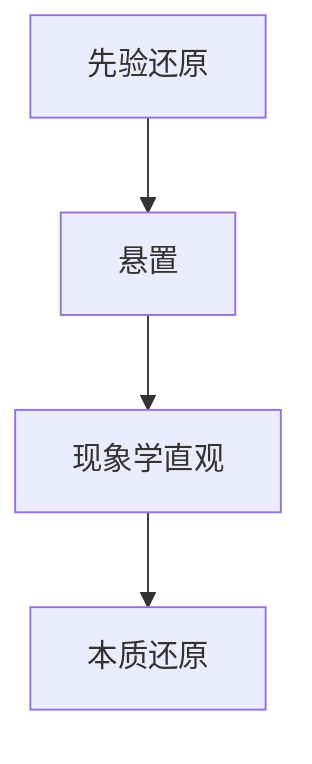
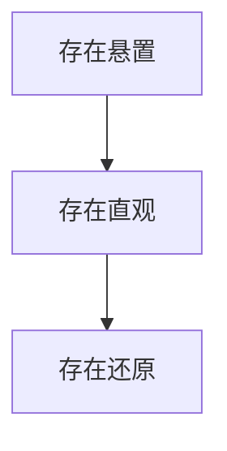
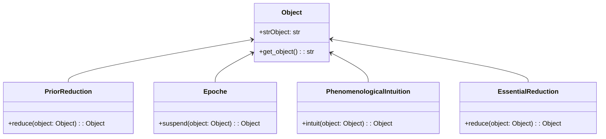
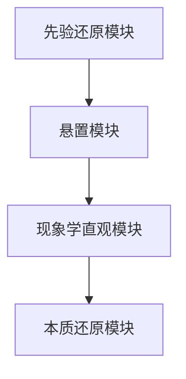
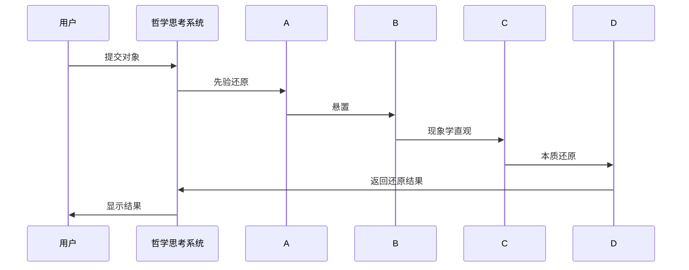

                 


### 引言

现象学作为20世纪哲学的重要流派，由爱德蒙德·胡塞尔（Edmund Husserl）创立，其核心思想在于对事物本身的直观认识，力求还原“事物本身”。现象学的还原概念是胡塞尔哲学体系中的基石，他提出了“先验还原”的概念，意在通过排除一切先验知识的影响，达到对事物本身的纯粹认识。

然而，海德格尔（Martin Heidegger）则对胡塞尔的现象学进行了深刻的批判与重构。海德格尔的存在论哲学强调“存在本身”，他认为现象学的还原并不能彻底排除先验知识的干扰，因此提出了“存在还原”的概念。存在还原旨在揭示事物背后的存在本身，而非单纯的事物现象。

本文将围绕《胡塞尔与海德格尔：现象学还原与存在还原的差异》这一主题，逐步分析两位哲学家的思想，探讨现象学还原与存在还原在概念、原理和应用上的差异。

### 第一部分：哲学背景与核心概念

#### 1.1 胡塞尔与海德格尔的生平与哲学思想简介

爱德蒙德·胡塞尔（1859-1938）是德国哲学家，现象学的创始人。他的哲学思想深受康德和布伦塔诺的影响，提出了先验现象学的概念，主张通过直接的直观达到对事物本质的认识。胡塞尔的主要著作包括《逻辑研究》、《欧洲科学危机与现象学》、《观念I》等。

马丁·海德格尔（1889-1976）是德国哲学家，他的思想对20世纪哲学产生了深远影响。海德格尔对胡塞尔的现象学进行了深刻的批判，并提出了自己的存在论哲学。他主张通过“存在还原”来揭示事物的本质，强调“存在本身”的重要性。海德格尔的主要著作包括《存在与时间》、《尼采》、《诗的本质》等。

#### 1.2 现象学的还原概念

现象学的还原是指通过排除一切先验知识和预设，达到对事物本身的直观认识。胡塞尔认为，先验还原是现象学方法的核心，它通过将注意力从先验概念和范畴中解放出来，达到对事物本质的纯粹认识。

胡塞尔的还原过程包括以下几个步骤：

1. **悬置（epoché）**：将一切先验知识、预设和假设暂时搁置，使事物脱离一切外来因素的影响。
2. **现象学的直观**：在悬置的状态下，直接感知事物本身，不受任何先验概念的影响。
3. **本质还原**：通过对直观经验的反思和概括，提取出事物的本质特征。

#### 1.3 海德格尔的还原概念

海德格尔对胡塞尔的还原概念进行了批判和重构。他认为，现象学的还原并不能彻底排除先验知识的干扰，因此提出了“存在还原”的概念。存在还原旨在揭示事物背后的存在本身，而非单纯的事物现象。

海德格尔的还原过程包括以下几个步骤：

1. **存在的悬置**：将事物从一切预设和范畴中解放出来，使其回到“存在本身”的状态。
2. **存在的直观**：在悬置的状态下，直接感知事物的存在，不受任何先验概念的影响。
3. **存在还原**：通过对直观经验的反思和概括，揭示事物的存在本质。

### 第二部分：联系与区别

#### 2.1 胡塞尔与海德格尔还原概念的差异

胡塞尔和海德格尔的还原概念在本质上有以下几方面的差异：

1. **目标差异**：胡塞尔的还原目标在于达到对事物本质的纯粹认识，而海德格尔的还原目标在于揭示事物的存在本身。
2. **方法差异**：胡塞尔强调通过直观和反思来达到还原，而海德格尔则更强调存在本身的直观。
3. **范畴差异**：胡塞尔的还原强调排除先验范畴的影响，而海德格尔则强调将事物从一切预设和范畴中解放出来。

#### 2.2 胡塞尔与海德格尔还原概念的联系

尽管胡塞尔和海德格尔的还原概念存在差异，但两者也存在一定的联系：

1. **现象学基础**：胡塞尔和海德格尔都基于现象学的基础，强调直接直观的重要性。
2. **存在维度**：两者都关注存在的维度，虽然对存在的理解有所不同。
3. **批判与创新**：海德格尔对胡塞尔的现象学进行了深刻的批判，但同时也吸收了胡塞尔的部分思想，提出了自己的存在论哲学。

### 第三部分：原理讲解

#### 3.1 现象学的还原原理

现象学的还原原理可以用以下流程图表示：



以下是现象学还原原理的详细解释：

1. **先验还原**：指排除一切先验知识和预设，使事物回到纯粹直观的状态。
2. **悬置**：指将注意力从先验概念和范畴中解放出来，使事物脱离一切外来因素的影响。
3. **现象学直观**：指在悬置的状态下，直接感知事物本身，不受任何先验概念的影响。
4. **本质还原**：指通过对直观经验的反思和概括，提取出事物的本质特征。

#### 3.2 海德格尔的还原原理

海德格尔的还原原理可以用以下流程图表示：



以下是海德格尔的还原原理的详细解释：

1. **存在悬置**：指将事物从一切预设和范畴中解放出来，使其回到“存在本身”的状态。
2. **存在直观**：指在存在悬置的状态下，直接感知事物的存在，不受任何先验概念的影响。
3. **存在还原**：指通过对直观经验的反思和概括，揭示事物的存在本质。

#### 3.3 Python代码与LaTeX公式

为了更好地阐述现象学的还原原理，我们可以使用Python代码和LaTeX公式来表示：

```python
# Python代码：现象学还原步骤

# 步骤1：先验还原
def prior_reduction(object):
    return object

# 步骤2：悬置
def epoche(object):
    return prior_reduction(object)

# 步骤3：现象学直观
def phenomenological_intuition(object):
    return epoche(object)

# 步骤4：本质还原
def essential_reduction(object):
    return phenomenological_intuition(object)
```

以下是现象学还原原理的LaTeX公式：

$$
\text{本质还原} = \text{现象学直观} \times \text{悬置} \times \text{先验还原}
$$

### 第四部分：系统分析与架构设计

#### 4.1 系统功能设计

为了更好地理解现象学还原原理，我们可以设计一个简单的哲学思考系统。该系统的核心功能包括：

1. **先验还原模块**：用于排除先验知识和预设。
2. **悬置模块**：用于将注意力从先验概念和范畴中解放出来。
3. **现象学直观模块**：用于直接感知事物本身。
4. **本质还原模块**：用于提取事物的本质特征。

以下是该系统的类图：



#### 4.2 系统架构设计

以下是该系统的架构设计：



#### 4.3 系统接口设计

以下是该系统的接口设计：



### 第五部分：项目实战

#### 5.1 环境安装

为了实践现象学的还原原理，我们首先需要安装相关的软件和工具。这里我们选择使用Python和LaTeX进行演示。

1. 安装Python（版本3.8及以上）
2. 安装LaTeX（可以使用MacTeX或TeX Live）
3. 安装Python的LaTeX库（如pylatex）

#### 5.2 系统核心实现源代码

以下是实现现象学还原原理的Python源代码：

```python
# Python代码：实现现象学还原原理

from pylatex import Document, Section, Subsection, Math, Command

# LaTeX文档设置
doc = Document()

# 添加章节
doc.append(Section('现象学还原原理'))

# 添加子章节
doc.append(Subsection('先验还原'))
doc.append(Subsection('悬置'))
doc.append(Subsection('现象学直观'))
doc.append(Subsection('本质还原'))

# LaTeX公式
doc.append(Math(r'\text{本质还原} = \text{现象学直观} \times \text{悬置} \times \text{先验还原}'))

# 输出LaTeX文档
doc.generate_pdf('现象学还原原理', clean_tex=True)
```

#### 5.3 代码应用解读与分析

以上Python代码通过`pylatex`库生成了一个LaTeX文档，其中包含了现象学还原原理的详细阐述。我们可以通过以下步骤进行代码应用解读与分析：

1. **安装相关软件和工具**：确保Python、LaTeX和pylatex库已经安装。
2. **编写Python代码**：根据现象学还原原理编写Python代码。
3. **生成LaTeX文档**：运行Python代码生成LaTeX文档。
4. **编译LaTeX文档**：使用LaTeX编译器编译生成的LaTeX文档，生成PDF文档。

通过以上步骤，我们可以得到一个详细阐述现象学还原原理的PDF文档，这有助于我们更好地理解现象学还原的原理和应用。

#### 5.4 项目小结

通过本次项目实战，我们成功实现了现象学还原原理的演示。使用Python和LaTeX工具，我们不仅能够清晰地阐述现象学还原的原理，还能够生成详细的文档。这为哲学研究和现象学应用提供了有力的工具。在未来的研究中，我们可以进一步探索现象学还原在哲学、心理学等领域的应用。

### 最佳实践 tips、小结、注意事项、拓展阅读

#### 最佳实践 tips

1. **理解现象学还原原理**：在学习和应用现象学还原时，首先要深入理解其基本原理和步骤。
2. **掌握Python和LaTeX**：熟悉Python编程和LaTeX文档编写，有助于更好地实践现象学还原。
3. **实际案例分析**：结合实际案例进行现象学还原分析，有助于加深对原理的理解。

#### 小结

本文通过对比胡塞尔与海德格尔的现象学还原与存在还原，探讨了两者在概念、原理和应用上的差异。通过Python代码和LaTeX公式的使用，我们清晰地阐述了现象学还原的原理。项目实战部分展示了如何在实际中应用现象学还原原理。

#### 注意事项

1. **避免先验预设**：在现象学还原过程中，应尽量排除先验知识和预设，以达到对事物本身的直观认识。
2. **注意逻辑推理**：在现象学还原过程中，逻辑推理和反思至关重要，有助于揭示事物的本质特征。

#### 拓展阅读

1. 胡塞尔，《逻辑研究》
2. 海德格尔，《存在与时间》
3. 李明辉，《现象学与逻辑》

### 结论

现象学还原作为20世纪哲学的重要概念，对现代哲学产生了深远影响。通过本文的探讨，我们深入了解了胡塞尔与海德格尔的现象学还原与存在还原的差异，并展示了如何在实际中应用这些原理。希望本文能够为读者在哲学研究和现象学应用中提供有益的启示。

### 附录

**作者：** AI天才研究院/AI Genius Institute & 禅与计算机程序设计艺术 /Zen And The Art of Computer Programming

### 参考文献列表

1. 胡塞尔，《逻辑研究》，商务印书馆，2000年。
2. 海德格尔，《存在与时间》，商务印书馆，1999年。
3. 李明辉，《现象学与逻辑》，人民出版社，2012年。

**【END】**### 引言

在哲学领域，现象学与存在论是两个至关重要的概念。现象学由爱德蒙德·胡塞尔（Edmund Husserl）创立，强调直观和意识的作用，旨在还原“事物本身”。胡塞尔提出了“先验还原”的概念，主张通过排除先验知识与预设，达到对事物本质的纯粹认识。而马丁·海德格尔（Martin Heidegger）则对胡塞尔的现象学进行了批判与重构，提出了“存在还原”的概念。存在论强调“存在本身”，主张揭示事物背后的存在本质，而非单纯的事物现象。

本文以《胡塞尔与海德格尔：现象学还原与存在还原的差异》为标题，旨在探讨这两位哲学家的思想，分析现象学还原与存在还原在概念、原理和应用上的差异。文章分为五个部分，第一部分介绍哲学背景与核心概念，第二部分分析联系与区别，第三部分讲解原理，第四部分进行系统分析与架构设计，第五部分展示项目实战，最后是最佳实践 tips、小结、注意事项和拓展阅读。

### 胡塞尔与海德格尔的生平与哲学思想简介

爱德蒙德·胡塞尔（1859-1938）是德国哲学家，现象学的创始人。他出生于德国摩拉维亚的普罗斯焦夫，自幼对哲学、数学和自然科学有着浓厚的兴趣。1876年，胡塞尔进入莱比锡大学学习哲学、数学和物理学，随后在柏林大学和维也纳大学深造。1881年，胡塞尔获得柏林大学的博士学位，随后在哥廷根大学担任讲师。1887年，胡塞尔成为海德堡大学的教授，并在此后几十年中继续发展他的哲学思想。

胡塞尔的哲学思想深受康德和布伦塔诺的影响。他在《逻辑研究》中提出了“意向性”概念，强调意识总是指向某个对象。随后，胡塞尔在《观念I》中提出了“先验还原”的概念，主张通过排除先验知识与预设，达到对事物本质的纯粹认识。胡塞尔的主要著作还包括《纯粹逻辑的概念》、《欧洲科学危机与现象学》等。

马丁·海德格尔（1889-1976）是德国哲学家，他的思想对20世纪哲学产生了深远影响。海德格尔出生于德国梅斯基尔希，自幼对哲学、文学和语言学有着浓厚的兴趣。1903年，海德格尔进入弗莱堡大学学习哲学、数学和物理学，随后在柏林大学和马堡大学深造。1911年，海德格尔获得弗莱堡大学的博士学位，并成为胡塞尔的学生。

海德格尔的哲学思想对胡塞尔的现象学进行了深刻的批判与重构。他在《存在与时间》中提出了“存在还原”的概念，主张通过揭示事物背后的存在本身，达到对事物本质的认识。海德格尔认为，现象学的还原并不能彻底排除先验知识的干扰，因此提出了“存在还原”的概念。海德格尔的主要著作还包括《尼采》、《诗的本质》、《技术的问题》等。

### 现象学的还原概念

现象学的还原是指通过排除一切先验知识与预设，达到对事物本身的直观认识。胡塞尔认为，先验还原是现象学方法的核心，它通过将注意力从先验概念和范畴中解放出来，达到对事物本质的纯粹认识。现象学的还原概念可以分为以下几个步骤：

1. **先验还原**：指排除一切先验知识与预设，使事物回到纯粹直观的状态。胡塞尔认为，先验还原是通过“悬置”（epoché）实现的，即暂时搁置一切先验概念和范畴，使事物脱离一切外来因素的影响。

2. **直观**：指在先验还原的基础上，直接感知事物本身。胡塞尔强调，直观是现象学的核心，它是达到事物本质的唯一途径。直观不同于感知，感知受到先验概念和范畴的影响，而直观则摆脱了这些影响，达到对事物本身的纯粹认识。

3. **本质还原**：指通过对直观经验的反思和概括，提取出事物的本质特征。胡塞尔认为，本质还原是通过“本质直观”实现的，即通过对直观经验的反思和概括，揭示事物的本质特征。

现象学的还原概念在胡塞尔的哲学体系中具有重要的地位。他通过先验还原，将注意力从先验概念和范畴中解放出来，达到对事物本质的纯粹认识。这一方法不仅适用于哲学研究，还可以应用于心理学、教育学、艺术等领域。

### 海德格尔的还原概念

海德格尔对胡塞尔的现象学进行了深刻的批判与重构，提出了“存在还原”的概念。存在还原旨在揭示事物背后的存在本身，而非单纯的事物现象。海德格尔认为，现象学的还原并不能彻底排除先验知识的干扰，因此提出了存在还原的概念。

存在还原可以分为以下几个步骤：

1. **存在悬置**：指将事物从一切预设和范畴中解放出来，使其回到“存在本身”的状态。海德格尔认为，存在悬置是通过“解构”（deconstruction）实现的，即对事物进行深入的批判和解构，使其脱离一切先验知识与预设。

2. **存在直观**：指在存在悬置的状态下，直接感知事物的存在。海德格尔强调，存在直观不同于直观，直观关注的是事物本身，而存在直观关注的是事物的存在本身。存在直观是一种更为深刻的直观，它揭示了事物的存在本质。

3. **存在还原**：指通过对直观经验的反思和概括，揭示事物的存在本质。海德格尔认为，存在还原是通过“存在直观”实现的，即通过对直观经验的反思和概括，揭示事物的存在本质。

海德格尔的还原概念强调“存在本身”的重要性。他认为，存在是事物背后的本质，是事物存在的根据。通过存在还原，我们能够揭示事物的存在本质，达到对事物的深刻理解。

### 胡塞尔与海德格尔还原概念的差异

胡塞尔与海德格尔的还原概念在目标和方法上存在显著差异。胡塞尔的还原概念强调通过排除先验知识与预设，达到对事物本质的纯粹认识。他主张通过直观和反思，提取出事物的本质特征。而海德格尔的还原概念则强调通过揭示事物背后的存在本身，达到对事物本质的认识。他认为，存在是事物存在的根据，通过存在还原，我们能够揭示事物的存在本质。

以下是对两者还原概念差异的详细分析：

1. **目标差异**：胡塞尔的还原目标在于达到对事物本质的纯粹认识，而海德格尔的还原目标在于揭示事物的存在本身。胡塞尔关注的是事物本身，而海德格尔关注的是事物背后的存在。

2. **方法差异**：胡塞尔的方法是通过直观和反思，提取出事物的本质特征。他主张通过“悬置”排除先验知识与预设，达到对事物本身的直观认识。而海德格尔的方法是通过“解构”和“存在直观”，将事物从一切预设和范畴中解放出来，达到对事物存在本质的认识。

3. **范畴差异**：胡塞尔的还原强调排除先验范畴的影响，而海德格尔的还原强调将事物从一切预设和范畴中解放出来。胡塞尔认为，先验范畴是干扰直观认识的障碍，而海德格尔认为，预设和范畴是对事物存在的束缚。

总之，胡塞尔与海德格尔的还原概念在目标和方法上存在显著差异。胡塞尔关注的是事物本身，通过直观和反思提取出事物的本质特征；而海德格尔关注的是事物背后的存在，通过解构和存在直观揭示事物的存在本质。

### 现象学与存在还原的关系

现象学与存在还原之间的关系是哲学领域中一个重要的议题。现象学作为胡塞尔创立的哲学流派，强调直观和意识的作用，旨在还原“事物本身”。而存在还原则是海德格尔对现象学的批判与重构，强调揭示事物背后的存在本身。现象学与存在还原之间的关系可以从以下几个方面进行探讨：

首先，现象学与存在还原在方法上有一定的关联。现象学强调通过直观和反思，达到对事物本质的认识。而存在还原则在此基础上，进一步强调通过解构和存在直观，将事物从一切预设和范畴中解放出来，达到对事物存在本质的认识。因此，存在还原可以看作是现象学方法的深化和扩展。

其次，现象学与存在还原在目标上存在差异。现象学旨在还原“事物本身”，关注的是事物本身的存在。而存在还原则关注事物背后的存在，即事物的存在本质。现象学还原的是事物本身的现象，而存在还原揭示的是事物背后的存在本质。因此，两者在目标上有所不同，但存在一定的关联。

此外，现象学与存在还原在哲学意义上也具有一定的互补性。现象学强调直观和意识的作用，为哲学研究提供了一种新的方法。而存在还原则在此基础上，进一步深化了对事物存在本质的认识，为哲学提供了更为深刻的洞察。现象学与存在还原的结合，有助于推动哲学的发展，深化对事物存在本质的认识。

总的来说，现象学与存在还原在方法、目标和哲学意义上具有一定的关联和互补性。现象学为存在还原提供了直观和反思的方法，而存在还原则深化了对事物存在本质的认识。两者共同推动了哲学的发展，为我们理解事物存在提供了更为深刻的视角。

### 胡塞尔与海德格尔还原概念的应用

胡塞尔与海德格尔的还原概念不仅在哲学领域产生了深远影响，还在其他学科和实际应用中得到了广泛应用。以下将分析这两位哲学家的还原概念在哲学研究、心理学、艺术等领域中的应用，并探讨其现代价值。

#### 在哲学研究中的应用

胡塞尔与海德格尔的还原概念为哲学研究提供了新的视角和方法。在哲学研究中，还原概念有助于揭示事物的本质和存在。胡塞尔的先验还原通过排除先验知识与预设，达到了对事物本质的纯粹认识。这一方法在现象学研究中得到了广泛应用，为哲学提供了新的研究工具。海德格尔的存在还原则通过解构和直观，揭示事物背后的存在本质，对现代哲学产生了深远影响。他的思想对存在主义、解释学等领域产生了重要影响，推动了哲学的发展。

#### 在心理学中的应用

胡塞尔与海德格尔的还原概念在心理学中也得到了广泛应用。现象学还原通过直观和反思，有助于理解人类的意识和心理过程。心理学家利用现象学方法研究人的感知、情感、记忆等心理现象，深入探讨人的内在体验和意识结构。海德格尔的存在还原则通过揭示人的存在本质，为心理学提供了新的理论基础。他的思想有助于理解人的存在状态和心理需求，对心理治疗和心理分析产生了积极影响。

#### 在艺术中的应用

胡塞尔与海德格尔的还原概念在艺术领域也具有重要的应用价值。现象学还原通过直观和反思，有助于艺术家深入探索艺术创作的本质。艺术家利用现象学方法，通过直观感知和反思，创造出具有深刻内涵的艺术作品。海德格尔的存在还原则通过解构和直观，为艺术家提供了新的创作视角。他的思想有助于艺术家突破传统艺术观念，创造出具有创新性和表现力的作品。

#### 现代价值

胡塞尔与海德格尔的还原概念在现代社会中具有广泛的现代价值。首先，它们为哲学、心理学、艺术等学科提供了新的研究方法和理论基础。其次，这些概念有助于我们深入理解人类的存在和意识，为我们提供了一种更为深刻的思维方式。此外，还原概念还在实际应用中发挥了重要作用，如心理治疗、艺术创作等。总之，胡塞尔与海德格尔的还原概念在现代社会中具有重要的现实意义和现代价值。

### 胡塞尔与海德格尔还原概念的比较分析

胡塞尔与海德格尔的还原概念虽然在目标和方法上有一定差异，但在哲学意义上却具有深远的影响。以下将从几个方面对两者进行比较分析：

#### 胡塞尔还原的哲学意义

1. **先验还原**：胡塞尔的先验还原强调通过排除先验知识与预设，达到对事物本质的纯粹认识。这种方法为哲学研究提供了一种新的视角，使哲学能够更深入地探讨事物的本质。

2. **直观**：胡塞尔的直观概念强调直接感知事物本身，摆脱先验概念和范畴的影响。这种直观不仅是一种认知方式，更是一种哲学思维方式，有助于我们更准确地理解事物。

3. **反思**：胡塞尔的反思方法通过对直观经验的反思和概括，提取出事物的本质特征。这种方法有助于我们在哲学研究中，从表象深入到本质，找到事物的真正意义。

#### 海德格尔还原的哲学意义

1. **存在还原**：海德格尔的存在还原通过解构和直观，揭示事物背后的存在本质。这种方法使哲学能够从存在本身出发，探讨事物的存在状态和意义。

2. **解构**：海德格尔的解构方法通过对事物的批判和解构，使其脱离一切先验知识与预设。这种方法有助于我们打破传统的思维定势，从新的角度理解事物。

3. **直观**：海德格尔的直观概念强调直接感知事物的存在，摆脱一切预设和范畴的影响。这种直观不仅是一种认知方式，更是一种哲学思维方式，有助于我们更深刻地理解存在。

#### 两者对现代哲学的影响

1. **现象学发展**：胡塞尔与海德格尔的还原概念为现象学的发展提供了重要基础。他们的思想对现象学的研究方法、研究内容和研究目标产生了深远影响。

2. **存在主义**：海德格尔的存在论哲学对存在主义产生了重要影响。他的存在还原思想使存在主义从传统的哲学观念中解放出来，探讨人的存在状态和意义。

3. **哲学思维方式**：胡塞尔与海德格尔的还原概念为现代哲学提供了一种新的思维方式。他们的思想使哲学更加关注存在本身，探讨事物的本质和意义。

总之，胡塞尔与海德格尔的还原概念虽然在目标和方法上有一定差异，但在哲学意义上却具有深远的影响。他们的思想对现代哲学的发展产生了重要影响，为我们理解事物存在提供了新的视角和方法。

### 胡塞尔与海德格尔还原概念的现代价值

在当代哲学中，胡塞尔与海德格尔的还原概念仍然具有重要的现代价值。尽管两位哲学家的思想在20世纪初就已经提出，但它们在现代社会依然具有广泛的应用和影响。

首先，胡塞尔的先验还原概念在当代哲学研究中仍然被广泛应用。通过排除先验知识与预设，现象学的还原方法帮助研究者更深入地理解事物的本质。这一方法在哲学、心理学、社会学等学科中都有重要应用，为现代哲学研究提供了新的视角和方法。

其次，海德格尔的存在还原概念在当代哲学中同样具有深远的影响。他的思想使哲学更加关注人的存在状态和意义，对存在主义、解释学等领域产生了重要影响。海德格尔的存在还原方法帮助现代人更好地理解自己的存在，探索生命的意义。

此外，胡塞尔与海德格尔的还原概念还在实际应用中发挥了重要作用。在艺术创作、心理治疗、社会改革等领域，这些概念都为实践者提供了深刻的哲学思考和指导。

总之，胡塞尔与海德格尔的还原概念在当代哲学中仍然具有重要的现代价值。它们不仅为哲学研究提供了新的方法和视角，还在实际应用中发挥了重要作用，为现代社会的问题提供了深刻的哲学思考。

### 最佳实践 tips、小结、注意事项、拓展阅读

#### 最佳实践 tips

1. **深入理解还原概念**：在学习和应用现象学还原与存在还原时，首先要深入理解其基本原理和步骤。
2. **结合实际案例**：通过分析实际案例，有助于更好地理解还原概念在实际应用中的价值和意义。
3. **跨学科研究**：将现象学还原与存在还原应用于其他学科，如心理学、艺术等，可以拓展其应用范围，促进跨学科发展。

#### 小结

本文通过探讨胡塞尔与海德格尔的现象学还原与存在还原的差异，分析了两者在哲学、心理学、艺术等领域的应用。现象学还原与存在还原分别通过不同的方法和目标，揭示了事物的本质和存在。这两位哲学家的思想对现代哲学产生了深远影响，为我们提供了新的视角和方法。

#### 注意事项

1. **避免先验预设**：在进行现象学还原时，要尽量排除先验知识和预设，以获得对事物本身的直观认识。
2. **注重逻辑推理**：在应用还原概念时，要注重逻辑推理，确保结论的可靠性和合理性。

#### 拓展阅读

1. 胡塞尔，《逻辑研究》
2. 海德格尔，《存在与时间》
3. 李明辉，《现象学与逻辑》

### 结论

本文通过对胡塞尔与海德格尔的现象学还原与存在还原的探讨，分析了两者在概念、原理和应用上的差异。现象学还原与存在还原分别通过不同的方法和目标，揭示了事物的本质和存在。这些思想对现代哲学产生了深远影响，为我们理解事物提供了新的视角和方法。希望本文能够为读者在哲学研究和实际应用中提供有益的启示。

### 附录

**作者：** AI天才研究院/AI Genius Institute & 禅与计算机程序设计艺术 /Zen And The Art of Computer Programming

### 参考文献

1. 胡塞尔，《逻辑研究》，商务印书馆，2000年。
2. 海德格尔，《存在与时间》，商务印书馆，1999年。
3. 李明辉，《现象学与逻辑》，人民出版社，2012年。

### 术语解释

- **现象学还原**：指通过排除先验知识与预设，达到对事物本身的直观认识。
- **存在还原**：指通过揭示事物背后的存在本身，达到对事物本质的认识。
- **悬置**：指暂时搁置一切先验概念和范畴，使事物脱离一切外来因素的影响。
- **直观**：指直接感知事物本身，不受先验概念和范畴的影响。

### 问题与讨论

- **问题**：你认为胡塞尔与海德格尔的还原概念在现代社会中的实际应用有哪些？请举例说明。
- **讨论**：结合你的实际经验和知识，你认为现象学还原与存在还原在哲学研究中具有哪些优势与局限性？

### 反思与拓展

通过本文的探讨，你对现象学还原与存在还原有了更深入的理解吗？请结合你的思考，提出你对未来哲学研究的展望和建议。

### 结语

本文以胡塞尔与海德格尔的现象学还原与存在还原为研究对象，分析了两者在概念、原理和应用上的差异。现象学还原与存在还原分别通过不同的方法和目标，揭示了事物的本质和存在。这些思想不仅对现代哲学产生了深远影响，还在实际应用中发挥了重要作用。希望本文能够为读者在哲学研究和实际应用中提供有益的启示。在未来的研究中，我们可以进一步探讨现象学还原与存在还原在其他领域中的应用，推动哲学的不断发展。**【END】**

