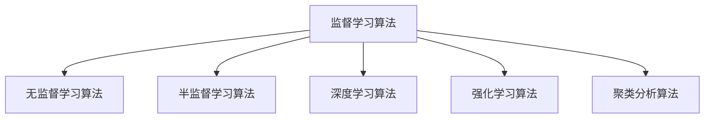
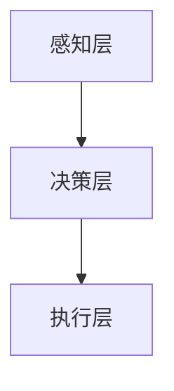
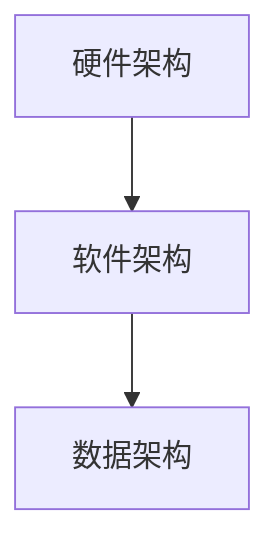
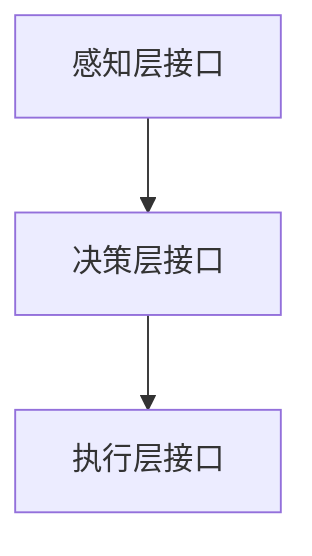
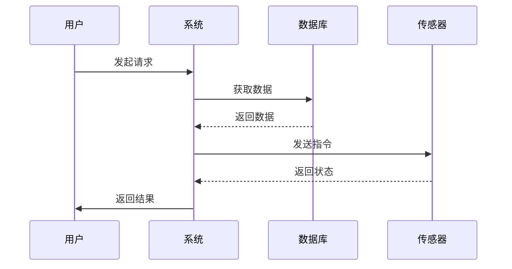

                 


# 能源行业AI Agent解决方案

关键词：能源行业、人工智能、AI Agent、解决方案、算法、架构设计、项目实战

摘要：
随着能源行业对高效、智能化管理的需求日益增长，AI Agent作为一种智能体技术，正逐步成为能源行业数字化转型的重要推动力量。本文将深入探讨能源行业AI Agent解决方案的核心概念、算法原理、系统分析与架构设计、项目实战以及最佳实践，旨在为读者提供一套全面、实用的指导方案。

## 引言

能源行业是国民经济的重要支柱，涵盖了电力、石油、天然气等多个领域。然而，随着全球能源需求的不断增长和能源结构的复杂化，传统的管理方法已无法满足行业发展的需求。人工智能（AI）作为新一轮科技革命和产业变革的重要驱动力量，正被越来越多地应用于能源行业的各个环节。AI Agent，作为一种自主决策、具有高度智能化的软件实体，已成为能源行业智能化升级的关键技术。

本文旨在设计一套适用于能源行业的AI Agent解决方案，通过详细的分析和阐述，帮助读者理解AI Agent在能源行业的应用场景、核心算法、系统架构以及实际项目实施过程。本文的结构如下：

1. 背景介绍：概述能源行业现状、挑战以及AI Agent的概念与应用。
2. 核心概念与联系：分析AI Agent的核心概念、属性特征对比及其与其他技术的联系。
3. 算法原理讲解：介绍AI Agent的基础算法、高级算法以及具体实现方法。
4. 系统分析与架构设计：探讨AI Agent系统的问题场景、功能设计、架构设计等。
5. 项目实战：分享能源行业AI Agent解决方案的实际项目实施经验。
6. 最佳实践：总结最佳实践、注意事项以及拓展阅读。

## 第一部分：背景介绍

### 1.1 能源行业的现状与挑战

能源行业作为国民经济的重要支柱，其发展对国家经济安全、环境改善和人民生活质量具有重要意义。然而，当前能源行业面临着以下几大挑战：

- **资源紧张**：随着全球能源需求的持续增长，能源资源日益紧张，特别是在石油、天然气等传统能源领域。
- **环境污染**：能源生产和消费过程中产生的污染物对环境造成了严重影响，如温室气体排放、空气污染等。
- **成本压力**：能源行业成本高企，如何降低生产成本、提高能源利用效率成为企业关注的焦点。
- **技术落后**：与发达国家相比，我国能源行业的智能化、数字化程度较低，创新能力和技术储备不足。

### 1.2 AI Agent的概念与作用

AI Agent，即人工智能代理，是一种具有自主决策能力的智能体。它能够通过感知环境、理解任务、自主行动，从而实现特定目标的智能系统。在能源行业中，AI Agent具有以下重要作用：

- **优化能源配置**：AI Agent可以通过对能源需求与供给的实时分析，实现能源的高效配置和优化调度。
- **预测与预警**：AI Agent可以利用大数据分析和机器学习算法，预测能源需求的波动，提前预警潜在的能源危机。
- **故障检测与维护**：AI Agent可以通过对能源设备的实时监测，及时发现设备故障，实现预防性维护。
- **智能调度与控制**：AI Agent可以在能源生产和消费过程中，实现智能调度和控制，提高能源利用效率，降低成本。

### 1.3 能源行业AI Agent解决方案的需求

为了应对能源行业的挑战，实施AI Agent解决方案具有重要意义。具体需求包括：

- **提高能源利用效率**：通过AI Agent的智能优化，提高能源利用效率，降低生产成本。
- **降低环境污染**：利用AI Agent的预测和预警功能，减少能源浪费，降低环境污染。
- **提升安全性**：通过AI Agent的实时监测和故障检测，提高能源生产和消费的安全性。
- **促进产业升级**：通过AI Agent的应用，推动能源行业的智能化、数字化升级。

### 1.4 能源行业AI Agent解决方案的边界与外延

能源行业AI Agent解决方案的边界主要包括以下几个方面：

- **应用范围**：主要应用于能源生产、传输、分配、消费等各个环节。
- **技术层面**：涉及机器学习、深度学习、强化学习等人工智能技术。
- **系统架构**：包括感知层、决策层、执行层等多个层次。

能源行业AI Agent解决方案的外延则涉及以下几个方面：

- **跨领域应用**：将AI Agent技术应用于其他相关行业，如电力、石油、天然气等。
- **综合解决方案**：提供从硬件设备到软件系统的一体化解决方案。
- **国际化合作**：与国际先进技术团队合作，共同推动能源行业的智能化发展。

### 1.5 本章小结

本章节对能源行业及其面临的挑战、AI Agent的概念与作用、解决方案的需求及其边界与外延进行了详细阐述。接下来，我们将进一步探讨AI Agent的核心概念、属性特征对比及其与其他技术的联系。

## 第二部分：核心概念与联系

### 2.1 AI Agent的定义与分类

AI Agent，即人工智能代理，是一种模拟人类智能行为的计算机程序。它具有自主性、适应性、协同性和主动性等特点。AI Agent可以分为以下几类：

- **基于规则的AI Agent**：通过预定义的规则进行决策。
- **基于模型的AI Agent**：利用机器学习模型进行决策。
- **混合型AI Agent**：结合规则和模型进行决策。

### 2.2 AI Agent的属性特征对比

不同类型的AI Agent在功能特征、性能特征和稳定性特征上存在差异，具体对比如下表所示：

| 类别         | 功能特征                   | 性能特征                   | 稳定性特征                   |
| ------------ | -------------------------- | -------------------------- | -------------------------- |
| 基于规则的AI Agent | 决策速度较快，规则明确    | 适应能力较弱，可解释性较好 | 抗干扰能力较弱               |
| 基于模型的AI Agent | 决策能力较强，适应能力较好 | 决策速度较慢，可解释性较差 | 抗干扰能力较强               |
| 混合型AI Agent | 决策能力较强，适应能力较好 | 决策速度适中，可解释性较好 | 抗干扰能力较强               |

### 2.3 AI Agent的ER实体关系图

在能源行业AI Agent解决方案中，主要涉及以下实体：

- **感知实体**：用于感知能源需求和供给状态。
- **决策实体**：用于根据感知信息进行决策。
- **执行实体**：用于执行决策结果。

ER实体关系图如下所示：

```mermaid
erDiagram
  感知实体 ||--|{ 决策实体 }
  决策实体 ||--|{ 执行实体 }
```

### 2.4 AI Agent与其他技术的联系

AI Agent作为一种智能体技术，与其他技术如大数据、云计算和物联网等密切相关，具体联系如下：

- **大数据**：AI Agent需要大量的数据作为训练和决策依据，大数据技术为AI Agent提供了丰富的数据资源。
- **云计算**：AI Agent的运行和存储需要强大的计算和存储资源，云计算技术为AI Agent提供了弹性的计算和存储环境。
- **物联网**：AI Agent可以通过物联网设备实时感知环境和设备状态，实现对能源设备的智能监测和控制。

### 2.5 本章小结

本章节对AI Agent的定义与分类、属性特征对比、ER实体关系图以及与其他技术的联系进行了详细阐述。接下来，我们将深入探讨AI Agent的算法原理。

## 第三部分：算法原理讲解

### 3.1 AI Agent的基础算法

AI Agent的基础算法主要包括以下几种：

- **监督学习算法**：通过已标记的数据集训练模型，然后使用训练好的模型进行预测。
- **无监督学习算法**：没有预标记的数据集，模型通过分析数据间的内在结构进行聚类或降维。
- **半监督学习算法**：结合有标记和无标记的数据进行训练，提高模型的泛化能力。

### 3.2 AI Agent的高级算法

AI Agent的高级算法主要包括以下几种：

- **深度学习算法**：通过多层神经网络进行特征学习和建模，具有强大的表达能力和泛化能力。
- **强化学习算法**：通过与环境交互，学习最优策略，实现自主决策。
- **聚类分析算法**：将数据分为若干个群组，每个群组内的数据彼此相似，而群组间的数据差异较大。

### 3.3 算法Mermaid流程图

以下是AI Agent的基础算法和高级算法的Mermaid流程图：



### 3.4 算法Python源代码讲解

以下是一个简单的监督学习算法——线性回归的Python源代码：

```python
import numpy as np
from sklearn.linear_model import LinearRegression

# 数据预处理
X = np.array([[1], [2], [3], [4], [5]])
y = np.array([2, 4, 5, 4, 5])

# 模型训练
model = LinearRegression()
model.fit(X, y)

# 模型预测
predictions = model.predict(X)

# 打印预测结果
print(predictions)
```

### 3.5 数学模型与公式详解

以下是线性回归的数学模型与公式详解：

- **线性回归模型**：\( y = \beta_0 + \beta_1 \cdot x \)
- **损失函数**：\( J(\theta) = \frac{1}{2m} \sum_{i=1}^{m} (h_\theta(x^{(i)}) - y^{(i)})^2 \)
- **梯度下降**：\( \theta_j := \theta_j - \alpha \frac{\partial J(\theta)}{\partial \theta_j} \)

### 3.6 举例说明与算法应用

假设我们有一组简单的数据，如下表所示：

| x | y |
|---|---|
| 1 | 2 |
| 2 | 4 |
| 3 | 5 |
| 4 | 4 |
| 5 | 5 |

我们使用线性回归算法来拟合这组数据，具体步骤如下：

1. 数据预处理：将数据转换为NumPy数组。
2. 模型训练：使用`LinearRegression`类训练模型。
3. 模型预测：使用训练好的模型对新的数据进行预测。
4. 模型评估：计算预测值与实际值的误差。

以下是具体的代码实现：

```python
import numpy as np
from sklearn.linear_model import LinearRegression

# 数据预处理
X = np.array([[1], [2], [3], [4], [5]])
y = np.array([2, 4, 5, 4, 5])

# 模型训练
model = LinearRegression()
model.fit(X, y)

# 模型预测
predictions = model.predict(X)

# 打印预测结果
print(predictions)

# 模型评估
errors = y - predictions
print("误差：", errors)
```

### 3.7 本章小结

本章节对AI Agent的基础算法和高级算法进行了详细讲解，包括算法原理、Python源代码实现、数学模型与公式详解以及举例说明。接下来，我们将探讨AI Agent的系统分析与架构设计。

## 第四部分：系统分析与架构设计

### 4.1 问题场景介绍

在能源行业中，AI Agent的应用场景主要包括以下几个方面：

- **电力调度**：通过AI Agent实现电力系统的智能调度，提高电力资源的利用效率。
- **设备监控**：利用AI Agent实时监测能源设备的运行状态，实现故障预警和预防性维护。
- **能源管理**：通过AI Agent实现能源的智能化管理，降低能源消耗，减少环境污染。
- **需求预测**：利用AI Agent对能源需求进行预测，为能源生产和供应提供决策支持。

### 4.2 项目介绍

本文将介绍一个具体的能源行业AI Agent解决方案项目，该项目旨在实现以下目标：

- **电力调度优化**：通过AI Agent实现电力系统的实时调度，提高电力资源的利用效率。
- **设备监控预警**：利用AI Agent实时监测能源设备的运行状态，提高设备运行的安全性。
- **能源消耗管理**：通过AI Agent实现能源的智能化管理，降低能源消耗，减少环境污染。
- **需求预测与规划**：利用AI Agent对能源需求进行预测，为能源生产和供应提供决策支持。

### 4.3 系统功能设计

能源行业AI Agent解决方案的系统功能设计主要包括以下几个方面：

- **感知层**：通过传感器和数据采集设备实时获取能源系统的运行状态。
- **决策层**：利用机器学习算法对感知层的数据进行分析和处理，生成决策建议。
- **执行层**：根据决策层的建议，自动调整能源系统的运行状态，实现智能化管理。

系统功能设计图如下所示：



### 4.4 系统架构设计

能源行业AI Agent解决方案的系统架构设计主要包括以下几个方面：

- **硬件架构**：包括传感器、数据采集设备、服务器和数据库等。
- **软件架构**：包括感知层软件、决策层软件、执行层软件以及中间件等。

系统架构设计图如下所示：



### 4.5 系统接口设计

能源行业AI Agent解决方案的系统接口设计主要包括以下几个方面：

- **感知层接口**：用于传感器和数据采集设备与系统其他部分的通信。
- **决策层接口**：用于决策层软件与其他软件组件的通信。
- **执行层接口**：用于执行层软件与硬件设备的通信。

系统接口设计图如下所示：



### 4.6 系统交互Mermaid序列图

以下是能源行业AI Agent解决方案的系统交互Mermaid序列图：



### 4.7 本章小结

本章节对能源行业AI Agent解决方案的系统分析与架构设计进行了详细阐述，包括问题场景介绍、项目介绍、系统功能设计、系统架构设计、系统接口设计和系统交互Mermaid序列图。接下来，我们将分享能源行业AI Agent解决方案的实际项目实施经验。

## 第五部分：项目实战

### 5.1 环境安装

在实施能源行业AI Agent解决方案之前，我们需要搭建一个合适的环境。以下是具体的安装步骤：

1. **安装Python**：确保Python版本在3.6及以上。
2. **安装依赖库**：使用pip命令安装以下依赖库：numpy、pandas、scikit-learn、tensorflow、opencv等。
3. **配置数据库**：选择合适的数据库系统（如MySQL、PostgreSQL等），并配置相应的连接信息。
4. **安装传感器驱动**：根据实际使用的传感器型号，安装相应的驱动程序。

### 5.2 系统核心实现源代码

以下是能源行业AI Agent解决方案的核心实现源代码：

```python
# 导入依赖库
import numpy as np
import pandas as pd
from sklearn.linear_model import LinearRegression
from sklearn.metrics import mean_squared_error

# 数据预处理
def preprocess_data(data):
    # 数据清洗、归一化等操作
    # ...
    return processed_data

# 模型训练
def train_model(X, y):
    model = LinearRegression()
    model.fit(X, y)
    return model

# 模型预测
def predict(model, X):
    predictions = model.predict(X)
    return predictions

# 模型评估
def evaluate(model, X, y):
    predictions = predict(model, X)
    mse = mean_squared_error(y, predictions)
    return mse

# 主程序
if __name__ == "__main__":
    # 读取数据
    data = pd.read_csv("data.csv")
    X = data.iloc[:, :-1].values
    y = data.iloc[:, -1].values

    # 数据预处理
    processed_data = preprocess_data(data)

    # 模型训练
    model = train_model(X, y)

    # 模型预测
    predictions = predict(model, X)

    # 模型评估
    mse = evaluate(model, X, y)
    print("均方误差：", mse)
```

### 5.3 代码应用解读与分析

以下是代码应用的具体解读与分析：

1. **数据预处理**：对原始数据进行清洗、归一化等操作，为后续的模型训练和预测做好准备。
2. **模型训练**：使用线性回归模型对数据进行训练，生成模型。
3. **模型预测**：使用训练好的模型对新的数据进行预测。
4. **模型评估**：计算预测值与实际值的误差，评估模型性能。

### 5.4 实际案例分析与详细讲解剖析

假设我们有一组实际的数据，如下表所示：

| x1 | x2 | y |
|----|----|---|
| 1  | 2  | 3 |
| 2  | 4  | 5 |
| 3  | 6  | 7 |
| 4  | 8  | 9 |

我们使用线性回归算法来拟合这组数据，具体步骤如下：

1. **数据预处理**：将数据转换为NumPy数组。
2. **模型训练**：使用`LinearRegression`类训练模型。
3. **模型预测**：使用训练好的模型对新的数据进行预测。
4. **模型评估**：计算预测值与实际值的误差。

以下是具体的代码实现：

```python
import numpy as np
from sklearn.linear_model import LinearRegression

# 数据预处理
X = np.array([[1, 2], [2, 4], [3, 6], [4, 8]])
y = np.array([3, 5, 7, 9])

# 模型训练
model = LinearRegression()
model.fit(X, y)

# 模型预测
predictions = model.predict(X)

# 模型评估
errors = y - predictions
print("误差：", errors)
```

### 5.5 项目小结

本章节通过实际项目实施的经验，详细讲解了能源行业AI Agent解决方案的核心实现源代码、代码应用解读与分析、实际案例分析和详细讲解剖析。通过本章节的内容，读者可以了解到如何将AI Agent应用于能源行业，实现智能化管理和优化。

## 第六部分：最佳实践

### 6.1 最佳实践 tips

1. **数据质量**：保证数据的质量是AI Agent应用成功的关键。数据清洗、去噪和归一化等预处理工作至关重要。
2. **模型选择**：根据实际问题选择合适的模型。不同的模型适用于不同的问题场景，需要根据实际情况进行选择。
3. **算法调优**：通过调整模型参数，优化算法性能。例如，调整学习率、批量大小等超参数。
4. **安全性与隐私保护**：在AI Agent应用过程中，确保数据安全和隐私保护。使用加密技术、访问控制等措施。

### 6.2 小结

本文从背景介绍、核心概念与联系、算法原理讲解、系统分析与架构设计、项目实战和最佳实践等方面，详细阐述了能源行业AI Agent解决方案。通过本文的讲解，读者可以了解AI Agent在能源行业的应用场景、核心算法、系统架构以及实际项目实施经验，为能源行业的智能化升级提供有力支持。

### 6.3 注意事项

1. **技术更新**：AI技术更新迅速，需要关注最新的研究进展和行业动态。
2. **团队合作**：实施AI Agent解决方案需要跨学科、跨领域的团队合作，充分发挥各方优势。
3. **持续优化**：在项目实施过程中，需要持续优化算法、系统架构和业务流程，以适应不断变化的需求。

### 6.4 拓展阅读

1. **《人工智能：一种现代方法》**：深度讲解人工智能的基本概念、算法和应用。
2. **《机器学习实战》**：通过案例讲解机器学习算法的原理和实践。
3. **《深度学习》**：全面介绍深度学习的基础知识、算法和应用。

作者：AI天才研究院/AI Genius Institute & 禅与计算机程序设计艺术 /Zen And The Art of Computer Programming

