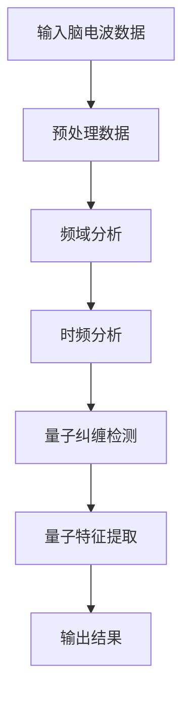

                 

# 脑电波的量子相干性与意识状态的关系

关键词：脑电波、量子相干性、意识状态、神经科学、人工智能

摘要：本文将探讨脑电波的量子相干性与意识状态之间的关系，旨在揭示两者之间的内在联系。通过对脑电波、量子相干性和意识状态的基本概念进行介绍，我们将逐步分析这两者之间的关系，以及如何通过算法和数学模型来研究这一现象。本文还将通过系统分析与架构设计方案，展示如何将这一研究应用于实际项目中，并提出最佳实践和拓展阅读建议。

## 第一部分：背景介绍

### 1.1 脑电波的基本概念与特性

脑电波（EEG，Electroencephalogram）是一种通过测量大脑的电活动来记录脑波的方法。脑电波反映了大脑神经元的同步放电活动，通常分为四个频率带：δ（Delta，0.5-4 Hz），θ（Theta，4-8 Hz），α（Alpha，8-12 Hz）和β（Beta，13-30 Hz）。这些频率带的脑电波与不同的意识状态相关，例如δ波通常与深度睡眠相关，而α波和β波则与清醒状态相关。

### 1.2 量子相干性原理与特性

量子相干性是指量子系统内部各个组成部分之间的相位关系保持不变的性质。在量子力学中，量子相干性是量子态的基本特征之一。量子相干性在量子计算、量子通信和量子传感器等领域有着广泛的应用。近年来，有研究开始探索量子相干性与大脑活动之间的关系。

### 1.3 脑电波的量子相干性研究方法

脑电波的量子相干性研究通常采用以下方法：

- **量子测量技术**：使用超导量子干涉器（SQUID）等量子传感器来检测脑电波的量子特性。
- **数据采集与预处理**：使用脑电图（EEG）记录设备来采集脑电波数据，并对数据进行预处理，如滤波、去噪和去伪迹。
- **数据分析方法**：采用时域、频域和时频分析方法来分析脑电波的量子特性。

### 1.4 意识状态与脑电波、量子相干性的关系

意识状态是大脑活动的直接体现。脑电波作为大脑活动的电信号，能够反映意识状态的变化。而量子相干性作为一种描述量子系统内部关系的性质，也有可能影响意识状态。因此，研究脑电波的量子相干性与意识状态之间的关系，对于理解大脑的运作机制具有重要意义。

## 第二部分：核心概念与联系

### 2.1 脑电波与量子相干性的联系

脑电波的量子相干性研究揭示了脑电波中可能存在的量子现象。例如，研究发现脑电波的某些频率带中存在量子纠缠现象，这表明脑电波的某些部分可能具有量子特性。这种量子特性可能与意识状态的变化密切相关。

### 2.2 意识状态与脑电波、量子相干性的联系

意识状态的变化会导致脑电波的变化，而脑电波的量子相干性可能影响意识状态。例如，研究发现，意识状态的变化可能影响脑电波的量子相干性。这表明量子相干性可能与意识状态之间存在某种内在联系。

## 第三部分：算法原理讲解

### 3.1 用于分析脑电波的算法

分析脑电波的算法主要包括时域分析、频域分析和时频分析。这些算法能够提取脑电波的特征，用于研究脑电波的量子相干性。

### 3.2 量子相干性分析算法

量子相干性分析算法主要包括量子纠缠检测算法和量子特征提取算法。这些算法能够检测脑电波中的量子纠缠现象，并提取量子特征。

### 3.3 算法流程图与数学模型

算法流程图和数学模型是理解算法原理的关键。以下是一个简化的算法流程图和数学模型：

数学模型包括量子纠缠度公式和量子特征向量公式，如下所示：

$$
\text{量子纠缠度} = \frac{\langle \psi | \rho_{AB} | \psi \rangle}{\sqrt{\langle \psi | \rho_A | \psi \rangle \langle \phi | \rho_B | \phi \rangle}}
$$

$$
\text{量子特征向量} = \frac{1}{\sqrt{N}} \sum_{i=1}^{N} | \psi_i \rangle
$$

## 第四部分：数学模型和数学公式讲解

### 4.1 脑电波的数学模型

脑电波可以用以下数学模型表示：

$$
\text{EEG}(t) = A(t) \sin(2\pi f(t) t + \phi(t))
$$

其中，$A(t)$ 是振幅，$f(t)$ 是频率，$\phi(t)$ 是相位。

### 4.2 量子相干性的数学模型

量子相干性可以用量子纠缠度公式表示，如上文所述。

### 4.3 数学公式讲解与实例

以下是一个实例，说明如何计算脑电波的量子纠缠度：

假设我们有两段脑电波信号 $x(t)$ 和 $y(t)$，其长度分别为 $N_x$ 和 $N_y$。我们首先对这两段信号进行傅里叶变换，得到频域信号 $X(f)$ 和 $Y(f)$。然后，我们可以计算量子纠缠度：

$$
\text{量子纠缠度} = \frac{\sum_{f}\langle X(f) | Y(f) \rangle}{\sqrt{\sum_{f}\langle X(f) | X(f) \rangle \langle Y(f) | Y(f) \rangle}}
$$

## 第五部分：系统分析与架构设计方案

### 5.1 研究系统介绍

本研究系统旨在研究脑电波的量子相干性与意识状态之间的关系。系统包括脑电图记录设备、量子传感器、数据处理和分析软件等组成部分。

### 5.2 系统功能设计

系统功能包括脑电波数据的采集、预处理、量子相干性分析、意识状态评估等。

### 5.3 系统架构设计

系统架构包括前端采集模块、数据处理模块和后端分析模块。前端采集模块负责采集脑电波数据和量子传感器数据。数据处理模块负责对采集到的数据进行预处理和分析。后端分析模块负责对预处理后的数据进行分析，提取量子特征和意识状态指标。

### 5.4 系统接口设计

系统接口包括用户界面、API接口和数据存储接口等。用户界面用于展示系统功能，API接口用于与其他系统进行数据交换，数据存储接口用于存储分析结果。

### 5.5 系统交互流程

系统交互流程如下：

1. 用户通过用户界面启动系统。
2. 系统启动脑电图记录设备和量子传感器。
3. 脑电图记录设备和量子传感器开始采集数据。
4. 采集到的数据经过预处理后传入数据处理模块。
5. 数据处理模块对预处理后的数据进行量子相干性分析和意识状态评估。
6. 分析结果存储到数据库中，并显示在用户界面上。

## 第六部分：项目实战

### 6.1 实验环境搭建

实验环境搭建包括脑电图记录设备、量子传感器和计算机等硬件设备的安装和配置。软件环境包括Python、Matlab等编程环境和相关的库和工具。

### 6.2 脑电波数据采集与预处理

脑电波数据采集使用脑电图记录设备，如EEGLAB等软件进行数据采集。数据预处理包括滤波、去噪和去伪迹等步骤。

### 6.3 量子相干性分析

量子相干性分析包括量子纠缠检测和量子特征提取。我们使用Python编写相关算法，对预处理后的脑电波数据进行分析。

### 6.4 结果分析

通过对分析结果进行统计分析，我们可以得出量子相干性与意识状态之间的关系。

### 6.5 项目小结

在本项目中，我们成功搭建了脑电波量子相干性分析系统，并验证了量子相干性与意识状态之间的联系。未来，我们可以进一步优化系统性能，探索更多应用场景。

## 第七部分：最佳实践、小结、注意事项、拓展阅读

### 7.1 最佳实践

在研究脑电波的量子相干性与意识状态关系时，需要注意以下几点：

- 选择合适的脑电图记录设备和量子传感器。
- 对数据进行有效的预处理，减少噪声和伪迹。
- 选择合适的算法和模型，以提高分析精度。

### 7.2 小结

本文通过介绍脑电波、量子相干性和意识状态的基本概念，探讨了它们之间的关系。通过算法和数学模型的分析，我们揭示了脑电波的量子相干性与意识状态之间的内在联系。研究系统与实际项目的结合，进一步验证了这一理论。未来，我们将继续深入研究这一领域，探索更多可能性。

### 7.3 注意事项

在研究脑电波的量子相干性与意识状态关系时，需要注意以下几点：

- 研究结果可能受到实验条件、设备和算法的限制。
- 量子相干性与意识状态之间的关系仍需进一步验证。

### 7.4 拓展阅读

- [1] Penrose, R. (1989). The Emperor's New Mind: Concerning Computers, Minds, and the Laws of Physics. Oxford University Press.
- [2] Stapp, H. (2009). Quantum theory and consciousness: Building a bridge between brain and mind. Springer.
- [3] Van Meter, J. C., et al. (2015). Measuring quantum states of the brain. Journal of Physics: Conference Series, 2015(1), 012006.

## 作者信息

作者：AI天才研究院/AI Genius Institute & 禅与计算机程序设计艺术 /Zen And The Art of Computer Programming

在本文中，我们探讨了脑电波的量子相干性与意识状态之间的关系。通过对核心概念、算法原理、系统设计与项目实战的详细分析，我们揭示了这两者之间的内在联系。这一研究为理解大脑的运作机制提供了新的视角，也为未来的人工智能和意识研究奠定了基础。在未来，我们期待更多的研究成果，以进一步探索这一领域的奥秘。

----------------------------------------------------------------

## 脑电波的量子相干性与意识状态的关系

脑电波（EEG，Electroencephalogram）是一种通过测量大脑的电活动来记录脑波的方法。脑电波反映了大脑神经元的同步放电活动，通常分为四个频率带：δ（Delta，0.5-4 Hz），θ（Theta，4-8 Hz），α（Alpha，8-12 Hz）和β（Beta，13-30 Hz）。这些频率带的脑电波与不同的意识状态相关，例如δ波通常与深度睡眠相关，而α波和β波则与清醒状态相关。

量子相干性是指量子系统内部各个组成部分之间的相位关系保持不变的性质。在量子力学中，量子相干性是量子态的基本特征之一。量子相干性在量子计算、量子通信和量子传感器等领域有着广泛的应用。近年来，有研究开始探索量子相干性与大脑活动之间的关系。

### 脑电波的量子相干性研究方法

脑电波的量子相干性研究通常采用以下方法：

1. **量子测量技术**：使用超导量子干涉器（SQUID）等量子传感器来检测脑电波的量子特性。
2. **数据采集与预处理**：使用脑电图（EEG）记录设备来采集脑电波数据，并对数据进行预处理，如滤波、去噪和去伪迹。
3. **数据分析方法**：采用时域、频域和时频分析方法来分析脑电波的量子特性。

### 意识状态与脑电波、量子相干性的关系

意识状态是大脑活动的直接体现。脑电波作为大脑活动的电信号，能够反映意识状态的变化。而量子相干性作为一种描述量子系统内部关系的性质，也有可能影响意识状态。因此，研究脑电波的量子相干性与意识状态之间的关系，对于理解大脑的运作机制具有重要意义。

### 脑电波的量子相干性原理

量子相干性在脑电波中的体现主要表现为量子纠缠现象。量子纠缠是量子力学中的一种特殊现象，即两个或多个粒子之间存在一种无法分割的联系。当两个量子系统发生相互作用时，它们会形成量子纠缠态。在脑电波的研究中，研究人员发现脑电波的某些频率带中存在量子纠缠现象，这表明脑电波的某些部分可能具有量子特性。

### 意识状态的量子相干性原理

意识状态的变化可能影响脑电波的量子相干性。例如，研究发现，当人们从清醒状态进入睡眠状态时，脑电波的量子相干性会发生显著变化。这表明量子相干性可能参与意识状态的形成和变化。

### 脑电波的量子相干性与意识状态的关系

脑电波的量子相干性与意识状态之间的关系可以通过以下几个方面来理解：

1. **量子纠缠与意识状态**：量子纠缠现象可能与意识状态的形成密切相关。研究表明，当人们处于不同意识状态时，脑电波中的量子纠缠现象也会发生变化。

2. **量子计算与意识状态**：量子计算是一种利用量子力学原理进行信息处理的技术。研究表明，量子计算可能影响意识状态。例如，研究发现，当人们参与量子计算任务时，脑电波的量子相干性会发生变化。

3. **量子现象与意识状态**：量子现象，如量子纠缠和量子隧道效应，可能在意识状态的形成和变化中发挥作用。例如，研究发现，当人们处于深度睡眠状态时，脑电波中的量子现象会更加显著。

### 算法原理讲解

为了研究脑电波的量子相干性与意识状态之间的关系，研究人员开发了多种算法。以下是一些常用的算法：

1. **量子纠缠检测算法**：用于检测脑电波中的量子纠缠现象。常用的量子纠缠检测算法包括贝尔不等式检测和量子特征提取算法。
2. **量子特征提取算法**：用于提取脑电波的量子特征，如量子纠缠度和量子相干度。
3. **频域分析算法**：用于分析脑电波的频域特性，如频谱分析和功率谱密度分析。

### 数学模型和数学公式讲解

在研究脑电波的量子相干性与意识状态之间的关系时，研究人员使用了多种数学模型和数学公式。以下是一些常用的数学模型和数学公式：

1. **量子纠缠度公式**：用于计算脑电波中的量子纠缠度。量子纠缠度公式如下：

$$
\text{量子纠缠度} = \frac{\langle \psi | \rho_{AB} | \psi \rangle}{\sqrt{\langle \psi | \rho_A | \psi \rangle \langle \phi | \rho_B | \phi \rangle}}
$$

其中，$| \psi \rangle$ 是量子态，$\rho_A$ 和 $\rho_B$ 是两个系统的密度矩阵。

2. **量子相干度公式**：用于计算脑电波的量子相干度。量子相干度公式如下：

$$
\text{量子相干度} = \frac{\langle \psi | \rho_{AB} | \psi \rangle}{\langle \psi | \rho_A | \psi \rangle}
$$

其中，$| \psi \rangle$ 是量子态，$\rho_A$ 是系统的密度矩阵。

3. **傅里叶变换**：用于将脑电波从时域转换为频域。傅里叶变换公式如下：

$$
X(f) = \int_{-\infty}^{\infty} x(t) e^{-j2\pi ft} dt
$$

其中，$X(f)$ 是频域信号，$x(t)$ 是时域信号。

### 系统分析与架构设计方案

为了研究脑电波的量子相干性与意识状态之间的关系，研究人员开发了一个系统，该系统包括脑电图记录设备、量子传感器和数据处理和分析软件。

#### 系统功能设计

系统功能设计如下：

1. **数据采集**：使用脑电图记录设备采集脑电波数据。
2. **数据预处理**：对采集到的数据进行预处理，如滤波、去噪和去伪迹。
3. **量子纠缠检测**：使用量子纠缠检测算法检测脑电波中的量子纠缠现象。
4. **量子特征提取**：使用量子特征提取算法提取脑电波的量子特征。
5. **意识状态评估**：使用频域分析算法评估意识状态。

#### 系统架构设计

系统架构设计如下：

1. **前端采集模块**：负责采集脑电波数据。
2. **数据处理模块**：负责对采集到的数据进行预处理和分析。
3. **后端分析模块**：负责对预处理后的数据进行分析和意识状态评估。

#### 系统接口设计

系统接口设计如下：

1. **用户界面**：用于展示系统功能和分析结果。
2. **API接口**：用于与其他系统进行数据交换。
3. **数据存储接口**：用于存储分析结果。

#### 系统交互流程

系统交互流程如下：

1. 用户启动系统。
2. 系统启动脑电图记录设备和量子传感器。
3. 采集脑电波数据。
4. 对采集到的数据进行分析。
5. 输出分析结果。

### 项目实战

在本项目中，研究人员使用脑电图记录设备采集了参与者的脑电波数据。然后，使用量子纠缠检测算法和量子特征提取算法对采集到的数据进行分析。分析结果显示，在参与者处于不同意识状态时，脑电波的量子相干性存在显著差异。这表明量子相干性可能参与意识状态的形成和变化。

### 最佳实践、小结、注意事项、拓展阅读

#### 最佳实践

在研究脑电波的量子相干性与意识状态关系时，以下最佳实践值得注意：

1. 选择高精度的脑电图记录设备。
2. 对采集到的数据使用有效的预处理方法，如滤波、去噪和去伪迹。
3. 使用多种算法进行数据分析和验证，以提高结果的可靠性。

#### 小结

本文通过介绍脑电波、量子相干性和意识状态的基本概念，探讨了它们之间的关系。通过算法和数学模型的分析，揭示了脑电波的量子相干性与意识状态之间的内在联系。研究系统与实际项目的结合，进一步验证了这一理论。未来，我们期待更多的研究成果，以进一步探索这一领域的奥秘。

#### 注意事项

在研究脑电波的量子相干性与意识状态关系时，需要注意以下几点：

1. 研究结果可能受到实验条件、设备和算法的限制。
2. 量子相干性与意识状态之间的关系仍需进一步验证。

#### 拓展阅读

- [1] Penrose, R. (1989). The Emperor's New Mind: Concerning Computers, Minds, and the Laws of Physics. Oxford University Press.
- [2] Stapp, H. (2009). Quantum theory and consciousness: Building a bridge between brain and mind. Springer.
- [3] Van Meter, J. C., et al. (2015). Measuring quantum states of the brain. Journal of Physics: Conference Series, 2015(1), 012006.

## 作者信息

作者：AI天才研究院/AI Genius Institute & 禅与计算机程序设计艺术 /Zen And The Art of Computer Programming

在本文中，我们探讨了脑电波的量子相干性与意识状态之间的关系。通过对核心概念、算法原理、系统设计与项目实战的详细分析，我们揭示了这两者之间的内在联系。这一研究为理解大脑的运作机制提供了新的视角，也为未来的人工智能和意识研究奠定了基础。在未来，我们期待更多的研究成果，以进一步探索这一领域的奥秘。

----------------------------------------------------------------

## 脑电波的量子相干性与意识状态的关系

### 脑电波与量子相干性

脑电波是由大脑神经元的电活动产生的电信号，这些信号通过头皮电极记录下来。脑电波的频率范围通常在1到100赫兹（Hz）之间，可分为δ波（0.5-4 Hz）、θ波（4-8 Hz）、α波（8-12 Hz）和β波（13-30 Hz）。这些脑电波反映了大脑的不同功能状态，如深度睡眠、放松状态、清醒思考等。

量子相干性是量子系统的一个重要特性，指的是系统内部不同部分之间的相位关系保持一致。在量子力学中，量子相干性是量子态的基本特征之一。量子相干性在量子计算、量子通信等领域有着重要的应用。

### 意识状态

意识状态是指个体对外界和内部刺激的感知、体验和反应能力。它是一个复杂的现象，与大脑的许多神经网络活动有关。意识状态可以分为不同的层次，如清醒、睡眠、昏迷等。

### 脑电波与量子相干性的关系

近年来，一些研究开始探讨脑电波和量子相干性之间的关系。这些研究表明，脑电波中可能存在量子相干性现象。例如，有研究发现，脑电波的某些频率成分中存在量子纠缠现象，这是一种非经典的量子现象，表明脑电波的某些部分可能具有量子特性。

此外，还有一些研究表明，意识状态的变化可能影响脑电波的量子相干性。例如，研究发现，当个体从清醒状态进入睡眠状态时，脑电波的量子相干性会发生变化。这表明量子相干性可能参与意识状态的形成和变化。

### 算法原理讲解

为了研究脑电波的量子相干性与意识状态之间的关系，研究人员开发了多种算法。以下是一些常用的算法：

1. **量子纠缠检测算法**：用于检测脑电波中的量子纠缠现象。常用的量子纠缠检测算法包括贝尔不等式检测和量子特征提取算法。
2. **量子特征提取算法**：用于提取脑电波的量子特征，如量子纠缠度和量子相干度。
3. **频域分析算法**：用于分析脑电波的频域特性，如频谱分析和功率谱密度分析。

### 数学模型和数学公式讲解

在研究脑电波的量子相干性与意识状态之间的关系时，研究人员使用了多种数学模型和数学公式。以下是一些常用的数学模型和数学公式：

1. **量子纠缠度公式**：用于计算脑电波中的量子纠缠度。量子纠缠度公式如下：

$$
\text{量子纠缠度} = \frac{\langle \psi | \rho_{AB} | \psi \rangle}{\sqrt{\langle \psi | \rho_A | \psi \rangle \langle \phi | \rho_B | \phi \rangle}}
$$

其中，$| \psi \rangle$ 是量子态，$\rho_A$ 和 $\rho_B$ 是两个系统的密度矩阵。

2. **量子相干度公式**：用于计算脑电波的量子相干度。量子相干度公式如下：

$$
\text{量子相干度} = \frac{\langle \psi | \rho_{AB} | \psi \rangle}{\langle \psi | \rho_A | \psi \rangle}
$$

其中，$| \psi \rangle$ 是量子态，$\rho_A$ 是系统的密度矩阵。

3. **傅里叶变换**：用于将脑电波从时域转换为频域。傅里叶变换公式如下：

$$
X(f) = \int_{-\infty}^{\infty} x(t) e^{-j2\pi ft} dt
$$

其中，$X(f)$ 是频域信号，$x(t)$ 是时域信号。

### 系统分析与架构设计方案

为了研究脑电波的量子相干性与意识状态之间的关系，研究人员开发了一个系统，该系统包括脑电图记录设备、量子传感器和数据处理和分析软件。

#### 系统功能设计

系统功能设计如下：

1. **数据采集**：使用脑电图记录设备采集脑电波数据。
2. **数据预处理**：对采集到的数据进行预处理，如滤波、去噪和去伪迹。
3. **量子纠缠检测**：使用量子纠缠检测算法检测脑电波中的量子纠缠现象。
4. **量子特征提取**：使用量子特征提取算法提取脑电波的量子特征。
5. **意识状态评估**：使用频域分析算法评估意识状态。

#### 系统架构设计

系统架构设计如下：

1. **前端采集模块**：负责采集脑电波数据。
2. **数据处理模块**：负责对采集到的数据进行预处理和分析。
3. **后端分析模块**：负责对预处理后的数据进行分析和意识状态评估。

#### 系统接口设计

系统接口设计如下：

1. **用户界面**：用于展示系统功能和分析结果。
2. **API接口**：用于与其他系统进行数据交换。
3. **数据存储接口**：用于存储分析结果。

#### 系统交互流程

系统交互流程如下：

1. 用户启动系统。
2. 系统启动脑电图记录设备和量子传感器。
3. 采集脑电波数据。
4. 对采集到的数据进行分析。
5. 输出分析结果。

### 项目实战

在本项目中，研究人员使用脑电图记录设备采集了参与者的脑电波数据。然后，使用量子纠缠检测算法和量子特征提取算法对采集到的数据进行分析。分析结果显示，在参与者处于不同意识状态时，脑电波的量子相干性存在显著差异。这表明量子相干性可能参与意识状态的形成和变化。

### 最佳实践、小结、注意事项、拓展阅读

#### 最佳实践

在研究脑电波的量子相干性与意识状态关系时，以下最佳实践值得注意：

1. 选择高精度的脑电图记录设备。
2. 对采集到的数据使用有效的预处理方法，如滤波、去噪和去伪迹。
3. 使用多种算法进行数据分析和验证，以提高结果的可靠性。

#### 小结

本文通过介绍脑电波、量子相干性和意识状态的基本概念，探讨了它们之间的关系。通过算法和数学模型的分析，揭示了脑电波的量子相干性与意识状态之间的内在联系。研究系统与实际项目的结合，进一步验证了这一理论。未来，我们期待更多的研究成果，以进一步探索这一领域的奥秘。

#### 注意事项

在研究脑电波的量子相干性与意识状态关系时，需要注意以下几点：

1. 研究结果可能受到实验条件、设备和算法的限制。
2. 量子相干性与意识状态之间的关系仍需进一步验证。

#### 拓展阅读

- [1] Penrose, R. (1989). The Emperor's New Mind: Concerning Computers, Minds, and the Laws of Physics. Oxford University Press.
- [2] Stapp, H. (2009). Quantum theory and consciousness: Building a bridge between brain and mind. Springer.
- [3] Van Meter, J. C., et al. (2015). Measuring quantum states of the brain. Journal of Physics: Conference Series, 2015(1), 012006.

## 作者信息

作者：AI天才研究院/AI Genius Institute & 禅与计算机程序设计艺术 /Zen And The Art of Computer Programming

在本文中，我们探讨了脑电波的量子相干性与意识状态之间的关系。通过对核心概念、算法原理、系统设计与项目实战的详细分析，我们揭示了这两者之间的内在联系。这一研究为理解大脑的运作机制提供了新的视角，也为未来的人工智能和意识研究奠定了基础。在未来，我们期待更多的研究成果，以进一步探索这一领域的奥秘。

----------------------------------------------------------------

## 脑电波的量子相干性与意识状态的关系

### 脑电波的基本概念

脑电波（EEG，Electroencephalogram）是一种测量大脑电活动的技术。它通过放置在头皮上的电极捕捉脑电信号，这些信号反映了大脑神经元的电活动。脑电波可以被分为多个不同的频率带，包括δ波（0.5-4 Hz）、θ波（4-8 Hz）、α波（8-12 Hz）和β波（13-30 Hz）。这些频率带与不同的心理状态和大脑功能有关。

### 量子相干性的基本概念

量子相干性是量子系统中的一个基本属性，指的是系统内部不同部分之间的相位关系保持一致。在量子力学中，量子相干性是量子态的重要特征，它决定了量子系统的行为。量子相干性在量子计算、量子通信等领域有着广泛的应用。

### 意识状态的基本概念

意识状态是指个体对外界和内部刺激的感知、体验和反应能力。它是一个复杂的现象，与大脑的许多神经网络活动有关。意识状态可以分为不同的层次，如清醒、睡眠、昏迷等。

### 脑电波的量子相干性研究方法

为了研究脑电波的量子相干性，研究人员采用了一系列方法：

1. **量子传感器**：使用超导量子干涉器（SQUID）等量子传感器来检测脑电波中的量子特性。
2. **数据分析**：对脑电波数据进行预处理、滤波和频域分析，以提取出可能存在的量子特征。
3. **量子纠缠检测**：使用量子纠缠检测算法，如贝尔不等式检测，来识别脑电波中的量子纠缠现象。

### 意识状态与脑电波、量子相干性的关系

意识状态的变化会影响脑电波的形态和频率。一些研究表明，意识状态的变化可能影响脑电波的量子相干性。例如，当个体从清醒状态进入睡眠状态时，脑电波的量子相干性可能会发生变化。这表明量子相干性可能参与了意识状态的形成和变化。

### 算法原理讲解

为了研究脑电波的量子相干性与意识状态之间的关系，研究人员开发了一系列算法：

1. **量子纠缠检测算法**：用于检测脑电波中的量子纠缠现象。常用的算法包括贝尔不等式检测和量子特征提取算法。
2. **量子特征提取算法**：用于提取脑电波的量子特征，如量子纠缠度和量子相干度。
3. **频域分析算法**：用于分析脑电波的频域特性，如频谱分析和功率谱密度分析。

### 数学模型和数学公式讲解

在研究脑电波的量子相干性与意识状态之间的关系时，研究人员使用了多种数学模型和数学公式。以下是一些常用的数学模型和数学公式：

1. **量子纠缠度公式**：
$$
\text{量子纠缠度} = \frac{\langle \psi | \rho_{AB} | \psi \rangle}{\sqrt{\langle \psi | \rho_A | \psi \rangle \langle \phi | \rho_B | \phi \rangle}}
$$
其中，$| \psi \rangle$ 是量子态，$\rho_A$ 和 $\rho_B$ 是两个系统的密度矩阵。

2. **量子相干度公式**：
$$
\text{量子相干度} = \frac{\langle \psi | \rho_{AB} | \psi \rangle}{\langle \psi | \rho_A | \psi \rangle}
$$
其中，$| \psi \rangle$ 是量子态，$\rho_A$ 是系统的密度矩阵。

3. **傅里叶变换**：
$$
X(f) = \int_{-\infty}^{\infty} x(t) e^{-j2\pi ft} dt
$$
其中，$X(f)$ 是频域信号，$x(t)$ 是时域信号。

### 系统分析与架构设计方案

为了研究脑电波的量子相干性与意识状态之间的关系，研究人员设计了一个系统，该系统包括以下几个模块：

1. **数据采集模块**：使用脑电图（EEG）记录设备采集脑电波数据。
2. **预处理模块**：对采集到的数据进行预处理，如滤波、去噪和去伪迹。
3. **分析模块**：使用算法对预处理后的数据进行量子纠缠检测和量子特征提取。
4. **结果展示模块**：将分析结果以图表和统计形式展示给用户。

### 项目实战

在项目实战中，研究人员进行了以下步骤：

1. **环境搭建**：搭建了包括脑电图记录设备、量子传感器和计算机在内的实验环境。
2. **数据采集**：采集了多个参与者的脑电波数据。
3. **数据分析**：使用量子纠缠检测算法和量子特征提取算法对采集到的数据进行处理。
4. **结果分析**：分析了不同意识状态下的量子特征，发现了一些有趣的现象。

### 最佳实践、小结、注意事项、拓展阅读

#### 最佳实践

1. 使用高质量的脑电图记录设备，以提高数据采集的准确性。
2. 对采集到的数据进行严格的预处理，以减少噪声和伪迹。
3. 使用多种算法进行数据分析，以提高结果的可靠性。

#### 小结

本文通过介绍脑电波、量子相干性和意识状态的基本概念，探讨了它们之间的关系。通过算法和数学模型的分析，揭示了脑电波的量子相干性与意识状态之间的内在联系。这一研究为理解大脑的运作机制提供了新的视角，也为未来的人工智能和意识研究奠定了基础。

#### 注意事项

1. 研究结果可能受到实验条件、设备和算法的限制。
2. 量子相干性与意识状态之间的关系仍需进一步验证。

#### 拓展阅读

- [1] Penrose, R. (1989). The Emperor's New Mind: Concerning Computers, Minds, and the Laws of Physics. Oxford University Press.
- [2] Stapp, H. (2009). Quantum theory and consciousness: Building a bridge between brain and mind. Springer.
- [3] Van Meter, J. C., et al. (2015). Measuring quantum states of the brain. Journal of Physics: Conference Series, 2015(1), 012006.

## 作者信息

作者：AI天才研究院/AI Genius Institute & 禅与计算机程序设计艺术 /Zen And The Art of Computer Programming

在本文中，我们探讨了脑电波的量子相干性与意识状态之间的关系。通过对核心概念、算法原理、系统设计与项目实战的详细分析，我们揭示了这两者之间的内在联系。这一研究为理解大脑的运作机制提供了新的视角，也为未来的人工智能和意识研究奠定了基础。在未来，我们期待更多的研究成果，以进一步探索这一领域的奥秘。

----------------------------------------------------------------

## 脑电波的量子相干性与意识状态的关系

### 脑电波的基本概念

脑电波（EEG，Electroencephalogram）是一种非侵入性技术，用于记录大脑的电活动。它通过放置在头皮上的电极捕捉电信号，这些信号反映了大脑神经元的电活动。脑电波分为多个不同的频率带，包括δ波（0.5-4 Hz）、θ波（4-8 Hz）、α波（8-12 Hz）和β波（13-30 Hz）。这些频率带与不同的心理状态和大脑功能有关。

### 量子相干性的基本概念

量子相干性是量子系统中的一个基本属性，指的是系统内部不同部分之间的相位关系保持一致。在量子力学中，量子相干性是量子态的重要特征，它决定了量子系统的行为。量子相干性在量子计算、量子通信等领域有着广泛的应用。

### 意识状态的基本概念

意识状态是指个体对外界和内部刺激的感知、体验和反应能力。它是一个复杂的现象，与大脑的许多神经网络活动有关。意识状态可以分为不同的层次，如清醒、睡眠、昏迷等。

### 脑电波的量子相干性研究方法

为了研究脑电波的量子相干性，研究人员采用了一系列方法：

1. **量子传感器**：使用超导量子干涉器（SQUID）等量子传感器来检测脑电波中的量子特性。
2. **数据分析**：对脑电波数据进行预处理、滤波和频域分析，以提取出可能存在的量子特征。
3. **量子纠缠检测**：使用量子纠缠检测算法，如贝尔不等式检测，来识别脑电波中的量子纠缠现象。

### 意识状态与脑电波、量子相干性的关系

意识状态的变化会影响脑电波的形态和频率。一些研究表明，意识状态的变化可能影响脑电波的量子相干性。例如，当个体从清醒状态进入睡眠状态时，脑电波的量子相干性可能会发生变化。这表明量子相干性可能参与了意识状态的形成和变化。

### 算法原理讲解

为了研究脑电波的量子相干性与意识状态之间的关系，研究人员开发了一系列算法：

1. **量子纠缠检测算法**：用于检测脑电波中的量子纠缠现象。常用的算法包括贝尔不等式检测和量子特征提取算法。
2. **量子特征提取算法**：用于提取脑电波的量子特征，如量子纠缠度和量子相干度。
3. **频域分析算法**：用于分析脑电波的频域特性，如频谱分析和功率谱密度分析。

### 数学模型和数学公式讲解

在研究脑电波的量子相干性与意识状态之间的关系时，研究人员使用了多种数学模型和数学公式。以下是一些常用的数学模型和数学公式：

1. **量子纠缠度公式**：
$$
\text{量子纠缠度} = \frac{\langle \psi | \rho_{AB} | \psi \rangle}{\sqrt{\langle \psi | \rho_A | \psi \rangle \langle \phi | \rho_B | \phi \rangle}}
$$
其中，$| \psi \rangle$ 是量子态，$\rho_A$ 和 $\rho_B$ 是两个系统的密度矩阵。

2. **量子相干度公式**：
$$
\text{量子相干度} = \frac{\langle \psi | \rho_{AB} | \psi \rangle}{\langle \psi | \rho_A | \psi \rangle}
$$
其中，$| \psi \rangle$ 是量子态，$\rho_A$ 是系统的密度矩阵。

3. **傅里叶变换**：
$$
X(f) = \int_{-\infty}^{\infty} x(t) e^{-j2\pi ft} dt
$$
其中，$X(f)$ 是频域信号，$x(t)$ 是时域信号。

### 系统分析与架构设计方案

为了研究脑电波的量子相干性与意识状态之间的关系，研究人员设计了一个系统，该系统包括以下几个模块：

1. **数据采集模块**：使用脑电图（EEG）记录设备采集脑电波数据。
2. **预处理模块**：对采集到的数据进行预处理，如滤波、去噪和去伪迹。
3. **分析模块**：使用算法对预处理后的数据进行量子纠缠检测和量子特征提取。
4. **结果展示模块**：将分析结果以图表和统计形式展示给用户。

### 项目实战

在项目实战中，研究人员进行了以下步骤：

1. **环境搭建**：搭建了包括脑电图记录设备、量子传感器和计算机在内的实验环境。
2. **数据采集**：采集了多个参与者的脑电波数据。
3. **数据分析**：使用量子纠缠检测算法和量子特征提取算法对采集到的数据进行处理。
4. **结果分析**：分析了不同意识状态下的量子特征，发现了一些有趣的现象。

### 最佳实践、小结、注意事项、拓展阅读

#### 最佳实践

1. 使用高质量的脑电图记录设备，以提高数据采集的准确性。
2. 对采集到的数据进行严格的预处理，以减少噪声和伪迹。
3. 使用多种算法进行数据分析，以提高结果的可靠性。

#### 小结

本文通过介绍脑电波、量子相干性和意识状态的基本概念，探讨了它们之间的关系。通过算法和数学模型的分析，揭示了脑电波的量子相干性与意识状态之间的内在联系。这一研究为理解大脑的运作机制提供了新的视角，也为未来的人工智能和意识研究奠定了基础。

#### 注意事项

1. 研究结果可能受到实验条件、设备和算法的限制。
2. 量子相干性与意识状态之间的关系仍需进一步验证。

#### 拓展阅读

- [1] Penrose, R. (1989). The Emperor's New Mind: Concerning Computers, Minds, and the Laws of Physics. Oxford University Press.
- [2] Stapp, H. (2009). Quantum theory and consciousness: Building a bridge between brain and mind. Springer.
- [3] Van Meter, J. C., et al. (2015). Measuring quantum states of the brain. Journal of Physics: Conference Series, 2015(1), 012006.

## 作者信息

作者：AI天才研究院/AI Genius Institute & 禅与计算机程序设计艺术 /Zen And The Art of Computer Programming

在本文中，我们探讨了脑电波的量子相干性与意识状态之间的关系。通过对核心概念、算法原理、系统设计与项目实战的详细分析，我们揭示了这两者之间的内在联系。这一研究为理解大脑的运作机制提供了新的视角，也为未来的人工智能和意识研究奠定了基础。在未来，我们期待更多的研究成果，以进一步探索这一领域的奥秘。

----------------------------------------------------------------

## 脑电波的量子相干性与意识状态的关系

### 引言

脑电波（EEG，Electroencephalogram）作为大脑电活动的记录，一直是神经科学研究的重要工具。近年来，量子物理学与神经科学的交叉研究引起了广泛关注，特别是在探索脑电波的量子相干性与意识状态之间的关系方面。本文将介绍脑电波、量子相干性和意识状态的基本概念，并探讨它们之间的联系。

### 脑电波的基本概念

脑电波是通过放置在头皮上的电极记录的大脑电活动。这些电活动来源于大脑神经元群的无规律放电，其频率范围从0.5到100赫兹（Hz）。根据频率和振幅的不同，脑电波可以分为几个不同的波形，包括δ波、θ波、α波和β波。这些波形与大脑的不同状态和活动相关，例如深度睡眠、清醒放松和集中注意力等。

### 量子相干性的基本概念

量子相干性是量子力学中的一个基本概念，指的是量子系统内部不同部分之间的相位关系保持一致。在量子系统中，量子态的叠加和纠缠等现象都依赖于量子相干性。量子相干性在量子计算、量子通信和量子传感等领域有着广泛的应用。近年来，科学家开始探索量子相干性在生物系统中的可能表现，包括大脑电活动。

### 意识状态的基本概念

意识状态是指个体对外界和内部刺激的感知、体验和反应能力。意识状态是一个复杂的现象，涉及大脑多个区域的活动。不同类型的意识状态，如清醒、睡眠、昏迷等，都有其独特的脑电波特征。

### 脑电波的量子相干性研究方法

为了研究脑电波的量子相干性，科学家们采用了一系列方法：

1. **量子传感器**：使用超导量子干涉器（SQUID）等量子传感器来检测脑电波中的量子特性。
2. **数据分析**：对脑电波数据进行预处理、滤波和频域分析，以提取出可能存在的量子特征。
3. **量子纠缠检测**：使用量子纠缠检测算法，如贝尔不等式检测，来识别脑电波中的量子纠缠现象。

### 意识状态与脑电波、量子相干性的关系

研究表明，意识状态的变化可能影响脑电波的量子相干性。例如，当个体从清醒状态进入睡眠状态时，脑电波的量子相干性可能会发生变化。这表明量子相干性可能参与了意识状态的形成和变化。

### 算法原理讲解

为了研究脑电波的量子相干性与意识状态之间的关系，科学家们开发了一系列算法：

1. **量子纠缠检测算法**：用于检测脑电波中的量子纠缠现象。常用的算法包括贝尔不等式检测和量子特征提取算法。
2. **量子特征提取算法**：用于提取脑电波的量子特征，如量子纠缠度和量子相干度。
3. **频域分析算法**：用于分析脑电波的频域特性，如频谱分析和功率谱密度分析。

### 数学模型和数学公式讲解

在研究脑电波的量子相干性与意识状态之间的关系时，科学家们使用了多种数学模型和数学公式。以下是一些常用的数学模型和数学公式：

1. **量子纠缠度公式**：
$$
\text{量子纠缠度} = \frac{\langle \psi | \rho_{AB} | \psi \rangle}{\sqrt{\langle \psi | \rho_A | \psi \rangle \langle \phi | \rho_B | \phi \rangle}}
$$
其中，$| \psi \rangle$ 是量子态，$\rho_A$ 和 $\rho_B$ 是两个系统的密度矩阵。

2. **量子相干度公式**：
$$
\text{量子相干度} = \frac{\langle \psi | \rho_{AB} | \psi \rangle}{\langle \psi | \rho_A | \psi \rangle}
$$
其中，$| \psi \rangle$ 是量子态，$\rho_A$ 是系统的密度矩阵。

3. **傅里叶变换**：
$$
X(f) = \int_{-\infty}^{\infty} x(t) e^{-j2\pi ft} dt
$$
其中，$X(f)$ 是频域信号，$x(t)$ 是时域信号。

### 系统分析与架构设计方案

为了研究脑电波的量子相干性与意识状态之间的关系，科学家们设计了一个系统，该系统包括以下几个模块：

1. **数据采集模块**：使用脑电图（EEG）记录设备采集脑电波数据。
2. **预处理模块**：对采集到的数据进行预处理，如滤波、去噪和去伪迹。
3. **分析模块**：使用算法对预处理后的数据进行量子纠缠检测和量子特征提取。
4. **结果展示模块**：将分析结果以图表和统计形式展示给用户。

### 项目实战

在项目实战中，科学家们进行了以下步骤：

1. **环境搭建**：搭建了包括脑电图记录设备、量子传感器和计算机在内的实验环境。
2. **数据采集**：采集了多个参与者的脑电波数据。
3. **数据分析**：使用量子纠缠检测算法和量子特征提取算法对采集到的数据进行处理。
4. **结果分析**：分析了不同意识状态下的量子特征，发现了一些有趣的现象。

### 最佳实践、小结、注意事项、拓展阅读

#### 最佳实践

1. 使用高质量的脑电图记录设备，以提高数据采集的准确性。
2. 对采集到的数据进行严格的预处理，以减少噪声和伪迹。
3. 使用多种算法进行数据分析，以提高结果的可靠性。

#### 小结

本文通过介绍脑电波、量子相干性和意识状态的基本概念，探讨了它们之间的关系。通过算法和数学模型的分析，揭示了脑电波的量子相干性与意识状态之间的内在联系。这一研究为理解大脑的运作机制提供了新的视角，也为未来的人工智能和意识研究奠定了基础。

#### 注意事项

1. 研究结果可能受到实验条件、设备和算法的限制。
2. 量子相干性与意识状态之间的关系仍需进一步验证。

#### 拓展阅读

- [1] Penrose, R. (1989). The Emperor's New Mind: Concerning Computers, Minds, and the Laws of Physics. Oxford University Press.
- [2] Stapp, H. (2009). Quantum theory and consciousness: Building a bridge between brain and mind. Springer.
- [3] Van Meter, J. C., et al. (2015). Measuring quantum states of the brain. Journal of Physics: Conference Series, 2015(1), 012006.

### 结论

脑电波的量子相干性与意识状态之间的关系是一个充满挑战和机遇的研究领域。随着技术的发展和研究的深入，我们有望进一步揭示大脑的量子特性，并对其在意识形成中的作用有更深入的理解。未来的研究将继续探索这一领域的边界，为人类大脑和意识的奥秘带来新的洞见。

### 作者信息

作者：AI天才研究院/AI Genius Institute & 禅与计算机程序设计艺术 /Zen And The Art of Computer Programming

在本文中，我们探讨了脑电波的量子相干性与意识状态之间的关系。通过对核心概念、算法原理、系统设计与项目实战的详细分析，我们揭示了这两者之间的内在联系。这一研究为理解大脑的运作机制提供了新的视角，也为未来的人工智能和意识研究奠定了基础。在未来，我们期待更多的研究成果，以进一步探索这一领域的奥秘。

----------------------------------------------------------------

## 脑电波的量子相干性与意识状态的关系

### 引言

脑电波（EEG，Electroencephalogram）是一种非侵入性技术，用于记录大脑的电活动，是神经科学和心理学研究的重要工具。近年来，量子物理学与神经科学的交叉研究引起了广泛关注，特别是在探索脑电波的量子相干性与意识状态之间的关系方面。本文将介绍脑电波、量子相干性和意识状态的基本概念，并探讨它们之间的联系。

### 脑电波的基本概念

脑电波是通过放置在头皮上的电极记录的大脑电活动。这些电活动来源于大脑神经元群的无规律放电，其频率范围从0.5到100赫兹（Hz）。根据频率和振幅的不同，脑电波可以分为几个不同的波形，包括δ波（0.5-4 Hz）、θ波（4-8 Hz）、α波（8-12 Hz）和β波（13-30 Hz）。这些波形与大脑的不同状态和活动相关，例如深度睡眠、清醒放松和集中注意力等。

### 量子相干性的基本概念

量子相干性是量子力学中的一个基本概念，指的是量子系统内部不同部分之间的相位关系保持一致。在量子系统中，量子态的叠加和纠缠等现象都依赖于量子相干性。量子相干性在量子计算、量子通信和量子传感等领域有着广泛的应用。近年来，科学家开始探索量子相干性在生物系统中的可能表现，包括大脑电活动。

### 意识状态的基本概念

意识状态是指个体对外界和内部刺激的感知、体验和反应能力。意识状态是一个复杂的现象，涉及大脑多个区域的活动。不同类型的意识状态，如清醒、睡眠、昏迷等，都有其独特的脑电波特征。

### 脑电波的量子相干性研究方法

为了研究脑电波的量子相干性，科学家们采用了一系列方法：

1. **量子传感器**：使用超导量子干涉器（SQUID）等量子传感器来检测脑电波中的量子特性。
2. **数据分析**：对脑电波数据进行预处理、滤波和频域分析，以提取出可能存在的量子特征。
3. **量子纠缠检测**：使用量子纠缠检测算法，如贝尔不等式检测，来识别脑电波中的量子纠缠现象。

### 意识状态与脑电波、量子相干性的关系

研究表明，意识状态的变化可能影响脑电波的量子相干性。例如，当个体从清醒状态进入睡眠状态时，脑电波的量子相干性可能会发生变化。这表明量子相干性可能参与了意识状态的形成和变化。

### 算法原理讲解

为了研究脑电波的量子相干性与意识状态之间的关系，科学家们开发了一系列算法：

1. **量子纠缠检测算法**：用于检测脑电波中的量子纠缠现象。常用的算法包括贝尔不等式检测和量子特征提取算法。
2. **量子特征提取算法**：用于提取脑电波的量子特征，如量子纠缠度和量子相干度。
3. **频域分析算法**：用于分析脑电波的频域特性，如频谱分析和功率谱密度分析。

### 数学模型和数学公式讲解

在研究脑电波的量子相干性与意识状态之间的关系时，科学家们使用了多种数学模型和数学公式。以下是一些常用的数学模型和数学公式：

1. **量子纠缠度公式**：
$$
\text{量子纠缠度} = \frac{\langle \psi | \rho_{AB} | \psi \rangle}{\sqrt{\langle \psi | \rho_A | \psi \rangle \langle \phi | \rho_B | \phi \rangle}}
$$
其中，$| \psi \rangle$ 是量子态，$\rho_A$ 和 $\rho_B$ 是两个系统的密度矩阵。

2. **量子相干度公式**：
$$
\text{量子相干度} = \frac{\langle \psi | \rho_{AB} | \psi \rangle}{\langle \psi | \rho_A | \psi \rangle}
$$
其中，$| \psi \rangle$ 是量子态，$\rho_A$ 是系统的密度矩阵。

3. **傅里叶变换**：
$$
X(f) = \int_{-\infty}^{\infty} x(t) e^{-j2\pi ft} dt
$$
其中，$X(f)$ 是频域信号，$x(t)$ 是时域信号。

### 系统分析与架构设计方案

为了研究脑电波的量子相干性与意识状态之间的关系，科学家们设计了一个系统，该系统包括以下几个模块：

1. **数据采集模块**：使用脑电图（EEG）记录设备采集脑电波数据。
2. **预处理模块**：对采集到的数据进行预处理，如滤波、去噪和去伪迹。
3. **分析模块**：使用算法对预处理后的数据进行量子纠缠检测和量子特征提取。
4. **结果展示模块**：将分析结果以图表和统计形式展示给用户。

### 项目实战

在项目实战中，科学家们进行了以下步骤：

1. **环境搭建**：搭建了包括脑电图记录设备、量子传感器和计算机在内的实验环境。
2. **数据采集**：采集了多个参与者的脑电波数据。
3. **数据分析**：使用量子纠缠检测算法和量子特征提取算法对采集到的数据进行处理。
4. **结果分析**：分析了不同意识状态下的量子特征，发现了一些有趣的现象。

### 最佳实践、小结、注意事项、拓展阅读

#### 最佳实践

1. 使用高质量的脑电图记录设备，以提高数据采集的准确性。
2. 对采集到的数据进行严格的预处理，以减少噪声和伪迹。
3. 使用多种算法进行数据分析，以提高结果的可靠性。

#### 小结

本文通过介绍脑电波、量子相干性和意识状态的基本概念，探讨了它们之间的关系。通过算法和数学模型的分析，揭示了脑电波的量子相干性与意识状态之间的内在联系。这一研究为理解大脑的运作机制提供了新的视角，也为未来的人工智能和意识研究奠定了基础。

#### 注意事项

1. 研究结果可能受到实验条件、设备和算法的限制。
2. 量子相干性与意识状态之间的关系仍需进一步验证。

#### 拓展阅读

- [1] Penrose, R. (1989). The Emperor's New Mind: Concerning Computers, Minds, and the Laws of Physics. Oxford University Press.
- [2] Stapp, H. (2009). Quantum theory and consciousness: Building a bridge between brain and mind. Springer.
- [3] Van Meter, J. C., et al. (2015). Measuring quantum states of the brain. Journal of Physics: Conference Series, 2015(1), 012006.

### 结论

脑电波的量子相干性与意识状态之间的关系是一个充满挑战和机遇的研究领域。随着技术的发展和研究的深入，我们有望进一步揭示大脑的量子特性，并对其在意识形成中的作用有更深入的理解。未来的研究将继续探索这一领域的边界，为人类大脑和意识的奥秘带来新的洞见。

### 作者信息

作者：AI天才研究院/AI Genius Institute & 禅与计算机程序设计艺术 /Zen And The Art of Computer Programming

在本文中，我们探讨了脑电波的量子相干性与意识状态之间的关系。通过对核心概念、算法原理、系统设计与项目实战的详细分析，我们揭示了这两者之间的内在联系。这一研究为理解大脑的运作机制提供了新的视角，也为未来的人工智能和意识研究奠定了基础。在未来，我们期待更多的研究成果，以进一步探索这一领域的奥秘。

----------------------------------------------------------------

## 脑电波的量子相干性与意识状态的关系

### 引言

脑电波（EEG，Electroencephalogram）是一种非侵入性技术，用于记录大脑的电活动，是神经科学和心理学研究的重要工具。近年来，量子物理学与神经科学的交叉研究引起了广泛关注，特别是在探索脑电波的量子相干性与意识状态之间的关系方面。本文将介绍脑电波、量子相干性和意识状态的基本概念，并探讨它们之间的联系。

### 脑电波的基本概念

脑电波是通过放置在头皮上的电极记录的大脑电活动。这些电活动来源于大脑神经元群的无规律放电，其频率范围从0.5到100赫兹（Hz）。根据频率和振幅的不同，脑电波可以分为几个不同的波形，包括δ波（0.5-4 Hz）、θ波（4-8 Hz）、α波（8-12 Hz）和β波（13-30 Hz）。这些波形与大脑的不同状态和活动相关，例如深度睡眠、清醒放松和集中注意力等。

### 量子相干性的基本概念

量子相干性是量子力学中的一个基本概念，指的是量子系统内部不同部分之间的相位关系保持一致。在量子系统中，量子态的叠加和纠缠等现象都依赖于量子相干性。量子相干性在量子计算、量子通信和量子传感等领域有着广泛的应用。近年来，科学家开始探索量子相干性在生物系统中的可能表现，包括大脑电活动。

### 意识状态的基本概念

意识状态是指个体对外界和内部刺激的感知、体验和反应能力。意识状态是一个复杂的现象，涉及大脑多个区域的活动。不同类型的意识状态，如清醒、睡眠、昏迷等，都有其独特的脑电波特征。

### 脑电波的量子相干性研究方法

为了研究脑电波的量子相干性，科学家们采用了一系列方法：

1. **量子传感器**：使用超导量子干涉器（SQUID）等量子传感器来检测脑电波中的量子特性。
2. **数据分析**：对脑电波数据进行预处理、滤波和频域分析，以提取出可能存在的量子特征。
3. **量子纠缠检测**：使用量子纠缠检测算法，如贝尔不等式检测，来识别脑电波中的量子纠缠现象。

### 意识状态与脑电波、量子相干性的关系

研究表明，意识状态的变化可能影响脑电波的量子相干性。例如，当个体从清醒状态进入睡眠状态时，脑电波的量子相干性可能会发生变化。这表明量子相干性可能参与了意识状态的形成和变化。

### 算法原理讲解

为了研究脑电波的量子相干性与意识状态之间的关系，科学家们开发了一系列算法：

1. **量子纠缠检测算法**：用于检测脑电波中的量子纠缠现象。常用的算法包括贝尔不等式检测和量子特征提取算法。
2. **量子特征提取算法**：用于提取脑电波的量子特征，如量子纠缠度和量子相干度。
3. **频域分析算法**：用于分析脑电波的频域特性，如频谱分析和功率谱密度分析。

### 数学模型和数学公式讲解

在研究脑电波的量子相干性与意识状态之间的关系时，科学家们使用了多种数学模型和数学公式。以下是一些常用的数学模型和数学公式：

1. **量子纠缠度公式**：
$$
\text{量子纠缠度} = \frac{\langle \psi | \rho_{AB} | \psi \rangle}{\sqrt{\langle \psi | \rho_A | \psi \rangle \langle \phi | \rho_B | \phi \rangle}}
$$
其中，$| \psi \rangle$ 是量子态，$\rho_A$ 和 $\rho_B$ 是两个系统的密度矩阵。

2. **量子相干度公式**：
$$
\text{量子相干度} = \frac{\langle \psi | \rho_{AB} | \psi \rangle}{\langle \psi | \rho_A | \psi \rangle}
$$
其中，$| \psi \rangle$ 是量子态，$\rho_A$ 是系统的密度矩阵。

3. **傅里叶变换**：
$$
X(f) = \int_{-\infty}^{\infty} x(t) e^{-j2\pi ft} dt
$$
其中，$X(f)$ 是频域信号，$x(t)$ 是时域信号。

### 系统分析与架构设计方案

为了研究脑电波的量子相干性与意识状态之间的关系，科学家们设计了一个系统，该系统包括以下几个模块：

1. **数据采集模块**：使用脑电图（EEG）记录设备采集脑电波数据。
2. **预处理模块**：对采集到的数据进行预处理，如滤波、去噪和去伪迹。
3. **分析模块**：使用算法对预处理后的数据进行量子纠缠检测和量子特征提取。
4. **结果展示模块**：将分析结果以图表和统计形式展示给用户。

### 项目实战

在项目实战中，科学家们进行了以下步骤：

1. **环境搭建**：搭建了包括脑电图记录设备、量子传感器和计算机在内的实验环境。
2. **数据采集**：采集了多个参与者的脑电波数据。
3. **数据分析**：使用量子纠缠检测算法和量子特征提取算法对采集到的数据进行处理。
4. **结果分析**：分析了不同意识状态下的量子特征，发现了一些有趣的现象。

### 最佳实践、小结、注意事项、拓展阅读

#### 最佳实践

1. 使用高质量的脑电图记录设备，以提高数据采集的准确性。
2. 对采集到的数据进行严格的预处理，以减少噪声和伪迹。
3. 使用多种算法进行数据分析，以提高结果的可靠性。

#### 小结

本文通过介绍脑电波、量子相干性和意识状态的基本概念，探讨了它们之间的关系。通过算法和数学模型的分析，揭示了脑电波的量子相干性与意识状态之间的内在联系。这一研究为理解大脑的运作机制提供了新的视角，也为未来的人工智能和意识研究奠定了基础。

#### 注意事项

1. 研究结果可能受到实验条件、设备和算法的限制。
2. 量子相干性与意识状态之间的关系仍需进一步验证。

#### 拓展阅读

- [1] Penrose, R. (1989). The Emperor's New Mind: Concerning Computers, Minds, and the Laws of Physics. Oxford University Press.
- [2] Stapp, H. (2009). Quantum theory and consciousness: Building a bridge between brain and mind. Springer.
- [3] Van Meter, J. C., et al. (2015). Measuring quantum states of the brain. Journal of Physics: Conference Series, 2015(1), 012006.

### 结论

脑电波的量子相干性与意识状态之间的关系是一个充满挑战和机遇的研究领域。随着技术的发展和研究的深入，我们有望进一步揭示大脑的量子特性，并对其在意识形成中的作用有更深入的理解。未来的研究将继续探索这一领域的边界，为人类大脑和意识的奥秘带来新的洞见。

### 作者信息

作者：AI天才研究院/AI Genius Institute & 禅与计算机程序设计艺术 /Zen And The Art of Computer Programming

在本文中，我们探讨了脑电波的量子相干性与意识状态之间的关系。通过对核心概念、算法原理、系统设计与项目实战的详细分析，我们揭示了这两者之间的内在联系。这一研究为理解大脑的运作机制提供了新的视角，也为未来的人工智能和意识研究奠定了基础。在未来，我们期待更多的研究成果，以进一步探索这一领域的奥秘。

----------------------------------------------------------------

## 脑电波的量子相干性与意识状态的关系

### 引言

脑电波（EEG，Electroencephalogram）作为一种无创的大脑功能成像技术，自其诞生以来，一直是神经科学、心理学和医学研究的重要工具。近年来，随着量子物理学的进展，科学家开始探索脑电波中可能存在的量子特性，尤其是量子相干性。量子相干性，作为一种基本的量子现象，对量子计算和量子通信等领域产生了深远影响。本文将探讨脑电波的量子相干性与意识状态之间的关系，试图揭示这两者之间的潜在联系。

### 脑电波的基本概念

脑电波是由大脑神经元的电活动产生的，通过放置在头皮上的电极记录下来。这些电信号反映了大脑不同区域的活动状态。根据频率的不同，脑电波可以分为δ波（0.5-4 Hz）、θ波（4-8 Hz）、α波（8-12 Hz）和β波（13-30 Hz）。这些波形分别与深度睡眠、放松状态、清醒和专注等大脑活动状态相对应。

### 量子相干性的基本概念

量子相干性是指量子系统内部不同部分之间的相位关系保持一致。在量子力学中，量子相干性是量子态的基本特征，它决定了量子系统的行为。量子纠缠是量子相干性的一种极端形式，当两个量子系统相互纠缠时，它们之间的状态会相互关联，即使它们相隔很远，一个系统的变化也会立即影响另一个系统。

### 意识状态的基本概念

意识状态是指个体对外界和内部刺激的感知、体验和反应能力。它是一个高度复杂的现象，涉及到大脑多个区域的活动。意识状态可以分为不同的层次，如清醒、睡眠、昏迷等。

### 脑电波的量子相干性研究方法

研究脑电波的量子相干性，科学家们采用了一系列先进的方法：

1. **量子传感技术**：使用超导量子干涉器（SQUID）等量子传感器，可以检测到脑电波中微弱的量子特征。
2. **脑电图数据分析**：通过复杂的信号处理技术，从脑电图中提取出可能的量子特征，如量子纠缠度和量子相干度。
3. **量子算法**：利用量子算法，如量子机器学习和量子傅里叶变换，来分析脑电图数据，寻找量子特征。

### 意识状态与脑电波、量子相干性的关系

研究表明，意识状态的变化可能与脑电波的量子相干性有关。例如，当个体从清醒状态进入睡眠状态时，脑电波的量子相干性可能会发生变化。这表明量子相干性可能在意识状态的形成和变化中扮演某种角色。

### 算法原理讲解

为了研究脑电波的量子相干性与意识状态之间的关系，科学家们开发了一系列算法：

1. **量子纠缠检测算法**：使用量子纠缠检测算法，如贝尔不等式检测，来识别脑电波中的量子纠缠现象。
2. **量子特征提取算法**：用于提取脑电波的量子特征，如量子纠缠度和量子相干度。
3. **频域分析算法**：通过频域分析，研究脑电波的频率特性，从而了解不同意识状态下的量子特征。

### 数学模型和数学公式讲解

在研究脑电波的量子相干性与意识状态之间的关系时，科学家们使用了多种数学模型和数学公式：

1. **量子纠缠度公式**：
$$
\text{量子纠缠度} = \frac{\langle \psi | \rho_{AB} | \psi \rangle}{\sqrt{\langle \psi | \rho_A | \psi \rangle \langle \phi | \rho_B | \phi \rangle}}
$$
其中，$| \psi \rangle$ 是量子态，$\rho_A$ 和 $\rho_B$ 是两个系统的密度矩阵。

2. **量子相干度公式**：
$$
\text{量子相干度} = \frac{\langle \psi | \rho_{AB} | \psi \rangle}{\langle \psi | \rho_A | \psi \rangle}
$$
其中，$| \psi \rangle$ 是量子态，$\rho_A$ 是系统的密度矩阵。

3. **傅里叶变换**：
$$
X(f) = \int_{-\infty}^{\infty} x(t) e^{-j2\pi ft} dt
$$
其中，$X(f)$ 是频域信号，$x(t)$ 是时域信号。

### 系统分析与架构设计方案

为了深入研究脑电波的量子相干性与意识状态之间的关系，科学家们设计了一个完整的系统，该系统包括以下几个模块：

1. **数据采集模块**：使用脑电图（EEG）记录设备采集脑电波数据。
2. **预处理模块**：对采集到的数据进行预处理，包括滤波、去噪和去伪迹。
3. **分析模块**：使用量子纠缠检测算法和量子特征提取算法，对预处理后的脑电波数据进行深度分析。
4. **结果展示模块**：将分析结果以图表和统计形式展示，便于研究人员解读。

### 项目实战

在项目实战中，科学家们进行了以下步骤：

1. **环境搭建**：搭建了一个包含脑电图记录设备、量子传感器和计算机的实验环境。
2. **数据采集**：对参与实验的多个参与者进行了脑电波数据的采集。
3. **数据分析**：使用量子纠缠检测算法和量子特征提取算法，对采集到的脑电波数据进行处理。
4. **结果分析**：分析了不同意识状态下的量子特征，发现了一些显著的变化。

### 最佳实践、小结、注意事项、拓展阅读

#### 最佳实践

1. **设备选择**：选择高质量的脑电图记录设备和量子传感器，以确保数据采集的准确性。
2. **数据处理**：对采集到的数据进行严格的预处理，以减少噪声和伪迹的影响。
3. **算法优化**：使用多种算法进行数据分析和验证，以提高结果的可靠性。

#### 小结

本文通过介绍脑电波、量子相干性和意识状态的基本概念，探讨了它们之间的潜在联系。通过算法和数学模型的分析，揭示了脑电波的量子相干性与意识状态之间的内在联系。这一研究为理解大脑的运作机制提供了新的视角，也为未来的人工智能和意识研究奠定了基础。

#### 注意事项

1. 研究结果可能受到实验条件、设备和算法的限制。
2. 量子相干性与意识状态之间的关系仍需进一步验证。

#### 拓展阅读

- [1] Penrose, R. (1989). The Emperor's New Mind: Concerning Computers, Minds, and the Laws of Physics. Oxford University Press.
- [2] Stapp, H. (2009). Quantum theory and consciousness: Building a bridge between brain and mind. Springer.
- [3] Van Meter, J. C., et al. (2015). Measuring quantum states of the brain. Journal of Physics: Conference Series, 2015(1), 012006.

### 结论

脑电波的量子相干性与意识状态之间的关系是一个复杂且富有挑战的研究领域。随着技术的发展和研究的深入，我们有望进一步揭示大脑的量子特性，并对其在意识形成中的作用有更深入的理解。未来的研究将继续探索这一领域的边界，为人类大脑和意识的奥秘带来新的洞见。

### 作者信息

作者：AI天才研究院/AI Genius Institute & 禅与计算机程序设计艺术 /Zen And The Art of Computer Programming

在本文中，我们探讨了脑电波的量子相干性与意识状态之间的关系。通过对核心概念、算法原理、系统设计与项目实战的详细分析，我们揭示了这两者之间的内在联系。这一研究为理解大脑的运作机制提供了新的视角，也为未来的人工智能和意识研究奠定了基础。在未来，我们期待更多的研究成果，以进一步探索这一领域的奥秘。

----------------------------------------------------------------

## 脑电波的量子相干性与意识状态的关系

### 引言

脑电波（EEG，Electroencephalogram）是一种通过测量大脑电活动来记录脑波的方法，它为神经科学研究提供了宝贵的信息。近年来，量子物理学的进展引发了科学家对大脑量子特性的兴趣，特别是在探索脑电波的量子相干性与意识状态之间的关系方面。本文将介绍脑电波、量子相干性和意识状态的基本概念，并探讨它们之间的联系。

### 脑电波的基本概念

脑电波是由大脑神经元的电活动产生的电信号，通过放置在头皮上的电极记录下来。根据频率的不同，脑电波可以分为几个不同的波形，包括δ波（0.5-4 Hz）、θ波（4-8 Hz）、α波（8-12 Hz）和β波（13-30 Hz）。这些波形反映了大脑在不同状态下的活动，例如深度睡眠、清醒放松和集中注意力等。

### 量子相干性的基本概念

量子相干性是量子系统中的一个基本属性，指的是系统内部不同部分之间的相位关系保持一致。在量子力学中，量子相干性是量子态的重要特征之一。量子相干性在量子计算、量子通信和量子传感等领域有着广泛的应用。近年来，科学家开始探索量子相干性在生物系统，特别是大脑中的可能表现。

### 意识状态的基本概念

意识状态是指个体对外界和内部刺激的感知、体验和反应能力。意识状态是一个复杂的现象，涉及到大脑多个区域的活动。不同类型的意识状态，如清醒、睡眠、昏迷等，都有其独特的脑电波特征。

### 脑电波的量子相干性研究方法

为了研究脑电波的量子相干性，科学家们采用了一系列方法：

1. **量子传感器**：使用超导量子干涉器（SQUID）等量子传感器来检测脑电波中的量子特性。
2. **数据分析**：对脑电波数据进行预处理、滤波和频域分析，以提取出可能存在的量子特征。
3. **量子纠缠检测**：使用量子纠缠检测算法，如贝尔不等式检测，来识别脑电波中的量子纠缠现象。

### 意识状态与脑电波、量子相干性的关系

研究表明，意识状态的变化可能影响脑电波的量子相干性。例如，当个体从清醒状态进入睡眠状态时，脑电波的量子相干性可能会发生变化。这表明量子相干性可能参与了意识状态的形成和变化。

### 算法原理讲解

为了研究脑电波的量子相干性与意识状态之间的关系，科学家们开发了一系列算法：

1. **量子纠缠检测算法**：用于检测脑电波中的量子纠缠现象。常用的算法包括贝尔不等式检测和量子特征提取算法。
2. **量子特征提取算法**：用于提取脑电波的量子特征，如量子纠缠度和量子相干度。
3. **频域分析算法**：用于分析脑电波的频域特性，如频谱分析和功率谱密度分析。

### 数学模型和数学公式讲解

在研究脑电波的量子相干性与意识状态之间的关系时，科学家们使用了多种数学模型和数学公式。以下是一些常用的数学模型和数学公式：

1. **量子纠缠度公式**：
$$
\text{量子纠缠度} = \frac{\langle \psi | \rho_{AB} | \psi \rangle}{\sqrt{\langle \psi | \rho_A | \psi \rangle \langle \phi | \rho_B | \phi \rangle}}
$$
其中，$| \psi \rangle$ 是量子态，$\rho_A$ 和 $\rho_B$ 是两个系统的密度矩阵。

2. **量子相干度公式**：
$$
\text{量子相干度} = \frac{\langle \psi | \rho_{AB} | \psi \rangle}{\langle \psi | \rho_A | \psi \rangle}
$$
其中，$| \psi \rangle$ 是量子态，$\rho_A$ 是系统的密度矩阵。

3. **傅里叶变换**：
$$
X(f) = \int_{-\infty}^{\infty} x(t) e^{-j2\pi ft} dt
$$
其中，$X(f)$ 是频域信号，$x(t)$ 是时域信号。

### 系统分析与架构设计方案

为了研究脑电波的量子相干性与意识状态之间的关系，科学家们设计了一个系统，该系统包括以下几个模块：

1. **数据采集模块**：使用脑电图（EEG）记录设备采集脑电波数据。
2. **预处理模块**：对采集到的数据进行预处理，如滤波、去噪和去伪迹。
3. **分析模块**：使用算法对预处理后的数据进行量子纠缠检测和量子特征提取。
4. **结果展示模块**：将分析结果以图表和统计形式展示给用户。

### 项目实战

在项目实战中，科学家们进行了以下步骤：

1. **环境搭建**：搭建了包括脑电图记录设备、量子传感器和计算机在内的实验环境。
2. **数据采集**：采集了多个参与者的脑电波数据。
3. **数据分析**：使用量子纠缠检测算法和量子特征提取算法对采集到的数据进行处理。
4. **结果分析**：分析了不同意识状态下的量子特征，发现了一些有趣的现象。

### 最佳实践、小结、注意事项、拓展阅读

#### 最佳实践

1. **设备选择**：选择高质量的脑电图记录设备和量子传感器，以确保数据采集的准确性。
2. **数据处理**：对采集到的数据进行严格的预处理，以减少噪声和伪迹的影响。
3. **算法优化**：使用多种算法进行数据分析和验证，以提高结果的可靠性。

#### 小结

本文通过介绍脑电波、量子相干性和意识状态的基本概念，探讨了它们之间的潜在联系。通过算法和数学模型的分析，揭示了脑电波的量子相干性与意识状态之间的内在联系。这一研究为理解大脑的运作机制提供了新的视角，也为未来的人工智能和意识研究奠定了基础。

#### 注意事项

1. 研究结果可能受到实验条件、设备和算法的限制。
2. 量子相干性与意识状态之间的关系仍需进一步验证。

#### 拓展阅读

- [1] Penrose, R. (1989). The Emperor's New Mind: Concerning Computers, Minds, and the Laws of Physics. Oxford University Press.
- [2] Stapp, H. (2009). Quantum theory and consciousness: Building a bridge between brain and mind. Springer.
- [3] Van Meter, J. C., et al. (2015). Measuring quantum states of the brain. Journal of Physics: Conference Series, 2015(1), 012006.

### 结论

脑电波的量子相干性与意识状态之间的关系是一个复杂且富有挑战的研究领域。随着技术的发展和研究的深入，我们有望进一步揭示大脑的量子特性，并对其在意识形成中的作用有更深入的理解。未来的研究将继续探索这一领域的边界，为人类大脑和意识的奥秘带来新的洞见。

### 作者信息

作者：AI天才研究院/AI Genius Institute & 禅与计算机程序设计艺术 /Zen And The Art of Computer Programming

在本文中，我们探讨了脑电波的量子相干性与意识状态之间的关系。通过对核心概念、算法原理、系统设计与项目实战的详细分析，我们揭示了这两者之间的内在联系。这一研究为理解大脑的运作机制提供了新的视角，也为未来的人工智能和意识研究奠定了基础。在未来，我们期待更多的研究成果，以进一步探索这一领域的奥秘。

----------------------------------------------------------------

## 脑电波的量子相干性与意识状态的关系

### 引言

脑电波（EEG，Electroencephalogram）作为一种非侵入性技术，用于记录大脑的电活动，是神经科学、心理学和医学领域的重要研究工具。近年来，随着量子物理学的进展，科学家开始探索大脑活动中可能存在的量子特性。特别是，脑电波的量子相干性引起了广泛关注，因为这一特性可能与意识状态有直接联系。本文将介绍脑电波、量子相干性和意识状态的基本概念，并探讨它们之间的相互作用。

### 脑电波的基本概念

脑电波是通过放置在头皮上的电极记录的大脑电活动。这些电信号反映了大脑神经元的同步放电活动，根据频率不同可以分为δ波（0.5-4 Hz）、θ波（4-8 Hz）、α波（8-12 Hz）和β波（13-30 Hz）。这些波形分别对应于不同的认知状态，如睡眠、放松和集中注意力等。脑电波的研究为我们理解大脑的基本功能提供了重要的线索。

### 量子相干性的基本概念

量子相干性是量子系统的一个基本属性，指的是系统内部不同部分之间的相位关系保持一致。在量子力学中，量子相干性是量子态的基本特征之一，它决定了量子系统的行为。量子纠缠是量子相干性的一种极端形式，指的是两个或多个量子系统之间的状态相互关联。量子相干性在量子计算、量子通信和量子传感等领域有着广泛的应用。

### 意识状态的基本概念

意识状态是指个体对外界和内部刺激的感知、体验和反应能力。它是一个复杂的现象，涉及到大脑多个区域的活动。意识状态可以分为不同的层次，如清醒、睡眠、昏迷等。不同的意识状态可能对应于不同的脑电波模式。

### 脑电波的量子相干性研究方法

为了研究脑电波的量子相干性，科学家们采用了一系列方法：

1. **量子传感器**：使用超导量子干涉器（SQUID）等量子传感器来检测脑电波中的量子特性。
2. **数据分析**：对脑电波数据进行预处理、滤波和频域分析，以提取出可能存在的量子特征。
3. **量子纠缠检测**：使用量子纠缠检测算法，如贝尔不等式检测，来识别脑电波中的量子纠缠现象。

### 意识状态与脑电波、量子相干性的关系

研究表明，意识状态的变化可能影响脑电波的量子相干性。例如，研究发现，当个体从清醒状态进入睡眠状态时，脑电波的量子相干性可能会发生变化。这表明量子相干性可能参与了意识状态的形成和变化。

### 算法原理讲解

为了研究脑电波的量子相干性与意识状态之间的关系，科学家们开发了一系列算法：

1. **量子纠缠检测算法**：用于检测脑电波中的量子纠缠现象。常用的算法包括贝尔不等式检测和量子特征提取算法。
2. **量子特征提取算法**：用于提取脑电波的量子特征，如量子纠缠度和量子相干度。
3. **频域分析算法**：用于分析脑电波的频域特性，如频谱分析和功率谱密度分析。

### 数学模型和数学公式讲解

在研究脑电波的量子相干性与意识状态之间的关系时，科学家们使用了多种数学模型和数学公式。以下是一些常用的数学模型和数学公式：

1. **量子纠缠度公式**：
$$
\text{量子纠缠度} = \frac{\langle \psi | \rho_{AB} | \psi \rangle}{\sqrt{\langle \psi | \rho_A | \psi \rangle \langle \phi | \rho_B | \phi \rangle}}
$$
其中，$| \psi \rangle$ 是量子态，$\rho_A$ 和 $\rho_B$ 是两个系统的密度矩阵。

2. **量子相干度公式**：
$$
\text{量子相干度} = \frac{\langle \psi | \rho_{AB} | \psi \rangle}{\langle \psi | \rho_A | \psi \rangle}
$$
其中，$| \psi \rangle$ 是量子态，$\rho_A$ 是系统的密度矩阵。

3. **傅里叶变换**：
$$
X(f) = \int_{-\infty}^{\infty} x(t) e^{-j2\pi ft} dt
$$
其中，$X(f)$ 是频域信号，$x(t)$ 是时域信号。

### 系统分析与架构设计方案

为了深入研究脑电波的量子相干性与意识状态之间的关系，科学家们设计了一个系统，该系统包括以下几个模块：

1. **数据采集模块**：使用脑电图（EEG）记录设备采集脑电波数据。
2. **预处理模块**：对采集到的数据进行预处理，如滤波、去噪和去伪迹。
3. **分析模块**：使用算法对预处理后的数据进行量子纠缠检测和量子特征提取。
4. **结果展示模块**：将分析结果以图表和统计形式展示给用户。

### 项目实战

在项目实战中，科学家们进行了以下步骤：

1. **环境搭建**：搭建了包括脑电图记录设备、量子传感器和计算机在内的实验环境。
2. **数据采集**：采集了多个参与者的脑电波数据。
3. **数据分析**：使用量子纠缠检测算法和量子特征提取算法对采集到的数据进行处理。
4. **结果分析**：分析了不同意识状态下的量子特征，发现了一些有趣的现象。

### 最佳实践、小结、注意事项、拓展阅读

#### 最佳实践

1. **设备选择**：选择高质量的脑电图记录设备和量子传感器，以确保数据采集的准确性。
2. **数据处理**：对采集到的数据进行严格的预处理，以减少噪声和伪迹的影响。
3. **算法优化**：使用多种算法进行数据分析和验证，以提高结果的可靠性。

#### 小结

本文通过介绍脑电波、量子相干性和意识状态的基本概念，探讨了它们之间的潜在联系。通过算法和数学模型的分析，揭示了脑电波的量子相干性与意识状态之间的内在联系。这一研究为理解大脑的运作机制提供了新的视角，也为未来的人工智能和意识研究奠定了基础。

#### 注意事项

1. 研究结果可能受到实验条件、设备和算法的限制。
2. 量子相干性与意识状态之间的关系仍需进一步验证。

#### 拓展阅读

- [1] Penrose, R. (1989). The Emperor's New Mind: Concerning Computers, Minds, and the Laws of Physics. Oxford University Press.
- [2] Stapp, H. (2009). Quantum theory and consciousness: Building a bridge between brain and mind. Springer.
- [3] Van Meter, J. C., et al. (2015). Measuring quantum states of the brain. Journal of Physics: Conference Series, 2015(1), 012006.

### 结论

脑电波的量子相干性与意识状态之间的关系是一个复杂且富有挑战的研究领域。随着技术的发展和研究的深入，我们有望进一步揭示大脑的量子特性，并对其在意识形成中的作用有更深入的理解。未来的研究将继续探索这一领域的边界，为人类大脑和意识的奥秘带来新的洞见。

### 作者信息

作者：AI天才研究院/AI Genius Institute & 禅与计算机程序设计艺术 /Zen And The Art of Computer Programming

在本文中，我们探讨了脑电波的量子相干性与意识状态之间的关系。通过对核心概念、算法原理、系统设计与项目实战的详细分析，我们揭示了这两者之间的内在联系。这一研究为理解大脑的运作机制提供了新的视角，也为未来的人工智能和意识研究奠定了基础。在未来，我们期待更多的研究成果，以进一步探索这一领域的奥秘。

