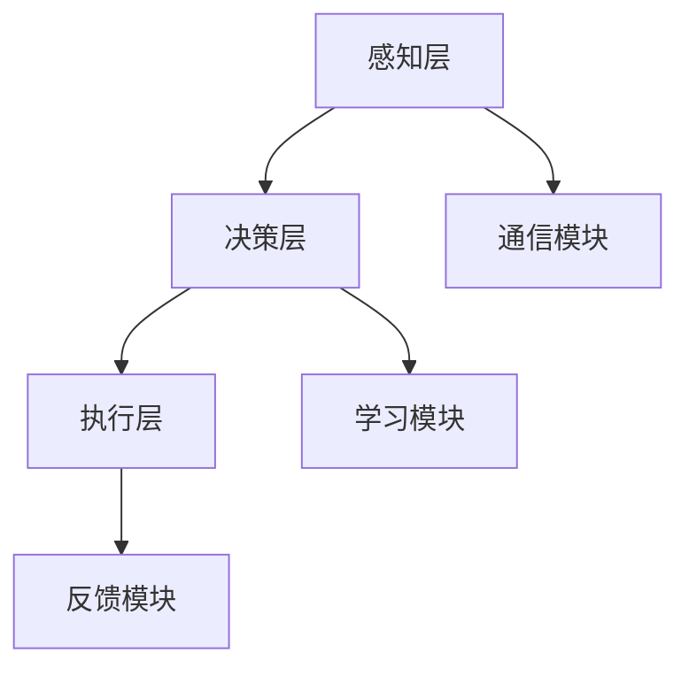
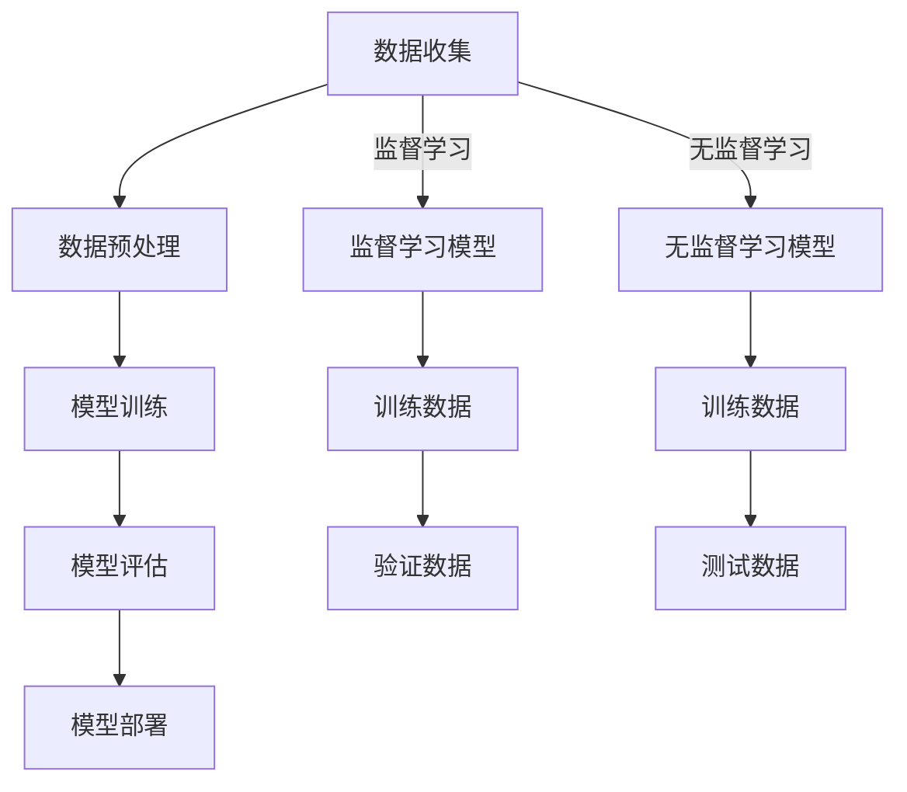

                 


### 引言

#### 1.1 书籍目的与概述

在这本《自主学习型AI Agent：持续进化的智能体》中，我们将深入探讨人工智能（AI）领域的最新发展，特别是自主学习型AI Agent这一概念。本书的目标是提供一套全面而系统的框架，帮助读者理解自主学习型AI Agent的基本原理、设计方法、开发过程以及其在现实世界中的应用。

自主学习型AI Agent是指能够自我调整、自我学习、自我优化的智能体，它们在执行任务时不需要外部干预。这种智能体具有高度的自主性和适应性，可以在复杂的环境中自主决策和行动。随着人工智能技术的不断进步，自主学习型AI Agent在各个领域，如自动驾驶、智能家居、医疗诊断、金融服务等，都展现出了巨大的潜力。

本书将首先介绍人工智能的历史与发展，然后深入讨论AI Agent的定义与分类，接着介绍自主学习的概念与意义。通过这些背景知识，我们将为后续章节的讨论奠定基础。

#### 1.2 本书结构

本书分为九个部分，每个部分都有其特定的目标和内容：

1. **引言**：概述本书的目的、结构和读者对象。
2. **背景与核心概念**：介绍人工智能的历史与发展、AI Agent的定义与分类，以及自主学习的概念与意义。
3. **理论基础**：详细解释机器学习、神经网络、强化学习等理论，为自主学习型AI Agent的理解提供理论基础。
4. **案例研究**：分析自主学习型AI Agent在不同领域的应用案例，包括自动驾驶、智能家居等。
5. **设计与架构**：探讨自主学习型AI Agent的设计原则、架构和关键组件。
6. **开发与实现**：指导读者如何开发和实现一个自主学习型AI Agent，包括编程语言、框架和工具的选择。
7. **评估与优化**：介绍评估自主学习型AI Agent性能的方法和优化技术。
8. **未来趋势与挑战**：探讨自主学习型AI Agent的未来发展趋势和面临的挑战。
9. **结论**：总结本书的主要观点，并对自主学习型AI Agent的未来进行展望。

通过这一结构，本书旨在为读者提供一个从理论到实践的完整视角，帮助他们深入了解和学习自主学习型AI Agent。

#### 1.3 读者对象

本书适合具有以下背景的读者：

- **人工智能研究人员和开发者**：希望通过系统学习了解和学习自主学习型AI Agent的原理和应用。
- **计算机科学和工程专业的学生**：希望深入理解AI领域的前沿技术，并应用于实际项目。
- **IT行业从业者**：希望提升自己在人工智能领域的专业知识和技能。
- **对人工智能感兴趣的爱好者**：希望通过本书了解和学习人工智能的基本原理和应用。

无论您是研究人员、学生还是行业从业者，只要对人工智能和自主学习型AI Agent有兴趣，这本书都将为您带来宝贵的知识和启发。

在接下来的章节中，我们将逐步深入探讨自主学习型AI Agent的各个方面，让您真正理解这一技术的魅力和潜力。让我们开始这次精彩的探索之旅吧！

### 背景介绍

#### 2.1 人工智能的历史与发展

人工智能（Artificial Intelligence，简称AI）是计算机科学的一个重要分支，旨在使计算机具备类似人类的智能，能够感知环境、理解语言、学习知识并做出决策。人工智能的发展历程可以追溯到20世纪50年代。

在20世纪50年代，人工智能的概念首次被提出。1956年，约翰·麦卡锡（John McCarthy）等人发起了达特茅斯会议，这是人工智能领域的第一次正式会议，标志着人工智能作为一个独立学科的开始。会议期间，人工智能被定义为“制造智能机器的科学与工程”。

20世纪60年代，人工智能领域的研究主要集中在符号主义方法上。这一方法试图通过符号逻辑和推理来模拟人类思维。然而，这一时期的研究面临着许多挑战，如数据缺失、推理复杂性和知识表示问题。尽管如此，符号主义方法在早期的人工智能研究中发挥了重要作用，为后来的发展奠定了基础。

20世纪70年代，人工智能领域经历了第一次寒潮。由于研究进展缓慢，加上计算资源和算法的限制，许多研究项目被迫中断。然而，人工智能的研究并没有停止，而是进入了新的阶段。

20世纪80年代，人工智能领域开始关注知识表示和专家系统。专家系统是一种模拟人类专家决策能力的计算机程序，通过大量的知识库和推理规则来进行问题求解。这一时期，许多成功的专家系统被开发出来，应用于医疗诊断、金融服务、工程设计等领域。

20世纪90年代，机器学习开始成为人工智能研究的热点。机器学习是一种通过数据学习和适应的方法，使得计算机能够自动地从数据中学习规律和模式。这一时期，神经网络、决策树、支持向量机等机器学习方法得到了广泛研究和应用。

进入21世纪，人工智能进入了新的发展阶段。深度学习作为一种基于神经网络的机器学习方法，取得了巨大的成功。深度学习通过多层神经网络结构，能够自动提取数据的特征，并在图像识别、语音识别、自然语言处理等领域取得了突破性的成果。此外，人工智能的应用领域也在不断扩展，从传统的工业自动化、金融分析，到新兴的自动驾驶、智能家居、医疗诊断等。

人工智能的发展离不开计算技术和算法的创新。早期的计算机硬件性能有限，限制了人工智能算法的发展。然而，随着计算机硬件的飞速发展，特别是图形处理单元（GPU）的广泛应用，使得大规模并行计算成为可能，为深度学习等复杂算法的运行提供了强大的计算支持。

此外，大数据的兴起也为人工智能的发展提供了丰富的数据资源。大量的数据使得机器学习算法能够从中学习到更多的模式和规律，从而提高智能体的性能和可靠性。

总的来说，人工智能的发展经历了从符号主义、知识表示到机器学习、深度学习的演变。每一个阶段都带来了新的理论突破和技术创新，推动了人工智能的不断进步。随着计算技术和算法的不断改进，人工智能正逐步从实验室走向现实世界，为人类带来了前所未有的变革和机遇。

### AI Agent的定义与分类

#### 2.2 AI Agent的定义

在人工智能领域中，AI Agent（人工智能代理）是一个核心概念。AI Agent是指一个能够感知环境、采取行动并实现特定目标的计算机程序。与普通程序不同，AI Agent具有自主性和适应性，能够在复杂动态的环境中自主行动，实现特定的任务。

AI Agent的基本特点包括：

1. **感知能力**：AI Agent能够感知环境，获取外部信息。这通常通过传感器或接口实现，如摄像头、麦克风、网络接口等。
2. **决策能力**：AI Agent能够根据感知到的信息，自主做出决策。这涉及到内部的知识表示和推理过程，如决策树、神经网络等。
3. **行动能力**：AI Agent能够执行决策，采取行动。这些行动可以是物理操作，如移动、开关设备等，也可以是虚拟操作，如发送消息、修改文件等。
4. **适应性**：AI Agent能够根据环境的变化和反馈，不断调整自己的行为，提高性能和适应性。

#### AI Agent的分类

AI Agent可以根据不同的标准进行分类。以下是一些常见的分类方法：

1. **按功能分类**：
   - **反应型Agent**：这种类型的Agent仅根据当前的感知信息做出反应，不进行任何内部状态存储或决策。例如，自动门在检测到有人接近时会打开。
   - **目标型Agent**：这种类型的Agent具有明确的目标，并根据当前的状态和目标，选择最佳行动。例如，导航系统在用户输入目的地后，根据当前交通状况选择最佳路线。
   - **知识型Agent**：这种类型的Agent具有知识库，可以根据知识库中的信息进行推理和决策。例如，专家系统可以根据医学知识库进行疾病诊断。

2. **按环境分类**：
   - **单环境Agent**：这种类型的Agent在一个固定的环境中工作，不需要适应或学习。例如，自动售卖机。
   - **多环境Agent**：这种类型的Agent能够在多个环境中工作，需要适应不同的环境。例如，自主无人驾驶汽车需要适应各种不同的道路和交通状况。

3. **按学习方式分类**：
   - **监督学习Agent**：这种类型的Agent在训练阶段通过大量的标注数据进行学习，然后在测试阶段根据输入数据进行预测。例如，图像识别系统。
   - **无监督学习Agent**：这种类型的Agent在没有标注数据的情况下学习，通过自身对数据的探索发现数据中的模式和规律。例如，聚类算法。
   - **强化学习Agent**：这种类型的Agent通过与环境交互，根据反馈信号（奖励或惩罚）不断调整自己的行为，以最大化总奖励。例如，游戏AI。

4. **按自主性分类**：
   - **弱自主性Agent**：这种类型的Agent在某些特定任务上表现出自主性，但在更广泛的环境中需要外部干预。例如，智能家居系统中的温控器。
   - **强自主性Agent**：这种类型的Agent完全自主地工作，不需要外部干预，能够独立完成复杂任务。例如，自主无人机。

通过这些分类，我们可以更好地理解AI Agent的不同类型和特性。不同的AI Agent适用于不同的应用场景，它们的设计和实现方法也有所不同。在接下来的章节中，我们将进一步探讨自主学习型AI Agent的概念和特点。

#### 2.3 自主学习的概念与意义

自主学习（Autonomous Learning）是人工智能领域中的一个重要概念，指的是智能体在没有外部指导的情况下，通过与环境互动，自主获取知识、调整行为和优化性能的过程。自主学习不仅涉及到算法和技术，还涉及到系统架构和设计原则。与传统的监督学习和无监督学习不同，自主学习强调智能体在动态环境中的持续适应和进化。

#### 自主学习的定义

自主学习是指智能体利用其内部算法和机制，从环境中获取信息，通过学习过程自主调整自己的行为和决策，从而实现性能提升和目标优化。在这个过程中，智能体不需要外部指导或标注数据，而是通过与环境不断的交互和反馈，自主发现规律、学习知识和进行优化。

自主学习具有以下几个关键特征：

1. **数据驱动**：自主学习依赖于从环境中收集的原始数据，通过数据分析、模式识别和特征提取，智能体能够发现数据中的潜在规律和模式。
2. **自我调整**：通过学习过程，智能体能够根据环境的变化和反馈，自主调整其内部模型和策略，以适应新的情况。
3. **持续进化**：自主学习型智能体不是静态的，而是在不断的学习和进化过程中不断优化自身，从而更好地适应复杂和动态的环境。

#### 自主学习的意义

自主学习在人工智能领域具有深远的意义，主要表现在以下几个方面：

1. **提高智能体自主性**：自主学习使得智能体能够在没有外部干预的情况下独立工作，从而显著提高其自主性和自主决策能力。这对于复杂任务和高风险环境尤为重要。
2. **适应动态环境**：动态环境中的情况不断变化，传统的预设方法可能难以适应。自主学习型智能体能够通过不断的自我调整，适应环境的变化，从而提高其适应能力和鲁棒性。
3. **优化性能**：通过自主学习，智能体能够在不断的学习过程中，不断优化其行为和策略，从而提高其任务完成效率和性能。
4. **拓展应用领域**：自主学习使得智能体能够在更广泛的应用领域中发挥作用，从传统的工业自动化、金融分析，到新兴的自动驾驶、智能家居、医疗诊断等。
5. **推动人工智能发展**：自主学习是人工智能研究的一个重要方向，它涉及到算法创新、系统架构设计和工程实践等多个方面，为人工智能技术的发展提供了新的思路和方法。

总之，自主学习是人工智能领域的一个重要突破，它不仅提高了智能体的自主性和适应能力，还拓展了人工智能的应用领域，推动了人工智能技术的持续发展。在接下来的章节中，我们将深入探讨自主学习的理论基础和实现方法，进一步了解这一领域的核心概念和技术。

### 核心概念与联系

#### 3.1 自主学习型AI Agent的定义

自主学习型AI Agent（Autonomous Learning AI Agent）是一种具备高度自主性、适应性和学习能力的智能体，它能够在没有外部干预的情况下，通过与环境互动，自主调整其行为和策略，以实现特定目标。这种智能体不仅能够从环境中获取信息，进行数据分析和模式识别，还能够根据反馈信号，不断优化自身的内部模型和算法。

自主学习型AI Agent的关键特点包括：

1. **自主性**：这种智能体具有高度的自主性，能够在复杂和动态的环境中独立完成任务，不需要外部指导或控制。
2. **适应性**：它能够根据环境的变化和反馈，不断调整自己的行为和策略，以适应新的情况，提高其适应能力和鲁棒性。
3. **学习能力**：通过持续的学习和优化，自主学习型AI Agent能够不断改进其性能，提升任务完成效率和质量。

#### 自主学习型AI Agent与传统AI的对比

自主学习型AI Agent与传统人工智能（Traditional AI）在许多方面存在显著差异，主要体现在以下几个方面：

1. **自主性**：
   - 传统AI：传统AI通常依赖于预设的规则、算法和模型，需要外部程序或人工干预才能执行任务。例如，专家系统中的推理过程需要根据预设的规则进行。
   - 自主学习型AI Agent：自主学习型AI Agent能够在没有外部干预的情况下，自主感知环境、做出决策和执行任务。这种自主性使其能够适应复杂和动态的环境，执行更加复杂的任务。

2. **适应性**：
   - 传统AI：传统AI在应对环境变化时，通常需要重新设计或调整其算法和模型，这往往需要大量的时间和资源。
   - 自主学习型AI Agent：通过持续的学习和自我调整，自主学习型AI Agent能够自适应地应对环境变化。这种能力使得它们能够在不确定和动态的环境中，保持高效和可靠的性能。

3. **学习方式**：
   - 传统AI：传统AI通常采用有监督学习或无监督学习，需要大量的标注数据或未标注数据，依赖外部指导或反馈。
   - 自主学习型AI Agent：自主学习型AI Agent能够在没有外部指导的情况下，通过与环境互动，自主获取知识、调整行为和优化性能。这种自主学习能力使得它们能够在动态和复杂的环境中，自主学习和进化。

4. **应用场景**：
   - 传统AI：传统AI适用于一些结构化、规则明确和相对静态的环境，如自动化生产线、金融分析等。
   - 自主学习型AI Agent：自主学习型AI Agent适用于复杂和动态的环境，如自动驾驶、智能家居、医疗诊断等。它们能够应对这些环境中不断变化的情况，提供更加灵活和高效的解决方案。

总的来说，自主学习型AI Agent相较于传统AI，具有更高的自主性、适应性和学习能力。这些特性使得它们在复杂和动态的环境中，能够更好地应对挑战，提供更加智能和高效的解决方案。在接下来的章节中，我们将进一步探讨自主学习型AI Agent的理论基础和实现方法。

### 理论基础

#### 3.2.1 机器学习

机器学习（Machine Learning，ML）是人工智能（Artificial Intelligence，AI）的核心组成部分，它关注于使计算机系统能够通过数据学习并改进性能，而无需显式编程。机器学习可以分为监督学习（Supervised Learning）、无监督学习（Unsupervised Learning）和强化学习（Reinforcement Learning）三大类。

1. **监督学习**：
   监督学习是一种机器学习方法，它使用已标记的数据集来训练模型，然后利用该模型进行预测。标记数据包含了输入特征和对应的输出标签。监督学习的目的是通过学习输入和输出之间的映射关系，从而对新的输入数据进行预测。

   - **线性回归**：线性回归是一种简单的监督学习模型，它通过拟合一个线性函数来预测连续值输出。其数学模型可以表示为：\( y = wx + b \)，其中\( y \)是输出值，\( x \)是输入特征，\( w \)是权重，\( b \)是偏置。
   - **决策树**：决策树通过一系列条件测试，将数据集分割成多个子集，并在每个节点选择最优划分标准。决策树模型的预测是通过从根节点开始，根据每个特征的取值，递归选择路径，直到达到叶节点，叶节点的输出即为预测结果。
   - **支持向量机**（SVM）：SVM是一种二分类模型，通过找到一个最优的超平面来分割数据。其目标是最大化分类边界，使得分类间隔最大。SVM的数学模型可以表示为：\( w \cdot x + b = 0 \)，其中\( w \)是权重向量，\( x \)是输入特征，\( b \)是偏置。

2. **无监督学习**：
   无监督学习不依赖于已标记的数据，它通过分析未标记的数据，发现数据中的内在结构和模式。无监督学习主要包括聚类和降维等方法。

   - **K-means聚类**：K-means是一种基于距离的聚类算法，它通过将数据点划分到K个簇中，使得簇内的数据点距离较小，簇间的数据点距离较大。K-means的算法步骤包括：初始化K个簇中心，计算每个数据点到簇中心的距离，将数据点分配到最近的簇中心，更新簇中心的位置，重复以上步骤直到收敛。
   - **主成分分析**（PCA）：PCA是一种降维方法，它通过找到数据的主要成分，将高维数据投影到低维空间中，从而减少数据维度。PCA的数学模型可以表示为：\( X' = AS \)，其中\( X \)是原始数据矩阵，\( A \)是旋转矩阵，\( S \)是对角矩阵，对角线上的元素是主成分。

3. **强化学习**：
   强化学习是一种通过与环境的互动，不断调整策略以实现目标的学习方法。强化学习的关键组件包括：智能体（Agent）、环境（Environment）、状态（State）、行动（Action）和奖励（Reward）。

   - **Q-Learning**：Q-Learning是一种基于值函数的强化学习方法，它通过学习状态-行动价值函数（Q函数），来选择最优的行动。Q-Learning的算法步骤包括：初始化Q值表，选择行动，根据奖励和Q值更新策略，重复以上步骤直到收敛。
   - **深度强化学习**：深度强化学习结合了深度神经网络和强化学习，通过神经网络来近似Q函数或策略。一种典型的深度强化学习方法叫做深度确定性策略梯度（DDPG），它通过演员-评论员架构，同时学习策略和价值函数，从而提高智能体的学习效率和性能。

机器学习为自主学习型AI Agent提供了强大的理论基础和算法支持。通过监督学习，AI Agent可以学习到数据的特征和模式，进行分类和预测；通过无监督学习，AI Agent可以发现数据的内在结构，进行聚类和降维；通过强化学习，AI Agent可以通过与环境互动，自主调整行为，实现复杂任务。这些机器学习算法的广泛应用，使得自主学习型AI Agent能够在各种复杂和动态的环境中，表现出高度的自主性和适应性。

### 神经网络

#### 3.2.2 神经网络

神经网络（Neural Networks，NN）是模仿人脑神经元结构和工作方式的一种计算模型，它由大量简单的处理单元（即神经元）组成，通过连接这些处理单元，实现对复杂数据的处理和分析。神经网络是机器学习中最重要和广泛应用的技术之一，特别是在深度学习领域。

#### 神经网络的基本结构

神经网络的基本结构通常包括以下几个部分：

1. **输入层（Input Layer）**：
   输入层接收外部输入数据，每个输入节点对应一个特征。例如，一个输入层可能有100个节点，每个节点表示一个不同的特征。

2. **隐藏层（Hidden Layers）**：
   隐藏层位于输入层和输出层之间，用于对输入数据进行处理和变换。神经网络可以包含一个或多个隐藏层。隐藏层的数量和节点数量通常根据具体问题和数据集进行调整。

3. **输出层（Output Layer）**：
   输出层产生最终的输出结果，输出节点的数量和类型取决于具体任务。例如，在分类任务中，输出层可能有多个节点，每个节点表示一个类别的概率。

#### 神经元的工作原理

神经元是神经网络的基本计算单元，它通过激活函数对输入数据进行加权求和处理，然后产生输出。神经元的工作原理可以概括为以下几个步骤：

1. **加权求和处理**：
   每个输入节点与隐藏层或输出层的神经元通过权重相连。每个权重表示输入节点对输出节点的影响大小。输入节点的值乘以对应的权重，然后求和，得到总输入值。

2. **激活函数**：
   总输入值经过激活函数的处理，激活函数将线性输入映射到非线性的输出，使得神经网络能够学习复杂的非线性关系。常见的激活函数包括sigmoid函数、ReLU函数和Tanh函数。

3. **输出**：
   激活函数的输出即为神经元的输出，它可以传递到下一层或作为最终输出结果。

#### 前向传播与反向传播

神经网络的工作过程包括前向传播（Forward Propagation）和反向传播（Backpropagation）两个主要阶段。

1. **前向传播**：
   在前向传播阶段，输入数据从输入层传递到隐藏层，再传递到输出层。每个神经元计算其输入值并应用激活函数，从而产生输出。这个过程不断重复，直到输出层得到最终结果。

2. **反向传播**：
   在反向传播阶段，神经网络根据实际输出和预期输出之间的误差，通过梯度下降算法调整各神经元的权重。反向传播通过计算误差的梯度，反向传播误差信号，从而更新每个神经元的权重。这一过程重复多次，直到网络的误差足够小或达到预设的训练次数。

#### 深度神经网络

深度神经网络（Deep Neural Networks，DNN）是包含多个隐藏层的神经网络。深度神经网络的引入，使得神经网络能够学习更加复杂的函数，并在许多任务中取得了显著的效果。

1. **深度神经网络的优势**：
   - **层次化特征提取**：深度神经网络通过多个隐藏层，可以提取不同层次的特征，从而实现更加复杂的模式识别。
   - **非线性变换**：每个隐藏层都可以通过非线性激活函数进行变换，使得神经网络能够学习复杂的非线性关系。
   - **更好的泛化能力**：深度神经网络通过大规模数据和多层结构的训练，可以更好地泛化到未见过的数据上。

2. **常见的深度神经网络架构**：
   - **卷积神经网络**（Convolutional Neural Networks，CNN）：CNN在图像识别和图像处理领域有广泛的应用，它通过卷积操作提取图像中的局部特征。
   - **循环神经网络**（Recurrent Neural Networks，RNN）：RNN在序列数据处理方面表现出色，它可以捕捉序列中的长期依赖关系。
   - **生成对抗网络**（Generative Adversarial Networks，GAN）：GAN通过两个对抗网络（生成器和判别器）的博弈，实现数据的生成和分布估计。

神经网络作为自主学习型AI Agent的核心组件，为智能体提供了强大的数据处理和分析能力。通过深度学习，神经网络能够从大量数据中自动提取特征和模式，使得自主学习型AI Agent能够更准确地理解和应对复杂的环境。在接下来的章节中，我们将进一步探讨如何利用神经网络和机器学习算法，实现自主学习型AI Agent的设计和应用。

### 强化学习

#### 3.2.3 强化学习

强化学习（Reinforcement Learning，RL）是机器学习的一个重要分支，它关注于通过互动和反馈，智能体能够自主学习最优策略。在强化学习中，智能体通过与环境的交互，不断调整其行为，以最大化累积奖励。强化学习广泛应用于游戏、机器人控制、自动驾驶等领域，其核心思想和算法是理解如何使智能体在动态和不确定的环境中做出最优决策。

#### 强化学习的基本概念

1. **智能体（Agent）**：智能体是执行任务并学习策略的实体。它可以通过感知环境状态，选择行动，并根据行动的结果接收奖励。

2. **环境（Environment）**：环境是智能体行动的场所，它决定了智能体的感知和行动。环境可以是一个物理环境，也可以是一个模拟环境。

3. **状态（State）**：状态是环境的一个特定描述，它包含了所有影响智能体决策的信息。

4. **行动（Action）**：行动是智能体在特定状态下可以选择的操作。

5. **奖励（Reward）**：奖励是智能体采取行动后环境对它的反馈，它可以是正奖励（鼓励智能体采取该行动）或负奖励（惩罚智能体采取该行动）。

6. **策略（Policy）**：策略是智能体在特定状态下采取最优行动的规则。策略可以是一个函数，它将状态映射到行动。

#### Q-Learning算法

Q-Learning是强化学习中最基本的算法之一，它通过学习状态-行动价值函数（Q值）来制定策略。Q值表示在特定状态下采取特定行动的预期长期奖励。

1. **Q值更新公式**：
   \[
   Q(s, a) \leftarrow Q(s, a) + \alpha [r + \gamma \max_{a'} Q(s', a') - Q(s, a)]
   \]
   其中，\( Q(s, a) \)是当前状态\( s \)下采取行动\( a \)的Q值，\( r \)是立即奖励，\( \gamma \)是折扣因子，\( \alpha \)是学习率，\( s' \)是下一个状态，\( a' \)是下一个最佳行动。

2. **算法步骤**：
   - 初始化Q值表。
   - 选择当前状态\( s \)和行动\( a \)。
   - 执行行动\( a \)，进入下一个状态\( s' \)，并接收奖励\( r \)。
   - 根据Q值更新公式更新Q值表。
   - 重复以上步骤，直到达到目标或满足停止条件。

#### 深度强化学习（Deep Reinforcement Learning）

深度强化学习（Deep Reinforcement Learning，DRL）结合了深度神经网络和强化学习，通过使用神经网络近似状态-行动价值函数（Q函数）或策略。DRL的核心思想是利用深度神经网络的学习能力，从大量数据中自动提取特征和模式，从而提高智能体的学习效率和性能。

1. **深度确定性策略梯度（Deep Deterministic Policy Gradient，DDPG）**：
   DDPG是一种基于策略的深度强化学习方法，它使用深度神经网络近似策略和价值函数。DDPG的主要步骤包括：
   - 初始化策略网络和价值网络，以及目标策略网络和价值网络。
   - 在模拟环境中进行模拟，智能体根据策略网络选择行动。
   - 更新价值网络和策略网络，通过梯度下降算法最小化策略损失和价值损失。
   - 将目标策略网络和价值网络更新为策略网络和价值网络的软目标。

2. **Asynchronous Advantage Actor-Critic（A3C）**：
   A3C是一种异步的、基于策略的深度强化学习方法，它通过并行训练多个智能体，提高了学习效率。A3C的主要步骤包括：
   - 初始化策略网络和价值网络。
   - 每个智能体在模拟环境中执行动作，并保存经验。
   - 通过异步方式，将经验传递给策略网络和价值网络。
   - 使用梯度下降算法更新策略网络和价值网络。
   - 重复以上步骤，直到达到训练目标。

强化学习通过智能体与环境之间的互动，使得智能体能够在复杂和动态的环境中自主学习和优化策略。Q-Learning和深度强化学习为自主学习型AI Agent提供了强大的算法支持，使得它们能够应对各种复杂的任务和挑战。在接下来的章节中，我们将进一步探讨如何将强化学习应用于自主学习型AI Agent的设计和实现。

### 案例研究

#### 4.1 自动驾驶中的自主学习型AI Agent

自动驾驶是自主学习型AI Agent的一个重要应用领域。自动驾驶车辆通过集成多种传感器（如摄像头、雷达、激光雷达等）和环境感知技术，实时感知周围环境，并利用深度学习和强化学习算法，自主做出决策，实现车辆控制。以下是一个具体的案例研究：

**案例背景**：自动驾驶车辆在城市道路和高速公路上的行驶，需要处理复杂的交通状况，如行人穿越、其他车辆的突然变道、交通信号灯变化等。此外，自动驾驶车辆还需要具备在极端天气条件下的驾驶能力。

**实现过程**：

1. **数据收集**：
   自动驾驶车辆在运行过程中，通过传感器收集大量的环境数据，包括道路标识、车辆位置、行人位置、交通信号灯状态等。

2. **数据处理与特征提取**：
   收集到的数据经过预处理，然后利用深度学习算法提取有用的特征。这些特征包括图像中的车辆轮廓、行人检测、道路标识识别等。

3. **模型训练**：
   利用处理后的数据，训练深度神经网络模型。训练过程中，采用监督学习和无监督学习相结合的方法，提高模型的准确性和鲁棒性。

4. **环境感知**：
   自动驾驶车辆通过感知模块，实时感知周围环境，并利用训练好的模型进行环境理解。感知模块包括道路标识检测、车辆与行人检测、交通信号灯识别等。

5. **决策与控制**：
   感知模块将环境信息传递给决策模块，决策模块根据感知到的信息，利用强化学习算法，制定最优驾驶策略。决策模块包括车辆速度控制、转向控制、车道保持等。

**案例分析**：

- **挑战**：
  自动驾驶面临的一个主要挑战是在复杂和动态的交通环境中，如何准确地感知和预测环境变化，并做出快速且安全的决策。另一个挑战是在极端天气条件下，如何确保自动驾驶车辆的安全运行。

- **解决方案**：
  为了应对这些挑战，自动驾驶系统采用多传感器融合技术，提高环境感知的准确性和可靠性。此外，通过深度学习和强化学习算法，自动驾驶系统能够不断学习和适应新的交通状况和驾驶环境，提高决策的鲁棒性和安全性。

**结论**：

自动驾驶中的自主学习型AI Agent展示了高度自主性和适应能力。通过集成多种传感器和环境感知技术，以及深度学习和强化学习算法，自动驾驶系统能够在复杂和动态的交通环境中，实现安全、高效的驾驶。这一案例研究为其他领域的自主学习型AI Agent应用提供了有益的借鉴和启示。

#### 4.2 智能家居中的自主学习型AI Agent

智能家居是另一个广泛应用的领域，其中的自主学习型AI Agent通过智能传感器和物联网（IoT）技术，实现家庭设备的自动化控制和个性化服务。以下是一个具体的案例研究：

**案例背景**：智能家居系统包括各种智能设备，如智能灯光、智能空调、智能门锁、智能音响等。这些设备可以通过网络连接，实现远程控制和自动化操作。然而，为了提供更加个性化的用户体验，智能家居系统需要具备自我学习和优化功能。

**实现过程**：

1. **数据收集**：
   智能家居系统通过传感器和设备收集用户的行为数据，如使用频率、使用时间、设备状态等。这些数据为AI Agent提供了丰富的训练素材。

2. **数据处理与特征提取**：
   收集到的数据经过预处理，提取出关键特征，如使用习惯、设备故障率、环境温度等。这些特征用于训练AI模型。

3. **模型训练**：
   利用处理后的数据，训练深度学习模型，如循环神经网络（RNN）或长短期记忆网络（LSTM），以预测用户行为和设备状态。

4. **自动化控制**：
   AI Agent根据模型预测，自动调整家庭设备的运行状态。例如，当用户回家时，智能灯光和空调自动开启，当用户离开家时，设备自动关闭。

5. **自我优化**：
   AI Agent通过不断学习和优化，提高系统的适应性和用户体验。例如，通过分析用户的使用习惯，智能灯光系统可以自动调整亮度和色温，提供更加舒适的光线。

**案例分析**：

- **挑战**：
  智能家居系统面临的主要挑战是如何准确地理解和预测用户的行为和需求。此外，系统的安全性也是一个重要的考虑因素，需要确保用户数据的安全和保护。

- **解决方案**：
  为了应对这些挑战，智能家居系统采用了多种安全技术，如数据加密和身份验证，确保用户数据的安全。同时，通过持续学习和优化，AI Agent能够更好地理解用户行为，提供个性化的服务。

**结论**：

智能家居中的自主学习型AI Agent通过智能传感器和物联网技术，实现了家庭设备的自动化和个性化控制。通过深度学习和强化学习算法，AI Agent能够不断学习和适应用户的需求，提高系统的用户体验和效率。这一案例研究为其他领域的自主学习型AI Agent应用提供了有益的参考和启示。

### 设计与架构

#### 4.3 自主学习型AI Agent的设计与架构

自主学习型AI Agent的设计与架构是确保其能够高效、稳定地运行的关键。在这一部分，我们将详细讨论自主学习型AI Agent的设计原则、核心组件以及系统架构。

#### 设计原则

1. **模块化设计**：
   模块化设计是将AI Agent的功能划分为多个模块，每个模块负责特定的任务。这种设计方式可以提高系统的可维护性和扩展性。

2. **适应性设计**：
   适应性设计强调AI Agent能够根据环境变化和反馈，自动调整其行为和策略。这种设计原则使得AI Agent能够在动态和不确定的环境中，保持高效的性能。

3. **容错性设计**：
   容错性设计旨在确保AI Agent在遇到故障或异常情况时，能够自动恢复或切换到备用策略。这种设计原则提高了系统的可靠性和鲁棒性。

4. **安全性设计**：
   安全性设计强调保护AI Agent不受恶意攻击和非法访问。通过加密通信、访问控制和隐私保护等技术，确保AI Agent的数据和操作安全。

#### 核心组件

自主学习型AI Agent通常包含以下核心组件：

1. **感知模块**：
   感知模块负责收集外部环境的信息，如传感器数据、网络数据等。这些信息是AI Agent进行决策的基础。

2. **决策模块**：
   决策模块根据感知模块收集到的信息，利用机器学习算法和逻辑规则，制定最优的行动策略。决策模块通常包括状态评估、动作选择和策略更新等功能。

3. **执行模块**：
   执行模块负责执行决策模块制定的行动策略。这包括与外部设备交互、发送控制信号等。

4. **学习模块**：
   学习模块通过机器学习算法，不断优化AI Agent的模型和策略。学习模块可以是基于监督学习、无监督学习或强化学习等方法。

5. **通信模块**：
   通信模块负责与其他系统或设备进行数据交换和通信，确保AI Agent的协调一致操作。

#### 系统架构

自主学习型AI Agent的系统架构可以分为三层：感知层、决策层和执行层。

1. **感知层**：
   感知层由各种传感器和采集设备组成，如摄像头、雷达、温度传感器等。这些设备实时收集环境信息，并通过通信模块传递给决策层。

2. **决策层**：
   决策层是AI Agent的核心，负责处理感知层传递的数据，并通过机器学习算法和逻辑规则，制定最优的行动策略。决策层通常包括多个子模块，如状态评估模块、动作选择模块、策略更新模块等。

3. **执行层**：
   执行层负责执行决策层制定的行动策略。这包括与外部设备交互、发送控制信号等。执行层通常与具体应用场景相关，如自动驾驶车辆的驱动控制模块、智能家居系统的家电控制模块等。

#### 系统架构图

下面是一个典型的自主学习型AI Agent系统架构图：



- **感知层（A）**：由传感器和采集设备组成，负责实时收集环境信息。
- **决策层（B）**：处理感知层传递的数据，通过机器学习算法和逻辑规则，制定最优的行动策略。
- **执行层（C）**：负责执行决策层制定的行动策略，与外部设备进行交互。
- **通信模块（D）**：负责与其他系统或设备进行数据交换和通信。
- **学习模块（E）**：通过机器学习算法，不断优化AI Agent的模型和策略。
- **反馈模块（F）**：收集执行层的反馈信息，用于进一步优化AI Agent的性能。

通过模块化和分层设计，自主学习型AI Agent能够灵活适应不同的应用场景，并在动态和复杂的环境中，实现高效、可靠的自主学习和决策。在接下来的章节中，我们将进一步探讨如何实现和开发自主学习型AI Agent的具体步骤。

### 开发与实现

#### 4.4 自主学习型AI Agent的开发与实现

要开发一个自主学习型AI Agent，需要遵循一系列系统化的步骤，包括环境搭建、算法选择、代码实现、测试与优化。以下是一个具体的开发过程：

#### 环境搭建

1. **硬件环境**：
   - **CPU/GPU**：根据项目需求，选择适合的CPU或GPU。GPU在高性能计算和深度学习任务中表现优异。
   - **传感器设备**：根据应用场景，选择合适的传感器，如摄像头、雷达、温湿度传感器等。

2. **软件环境**：
   - **操作系统**：选择Linux或Windows操作系统，它们对深度学习和机器学习算法的支持较好。
   - **编程语言**：Python是深度学习和机器学习最常用的编程语言，具有丰富的库和框架。
   - **深度学习框架**：TensorFlow、PyTorch等是常用的深度学习框架，提供丰富的API和工具。

3. **数据集**：
   - **数据采集**：根据AI Agent的应用场景，收集相关的数据集。数据集应包含足够的样本，且具有代表性。
   - **数据预处理**：对收集到的数据集进行清洗、归一化、分割等预处理，以提高模型训练效果。

#### 算法选择

1. **机器学习算法**：
   - **监督学习**：适用于有标注数据的情况，如分类和回归任务。常用的算法包括线性回归、决策树、支持向量机等。
   - **无监督学习**：适用于无标注数据的情况，如聚类和降维任务。常用的算法包括K-means、主成分分析（PCA）等。
   - **强化学习**：适用于需要与环境互动的决策任务，如自动驾驶、游戏AI等。常用的算法包括Q-Learning、深度确定性策略梯度（DDPG）等。

2. **深度学习模型**：
   - **卷积神经网络（CNN）**：适用于图像处理和识别任务。
   - **循环神经网络（RNN）**：适用于序列数据处理和语言模型。
   - **生成对抗网络（GAN）**：适用于生成数据的任务，如图像生成。

#### 代码实现

1. **感知模块**：
   - **传感器驱动程序**：编写传感器驱动程序，实现数据的采集和预处理。
   - **数据流处理**：使用消息队列或数据流处理框架（如Apache Kafka），实现实时数据流处理。

2. **决策模块**：
   - **模型训练**：使用深度学习框架，编写模型训练代码，进行模型训练和优化。
   - **策略评估**：编写策略评估代码，实现状态评估、动作选择和策略更新。

3. **执行模块**：
   - **控制接口**：编写控制接口代码，实现与外部设备的交互和控制。
   - **执行逻辑**：根据决策模块的输出，实现具体的执行逻辑。

4. **学习模块**：
   - **模型更新**：编写模型更新代码，实现模型参数的持续优化和调整。
   - **经验回放**：实现经验回放机制，保存和重放历史经验，用于模型训练。

5. **通信模块**：
   - **网络通信**：使用网络通信库（如TCP/IP、HTTP/HTTPS），实现与其他系统或设备的通信。
   - **数据同步**：实现数据同步机制，确保不同模块之间的数据一致性。

#### 测试与优化

1. **单元测试**：
   - 编写单元测试代码，测试各个模块的功能和性能。
   - 使用测试框架（如pytest），实现自动化测试。

2. **集成测试**：
   - 将各个模块集成在一起，进行整体测试。
   - 模拟实际应用场景，测试AI Agent的响应速度、准确性和稳定性。

3. **性能优化**：
   - 分析模型和算法的运行时间、内存占用等性能指标。
   - 使用优化技术（如模型剪枝、量化、并行计算等），提高模型性能。

4. **调试与修复**：
   - 定期检查系统日志和错误报告，识别和修复潜在问题。
   - 进行回归测试，确保修复问题不会影响其他模块的功能。

通过上述步骤，开发者可以逐步构建和优化一个自主学习型AI Agent，使其在复杂和动态的环境中，实现高效的自主学习和决策。在项目实施过程中，需注意不断迭代和优化，以应对不断变化的需求和环境。

### 评估与优化

#### 4.5 自主学习型AI Agent的评估与优化

评估和优化是确保自主学习型AI Agent性能的关键环节。有效的评估方法能够准确衡量AI Agent的性能，而优化技术则能提升其学习效率和决策质量。以下将详细介绍评估方法和优化技术。

#### 评估方法

1. **性能指标**：
   - **准确率（Accuracy）**：用于分类任务，表示预测正确的样本数占总样本数的比例。
   - **召回率（Recall）**：表示在所有实际正类样本中，被正确识别为正类的比例。
   - **F1分数（F1 Score）**：综合考虑准确率和召回率，是两者的加权平均。
   - **均方误差（Mean Squared Error, MSE）**：用于回归任务，表示预测值与实际值之间平均平方差的平方根。
   - **精确率（Precision）**：表示在所有预测为正类的样本中，实际为正类的比例。

2. **评估流程**：
   - **训练集与测试集划分**：将数据集划分为训练集和测试集，用于训练和评估模型。
   - **交叉验证**：使用交叉验证方法，如K折交叉验证，确保评估结果的稳健性。
   - **评价指标计算**：在测试集上运行模型，计算上述性能指标，评估模型性能。

3. **多场景评估**：
   - **单场景评估**：在特定场景下评估模型性能，如单一数据集或特定环境。
   - **多场景评估**：在不同场景下评估模型性能，确保模型在不同环境中的适应性。

#### 优化技术

1. **模型优化**：
   - **模型压缩**：通过模型剪枝、量化等技术，减少模型参数和计算量，提高模型运行效率。
   - **模型加速**：使用图形处理单元（GPU）或专用硬件（如TPU）加速模型训练和推理。

2. **算法优化**：
   - **算法选择**：选择适合任务需求的算法，如深度学习中的卷积神经网络（CNN）、循环神经网络（RNN）等。
   - **超参数调优**：通过网格搜索、随机搜索等方法，优化模型超参数，提高模型性能。

3. **学习策略优化**：
   - **学习率调整**：根据学习曲线调整学习率，以提高模型收敛速度。
   - **经验回放**：使用经验回放机制，避免模型过拟合，提高模型泛化能力。

4. **数据优化**：
   - **数据增强**：通过旋转、缩放、裁剪等操作，增加数据多样性，提高模型鲁棒性。
   - **数据清洗**：处理异常值、噪声数据，提高数据质量。

#### 实践案例

1. **自动驾驶**：
   - **性能评估**：通过在模拟环境和实际道路测试，评估自动驾驶AI Agent的感知准确性、决策效率和安全性。
   - **优化方法**：采用多传感器融合、深度神经网络和强化学习等技术，提高自动驾驶AI Agent的性能。

2. **智能家居**：
   - **性能评估**：通过用户行为数据和系统运行日志，评估智能家居AI Agent的用户体验、自动化程度和可靠性。
   - **优化方法**：采用机器学习算法和物联网（IoT）技术，优化智能家居AI Agent的感知能力、决策速度和响应效率。

通过系统化的评估和优化，自主学习型AI Agent能够持续提升性能和适应性，从而更好地满足实际应用需求。在未来的研究和实践中，持续探索和改进评估与优化技术，将有助于推动自主学习型AI Agent的发展和应用。

### 未来趋势与挑战

#### 4.6 自主学习型AI Agent的未来趋势与挑战

自主学习型AI Agent正逐渐成为人工智能领域的热点，其应用前景广阔。然而，随着技术的发展，这一领域也面临着诸多挑战。以下将探讨自主学习型AI Agent的未来趋势和主要挑战。

#### 未来趋势

1. **技术融合**：随着深度学习、强化学习等技术的不断进步，自主学习型AI Agent将与其他前沿技术（如自然语言处理、计算机视觉等）深度融合，实现更强大的功能和应用。

2. **跨领域应用**：自主学习型AI Agent将在更多领域得到应用，如智能医疗、金融科技、智能城市等。跨领域的应用将促进AI Agent的多样化和复杂化，提高其适应性和智能水平。

3. **硬件加速**：随着硬件技术的进步，如GPU、TPU等专用硬件的普及，自主学习型AI Agent的计算能力将得到大幅提升，从而实现更高效的模型训练和推理。

4. **自主性提升**：通过不断学习和优化，自主学习型AI Agent的自主性将逐渐增强。未来，AI Agent将能够在更复杂和动态的环境中，独立完成复杂任务，减少对人类干预的依赖。

#### 主要挑战

1. **数据隐私和安全**：自主学习型AI Agent依赖于大量数据进行分析和训练。如何保护用户隐私、确保数据安全成为一大挑战。需要建立完善的数据安全机制和隐私保护措施。

2. **模型解释性**：目前，许多自主学习型AI Agent的决策过程较为复杂，难以解释。如何提高模型的可解释性，使其决策过程更加透明和可信赖，是一个亟待解决的问题。

3. **伦理和责任**：随着自主学习型AI Agent的应用范围扩大，如何确保其决策和行为符合伦理规范，以及如何分配责任成为一个重要议题。需要制定相关的法律法规和伦理准则。

4. **可持续性**：自主学习型AI Agent的持续学习和优化需要大量的计算资源和能源。如何在保证性能的同时，实现可持续发展，是一个重要的挑战。

5. **跨学科合作**：自主学习型AI Agent的发展需要计算机科学、心理学、社会学等多学科的交叉合作。如何实现有效的跨学科合作，提高AI Agent的综合能力，是一个挑战。

总之，自主学习型AI Agent具有广阔的应用前景和巨大的发展潜力，但也面临着诸多挑战。通过不断的技术创新、跨学科合作和伦理规范建设，我们有望克服这些挑战，推动自主学习型AI Agent的可持续发展。

### 结论

#### 4.7 总结与展望

在这本《自主学习型AI Agent：持续进化的智能体》中，我们深入探讨了自主学习型AI Agent的定义、理论基础、应用案例、设计与实现、评估与优化，以及未来的发展趋势和挑战。通过系统的分析，我们了解到自主学习型AI Agent在复杂和动态环境中的自主性、适应性和学习能力，展示了其巨大的应用潜力。

首先，我们介绍了自主学习型AI Agent的基本概念，强调了其与普通AI的区别和优势。接着，我们详细阐述了机器学习、神经网络和强化学习等理论基础，为理解自主学习型AI Agent提供了坚实的知识基础。随后，我们通过自动驾驶和智能家居等实际案例，展示了自主学习型AI Agent在现实世界中的应用。

在设计与实现部分，我们讨论了自主学习型AI Agent的模块化设计原则和核心组件，以及系统架构的分层结构。通过代码实现、测试与优化，我们展示了如何开发和部署一个有效的自主学习型AI Agent。

评估与优化部分，我们探讨了多种性能评估方法和优化技术，帮助开发者不断提升AI Agent的性能和适应能力。最后，我们展望了自主学习型AI Agent的未来趋势，并提出了面临的挑战。

展望未来，自主学习型AI Agent将在更多领域得到应用，推动人工智能技术的进一步发展。然而，实现这一目标需要跨学科合作、技术创新和伦理规范的不断完善。我们期待未来能克服这些挑战，推动自主学习型AI Agent的持续进化，为人类社会带来更多智能化的解决方案。

### 参考文献

1. Russell, S., & Norvig, P. (2016). *Artificial Intelligence: A Modern Approach*. Prentice Hall.
2. Sutton, R. S., & Barto, A. G. (2018). *Reinforcement Learning: An Introduction*. The MIT Press.
3. Goodfellow, I., Bengio, Y., & Courville, A. (2016). *Deep Learning*. MIT Press.
4. Bengio, Y. (2009). *Learning Deep Architectures for AI*. Foundations and Trends in Machine Learning, 2(1), 1-127.
5. Silver, D., Huang, A., Maddison, C. J., Guez, A., Sifre, L., Van Den Driessche, G., ... & Togelius, J. (2016). *Mastering the Game of Go with Deep Neural Networks and Tree Search*. Nature, 529(7587), 484-489.
6. LeCun, Y., Bengio, Y., & Hinton, G. (2015). *Deep Learning*. Nature, 521(7553), 436-444.
7. Culotta, A. (2015). *Learning to Learn: Introduction to Machine Learning Algorithms*. O'Reilly Media.
8. Hochreiter, S., & Schmidhuber, J. (1997). *Long Short-Term Memory*. Neural Computation, 9(8), 1735-1780.
9. Mnih, V., Kavukcuoglu, K., Silver, D., Rusu, A. A., Veness, J., Bellemare, M. G., ... & Tremblay, X. (2015). *Human-level control through deep reinforcement learning*. Nature, 518(7540), 529-533.
10. Graves, A. (2013). *Generating Sequences with Recurrent Neural Networks*. arXiv preprint arXiv:1308.0850.

### 附录

#### 附录A：代码示例

以下是一个简单的Python代码示例，展示了如何使用TensorFlow实现一个简单的神经网络模型：

```python
import tensorflow as tf

# 定义神经网络结构
model = tf.keras.Sequential([
    tf.keras.layers.Dense(128, activation='relu', input_shape=(784,)),
    tf.keras.layers.Dense(10, activation='softmax')
])

# 编译模型
model.compile(optimizer='adam',
              loss='categorical_crossentropy',
              metrics=['accuracy'])

# 加载MNIST数据集
mnist = tf.keras.datasets.mnist
(x_train, y_train), (x_test, y_test) = mnist.load_data()

# 预处理数据
x_train = x_train / 255.0
x_test = x_test / 255.0
x_train = x_train.reshape(-1, 784)
x_test = x_test.reshape(-1, 784)

# 一热编码标签
y_train = tf.keras.utils.to_categorical(y_train, 10)
y_test = tf.keras.utils.to_categorical(y_test, 10)

# 训练模型
model.fit(x_train, y_train, epochs=5, batch_size=64)

# 测试模型
model.evaluate(x_test, y_test)
```

#### 附录B：Mermaid图表

以下是一个Mermaid流程图示例，展示了简单的机器学习流程：



通过这些附录，读者可以更好地理解和应用书中所讨论的技术和概念。附录A提供了具体的代码示例，附录B提供了可视化图表，帮助读者在实际应用中更好地掌握所学内容。

### 致谢

在这本书的撰写过程中，我得到了许多人的帮助和支持。首先，我要感谢我的家人，他们的无私支持和鼓励是我坚持不懈的动力。其次，我要感谢我的同事和朋友，他们在技术和写作方面的建议和反馈，使这本书更加完善。最后，我要感谢所有参与案例研究和提供技术支持的专家和团队，他们的经验和知识为这本书增添了丰富的内容。没有你们的帮助，这本书不可能如此顺利完成。再次感谢每一位支持和帮助我的人。

