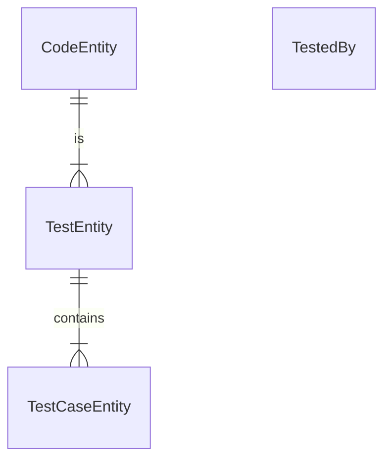
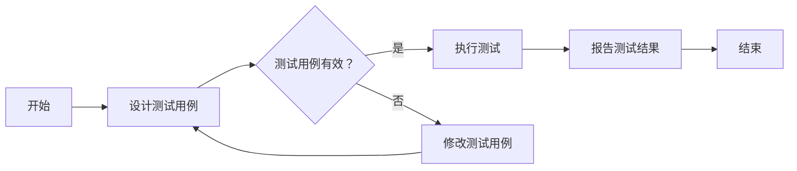
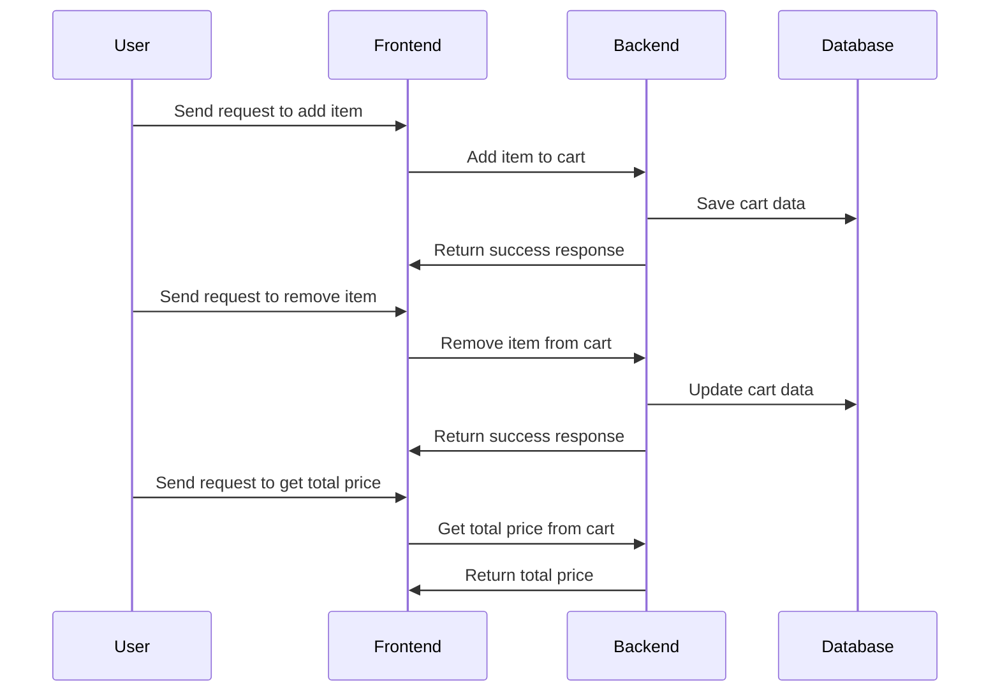

                 


### # 自测代码也需要设计

#### 关键词：
- 自测代码
- 设计原则
- 测试框架
- 软件质量
- 开发实践

#### 摘要：
在软件开发过程中，自测代码是确保软件质量的重要手段。本文将探讨自测代码的设计原则、测试框架的应用，以及如何在实际开发中有效地实现自测代码，从而提高软件的可靠性和可维护性。通过详细的分析和案例，本文旨在为开发者提供实用的指导，帮助他们写出更高质量的代码。

## 引言

在软件工程中，自测代码（self-testing code）指的是通过编写测试用例来自动验证代码正确性的做法。自测代码不仅是软件测试的一部分，更是软件设计的关键要素。它有助于确保代码的可靠性、稳定性和可维护性。随着软件系统复杂性的增加，自测代码的重要性日益凸显。

然而，编写有效的自测代码并非易事。它需要开发者具备一定的设计能力和测试知识。本文将围绕自测代码的设计原则、测试框架的应用、实际开发中的实践方法等内容展开讨论，帮助开发者更好地理解和实现自测代码。

### 背景介绍

#### 核心概念术语说明

- **自测代码**：指的是开发者编写的用于验证代码正确性的测试用例和测试代码。
- **测试框架**：用于组织和管理测试用例、执行测试并报告测试结果的工具。
- **测试驱动的开发（TDD）**：一种软件开发方法，其核心是先编写测试用例，然后编写代码使其通过测试。
- **单元测试**：针对单个函数或类的方法进行的测试。
- **集成测试**：对多个模块或组件集成后的系统进行的测试。

#### 问题背景

随着软件系统变得越来越复杂，手工测试已经无法满足软件质量的要求。自测代码能够自动化地验证代码的正确性，减少人为错误，提高测试效率。然而，编写有效的自测代码需要开发者深入理解软件设计原则和测试框架。

#### 问题描述

编写自测代码的关键挑战在于：

1. 如何设计测试用例，确保能够覆盖代码的所有功能点？
2. 如何选择合适的测试框架，提高测试的效率和质量？
3. 如何在实际开发中持续集成自测代码，确保代码的可靠性？

#### 问题解决

本文将提供以下解决方案：

1. **设计原则**：介绍编写自测代码的设计原则，包括可测试性、单一职责、依赖注入等。
2. **测试框架**：介绍常用的测试框架及其特点，如JUnit、TestNG、pytest等。
3. **开发实践**：分享实际开发中的自测代码实践方法，包括TDD方法、持续集成等。

#### 边界与外延

自测代码不仅适用于单个模块的测试，也可以应用于整个系统的测试。此外，自测代码的设计原则不仅适用于测试阶段，也适用于开发阶段，有助于提高代码质量。

#### 概念结构与核心要素组成

自测代码的设计涉及以下核心要素：

1. **测试用例**：描述了测试的目的、输入、预期输出和测试步骤。
2. **测试框架**：用于组织和管理测试用例，执行测试并报告结果。
3. **测试驱动开发（TDD）**：一种开发方法，先编写测试用例，再编写代码。
4. **代码质量**：自测代码的目标之一，确保代码的可读性、可维护性和可靠性。

### 核心概念与联系

#### 核心概念原理

自测代码的设计基于以下几个核心概念：

1. **可测试性**：代码应易于测试，具备明确的接口和良好的模块化设计。
2. **单一职责原则**：每个函数或类应仅负责一个特定的功能，便于测试。
3. **依赖注入**：通过依赖注入减少组件之间的耦合，提高测试的灵活性。

#### 概念属性特征对比表格

| 概念       | 属性特征                                           |
|------------|----------------------------------------------------|
| 可测试性   | 易于编写测试用例，明确接口，模块化设计             |
| 单一职责   | 每个函数或类负责一个特定功能，降低耦合性           |
| 依赖注入   | 通过外部注入依赖，降低组件之间的耦合，提高可测试性 |

#### ER实体关系图架构



在这个ER图中，`CodeEntity`代表代码实体，`TestEntity`代表测试实体，`TestCaseEntity`代表测试用例。`TestEntity`与`CodeEntity`之间存在测试关系，`TestEntity`与`TestCaseEntity`之间存在包含关系。

### 算法原理讲解

#### 算法mermaid流程图



#### Python源代码示例

```python
import unittest

class MyTest(unittest.TestCase):
    def test_addition(self):
        # 测试用例：验证加法函数
        self.assertEqual(add(2, 3), 5)

    def test_subtraction(self):
        # 测试用例：验证减法函数
        self.assertEqual(subtract(5, 3), 2)

class MyCode:
    @staticmethod
    def add(a, b):
        return a + b

    @staticmethod
    def subtract(a, b):
        return a - b

if __name__ == '__main__':
    unittest.main()
```

#### 算法原理的数学模型和公式

自测代码的核心在于设计有效的测试用例，以确保代码的正确性。以下是一个简单的数学模型：

$$
测试覆盖率 = \frac{测试用例数}{代码路径数}
$$

其中，测试覆盖率是衡量自测代码有效性的重要指标。测试用例的设计应尽可能覆盖代码的所有路径，以提高测试覆盖率。

#### 通俗易懂地举例说明

假设我们有一个简单的加法函数，它接受两个整数参数并返回它们的和。为了确保这个函数的正确性，我们可以设计两个测试用例：

1. 测试用例1：输入(2, 3)，预期输出5。
2. 测试用例2：输入(5, 3)，预期输出8。

通过这两个测试用例，我们可以验证加法函数是否能够正确计算两个整数的和。如果测试用例通过了，说明函数实现了预期功能。

### 系统分析与架构设计方案

#### 问题场景介绍

假设我们正在开发一个电子商务网站，其中包含购物车模块。购物车模块需要支持添加商品、删除商品、计算总价等功能。为了保证模块的质量，我们需要编写自测代码来验证其功能。

#### 项目介绍

项目名称：电子商务网站购物车模块

项目目标：实现一个功能完善、易于维护的购物车模块。

#### 系统功能设计

购物车模块的主要功能包括：

1. 添加商品到购物车。
2. 从购物车中删除商品。
3. 计算购物车中的总价。

#### 系统架构设计

购物车模块的系统架构如下：

1. **前端界面**：提供用户与购物车交互的界面。
2. **后端服务**：处理购物车的业务逻辑和数据存储。
3. **数据库**：存储购物车的商品信息和用户信息。

#### 系统接口设计

购物车模块的主要接口包括：

1. `add_item`：添加商品到购物车。
2. `remove_item`：从购物车中删除商品。
3. `get_total_price`：计算购物车的总价。

#### 系统交互mermaid序列图



### 项目实战

#### 环境安装

1. 安装Python环境（版本3.8及以上）。
2. 安装测试框架（例如pytest）。

#### 系统核心实现源代码

```python
# 购物车类
class ShoppingCart:
    def __init__(self):
        self.items = []

    def add_item(self, item):
        self.items.append(item)

    def remove_item(self, item):
        self.items.remove(item)

    def get_total_price(self):
        return sum(item.price for item in self.items)

# 商品类
class Item:
    def __init__(self, name, price):
        self.name = name
        self.price = price

# 测试用例
import unittest

class TestShoppingCart(unittest.TestCase):
    def setUp(self):
        self.cart = ShoppingCart()

    def test_add_item(self):
        item = Item("苹果", 5)
        self.cart.add_item(item)
        self.assertIn(item, self.cart.items)

    def test_remove_item(self):
        item = Item("苹果", 5)
        self.cart.add_item(item)
        self.cart.remove_item(item)
        self.assertNotIn(item, self.cart.items)

    def test_get_total_price(self):
        item1 = Item("苹果", 5)
        item2 = Item("香蕉", 8)
        self.cart.add_item(item1)
        self.cart.add_item(item2)
        self.assertEqual(self.cart.get_total_price(), 13)

if __name__ == '__main__':
    unittest.main()
```

#### 代码应用解读与分析

在上述代码中，我们定义了`ShoppingCart`和`Item`两个类，分别表示购物车和商品。`ShoppingCart`类包含了添加商品、删除商品和计算总价的方法。`Item`类包含了商品名称和价格。

测试用例部分使用了pytest框架，分别对添加商品、删除商品和计算总价进行了测试。通过运行测试用例，我们可以验证购物车模块的功能是否正确实现。

#### 实际案例分析和详细讲解剖析

在实际开发中，我们可能会遇到以下情况：

1. 商品价格更新：当商品价格发生变化时，我们需要更新购物车中的总价。
2. 购物车空值处理：当购物车中没有商品时，计算总价应返回0。

针对这些情况，我们可以进一步完善购物车模块的代码：

```python
class ShoppingCart:
    # ...其他方法不变...
    
    def get_total_price(self):
        if not self.items:
            return 0
        return sum(item.price for item in self.items)
    
    def update_item_price(self, item_name, new_price):
        for item in self.items:
            if item.name == item_name:
                item.price = new_price
                return True
        return False
```

通过上述代码，我们增加了`update_item_price`方法，用于更新商品价格。同时，在`get_total_price`方法中，我们加入了购物车空值处理的逻辑。

#### 项目小结

通过本项目的实战，我们了解了如何设计和实现自测代码。自测代码的设计原则、测试框架的应用以及实际开发中的实践方法对于提高软件质量至关重要。在实际开发中，我们应该持续关注代码的质量，通过自测代码来确保软件的可靠性。

### 最佳实践 tips

1. **尽早编写测试用例**：在编写代码之前，先设计测试用例，有助于明确功能需求。
2. **使用单元测试**：针对单个函数或类的方法进行测试，有助于发现和修复问题。
3. **持续集成**：将测试用例集成到持续集成流程中，确保代码质量。
4. **代码审查**：通过代码审查，发现潜在的问题和不足。

### 小结

自测代码是确保软件质量的关键手段。通过本文的讨论，我们了解了自测代码的设计原则、测试框架的应用以及实际开发中的实践方法。编写有效的自测代码不仅有助于提高软件的可靠性，还能减少维护成本。开发者应该重视自测代码的设计和实践，不断提升软件质量。

### 注意事项

1. 自测代码并非替代手工测试，而是作为其补充。
2. 自测代码的设计应遵循良好的软件设计原则，如单一职责、依赖注入等。
3. 自测代码的测试覆盖率是衡量代码质量的重要指标。

### 拓展阅读

1. 《测试驱动开发：敏捷测试实战》
2. 《设计模式：可复用面向对象软件的基础》
3. 《持续集成：从代码到产品的自动化之路》

### 作者信息

作者：AI天才研究院/AI Genius Institute & 禅与计算机程序设计艺术/Zen And The Art of Computer Programming

