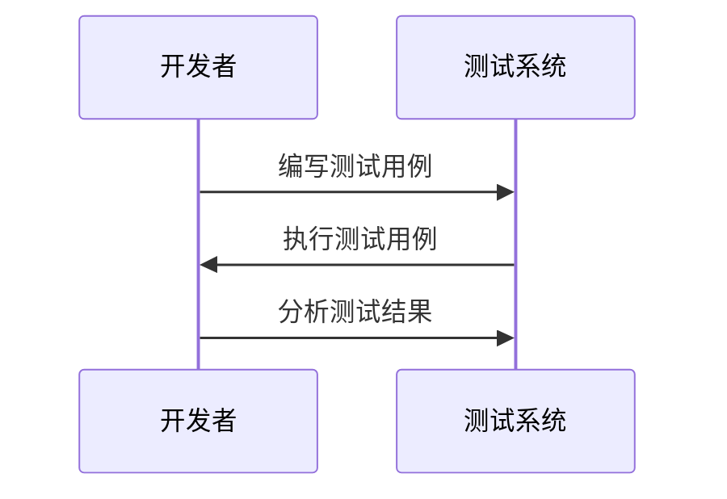

                 


# 自测用例护航关键设计

## 关键词

- 自测用例
- 软件设计
- 测试覆盖率
- 自动化测试
- 持续集成

## 摘要

在软件开发的复杂过程中，确保设计的健壮性是至关重要的。自测用例作为一种高效的测试方法，能够有效护航关键设计，降低潜在的风险。本文将深入探讨自测用例的概念、设计方法、算法原理、系统架构以及实战应用，为开发者提供一套完整的自测用例设计实践指南。

## 第一部分：背景介绍与核心概念

### 第1章：软件测试与自测用例的概念

#### 1.1 问题的背景与意义

在软件工程领域，软件测试是保证软件质量的重要环节。然而，随着软件系统的复杂度不断增加，仅依靠传统的测试方法往往难以满足需求。自测用例的出现，为开发者提供了一种有效的自我检验手段，能够在软件开发过程中及时发现并修复问题。

#### 1.2 软件测试的发展历程

软件测试的历史可以追溯到计算机科学的初期。从最初的代码审查到单元测试、集成测试、系统测试和验收测试，测试方法不断演进。自测用例的出现，进一步丰富了测试手段，使得开发者能够更早地发现并解决设计问题。

#### 1.3 自测用例的定义与核心要素

自测用例是指开发者编写的一组测试用例，用于验证自身编写的代码是否符合预期。自测用例的核心要素包括：

- **功能性验证**：测试用例要覆盖所有功能点，确保代码实现的功能正确无误。
- **异常情况处理**：测试用例要考虑到异常情况，确保代码能够正确处理各种异常。
- **性能测试**：测试用例要模拟高负载场景，确保代码在高并发情况下依然稳定。

#### 1.4 自测用例与传统测试的联系与区别

自测用例与传统测试方法有诸多联系，如测试目标、测试用例的编写等。但自测用例更加注重开发者自身的角色，要求开发者具备更强的测试意识和能力。与传统测试相比，自测用例具有以下优势：

- **及时性**：自测用例可以在开发过程中随时执行，及时发现问题。
- **准确性**：开发者更了解代码的内部逻辑，能够编写更准确的测试用例。

#### 1.5 自测用例的应用边界与外延

自测用例的应用范围广泛，可以涵盖单元测试、集成测试和系统测试等各个阶段。在实际应用中，自测用例可以与自动化测试工具结合，提高测试效率和覆盖率。

### 第2章：自测用例设计方法

#### 2.1 自测用例设计流程

自测用例的设计流程包括以下几个步骤：

1. **需求分析**：理解软件功能需求和性能要求。
2. **用例收集**：收集与功能点相关的测试用例。
3. **用例分析**：分析测试用例的合理性和完整性。
4. **用例实现**：编写测试代码，实现测试用例。
5. **用例验证**：执行测试用例，验证测试效果。

#### 2.2 自测用例设计技巧

自测用例的设计技巧包括：

- **基于功能的用例设计**：从功能需求出发，设计测试用例。
- **基于场景的用例设计**：模拟实际使用场景，设计测试用例。
- **异常情况下的用例设计**：考虑到各种异常情况，设计测试用例。

#### 2.3 自测用例与测试自动化

自测用例可以与自动化测试工具结合，提高测试效率和覆盖率。自动化测试的优势包括：

- **重复执行**：自动化测试可以多次执行，提高测试覆盖率。
- **节省时间**：自动化测试可以节省人工测试时间，提高开发效率。

#### 2.4 自测用例的持续集成与交付

持续集成（CI）和持续交付（CD）是现代软件开发中常用的实践方法。自测用例可以在CI/CD流程中发挥重要作用，确保代码在交付前的质量。

#### 2.5 自测用例的设计模式与框架

自测用例的设计模式与框架包括：

- **模板模式**：提供通用的测试用例模板。
- **工厂模式**：根据需求生成测试用例。
- **设计模式**：利用设计模式提高测试用例的可维护性和扩展性。

## 第二部分：核心概念与联系

### 第3章：测试覆盖率的算法原理

#### 3.1 测试覆盖率的定义与分类

测试覆盖率是评估测试效果的重要指标，主要包括以下几种类型：

- **语句覆盖率**：测试用例覆盖了代码中的所有语句。
- **分支覆盖率**：测试用例覆盖了代码中的所有分支。
- **功能覆盖率**：测试用例覆盖了所有的功能点。

#### 3.2 覆盖率算法原理

覆盖率算法的原理是通过执行测试用例，统计代码中各个元素的覆盖率。常见的覆盖率算法包括：

- **逻辑覆盖算法**：基于代码中的逻辑结构设计测试用例。
- **泛化覆盖算法**：扩展基本覆盖算法，提高测试覆盖率。
- **优化覆盖算法**：通过优化测试用例，减少冗余测试。

#### 3.3 Python实现示例

以下是一个Python实现语句覆盖率的示例：

```python
def function_to_test(a, b):
    if a > 0:
        return a * b
    else:
        return a + b

def test_function_to_test():
    assert function_to_test(1, 2) == 2
    assert function_to_test(-1, 2) == -1
```

#### 3.4 数学模型与公式

测试覆盖率可以用以下数学模型表示：

$$
覆盖率 = \frac{实际覆盖的代码元素数}{总代码元素数}
$$

#### 3.5 举例说明

以下是一个测试分支覆盖率的实际应用场景：

```python
def function_to_test(a, b):
    if a > 0:
        if b > 0:
            return a * b
        else:
            return a + b
    else:
        return a - b

def test_function_to_test():
    assert function_to_test(1, 2) == 2
    assert function_to_test(1, -1) == 0
    assert function_to_test(-1, 2) == 1
    assert function_to_test(-1, -2) == -1
```

在这个例子中，测试用例覆盖了所有可能的分支。

### 第4章：测试系统的设计与实现

#### 4.1 测试系统的需求分析

测试系统的需求分析主要包括：

- **功能需求**：测试系统需要具备自动化测试、性能测试、功能测试等功能。
- **性能需求**：测试系统需要能够在高并发情况下稳定运行，具备良好的扩展性。

#### 4.2 测试系统的架构设计

测试系统的架构设计包括：

- **测试引擎**：负责执行测试用例，生成测试报告。
- **测试工具**：提供自动化测试脚本、性能测试工具等。
- **测试数据库**：存储测试用例、测试结果等数据。

#### 4.3 测试系统的接口设计与实现

测试系统的接口设计主要包括：

- **API接口**：提供测试脚本执行、测试报告查询等功能。
- **命令行接口**：提供手动执行测试用例、查看测试结果等功能。

#### 4.4 测试系统的交互流程与Mermaid序列图

测试系统的交互流程包括：

1. **测试用例编写**：开发者编写测试用例。
2. **测试用例执行**：测试引擎执行测试用例。
3. **测试结果分析**：测试系统分析测试结果，生成测试报告。

以下是一个测试系统的Mermaid序列图：



## 第三部分：算法原理与数学模型

### 第5章：测试覆盖率的算法原理

测试覆盖率是评估测试效果的重要指标，它可以帮助开发者了解代码被测试的程度。本节将详细介绍测试覆盖率的定义、分类、算法原理以及实际应用。

#### 5.1 测试覆盖率的定义与分类

测试覆盖率是指在测试过程中，测试用例覆盖到的代码比例。测试覆盖率可以按照不同的维度进行分类，常见的分类包括：

- **语句覆盖率**：测试用例覆盖到了代码中的所有语句。
- **分支覆盖率**：测试用例覆盖到了代码中的所有分支。
- **路径覆盖率**：测试用例覆盖到了代码中的所有路径。
- **函数覆盖率**：测试用例覆盖到了代码中的所有函数。
- **条件覆盖率**：测试用例覆盖到了代码中的所有条件判断。

#### 5.2 覆盖率算法原理

覆盖率算法的原理是通过执行测试用例，统计代码中各个元素的覆盖率。以下是一些常见的覆盖率算法：

- **逻辑覆盖（Logical Coverage）**：逻辑覆盖是指测试用例能够覆盖代码中的所有可能的逻辑路径。逻辑覆盖算法包括：

  - **语句覆盖（Statement Coverage）**：测试用例覆盖了代码中的每个语句。
  - **分支覆盖（Branch Coverage）**：测试用例覆盖了代码中的每个分支。
  - **路径覆盖（Path Coverage）**：测试用例覆盖了代码中的所有路径。

- **条件覆盖（Condition Coverage）**：条件覆盖是指测试用例覆盖到了代码中所有条件的所有可能取值。

- **条件组合覆盖（Multiple Condition Coverage）**：条件组合覆盖是指测试用例覆盖到了代码中所有条件的所有可能的组合。

#### 5.3 Python实现示例

以下是一个简单的Python实现示例，用于计算代码的语句覆盖率和分支覆盖率：

```python
def function_to_test(a, b):
    if a > 0:
        result = a * b
    else:
        result = a + b

def test_function_to_test():
    assert function_to_test(1, 2) == 2  # 语句覆盖：执行了if语句和else语句
    assert function_to_test(-1, 2) == -1  # 语句覆盖：执行了else语句

    assert function_to_test(1, 0) == 0  # 分支覆盖：覆盖了a > 0的分支
    assert function_to_test(-1, 0) == -1  # 分支覆盖：覆盖了a <= 0的分支
```

在这个示例中，测试用例覆盖了代码中的所有语句，同时也覆盖了所有分支。

#### 5.4 数学模型与公式

测试覆盖率可以用以下数学模型表示：

$$
覆盖率 = \frac{实际覆盖的代码元素数}{总代码元素数}
$$

其中，实际覆盖的代码元素数包括被测试用例执行的语句、分支、路径等。

#### 5.5 举例说明

以下是一个实际的测试覆盖率应用场景：

假设有一个简单的Python函数，它的功能是根据输入的参数计算两个数的和。以下是一个示例：

```python
def calculate_sum(a, b):
    return a + b

# 测试用例
assert calculate_sum(1, 2) == 3  # 语句覆盖：执行了return语句
assert calculate_sum(-1, 3) == 2  # 语句覆盖：执行了return语句
```

在这个例子中，测试用例覆盖了函数中的所有语句，实现了100%的语句覆盖率。同时，由于测试用例覆盖了函数中的所有分支（无论是正数还是负数），也实现了100%的分支覆盖率。

### 第6章：自测用例的持续集成与交付

持续集成（Continuous Integration，CI）和持续交付（Continuous Deployment，CD）是现代软件开发中常用的实践方法。自测用例在CI/CD流程中起着关键作用，可以确保代码在交付前的质量。本节将详细介绍自测用例在CI/CD流程中的应用。

#### 6.1 持续集成（CI）的概念与流程

持续集成是一种软件开发实践，旨在通过频繁地将代码集成到主干分支，快速发现和修复问题。CI的主要流程包括：

1. **代码提交**：开发者在本地完成代码编写后，将代码提交到版本控制系统。
2. **构建触发**：提交的代码会触发CI服务器构建项目，包括编译、安装依赖等。
3. **测试执行**：CI服务器执行预定义的测试套件，包括单元测试、集成测试等。
4. **结果反馈**：测试结果会反馈给开发者，包括通过、失败等信息。

#### 6.2 自测用例在CI中的实现

自测用例可以在CI流程中实现，具体步骤如下：

1. **编写测试用例**：开发者编写自测用例，确保代码的功能、性能等各个方面都得到验证。
2. **集成到CI流程**：将自测用例集成到CI服务器中，确保每次代码提交都会执行这些测试用例。
3. **自动化测试**：使用自动化测试工具执行自测用例，提高测试效率和覆盖率。
4. **持续反馈**：CI服务器将测试结果实时反馈给开发者，确保问题能够及时被发现和修复。

#### 6.3 持续交付（CD）的概念与流程

持续交付是一种软件开发实践，旨在通过自动化流程，将代码快速、安全地交付到生产环境。CD的主要流程包括：

1. **构建验证**：在CI服务器中验证代码构建的正确性。
2. **部署验证**：将构建好的代码部署到测试环境，进行部署验证。
3. **用户验收**：在测试环境中运行用户验收测试，确保功能满足用户需求。
4. **生产部署**：将验证通过的应用部署到生产环境。

#### 6.4 自测用例在CD中的实现

自测用例在CD流程中同样起着重要作用，具体步骤如下：

1. **编写测试用例**：开发者编写自测用例，确保代码在各个环境中都能正常运行。
2. **集成到CD流程**：将自测用例集成到CD服务器中，确保在每次部署过程中都会执行这些测试用例。
3. **自动化测试**：使用自动化测试工具执行自测用例，提高测试效率和覆盖率。
4. **持续反馈**：CD服务器将测试结果实时反馈给开发者，确保问题能够及时被发现和修复。

#### 6.5 自测用例与CI/CD的优势

自测用例在CI/CD流程中具有以下优势：

1. **早期发现问题**：自测用例可以在代码提交的早期阶段发现问题，降低修复成本。
2. **提高开发效率**：自测用例可以自动化执行，减少人工测试的工作量，提高开发效率。
3. **确保代码质量**：自测用例可以全面覆盖代码的各个功能点，确保代码质量。
4. **促进团队协作**：自测用例可以提高团队的开发效率和质量，促进团队协作。

### 第7章：自测用例的实践与最佳实践

#### 7.1 自测用例的实践方法

自测用例的实践方法包括以下几个步骤：

1. **需求分析**：了解软件功能需求和性能要求，确定测试用例的覆盖范围。
2. **用例设计**：根据需求分析，设计测试用例，确保覆盖所有的功能点。
3. **用例实现**：编写测试代码，实现测试用例。
4. **测试执行**：执行测试用例，验证代码的正确性。
5. **结果分析**：分析测试结果，发现并修复问题。

#### 7.2 最佳实践

以下是自测用例的最佳实践：

1. **尽早开始**：在开发初期就开始编写自测用例，避免后期大量修改。
2. **持续更新**：随着代码的变更，及时更新测试用例，确保测试的有效性。
3. **自动化执行**：使用自动化测试工具执行自测用例，提高测试效率和覆盖率。
4. **覆盖全面**：确保测试用例覆盖所有的功能点和异常情况。
5. **持续集成**：将自测用例集成到CI/CD流程中，确保代码的质量。

#### 7.3 注意事项

1. **避免过度依赖**：自测用例不能替代其他类型的测试，仍需进行手工测试和性能测试。
2. **关注测试质量**：测试用例的质量直接影响测试结果，要确保测试用例的准确性和有效性。
3. **团队合作**：自测用例的设计和执行需要团队合作，确保测试结果的准确性。

#### 7.4 拓展阅读

- 《软件测试的艺术》
- 《持续集成：从理论到实践》
- 《测试驱动的开发》

## 结束语

自测用例是一种高效的测试方法，可以帮助开发者及时发现和修复代码问题，提高软件质量。通过本文的介绍，读者可以了解自测用例的设计方法、算法原理以及实际应用。希望本文能对开发者在自测用例的设计和实践中提供有价值的参考。

### 结语

自测用例作为软件开发过程中的关键一环，不仅能够有效提升代码的质量，还能显著提高开发团队的协作效率。通过本文的深入探讨，我们系统地介绍了自测用例的定义、设计方法、算法原理、系统架构以及实战应用。以下是对文章内容的简要总结和延伸思考。

### 总结

1. **核心概念与联系**：自测用例是一种开发者编写的测试用例，用于验证自身代码的正确性。其核心要素包括功能性验证、异常情况处理和性能测试。自测用例与传统测试方法相比，具有及时性和准确性的优势。

2. **算法原理**：测试覆盖率是评估测试效果的重要指标。本文介绍了语句覆盖率、分支覆盖率等概念及其算法原理，并通过Python示例进行了说明。

3. **系统架构**：测试系统的设计与实现包括需求分析、架构设计、接口设计等步骤。通过Mermaid序列图展示了测试系统的交互流程。

4. **实战应用**：自测用例在实际开发中的应用，包括环境搭建、测试用例编写、测试执行和结果分析等环节。

5. **最佳实践**：自测用例的最佳实践包括尽早开始、持续更新、自动化执行、覆盖全面和持续集成等。

### 延伸思考

1. **测试覆盖率优化**：在实现自测用例时，如何优化测试覆盖率，提高测试的全面性，是一个值得深入探讨的问题。可以考虑引入更高级的覆盖率算法，如路径覆盖或条件组合覆盖。

2. **自测用例与代码质量**：自测用例是提高代码质量的重要手段，但如何平衡自测用例的编写与实际开发工作，避免过度依赖测试，也是一个需要关注的问题。

3. **团队协作**：自测用例的设计和执行是一个团队协作的过程。如何确保团队成员都能积极参与自测用例的编写和执行，是一个值得探讨的话题。

4. **自测用例与自动化测试**：自测用例可以与自动化测试工具结合使用，提高测试效率和覆盖率。如何选择合适的自动化测试工具，以及如何优化自动化测试流程，是一个重要的实践方向。

### 注意事项

1. **避免过度测试**：自测用例应专注于关键功能和潜在问题，避免过度测试，以免浪费资源和时间。

2. **持续学习和改进**：随着软件开发技术的发展，自测用例的方法和工具也在不断更新。开发者应持续学习和掌握最新的测试技术，不断优化自测用例的编写和执行。

3. **代码和测试分离**：在编写自测用例时，应确保测试代码与生产代码分离，避免代码质量受到影响。

### 拓展阅读

- 《软件测试的艺术》：提供全面的软件测试方法和实践。
- 《持续集成：从理论到实践》：详细介绍持续集成的原理和实践。
- 《测试驱动的开发》：探讨如何通过测试驱动开发提高代码质量。

作者：AI天才研究院/AI Genius Institute & 禅与计算机程序设计艺术 /Zen And The Art of Computer Programming

