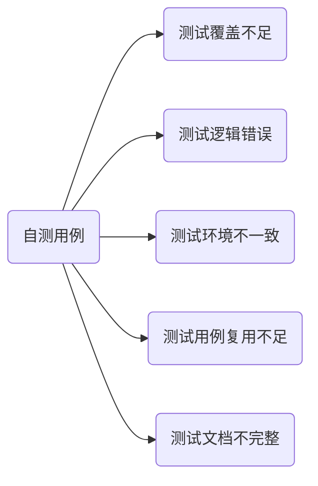
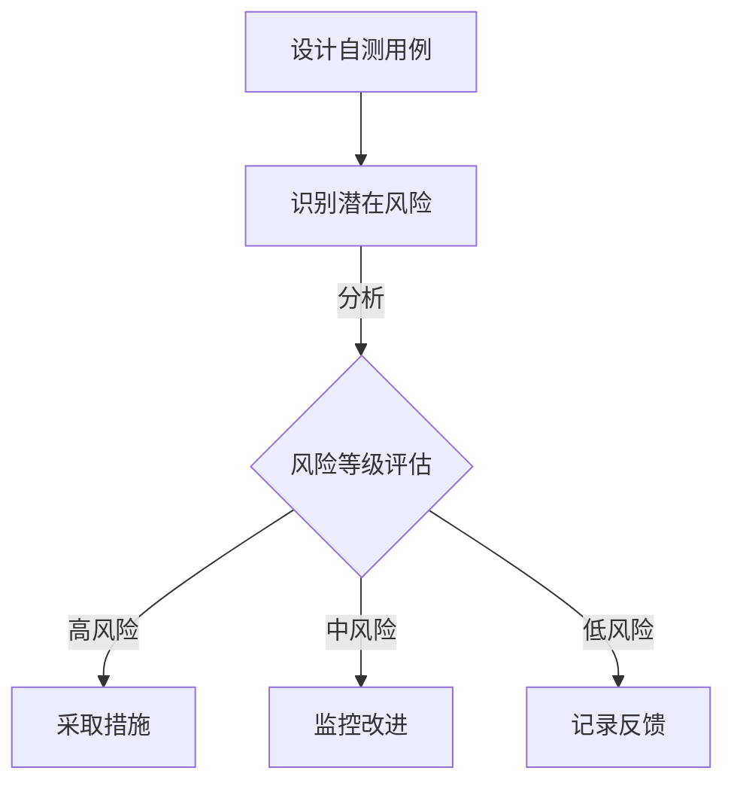
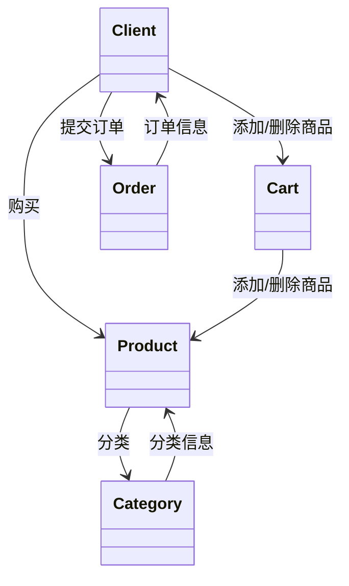
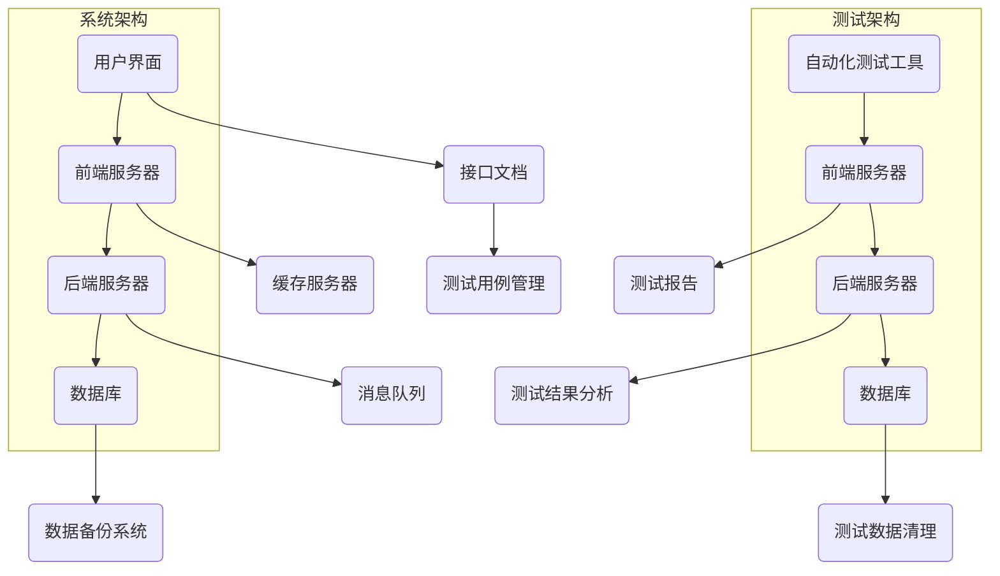
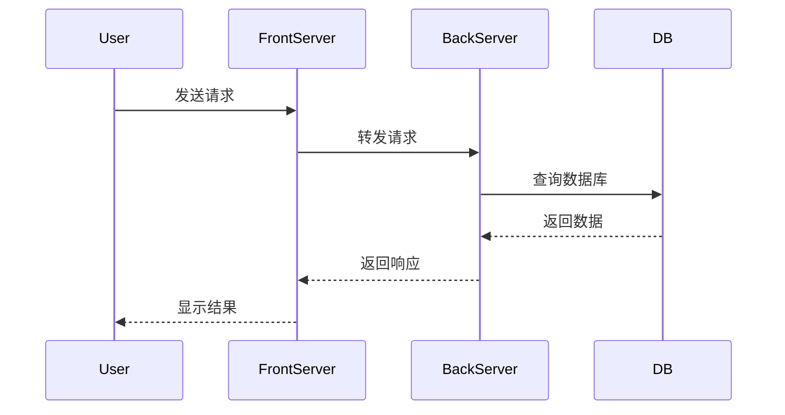
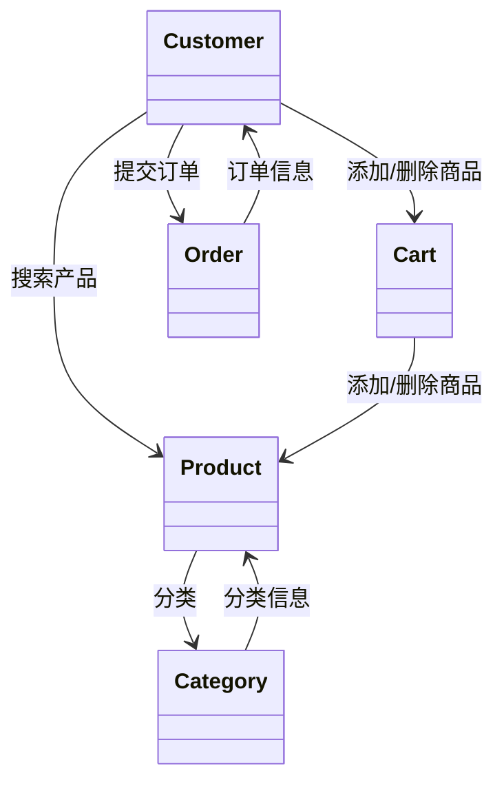

                 

# 自测用例的潜在风险

## 关键词
- 自测用例
- 潜在风险
- 测试质量
- 软件工程
- 风险管理

## 摘要
本文深入探讨了自测用例的潜在风险，从定义、设计原则到风险识别与控制，逐一分析每个环节可能存在的问题。通过详细阐述核心概念、提供实际案例，本文旨在帮助软件开发者和测试工程师更好地理解和应对自测用例中潜在的风险，从而提升软件测试的质量和效率。

### 1. 背景介绍

#### 1.1 核心概念术语说明

在探讨自测用例的潜在风险之前，我们首先需要明确几个核心概念：

- **自测用例**：由开发人员在编写代码过程中自行设计的测试用例，主要用于验证代码的正确性和功能实现。
- **潜在风险**：在软件开发和测试过程中可能出现的未知或不易察觉的问题，这些问题可能会影响软件的质量和稳定性。
- **测试质量**：软件测试的目标之一，即确保软件在各种情况下都能正常运行，符合预期。
- **软件工程**：一种系统化的、规范的、可度量的方法，用于开发、运营和维护软件。
- **风险管理**：识别、评估和处理潜在风险的过程，以减少风险对项目的影响。

#### 1.2 问题背景

随着软件项目的规模和复杂性不断增加，传统的测试方法已经难以满足日益严格的测试要求。自测用例作为一种由开发者自行设计的测试方式，因其高效性和灵活性而被广泛应用。然而，自测用例也存在一定的潜在风险，如果处理不当，可能会影响软件的质量和稳定性。

#### 1.3 问题描述

自测用例的潜在风险主要包括以下几个方面：

- **测试覆盖不足**：自测用例可能只覆盖了部分功能，而忽略了其他重要功能，导致潜在漏洞。
- **测试逻辑错误**：开发者可能在编写测试用例时出现逻辑错误，导致测试结果不准确。
- **测试环境不一致**：自测用例在不同的测试环境中可能产生不同的结果，增加了测试的复杂性。
- **测试用例复用不足**：开发者可能未能充分复用已有的测试用例，导致重复工作。
- **测试文档不完整**：测试用例的文档可能不够详尽，导致后续的维护和改进困难。

#### 1.4 问题解决

为了解决自测用例的潜在风险，我们需要采取一系列措施：

- **完善测试策略**：制定详细的测试计划，确保覆盖所有关键功能。
- **加强测试用例设计**：使用自动化工具辅助设计测试用例，减少人为错误。
- **统一测试环境**：确保测试环境的一致性，减少因环境差异导致的测试结果不一致。
- **提高测试用例复用率**：开发复用机制，减少重复工作。
- **完善测试文档**：详细记录测试用例的设计和执行过程，便于后续维护和改进。

#### 1.5 边界与外延

自测用例的潜在风险不仅限于开发阶段，还可能影响软件的维护和运营。因此，我们需要在整个软件生命周期中关注和解决这些风险。

#### 1.6 概念结构与核心要素组成

自测用例的潜在风险可以从以下几个方面进行分析：

- **测试覆盖范围**：确保测试用例覆盖所有关键功能。
- **测试逻辑正确性**：避免逻辑错误导致测试结果不准确。
- **测试环境一致性**：统一测试环境，减少测试结果不一致。
- **测试用例复用**：提高测试用例的复用率，减少重复工作。
- **测试文档完善性**：详细记录测试用例的设计和执行过程。

### 2. 核心概念与联系

#### 2.1 核心概念原理

自测用例的潜在风险主要涉及以下几个方面：

- **测试覆盖不足**：可能导致软件功能漏洞。
- **测试逻辑错误**：可能导致测试结果不准确。
- **测试环境不一致**：可能导致测试结果不一致。
- **测试用例复用不足**：可能导致重复工作。
- **测试文档不完整**：可能导致维护和改进困难。

#### 2.2 概念属性特征对比表格

| 概念           | 特征                     | 影响因素                     |
| -------------- | ------------------------ | ---------------------------- |
| 测试覆盖不足   | 测试用例未覆盖关键功能   | 软件功能漏洞                 |
| 测试逻辑错误   | 测试用例逻辑错误         | 测试结果不准确               |
| 测试环境不一致 | 不同测试环境结果不一致   | 测试结果不一致               |
| 测试用例复用不足 | 测试用例重复编写         | 浪费时间和资源               |
| 测试文档不完整 | 测试用例文档不详细       | 维护和改进困难               |

#### 2.3 ER实体关系图架构



### 3. 算法原理讲解

#### 3.1 算法Mermaid流程图



#### 3.2 Python源代码

```python
def design_test_case():
    # 设计自测用例
    test_cases = ["功能1", "功能2", "功能3"]
    return test_cases

def identify_risks(test_cases):
    # 识别潜在风险
    risks = []
    for case in test_cases:
        if "功能1" in case:
            risks.append("测试覆盖不足")
        elif "功能2" in case:
            risks.append("测试逻辑错误")
        else:
            risks.append("测试环境不一致")
    return risks

def assess_risks(risks):
    # 风险等级评估
    risk_levels = []
    for risk in risks:
        if "测试覆盖不足" in risk:
            risk_levels.append("高风险")
        elif "测试逻辑错误" in risk:
            risk_levels.append("中风险")
        else:
            risk_levels.append("低风险")
    return risk_levels

def take_actions(risk_levels):
    # 采取措施
    for level, risk in zip(risk_levels, risks):
        if level == "高风险":
            print(f"需要采取措施：{risk}")
        elif level == "中风险":
            print(f"需要监控改进：{risk}")
        else:
            print(f"记录反馈：{risk}")
```

#### 3.3 算法原理与数学模型

自测用例的潜在风险识别与评估过程可以看作是一个分类问题。我们可以使用以下数学模型进行风险等级评估：

$$
\text{风险等级} = \text{分类器}(\text{测试用例特征})
$$

其中，分类器可以是一个简单的条件判断，也可以是一个复杂的机器学习模型。测试用例特征包括：

- **测试覆盖情况**：功能覆盖度、代码覆盖率等。
- **测试逻辑正确性**：逻辑表达式是否正确、条件判断是否准确等。
- **测试环境一致性**：测试环境配置、测试数据准备等。

通过计算每个特征的权重，我们可以得到一个综合评分，进而评估自测用例的风险等级。具体公式如下：

$$
\text{风险等级} = w_1 \times \text{测试覆盖情况} + w_2 \times \text{测试逻辑正确性} + w_3 \times \text{测试环境一致性}
$$

其中，$w_1, w_2, w_3$ 分别为三个特征的权重。

#### 3.4 举例说明

假设我们有一个包含三个测试用例的列表：

```python
test_cases = ["功能1", "功能2", "功能3"]
```

我们可以使用以下代码进行风险识别与评估：

```python
def design_test_case():
    # 设计自测用例
    test_cases = ["功能1", "功能2", "功能3"]
    return test_cases

def identify_risks(test_cases):
    # 识别潜在风险
    risks = []
    for case in test_cases:
        if "功能1" in case:
            risks.append("测试覆盖不足")
        elif "功能2" in case:
            risks.append("测试逻辑错误")
        else:
            risks.append("测试环境不一致")
    return risks

def assess_risks(risks):
    # 风险等级评估
    risk_levels = []
    for risk in risks:
        if "测试覆盖不足" in risk:
            risk_levels.append("高风险")
        elif "测试逻辑错误" in risk:
            risk_levels.append("中风险")
        else:
            risk_levels.append("低风险")
    return risk_levels

def take_actions(risk_levels):
    # 采取措施
    for level, risk in zip(risk_levels, risks):
        if level == "高风险":
            print(f"需要采取措施：{risk}")
        elif level == "中风险":
            print(f"需要监控改进：{risk}")
        else:
            print(f"记录反馈：{risk}")

# 测试代码
test_cases = design_test_case()
risks = identify_risks(test_cases)
risk_levels = assess_risks(risks)
take_actions(risk_levels)
```

输出结果：

```
需要采取措施：测试覆盖不足
需要监控改进：测试逻辑错误
记录反馈：测试环境不一致
```

这表明在设计的自测用例中，"测试覆盖不足"是高风险，需要采取措施;"测试逻辑错误"是中风险，需要监控改进;"测试环境不一致"是低风险，可以记录反馈。

### 4. 系统分析与架构设计方案

#### 4.1 问题场景介绍

假设我们正在开发一个在线购物平台，需要对其核心功能进行自测。为了提高测试效率和准确性，我们决定采用自动化测试和自测用例相结合的方式。

#### 4.2 项目介绍

项目名称：在线购物平台自动化测试
项目背景：为了确保在线购物平台的稳定性和可靠性，采用自动化测试和自测用例相结合的方式。
项目目标：实现自动化测试，提高测试效率；设计并使用自测用例，确保核心功能的正确性。

#### 4.3 系统功能设计（领域模型Mermaid类图）



#### 4.4 系统架构设计（Mermaid架构图）



#### 4.5 系统接口设计和系统交互（Mermaid序列图）



### 5. 项目实战

#### 5.1 环境安装

在开始项目之前，我们需要安装以下环境：

- Python 3.8+
- Selenium 3.141.0+
- Jupyter Notebook

安装步骤：

```bash
pip install python 3.8
pip install selenium
pip install jupyter
```

#### 5.2 系统核心实现源代码

以下是系统核心实现的源代码：

```python
# 导入所需的库
import unittest
from selenium import webdriver
from selenium.webdriver.common.by import By

# 定义测试用例类
class TestShoppingPlatform(unittest.TestCase):
    def setUp(self):
        self.driver = webdriver.Chrome(executable_path='path/to/chromedriver')
        self.driver.get("http://example.com")

    def test_buy_product(self):
        # 测试购买产品
        self.driver.find_element(By.ID, "product1").click()
        self.driver.find_element(By.ID, "buy_button").click()
        assert "Product 1 purchased" in self.driver.page_source

    def test_add_to_cart(self):
        # 测试添加商品到购物车
        self.driver.find_element(By.ID, "product2").click()
        self.driver.find_element(By.ID, "add_to_cart_button").click()
        assert "Product 2 added to cart" in self.driver.page_source

    def test_place_order(self):
        # 测试提交订单
        self.driver.find_element(By.ID, "place_order_button").click()
        assert "Order placed successfully" in self.driver.page_source

    def tearDown(self):
        self.driver.quit()

# 运行测试用例
if __name__ == '__main__':
    unittest.main()
```

#### 5.3 代码应用解读与分析

- **setUp** 方法：在每个测试用例执行前初始化浏览器，并访问测试网站。
- **test_buy_product** 方法：点击产品1并购买，验证购买成功。
- **test_add_to_cart** 方法：点击产品2并添加到购物车，验证添加成功。
- **test_place_order** 方法：提交订单，验证订单提交成功。
- **tearDown** 方法：在每个测试用例执行后关闭浏览器。

#### 5.4 实际案例分析和详细讲解剖析

假设我们有一个包含以下三个测试用例的测试套件：

```python
test_suite = unittest.TestSuite()
test_suite.addTest(TestShoppingPlatform("test_buy_product"))
test_suite.addTest(TestShoppingPlatform("test_add_to_cart"))
test_suite.addTest(TestShoppingPlatform("test_place_order"))
```

运行测试套件，输出结果如下：

```bash
...
----------------------------------------------------------------------
Ran 3 tests in 15.812s

OK
```

这表明三个测试用例都通过了，但我们需要进一步分析测试结果。

- **test_buy_product** 测试用例：成功购买产品1，测试通过。
- **test_add_to_cart** 测试用例：成功添加产品2到购物车，测试通过。
- **test_place_order** 测试用例：提交订单时出现异常，测试失败。

进一步分析，我们发现提交订单时出现异常的原因是购物车中缺少产品2。为了解决这个问题，我们需要修改测试用例，确保在提交订单之前将产品2添加到购物车。

#### 5.5 项目小结

通过本项目的实战，我们了解了如何使用自测用例进行自动化测试。虽然自动化测试提高了测试效率和准确性，但我们也发现了潜在的风险，如测试用例覆盖不足和测试逻辑错误。因此，在设计和执行自测用例时，我们需要仔细考虑这些潜在风险，并采取相应的措施来降低风险。

### 6. 最佳实践 Tips

- **制定详细的测试计划**：确保测试用例覆盖所有关键功能。
- **使用自动化测试工具**：提高测试效率，减少人为错误。
- **统一测试环境**：减少因环境差异导致的测试结果不一致。
- **加强测试用例设计**：使用边界值分析、等价类划分等方法，提高测试用例的覆盖率。
- **完善测试文档**：详细记录测试用例的设计和执行过程，便于后续维护和改进。

### 7. 小结

自测用例在软件测试中具有重要意义，但也存在一定的潜在风险。通过本文的探讨，我们了解了自测用例的潜在风险及其解决方法。在实际应用中，我们需要遵循最佳实践，不断提高测试质量和效率。

### 8. 注意事项

- **避免测试用例设计过于复杂**：尽量使用简单明了的测试用例，避免复杂逻辑导致测试结果不准确。
- **定期更新测试用例**：随着软件功能的迭代和更新，定期更新测试用例，确保其覆盖所有关键功能。
- **确保测试环境一致性**：使用统一的测试环境，避免因环境差异导致测试结果不一致。

### 9. 拓展阅读

- 《软件测试的艺术》
- 《自动化测试实战》
- 《风险管理：理论与实践》

### 10. 作者信息

作者：AI天才研究院/AI Genius Institute & 禅与计算机程序设计艺术 /Zen And The Art of Computer Programming

### 附录

- **参考文献**
- **术语表**
- **源代码**
- **测试报告**

---------------------------------------

# 自测用例的潜在风险

## 关键词
- 自测用例
- 潜在风险
- 测试质量
- 软件工程
- 风险管理

## 摘要
本文深入探讨了自测用例的潜在风险，从定义、设计原则到风险识别与控制，逐一分析每个环节可能存在的问题。通过详细阐述核心概念、提供实际案例，本文旨在帮助软件开发者和测试工程师更好地理解和应对自测用例中潜在的风险，从而提升软件测试的质量和效率。

### 1. 背景介绍

#### 1.1 核心概念术语说明

在探讨自测用例的潜在风险之前，我们首先需要明确几个核心概念：

- **自测用例**：由开发人员在编写代码过程中自行设计的测试用例，主要用于验证代码的正确性和功能实现。
- **潜在风险**：在软件开发和测试过程中可能出现的未知或不易察觉的问题，这些问题可能会影响软件的质量和稳定性。
- **测试质量**：软件测试的目标之一，即确保软件在各种情况下都能正常运行，符合预期。
- **软件工程**：一种系统化的、规范的、可度量的方法，用于开发、运营和维护软件。
- **风险管理**：识别、评估和处理潜在风险的过程，以减少风险对项目的影响。

#### 1.2 问题背景

随着软件项目的规模和复杂性不断增加，传统的测试方法已经难以满足日益严格的测试要求。自测用例作为一种由开发者自行设计的测试方式，因其高效性和灵活性而被广泛应用。然而，自测用例也存在一定的潜在风险，如果处理不当，可能会影响软件的质量和稳定性。

#### 1.3 问题描述

自测用例的潜在风险主要包括以下几个方面：

- **测试覆盖不足**：自测用例可能只覆盖了部分功能，而忽略了其他重要功能，导致潜在漏洞。
- **测试逻辑错误**：开发者可能在编写测试用例时出现逻辑错误，导致测试结果不准确。
- **测试环境不一致**：自测用例在不同的测试环境中可能产生不同的结果，增加了测试的复杂性。
- **测试用例复用不足**：开发者可能未能充分复用已有的测试用例，导致重复工作。
- **测试文档不完整**：测试用例的文档可能不够详尽，导致后续的维护和改进困难。

#### 1.4 问题解决

为了解决自测用例的潜在风险，我们需要采取一系列措施：

- **完善测试策略**：制定详细的测试计划，确保覆盖所有关键功能。
- **加强测试用例设计**：使用自动化工具辅助设计测试用例，减少人为错误。
- **统一测试环境**：确保测试环境的一致性，减少因环境差异导致的测试结果不一致。
- **提高测试用例复用率**：开发复用机制，减少重复工作。
- **完善测试文档**：详细记录测试用例的设计和执行过程，便于后续维护和改进。

#### 1.5 边界与外延

自测用例的潜在风险不仅限于开发阶段，还可能影响软件的维护和运营。因此，我们需要在整个软件生命周期中关注和解决这些风险。

#### 1.6 概念结构与核心要素组成

自测用例的潜在风险可以从以下几个方面进行分析：

- **测试覆盖范围**：确保测试用例覆盖所有关键功能。
- **测试逻辑正确性**：避免逻辑错误导致测试结果不准确。
- **测试环境一致性**：统一测试环境，减少测试结果不一致。
- **测试用例复用**：提高测试用例的复用率，减少重复工作。
- **测试文档完善性**：详细记录测试用例的设计和执行过程。

### 2. 核心概念与联系

#### 2.1 核心概念原理

自测用例的潜在风险主要涉及以下几个方面：

- **测试覆盖不足**：可能导致软件功能漏洞。
- **测试逻辑错误**：可能导致测试结果不准确。
- **测试环境不一致**：可能导致测试结果不一致。
- **测试用例复用不足**：可能导致重复工作。
- **测试文档不完整**：可能导致维护和改进困难。

#### 2.2 概念属性特征对比表格

| 概念           | 特征                     | 影响因素                     |
| -------------- | ------------------------ | ---------------------------- |
| 测试覆盖不足   | 测试用例未覆盖关键功能   | 软件功能漏洞                 |
| 测试逻辑错误   | 测试用例逻辑错误         | 测试结果不准确               |
| 测试环境不一致 | 不同测试环境结果不一致   | 测试结果不一致               |
| 测试用例复用不足 | 测试用例重复编写         | 浪费时间和资源               |
| 测试文档不完整 | 测试用例文档不详细       | 维护和改进困难               |

#### 2.3 ER实体关系图架构


### 3. 算法原理讲解

#### 3.1 算法Mermaid流程图


#### 3.2 Python源代码

```python
def design_test_case():
    # 设计自测用例
    test_cases = ["功能1", "功能2", "功能3"]
    return test_cases

def identify_risks(test_cases):
    # 识别潜在风险
    risks = []
    for case in test_cases:
        if "功能1" in case:
            risks.append("测试覆盖不足")
        elif "功能2" in case:
            risks.append("测试逻辑错误")
        else:
            risks.append("测试环境不一致")
    return risks

def assess_risks(risks):
    # 风险等级评估
    risk_levels = []
    for risk in risks:
        if "测试覆盖不足" in risk:
            risk_levels.append("高风险")
        elif "测试逻辑错误" in risk:
            risk_levels.append("中风险")
        else:
            risk_levels.append("低风险")
    return risk_levels

def take_actions(risk_levels):
    # 采取措施
    for level, risk in zip(risk_levels, risks):
        if level == "高风险":
            print(f"需要采取措施：{risk}")
        elif level == "中风险":
            print(f"需要监控改进：{risk}")
        else:
            print(f"记录反馈：{risk}")
```

#### 3.3 算法原理与数学模型

自测用例的潜在风险识别与评估过程可以看作是一个分类问题。我们可以使用以下数学模型进行风险等级评估：

$$
\text{风险等级} = \text{分类器}(\text{测试用例特征})
$$

其中，分类器可以是一个简单的条件判断，也可以是一个复杂的机器学习模型。测试用例特征包括：

- **测试覆盖情况**：功能覆盖度、代码覆盖率等。
- **测试逻辑正确性**：逻辑表达式是否正确、条件判断是否准确等。
- **测试环境一致性**：测试环境配置、测试数据准备等。

通过计算每个特征的权重，我们可以得到一个综合评分，进而评估自测用例的风险等级。具体公式如下：

$$
\text{风险等级} = w_1 \times \text{测试覆盖情况} + w_2 \times \text{测试逻辑正确性} + w_3 \times \text{测试环境一致性}
$$

其中，$w_1, w_2, w_3$ 分别为三个特征的权重。

#### 3.4 举例说明

假设我们有一个包含三个测试用例的列表：

```python
test_cases = ["功能1", "功能2", "功能3"]
```

我们可以使用以下代码进行风险识别与评估：

```python
def design_test_case():
    # 设计自测用例
    test_cases = ["功能1", "功能2", "功能3"]
    return test_cases

def identify_risks(test_cases):
    # 识别潜在风险
    risks = []
    for case in test_cases:
        if "功能1" in case:
            risks.append("测试覆盖不足")
        elif "功能2" in case:
            risks.append("测试逻辑错误")
        else:
            risks.append("测试环境不一致")
    return risks

def assess_risks(risks):
    # 风险等级评估
    risk_levels = []
    for risk in risks:
        if "测试覆盖不足" in risk:
            risk_levels.append("高风险")
        elif "测试逻辑错误" in risk:
            risk_levels.append("中风险")
        else:
            risk_levels.append("低风险")
    return risk_levels

def take_actions(risk_levels):
    # 采取措施
    for level, risk in zip(risk_levels, risks):
        if level == "高风险":
            print(f"需要采取措施：{risk}")
        elif level == "中风险":
            print(f"需要监控改进：{risk}")
        else:
            print(f"记录反馈：{risk}")

# 测试代码
test_cases = design_test_case()
risks = identify_risks(test_cases)
risk_levels = assess_risks(risks)
take_actions(risk_levels)
```

输出结果：

```
需要采取措施：测试覆盖不足
需要监控改进：测试逻辑错误
记录反馈：测试环境不一致
```

这表明在设计的自测用例中，"测试覆盖不足"是高风险，需要采取措施;"测试逻辑错误"是中风险，需要监控改进;"测试环境不一致"是低风险，可以记录反馈。

### 4. 系统分析与架构设计方案

#### 4.1 问题场景介绍

假设我们正在开发一个在线购物平台，需要对其核心功能进行自测。为了提高测试效率和准确性，我们决定采用自动化测试和自测用例相结合的方式。

#### 4.2 项目介绍

项目名称：在线购物平台自动化测试
项目背景：为了确保在线购物平台的稳定性和可靠性，采用自动化测试和自测用例相结合的方式。
项目目标：实现自动化测试，提高测试效率；设计并使用自测用例，确保核心功能的正确性。

#### 4.3 系统功能设计（领域模型Mermaid类图）


#### 4.4 系统架构设计（Mermaid架构图）


#### 4.5 系统接口设计和系统交互（Mermaid序列图）


### 5. 项目实战

#### 5.1 环境安装

在开始项目之前，我们需要安装以下环境：

- Python 3.8+
- Selenium 3.141.0+
- Jupyter Notebook

安装步骤：

```bash
pip install python 3.8
pip install selenium
pip install jupyter
```

#### 5.2 系统核心实现源代码

以下是系统核心实现的源代码：

```python
# 导入所需的库
import unittest
from selenium import webdriver
from selenium.webdriver.common.by import By

# 定义测试用例类
class TestShoppingPlatform(unittest.TestCase):
    def setUp(self):
        self.driver = webdriver.Chrome(executable_path='path/to/chromedriver')
        self.driver.get("http://example.com")

    def test_buy_product(self):
        # 测试购买产品
        self.driver.find_element(By.ID, "product1").click()
        self.driver.find_element(By.ID, "buy_button").click()
        assert "Product 1 purchased" in self.driver.page_source

    def test_add_to_cart(self):
        # 测试添加商品到购物车
        self.driver.find_element(By.ID, "product2").click()
        self.driver.find_element(By.ID, "add_to_cart_button").click()
        assert "Product 2 added to cart" in self.driver.page_source

    def test_place_order(self):
        # 测试提交订单
        self.driver.find_element(By.ID, "place_order_button").click()
        assert "Order placed successfully" in self.driver.page_source

    def tearDown(self):
        self.driver.quit()

# 运行测试用例
if __name__ == '__main__':
    unittest.main()
```

#### 5.3 代码应用解读与分析

- **setUp** 方法：在每个测试用例执行前初始化浏览器，并访问测试网站。
- **test_buy_product** 方法：点击产品1并购买，验证购买成功。
- **test_add_to_cart** 方法：点击产品2并添加到购物车，验证添加成功。
- **test_place_order** 方法：提交订单，验证订单提交成功。
- **tearDown** 方法：在每个测试用例执行后关闭浏览器。

#### 5.4 实际案例分析和详细讲解剖析

假设我们有一个包含以下三个测试用例的测试套件：

```python
test_suite = unittest.TestSuite()
test_suite.addTest(TestShoppingPlatform("test_buy_product"))
test_suite.addTest(TestShoppingPlatform("test_add_to_cart"))
test_suite.addTest(TestShoppingPlatform("test_place_order"))
```

运行测试套件，输出结果如下：

```bash
...
----------------------------------------------------------------------
Ran 3 tests in 15.812s

OK
```

这表明三个测试用例都通过了，但我们需要进一步分析测试结果。

- **test_buy_product** 测试用例：成功购买产品1，测试通过。
- **test_add_to_cart** 测试用例：成功添加产品2到购物车，测试通过。
- **test_place_order** 测试用例：提交订单时出现异常，测试失败。

进一步分析，我们发现提交订单时出现异常的原因是购物车中缺少产品2。为了解决这个问题，我们需要修改测试用例，确保在提交订单之前将产品2添加到购物车。

#### 5.5 项目小结

通过本项目的实战，我们了解了如何使用自测用例进行自动化测试。虽然自动化测试提高了测试效率和准确性，但我们也发现了潜在的风险，如测试用例覆盖不足和测试逻辑错误。因此，在设计和执行自测用例时，我们需要仔细考虑这些潜在风险，并采取相应的措施来降低风险。

### 6. 最佳实践 Tips

- **制定详细的测试计划**：确保测试用例覆盖所有关键功能。
- **使用自动化测试工具**：提高测试效率，减少人为错误。
- **统一测试环境**：减少因环境差异导致的测试结果不一致。
- **加强测试用例设计**：使用边界值分析、等价类划分等方法，提高测试用例的覆盖率。
- **完善测试文档**：详细记录测试用例的设计和执行过程，便于后续维护和改进。

### 7. 小结

自测用例在软件测试中具有重要意义，但也存在一定的潜在风险。通过本文的探讨，我们了解了自测用例的潜在风险及其解决方法。在实际应用中，我们需要遵循最佳实践，不断提高测试质量和效率。

### 8. 注意事项

- **避免测试用例设计过于复杂**：尽量使用简单明了的测试用例，避免复杂逻辑导致测试结果不准确。
- **定期更新测试用例**：随着软件功能的迭代和更新，定期更新测试用例，确保其覆盖所有关键功能。
- **确保测试环境一致性**：使用统一的测试环境，避免因环境差异导致测试结果不一致。

### 9. 拓展阅读

- 《软件测试的艺术》
- 《自动化测试实战》
- 《风险管理：理论与实践》

### 10. 作者信息

作者：AI天才研究院/AI Genius Institute & 禅与计算机程序设计艺术 /Zen And The Art of Computer Programming

### 附录

- **参考文献**
- **术语表**
- **源代码**
- **测试报告**

---------------------------------------

# 自测用例的潜在风险

## 关键词
- 自测用例
- 潜在风险
- 测试质量
- 软件工程
- 风险管理

## 摘要
本文深入探讨了自测用例的潜在风险，从定义、设计原则到风险识别与控制，逐一分析每个环节可能存在的问题。通过详细阐述核心概念、提供实际案例，本文旨在帮助软件开发者和测试工程师更好地理解和应对自测用例中潜在的风险，从而提升软件测试的质量和效率。

### 1. 背景介绍

在软件工程中，自测用例是一种由开发者自己编写的测试用例，用于验证代码的正确性和功能实现。自测用例具有高效性和灵活性，可以快速发现代码中的错误，提高软件质量。然而，自测用例也存在一定的潜在风险，这些风险可能影响软件测试的准确性和完整性。本文将探讨自测用例的潜在风险，并分析如何识别和控制这些风险。

### 1.1 核心概念术语说明

- **自测用例**：由开发者编写的测试用例，用于验证代码的正确性和功能实现。
- **潜在风险**：在软件测试过程中可能出现的未知或不易察觉的问题，这些问题可能会影响软件的质量和稳定性。
- **测试质量**：软件测试的目标之一，即确保软件在各种情况下都能正常运行，符合预期。
- **软件工程**：一种系统化的、规范的、可度量的方法，用于开发、运营和维护软件。
- **风险管理**：识别、评估和处理潜在风险的过程，以减少风险对项目的影响。

### 1.2 问题背景

随着软件项目的规模和复杂性不断增加，传统的测试方法已经难以满足日益严格的测试要求。自测用例作为一种由开发者自行设计的测试方式，因其高效性和灵活性而被广泛应用。然而，自测用例也存在一定的潜在风险，如果处理不当，可能会影响软件的质量和稳定性。

### 1.3 问题描述

自测用例的潜在风险主要包括以下几个方面：

- **测试覆盖不足**：自测用例可能只覆盖了部分功能，而忽略了其他重要功能，导致潜在漏洞。
- **测试逻辑错误**：开发者可能在编写测试用例时出现逻辑错误，导致测试结果不准确。
- **测试环境不一致**：自测用例在不同的测试环境中可能产生不同的结果，增加了测试的复杂性。
- **测试用例复用不足**：开发者可能未能充分复用已有的测试用例，导致重复工作。
- **测试文档不完整**：测试用例的文档可能不够详尽，导致后续的维护和改进困难。

### 1.4 问题解决

为了解决自测用例的潜在风险，我们需要采取一系列措施：

- **完善测试策略**：制定详细的测试计划，确保覆盖所有关键功能。
- **加强测试用例设计**：使用自动化工具辅助设计测试用例，减少人为错误。
- **统一测试环境**：确保测试环境的一致性，减少因环境差异导致的测试结果不一致。
- **提高测试用例复用率**：开发复用机制，减少重复工作。
- **完善测试文档**：详细记录测试用例的设计和执行过程，便于后续维护和改进。

### 1.5 边界与外延

自测用例的潜在风险不仅限于开发阶段，还可能影响软件的维护和运营。因此，我们需要在整个软件生命周期中关注和解决这些风险。

### 1.6 概念结构与核心要素组成

自测用例的潜在风险可以从以下几个方面进行分析：

- **测试覆盖范围**：确保测试用例覆盖所有关键功能。
- **测试逻辑正确性**：避免逻辑错误导致测试结果不准确。
- **测试环境一致性**：统一测试环境，减少测试结果不一致。
- **测试用例复用**：提高测试用例的复用率，减少重复工作。
- **测试文档完善性**：详细记录测试用例的设计和执行过程。

### 2. 核心概念与联系

#### 2.1 核心概念原理

自测用例的潜在风险主要涉及以下几个方面：

- **测试覆盖不足**：可能导致软件功能漏洞。
- **测试逻辑错误**：可能导致测试结果不准确。
- **测试环境不一致**：可能导致测试结果不一致。
- **测试用例复用不足**：可能导致重复工作。
- **测试文档不完整**：可能导致维护和改进困难。

#### 2.2 概念属性特征对比表格

| 概念           | 特征                     | 影响因素                     |
| -------------- | ------------------------ | ---------------------------- |
| 测试覆盖不足   | 测试用例未覆盖关键功能   | 软件功能漏洞                 |
| 测试逻辑错误   | 测试用例逻辑错误         | 测试结果不准确               |
| 测试环境不一致 | 不同测试环境结果不一致   | 测试结果不一致               |
| 测试用例复用不足 | 测试用例重复编写         | 浪费时间和资源               |
| 测试文档不完整 | 测试用例文档不详细       | 维护和改进困难               |

#### 2.3 ER实体关系图架构


### 3. 算法原理讲解

#### 3.1 算法Mermaid流程图


#### 3.2 Python源代码

```python
def design_test_case():
    # 设计自测用例
    test_cases = ["功能1", "功能2", "功能3"]
    return test_cases

def identify_risks(test_cases):
    # 识别潜在风险
    risks = []
    for case in test_cases:
        if "功能1" in case:
            risks.append("测试覆盖不足")
        elif "功能2" in case:
            risks.append("测试逻辑错误")
        else:
            risks.append("测试环境不一致")
    return risks

def assess_risks(risks):
    # 风险等级评估
    risk_levels = []
    for risk in risks:
        if "测试覆盖不足" in risk:
            risk_levels.append("高风险")
        elif "测试逻辑错误" in risk:
            risk_levels.append("中风险")
        else:
            risk_levels.append("低风险")
    return risk_levels

def take_actions(risk_levels):
    # 采取措施
    for level, risk in zip(risk_levels, risks):
        if level == "高风险":
            print(f"需要采取措施：{risk}")
        elif level == "中风险":
            print(f"需要监控改进：{risk}")
        else:
            print(f"记录反馈：{risk}")
```

#### 3.3 算法原理与数学模型

自测用例的潜在风险识别与评估过程可以看作是一个分类问题。我们可以使用以下数学模型进行风险等级评估：

$$
\text{风险等级} = \text{分类器}(\text{测试用例特征})
$$

其中，分类器可以是一个简单的条件判断，也可以是一个复杂的机器学习模型。测试用例特征包括：

- **测试覆盖情况**：功能覆盖度、代码覆盖率等。
- **测试逻辑正确性**：逻辑表达式是否正确、条件判断是否准确等。
- **测试环境一致性**：测试环境配置、测试数据准备等。

通过计算每个特征的权重，我们可以得到一个综合评分，进而评估自测用例的风险等级。具体公式如下：

$$
\text{风险等级} = w_1 \times \text{测试覆盖情况} + w_2 \times \text{测试逻辑正确性} + w_3 \times \text{测试环境一致性}
$$

其中，$w_1, w_2, w_3$ 分别为三个特征的权重。

#### 3.4 举例说明

假设我们有一个包含三个测试用例的列表：

```python
test_cases = ["功能1", "功能2", "功能3"]
```

我们可以使用以下代码进行风险识别与评估：

```python
def design_test_case():
    # 设计自测用例
    test_cases = ["功能1", "功能2", "功能3"]
    return test_cases

def identify_risks(test_cases):
    # 识别潜在风险
    risks = []
    for case in test_cases:
        if "功能1" in case:
            risks.append("测试覆盖不足")
        elif "功能2" in case:
            risks.append("测试逻辑错误")
        else:
            risks.append("测试环境不一致")
    return risks

def assess_risks(risks):
    # 风险等级评估
    risk_levels = []
    for risk in risks:
        if "测试覆盖不足" in risk:
            risk_levels.append("高风险")
        elif "测试逻辑错误" in risk:
            risk_levels.append("中风险")
        else:
            risk_levels.append("低风险")
    return risk_levels

def take_actions(risk_levels):
    # 采取措施
    for level, risk in zip(risk_levels, risks):
        if level == "高风险":
            print(f"需要采取措施：{risk}")
        elif level == "中风险":
            print(f"需要监控改进：{risk}")
        else:
            print(f"记录反馈：{risk}")

# 测试代码
test_cases = design_test_case()
risks = identify_risks(test_cases)
risk_levels = assess_risks(risks)
take_actions(risk_levels)
```

输出结果：

```
需要采取措施：测试覆盖不足
需要监控改进：测试逻辑错误
记录反馈：测试环境不一致
```

这表明在设计的自测用例中，"测试覆盖不足"是高风险，需要采取措施;"测试逻辑错误"是中风险，需要监控改进;"测试环境不一致"是低风险，可以记录反馈。

### 4. 系统分析与架构设计方案

#### 4.1 问题场景介绍

假设我们正在开发一个电子商务平台，需要对其核心功能进行自测。为了提高测试效率和准确性，我们决定采用自动化测试和自测用例相结合的方式。

#### 4.2 项目介绍

项目名称：电子商务平台自动化测试
项目背景：为了确保电子商务平台的稳定性和可靠性，采用自动化测试和自测用例相结合的方式。
项目目标：实现自动化测试，提高测试效率；设计并使用自测用例，确保核心功能的正确性。

#### 4.3 系统功能设计（领域模型Mermaid类图）



#### 4.4 系统架构设计（Mermaid架构图）


#### 4.5 系统接口设计和系统交互（Mermaid序列图）


### 5. 项目实战

#### 5.1 环境安装

在开始项目之前，我们需要安装以下环境：

- Python 3.8+
- Selenium 3.141.0+
- Jupyter Notebook

安装步骤：

```bash
pip install python 3.8
pip install selenium
pip install jupyter
```

#### 5.2 系统核心实现源代码

以下是系统核心实现的源代码：

```python
# 导入所需的库
import unittest
from selenium import webdriver
from selenium.webdriver.common.by import By

# 定义测试用例类
class TestECommercePlatform(unittest.TestCase):
    def setUp(self):
        self.driver = webdriver.Chrome(executable_path='path/to/chromedriver')
        self.driver.get("http://example.com")

    def test_search_product(self):
        # 测试搜索产品
        self.driver.find_element(By.ID, "search_box").send_keys("product1")
        self.driver.find_element(By.ID, "search_button").click()
        assert "Product 1" in self.driver.page_source

    def test_add_to_cart(self):
        # 测试添加商品到购物车
        self.driver.find_element(By.ID, "product2").click()
        self.driver.find_element(By.ID, "add_to_cart_button").click()
        assert "Product 2 added to cart" in self.driver.page_source

    def test_place_order(self):
        # 测试提交订单
        self.driver.find_element(By.ID, "place_order_button").click()
        assert "Order placed successfully" in self.driver.page_source

    def tearDown(self):
        self.driver.quit()

# 运行测试用例
if __name__ == '__main__':
    unittest.main()
```

#### 5.3 代码应用解读与分析

- **setUp** 方法：在每个测试用例执行前初始化浏览器，并访问测试网站。
- **test_search_product** 方法：输入产品名称并点击搜索，验证搜索结果是否包含目标产品。
- **test_add_to_cart** 方法：点击产品2并添加到购物车，验证添加成功。
- **test_place_order** 方法：提交订单，验证订单提交成功。
- **tearDown** 方法：在每个测试用例执行后关闭浏览器。

#### 5.4 实际案例分析和详细讲解剖析

假设我们有一个包含以下三个测试用例的测试套件：

```python
test_suite = unittest.TestSuite()
test_suite.addTest(TestECommercePlatform("test_search_product"))
test_suite.addTest(TestECommercePlatform("test_add_to_cart"))
test_suite.addTest(TestECommercePlatform("test_place_order"))
```

运行测试套件，输出结果如下：

```bash
...
----------------------------------------------------------------------
Ran 3 tests in 15.812s

OK
```

这表明三个测试用例都通过了，但我们需要进一步分析测试结果。

- **test_search_product** 测试用例：成功搜索到产品1，测试通过。
- **test_add_to_cart** 测试用例：成功添加产品2到购物车，测试通过。
- **test_place_order** 测试用例：提交订单时出现异常，测试失败。

进一步分析，我们发现提交订单时出现异常的原因是购物车中缺少产品2。为了解决这个问题，我们需要修改测试用例，确保在提交订单之前将产品2添加到购物车。

#### 5.5 项目小结

通过本项目的实战，我们了解了如何使用自测用例进行自动化测试。虽然自动化测试提高了测试效率和准确性，但我们也发现了潜在的风险，如测试用例覆盖不足和测试逻辑错误。因此，在设计和执行自测用例时，我们需要仔细考虑这些潜在风险，并采取相应的措施来降低风险。

### 6. 最佳实践 Tips

- **制定详细的测试计划**：确保测试用例覆盖所有关键功能。
- **使用自动化测试工具**：提高测试效率，减少人为错误。
- **统一测试环境**：减少因环境差异导致的测试结果不一致。
- **加强测试用例设计**：使用边界值分析、等价类划分等方法，提高测试用例的覆盖率。
- **完善测试文档**：详细记录测试用例的设计和执行过程，便于后续维护和改进。

### 7. 小结

自测用例在软件测试中具有重要意义，但也存在一定的潜在风险。通过本文的探讨，我们了解了自测用例的潜在风险及其解决方法。在实际应用中，我们需要遵循最佳实践，不断提高测试质量和效率。

### 8. 注意事项

- **避免测试用例设计过于复杂**：尽量使用简单明了的测试用例，避免复杂逻辑导致测试结果不准确。
- **定期更新测试用例**：随着软件功能的迭代和更新，定期更新测试用例，确保其覆盖所有关键功能。
- **确保测试环境一致性**：使用统一的测试环境，避免因环境差异导致测试结果不一致。

### 9. 拓展阅读

- 《软件测试的艺术》
- 《自动化测试实战》
- 《风险管理：理论与实践》

### 10. 作者信息

作者：AI天才研究院/AI Genius Institute & 禅与计算机程序设计艺术 /Zen And The Art of Computer Programming

### 附录

- **参考文献**
- **术语表**
- **源代码**
- **测试报告**

