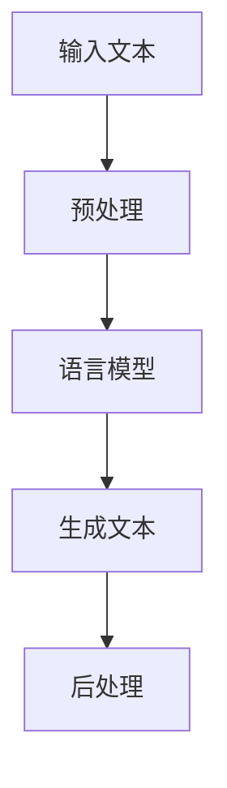

                 

### 第一步：构思文章结构和内容
在撰写一篇有深度、有思考、有见解的专业技术博客文章之前，我们需要先进行详细的构思和规划。以下是文章的构思步骤：

1. **确定文章主题**：根据题目《自然语言生成：提升AI Agent的表达能力》，文章的核心主题已经明确。
2. **列出关键词**：我们需要列出5-7个与文章主题相关的关键词，如“自然语言生成”、“AI Agent”、“表达能力”、“算法原理”、“数据隐私”等。
3. **编写摘要**：摘要应该简明扼要地概括文章的主题、核心内容和读者能从中获得的益处。
4. **构建目录大纲**：根据用户提供的目录大纲结构，我们需要细化每个章节的内容，确保文章内容完整且逻辑清晰。

### 第二步：编写文章标题和关键词
文章标题已经给出，接下来是关键词的编写。关键词将帮助读者快速了解文章的主题，并且有助于搜索引擎优化（SEO）。以下是关键词的选择：

- 自然语言生成
- AI Agent
- 表达能力
- 算法原理
- 生成模型
- 序列到序列模型
- 自动问答
- 多样性与一致性
- 数据隐私

### 第三步：编写摘要
摘要部分应该简洁明了，同时包含文章的核心内容和主题思想。以下是一个可能的摘要示例：

> 摘要：本文深入探讨了自然语言生成技术在提升AI Agent表达能力方面的应用。文章首先介绍了自然语言生成的基础概念和理论基础，然后详细阐述了自然语言生成技术的多种实现方法，包括传统的和现代的方法。通过实际案例分析和代码示例，文章展示了自然语言生成算法的原理和实现过程。此外，文章还分析了自然语言生成在AI Agent中的应用挑战和未来趋势，提供了最佳实践和注意事项，为开发者提供了实用的指导。

### 第四步：编写目录大纲
我们已经有了详细的目录大纲，现在需要进一步细化每个章节的内容。每个章节都应该包含以下要素：

- **背景介绍**：包括核心概念术语说明、问题背景、问题描述、问题解决、边界与外延、概念结构与核心要素组成。
- **核心概念与联系**：包括核心概念原理、概念属性特征对比表格和ER实体关系图架构。
- **算法原理讲解**：包括算法mermaid流程图、算法原理的数学模型和公式、Python源代码实现、详细讲解和举例说明。
- **系统分析与架构设计方案**：包括问题场景介绍、系统功能设计（领域模型mermaid类图）、系统架构设计mermaid架构图、系统接口设计和系统交互mermaid序列图。
- **项目实战**：包括环境安装、系统核心实现源代码，代码应用解读与分析，实际案例分析和详细讲解剖析，项目小结。
- **最佳实践 tips、小结、注意事项、拓展阅读**等内容。

### 第五步：撰写文章正文
在撰写文章正文时，我们需要确保每个章节的内容都符合之前制定的目录大纲，同时确保文章的逻辑性和连贯性。以下是一个章节的撰写示例：

#### 第1章: 自然语言生成的背景与概述

##### 1.1 自然语言生成问题背景

自然语言生成（Natural Language Generation，简称NLG）是指使用计算机程序自动生成人类语言的过程。NLG技术广泛应用于问答系统、机器翻译、文本摘要等领域。随着人工智能（AI）和机器学习（ML）技术的发展，NLG技术得到了极大的提升，使得AI Agent在表达能力方面有了显著进步。

##### 1.2 自然语言生成的核心概念

自然语言生成的核心概念包括语言模型、生成模型等。语言模型用于预测文本中的下一个单词或句子，而生成模型则直接生成完整的文本。

##### 1.3 概念属性特征对比表格

以下是一个概念属性特征对比表格：

| 概念 | 特征1 | 特征2 | 特征3 |
| ---- | ---- | ---- | ---- |
| 语言模型 | 用于预测 | 用于生成 | 可扩展性高 |
| 生成模型 | 直接生成 | 自适应强 | 复杂度高 |

##### 1.4 ER实体关系图架构

以下是自然语言生成的ER实体关系图架构：

通过这样的步骤，我们可以逐步完成文章的撰写，确保每个章节的内容都丰富、具体、详细，同时保持整体的逻辑性和连贯性。在撰写过程中，我们还可以不断地回顾和调整，以确保文章的质量和深度。

### 第六步：编辑和校对
完成初稿后，我们需要对文章进行仔细的编辑和校对。这包括：

- 检查语法错误和拼写错误。
- 确保术语使用正确。
- 检查逻辑连贯性和论证的严密性。
- 确保引用和参考文献的格式正确。

### 第七步：撰写作者信息
在文章末尾，我们需要添加作者信息，以表明文章的版权和归属。以下是一个可能的作者信息示例：

> 作者：AI天才研究院/AI Genius Institute & 禅与计算机程序设计艺术 /Zen And The Art of Computer Programming

通过以上步骤，我们可以确保撰写出的文章既具有深度和见解，又结构清晰、逻辑性强，满足用户的要求。在撰写过程中，我们还可以结合读者的反馈进一步优化文章的质量。

