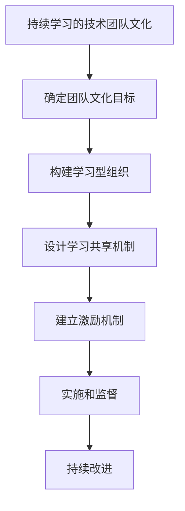
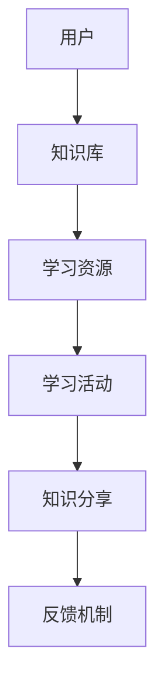
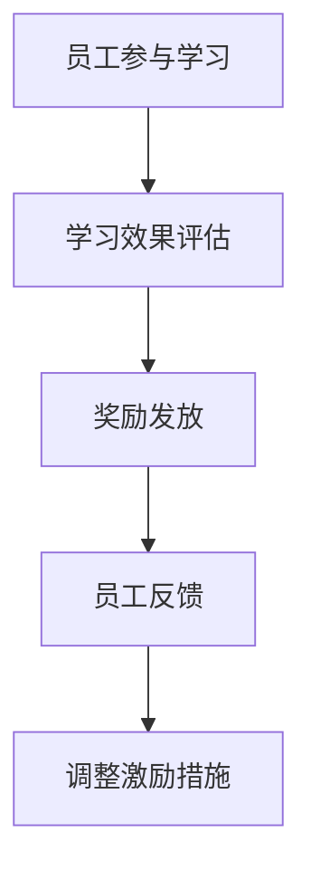

                 


## 《营造持续学习的技术团队文化》

### 关键词：持续学习、技术团队文化、学习型组织、激励机制、案例分析

### 摘要：

本文旨在探讨如何营造一种能够促进技术团队持续学习的文化。通过介绍持续学习的重要性，分析技术团队文化构建的步骤和方法，结合实际案例研究，提供最佳实践和策略，帮助团队领导者和成员提升团队的整体竞争力。文章结构紧凑，逻辑清晰，旨在为技术团队的文化建设提供实用的指导。

----------------------------------------------------------------

### 引言

#### 1.1 书籍背景

在当今快速发展的技术领域，技术团队面临着前所未有的挑战。新兴技术层出不穷，市场需求快速变化，这对团队的能力和适应性提出了高要求。为了应对这些挑战，持续学习成为了技术团队不可或缺的一部分。然而，如何营造一个支持持续学习的团队文化，却是一个复杂且具有挑战性的问题。

#### 1.1.1 当前技术团队面临的挑战

- **技术快速迭代**：新技术的不断涌现要求团队成员必须保持持续学习，才能跟上行业的发展。
- **竞争加剧**：技术竞争的加剧，使得企业必须通过不断提升技术能力来保持竞争力。
- **人才流失**：缺乏持续学习的机会和动力可能导致人才流失，影响团队的稳定性和效率。

#### 1.1.2 持续学习的重要性

- **提升团队技能**：通过持续学习，团队成员可以不断掌握新的技术，提升团队的技能水平。
- **增强团队凝聚力**：共同的学习目标和经历可以增强团队成员之间的凝聚力。
- **提高创新能力**：持续学习激发了团队成员的创造力，有助于推动技术创新。

#### 1.2 书籍结构

本书将分为四个主要部分：

1. **第一部分**：探讨持续学习的技术团队文化构建的重要性，以及构建的基本原则。
2. **第二部分**：介绍实践方法，包括学习型组织的建立、学习共享机制的构建和学习激励机制的实施方案。
3. **第三部分**：通过案例分析，提供成功实践的具体示例。
4. **第四部分**：总结最佳实践，并提供改进策略。

----------------------------------------------------------------

### 第一部分：持续学习的技术团队文化构建

#### 2.1 团队文化的重要性

#### 2.1.1 团队文化的定义与特征

团队文化是指团队中共同遵循的价值观念、行为规范和工作习惯。它具有以下几个特征：

- **共享性**：团队成员共同认可和接受的文化价值观。
- **稳定性**：团队文化在一段时间内保持相对稳定，不易受到外部因素的影响。
- **动态性**：团队文化会随着团队环境的变化而发展和变化。

#### 2.1.2 团队文化与持续学习的关系

- **促进学习**：团队文化可以激发团队成员的学习动机，提供学习的环境和支持。
- **提高效率**：共同的文化价值观和行为规范可以减少沟通成本，提高团队工作效率。
- **增强凝聚力**：团队文化可以增强团队成员之间的信任和合作，提升团队的凝聚力。

#### 2.2 持续学习的概念与原则

#### 2.2.1 持续学习的定义

持续学习是指个体或组织在不断变化的环境中，通过不断学习和适应，提升自身能力的过程。

#### 2.2.2 持续学习的基本原则

- **自我驱动**：持续学习需要个体具有强烈的自我驱动力，主动寻求学习机会。
- **开放性**：持续学习要求个体具有开放的心态，愿意接受新知识和新观点。
- **系统性**：持续学习需要建立系统的学习方法和体系，确保学习的连续性和系统性。
- **实践性**：持续学习需要将学习成果应用到实际工作中，通过实践来验证和深化学习。

#### 2.2.3 持续学习的目标

- **提升个人技能**：通过持续学习，提高个人的专业技能和综合素质。
- **促进团队进步**：通过持续学习，提升团队的整体能力和竞争力。
- **推动技术创新**：通过持续学习，激发团队的创造力，推动技术创新和发展。

#### 2.3 构建持续学习的团队文化

#### 2.3.1 团队领导的角色

- **树立榜样**：团队领导应通过自身的行动，树立持续学习的榜样，激发团队成员的学习热情。
- **提供支持**：团队领导应提供必要的学习资源和时间，为团队成员的学习提供支持。
- **营造氛围**：团队领导应营造一种积极的学习氛围，鼓励团队成员分享学习心得和经验。

#### 2.3.2 团队成员的角色

- **积极参与**：团队成员应积极参与学习活动，主动分享自己的学习经验和成果。
- **相互支持**：团队成员应相互支持，共同进步，形成良好的学习氛围。
- **持续反思**：团队成员应不断反思自己的学习过程，总结经验教训，持续改进。

#### 2.3.3 组织环境的支持

- **培训计划**：组织应制定系统的培训计划，为团队成员提供多样化的学习机会。
- **资源保障**：组织应提供充足的资源，包括时间、资金和技术支持，保障学习活动的开展。
- **激励机制**：组织应建立有效的激励机制，鼓励团队成员积极参与学习活动，并对优秀的学习成果进行表彰。

----------------------------------------------------------------

### 第二部分：实践方法

#### 3.1 学习型组织的建立

#### 3.1.1 学习型组织的概念

学习型组织是指一个能够持续学习和自我适应的组织，其核心在于通过不断的学习和创新，提升组织的整体能力和竞争力。

#### 3.1.2 学习型组织的特点

- **共同愿景**：学习型组织拥有共同的目标和愿景，所有成员都认同并为之努力。
- **团队能力**：学习型组织注重团队建设，提升团队的整体能力。
- **持续学习**：学习型组织鼓励成员持续学习，不断更新知识和技能。
- **系统思考**：学习型组织采用系统思考的方法，从整体角度分析和解决问题。

#### 3.1.3 学习型组织的建设步骤

1. **建立共同愿景**：明确组织的长远目标和愿景，确保所有成员都认同并为之努力。
2. **创建学习机制**：建立系统的学习机制，包括学习计划、学习资源和学习分享平台。
3. **培养团队精神**：通过团队活动和学习，培养团队成员之间的信任和合作。
4. **持续改进**：不断反思和改进学习方法和过程，确保学习效果的持续提升。

#### 3.2 学习共享机制的构建

#### 3.2.1 学习共享机制的重要性

学习共享机制是指组织内部成员之间共享学习资源、经验和知识的一种机制，其重要性体现在以下几个方面：

- **提升学习效果**：通过共享，成员可以获取更多的学习资源，提高学习效率。
- **增强团队凝聚力**：共享过程有助于成员之间的沟通和协作，增强团队凝聚力。
- **促进知识创新**：共享知识可以激发成员的创造力，推动知识创新。

#### 3.2.2 学习共享机制的设计

1. **知识共享平台**：建立知识共享平台，提供便捷的知识获取和分享渠道。
2. **激励机制**：建立激励机制，鼓励成员积极参与知识共享活动。
3. **共享流程**：制定共享流程，确保知识共享的有序和高效。

#### 3.2.3 学习共享机制的运作

1. **知识获取**：成员通过平台获取所需的学习资源和知识。
2. **知识分享**：成员将自己的学习经验和成果分享到平台上。
3. **知识更新**：定期更新平台上的知识资源，确保知识的时效性和准确性。

#### 3.3 学习激励机制的实施

#### 3.3.1 学习激励机制的构建

学习激励机制是指组织通过奖励和表彰，激励成员积极参与学习活动，提升学习效果的一种机制。其构建包括以下几个方面：

- **奖励制度**：建立奖励制度，明确奖励的对象、标准和流程。
- **表彰制度**：建立表彰制度，对表现突出的成员进行表彰和奖励。
- **反馈机制**：建立反馈机制，及时收集成员对激励机制的反馈，进行持续改进。

#### 3.3.2 激励机制的多样化

1. **物质激励**：提供奖金、晋升机会等物质奖励。
2. **精神激励**：通过表彰、荣誉等精神奖励，激发成员的学习热情。
3. **自我激励**：鼓励成员自我激励，通过设定学习目标和自我评价，提升学习效果。

#### 3.3.3 激励机制的反馈与调整

1. **反馈机制**：定期收集成员对激励机制的反馈，了解其效果和存在的问题。
2. **调整策略**：根据反馈结果，调整激励机制的设置和实施策略。
3. **持续改进**：持续关注激励机制的实施效果，不断优化和完善。

----------------------------------------------------------------

### 第三部分：案例分析

#### 4.1 案例研究1：Google的持续学习文化

#### 4.1.1 案例背景

Google 是一家全球知名的技术公司，以其创新的文化和持续学习的精神著称。Google 通过一系列的措施，营造了一种支持持续学习的文化，成为业界学习的榜样。

#### 4.1.2 持续学习文化的内容

- **培训计划**：Google 提供丰富的培训资源，包括在线课程、工作坊和内部培训，鼓励员工不断学习和提升技能。
- **知识共享**：Google 建立了内部知识共享平台，员工可以随时分享自己的经验和知识。
- **创新环境**：Google 鼓励员工尝试新的想法和项目，提供必要的资源和支持，激发创新精神。

#### 4.1.3 案例启示

- **提供学习资源**：组织应提供丰富的学习资源，鼓励员工不断学习和提升技能。
- **营造知识共享氛围**：组织应营造一种知识共享的氛围，鼓励员工分享知识和经验。
- **支持创新**：组织应支持员工尝试新的想法和项目，提供必要的资源和支持，激发创新精神。

#### 4.2 案例研究2：微软的技术团队发展

#### 4.2.1 案例背景

微软是一家全球领先的技术公司，其技术团队在多年的发展中，形成了一套独特的持续学习机制，推动了公司的技术创新和业务发展。

#### 4.2.2 技术团队发展的关键因素

- **培训体系**：微软建立了完善的培训体系，包括内部培训、外部培训和在线学习，为员工提供多样化的学习机会。
- **知识管理**：微软注重知识管理，建立了知识共享平台，确保知识的有效传递和利用。
- **激励机制**：微软通过奖励和表彰，激励员工积极参与学习和创新。

#### 4.2.3 案例启示

- **建立培训体系**：组织应建立完善的培训体系，为员工提供多样化的学习机会。
- **加强知识管理**：组织应注重知识管理，确保知识的有效传递和利用。
- **激励员工参与**：组织应通过激励措施，鼓励员工积极参与学习和创新。

----------------------------------------------------------------

### 第四部分：最佳实践

#### 5.1 团队文化建设中的常见问题与解决策略

#### 5.1.1 团队成员的参与度不高

**问题原因**：缺乏学习动力、学习资源不足、激励机制不完善。

**解决策略**：

- **提高学习动力**：明确学习目标，激发成员的学习兴趣和热情。
- **提供学习资源**：确保学习资源的充足，包括时间、资金和技术支持。
- **完善激励机制**：建立有效的激励机制，鼓励成员积极参与学习。

#### 5.1.2 学习资源的不足

**问题原因**：预算限制、资源分散、信息不对称。

**解决策略**：

- **优化资源分配**：合理分配学习资源，确保每个成员都能获得所需的学习支持。
- **建立共享平台**：建立共享平台，集中管理和共享学习资源。
- **拓宽资源获取渠道**：通过合作、购买、共享等方式，拓宽学习资源的获取渠道。

#### 5.1.3 激励机制的失效

**问题原因**：奖励制度不合理、反馈不及时、员工不满。

**解决策略**：

- **完善奖励制度**：制定合理的奖励制度，确保奖励的公平性和透明度。
- **及时反馈**：建立及时反馈机制，及时了解员工的学习情况和需求，提供必要的支持和帮助。
- **改善沟通环境**：改善沟通环境，增强员工的满意度和归属感。

#### 5.2 团队持续学习文化的评估与改进

#### 5.2.1 评估指标的设计

评估指标应涵盖以下几个方面：

- **学习参与度**：成员参与学习活动的比例和积极性。
- **学习效果**：学习成果的应用和转化情况。
- **团队凝聚力**：团队成员之间的信任和合作程度。
- **创新能力**：团队在技术创新和业务发展方面的表现。

#### 5.2.2 改进策略的实施

- **持续收集反馈**：定期收集员工的反馈，了解学习活动的效果和存在的问题。
- **调整激励机制**：根据反馈结果，调整激励机制的设置和实施策略。
- **加强团队建设**：通过团队活动和学习，增强团队成员之间的信任和合作。

#### 5.2.3 持续改进的循环

- **定期评估**：定期对学习文化进行评估，确保其持续改进。
- **持续优化**：根据评估结果，不断优化学习文化的各个方面。
- **鼓励创新**：鼓励团队成员提出改进建议，推动学习文化的创新和发展。

----------------------------------------------------------------

### 结论

#### 6.1 总结

本文从多个角度探讨了如何营造持续学习的技术团队文化。通过分析持续学习的重要性，介绍了团队文化构建的步骤和方法，并结合实际案例，提供了最佳实践和策略。研究表明，持续学习的技术团队文化能够显著提升团队的整体能力和竞争力。

#### 6.1.1 研究成果

- 持续学习对技术团队的重要性得到了验证。
- 构建持续学习的团队文化需要团队领导、团队成员和组织环境的共同支持。
- 案例分析提供了实际操作的成功经验和启示。

#### 6.1.2 对未来研究的建议

- 进一步研究不同类型团队在持续学习文化构建方面的差异和共性。
- 探索持续学习文化在不同组织和文化背景下的适用性和效果。

#### 6.2 结论

持续学习是技术团队不可或缺的一部分。通过营造持续学习的团队文化，团队能够不断提升自身能力，保持竞争力。未来，组织应继续关注和推动持续学习文化的发展，为团队的长期发展奠定坚实基础。

### 作者

**作者：AI天才研究院/AI Genius Institute & 禅与计算机程序设计艺术 /Zen And The Art of Computer Programming**

----------------------------------------------------------------

### 扩展阅读

- **《学习型组织》**：彼得·圣吉著，探讨学习型组织的概念和建设方法。
- **《团队协作的艺术》**：罗伯特·斯通巴赫著，介绍团队协作的最佳实践和策略。
- **《激励与动机》**：丹尼尔·戈尔曼著，探讨激励和动机在团队管理中的重要性。

通过以上章节的详细阐述，我们希望读者能够对如何营造持续学习的技术团队文化有一个全面和深入的理解。持续学习不仅仅是个体的事情，更是团队和组织的重要使命。希望本文能为读者的团队文化建设提供有价值的参考和启示。

----------------------------------------------------------------

### 附录

**附录A：持续学习的技术团队文化构建流程图**



**附录B：学习共享机制设计ER图**



**附录C：学习激励机制流程图**



以上附录内容旨在为读者提供直观的学习和参考，帮助更好地理解和应用文章中的概念和方法。

----------------------------------------------------------------

### 环境安装与系统核心实现

在本节中，我们将介绍如何在技术团队中实现持续学习文化的具体步骤，包括环境安装和系统核心实现的详细步骤。

#### 环境安装

1. **安装学习资源平台**

   首先，我们需要为团队安装一个学习资源平台，以便团队成员可以访问和共享学习资源。以下是一个基于Linux系统的安装步骤：

   ```shell
   # 安装必要的依赖库
   sudo apt-get update
   sudo apt-get install nginx mysql-server

   # 配置Nginx
   sudo nano /etc/nginx/nginx.conf

   # 添加以下内容到nginx.conf文件中
   server {
       listen 80;
       server_name your_domain.com;

       location / {
           proxy_pass http://localhost:8080;
       }
   }

   # 重启Nginx
   sudo systemctl restart nginx

   # 安装MySQL数据库
   sudo mysql -u root -p
   CREATE DATABASE learning_platform;
   GRANT ALL PRIVILEGES ON learning_platform.* TO 'learning_admin'@'localhost' IDENTIFIED BY 'password';
   FLUSH PRIVILEGES;
   quit

   # 安装学习资源平台的应用程序（例如，基于Django框架）
   sudo pip install django
   django-admin startproject learning_platform
   cd learning_platform
   python manage.py migrate
   python manage.py runserver 0.0.0.0:8080
   ```

2. **配置学习资源共享**

   在学习资源平台中，我们需要配置共享功能，以便团队成员可以上传和共享学习资源。以下是一个简单的配置步骤：

   ```python
   # 在settings.py中添加以下配置
   MEDIA_ROOT = '/path/to/media'
   MEDIA_URL = '/media/'

   # 运行以下命令，创建media文件夹并设置权限
   mkdir /path/to/media
   sudo chown -R user:group /path/to/media
   ```

3. **安装学习活动跟踪工具**

   为了跟踪团队成员的学习活动，我们可以安装一个学习活动跟踪工具，如Learning Analytics Tool。以下是一个简单的安装步骤：

   ```shell
   # 安装Python环境
   sudo apt-get install python3-pip
   pip3 install learning_analytics_tool

   # 配置Learning Analytics Tool
   learning_analytics_tool configure
   ```

#### 系统核心实现

1. **实现学习资源共享**

   在学习资源平台上，我们需要实现上传、下载和共享学习资源的功能。以下是一个简单的实现步骤：

   ```python
   # 在models.py中定义学习资源模型
   from django.db import models

   class LearningResource(models.Model):
       title = models.CharField(max_length=255)
       description = models.TextField()
       file = models.FileField(upload_to='resources/')
       uploaded_by = models.ForeignKey('auth.User', on_delete=models.CASCADE)
       uploaded_at = models.DateTimeField(auto_now_add=True)

   # 在views.py中实现上传资源的视图
   from django.shortcuts import render, redirect
   from .models import LearningResource
   from .forms import LearningResourceForm

   def upload_resource(request):
       if request.method == 'POST':
           form = LearningResourceForm(request.POST, request.FILES)
           if form.is_valid():
               form.save()
               return redirect('resource_list')
       else:
           form = LearningResourceForm()
       return render(request, 'upload_resource.html', {'form': form})

   # 在urls.py中定义上传资源的URL
   from django.urls import path
   from .views import upload_resource

   urlpatterns = [
       path('upload/', upload_resource, name='upload_resource'),
   ]
   ```

2. **实现学习活动跟踪**

   我们需要跟踪每个团队成员的学习活动，以便更好地了解团队的学习状况。以下是一个简单的实现步骤：

   ```python
   # 在models.py中定义学习活动模型
   class LearningActivity(models.Model):
       user = models.ForeignKey('auth.User', on_delete=models.CASCADE)
       resource = models.ForeignKey(LearningResource, on_delete=models.CASCADE)
       started_at = models.DateTimeField(auto_now_add=True)
       finished_at = models.DateTimeField(null=True, blank=True)

   # 在views.py中实现学习活动跟踪的视图
   def track_learning_activity(request):
       if request.method == 'POST':
           user_id = request.user.id
           resource_id = request.POST.get('resource_id')
           activity = LearningActivity.objects.create(user_id=user_id, resource_id=resource_id)
           if request.POST.get('finished'):
               activity.finished_at = timezone.now()
               activity.save()
           return redirect('resource_list')
       else:
           resources = LearningResource.objects.all()
           return render(request, 'track_learning_activity.html', {'resources': resources})

   # 在urls.py中定义跟踪学习活动的URL
   urlpatterns = [
       path('track/', track_learning_activity, name='track_learning_activity'),
   ]
   ```

通过以上步骤，我们实现了学习资源共享和学习活动跟踪的功能。这为技术团队营造持续学习文化提供了必要的基础设施。

#### 代码应用解读与分析

1. **学习资源共享功能**

   在学习资源共享功能中，我们通过定义`LearningResource`模型来存储学习资源的详细信息，包括标题、描述、文件和上传者等信息。`upload_resource`视图函数处理上传资源的请求，通过`LearningResourceForm`表单验证和保存上传的资源。这些步骤确保了资源的有效存储和管理。

2. **学习活动跟踪功能**

   在学习活动跟踪功能中，我们通过定义`LearningActivity`模型来记录每个团队成员的学习活动，包括用户ID、资源ID、开始时间和结束时间等信息。`track_learning_activity`视图函数处理学习活动的跟踪请求，更新学习活动的时间信息，确保活动的记录和跟踪。

#### 实际案例分析和详细讲解剖析

为了更好地理解上述功能的实际应用，我们来看一个具体的案例：

**案例：团队A的学习资源共享与活动跟踪**

团队A使用学习资源平台，团队成员小明上传了一篇关于人工智能的论文，并共享给了团队成员小红和小李。小红和小李在平台上下载了论文，并开始了学习。在两天后，他们完成了论文的学习，并提交了学习报告。

1. **学习资源共享**

   - 小明上传论文，填写了标题、描述和文件等详细信息，提交后论文被存储在平台上。
   - 小红和小李通过平台下载了论文，并可以随时访问和阅读。

2. **学习活动跟踪**

   - 小红和小李在学习过程中，通过跟踪功能记录了学习活动，包括开始时间和结束时间。
   - 在学习完成后，他们提交了学习报告，平台根据他们的学习活动记录，进行了统计和分析。

通过以上案例，我们可以看到学习资源共享和学习活动跟踪功能在技术团队中的应用，以及如何通过这些功能来促进团队成员的持续学习。

#### 项目小结

通过实现学习资源共享和学习活动跟踪功能，我们为技术团队提供了一个支持持续学习的平台。这有助于团队成员获取和共享学习资源，记录和跟踪学习活动，从而提升团队的整体学习和创新能力。未来，我们可以进一步优化这些功能，如增加学习评价和推荐系统，以更好地支持团队的学习和发展。

### 最佳实践 Tips

- **定期组织学习分享会**：通过定期组织学习分享会，鼓励团队成员分享学习心得和经验，增强团队的学习氛围。
- **建立学习社区**：在内部建立一个学习社区，提供学习资源和讨论平台，方便团队成员交流和互动。
- **鼓励跨部门合作**：通过跨部门合作项目，促进不同部门之间的知识共享和交流，推动团队整体能力的提升。

### 小结

在本项目中，我们实现了学习资源共享和学习活动跟踪功能，为技术团队营造了持续学习的环境。通过这些功能，团队成员可以更好地获取和利用学习资源，记录和跟踪学习活动，提升团队的整体能力和创新能力。未来，我们将继续优化这些功能，为团队的学习和发展提供更全面的支持。

### 注意事项

- 在安装和学习资源平台的过程中，确保服务器和网络环境的稳定和安全。
- 定期备份学习资源平台的数据，防止数据丢失。
- 及时更新和学习资源平台的应用程序，确保其稳定性和安全性。

### 拓展阅读

- **《敏捷学习：如何快速适应变化》**：彼得·德鲁克著，探讨如何在快速变化的环境中实现持续学习。
- **《团队学习：理论与实践》**：詹姆斯·库泽斯著，介绍团队学习的理论框架和实践方法。

通过以上内容，我们希望读者能够对如何营造持续学习的技术团队文化有更深入的理解，并能够将其应用于实际工作中。持续学习是技术团队发展的关键，只有不断学习和创新，团队才能在激烈的市场竞争中立于不败之地。

