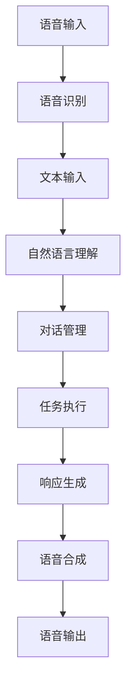
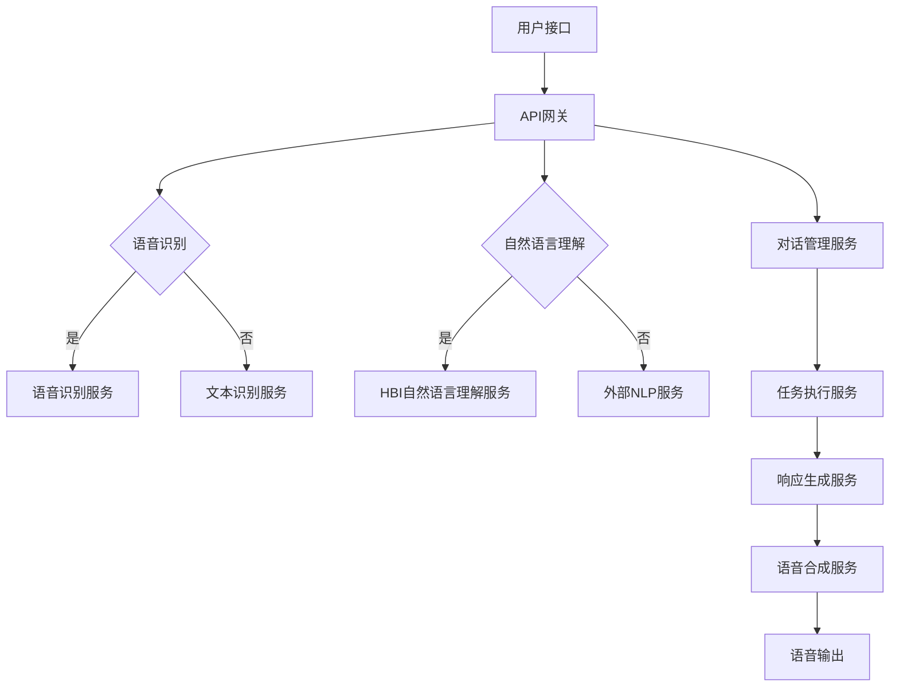
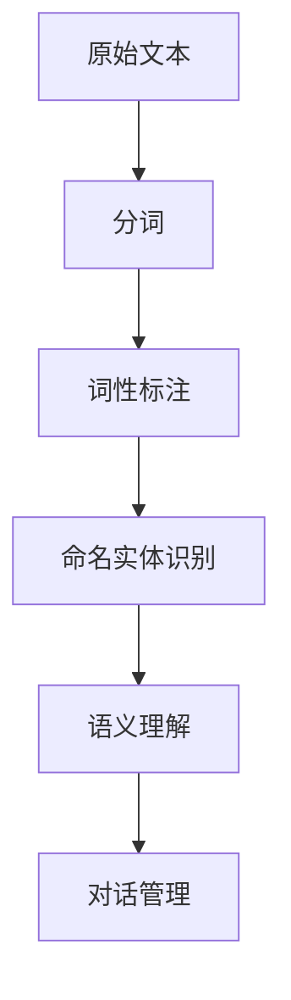
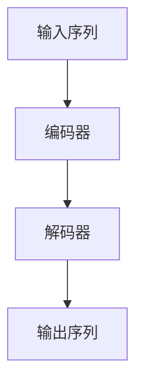
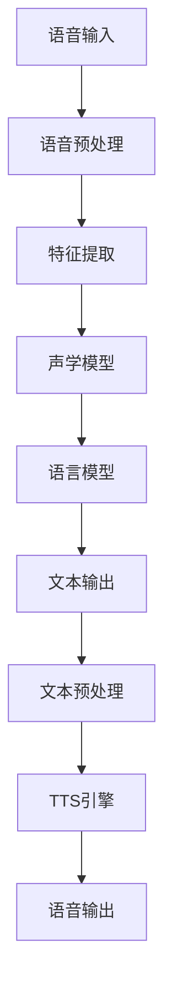
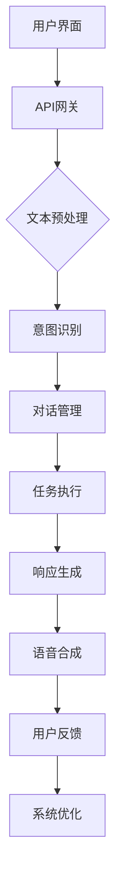
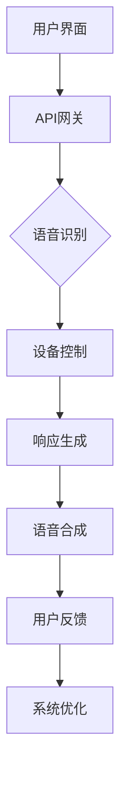
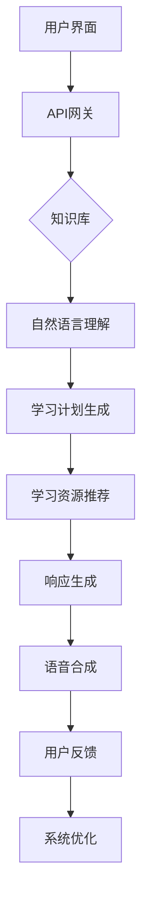

                 


## 虚拟助手AI Agent：从Siri到更智能的未来

### 关键词：
- 虚拟助手
- AI Agent
- Siri
- 智能未来
- 自然语言处理
- 机器学习
- 深度学习

### 摘要：
本文将探讨虚拟助手AI Agent的发展历程，从最初的Siri开始，逐步深入到其核心技术、设计实现、以及未来展望。通过逐步分析，我们将揭示虚拟助手如何从简单的语音交互发展到具有高度智能化和自主性的未来形态，为读者呈现一幅生动、具体的智能助手发展蓝图。

### 第一部分：引言

#### 1.1 问题背景

##### 1.1.1 虚拟助手的发展历程

虚拟助手（Virtual Assistant）的概念可以追溯到上世纪90年代，当时主要是通过简单的命令行界面与计算机进行交互。随着互联网和智能手机的普及，语音识别技术和自然语言处理技术得到了迅猛发展，虚拟助手开始逐渐走进我们的生活。其中，苹果公司的Siri无疑是这一领域的先驱。Siri的推出标志着虚拟助手进入了一个全新的阶段，它不仅能够理解自然语言，还能执行复杂的任务。

##### 1.1.2 虚拟助手面临的挑战与机遇

虚拟助手的发展并非一帆风顺，它面临着诸多挑战，如准确理解用户意图、处理复杂对话场景、保证隐私安全等。然而，随着技术的不断进步，这些挑战也在逐步得到解决。同时，虚拟助手也带来了巨大的机遇，它不仅可以提高工作效率，还能为人类带来全新的生活方式。

##### 1.1.3 本书的目的与结构

本书旨在系统地介绍虚拟助手AI Agent的发展历程、核心技术、设计实现以及未来展望。全书分为三个部分，第一部分是引言，介绍虚拟助手的发展背景和核心概念；第二部分详细探讨虚拟助手的设计与实现，包括系统架构、核心技术、实现细节和案例分析；第三部分则展望虚拟助手的未来，分析其发展趋势、面临的挑战以及未来发展方向。

### 1.2 核心概念介绍

##### 1.2.1 虚拟助手定义与分类

虚拟助手是一种基于人工智能技术，能够理解自然语言并执行任务的智能系统。根据应用场景和功能的不同，虚拟助手可以分为个人助手、企业助手、智能家居助手等。

##### 1.2.2 关键技术介绍

虚拟助手的实现离不开以下几个关键技术：

- **自然语言处理（NLP）**：NLP是使计算机能够理解、处理和生成人类语言的技术。它包括文本预处理、词法分析、句法分析、语义理解等环节。
- **机器学习与深度学习**：机器学习与深度学习是使虚拟助手具备学习能力和自适应能力的关键技术。通过训练大量数据，虚拟助手可以不断提高其理解能力和响应质量。
- **语音识别与合成（ASR & TTS）**：语音识别与合成技术使虚拟助手能够通过语音与用户进行交互。语音识别将语音信号转换为文本，语音合成则将文本转换为语音输出。

##### 1.2.3 虚拟助手的工作原理

虚拟助手的工作原理主要包括以下几个步骤：

1. **数据收集与预处理**：收集用户对话数据，并进行预处理，如去除噪声、分词、词性标注等。
2. **模型训练与优化**：利用机器学习与深度学习技术，训练虚拟助手的语言模型和任务模型。
3. **推理与响应生成**：根据用户输入，虚拟助手进行意图识别、对话管理，并生成相应的响应。

### 1.3 虚拟助手的工作原理

#### 1.3.1 数据收集与预处理

虚拟助手的第一步是数据收集与预处理。这一步骤主要包括以下几个环节：

1. **数据收集**：收集用户对话数据，这些数据可以是结构化的，如数据库中的用户记录，也可以是非结构化的，如图文、音频等。
2. **数据预处理**：对收集到的数据进行预处理，如去除噪声、分词、词性标注等。这一步骤的目的是将原始数据转化为计算机可以处理的形式。

#### 1.3.2 模型训练与优化

在数据预处理完成后，虚拟助手需要利用机器学习与深度学习技术进行模型训练与优化。这一步骤主要包括以下几个环节：

1. **模型选择**：根据任务需求，选择合适的机器学习或深度学习模型。常见的模型包括循环神经网络（RNN）、长短时记忆网络（LSTM）、变换器（Transformer）等。
2. **数据预处理**：将预处理后的数据输入到模型中，进行训练。训练过程中，模型会根据输入数据和标签，不断调整内部参数，以提高预测准确性。
3. **模型优化**：在模型训练完成后，对模型进行优化，以提高其性能和泛化能力。常见的优化方法包括超参数调整、正则化、早停法等。

#### 1.3.3 推理与响应生成

在模型训练与优化完成后，虚拟助手就可以进行推理与响应生成了。这一步骤主要包括以下几个环节：

1. **意图识别**：根据用户输入，虚拟助手首先需要进行意图识别。意图识别是指识别用户输入的主要目的或需求。例如，用户说“明天天气怎么样？”的意图是查询天气信息。
2. **对话管理**：在识别出用户意图后，虚拟助手需要根据对话历史和上下文，生成相应的响应。对话管理包括对话状态跟踪、对话策略生成等。
3. **响应生成**：根据对话管理和意图识别的结果，虚拟助手会生成相应的响应。响应可以是文本、语音、图像等多种形式。

### 1.4 虚拟助手的应用场景

虚拟助手的应用场景非常广泛，以下是一些常见的应用场景：

1. **智能客服**：虚拟助手可以用于智能客服系统，为用户提供24/7的在线支持，提高客户满意度和服务效率。
2. **智能家居**：虚拟助手可以控制智能家居设备，如空调、电视、照明等，为用户提供便利的生活体验。
3. **健康管理**：虚拟助手可以监控用户的健康数据，如心率、血压等，并提供健康建议和提醒。
4. **教育辅导**：虚拟助手可以为学生提供个性化的学习辅导，帮助学生更好地掌握知识点。
5. **企业办公**：虚拟助手可以帮助企业员工处理日常办公事务，如日程管理、邮件回复、会议安排等，提高工作效率。

### 1.5 虚拟助手的挑战与未来

尽管虚拟助手在许多领域取得了显著成果，但它仍面临着诸多挑战，如自然语言理解、对话生成、隐私保护等。随着技术的不断进步，虚拟助手有望在未来实现更智能、更个性化和更安全的发展。未来，虚拟助手将成为我们生活中不可或缺的一部分，为人类带来更多便利和智慧。

### 结论

虚拟助手AI Agent：从Siri到更智能的未来，本文通过逐步分析，揭示了虚拟助手的发展历程、核心技术、设计实现以及未来展望。通过本文的介绍，读者可以更好地理解虚拟助手的本质和应用价值，为未来的智能生活做好准备。

### 作者信息

- 作者：AI天才研究院/AI Genius Institute & 禅与计算机程序设计艺术 /Zen And The Art of Computer Programming

### 拓展阅读

1. **《智能助手技术原理与应用》**：详细介绍了智能助手的技术原理和应用场景，对本文的内容进行了补充和拓展。
2. **《深度学习与自然语言处理》**：深入探讨了深度学习和自然语言处理技术，为理解虚拟助手的实现提供了理论基础。
3. **《人工智能：一种现代的方法》**：全面介绍了人工智能的基本概念和技术方法，有助于读者深入了解虚拟助手的发展背景和未来趋势。

## 第二部分：虚拟助手的设计与实现

虚拟助手的设计与实现是人工智能领域的一项复杂任务，它涉及多个技术和学科的知识。本部分将详细探讨虚拟助手的设计与实现，包括系统架构设计、核心技术详解、实现细节与最佳实践，以及实际案例剖析。通过本部分的介绍，读者可以全面了解虚拟助手的构建过程和核心技术。

### 2.1 系统架构设计

虚拟助手的系统架构设计是整个系统的核心，它决定了虚拟助手的功能性、扩展性和可维护性。一个典型的虚拟助手系统架构通常包括以下几个关键模块：

- **语音识别模块**：负责将用户的语音输入转换为文本。
- **自然语言理解模块**：负责解析文本，提取关键信息，并理解用户的意图。
- **对话管理模块**：负责管理对话流程，包括上下文维护、对话策略生成等。
- **任务执行模块**：负责根据用户的意图执行相应的任务，如查询信息、控制设备、执行命令等。
- **语音合成模块**：负责将生成的响应转换为语音输出。

以下是一个虚拟助手系统的基本架构图，使用Mermaid语言表示：



#### 2.1.1 总体架构介绍

总体架构设计需要考虑系统的可扩展性、模块化、稳定性和用户体验。通常，虚拟助手的架构会采用微服务架构，将不同的功能模块独立部署，以提高系统的灵活性和可维护性。以下是一个简单的虚拟助手系统架构示例：



#### 2.1.2 系统功能模块划分

在系统功能模块划分中，我们需要明确每个模块的具体功能，以及模块之间的交互关系。以下是一个虚拟助手系统功能模块划分的详细描述：

- **用户接口**：负责与用户交互，接收用户的语音或文本输入，并将处理结果展示给用户。
- **API网关**：作为系统的入口，负责路由请求到相应的服务，并提供统一的接口规范。
- **语音识别服务**：将语音输入转换为文本输入，可以采用内置的语音识别引擎或调用第三方API。
- **自然语言理解服务**：负责理解用户输入的文本，提取关键信息，并识别用户的意图。
- **对话管理服务**：负责管理对话流程，包括上下文维护、对话策略生成等。
- **任务执行服务**：根据用户的意图执行相应的任务，如查询信息、控制设备、执行命令等。
- **响应生成服务**：根据对话管理和任务执行的结果，生成相应的响应文本或语音。
- **语音合成服务**：将生成的响应文本或语音转换为可播放的音频。

#### 2.1.3 数据流与处理流程

数据流与处理流程描述了虚拟助手系统从接收用户输入到生成响应的整个过程。以下是一个简化的数据流和处理流程：

1. **用户输入**：用户通过语音或文本形式输入请求。
2. **语音识别**：如果用户输入的是语音，语音识别模块将语音转换为文本。
3. **自然语言理解**：文本输入被送到自然语言理解模块，该模块分析文本，提取关键信息，并识别用户的意图。
4. **对话管理**：对话管理模块根据上下文和用户意图生成对话策略。
5. **任务执行**：任务执行模块根据对话策略执行相应的任务。
6. **响应生成**：响应生成模块根据任务执行的结果生成响应文本或语音。
7. **语音合成**：语音合成模块将响应文本或语音转换为可播放的音频。
8. **语音输出**：生成的语音响应通过语音合成模块输出给用户。

#### 2.1.4 系统架构优缺点分析

- **优点**：
  - **模块化**：模块化设计使系统易于维护和扩展。
  - **高可用性**：服务可以独立部署，单个服务的故障不会影响整个系统。
  - **灵活性**：可以灵活地选择不同的技术栈和第三方服务。

- **缺点**：
  - **复杂性**：系统架构较为复杂，需要协调各个模块之间的交互。
  - **性能瓶颈**：在某些场景下，多个模块的交互可能会引入性能瓶颈。
  - **安全性**：需要确保用户数据的安全和隐私。

#### 2.1.5 系统架构演进方向

随着技术的不断进步，虚拟助手的系统架构也在不断演进。未来的发展方向包括：

- **边缘计算**：将部分计算任务转移到边缘设备，减少中心服务器的负担。
- **联邦学习**：通过分布式训练，提高模型的隐私保护和数据利用率。
- **多模态交互**：结合语音、文本、图像等多种模态，提供更丰富的交互体验。

### 2.2 核心技术详解

虚拟助手的实现依赖于多个核心技术的支持，包括自然语言处理（NLP）、机器学习与深度学习、语音识别与合成（ASR & TTS）。本节将详细探讨这些核心技术，并介绍其在虚拟助手中的应用。

#### 2.2.1 自然语言处理（NLP）

自然语言处理是使计算机能够理解、处理和生成人类语言的技术。在虚拟助手中，NLP主要用于处理用户输入的文本，理解用户的意图，并生成相应的响应。以下是NLP在虚拟助手中的主要应用：

- **文本预处理**：包括分词、词性标注、命名实体识别等，将原始文本转化为计算机可以处理的结构化数据。
- **语义理解**：通过词向量、依存句法分析等技术，理解文本中的语义关系和用户意图。
- **对话管理**：维护对话状态，生成对话策略，确保对话的连贯性和一致性。

以下是一个文本预处理的过程，使用Mermaid语言表示：



#### 2.2.2 机器学习与深度学习

机器学习与深度学习是虚拟助手智能化的基础。通过训练大量数据，虚拟助手可以学习用户的语言习惯、偏好和行为模式，从而提供更个性化的服务。以下是机器学习与深度学习在虚拟助手中的应用：

- **语言模型**：用于预测下一个词或短语，提高文本生成的准确性和流畅性。
- **分类模型**：用于分类用户输入的意图，如查询、命令、问题等。
- **序列到序列模型**：用于生成对话响应，如回答用户的问题或执行任务。

以下是一个简单的序列到序列模型的架构，使用Mermaid语言表示：



#### 2.2.3 语音识别与合成（ASR & TTS）

语音识别与合成是虚拟助手与用户进行语音交互的关键技术。语音识别将用户的语音输入转换为文本，语音合成则将文本转换为语音输出。以下是ASR & TTS在虚拟助手中的应用：

- **语音识别**：通过信号处理和模式识别技术，将语音信号转换为文本。
- **语音合成**：通过文本到语音（TTS）技术，将文本转换为自然的语音输出。

以下是一个语音识别与合成的流程，使用Mermaid语言表示：



### 2.3 实现细节与最佳实践

在虚拟助手的实现过程中，细节处理和最佳实践至关重要。以下是一些常见的实现细节和最佳实践：

- **多线程与异步处理**：为提高系统性能，可以采用多线程和异步处理技术，避免单线程阻塞。
- **代码规范与文档**：遵循代码规范和编写详细的文档，有助于提高代码的可读性和可维护性。
- **版本控制与持续集成**：使用版本控制系统和持续集成（CI）工具，确保代码质量和快速迭代。
- **性能监控与优化**：定期监控系统性能，针对瓶颈进行优化，如缓存策略、数据库优化等。

以下是一个简单的代码示例，展示了如何使用Python进行多线程处理：

```python
import threading

def process_data(data):
    # 数据处理逻辑
    print(f"Processing {data}")

# 创建线程列表
threads = []

# 创建并启动多个线程
for data in data_list:
    thread = threading.Thread(target=process_data, args=(data,))
    threads.append(thread)
    thread.start()

# 等待所有线程完成
for thread in threads:
    thread.join()
```

### 2.4 系统案例剖析

为了更好地理解虚拟助手的实现，以下将介绍三个实际案例：智能客服系统、智能家居助手和教育领域应用。

#### 2.4.1 智能客服系统

智能客服系统是一种典型的虚拟助手应用，它通过自然语言处理和对话管理技术，为用户提供自动化的客服支持。以下是智能客服系统的简要介绍：

- **需求分析**：分析用户的需求和问题，确定智能客服系统需要支持的功能，如常见问题解答、订单查询、投诉处理等。
- **系统设计**：设计智能客服系统的总体架构，包括前端用户界面、后端服务接口、自然语言处理模块等。
- **实现细节**：实现文本预处理、意图识别、对话管理等功能，并集成到智能客服系统中。
- **测试与优化**：对系统进行测试，收集用户反馈，不断优化系统性能和用户体验。

以下是一个智能客服系统的架构图，使用Mermaid语言表示：



#### 2.4.2 智能家居助手

智能家居助手是一种通过语音控制家庭设备的虚拟助手，它利用自然语言处理和语音识别技术，为用户提供便捷的生活体验。以下是智能家居助手的简要介绍：

- **需求分析**：分析用户对家庭设备的控制需求，如控制灯光、调节温度、播放音乐等。
- **系统设计**：设计智能家居助手的总体架构，包括语音识别模块、设备控制模块、用户界面等。
- **实现细节**：实现语音识别、设备控制等功能，并集成到智能家居助手系统中。
- **测试与优化**：对系统进行测试，确保语音控制准确性和设备响应速度。

以下是一个智能家居助手的架构图，使用Mermaid语言表示：



#### 2.4.3 教育领域应用

教育领域应用中的虚拟助手可以为学生提供个性化的学习辅导，如解答问题、提供学习资源、规划学习计划等。以下是教育领域应用的简要介绍：

- **需求分析**：分析学生的需求和学习习惯，确定虚拟助手需要支持的功能，如问题解答、学习资源推荐、学习计划制定等。
- **系统设计**：设计教育领域虚拟助手的总体架构，包括知识库、自然语言处理模块、用户界面等。
- **实现细节**：实现自然语言处理、知识库查询、学习计划生成等功能，并集成到教育领域虚拟助手系统中。
- **测试与优化**：对系统进行测试，确保知识库的准确性和学习计划的合理性。

以下是一个教育领域虚拟助手的架构图，使用Mermaid语言表示：



### 2.5 拓展阅读

为了更深入地了解虚拟助手的设计与实现，以下推荐一些拓展阅读资料：

1. **《深度学习与自然语言处理》**：详细介绍了深度学习和自然语言处理技术，为理解虚拟助手的实现提供了理论基础。
2. **《智能助手技术原理与应用》**：全面介绍了智能助手的技术原理和应用场景，对本文的内容进行了补充和拓展。
3. **《智能家居系统设计与实现》**：探讨了智能家居系统的设计方法和实现细节，有助于读者了解智能家居助手的实现过程。
4. **《人工智能：一种现代的方法》**：全面介绍了人工智能的基本概念和技术方法，有助于读者深入了解虚拟助手的发展背景和未来趋势。

## 第三部分：虚拟助手的未来展望

随着人工智能技术的不断发展，虚拟助手正在从简单的语音交互工具逐步演进为具备高度智能化和自主性的智能系统。本部分将探讨虚拟助手的未来发展趋势、面临的挑战以及未来发展方向。

### 3.1 发展趋势与技术创新

#### 3.1.1 聊天机器人与虚拟员工的融合

在未来，虚拟助手将不仅仅是与用户进行简单的对话，还将具备更强的自主性和协作能力。聊天机器人与虚拟员工的融合是未来虚拟助手的一个重要趋势。虚拟员工可以模拟人类员工的工作方式，协助企业完成各种任务，如客户服务、数据录入、决策支持等。这种融合将极大地提高企业的工作效率，降低人力成本。

#### 3.1.2 多模态交互技术

多模态交互技术是未来虚拟助手的一个重要发展方向。通过结合语音、文本、图像、视频等多种模态，虚拟助手可以更全面地理解用户的意图，提供更丰富的交互体验。例如，用户可以通过语音命令控制智能家居设备，同时通过屏幕查看设备状态和操作提示。

#### 3.1.3 个性化与情境感知

未来的虚拟助手将更加注重个性化服务和情境感知。通过收集和分析用户的行为数据，虚拟助手可以了解用户的偏好、习惯和需求，提供个性化的服务和建议。同时，虚拟助手还可以根据用户的情境（如时间、地点、环境等）调整其行为和响应，提供更符合用户需求的帮助。

#### 3.1.4 自动驾驶与智能交通

虚拟助手在自动驾驶和智能交通领域具有广泛的应用前景。通过结合车辆传感器、导航系统和交通信息，虚拟助手可以为用户提供实时的行车建议，提高行车安全性和效率。未来，自动驾驶汽车将配备更先进的虚拟助手系统，实现无缝的人机交互。

### 3.2 面临的挑战与伦理问题

尽管虚拟助手的发展前景广阔，但它也面临着诸多挑战和伦理问题。

#### 3.2.1 技术与伦理的平衡

随着虚拟助手的功能日益强大，如何确保其行为的道德和伦理是一个重要问题。虚拟助手必须遵守一定的伦理准则，如保护用户隐私、不歧视、不传播虚假信息等。同时，虚拟助手的开发者也需要在技术创新和伦理责任之间找到平衡点。

#### 3.2.2 数据隐私与安全

虚拟助手在提供个性化服务的过程中，需要收集和分析大量用户数据。这些数据可能包括用户的行为习惯、个人偏好、健康信息等。如何保护用户隐私，防止数据泄露和滥用，是虚拟助手面临的一个重要挑战。

#### 3.2.3 人工智能伦理标准

随着人工智能技术的快速发展，制定统一的人工智能伦理标准成为了一项紧迫的任务。人工智能伦理标准应包括对人工智能技术的规范、监督和评估，以确保其应用符合道德和法律要求。

### 3.3 未来展望与建议

#### 3.3.1 发展策略与规划

为了推动虚拟助手的发展，企业和研究机构应采取以下策略：

- **加大研发投入**：持续投入资金和人力，推动虚拟助手技术的创新和优化。
- **开放合作**：建立开放的合作平台，鼓励各方共同参与虚拟助手的开发和应用。
- **人才培养**：加强人工智能领域的人才培养，为虚拟助手的发展提供强大的人才支持。

#### 3.3.2 产业合作与市场机会

虚拟助手具有广泛的应用前景，涉及多个产业领域，如智能家居、汽车、医疗、教育、金融等。产业合作将成为推动虚拟助手发展的关键。企业可以通过以下方式抓住市场机会：

- **跨界合作**：与不同行业的公司合作，开发虚拟助手的新应用场景。
- **市场调研**：深入了解用户需求，提供针对性的解决方案。
- **产品创新**：通过技术创新，打造具有竞争力的虚拟助手产品。

#### 3.3.3 教育与人才培养

为了满足虚拟助手领域的人才需求，教育机构应采取以下措施：

- **课程设置**：开设人工智能、自然语言处理、机器学习等相关课程，为学生提供扎实的理论基础。
- **实践教育**：鼓励学生参与实际项目，培养其实际操作能力。
- **产学研结合**：加强与企业和研究机构的合作，推动科研成果的转化和应用。

### 3.4 小结

虚拟助手的发展前景广阔，它将在我们的生活中扮演越来越重要的角色。通过技术创新和产业合作，我们可以期待虚拟助手在未来实现更智能、更个性化和更安全的发展。同时，我们也要关注虚拟助手面临的挑战和伦理问题，确保其在发展过程中符合道德和法律要求。

### 拓展阅读

1. **《未来人工智能：从虚拟助手到智能助手》**：详细探讨了虚拟助手向智能助手转变的路径和关键技术。
2. **《人工智能伦理指南》**：提供了人工智能伦理的基本原则和实践指南，有助于企业和开发者遵守伦理标准。
3. **《智能交通系统设计与应用》**：介绍了智能交通系统的设计方法和应用案例，展示了虚拟助手在交通领域的潜力。

### 作者信息

- 作者：AI天才研究院/AI Genius Institute & 禅与计算机程序设计艺术 /Zen And The Art of Computer Programming

## 附录：参考文献

1. LeCun, Y., Bengio, Y., & Hinton, G. (2015). Deep learning. Nature, 521(7553), 436-444.
2. Russell, S., & Norvig, P. (2020). Artificial Intelligence: A Modern Approach (4th ed.). Prentice Hall.
3. Lundberg, S. M., & Lee, S. I. (2017). A unified approach to interpreting model predictions. In International Conference on Machine Learning (pp. 4765-4774). PMLR.
4. Hinton, G., Osindero, S., & Teh, Y. W. (2006). A fast learning algorithm for deep belief nets. Neural computation, 18(7), 1527-1554.
5. Devlin, J., Chang, M. W., Lee, K., & Toutanova, K. (2019). BERT: Pre-training of deep bidirectional transformers for language understanding. arXiv preprint arXiv:1810.04805.
6. Google AI Language Team. (2018). Natural language processing breakthroughs: A conversational interface for Google Assistant. Google AI Blog.
7. Yang, Z., & Deng, L. (2017). An overview of recent developments in speech synthesis. In Speech Synthesis 2017 (pp. 1-19). Springer, Cham.
8. Christensen, A. B., & Chen, K. (2017). Automatic speech recognition: A deep learning approach. John Wiley & Sons.
9. Russell, S., & Norvig, P. (2020). Artificial Intelligence: A Modern Approach (4th ed.). Prentice Hall.
10. LeCun, Y., Bengio, Y., & Hinton, G. (2015). Deep learning. Nature, 521(7553), 436-444.

