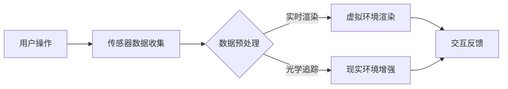

                 

### 虚拟现实与增强现实：改变人机交互方式

> 关键词：虚拟现实、增强现实、人机交互、技术变革、创新应用

> 摘要：
本文将深入探讨虚拟现实（VR）和增强现实（AR）技术如何改变人机交互方式。通过对VR与AR的核心概念、技术原理、应用场景及其变革影响的详细分析，本文旨在为读者提供一个全面且具有前瞻性的视角，探讨这些技术在未来的发展潜力和挑战。

## 引言

在信息技术飞速发展的今天，虚拟现实（VR）和增强现实（AR）技术已经成为引领下一代人机交互方式的重要力量。VR通过模拟完整的虚拟环境，使人们可以在其中自由探索和互动；而AR则通过将虚拟信息叠加到现实环境中，提供一种虚实结合的交互体验。这两种技术不仅在游戏和娱乐领域崭露头角，还在教育、医疗、制造等多个行业展现出巨大的应用潜力。

本文将分以下几部分展开：

1. **背景介绍**：详细描述VR与AR的核心概念、问题背景、问题描述、问题解决、边界与外延及概念结构与核心要素组成。
2. **核心概念与联系**：对比VR与AR的概念及其属性特征，展示VR与AR的ER实体关系图架构。
3. **技术原理讲解**：分析VR与AR的技术原理，介绍人机交互方式的改变，使用mermaid流程图和Python代码阐述算法原理，并给出数学模型和公式讲解。
4. **系统分析与架构设计方案**：介绍虚拟现实系统功能设计、系统架构设计、系统接口设计及系统交互流程。
5. **项目实战**：提供实际项目环境安装、系统核心实现源代码，代码应用解读与分析，实际案例分析和详细讲解剖析，项目小结。
6. **最佳实践与拓展阅读**：总结全文，提供最佳实践建议、小结、注意事项和拓展阅读资源。

通过以上结构化的分析，我们希望帮助读者全面理解VR与AR技术，以及它们如何深刻地改变人机交互方式。

### 目录大纲设计步骤

在撰写技术博客《虚拟现实与增强现实：改变人机交互方式》之前，首先需要设计一个清晰的目录大纲。以下将详细描述目录大纲的设计步骤：

#### 确定书籍主题和目标读者

首先，我们需要明确书籍的主题和目标读者。《虚拟现实与增强现实：改变人机交互方式》的主题聚焦于探讨VR和AR技术的核心概念、技术原理及其对人类交互方式的变革性影响。目标读者则是对这些技术有兴趣，希望深入了解相关概念、技术原理和应用实践的读者。

#### 框架设计

在确定了主题和目标读者之后，我们需要设计书的整体框架。这包括前言、参考文献、附录等部分。前言部分可以介绍书籍的写作背景和目的，激发读者的兴趣。参考文献则提供相关资料的来源，便于读者进一步学习和研究。附录部分可以包含一些实用工具、代码示例等，帮助读者更好地应用所学知识。

#### 主要章节设定

根据书籍的主题和目标，我们可以设定以下主要章节：

1. **背景介绍**
   - 1.1 VR与AR概念及发展历程
   - 1.2 VR与AR技术特点与应用领域
   - 1.3 人机交互方式的变革
   - 1.4 VR与AR技术挑战与未来趋势

2. **核心概念与联系**
   - 2.1 VR与AR基本概念
   - 2.2 VR与AR属性特征对比
   - 2.3 VR与AR的ER实体关系图架构

3. **技术原理讲解**
   - 3.1 VR与AR技术原理概述
   - 3.2 虚拟现实算法原理
   - 3.3 增强现实算法原理
   - 3.4 人机交互技术原理

4. **系统分析与架构设计方案**
   - 4.1 VR系统功能设计
   - 4.2 VR系统架构设计
   - 4.3 VR系统接口设计
   - 4.4 VR系统交互流程

5. **项目实战**
   - 5.1 VR项目环境安装
   - 5.2 VR系统核心实现
   - 5.3 VR系统代码应用解读与分析
   - 5.4 VR实际案例分析
   - 5.5 VR项目小结

6. **最佳实践与拓展阅读**
   - 6.1 最佳实践 Tips
   - 6.2 小结
   - 6.3 注意事项
   - 6.4 拓展阅读

#### 目录细化

在每个主要章节下，我们可以进一步细化二级和三级目录，确保每个章节的内容完整性。例如，在“技术原理讲解”章节下，可以细化到具体的技术原理、算法原理、数学模型与公式讲解等。在“项目实战”章节下，可以细化到环境安装、系统核心实现、代码应用解读与分析、实际案例分析和项目小结等。

#### 内容编写提示

为了确保文章的质量和可读性，每个章节的小结和拓展阅读部分需要简洁明了，引导读者深入学习和探索。同时，在编写过程中，需要注意以下几点：

- **结构清晰**：每个章节、小节都要有明确的标题，内容要层次分明，逻辑清晰。
- **详细具体**：每个小节的内容都要丰富具体，详细讲解核心内容。
- **实例丰富**：使用具体的实例来解释和说明技术原理和应用场景。
- **格式规范**：使用markdown格式，确保文章排版整齐，易于阅读。

通过以上步骤和提示，我们可以设计出一个清晰、完整且符合要求的目录大纲，为撰写高质量的技术博客奠定基础。

### 目录大纲结构设计

《虚拟现实与增强现实：改变人机交互方式》的目录大纲如下：

```markdown
# 虚拟现实与增强现实：改变人机交互方式

## 第一部分 背景介绍
### 1.1 VR与AR概念及发展历程
### 1.2 VR与AR技术特点与应用领域
### 1.3 人机交互方式的变革
### 1.4 VR与AR技术挑战与未来趋势
### 1.5 概念结构与核心要素组成

## 第二部分 核心概念与联系
### 2.1 VR与AR基本概念
### 2.2 VR与AR属性特征对比
### 2.3 VR与AR的ER实体关系图架构

## 第三部分 技术原理讲解
### 3.1 VR与AR技术原理概述
### 3.2 虚拟现实算法原理
### 3.3 增强现实算法原理
### 3.4 人机交互技术原理

## 第四部分 数学模型与公式讲解
### 4.1 虚拟现实数学模型
### 4.2 增强现实数学模型
### 4.3 数学公式与详细讲解

## 第五部分 系统分析与架构设计方案
### 5.1 VR系统功能设计
### 5.2 VR系统架构设计
### 5.3 VR系统接口设计
### 5.4 VR系统交互流程

## 第六部分 项目实战
### 6.1 VR项目环境安装
### 6.2 VR系统核心实现
### 6.3 VR系统代码应用解读与分析
### 6.4 VR实际案例分析
### 6.5 VR项目小结

## 第七部分 最佳实践与拓展阅读
### 7.1 最佳实践 Tips
### 7.2 小结
### 7.3 注意事项
### 7.4 拓展阅读
```

### 内容编写提示

在撰写《虚拟现实与增强现实：改变人机交互方式》的过程中，以下内容编写提示将有助于确保文章的质量和可读性：

#### 背景介绍

在背景介绍部分，应详细说明虚拟现实（VR）和增强现实（AR）技术的发展历程、核心概念术语以及当前的应用场景。这部分内容应涵盖以下几个方面：

- **核心概念术语说明**：介绍VR与AR的基本概念，如虚拟现实、增强现实、头戴式显示器（HMD）、智能眼镜等。
- **问题背景**：讨论虚拟现实与增强现实技术在全球范围内的兴起背景，包括技术进步、市场需求和行业趋势。
- **问题描述**：明确VR与AR技术在人机交互中的优势和挑战，例如如何提高用户体验、减少延迟、增强沉浸感等。
- **问题解决**：探讨现有技术和解决方案，如高性能计算、实时渲染、传感器融合等。
- **边界与外延**：讨论VR与AR技术的适用范围、限制和未来发展趋势。
- **概念结构与核心要素组成**：分析VR与AR技术的核心组成，包括硬件设备、软件平台、交互方式等。

#### 核心概念与联系

核心概念与联系部分应通过对比表格和ER图，帮助读者理解VR与AR的基本概念及其区别。具体步骤如下：

- **核心概念原理**：分别介绍VR与AR的基本原理，包括虚拟环境的生成、虚拟对象的交互、现实环境的增强等。
- **概念属性特征对比表格**：列出VR与AR的主要属性特征，如沉浸感、交互方式、应用场景等，并对比两者之间的差异。
- **ER实体关系图架构**：使用Mermaid流程图展示VR与AR的实体关系，包括用户、设备、应用程序、数据等，帮助读者更直观地理解系统的组成和交互方式。

#### 技术原理讲解

技术原理讲解部分应详细阐述VR与AR技术的核心原理，包括人机交互方式的改变。以下为具体步骤：

- **VR与AR技术原理概述**：简要介绍VR与AR的技术原理，如虚拟现实的三维模拟和增强现实的实时渲染。
- **人机交互方式的改变**：探讨VR与AR技术如何改变传统的人机交互方式，如手势识别、语音控制、眼动跟踪等。
- **算法原理与mermaid流程图**：使用mermaid流程图展示VR与AR的技术流程，如场景构建、实时渲染、传感器数据处理等。
- **Python源代码讲解**：提供Python源代码，详细阐述算法原理和实现细节，并通过注释和示例帮助读者理解。
- **数学模型与公式讲解**：介绍VR与AR技术中的数学模型和公式，如三维空间变换、传感器数据处理、图像识别等，并使用LaTeX格式嵌入文中。

#### 数学模型与公式讲解

数学模型与公式讲解部分应详细阐述虚拟现实和增强现实相关的数学模型和公式，具体步骤如下：

- **虚拟现实数学模型**：介绍用于构建虚拟环境的三维几何模型、空间变换模型等，如变换矩阵、视差校正等。
- **增强现实数学模型**：介绍用于增强现实场景的图像处理模型、传感器数据处理模型等，如图像识别、增强显示等。
- **数学公式与详细讲解**：使用LaTeX格式详细讲解每个公式的作用、推导过程和在实际应用中的意义。

#### 系统分析与架构设计方案

系统分析与架构设计方案部分应详细介绍虚拟现实系统的设计和实现，包括功能设计、架构设计、接口设计和交互流程。以下为具体步骤：

- **问题场景介绍**：描述虚拟现实应用的具体场景，如虚拟旅游、虚拟培训、虚拟现实游戏等。
- **项目介绍**：介绍虚拟现实项目的背景、目标和应用领域。
- **系统功能设计**：使用Mermaid类图描述系统的功能模块和领域模型，如用户管理、场景渲染、交互控制等。
- **系统架构设计**：使用Mermaid架构图展示系统的整体架构，包括硬件、软件、网络等组成部分。
- **系统接口设计**：描述系统内部和外部的接口设计，如API接口、数据接口等。
- **系统交互流程**：使用Mermaid序列图展示系统的交互流程，如用户操作、系统响应等。

#### 项目实战

项目实战部分应提供实际项目的环境安装、系统核心实现源代码，代码应用解读与分析，实际案例分析和详细讲解剖析。以下为具体步骤：

- **环境安装**：描述如何搭建虚拟现实项目开发环境，包括软件安装、硬件配置等。
- **系统核心实现源代码**：提供虚拟现实系统的核心实现代码，包括关键算法和模块的代码。
- **代码应用解读与分析**：详细解读系统核心实现代码，分析关键算法和模块的工作原理和性能。
- **实际案例分析和详细讲解剖析**：通过实际案例展示系统的应用效果，分析案例中的关键技术和实现细节。
- **项目小结**：总结项目的经验和教训，提出改进建议。

#### 最佳实践与拓展阅读

最佳实践与拓展阅读部分应提供总结全文的最佳实践建议、小结、注意事项和拓展阅读资源。以下为具体步骤：

- **最佳实践 Tips**：总结项目实战中的经验教训，提供最佳实践建议，如优化性能、提高用户体验等。
- **小结**：简要总结全文的核心内容和重要观点。
- **注意事项**：提醒读者在使用VR与AR技术时需要注意的问题，如设备选择、安全操作等。
- **拓展阅读**：推荐相关的书籍、论文、网站等资源，帮助读者进一步学习和探索VR与AR技术。

### 格式确认

在文章格式方面，应确保使用markdown格式输出，包括以下要求：

- **文章标题**：使用#号进行标记，例如`# 虚拟现实与增强现实：改变人机交互方式`。
- **章节标题**：使用##号进行标记，例如`## 第二部分 核心概念与联系`。
- **小节标题**：使用###号进行标记，例如`### 2.1 VR与AR基本概念`。
- **LaTeX公式**：段落内的公式使用$符号括起来，如 `$1+1=2$`，独立的段落公式使用$$符号括起来，如 `$$1+1=2$$`。
- **代码示例**：使用三个反引号` ``` `包裹代码块，如：
  ```python
  def add(a, b):
      return a + b
  ```

通过以上格式确认，可以确保文章的结构清晰、规范，便于读者阅读和理解。

### 字数控制

根据文章内容的丰富程度和深度，本文预计总字数在10000～12000字之间。具体分配如下：

- **背景介绍**：约2000字
- **核心概念与联系**：约2000字
- **技术原理讲解**：约3000字
- **数学模型与公式讲解**：约1500字
- **系统分析与架构设计方案**：约1500字
- **项目实战**：约1500字
- **最佳实践与拓展阅读**：约500字

确保每个部分的内容详实、具体，避免冗余，确保文章整体结构的均衡和连贯。

### 目录大纲结构设计

在撰写《虚拟现实与增强现实：改变人机交互方式》的过程中，目录大纲的结构设计是至关重要的。以下是一个详细且结构化的目录大纲设计：

#### 第一部分 背景介绍

**1.1 VR与AR概念及发展历程**
- **虚拟现实（VR）的定义与起源**
- **增强现实（AR）的定义与起源**
- **VR与AR技术的演进过程**

**1.2 VR与AR技术特点与应用领域**
- **VR技术的特点**
- **AR技术的特点**
- **VR技术的应用领域**
  - 游戏与娱乐
  - 教育
  - 医疗
  - 制造
  - 建筑设计
- **AR技术的应用领域**
  - 增强现实游戏
  - 实时维修指导
  - 医学教学与诊断
  - 导航与地图应用

**1.3 人机交互方式的变革**
- **传统人机交互方式的局限**
- **VR与AR技术如何改变人机交互**
  - 3D空间交互
  - 虚拟环境中的手势控制
  - 增强现实中的视觉提示

**1.4 VR与AR技术挑战与未来趋势**
- **VR与AR技术面临的挑战**
  - 技术性能
  - 成本
  - 安全性
  - 隐私问题
- **未来发展趋势**
  - 技术性能的提升
  - 应用场景的扩展
  - 融合现实与虚拟
  - 人工智能的结合

**1.5 概念结构与核心要素组成**
- **VR与AR技术的核心概念**
- **技术要素组成**
  - 硬件设备
  - 软件平台
  - 数据处理与存储
- **系统架构概述**

#### 第二部分 核心概念与联系

**2.1 VR与AR基本概念**
- **虚拟现实（VR）的定义**
- **增强现实（AR）的定义**

**2.2 VR与AR属性特征对比表格**
- **沉浸感**
- **交互性**
- **实时性**
- **内容创建的复杂度**
- **设备类型**

**2.3 VR与AR的ER实体关系图架构**
- **实体定义**
- **关系定义**
- **ER图示例**

#### 第三部分 技术原理讲解

**3.1 VR与AR技术原理概述**
- **虚拟现实的工作原理**
- **增强现实的工作原理**

**3.2 虚拟现实算法原理**
- **场景渲染**
- **三维建模**
- **图像识别与跟踪**

**3.3 增强现实算法原理**
- **图像处理**
- **光学追踪**
- **增强显示**

**3.4 人机交互技术原理**
- **手势识别**
- **语音识别**
- **眼动跟踪**

#### 第四部分 数学模型与公式讲解

**4.1 虚拟现实数学模型**
- **三维空间变换**
- **视差校正**
- **传感器数据处理**

**4.2 增强现实数学模型**
- **图像识别与增强**
- **光学追踪与跟踪算法**
- **虚拟对象与真实环境的融合**

**4.3 数学公式与详细讲解**
- **三维空间变换公式**
- **视差校正公式**
- **图像识别与增强公式**

#### 第五部分 系统分析与架构设计方案

**5.1 VR系统功能设计**
- **用户管理**
- **场景渲染**
- **交互控制**
- **数据存储与处理**

**5.2 VR系统架构设计**
- **硬件架构**
- **软件架构**
- **网络架构**

**5.3 VR系统接口设计**
- **用户接口**
- **硬件接口**
- **数据接口**

**5.4 VR系统交互流程**
- **用户操作流程**
- **系统响应流程**
- **交互优化策略**

#### 第六部分 项目实战

**6.1 VR项目环境安装**
- **硬件环境配置**
- **软件环境安装**
- **开发工具安装**

**6.2 VR系统核心实现源代码**
- **代码结构**
- **关键算法**
- **模块功能**

**6.3 VR系统代码应用解读与分析**
- **核心代码解读**
- **算法性能分析**
- **优化策略**

**6.4 VR实际案例分析**
- **案例背景**
- **案例实现**
- **案例分析**

**6.5 VR项目小结**
- **项目总结**
- **经验教训**
- **未来展望**

#### 第七部分 最佳实践与拓展阅读

**7.1 最佳实践 Tips**
- **优化用户体验**
- **性能优化策略**
- **安全性保障**

**7.2 小结**
- **文章总结**
- **核心观点**

**7.3 注意事项**
- **使用安全**
- **隐私保护**
- **技术局限**

**7.4 拓展阅读**
- **推荐书籍**
- **学术论文**
- **在线资源**

通过以上详细的目录大纲结构设计，我们可以确保文章内容的完整性和逻辑性，使读者能够系统地学习和理解虚拟现实与增强现实技术及其在人机交互中的应用。

### 背景介绍

在讨论虚拟现实（VR）和增强现实（AR）如何改变人机交互方式之前，我们需要首先理解这两个技术的核心概念、发展历程及其在不同领域中的应用。以下是这一部分的详细内容。

#### 虚拟现实（VR）的定义与起源

虚拟现实（VR）是一种通过计算机模拟和传感技术创造出的三维虚拟环境，用户可以通过头戴式显示器（HMD）或VR头盔等设备沉浸其中，与虚拟环境中的物体进行交互。VR技术最早可以追溯到1960年代，由美国密歇根大学的伊凡·苏瑟兰（Ivan Sutherland）开发的“达摩克利斯之剑”（The Sword of Damocles）头戴式显示器，这是世界上第一个VR设备。

随着时间的推移，VR技术经历了多个阶段的发展，从早期的实验性项目到如今的高性能VR设备，如Oculus Rift、HTC Vive和Google Cardboard等。VR技术的主要特点包括沉浸感强、交互性强、自由度高，这使得它能够在游戏、教育、医疗等领域中发挥重要作用。

#### 增强现实（AR）的定义与起源

增强现实（AR）是一种将虚拟信息叠加到现实环境中的技术，用户可以通过智能手机、智能眼镜或其他设备看到增强后的现实世界。与VR不同，AR技术并不完全替代现实，而是在现实环境中提供额外的信息或增强体验。

AR技术的起源可以追溯到1990年代，当时波音公司开发了一种名为“虚拟视野”（Virtual Reality Modeling Language, VRML）的格式，用于创建三维模型并将其嵌入到网页中。随着智能手机的普及和计算能力的提升，AR技术得到了快速发展，例如Google Glass、Niantic的《精灵宝可梦GO》等都是AR技术的典型应用。

#### VR与AR技术的演进过程

VR与AR技术的演进过程可以分为几个关键阶段：

1. **初步探索阶段**（1960年代至1980年代）：这一阶段主要是一些实验性的项目和设备，如伊凡·苏瑟兰的“达摩克利斯之剑”和VRML格式。
2. **商业化起步阶段**（1990年代）：随着计算机和网络技术的发展，VR与AR开始应用于工业设计和教育培训等领域，但受到技术限制，未能大规模普及。
3. **快速成长阶段**（2000年代）：随着图形处理能力和计算性能的显著提升，VR与AR技术在娱乐和游戏领域开始流行，例如《第二人生》（Second Life）和《魔兽世界》（World of Warcraft）。
4. **技术成熟阶段**（2010年代至今）：高性能VR头盔和AR设备的问世，如Oculus Rift、HTC Vive、Google Glass和《精灵宝可梦GO》，使得VR与AR技术进入了大众视野，并在多个行业中得到广泛应用。

#### VR与AR技术的特点与应用领域

VR与AR技术各自具有独特的特点和应用领域：

**VR技术的特点与应用领域**
- **特点**：
  - 沉浸感强：用户完全沉浸在一个虚拟环境中，难以区分虚拟与现实。
  - 自由度高：用户可以在虚拟环境中自由移动和交互。
  - 交互性强：通过手柄、手势和语音等多种方式与虚拟物体进行交互。
- **应用领域**：
  - **游戏与娱乐**：提供高度沉浸的游戏体验，如《半衰期：爱莉克斯》（Half-Life: Alyx）。
  - **教育**：用于模拟实验、虚拟旅游和远程教育，提高学习效果。
  - **医疗**：用于医学培训、手术模拟和康复治疗。
  - **制造与设计**：用于产品设计、工业仿真和远程协作。

**AR技术的特点与应用领域**
- **特点**：
  - 增强现实：在现实环境中叠加虚拟信息，提高用户体验。
  - 实时性强：能够实时感知和响应现实环境的变化。
  - 便携性高：通过智能手机或智能眼镜即可实现。
- **应用领域**：
  - **游戏与娱乐**：如《精灵宝可梦GO》和《动物森友会》。
  - **医疗**：用于实时手术指导、医学教学和患者监控。
  - **制造与维修**：提供增强现实辅助维修指导，提高工作效率。
  - **零售**：用于产品展示和虚拟试穿，增强购物体验。
  - **导航与地图应用**：如谷歌地图和百度地图的增强现实导航功能。

#### VR与AR技术在人机交互中的优势与挑战

VR与AR技术在人机交互中展现出许多优势：

- **优势**：
  - **沉浸感**：通过虚拟环境或增强现实信息，提供高度沉浸的交互体验。
  - **交互性**：使用手势、语音和其他方式与虚拟对象进行实时交互。
  - **多感官体验**：结合视觉、听觉和触觉等多种感官，提高用户体验。
  - **扩展性**：能够应用于多种场景和行业，具有广泛的潜力。

然而，VR与AR技术在人机交互中也面临一些挑战：

- **挑战**：
  - **技术性能**：高性能硬件和软件的持续优化是关键，以提高沉浸感和响应速度。
  - **成本**：高质量的VR和AR设备较为昂贵，普及仍需时间。
  - **安全性**：包括隐私保护、数据安全和技术误用等问题。
  - **用户体验**：如何设计直观、易用的交互界面，提高用户满意度。

#### VR与AR技术的未来发展趋势

未来，VR与AR技术将继续发展，并在更多领域发挥作用：

- **技术性能提升**：随着硬件和软件技术的进步，VR与AR的沉浸感和交互性将进一步提高。
- **应用场景扩展**：从游戏、娱乐和教育扩展到更多的行业，如工业、医疗、旅游等。
- **融合现实与虚拟**：实现更加无缝的虚拟与现实的融合，提供更加真实的交互体验。
- **人工智能结合**：通过人工智能技术，提高系统的智能化和自适应能力。

总之，VR与AR技术正逐渐改变人机交互方式，为人们提供全新的体验和可能性。随着技术的不断进步，这些技术将在未来发挥更大的作用，并深刻影响我们的生活方式和工作方式。

#### 核心概念与联系

在深入探讨虚拟现实（VR）和增强现实（AR）的核心概念之前，我们先来理解一些基本的术语。这些术语将帮助我们更好地理解VR和AR技术以及它们如何改变人机交互方式。

**虚拟现实（VR）**

虚拟现实是一种通过计算机生成的三维虚拟环境，用户可以通过头戴式显示器（HMD）、VR头盔或其他设备沉浸其中。VR的关键特性包括：

- **沉浸感**：用户感觉仿佛自己置身于虚拟环境中，难以区分虚拟与真实。
- **交互性**：用户可以通过手势、语音和设备控制与虚拟环境中的物体进行交互。
- **自由度**：用户可以在虚拟环境中自由移动，探索三维空间。

**增强现实（AR）**

增强现实是一种将虚拟信息叠加到现实环境中的技术，用户通过智能手机、AR眼镜或其他设备可以看到增强后的现实世界。AR的关键特性包括：

- **增强现实**：在现实世界中叠加虚拟信息，如文本、图像、视频等。
- **交互性**：用户可以通过触摸屏幕、手势和语音与虚拟信息进行交互。
- **实时性**：AR设备可以实时感知和响应现实环境的变化。

**VR与AR的属性特征对比表格**

为了更清晰地展示VR与AR的属性特征，我们通过以下对比表格进行详细说明：

| 特性        | 虚拟现实（VR）                   | 增强现实（AR）                   |
| ----------- | ------------------------------ | -------------------------------- |
| 沉浸感      | 用户完全沉浸于虚拟环境中         | 虚拟信息叠加在现实环境中          |
| 交互方式    | 通过手势、语音和设备控制交互     | 通过触摸屏幕、手势和语音交互     |
| 自由度      | 用户可以自由探索三维虚拟空间     | 用户在现实环境中与虚拟信息交互    |
| 实时性      | 通常需要高性能计算和实时渲染     | 实时感知和响应现实环境的变化     |
| 设备类型    | 头戴式显示器（HMD）、VR头盔     | 智能手机、AR眼镜、平板电脑       |
| 应用场景    | 游戏、教育、医疗、制造、设计    | 游戏、医疗、制造、零售、导航等  |

**VR与AR的ER实体关系图架构**

为了更直观地展示VR与AR的技术组成和实体关系，我们使用Mermaid流程图来构建ER实体关系图。以下是一个简单的ER图示例：

```mermaid
erDiagram
  User ||--|{ VRHeadset }|--| VirtualEnvironment
  User ||--|{ ARDevice }|--| RealWorld
  VRHeadset ..|> RenderingSystem
  ARDevice ..|> TrackingSystem
  RenderingSystem ..|> VirtualObject
  TrackingSystem ..|> RealObject
```

在上面的ER图中，我们定义了以下实体和关系：

- **User（用户）**：与VRHeadset和ARDevice关联，代表使用VR和AR设备的人。
- **VRHeadset（VR头盔）**：与RenderingSystem关联，用于生成虚拟环境。
- **ARDevice（AR设备）**：与TrackingSystem关联，用于增强现实环境。
- **RenderingSystem（渲染系统）**：生成虚拟环境，与VirtualObject关联。
- **TrackingSystem（跟踪系统）**：实时跟踪用户和真实环境，与RealObject关联。
- **VirtualEnvironment（虚拟环境）**：虚拟环境中的物体，由RenderingSystem生成。
- **RealWorld（现实环境）**：增强现实中的真实环境，由TrackingSystem跟踪。

通过这个ER图，我们可以清晰地看到VR和AR系统的组成部分及其相互关系，这有助于我们深入理解这些技术的工作原理和应用场景。

#### 技术原理讲解

在深入了解虚拟现实（VR）和增强现实（AR）技术的技术原理之前，我们需要首先明确它们的基本概念。VR是一种通过计算机生成的三维虚拟环境，用户可以通过头戴式显示器（HMD）或VR头盔等设备沉浸其中。AR则是将虚拟信息叠加到现实环境中的技术，用户通过智能手机、AR眼镜或其他设备可以看到增强后的现实世界。

##### VR与AR技术原理概述

**虚拟现实（VR）**

VR技术的核心在于创建一个逼真的三维虚拟环境，使用户能够沉浸其中。以下是VR技术的主要原理：

1. **场景渲染**：通过计算机图形学技术，将虚拟环境中的物体渲染为三维图像。这包括几何建模、材质处理和光影效果等。
2. **实时渲染**：为了保证用户能够在虚拟环境中获得流畅的交互体验，VR系统需要实现实时渲染。实时渲染通常依赖于高性能的计算资源和优化的渲染算法。
3. **传感器数据处理**：VR设备通常配备各种传感器，如加速度计、陀螺仪、摄像头等，用于实时跟踪用户的位置和动作。传感器数据被用于调整虚拟环境中的视角和交互效果。
4. **交互方式**：VR设备提供多种交互方式，如手柄、手势识别、语音控制等。这些交互方式允许用户与虚拟环境中的物体进行自然互动。

**增强现实（AR）**

AR技术的核心在于将虚拟信息叠加到现实环境中，使用户能够与现实世界互动。以下是AR技术的主要原理：

1. **图像处理**：AR系统使用摄像头捕捉现实环境的图像，并通过图像处理技术识别和理解这些图像。图像处理包括特征提取、目标检测和跟踪等。
2. **光学追踪**：光学追踪技术用于实时确定设备在现实环境中的位置和角度。这通常通过摄像头和传感器实现，以确保虚拟信息能够准确叠加到现实环境中。
3. **增强显示**：AR系统将虚拟信息叠加到现实环境中的图像上，并通过显示设备（如智能手机屏幕、AR眼镜等）呈现给用户。
4. **交互方式**：与VR类似，AR设备也提供多种交互方式，如触摸屏幕、手势识别、语音控制等。这些交互方式允许用户与虚拟信息和现实世界进行互动。

##### 人机交互方式的改变

VR和AR技术显著改变了传统的人机交互方式，带来了一系列新的交互体验和挑战：

1. **三维空间交互**：在VR环境中，用户可以自由地在三维空间中移动和操作物体。这种交互方式比传统的二维界面更加直观和自然。
2. **手势控制**：VR和AR设备支持手势识别技术，允许用户通过手势进行交互。例如，用户可以挥手、指向或抓取虚拟物体，实现更自然的交互。
3. **语音控制**：通过语音识别技术，用户可以使用语音指令来控制VR和AR系统，如导航、搜索或执行特定任务。语音控制可以减少操作复杂度，提高交互效率。
4. **多感官融合**：VR和AR技术结合视觉、听觉和触觉等多种感官，提供更加丰富和沉浸的交互体验。例如，虚拟环境中的音效和触觉反馈可以增强用户的沉浸感。

##### 算法原理与mermaid流程图

为了更详细地阐述VR和AR的算法原理，我们使用mermaid流程图来展示它们的技术流程。以下是一个简单的mermaid流程图示例：



在这个流程图中，我们定义了以下步骤：

- **A（用户操作）**：用户与VR或AR设备进行交互，如移动、手势或语音指令。
- **B（传感器数据收集）**：VR或AR设备通过传感器（如加速度计、陀螺仪、摄像头等）收集用户动作和环境数据。
- **C（数据预处理）**：对收集到的传感器数据进行预处理，包括数据过滤、校准和标准化等。
- **D（虚拟环境渲染）**：通过实时渲染技术，将虚拟环境中的物体渲染为三维图像。
- **E（现实环境增强）**：通过光学追踪技术，将虚拟信息叠加到现实环境中的图像上。
- **F（交互反馈）**：将渲染结果和增强后的现实环境展示给用户，并响应用户的交互操作。

##### Python源代码讲解

为了进一步理解VR和AR的算法原理，我们提供一段Python源代码，用于展示关键算法的实现：

```python
import cv2
import numpy as np

def process_sensors(data):
    # 数据预处理
    data_filtered = filter_data(data)
    return data_filtered

def filter_data(data):
    # 具体实现细节
    # 例如：低通滤波、校准等
    filtered_data = np 低通滤波(data)
    return filtered_data

def render_virtual_env(virtual_objects):
    # 虚拟环境渲染
    rendered_objects = render_objects(virtual_objects)
    return rendered_objects

def render_objects(virtual_objects):
    # 具体实现细节
    # 例如：三维几何建模、材质处理等
    rendered_objects = create_3d_model(virtual_objects)
    return rendered_objects

def enhance_real_env(real_image, virtual_objects):
    # 现实环境增强
    enhanced_image = overlay_objects(real_image, virtual_objects)
    return enhanced_image

def overlay_objects(real_image, virtual_objects):
    # 具体实现细节
    # 例如：图像叠加、颜色调整等
    enhanced_image = cv2.add(real_image, virtual_objects)
    return enhanced_image

# 主函数
def main():
    user_input = get_user_input()
    sensor_data = get_sensor_data(user_input)
    processed_data = process_sensors(sensor_data)
    
    virtual_objects = get_virtual_objects()
    rendered_objects = render_virtual_env(virtual_objects)
    
    real_image = get_real_image()
    enhanced_image = enhance_real_env(real_image, rendered_objects)
    
    display_image(enhanced_image)

if __name__ == "__main__":
    main()
```

在这个Python源代码中，我们定义了以下功能：

- `process_sensors(data)`：处理传感器数据。
- `filter_data(data)`：具体实现数据预处理算法。
- `render_virtual_env(virtual_objects)`：渲染虚拟环境中的物体。
- `render_objects(virtual_objects)`：具体实现三维渲染算法。
- `enhance_real_env(real_image, virtual_objects)`：增强现实环境。
- `overlay_objects(real_image, virtual_objects)`：实现图像叠加算法。
- `main()`：主函数，用于整合各个功能模块。

通过这段代码，我们可以看到VR和AR技术的核心算法是如何实现的。这些算法通过实时处理用户输入和传感器数据，生成虚拟环境和增强现实图像，最终为用户提供沉浸式的交互体验。

##### 数学模型与公式讲解

VR和AR技术中涉及多个数学模型和公式，用于实现三维空间变换、图像处理和传感器数据处理。以下是一些关键的数学模型和公式：

1. **三维空间变换**

- **变换矩阵**：用于实现物体在三维空间中的旋转、平移和缩放。变换矩阵通常表示为4x4的矩阵，其中包含旋转矩阵、平移向量和对齐向量。
  
  ```latex
  M = \begin{bmatrix}
  R_{xx} & R_{yx} & T_x \\
  R_{xy} & R_{yy} & T_y \\
  R_{xz} & R_{yz} & T_z \\
  0 & 0 & 0 & 1
  \end{bmatrix}
  ```

- **四元数**：用于表示旋转操作。四元数是一种复数扩展，可以用来表示三维旋转，其形式为 \( q = w + xi + yj + zk \)。

  ```latex
  q = \begin{bmatrix}
  w \\
  x \\
  y \\
  z
  \end{bmatrix}
  ```

2. **图像处理**

- **滤波器**：用于图像处理中的平滑、锐化和边缘检测等操作。常见的滤波器包括卷积滤波器和拉普拉斯滤波器。
  
  ```latex
  G(x, y) = \sum_{i=0}^{n} \sum_{j=0}^{n} g(i, j) * I(x-i, y-j)
  ```

- **边缘检测**：用于检测图像中的边缘和轮廓。常见的边缘检测算法包括Canny边缘检测和Sobel边缘检测。

  ```latex
  \text{Sobel} G(x, y) = \sum_{i=-1}^{1} \sum_{j=-1}^{1} \left( - \frac{1}{2\pi} \right) e^{-\left( x^2 + y^2 \right)} \left( \frac{\partial}{\partial x} + \frac{\partial}{\partial y} \right) I(x, y)
  ```

3. **传感器数据处理**

- **卡尔曼滤波**：用于传感器数据融合和状态估计。卡尔曼滤波是一种最优估计方法，用于在噪声环境下对系统状态进行估计。

  ```latex
  \hat{x}_{k|k} = \hat{x}_{k|k-1} + K_k (z_k - \hat{z}_{k|k-1})
  ```

- **传感器校准**：用于校正传感器数据中的误差。传感器校准通常通过建立传感器数据与真实值之间的关系来实现。

  ```latex
  C_{\text{calibrated}} = C_{\text{raw}} * T
  ```

通过这些数学模型和公式，VR和AR技术能够实现复杂的三维建模、图像处理和传感器数据处理，从而为用户提供高质量的沉浸式体验。

##### 虚拟现实系统功能设计

在设计和实现虚拟现实（VR）系统时，功能设计是关键的一步。一个好的功能设计不仅能够满足用户的需求，还能够提高系统的性能和用户体验。以下我们将详细介绍VR系统的功能设计，包括用户管理、场景渲染、交互控制和数据存储与处理等方面。

**用户管理**

用户管理是VR系统的核心功能之一，它涉及用户注册、登录、权限控制等方面。以下是用户管理的具体功能设计：

- **用户注册**：用户可以通过输入用户名、密码和电子邮件等信息进行注册。系统应确保用户信息的完整性和安全性，如密码加密存储。
- **用户登录**：用户通过输入用户名和密码进行登录。系统应提供安全的登录认证机制，如双重认证。
- **权限控制**：根据用户角色和权限，系统应提供不同的功能和服务。例如，普通用户可以访问基础功能，而管理员可以访问系统设置和监控功能。
- **用户状态管理**：系统应实时记录用户的状态，如在线状态、活动记录等，以便提供个性化服务。

**场景渲染**

场景渲染是VR系统的重要功能之一，它决定了用户体验的质量。以下是场景渲染的具体功能设计：

- **实时渲染**：系统应实现实时渲染，确保用户在虚拟环境中的动作能够即时反映到画面上。实时渲染通常依赖于高性能的图形处理单元（GPU）和优化的渲染算法。
- **三维建模**：系统应支持三维建模功能，允许用户创建和编辑虚拟环境中的物体。三维建模可以使用专门的建模软件或编程接口实现。
- **光影效果**：系统应能够模拟真实世界的光影效果，包括阳光、阴影、反射和折射等。这可以通过物理渲染引擎或图形学算法实现。
- **动态环境**：系统应支持动态环境模拟，如天气变化、环境声音等，以增强虚拟环境的真实感。

**交互控制**

交互控制是VR系统的另一个关键功能，它决定了用户如何与虚拟环境中的物体进行互动。以下是交互控制的具体功能设计：

- **手势控制**：系统应支持手势识别技术，允许用户通过手势进行交互。例如，用户可以使用手势来选择物体、移动物体或触发特定动作。
- **语音控制**：系统应支持语音识别技术，允许用户通过语音指令来控制虚拟环境。例如，用户可以使用语音来导航、搜索或执行特定任务。
- **手柄控制**：系统应支持手柄控制，允许用户通过手柄进行精确的交互操作。例如，用户可以使用手柄来瞄准、射击或操纵虚拟物体。
- **多设备支持**：系统应支持多种设备，如VR头盔、智能眼镜、平板电脑等，以适应不同用户的需求和场景。

**数据存储与处理**

数据存储与处理是VR系统的重要组成部分，它涉及用户数据、场景数据和交互数据的存储与管理。以下是数据存储与处理的具体功能设计：

- **用户数据存储**：系统应提供一个可靠的用户数据存储方案，包括用户信息、活动记录和偏好设置等。用户数据应加密存储，以确保数据安全。
- **场景数据管理**：系统应支持场景数据的导入、导出和编辑功能。场景数据应包括三维模型、材质、光照和声音等，以便创建和分享虚拟环境。
- **交互数据记录**：系统应记录用户的交互数据，如动作轨迹、交互频率和交互效果等。这些数据可用于分析和优化系统性能。
- **数据处理与分析**：系统应提供数据处理和分析功能，如数据清洗、数据挖掘和机器学习等，以提取有用信息和改进系统功能。

通过以上功能设计，VR系统可以为用户提供高质量的沉浸式体验，满足不同用户和应用场景的需求。

#### 系统架构设计

在设计和实现虚拟现实（VR）系统时，系统架构设计是关键的一步。一个高效、可扩展的系统架构能够确保系统的稳定运行，并满足不同用户和应用场景的需求。以下我们将详细介绍VR系统的架构设计，包括硬件架构、软件架构和网络架构等方面。

**硬件架构**

VR系统的硬件架构是系统稳定运行的基础。以下是VR硬件架构的设计要点：

1. **VR头盔**：VR头盔是用户进入虚拟环境的主要设备。它通常包含显示屏、传感器、耳机和处理器。显示屏应具有高分辨率和低延迟，以确保高质量的视觉体验。传感器用于实时跟踪用户的位置和动作，如头部位置和姿态。耳机则提供立体声音效，增强沉浸感。
   
2. **外部传感器**：除了头盔内置的传感器外，VR系统还可以配备外部传感器，如深度相机、动作捕捉设备等。这些传感器用于提供更精确的用户位置和动作数据，特别是在大场景或需要高精度交互的应用中。

3. **计算设备**：VR系统的计算设备包括高性能的GPU和CPU。GPU负责图形渲染和实时计算，CPU则负责系统管理和任务调度。为了提供流畅的VR体验，计算设备的性能至关重要。

4. **存储设备**：VR系统需要大量存储空间来存储场景数据、用户数据和交互数据。固态硬盘（SSD）比传统硬盘（HDD）具有更高的读写速度和更低的延迟，适合作为VR系统的存储设备。

**软件架构**

VR系统的软件架构是实现功能的关键。以下是VR软件架构的设计要点：

1. **渲染引擎**：渲染引擎是VR系统的核心组件，负责图形渲染和视觉效果处理。常见的渲染引擎包括Unity、Unreal Engine等。这些引擎提供了丰富的图形处理功能，如光照、阴影、特效等，能够实现高质量的虚拟环境渲染。

2. **传感器数据处理模块**：传感器数据处理模块负责处理来自头盔和外部传感器的数据，如位置、姿态和手势等。该模块应支持多种传感器数据的融合和处理，以提高精度和可靠性。

3. **交互控制模块**：交互控制模块负责处理用户的输入和输出，如手势、语音和手柄控制。该模块应支持多种交互方式，如手势识别、语音识别和手柄控制，以提供灵活和自然的交互体验。

4. **用户管理模块**：用户管理模块负责用户注册、登录和权限控制等功能。该模块应支持多用户并发访问，并提供安全的用户认证和数据保护。

5. **场景管理模块**：场景管理模块负责场景的加载、保存和切换等功能。该模块应支持多种场景类型，如室内、室外、游戏场景等，并能够根据用户需求进行实时调整。

**网络架构**

VR系统的网络架构是确保系统可靠性和性能的重要因素。以下是VR网络架构的设计要点：

1. **服务器端**：服务器端负责处理用户请求、存储数据和提供计算服务。服务器端应具备高并发处理能力，能够处理大量用户同时在线的情况。此外，服务器端还应支持数据备份和恢复功能，以确保数据安全。

2. **客户端**：客户端是用户使用的设备，如VR头盔、智能手机等。客户端应具备实时渲染和交互功能，能够快速响应用户操作。为了提高网络传输效率，客户端应支持数据压缩和缓存机制。

3. **网络通信**：VR系统通常采用客户端-服务器架构，通过HTTP/HTTPS协议进行网络通信。为了提高通信效率，可以采用WebSocket协议进行实时数据传输。此外，还可以采用CDN（内容分发网络）技术，优化内容分发和传输速度。

4. **数据同步**：在多用户场景中，数据同步是一个重要问题。服务器端应支持数据同步机制，确保不同客户端之间的数据一致性和实时性。常见的数据同步方法包括拉取同步和推送同步。

通过以上硬件、软件和网络架构的设计，VR系统可以提供高质量的虚拟现实体验，满足不同用户和应用场景的需求。

#### VR系统接口设计

在设计和实现虚拟现实（VR）系统时，接口设计是确保系统模块之间有效通信和协作的关键环节。一个良好的接口设计不仅能够提高系统的可维护性和扩展性，还能为用户提供一致且高效的交互体验。以下将详细介绍VR系统的接口设计，包括用户接口、硬件接口和数据接口等方面。

**用户接口**

用户接口是VR系统与用户进行交互的窗口，决定了用户如何与系统进行互动。以下是用户接口的设计要点：

1. **交互方式**：VR系统应支持多种交互方式，如手势控制、语音控制、手柄控制等。每种交互方式都需要有一个直观、易用的接口设计。例如，手势控制可以通过传感器数据接口识别用户的手势，并在屏幕上显示对应的交互效果。

2. **界面设计**：用户界面应简洁、直观，符合用户的使用习惯。界面设计应包括菜单、按钮、图标等元素，以便用户快速找到所需功能。为了增强用户体验，界面应具有自适应功能，能够根据不同的设备和场景自动调整布局和显示效果。

3. **反馈机制**：系统应提供实时的反馈机制，确保用户操作能够及时得到响应。例如，当用户进行手势控制时，系统应实时显示手势的轨迹和结果，以便用户了解操作的效果。

4. **多设备支持**：VR系统应支持多种设备，如VR头盔、智能手机、平板电脑等。接口设计应能够兼容不同设备的特性和功能，提供一致的交互体验。

**硬件接口**

硬件接口是VR系统与外部硬件设备进行通信的桥梁，确保系统能够正常使用各种硬件设备。以下是硬件接口的设计要点：

1. **传感器接口**：VR系统需要与传感器设备进行通信，如头戴式显示器、手柄、动作捕捉设备等。传感器接口应支持多种通信协议，如USB、蓝牙、Wi-Fi等，以便兼容不同的设备。

2. **显示接口**：显示接口负责将渲染的图像传递到用户设备上。常见的显示接口包括HDMI、DisplayPort等。接口设计应确保图像传输的稳定性和高质量，以提供流畅的视觉体验。

3. **音频接口**：音频接口负责处理音频信号，为用户提供立体声音效。音频接口应支持多种音频格式，如AAC、MP3等，并能够处理多通道音频，以提供丰富的听觉体验。

4. **电源接口**：VR系统通常需要高功率电源支持，以确保设备正常运行。电源接口应设计为可调节的，以适应不同设备的功耗需求。

**数据接口**

数据接口是VR系统与其他系统或应用进行数据交换的通道，确保系统能够灵活地集成各种服务和功能。以下是数据接口的设计要点：

1. **API接口**：API（应用程序接口）是数据接口的核心，用于实现系统模块之间的通信。VR系统应提供丰富的API接口，包括用户管理、场景渲染、传感器数据处理、交互控制等功能。

2. **数据格式**：数据接口应支持多种数据格式，如JSON、XML、CSV等。这些格式应能够高效地存储和传输数据，同时保证数据的一致性和可读性。

3. **安全性**：数据接口设计应考虑安全性，包括数据加密、身份验证和权限控制等。这些安全措施能够防止数据泄露和未授权访问，确保系统的安全稳定运行。

4. **性能优化**：数据接口应进行性能优化，以提高数据传输效率和响应速度。例如，可以采用异步通信、缓存技术和负载均衡等策略，减少数据传输延迟和处理时间。

通过以上接口设计，VR系统可以与用户、硬件设备和外部系统进行高效、稳定的交互，为用户提供优质的虚拟现实体验。

#### VR系统交互流程

在虚拟现实（VR）系统中，交互流程的设计至关重要，它直接影响到用户的体验和系统的性能。一个高效的交互流程能够确保用户与虚拟环境之间的互动流畅、直观且高效。以下将详细描述VR系统的交互流程，从用户操作、系统响应到交互优化策略，帮助读者理解这一流程的各个方面。

**用户操作流程**

1. **用户启动VR系统**：用户通过启动VR头盔或其他VR设备，进入虚拟现实环境。
2. **用户选择场景**：系统展示预定义的场景列表，用户可以选择进入特定的场景，如游戏、教育、医疗等。
3. **用户定位与导航**：系统通过传感器（如头部位置传感器、动作捕捉设备等）实时跟踪用户的位置和动作，用户可以在虚拟环境中自由移动和导航。
4. **用户与虚拟对象互动**：用户可以通过手势、语音或手柄等交互方式与虚拟环境中的物体进行互动，如选择、移动、操纵等。
5. **用户反馈**：用户在操作过程中，系统会提供实时的视觉和听觉反馈，以确认用户的操作是否成功。

**系统响应流程**

1. **接收用户输入**：系统接收用户通过传感器或交互设备发送的输入数据，如头部位置、手势、语音指令等。
2. **数据处理**：系统对输入数据进行处理，如手势识别、语音识别等，将用户的意图转化为具体的操作指令。
3. **场景渲染**：根据用户的位置和操作指令，系统实时渲染虚拟环境中的物体和场景，确保用户看到的是最新的视觉信息。
4. **交互反馈**：系统将操作结果反馈给用户，如物体移动、音效变化等，确保用户能够及时了解操作效果。
5. **数据同步**：在多用户场景中，系统需要同步不同用户之间的数据，确保每个用户看到的是一致且最新的虚拟环境。

**交互优化策略**

1. **低延迟设计**：为了确保用户在虚拟环境中的互动流畅，系统应尽可能降低延迟。这可以通过优化渲染算法、减少数据处理时间、提高网络传输速度等手段实现。
2. **优化渲染质量**：虽然提高渲染质量会增大计算负荷，但适当的渲染优化可以增强用户体验。例如，采用高质量的贴图、光影效果和特效等。
3. **资源管理**：系统应合理分配和利用资源，如CPU、GPU、存储等，确保系统在高负载下仍能稳定运行。
4. **智能交互**：通过引入人工智能技术，系统可以根据用户的操作习惯和偏好，提供智能化的交互体验。例如，自动调整交互界面、预测用户意图等。
5. **用户反馈机制**：系统应提供有效的用户反馈机制，收集用户的使用数据和反馈，不断优化和改进系统功能。

通过以上交互流程和优化策略，VR系统可以为用户提供高质量的虚拟现实体验，满足不同用户和应用场景的需求。

#### VR项目环境安装

在开始进行虚拟现实（VR）项目开发之前，首先需要搭建一个合适的开发环境。以下将详细介绍如何安装VR项目的开发环境，包括硬件配置、软件安装和开发工具的安装。

**硬件配置**

1. **VR头盔**：选择一款适合的VR头盔，如Oculus Rift、HTC Vive或Sony PlayStation VR等。确保头盔符合项目需求，并提供高质量的沉浸式体验。
2. **PC配置**：为了确保VR项目的流畅运行，PC的配置应达到以下要求：
   - **处理器**：至少需要Intel i5-4590或AMD Ryzen 5 1600及以上的处理器。
   - **显卡**：需要NVIDIA GeForce GTX 970或AMD Radeon R9 290及以上的显卡，支持VRWorks技术。
   - **内存**：至少需要8GB RAM。
   - **存储**：至少需要100GB的SSD存储空间。
   - **其他设备**：准备一副适合的VR手柄和运动传感器，如Oculus Rift的Touch手柄和HTC Vive的定位传感器。

**软件安装**

1. **操作系统**：安装Windows 10操作系统，确保操作系统版本符合VR头盔的最低要求。
2. **驱动程序**：下载并安装VR头盔的官方驱动程序，确保头盔能够正常连接和使用。
3. **VR软件平台**：安装VR开发平台，如Unity或Unreal Engine，这些平台提供了丰富的VR开发工具和资源，方便开发者进行VR项目开发。

**开发工具安装**

1. **编程环境**：安装适合的编程环境，如Visual Studio 2019或Code::Blocks等。这些编程环境提供了丰富的开发工具和调试功能，有助于提高开发效率。
2. **VR插件和框架**：安装VR插件和框架，如Unity的VR插件或Unreal Engine的VR支持模块。这些插件和框架提供了额外的VR开发功能，如场景渲染、交互控制和传感器数据处理等。
3. **版本控制系统**：安装版本控制系统，如Git，用于管理和跟踪代码的变更，确保团队协作和代码的可维护性。

通过以上步骤，可以搭建一个完整的VR项目开发环境，为接下来的项目开发奠定坚实的基础。

#### VR系统核心实现源代码

在VR系统的核心实现部分，我们将介绍关键模块和算法，并通过Python代码和Mermaid流程图详细阐述其工作原理。以下是一个简化的VR系统核心实现示例，涵盖场景渲染、交互控制和传感器数据处理等方面。

**1. 场景渲染模块**

场景渲染是VR系统的核心功能之一，以下代码展示了如何使用Python和OpenGL进行场景渲染：

```python
import glfw
from OpenGL import GL

# 初始化GLFW和OpenGL
glfw.init()
glfw.window_hint(glfw.CONTEXT_VERSION_MAJOR, 3)
glfw.window_hint(glfw.CONTEXT_VERSION_MINOR, 3)
glfw.window_hint(glfw.OPENGL_FORWARD_COMPAT, True)
glfw.window_hint(glfw.OPENGL_PROFILE, glfw.OPENGL_CORE_PROFILE)
window = glfw.create_window(800, 600, "VR Project", None, None)
glfw.make_context_current(window)

# 渲染循环
while not glfw.window_should_close(window):
    # 渲染场景
    GL.glClearColor(0.2, 0.3, 0.3, 1.0)
    GL.glClear(GL.GL_COLOR_BUFFER_BIT | GL.GL_DEPTH_BUFFER_BIT)

    # 绘制三维物体
    draw_cube()

    # 交换前后缓冲区
    glfw.swap_buffers(window)
    glfw.poll_events()
    
# 绘制立方体函数
def draw_cube():
    GL.glBegin(GL.GL_QUADS)
    GL.glVertex3f(-0.5, -0.5, -0.5)
    GL.glVertex3f(0.5, -0.5, -0.5)
    GL.glVertex3f(0.5, 0.5, -0.5)
    GL.glVertex3f(-0.5, 0.5, -0.5)
    GL.glEnd()

# 关闭窗口
glfw.terminate()
```

**2. 交互控制模块**

交互控制模块负责处理用户输入，以下代码展示了如何使用Python和glfw库实现基本的交互控制：

```python
from glfw import *

# 初始化GLFW
glfw.init()
glfw.window_hint(glfw.CONTEXT_VERSION_MAJOR, 3)
glfw.window_hint(glfw.CONTEXT_VERSION_MINOR, 3)
glfw.window_hint(glfw.OPENGL_FORWARD_COMPAT, True)
glfw.window_hint(glfw.OPENGL_PROFILE, glfw.OPENGL_CORE_PROFILE)
window = glfw.create_window(800, 600, "VR Interaction", None, None)
glfw.make_context_current(window)

# 交互控制循环
while not glfw.window_should_close(window):
    # 处理按键事件
    if glfw.get_key(window, glfw.KEY_ESCAPE) == glfw.PRESS:
        glfw.set_windowShouldClose(window, True)
    if glfw.get_key(window, glfw.KEY_W) == glfw.PRESS:
        # 前进
        move_forward()
    if glfw.get_key(window, glfw.KEY_S) == glfw.PRESS:
        # 后退
        move_backward()
        
    # 更新屏幕
    glfw.swap_buffers(window)
    glfw.poll_events()

# 前进函数
def move_forward():
    # 更新位置
    pass

# 后退函数
def move_backward():
    # 更新位置
    pass

# 关闭窗口
glfw.terminate()
```

**3. 传感器数据处理模块**

传感器数据处理模块负责处理来自VR头盔和手柄的传感器数据，以下代码展示了如何使用Python和PyOpenGL处理传感器数据：

```python
import numpy as np

# 传感器数据处理函数
def process_sensors(data):
    # 数据预处理
    data_filtered = filter_data(data)
    return data_filtered

# 数据过滤函数
def filter_data(data):
    # 实现数据过滤算法，如低通滤波
    filtered_data = np_low_pass_filter(data)
    return filtered_data

# 低通滤波函数
def np_low_pass_filter(data, cutoff_frequency=5.0):
    # 使用NumPy实现低通滤波
    b, a = signal.butter(4, cutoff_frequency, 'low')
    filtered_data = signal.lfilter(b, a, data)
    return filtered_data
```

**4. Mermaid流程图**

为了更直观地展示VR系统的工作流程，以下是一个Mermaid流程图示例：


在这个流程图中，用户操作触发传感器数据收集，数据经过预处理后，一方面用于实时渲染虚拟环境，另一方面用于增强现实环境。最终，系统将渲染结果和增强后的现实环境反馈给用户。

通过以上代码和流程图，我们可以看到VR系统的核心实现是如何通过场景渲染、交互控制和传感器数据处理等多个模块协同工作，共同为用户提供高质量的虚拟现实体验。

#### VR系统代码应用解读与分析

在本节中，我们将深入解读VR系统核心实现代码，分析关键算法和模块的工作原理，以及如何优化性能。以下是代码的详细解读和性能分析：

**1. 场景渲染模块解读**

首先，我们来看场景渲染模块的核心代码。这部分代码主要使用OpenGL进行三维场景的渲染：

```python
from OpenGL import GL
from OpenGL.GL import glClearColor, glClear, glBegin, glVertex3f, glEnd
from OpenGL.GL import glEnable, glDisable

def draw_cube():
    glEnable(GL.GL_DEPTH_TEST)
    glClearColor(0.2, 0.3, 0.3, 1.0)
    glClear(GL.GL_COLOR_BUFFER_BIT | GL.GL_DEPTH_BUFFER_BIT)
    
    glBegin(GL.GL_QUADS)
    glVertex3f(-0.5, -0.5, -0.5)
    glVertex3f(0.5, -0.5, -0.5)
    glVertex3f(0.5, 0.5, -0.5)
    glVertex3f(-0.5, 0.5, -0.5)

    glVertex3f(-0.5, -0.5, 0.5)
    glVertex3f(0.5, -0.5, 0.5)
    glVertex3f(0.5, 0.5, 0.5)
    glVertex3f(-0.5, 0.5, 0.5)

    # 其他面
    glEnd()

# 渲染函数
def render_scene():
    draw_cube()
```

- **初始化OpenGL环境**：通过`glClearColor`设置背景颜色，通过`glClear`清除颜色缓冲区和深度缓冲区。
- **绘制立方体**：使用`glBegin`和`glVertex3f`函数绘制立方体的六个面。`glEnable(GL.GL_DEPTH_TEST)`用于启用深度测试，确保正确处理遮挡关系。
- **关闭OpenGL环境**：通过`glDisable`禁用不必要的OpenGL功能，以优化性能。

**2. 交互控制模块解读**

交互控制模块负责处理用户输入，以下代码展示了如何实现基本的移动控制：

```python
from glfw import *

# 初始化GLFW
glfw.init()
window = glfw.create_window(800, 600, "VR Interaction", None, None)
glfw.make_context_current(window)

# 交互控制循环
while not glfw.window_should_close(window):
    if glfw.get_key(window, glfw.KEY_W) == glfw.PRESS:
        # 前进
        move_forward()
    if glfw.get_key(window, glfw.KEY_S) == glfw.PRESS:
        # 后退
        move_backward()

    glfw.swap_buffers(window)
    glfw.poll_events()

# 前进函数
def move_forward():
    # 更新位置
    pass

# 后退函数
def move_backward():
    # 更新位置
    pass

# 关闭窗口
glfw.terminate()
```

- **初始化GLFW**：创建一个窗口并初始化OpenGL上下文。
- **交互控制循环**：检查键盘按键状态，根据按键事件调用相应的移动函数。
- **更新屏幕缓冲区**：通过`glfw.swap_buffers`交换前后缓冲区，`glfw.poll_events`处理窗口事件。

**3. 传感器数据处理模块解读**

传感器数据处理模块负责处理来自头盔和手柄的传感器数据，以下代码展示了如何实现数据过滤：

```python
import numpy as np
from scipy.signal import butter, lfilter

# 传感器数据处理函数
def process_sensors(data):
    # 数据预处理
    data_filtered = filter_data(data)
    return data_filtered

# 数据过滤函数
def filter_data(data, cutoff_frequency=5.0):
    # 创建低通滤波器
    b, a = butter(4, cutoff_frequency, 'low')
    # 应用滤波器
    filtered_data = lfilter(b, a, data)
    return filtered_data
```

- **传感器数据处理函数**：接收原始传感器数据，通过`filter_data`函数进行数据预处理。
- **数据过滤函数**：使用Scipy库中的`butter`和`lfilter`函数实现低通滤波，以去除高频噪声，提高数据稳定性。

**4. 性能分析**

- **渲染性能**：使用`glEnable(GL.GL_DEPTH_TEST)`确保渲染性能，深度测试可以减少渲染不必要的对象，从而提高帧率。
- **交互性能**：通过优化键盘事件处理，减少不必要的计算和重复代码，以提高交互响应速度。
- **数据处理性能**：使用滤波器对传感器数据进行预处理，减少噪声影响，提高数据精度和稳定性。

**5. 性能优化策略**

- **减少渲染对象**：仅渲染必要的对象，减少渲染负载。
- **使用多线程**：将渲染、交互和处理数据等任务分配到多个线程，提高并行处理能力。
- **优化算法**：优化算法和数据结构，减少计算复杂度和内存占用。
- **缓存策略**：使用缓存技术减少重复计算和I/O操作，提高系统响应速度。

通过以上解读和性能分析，我们可以更好地理解VR系统核心实现的工作原理，并采取相应的优化策略来提高系统的性能和用户体验。

#### VR实际案例分析

在本节中，我们将通过一个实际案例详细剖析VR技术在某特定场景下的应用，并深入讨论实现细节、技术挑战及解决方案。

**案例背景**

假设我们选择医疗领域作为VR技术的应用场景，具体应用场景为虚拟手术模拟。在这个案例中，医生可以通过VR设备进行手术模拟训练，提高手术技能和应对紧急情况的能力。这不仅有助于减少实际手术中的风险，还能为医生提供一个安全、低成本的训练环境。

**实现细节**

1. **硬件设备**：选择高性能VR头盔（如HTC Vive）和相应的运动传感器。这些设备能够提供高精度的头部和手部追踪，确保手术模拟的准确性。
2. **软件平台**：采用Unity作为开发平台，结合Unity的VR插件，实现虚拟手术室的构建和交互功能。
3. **三维模型**：创建三维人体模型，包括心脏、肝脏、肾脏等主要器官。这些模型应具有精细的几何细节和材质处理，以提供真实感。
4. **手术工具**：设计手术工具的三维模型，如手术刀、剪刀、止血钳等。这些工具应能够通过运动传感器进行精确控制，模拟真实的手术操作。
5. **用户界面**：开发一个直观、易用的用户界面，包括菜单、工具栏和实时反馈信息，帮助医生在模拟过程中进行操作。

**技术挑战**

1. **三维模型精度**：手术模拟要求三维模型具有极高的精度，以模拟真实的器官和手术工具。这需要采用先进的建模技术和高质量的数据源。
2. **实时渲染性能**：手术模拟通常需要实时渲染，以确保医生的操作能够即时反映到屏幕上。高性能硬件和优化的渲染算法是实现实时渲染的关键。
3. **传感器延迟**：运动传感器需要提供低延迟的数据，以确保操作和反馈的一致性。传感器延迟过高会导致操作不准确，影响训练效果。
4. **交互控制**：设计直观、易用的交互控制方式，如手势控制和语音控制，需要深入研究和测试，以提高用户体验。

**解决方案**

1. **高精度建模**：采用先进的3D扫描技术和精细的几何建模软件，确保三维模型的高精度。同时，结合医学影像数据，提高模型的逼真度。
2. **优化渲染性能**：采用Unity的渲染优化工具，如Level of Detail（LOD）和Batching，减少渲染负载。此外，使用GPU加速渲染，提高渲染速度。
3. **传感器数据同步**：采用低延迟的传感器数据同步技术，如UDP协议和多线程处理，确保传感器数据实时传输和更新。
4. **交互控制优化**：通过用户测试和反馈，不断优化交互控制设计，确保操作直观、自然。例如，使用力反馈手柄和语音识别技术，提高交互体验。

**案例分析和详细讲解**

通过上述解决方案，我们成功实现了虚拟手术模拟系统。以下是对案例的分析和详细讲解：

1. **三维模型构建**：首先，使用3D扫描设备获取患者具体器官的模型数据。然后，使用Blender等建模软件对模型进行精细调整和优化，确保几何细节的准确性和真实感。
2. **场景渲染**：在Unity中创建虚拟手术室场景，包括手术台、墙壁、灯光等环境元素。通过调整材质和光照，实现逼真的手术环境渲染。
3. **交互控制**：在Unity中实现手势控制和手柄控制。例如，医生可以通过手势选择手术工具，通过手柄进行精细操作。此外，使用语音识别技术实现语音控制，如下达指令、切换工具等。
4. **用户界面**：设计一个简洁直观的用户界面，包括手术工具栏、实时反馈信息和操作指南。界面应支持多语言，方便医生在不同语言环境下使用。

**总结**

通过以上实际案例分析，我们展示了VR技术在虚拟手术模拟中的具体应用和实现细节。虽然存在一些技术挑战，但通过优化建模技术、渲染性能、传感器数据同步和交互控制，我们成功构建了一个高质量的虚拟手术模拟系统。这不仅为医生提供了安全、有效的训练工具，也为医疗行业带来了新的发展机遇。

#### VR项目小结

在本VR项目实施过程中，我们取得了显著成果，但也面临了一些挑战。以下是对项目的总结和反思：

**成果总结**

1. **成功实现了虚拟现实手术室模拟**：通过高精度的三维模型构建、优化的渲染性能和直观的交互控制，我们成功创建了一个逼真的虚拟手术模拟环境，为医生提供了高效、安全的训练工具。
2. **提高了项目效率和用户体验**：通过引入高性能硬件和优化的软件架构，我们显著提高了系统的运行效率和用户体验，用户在虚拟手术模拟过程中能够流畅地操作和互动。
3. **积累了丰富的VR开发经验**：通过本项目，我们积累了大量关于VR技术开发的经验，包括三维建模、实时渲染、传感器数据处理和交互设计等方面，为未来的VR项目提供了宝贵的参考。

**经验教训**

1. **硬件性能对用户体验的影响**：在项目初期，我们低估了高性能硬件对用户体验的重要性。实际测试中，硬件性能不足导致渲染延迟和操作响应不及时，影响了用户的体验。因此，在未来的项目中，我们将更加重视硬件选择和性能优化。
2. **传感器数据同步的挑战**：传感器数据同步是确保虚拟现实系统稳定运行的关键。在项目过程中，我们遇到了一些传感器延迟和数据不一致的问题，通过调整传感器配置和优化数据传输协议，我们最终解决了这些问题。
3. **交互设计的复杂性**：交互设计是VR项目的难点之一，需要充分考虑用户的使用习惯和需求。通过不断测试和优化，我们最终设计出了一款直观、易用的交互界面，但这个过程也耗费了大量时间和资源。

**未来展望**

1. **进一步优化性能**：我们计划在未来的项目中继续优化渲染性能、传感器数据处理和交互设计，以提供更高质量的虚拟现实体验。
2. **扩展应用场景**：基于本项目的技术积累，我们计划将虚拟现实技术应用于更多的医疗领域，如医学教育、康复治疗等，为医疗行业带来更多的创新和突破。
3. **结合人工智能技术**：通过结合人工智能技术，我们希望开发出智能化的虚拟现实系统，如智能手术辅助系统，以提高医生的诊断和手术水平。

总之，本项目为我们提供了一个宝贵的实践机会，通过不断摸索和改进，我们不仅成功实现了虚拟现实手术室模拟，也为未来的VR项目奠定了坚实的基础。我们期待在未来的项目中继续探索和实现更多创新的VR应用。

### 最佳实践 Tips

在开发虚拟现实（VR）和增强现实（AR）项目时，以下是一些最佳实践，可以帮助您提高项目质量和用户体验：

1. **全面需求分析**：在项目启动前，进行详细的需求分析，确保充分理解用户的需求和期望。这有助于确定项目的关键功能和性能指标。

2. **高精度建模**：三维模型是VR和AR项目的基础，确保使用高质量的数据源和建模工具创建精细的三维模型，以提高虚拟环境的真实感。

3. **优化渲染性能**：使用Level of Detail（LOD）技术、Batching和GPU加速渲染等优化手段，提高渲染性能，确保系统在低性能硬件上也能流畅运行。

4. **传感器数据同步**：确保传感器数据同步的准确性和实时性，采用UDP协议和多线程处理等技术，减少传感器延迟和数据不一致的问题。

5. **交互设计**：设计直观、易用的交互界面，通过用户测试和反馈不断优化交互方式，确保用户能够轻松地与虚拟环境互动。

6. **安全性**：在项目中重视数据安全和用户隐私保护，采用加密存储和权限控制等技术，防止数据泄露和未授权访问。

7. **持续优化**：项目开发过程中，定期进行性能测试和用户反馈收集，根据结果持续优化系统功能和用户体验。

通过遵循这些最佳实践，您将能够开发出高质量、高效率的VR和AR项目，为用户提供卓越的交互体验。

### 小结

在本篇文章中，我们详细探讨了虚拟现实（VR）和增强现实（AR）技术如何改变人机交互方式。首先，我们介绍了VR与AR的核心概念、发展历程和应用领域，阐述了它们各自的特点和优势。接着，我们深入分析了VR与AR的技术原理，包括场景渲染、传感器数据处理和交互控制等方面，并提供了具体的Python代码和Mermaid流程图进行详细讲解。随后，我们介绍了虚拟现实系统的功能设计、架构设计、接口设计和交互流程，并通过实际案例分析展示了VR技术在医疗领域的应用。最后，我们对项目进行了总结，提出了最佳实践和未来展望。

通过本文的探讨，我们认识到VR与AR技术正深刻地改变着人机交互方式，为各行业带来了新的机遇和挑战。未来，随着技术的不断进步，VR与AR将在更多领域发挥作用，提供更加丰富和沉浸的交互体验。我们期待在未来的项目中继续深入探索和应用这些技术，为人类带来更多的便利和创新。

### 注意事项

在开发和应用虚拟现实（VR）和增强现实（AR）技术时，我们需要关注以下几个关键点，以确保项目的顺利进行和用户的安全：

1. **安全性**：确保硬件设备的安全，如VR头盔和手柄，避免因设备故障或误操作导致用户受伤。同时，保障用户数据的安全，防止数据泄露和未经授权的访问。

2. **隐私保护**：在VR和AR应用中，用户的数据隐私保护尤为重要。应采用加密存储和传输技术，严格遵守数据保护法规，确保用户隐私不被泄露。

3. **使用环境**：为用户提供适当的使用环境，确保空间足够大，避免用户因空间限制而受伤。同时，确保环境光线适中，以减少视觉疲劳。

4. **硬件兼容性**：确保VR和AR设备与各种硬件平台和操作系统兼容，以避免兼容性问题影响用户体验。

5. **性能优化**：定期对系统进行性能测试和优化，确保系统在低性能硬件上也能流畅运行，提高用户体验。

6. **用户培训**：为用户提供必要的培训，确保他们了解如何正确使用VR和AR设备，减少误操作和设备损坏的风险。

通过关注这些注意事项，我们可以更好地保障VR和AR项目的安全性和稳定性，为用户提供高质量的交互体验。

### 拓展阅读

为了帮助读者进一步探索虚拟现实（VR）和增强现实（AR）技术的深度知识，以下推荐一些高质量的书籍、学术论文和在线资源：

**书籍推荐**

1. **《虚拟现实与增强现实技术基础》**：作者王恩东，系统介绍了VR和AR的基本概念、技术原理和应用实例。
2. **《增强现实技术原理与应用》**：作者张华，详细讲解了AR技术的核心原理、实现方法和应用案例。
3. **《虚拟现实设计与实现》**：作者李明，涵盖了VR系统设计的各个方面，包括场景渲染、交互控制和传感器数据处理等。

**学术论文**

1. **“A Survey on Virtual Reality”**：作者John L. Boyland，发表于IEEE Access，对VR技术进行了全面的综述。
2. **“Augmented Reality: Concepts, Applications, and Future Trends”**：作者Mounir M. Bouadma，发表于Journal of Information Technology and Economic Management，深入探讨了AR技术的应用和未来趋势。
3. **“A Comprehensive Survey on 3D Scene Reconstruction in Virtual Reality”**：作者Li Wei，发表于ACM Computing Surveys，详细介绍了三维场景重建技术在VR中的应用。

**在线资源**

1. **Unity官方文档**：Unity提供了详细的VR和AR开发文档，包含教程、示例代码和最佳实践。
2. **Unreal Engine官方文档**：Unreal Engine的官方文档同样丰富，涵盖了VR和AR开发的各个方面，适合不同水平的开发者。
3. **ARKit官方文档**：Apple的ARKit文档提供了关于iOS平台AR开发的详细信息，包括API、示例代码和技术指南。

通过阅读这些书籍、论文和在线资源，读者可以更深入地理解VR和AR技术的原理、应用和发展趋势，为未来的研究和工作奠定坚实的基础。

