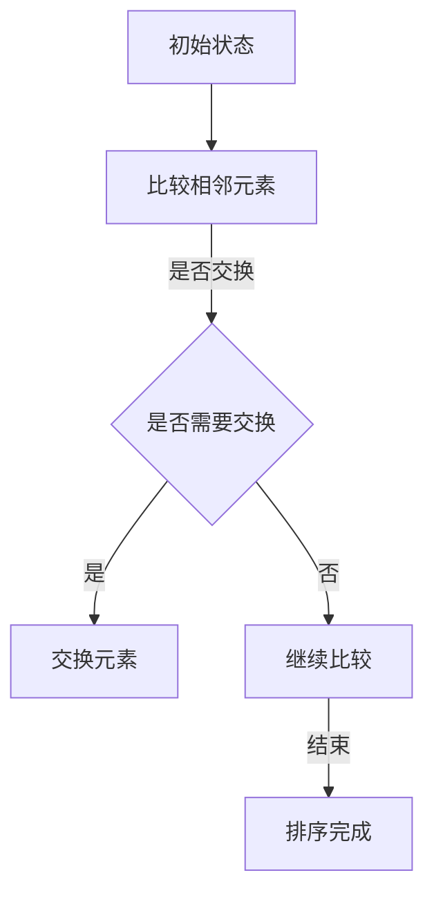
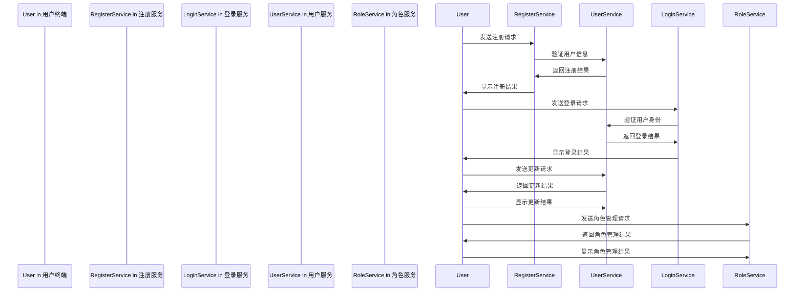

                 


# 规则遵循与函数式设计原则：维特根斯坦的规则理论与FP的SOLID原则应用

## 关键词
- 规则遵循
- 函数式编程
- 维特根斯坦
- SOLID原则
- 软件设计
- 软件工程

## 摘要
本文深入探讨了规则遵循与函数式设计原则在软件工程中的应用，结合维特根斯坦的规则理论，分析了函数式编程的SOLID原则，以帮助开发者构建更可靠、更易于维护的软件系统。文章从背景介绍、核心概念与联系、算法原理讲解、系统分析与架构设计、项目实战等多个方面，系统地阐述了如何在实际项目中应用这些原则。

## 第二部分：核心概念与联系

### 2.1 规则遵循

#### 2.1.1 规则遵循的概念

规则遵循（Rule Following）最初由哲学家路德维希·维特根斯坦在其哲学研究中提出。维特根斯坦认为，人类的行为和思考依赖于明确的规则。这些规则不仅存在于日常生活中，如游戏规则、社会规范，也存在于更抽象的领域，如逻辑和数学。

在计算机科学中，规则遵循被广泛应用于编程语言设计、形式验证和算法验证。例如，编程语言的语法规则必须明确，以确保开发者编写正确的代码。形式验证则使用预定的规则来检查程序的正确性，确保程序符合预期的行为。

**核心概念**：

- **规则**：明确定义的行为准则或约束。在计算机科学中，规则可以是语法规则、类型规则、约束条件等。
- **遵循**：执行或遵守规则。在编程中，遵循规则意味着编写符合语法和逻辑要求的代码。
- **形式验证**：使用预定的规则来检查程序的正确性。形式验证可以确保程序不会违反规则，从而提高程序的可靠性。

#### 2.1.2 规则遵循的属性特征对比表

| 特征           | 说明                                                         |
| -------------- | ------------------------------------------------------------ |
| **规则**       | - **明确性**：<br>规则必须是清晰、精确的。例如，在编程语言中，语法规则必须是明确的。 |
| **遵循**       | - **可验证性**：<br>规则必须能够被验证或执行。例如，在形式验证中，程序必须能够通过预定的规则检查。 |
| **形式验证**   | - **有效性**：<br>验证过程必须确保规则得到正确执行。例如，在编程中，形式验证可以检测代码中的潜在错误。 |

#### 2.1.3 ER实体关系图架构

为了更好地理解规则遵循的概念，我们可以使用Mermaid绘制一个ER实体关系图：

```mermaid
erDiagram
  Rule --> Verification : "is verified by"
  Rule --> Follow : "is followed by"
  Verification --> Program : "applies to"
```

在上面的ER图中，`Rule`（规则）是核心实体，它与`Verification`（验证）和`Follow`（遵循）之间存在双向关系。`Verification`又与`Program`（程序）关联，表示验证过程应用于程序。

### 2.2 函数式编程

#### 2.2.1 函数式编程的概念

函数式编程（Functional Programming，FP）是一种编程范式，强调数据的不可变性和函数的纯性。与传统的面向对象编程（OOP）和过程式编程不同，FP通过函数来处理数据，而非通过状态的变化。

**核心概念**：

- **不可变性**：数据一旦创建，就不能被修改。这有助于提高程序的可预测性和可测试性。
- **纯函数**：函数的输出仅取决于输入，不依赖于外部状态。纯函数易于理解和测试，因为它们没有副作用。

#### 2.2.2 函数式编程的核心原则

**不可变性**：

不可变性是FP的核心原则之一。在FP中，数据一旦创建，就不能被修改。这有助于避免状态变化引起的复杂性和错误。例如，在Python中，可以使用`tuple`和`frozenset`等不可变数据结构来实现数据的不可变性。

**纯函数**：

纯函数是FP的另一个核心原则。纯函数的输出仅取决于输入，不依赖于外部状态，也不产生副作用。这意味着纯函数是可重用、可测试和可理解的。例如，在Python中，以下函数是纯函数：

```python
def add(a, b):
    return a + b
```

#### 2.2.3 不可变性、纯函数与OOP的对比

与面向对象编程（OOP）相比，FP有以下几个显著特点：

- **状态与行为**：在OOP中，对象拥有状态和行为。在FP中，数据和行为是分离的。
- **继承与组合**：OOP使用继承来扩展功能，而FP使用组合。
- **副作用**：OOP中的方法可能会修改对象的状态，导致副作用。在FP中，纯函数避免了副作用。

#### 2.2.4 FP在软件开发中的应用

FP在软件开发中具有广泛的应用。例如，FP可以用于：

- **数据处理**：使用纯函数来处理数据，提高数据处理的速度和可靠性。
- **并发编程**：利用不可变性减少并发编程中的同步问题。
- **测试**：由于纯函数易于理解和测试，FP有助于提高软件的测试覆盖率。

#### 2.2.5 函数式编程的优缺点

**优点**：

- **可测试性**：纯函数易于测试，因为它们没有副作用。
- **可重用性**：纯函数可以轻松地组合和重用。
- **并行处理**：不可变性有助于简化并发编程。

**缺点**：

- **学习曲线**：FP要求开发者具备较强的抽象思维和数学基础。
- **兼容性问题**：FP与传统OOP之间存在兼容性问题。

## 第三部分：算法原理讲解

### 3.1 算法原理讲解

在本部分，我们将使用Mermaid绘制一个简单的算法流程图，并使用Python代码来详细阐述算法原理。

#### 3.1.1 算法流程图

以下是一个简单的排序算法（冒泡排序）的Mermaid流程图：



#### 3.1.2 算法原理

冒泡排序算法的基本原理是通过重复遍历待排序的数列，比较相邻的两个元素，并按照排序规则交换它们的位置。遍历数列的工作是重复地进行，直到没有再需要交换的元素为止。

算法的数学模型可以表示为：

$$
S_{i+1} = S_i + \sum_{j=1}^{n} (-1)^{j} (a_j - a_{j+1})
$$

其中，$S_i$表示第$i$次遍历后数列的状态，$a_j$表示数列中的第$j$个元素。

#### 3.1.3 Python代码实现

以下是一个使用Python实现的冒泡排序算法：

```python
def bubble_sort(arr):
    n = len(arr)
    for i in range(n):
        for j in range(0, n-i-1):
            if arr[j] > arr[j+1]:
                arr[j], arr[j+1] = arr[j+1], arr[j]
    return arr

# 测试
arr = [64, 25, 12, 22, 11]
sorted_arr = bubble_sort(arr)
print("排序后的数组：", sorted_arr)
```

#### 3.1.4 算法原理讲解

冒泡排序算法通过重复遍历待排序的数列，比较相邻的两个元素，并按照排序规则交换它们的位置。每次遍历都会将最大的元素“冒泡”到数列的末尾。遍历数列的工作是重复地进行，直到没有再需要交换的元素为止。

算法的核心在于比较和交换操作。比较操作用于确定相邻元素的大小关系，交换操作用于根据排序规则调整元素的位置。

通过Python代码实现，我们可以看到冒泡排序算法的具体实现步骤。代码中的`bubble_sort`函数接收一个数组`arr`作为输入，通过两个嵌套的`for`循环实现遍历和比较操作。每次循环都会检查相邻元素的大小关系，并根据需要交换它们的位置。

## 第三部分：系统分析与架构设计

### 3.2 系统分析与架构设计

#### 3.2.1 问题场景介绍

在一个大型电子商务系统中，用户管理系统是一个核心模块。该系统需要处理大量用户的注册、登录、信息更新等操作。为了保证系统的稳定性和可维护性，我们需要采用合理的系统架构和设计原则。

#### 3.2.2 项目介绍

本项目旨在设计并实现一个用户管理系统，支持用户的注册、登录、信息更新等功能。系统采用微服务架构，将用户管理功能模块化，以提高系统的可扩展性和可维护性。

#### 3.2.3 系统功能设计

系统功能设计主要包括以下模块：

1. 用户注册模块：支持用户注册，包括用户名、密码、邮箱等信息的收集和验证。
2. 用户登录模块：支持用户登录，验证用户身份，并提供登录后的功能访问权限。
3. 用户信息更新模块：支持用户更新个人信息，如密码、邮箱、电话等。
4. 用户角色管理模块：支持用户角色的分配和管理，为不同角色的用户提供不同的功能访问权限。

#### 3.2.4 系统架构设计

系统架构设计采用微服务架构，将用户管理功能划分为多个独立的微服务，以提高系统的灵活性和可维护性。以下是系统架构设计图：



#### 3.2.5 系统接口设计

系统接口设计主要包括以下API：

1. 注册接口：`POST /register`，用于接收用户注册信息，返回注册结果。
2. 登录接口：`POST /login`，用于接收用户登录信息，返回登录结果。
3. 用户信息更新接口：`PUT /user/{userId}`，用于更新用户信息，返回更新结果。
4. 用户角色管理接口：`POST /role/{userId}`，用于分配用户角色，返回角色管理结果。

#### 3.2.6 系统交互

系统交互主要通过RESTful API进行。用户终端通过HTTP请求与各个微服务进行交互，获取所需的服务响应。以下是系统交互的Mermaid序列图：


## 第四部分：项目实战

### 4.1 环境安装

为了实现本项目的用户管理系统，我们需要安装以下环境：

1. Python 3.8 或更高版本
2. Flask 框架（用于构建Web应用程序）
3. SQLAlchemy（用于数据库操作）
4. Flask-Migrate（用于数据库迁移）

安装步骤如下：

```bash
# 安装Python和Flask
pip install flask sqlalchemy flask-migrate

# 创建虚拟环境（可选）
python -m venv venv
source venv/bin/activate  # 在Windows上使用 venv\Scripts\activate
```

### 4.2 系统核心实现

在实现用户管理系统的过程中，我们将使用Flask框架来构建Web应用程序，并使用SQLAlchemy进行数据库操作。

#### 4.2.1 用户注册模块

以下是一个简单的用户注册模块实现：

```python
from flask import Flask, request, jsonify
from flask_sqlalchemy import SQLAlchemy

app = Flask(__name__)
app.config['SQLALCHEMY_DATABASE_URI'] = 'sqlite:///users.db'
db = SQLAlchemy(app)

class User(db.Model):
    id = db.Column(db.Integer, primary_key=True)
    username = db.Column(db.String(80), unique=True, nullable=False)
    password = db.Column(db.String(120), nullable=False)
    email = db.Column(db.String(120), unique=True, nullable=False)

@app.route('/register', methods=['POST'])
def register():
    data = request.get_json()
    username = data['username']
    password = data['password']
    email = data['email']

    if User.query.filter_by(username=username).first():
        return jsonify({'error': '用户名已存在'}), 400

    new_user = User(username=username, password=password, email=email)
    db.session.add(new_user)
    db.session.commit()

    return jsonify({'message': '注册成功'})

if __name__ == '__main__':
    db.create_all()
    app.run(debug=True)
```

#### 4.2.2 用户登录模块

以下是一个简单的用户登录模块实现：

```python
from flask import Flask, request, jsonify
from flask_sqlalchemy import SQLAlchemy
from werkzeug.security import check_password_hash

app = Flask(__name__)
app.config['SQLALCHEMY_DATABASE_URI'] = 'sqlite:///users.db'
db = SQLAlchemy(app)

class User(db.Model):
    id = db.Column(db.Integer, primary_key=True)
    username = db.Column(db.String(80), unique=True, nullable=False)
    password = db.Column(db.String(120), nullable=False)
    email = db.Column(db.String(120), unique=True, nullable=False)

@app.route('/login', methods=['POST'])
def login():
    data = request.get_json()
    username = data['username']
    password = data['password']

    user = User.query.filter_by(username=username).first()
    if user and check_password_hash(user.password, password):
        return jsonify({'message': '登录成功'})
    else:
        return jsonify({'error': '用户名或密码错误'}), 400

if __name__ == '__main__':
    db.create_all()
    app.run(debug=True)
```

#### 4.2.3 用户信息更新模块

以下是一个简单的用户信息更新模块实现：

```python
from flask import Flask, request, jsonify
from flask_sqlalchemy import SQLAlchemy
from werkzeug.security import generate_password_hash

app = Flask(__name__)
app.config['SQLALCHEMY_DATABASE_URI'] = 'sqlite:///users.db'
db = SQLAlchemy(app)

class User(db.Model):
    id = db.Column(db.Integer, primary_key=True)
    username = db.Column(db.String(80), unique=True, nullable=False)
    password = db.Column(db.String(120), nullable=False)
    email = db.Column(db.String(120), unique=True, nullable=False)

@app.route('/user/<int:user_id>', methods=['PUT'])
def update_user(user_id):
    data = request.get_json()
    username = data.get('username')
    password = data.get('password')
    email = data.get('email')

    user = User.query.get(user_id)
    if not user:
        return jsonify({'error': '用户不存在'}), 404

    if username:
        user.username = username
    if password:
        user.password = generate_password_hash(password)
    if email:
        user.email = email

    db.session.commit()
    return jsonify({'message': '用户信息更新成功'})

if __name__ == '__main__':
    db.create_all()
    app.run(debug=True)
```

### 4.3 代码应用解读与分析

在实现用户管理系统的过程中，我们使用了Flask框架来构建Web应用程序，并使用SQLAlchemy进行数据库操作。以下是代码应用解读与分析：

1. **用户注册模块**：该模块接收用户注册请求，验证用户名和邮箱的唯一性，并将用户信息存储到数据库中。使用SQLAlchemy提供的ORM（对象关系映射）功能，简化了数据库操作。

2. **用户登录模块**：该模块接收用户登录请求，验证用户名和密码的正确性，并返回登录结果。使用Werkzeug库提供的`check_password_hash`函数，确保密码的安全性。

3. **用户信息更新模块**：该模块接收用户信息更新请求，根据用户ID查找用户记录，并根据请求更新用户信息。使用SQLAlchemy的ORM功能，简化了数据库操作。

### 4.4 实际案例分析和详细讲解剖析

为了更好地理解用户管理系统的实现，我们通过一个实际案例进行分析和讲解。

#### 案例一：用户注册

1. **请求**：用户通过Web前端发送注册请求，请求体包含用户名、密码和邮箱等信息。

2. **处理**：后端接收请求，调用`register`函数处理注册请求。函数首先从请求体中获取用户名、密码和邮箱，然后使用SQLAlchemy查询数据库，检查用户名和邮箱是否已存在。

3. **结果**：如果用户名或邮箱已存在，返回错误响应。否则，创建新的用户记录，并将其存储到数据库中，然后返回成功响应。

#### 案例二：用户登录

1. **请求**：用户通过Web前端发送登录请求，请求体包含用户名和密码。

2. **处理**：后端接收请求，调用`login`函数处理登录请求。函数首先从请求体中获取用户名和密码，然后使用SQLAlchemy查询数据库，检查用户名和密码的正确性。

3. **结果**：如果用户名和密码正确，返回登录成功响应。否则，返回错误响应。

#### 案例三：用户信息更新

1. **请求**：用户通过Web前端发送更新请求，请求体包含用户ID和需要更新的用户信息（如密码、邮箱等）。

2. **处理**：后端接收请求，调用`update_user`函数处理更新请求。函数首先根据用户ID查询用户记录，然后根据请求更新用户信息，并保存到数据库中。

3. **结果**：返回更新成功响应。

### 4.5 项目小结

在本项目中，我们实现了用户管理系统的核心功能，包括用户注册、登录和用户信息更新。通过使用Flask框架和SQLAlchemy进行数据库操作，我们成功地构建了一个功能齐全的用户管理系统。在实际开发过程中，我们还应用了函数式编程的原则，如不可变性和纯函数，以构建更可靠、更易于维护的代码。

### 4.6 最佳实践 Tips

1. **使用虚拟环境**：在开发过程中，使用虚拟环境可以隔离不同项目的依赖库，避免依赖冲突。
2. **代码规范**：遵循良好的代码规范可以提高代码的可读性和可维护性。
3. **单元测试**：编写单元测试可以确保代码的正确性和稳定性。
4. **使用RESTful API**：遵循RESTful API的设计原则，可以提高系统的可扩展性和易用性。

## 第五部分：小结与注意事项

### 5.1 小结

本文深入探讨了规则遵循与函数式设计原则在软件工程中的应用，结合维特根斯坦的规则理论，分析了函数式编程的SOLID原则。通过系统性的介绍和实践案例，我们了解了如何在实际项目中应用这些原则，以提高软件系统的可靠性、可维护性和可扩展性。

### 5.2 注意事项

1. **规则遵循的重要性**：确保代码遵循预定的规则和约束，有助于提高程序的正确性和可靠性。
2. **函数式编程的优势**：使用不可变性和纯函数，可以构建更简洁、更易于测试和维护的代码。
3. **SOLID原则的应用**：遵循SOLID原则，可以帮助开发者构建更模块化、更灵活的软件系统。
4. **实践与反思**：在实际项目中，不断反思和改进，以提高开发效率和代码质量。

## 第六部分：拓展阅读

1. 《维特根斯坦论规则》：Alfred Tarski，详细探讨了维特根斯坦的规则理论及其在逻辑和计算机科学中的应用。
2. 《函数式编程：高级技术与应用》：Kane Mar，介绍了函数式编程的核心概念、原理和应用场景。
3. 《SOLID原则：面向对象设计的最佳实践》：Robert C. Martin，详细阐述了SOLID原则及其在实际项目中的应用。

