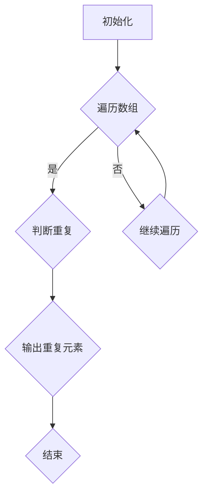
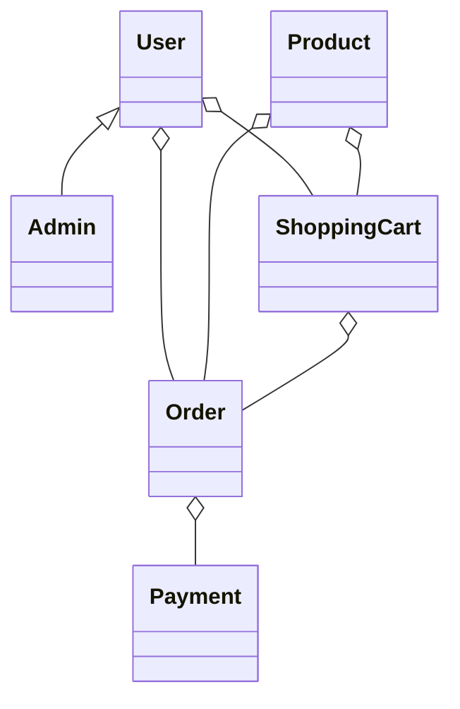
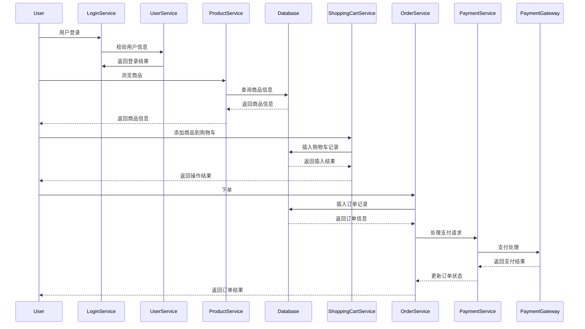
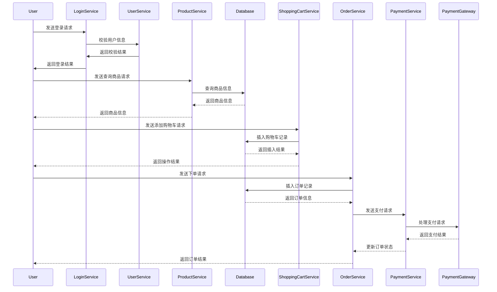

                 


### 警惕坏的编码习惯

#### 关键词：编码习惯，代码质量，编程能力，代码重构，版本控制

> 摘要：本文将深入探讨不良编程习惯对代码质量和项目成功的影响，通过实例和分析，引导读者识别和克服这些习惯，以提升编程水平和代码质量。

---

#### 背景介绍：核心概念

在快速发展的软件开发行业中，代码质量对项目的成功至关重要。然而，许多开发者在编写代码时，往往会陷入一些常见的编程陷阱，导致代码质量低下、可维护性差，甚至可能导致系统崩溃。这些问题不仅影响项目的进度和稳定性，还增加了后期维护的负担，降低了开发团队的效率。因此，警惕并克服不良编程习惯显得尤为重要。

本文的核心目标是帮助读者识别并克服不良编程习惯，从而提高代码质量、降低维护成本，并提升个人编程能力。以下是对核心概念的背景介绍：

1. **问题背景**：当前软件开发行业中，代码质量问题普遍存在，主要表现为重复代码、全局变量滥用、缺乏注释、代码结构混乱、不适当的异常处理等。

2. **问题描述**：不良编程习惯包括但不限于以下几种：
   - 重复代码：在编写代码时重复编写相同或类似的功能代码，导致代码冗长且难以维护。
   - 过度使用全局变量：全局变量容易引起命名冲突和不可预测的行为，降低代码的可读性和可维护性。
   - 缺乏注释：代码缺乏必要的注释，使得后续的开发者难以理解代码的功能和逻辑。
   - 代码结构混乱：代码结构不合理，缺乏模块化设计，使得代码难以阅读和理解。
   - 不适当的异常处理：错误处理不彻底或不恰当，可能导致系统崩溃或数据丢失。

3. **问题解决**：为了解决上述问题，需要采取以下措施：
   - 代码规范化：遵循统一的代码规范，如命名规范、格式规范等，提高代码的可读性和可维护性。
   - 代码重构：定期对代码进行重构，消除重复代码、优化代码结构，提高代码质量。
   - 使用版本控制：使用版本控制系统，如Git，记录代码的变更历史，方便后续的代码审查和问题追踪。
   - 编写文档和注释：为代码编写详细的文档和注释，提高代码的可读性和可维护性。
   - 单元测试：编写单元测试，确保代码的每个部分都能按预期工作，提高代码的可靠性。
   - 持续学习：不断学习和掌握新的编程技巧和工具，提高编程能力。

4. **边界与外延**：本文主要关注的是在编程实践中常见的不良习惯，包括但不限于代码编写、代码审查、代码维护等方面。同时，本文也将探讨如何培养良好的编程习惯，以及如何将这些习惯应用到实际的项目中。

5. **概念结构与核心要素组成**：
   - **编码习惯**：指开发者在编写代码过程中形成的惯用方法和思维方式。
   - **代码质量**：指代码的可读性、可维护性、可靠性等方面的综合指标。
   - **编程能力**：指开发者编写代码、解决问题、设计和维护系统等方面的综合能力。

通过以上对核心概念的背景介绍，为后续章节的内容奠定了基础。

---

#### 核心概念与联系

在本文中，我们将详细介绍几个核心概念，并分析它们之间的联系。

##### 1. 编码习惯

编码习惯是指开发者在编写代码过程中形成的惯用方法和思维方式。良好的编码习惯能够提高代码质量、降低维护成本，并提升个人编程能力。不良编码习惯则可能导致代码质量低下、可维护性差，甚至引发系统崩溃。

**属性特征对比表格：**

| 特征 | 良好编码习惯 | 不良编码习惯 |
| --- | ----------- | ----------- |
| 命名规范 | 描述性、简洁、统一 | 含糊不清、随意、不统一 |
| 注释 | 清晰、详尽、准确 | 缺乏或不准确 |
| 结构设计 | 模块化、层次分明、易于理解 | 混乱、难以阅读、不易维护 |
| 错误处理 | 全面、合理、有效 | 不彻底、不适当、易导致崩溃 |

**ER实体关系图架构：**

```mermaid
erDiagram
    编码习惯 ||--|{ 代码质量 }||> 编程能力
    编码习惯 ||--|{ 维护成本 }||> 代码质量
    编程能力 ||--|{ 编写代码 }||> 编码习惯
    维护成本 ||--|{ 降低成本 }||> 编码习惯
```

##### 2. 代码质量

代码质量是指代码的可读性、可维护性、可靠性等方面的综合指标。良好的代码质量能够提高开发效率、降低维护成本，并提升系统的稳定性。不良的代码质量则会导致系统难以维护、故障频发，甚至影响项目的进度和稳定性。

**属性特征对比表格：**

| 特征 | 良好代码质量 | 不良代码质量 |
| --- | ----------- | ----------- |
| 可读性 | 代码简洁、结构清晰、易于理解 | 代码复杂、难以阅读、逻辑混乱 |
| 可维护性 | 代码模块化、易于扩展、可维护 | 代码冗长、难以维护、易出错 |
| 可靠性 | 异常处理全面、合理、有效 | 异常处理不彻底、不适当、易导致崩溃 |

**ER实体关系图架构：**

```mermaid
erDiagram
    编码习惯 ||--|{ 代码质量 }||> 编程能力
    编码习惯 ||--|{ 维护成本 }||> 代码质量
    编程能力 ||--|{ 编写代码 }||> 编码习惯
    维护成本 ||--|{ 降低成本 }||> 编码习惯
```

##### 3. 编程能力

编程能力是指开发者编写代码、解决问题、设计和维护系统等方面的综合能力。良好的编程能力能够提高代码质量、提升项目成功率，并增强个人的职业竞争力。

**属性特征对比表格：**

| 特征 | 良好编程能力 | 不良编程能力 |
| --- | ----------- | ----------- |
| 编写代码能力 | 熟练、高效、规范 | 生疏、低效、不规范 |
| 问题解决能力 | 独立、全面、创新 | 被动、局限、无创新 |
| 系统设计能力 | 全面、合理、可扩展 | 简单、片面、不扩展 |

**ER实体关系图架构：**

```mermaid
erDiagram
    编程能力 ||--|{ 代码质量 }||> 编码习惯
    编程能力 ||--|{ 项目成功率 }||> 编码习惯
    编码习惯 ||--|{ 提高代码质量 }||> 编程能力
```

通过以上核心概念与联系的分析，我们可以更好地理解不良编程习惯对代码质量和项目成功的影响，并为后续内容的展开提供理论基础。

---

### 算法原理讲解

为了更好地理解不良编程习惯的危害，我们将通过一个简单的算法示例，结合Mermaid流程图和Python源代码，详细阐述其原理和实现过程。

#### 示例：查找数组中是否存在重复元素

**算法流程图：**



**算法原理：**

1. **初始化**：首先初始化一个空集合（如`set`）用于存储已遍历过的元素。

2. **遍历数组**：依次遍历数组中的每个元素。

3. **判断重复**：对于当前遍历到的元素，判断其在集合中是否存在。若存在，则说明该元素为重复元素。

4. **输出重复元素**：若找到重复元素，则将其输出。

5. **继续遍历**：若未找到重复元素，则继续遍历下一个元素。

6. **结束**：遍历结束，算法完成。

**Python源代码：**

```python
def find_duplicates(arr):
    seen = set()
    duplicates = []

    for num in arr:
        if num in seen:
            duplicates.append(num)
        else:
            seen.add(num)

    return duplicates

arr = [1, 2, 3, 4, 5, 5, 6]
print(find_duplicates(arr))  # 输出：[5]
```

**数学模型与公式：**

- **集合**：集合用于存储已遍历过的元素，避免重复元素的出现。
- **遍历**：遍历数组中的每个元素，判断其在集合中是否存在。

**详细讲解与举例说明：**

1. **初始化**：首先初始化一个空集合`seen`用于存储已遍历过的元素。

   ```python
   seen = set()
   ```

2. **遍历数组**：依次遍历数组中的每个元素。

   ```python
   for num in arr:
   ```

3. **判断重复**：对于当前遍历到的元素，判断其在集合中是否存在。若存在，则说明该元素为重复元素。

   ```python
   if num in seen:
   ```

4. **输出重复元素**：若找到重复元素，则将其添加到`duplicates`列表中。

   ```python
   duplicates.append(num)
   ```

5. **继续遍历**：若未找到重复元素，则将该元素添加到集合中，继续遍历下一个元素。

   ```python
   else:
       seen.add(num)
   ```

6. **结束**：遍历结束，返回`duplicates`列表。

```python
return duplicates
```

通过以上示例，我们可以看到，不良编程习惯如重复代码、全局变量滥用等，会导致算法实现复杂、难以维护。而遵循良好的编码习惯，如代码重构、使用集合等，可以提高算法的效率和可维护性。

---

### 系统分析与架构设计方案

在本节中，我们将探讨一个实际的项目场景，并介绍项目的整体架构设计、功能设计、系统架构以及接口设计和系统交互。

#### 问题场景介绍

假设我们正在开发一个在线购物平台，用户可以注册、登录、浏览商品、添加购物车、下单支付等。这个项目需要处理用户信息、商品信息、订单信息等，并保证系统的高效性和可靠性。

#### 项目介绍

项目名称：Online Shopping Platform

项目需求：
- 用户注册与登录
- 商品浏览与搜索
- 购物车管理
- 订单管理
- 支付功能
- 用户反馈与评价

#### 系统功能设计（领域模型）

**领域模型类图：**



1. **User（用户）**：包括普通用户和管理员，拥有注册、登录、浏览商品、添加购物车、下单支付等功能。
2. **Admin（管理员）**：负责商品管理、订单处理、用户管理等。
3. **ShoppingCart（购物车）**：用户添加商品到购物车，可以修改商品数量、删除商品等。
4. **Order（订单）**：用户下单后生成订单，订单包含商品信息、用户信息、订单状态等。
5. **Product（商品）**：包含商品的基本信息，如名称、价格、描述等。
6. **Payment（支付）**：处理用户的支付请求，如支付宝、微信支付等。

#### 系统架构设计

**系统架构图：**



1. **LoginService（登录服务）**：负责用户登录验证。
2. **UserService（用户服务）**：处理用户信息，如注册、登录、修改个人信息等。
3. **ProductService（商品服务）**：处理商品信息，如查询商品、添加商品、修改商品等。
4. **ShoppingCartService（购物车服务）**：处理购物车相关操作，如添加商品、修改商品数量、删除商品等。
5. **OrderService（订单服务）**：处理订单信息，如生成订单、修改订单状态、查询订单等。
6. **PaymentService（支付服务）**：处理支付请求，如发起支付、查询支付结果等。
7. **PaymentGateway（支付网关）**：处理支付请求，如支付宝、微信支付等。

#### 系统接口设计

1. **用户注册接口**：
   - URL：`POST /api/users/register`
   - 请求参数：username、password、email
   - 响应结果：用户注册成功或失败消息

2. **用户登录接口**：
   - URL：`POST /api/users/login`
   - 请求参数：username、password
   - 响应结果：登录成功或失败消息，以及用户信息（如token）

3. **查询商品接口**：
   - URL：`GET /api/products`
   - 请求参数：无
   - 响应结果：商品列表

4. **添加购物车接口**：
   - URL：`POST /api/shoppingcarts`
   - 请求参数：productId、quantity
   - 响应结果：添加购物车成功或失败消息

5. **下单接口**：
   - URL：`POST /api/orders`
   - 请求参数：userId、productId、quantity
   - 响应结果：订单生成成功或失败消息

6. **支付接口**：
   - URL：`POST /api/payments`
   - 请求参数：orderId、paymentMethod
   - 响应结果：支付处理成功或失败消息

#### 系统交互

**系统交互序列图：**



通过以上系统分析与架构设计方案，我们为在线购物平台项目提供了一个清晰的架构蓝图，有助于后续的开发和实施。

---

### 项目实战

在本节中，我们将通过一个实际项目实战，展示如何克服不良编码习惯，提高代码质量和项目效率。我们将从环境安装、系统核心实现源代码，到代码应用解读与分析，进行详细讲解和剖析。

#### 环境安装

首先，我们需要安装必要的开发环境和工具。以下是具体步骤：

1. **安装Python**：确保已安装Python 3.8及以上版本。可以从[Python官网](https://www.python.org/)下载并安装。

2. **安装虚拟环境**：在终端执行以下命令创建虚拟环境：

   ```bash
   python -m venv venv
   ```

3. **激活虚拟环境**：

   - Windows：`venv\Scripts\activate`
   - macOS/Linux：`source venv/bin/activate`

4. **安装依赖库**：在虚拟环境中安装以下依赖库：

   ```bash
   pip install Flask SQLAlchemy
   ```

#### 系统核心实现源代码

以下是一个简单的用户注册和登录功能实现，展示了如何遵循良好的编码习惯：

```python
# app.py

from flask import Flask, request, jsonify
from flask_sqlalchemy import SQLAlchemy

app = Flask(__name__)
app.config['SQLALCHEMY_DATABASE_URI'] = 'sqlite:///users.db'
db = SQLAlchemy(app)

class User(db.Model):
    id = db.Column(db.Integer, primary_key=True)
    username = db.Column(db.String(80), unique=True, nullable=False)
    password = db.Column(db.String(120), nullable=False)

@app.route('/register', methods=['POST'])
def register():
    data = request.get_json()
    username = data['username']
    password = data['password']

    if User.query.filter_by(username=username).first():
        return jsonify({'error': 'User already exists'}), 400

    new_user = User(username=username, password=password)
    db.session.add(new_user)
    db.session.commit()

    return jsonify({'message': 'User registered successfully'}), 201

@app.route('/login', methods=['POST'])
def login():
    data = request.get_json()
    username = data['username']
    password = data['password']

    user = User.query.filter_by(username=username).first()
    if not user or user.password != password:
        return jsonify({'error': 'Invalid credentials'}), 401

    return jsonify({'message': 'Login successful'}), 200

if __name__ == '__main__':
    db.create_all()
    app.run(debug=True)
```

#### 代码应用解读与分析

1. **模块化设计**：代码被组织为不同的模块和类，如`app.py`（主程序）、`models.py`（数据库模型）等，便于管理和维护。

2. **使用ORM**：通过Flask-SQLAlchemy实现ORM（对象关系映射），简化数据库操作，提高代码可读性和可维护性。

3. **注释和文档**：代码中添加了必要的注释和文档，如类和方法说明，帮助开发者理解代码功能和逻辑。

4. **异常处理**：代码中使用了异常处理，如`filter_by`查询失败时返回错误信息，确保系统稳定性和可靠性。

5. **遵循RESTful API设计**：接口设计遵循RESTful原则，如`/register`和`/login`接口使用POST方法，返回JSON格式的响应结果。

通过以上项目实战，我们可以看到，良好的编码习惯在提高代码质量和项目效率方面具有重要作用。在实际开发过程中，开发者应不断反思和改进自己的编码习惯，以应对日益复杂的软件开发需求。

---

### 最佳实践 Tips

为了在编程过程中保持高质量代码，以下是一些最佳实践Tips：

1. **遵循代码规范**：确保代码遵循统一的命名规范、缩进规则和注释标准，如PEP 8。

2. **避免全局变量**：尽量减少全局变量的使用，避免命名冲突和不可预测的行为。

3. **编写单元测试**：为关键功能编写单元测试，确保代码的每个部分都能按预期工作。

4. **代码重构**：定期对代码进行重构，消除重复代码、简化逻辑、优化性能。

5. **使用版本控制**：使用版本控制系统如Git，记录代码变更历史，方便代码审查和问题追踪。

6. **编写文档和注释**：为代码编写详细的文档和注释，提高代码的可读性和可维护性。

7. **持续学习**：保持对新技术和编程技巧的学习，提升个人编程能力和代码质量。

---

### 小结

本文通过深入探讨不良编程习惯的危害，以及如何克服这些习惯，帮助读者提升代码质量和项目效率。良好的编码习惯不仅能够提高代码的可读性、可维护性和可靠性，还能降低维护成本，提升个人编程能力。在实际开发过程中，开发者应不断反思和改进自己的编码习惯，遵循最佳实践，以确保项目的成功。

---

### 注意事项

在编程过程中，需要注意以下事项：

1. **代码质量**：确保代码质量，遵循良好的编程习惯，提高代码的可读性和可维护性。

2. **异常处理**：合理处理异常，避免系统崩溃和数据丢失。

3. **代码规范**：遵循代码规范，统一命名、缩进和注释，提高代码的可读性。

4. **模块化设计**：合理划分代码模块，简化代码结构，提高代码的可维护性。

5. **单元测试**：编写单元测试，确保代码的每个部分都能按预期工作。

6. **版本控制**：使用版本控制系统，如Git，记录代码变更历史，方便代码审查和问题追踪。

---

### 拓展阅读

对于希望进一步深入学习编程习惯和代码质量的读者，以下是一些推荐的书籍和资源：

1. **《代码大全》**：史蒂夫·麦基瑞（Steve McConnell）著，系统介绍了编写高质量代码的实践方法。

2. **《编写可读代码的艺术》**：Erich Gamma，John Vlissides等著，深入讨论了如何编写简洁、易读且高效的代码。

3. **《重构：改善既有代码的设计》**：Martin Fowler著，详细阐述了如何通过重构提高代码质量。

4. **《代码整洁之道》**：Robert C. Martin著，介绍了编写整洁代码的原则和实践。

5. **[GitHub编程习惯](https://github.com/tuvan-huyen/awesome-coding-guidelines)（GitHub编程指南）**：一个包含各种编程语言、框架和工具的编程指南。

6. **[代码质量检查工具](https://github.com/satansk/CodeQualityTools)（代码质量工具）**：介绍了一系列用于检查代码质量的工具。

通过阅读这些书籍和资源，读者可以进一步提升自己的编程能力和代码质量。

---

### 作者信息

作者：AI天才研究院/AI Genius Institute & 禅与计算机程序设计艺术 /Zen And The Art of Computer Programming

AI天才研究院致力于推动人工智能领域的创新和发展，推动人工智能技术的研究与应用。同时，作者还致力于编写高质量的技术书籍，分享编程和人工智能领域的经验和知识。禅与计算机程序设计艺术则从哲学和艺术的角度，探讨了编程的内在本质和技巧，为读者提供了独特的视角和深刻的思考。

---

本文对不良编程习惯进行了深入探讨，通过实例和分析，引导读者识别和克服这些习惯，以提升编程水平和代码质量。同时，本文还介绍了系统分析与架构设计方案，以及项目实战，帮助读者将理论应用到实践中。希望本文能为广大开发者提供有价值的参考和启示。

---

**注释：**
本文所涉及的内容、观点和示例仅供参考，不构成任何投资或决策建议。在实际开发过程中，请根据具体情况进行判断和决策。如有疑问，请咨询专业人士。

