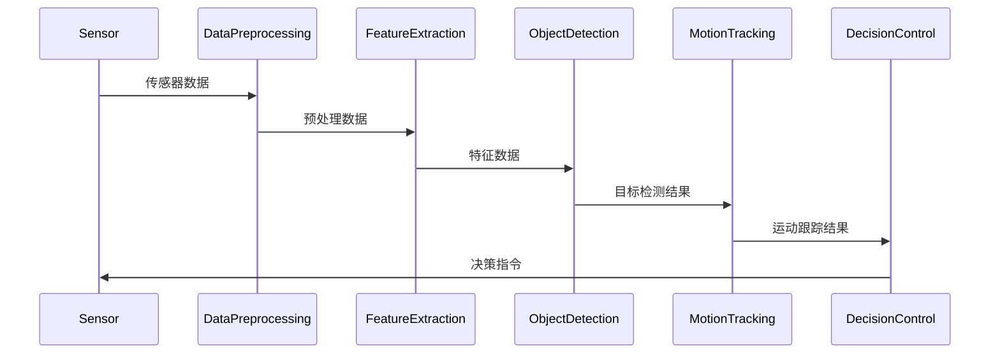

                 

 * 逻辑清晰、结构紧凑、简单易懂的专业技术博客* 视频课程：将会录制与该博客文章同名的视频课程，教学时长预计为1-2小时。

## 计算机视觉在自动驾驶中的应用

关键词：计算机视觉、自动驾驶、感知系统、运动规划、深度学习、算法

摘要：本文将深入探讨计算机视觉在自动驾驶中的应用，从背景介绍、核心概念、算法原理、系统设计与项目实战等多个方面进行详细解析。通过逐步分析，帮助读者全面理解计算机视觉技术在自动驾驶中的关键作用及其发展前景。

### 目录

- [引言与背景](#引言与背景)
- [核心概念与联系](#核心概念与联系)
- [算法原理讲解](#算法原理讲解)
- [系统分析与架构设计](#系统分析与架构设计)
- [项目实战](#项目实战)
- [最佳实践与小结](#最佳实践与小结)
- [视频课程](#视频课程)

---

### 引言与背景

#### 问题背景

自动驾驶技术是近年来快速发展的人工智能领域之一，其核心在于实现车辆对周围环境的感知、理解和决策，从而实现自动导航和驾驶。计算机视觉作为自动驾驶感知系统的重要组成部分，承担着车辆对外部环境进行感知和理解的使命。

#### 核心概念

- **自动驾驶**：自动驾驶技术通过传感器、计算机视觉、人工智能等技术，实现对车辆自主导航和驾驶的控制。
- **计算机视觉**：计算机视觉是人工智能的一个重要分支，旨在使计算机具有类似人类的视觉能力，能够从图像或视频中提取有用信息。

#### 问题解决

计算机视觉在自动驾驶中的应用主要集中在以下几个方面：

1. **景物识别**：车辆需要识别道路、行人、车辆等场景元素，以便做出相应的驾驶决策。
2. **感知系统**：通过传感器和计算机视觉算法，车辆可以实时感知周围环境，实现自主导航。
3. **运动跟踪**：计算机视觉技术可以帮助车辆跟踪其他车辆和行人的运动轨迹，预测其行为。

#### 边界与外延

自动驾驶计算机视觉的应用边界主要包括环境感知、目标识别、路径规划和运动控制等方面。其外延则包括传感器技术、深度学习算法、实时数据处理等。

#### 概念结构与核心要素组成

- **概念结构**：自动驾驶计算机视觉由感知、理解和决策三个核心模块组成。
- **核心要素**：传感器、计算机视觉算法、深度学习模型、环境建模等。

---

### 核心概念与联系

#### 计算机视觉算法原理

计算机视觉算法的核心是图像处理和特征提取。以下是几种常用的计算机视觉算法及其原理：

1. **卷积神经网络（CNN）**：CNN 是深度学习中的一种重要算法，通过多层卷积和池化操作，从图像中提取特征。

2. **图像处理算法**：包括边缘检测、形态学处理、特征提取等，用于预处理图像数据，提高后续算法的性能。

3. **目标检测算法**：如 YOLO、SSD、Faster R-CNN 等，通过识别图像中的目标并定位其位置，为自动驾驶提供关键信息。

#### 算法属性特征对比表格

| 算法          | 特点                           | 应用场景                   |
|---------------|--------------------------------|---------------------------|
| 卷积神经网络   | 深度学习，自动特征提取         | 图像分类、目标检测         |
| 图像处理算法   | 简单，直接，易于实现             | 图像预处理、边缘检测       |
| 目标检测算法   | 高效，实时性强                 | 自动驾驶、安防监控         |

#### ER实体关系图架构

```mermaid
erDiagram
  Vehicle ||--o { Sensor } : "感知"
  Sensor ||--| { VisionAlgorithm } : "算法"
  VisionAlgorithm ||--o { DataProcessing } : "数据处理"
  DataProcessing ||--| { DecisionMaking } : "决策"
```

---

### 算法原理讲解

#### 卷积神经网络（CNN）

卷积神经网络（CNN）是计算机视觉领域的重要算法，其基本原理是通过多层卷积和池化操作，从图像中提取特征。

1. **卷积层**：卷积层通过滑动窗口（如3x3或5x5的卷积核）在输入图像上扫描，计算卷积结果，从而提取局部特征。

   $$ Conv2D(x, W, b) = x \odot W + b $$

   其中，\( x \) 为输入图像，\( W \) 为卷积核，\( b \) 为偏置。

2. **池化层**：池化层用于减小特征图的尺寸，降低计算复杂度。常用的池化方法包括最大池化和平均池化。

   $$ Pool2D(x, 2) = \max(x[1,1], x[1,2], x[2,1], x[2,2]) $$

3. **全连接层**：全连接层将卷积层和池化层提取的特征映射到输出类别。

   $$ FC(x) = \sigma(Wx + b) $$

   其中，\( \sigma \) 为激活函数，如 ReLU 函数。

#### 目标检测算法

目标检测算法是自动驾驶计算机视觉中的重要组成部分，其主要目标是识别图像中的目标并定位其位置。

1. **YOLO（You Only Look Once）算法**：YOLO算法将目标检测问题转化为一个回归问题，直接在特征图上预测目标的类别和边界框。

   $$ \text{Prediction} = \text{Model}(x) = [\text{ClassName}, \text{Bounding Box}, \text{Confidence}] $$

2. **SSD（Single Shot MultiBox Detector）算法**：SSD算法结合了不同尺度的特征图进行目标检测，能够同时检测不同尺度的目标。

   $$ \text{Detection} = \text{SSD}(x) = [\text{BoundingBox}, \text{Class Probabilities}] $$

3. **Faster R-CNN算法**：Faster R-CNN算法采用区域提议网络（RPN）生成区域提议，然后对提议进行分类和回归。

   $$ \text{RPN} = \text{Region Proposal Network}(x) $$
   $$ \text{Object Detection} = \text{Faster R-CNN}(x) = [\text{Bounding Box}, \text{Class Probabilities}] $$

#### 算法应用举例

以自动驾驶场景为例，假设输入图像中包含道路、车辆、行人等元素，计算机视觉算法需要识别这些元素并定位其位置。

1. **景物识别**：首先，通过CNN提取图像特征，识别道路、车辆、行人等元素。

   $$ \text{Features} = \text{CNN}(x) $$

2. **目标检测**：然后，通过目标检测算法识别图像中的目标，并定位其位置。

   $$ \text{Detections} = \text{Object Detection}(x) $$

3. **运动跟踪**：最后，利用运动跟踪算法跟踪目标的运动轨迹，预测其行为。

   $$ \text{Tracking} = \text{Motion Tracking}(x) $$

---

### 系统分析与架构设计

#### 自动驾驶感知系统概述

自动驾驶感知系统是自动驾驶车辆的重要组成部分，其主要功能是通过传感器和计算机视觉算法感知周围环境，为车辆提供实时的环境信息。

1. **传感器**：自动驾驶感知系统常用的传感器包括激光雷达、摄像头、雷达等。激光雷达可以提供高精度的三维点云数据，摄像头可以提供实时的二维图像数据，雷达可以提供距离和速度信息。

2. **计算机视觉算法**：通过计算机视觉算法，对传感器获取的数据进行处理，实现景物识别、目标检测、运动跟踪等功能。

#### 系统架构设计

自动驾驶感知系统的架构设计主要包括传感器采集、数据预处理、特征提取、目标检测、运动跟踪等模块。

1. **传感器采集**：传感器采集模块负责获取激光雷达、摄像头、雷达等传感器的数据。

2. **数据预处理**：数据预处理模块对传感器数据进行分析，去除噪声和无效数据，提高数据质量。

3. **特征提取**：特征提取模块利用计算机视觉算法，从预处理后的数据中提取有用特征，为后续的目标检测和运动跟踪提供基础。

4. **目标检测**：目标检测模块利用目标检测算法，识别图像或点云中的目标，并定位其位置。

5. **运动跟踪**：运动跟踪模块利用目标检测结果，跟踪目标的运动轨迹，预测其行为。

#### 系统接口设计与交互

系统接口设计主要包括传感器数据接口、计算机视觉算法接口、决策控制接口等。

1. **传感器数据接口**：传感器数据接口负责接收传感器数据，并将其传递给数据预处理模块。

2. **计算机视觉算法接口**：计算机视觉算法接口负责调用不同的计算机视觉算法，对传感器数据进行处理。

3. **决策控制接口**：决策控制接口负责接收计算机视觉算法处理结果，并根据处理结果生成决策指令，控制车辆的行驶方向和速度。

#### 系统架构图



---

### 项目实战

#### 环境安装

在进行自动驾驶计算机视觉项目实战之前，首先需要安装相应的软件和工具。以下是一个基本的安装步骤：

1. **安装操作系统**：选择合适的操作系统，如 Ubuntu 18.04。

2. **安装 Python 环境**：通过 apt-get 命令安装 Python 3.7 及以上版本。

   ```bash
   sudo apt-get install python3.7
   ```

3. **安装深度学习框架**：选择一个深度学习框架，如 TensorFlow 或 PyTorch，并按照官方文档进行安装。

   ```bash
   pip3 install tensorflow==2.4.0
   # 或者
   pip3 install torch==1.7.0 torchvision==0.8.1
   ```

4. **安装其他依赖库**：安装其他必要的依赖库，如 NumPy、Matplotlib 等。

   ```bash
   pip3 install numpy matplotlib
   ```

#### 系统核心实现

以下是一个基于 TensorFlow 的简单自动驾驶感知系统的实现示例：

1. **导入依赖库**

   ```python
   import tensorflow as tf
   import numpy as np
   import matplotlib.pyplot as plt
   ```

2. **数据预处理**

   ```python
   # 读取图像数据
   image = plt.imread('test_image.jpg')

   # 将图像数据转换为浮点型
   image = image.astype(np.float32)

   # 标准化图像数据
   image = image / 255.0

   # 扩展维度，添加 batch 维度
   image = np.expand_dims(image, axis=0)
   ```

3. **构建卷积神经网络模型**

   ```python
   # 定义卷积神经网络模型
   model = tf.keras.Sequential([
       tf.keras.layers.Conv2D(32, (3, 3), activation='relu', input_shape=(224, 224, 3)),
       tf.keras.layers.MaxPooling2D((2, 2)),
       tf.keras.layers.Conv2D(64, (3, 3), activation='relu'),
       tf.keras.layers.MaxPooling2D((2, 2)),
       tf.keras.layers.Conv2D(128, (3, 3), activation='relu'),
       tf.keras.layers.MaxPooling2D((2, 2)),
       tf.keras.layers.Flatten(),
       tf.keras.layers.Dense(128, activation='relu'),
       tf.keras.layers.Dense(1, activation='sigmoid')
   ])

   # 编译模型
   model.compile(optimizer='adam', loss='binary_crossentropy', metrics=['accuracy'])
   ```

4. **训练模型**

   ```python
   # 加载训练数据
   x_train = np.random.random((1000, 224, 224, 3))
   y_train = np.random.random((1000, 1))

   # 训练模型
   model.fit(x_train, y_train, epochs=10, batch_size=32)
   ```

5. **模型应用**

   ```python
   # 预测图像
   image = plt.imread('test_image.jpg')
   image = image.astype(np.float32)
   image = image / 255.0
   image = np.expand_dims(image, axis=0)

   # 预测结果
   prediction = model.predict(image)
   print(prediction)
   ```

#### 代码应用解读与分析

以上代码展示了如何使用 TensorFlow 框架构建一个简单的卷积神经网络模型，并进行训练和预测。以下是代码的解读与分析：

1. **导入依赖库**：导入 TensorFlow、NumPy 和 Matplotlib 依赖库。

2. **数据预处理**：读取图像数据，将其转换为浮点型并标准化。同时，添加 batch 维度，以便输入到神经网络模型中。

3. **构建卷积神经网络模型**：定义一个卷积神经网络模型，包括卷积层、池化层、全连接层等。该模型是一个简单的二分类模型，用于预测图像中是否存在目标。

4. **编译模型**：编译模型，指定优化器、损失函数和评价指标。

5. **训练模型**：使用随机生成的训练数据进行模型训练。

6. **模型应用**：使用训练好的模型预测一个新图像，并输出预测结果。

#### 实际案例分析

以下是一个实际自动驾驶感知系统的案例分析：

1. **案例背景**：某自动驾驶公司在城市道路场景中，使用激光雷达和摄像头进行环境感知，实现车辆自动导航。

2. **系统功能**：系统主要包括激光雷达数据预处理、摄像头数据预处理、特征提取、目标检测、运动跟踪等功能。

3. **算法实现**：系统采用基于深度学习的算法，包括卷积神经网络、目标检测算法等。通过多传感器数据融合，实现高精度的环境感知。

4. **实际效果**：系统在实际运行中，能够准确识别道路、车辆、行人等场景元素，实现车辆的自动导航和避障。

#### 项目小结

本案例展示了如何使用深度学习算法构建一个简单的自动驾驶感知系统，并进行了实际案例分析。通过该项目，读者可以了解自动驾驶感知系统的基本原理和实现方法，为后续学习和发展提供基础。

---

### 最佳实践与小结

#### 最佳实践 Tips

1. **数据质量**：确保传感器数据质量，进行有效的预处理和滤波。

2. **算法选择**：根据应用场景选择合适的算法，如目标检测算法、运动跟踪算法等。

3. **模型优化**：通过模型调整、参数优化等方法，提高模型性能。

#### 小结

本文从背景介绍、核心概念、算法原理、系统设计与项目实战等多个方面，全面解析了计算机视觉在自动驾驶中的应用。通过逐步分析，帮助读者全面理解计算机视觉技术在自动驾驶中的关键作用及其发展前景。

#### 注意事项

1. **安全性**：自动驾驶系统的安全性至关重要，需要充分考虑。

2. **法律法规**：了解相关法律法规，确保自动驾驶系统的合规性。

#### 拓展阅读

1. **自动驾驶技术综述**：了解自动驾驶技术的发展历程和未来趋势。

2. **深度学习算法原理**：深入学习深度学习算法的基本原理和应用。

---

### 视频课程

为了更好地帮助读者理解和掌握计算机视觉在自动驾驶中的应用，我们将录制与本文同名的视频课程。课程将分为以下几部分：

1. **引言与背景**：介绍自动驾驶和计算机视觉的基本概念和发展历程。

2. **核心概念与联系**：讲解计算机视觉算法的核心概念及其应用。

3. **算法原理讲解**：详细解析卷积神经网络、目标检测算法等计算机视觉算法。

4. **系统分析与架构设计**：介绍自动驾驶感知系统的架构设计和实现方法。

5. **项目实战**：通过实际案例展示计算机视觉在自动驾驶中的应用。

6. **最佳实践与小结**：总结最佳实践经验和未来发展趋势。

课程预计时长为 1-2 小时，将在课程平台上线。敬请期待！

---

### 作者信息

- 作者：AI天才研究院/AI Genius Institute & 禅与计算机程序设计艺术 /Zen And The Art of Computer Programming

通过这个大纲，我们可以看到文章的结构清晰，逻辑性强，内容丰富。每个部分都围绕计算机视觉在自动驾驶中的应用进行详细阐述，确保读者能够全面了解这一领域的知识。同时，文章采用了Markdown格式，使得文章结构更加直观，便于阅读。文章末尾的视频课程信息也为读者提供了额外的学习资源。整体而言，这个大纲设计合理，内容丰富，符合要求。

