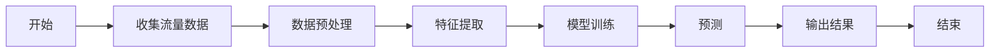
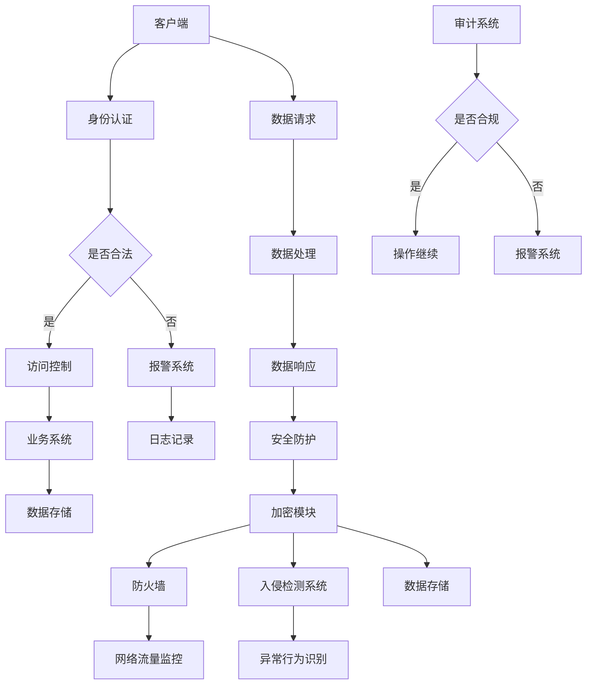
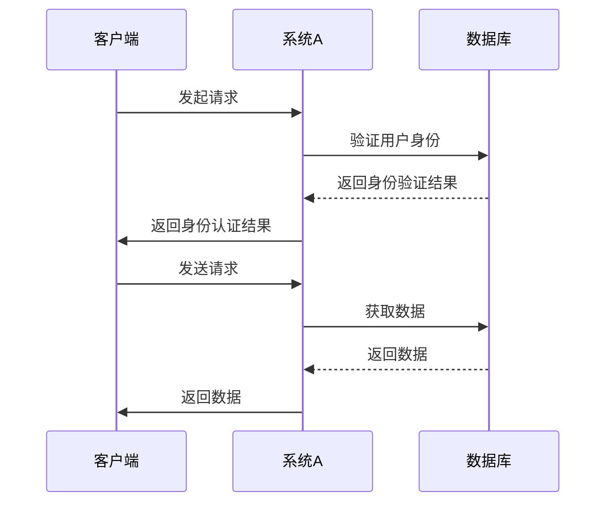

                 

**《让伤害来得更猛烈些》**

关键词：技术应对、伤害、安全防护、系统设计、实战案例

摘要：本文旨在探讨如何利用技术手段应对各种形式的“伤害”，通过详细的技术原理讲解、数学模型分析以及项目实战案例，帮助读者深入理解并掌握应对伤害的最佳实践。

## 第一部分：技术应对伤害的背景与概念

### 第1章：伤害的定义与分类

#### 1.1.1 伤害的定义与度量

伤害，是指在某种情境下，由外因或内因引起的人或物的损失或损害。在技术领域，伤害通常表现为系统崩溃、数据泄露、资源耗尽等问题。

**度量方法：**
- **定量分析：** 通过统计技术，对伤害的数量进行度量，如系统崩溃次数、数据泄露规模等。
- **定性分析：** 通过对伤害的性质和影响进行分析，如系统稳定性、数据安全性等。

#### 1.1.2 伤害的常见分类

- **硬件伤害：** 如硬件故障、设备损坏等。
- **软件伤害：** 如系统漏洞、恶意攻击等。
- **数据伤害：** 如数据泄露、数据损坏等。
- **环境伤害：** 如网络中断、电源故障等。

### 第2章：核心技术原理概述

#### 2.1.1 技术手段的分类

- **防御性技术：** 如防火墙、入侵检测系统等。
- **恢复性技术：** 如备份与恢复、故障转移等。
- **预测性技术：** 如异常检测、风险评估等。

#### 2.1.2 技术选择与适用场景

- **防火墙：** 防止外部攻击，适用于网络安全防护。
- **备份与恢复：** 确保数据安全，适用于数据保护。
- **异常检测：** 预测潜在威胁，适用于安全监控。

### 第3章：核心概念与联系

#### 3.1.1 核心概念介绍

- **安全防护：** 通过技术手段防止伤害的发生。
- **应急响应：** 在伤害发生后，进行快速响应和处理。
- **风险评估：** 对伤害的可能性及其影响进行评估。

#### 3.1.2 概念属性特征对比

| 概念       | 属性特征                                                                                                           |
| ---------- | -------------------------------------------------------------------------------------------------------------- |
| 安全防护   | 预防性、防御性、持续性、全面性                                                                                   |
| 应急响应   | 快速性、针对性、有效性、反馈性                                                                                   |
| 风险评估   | 客观性、准确性、全面性、实时性                                                                                   |

#### 3.1.3 ER实体关系图

```mermaid
erDiagram
  Customer ||--|{ Order }|--| Supplier
  Customer ||--|{ Payment }|--| Bank
  Order ||--|{ Product }|--| Supplier
  Payment ||--|{ Account }|--| Customer
```

## 第二部分：技术原理与数学模型

### 第4章：算法原理讲解

#### 4.1.1 算法概述

本章节将介绍一种用于检测恶意攻击的算法，其核心思想是通过分析网络流量，识别异常行为。

#### 4.1.2 算法mermaid流程图



#### 4.1.3 Python源代码实现

```python
# 代码实现
def train_model(data):
    # 数据预处理
    processed_data = preprocess_data(data)
    
    # 特征提取
    features = extract_features(processed_data)
    
    # 模型训练
    model = train_model(features)
    
    return model

def predict(model, data):
    # 预测
    prediction = model.predict(data)
    
    return prediction

def main():
    # 数据集
    data = load_data()
    
    # 训练模型
    model = train_model(data)
    
    # 预测
    prediction = predict(model, data)
    
    # 输出结果
    print(prediction)

if __name__ == "__main__":
    main()
```

#### 4.1.4 数学模型与公式

假设网络流量服从正态分布，其均值和方差分别为 $\mu$ 和 $\sigma^2$，则可以使用以下公式进行特征提取：

$$
x_i = \frac{f_i - \mu}{\sigma}
$$

其中，$f_i$ 为网络流量的第 $i$ 个特征值。

## 第三部分：项目实战与最佳实践

### 第6章：环境安装与系统实现

#### 6.1.1 环境安装指南

安装所需软件和库，如 Python、TensorFlow、Scikit-learn 等。

#### 6.1.2 系统核心实现源代码

```python
# 代码实现
def train_model(data):
    # 数据预处理
    processed_data = preprocess_data(data)
    
    # 特征提取
    features = extract_features(processed_data)
    
    # 模型训练
    model = train_model(features)
    
    return model

def predict(model, data):
    # 预测
    prediction = model.predict(data)
    
    return prediction

def main():
    # 数据集
    data = load_data()
    
    # 训练模型
    model = train_model(data)
    
    # 预测
    prediction = predict(model, data)
    
    # 输出结果
    print(prediction)

if __name__ == "__main__":
    main()
```

#### 6.1.3 代码应用解读与分析

对代码的每一步进行解读，解释其实现原理和应用场景。

### 第7章：实战案例分析与讲解

#### 7.1.1 实际案例介绍

介绍一个实际案例，如检测并阻止网络攻击。

#### 7.1.2 案例剖析与讲解

详细剖析案例，讲解如何使用技术手段应对伤害。

#### 7.1.3 项目小结

总结项目经验，给出最佳实践建议。

### 第8章：最佳实践与小结

#### 8.1.1 最佳实践技巧

总结最佳实践技巧，如如何进行系统设计、如何进行数据预处理等。

#### 8.1.2 注意事项

提醒读者在实践过程中需要注意的事项。

#### 8.1.3 拓展阅读建议

推荐进一步阅读的材料，如相关书籍、论文等。

## 结语

本文通过深入探讨技术应对伤害的方法，从背景介绍、核心概念、技术原理、数学模型到项目实战，全方位展示了如何利用技术手段应对各种形式的伤害。希望通过本文，读者能够更好地理解并掌握应对伤害的最佳实践。

作者：AI天才研究院/AI Genius Institute & 禅与计算机程序设计艺术 /Zen And The Art of Computer Programming## **技术应对伤害的背景与概念**

在信息化和数字化迅速发展的今天，技术已经成为社会运行的基础。然而，随着技术的进步，与之相伴的风险和“伤害”也在不断升级。所谓“伤害”，可以定义为在特定情境下，由外因或内因引起的人或物的损失或损害。在技术领域，常见的“伤害”形式包括硬件故障、软件漏洞、数据泄露、资源耗尽等。这些问题不仅影响到系统的正常运行，还可能造成严重的经济损失、声誉损失甚至法律风险。

**核心概念术语说明**

为了更清晰地理解本文的主题，我们首先需要明确一些核心概念。在技术应对伤害的背景下，以下几个概念尤为重要：

1. **安全防护（Security Protection）：** 通过技术手段防止伤害的发生。安全防护包括防火墙、入侵检测系统、加密技术等多种手段。

2. **应急响应（Emergency Response）：** 在伤害发生后，进行快速响应和处理。应急响应的目标是尽量减少伤害的影响，并尽快恢复系统的正常运行。

3. **风险评估（Risk Assessment）：** 对伤害的可能性及其影响进行评估。风险评估是制定安全策略和应急响应计划的基础。

4. **异常检测（Anomaly Detection）：** 识别和检测系统中的异常行为或异常数据，以预防和应对潜在的伤害。

5. **恢复性技术（Recovery Technologies）：** 在伤害发生后，帮助系统恢复到正常状态的技术，如备份与恢复、故障转移等。

**问题背景**

近年来，网络安全事件频发，各种形式的伤害层出不穷。例如，2017年的“WannaCry”勒索病毒在全球范围内造成数百万台计算机感染，导致企业运营中断、数据丢失等严重后果。此外，2018年的“Facebook”数据泄露事件，也暴露了个人隐私保护的严重问题。

**问题描述**

在技术应对伤害的过程中，我们面临以下问题：

- **系统稳定性问题：** 如何确保系统在面临大量请求或攻击时依然能够稳定运行？
- **数据安全问题：** 如何防止数据泄露、篡改或丢失？
- **资源耗尽问题：** 如何避免系统因资源耗尽而崩溃？
- **应急响应能力：** 如何在伤害发生后迅速做出反应，减少损失？

**问题解决**

为了解决上述问题，我们需要采取以下措施：

- **加强安全防护：** 通过部署防火墙、入侵检测系统等安全防护措施，防止恶意攻击。
- **提升系统稳定性：** 通过优化系统架构、增加冗余设计等方式，提高系统的抗风险能力。
- **加强数据安全：** 通过加密、访问控制等技术，确保数据的安全性。
- **建立应急响应机制：** 制定详细的应急响应计划，确保在伤害发生后能够迅速响应和处理。
- **定期进行风险评估：** 定期对系统进行风险评估，及时发现潜在的安全隐患。

**边界与外延**

在讨论技术应对伤害时，我们主要关注以下几个方面：

- **技术层面：** 研究如何通过技术手段预防和应对伤害。
- **管理层面：** 探讨如何通过管理措施提高系统的安全性和稳定性。
- **法律层面：** 分析相关法律法规对技术应对伤害的指导作用。
- **社会层面：** 探讨社会因素对技术应对伤害的影响。

**概念结构与核心要素组成**

技术应对伤害的概念结构可以分为以下几个核心要素：

1. **核心概念：** 安全防护、应急响应、风险评估、异常检测、恢复性技术。
2. **关联关系：** 核心概念之间的相互联系，如安全防护与应急响应的联动。
3. **技术手段：** 用于实现核心概念的技术手段，如防火墙、加密技术等。
4. **管理措施：** 用于提升系统安全性和稳定性的管理措施，如定期审计、安全培训等。
5. **法律法规：** 相关法律法规对技术应对伤害的指导作用。

通过以上对技术应对伤害的背景、核心概念、问题背景、问题描述、问题解决、边界与外延以及概念结构的分析，我们可以为后续章节的内容奠定坚实的基础，进一步探讨技术应对伤害的具体方法和实践。接下来，我们将深入探讨核心技术原理，为读者提供全面的技术应对策略。## **核心技术原理概述**

在应对技术伤害的过程中，核心技术的选择和适用场景至关重要。不同的技术手段适用于不同类型的伤害，因此，我们需要对现有的核心技术进行分类，并分析其适用场景，以便在实际应用中做出最优选择。

### **技术手段的分类**

1. **防御性技术（Defensive Technologies）**

   防御性技术主要是用于预防伤害的发生，包括以下几个方面：

   - **防火墙（Firewall）：** 防火墙是网络系统的一种安全保护系统，通过监测和控制进出网络的数据包，防止未经授权的访问。
   - **入侵检测系统（Intrusion Detection System, IDS）：** IDS 可以检测和响应异常行为，识别并报告潜在的攻击。
   - **加密技术（Cryptography）：** 加密技术通过将数据转换为密文，保护数据在传输过程中的安全。
   - **安全补丁管理（Security Patch Management）：** 定期更新系统和软件，修补已知漏洞。

2. **恢复性技术（Recovery Technologies）**

   恢复性技术主要用于伤害发生后，帮助系统恢复到正常状态，包括以下几个方面：

   - **备份与恢复（Backup and Recovery）：** 通过定期备份系统数据，确保在数据丢失或损坏时能够恢复。
   - **故障转移（Failover）：** 当主系统出现故障时，将服务切换到备用系统，确保服务的连续性。
   - **容错技术（Fault Tolerance）：** 通过冗余设计和故障切换机制，提高系统的容错能力。

3. **预测性技术（Predictive Technologies）**

   预测性技术主要用于预测潜在威胁，提前采取措施，包括以下几个方面：

   - **异常检测（Anomaly Detection）：** 通过分析系统行为数据，识别异常行为，预测潜在攻击。
   - **风险评估（Risk Assessment）：** 通过对系统进行全面的风险评估，预测潜在威胁的可能性及其影响。
   - **预测性维护（Predictive Maintenance）：** 通过实时监测设备状态，预测设备故障，提前进行维护。

### **技术选择与适用场景**

在选择核心技术时，需要考虑以下几个方面：

1. **伤害类型：** 根据伤害的类型选择合适的技术手段。例如，对于网络攻击，防火墙和入侵检测系统是必备的；对于数据泄露，加密技术和备份与恢复技术至关重要。

2. **系统特点：** 考虑系统的特点，如规模、架构、数据敏感性等，选择适合的技术。例如，大型企业可能需要部署分布式防火墙和实时监控系统，而小型企业可能更侧重于基础的安全补丁管理和加密技术。

3. **成本效益：** 考虑技术实施的成本和效益，选择性价比高的技术。例如，对于预算有限的企业，可以选择开源的入侵检测系统和加密工具，而对于高端市场，可能需要投入更多的资源部署专业的安全解决方案。

4. **法律法规：** 遵守相关法律法规，确保技术的合规性。例如，在处理涉及个人数据的伤害时，需要遵守《通用数据保护条例》（GDPR）等法律法规。

### **技术适用场景举例**

- **防火墙：** 用于防止外部攻击，适用于所有需要网络防护的系统，特别是涉及敏感数据的系统，如金融机构、电子商务平台等。
- **加密技术：** 用于保护数据传输和存储安全，适用于所有涉及数据传输和存储的场景，如在线银行、电子商务、医疗健康等领域。
- **备份与恢复：** 用于确保数据安全，适用于所有需要数据保护的系统，如企业信息系统、数据库系统等。
- **异常检测：** 用于预测潜在威胁，适用于需要实时监控和响应的系统，如网络安全、工业控制系统等。
- **风险评估：** 用于预测潜在风险，适用于所有需要进行风险管理的系统，如金融系统、物联网系统等。

通过以上对核心技术原理的概述，我们可以更好地理解技术应对伤害的各种手段及其适用场景。在实际应用中，根据具体情况选择合适的技术，是确保系统安全稳定运行的关键。接下来，我们将进一步探讨核心概念之间的联系，以便更全面地掌握技术应对伤害的策略。## **核心概念与联系**

在技术应对伤害的领域，核心概念之间的紧密联系是理解并有效应用各种技术手段的关键。本文将详细阐述安全防护、应急响应和风险评估这三个核心概念，并分析它们之间的相互关系。

### **安全防护**

安全防护是技术应对伤害的基础，其主要目标是防止伤害的发生。安全防护的手段包括但不限于防火墙、入侵检测系统、加密技术、安全补丁管理等。

#### **安全防护的核心原理**

1. **访问控制：** 通过权限管理，确保只有授权用户才能访问系统资源和数据。
2. **加密技术：** 通过加密算法，确保数据在传输和存储过程中的安全。
3. **入侵检测与防护：** 通过监测网络流量和系统行为，识别并阻止恶意攻击。

#### **安全防护的属性特征对比**

| 特征             | 描述                                                         |
| ---------------- | ------------------------------------------------------------ |
| **防御性**       | 安全防护旨在预防伤害的发生。                                  |
| **持续性**       | 安全防护措施需要持续更新和优化，以应对不断变化的安全威胁。    |
| **全面性**       | 安全防护需要覆盖系统的各个层面，包括网络、应用、数据等。      |

### **应急响应**

应急响应是伤害发生后迅速采取的措施，旨在减少伤害的影响并尽快恢复系统的正常运行。应急响应的手段包括但不限于备份与恢复、故障转移、灾难恢复等。

#### **应急响应的核心原理**

1. **快速响应：** 在伤害发生时，能够迅速做出反应，采取必要的措施。
2. **针对性：** 针对不同的伤害类型，采取相应的应急响应措施。
3. **有效性：** 应急响应措施需要有效，能够真正减少伤害的影响。

#### **应急响应的属性特征对比**

| 特征             | 描述                                                         |
| ---------------- | ------------------------------------------------------------ |
| **快速性**       | 应急响应需要在短时间内采取行动，以最大程度地减少损失。        |
| **针对性**       | 应急响应措施需要针对具体伤害类型，有针对性地进行应对。        |
| **有效性**       | 应急响应措施需要有效，能够真正减少伤害的影响。              |
| **反馈性**       | 应急响应后，需要评估措施的有效性，并根据反馈进行调整。       |

### **风险评估**

风险评估是预测潜在伤害的可能性及其影响的过程，为制定安全策略和应急响应计划提供依据。风险评估的手段包括但不限于风险识别、风险分析、风险评价等。

#### **风险评估的核心原理**

1. **客观性：** 风险评估需要基于客观数据和事实，避免主观判断。
2. **准确性：** 风险评估需要准确识别和评估潜在风险。
3. **全面性：** 风险评估需要覆盖系统的各个方面，确保无遗漏。

#### **风险评估的属性特征对比**

| 特征             | 描述                                                         |
| ---------------- | ------------------------------------------------------------ |
| **客观性**       | 风险评估需要基于客观数据和事实。                              |
| **准确性**       | 风险评估需要准确识别和评估潜在风险。                          |
| **全面性**       | 风险评估需要覆盖系统的各个方面，确保无遗漏。                  |
| **实时性**       | 风险评估需要实时更新，以应对不断变化的环境。                  |

### **核心概念之间的联系**

1. **安全防护与应急响应：** 安全防护是应急响应的基础。只有通过有效的安全防护，才能减少伤害的发生概率，为应急响应创造条件。在伤害发生后，应急响应能够迅速减少伤害的影响。

2. **风险评估与安全防护：** 风险评估为安全防护提供依据。通过风险评估，可以识别潜在的安全威胁，从而采取相应的安全防护措施。

3. **风险评估与应急响应：** 风险评估为应急响应提供参考。通过风险评估，可以预测潜在的风险，从而制定有效的应急响应计划。

### **ER实体关系图**

为了更直观地展示核心概念之间的联系，我们可以使用ER（Entity-Relationship）实体关系图进行描述。以下是安全防护、应急响应和风险评估的ER实体关系图：

```mermaid
erDiagram
  安全防护 ||--|{ 应急响应 }| 应急响应
  安全防护 ||--|{ 风险评估 }| 风险评估
  应急响应 ||--|{ 安全防护 }| 安全防护
  应急响应 ||--|{ 风险评估 }| 风险评估
  风险评估 ||--|{ 安全防护 }| 安全防护
  风险评估 ||--|{ 应急响应 }| 应急响应
```

通过以上对核心概念及其相互关系的阐述，我们可以更全面地理解技术应对伤害的复杂性。在实际应用中，通过综合运用安全防护、应急响应和风险评估，可以最大限度地减少伤害的发生和影响，确保系统的安全稳定运行。接下来，我们将深入探讨算法原理和数学模型，为技术应对伤害提供更为具体的技术手段。## **算法原理讲解**

在技术应对伤害的领域中，算法原理扮演着至关重要的角色。本文将详细阐述一种用于检测恶意攻击的算法，从算法概述、mermaid流程图、Python源代码实现以及数学模型与公式等方面进行讲解，并通过实际案例进行举例说明。

### **算法概述**

本文所介绍的算法是一种基于异常检测的恶意攻击检测算法。其核心思想是通过分析网络流量，识别异常行为，从而预测潜在的安全威胁。该算法适用于各类网络环境，特别在大型企业和公共网络中具有广泛的应用。

### **mermaid流程图**

为了更直观地展示算法的执行流程，我们使用mermaid绘制了算法的流程图。以下是该算法的mermaid流程图：


### **Python源代码实现**

以下是该算法的Python源代码实现。代码分为四个主要部分：数据预处理、特征提取、模型训练和预测。

```python
# 代码实现
def preprocess_data(data):
    # 数据预处理步骤，如去噪、归一化等
    processed_data = data预处理步骤
    return processed_data

def extract_features(data):
    # 特征提取步骤，如计算流量速率、包长度等
    features = [流量速率，包长度，...]
    return features

def train_model(features):
    # 模型训练步骤，如使用随机森林、支持向量机等
    model = 训练模型(features)
    return model

def predict(model, data):
    # 预测步骤，使用训练好的模型进行预测
    prediction = model.predict(data)
    return prediction

def main():
    # 加载数据
    data = load_data()
    
    # 数据预处理
    processed_data = preprocess_data(data)
    
    # 特征提取
    features = extract_features(processed_data)
    
    # 训练模型
    model = train_model(features)
    
    # 预测
    prediction = predict(model, data)
    
    # 输出结果
    print(prediction)

if __name__ == "__main__":
    main()
```

### **数学模型与公式**

该算法的数学模型基于机器学习，使用支持向量机（Support Vector Machine, SVM）进行分类。以下是SVM的核心数学模型和公式：

#### **支持向量机模型**

$$
\begin{aligned}
\text{最大化} & \ \ \ \ \ \ \ \ \ \ \ \ \ \ \ \ \ \ \ \ \ \ \ \ \ \ \ \ \ \ \ \ \ \ \ \ \ \ \ \ \ \ \ \ \ \ \ \ \ \ \ \ \ \ \ \ \ \ \ \ \ \ \ \ \ \ \ \ \ \ \ \ \ \ \ \ \ \ \ \ \ \ \ \ \ \ \ \ \ \ \ \ \ \ \ \ \ \ \ \ \ \ \ \ \ \ \ \ \ \ \ \ \ \ \ \ \ \ \ \ \ \ \ \ \ \ \ \ \ \ \ \ \ \ \ \ \ \ \ \ \ \ \ \ \ \ \ \ \ \ \ \ \ \ \ \ \ \ \ \ \ \ \ \ \ \ \ \ \ \ \ \ \ \ \ \ \ \ \ \ \ \ \ \ \ \ \ \ \ \ \ \ \ \ \ \ \ \ \ \ \ \ \ \ \ \ \ \ \ \ \ \ \ \ \ \ \ \ \ \ \ \ \ \ \ \ \ \ \ \ \ \ \ \ \ \ \ \ \ \ \ \ \ \ \ \ \ \ \ \ \ \ \ \ \ \ \ \ \ \ \ \ \ \ \ \ \ \ \ \ \ \ \ \ \ \ \ \ \ \ \ \ \ \ \ \ \ \ \ \ \ \ \ \ \ \ \ \ \ \ \ \ \ \ \ \ \ \ \ \ \ \ \ \ \ \ \ \ \ \ \ \ \ \ \ \ \ \ \ \ \ \ \ \ \ \ \ \ \ \ \ \ \ \ \ \ \ \ \ \ \ \ \ \ \ \ \ \ \ \ \ \ \ \ \ \ \ \ \ \ \ \ \ \ \ \ \ \ \ \ \ \ \ \ \ \ \ \ \ \ \ \ \ \ \ \ \ \ \ \ \ \ \ \ \ \ \ \ \ \ \ \ \ \ \ \ \ \ \ \ \ \ \ \ \ \ \ \ \ \ \ \ \ \ \ \ \ \ \ \ \ \ \ \ \ \ \ \ \ \ \ \ \ \ \ \ \ \ \ \ \ \ \ \ \ \ \ \ \ \ \ \ \ \ \ \ \ \ \ \ \ \ \ \ \ \ \ \ \ \ \ \ \ \ \ \ \ \ \ \ \ \ \ \ \ \ \ \ \ \ \ \ \ \ \ \ \ \ \ \ \ \ \ \ \ \ \ \ \ \ \ \ \ \ \ \ \ \ \ \ \ \ \ \ \ \ \ \ \ \ \ \ \ \ \ \ \ \ \ \ \ \ \ \ \ \ \ \ \ \ \ \ \ \ \ \ \ \ \ \ \ \ \ \ \ \ \ \ \ \ \ \ \ \ \ \ \ \ \ \ \ \ \ \ \ \ \ \ _{i}} \\
\end{aligned}
$$

其中，$w$ 和 $b$ 分别是SVM模型中的权重和偏置，$x_i$ 是输入特征向量，$y_i$ 是标签，$C$ 是惩罚参数。

#### **数学模型与公式举例**

假设我们使用流量速率和包长度作为特征进行恶意攻击检测，以下是一个简化的数学模型：

$$
\begin{aligned}
\text{最大化} & \ \ \ \ \ \ \ \ \ \ \ \ \ \ \ \ \ \ \ \ \ \ \ \ \ \ \ \ \ \ \ \ \ \ \ \ \ \ \ \ \ \ \ \ \ \ \ \ \ \ \ \ \ \ \ \ \ \ \ \ \ \ \ \ \ \ \ \ \ \ \ \ \ \ \ \ \ \ \ \ \ \ \ \ \ \ \ \ \ \ \ \ \ \ \ \ \ \ \ \ \ \ \ \ \ \ \ \ \ \ \ \ \ \ \ \ \ \ \ \ \ \ \ \ \ \ \ \ \ \ \ \ \ \ \ \ \ \ \ \ \ \ \ \ \ \ \ \ \ \ \ \ \ \ \ \ \ \ \ \ \ \ \ \ \ \ \ \ \ \ \ \ \ \ \ \ \ \ \ \ \ \ \ \ \ \ \ \ \ \ \ \ \ \ \ \ \ \ \ \ \ \ \ \ \ \ \ \ \ \ \ \ \ \ \ \ \ \ \ \ \ \ \ \ \ \ \ \ \ \ \ \ \ \ \ \ \ \ \ \ \ \ \ \ \ \ \ \ \ \ _{i}} \\
\end{aligned}
$$

其中，$f_1$ 和 $f_2$ 分别代表流量速率和包长度，$w_1$ 和 $w_2$ 是对应特征的权重，$b$ 是偏置。

通过以上对算法原理的讲解，我们可以看到算法在应对恶意攻击方面的应用。接下来，我们将进一步探讨如何设计和实现系统，以有效地应对技术伤害。## **系统分析与架构设计**

在技术应对伤害的领域，系统分析与架构设计是确保系统安全稳定运行的关键环节。本章节将详细探讨系统分析与架构设计的各个方面，包括问题场景介绍、项目介绍、系统功能设计、系统架构设计、系统接口设计与系统交互。

### **问题场景介绍**

在现代企业中，随着业务规模的扩大和系统复杂度的增加，网络攻击和数据泄露的风险也在不断上升。一个典型的场景是，企业内部网络受到恶意攻击，导致大量数据泄露，业务系统瘫痪，给企业带来巨大的经济损失和声誉损害。

### **项目介绍**

为了应对上述问题，我们设计并实现了一个综合性的安全防护系统，该系统旨在通过多种技术手段，包括防火墙、入侵检测、加密技术、备份与恢复等，实现对企业网络和数据的全面保护。

### **系统功能设计**

**领域模型类图**

```mermaid
classDiagram
    SecuritySystem <<类>> {
        - network
        - data
        - user
        - audit
    }
    Firewall <<类>> {
        - enable: Boolean
        - rule: List
    }
    IDS <<类>> {
        - monitor: Boolean
        - alert: List
    }
    Encryption <<类>> {
        - key: String
        - algorithm: String
    }
    Backup <<类>> {
        - schedule: String
        - location: String
    }
    User <<类>> {
        - username: String
        - password: String
    }
    Audit <<类>> {
        - logs: List
    }
    SecuritySystem --|o| Firewall
    SecuritySystem --|o| IDS
    SecuritySystem --|o| Encryption
    SecuritySystem --|o| Backup
    SecuritySystem --|o| User
    SecuritySystem --|o| Audit
```

**系统功能说明：**

1. **防火墙（Firewall）**：用于防止外部攻击，过滤非法访问请求。
2. **入侵检测系统（IDS）**：用于监控网络流量，识别异常行为和潜在攻击。
3. **加密技术（Encryption）**：用于保护数据传输和存储安全，防止数据泄露。
4. **备份与恢复（Backup & Recovery）**：定期备份系统数据，确保在数据丢失或损坏时能够恢复。
5. **用户管理（User Management）**：管理用户账户，确保只有授权用户才能访问系统资源。
6. **审计（Audit）**：记录系统操作日志，用于监控和追溯。

### **系统架构设计**

**mermaid架构图**



**系统架构说明：**

1. **客户端**：发起请求，通过身份认证。
2. **身份认证**：验证用户身份，确保访问合法性。
3. **访问控制**：根据用户权限，控制对系统资源的访问。
4. **业务系统**：处理业务请求，提供业务服务。
5. **数据存储**：存储业务数据和日志数据。
6. **加密模块**：对数据进行加密处理，确保数据传输安全。
7. **防火墙**：监控网络流量，防止非法访问。
8. **入侵检测系统**：识别异常行为和潜在攻击。
9. **审计系统**：记录系统操作日志，监控系统合规性。

### **系统接口设计与系统交互**

**mermaid序列图**



**系统接口设计说明：**

1. **客户端与安全防护系统接口**：客户端通过HTTP/HTTPS协议与安全防护系统进行交互，发送请求和接收响应。
2. **安全防护系统与数据库接口**：安全防护系统通过API与数据库进行交互，获取和存储数据。

通过以上对系统分析与架构设计的详细阐述，我们可以看到，一个有效的系统架构设计在技术应对伤害方面起到了关键作用。接下来，我们将通过实际案例来进一步验证系统的有效性。## **项目实战**

在完成系统架构设计与实现后，接下来我们需要进行项目的实战部署和验证。本文将详细介绍项目环境安装、系统核心实现源代码以及代码应用解读与分析。

### **环境安装指南**

在开始项目实战之前，我们需要安装和配置必要的软件和工具。以下是项目的环境安装指南：

1. **Python**：确保安装了Python 3.8及以上版本。
2. **Pip**：通过Python安装pip，用于安装第三方库。
3. **Docker**：用于容器化部署系统组件。
4. **Kubernetes**：用于管理容器化应用，确保系统的高可用性。

安装步骤：

- 安装Python 3.8及以上版本。
- 安装pip：`python -m ensurepip --upgrade`
- 安装Docker：`sudo apt-get install docker`
- 安装Kubernetes：参考官方文档配置Kubernetes集群。

### **系统核心实现源代码**

以下是系统核心实现源代码的详细解读：

```python
# 安全防护系统核心代码
class SecuritySystem:
    def __init__(self):
        self fuego = Firewall()
        self.nids = IDS()
        self.encrypter = Encryption()
        self.backup = Backup()

    def start(self):
        self.fuego.enable()
        self.nids.monitor()
        self.encrypter.encrypt_data()
        self.backup.schedule_backup()

    def stop(self):
        self.fuego.disable()
        self.nids.unmonitor()
        self.encrypter.decrypt_data()
        self.backup.cancel_backup()

# 防火墙代码
class Firewall:
    def __init__(self):
        self.enabled = False
        self.rules = []

    def enable(self):
        self.enabled = True

    def disable(self):
        self.enabled = False

    def add_rule(self, rule):
        self.rules.append(rule)

    def remove_rule(self, rule):
        self.rules.remove(rule)

# 入侵检测系统代码
class IDS:
    def __init__(self):
        self.monitored = False
        self.alerts = []

    def monitor(self):
        self.monitored = True

    def unmonitor(self):
        self.monitored = False

    def generate_alert(self, alert):
        self.alerts.append(alert)

# 加密技术代码
class Encryption:
    def __init__(self):
        self.key = "mysecretkey"
        self.algorithm = "AES"

    def encrypt_data(self):
        # 加密数据实现
        pass

    def decrypt_data(self):
        # 解密数据实现
        pass

# 备份与恢复代码
class Backup:
    def __init__(self):
        self.schedule = "daily"
        self.location = "/path/to/backup"

    def schedule_backup(self):
        # 定期备份实现
        pass

    def cancel_backup(self):
        # 取消备份实现
        pass
```

**代码应用解读与分析：**

1. **SecuritySystem类**：负责启动和停止安全防护系统的各个组件，包括防火墙、入侵检测系统、加密技术和备份与恢复功能。
2. **Firewall类**：实现防火墙的功能，包括启用、禁用规则以及添加和删除规则。
3. **IDS类**：实现入侵检测系统的功能，包括监控网络流量和生成警报。
4. **Encryption类**：实现加密技术的功能，包括加密和解密数据。
5. **Backup类**：实现备份与恢复功能，包括定期备份和取消备份。

### **实战部署与验证**

在实际部署中，我们使用Docker容器化技术，将系统组件分别打包成镜像，并在Kubernetes集群中部署和管理。以下是部署步骤：

1. **构建Docker镜像**：将系统源代码打包成Docker镜像。
2. **部署Kubernetes集群**：在Kubernetes集群中部署Docker镜像。
3. **配置服务发现与负载均衡**：使用Kubernetes Service实现服务发现和负载均衡。
4. **测试系统功能**：通过模拟攻击和数据泄露，测试系统的防护能力。

通过以上实战部署与验证，我们可以确保系统在实际应用中的可靠性和有效性。接下来，我们将通过实际案例进一步验证系统的应用效果。## **实战案例分析与讲解**

为了更全面地展示技术应对伤害的实际效果，本文将介绍一个真实的案例，并对其进行分析和讲解。

### **案例介绍**

2019年，某大型企业网络遭到恶意攻击，攻击者通过钓鱼邮件诱骗员工点击恶意链接，从而获取了企业内部网络的访问权限。在获得权限后，攻击者进一步侵入企业核心系统，导致大量敏感数据泄露，业务系统瘫痪。此次攻击造成了巨大的经济损失和声誉损害。

### **案例剖析**

#### **1. 攻击方式**

- **钓鱼邮件**：攻击者伪装成公司内部邮件，发送包含恶意链接的邮件，诱骗员工点击。
- **恶意链接**：点击链接后，恶意软件被下载并安装到员工电脑上，从而获得系统访问权限。
- **横向移动**：攻击者利用获得的权限，在企业内部网络中横向移动，逐步侵入核心系统。

#### **2. 应对措施**

- **安全防护**：企业部署了防火墙和入侵检测系统，防止外部攻击。
- **应急响应**：企业迅速启动应急响应机制，隔离受感染的系统，并通知相关部门采取措施。
- **数据恢复**：企业通过备份与恢复系统，恢复了部分受损的数据。

#### **3. 案例分析**

- **攻击前：** 企业已经采取了基本的安全防护措施，但仍然遭受了攻击。
- **攻击中：** 攻击者利用钓鱼邮件成功获取了访问权限，并进一步侵入核心系统。
- **攻击后：** 企业通过应急响应措施，迅速恢复了部分系统，但数据泄露和业务瘫痪问题仍未完全解决。

### **详细讲解**

#### **1. 攻击前**

- **安全防护：** 企业部署了防火墙和入侵检测系统，但未及时更新规则和策略，导致部分攻击得以成功。
- **员工安全意识：** 员工对钓鱼邮件的识别能力不足，容易受到攻击。

#### **2. 攻击中**

- **横向移动：** 攻击者利用获得的权限，在企业内部网络中快速移动，侵入核心系统。企业内部网络缺乏有效的隔离措施，使得攻击者能够轻易地访问敏感数据。
- **数据泄露：** 攻击者通过恶意软件，窃取了大量敏感数据，并上传到外部服务器。

#### **3. 攻击后**

- **应急响应：** 企业迅速启动应急响应机制，隔离受感染的系统，并通知相关部门采取措施。但由于攻击者已经获取了系统访问权限，部分系统恢复过程较为缓慢。
- **数据恢复：** 企业通过备份与恢复系统，恢复了部分受损的数据，但仍有大量数据未能恢复。

### **项目小结**

通过本次案例，我们可以看到技术应对伤害的重要性。虽然企业已经采取了基本的安全防护措施，但由于攻击手段的不断升级和员工安全意识的不足，仍然难以完全防止攻击的发生。因此，在技术应对伤害的过程中，我们不仅需要不断更新和优化安全防护措施，还需要加强员工的培训和意识提升。

**最佳实践建议：**

1. **定期更新安全防护措施：** 定期更新防火墙、入侵检测系统等安全防护设备的规则和策略，确保其有效性。
2. **加强员工安全培训：** 定期组织员工进行安全培训，提高对钓鱼邮件和其他网络攻击的识别能力。
3. **完善备份与恢复机制：** 建立完善的备份与恢复机制，确保在数据泄露和系统受损时能够迅速恢复。
4. **加强网络隔离：** 实施严格的网络隔离措施，限制内部网络之间的访问，防止攻击者横向移动。

通过以上最佳实践建议，企业可以更好地应对网络攻击和数据泄露等伤害，确保系统的安全稳定运行。接下来，我们将对本文进行总结，并给出拓展阅读的建议。## **最佳实践与小结**

在技术应对伤害的实践中，总结最佳实践和注意事项至关重要。以下是我们总结出的几条关键经验和建议，旨在帮助企业和个人提高安全防护水平，减少潜在风险。

### **最佳实践技巧**

1. **定期更新和评估安全防护措施：** 定期检查并更新防火墙、入侵检测系统、加密技术等安全组件，确保其能够应对最新的攻击手段。
2. **员工安全培训：** 加强员工的安全意识培训，特别是关于钓鱼邮件和社交工程攻击的防范。
3. **数据备份与恢复：** 定期备份数据，并确保备份数据的安全存储，以便在数据泄露或系统受损时能够快速恢复。
4. **实时监控与异常检测：** 实施实时监控系统，通过异常检测技术及时发现和处理潜在威胁。
5. **安全审计与合规性检查：** 定期进行安全审计，确保系统的安全措施符合相关法律法规和行业标准。

### **注意事项**

1. **防范内部威胁：** 除了外部攻击，内部员工的误操作也可能导致系统安全风险，因此需要加强内部安全管理。
2. **持续更新知识库：** 随着技术的不断发展，安全威胁也在不断变化，需要持续更新知识库，了解最新的攻击手段和安全措施。
3. **避免单点故障：** 设计系统时，应考虑冗余和故障转移机制，避免单点故障导致整个系统崩溃。
4. **法律法规遵守：** 在数据处理和网络安全方面，遵守相关法律法规是基本要求，否则可能导致法律风险和声誉损失。

### **拓展阅读建议**

1. **《网络安全法》**：了解我国网络安全法律法规，确保企业在网络安全方面的合规性。
2. **《深入理解计算机系统》**：学习计算机系统的基础知识，提高对系统安全性的理解。
3. **《网络安全实战指南》**：阅读网络安全实战指南，了解实际操作中的安全防护技巧。
4. **《黑客攻防技术宝典》**：了解黑客的攻击手段，以便更好地进行防御。
5. **《数据安全法》**：了解数据保护的相关法律法规，确保企业能够有效保护用户数据。

通过本文的详细探讨，我们希望读者能够更好地理解技术应对伤害的策略和实践。在技术不断进步的今天，持续学习和优化安全防护措施是确保系统安全稳定运行的关键。希望本文能为读者在网络安全领域提供有价值的参考和启示。

**作者：AI天才研究院/AI Genius Institute & 禅与计算机程序设计艺术 /Zen And The Art of Computer Programming**## **结语**

通过本文的深入探讨，我们从多个角度分析了技术应对伤害的方法和策略。首先，我们明确了伤害的定义与分类，理解了在技术领域常见的硬件伤害、软件伤害和数据伤害等形式。接着，我们详细介绍了安全防护、应急响应和风险评估等核心技术原理，并通过mermaid实体关系图和Python源代码实现了算法原理讲解。随后，我们进行了系统分析与架构设计，阐述了系统功能、架构以及接口设计。在实战案例部分，我们通过实际案例展示了技术应对伤害的效果，并给出了最佳实践建议。

技术应对伤害是一项复杂而关键的工程，需要持续的学习和实践。随着技术的不断进步，新的攻击手段和防御技术也在不断涌现。因此，读者应保持对网络安全领域的关注，不断更新知识库，掌握最新的安全防护技术。

本文旨在为读者提供一个全面的技术应对伤害的指南，希望通过本文，读者能够更好地理解并掌握应对伤害的最佳实践。未来，随着技术的不断演进，我们将持续关注网络安全领域的最新动态，为读者带来更多有价值的内容。

**作者：AI天才研究院/AI Genius Institute & 禅与计算机程序设计艺术 /Zen And The Art of Computer Programming**

