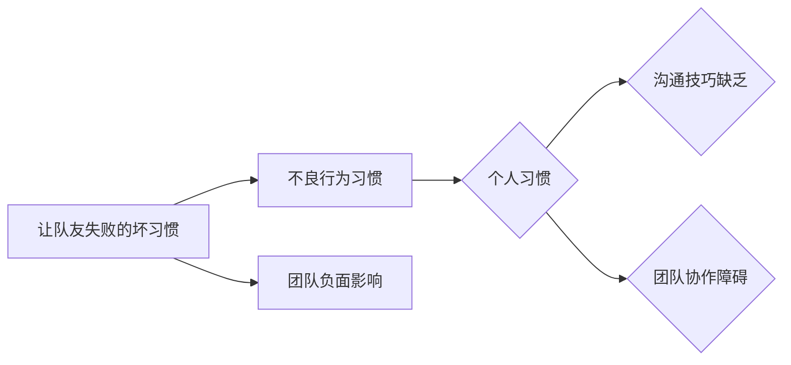
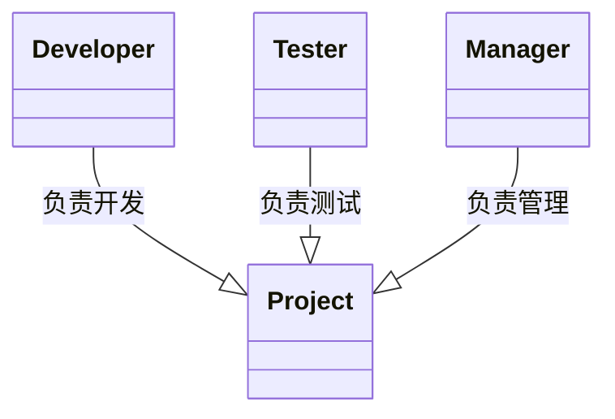
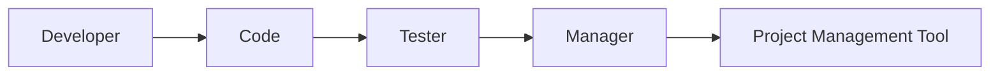
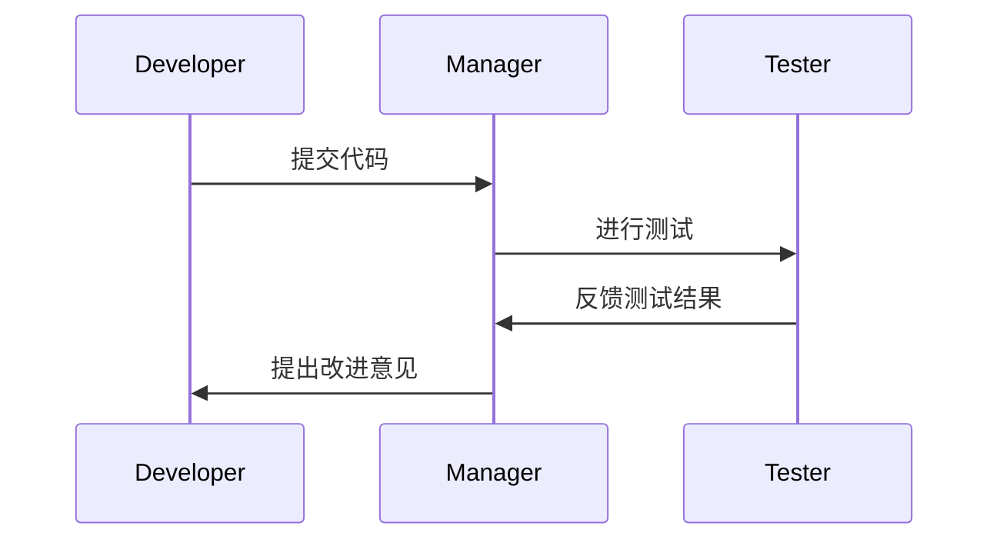

                 

# 让队友失败的坏习惯

关键词：团队合作、习惯、改进、效能、团队建设

摘要：本文旨在探讨在IT领域中，某些不良习惯如何对团队合作和团队绩效产生负面影响。通过详细分析这些坏习惯的类型、特征、识别与评估方法，以及提出相应的改进策略和实施步骤，帮助读者理解并改正这些习惯，从而提升团队协作能力和整体效能。

## 引言

### 第1章: 背景介绍

#### 1.1 问题背景

##### 1.1.1 问题来源

在IT行业，团队协作是项目成功的关键。然而，许多团队成员存在一些不良习惯，这些习惯往往在不经意间破坏了团队的和谐，影响了项目的进度和质量。这些坏习惯可能源于个人行为习惯，也可能源于团队管理问题。

##### 1.1.2 问题定义

本文所指的“坏习惯”，是指那些在团队合作中，影响团队协作效率、损害团队关系、降低团队绩效的行为习惯。这些习惯可能表现为沟通不畅、责任推卸、计划不周、持续拖延等。

##### 1.1.3 解决问题的重要性

解决这些坏习惯对于提升团队绩效和个人发展具有重要意义。首先，不良习惯会削弱团队凝聚力，导致团队成员之间的不信任和矛盾。其次，不良习惯会影响项目进度和交付质量，甚至可能导致项目失败。最后，通过改正坏习惯，团队成员可以提升个人技能和职业素养，实现个人与团队的共同成长。

#### 1.2 问题描述

##### 1.2.1 坏习惯类型

IT行业常见的坏习惯可以分为以下几类：

1. **沟通不畅**
   - 缺乏及时的沟通反馈
   - 没有明确的沟通目标和方式
   - 对团队成员的意见和建议不予重视

2. **责任推卸**
   - 将自己的责任推卸给他人
   - 对任务完成情况不负责任
   - 出现问题时不主动承担责任

3. **计划不周**
   - 缺乏有效的项目计划和管理
   - 对任务的时间估计不准确
   - 对项目风险预估不足

4. **持续拖延**
   - 对待任务缺乏紧迫感
   - 常常将任务留到最后时刻
   - 对待工作缺乏热情和动力

##### 1.2.1.1 具体坏习惯列举

###### 1.2.1.1.1 坏习惯A：沟通不畅

- 描述：团队成员之间缺乏及时的沟通，导致信息传递不及时，任务理解不一致，甚至出现误解。
- 影响分析：沟通不畅会导致团队协作效率低下，任务完成质量不高，严重时可能导致项目延误或失败。

###### 1.2.1.1.2 坏习惯B：责任推卸

- 描述：团队成员在面对任务时，习惯将责任推卸给他人，缺乏责任感和担当。
- 影响分析：责任推卸会削弱团队凝聚力，导致团队成员对工作缺乏热情，影响项目进度和质量。

#### 1.3 问题解决

##### 1.3.1 解决方案

为了解决上述坏习惯，需要采取以下措施：

1. **加强沟通培训**
   - 提升团队成员的沟通技巧
   - 建立有效的沟通机制和渠道

2. **明确责任分工**
   - 制定清晰的职责分配表
   - 强化责任意识和担当精神

3. **优化项目计划**
   - 提前进行项目风险评估
   - 设定明确的项目目标和时间表

4. **培养工作热情**
   - 创造积极的工作氛围
   - 提供激励措施和成长机会

##### 1.3.1.1 坏习惯A的改进方法

- **具体措施**：
  - 定期组织团队沟通会议，确保信息的及时传递和反馈。
  - 使用明确的沟通工具和平台，如邮件、即时通讯软件等。
  - 鼓励团队成员提出意见和建议，并对合理意见给予肯定和采纳。

##### 1.3.1.2 坏习惯B的改进方法

- **具体措施**：
  - 设立责任追踪机制，对任务完成情况进行定期检查和反馈。
  - 建立奖惩机制，对承担责任和表现优异的团队成员给予奖励。
  - 强化责任意识教育，通过培训和案例分享，提高团队成员的责任感。

#### 1.3.2 实施步骤

为了确保上述措施的有效实施，需要按照以下步骤进行：

1. **评估当前状况**
   - 分析团队中存在的坏习惯类型和程度
   - 了解团队成员对坏习惯的认知和态度

2. **制定改进计划**
   - 根据评估结果，制定具体的改进措施和时间表
   - 确保措施符合团队实际情况和成员需求

3. **实施改进措施**
   - 按计划逐步实施改进措施
   - 定期跟踪和评估改进效果

4. **持续优化和完善**
   - 根据改进效果，及时调整和完善改进措施
   - 建立长期的管理机制，确保坏习惯不再出现

#### 1.3.2.1 改进前的评估

- **如何评估**：
  - 通过问卷调查、访谈、会议记录等方式，收集团队成员对坏习惯的认知和反馈。
  - 分析团队绩效数据，如项目进度、任务完成情况、团队氛围等。

- **评估指标**：
  - 沟通频率和效果
  - 责任意识和担当精神
  - 项目进度和交付质量
  - 团队协作和合作精神

#### 1.3.2.2 改进过程中的监控

- **监控方法**：
  - 定期召开团队会议，汇报改进措施的实施情况和效果。
  - 使用项目管理工具，如JIRA、Trello等，对任务进度和完成情况进行实时监控。
  - 设立反馈机制，鼓励团队成员提出改进建议和意见。

- **监控指标**：
  - 沟通记录和反馈
  - 责任完成率和问题处理速度
  - 项目进度和交付质量
  - 团队成员满意度

### 1.4 边界与外延

#### 1.4.1 边界定义

- **坏习惯的范围**：
  - 主要指在团队合作过程中，影响团队协作效率和绩效的行为习惯。
  - 不包括个人生活习惯和工作方式。

#### 1.4.1.1 范围一

- **解释**：
  - 范围一主要涉及团队内部的行为习惯，如沟通、责任分工等。
  - 这些习惯直接影响团队协作效率和项目成果。

#### 1.4.1.2 范围二

- **解释**：
  - 范围二主要涉及团队外部的行为习惯，如客户沟通、市场拓展等。
  - 这些习惯虽然不直接影响团队内部协作，但也会对项目成果产生一定影响。

### 1.5 概念结构与核心要素组成

#### 1.5.1 概念结构

- **概念图示**：



#### 1.5.2 核心要素组成

- **要素列举**：

##### 1.5.2.1 个人习惯要素

###### 1.5.2.1.1 沟通技巧

- **描述**：
  - 沟通技巧是指团队成员在沟通过程中，能够清晰、准确地表达自己的想法，理解他人的观点，并有效解决问题。

###### 1.5.2.1.2 团队协作能力

- **描述**：
  - 团队协作能力是指团队成员在项目中，能够相互配合、协同工作，共同完成任务的能力。

### 1.6 本章小结

本章主要介绍了让队友失败的坏习惯的背景、定义、类型、识别与评估方法，以及改进策略和实施步骤。通过本章内容，读者可以了解这些坏习惯对团队合作和团队绩效的负面影响，并学会如何通过改进措施来提升团队协作能力和整体效能。

## 第二部分: 核心概念与原理

### 第2章: 坏习惯的类型与特征

#### 2.1 坏习惯的类型

##### 2.1.1 按行为分类

- **行为1：沟通不畅**
  - 包括不及时沟通、信息传递不畅、误解和冲突等。

- **行为2：责任推卸**
  - 包括将责任归咎于他人、不负责任、逃避问题等。

##### 2.1.2 按影响分类

- **影响1：团队协作**
  - 包括团队凝聚力下降、协作效率降低、项目延误等。

- **影响2：个人发展**
  - 包括自信心受损、职业素养降低、成长受限等。

#### 2.2 坏习惯的特征

##### 2.2.1 坏习惯的属性特征

- **影响力特征**

  - **特征1：持久性**：坏习惯往往根深蒂固，难以改变。
  - **特征2：传染性**：坏习惯容易在团队中传播，影响其他成员。

- **可持续性特征**

  - **特征1：适应性**：坏习惯在适应环境的过程中不断演变。
  - **特征2：隐藏性**：坏习惯往往隐藏在表面现象之下，不易被发现。

#### 2.3 坏习惯与传统习惯的对比

##### 2.3.1 比较分析

- **类别对比**

  - **坏习惯**：通常指对团队和组织有害的行为习惯。
  - **传统习惯**：通常指对团队和组织有益的行为习惯。

- **影响对比**

  - **坏习惯**：会导致团队协作效率降低、项目失败等负面影响。
  - **传统习惯**：会提升团队协作效率、项目成功等正面影响。

#### 2.4 坏习惯的识别与评估

##### 2.4.1 识别方法

- **观察法**：通过观察团队成员的行为，识别是否存在坏习惯。

- **自我评估法**：鼓励团队成员自我反思，识别自身的坏习惯。

##### 2.4.2 评估指标

- **沟通效率**：包括沟通频率、信息传递准确性等。

- **责任意识**：包括责任感、担当精神等。

#### 2.5 坏习惯的影响与危害

##### 2.5.1 影响分析

- **团队影响**：包括团队凝聚力下降、协作效率降低等。

- **个人影响**：包括自信心受损、职业素养降低等。

##### 2.5.2 危害分析

- **长期危害**：包括项目延误、失败等。

- **短期危害**：包括团队氛围恶化、工作压力增大等。

### 2.6 本章小结

本章主要分析了坏习惯的类型与特征，以及与传统习惯的对比。通过识别与评估方法，读者可以更好地了解坏习惯的存在，并采取相应措施进行改进。

## 第三部分: 改进策略与实战

### 第3章: 坏习惯的改进方法

#### 3.1 坏习惯的改进原则

##### 3.1.1 改进原则一

- **描述**：坚持透明公开，鼓励团队成员积极参与改进过程，共同承担责任。

##### 3.1.2 改进原则二

- **描述**：注重个性化，根据每个团队成员的特点和需求，制定个性化的改进方案。

#### 3.2 坏习惯的改进策略

##### 3.2.1 改进策略一

- **描述**：加强沟通培训，提高团队成员的沟通能力和技巧。

##### 3.2.2 改进策略二

- **描述**：建立责任制度，明确团队成员的职责和任务，加强责任意识。

#### 3.3 坏习惯的改进步骤

##### 3.3.1 改进步骤一

- **描述**：定期开展团队沟通会议，确保信息的及时传递和反馈。

##### 3.3.2 改进步骤二

- **描述**：制定明确的职责分配表，确保每个成员都明确自己的职责和任务。

### 第4章: 实战案例

#### 4.1 项目介绍

- **项目背景**：某IT公司的一个大型软件开发项目，涉及多个团队和数百名开发人员。

- **项目目标**：在规定时间内完成项目开发，确保项目质量和团队协作效率。

#### 4.2 系统功能设计

- **领域模型**：使用Mermaid绘制领域模型类图，展示项目的核心功能和模块。



- **系统架构设计**：使用Mermaid绘制系统架构图，展示项目的主要架构和组件。



#### 4.3 系统接口设计和系统交互

- **接口设计**：使用Mermaid绘制接口设计图，展示系统的主要接口和交互。



#### 4.4 系统核心实现源代码

- **代码示例**：提供系统核心实现源代码，展示项目的具体实现细节。

```python
class Developer:
    def submit_code(self):
        # 代码提交逻辑

class Tester:
    def test_code(self):
        # 测试代码逻辑

class Manager:
    def manage_project(self):
        # 项目管理逻辑
```

#### 4.5 代码应用解读与分析

- **解读与分析**：对系统核心实现源代码进行解读和分析，解释代码的功能和原理。

#### 4.6 实际案例分析和详细讲解剖析

- **案例分析**：结合实际项目案例，分析团队在改进过程中遇到的问题和解决方法。

- **详细讲解剖析**：对案例中的关键问题进行详细讲解和剖析，提供解决方案。

### 4.7 项目小结

- **总结**：通过对项目实践的总结，展示改进策略和实施步骤的实际效果，强调团队协作和习惯改进的重要性。

### 最佳实践 tips

- **定期反思**：定期对团队成员的行为习惯进行反思和评估，发现问题及时改进。
- **鼓励反馈**：鼓励团队成员提出改进意见和建议，营造开放、积极的团队氛围。
- **持续培训**：定期开展培训，提升团队成员的技能和素养，为团队发展提供持续动力。

### 本章小结

本章通过实战案例，详细展示了如何通过改进策略和实施步骤，解决团队中的坏习惯问题。通过本章内容，读者可以了解到改进的具体方法和实践效果，从而在实际工作中更好地提升团队协作能力和效能。

### 注意事项

- **个性化改进**：在改进过程中，要注重个性化，根据团队成员的特点和需求，制定适合的改进方案。
- **持续关注**：改进不是一蹴而就的过程，需要持续关注和跟踪，确保改进措施的有效性。

### 拓展阅读

- **相关书籍**：
  - 《有效沟通的技巧》
  - 《责任的力量》
  - 《项目管理的最佳实践》

- **在线资源**：
  - GitHub上的团队协作和项目管理项目
  - TED演讲：如何建立高效的团队

### 作者

作者：AI天才研究院/AI Genius Institute & 禅与计算机程序设计艺术 /Zen And The Art of Computer Programming

