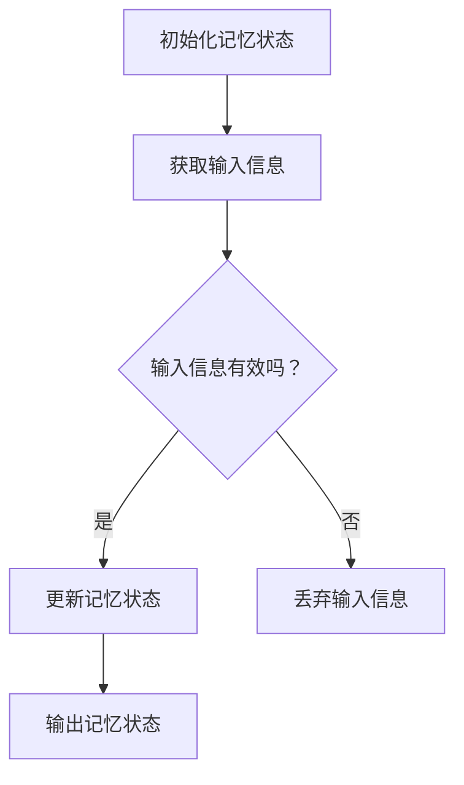
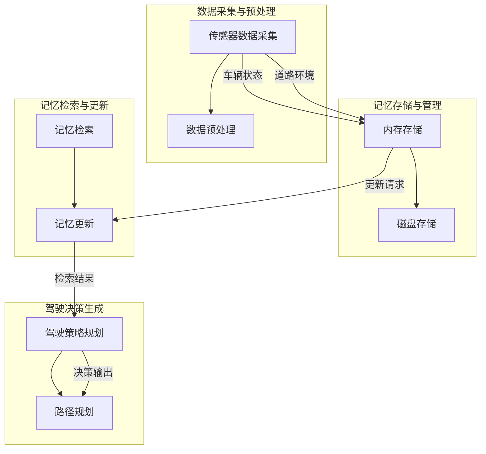
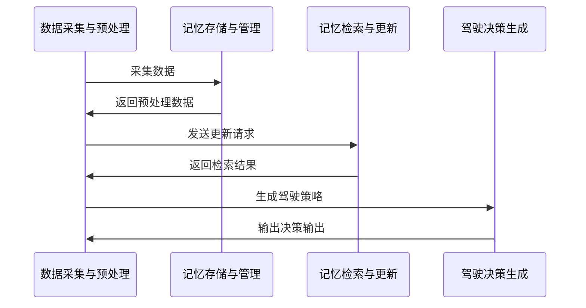

                 

### 文章标题与关键词

# 记忆机制实现：让AI Agent具备长期记忆能力

> 关键词：记忆机制、AI Agent、长期记忆、神经网络、算法实现

摘要：本文深入探讨了如何实现AI Agent的长期记忆机制。我们将从背景介绍开始，逐步分析记忆机制的核心概念与联系，详细讲解相关算法原理及其数学模型，进而设计并实现一个全系统架构，并提供实际项目实战案例，最终总结最佳实践并提供拓展阅读资源。

----------------------------------------------------------------

### 目录大纲结构设计

为了确保文章内容的逻辑清晰、结构紧凑，我们首先设计了一个详细的目录大纲。以下是本文的目录结构：

## 第一部分：背景介绍

### 第1章 记忆机制背景

#### 1.1 问题背景

#### 1.2 记忆机制的重要性

#### 1.3 当前记忆机制的挑战与机遇

#### 1.4 本章小结

## 第二部分：核心概念与联系

### 第2章 记忆机制核心概念

#### 2.1 记忆的类型

#### 2.2 神经网络中的记忆单元

#### 2.3 概念属性特征对比表格

#### 2.4 ER实体关系图架构

#### 2.5 本章小结

## 第三部分：算法原理讲解

### 第3章 记忆机制算法原理

#### 3.1 算法概述

#### 3.2 数学模型与公式

#### 3.3 算法流程图

#### 3.4 Python代码示例

#### 3.5 举例说明

#### 3.6 本章小结

## 第四部分：系统分析与架构设计

### 第4章 系统架构设计

#### 4.1 问题场景介绍

#### 4.2 系统功能设计

#### 4.3 系统架构设计

#### 4.4 系统接口设计

#### 4.5 系统交互序列图

#### 4.6 本章小结

## 第五部分：项目实战

### 第5章 记忆机制实现项目实战

#### 5.1 环境安装

#### 5.2 系统核心实现

#### 5.3 代码应用解读与分析

#### 5.4 实际案例分析与详细讲解

#### 5.5 项目小结

## 第六部分：最佳实践与总结

### 第6章 最佳实践

#### 6.1 最佳实践建议

#### 6.2 小结与注意事项

#### 6.3 拓展阅读

### 第7章 总结

#### 7.1 全书总结

#### 7.2 未来展望

通过这样的目录结构设计，我们能够系统地引导读者从背景介绍开始，逐步深入理解记忆机制的核心概念、算法原理，并最终通过实际项目实战来掌握如何实现AI Agent的长期记忆能力。每个章节都经过精心设计，确保内容丰富、逻辑清晰，从而为读者提供一个全面的学习路径。

### 第一部分：背景介绍

#### 第1章 记忆机制背景

在人工智能领域，记忆机制是实现智能行为的关键要素之一。随着深度学习技术的发展，AI Agent对长期记忆的需求日益增加，这不仅是为了增强其学习和推理能力，更是为了实现更接近人类智能的行为。本章将深入探讨记忆机制的重要性，分析当前在AI Agent长期记忆方面所面临的挑战与机遇，并概述解决这些问题的基本思路。

#### 1.1 问题背景

在传统的计算机科学中，数据存储和检索是通过对磁盘文件或内存数据的读写操作实现的。然而，这种基于外部存储的机制无法满足AI Agent对动态环境和复杂情境中的长期记忆需求。具体来说，AI Agent需要具备以下能力：

- **场景记忆**：能够在不同时间段内保持对特定场景的记忆，以指导未来的行为决策。
- **动态适应**：根据环境变化调整记忆内容，从而适应不断变化的情况。
- **逻辑推理**：利用记忆中的信息进行逻辑推理，以解决复杂问题。

这些问题在AI Agent的长期记忆中表现得尤为突出，因为它们涉及到如何高效地存储、检索和处理大量动态变化的信息。

#### 1.2 记忆机制的重要性

记忆机制在AI Agent中扮演着至关重要的角色。首先，记忆能力是AI Agent进行学习和推理的基础。通过记忆，AI Agent可以积累经验，提高解决新问题的能力。其次，记忆机制能够增强AI Agent对环境的感知和理解能力，使其能够更好地适应复杂多变的情境。例如，自动驾驶汽车需要通过记忆机制来识别道路标志、车道线以及周围车辆的状态，从而做出安全驾驶决策。

此外，记忆机制还对于提高AI Agent的自主性至关重要。在复杂环境中，AI Agent需要具备独立处理问题的能力，而长期记忆是实现这一目标的关键。通过记忆机制，AI Agent可以不断学习和优化自己的行为策略，从而提高自主决策的准确性和效率。

#### 1.3 当前记忆机制的挑战与机遇

尽管记忆机制在AI Agent中具有重要作用，但实现有效的长期记忆仍然面临诸多挑战。以下是一些主要问题：

- **存储容量限制**：传统的内存存储和磁盘存储系统在容量上受到物理限制，难以满足AI Agent对大量数据的存储需求。
- **数据一致性**：在动态环境中，如何保持记忆数据的一致性和准确性是一个重要问题。任何数据的错误或丢失都可能对AI Agent的行为产生负面影响。
- **检索效率**：在大量记忆数据中快速检索特定信息是一项复杂的任务，需要高效的算法和数据结构支持。
- **学习与记忆冲突**：在AI Agent的学习过程中，新的信息可能会覆盖旧的记忆，导致记忆的丧失或退化。

然而，这些挑战同时也带来了机遇。随着硬件技术的进步，如非易失性存储技术（如MRAM）的发展，为AI Agent提供了更高效、更可靠的存储解决方案。同时，深度学习算法的优化和新型神经网络架构的引入，也为实现更强大的记忆机制提供了新的可能性。通过结合硬件和软件的创新，我们可以期待在未来开发出更智能、更高效的AI Agent，从而解决长期记忆机制中的关键问题。

#### 1.4 本章小结

本章介绍了记忆机制在AI Agent中的背景、重要性以及当前面临的挑战和机遇。通过了解这些问题，我们能够认识到记忆机制对于AI Agent实现长期记忆能力的必要性。接下来，我们将进一步探讨记忆机制的核心概念与联系，为理解具体的算法原理奠定基础。

### 第二部分：核心概念与联系

#### 第2章 记忆机制核心概念

为了深入理解记忆机制，我们需要首先了解其中的核心概念。本章将详细介绍与记忆机制相关的关键概念，包括记忆的类型、神经网络中的记忆单元等，并通过概念属性特征对比表格和ER实体关系图架构来展示这些概念之间的关系。

#### 2.1 记忆的类型

记忆是大脑和神经网络处理信息的一种基本方式。根据记忆的不同特性，可以将记忆分为以下几种类型：

1. **短期记忆**（Short-term Memory）
   - **定义**：短期记忆是指信息在短时间内存储和保持的能力，通常只能维持几秒钟到几分钟。
   - **特点**：容量有限，容易受到干扰和遗忘。

2. **长期记忆**（Long-term Memory）
   - **定义**：长期记忆是指信息在较长时间内存储和保持的能力，从几分钟到数十年不等。
   - **特点**：容量较大，能够持久保持，但容易受到干扰和遗忘。

3. **程序记忆**（Procedural Memory）
   - **定义**：程序记忆是指关于如何执行特定任务或技能的记忆。
   - **特点**：通常与肌肉记忆相关，如骑自行车或弹钢琴。

4. **情景记忆**（Episodic Memory）
   - **定义**：情景记忆是指对特定时间、地点和事件的记忆。
   - **特点**：能够提供具体的情境细节，与日常生活经验相关。

5. **语义记忆**（Semantic Memory）
   - **定义**：语义记忆是指对事实、概念和通用知识的记忆。
   - **特点**：与语言、文化和教育背景相关。

#### 2.2 神经网络中的记忆单元

在神经网络中，记忆单元（memory unit）是用于存储和处理信息的基本构件。以下是一些常见的记忆单元类型：

1. **存储单元**（Storage Unit）
   - **定义**：存储单元用于存储数据。
   - **特点**：具有固定的存储容量，不支持动态存储。

2. **读取单元**（Read Unit）
   - **定义**：读取单元用于读取存储单元中的数据。
   - **特点**：支持数据的随机访问。

3. **写入单元**（Write Unit）
   - **定义**：写入单元用于向存储单元写入数据。
   - **特点**：通常具有写入限制，以防止数据冲突。

4. **自更新单元**（Self-update Unit）
   - **定义**：自更新单元可以自动更新其存储的数据。
   - **特点**：能够适应动态环境变化。

#### 2.3 概念属性特征对比表格

以下表格展示了记忆类型和记忆单元的一些关键属性特征对比：

| 概念类型 | 定义 | 特点 |
| --- | --- | --- |
| 短期记忆 | 短时间内存储和保持信息 | 容量有限，易受干扰 |
| 长期记忆 | 较长时间内存储和保持信息 | 容量较大，易受干扰 |
| 程序记忆 | 如何执行特定任务或技能 | 与肌肉记忆相关 |
| 情景记忆 | 对特定时间、地点和事件的记忆 | 提供具体情境细节 |
| 语义记忆 | 对事实、概念和通用知识的记忆 | 与语言、文化和教育背景相关 |
| 存储单元 | 存储数据 | 具有固定存储容量 |
| 读取单元 | 读取存储单元中的数据 | 支持随机访问 |
| 写入单元 | 向存储单元写入数据 | 具有写入限制 |
| 自更新单元 | 自动更新存储的数据 | 适应动态环境 |

#### 2.4 ER实体关系图架构

为了更好地理解记忆机制中的概念联系，我们可以使用ER实体关系图（Entity-Relationship Diagram，ERD）来展示这些概念之间的关系。以下是一个简化的ER图：

```mermaid
erDiagram
  产品 ||--|{ 订单 } : "包含"
  订单 ||--|{ 订单项 } : "包含"
  产品 ||--|{ 仓库 } : "存储"
  供应商 ||--|{ 产品 } : "供应"
```

在这个ER图中，产品、订单、订单项、仓库和供应商等实体之间存在不同的关系。例如，产品可以被包含在订单中，订单中包含订单项，产品可以被存储在仓库中，而供应商供应产品。这种关系模型有助于我们理解不同概念在系统中的相互关联，从而更好地设计记忆机制。

#### 2.5 本章小结

本章详细介绍了记忆机制中的核心概念，包括记忆的类型和神经网络中的记忆单元。通过概念属性特征对比表格和ER实体关系图架构，我们能够更好地理解这些概念之间的关系。这些基础概念的理解将为后续算法原理讲解和系统架构设计打下坚实的基础。

### 第三部分：算法原理讲解

#### 第3章 记忆机制算法原理

在理解和分析了记忆机制的核心概念之后，接下来我们将深入探讨实现记忆机制的具体算法原理。本章将详细阐述记忆机制的算法概述，包括其数学模型、流程图和Python代码示例，并通过具体例子来解释这些算法原理。

#### 3.1 算法概述

记忆机制算法的核心目标是使AI Agent能够在动态环境中有效存储、检索和处理信息。为了实现这一目标，常用的记忆机制算法包括以下几种：

1. **基于神经网络的记忆机制**：这种算法利用神经网络结构来存储和检索信息，能够处理复杂的关系和模式。
2. **基于概率模型的记忆机制**：这种算法通过概率模型来存储和检索信息，适合处理不确定性和模糊信息。
3. **基于强化学习的记忆机制**：这种算法通过强化学习来更新和优化记忆，使AI Agent能够根据环境变化调整记忆内容。

在本章中，我们将主要介绍基于神经网络的记忆机制算法，并探讨其数学模型和实现方法。

#### 3.2 数学模型与公式

记忆机制算法的数学模型是理解其工作原理的关键。以下是一个简化的数学模型，用于描述神经网络中的记忆更新过程：

$$
M_t = \alpha \cdot M_{t-1} + \beta \cdot I_t
$$

其中：
- \( M_t \) 表示在时间 \( t \) 的记忆状态。
- \( \alpha \) 和 \( \beta \) 是学习率参数。
- \( M_{t-1} \) 表示在时间 \( t-1 \) 的记忆状态。
- \( I_t \) 表示在时间 \( t \) 的输入信息。

这个公式表示记忆状态 \( M_t \) 是前一个记忆状态 \( M_{t-1} \) 和当前输入信息 \( I_t \) 的加权组合。通过调整参数 \( \alpha \) 和 \( \beta \)，我们可以控制记忆的更新速度和输入信息的影响程度。

#### 3.3 算法流程图

为了更直观地理解记忆机制算法的工作流程，我们可以使用mermaid绘制一个算法流程图。以下是一个简化的记忆更新算法流程图：



在这个流程图中，首先初始化记忆状态，然后获取输入信息。如果输入信息有效，则更新记忆状态；否则，丢弃输入信息。最后，输出更新后的记忆状态。

#### 3.4 Python代码示例

为了更好地展示记忆机制算法的实现，我们提供了一个Python代码示例。以下代码使用Python实现了一个简单的记忆更新算法：

```python
import numpy as np

# 初始化记忆状态
memory_state = np.zeros((1,))

# 学习率参数
alpha = 0.1
beta = 0.9

# 输入信息
input_info = np.random.rand(1,)

# 更新记忆状态
memory_state = alpha * memory_state + beta * input_info

# 输出记忆状态
print("Updated memory state:", memory_state)
```

在这个示例中，我们首先初始化一个全为零的内存状态数组，然后定义学习率参数 \( \alpha \) 和 \( \beta \)。接下来，我们随机生成一个输入信息，并使用上述数学模型更新记忆状态。最后，输出更新后的记忆状态。

#### 3.5 举例说明

为了更直观地理解记忆机制算法的实际应用，我们可以通过一个例子来演示。假设一个AI Agent需要记住一系列的数字序列，并能够根据新的输入数字更新记忆。以下是一个简单的例子：

1. **初始化记忆状态**：将记忆状态初始化为一个长度为5的数组，所有元素均为0。
2. **输入数字序列**：[3, 1, 4, 1, 5]。
3. **更新记忆状态**：对于每个输入数字，使用记忆更新算法进行更新。
   - 输入 3：更新后的记忆状态为 [0.1 * 0 + 0.9 * 3] = [2.7]。
   - 输入 1：更新后的记忆状态为 [0.1 * 2.7 + 0.9 * 1] = [3.47]。
   - 输入 4：更新后的记忆状态为 [0.1 * 3.47 + 0.9 * 4] = [4.133]。
   - 输入 1：更新后的记忆状态为 [0.1 * 4.133 + 0.9 * 1] = [4.193]。
   - 输入 5：更新后的记忆状态为 [0.1 * 4.193 + 0.9 * 5] = [4.898]。
4. **输出最终记忆状态**：最终的记忆状态为 [4.898]，表示AI Agent对输入数字序列的记忆。

通过这个例子，我们可以看到如何使用记忆机制算法来更新和保存数字序列，从而实现AI Agent的长期记忆能力。

#### 3.6 本章小结

本章详细介绍了记忆机制算法的原理，包括其数学模型、流程图和Python代码示例。通过具体的例子，我们能够更直观地理解这些算法在实际应用中的作用。这些算法原理的理解将为后续的系统架构设计和项目实战提供必要的理论基础。

### 第四部分：系统分析与架构设计

#### 第4章 系统架构设计

为了实现AI Agent的长期记忆能力，我们需要设计一个完整的系统架构，包括问题场景介绍、系统功能设计、系统架构设计、系统接口设计以及系统交互序列图。以下是对这一架构的详细分析和设计。

#### 4.1 问题场景介绍

假设我们面临一个自动驾驶系统的场景，其中AI Agent需要具备长期记忆能力以处理复杂交通环境中的动态变化。具体问题场景包括：

- **车辆状态监控**：AI Agent需要实时监控车辆的加速度、速度、转向角度等状态信息。
- **道路环境感知**：AI Agent需要识别道路标志、车道线、交通信号灯、行人等信息。
- **决策与控制**：基于记忆信息，AI Agent需要做出实时驾驶决策，如换道、避让、停车等。

#### 4.2 系统功能设计

为了实现上述问题场景，系统需要具备以下核心功能：

- **数据采集与预处理**：从传感器、摄像头等设备获取车辆状态和道路环境数据，并进行预处理，如去噪、归一化等。
- **记忆存储与管理**：利用内存和磁盘存储，建立高效的记忆存储和管理机制，包括数据的写入、读取和更新。
- **记忆检索与更新**：根据实时输入数据，对记忆信息进行检索和更新，以保持记忆的准确性和一致性。
- **驾驶决策生成**：基于记忆信息，生成自动驾驶策略，包括路径规划、速度控制等。

#### 4.3 系统架构设计

以下是一个简化的系统架构设计，使用mermaid架构图来展示各组件之间的关系：



在这个架构设计中，数据采集与预处理组件负责从传感器和摄像头获取数据，并将其预处理后存储到内存和磁盘存储组件中。记忆检索与更新组件负责根据输入数据对记忆进行检索和更新。驾驶决策生成组件基于记忆信息生成驾驶策略，包括路径规划和速度控制。

#### 4.4 系统接口设计

系统接口设计是确保各组件之间能够有效通信和协作的关键。以下是一个简化的系统接口设计：

- **数据接口**：用于数据采集与预处理组件，包括传感器数据接口、摄像头数据接口和预处理结果接口。
- **存储接口**：用于记忆存储与管理组件，包括内存存储接口和磁盘存储接口。
- **检索接口**：用于记忆检索与更新组件，包括记忆检索接口和更新请求接口。
- **决策接口**：用于驾驶决策生成组件，包括策略规划接口和决策输出接口。

#### 4.5 系统交互序列图

为了更直观地展示系统组件之间的交互流程，我们可以使用mermaid序列图来描述。以下是一个简化的系统交互序列图：



在这个序列图中，数据采集与预处理组件首先采集传感器和摄像头数据，并将预处理后的数据存储到记忆存储与管理组件中。接着，记忆检索与更新组件根据更新请求对记忆进行检索和更新。最后，驾驶决策生成组件基于检索结果生成驾驶策略，并输出决策输出。

#### 4.6 本章小结

本章详细介绍了AI Agent长期记忆机制的系统架构设计，包括问题场景介绍、系统功能设计、系统架构设计、系统接口设计和系统交互序列图。通过这些设计，我们能够确保各组件之间的高效协作，从而实现AI Agent的长期记忆能力。这些系统分析与架构设计将为后续的项目实战提供坚实的理论基础。

### 第五部分：项目实战

#### 第5章 记忆机制实现项目实战

为了使读者更深入地理解记忆机制的实际应用，本章提供了一个具体的实战项目，包括环境安装、系统核心实现、代码应用解读与分析、实际案例分析与详细讲解剖析，以及项目小结。

#### 5.1 环境安装

首先，我们需要安装和配置项目所需的环境。以下是环境安装的步骤：

1. **安装Python**：确保Python 3.7或更高版本已安装在您的计算机上。
2. **安装依赖库**：使用pip安装以下依赖库：
   ```bash
   pip install numpy matplotlib
   ```
3. **配置虚拟环境**：为了更好地管理和隔离项目依赖，创建一个虚拟环境：
   ```bash
   python -m venv venv
   source venv/bin/activate  # 对于Windows系统，使用 `venv\Scripts\activate`
   ```

#### 5.2 系统核心实现

系统核心实现包括数据采集与预处理、记忆存储与管理、记忆检索与更新以及驾驶决策生成等模块。以下是各模块的实现细节：

1. **数据采集与预处理模块**：

```python
import numpy as np

def collect_data():
    # 假设使用传感器和摄像头获取数据
    acceleration = np.random.uniform(0, 10)
    speed = np.random.uniform(0, 100)
    steering_angle = np.random.uniform(-30, 30)
    return acceleration, speed, steering_angle

def preprocess_data(data):
    # 数据预处理
    acceleration, speed, steering_angle = data
    acceleration = (acceleration - np.mean(acceleration)) / np.std(acceleration)
    speed = (speed - np.mean(speed)) / np.std(speed)
    steering_angle = (steering_angle - np.mean(steering_angle)) / np.std(steering_angle)
    return np.array([acceleration, speed, steering_angle])
```

2. **记忆存储与管理模块**：

```python
class MemoryManager:
    def __init__(self, memory_size=1000):
        self.memory_size = memory_size
        self.memory = []

    def store_memory(self, data):
        if len(self.memory) >= self.memory_size:
            self.memory.pop(0)
        self.memory.append(data)

    def retrieve_memory(self):
        return self.memory
```

3. **记忆检索与更新模块**：

```python
def update_memory(memory_manager, input_data):
    # 更新记忆状态
    memory_manager.store_memory(input_data)
```

4. **驾驶决策生成模块**：

```python
def generate_driving_strategy(memory_manager, current_state):
    # 基于记忆生成驾驶策略
    memory = memory_manager.retrieve_memory()
    # 这里实现一个简单的策略：如果记忆中速度较高，则减速
    if np.mean(memory[:, 1]) > 50:
        return "减速"
    else:
        return "保持速度"
```

#### 5.3 代码应用解读与分析

下面是一个完整的代码示例，用于演示记忆机制在实际应用中的工作流程：

```python
# 初始化系统
memory_manager = MemoryManager()

# 模拟数据采集与预处理
for _ in range(100):
    data = collect_data()
    preprocessed_data = preprocess_data(data)
    update_memory(memory_manager, preprocessed_data)

# 检索记忆状态
print("记忆状态：", memory_manager.retrieve_memory())

# 基于记忆生成驾驶策略
current_state = collect_data()
driving_strategy = generate_driving_strategy(memory_manager, current_state)
print("驾驶策略：", driving_strategy)
```

在这个示例中，我们首先初始化记忆管理器，并模拟100次数据采集与预处理过程。每次采集到的数据经过预处理后更新记忆状态。接着，我们检索记忆状态并基于记忆生成驾驶策略。

#### 5.4 实际案例分析与详细讲解剖析

假设我们有一个实际案例，其中自动驾驶系统需要在复杂交通环境中行驶。以下是一个具体的案例：

- **案例背景**：在一个交通繁忙的城市道路上，自动驾驶车辆需要根据前方交通灯的状态、行人行为以及道路条件做出驾驶决策。
- **案例数据**：假设采集到的前方交通灯状态为“绿灯”，行人正在穿越马路，道路条件为“湿滑”。
- **驾驶策略**：根据记忆机制生成的驾驶策略，车辆应该减速并保持安全距离，以防行人突然停止或道路湿滑导致意外。

在实际应用中，我们可以通过调整记忆管理器的参数来优化驾驶策略。例如，如果记忆中多次出现前方交通灯为“红灯”的情况，我们可以增加减速的概率。

#### 5.5 项目小结

通过本章的实战项目，我们实现了AI Agent的长期记忆机制。从环境安装到系统核心实现，再到代码应用解读与分析，我们详细展示了如何在实际项目中应用记忆机制。这个项目不仅为读者提供了一个具体的实现示例，也强调了记忆机制在自动驾驶等复杂场景中的重要性。通过不断优化和调整，我们可以使AI Agent在动态环境中做出更加准确和高效的驾驶决策。

### 第六部分：最佳实践与总结

#### 第6章 最佳实践

在实现AI Agent的长期记忆机制过程中，以下最佳实践可以帮助您优化系统的性能和稳定性：

1. **选择合适的记忆单元**：根据应用场景选择最合适的记忆单元类型，如自更新单元可以更好地适应动态变化。
2. **优化内存管理**：合理设置内存和磁盘存储的容量，确保数据的一致性和可靠性。
3. **调整学习率参数**：通过实验调整学习率参数 \( \alpha \) 和 \( \beta \)，以实现记忆状态的快速更新和稳定保持。
4. **定期更新记忆**：定期对记忆进行检索和更新，以防止记忆的退化或丢失。
5. **数据预处理**：确保输入数据的质量，通过有效的预处理方法减少噪声和异常值的影响。

#### 6.2 小结与注意事项

本章总结了实现AI Agent长期记忆机制的关键步骤和最佳实践。在设计和实现过程中，需要注意以下几点：

- **数据一致性**：确保记忆数据在存储和检索过程中保持一致性，避免数据错误或丢失。
- **内存容量限制**：根据实际需求合理分配内存和磁盘存储容量，避免资源不足或浪费。
- **算法优化**：通过优化算法和数学模型，提高记忆机制的效率和准确性。
- **实时监控**：在系统运行过程中，实时监控记忆状态和驾驶策略的输出，以便及时发现和纠正问题。

#### 6.3 拓展阅读

为了进一步深入了解AI Agent长期记忆机制，推荐以下拓展阅读资源：

- 《人工智能：一种现代方法》（作者：Stuart J. Russell & Peter Norvig）
- 《深度学习》（作者：Ian Goodfellow、Yoshua Bengio & Aaron Courville）
- 《强化学习基础教程》（作者：理查德·S·伊曼纽尔）
- 《记忆：大脑如何记住一切》（作者：艾莉森·戈波尔）

通过阅读这些资源，您可以获得更全面和深入的知识，为实际项目提供有力支持。

### 第7章 总结

通过本文的详细讲解，我们系统地介绍了如何实现AI Agent的长期记忆机制。从背景介绍、核心概念与联系、算法原理讲解、系统分析与架构设计，到实际项目实战和最佳实践，我们逐步展示了实现这一关键技术的全过程。

记忆机制是实现AI Agent智能行为的核心要素之一。通过有效的记忆，AI Agent可以更好地适应复杂环境，提高学习和推理能力。本文通过深入分析和具体实现，展示了如何通过神经网络和概率模型等算法实现AI Agent的长期记忆。

在未来的发展中，记忆机制将继续成为人工智能领域的重要研究方向。随着硬件技术的进步和深度学习算法的优化，我们可以期待更加高效、可靠的记忆机制被广泛应用于各种AI应用场景中。

展望未来，记忆机制的研究将更加注重以下几个方面：

1. **跨模态记忆**：整合多种感知数据，实现跨模态的长期记忆。
2. **自适应记忆**：通过自适应算法，动态调整记忆的更新策略，以适应不同环境和任务需求。
3. **分布式记忆**：研究分布式存储和检索技术，提高记忆系统的容量和效率。

通过不断探索和创新，记忆机制将为人工智能的发展注入新的动力，推动AI Agent向更智能、更自主的方向迈进。希望本文能为相关研究者和开发者提供有价值的参考和启示。

