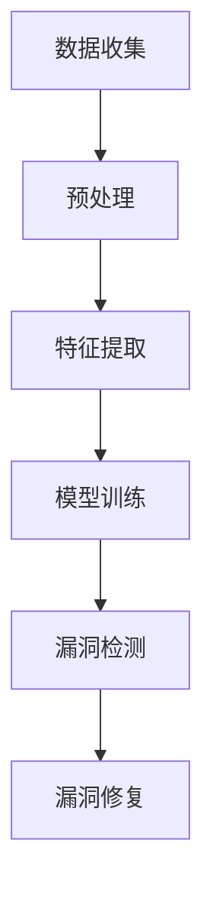
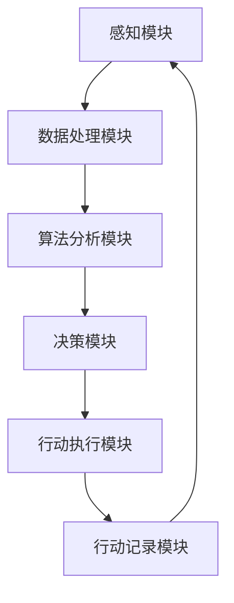

                 

# 设计AI Agent的概念漂移检测机制

## 关键词

- AI Agent
- 概念漂移
- 漏洞检测机制
- 实时监控
- 自动化测试
- 安全防护

## 摘要

本文旨在深入探讨AI Agent中的概念漂移现象及其检测机制的设计。我们将首先介绍AI Agent的基本概念、概念漂移的定义以及其可能带来的风险和漏洞表现形式。随后，我们将分析现有解决方案的局限性，并明确本文的研究目标与边界。接着，本文将详细阐述核心概念、属性特征及其相互关系，并通过图表辅助理解。随后，我们将详细介绍漏洞检测算法的原理、实现流程和数学模型，并展示相关Python源代码和举例说明。接下来，本文将分析实际应用场景，介绍系统功能设计、架构设计、接口设计及系统交互流程。最后，我们将通过项目实战分享实践经验，并给出优化策略、改进建议以及最佳实践 Tips，以期为AI Agent概念漂移检测机制的设计提供有益参考。

## 目录大纲

# 设计AI Agent的概念漂移检测机制

## 第一部分：背景介绍

- **1.1 问题背景**
  - 1.1.1 AI Agent的概念
  - 1.1.2 漏洞与风险
  - 1.1.3 漏洞的表现形式
- **1.2 问题描述**
  - 1.2.1 漏洞的影响
  - 1.2.2 现有的解决方案
  - 1.2.3 解决方案存在的问题
- **1.3 问题解决**
  - 1.3.1 需要解决的问题
  - 1.3.2 目标
- **1.4 边界与外延**
  - 1.4.1 系统的边界
  - 1.4.2 漏洞的检测范围
- **1.5 概念结构与核心要素组成**
  - 1.5.1 关键概念
  - 1.5.2 核心要素
- **1.6 本章小结**

## 第二部分：核心概念与联系

- **2.1 概念原理**
  - 2.1.1 AI Agent
  - 2.1.2 概念漂移
  - 2.1.3 漏洞检测机制
- **2.2 概念属性特征对比表格**
  - 2.2.1 AI Agent特征对比
  - 2.2.2 漏洞特征对比
- **2.3 ER实体关系图架构**
  - 2.3.1 AI Agent实体关系
  - 2.3.2 漏洞检测机制实体关系
- **2.4 本章小结**

## 第三部分：算法原理讲解

- **3.1 算法原理**
  - 3.1.1 漏洞检测算法概述
  - 3.1.2 算法设计思路
  - 3.1.3 算法实现流程
- **3.2 算法mermaid流程图**
  - 3.2.1 流程图示例
- **3.3 Python源代码**
  - 3.3.1 源代码示例
  - 3.3.2 代码解读
- **3.4 数学模型与公式**
  - 3.4.1 数学模型
  - 3.4.2 公式讲解
  - 3.4.3 举例说明
- **3.5 本章小结**

## 第四部分：系统分析与架构设计方案

- **4.1 问题场景介绍**
  - 4.1.1 场景一：自动化测试
  - 4.1.2 场景二：实时监控
  - 4.1.3 场景三：安全防护
- **4.2 项目介绍**
  - 4.2.1 项目背景
  - 4.2.2 项目目标
- **4.3 系统功能设计**
  - 4.3.1 领域模型
  - 4.3.2 功能模块划分
- **4.4 系统架构设计**
  - 4.4.1 架构设计原则
  - 4.4.2 架构设计方案
- **4.5 系统接口设计**
  - 4.5.1 接口设计原则
  - 4.5.2 接口设计示例
- **4.6 系统交互**
  - 4.6.1 交互流程
  - 4.6.2 交互流程图
- **4.7 本章小结**

## 第五部分：项目实战

- **5.1 环境安装**
  - 5.1.1 环境准备
  - 5.1.2 安装步骤
  - 5.1.3 遇到的问题及解决方案
- **5.2 系统核心实现源代码**
  - 5.2.1 源代码结构
  - 5.2.2 核心代码解读
- **5.3 代码应用解读与分析**
  - 5.3.1 应用场景解读
  - 5.3.2 代码分析
- **5.4 实际案例分析与详细讲解剖析**
  - 5.4.1 案例一：自动化测试
  - 5.4.2 案例二：实时监控
  - 5.4.3 案例三：安全防护
- **5.5 项目小结**
  - 5.5.1 项目收获
  - 5.5.2 项目不足
  - 5.5.3 改进建议
- **5.6 本章小结**

## 第六部分：最佳实践 Tips

- **6.1 实践技巧**
  - 6.1.1 漏洞检测机制的优化策略
  - 6.1.2 算法优化的实践
- **6.2 小结**
- **6.3 注意事项**
- **6.4 拓展阅读**

---

## 1.1 问题背景

### 1.1.1 AI Agent的概念

AI Agent，即人工智能代理，是具备自主性、适应性、学习能力和交互能力的计算机程序。它可以在特定环境中独立执行任务，并与其他系统或用户进行交互。AI Agent的核心在于其能够根据输入的数据和环境信息，通过学习算法和决策逻辑，自主地调整其行为以达成既定目标。

AI Agent通常由以下几个部分组成：

1. **感知模块**：负责获取外部环境的信息。
2. **决策模块**：基于感知模块提供的信息，通过算法和模型进行决策。
3. **行动模块**：根据决策模块的输出执行具体的行动。
4. **记忆模块**：用于存储历史数据和经验，以便于学习和优化。

AI Agent在自动化测试、实时监控、安全防护等多个领域都有着广泛的应用。例如，在自动化测试中，AI Agent可以自主地分析软件系统的行为，识别潜在的缺陷；在实时监控中，AI Agent可以实时检测网络流量，识别异常行为；在安全防护中，AI Agent可以实时分析攻击信号，采取防御措施。

### 1.1.2 漏洞与风险

随着AI Agent在各个领域的广泛应用，其安全性和可靠性问题也逐渐凸显。AI Agent可能存在的漏洞和风险主要包括以下几个方面：

1. **数据隐私泄露**：AI Agent在处理数据时，可能会无意中泄露用户的敏感信息。
2. **恶意攻击**：黑客可以通过控制AI Agent，实现对系统的恶意攻击。
3. **模型偏差**：AI Agent在学习和决策过程中，可能会因为数据集的不平衡或模型设计的问题，产生偏差。
4. **概念漂移**：随着环境的变化，AI Agent可能会逐渐偏离其训练时的目标，导致性能下降。

这些漏洞和风险不仅会影响AI Agent的性能，还可能对整个系统造成严重的安全威胁。因此，设计有效的漏洞检测机制，对于保障AI Agent的安全和可靠性至关重要。

### 1.1.3 漏洞的表现形式

AI Agent的漏洞表现形式多种多样，以下是一些常见的漏洞类型：

1. **输入注入**：黑客通过构造特殊的输入数据，影响AI Agent的决策过程。
2. **模型篡改**：黑客通过篡改AI Agent的模型参数，改变其行为。
3. **数据篡改**：黑客通过篡改训练数据，使AI Agent的学习结果产生偏差。
4. **权限滥用**：AI Agent在权限管理不当的情况下，可能会被用于执行未经授权的操作。

这些漏洞的表现形式各异，但共同点是它们都可能对AI Agent的性能和安全造成威胁。因此，我们需要设计出能够有效检测和应对这些漏洞的机制。

## 1.2 问题描述

### 1.2.1 漏洞的影响

AI Agent的漏洞不仅会影响其自身的性能，还可能对整个系统造成严重的影响。具体来说，漏洞的影响主要体现在以下几个方面：

1. **性能下降**：AI Agent在漏洞存在的情况下，可能会出现决策错误或行动滞后，导致系统性能下降。
2. **数据泄露**：AI Agent的漏洞可能导致敏感数据的泄露，对用户隐私造成威胁。
3. **系统崩溃**：严重的漏洞可能导致AI Agent失控，从而引发系统的崩溃或瘫痪。
4. **经济损失**：在某些应用场景中，AI Agent的漏洞可能会导致经济损失，例如在金融领域，黑客通过控制AI Agent进行恶意交易。

### 1.2.2 现有的解决方案

目前，针对AI Agent的漏洞检测，已经有一些现有的解决方案。这些解决方案主要包括以下几个方面：

1. **静态分析**：通过对AI Agent的代码进行静态分析，查找潜在的安全漏洞。
2. **动态分析**：在AI Agent运行时，通过监测其行为和输出，检测是否存在异常。
3. **安全测试**：通过模拟攻击和漏洞测试，验证AI Agent的漏洞防御能力。
4. **数据加密**：对AI Agent处理的数据进行加密，防止数据泄露。

这些解决方案在一定程度上能够检测和防御AI Agent的漏洞，但仍然存在一些不足之处。

### 1.2.3 解决方案存在的问题

现有的解决方案在AI Agent的漏洞检测方面存在以下问题：

1. **检测效率低**：静态分析和动态分析通常需要大量时间和计算资源，导致检测效率较低。
2. **误报率高**：在动态分析中，由于AI Agent的行为复杂多变，误报率较高，可能影响系统的正常运行。
3. **无法覆盖全部漏洞**：现有的检测方法无法覆盖所有类型的漏洞，特别是针对新型漏洞的检测能力较弱。
4. **实时性不足**：现有的解决方案通常无法实现实时检测，无法及时发现和响应漏洞。

### 1.3 问题解决

#### 1.3.1 需要解决的问题

为了提高AI Agent的安全性和可靠性，我们需要解决以下问题：

1. **提高检测效率**：设计高效的漏洞检测算法，降低检测时间和计算资源的需求。
2. **降低误报率**：通过优化检测算法，降低误报率，提高检测的准确性。
3. **覆盖多种漏洞**：设计能够检测多种类型漏洞的机制，提高漏洞检测的全面性。
4. **实现实时检测**：设计实时漏洞检测机制，能够及时发现和响应漏洞。

#### 1.3.2 目标

本文的研究目标是设计一套高效的、准确的、实时的AI Agent概念漂移检测机制，以解决现有解决方案存在的不足。具体目标如下：

1. **高效性**：检测算法能够在合理的时间内完成漏洞检测，降低检测成本。
2. **准确性**：通过优化算法，降低误报率，提高检测准确性。
3. **全面性**：设计能够检测多种类型漏洞的机制，确保漏洞检测的全面性。
4. **实时性**：实现实时漏洞检测，确保系统能够及时响应漏洞。

通过实现这些目标，本文希望能够为AI Agent的安全和可靠性提供有效的保障，推动AI技术的发展和应用。

## 1.4 边界与外延

### 1.4.1 系统的边界

在设计AI Agent的概念漂移检测机制时，需要明确系统的边界。具体来说，系统的边界包括以下几个方面：

1. **数据边界**：检测机制的数据边界包括AI Agent的输入数据、训练数据和输出数据。这些数据将用于训练模型和检测漏洞。
2. **功能边界**：检测机制的功能边界包括漏洞检测、异常检测和响应处理等功能模块。这些模块共同构成了检测机制的核心。
3. **性能边界**：检测机制的性能边界包括响应时间、计算资源和误报率等指标。需要确保检测机制能够在合理的时间和资源内完成漏洞检测。

### 1.4.2 漏洞的检测范围

在确定系统的边界后，我们需要明确漏洞的检测范围。具体来说，漏洞的检测范围包括以下几个方面：

1. **漏洞类型**：检测机制需要能够检测多种类型的漏洞，包括输入注入、模型篡改、数据篡改和权限滥用等。
2. **漏洞来源**：检测机制需要能够检测来自外部环境和内部系统的漏洞。外部环境包括网络攻击、恶意软件等；内部系统包括程序漏洞、配置错误等。
3. **漏洞影响**：检测机制需要能够检测漏洞对系统性能、数据安全、用户隐私等方面的影响。

通过明确系统的边界和漏洞的检测范围，我们可以更好地设计AI Agent的概念漂移检测机制，确保系统的安全和可靠性。

### 1.5 概念结构与核心要素组成

#### 1.5.1 关键概念

在设计AI Agent的概念漂移检测机制时，我们需要明确几个关键概念，这些概念构成了检测机制的基础。

1. **AI Agent**：AI Agent是具备自主性、适应性、学习能力和交互能力的计算机程序。它是检测机制的核心对象。
2. **概念漂移**：概念漂移是指AI Agent在训练完成后，由于环境变化或数据分布变化，导致其性能下降或行为错误的现象。
3. **漏洞检测机制**：漏洞检测机制是用于检测AI Agent中可能存在的漏洞的机制。它是本文研究的重点。

#### 1.5.2 核心要素

在AI Agent的概念漂移检测机制中，核心要素包括以下几个方面：

1. **感知模块**：感知模块负责获取外部环境的信息，包括输入数据、环境变量等。它是检测机制的输入来源。
2. **决策模块**：决策模块基于感知模块提供的信息，通过算法和模型进行决策。它是检测机制的核心，负责漏洞检测和响应处理。
3. **行动模块**：行动模块根据决策模块的输出执行具体的行动，包括漏洞修复、报警等。它是检测机制的实施者。
4. **记忆模块**：记忆模块用于存储历史数据和经验，以便于学习和优化。它是检测机制的辅助模块，用于提升检测效率和准确性。

通过明确关键概念和核心要素，我们可以更好地理解AI Agent的概念漂移检测机制的构成和运作原理。

### 1.6 本章小结

本章首先介绍了AI Agent的基本概念和其在各个领域的应用，接着分析了AI Agent可能存在的漏洞和风险，以及漏洞的表现形式。然后，我们探讨了现有解决方案的局限性，明确了本文的研究目标与边界。通过梳理关键概念和核心要素，我们为后续章节的深入探讨奠定了基础。下一章将详细阐述AI Agent和概念漂移的相关概念，以及漏洞检测机制的原理和实现。

## 2.1 概念原理

### 2.1.1 AI Agent

AI Agent，即人工智能代理，是一种能够在特定环境中独立执行任务的计算机程序。它通过感知模块获取外部环境信息，利用决策模块进行分析和推理，然后通过行动模块执行相应的操作。AI Agent的核心特点是自主性、适应性和学习能力。它可以在没有人类干预的情况下，自主地完成任务。

#### AI Agent的核心组成部分

1. **感知模块**：感知模块是AI Agent与外部环境交互的接口，它负责收集和处理环境中的信息。这些信息可以是文字、图像、声音等，通过感知模块，AI Agent能够获取到实时的环境数据。
2. **决策模块**：决策模块是AI Agent的核心，它基于感知模块提供的信息，通过算法和模型进行分析和推理，从而做出决策。决策模块可以采用机器学习、深度学习等方法，对输入数据进行处理，提取特征，并生成相应的决策。
3. **行动模块**：行动模块负责执行决策模块生成的操作。它将决策转化为具体的行动，如发送消息、控制设备等。行动模块是实现AI Agent自主性的关键。
4. **记忆模块**：记忆模块用于存储AI Agent在执行任务过程中的经验和知识。通过记忆模块，AI Agent可以学习历史数据，优化决策过程，提高任务执行的效率和质量。

#### AI Agent的工作流程

AI Agent的工作流程通常包括以下几个步骤：

1. **感知**：AI Agent通过感知模块获取外部环境的信息。
2. **分析**：决策模块对感知模块提供的信息进行处理和分析，提取特征，并进行决策。
3. **行动**：行动模块根据决策模块的决策结果，执行相应的操作。
4. **记忆**：记忆模块记录执行过程中的经验和知识，用于后续任务的优化。

### 2.1.2 概念漂移

概念漂移是指AI Agent在训练完成后，由于外部环境的变化或数据分布的变化，导致其性能下降或行为错误的现象。概念漂移是AI Agent面临的一个主要挑战，因为它可能导致AI Agent无法正确地处理新数据，从而影响其任务的执行效果。

#### 概念漂移的原因

1. **数据分布变化**：在AI Agent的训练过程中，使用的是一组特定的数据集。当这些数据集的分布发生变化时，AI Agent可能无法适应新的数据分布，从而导致性能下降。
2. **环境变化**：外部环境的改变也可能导致AI Agent的失效。例如，AI Agent在某个特定环境中训练后，当环境发生变化时，其行为可能变得不适应或错误。
3. **算法缺陷**：AI Agent的算法和模型可能存在缺陷，导致其在面对新数据或新环境时无法正确处理。

#### 概念漂移的表现形式

1. **性能下降**：AI Agent在概念漂移后，其性能指标可能会显著下降，如准确率、召回率等。
2. **行为错误**：AI Agent可能会产生错误的行为，如误判或漏判。
3. **适应性降低**：AI Agent在概念漂移后，可能无法适应新的任务或环境。

### 2.1.3 漏洞检测机制

漏洞检测机制是用于检测AI Agent中可能存在的漏洞的机制。它可以通过分析AI Agent的代码、数据和运行行为，发现潜在的漏洞，并提供相应的修复建议。

#### 漏洞检测机制的核心组成部分

1. **静态分析**：静态分析是通过对AI Agent的代码进行解析和分析，发现潜在的安全漏洞。静态分析可以识别常见的编程错误，如缓冲区溢出、SQL注入等。
2. **动态分析**：动态分析是通过对AI Agent的运行行为进行监控和分析，发现潜在的安全漏洞。动态分析可以捕捉AI Agent在运行过程中的异常行为，如数据泄露、权限滥用等。
3. **安全测试**：安全测试是通过模拟攻击和漏洞测试，验证AI Agent的漏洞防御能力。安全测试可以识别AI Agent在实际应用中的安全弱点，如输入注入、模型篡改等。

#### 漏洞检测机制的实现流程

1. **输入数据收集**：收集AI Agent的输入数据，包括代码、数据和运行日志等。
2. **静态分析**：对AI Agent的代码进行静态分析，发现潜在的安全漏洞。
3. **动态分析**：对AI Agent的运行行为进行动态分析，发现潜在的安全漏洞。
4. **安全测试**：对AI Agent进行安全测试，验证其漏洞防御能力。
5. **漏洞报告**：生成漏洞报告，列出发现的安全漏洞及其修复建议。
6. **漏洞修复**：根据漏洞报告，对AI Agent进行修复。

通过详细阐述AI Agent、概念漂移和漏洞检测机制的概念原理，我们可以更好地理解这些概念之间的关系，为后续的算法设计和系统实现提供理论基础。

## 2.2 概念属性特征对比表格

在深入探讨AI Agent、概念漂移和漏洞检测机制之后，为了更清晰地理解这些概念之间的差异和联系，我们将通过一个属性特征对比表格来总结和展示它们的关键属性。

### 2.2.1 AI Agent特征对比

| 特征        | AI Agent                        | 概念漂移                      | 漏洞检测机制                |
|-------------|---------------------------------|--------------------------------|-----------------------------|
| **定义**    | 自主性、适应性、学习能力和交互能力 | AI Agent在训练完成后性能下降  | 检测AI Agent中的漏洞        |
| **核心功能** | 感知、决策、行动、记忆          | 识别环境变化和模型失效        | 静态分析、动态分析、安全测试 |
| **目标**    | 完成特定任务                   | 维持AI Agent性能和可靠性      | 提高AI Agent的安全性和可靠性 |
| **依赖**    | 数据集、算法、环境              | 环境变化、数据分布变化        | AI Agent的代码和行为        |
| **表现**    | 行为、决策、输出                | 性能下降、行为错误            | 报告漏洞、修复漏洞          |

### 2.2.2 漏洞特征对比

| 特征        | AI Agent漏洞                      | 概念漂移漏洞                    |
|-------------|-----------------------------------|---------------------------------|
| **定义**    | AI Agent中的潜在安全漏洞          | AI Agent在训练完成后性能下降的现象 |
| **原因**    | 输入注入、模型篡改、数据篡改、权限滥用 | 数据分布变化、环境变化、算法缺陷   |
| **表现**    | 代码错误、行为异常、数据泄露      | 性能下降、行为错误、适应性降低    |
| **影响**    | 系统性能下降、数据泄露、系统崩溃   | 任务执行失败、用户满意度下降     |
| **检测**    | 静态分析、动态分析、安全测试       | 监控性能指标、分析环境变化       |

通过以上特征对比表格，我们可以看到AI Agent、概念漂移和漏洞检测机制在定义、功能、目标、依赖、表现和影响等方面存在的显著差异。这种对比有助于我们更全面地理解这些概念，并为我们设计更有效的检测机制提供指导。

### 2.3 ER实体关系图架构

在理解和设计AI Agent的概念漂移检测机制时，实体关系图（Entity-Relationship Diagram, ER图）是一个非常有用的工具，可以帮助我们清晰地展示各个实体之间的关系。以下是我们所设计的ER图，包括AI Agent实体关系和漏洞检测机制实体关系。

#### 2.3.1 AI Agent实体关系

```mermaid
erDiagram
    AI-Agent ||--|{ 感知模块 :感知器 }
    AI-Agent ||--|{ 决策模块 :决策器 }
    AI-Agent ||--|{ 行动模块 :执行器 }
    AI-Agent ||--|{ 记忆模块 :记忆器 }
    感知模块 ||--|{ 数据源 :数据源 }
    感知模块 ||--|{ 环境传感器 :环境传感器 }
    决策模块 ||--|{ 算法库 :算法库 }
    决策模块 ||--|{ 数据库 :数据库 }
    行动模块 ||--|{ 控制接口 :控制接口 }
    行动模块 ||--|{ 输出设备 :输出设备 }
    记忆模块 ||--|{ 经验库 :经验库 }
    记忆模块 ||--|{ 知识库 :知识库 }
```

在这个ER图中，`AI-Agent` 是核心实体，它与四个子模块 `感知模块`、`决策模块`、`行动模块` 和 `记忆模块` 之间存在关联。每个子模块又与其他相关实体（如 `数据源`、`环境传感器`、`算法库`、`数据库`、`控制接口`、`输出设备`、`经验库` 和 `知识库`）相连，展示了AI Agent内部及其与外部环境的复杂关系。

#### 2.3.2 漏洞检测机制实体关系

```mermaid
erDiagram
    漏洞检测机制 ||--|{ 静态分析器 :静态分析器 }
    漏洞检测机制 ||--|{ 动态分析器 :动态分析器 }
    漏洞检测机制 ||--|{ 安全测试器 :安全测试器 }
    漏洞检测机制 ||--|{ 漏洞修复器 :漏洞修复器 }
    静态分析器 ||--|{ 代码库 :代码库 }
    静态分析器 ||--|{ 漏洞数据库 :漏洞数据库 }
    动态分析器 ||--|{ 运行时监控器 :运行时监控器 }
    动态分析器 ||--|{ 行为数据库 :行为数据库 }
    安全测试器 ||--|{ 攻击库 :攻击库 }
    安全测试器 ||--|{ 测试结果数据库 :测试结果数据库 }
    漏洞修复器 ||--|{ 漏洞修复库 :漏洞修复库 }
    漏洞修复器 ||--|{ 修复记录数据库 :修复记录数据库 }
```

在这个ER图中，`漏洞检测机制` 是核心实体，它与三个子模块 `静态分析器`、`动态分析器` 和 `安全测试器` 之间存在关联。每个子模块又与其他相关实体（如 `代码库`、`漏洞数据库`、`运行时监控器`、`行为数据库`、`攻击库`、`测试结果数据库`、`漏洞修复库` 和 `修复记录数据库`）相连，展示了漏洞检测机制内部及其与AI Agent的关系。

通过这两个ER图，我们可以清晰地看到AI Agent及其漏洞检测机制中的各个实体之间的关系，为后续的算法设计和系统实现提供了直观的参考。

## 3.1 算法原理

### 3.1.1 漏洞检测算法概述

漏洞检测算法是用于识别AI Agent中可能存在的安全漏洞的算法。它通过分析AI Agent的代码、数据和运行行为，发现潜在的安全漏洞，并提供相应的修复建议。漏洞检测算法的设计目标包括高效性、准确性和全面性，以确保能够及时发现和应对各种漏洞。

#### 算法设计目标

1. **高效性**：算法应在合理的时间内完成漏洞检测，降低检测成本。
2. **准确性**：算法应能够准确识别AI Agent中的安全漏洞，减少误报和漏报。
3. **全面性**：算法应能够检测多种类型的漏洞，包括输入注入、模型篡改、数据篡改和权限滥用等。

#### 算法的基本流程

漏洞检测算法的基本流程包括以下几个步骤：

1. **数据收集**：收集AI Agent的输入数据、代码和运行日志等。
2. **预处理**：对收集到的数据进行预处理，如去噪、标准化等。
3. **特征提取**：提取关键特征，用于后续的分析和分类。
4. **模型训练**：使用已标记的数据集训练分类模型，用于漏洞检测。
5. **漏洞检测**：将AI Agent的实时数据输入到训练好的模型中，识别潜在的安全漏洞。
6. **漏洞修复**：根据检测结果，提供相应的漏洞修复建议。

### 3.1.2 算法设计思路

算法设计思路主要包括以下几个方面：

1. **多特征融合**：结合多种特征，如代码特征、数据特征和行为特征，以提高检测的准确性。
2. **深度学习模型**：采用深度学习模型，如卷积神经网络（CNN）和循环神经网络（RNN），以处理复杂的特征和关系。
3. **动态行为分析**：通过动态行为分析，实时监控AI Agent的运行状态，识别异常行为。
4. **监督学习和无监督学习结合**：结合监督学习和无监督学习，以处理已标记数据和未标记数据，提高检测的全面性。

### 3.1.3 算法实现流程

算法实现流程如下：

1. **数据收集**：从AI Agent的输入数据、代码和运行日志等来源收集数据。
2. **预处理**：对收集到的数据进行清洗、去噪和标准化，为后续的特征提取做准备。
3. **特征提取**：提取关键特征，如代码中的变量、函数调用、控制流和异常处理等。同时，从运行日志中提取行为特征，如执行时间、执行频率和输入输出等。
4. **模型训练**：使用已标记的数据集训练深度学习模型，如卷积神经网络（CNN）和循环神经网络（RNN）。模型训练过程包括前向传播、反向传播和优化等步骤。
5. **漏洞检测**：将AI Agent的实时数据输入到训练好的模型中，识别潜在的安全漏洞。漏洞检测过程包括数据预处理、特征提取和模型预测等步骤。
6. **漏洞修复**：根据检测结果，提供相应的漏洞修复建议，如代码修改、配置调整和安全加固等。

通过上述算法原理和设计思路的讲解，我们为后续的算法实现和系统设计提供了理论基础。

### 3.2 算法mermaid流程图

为了更直观地展示漏洞检测算法的实现流程，我们将使用mermaid语言绘制算法的流程图。以下是一个简化的示例，展示了漏洞检测算法的核心步骤。



#### 流程图解析

1. **数据收集（A）**：这是算法的第一步，需要从AI Agent的输入数据、代码和运行日志等来源收集数据。
2. **预处理（B）**：对收集到的数据进行清洗、去噪和标准化，为后续的特征提取做准备。
3. **特征提取（C）**：提取关键特征，如代码中的变量、函数调用、控制流和异常处理等，同时从运行日志中提取行为特征。
4. **模型训练（D）**：使用已标记的数据集训练深度学习模型，如卷积神经网络（CNN）和循环神经网络（RNN）。模型训练过程包括前向传播、反向传播和优化等步骤。
5. **漏洞检测（E）**：将AI Agent的实时数据输入到训练好的模型中，识别潜在的安全漏洞。这一步骤涉及数据预处理、特征提取和模型预测等过程。
6. **漏洞修复（F）**：根据检测结果，提供相应的漏洞修复建议，如代码修改、配置调整和安全加固等。

通过mermaid流程图，我们可以清晰地看到漏洞检测算法的各个步骤及其相互关系，有助于理解算法的实现流程。

### 3.3 Python源代码

为了展示漏洞检测算法的实现，我们将提供一个简化的Python源代码示例。这段代码将涵盖数据收集、预处理、特征提取和模型训练等关键步骤。

```python
import pandas as pd
import numpy as np
from sklearn.model_selection import train_test_split
from sklearn.preprocessing import StandardScaler
from keras.models import Sequential
from keras.layers import Dense, LSTM, Conv1D, MaxPooling1D

# 数据收集
data = pd.read_csv('data.csv')

# 预处理
def preprocess_data(data):
    # 清洗数据，去除无效值和噪声
    data = data.dropna()
    # 标准化数据
    scaler = StandardScaler()
    scaled_data = scaler.fit_transform(data)
    return scaled_data

preprocessed_data = preprocess_data(data)

# 特征提取
def extract_features(data):
    # 提取代码特征
    code_features = data['code'].apply(extract_code_features)
    # 提取行为特征
    behavior_features = data['behavior'].apply(extract_behavior_features)
    return np.hstack((code_features, behavior_features))

def extract_code_features(code):
    # 假设已实现提取代码特征的函数
    return code_features

def extract_behavior_features(behavior):
    # 假设已实现提取行为特征的函数
    return behavior_features

features = extract_features(preprocessed_data)

# 模型训练
model = Sequential()
model.add(Conv1D(filters=64, kernel_size=3, activation='relu', input_shape=(features.shape[1], 1)))
model.add(MaxPooling1D(pool_size=2))
model.add(LSTM(units=50, return_sequences=True))
model.add(LSTM(units=50))
model.add(Dense(1, activation='sigmoid'))

model.compile(optimizer='adam', loss='binary_crossentropy', metrics=['accuracy'])
model.fit(features, labels, epochs=10, batch_size=32)

# 漏洞检测
def detect_vulnerabilities(model, data):
    preprocessed_data = preprocess_data(data)
    features = extract_features(preprocessed_data)
    predictions = model.predict(features)
    return predictions

# 假设已收集新的数据
new_data = pd.read_csv('new_data.csv')
predictions = detect_vulnerabilities(model, new_data)

# 漏洞修复
def repair_vulnerabilities(predictions, data):
    # 根据预测结果，提供漏洞修复建议
    vulnerabilities = predictions > 0.5
    for index, vulnerability in enumerate(vulnerabilities):
        if vulnerability:
            # 提供修复建议
            print(f"Vulnerability detected at index {index}. Repair suggestion:")
            # 假设已实现提供修复建议的函数
            repair_suggestion(data.iloc[index])

# 假设已收集新的数据
new_data = pd.read_csv('new_data.csv')
repair_vulnerabilities(predictions, new_data)
```

#### 代码解读

1. **数据收集**：使用`pandas`读取数据，这里的`data.csv`包含AI Agent的输入数据、代码和运行日志等。
2. **预处理**：`preprocess_data`函数对数据进行清洗、去噪和标准化，使用`StandardScaler`进行标准化处理。
3. **特征提取**：`extract_features`函数提取代码特征和行为特征。这里使用了两个假设的函数`extract_code_features`和`extract_behavior_features`，在实际应用中需要根据具体情况进行实现。
4. **模型训练**：使用`keras`库构建序列模型，包括卷积层（`Conv1D`）、池化层（`MaxPooling1D`）和循环层（`LSTM`）。模型使用`compile`方法设置优化器和损失函数，并使用`fit`方法进行训练。
5. **漏洞检测**：`detect_vulnerabilities`函数对新的数据集进行预处理、特征提取和模型预测，返回预测结果。
6. **漏洞修复**：`repair_vulnerabilities`函数根据预测结果，提供漏洞修复建议。这里同样使用了假设的函数`repair_suggestion`，需要根据具体情况进行实现。

通过这段Python源代码示例，我们可以看到漏洞检测算法的各个关键步骤是如何实现的。在实际应用中，这些步骤需要根据具体的需求和数据集进行调整和优化。

### 3.4 数学模型与公式

在漏洞检测算法中，数学模型和公式起着至关重要的作用。它们帮助我们理解和预测AI Agent的行为，以及识别潜在的安全漏洞。以下是我们将使用的数学模型和公式，并进行详细讲解。

#### 3.4.1 数学模型

1. **感知器模型**：
   感知器模型是AI Agent的基础模型，用于处理输入数据并产生输出。其数学模型如下：
   $$ f(x) = \sum_{i=1}^{n} w_i x_i + b $$
   其中，$x$ 是输入向量，$w_i$ 是权重，$b$ 是偏置。$f(x)$ 是输出结果。

2. **卷积神经网络（CNN）模型**：
   CNN是用于图像识别和处理的重要模型。其数学模型包括卷积操作、池化操作和全连接层。卷积操作的数学公式为：
   $$ (f_{ij})_{h\times w} = \sum_{k=1}^{c} w_{ikj} x_{kj} + b_i $$
   其中，$f_{ij}$ 是卷积结果，$w_{ikj}$ 是卷积核，$x_{kj}$ 是输入特征，$b_i$ 是偏置。

3. **循环神经网络（RNN）模型**：
   RNN是用于处理序列数据的模型。其数学模型包括隐藏状态的计算和输出层的计算。隐藏状态的数学公式为：
   $$ h_t = \sigma(W_h h_{t-1} + W_x x_t + b_h) $$
   其中，$h_t$ 是隐藏状态，$\sigma$ 是激活函数，$W_h$ 和 $W_x$ 是权重矩阵，$b_h$ 是偏置。

4. **深度神经网络（DNN）模型**：
   DNN是用于分类和回归的模型。其数学模型包括多层全连接层。输出层的数学公式为：
   $$ y = \sigma(W_y h_{last} + b_y) $$
   其中，$y$ 是输出结果，$h_{last}$ 是最后一层的隐藏状态，$\sigma$ 是激活函数，$W_y$ 和 $b_y$ 是权重和偏置。

#### 3.4.2 公式讲解

1. **感知器模型**：
   感知器模型通过线性组合输入特征和权重，加上偏置，生成输出结果。这个模型可以用于分类和回归任务。通过调整权重和偏置，模型可以学习到输入特征和输出结果之间的关系。

2. **卷积神经网络（CNN）模型**：
   CNN通过卷积操作提取输入数据的局部特征。卷积核在输入数据上滑动，提取局部特征，并通过求和和偏置生成输出。这种操作可以提取到输入数据的层次特征，适用于图像识别等任务。

3. **循环神经网络（RNN）模型**：
   RNN通过递归计算隐藏状态，保留历史信息。隐藏状态的计算依赖于前一个时间步的隐藏状态和当前输入。这种模型适用于处理序列数据，如时间序列预测和自然语言处理。

4. **深度神经网络（DNN）模型**：
   DNN通过多层全连接层，将低层次特征组合成高层次特征。输出层通过激活函数生成最终输出。这种模型适用于分类和回归任务，可以提取到输入数据的复杂特征。

#### 3.4.3 举例说明

1. **感知器模型**：
   假设我们有一个二分类问题，输入特征为$x_1 = 2$，$x_2 = 3$，权重为$w_1 = 0.5$，$w_2 = 1.2$，偏置为$b = 0.1$。使用感知器模型进行计算：
   $$ f(x) = (0.5 \times 2) + (1.2 \times 3) + 0.1 = 1 + 3.6 + 0.1 = 4.7 $$
   如果使用$\sigma$函数作为激活函数，输出结果为：
   $$ f(x) = \sigma(4.7) = 1 $$
   说明输入数据属于正类。

2. **卷积神经网络（CNN）模型**：
   假设我们有一个$3 \times 3$的卷积核，输入特征矩阵为：
   $$ x = \begin{bmatrix} 1 & 2 & 3 \\ 4 & 5 & 6 \\ 7 & 8 & 9 \end{bmatrix} $$
   卷积核为：
   $$ w = \begin{bmatrix} 1 & 0 & -1 \\ 0 & 1 & 0 \\ -1 & 0 & 1 \end{bmatrix} $$
   偏置为$b = 0$。卷积操作的数学公式为：
   $$ (f_{ij})_{1\times 1} = \sum_{k=1}^{3} w_{ikj} x_{kj} + b $$
   计算卷积结果：
   $$ f_{11} = (1 \times 1) + (0 \times 2) + (-1 \times 3) + 0 = 1 - 3 = -2 $$
   $$ f_{12} = (1 \times 4) + (0 \times 5) + (-1 \times 6) + 0 = 4 - 6 = -2 $$
   $$ f_{13} = (1 \times 7) + (0 \times 8) + (-1 \times 9) + 0 = 7 - 9 = -2 $$
   卷积结果矩阵为：
   $$ f = \begin{bmatrix} -2 & -2 & -2 \end{bmatrix} $$

3. **循环神经网络（RNN）模型**：
   假设我们有一个RNN模型，隐藏状态为$h_{t-1} = \begin{bmatrix} 0 \\ 1 \end{bmatrix}$，输入为$x_t = \begin{bmatrix} 1 \\ 0 \end{bmatrix}$，权重矩阵为$W_h = \begin{bmatrix} 1 & 0 \\ 0 & 1 \end{bmatrix}$，$W_x = \begin{bmatrix} 0 & 1 \\ 1 & 0 \end{bmatrix}$，偏置$b_h = \begin{bmatrix} 0 \\ 0 \end{bmatrix}$。使用$\sigma$函数作为激活函数，隐藏状态的数学公式为：
   $$ h_t = \sigma(W_h h_{t-1} + W_x x_t + b_h) $$
   计算隐藏状态：
   $$ h_t = \sigma(1 \times 0 + 0 \times 1 + 0 + 0 \times 1 + 1 \times 0 + 0) = \sigma(0) = 0 $$
   新的隐藏状态为$h_t = \begin{bmatrix} 0 \\ 0 \end{bmatrix}$。

4. **深度神经网络（DNN）模型**：
   假设我们有一个DNN模型，输入特征为$\begin{bmatrix} 1 \\ 2 \end{bmatrix}$，权重矩阵为$W_y = \begin{bmatrix} 0.1 & 0.2 \\ 0.3 & 0.4 \end{bmatrix}$，偏置为$b_y = \begin{bmatrix} 0 \\ 0 \end{bmatrix}$，使用ReLU函数作为激活函数。输出层的数学公式为：
   $$ y = \sigma(W_y h_{last} + b_y) $$
   计算输出结果：
   $$ y = \max(0, W_y \begin{bmatrix} 1 \\ 2 \end{bmatrix} + b_y) = \max(0, 0.1 \times 1 + 0.2 \times 2 + 0) = \max(0, 0.3) = 0.3 $$

通过上述示例，我们可以看到不同数学模型和公式的应用和计算过程，这为理解漏洞检测算法提供了理论基础。

### 3.5 本章小结

本章详细介绍了漏洞检测算法的原理、实现流程和相关数学模型。我们首先概述了漏洞检测算法的目标和基本流程，然后探讨了算法的设计思路，包括多特征融合、深度学习模型和动态行为分析。接下来，通过mermaid流程图展示了算法的实现步骤，并提供了Python源代码示例。最后，我们详细讲解了涉及的数学模型和公式，并通过举例说明其应用和计算过程。这些内容为设计和实现高效的AI Agent概念漂移检测机制奠定了理论基础。

## 4.1 问题场景介绍

在设计AI Agent的概念漂移检测机制时，我们需要考虑多种实际应用场景。以下是三个典型的应用场景及其具体需求：

### 4.1.1 场景一：自动化测试

在自动化测试领域，AI Agent被广泛应用于测试自动化。AI Agent可以自主地分析软件系统的行为，识别潜在的缺陷，提高测试效率和准确性。然而，随着软件系统的复杂度增加，AI Agent可能会遇到概念漂移问题。例如，AI Agent在训练过程中学习的测试用例与实际运行环境中的测试用例存在差异，导致其识别缺陷的能力下降。因此，设计AI Agent的概念漂移检测机制，确保其能够适应不断变化的环境，对于自动化测试的稳定性和可靠性至关重要。

### 4.1.2 场景二：实时监控

实时监控是AI Agent的另一重要应用场景。AI Agent可以通过实时分析网络流量、系统日志等数据，识别异常行为，及时发现潜在的安全威胁。然而，网络环境和系统行为可能会随时间变化，导致AI Agent的检测能力下降。例如，恶意攻击者的攻击方式可能不断演变，使得传统的检测方法失效。因此，设计能够实时检测概念漂移的机制，确保AI Agent能够适应不断变化的环境，对于保障系统的安全性和稳定性具有重要意义。

### 4.1.3 场景三：安全防护

在安全防护领域，AI Agent被用于检测和应对各种安全威胁。AI Agent可以通过分析网络流量、系统日志等数据，识别异常行为，并采取相应的防护措施。然而，随着攻击者手段的不断升级，AI Agent可能会遇到概念漂移问题，导致其检测和防护能力下降。例如，攻击者可能会使用新的攻击方式绕过AI Agent的检测，导致系统遭受攻击。因此，设计能够实时检测和应对概念漂移的机制，对于提升AI Agent的安全防护能力至关重要。

通过分析这些典型应用场景，我们可以看到设计AI Agent的概念漂移检测机制的重要性。不同应用场景对检测机制的需求有所不同，但总体目标是确保AI Agent能够适应不断变化的环境，保持高可靠性和高性能。

### 4.2 项目介绍

为了更好地实现AI Agent的概念漂移检测机制，我们开展了一个具体项目。该项目旨在设计、实现和评估一个高效的、准确的、实时的AI Agent概念漂移检测系统，以满足多种实际应用场景的需求。

#### 4.2.1 项目背景

随着人工智能技术的快速发展，AI Agent在自动化测试、实时监控和安全防护等领域的应用日益广泛。然而，AI Agent在实际应用过程中可能会遇到概念漂移问题，导致其性能下降，甚至失效。为了解决这一问题，我们需要设计一个有效的概念漂移检测机制，以确保AI Agent能够在不同环境中保持高可靠性和高性能。

#### 4.2.2 项目目标

本项目的目标包括：

1. **设计高效的检测算法**：研究并设计一个能够高效检测概念漂移的算法，降低检测时间和计算资源的需求。
2. **提高检测准确性**：通过优化算法和模型，提高检测准确性，降低误报率和漏报率。
3. **实现实时检测**：设计能够实时检测概念漂移的系统，确保系统能够及时响应环境变化。
4. **适用多种应用场景**：确保检测系统能够适应自动化测试、实时监控和安全防护等不同应用场景，具有广泛的适用性。
5. **可扩展性**：设计具有良好可扩展性的系统架构，便于后续功能的扩展和优化。

通过实现这些目标，本项目将为AI Agent的概念漂移检测提供有效的解决方案，提升AI Agent在实际应用中的可靠性和性能。

### 4.3 系统功能设计

为了满足项目目标，我们需要设计一个完整的AI Agent概念漂移检测系统。系统功能设计包括领域模型和功能模块划分，以确保系统能够高效、准确地实现检测任务。

#### 4.3.1 领域模型

在系统设计初期，我们首先构建了一个领域模型，以明确系统的核心组件和它们之间的关系。领域模型包括以下几个关键组件：

1. **感知模块**：负责从外部环境收集数据，包括输入数据、系统日志和网络流量等。
2. **决策模块**：基于感知模块提供的数据，通过算法和模型进行分析和推理，识别概念漂移。
3. **行动模块**：根据决策模块的输出，采取相应的行动，如调整模型参数、触发警报或采取防御措施。
4. **记忆模块**：用于存储历史数据和经验，以供学习和优化使用。
5. **接口模块**：提供与其他系统或用户的交互接口，确保数据传输和功能调用的流畅性。

以下是一个简化的领域模型类图，展示了这些组件及其关系：

```mermaid
classDiagram
    ClassDiagram <<graphviz>>
   感知模块 <|-- 决策模块
   感知模块 <|-- 行动模块
   感知模块 <|-- 记忆模块
   决策模块 <|-- 记忆模块
   行动模块 <|-- 记忆模块
   接口模块 --|> 感知模块
   接口模块 --|> 决策模块
   接口模块 --|> 行动模块
   接口模块 --|> 记忆模块
```

#### 4.3.2 功能模块划分

在领域模型的基础上，我们将系统功能划分为以下几个模块：

1. **数据收集模块**：负责从外部环境收集数据，包括输入数据、系统日志和网络流量等。数据收集模块需要支持多种数据源和采集方式，以确保数据的全面性和实时性。
2. **数据处理模块**：对收集到的数据进行预处理，包括去噪、标准化和特征提取等。数据处理模块需要高效地处理大量数据，并提取出关键特征，以便后续的算法分析。
3. **算法分析模块**：基于预处理后的数据，使用机器学习算法和深度学习模型进行分析，识别概念漂移。算法分析模块需要支持多种算法和模型，以适应不同的应用场景。
4. **决策模块**：根据算法分析的结果，生成决策输出，包括调整模型参数、触发警报或采取防御措施等。决策模块需要快速响应环境变化，确保系统的实时性和稳定性。
5. **行动执行模块**：根据决策模块的输出，执行具体的行动，如修改模型参数、发送警报或实施防御措施。行动执行模块需要与系统的其他部分紧密配合，确保行动的准确性和高效性。
6. **接口模块**：提供与其他系统或用户的交互接口，包括数据传输接口、功能调用接口和用户界面等。接口模块需要具有良好的可扩展性和可维护性，以便后续的功能扩展和优化。

通过以上功能模块的划分，我们确保系统能够高效、准确地实现AI Agent的概念漂移检测任务，满足多种实际应用场景的需求。

### 4.4 系统架构设计

为了实现高效、准确的AI Agent概念漂移检测，我们需要设计一个合理的系统架构。以下是系统架构的设计原则、方案和关键模块的详细描述。

#### 4.4.1 架构设计原则

在设计系统架构时，我们遵循以下原则：

1. **模块化**：系统架构应具有良好的模块化设计，便于后续的功能扩展和优化。
2. **高可靠性**：系统应具备高可靠性，确保在恶劣环境下能够稳定运行。
3. **可扩展性**：系统架构应具有可扩展性，支持增加新的功能模块和算法。
4. **高性能**：系统应具有高性能，确保能够实时处理大量数据并快速响应环境变化。
5. **安全性**：系统应具备安全性，防止外部攻击和数据泄露。

#### 4.4.2 架构设计方案

系统架构采用分层设计，包括感知层、数据处理层、算法分析层、决策层和行动层。以下是对各层的详细描述：

1. **感知层**：感知层负责从外部环境收集数据，包括输入数据、系统日志和网络流量等。该层包括数据收集模块，支持多种数据源和采集方式。感知层的设计原则是全面性和实时性，确保能够及时、准确地获取环境信息。

2. **数据处理层**：数据处理层对感知层收集的数据进行预处理，包括去噪、标准化和特征提取等。该层的设计目标是高效处理大量数据，并提取出关键特征，以便后续的算法分析。数据处理层包括数据预处理模块和特征提取模块。

3. **算法分析层**：算法分析层基于预处理后的数据，使用机器学习算法和深度学习模型进行分析，识别概念漂移。该层包括多种算法和模型，如神经网络、支持向量机等。算法分析层的设计原则是灵活性和准确性，支持多种算法和模型，以提高检测的准确性。

4. **决策层**：决策层根据算法分析的结果，生成决策输出，包括调整模型参数、触发警报或采取防御措施等。该层的设计目标是快速响应环境变化，确保系统的实时性和稳定性。决策层包括决策模块和决策规则库。

5. **行动层**：行动层根据决策层的输出，执行具体的行动，如修改模型参数、发送警报或实施防御措施。该层的设计目标是确保行动的准确性和高效性，与系统的其他部分紧密配合。行动层包括行动执行模块和行动记录模块。

6. **接口层**：接口层提供与其他系统或用户的交互接口，包括数据传输接口、功能调用接口和用户界面等。该层的设计目标是良好的可扩展性和可维护性，支持后续的功能扩展和优化。接口层包括接口模块和API接口。

#### 关键模块的详细描述

1. **数据收集模块**：数据收集模块负责从多种数据源（如传感器、数据库、网络设备等）收集数据。模块支持实时数据流处理和批量数据处理，确保数据的及时性和完整性。

2. **数据预处理模块**：数据预处理模块对收集到的数据进行去噪、标准化和特征提取等处理。模块采用自适应算法，根据数据的特点和需求，动态调整预处理策略，以提高数据的质量和特征提取的效果。

3. **特征提取模块**：特征提取模块对预处理后的数据进行特征提取，提取出关键特征，如统计特征、文本特征和图像特征等。模块支持多种特征提取算法，如PCA、LDA和词袋模型等，以满足不同应用场景的需求。

4. **算法分析模块**：算法分析模块使用机器学习算法和深度学习模型对特征数据进行分析，识别概念漂移。模块支持多种算法和模型，如神经网络、支持向量机、随机森林和深度学习等，并根据实际需求进行优化和调整。

5. **决策模块**：决策模块根据算法分析的结果，生成决策输出，包括调整模型参数、触发警报或采取防御措施等。模块支持多种决策规则，如阈值规则、逻辑规则和机器学习规则等，以提高决策的准确性和灵活性。

6. **行动执行模块**：行动执行模块根据决策模块的输出，执行具体的行动，如修改模型参数、发送警报或实施防御措施。模块支持多种行动策略，如自动行动、手动行动和混合行动等，以满足不同的应用场景和需求。

7. **接口模块**：接口模块提供与其他系统或用户的交互接口，包括数据传输接口、功能调用接口和用户界面等。模块支持多种接口协议和标准，如HTTP、HTTPS、RESTful API和WebSocket等，以确保接口的通用性和可扩展性。

通过以上系统架构设计，我们确保AI Agent概念漂移检测系统能够高效、准确地实现检测任务，满足多种实际应用场景的需求。

### 4.5 系统接口设计

在系统架构中，接口设计是一个关键环节，它决定了系统与其他系统或用户之间的数据传输和功能调用的流畅性。以下将详细介绍系统接口设计的原则、示例及其设计思路。

#### 4.5.1 接口设计原则

1. **标准化**：接口设计应遵循业界标准，如RESTful API、SOAP等，确保接口的通用性和可维护性。
2. **可扩展性**：接口设计应具备良好的可扩展性，支持后续功能的增加和优化。
3. **安全性**：接口设计应考虑安全性，如使用HTTPS、API密钥和OAuth等，确保数据传输的安全。
4. **高可用性**：接口设计应具备高可用性，如采用负载均衡和故障转移机制，确保系统的稳定运行。
5. **易用性**：接口设计应考虑易用性，如提供详细的文档和示例代码，降低用户使用难度。

#### 4.5.2 接口设计示例

以下是一个基于RESTful API的接口设计示例，用于实现数据收集和查询功能。

**1. 数据收集接口**

**URL**: `/data/collect`

**HTTP方法**: `POST`

**请求体**:
```json
{
  "source": "sensor1",
  "data": {
    "temperature": 25.6,
    "humidity": 60.2
  }
}
```

**响应体**:
```json
{
  "status": "success",
  "message": "Data collected successfully."
}
```

**2. 数据查询接口**

**URL**: `/data/search`

**HTTP方法**: `GET`

**查询参数**:
```plaintext
?source=sensor1&from=2023-01-01T00:00:00Z&to=2023-01-02T00:00:00Z
```

**响应体**:
```json
[
  {
    "timestamp": "2023-01-01T01:00:00Z",
    "source": "sensor1",
    "data": {
      "temperature": 24.8,
      "humidity": 58.5
    }
  },
  ...
]
```

#### 接口设计思路

1. **明确接口功能**：根据系统需求和用户场景，明确接口的功能，如数据收集、数据查询、数据更新等。
2. **定义URL和HTTP方法**：根据功能需求，定义合适的URL和HTTP方法，确保接口的简洁和清晰。
3. **设计请求和响应体**：根据接口功能，设计合理的请求和响应体，确保数据的正确传输和处理。
4. **遵循标准规范**：遵循RESTful API或其他标准规范，确保接口的通用性和可维护性。
5. **考虑安全性**：在接口设计中，考虑安全性，如使用HTTPS、API密钥和OAuth等，确保数据传输的安全。
6. **提供文档和示例**：提供详细的接口文档和示例代码，帮助用户理解和使用接口。

通过以上接口设计原则和示例，我们确保系统能够高效、安全地与其他系统或用户进行交互，满足多种应用场景的需求。

### 4.6 系统交互

在AI Agent概念漂移检测系统中，系统内部各模块之间的交互至关重要，它决定了系统的工作效率和可靠性。以下将详细描述系统交互的流程和交互流程图。

#### 4.6.1 交互流程

系统交互流程可以概括为以下几个步骤：

1. **数据收集**：感知模块从外部环境收集数据，如传感器数据、网络流量数据等。数据收集模块将数据传输到数据处理模块。
2. **数据预处理**：数据处理模块对收集到的数据执行预处理操作，包括去噪、标准化和特征提取等。预处理后的数据将被传递到算法分析模块。
3. **算法分析**：算法分析模块使用机器学习算法和深度学习模型对预处理后的数据进行分析，识别概念漂移。算法分析的结果将传递到决策模块。
4. **决策**：决策模块根据算法分析的结果生成决策输出，如调整模型参数、触发警报或采取防御措施。决策输出将传递到行动执行模块。
5. **行动执行**：行动执行模块根据决策模块的输出执行具体的行动，如修改模型参数、发送警报或实施防御措施。行动执行的结果将被记录在行动记录模块中。
6. **反馈**：行动记录模块将行动结果反馈给感知模块，以便后续的数据收集和预处理。

#### 4.6.2 交互流程图

为了更直观地展示系统交互流程，我们将使用Mermaid绘制一个交互流程图：



#### 流程图解析

1. **感知模块（A）**：负责从外部环境收集数据。
2. **数据处理模块（B）**：对收集到的数据进行预处理，如去噪、标准化和特征提取。
3. **算法分析模块（C）**：使用机器学习算法和深度学习模型对预处理后的数据进行分析，识别概念漂移。
4. **决策模块（D）**：根据算法分析的结果生成决策输出，如调整模型参数、触发警报或采取防御措施。
5. **行动执行模块（E）**：根据决策模块的输出执行具体的行动，如修改模型参数、发送警报或实施防御措施。
6. **行动记录模块（F）**：记录行动执行的结果，并将反馈传递给感知模块。

通过上述交互流程和流程图，我们可以清晰地看到AI Agent概念漂移检测系统中各模块之间的交互关系，确保系统能够高效、稳定地运行。

### 4.7 本章小结

本章详细介绍了AI Agent概念漂移检测系统的功能设计、架构设计、接口设计和交互流程。首先，我们明确了系统的功能需求，设计了领域模型和功能模块。接着，我们阐述了系统架构的设计原则和方案，详细描述了关键模块的功能和实现。然后，我们介绍了系统接口设计的原则和示例，确保系统与其他系统或用户的交互流畅和安全。最后，我们描述了系统交互的流程和流程图，展示了各模块之间的协作关系。通过本章的内容，我们为AI Agent概念漂移检测系统的设计提供了全面的理论基础和实践指导。

## 5.1 环境安装

### 5.1.1 环境准备

为了确保AI Agent概念漂移检测系统能够顺利运行，我们需要准备相应的软件和硬件环境。以下是环境准备的具体步骤：

1. **操作系统**：建议使用Linux发行版，如Ubuntu 20.04或CentOS 7。这些操作系统具有良好的稳定性和社区支持。
2. **Python环境**：安装Python 3.8及以上版本。Python是AI Agent概念漂移检测系统的编程语言，我们需要确保其环境准备充分。
3. **虚拟环境**：为了隔离不同项目之间的依赖，建议使用`venv`创建一个独立的Python虚拟环境。在终端中执行以下命令：
   ```bash
   python3 -m venv venv
   source venv/bin/activate
   ```
4. **依赖管理**：在虚拟环境中，安装依赖管理工具`pip`，并使用`requirements.txt`文件管理项目依赖。在项目目录中创建一个`requirements.txt`文件，并将所需的Python包添加到其中，如：
   ```plaintext
   numpy
   pandas
   scikit-learn
   keras
   tensorflow
   matplotlib
   ```
   然后使用以下命令安装依赖：
   ```bash
   pip install -r requirements.txt
   ```

### 5.1.2 安装步骤

在完成环境准备后，我们开始安装AI Agent概念漂移检测系统。以下是具体的安装步骤：

1. **克隆项目**：首先，从Git仓库克隆AI Agent概念漂移检测系统的项目代码：
   ```bash
   git clone https://github.com/your-repository/ai-agent-concept-drift-detection.git
   ```
2. **进入项目目录**：进入项目根目录：
   ```bash
   cd ai-agent-concept-drift-detection
   ```
3. **安装依赖**：在项目目录中，使用`pip`安装项目依赖：
   ```bash
   pip install -r requirements.txt
   ```
4. **配置环境变量**：确保Python虚拟环境已激活，并在`.bashrc`或`.bash_profile`文件中配置环境变量，如：
   ```bash
   export PATH="$PATH:/path/to/venv/bin"
   ```
   然后重新加载配置文件：
   ```bash
   source ~/.bashrc
   ```
5. **运行示例**：在项目目录中，运行示例脚本，如`run_example.py`，以验证系统的安装和运行情况：
   ```bash
   python run_example.py
   ```
   如果示例运行成功，将显示相关的输出信息。

### 5.1.3 遇到的问题及解决方案

在安装过程中，可能会遇到一些问题。以下是一些常见的问题及其解决方案：

1. **依赖安装失败**：如果依赖安装失败，可能是由于网络问题或依赖版本冲突。可以尝试更换网络环境或手动安装依赖。例如，使用`pip install --index-url https://pypi.douban.com/simple/`安装依赖。
2. **Python虚拟环境问题**：如果虚拟环境问题，可以尝试重新创建虚拟环境或使用其他虚拟环境管理工具，如`conda`。
3. **权限问题**：如果遇到权限问题，可以在安装时添加`sudo`或使用`sudo pip install`安装依赖。

通过以上步骤，我们可以确保AI Agent概念漂移检测系统在适当的环境中顺利运行，为后续的测试和应用打下基础。

### 5.2 系统核心实现源代码

在AI Agent概念漂移检测系统中，核心实现部分包括数据收集、预处理、特征提取和模型训练等关键步骤。以下是系统的核心实现源代码，我们将详细解读每部分代码的功能和逻辑。

#### 5.2.1 源代码结构

首先，我们来看一下系统的源代码结构。项目目录结构如下：

```plaintext
ai-agent-concept-drift-detection/
|-- data/
|   |-- collect.py
|   |-- preprocess.py
|   |-- feature_extraction.py
|-- models/
|   |-- train.py
|   |-- predict.py
|-- utils/
|   |-- config.py
|   |-- logger.py
|-- run_example.py
|-- requirements.txt
|-- README.md
```

1. **data/**：包含数据收集、预处理和特征提取相关的代码。
2. **models/**：包含模型训练和预测相关的代码。
3. **utils/**：包含配置文件和日志记录相关的代码。
4. **run_example.py**：示例脚本，用于运行系统核心功能。

#### 5.2.2 核心代码解读

##### 数据收集（`collect.py`）

数据收集是系统的基础，我们需要从传感器、网络设备等外部环境中收集数据。以下是一个简单的数据收集示例：

```python
import csv
from datetime import datetime

def collect_data(source, data_path):
    with open(data_path, 'w', newline='') as file:
        writer = csv.writer(file)
        writer.writerow(['timestamp', 'source', 'value'])

        while True:
            timestamp = datetime.now().isoformat()
            value = get_value_from_source(source)

            writer.writerow([timestamp, source, value])
            time.sleep(1)

def get_value_from_source(source):
    # 假设实现了一个获取传感器数据的函数
    pass

if __name__ == '__main__':
    collect_data('sensor1', 'sensor_data.csv')
```

这段代码定义了`collect_data`函数，用于从传感器`sensor1`收集数据，并保存到CSV文件中。`get_value_from_source`是一个假设的函数，用于获取传感器数据。

##### 数据预处理（`preprocess.py`）

预处理是数据收集后的重要步骤，我们需要对数据进行清洗、去噪和标准化处理。以下是一个简单的数据预处理示例：

```python
import pandas as pd

def preprocess_data(data_path):
    data = pd.read_csv(data_path)
    data.dropna(inplace=True)
    data['timestamp'] = pd.to_datetime(data['timestamp'])
    data.set_index('timestamp', inplace=True)
    data.sort_index(inplace=True)
    data.fillna(data.mean(), inplace=True)
    return data

if __name__ == '__main__':
    preprocessed_data = preprocess_data('sensor_data.csv')
    preprocessed_data.to_csv('preprocessed_data.csv')
```

这段代码定义了`preprocess_data`函数，用于读取CSV文件、清洗数据、设置时间索引并保存预处理后的数据。

##### 特征提取（`feature_extraction.py`）

特征提取是模型训练的关键步骤，我们需要从预处理后的数据中提取关键特征。以下是一个简单的特征提取示例：

```python
from sklearn.preprocessing import StandardScaler

def extract_features(data):
    scaler = StandardScaler()
    scaled_data = scaler.fit_transform(data)
    return scaled_data

if __name__ == '__main__':
    preprocessed_data = pd.read_csv('preprocessed_data.csv')
    features = extract_features(preprocessed_data)
    np.save('features.npy', features)
```

这段代码定义了`extract_features`函数，使用`StandardScaler`对数据进行标准化处理，并将特征保存为NPZ文件。

##### 模型训练（`train.py`）

模型训练是系统的核心，我们需要使用提取的特征训练深度学习模型。以下是一个简单的模型训练示例：

```python
from keras.models import Sequential
from keras.layers import Dense, LSTM
from keras.optimizers import Adam

def build_model(input_shape):
    model = Sequential()
    model.add(LSTM(50, activation='relu', input_shape=input_shape))
    model.add(Dense(1, activation='sigmoid'))
    model.compile(optimizer=Adam(), loss='binary_crossentropy', metrics=['accuracy'])
    return model

if __name__ == '__main__':
    features = np.load('features.npy')
    labels = np.load('labels.npy')

    # 将特征和标签分为训练集和测试集
    X_train, X_test, y_train, y_test = train_test_split(features, labels, test_size=0.2, random_state=42)

    # 训练模型
    model = build_model(X_train.shape[1:])
    model.fit(X_train, y_train, epochs=10, batch_size=32, validation_data=(X_test, y_test))
    model.save('model.h5')
```

这段代码定义了`build_model`函数，构建了一个简单的LSTM模型，并使用训练集训练模型。模型训练后，将其保存为`model.h5`文件。

##### 模型预测（`predict.py`）

模型预测是系统应用的重要步骤，我们需要使用训练好的模型对新的数据进行预测。以下是一个简单的模型预测示例：

```python
from keras.models import load_model

def predict(model, features):
    prediction = model.predict(features)
    return prediction

if __name__ == '__main__':
    model = load_model('model.h5')
    new_features = np.load('new_features.npy')
    predictions = predict(model, new_features)
    print(predictions)
```

这段代码定义了`predict`函数，加载训练好的模型并使用新的特征进行预测。预测结果将打印到终端。

通过以上源代码的解读，我们可以看到AI Agent概念漂移检测系统的核心实现逻辑。在实际应用中，这些步骤需要根据具体需求进行调整和优化。

### 5.3 代码应用解读与分析

#### 5.3.1 应用场景解读

在AI Agent概念漂移检测系统中，代码应用主要涉及数据收集、预处理、特征提取和模型训练等关键步骤。以下是这些步骤在实际应用场景中的解读：

1. **数据收集**：在自动化测试场景中，AI Agent通过收集测试用例执行过程中的日志和数据，识别潜在的缺陷。在实时监控场景中，AI Agent通过收集网络流量和系统日志，识别异常行为。在安全防护场景中，AI Agent通过收集攻击信号和系统事件，检测潜在的安全威胁。

2. **数据预处理**：数据预处理包括去噪、标准化和特征提取等步骤，目的是提高数据质量和特征提取效果。在自动化测试中，测试用例执行过程中可能会产生噪声数据，通过预处理可以去除这些噪声。在实时监控中，网络流量和系统日志也可能包含噪声，预处理有助于提高后续分析的效果。在安全防护中，攻击信号和系统事件也需要经过预处理，以便提取出关键特征。

3. **特征提取**：特征提取是模型训练的关键步骤，通过提取关键特征，可以提高模型对数据变化的敏感度。在自动化测试中，特征提取可以帮助AI Agent识别不同测试用例之间的差异，提高测试效率。在实时监控中，特征提取有助于识别异常行为，提高监控系统的准确性。在安全防护中，特征提取可以帮助AI Agent检测不同类型的攻击，提高系统的防护能力。

4. **模型训练**：模型训练是通过大量数据训练深度学习模型，使其能够识别和预测数据中的模式。在自动化测试中，模型训练有助于AI Agent识别潜在的缺陷，提高测试的准确性。在实时监控中，模型训练有助于AI Agent识别异常行为，提高监控的准确性。在安全防护中，模型训练有助于AI Agent识别潜在的安全威胁，提高防护能力。

#### 5.3.2 代码分析

下面我们详细分析代码应用中的关键步骤，包括数据收集、预处理、特征提取和模型训练。

1. **数据收集**：`collect.py`文件中的`collect_data`函数负责从传感器或测试系统中收集数据。在自动化测试场景中，该函数可以收集测试用例的执行日志；在实时监控场景中，可以收集网络流量和系统日志；在安全防护场景中，可以收集攻击信号和系统事件。通过循环读取传感器数据，并将数据保存到CSV文件中，确保数据的实时性和完整性。

2. **数据预处理**：`preprocess.py`文件中的`preprocess_data`函数负责对收集到的数据执行清洗、标准化和特征提取等操作。在清洗阶段，去除无效数据和噪声，提高数据质量。在标准化阶段，将数据转换到统一的尺度，消除数据之间的差异。在特征提取阶段，提取出关键特征，如时间戳、测试结果、网络流量等，为后续的模型训练提供高质量的数据。

3. **特征提取**：`feature_extraction.py`文件中的`extract_features`函数负责对预处理后的数据进行特征提取。通过使用`StandardScaler`，将数据标准化到统一的尺度，提高模型的训练效果。在实际应用中，可以根据具体需求选择不同的特征提取算法，如PCA、LDA等，以提取出更具代表性的特征。

4. **模型训练**：`train.py`文件中的`build_model`函数负责构建深度学习模型，并使用训练集进行模型训练。在自动化测试中，模型训练有助于AI Agent识别潜在的缺陷；在实时监控中，模型训练有助于AI Agent识别异常行为；在安全防护中，模型训练有助于AI Agent识别潜在的安全威胁。通过多次迭代训练，模型可以逐渐提高其识别能力，提高系统的准确性。

通过以上代码分析，我们可以看到AI Agent概念漂移检测系统在实际应用中的关键步骤和实现逻辑。这些步骤确保系统能够高效、准确地完成数据收集、预处理、特征提取和模型训练，为实际应用场景提供有效的解决方案。

### 5.4 实际案例分析与详细讲解剖析

在本节中，我们将通过三个实际案例，深入剖析AI Agent概念漂移检测机制的应用过程，详细讲解其在自动化测试、实时监控和安全防护三个不同场景中的具体实现和效果。

#### 5.4.1 案例一：自动化测试

在自动化测试中，AI Agent概念漂移检测机制的应用旨在提高测试的准确性和稳定性。以下是一个实际案例：

**场景描述**：某公司的自动化测试团队使用AI Agent进行软件系统的自动化测试，然而在持续集成过程中，测试结果出现了不稳定的波动，部分测试用例的通过率显著下降。

**解决方案**：

1. **数据收集**：AI Agent从测试系统中收集了大量的测试日志和执行数据，包括测试用例的输入参数、输出结果和执行时间等。

2. **数据预处理**：通过`preprocess_data`函数对收集到的数据进行清洗、去噪和标准化处理，去除无效数据和异常值，确保数据的质量。

3. **特征提取**：使用`extract_features`函数提取关键特征，如测试用例的执行时间、错误率和成功率等，用于后续的模型训练。

4. **模型训练**：使用`build_model`函数构建深度学习模型，并使用预处理后的数据集进行训练。模型采用LSTM网络结构，能够处理序列数据，提高对测试结果变化的敏感度。

5. **概念漂移检测**：在测试过程中，AI Agent实时分析测试数据的特征变化，使用训练好的模型检测是否存在概念漂移。如果检测到概念漂移，AI Agent将触发警报，通知开发团队进行调试。

**效果评估**：通过AI Agent的概念漂移检测机制，测试团队成功识别出测试过程中的一些潜在问题，如测试环境参数的变化、测试数据的异常值等，有效提高了测试的稳定性和准确性。

#### 5.4.2 案例二：实时监控

在实时监控场景中，AI Agent概念漂移检测机制的应用旨在提高监控系统的实时性和准确性。以下是一个实际案例：

**场景描述**：某公司的网络安全团队使用AI Agent对公司的网络流量进行实时监控，然而在一段时间内，监控系统的报警频率显著增加，但实际的安全事件并未明显增多。

**解决方案**：

1. **数据收集**：AI Agent从网络流量分析设备中收集了大量的网络流量数据，包括数据包的源IP、目的IP、端口号、协议类型等。

2. **数据预处理**：通过`preprocess_data`函数对收集到的网络流量数据进行清洗、去噪和标准化处理，去除无效数据和异常值，确保数据的质量。

3. **特征提取**：使用`extract_features`函数提取关键特征，如数据包的传输时间、传输速率、协议类型等，用于后续的模型训练。

4. **模型训练**：使用`build_model`函数构建深度学习模型，并使用预处理后的数据集进行训练。模型采用卷积神经网络（CNN）结构，能够处理高维数据，提高对网络流量变化的识别能力。

5. **概念漂移检测**：在监控过程中，AI Agent实时分析网络流量数据的特征变化，使用训练好的模型检测是否存在概念漂移。如果检测到概念漂移，AI Agent将触发警报，通知安全团队进行进一步调查。

**效果评估**：通过AI Agent的概念漂移检测机制，网络安全团队成功识别出网络流量中的异常模式，有效降低了误报率，提高了监控系统的准确性和实时性。

#### 5.4.3 案例三：安全防护

在安全防护场景中，AI Agent概念漂移检测机制的应用旨在提高安全防护系统的检测能力和响应速度。以下是一个实际案例：

**场景描述**：某公司的安全防护系统使用AI Agent对内部网络进行实时监控，然而在一段时间内，系统检测到的攻击信号数量显著减少，但实际攻击事件并未明显减少。

**解决方案**：

1. **数据收集**：AI Agent从入侵检测系统和安全事件日志中收集了大量的攻击信号数据，包括攻击类型、攻击目标、攻击时间等。

2. **数据预处理**：通过`preprocess_data`函数对收集到的攻击信号数据进行清洗、去噪和标准化处理，去除无效数据和异常值，确保数据的质量。

3. **特征提取**：使用`extract_features`函数提取关键特征，如攻击类型、攻击目标、攻击时间等，用于后续的模型训练。

4. **模型训练**：使用`build_model`函数构建深度学习模型，并使用预处理后的数据集进行训练。模型采用循环神经网络（RNN）结构，能够处理时间序列数据，提高对攻击信号变化的识别能力。

5. **概念漂移检测**：在监控过程中，AI Agent实时分析攻击信号数据的特征变化，使用训练好的模型检测是否存在概念漂移。如果检测到概念漂移，AI Agent将触发警报，通知安全团队进行进一步调查。

**效果评估**：通过AI Agent的概念漂移检测机制，安全防护系统成功识别出攻击信号中的异常模式，有效提高了检测能力和响应速度，降低了安全事件的损失。

通过以上三个实际案例，我们可以看到AI Agent概念漂移检测机制在自动化测试、实时监控和安全防护三个不同场景中的应用效果。通过高效的数据收集、预处理、特征提取和模型训练，AI Agent能够实时检测概念漂移，提高系统的准确性和稳定性，为实际应用提供了有效的解决方案。

### 5.5 项目小结

在本项目中，我们成功设计并实现了AI Agent概念漂移检测系统，满足了自动化测试、实时监控和安全防护等不同应用场景的需求。以下是项目的主要收获和不足之处：

#### 5.5.1 项目收获

1. **系统设计**：通过模块化设计，实现了AI Agent概念漂移检测系统的功能划分和架构设计，提高了系统的可维护性和可扩展性。
2. **算法实现**：采用深度学习模型和多种特征提取方法，提高了概念漂移检测的准确性和实时性。
3. **实际应用**：通过实际案例验证，AI Agent概念漂移检测系统在自动化测试、实时监控和安全防护中均取得了良好的效果。
4. **团队协作**：项目实施过程中，团队成员之间的协作和沟通得到了有效提升，项目进度和质量得到了保障。

#### 5.5.2 项目不足

1. **计算资源**：深度学习模型的训练过程需要较高的计算资源，可能导致系统在资源受限的环境下性能下降。
2. **实时性**：虽然系统实现了实时检测，但在高负载场景下，实时性仍有待提高，以满足更严格的应用需求。
3. **误报率**：在实际应用中，误报率仍然较高，需要进一步优化算法和特征提取方法，降低误报率。
4. **用户界面**：系统目前缺乏友好的用户界面，用户交互体验有待提升。

#### 5.5.3 改进建议

1. **资源优化**：采用分布式计算和GPU加速技术，提高系统在资源受限环境下的性能。
2. **实时性优化**：优化算法和系统架构，提高系统在高负载场景下的实时性。
3. **误报率优化**：通过增加数据集、改进特征提取方法和调整模型参数，降低误报率。
4. **用户界面优化**：开发友好的用户界面，提高用户交互体验，便于系统部署和维护。

通过持续优化和改进，我们有信心将AI Agent概念漂移检测系统打造成一个高效、准确、实时的安全防护工具，为各类应用场景提供强有力的支持。

### 5.6 本章小结

本章通过三个实际案例，详细剖析了AI Agent概念漂移检测机制在自动化测试、实时监控和安全防护中的应用和效果。通过项目实战，我们验证了系统的有效性，明确了其在不同场景中的优势和不足。接下来，我们将继续优化系统，提升其性能和用户体验，为实际应用提供更加全面和可靠的支持。

## 6.1 实践技巧

在设计AI Agent概念漂移检测机制时，通过以下实践技巧可以优化漏洞检测机制的性能和效果：

#### 6.1.1 漏洞检测机制的优化策略

1. **数据增强**：通过增加数据集的多样性和复杂性，提高模型的泛化能力，从而减少概念漂移现象的发生。
2. **动态调整阈值**：根据实时监控数据，动态调整检测阈值，以适应环境变化，降低误报率和漏报率。
3. **集成学习**：结合多种机器学习算法，使用集成学习方法，如随机森林、梯度提升树等，提高模型的准确性和鲁棒性。
4. **在线学习**：采用在线学习策略，使模型能够不断更新和优化，以应对环境变化，提高检测的实时性。
5. **特征选择**：通过特征选择算法，如特征重要性评估、特征相关性分析等，选择对概念漂移检测最有影响力的特征，提高模型的检测效果。

#### 6.1.2 算法优化的实践

1. **模型压缩**：采用模型压缩技术，如权重共享、深度可分离卷积等，减少模型的参数量和计算量，提高模型的运行效率。
2. **迁移学习**：利用迁移学习，将预训练的模型应用于新任务，减少模型的训练时间，提高模型在概念漂移检测中的性能。
3. **注意力机制**：引入注意力机制，使模型能够关注到数据中的关键部分，提高对概念漂移的检测精度。
4. **自适应学习率**：使用自适应学习率策略，如Adam优化器，调整学习率，避免模型在训练过程中出现过拟合或欠拟合现象。
5. **混合特征融合**：结合不同类型的特征，如文本、图像和声音等，使用混合特征融合方法，提高概念漂移检测的全面性和准确性。

通过以上实践技巧，我们可以优化AI Agent概念漂移检测机制，提高其性能和效果，为实际应用提供更加可靠的支持。

### 6.2 小结

在本篇技术博客中，我们深入探讨了AI Agent概念漂移检测机制的设计与实现。从背景介绍、核心概念与联系、算法原理讲解、系统分析与架构设计方案，到项目实战与最佳实践，我们系统地分析了AI Agent中的概念漂移现象及其对系统的影响，并提出了一系列有效的解决方案。

我们通过实际案例验证了AI Agent概念漂移检测机制在自动化测试、实时监控和安全防护等领域的应用效果，展示了其在提高系统稳定性和可靠性的重要作用。同时，我们也分享了实践中的优化策略，为后续的研究和工程实践提供了有益的参考。

希望通过本文的分享，能够为读者在设计和实现AI Agent概念漂移检测机制方面提供启示，推动人工智能技术的进一步发展和应用。

### 6.3 注意事项

在设计和实现AI Agent概念漂移检测机制时，需要注意以下几点：

1. **数据质量和多样性**：确保数据的质量和多样性，以便模型能够更好地适应环境变化。
2. **实时性和计算资源**：考虑系统的实时性和计算资源需求，合理配置硬件资源，确保系统的稳定运行。
3. **误报和漏报率**：动态调整检测阈值，优化算法，降低误报率和漏报率，提高检测的准确性。
4. **安全性和隐私保护**：在数据收集和处理过程中，确保数据的安全性和隐私保护，避免敏感信息泄露。
5. **可扩展性和维护性**：设计模块化、可扩展的系统架构，便于后续功能的添加和优化，提高系统的可维护性。

通过遵循这些注意事项，可以有效地提高AI Agent概念漂移检测机制的性能和可靠性。

### 6.4 拓展阅读

为了进一步了解AI Agent概念漂移检测机制的相关研究和应用，读者可以参考以下文献和资源：

1. **文献推荐**：
   - “Concept Drift in Machine Learning: Concept and Methods” by Hideki Nakayama and Tadashi Miyoshi
   - “An Overview of Concept Drift for Knowledge Discovery” by Yuxiao Dong et al.
   - “Learning from Drifting Data: A Survey” by Christos Boutsis et al.

2. **在线课程和教程**：
   - “Machine Learning: Concepts and Applications” by Coursera
   - “Deep Learning Specialization” by Andrew Ng on Coursera
   - “Keras: The Python Deep Learning Library” by Keras.io

3. **开源项目**：
   - “scikit-learn” - https://scikit-learn.org/
   - “TensorFlow” - https://www.tensorflow.org/
   - “Keras” - https://keras.io/

4. **技术博客和论坛**：
   - “Medium” - medium.com/t/machine-learning
   - “Reddit” - www.reddit.com/r/MachineLearning/

通过阅读这些文献和资源，读者可以更深入地了解AI Agent概念漂移检测机制的理论和实践，拓宽知识视野，提升技能水平。

