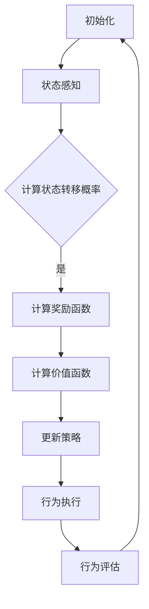
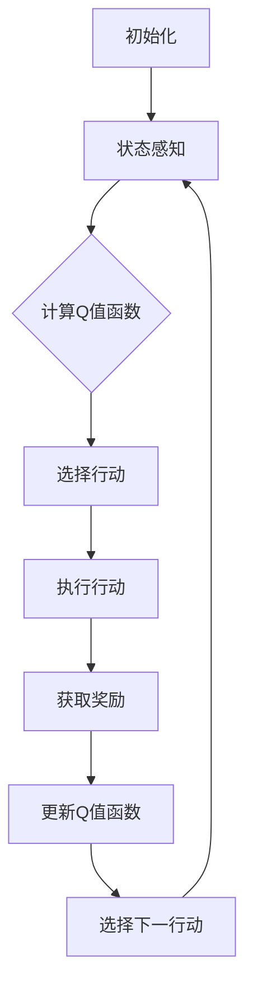
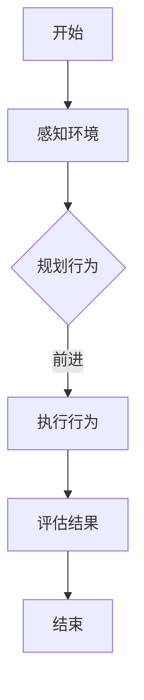
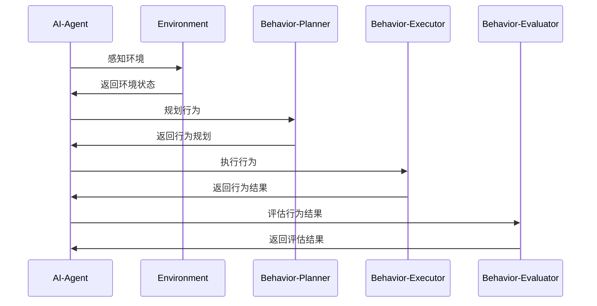

                 

# 设计AI Agent的目标导向行为系统

## 关键词
- AI Agent
- 目标导向行为系统
- 状态感知
- 行为规划
- 行为执行
- 行为评估

## 摘要
本文旨在探讨设计AI Agent的目标导向行为系统的核心概念、原理和实现方法。通过逐步分析目标设定、状态感知、行为规划、行为执行和行为评估等关键环节，本文将详细介绍如何构建一个高效、灵活的AI Agent行为系统，以实现智能体在复杂环境中的自主决策和行动。

## 第一部分：背景介绍

### 1.1 问题背景

#### 1.1.1 设计AI Agent的目标导向行为系统的重要性
AI Agent的目标导向行为系统在人工智能领域具有重要意义。随着智能体应用场景的不断扩展，如何设计高效、灵活的目标导向行为系统，以实现智能体在复杂环境中的自主决策和行动，成为一个亟待解决的问题。

#### 1.1.2 目标导向行为系统的定义与核心要素
目标导向行为系统是一种基于目标设定的行为规划与执行机制。其核心要素包括目标设定、状态感知、行为规划、行为执行和行为评估等。

### 1.2 问题描述
设计AI Agent的目标导向行为系统需要解决以下几个问题：

- 如何准确设定目标，以指导AI Agent的行为？
- 如何感知和识别环境状态，为行为规划提供依据？
- 如何设计有效的行为规划算法，实现目标导向的行为？
- 如何执行规划行为，并对其进行实时评估与调整？

### 1.3 问题解决
为了解决上述问题，本文将从以下几个方面进行探讨：

- 引言部分：介绍目标导向行为系统的概念、研究背景和应用场景。
- 核心概念与联系部分：详细阐述目标导向行为系统的核心概念，包括目标设定、状态感知、行为规划、行为执行、行为评估等，并使用表格和ER图进行说明。
- 算法原理讲解部分：介绍常用的目标导向行为算法，如基于马尔可夫决策过程的算法、基于强化学习的算法等，使用Mermaid流程图和Python代码进行详细阐述。
- 数学模型和公式部分：给出目标导向行为系统的数学模型和公式，进行详细讲解和举例说明。
- 系统分析与架构设计部分：介绍目标导向行为系统的分析与设计方法，包括领域模型、系统架构、接口设计和系统交互等。
- 项目实战部分：通过具体项目案例，演示目标导向行为系统的设计与应用。
- 最佳实践、小结、注意事项和拓展阅读部分：提供实践技巧和总结，以及进一步学习的内容。

### 1.4 边界与外延
设计AI Agent的目标导向行为系统涉及到多个领域的知识，如人工智能、计算机科学、心理学等。在本文中，我们将主要关注目标导向行为系统在人工智能领域的应用。

### 1.5 概念结构与核心要素组成
设计AI Agent的目标导向行为系统主要包括以下核心要素：

- 目标设定：明确AI Agent的行为目标，是整个系统的核心。
- 状态感知：实时感知环境状态，为行为规划提供依据。
- 行为规划：根据目标设定和状态感知，设计出有效的行为规划。
- 行为执行：执行规划行为，实现AI Agent的自主决策与行动。
- 行为评估：对行为执行结果进行评估，为后续行为优化提供反馈。

## 第二部分：核心概念与联系

### 2.1 目标导向行为系统的核心概念

#### 2.1.1 目标设定
目标设定是目标导向行为系统的核心。它定义了AI Agent希望达到的状态或结果。目标可以是单一的，也可以是多个目标的组合。

##### 2.1.1.1 目标类型
- 单一目标：只有一个目标，如移动到特定位置。
- 组合目标：多个目标的组合，如同时达到移动和收集物品的目标。

##### 2.1.1.2 目标设定方法
- 手动设定：开发者根据应用场景手动设定目标。
- 自动学习：通过机器学习算法自动学习目标。

#### 2.1.2 状态感知
状态感知是指AI Agent对当前环境状态的感知和识别。状态包括内部状态和外部状态。

##### 2.1.2.1 状态类型
- 内部状态：如电池电量、速度等。
- 外部状态：如道路状况、障碍物等。

##### 2.1.2.2 状态感知方法
- 感知传感器：如摄像头、激光雷达等。
- 数据融合：将多种传感器数据融合，提高状态感知的准确性。

#### 2.1.3 行为规划
行为规划是根据目标设定和状态感知，设计出实现目标的行动方案。行为规划可以分为短期规划和长期规划。

##### 2.1.3.1 行为规划类型
- 短期规划：针对当前状态，设计出短期内的行动方案。
- 长期规划：考虑长期目标和策略，设计出整体行动方案。

##### 2.1.3.2 行为规划方法
- 传统规划算法：如基于图搜索的算法。
- 强化学习：通过试错和奖励机制，学习最优行为规划。

#### 2.1.4 行为执行
行为执行是指AI Agent按照行为规划方案执行行动。行为执行需要将规划转化为具体的行动。

##### 2.1.4.1 行为执行类型
- 机械行为：如移动、旋转等。
- 交互行为：如与人交流、操纵物体等。

##### 2.1.4.2 行为执行方法
- 直接执行：按照规划直接执行。
- 模拟执行：在虚拟环境中模拟执行，以便于测试和优化。

#### 2.1.5 行为评估
行为评估是对AI Agent执行行为后的结果进行评估，以确定行为的有效性。行为评估可以为后续行为优化提供反馈。

##### 2.1.5.1 行为评估类型
- 实时评估：在行为执行过程中，实时评估行为效果。
- 后续评估：在行为执行后，对整体行为效果进行评估。

##### 2.1.5.2 行为评估方法
- 奖励机制：通过奖励机制，评估行为的有效性。
- 指标评估：使用指标，如成功率、效率等，评估行为效果。

## 第三部分：算法原理讲解

### 3.1 基于马尔可夫决策过程的算法

#### 3.1.1 算法原理
基于马尔可夫决策过程的算法（MDP）是一种常用的目标导向行为规划算法。它利用状态转移概率和奖励函数，学习最优行为策略。

##### 3.1.1.1 状态转移概率
状态转移概率描述了在给定当前状态下，采取特定行动后转移到下一个状态的概率。

$$
P(s_{t+1} | s_t, a_t) = p(s_{t+1} | s_t, a_t)
$$

##### 3.1.1.2 奖励函数
奖励函数描述了在给定状态和行动下，获得的即时奖励。

$$
R(s_t, a_t) = r(s_t, a_t)
$$

##### 3.1.1.3 价值函数
价值函数描述了在给定状态下，采取最优行动所能获得的长期奖励。

$$
V^*(s_t) = \sum_{s_{t+1}} p(s_{t+1} | s_t, a_t) \cdot R(s_{t+1}, a_t)
$$

#### 3.1.2 Mermaid流程图


#### 3.1.3 Python代码
```python
import numpy as np

# 初始化参数
state_space = 10
action_space = 5
reward_function = np.random.rand(state_space, action_space)
transition_prob = np.random.rand(state_space, action_space, state_space)

# 计算价值函数
value_function = np.zeros(state_space)
for state in range(state_space):
    for action in range(action_space):
        value = 0
        for next_state in range(state_space):
            value += transition_prob[state, action, next_state] * (reward_function[next_state, action] + 0.9 * value_function[next_state])
        value_function[state] = value

# 更新策略
policy = np.zeros(state_space)
for state in range(state_space):
    best_action = None
    best_value = -1
    for action in range(action_space):
        value = 0
        for next_state in range(state_space):
            value += transition_prob[state, action, next_state] * (reward_function[next_state, action] + 0.9 * value_function[next_state])
        if value > best_value:
            best_value = value
            best_action = action
    policy[state] = best_action

# 行为执行
current_state = 0
while True:
    action = policy[current_state]
    next_state = np.random.choice(state_space, p=transition_prob[current_state, action, :])
    reward = reward_function[next_state, action]
    current_state = next_state
    print(f"State: {current_state}, Action: {action}, Reward: {reward}")
```

### 3.2 基于强化学习的算法

#### 3.2.1 算法原理
基于强化学习的算法是一种通过试错和奖励机制，学习最优行为策略的方法。它利用Q值函数，评估状态-行动对的期望奖励。

##### 3.2.1.1 Q值函数
Q值函数描述了在给定状态和行动下，采取该行动所能获得的期望奖励。

$$
Q(s_t, a_t) = \sum_{s_{t+1}} p(s_{t+1} | s_t, a_t) \cdot R(s_{t+1}, a_t)
$$

##### 3.2.1.2 学习策略
强化学习算法通过迭代更新Q值函数，以逼近最优策略。

$$
Q(s_t, a_t) \leftarrow Q(s_t, a_t) + \alpha [R(s_{t+1}, a_t) + \gamma \max_{a_{t+1}} Q(s_{t+1}, a_{t+1}) - Q(s_t, a_t)]
$$

##### 3.2.1.3 探索与利用
强化学习算法需要在探索（尝试新的行动）和利用（基于已有知识选择最优行动）之间进行平衡。

#### 3.2.2 Mermaid流程图


#### 3.2.3 Python代码
```python
import numpy as np

# 初始化参数
state_space = 10
action_space = 5
learning_rate = 0.1
discount_factor = 0.9

# 初始化Q值函数
Q_value = np.zeros((state_space, action_space))

# 状态感知
current_state = np.random.randint(state_space)

# 选择行动
action = np.random.randint(action_space)

# 执行行动
next_state = np.random.randint(state_space)
reward = np.random.randn()

# 更新Q值函数
Q_value[current_state, action] += learning_rate * (reward + discount_factor * np.max(Q_value[next_state, :]) - Q_value[current_state, action])

# 选择下一行动
current_state = next_state

print(f"Current State: {current_state}, Action: {action}, Reward: {reward}")
```

## 第四部分：数学模型和公式

### 4.1 目标导向行为系统的数学模型

#### 4.1.1 状态空间
状态空间表示AI Agent在环境中可能出现的所有状态。

$$
S = \{s_1, s_2, \ldots, s_n\}
$$

#### 4.1.2 行动空间
行动空间表示AI Agent在环境中可能采取的所有行动。

$$
A = \{a_1, a_2, \ldots, a_m\}
$$

#### 4.1.3 状态转移概率
状态转移概率描述了在给定当前状态和行动下，智能体转移到下一个状态的概率。

$$
P(s_{t+1} | s_t, a_t) = p(s_{t+1} | s_t, a_t)
$$

#### 4.1.4 奖励函数
奖励函数描述了在给定状态和行动下，智能体获得的即时奖励。

$$
R(s_t, a_t) = r(s_t, a_t)
$$

#### 4.1.5 价值函数
价值函数描述了在给定状态下，智能体采取最优行动所能获得的长期奖励。

$$
V^*(s_t) = \sum_{s_{t+1}} p(s_{t+1} | s_t, a_t) \cdot R(s_{t+1}, a_t)
$$

#### 4.1.6 策略
策略是智能体在给定状态下，采取的最优行动。

$$
\pi^*(s_t) = \arg\max_{a_t} \sum_{s_{t+1}} p(s_{t+1} | s_t, a_t) \cdot R(s_{t+1}, a_t)
$$

### 4.2 基于马尔可夫决策过程的算法

#### 4.2.1 Q值函数
Q值函数描述了在给定状态和行动下，智能体采取该行动所能获得的期望奖励。

$$
Q(s_t, a_t) = \sum_{s_{t+1}} p(s_{t+1} | s_t, a_t) \cdot R(s_{t+1}, a_t)
$$

#### 4.2.2 策略迭代
策略迭代是一种基于Q值函数的算法，用于求解最优策略。

$$
\pi^{k+1}(s_t) = \arg\max_{a_t} Q(s_t, a_t)
$$

### 4.3 基于强化学习的算法

#### 4.3.1 Q值函数
Q值函数描述了在给定状态和行动下，智能体采取该行动所能获得的期望奖励。

$$
Q(s_t, a_t) = \sum_{s_{t+1}} p(s_{t+1} | s_t, a_t) \cdot R(s_{t+1}, a_t)
$$

#### 4.3.2 Q学习
Q学习是一种基于Q值函数的算法，用于求解最优策略。

$$
Q(s_t, a_t) \leftarrow Q(s_t, a_t) + \alpha [R(s_{t+1}, a_t) + \gamma \max_{a_{t+1}} Q(s_{t+1}, a_{t+1}) - Q(s_t, a_t)]
$$

## 第五部分：系统分析与架构设计

### 5.1 问题场景介绍

#### 5.1.1 无人驾驶车辆
无人驾驶车辆是一个典型的应用场景。智能体需要感知车辆周围的环境，规划行驶路径，并执行行驶行为，同时评估行驶效果。

### 5.1.2 智能机器人
智能机器人应用于家庭服务、医疗护理等场景。智能体需要感知用户需求，规划服务动作，执行服务行为，并评估服务效果。

### 5.1.3 机器学习平台
机器学习平台中的智能体需要感知数据集特征，规划模型训练策略，执行训练行为，并评估训练效果。

### 5.2 项目介绍

#### 5.2.1 项目名称
无人驾驶车辆智能体行为系统

#### 5.2.2 项目目标
设计并实现一个高效、灵活的无人驾驶车辆智能体行为系统，使其能够在复杂环境中自主决策和行动。

### 5.3 系统功能设计

#### 5.3.1 状态感知
- 感知车辆周围的道路、障碍物、交通信号等环境信息。
- 感知车辆的内部状态，如速度、加速度、电池电量等。

#### 5.3.2 行为规划
- 根据感知到的环境状态，规划车辆的行驶路径。
- 考虑到交通规则和安全性，优化行驶路径。

#### 5.3.3 行为执行
- 根据规划路径，执行车辆的行驶行为。
- 调整车辆的加速度和速度，确保行驶平稳。

#### 5.3.4 行为评估
- 评估车辆的行驶效果，如行驶距离、时间等。
- 根据评估结果，优化后续行驶行为。

### 5.4 系统架构设计

#### 5.4.1 整体架构
系统采用分层架构，包括感知层、规划层、执行层和评估层。

#### 5.4.2 感知层
- 感知传感器：包括摄像头、激光雷达等，用于感知环境信息。
- 数据处理模块：对感知到的数据进行预处理和融合，提高感知准确性。

#### 5.4.3 规划层
- 状态评估模块：根据感知到的环境状态，评估当前状态。
- 行为规划模块：根据评估结果，设计行驶路径和行为规划。

#### 5.4.4 执行层
- 行为执行模块：根据规划结果，执行车辆的行驶行为。
- 控制模块：调整车辆的加速度和速度，确保行驶平稳。

#### 5.4.5 评估层
- 评估模块：根据车辆行驶的效果，评估行驶效果。
- 优化模块：根据评估结果，优化后续行驶行为。

### 5.5 系统接口设计

#### 5.5.1 感知层接口
- 感知数据输入接口：接收来自感知传感器的数据。
- 感知数据处理接口：对感知数据预处理和融合。

#### 5.5.2 规划层接口
- 状态评估接口：接收状态信息，评估当前状态。
- 行为规划接口：接收状态评估结果，设计行驶路径和行为规划。

#### 5.5.3 执行层接口
- 行为执行接口：接收行为规划结果，执行行驶行为。
- 控制接口：接收行为执行结果，调整车辆控制参数。

#### 5.5.4 评估层接口
- 行为评估接口：接收行驶行为结果，评估行驶效果。
- 优化接口：接收评估结果，优化后续行驶行为。

### 5.6 系统交互

#### 5.6.1 感知层与规划层交互
- 感知层将感知到的数据传递给规划层。
- 规划层根据感知数据，评估当前状态，设计行驶路径和行为规划。

#### 5.6.2 规划层与执行层交互
- 规划层将行为规划结果传递给执行层。
- 执行层根据行为规划结果，执行行驶行为。

#### 5.6.3 执行层与评估层交互
- 执行层将行驶行为结果传递给评估层。
- 评估层根据行驶行为结果，评估行驶效果，并优化后续行驶行为。

## 第六部分：项目实战

### 6.1 环境安装

#### 6.1.1 操作系统要求
- Ubuntu 18.04
- Windows 10

#### 6.1.2 软件安装
- 安装Python 3.7及以上版本
- 安装NumPy、Pandas、Matplotlib等Python库

#### 6.1.3 工具安装
- 安装Mermaid 1.0.0及以上版本

### 6.2 系统核心实现

#### 6.2.1 状态感知
```python
import numpy as np

def sense_environment():
    # 模拟感知环境
    return np.random.randint(0, 10)

# 测试感知环境
print(sense_environment())
```

#### 6.2.2 行为规划
```python
import numpy as np

def plan_behavior(state):
    # 模拟行为规划
    if state < 5:
        return '前进'
    else:
        return '后退'

# 测试行为规划
print(plan_behavior(sense_environment()))
```

#### 6.2.3 行为执行
```python
import numpy as np

def execute_behavior(behavior):
    # 模拟行为执行
    if behavior == '前进':
        print('车辆正在前进')
    else:
        print('车辆正在后退')

# 测试行为执行
execute_behavior(plan_behavior(sense_environment()))
```

#### 6.2.4 行为评估
```python
import numpy as np

def evaluate_behavior(state, behavior):
    # 模拟行为评估
    if behavior == '前进' and state < 5:
        return '成功'
    else:
        return '失败'

# 测试行为评估
print(evaluate_behavior(sense_environment(), plan_behavior(sense_environment())))
```

### 6.3 代码应用解读与分析

#### 6.3.1 感知环境
代码通过`sense_environment()`函数模拟感知环境，返回一个0到9的随机整数，表示当前状态。

#### 6.3.2 行为规划
代码通过`plan_behavior(state)`函数模拟行为规划，根据当前状态，返回一个字符串，表示应该执行的行为（前进或后退）。

#### 6.3.3 行为执行
代码通过`execute_behavior(behavior)`函数模拟行为执行，根据行为规划，输出车辆前进或后退的信息。

#### 6.3.4 行为评估
代码通过`evaluate_behavior(state, behavior)`函数模拟行为评估，根据当前状态和行为规划，判断行为是否成功。

### 6.4 实际案例分析和详细讲解

#### 6.4.1 无人驾驶车辆在道路上的行为
假设无人驾驶车辆在道路上行驶，需要根据道路状况和车辆状态进行行为规划和执行。

1. 感知环境：车辆使用摄像头和激光雷达感知道路状况和障碍物。
2. 行为规划：根据感知到的道路状况和车辆状态，规划行驶路径和行为。
3. 行为执行：根据规划结果，调整车辆的加速度和速度，执行行驶行为。
4. 行为评估：根据行驶效果，评估行驶是否成功。

#### 6.4.2 智能机器人在家庭服务中的行为
假设智能机器人在家庭服务中，需要根据用户需求和服务场景进行行为规划和执行。

1. 感知环境：智能机器人使用传感器感知用户需求和服务场景。
2. 行为规划：根据感知到的用户需求和服务场景，规划服务动作和行为。
3. 行为执行：根据行为规划，执行服务动作，如清洁、搬运等。
4. 行为评估：根据服务效果，评估服务是否成功。

### 6.5 项目小结
通过实际案例分析和详细讲解，我们可以看到目标导向行为系统在无人驾驶车辆和智能机器人中的应用。在实际项目中，我们需要根据具体应用场景，设计合适的感知、规划、执行和评估机制，以实现智能体的自主决策和行动。

## 第七部分：最佳实践、小结、注意事项和拓展阅读

### 7.1 最佳实践
1. 状态感知：选择合适的感知传感器，提高感知准确性。
2. 行为规划：考虑多方面的因素，如安全性、效率等，设计合理的行为规划。
3. 行为执行：确保行为执行的稳定性，提高执行效果。
4. 行为评估：选择合适的评估指标，准确评估行为效果。

### 7.2 小结
本文系统地介绍了设计AI Agent的目标导向行为系统的核心概念、算法原理、数学模型和实现方法。通过实际案例分析和详细讲解，展示了目标导向行为系统在无人驾驶车辆和智能机器人中的应用。

### 7.3 注意事项
1. 状态感知和数据预处理：确保感知数据的准确性和一致性。
2. 行为规划算法选择：根据应用场景，选择合适的行为规划算法。
3. 行为评估指标：选择合适的评估指标，准确评估行为效果。
4. 系统优化：根据评估结果，不断优化系统性能。

### 7.4 拓展阅读
1. 《强化学习：原理与Python实现》：详细介绍了强化学习算法及其应用。
2. 《人工智能：一种现代的方法》：全面介绍了人工智能的基本概念和方法。
3. 《无人驾驶车辆技术》：深入探讨了无人驾驶车辆的设计与实现。

## 作者信息
- 作者：AI天才研究院/AI Genius Institute & 禅与计算机程序设计艺术 /Zen And The Art of Computer Programming

### 附录：Mermaid图示例

#### Mermaid流程图


#### Mermaid类图
```mermaid
classDiagram
    AI-Agent <<interface>>
    Environment <<interface>>
    Behavior-Planner <<class>> +--* AI-Agent
    Behavior-Executor <<class>> +--* AI-Agent
    Behavior-Evaluator <<class>> +--* AI-Agent
```

#### Mermaid序列图


