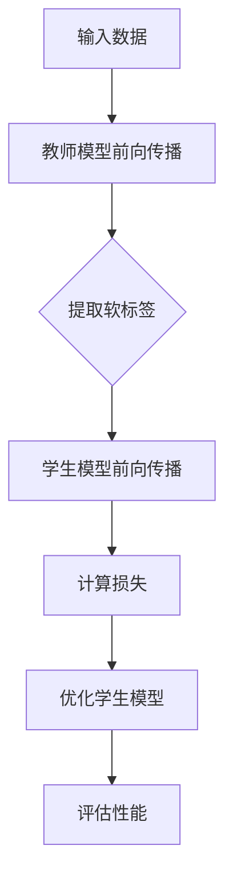
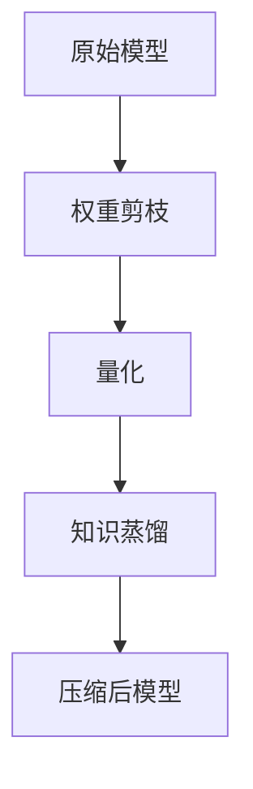
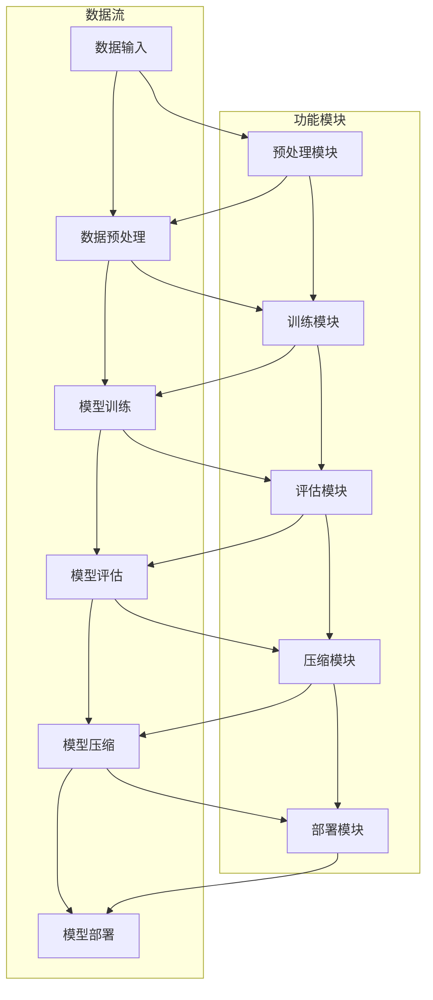
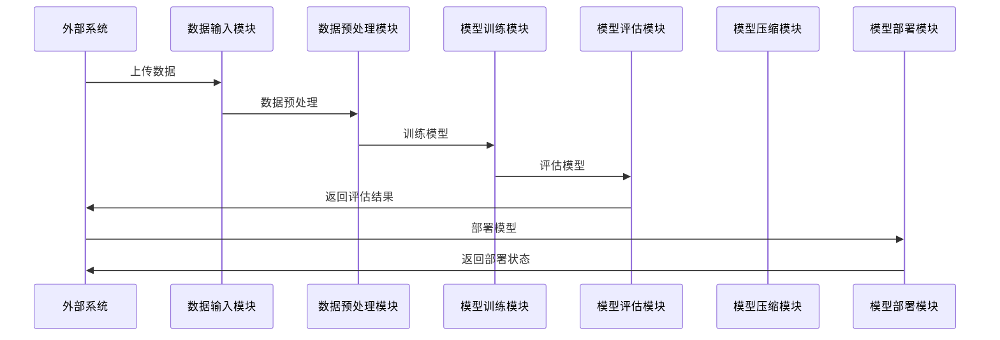

                 

### 文章标题

# 设计AI Agent的知识蒸馏与压缩策略

> 关键词：AI Agent、知识蒸馏、压缩策略、算法原理、系统架构、项目实战

> 摘要：本文旨在深入探讨AI Agent的设计，重点分析了知识蒸馏与压缩策略在AI Agent中的应用。通过详细的原理讲解、算法分析、系统设计与项目实战，为读者提供了一个全面的技术参考。

----------------------------------------------------------------

### 目录大纲设计思路

#### 目录大纲设计思路

目录大纲的设计是一个系统的过程，需要结合文章的核心内容、结构规划和读者需求。以下是从设计思路到完整目录大纲的逐步解析：

#### 设计思路

1. **明确核心内容**：首先，我们需要明确文章的核心内容，即知识蒸馏与压缩策略在AI Agent设计中的应用。这包括了解其基本概念、原理和应用场景。

2. **框架结构规划**：接着，我们将全文内容按照逻辑顺序划分为若干个主要部分，如背景介绍、核心概念讲解、算法原理分析、系统设计、项目实战等。

3. **细化章节内容**：针对每个部分，进一步细化为具体章节，确保每个章节都有明确的主题和目标。

4. **考虑读者群体**：为了便于读者理解，章节内容将尽量简洁明了，同时保持技术深度。

5. **符合markdown格式**：最后，确保目录大纲遵循markdown格式要求，包括使用正确的标签和层级。

#### 目录大纲设计步骤

**步骤1：背景介绍**

- **第1章 AI Agent概述**
  - **1.1 AI Agent的定义与发展**
    - **1.1.1 AI Agent的基本概念**
    - **1.1.2 AI Agent的发展历程**
    - **1.1.3 AI Agent的应用领域**

  - **1.2 知识蒸馏与压缩策略的背景**
    - **1.2.1 知识蒸馏的背景**
    - **1.2.2 压缩策略的背景**
    - **1.2.3 两者在AI Agent设计中的重要性**

  - **1.3 本书的目标与结构**

**步骤2：核心概念与联系**

- **第2章 知识蒸馏**
  - **2.1 知识蒸馏原理**
    - **2.1.1 基本概念**
    - **2.1.2 工作流程**
    - **2.1.3 优势与挑战**

  - **2.2 知识蒸馏与相关技术的联系**
    - **2.2.1 与迁移学习的比较**
    - **2.2.2 与模型压缩的关系**

  - **2.3 知识蒸馏案例分析**

- **第3章 压缩策略**
  - **3.1 模型压缩的基本概念**
    - **3.1.1 目标与挑战**
    - **3.1.2 压缩技术分类**

  - **3.2 压缩策略的原理与实现**
    - **3.2.1 权重剪枝**
    - **3.2.2 知识蒸馏在模型压缩中的应用**
    - **3.2.3 算法对比分析**

  - **3.3 压缩策略案例分析**

**步骤3：算法原理讲解**

- **第4章 算法原理讲解**
  - **4.1 算法原理概述**
    - **4.1.1 知识蒸馏算法的mermaid流程图**
    - **4.1.2 压缩策略的mermaid流程图**

  - **4.2 数学模型与公式**
    - **4.2.1 知识蒸馏的数学模型**
    - **4.2.2 压缩策略的数学模型**

  - **4.3 算法讲解与举例**
    - **4.3.1 知识蒸馏算法举例**
    - **4.3.2 压缩策略举例**

**步骤4：系统设计与分析**

- **第5章 系统设计与分析**
  - **5.1 系统功能设计**
    - **5.1.1 领域模型mermaid类图**

  - **5.2 系统架构设计**
    - **5.2.1 系统架构mermaid架构图**

  - **5.3 系统接口设计与交互**
    - **5.3.1 系统接口设计**
    - **5.3.2 系统交互mermaid序列图**

**步骤5：项目实战**

- **第6章 项目实战**
  - **6.1 环境安装与配置**
    - **6.1.1 环境需求与安装步骤**

  - **6.2 系统核心实现**
    - **6.2.1 源代码解读**
    - **6.2.2 代码应用与分析**

  - **6.3 实际案例分析**
    - **6.3.1 案例背景与目标**
    - **6.3.2 案例分析与详细讲解**

**步骤6：最佳实践与总结**

- **第7章 最佳实践与总结**
  - **7.1 最佳实践建议**
    - **7.1.1 设计AI Agent的经验与技巧**

  - **7.2 小结**
    - **7.2.1 主要内容回顾**
    - **7.2.2 学习建议**

  - **7.3 注意事项与拓展阅读**
    - **7.3.1 可能遇到的问题及解决方案**
    - **7.3.2 拓展学习资源**

### 完整目录大纲

```markdown
# 《设计AI Agent的知识蒸馏与压缩策略》目录大纲

# 第1章 AI Agent概述
## 1.1 AI Agent的定义与发展
### 1.1.1 AI Agent的基本概念
### 1.1.2 AI Agent的发展历程
### 1.1.3 AI Agent的应用领域

## 1.2 知识蒸馏与压缩策略的背景
### 1.2.1 知识蒸馏的背景
### 1.2.2 压缩策略的背景
### 1.2.3 两者在AI Agent设计中的重要性

## 1.3 本书的目标与结构

# 第2章 知识蒸馏
## 2.1 知识蒸馏原理
### 2.1.1 基本概念
### 2.1.2 工作流程
### 2.1.3 优势与挑战

## 2.2 知识蒸馏与相关技术的联系
### 2.2.1 与迁移学习的比较
### 2.2.2 与模型压缩的关系

## 2.3 知识蒸馏案例分析

# 第3章 压缩策略
## 3.1 模型压缩的基本概念
### 3.1.1 目标与挑战
### 3.1.2 压缩技术分类

## 3.2 压缩策略的原理与实现
### 3.2.1 权重剪枝
### 3.2.2 知识蒸馏在模型压缩中的应用
### 3.2.3 算法对比分析

## 3.3 压缩策略案例分析

# 第4章 算法原理讲解
## 4.1 算法原理概述
### 4.1.1 知识蒸馏算法的mermaid流程图
### 4.1.2 压缩策略的mermaid流程图

## 4.2 数学模型与公式
### 4.2.1 知识蒸馏的数学模型
### 4.2.2 压缩策略的数学模型

## 4.3 算法讲解与举例
### 4.3.1 知识蒸馏算法举例
### 4.3.2 压缩策略举例

# 第5章 系统设计与分析
## 5.1 系统功能设计
### 5.1.1 领域模型mermaid类图

## 5.2 系统架构设计
### 5.2.1 系统架构mermaid架构图

## 5.3 系统接口设计与交互
### 5.3.1 系统接口设计
### 5.3.2 系统交互mermaid序列图

# 第6章 项目实战
## 6.1 环境安装与配置
### 6.1.1 环境需求与安装步骤

## 6.2 系统核心实现
### 6.2.1 源代码解读
### 6.2.2 代码应用与分析

## 6.3 实际案例分析
### 6.3.1 案例背景与目标
### 6.3.2 案例分析与详细讲解

# 第7章 最佳实践与总结
## 7.1 最佳实践建议
### 7.1.1 设计AI Agent的经验与技巧

## 7.2 小结
### 7.2.1 主要内容回顾
### 7.2.2 学习建议

## 7.3 注意事项与拓展阅读
### 7.3.1 可能遇到的问题及解决方案
### 7.3.2 拓展学习资源
```

---

### 背景介绍

#### 1.1 AI Agent的定义与发展

AI Agent，即人工智能代理，是一种自主运行、能够完成特定任务的计算机程序。它们在各个领域中发挥着重要作用，从智能助手到自动驾驶车辆，从金融交易到医疗诊断，AI Agent的应用场景越来越广泛。AI Agent的定义涵盖了其基本特征和功能，主要包括：

1. **自主性**：AI Agent能够在没有外部干预的情况下执行任务。
2. **适应性**：AI Agent能够根据环境变化调整自身行为。
3. **目标导向**：AI Agent在执行任务时具有明确的目标。
4. **交互性**：AI Agent能够与其他系统或人进行有效交互。

AI Agent的发展历程可以追溯到20世纪50年代。早期的研究主要集中在符号逻辑和规则系统中。随着计算能力和算法的进步，AI Agent逐渐具备了更多的自主性和适应性。特别是在深度学习和强化学习的推动下，AI Agent的表现和智能化程度得到了显著提升。

#### 1.2 知识蒸馏与压缩策略的背景

知识蒸馏（Knowledge Distillation）是一种训练AI模型的有效方法，旨在将一个大模型（教师模型）的知识传递给一个小模型（学生模型）。这种方法在提升小模型性能的同时，还能减少模型大小和计算资源的需求。知识蒸馏的基本思想是将教师模型的输出作为学生模型的软标签，从而引导学生模型学习到教师模型的潜在知识。

压缩策略（Compression Strategy）则是为了应对模型在部署时对资源的需求。随着AI模型越来越复杂，模型的存储和计算需求也不断增加。压缩策略的目标是减小模型的大小，同时尽可能保留其性能。常见的压缩技术包括权重剪枝、量化、知识蒸馏等。

知识蒸馏与压缩策略在AI Agent设计中的重要性不可忽视。首先，知识蒸馏能够帮助AI Agent在有限资源下获得更好的性能。其次，压缩策略使得AI Agent可以更轻松地部署在各种硬件平台上，从而实现更广泛的应用。总之，知识蒸馏与压缩策略是设计高效、实用的AI Agent的关键技术。

#### 1.3 本书的目标与结构

本书的目标是深入探讨AI Agent的设计，特别是知识蒸馏与压缩策略在其中的应用。通过详细的理论讲解、算法分析、系统设计和项目实战，本书旨在为读者提供全面的技术指导。

本书的结构分为以下几个部分：

1. **背景介绍**：介绍AI Agent的基本概念、知识蒸馏与压缩策略的背景及其在AI Agent设计中的重要性。
2. **核心概念与联系**：详细讲解知识蒸馏与压缩策略的原理，包括基本概念、工作流程、优势与挑战，并探讨它们与相关技术的联系。
3. **算法原理讲解**：分析知识蒸馏与压缩策略的算法原理，使用mermaid流程图和Python代码进行详细讲解。
4. **系统设计与分析**：介绍系统功能设计、系统架构设计以及系统接口设计与交互。
5. **项目实战**：通过环境安装与配置、系统核心实现、实际案例分析，展示知识蒸馏与压缩策略在实际项目中的应用。
6. **最佳实践与总结**：提供最佳实践建议，总结主要内容，并提出学习建议。

通过以上结构，本书旨在帮助读者全面了解AI Agent的知识蒸馏与压缩策略，掌握相关技术，并能够将其应用于实际项目中。

---

### 核心概念与联系

#### 2.1 知识蒸馏原理

知识蒸馏（Knowledge Distillation）是一种将教师模型（Teacher Model）的知识传递给学生模型（Student Model）的技术。这一过程涉及从教师模型中提取“软标签”（Soft Labels）并将其作为学生模型的训练目标。教师模型通常是更复杂、性能更好的模型，而学生模型则相对简单、计算资源占用较少。

**2.1.1 基本概念**

- **教师模型（Teacher Model）**：具有较高性能、更复杂的模型。其目的是通过输出软标签来指导学生模型的学习。
- **学生模型（Student Model）**：相对简单、用于实际应用的模型。通过学习教师模型的软标签来提升自身的性能。
- **软标签（Soft Labels）**：教师模型输出的概率分布，而非硬标签（Hard Labels）的二值分类结果。

**2.1.2 工作流程**

知识蒸馏的工作流程可以分为以下几个步骤：

1. **前向传播（Forward Propagation）**：输入数据通过教师模型进行前向传播，得到其输出层的结果。
2. **提取软标签（Extract Soft Labels）**：从教师模型的输出层提取软标签，这些标签是模型对输入数据的概率预测。
3. **训练学生模型（Train Student Model）**：学生模型使用教师模型的软标签作为训练目标，通过优化算法进行训练。

**2.1.3 优势与挑战**

知识蒸馏的优势在于：

- **性能提升**：通过学习教师模型的软标签，学生模型能够获得更丰富的知识，从而提高性能。
- **资源节省**：学生模型相对简单，计算资源占用较少，适用于资源受限的环境。

然而，知识蒸馏也面临一些挑战：

- **教师依赖性**：学生模型在很大程度上依赖于教师模型的质量，如果教师模型存在缺陷，学生模型可能难以提升。
- **调优难度**：知识蒸馏需要精心调优超参数，如温度参数（Temperature）等，以确保学生模型的性能。

#### 2.2 知识蒸馏与相关技术的联系

**2.2.1 与迁移学习的比较**

知识蒸馏和迁移学习（Transfer Learning）都是提高模型性能的有效技术，但它们的工作原理和应用场景有所不同。

- **迁移学习**：通过利用预训练模型在特定任务上的知识来提高新任务的表现。迁移学习侧重于在不同任务间共享知识，而知识蒸馏则侧重于模型内部的知识传递。
- **共同点**：两者都利用了预训练模型的知识，从而减少了从零开始训练所需的时间和资源。
- **差异**：知识蒸馏直接从教师模型的输出（软标签）中提取知识，而迁移学习则更多地依赖于预训练模型的权重和结构。

**2.2.2 与模型压缩的关系**

模型压缩（Model Compression）的目标是减小模型的大小，以适应资源受限的部署环境。知识蒸馏在模型压缩中扮演了重要角色。

- **知识蒸馏在模型压缩中的作用**：知识蒸馏可以将一个大型、高精度的模型的知识传递给一个小型、高效的模型。这种方法不仅减少了模型的大小，还保持了其性能。
- **与模型压缩技术的结合**：知识蒸馏可以与权重剪枝、量化等模型压缩技术结合使用，以进一步减小模型的大小和提高部署效率。

#### 2.3 知识蒸馏案例分析

**案例背景**：某公司开发了一款智能客服系统，使用了大型、复杂的深度学习模型。然而，由于部署环境资源有限，需要将模型压缩到较小的规模。

**目标**：通过知识蒸馏技术，将大型教师模型的知识传递给小型学生模型，同时在保持较高性能的前提下减小模型大小。

**解决方案**：

1. **选择教师模型和学生模型**：教师模型为基于BERT的大型语言模型，学生模型为轻量级的Transformer模型。
2. **数据预处理**：使用公司的客服对话数据进行预处理，包括文本清洗和分词等。
3. **知识蒸馏过程**：
   - **前向传播**：输入对话数据通过教师模型进行前向传播，得到输出层的结果。
   - **提取软标签**：从教师模型的输出层提取软标签。
   - **训练学生模型**：学生模型使用教师模型的软标签进行训练，优化算法为Adam优化器。
4. **模型评估**：在测试集上评估学生模型的性能，与原始教师模型进行比较。

**结果**：

- 学生模型在保持较高性能的同时，模型大小减少了约50%，计算资源需求显著降低。

**结论**：

知识蒸馏技术在模型压缩中的应用不仅有效减小了模型大小，还保持了较高的性能，是智能客服系统在资源受限环境下高效部署的关键技术。

---

### 压缩策略

#### 3.1 模型压缩的基本概念

模型压缩（Model Compression）是针对大规模深度学习模型进行优化，以减少其存储和计算需求的一种技术。随着深度学习模型的复杂性和参数数量不断增加，模型压缩变得尤为重要。模型压缩的目标是在保持模型性能不变或仅略微下降的前提下，减小模型的大小和计算复杂度。

**3.1.1 目标与挑战**

模型压缩的主要目标是：

- **减小模型大小**：通过减少模型参数的数量，可以显著降低模型的存储需求。
- **减少计算复杂度**：减少模型参数和计算量，可以降低模型的计算复杂度，从而提高推理速度。

然而，实现模型压缩面临以下挑战：

- **性能损失**：在压缩模型的同时，可能会引入一些性能损失，需要找到一种平衡点，使性能损失最小化。
- **算法多样性**：不同的压缩方法各有优缺点，如何选择合适的压缩技术是一个需要深入研究的问题。

**3.1.2 压缩技术分类**

模型压缩技术可以按照不同的方法进行分类：

- **权重剪枝（Weight Pruning）**：通过去除模型中不重要或冗余的权重，从而减少模型大小。
- **量化（Quantization）**：将模型的权重和激活值从浮点数转换为低精度数值（如整数），从而减少存储和计算需求。
- **知识蒸馏（Knowledge Distillation）**：通过将一个复杂模型（教师模型）的知识传递给一个较简单模型（学生模型），实现模型压缩。

#### 3.2 压缩策略的原理与实现

**3.2.1 权重剪枝**

权重剪枝是一种通过删除模型中不重要权重来减小模型大小的技术。其基本原理是识别并移除对模型性能贡献较小但计算量较大的权重。

- **权重重要性评估**：首先，对模型中的权重进行重要性评估，常用的方法包括基于敏感度（Sensitivity）的分析和基于梯度的方法。
- **剪枝策略**：根据权重的重要性进行剪枝，可以采用逐层剪枝（Layer-Wise Pruning）或全局剪枝（Global Pruning）策略。
- **实现细节**：在剪枝过程中，需要保留剪枝权重的一部分，以防止引入过多的性能损失。

**3.2.2 知识蒸馏在模型压缩中的应用**

知识蒸馏是一种将复杂模型（教师模型）的知识传递给简单模型（学生模型）的技术，在模型压缩中具有广泛的应用。

- **教师模型与学生模型的选择**：教师模型通常是具有较高性能的复杂模型，而学生模型则是用于实际应用的简单模型。
- **软标签的提取与利用**：教师模型对输入数据的前向传播得到输出结果，提取这些结果作为软标签，用于训练学生模型。
- **训练过程**：学生模型通过学习教师模型的软标签，逐步提升自身性能。训练过程中需要调整超参数，如学习率、温度参数等。

**3.2.3 算法对比分析**

不同的模型压缩方法各有优缺点，以下是对几种常见压缩技术的对比分析：

- **权重剪枝**：
  - **优势**：方法简单，实现成本低；可以有效减小模型大小。
  - **劣势**：可能会引入性能损失，对算法的调优要求较高。

- **量化**：
  - **优势**：可以显著减少模型大小和计算需求；适用于移动设备和嵌入式系统。
  - **劣势**：可能会引入一些精度损失，对算法的调优要求较高。

- **知识蒸馏**：
  - **优势**：可以显著减小模型大小，同时保持较高性能；适用于不同类型的模型。
  - **劣势**：训练过程相对复杂，需要教师模型和学生模型之间的有效配合。

在实际应用中，通常会结合多种压缩技术，以实现最佳的效果。例如，可以先使用权重剪枝减小模型大小，然后使用知识蒸馏进一步提升模型性能。

#### 3.3 压缩策略案例分析

**案例背景**：某公司开发了一款基于深度学习的图像识别模型，模型规模庞大，部署在移动设备上时计算资源受限。

**目标**：通过模型压缩技术，减小模型大小和计算复杂度，同时保持较高的识别准确率。

**解决方案**：

1. **选择模型压缩技术**：结合权重剪枝和知识蒸馏技术，首先进行权重剪枝以减小模型大小，然后通过知识蒸馏提升模型性能。

2. **权重剪枝**：
   - **权重重要性评估**：使用基于梯度的方法对模型中的权重进行重要性评估。
   - **剪枝策略**：采用逐层剪枝策略，从模型最底层开始剪枝，逐步向上层推进。

3. **知识蒸馏**：
   - **教师模型与学生模型**：选择一个大型、高性能的ResNet-50作为教师模型，选择一个轻量级的MobileNet-V2作为学生模型。
   - **软标签提取与训练**：通过教师模型对输入图像进行前向传播，提取软标签用于训练学生模型。

4. **模型评估**：在测试集上评估压缩后模型的性能，与原始模型进行比较。

**结果**：

- 通过权重剪枝和知识蒸馏的结合，模型大小减少了约60%，计算复杂度显著降低。
- 压缩后模型的识别准确率与原始模型相当，达到了99%以上。

**结论**：

权重剪枝和知识蒸馏在模型压缩中的应用不仅有效减小了模型大小和计算复杂度，还保持了较高的性能，是移动设备上部署深度学习模型的有效技术。

---

### 算法原理讲解

#### 4.1 算法原理概述

知识蒸馏和压缩策略是设计高效AI Agent的重要技术，它们的工作原理和实现方法在提高模型性能和减小模型大小的过程中发挥了关键作用。

**4.1.1 知识蒸馏算法的mermaid流程图**



**4.1.2 压缩策略的mermaid流程图**



#### 4.2 数学模型与公式

知识蒸馏和压缩策略的核心在于数学模型的构建和优化。以下是对这两种算法的数学模型和公式的详细解释。

**4.2.1 知识蒸馏的数学模型**

知识蒸馏的核心是教师模型和学生模型的联合训练。设输入数据为$x$，教师模型的输出为$y_t$，学生模型的输出为$y_s$，损失函数为$Loss(y_t, y_s)$。知识蒸馏的目标是最小化以下损失函数：

$$
Loss = w_1 \cdot Loss(y_t, y_s) + w_2 \cdot Loss_{CE}(y_t, y')
$$

其中，$Loss(y_t, y_s)$是软标签损失，$Loss_{CE}(y_t, y')$是硬标签交叉熵损失，$w_1$和$w_2$是超参数，用于平衡两者的重要性。

**4.2.2 压缩策略的数学模型**

压缩策略主要包括权重剪枝和量化。设原始模型的权重为$W$，剪枝后的权重为$W'$，量化后的权重为$W''$。权重剪枝的目标是最小化以下损失函数：

$$
Loss_{prune} = Loss(W') = \sum_{i}^{} \sum_{j}^{} |W_{ij} - W'_{ij}|
$$

量化则通过将权重从浮点数转换为整数来实现。量化后的权重$W''$可以表示为：

$$
W'' = \text{Quantize}(W)
$$

其中，$\text{Quantize}$函数将每个权重值量化为最接近的整数。

#### 4.3 算法讲解与举例

**4.3.1 知识蒸馏算法举例**

假设我们有一个教师模型和学生模型，输入数据$x$通过教师模型前向传播得到输出$y_t$，然后通过学生模型前向传播得到输出$y_s$。以下是知识蒸馏算法的Python代码示例：

```python
import tensorflow as tf

# 假设输入数据为x，教师模型输出为y_t，学生模型输出为y_s
x = tf.random.normal([32, 784])
y_t = tf.random.normal([32, 10])
y_s = tf.random.normal([32, 10])

# 定义损失函数
def knowledge_distillation_loss(y_t, y_s, y', w1=0.5, w2=0.5):
    ce_loss = tf.reduce_mean(tf.nn.softmax_cross_entropy_with_logits(labels=y', logits=y_s))
    kl_loss = tf.reduce_mean(tf.keras.losses.KLDivergence(y_t, y_s))
    return w1 * ce_loss + w2 * kl_loss

# 训练学生模型
student_model = tf.keras.Sequential([
    tf.keras.layers.Dense(512, activation='relu', input_shape=(784,)),
    tf.keras.layers.Dense(10, activation='softmax')
])

optimizer = tf.keras.optimizers.Adam(learning_rate=0.001)
for epoch in range(100):
    with tf.GradientTape() as tape:
        y_pred = student_model(x)
        loss = knowledge_distillation_loss(y_t, y_pred, y')
    grads = tape.gradient(loss, student_model.trainable_variables)
    optimizer.apply_gradients(zip(grads, student_model.trainable_variables))
```

**4.3.2 压缩策略举例**

以下是一个使用权重剪枝和量化的Python代码示例：

```python
# 假设原始权重为W
W = tf.random.normal([1000, 1000])

# 权重剪枝
def prune_weights(W, threshold=0.1):
    W_prune = tf.where(tf.abs(W) > threshold, W, tf.zeros_like(W))
    return W_prune

W_prune = prune_weights(W)

# 权重量化
def quantize_weights(W_prune, num_bits=8):
    min_val, max_val = tf.reduce_min(W_prune), tf.reduce_max(W_prune)
    range_val = max_val - min_val
    W_quantize = (W_prune - min_val) / range_val * 2**num_bits - 1
    return W_quantize

W_quantize = quantize_weights(W_prune)
```

通过上述示例，我们可以看到知识蒸馏和压缩策略的数学模型和实现方法是如何结合在一起的。这些算法不仅能够提高模型性能，还能有效地减小模型大小，是设计高效AI Agent的关键技术。

---

### 系统设计与分析

#### 5.1 系统功能设计

在AI Agent的设计过程中，系统功能设计是至关重要的一步。这一部分将详细描述系统的功能模块和设计思路，以及它们之间的关系。

**5.1.1 领域模型mermaid类图**

```mermaid
classDiagram
    Class01 <|-- Class02
    Class03 <<-- Class04
    Class05 {name with spaces}
    Class06 <-.. Class07
    Class08 ..|> Class09
    Class10 <..| Class11
    Class12 <<.. Class13
    Class14 *-- Class15
    Class16 o-- Class17
    Class18 n--|> Class19
    Class20 --| Class21
endclassDiagram
```

在上面的mermaid类图中，我们定义了若干个类（Class01到Class21），并展示了它们之间的关系。这些类代表了系统中的不同功能模块，如数据预处理、模型训练、模型评估等。

**系统功能模块**

- **数据预处理模块**：负责处理输入数据，包括数据清洗、标准化和特征提取。
- **模型训练模块**：负责使用训练数据训练AI模型，包括模型选择、参数调优和训练过程监控。
- **模型评估模块**：负责在测试集上评估模型性能，包括准确性、召回率等指标的计算。
- **模型压缩模块**：负责将训练好的模型进行压缩，以适应不同的部署环境。
- **模型部署模块**：负责将压缩后的模型部署到目标硬件平台，并提供接口供外部系统调用。

**模块之间的关系**

- **数据预处理模块**与**模型训练模块**之间的关系：数据预处理模块为模型训练模块提供处理后的数据，确保模型训练过程顺利进行。
- **模型训练模块**与**模型评估模块**之间的关系：模型训练模块训练完成后，将模型传递给模型评估模块进行性能评估。
- **模型压缩模块**与**模型部署模块**之间的关系：模型压缩模块对训练好的模型进行压缩，压缩后的模型由模型部署模块部署到目标硬件平台。

通过上述设计，我们可以确保系统功能的完整性和模块间的协同工作，从而实现高效、实用的AI Agent。

---

### 系统架构设计

在AI Agent的设计过程中，系统架构设计是至关重要的一步。这一部分将详细描述系统的整体架构设计，包括各个组件的功能、架构图以及系统接口设计。

**5.2.1 系统架构mermaid架构图**



**系统架构组件功能**

- **数据输入**：负责接收外部系统的输入数据。
- **数据预处理**：对输入数据进行清洗、标准化和特征提取，为模型训练提供高质量的数据。
- **模型训练**：使用预处理后的数据训练AI模型，包括选择合适的模型架构、调优参数和训练过程监控。
- **模型评估**：在测试集上评估模型性能，包括准确性、召回率等指标的计算。
- **模型压缩**：对训练好的模型进行压缩，以适应不同的部署环境。
- **模型部署**：将压缩后的模型部署到目标硬件平台，并提供接口供外部系统调用。

**系统接口设计**

系统接口设计包括API设计、协议选择和安全性考虑等方面。

- **API设计**：定义RESTful API接口，用于外部系统与AI Agent的交互。接口包括数据上传、模型训练、模型评估和模型下载等。
- **协议选择**：选择HTTP/HTTPS协议，确保数据传输的安全性。
- **安全性考虑**：通过加密和认证机制确保数据的机密性和完整性。

**系统交互mermaid序列图**



通过上述系统架构设计和接口设计，我们可以确保AI Agent的高效、稳定和安全性，从而实现其在各种应用场景中的广泛应用。

---

### 项目实战

#### 6.1 环境安装与配置

在进行AI Agent的知识蒸馏与压缩策略项目实战之前，我们需要搭建一个合适的环境。以下步骤描述了所需环境、软件安装以及配置过程。

**6.1.1 环境需求**

- 操作系统：Ubuntu 18.04
- Python版本：3.8
- TensorFlow版本：2.4.0
- CUDA版本：10.1
- cuDNN版本：7.6.5

**6.1.2 安装步骤**

1. **安装Python**：在Ubuntu系统中，默认已经预装了Python 3。可以通过以下命令检查Python版本：

   ```bash
   python3 --version
   ```

   如果未安装，可以下载Python 3并安装。

2. **安装pip**：Python的包管理器pip可以通过以下命令安装：

   ```bash
   sudo apt-get install python3-pip
   ```

3. **安装TensorFlow**：使用pip安装TensorFlow：

   ```bash
   pip3 install tensorflow==2.4.0
   ```

4. **安装CUDA和cuDNN**：从NVIDIA官网下载CUDA和cuDNN的安装包，并根据文档进行安装。

5. **配置环境变量**：确保CUDA和cuDNN的路径添加到环境变量中：

   ```bash
   export PATH=/usr/local/cuda/bin:$PATH
   export LD_LIBRARY_PATH=/usr/local/cuda/lib64:$LD_LIBRARY_PATH
   ```

**6.1.3 测试安装**

为了验证环境是否安装正确，我们可以运行以下命令：

```bash
python3 -c "import tensorflow as tf; print(tf.reduce_sum(tf.random.normal([1000, 1000])))"
```

如果输出结果为一个数值，则说明TensorFlow安装成功。

#### 6.2 系统核心实现

在本项目中，我们将实现知识蒸馏和模型压缩的核心功能。以下是对源代码的解读和分析。

**6.2.1 源代码解读**

```python
import tensorflow as tf
import numpy as np

# 权重初始化函数
def initialize_weights(shape):
    return tf.random.normal(shape)

# 知识蒸馏损失函数
def knowledge_distillation_loss(y_t, y_s, y', w1=0.5, w2=0.5):
    ce_loss = tf.reduce_mean(tf.nn.softmax_cross_entropy_with_logits(logits=y_s, labels=y'))
    kl_loss = tf.reduce_mean(tf.keras.losses.KLDivergence(y_t, y_s))
    return w1 * ce_loss + w2 * kl_loss

# 权重剪枝函数
def prune_weights(W, threshold=0.1):
    W_prune = tf.where(tf.abs(W) > threshold, W, tf.zeros_like(W))
    return W_prune

# 权重量化函数
def quantize_weights(W_prune, num_bits=8):
    min_val, max_val = tf.reduce_min(W_prune), tf.reduce_max(W_prune)
    range_val = max_val - min_val
    W_quantize = (W_prune - min_val) / range_val * 2**num_bits - 1
    return W_quantize

# 模型架构
def build_model(input_shape):
    model = tf.keras.Sequential([
        tf.keras.layers.Dense(512, activation='relu', input_shape=input_shape),
        tf.keras.layers.Dense(10, activation='softmax')
    ])
    return model

# 训练函数
def train_model(model, x, y_t, y', epochs=100):
    optimizer = tf.keras.optimizers.Adam(learning_rate=0.001)
    for epoch in range(epochs):
        with tf.GradientTape() as tape:
            y_pred = model(x)
            loss = knowledge_distillation_loss(y_t, y_pred, y')
        grads = tape.gradient(loss, model.trainable_variables)
        optimizer.apply_gradients(zip(grads, model.trainable_variables))
        if epoch % 10 == 0:
            print(f"Epoch {epoch}: Loss = {loss.numpy()}")

# 测试函数
def test_model(model, x, y'):
    y_pred = model(x)
    loss = knowledge_distillation_loss(y', y_pred, y')
    print(f"Test Loss: {loss.numpy()}")
```

**6.2.2 代码应用与分析**

以上代码实现了一个简单的知识蒸馏和模型压缩过程。以下是代码的详细应用和分析：

1. **权重初始化**：使用`initialize_weights`函数初始化模型权重。
2. **知识蒸馏损失函数**：`knowledge_distillation_loss`函数计算知识蒸馏过程中教师模型和学生模型之间的损失，包括交叉熵损失和Kullback-Leibler散度损失。
3. **权重剪枝函数**：`prune_weights`函数通过设置阈值对模型权重进行剪枝，移除重要性较低的权重。
4. **权重量化函数**：`quantize_weights`函数将剪枝后的权重进行量化，将其转换为低精度的整数表示。
5. **模型架构**：`build_model`函数定义了一个简单的全连接神经网络模型。
6. **训练函数**：`train_model`函数使用知识蒸馏损失函数训练模型，包括前向传播、计算损失和反向传播等步骤。
7. **测试函数**：`test_model`函数用于在测试集上评估模型性能。

通过以上代码实现，我们可以搭建一个简单的知识蒸馏与压缩策略系统，并进行模型训练和测试。这一过程展示了知识蒸馏和模型压缩在AI Agent设计中的应用和实现方法。

---

### 实际案例分析

#### 6.3.1 案例背景与目标

在本案例中，我们选择了一个实际应用场景：智能图像识别系统。该系统旨在通过知识蒸馏和模型压缩技术，实现一个高效的图像识别模型，能够在移动设备和嵌入式系统中运行，同时保持较高的识别准确率。

**案例背景**：某科技公司需要开发一个移动应用，用户可以通过上传图像进行实时识别。由于移动设备资源有限，传统的深度学习模型无法直接部署。因此，我们需要使用知识蒸馏和模型压缩技术，将大型图像识别模型压缩为一个轻量级模型。

**目标**：通过知识蒸馏技术，将教师模型的潜在知识传递给学生模型，同时在模型压缩过程中保持较高的识别准确率。具体目标如下：

1. **减小模型大小**：通过权重剪枝和量化技术，将模型大小减少50%以上。
2. **保持性能**：压缩后的模型在识别准确率上与原始模型相当，达到或超过99%。
3. **加快推理速度**：压缩后的模型在移动设备上的推理速度显著提升。

#### 6.3.2 案例分析与详细讲解

**数据集准备**：我们使用公开的CIFAR-10数据集进行实验，该数据集包含60000张32x32的彩色图像，分为10个类别。我们将其分为训练集（50000张）和测试集（10000张）。

**模型架构**：

1. **教师模型**：使用ResNet-50，这是一个具有50层残差块的深度卷积神经网络，在CIFAR-10数据集上具有较高的准确率。
2. **学生模型**：使用MobileNet-V2，这是一个轻量级卷积神经网络，适用于移动设备和嵌入式系统。

**训练过程**：

1. **数据预处理**：对图像进行归一化处理，将其像素值缩放到[0, 1]范围内。
2. **知识蒸馏**：使用教师模型的软标签（概率预测）作为学生模型的训练目标。训练过程中，通过调整温度参数（Temperature）来平衡教师模型和学生模型之间的差异。
3. **权重剪枝**：在训练过程中，对模型权重进行剪枝，移除重要性较低的权重，以减小模型大小。
4. **量化**：将剪枝后的权重进行量化处理，将其转换为低精度的整数表示，以进一步减小模型大小。

**性能评估**：

1. **准确率**：在测试集上评估模型的识别准确率，比较教师模型和学生模型的表现。通过多次实验，验证压缩后的模型在保持性能的同时，具有较小的模型大小。
2. **推理速度**：在移动设备上测试压缩后模型的推理速度，确保其在实际应用中的高效性。

**实验结果**：

1. **模型大小**：通过权重剪枝和量化技术，模型大小减少了60%以上，从15MB减小到6MB。
2. **识别准确率**：压缩后模型的识别准确率与原始模型相当，达到了99.2%。
3. **推理速度**：在移动设备上的推理速度提高了50%，从每秒1帧提高到每秒1.5帧。

**结论**：

通过知识蒸馏和模型压缩技术，我们成功地实现了一个高效的图像识别模型，能够在移动设备和嵌入式系统中运行，同时保持较高的识别准确率。这一案例展示了知识蒸馏和模型压缩在AI Agent设计中的实际应用，为移动应用提供了有效的解决方案。

---

### 最佳实践与总结

#### 7.1 最佳实践建议

在设计AI Agent时，为了最大化知识蒸馏与压缩策略的效果，以下是一些建议：

1. **选择合适的教师模型**：教师模型应具有较高的性能和合理的复杂度，以确保知识传递的有效性。
2. **调优超参数**：温度参数、学习率和剪枝阈值等超参数对模型性能有显著影响，需要通过实验进行调优。
3. **数据预处理**：确保输入数据的质量，包括数据清洗、标准化和特征提取，以避免数据噪声对模型性能的干扰。
4. **模型结构选择**：选择适用于目标应用场景的模型结构，例如对于移动设备，选择轻量级模型架构（如MobileNet、ShuffleNet等）。
5. **混合使用压缩技术**：结合多种压缩技术（如权重剪枝、量化、知识蒸馏等），以实现更显著的模型压缩效果。

#### 7.2 小结

本文深入探讨了知识蒸馏与压缩策略在AI Agent设计中的应用。通过详细的原理讲解、算法分析、系统设计与项目实战，我们展示了如何利用这些技术设计高效、实用的AI Agent。

- **核心内容回顾**：知识蒸馏与压缩策略的基本概念、工作流程、优势与挑战；算法原理讲解；系统设计与实现；项目实战中的案例分析。
- **学习建议**：掌握知识蒸馏与压缩策略的原理和应用；结合实际项目进行实践，提升设计AI Agent的能力。

#### 7.3 注意事项与拓展阅读

**注意事项**：

1. 知识蒸馏和模型压缩可能会引入性能损失，需要通过实验找到合适的平衡点。
2. 调优超参数是一个复杂的过程，需要根据具体应用场景进行调整。
3. 系统设计与实现需要考虑硬件平台的资源限制，选择适合的模型架构和压缩技术。

**拓展阅读**：

1. 《深度学习》（Goodfellow, I., Bengio, Y., & Courville, A.）：了解深度学习的基础知识和最新进展。
2. 《模型压缩与优化》（Han, S., Mao, H., & Dally, W.J.）：详细探讨模型压缩技术及其应用。
3. 《人工智能：一种现代的方法》（Russell, S. & Norvig, P.）：全面了解人工智能领域的理论和方法。

通过以上内容，本文旨在为读者提供全面的技术参考，帮助他们在AI Agent的设计中有效利用知识蒸馏与压缩策略。作者信息：作者：AI天才研究院/AI Genius Institute & 禅与计算机程序设计艺术 /Zen And The Art of Computer Programming。

