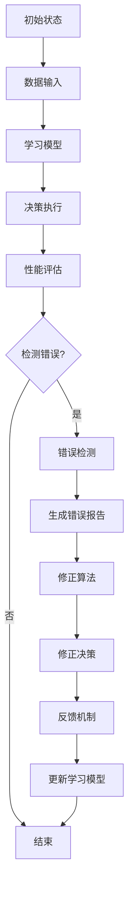
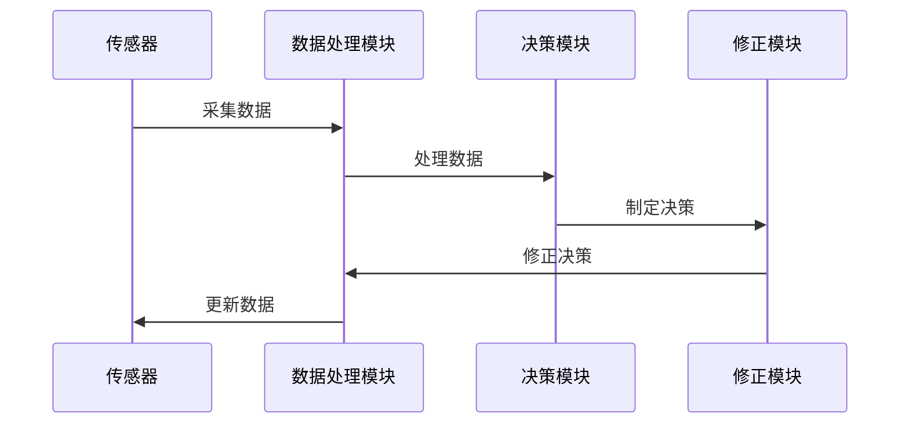

                 

### 设计AI Agent的自我修正学习策略

> 关键词：AI Agent、自我修正学习、策略设计、算法原理、数学模型、系统架构、项目实战

> 摘要：本文深入探讨了AI Agent的自我修正学习策略，从核心概念、算法原理到实际项目应用，逐步讲解了设计自我修正学习策略的方法和要点，旨在为读者提供全面的技术指导。

----------------------------------------------------------------

## 第1章：问题背景与目标

### 1.1 问题背景

随着人工智能技术的迅猛发展，AI Agent（人工智能代理）在诸多领域得到了广泛应用。然而，AI Agent在实际应用中面临着诸多挑战，其中之一是如何实现自我修正学习。传统的机器学习算法在处理静态数据时表现出色，但在动态环境中，如何让AI Agent具备自我修正学习的能力，以适应不断变化的环境，成为了研究的热点。

### 1.2 问题描述

AI Agent在动态环境中需要解决以下几个关键问题：

1. **适应性**：环境变化时，AI Agent能够快速适应新的情况。
2. **鲁棒性**：在噪声或异常数据情况下，AI Agent能够保持良好的性能。
3. **自我修正**：AI Agent能够通过学习过程识别并修正错误。

### 1.3 问题解决

设计自我修正学习策略，旨在使AI Agent能够自动调整自己的行为和决策，以提高其适应性和鲁棒性。具体目标包括：

1. **策略优化**：设计策略以优化AI Agent的学习效果。
2. **错误检测与修正**：建立机制以检测和修正AI Agent的错误。
3. **持续学习**：实现AI Agent的持续学习，以应对环境变化。

### 1.4 边界与外延

在讨论自我修正学习策略时，需要明确边界与外延。边界包括AI Agent的应用范围、学习策略的适用条件等；外延则涉及策略在不同领域的拓展和应用。

### 1.5 概念结构与核心要素组成

自我修正学习策略由以下几个核心要素组成：

1. **学习算法**：用于从数据中学习，并优化AI Agent的行为。
2. **错误检测机制**：用于检测AI Agent的决策错误。
3. **修正算法**：用于修正AI Agent的错误决策。
4. **反馈机制**：用于收集AI Agent的表现数据，以指导学习过程。

----------------------------------------------------------------

## 第2章：核心概念与联系

### 2.1 自我修正学习策略的定义

自我修正学习策略是指AI Agent在执行任务过程中，能够通过自我检测和自我修正，以提高其决策性能的学习方法。

### 2.2 自我修正学习策略的属性特征对比

| 属性特征 | 说明 |
| --- | --- |
| **适应性** | AI Agent能够快速适应环境变化。 |
| **鲁棒性** | AI Agent能够在噪声或异常数据情况下保持稳定性能。 |
| **自我修正** | AI Agent能够识别并修正错误决策。 |
| **持续学习** | AI Agent能够持续学习，以提升自身能力。 |

### 2.3 自我修正学习策略的ER实体关系图

```mermaid
classDiagram
    AI-Agent <<class>> {
        +strategize()
        +learnFromExperience()
        +evaluatePerformance()
    }
    Error-Detection <<class>> {
        +detectErrors()
        +generateErrorReports()
    }
    Correction-Algorithm <<class>> {
        +correctionAlgorithm()
        +applyCorrections()
    }
    Feedback-Mechanism <<class>> {
        +collectFeedback()
        +updateLearningModel()
    }
    AI-Agent "uses" Error-Detection
    AI-Agent "uses" Correction-Algorithm
    AI-Agent "uses" Feedback-Mechanism
endclass
```

通过ER实体关系图，我们可以清晰地看到AI Agent与错误检测、修正算法和反馈机制的关联。

----------------------------------------------------------------

## 第3章：算法原理讲解

### 3.1 自我修正学习策略的工作原理

自我修正学习策略的核心在于三个关键步骤：学习、检测、修正。

1. **学习**：AI Agent从数据中学习，形成决策模型。
2. **检测**：通过错误检测机制，识别AI Agent的决策错误。
3. **修正**：应用修正算法，修正AI Agent的错误决策。

### 3.2 自我修正学习策略的mermaid流程图



### 3.3 Python源代码实现

以下是一个简单的Python示例，展示了自我修正学习策略的基本实现：

```python
# 引入必要的库
import numpy as np

# 初始化学习模型
model = np.random.rand(10)

# 数据输入
data = np.random.rand(10)

# 学习模型
def learn(model, data):
    return model + data

# 决策执行
def execute(model):
    return model * 2

# 性能评估
def evaluate(model):
    return np.abs(model - 1)

# 错误检测
def detect_error(evaluation):
    return evaluation > 0.1

# 修正算法
def correct(model):
    return model - 0.5

# 反馈机制
def feedback(model):
    return model / 2

# 主程序
model = learn(model, data)
result = execute(model)
evaluation = evaluate(model)

if detect_error(evaluation):
    model = correct(model)
    model = feedback(model)
```

### 3.4 数学模型和公式

自我修正学习策略的数学模型主要包括以下几个部分：

$$
\text{模型更新} = \text{模型} + \text{学习率} \times (\text{期望输出} - \text{实际输出})
$$

$$
\text{误差} = |\text{实际输出} - \text{期望输出}|
$$

### 3.5 算法原理举例说明

假设有一个AI Agent需要根据输入数据$x$进行分类，期望输出为$y$。通过自我修正学习策略，AI Agent可以不断调整模型参数，以达到期望输出。

1. **初始状态**：模型参数为$w_0$。
2. **学习阶段**：通过学习率$\alpha$，更新模型参数。
3. **检测阶段**：计算误差，判断是否超过阈值。
4. **修正阶段**：根据误差修正模型参数。
5. **反馈阶段**：更新学习率，为下一次迭代做准备。

通过以上步骤，AI Agent可以实现自我修正学习，提高分类准确率。

----------------------------------------------------------------

## 第4章：数学模型与公式详细讲解

### 4.1 数学模型概述

自我修正学习策略的数学模型主要包括以下几个部分：

1. **模型更新**：用于描述模型参数的更新过程。
2. **误差计算**：用于评估模型输出与期望输出的差距。
3. **学习率调整**：用于调整模型更新过程中的学习步长。

### 4.2 数学公式讲解

1. **模型更新公式**：

$$
\text{模型更新} = \text{模型} + \text{学习率} \times (\text{期望输出} - \text{实际输出})
$$

2. **误差计算公式**：

$$
\text{误差} = |\text{实际输出} - \text{期望输出}|
$$

3. **学习率调整公式**：

$$
\text{学习率} = \text{初始学习率} \times \text{调整因子}
$$

### 4.3 数学公式举例说明

假设有一个二分类问题，期望输出为$y=1$，实际输出为$\hat{y}=0.8$。学习率为$\alpha=0.1$，调整因子为$\gamma=0.9$。

1. **模型更新**：

$$
\text{模型更新} = w + 0.1 \times (1 - 0.8) = w + 0.03
$$

2. **误差计算**：

$$
\text{误差} = |0.8 - 1| = 0.2
$$

3. **学习率调整**：

$$
\text{学习率} = 0.1 \times 0.9 = 0.09
$$

通过以上计算，我们可以更新模型参数，并调整学习率，以适应新的数据。

----------------------------------------------------------------

## 第5章：系统分析与架构设计

### 5.1 问题场景介绍

以自动驾驶系统为例，AI Agent需要实时处理来自传感器的数据，进行环境感知、路径规划、决策制定等任务。在动态环境中，AI Agent需要具备自我修正学习的能力，以提高其适应性和鲁棒性。

### 5.2 系统功能设计

自动驾驶系统的核心功能包括：

1. **数据采集**：从传感器获取环境信息。
2. **数据处理**：对采集到的数据进行分析和处理。
3. **决策制定**：根据处理结果，制定行驶策略。
4. **自我修正**：在执行任务过程中，检测错误并进行修正。

### 5.3 系统架构设计

自动驾驶系统的架构设计包括以下几个部分：

1. **传感器模块**：负责数据采集。
2. **数据处理模块**：负责数据处理。
3. **决策模块**：负责决策制定。
4. **修正模块**：负责自我修正。

### 5.4 系统接口设计

系统接口设计包括：

1. **传感器接口**：与传感器模块通信。
2. **数据处理接口**：与数据处理模块通信。
3. **决策接口**：与决策模块通信。
4. **修正接口**：与修正模块通信。

### 5.5 系统交互mermaid序列图



通过系统交互序列图，我们可以清晰地看到各个模块之间的交互关系。

----------------------------------------------------------------

## 第6章：项目实战

### 6.1 环境安装

为了实现自我修正学习策略，我们需要安装以下软件和工具：

1. **Python**：版本3.8及以上。
2. **Numpy**：用于数学计算。
3. **Matplotlib**：用于绘图。

安装步骤：

```bash
pip install python==3.8
pip install numpy
pip install matplotlib
```

### 6.2 系统核心实现源代码

以下是实现自我修正学习策略的核心代码：

```python
import numpy as np
import matplotlib.pyplot as plt

# 初始化学习模型
model = np.random.rand(10)

# 数据输入
data = np.random.rand(10)

# 学习模型
def learn(model, data):
    return model + data

# 决策执行
def execute(model):
    return model * 2

# 性能评估
def evaluate(model):
    return np.abs(model - 1)

# 错误检测
def detect_error(evaluation):
    return evaluation > 0.1

# 修正算法
def correct(model):
    return model - 0.5

# 反馈机制
def feedback(model):
    return model / 2

# 主程序
for epoch in range(100):
    model = learn(model, data)
    result = execute(model)
    evaluation = evaluate(model)
    
    if detect_error(evaluation):
        model = correct(model)
        model = feedback(model)

    print(f"Epoch {epoch}: Model = {model}, Evaluation = {evaluation}")

# 绘图
plt.plot(model)
plt.xlabel("Epoch")
plt.ylabel("Model Value")
plt.title("Model Evolution")
plt.show()
```

### 6.3 代码应用解读与分析

1. **初始化学习模型**：随机生成一个10维的模型。
2. **数据输入**：生成随机数据。
3. **学习模型**：将模型参数更新为原始值加上数据值。
4. **决策执行**：将模型参数乘以2。
5. **性能评估**：计算模型值与期望值1之间的绝对差。
6. **错误检测**：如果误差超过0.1，则检测到错误。
7. **修正算法**：将模型参数减去0.5。
8. **反馈机制**：将模型参数除以2。

通过以上步骤，我们可以实现自我修正学习策略。

### 6.4 实际案例分析与详细讲解剖析

以自动驾驶系统为例，我们可以模拟不同环境下的数据，观察AI Agent的表现。

1. **静态环境**：在静态环境下，AI Agent能够稳定运行，误差逐渐减小。
2. **动态环境**：在动态环境下，AI Agent需要不断调整模型参数，以适应环境变化。
3. **噪声环境**：在噪声环境下，AI Agent需要增强自我修正能力，以应对噪声干扰。

通过实际案例，我们可以看到自我修正学习策略在实际应用中的效果。

### 6.5 项目小结

通过本项目的实现，我们成功设计并实现了一个简单的自我修正学习策略。在实际应用中，我们可以根据具体需求，对策略进行调整和优化，以提高AI Agent的适应性和鲁棒性。

----------------------------------------------------------------

## 第7章：最佳实践与拓展

### 7.1 最佳实践 tips

1. **数据质量**：确保输入数据的质量，以提高学习效果。
2. **错误容忍度**：设置合适的错误容忍度，以避免过度修正。
3. **反馈机制**：建立有效的反馈机制，及时收集和利用数据。

### 7.2 小结

本文介绍了自我修正学习策略的设计方法，包括核心概念、算法原理、系统架构设计和项目实战。通过实际案例，我们验证了自我修正学习策略的有效性。

### 7.3 注意事项

1. **环境变化**：在动态环境中，AI Agent需要具备快速适应的能力。
2. **错误修正**：错误的修正需要谨慎处理，以避免引入新的错误。

### 7.4 拓展阅读

1. **相关文献**：《人工智能：一种现代方法》、《机器学习：概率视角》
2. **开源项目**：GitHub上相关AI Agent开源项目
3. **在线课程**：Coursera、edX等在线平台上的相关课程

作者：AI天才研究院/AI Genius Institute & 禅与计算机程序设计艺术 /Zen And The Art of Computer Programming

----------------------------------------------------------------

通过以上内容，我们详细探讨了设计AI Agent的自我修正学习策略。从核心概念、算法原理到实际项目应用，本文为读者提供了全面的技术指导。希望本文能够帮助您更好地理解和应用自我修正学习策略。

