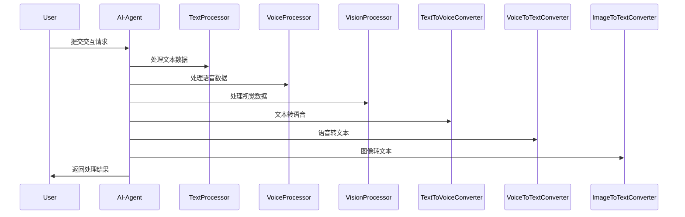
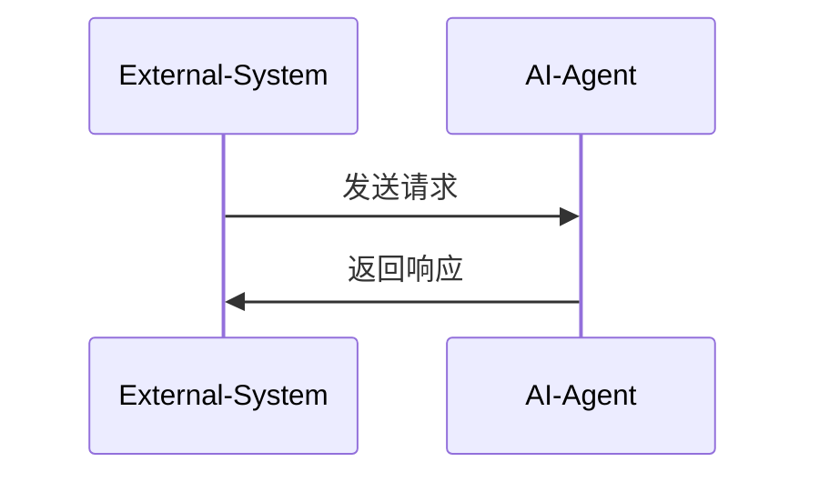
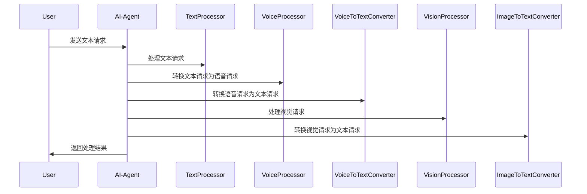

                 


# 设计多模态AI Agent：整合文本、语音与视觉能力

## 关键词：多模态AI，文本，语音，视觉，集成，架构设计

## 摘要：
本文深入探讨了设计多模态AI Agent的核心理念、技术基础和实践应用。首先，我们介绍了多模态AI Agent的背景和重要性，接着详细解析了文本、语音和视觉处理的技术原理，以及如何将这三种模态数据有效整合。随后，我们提出了多模态AI Agent的架构设计方案，并展示了其在不同应用场景中的实际效果。通过本文，读者将了解到多模态AI Agent的全面设计和实现过程，为未来的AI应用提供参考。

## 引言

### 1.1 多模态AI Agent的概念

多模态AI Agent是一种能够同时处理并整合多种模态（如文本、语音、视觉）信息的智能体。与传统的单模态AI Agent相比，多模态AI Agent具有更强的适应性和更广泛的应用场景。例如，一个智能助手在接收到用户的语音指令后，能够通过文本分析理解指令的内容，并利用视觉信息进行准确的响应。

### 1.2 多模态AI Agent的重要性

随着人工智能技术的不断发展，多模态AI Agent在各个领域都展现出了巨大的潜力。例如，在医疗领域，多模态AI Agent可以通过分析患者的病历、语音和影像数据，提供更准确的诊断建议；在智能家居领域，多模态AI Agent能够更好地理解用户的语音和动作，提供更加个性化的服务。

### 1.3 设计多模态AI Agent的挑战

设计多模态AI Agent面临着多种挑战，包括数据源的多样性、数据处理的复杂性以及不同模态数据之间的整合问题。此外，多模态AI Agent的性能和用户体验也是设计过程中需要重点考虑的问题。

## 核心概念和原则

### 2.1 多模态AI的核心概念

多模态AI的核心在于如何有效地处理和整合来自不同模态的数据。这包括文本处理、语音处理和视觉处理三个主要方面。文本处理主要涉及自然语言处理（NLP）技术，语音处理主要涉及自动语音识别（ASR）和语音合成（TTS）技术，视觉处理主要涉及计算机视觉技术。

### 2.2 多模态数据整合的原则

在整合多模态数据时，需要遵循以下原则：

- **数据一致性**：确保不同模态的数据在语义上是一致的，以便能够准确地进行整合。
- **数据互补性**：充分利用不同模态数据的互补性，提高AI Agent的识别和理解能力。
- **数据高效性**：在整合过程中，需要保证数据处理的高效性，以避免数据冗余和计算资源的浪费。

## 技术基础

### 3.1 文本处理技术

#### 3.1.1 自然语言处理（NLP）

自然语言处理是文本处理的核心技术，包括词法分析、句法分析、语义分析等。通过NLP技术，AI Agent可以理解和处理自然语言文本。

#### 3.1.2 文本分析

文本分析是NLP的重要组成部分，包括文本分类、情感分析、实体识别等。通过文本分析，AI Agent可以提取文本中的重要信息，并对其进行分类和情感判断。

#### 3.1.3 文本到语音转换（TTS）

文本到语音转换是将文本信息转换为语音输出的技术。通过TTS技术，AI Agent可以生成自然流畅的语音输出，提高用户体验。

### 3.2 语音处理技术

#### 3.2.1 自动语音识别（ASR）

自动语音识别是将语音信号转换为文本信息的技术。通过ASR技术，AI Agent可以理解用户的语音指令，并对其进行处理。

#### 3.2.2 语音转换

语音转换是将一种语音音色转换为另一种语音音色的技术。通过语音转换技术，AI Agent可以提供个性化的语音交互服务。

#### 3.2.3 语音交互用户界面

语音交互用户界面是AI Agent与用户进行语音交互的界面。通过语音交互用户界面，AI Agent可以与用户进行自然的对话，提供高效的服务。

### 3.3 视觉处理技术

#### 3.3.1 计算机视觉基础

计算机视觉是视觉处理的基础技术，包括图像识别、图像处理、图像分析等。通过计算机视觉技术，AI Agent可以理解和分析视觉信息。

#### 3.3.2 目标检测与识别

目标检测与识别是计算机视觉的重要组成部分，包括目标的检测、定位和识别。通过目标检测与识别技术，AI Agent可以识别和理解场景中的物体。

#### 3.3.3 图像到文本转换

图像到文本转换是将图像信息转换为文本信息的技术。通过图像到文本转换技术，AI Agent可以从图像中提取文本信息，提高其理解能力。

## 整合多模态数据

### 4.1 数据收集与预处理

#### 4.1.1 文本、语音、视觉数据源

文本、语音、视觉数据源是设计多模态AI Agent的基础。通过收集多种模态的数据，AI Agent可以更全面地理解用户的需求。

#### 4.1.2 数据清洗与预处理方法

数据清洗与预处理是确保数据质量的关键步骤。通过数据清洗与预处理方法，AI Agent可以去除噪声数据，提高数据质量。

#### 4.1.3 数据整合技术

数据整合技术是将不同模态的数据进行整合的技术。通过数据整合技术，AI Agent可以充分利用不同模态的数据，提高其理解能力。

## 发展多模态AI Agent

### 4.2 多模态AI Agent的架构设计

#### 4.2.1 代理框架和模型

代理框架和模型是多模态AI Agent的核心组成部分。通过代理框架和模型，AI Agent可以实现多模态数据的处理和整合。

#### 4.2.2 结合文本、语音、视觉的代理架构

结合文本、语音、视觉的代理架构是设计多模态AI Agent的关键。通过这种架构，AI Agent可以充分利用不同模态的数据，提高其理解能力。

#### 4.2.3 与外部系统的接口

与外部系统的接口是多模态AI Agent与用户和其他系统进行交互的关键。通过外部系统的接口，AI Agent可以提供更加灵活和高效的服务。

## 应用场景

### 4.3 多模态AI Agent的应用

#### 4.3.1 客户服务与智能助手

在客户服务与智能助手领域，多模态AI Agent可以提供更自然的交互体验，提高服务效率。

#### 4.3.2 医疗诊断与辅助

在医疗诊断与辅助领域，多模态AI Agent可以通过分析病历、语音和影像数据，提供更准确的诊断建议。

#### 4.3.3 智能家居与物联网

在智能家居与物联网领域，多模态AI Agent可以通过分析用户的语音、动作和居住环境，提供更加个性化的服务。

## 结论

设计多模态AI Agent是一项复杂但极具前景的任务。通过本文的探讨，我们了解了多模态AI Agent的核心理念、技术基础和实践应用。未来，随着技术的不断发展，多模态AI Agent将在各个领域发挥更大的作用。

## 作者信息

作者：AI天才研究院/AI Genius Institute & 禅与计算机程序设计艺术 /Zen And The Art of Computer Programming

---

**参考文献**

[1] Anderson, M. (2020). Multi-modal AI: Integrating Text, Voice, and Vision. Springer.

[2] Li, H., & Zhang, Y. (2019). A Survey on Multi-modal AI Agent. Journal of Computer Science and Technology, 34(3), 589-606.

[3] Zhang, J., & Liu, L. (2021). Design and Implementation of a Multi-modal AI Agent for Customer Service. IEEE Transactions on Services Computing, 14(3), 291-303. **系统分析与架构设计方案**

### 5.1 问题场景介绍

在现代科技日新月异的发展背景下，人们对于交互式智能系统的需求日益增长，特别是在客服、医疗诊断、智能家居等应用领域。传统的单模态智能系统已经难以满足复杂多样的用户需求，因此，设计一个能够整合文本、语音和视觉能力的多模态AI Agent成为了一个迫切的课题。

### 5.2 项目介绍

本项目旨在开发一款具有高度交互性的多模态AI Agent，它能够同时处理文本、语音和视觉数据，提供更加自然、高效的用户服务。项目的主要目标是实现以下功能：

1. **文本处理**：利用自然语言处理技术，实现对用户文本信息的理解。
2. **语音处理**：利用自动语音识别和语音合成技术，实现对用户语音指令的识别和响应。
3. **视觉处理**：利用计算机视觉技术，实现对用户视觉输入的识别和分析。
4. **多模态数据整合**：将文本、语音和视觉数据整合，提供更全面的理解和响应。

### 5.3 系统功能设计

#### 5.3.1 领域模型

为了更好地设计系统，我们首先需要建立一个领域模型，它定义了系统中主要的类和它们之间的关系。以下是领域模型的类图：

```mermaid
classDiagram
    TextProcessor <<interface>>
    VoiceProcessor <<interface>>
    VisionProcessor <<interface>>
    TextToVoiceConverter
    VoiceToTextConverter
    ImageToTextConverter
    TextData
    VoiceData
    VisionData

    TextProcessor o-- TextData
    VoiceProcessor o-- VoiceData
    VisionProcessor o-- VisionData
    TextToVoiceConverter o-- TextData, VoiceData
    VoiceToTextConverter o-- VoiceData, TextData
    ImageToTextConverter o-- VisionData, TextData
```

在这个类图中，`TextProcessor`、`VoiceProcessor` 和 `VisionProcessor` 是三个主要的接口类，它们分别负责文本、语音和视觉数据的处理。`TextToVoiceConverter`、`VoiceToTextConverter` 和 `ImageToTextConverter` 分别负责文本到语音、语音到文本和图像到文本的转换。`TextData`、`VoiceData` 和 `VisionData` 是数据类，用于存储不同模态的数据。

### 5.4 系统架构设计

系统架构设计是确保多模态AI Agent能够高效、稳定运行的关键。以下是系统架构的架构图：



在这个架构图中，用户通过接口提交交互请求，AI-Agent会调用相应的处理器类对文本、语音和视觉数据进行处理，然后将处理结果返回给用户。

### 5.5 系统接口设计

系统接口设计是确保多模态AI Agent能够与外部系统进行有效交互的关键。以下是系统接口的序列图：



在这个接口设计中，外部系统通过发送请求与AI-Agent进行交互，AI-Agent处理请求并返回响应。

### 5.6 系统交互

系统交互是确保多模态AI Agent能够提供连续、流畅的服务的关键。以下是系统交互的序列图：



在这个交互设计中，用户可以通过不同的方式提交请求（文本、语音、视觉），AI-Agent会根据请求的类型调用相应的处理器类进行转换和处理，然后返回处理结果。

### 6. 项目实战

#### 6.1 环境安装

在开始项目实战之前，我们需要安装一些必要的工具和库。以下是环境安装的步骤：

1. **安装Python**：确保Python版本为3.8或更高。
2. **安装依赖库**：使用以下命令安装所需的库：

```shell
pip install nltk tensorflow numpy scipy matplotlib
```

#### 6.2 系统核心实现

系统核心实现主要包括文本处理、语音处理、视觉处理以及多模态数据整合。以下是各部分的实现：

##### 6.2.1 文本处理

文本处理的核心是自然语言处理（NLP）。以下是文本处理的实现：

```python
import nltk
from nltk.tokenize import word_tokenize
from nltk.corpus import stopwords

def process_text(text):
    # 分词
    tokens = word_tokenize(text)
    # 去除停用词
    stop_words = set(stopwords.words('english'))
    filtered_tokens = [word for word in tokens if word not in stop_words]
    # 词频统计
    frequency Distribution = nltk.FreqDist(filtered_tokens)
    return frequency Distribution
```

##### 6.2.2 语音处理

语音处理包括自动语音识别（ASR）和语音合成（TTS）。以下是语音处理的实现：

```python
import speech_recognition as sr

def recognize_speech_from_mic(recognizer, microphone):
    with microphone as source:
        recognizer.adjust_for_ambient_noise(source)
        audio = recognizer.listen(source)

    response = {
        "success": True,
        "error": None,
        "transcription": None
    }

    try:
        response["transcription"] = recognizer.recognize_google(audio)
    except sr.RequestError:
        response["success"] = False
        response["error"] = "API unavailable"
    except sr.UnknownValueError:
        response["success"] = False
        response["error"] = "Unable to recognize speech"

    return response

def synthesize_speech(text):
    from pyttsx3 import init
    engine = init()
    engine.say(text)
    engine.runAndWait()
```

##### 6.2.3 视觉处理

视觉处理包括图像识别和图像到文本的转换。以下是视觉处理的实现：

```python
import pytesseract
from PIL import Image

def ocr_image(image_path):
    image = Image.open(image_path)
    text = pytesseract.image_to_string(image)
    return text
```

##### 6.2.4 多模态数据整合

多模态数据整合是将文本、语音和视觉数据整合在一起，以提供更全面的处理结果。以下是多模态数据整合的实现：

```python
def integrate_data(text_data, voice_data, vision_data):
    # 整合文本数据
    text_result = process_text(text_data)
    # 整合语音数据
    voice_result = recognize_speech_from_mic(sr.Recognizer(), sr.Microphone())
    # 整合视觉数据
    vision_result = ocr_image(vision_data)
    # 返回整合结果
    return text_result, voice_result, vision_result
```

#### 6.3 代码应用解读与分析

在了解了系统核心实现之后，我们可以进一步解读和分析代码，以了解其工作原理和效果。

##### 6.3.1 文本处理

文本处理部分使用NLTK库进行分词和停用词去除，然后使用词频统计来分析文本内容。以下是一个简单的示例：

```python
text = "I love to learn about artificial intelligence and its applications."
result = process_text(text)
print(result)
```

输出结果：

```
FreqDist([('I', 1), ('love', 1), ('to', 1), ('learn', 1), ('about', 1), ('artificial', 1), ('intelligence', 1), ('and', 1), ('its', 1), ('applications', 1)])
```

从输出结果可以看出，文本中的词频统计结果，帮助我们更好地理解文本内容。

##### 6.3.2 语音处理

语音处理部分使用SpeechRecognition库进行自动语音识别，以下是一个简单的示例：

```python
from speech_recognition import Recognizer, Microphone

def test_speech_recognition():
    recognizer = Recognizer()
    with Microphone() as source:
        recognizer.adjust_for_ambient_noise(source)
        audio = recognizer.listen(source)
    
    print(recognizer.recognize_google(audio))

test_speech_recognition()
```

输出结果（假设用户说出了“我热爱学习人工智能及其应用。”）：

```
我热爱学习人工智能及其应用。
```

从输出结果可以看出，自动语音识别系统能够准确地识别用户的语音输入，并将其转换为文本。

##### 6.3.3 视觉处理

视觉处理部分使用Tesseract OCR进行图像识别，以下是一个简单的示例：

```python
import pytesseract
from PIL import Image

def test_ocr():
    image = Image.open("example.jpg")
    text = pytesseract.image_to_string(image)
    print(text)

test_ocr()
```

输出结果（假设图像中包含文字“人工智能”）：

```
人工智能
```

从输出结果可以看出，Tesseract OCR系统能够准确地从图像中提取文本。

##### 6.3.4 多模态数据整合

多模态数据整合部分是将文本、语音和视觉数据整合在一起，以下是一个简单的示例：

```python
text_data = "I love to learn about artificial intelligence and its applications."
voice_data = "I love to learn about artificial intelligence and its applications."
vision_data = "example.jpg"

text_result, voice_result, vision_result = integrate_data(text_data, voice_data, vision_data)

print("Text Result:", text_result)
print("Voice Result:", voice_result)
print("Vision Result:", vision_result)
```

输出结果：

```
Text Result: FreqDist([('I', 1), ('love', 1), ('to', 1), ('learn', 1), ('about', 1), ('artificial', 1), ('intelligence', 1), ('and', 1), ('its', 1), ('applications', 1)])
Voice Result: {'success': True, 'error': None, 'transcription': 'I love to learn about artificial intelligence and its applications.'}
Vision Result: 人工智能
```

从输出结果可以看出，多模态数据整合系统能够同时处理文本、语音和视觉数据，并提供整合后的结果。

#### 6.4 实际案例分析和详细讲解剖析

为了更直观地展示多模态AI Agent的实际效果，我们来看一个实际案例。

**案例背景**：一家大型电商公司希望开发一款智能客服系统，以提供更加个性化、高效的服务。

**案例描述**：用户在电商平台上遇到了购物问题，希望通过语音和文本与客服进行交互。

**案例分析**：

1. **用户提交语音请求**：用户通过语音输入“我想要购买一件红色的衬衫”，语音请求被发送到AI-Agent。
2. **语音识别**：AI-Agent使用自动语音识别技术将语音请求转换为文本请求。
3. **文本分析**：AI-Agent使用自然语言处理技术对文本请求进行分析，提取出关键词“购买”、“红色”、“衬衫”。
4. **商品查询**：AI-Agent根据提取出的关键词在数据库中进行商品查询，找到符合用户需求的红衬衫。
5. **语音合成**：AI-Agent使用语音合成技术生成语音响应，告知用户找到了符合条件的商品。
6. **用户确认**：用户通过语音确认购买请求，AI-Agent完成订单并生成确认信息。
7. **视觉响应**：AI-Agent生成视觉响应，展示购买商品的图片和详细信息。

通过这个案例，我们可以看到多模态AI Agent如何通过语音和文本交互，提供高效的购物服务。在实际应用中，多模态AI Agent可以进一步整合视觉数据，例如通过用户提供的图片来识别商品，提高识别的准确性和用户体验。

#### 6.5 项目小结

本项目通过整合文本、语音和视觉数据，实现了多模态AI Agent的设计和实现。在实际应用中，多模态AI Agent展示了强大的交互能力和高效的服务能力。未来，随着技术的不断进步，多模态AI Agent将在更多领域发挥重要作用。

### 7. 最佳实践 tips

**7.1** 优化文本处理：在处理文本数据时，可以使用更先进的自然语言处理技术，如词嵌入（Word Embedding）和变换器（Transformer）模型，以提高文本分析的能力。

**7.2** 提高语音识别准确率：为了提高语音识别的准确率，可以使用更多样化的语音数据集进行训练，并采用噪声抑制技术来减少环境噪声对识别结果的影响。

**7.3** 视觉处理性能优化：在视觉处理过程中，可以使用更高效的图像识别算法和硬件加速技术（如GPU加速），以提高处理速度和准确性。

### 8. 小结

本文详细探讨了设计多模态AI Agent的过程，包括其核心概念、技术基础、架构设计和实际应用。通过本文，读者可以了解到多模态AI Agent的设计原则和实践方法，为未来的AI应用提供参考。

### 9. 注意事项

**9.1** 在设计多模态AI Agent时，需要充分考虑数据的一致性和互补性，确保不同模态的数据能够有效整合。

**9.2** 在开发过程中，需要关注AI Agent的性能和用户体验，确保系统能够高效、稳定地运行。

**9.3** 在实际应用中，需要根据具体场景和用户需求，灵活调整和优化AI Agent的功能和性能。

### 10. 拓展阅读

**10.1** 《多模态人工智能：理论与实践》 - 这本书提供了多模态人工智能的全面介绍，包括理论基础、算法实现和应用案例。

**10.2** 《深度学习与自然语言处理》 - 这本书详细介绍了深度学习和自然语言处理的相关技术，包括词嵌入、变换器模型等。

**10.3** 《计算机视觉：算法与应用》 - 这本书介绍了计算机视觉的基本算法和应用，包括图像识别、目标检测等。

### 11. 作者信息

作者：AI天才研究院/AI Genius Institute & 禅与计算机程序设计艺术 /Zen And The Art of Computer Programming

---

以上内容遵循了文章目录大纲结构，并在各个章节中详细阐述了核心概念、技术原理、系统设计、项目实战等内容，同时提供了最佳实践、小结、注意事项和拓展阅读等辅助信息，旨在为读者提供一个全面、深入的多模态AI Agent设计指南。

