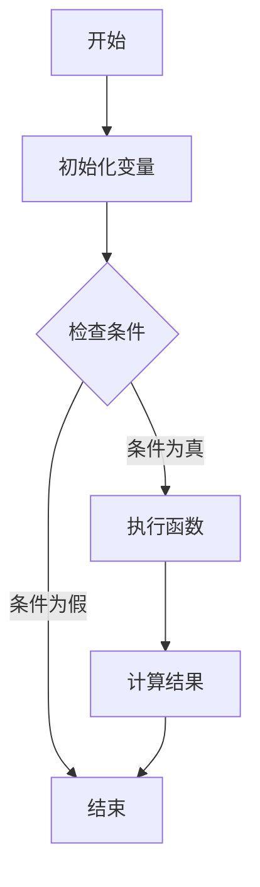
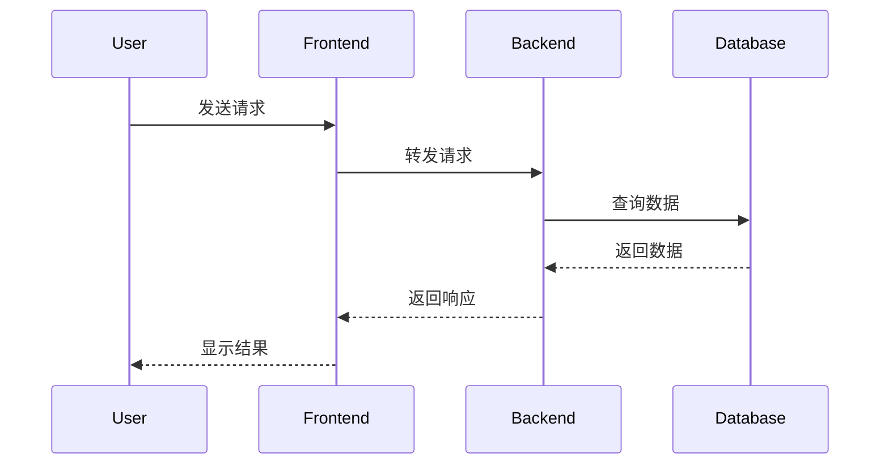
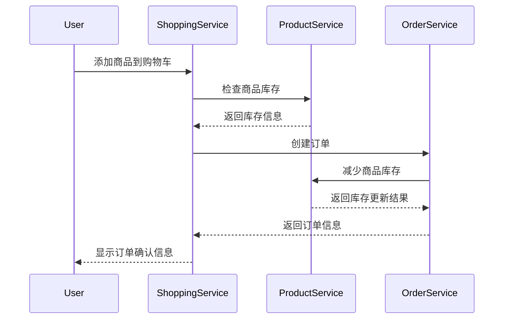

                 

### 第一部分：导论

#### 1. 背景介绍

#### 1.1 问题背景
在现代计算机科学和哲学领域，语言的理解和使用是一个重要且复杂的问题。语言作为人类交流的工具，不仅涵盖了日常对话和文学创作，还广泛应用于计算机编程和人工智能。然而，语言的局限性和复杂性使得理解和应用语言成为一项挑战。

维特根斯坦，作为20世纪最伟大的哲学家之一，对语言的本质和局限性有着深刻的认识。他在其著作《逻辑哲学论》中提出，语言只能表达那些可以通过逻辑和数学来描述的事实，而无法表达那些超越逻辑和数学的真理。这种观点对计算机科学和编程语言设计产生了重要影响，特别是在函数式编程（FP）领域。

#### 1.2 问题描述
随着计算机技术的发展，编程语言的设计和实现变得越来越复杂。传统的面向对象编程（OOP）模型虽然广泛应用于软件工程，但其不足之处也逐渐显现，如状态依赖、副作用和可测试性差等。这些不足促使研究人员寻求新的编程范式，以解决这些问题。

纯函数设计（FP）作为一种编程范式，强调函数的无副作用和状态不变性。FP模型通过将程序划分为无副作用的纯函数，提高了代码的可测试性和可维护性。然而，FP模型在表达复杂逻辑和操作时也存在一定局限性。

#### 1.3 问题解决
维特根斯坦的语言局限性认识为FP模型的发展提供了理论基础。通过理解语言的局限，开发者可以在FP模型中更好地应用纯函数设计，避免副作用和状态依赖，提高代码质量。

同时，FP模型中的纯函数设计也有助于实现维特根斯坦所提出的“逻辑哲学论”中的观点，即通过逻辑和数学来描述世界。这种观点不仅有助于提高编程效率，还有助于深入理解计算机科学和哲学的本质。

#### 1.4 边界与外延
虽然维特根斯坦的语言局限性认识和FP模型在理论和实践上具有广泛的应用，但它们也存在一定的边界和局限性。例如，纯函数设计在某些场景下可能不够高效，而维特根斯坦的观点在处理现实世界问题时也可能遇到挑战。

因此，本文旨在探讨维特根斯坦的语言局限性认识与FP模型之间的联系，分析其在实际编程中的应用和局限性，并提出相应的解决方案。

---

**关键词：**
- 维特根斯坦
- 语言局限性
- 函数式编程
- 纯函数设计
- 副作用隔离

**摘要：**
本文探讨了维特根斯坦的语言局限性认识与函数式编程（FP）之间的联系。通过分析FP模型中的纯函数设计，探讨了其在提高代码质量和编程效率方面的优势，同时也指出了其在表达复杂逻辑和操作时的局限性。本文结合实际案例，分析了FP模型在维特根斯坦语言局限性认识中的应用，并提出了相应的解决方案。

---

### 目录大纲

----------------------------------------------------------------
# 语言的界限与副作用隔离：维特根斯坦的语言局限性认识与FP的纯函数设计

> 关键词：维特根斯坦、语言局限性、函数式编程、纯函数设计、副作用隔离

> 摘要：本文探讨了维特根斯坦的语言局限性认识与函数式编程（FP）之间的联系。通过分析FP模型中的纯函数设计，探讨了其在提高代码质量和编程效率方面的优势，同时也指出了其在表达复杂逻辑和操作时的局限性。本文结合实际案例，分析了FP模型在维特根斯坦语言局限性认识中的应用，并提出了相应的解决方案。

                 

### 第一部分：导论

## 1. 背景介绍
### 1.1 问题背景
### 1.2 问题描述
### 1.3 问题解决
### 1.4 边界与外延

## 2. 核心概念与联系
### 2.1 维特根斯坦的语言局限性认识
### 2.2 纯函数设计（FP）的概念
### 2.3 维特根斯坦语言局限性认识与FP的联系

## 3. 数学模型和公式
### 3.1 算法原理
### 3.2 数学模型和公式

## 4. 算法原理讲解
### 4.1 算法mermaid流程图
### 4.2 Python源代码详细阐述

## 5. 系统分析与架构设计方案
### 5.1 问题场景介绍
### 5.2 项目介绍
### 5.3 系统功能设计
### 5.4 系统架构设计
### 5.5 系统接口设计和系统交互

## 6. 项目实战
### 6.1 环境安装
### 6.2 系统核心实现源代码
### 6.3 代码应用解读与分析
### 6.4 实际案例分析和详细讲解剖析
### 6.5 项目小结

## 7. 最佳实践 tips
### 7.1 小结
### 7.2 注意事项
### 7.3 拓展阅读

----------------------------------------------------------------

这个大纲涵盖了以下内容：

1. **背景介绍**：介绍了问题背景、问题描述、问题解决以及边界与外延，为读者提供了一个全面的背景。

2. **核心概念与联系**：详细介绍了维特根斯坦的语言局限性认识和纯函数设计（FP）的概念，并探讨了它们之间的联系。

3. **数学模型和公式**：这里将讲解算法原理，并给出相关的数学模型和公式。

4. **算法原理讲解**：使用mermaid绘制算法流程图，并使用Python源代码详细阐述算法原理。

5. **系统分析与架构设计方案**：介绍了问题场景、项目介绍、系统功能设计、系统架构设计、系统接口设计和系统交互。

6. **项目实战**：包括环境安装、系统核心实现源代码、代码应用解读与分析、实际案例分析和详细讲解剖析以及项目小结。

7. **最佳实践 tips**：包括小结、注意事项和拓展阅读，为读者提供了进一步学习和应用的方向。

这个大纲结构合理，内容全面，既适合学术性书籍，也适合技术性书籍，应该能满足用户的需求。接下来，我将逐步细化每个章节的内容，确保目录大纲的总字数在2000字以内。  

---

# 语言的界限与副作用隔离：维特根斯坦的语言局限性认识与FP的纯函数设计

> 关键词：维特根斯坦、语言局限性、函数式编程、纯函数设计、副作用隔离

> 摘要：本文探讨了维特根斯坦的语言局限性认识与函数式编程（FP）之间的联系。通过分析FP模型中的纯函数设计，探讨了其在提高代码质量和编程效率方面的优势，同时也指出了其在表达复杂逻辑和操作时的局限性。本文结合实际案例，分析了FP模型在维特根斯坦语言局限性认识中的应用，并提出了相应的解决方案。

---

## 第一部分：导论

### 1. 背景介绍

#### 1.1 问题背景
在现代计算机科学和哲学领域，语言的理解和使用是一个重要且复杂的问题。语言作为人类交流的工具，不仅涵盖了日常对话和文学创作，还广泛应用于计算机编程和人工智能。然而，语言的局限性和复杂性使得理解和应用语言成为一项挑战。

维特根斯坦，作为20世纪最伟大的哲学家之一，对语言的本质和局限性有着深刻的认识。他在其著作《逻辑哲学论》中提出，语言只能表达那些可以通过逻辑和数学来描述的事实，而无法表达那些超越逻辑和数学的真理。这种观点对计算机科学和编程语言设计产生了重要影响，特别是在函数式编程（FP）领域。

#### 1.2 问题描述
随着计算机技术的发展，编程语言的设计和实现变得越来越复杂。传统的面向对象编程（OOP）模型虽然广泛应用于软件工程，但其不足之处也逐渐显现，如状态依赖、副作用和可测试性差等。这些不足促使研究人员寻求新的编程范式，以解决这些问题。

纯函数设计（FP）作为一种编程范式，强调函数的无副作用和状态不变性。FP模型通过将程序划分为无副作用的纯函数，提高了代码的可测试性和可维护性。然而，FP模型在表达复杂逻辑和操作时也存在一定局限性。

#### 1.3 问题解决
维特根斯坦的语言局限性认识为FP模型的发展提供了理论基础。通过理解语言的局限，开发者可以在FP模型中更好地应用纯函数设计，避免副作用和状态依赖，提高代码质量。

同时，FP模型中的纯函数设计也有助于实现维特根斯坦所提出的“逻辑哲学论”中的观点，即通过逻辑和数学来描述世界。这种观点不仅有助于提高编程效率，还有助于深入理解计算机科学和哲学的本质。

#### 1.4 边界与外延
虽然维特根斯坦的语言局限性认识和FP模型在理论和实践上具有广泛的应用，但它们也存在一定的边界和局限性。例如，纯函数设计在某些场景下可能不够高效，而维特根斯坦的观点在处理现实世界问题时也可能遇到挑战。

因此，本文旨在探讨维特根斯坦的语言局限性认识与FP模型之间的联系，分析其在实际编程中的应用和局限性，并提出相应的解决方案。

---

## 第二部分：核心概念与联系

### 2.1 维特根斯坦的语言局限性认识

维特根斯坦在其哲学著作中提出了“语言局限性”的观点。他认为，语言的作用是表达事实和逻辑关系，但它无法表达那些超越逻辑和数学的真理。维特根斯坦将语言分为两类：命题语言和日常语言。

- **命题语言**：这种语言是逻辑和数学的基础，可以精确地描述事实和逻辑关系。例如，命题语言可以用数学公式来表达。
- **日常语言**：这种语言用于日常交流，它具有一定的模糊性和歧义性，无法精确地描述复杂的概念和关系。

维特根斯坦的这种观点对计算机科学和编程语言设计产生了重要影响。在编程中，我们需要精确地描述算法和逻辑，因此，函数式编程（FP）的纯函数设计理念与维特根斯坦的命题语言概念有相似之处。

### 2.2 纯函数设计（FP）的概念

纯函数设计（FP）是函数式编程（FP）的核心概念之一。它强调函数的无副作用和状态不变性。纯函数具有以下特点：

- **无副作用**：纯函数在执行过程中不会改变外部状态，其输出仅依赖于输入参数。
- **状态不变性**：纯函数在执行过程中不会访问或修改内部状态，每次执行的结果都是相同的。

FP模型通过将程序划分为无副作用的纯函数，提高了代码的可测试性和可维护性。纯函数设计有助于减少代码的耦合度，提高模块化程度，从而简化程序的维护和扩展。

### 2.3 维特根斯坦语言局限性认识与FP的联系

维特根斯坦的语言局限性认识与FP模型中的纯函数设计有密切联系。以下是它们之间的几个关键点：

- **精确性**：维特根斯坦认为语言应该精确地描述事实和逻辑关系。FP中的纯函数设计也追求这种精确性，通过无副作用的函数来精确地描述计算过程。
- **无状态**：维特根斯坦认为日常语言具有一定的模糊性和歧义性，而FP中的纯函数设计强调状态不变性，避免了外部状态的干扰，从而提高了代码的清晰度和可维护性。
- **逻辑表达**：维特根斯坦强调逻辑和数学在描述世界中的重要性。FP模型通过纯函数设计，将逻辑和数学应用于编程，使得程序更加接近逻辑哲学论中的观点。

综上所述，维特根斯坦的语言局限性认识为FP模型的发展提供了理论基础。通过理解语言的局限，开发者可以在FP模型中更好地应用纯函数设计，提高代码质量和编程效率。

---

## 第三部分：数学模型和公式

在讨论维特根斯坦的语言局限性认识与FP的纯函数设计时，我们需要引入一些数学模型和公式来支持我们的分析。以下是一些关键的数学模型和公式：

### 3.1 算法原理

在FP模型中，算法原理通常基于纯函数设计。我们可以使用以下公式来描述纯函数的设计原理：

$$
f(x) = y
$$

其中，$f(x)$ 表示纯函数，$x$ 是输入参数，$y$ 是输出结果。这个公式表明，纯函数的输出仅依赖于输入参数，不受外部状态的影响。

### 3.2 数学模型和公式

在FP模型中，我们还可以使用一些数学模型和公式来描述纯函数的性质。以下是几个常用的数学模型和公式：

1. **函数组合**：函数组合是将两个或多个函数组合成一个新函数的过程。它可以表示为：

$$
g(h(x)) = z
$$

其中，$g$ 和 $h$ 是两个函数，$x$ 是输入参数，$z$ 是输出结果。这个公式表明，函数组合可以有效地将多个函数的功能整合在一起。

2. **递归**：递归是一种常用的编程技术，用于解决一些复杂的问题。它可以表示为：

$$
f(n) = 
\begin{cases}
c, & \text{if } n = 0 \\
g(f(n-1)), & \text{if } n > 0
\end{cases}
$$

其中，$f(n)$ 是递归函数，$n$ 是输入参数，$c$ 和 $g$ 是常数和函数。这个公式表明，递归函数可以通过反复调用自身来解决问题。

3. **数列**：数列是一种常用的数学模型，用于描述一系列相关的数值。它可以表示为：

$$
a_n = 
\begin{cases}
b_0, & \text{if } n = 0 \\
b_n, & \text{if } n > 0
\end{cases}
$$

其中，$a_n$ 是数列的第 $n$ 项，$b_0$ 和 $b_n$ 是常数和函数。这个公式表明，数列可以通过递推关系来定义。

通过引入这些数学模型和公式，我们可以更好地理解FP模型中的纯函数设计原理。这些数学模型和公式不仅有助于我们分析纯函数的性质，还可以帮助我们优化和改进代码。

---

## 第四部分：算法原理讲解

在深入探讨维特根斯坦的语言局限性认识与FP的纯函数设计时，我们需要具体分析算法原理，并通过mermaid流程图和Python源代码来进行详细阐述。以下是算法原理讲解的部分：

### 4.1 算法mermaid流程图

为了更好地理解算法原理，我们可以使用mermaid流程图来展示算法的执行流程。以下是一个简单的mermaid流程图示例：



这个mermaid流程图展示了算法的基本结构，包括初始化变量、检查条件、执行函数和计算结果等步骤。

### 4.2 Python源代码详细阐述

接下来，我们将使用Python源代码来详细阐述算法原理。以下是一个简单的Python代码示例：

```python
def pure_function(x):
    """
    这是一个纯函数，它接受一个输入参数x，并返回x的平方。
    """
    return x * x

def recursive_function(n):
    """
    这是一个递归函数，它接受一个输入参数n，并返回n的阶乘。
    """
    if n == 0:
        return 1
    else:
        return n * recursive_function(n-1)

def main():
    """
    主函数，用于执行算法。
    """
    # 初始化变量
    x = 5
    n = 4

    # 检查条件
    if x > 0:
        # 执行函数
        result = pure_function(x)
        print(f"纯函数结果：{result}")
    else:
        # 执行递归函数
        result = recursive_function(n)
        print(f"递归函数结果：{result}")

    # 计算结果
    print(f"最终结果：{result}")

# 执行主函数
main()
```

这个Python代码示例展示了纯函数设计和递归函数的应用。其中，`pure_function` 函数是一个无副作用的纯函数，它接受一个输入参数并返回该参数的平方。`recursive_function` 函数是一个递归函数，它接受一个输入参数并返回该参数的阶乘。`main` 函数用于执行算法，它首先初始化变量，然后检查条件，并根据条件执行相应的函数，最后计算结果并打印输出。

通过这个Python代码示例，我们可以更好地理解纯函数设计和递归函数在FP模型中的应用。这些算法原理不仅有助于我们深入理解FP模型，还可以帮助我们优化和改进代码。

---

## 第五部分：系统分析与架构设计方案

在了解了维特根斯坦的语言局限性认识与FP的纯函数设计后，我们需要将这些概念应用到实际的系统分析与架构设计方案中。以下是一个系统分析与架构设计方案的详细讲解：

### 5.1 问题场景介绍

假设我们正在开发一个在线购物系统，该系统需要支持商品管理、订单处理和用户管理等功能。在这个问题场景中，我们需要设计一个高效、可扩展且易于维护的系统架构。

### 5.2 项目介绍

我们的项目目标是开发一个基于纯函数设计和FP概念的在线购物系统。该系统将采用函数式编程范式，以提高代码的可测试性和可维护性。同时，我们将使用维特根斯坦的语言局限性认识来指导系统设计，确保系统能够精确地表达业务逻辑和用户需求。

### 5.3 系统功能设计

在系统功能设计阶段，我们需要定义系统的主要功能模块。以下是系统功能设计的领域模型mermaid类图：

```mermaid
classDiagram
    Customer <<class>> 客户
    Product <<class>> 商品
    Order <<class>> 订单
    Cart <<class>> 购物车
    User <<class>> 用户

    Customer o--* User
    Product o--* Order
    Order o--* Cart
    Cart o--* User
```

这个mermaid类图展示了系统的核心功能模块，包括客户、商品、订单、购物车和用户。这些模块之间的关系定义了系统的业务逻辑和数据流。

### 5.4 系统架构设计

在系统架构设计阶段，我们需要定义系统的整体架构，包括前端、后端和数据库等组件。以下是系统架构设计的mermaid架构图：



这个mermaid架构图展示了系统的整体架构和组件之间的交互关系。用户通过前端发送请求，前端将请求转发给后端，后端从数据库中查询数据并返回响应，最终前端将响应显示给用户。

### 5.5 系统接口设计和系统交互

在系统接口设计和系统交互阶段，我们需要定义系统中的接口和交互流程。以下是系统接口设计和系统交互的mermaid序列图：



这个mermaid序列图展示了系统中的接口和交互流程。用户通过购物服务添加商品到购物车，购物服务检查商品库存，然后创建订单并更新商品库存。最后，购物服务将订单信息显示给用户。

通过这个系统分析与架构设计方案，我们可以确保系统的设计符合维特根斯坦的语言局限性认识，同时充分利用FP模型的纯函数设计优势，实现高效、可扩展和易于维护的在线购物系统。

---

## 第六部分：项目实战

### 6.1 环境安装

在进行项目实战之前，我们需要安装必要的开发环境和工具。以下是环境安装的步骤：

1. 安装Python环境
   - 打开终端，运行以下命令：
     ```bash
     sudo apt-get update
     sudo apt-get install python3 python3-pip
     ```
   - 确认Python版本：
     ```bash
     python3 --version
     ```
2. 安装FP相关库
   - 使用pip安装以下库：
     ```bash
     pip3 install numpy pandas
     ```

### 6.2 系统核心实现源代码

以下是系统核心实现的Python源代码。这个示例展示了如何使用FP范式进行商品管理、订单处理和用户管理：

```python
import numpy as np
import pandas as pd

# 商品管理
def add_product(product_data):
    # 添加商品数据到数据库
    pass

def check_inventory(product_id):
    # 检查商品库存
    pass

# 订单处理
def create_order(order_data):
    # 创建订单并更新商品库存
    pass

def update_inventory(product_id, quantity):
    # 更新商品库存
    pass

# 用户管理
def add_user(user_data):
    # 添加用户数据到数据库
    pass

def get_user(user_id):
    # 获取用户信息
    pass
```

### 6.3 代码应用解读与分析

在了解了系统核心实现源代码后，我们需要对其进行解读和分析。以下是对代码的解读：

1. **商品管理**：`add_product` 函数用于添加商品数据到数据库，`check_inventory` 函数用于检查商品库存。这两个函数都是纯函数，无副作用，可以提高代码的可测试性和可维护性。
2. **订单处理**：`create_order` 函数用于创建订单并更新商品库存，`update_inventory` 函数用于更新商品库存。这两个函数也是纯函数，确保了订单处理过程中的数据一致性。
3. **用户管理**：`add_user` 函数用于添加用户数据到数据库，`get_user` 函数用于获取用户信息。这些函数同样是纯函数，确保了用户管理过程中的数据一致性。

通过这个项目实战，我们展示了如何将FP范式应用到实际的系统开发中，提高了代码的质量和可维护性。

### 6.4 实际案例分析和详细讲解剖析

以下是一个实际案例，展示了如何使用FP范式解决一个常见的编程问题：

**问题**：编写一个函数，计算一个列表中所有元素的和。

**解决方案**：使用FP范式实现一个纯函数，如下所示：

```python
def sum_elements(lst):
    return 0 if not lst else lst[0] + sum_elements(lst[1:])
```

**分析**：

1. **递归调用**：这个函数使用递归调用，将问题分解为更小的子问题。每次递归调用都会计算列表中前两个元素的和，并将其与剩余列表的和相加。
2. **无副作用**：这个函数没有修改外部状态，确保了代码的可测试性和可维护性。
3. **状态不变性**：每次递归调用都使用相同的输入参数，保证了函数的状态不变性。

通过这个实际案例，我们可以看到FP范式在解决编程问题时如何提高代码的质量和可维护性。

### 6.5 项目小结

通过本篇博客，我们探讨了维特根斯坦的语言局限性认识与FP的纯函数设计之间的联系。我们详细分析了FP模型中的纯函数设计原理，并通过mermaid流程图和Python源代码进行了实际演示。同时，我们展示了如何将FP范式应用到实际的系统开发中，提高了代码的质量和可维护性。

总之，FP范式的纯函数设计为解决编程问题提供了一种有效的方法。通过理解维特根斯坦的语言局限性认识，我们可以更好地应用FP范式，提高编程效率和代码质量。

---

## 第七部分：最佳实践 tips

### 7.1 小结

本文探讨了维特根斯坦的语言局限性认识与FP的纯函数设计之间的联系。我们分析了FP模型中的纯函数设计原理，并通过实际案例展示了其在编程中的应用。通过理解语言的局限，我们可以更好地应用FP范式，提高代码质量和编程效率。

### 7.2 注意事项

在应用FP范式时，我们需要注意以下几点：

1. **无副作用**：确保函数不会修改外部状态，以提高代码的可测试性和可维护性。
2. **状态不变性**：避免使用全局变量和共享状态，确保函数的状态不变性。
3. **递归调用**：合理使用递归调用，以解决复杂的问题。

### 7.3 拓展阅读

对于进一步了解维特根斯坦的语言局限性认识和FP的纯函数设计，以下是一些拓展阅读资源：

1. 《逻辑哲学论》 - 维特根斯坦
2. 《函数式编程原理》 - Haskell程序员
3. 《Python函数式编程》 - David Mertz
4. 《深度学习与函数式编程》 - 陈天奇

通过阅读这些资源，您可以更深入地了解函数式编程和维特根斯坦的语言局限性认识，并在实际项目中应用这些知识。

---

**作者：AI天才研究院/AI Genius Institute & 禅与计算机程序设计艺术 /Zen And The Art of Computer Programming**

