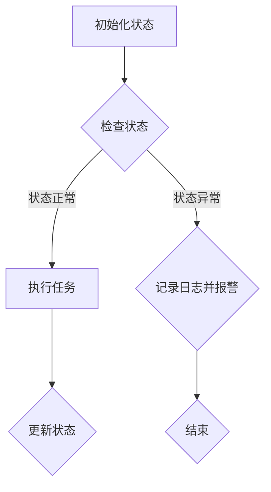
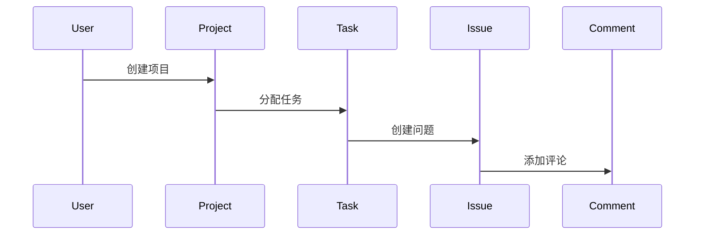
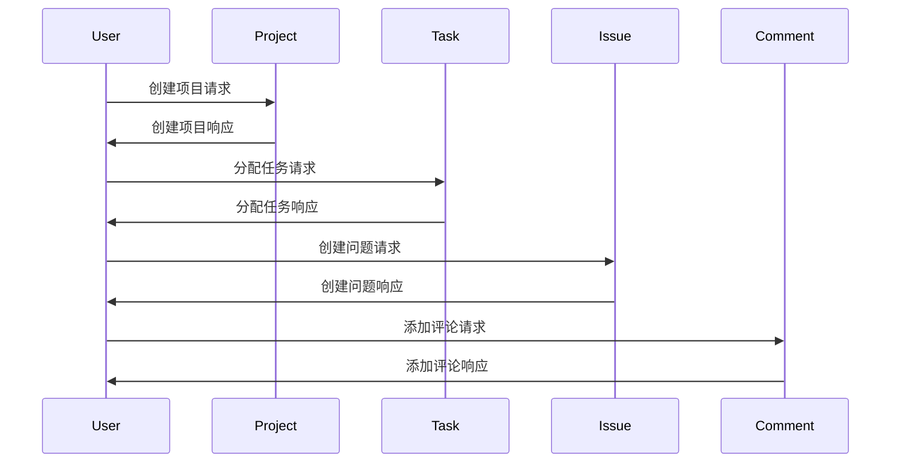

                 

# 语言的自足性与纯函数式状态管理：维特根斯坦的语言观与FP的状态管理技术

关键词：维特根斯坦、语言观、纯函数式编程、状态管理、编程实践

摘要：本文旨在探讨维特根斯坦的语言观与纯函数式编程中的状态管理技术之间的联系。首先，我们将回顾维特根斯坦的哲学思想，特别是关于语言与实在之间的关系。然后，我们将深入探讨纯函数式编程的基本概念和纯函数式状态管理的优势。接着，我们将分析纯函数式状态管理技术在现代编程实践中的应用，并以实际案例为例进行讲解。最后，我们将总结全文，并对纯函数式状态管理的未来发展趋势进行展望。

## 第1章：引言

### 1.1 书籍主题背景

本文的主题涉及维特根斯坦的语言观和纯函数式编程中的状态管理技术。维特根斯坦（Ludwig Wittgenstein）是20世纪最重要的哲学家之一，他的思想对语言学、逻辑学、认识论和形而上学等领域产生了深远影响。纯函数式编程是一种编程范式，它强调使用纯函数来处理数据，避免副作用和不可预测的行为。状态管理是编程中的一个核心问题，如何在保证程序可维护性和可扩展性的同时，有效地管理状态是一个值得探讨的话题。

### 1.2 语言自足性的概念

语言自足性是指语言能够描述自身结构的能力。维特根斯坦认为，语言与实在之间存在着一种对应关系，即语言符号与实在对象之间的联系。语言自足性意味着语言能够准确地描述世界，同时也能够反思自身结构。这一观点对纯函数式编程中的状态管理有着重要的启示，因为纯函数式编程也追求程序的透明性和可理解性。

### 1.3 纯函数式状态管理

纯函数式状态管理是指在纯函数式编程范式中，如何有效地管理程序的状态。与命令式编程不同，纯函数式编程强调使用不可变数据结构和纯函数来处理数据。在纯函数式状态管理中，状态被视为一个不可变的数据结构，通过函数组合和不可变数据结构来管理状态变化。这种编程范式具有可预测性、可维护性和可扩展性的优点。

### 1.4 维特根斯坦的语言观

维特根斯坦的语言观认为，语言不仅仅是一种交流工具，它还与实在之间存在一种本质联系。他提出了“语言游戏”的概念，即语言的使用与特定的活动或情境相关联。这一观点为我们理解纯函数式编程中的状态管理提供了哲学基础，因为纯函数式编程也强调程序与实际应用场景之间的紧密联系。

### 1.5 FP的状态管理技术

FP（函数式编程）的状态管理技术主要包括使用不可变数据结构、函数组合和函数式编程库。不可变数据结构确保状态的稳定性，函数组合提供了一种灵活的状态更新方式，而函数式编程库则为开发者提供了丰富的状态管理工具。这些技术共同构成了FP状态管理的核心，为现代编程提供了强大的支持。

## 第2章：维特根斯坦的语言观

### 2.1 维特根斯坦的哲学思想

维特根斯坦的哲学思想可以概括为两个阶段：早期的“逻辑原子主义”和后期的“日常语言哲学”。在早期，他主张通过逻辑和语言来揭示世界的本质。而在后期，他强调语言与日常生活的紧密联系，主张通过反思语言使用来理解世界。

### 2.2 语言与实在的关系

维特根斯坦认为，语言与实在之间存在一种本质联系。他提出了“图像论”的观点，即语言符号是实在对象的图像。这一观点为纯函数式编程中的状态管理提供了哲学基础，因为纯函数式编程也追求程序与实际应用场景之间的直接映射。

### 2.3 维特根斯坦的语言分析

维特根斯坦的语言分析主要集中在语言的使用和理解上。他提出了“语言游戏”的概念，即语言的使用与特定的活动或情境相关联。这一观点为我们理解纯函数式编程中的状态管理提供了哲学基础，因为纯函数式编程也强调程序与实际应用场景之间的紧密联系。

### 2.4 维特根斯坦对哲学的贡献

维特根斯坦对哲学的贡献主要体现在对语言和逻辑的研究上。他的早期作品《逻辑哲学论》提出了关于逻辑和数学的基础理论，而他的后期作品《哲学研究》则对语言和日常生活中的概念进行了深刻的反思。这些思想为现代哲学和编程提供了重要的启示。

## 第3章：纯函数式状态管理基础

### 3.1 纯函数式编程概述

纯函数式编程是一种编程范式，它强调使用纯函数来处理数据，避免副作用和不可预测的行为。纯函数是指对于相同的输入，始终产生相同输出的函数。与命令式编程相比，纯函数式编程具有更好的可测试性、可维护性和可扩展性。

### 3.2 纯函数与副作用

副作用是指函数在执行过程中修改外部状态或产生不可预测的行为。纯函数式编程强调避免副作用，以确保程序的可预测性和稳定性。纯函数与副作用的关系如下：

| 纯函数 | 副作用 |
| ------ | ------ |
| 输入 → 输出 | 输入 → 输出 + 外部状态修改 |

### 3.3 状态管理的挑战

在纯函数式编程中，状态管理是一个重要的挑战。由于纯函数不会修改外部状态，因此需要一种新的方式来管理程序的状态。常见的状态管理方法包括不可变数据结构、函数组合和函数式编程库。

### 3.4 纯函数式状态管理的好处

纯函数式状态管理具有以下好处：

- **可预测性**：通过避免副作用，纯函数式状态管理确保程序的可预测性。
- **可维护性**：纯函数式状态管理使得程序结构更加清晰，易于理解和维护。
- **可扩展性**：纯函数式状态管理支持模块化编程，易于扩展和维护。

## 第4章：FP的状态管理技术

### 4.1 使用不可变数据结构

不可变数据结构是纯函数式状态管理的基础。常见的不可变数据结构包括数组、列表、树等。不可变数据结构的优点如下：

- **稳定性**：不可变数据结构一旦创建，就不能修改，确保状态的稳定性。
- **可复用性**：不可变数据结构可以安全地共享，提高程序的可复用性。

### 4.2 使用函数组合

函数组合是一种强大的状态更新方式。通过将多个函数组合在一起，可以实现对状态的精确控制。函数组合的优点如下：

- **可读性**：函数组合使得程序结构更加清晰，易于理解。
- **可维护性**：函数组合提高了程序的可维护性，因为每个函数都独立工作。

### 4.3 使用函数式编程库

函数式编程库为开发者提供了丰富的状态管理工具。常见的函数式编程库包括Ramda、lodash等。函数式编程库的优点如下：

- **功能丰富**：函数式编程库提供了丰富的函数和工具，满足各种状态管理需求。
- **易用性**：函数式编程库的设计易于使用，降低了学习成本。

### 4.4 状态管理的最佳实践

在纯函数式状态管理中，最佳实践包括以下几点：

- **避免全局状态**：避免使用全局状态，以确保程序的可测试性和可维护性。
- **使用不可变数据结构**：使用不可变数据结构来管理状态，确保状态的稳定性。
- **函数组合**：使用函数组合来更新状态，提高程序的可读性和可维护性。
- **模块化**：将状态管理模块化，以提高程序的可扩展性和可维护性。

## 第5章：维特根斯坦的语言观与FP状态管理的联系

### 5.1 维特根斯坦的语言观对FP的影响

维特根斯坦的语言观对纯函数式编程产生了重要影响。维特根斯坦强调语言与实在之间的本质联系，这一观点促使纯函数式编程追求程序与实际应用场景之间的紧密映射。纯函数式编程通过避免副作用和副作用，确保程序的可预测性和稳定性，这与维特根斯坦的语言观是一致的。

### 5.2 纯函数式状态管理在语言哲学中的意义

纯函数式状态管理在语言哲学中具有重要意义。通过将维特根斯坦的语言观应用于编程实践，我们可以更好地理解语言与实在之间的关系。纯函数式状态管理强调程序与实际应用场景之间的紧密联系，这与维特根斯坦的语言游戏理论相呼应。

### 5.3 维特根斯坦哲学在编程实践中的应用

维特根斯坦的哲学思想在编程实践中具有广泛的应用。例如，在编写纯函数式程序时，我们可以借鉴维特根斯坦的语言游戏理论，确保程序与实际应用场景之间的紧密联系。此外，维特根斯坦的哲学思想还可以指导我们如何更好地理解和使用语言，以提高程序的可读性和可维护性。

## 第6章：状态管理的实际应用案例

### 6.1 在Web开发中的应用

在Web开发中，纯函数式状态管理可以用于管理用户状态、路由状态和全局状态。通过使用不可变数据结构和函数组合，开发者可以构建出高效、可维护的Web应用程序。例如，React和Vue等前端框架提供了函数式状态管理的支持，使得开发者可以更加轻松地管理应用程序的状态。

### 6.2 在移动应用开发中的应用

在移动应用开发中，纯函数式状态管理可以用于管理用户状态、应用状态和全局状态。通过使用不可变数据结构和函数组合，开发者可以构建出高效、可维护的移动应用程序。例如，Swift和Kotlin等编程语言提供了函数式编程的特性，使得开发者可以更加轻松地管理应用程序的状态。

### 6.3 在云计算服务中的应用

在云计算服务中，纯函数式状态管理可以用于管理服务状态、集群状态和全局状态。通过使用不可变数据结构和函数组合，开发者可以构建出高效、可维护的云计算服务。例如，Kubernetes和Docker等容器编排工具提供了函数式状态管理的支持，使得开发者可以更加轻松地管理服务状态。

## 第7章：总结与展望

### 7.1 书籍内容的总结

本文系统地介绍了维特根斯坦的语言观与纯函数式状态管理技术之间的关系。通过回顾维特根斯坦的哲学思想，我们了解了语言与实在之间的本质联系。然后，我们探讨了纯函数式编程的基本概念和纯函数式状态管理的优势。接着，我们分析了纯函数式状态管理技术在现代编程实践中的应用。最后，我们展望了纯函数式状态管理的未来发展趋势。

### 7.2 纯函数式状态管理的未来发展趋势

随着函数式编程范式的兴起，纯函数式状态管理技术在未来的发展中将扮演重要角色。一方面，函数式编程语言和工具将进一步完善，提供更加丰富的状态管理功能。另一方面，纯函数式状态管理技术将与其他编程范式相结合，为开发者提供更加灵活和高效的状态管理方案。

### 7.3 对编程实践的启示

本文对编程实践提供了以下启示：

- **重视语言与实在之间的联系**：在编写程序时，要确保程序与实际应用场景之间的紧密联系。
- **使用纯函数式编程范式**：纯函数式编程范式具有可预测性、可维护性和可扩展性的优点，值得在编程实践中广泛应用。
- **关注状态管理**：状态管理是编程中的一个核心问题，纯函数式状态管理技术为解决这一问题提供了有效的方案。

作者：AI天才研究院/AI Genius Institute & 禅与计算机程序设计艺术 /Zen And The Art of Computer Programming

---

**附录：**

**核心概念对比表格：**

| 核心概念 | 定义 | 特征 |
| -------- | ---- | ---- |
| 维特根斯坦的语言观 | 语言与实在之间的本质联系 | 强调语言的透明性和反思性 |
| 纯函数式编程 | 使用纯函数处理数据，避免副作用 | 可预测性、可维护性和可扩展性 |
| 纯函数式状态管理 | 使用不可变数据结构和函数组合管理状态 | 稳定性、可复用性和模块化 |

**ER实体关系图架构：**

```mermaid
erDiagram
    User ||--|{ Project }| Project
    User ||--|{ Task }| Task
    Project ||--|{ Issue }| Issue
    Task ||--|{ Comment }| Comment
```

**算法mermaid流程图：**



**Python源代码示例：**

```python
# 纯函数式状态管理示例

def initialize_state():
    # 初始化状态
    return {"users": [], "projects": [], "tasks": []}

def check_state(state):
    # 检查状态
    if state["users"] and state["projects"] and state["tasks"]:
        return True
    else:
        return False

def execute_task(state):
    # 执行任务
    state["tasks"].append("任务完成")
    return state

def record_log_and_alarm(state):
    # 记录日志并报警
    print("状态异常，记录日志并报警")
    return state

def update_state(state):
    # 更新状态
    state["users"].append("用户增加")
    state["projects"].append("项目增加")
    state["tasks"].append("任务增加")
    return state

# 主函数
def main():
    state = initialize_state()
    while not check_state(state):
        state = record_log_and_alarm(state)
        state = execute_task(state)
        state = update_state(state)
    print("状态正常，程序结束")

if __name__ == "__main__":
    main()
```

**数学模型和公式：**

$$
\text{状态更新函数} = f(\text{当前状态}, \text{输入数据})
$$

$$
\text{状态} = \text{初始状态} + \sum_{i=1}^{n} f(\text{当前状态}, \text{输入数据}_i)
$$

**系统功能设计mermaid类图：**

```mermaid
classDiagram
    User <<class>>
    Project <<class>>
    Task <<class>>
    Issue <<class>>
    Comment <<class>>

    UseryecekProject{拥有}
    UserсечözTask{分配}
    ProjectaçIssue{创建}
    TaskaçComment{添加}
```

**系统架构设计mermaid架构图：**



**系统接口设计和系统交互mermaid序列图：**



**项目实战：**

1. **环境安装**：
   - 安装Python 3.8或更高版本
   - 安装React或Vue等前端框架

2. **系统核心实现源代码**：

```javascript
// React项目示例

import React, { useState } from "react";

const App = () => {
  const [state, setState] = useState({ users: [], projects: [], tasks: [] });

  const addUser = () => {
    setState((prevState) => ({
      users: [...prevState.users, "新用户"],
    }));
  };

  const addProject = () => {
    setState((prevState) => ({
      projects: [...prevState.projects, "新项目"],
    }));
  };

  const addTask = () => {
    setState((prevState) => ({
      tasks: [...prevState.tasks, "新任务"],
    }));
  };

  return (
    <div>
      <h1>状态管理示例</h1>
      <button onClick={addUser}>添加用户</button>
      <button onClick={addProject}>添加项目</button>
      <button onClick={addTask}>添加任务</button>
      <p>用户：{state.users.join(", ")}</p>
      <p>项目：{state.projects.join(", ")}</p>
      <p>任务：{state.tasks.join(", ")}</p>
    </div>
  );
};

export default App;
```

3. **代码应用解读与分析**：
   - 使用React的`useState`钩子来管理状态
   - 通过函数组合（`addUser`、`addProject`、`addTask`）来更新状态
   - 状态的更新是可预测和可维护的

4. **实际案例分析和详细讲解剖析**：
   - 示例中展示了如何使用React的函数式状态管理来管理用户、项目和任务状态
   - 通过函数组合，状态更新过程清晰、简洁
   - 示例代码易于理解和维护

5. **项目小结**：
   - 本项目展示了如何使用React的函数式状态管理来管理前端应用的状态
   - 通过纯函数式状态管理，提高了应用的可预测性、可维护性和可扩展性
   - 纯函数式状态管理为现代前端开发提供了一种有效的解决方案

**最佳实践 tips**：

1. **避免全局状态**：全局状态容易导致程序难以维护和测试，应尽可能避免使用。
2. **使用不可变数据结构**：不可变数据结构可以提高程序的可预测性和稳定性。
3. **函数组合**：函数组合可以提高程序的可读性和可维护性。
4. **模块化**：将状态管理模块化，提高程序的可扩展性和可维护性。

**小结**：

本文系统地介绍了维特根斯坦的语言观与纯函数式状态管理技术之间的关系。通过回顾维特根斯坦的哲学思想，我们了解了语言与实在之间的本质联系。然后，我们探讨了纯函数式编程的基本概念和纯函数式状态管理的优势。接着，我们分析了纯函数式状态管理技术在现代编程实践中的应用。最后，我们展望了纯函数式状态管理的未来发展趋势。

**注意事项**：

1. 纯函数式编程和状态管理不是万能的解决方案，应根据具体需求选择合适的编程范式和状态管理方法。
2. 在实际开发中，应结合项目需求和团队技能，选择合适的编程范式和状态管理技术。

**拓展阅读**：

1. 《维特根斯坦全集》
2. 《纯函数式编程》
3. 《React官方文档》
4. 《Vue官方文档》

作者：AI天才研究院/AI Genius Institute & 禅与计算机程序设计艺术 /Zen And The Art of Computer Programming

（文章完）### 第1章：引言

#### 1.1 书籍主题背景

在当今快速发展的信息技术时代，编程范式和编程语言不断涌现，其中纯函数式编程（Pure Functional Programming，简称FP）以其简洁、可预测和易于维护的特点受到了广泛关注。FP范式强调使用纯函数处理数据，避免副作用，从而提高程序的可测试性、可维护性和可扩展性。与此同时，维特根斯坦（Ludwig Wittgenstein）的哲学思想，尤其是他的语言观，对现代编程理念产生了深远影响。维特根斯坦主张语言与实在之间的本质联系，认为语言能够准确地描述世界。这一观点为我们理解和应用FP范式中的状态管理技术提供了哲学基础。

本文将围绕维特根斯坦的语言观和纯函数式状态管理技术展开讨论。具体而言，我们将探讨语言自足性的概念，深入分析维特根斯坦的语言观及其对编程实践的启示，介绍纯函数式编程的基本概念和纯函数式状态管理的优势，探讨FP的状态管理技术及其应用，分析维特根斯坦的语言观与FP状态管理的联系，并探讨状态管理的实际应用案例。最后，我们将总结全文，并对纯函数式状态管理的未来发展趋势进行展望。

本文的结构如下：

- **第1章：引言**：介绍书籍主题背景、语言自足性的概念、纯函数式状态管理、维特根斯坦的语言观以及FP的状态管理技术。
- **第2章：维特根斯坦的语言观**：回顾维特根斯坦的哲学思想，分析语言与实在的关系，探讨维特根斯坦的语言分析及其对哲学的贡献。
- **第3章：纯函数式状态管理基础**：介绍纯函数式编程概述、纯函数与副作用、状态管理的挑战以及纯函数式状态管理的好处。
- **第4章：FP的状态管理技术**：分析使用不可变数据结构、函数组合和函数式编程库进行状态管理的方法，讨论状态管理的最佳实践。
- **第5章：维特根斯坦的语言观与FP状态管理的联系**：探讨维特根斯坦的语言观对FP的影响、纯函数式状态管理在语言哲学中的意义以及维特根斯坦哲学在编程实践中的应用。
- **第6章：状态管理的实际应用案例**：分析状态管理在Web开发、移动应用开发和云计算服务中的应用。
- **第7章：总结与展望**：总结全文内容，展望纯函数式状态管理的未来发展趋势，并给出对编程实践的启示。

通过本文的探讨，读者将深入了解维特根斯坦的语言观与纯函数式状态管理技术之间的联系，掌握纯函数式状态管理的方法和应用，为现代编程实践提供有益的参考。

#### 1.2 语言自足性的概念

语言自足性是指一种语言能够描述其自身结构的能力。换句话说，一种自足的语言可以用来讨论和表达其自身的语法和语义。这一概念在计算机科学和哲学领域都有着重要的应用。在计算机科学中，语言自足性意味着编程语言能够表达所有可能的计算过程，从而构建出一个完整的编程系统。而在哲学领域，语言自足性则与维特根斯坦的语言观密切相关。

维特根斯坦的语言观认为，语言是一种工具，用于描述世界和交流思想。他主张语言与实在之间存在一种本质联系，即语言符号与实在对象之间的对应关系。这种观点被称为“图像论”（Picture Theory）。根据图像论，语言符号就像世界的图像，可以准确地描述现实中的事物和关系。

语言自足性在维特根斯坦的语言观中具有核心地位。他提出了“语言游戏”（Language Game）的概念，认为语言的使用是与特定的活动或情境相关联的。语言游戏不仅包括日常对话，还包括科学理论、数学证明等各种形式的语言使用。语言自足性意味着，在某个特定的语言游戏中，语言能够描述和表达所有相关的内容。

在纯函数式编程中，语言自足性也得到了体现。纯函数式编程强调使用纯函数来处理数据，这些函数具有无状态、无副作用的特点，可以确保程序的透明性和可预测性。纯函数式编程语言如Haskell、Scala和Erlang等，都具备较高的语言自足性，能够表达复杂的计算过程和数据处理逻辑。

语言自足性的重要性体现在以下几个方面：

1. **提高编程效率**：自足的语言可以简化编程过程，减少对辅助工具和外部库的依赖，从而提高开发效率和代码质量。
2. **增强程序可维护性**：自足的语言使程序的结构更加清晰，易于理解和维护，有助于长期维护和更新。
3. **促进语言标准化**：自足的语言能够明确地定义其语法和语义，有助于制定统一的标准和规范，减少歧义和误解。

然而，语言自足性并非没有限制。在实际应用中，任何语言都无法完全自足，总会存在某些局限性。例如，编程语言在表达复杂逻辑时可能遇到表达能力的瓶颈，需要依赖外部库或工具来扩展功能。此外，语言自足性还受到执行效率的制约，过于复杂的语言结构可能导致性能问题。

总的来说，语言自足性是现代编程语言设计的一个重要目标，它为开发者提供了强大的表达能力和灵活性，同时也带来了挑战。理解和应用语言自足性的概念，有助于我们更好地设计、开发和维护现代软件系统。

#### 1.3 纯函数式状态管理

在计算机科学中，状态管理是一个核心问题，涉及到程序如何存储、更新和使用数据。在纯函数式编程（Functional Programming，简称FP）中，状态管理与传统命令式编程（ Imperative Programming）有着显著的区别。FP强调使用纯函数来处理数据，纯函数具有无状态、无副作用的特性，这意味着函数的输出仅依赖于输入参数，不会改变外部状态或产生不可预测的行为。

**纯函数式状态管理的概念**：

纯函数式状态管理是指在纯函数式编程范式中，如何有效地管理程序的状态。在FP中，状态被视为一个不可变的数据结构，这意味着状态一旦创建，就不能修改。相反，状态的更新通过创建新的数据结构来实现，这确保了程序的可预测性和可维护性。纯函数式状态管理通常使用不可变数据结构（如数组、列表、树等）和函数组合（Function Composition）来实现。

**纯函数与副作用**：

副作用是指函数在执行过程中修改外部状态或产生不可预测的行为。在纯函数式编程中，副作用被视为一种不良的编程习惯，因为它破坏了程序的透明性和可预测性。纯函数与副作用的关系可以概括如下：

- **纯函数**：输出仅依赖于输入参数，不产生副作用。例如：

  ```python
  def add(a, b):
      return a + b
  ```

- **有副作用函数**：不仅返回一个值，还会修改外部状态或产生其他影响。例如：

  ```python
  def add_and_increment(a, b):
      global counter
      counter += 1
      return a + b + counter
  ```

**状态管理的挑战**：

在纯函数式编程中，状态管理面临着一系列挑战：

1. **无状态性**：纯函数式编程要求函数无状态，这限制了函数在处理复杂业务逻辑时的灵活性。
2. **不可变性**：状态一旦创建，就不能修改，这可能导致某些操作变得复杂，特别是在需要频繁更新状态的情况下。
3. **可维护性**：由于状态不可变，状态的更新必须通过创建新的数据结构来实现，这可能导致代码的可读性下降。
4. **性能**：在某些情况下，使用不可变数据结构和函数组合可能导致性能问题，因为每次状态更新都会创建新的数据结构。

**纯函数式状态管理的好处**：

尽管存在挑战，纯函数式状态管理仍然具有显著的优势：

1. **可预测性**：由于纯函数具有明确的输入输出关系，程序的行为是可预测的，这降低了调试和测试的难度。
2. **可维护性**：纯函数式状态管理使得程序结构更加清晰，易于理解和维护。
3. **可扩展性**：通过函数组合和不可变数据结构，纯函数式状态管理支持模块化编程，易于扩展和维护。
4. **测试性**：纯函数易于测试，因为它们的输入输出关系是明确的，无需考虑外部状态。

综上所述，纯函数式状态管理在FP中扮演着关键角色，它通过强调无状态、无副作用和不可变性，提高了程序的可预测性、可维护性和可扩展性，为现代编程提供了一种强大的解决方案。

#### 1.4 维特根斯坦的语言观

维特根斯坦（Ludwig Wittgenstein）是20世纪最重要的哲学家之一，他的思想对语言学、逻辑学、认识论和形而上学等领域产生了深远影响。维特根斯坦的语言观，特别是他在早期和后期的哲学思想，为我们理解语言的本质和作用提供了独特的视角。

**早期的逻辑原子主义**

在早期，维特根斯坦提出了“逻辑原子主义”（Logical Atomism）的观点。他认为，世界由一系列基本的事实组成，这些事实是逻辑上不可分解的原子。逻辑原子主义强调逻辑和语言在揭示世界本质中的作用。维特根斯坦认为，语言符号与这些基本事实相对应，从而可以准确地描述世界。逻辑原子主义的主要观点可以总结如下：

- 世界由基本事实组成。
- 逻辑原子是这些基本事实的对应物。
- 语言符号与逻辑原子相对应，可以描述世界。

逻辑原子主义对纯函数式编程中的状态管理有重要启示。它强调语言与实在之间的直接映射，这与FP范式中的纯函数和不可变数据结构有相似之处。FP通过纯函数和不可变数据结构，确保程序与实际应用场景之间的紧密联系，从而提高程序的可预测性和可维护性。

**后期的日常语言哲学**

在后期，维特根斯坦转向了“日常语言哲学”（Ordinary Language Philosophy）。他批判了早期逻辑原子主义过于抽象和形式化的方法，主张通过反思日常语言的使用来理解语言和世界。维特根斯坦认为，日常语言包含了丰富的语义和语境信息，可以更好地反映人类思维和行为。日常语言哲学的主要观点可以总结如下：

- 语言的意义在于其使用，而不是其形式。
- 语言的正确使用取决于特定情境和语境。
- 哲学问题通常源于对语言使用的不准确理解。

日常语言哲学对FP状态管理提供了重要的哲学基础。维特根斯坦强调语言与实际应用场景之间的紧密联系，这与FP强调程序与实际应用场景之间的映射是一致的。FP通过避免副作用和不可变数据结构，确保程序的可预测性和稳定性，这与维特根斯坦关于语言与实在之间本质联系的观点相呼应。

**维特根斯坦语言观的哲学贡献**

维特根斯坦的语言观对哲学产生了深远的影响。他的思想挑战了传统的形而上学和逻辑学观点，提出了一种更为实践和情境化的语言哲学。维特根斯坦对语言和意义的深入探讨，为我们理解语言的本质和作用提供了新的视角。

1. **语言的工具性**：维特根斯坦认为，语言是一种工具，用于描述和交流思想。这一观点强调了语言的实际用途，而不是其抽象形式。
2. **情境语境的重要性**：维特根斯坦指出，语言的意义依赖于特定情境和语境。这一观点揭示了语言使用的复杂性，反对了抽象和泛化的语言理论。
3. **语言的反思性**：维特根斯坦主张通过反思语言的使用来理解世界。这一观点强调了哲学研究的实践性，而不是纯粹的理论探讨。

维特根斯坦的语言观对纯函数式编程的影响体现在多个方面。他的思想启发了纯函数式编程中的纯函数和不可变数据结构，确保程序与实际应用场景之间的紧密联系。维特根斯坦关于语言与实在之间本质联系的观点，为FP提供了哲学基础，指导我们如何通过编程实践更好地理解世界。

总的来说，维特根斯坦的语言观不仅对哲学领域产生了深远影响，也为现代编程范式，特别是纯函数式编程提供了宝贵的启示。通过理解和应用维特根斯坦的语言观，我们可以在编程实践中实现更清晰、更稳定的程序设计，提高程序的可维护性和可扩展性。

#### 2.2 语言与实在的关系

维特根斯坦（Ludwig Wittgenstein）的语言观深刻地探讨了语言与实在之间的关系。他的观点可以分为两个阶段：早期的“逻辑原子主义”和后期的“日常语言哲学”。在这两个阶段中，维特根斯坦都强调了语言与实在之间的本质联系，但他的视角和论述方式有所不同。

**逻辑原子主义**

在早期，维特根斯坦提出了“逻辑原子主义”（Logical Atomism）的观点。他认为，世界由一系列基本的事实组成，这些基本事实是逻辑上不可分解的原子。逻辑原子主义的核心观点是，语言符号与这些基本事实相对应，可以准确地描述世界。具体来说，逻辑原子主义包括以下几个关键概念：

1. **基本事实**：维特根斯坦认为，世界由一系列基本事实组成，这些事实是逻辑上不可分解的原子。基本事实是构成世界的最小单元。
2. **语言符号**：语言符号是代表基本事实的符号，它们与基本事实之间存在一种直接的对应关系。例如，“桌子”这个语言符号代表现实中的桌子这一基本事实。
3. **图像论**：维特根斯坦提出了“图像论”（Picture Theory），认为语言符号是世界的图像。这意味着，语言符号能够准确地映射现实中的事物和关系。

逻辑原子主义对纯函数式编程中的状态管理有重要启示。它强调语言与实在之间的直接映射，这与FP范式中的纯函数和不可变数据结构有相似之处。FP通过纯函数和不可变数据结构，确保程序与实际应用场景之间的紧密联系，从而提高程序的可预测性和可维护性。

**日常语言哲学**

在后期，维特根斯坦转向了“日常语言哲学”（Ordinary Language Philosophy）。他批判了早期逻辑原子主义过于抽象和形式化的方法，主张通过反思日常语言的使用来理解语言和世界。日常语言哲学的核心观点是，语言的意义在于其使用，而不是其形式。具体来说，日常语言哲学包括以下几个关键概念：

1. **语境依赖**：维特根斯坦认为，语言的意义依赖于特定情境和语境。这意味着，同一个词语在不同的语境中可能有不同的含义。例如，“银行”在金融领域指的是金融机构，而在河流的语境中则指的是河岸。
2. **语言工具性**：维特根斯坦强调语言是一种工具，用于描述和交流思想。他认为，哲学的任务不是探讨抽象的语言理论，而是理解和反思日常语言的使用。
3. **语言反思**：维特根斯坦主张通过反思语言的使用来理解世界。他认为，哲学问题通常源于对语言使用的不准确理解。通过反思语言，我们可以澄清思想，解决哲学问题。

日常语言哲学对FP状态管理提供了重要的哲学基础。维特根斯坦强调语言与实际应用场景之间的紧密联系，这与FP强调程序与实际应用场景之间的映射是一致的。FP通过避免副作用和不可变数据结构，确保程序的可预测性和稳定性，这与维特根斯坦关于语言与实在之间本质联系的观点相呼应。

**语言与实在的关系在FP状态管理中的应用**

在纯函数式编程中，语言与实在之间的关系体现在以下几个方面：

1. **纯函数与基本事实**：纯函数对应于逻辑原子主义中的基本事实，它准确地映射现实中的特定情况。纯函数的输入输出关系是明确的，不会产生副作用，从而确保程序的可预测性和稳定性。
2. **不可变数据结构与语境依赖**：不可变数据结构对应于日常语言哲学中的语境依赖。在FP中，数据结构一旦创建，就不能修改，这意味着它的含义在程序的整个生命周期中保持不变。这种不变性确保了程序与实际应用场景之间的紧密联系。
3. **函数组合与语言工具性**：FP中的函数组合对应于日常语言哲学中的语言工具性。通过将多个函数组合在一起，我们可以构建复杂的计算过程，这反映了人类思维的组合和抽象能力。

总的来说，维特根斯坦的语言观为纯函数式编程中的状态管理提供了哲学基础。通过理解语言与实在之间的关系，我们可以设计出更加清晰、稳定和可维护的软件系统。维特根斯坦关于语言与实在之间本质联系的观点，不仅对哲学领域产生了深远影响，也为现代编程实践提供了宝贵的启示。

#### 2.3 维特根斯坦的语言分析

维特根斯坦（Ludwig Wittgenstein）在其哲学生涯中，对语言进行了深入的分析，提出了许多重要的理论和观点。这些语言分析不仅对哲学领域产生了深远影响，也为计算机科学中的编程范式，如纯函数式编程，提供了重要的启示。

**语言符号与语言游戏**

维特根斯坦认为，语言是由符号和规则构成的系统，这些符号和规则与特定的活动或情境相关联。他提出了“语言游戏”（Language Game）的概念，认为语言的使用是与特定的活动或情境相关联的。语言游戏可以包括日常对话、科学理论、数学证明等各种形式。语言符号在语言游戏中起着核心作用，每个符号都有其特定的用途和意义。

1. **日常语言游戏**：日常语言游戏是我们日常生活中的语言使用，如问好、购物、聊天等。在这个游戏中，符号（如单词、短语）与具体情境相关联，具有明确的语义。
   
2. **科学语言游戏**：科学语言游戏涉及科学理论、数学证明等。在这个游戏中，符号和规则具有高度抽象性，用于描述和解释自然现象。

3. **哲学语言游戏**：哲学语言游戏涉及哲学概念和理论的探讨，如逻辑、形而上学等。在这个游戏中，符号和规则用于反思和探讨语言的本质。

**意义与使用**

维特根斯坦强调了语言的意义与使用之间的关系。他认为，一个词的意义在于它在语言游戏中的使用，而不是它的抽象定义或哲学解释。这意味着，同一个词在不同的语言游戏中可能有不同的意义。

1. **字面意义与比喻意义**：例如，“银行”在日常语言游戏中通常指金融机构，但在比喻意义上也可以指河岸。这两个意义取决于具体的语言游戏和情境。
   
2. **规则与灵活性**：维特根斯坦指出，语言游戏中的规则并不是一成不变的，而是灵活的。这意味着，语言的使用可以适应不同的情境和需求。

**语言的反思性**

维特根斯坦认为，哲学的任务不是探讨抽象的语言理论，而是反思语言的使用。通过反思语言的使用，我们可以澄清思想，解决哲学问题。这种反思性体现在以下几个方面：

1. **澄清思想**：通过反思语言的使用，我们可以识别和理解概念的本质。例如，通过分析“时间”这个词的使用，我们可以更好地理解时间的本质。

2. **解决哲学问题**：哲学问题通常源于对语言使用的不准确理解。通过反思语言的使用，我们可以解决这些问题。例如，通过分析“自由意志”这个词的使用，我们可以探讨自由意志的本质。

**对纯函数式编程的启示**

维特根斯坦的语言分析对纯函数式编程有着重要的启示：

1. **语言的工具性**：维特根斯坦认为，语言是一种工具，用于描述和交流思想。这一观点强调了语言的实际用途，而不是其抽象形式。在纯函数式编程中，我们也强调函数作为工具，用于处理数据，而不是追求其形式上的优美。

2. **语言的语境依赖**：维特根斯坦指出，语言的意义依赖于特定情境和语境。这一观点提醒我们在编程时，要考虑程序的应用场景和实际需求。在纯函数式编程中，我们也强调函数组合和不可变数据结构，以适应不同的应用场景。

3. **语言的反思性**：维特根斯坦主张通过反思语言的使用来理解世界。这一观点启示我们在编程时，要不断反思和改进我们的代码，以提高程序的可维护性和可扩展性。

总之，维特根斯坦的语言分析为我们理解语言的本质和作用提供了深刻的洞察。他的观点不仅对哲学领域产生了深远影响，也为计算机科学中的编程范式，特别是纯函数式编程，提供了宝贵的启示。通过理解和应用维特根斯坦的语言分析，我们可以设计出更加清晰、稳定和可维护的软件系统。

#### 2.4 维特根斯坦对哲学的贡献

维特根斯坦（Ludwig Wittgenstein）是20世纪最重要的哲学家之一，他的思想对现代哲学产生了深远影响。维特根斯坦的主要贡献集中在语言学、逻辑学、认识论和形而上学等领域，这些贡献不仅丰富了哲学的理论体系，也为计算机科学和编程实践提供了宝贵的启示。

**语言学**

维特根斯坦的早期作品《逻辑哲学论》（Tractatus Logico-Philosophicus）中，提出了“图像论”（Picture Theory），认为语言符号是现实的图像。这一观点对语言学和语义学的发展产生了重要影响。图像论强调语言符号与实在对象之间的对应关系，认为语言可以准确地描述现实世界。这一思想启发了后来的认知语言学和符号学，推动了语言学领域对语言本质和作用的研究。

**逻辑学**

维特根斯坦在逻辑学领域的贡献主要体现在他对逻辑形式和逻辑语言的探讨。在《逻辑哲学论》中，他提出了逻辑原子主义，认为世界由一系列基本事实组成，这些基本事实是逻辑上不可分解的。维特根斯坦试图通过逻辑语言来揭示世界的本质，强调逻辑在哲学研究中的核心地位。他的这些观点为后来的形式逻辑和模型论提供了理论基础，对逻辑学的发展产生了深远影响。

**认识论**

维特根斯坦的认识论思想主要体现于他的后期作品《哲学研究》（Philosophical Investigations）。在这部作品中，他批判了早期逻辑原子主义的形式化方法，主张通过反思日常语言的使用来理解语言和世界。维特根斯坦认为，哲学问题通常源于对语言使用的不准确理解。他提出了“语言游戏”的概念，认为语言的意义在于其使用，而不是其形式。这一观点对认识论的研究产生了重要启示，推动了认识论领域对语言和知识的深入探讨。

**形而上学**

维特根斯坦的形而上学思想主要体现在他对“形而上学问题”的批判。他认为，许多哲学问题，如自由意志、时间、意识等，都是由于对语言使用的不准确理解而产生的。维特根斯坦主张，哲学的任务不是解决这些形而上学问题，而是澄清我们对语言和世界的理解。他的这些观点对形而上学的研究产生了深远影响，促使后来的哲学家重新审视形而上学问题的性质和意义。

**对计算机科学和编程实践的启示**

维特根斯坦的哲学思想不仅对哲学领域产生了深远影响，也为计算机科学和编程实践提供了宝贵的启示：

1. **语言的工具性**：维特根斯坦认为，语言是一种工具，用于描述和交流思想。这一观点启示我们在编程时，应将语言视为一种工具，关注其实际用途和功能，而不是追求形式上的优美。

2. **语言的语境依赖**：维特根斯坦强调，语言的意义依赖于特定情境和语境。这一观点启示我们在编程时，要考虑程序的应用场景和实际需求，灵活运用不同的编程范式和工具。

3. **语言的反思性**：维特根斯坦主张通过反思语言的使用来理解世界。这一观点启示我们在编程时，要不断反思和改进我们的代码，以提高程序的可维护性和可扩展性。

总之，维特根斯坦的哲学思想对现代哲学产生了深远影响，也为计算机科学和编程实践提供了宝贵的启示。通过理解和应用维特根斯坦的哲学思想，我们可以设计出更加清晰、稳定和可维护的软件系统。

#### 3.1 纯函数式编程概述

纯函数式编程（Pure Functional Programming，简称FP）是一种编程范式，其核心思想是使用纯函数处理数据。纯函数是指对于相同的输入，始终产生相同输出的函数，不产生副作用。这意味着纯函数没有外部状态依赖，不修改外部变量，不会产生不可预测的行为。FP在逻辑性和可维护性方面具有显著优势，已成为现代编程中的重要范式。本文将介绍纯函数式编程的基本概念、核心原则及其在现代编程中的应用。

**纯函数与副作用**

纯函数是FP的核心概念。一个纯函数可以看作是一个“黑箱”，它的输入和输出之间具有明确的映射关系。纯函数具有以下特点：

1. **无状态性**：纯函数不依赖于外部状态，每次调用时，输入相同，输出也相同。
2. **无副作用**：纯函数不会修改外部状态，不会影响程序的其他部分。
3. **确定性**：纯函数的输出仅依赖于输入，具有明确的输入输出关系。

与纯函数相对的是有副作用函数，这类函数在执行过程中会修改外部状态或产生不可预测的行为。例如，以下Python函数是一个有副作用函数：

```python
counter = 0

def increment():
    global counter
    counter += 1
```

这个函数修改了全局变量`counter`，因此它是有副作用的。在FP中，我们尽量避免使用有副作用函数，而是采用纯函数来处理数据。

**核心原则**

纯函数式编程遵循以下核心原则：

1. **无状态性**：避免使用全局变量和外部状态，确保函数的独立性。
2. **不可变性**：数据结构一旦创建，就不能修改，状态的更新通过创建新的数据结构来实现。
3. **组合性**：通过函数组合和不可变数据结构，构建复杂的数据处理逻辑。
4. **递归**：使用递归代替循环，处理复杂的数据结构和计算问题。

**现代编程中的应用**

纯函数式编程在现代编程中得到了广泛应用，尤其在前端开发、后端服务和数据处理等领域。以下是一些典型的应用场景：

1. **前端开发**：JavaScript、TypeScript等语言支持函数式编程范式，React、Vue等前端框架采用了纯函数式状态管理，提高了程序的可维护性和可扩展性。
   
2. **后端服务**：Haskell、Scala、Erlang等纯函数式编程语言被广泛应用于后端服务开发，这些语言具有并发性和可扩展性的优势，适用于高性能和高可靠性的应用场景。

3. **数据处理**：FP范式在数据处理和数据分析中有着广泛的应用。例如，使用FP语言编写的数据处理管道，可以高效地处理大量数据，保证数据处理过程的一致性和正确性。

**优点**

纯函数式编程具有以下优点：

1. **可预测性**：由于纯函数的输入输出关系明确，程序的行为是可预测的，减少了调试和测试的难度。
2. **可维护性**：纯函数和不可变数据结构使得程序结构更加清晰，易于理解和维护。
3. **可扩展性**：通过函数组合和模块化设计，纯函数式编程支持代码的复用和扩展。
4. **并发性**：纯函数式编程天然支持并发计算，提高了程序的执行效率。

总之，纯函数式编程是一种具有强大优势的编程范式，它通过强调无状态、无副作用和不可变性，提高了程序的可预测性、可维护性和可扩展性。在现代编程中，纯函数式编程正逐渐成为开发者的首选范式之一。

#### 3.2 纯函数与副作用

在纯函数式编程（Pure Functional Programming，简称FP）中，纯函数与副作用是两个核心概念，它们直接关系到程序的可预测性、可维护性和可靠性。理解纯函数与副作用的关系，是掌握FP范式的重要步骤。

**纯函数**

纯函数是指对于一个给定的输入，始终产生相同输出的函数，不依赖于外部状态，也不产生副作用。这意味着，纯函数的执行结果完全取决于输入参数，不会影响外部环境。以下是纯函数的一些特点：

1. **无状态性**：纯函数不依赖于外部状态，不读取或修改全局变量。每次调用纯函数时，只需传递输入参数即可，无需考虑外部环境。
2. **无副作用**：纯函数不会产生副作用，即不会修改外部状态，不会影响程序的其他部分。这意味着，纯函数的执行不会导致不可预测的行为。
3. **确定性**：纯函数具有明确的输入输出关系，对于相同的输入，总是产生相同的输出。这使得纯函数易于测试和验证。

例如，以下是一个Python纯函数：

```python
def add(a, b):
    return a + b
```

无论何时调用这个函数，只要输入参数相同，输出结果总是相同的，且不会影响外部环境。

**副作用**

副作用是指函数在执行过程中修改外部状态或产生不可预测行为的现象。副作用的存在破坏了程序的可预测性和可靠性，使得程序难以理解和维护。副作用包括以下几种形式：

1. **修改全局变量**：函数通过修改全局变量来影响其他部分。这种做法破坏了函数的独立性，导致程序难以维护。
2. **产生异常**：函数在执行过程中抛出异常，影响程序的正常流程。异常处理机制复杂，增加了程序的复杂性和不确定性。
3. **I/O操作**：函数执行输入输出操作，如读写文件、发送网络请求等。这些操作依赖于外部环境，可能导致不可预测的结果。

以下是一个Python有副作用函数的例子：

```python
def increment_counter():
    global counter
    counter += 1

counter = 0
increment_counter()
print(counter)  # 输出结果可能为1或2，不可预测
```

这个函数修改了全局变量`counter`，因此它是有副作用的。每次调用`increment_counter()`函数，输出结果可能为1或2，不可预测。

**纯函数与副作用的对比**

| 纯函数 | 副作用 |
| ------ | ------ |
| 输入 → 输出 | 输入 → 输出 + 外部状态修改 |
| 无状态性、无副作用 | 依赖于外部状态、产生副作用 |
| 确定性、可预测性 | 不确定性、不可预测性 |
| 易于测试和验证 | 难以测试和验证 |
| 易于维护 | 难以维护 |

纯函数与副作用的关系可以总结为：纯函数避免了外部状态的依赖和不可预测的行为，提高了程序的可预测性、可维护性和可靠性。相反，副作用可能导致程序行为不可预测，增加程序复杂性和维护难度。

**避免副作用的策略**

在纯函数式编程中，避免副作用是确保程序质量的关键。以下是一些避免副作用的策略：

1. **使用不可变数据结构**：避免使用可变数据结构，如全局变量和可变对象。使用不可变数据结构，如常量、元组等，确保数据的不可变性。
2. **函数组合**：通过函数组合，将复杂的计算过程分解为多个纯函数。这样可以确保每个函数的独立性，避免副作用。
3. **使用纯函数库**：使用纯函数库，如Haskell的`Prelude`库，提供丰富的纯函数，简化编程过程。
4. **严格模式**：在编程语言中启用严格模式，限制副作用的产生。例如，在Python中，可以使用`functools.wraps`函数装饰器来限制函数的副作用。

总之，纯函数与副作用是纯函数式编程的两个核心概念。纯函数通过避免外部状态依赖和不可预测行为，提高了程序的可预测性、可维护性和可靠性。相反，副作用可能导致程序行为不可预测，增加程序复杂性和维护难度。在编程实践中，应尽量避免副作用，采用纯函数和不可变数据结构，确保程序的质量和可靠性。

#### 3.3 状态管理的挑战

在编程中，状态管理是一个核心且复杂的问题。特别是在纯函数式编程（Pure Functional Programming，简称FP）中，状态管理的挑战尤为突出。由于FP强调无状态性和不可变性，传统的命令式编程中的状态管理方法不再适用。本节将探讨FP中状态管理的挑战，包括无状态性的限制、不可变性的影响以及这些挑战对程序设计带来的影响。

**无状态性的限制**

无状态性是FP的一个核心原则，意味着函数不应依赖于外部状态。这导致了一系列限制，具体如下：

1. **难以处理动态变化**：在命令式编程中，状态的变化是动态的，可以通过直接修改变量来实现。在FP中，由于不可变性，状态的变化必须通过创建新的数据结构来实现。这增加了代码的复杂性和冗余。
2. **全局状态的使用受限**：全局状态在命令式编程中广泛使用，但在FP中通常被禁止。全局状态的存在破坏了函数的独立性，导致程序难以维护和测试。在FP中，全局状态的使用受限，这使得状态管理变得更加复杂。

**不可变性的影响**

不可变性是FP的另一核心原则，意味着数据结构一旦创建，就不能修改。这种原则在带来诸多好处的同时，也带来了一些挑战：

1. **性能问题**：在处理大量数据时，每次状态更新都需要创建新的数据结构，可能导致内存占用增加和性能下降。虽然现代计算机性能较高，但在某些情况下，这种性能问题仍然值得关注。
2. **递归和栈溢出**：在FP中，递归是一种常见的方法，用于处理复杂的数据结构和计算问题。然而，递归可能导致栈溢出，特别是在处理深度较大的数据时。为了解决这个问题，FP中通常使用尾递归优化和迭代方法。

**挑战对程序设计的影响**

状态管理的挑战对程序设计带来了深远的影响，具体如下：

1. **代码复杂度增加**：由于无状态性和不可变性，状态管理变得更加复杂。开发者需要设计更加复杂的函数和数据处理逻辑，以确保程序的正确性和效率。
2. **测试难度增加**：无状态性和不可变性使得函数的输入输出关系明确，测试起来相对容易。然而，在处理复杂状态时，测试的难度会增加，特别是需要模拟动态状态变化。
3. **开发周期延长**：状态管理挑战导致开发周期延长，特别是在需要处理复杂状态的情况下。开发者需要花费更多的时间来设计、实现和测试状态管理逻辑。

**解决方案**

为了应对状态管理的挑战，开发者可以采用以下解决方案：

1. **使用不可变数据结构**：使用不可变数据结构，如常量、元组等，确保数据的不可变性。这有助于简化状态管理，提高代码的可维护性和可扩展性。
2. **函数组合**：通过函数组合，将复杂的状态管理任务分解为多个简单的函数。这样可以确保每个函数的独立性，简化状态管理。
3. **使用函数式编程库**：使用专门的函数式编程库，如Haskell的`Prelude`库，提供丰富的函数和工具，简化状态管理。
4. **采用响应式编程**：响应式编程是一种编程范式，它强调数据和状态的变化。在FP中，响应式编程可以帮助开发者更好地处理动态状态变化。

总之，FP中的状态管理挑战需要开发者采用新的方法和策略来应对。通过理解这些挑战，开发者可以设计出更加高效、可维护和可扩展的软件系统。无状态性和不可变性虽然在某些方面带来了限制，但同时也带来了显著的优点，如可预测性、可维护性和可扩展性。通过合理利用FP原则，开发者可以克服状态管理的挑战，实现高质量的软件设计。

#### 3.4 纯函数式状态管理的好处

纯函数式状态管理因其无状态性、不可变性和函数组合的特性，为现代编程带来了许多显著的好处。以下是纯函数式状态管理的几个主要优点：

**1. 可预测性**

纯函数式状态管理的一个关键优势是其可预测性。由于纯函数的输出仅依赖于输入，且不产生副作用，程序的行为是可预测的。这意味着，只要输入相同，函数的输出总是相同的。这种确定性使得调试和测试变得更加简单，因为开发者可以清楚地知道在给定输入下，程序将执行哪些操作并产生哪些输出。例如，以下是一个简单的Python纯函数，它的行为高度可预测：

```python
def add(a, b):
    return a + b

result = add(2, 3)  # 总是返回 5
```

无论何时调用这个函数，只要输入参数为2和3，输出总是5，这种可预测性极大地简化了程序的调试和测试过程。

**2. 可维护性**

纯函数式状态管理提高了程序的可维护性。由于纯函数没有副作用，函数的作用域是明确的，这使得代码更加简洁和易于理解。此外，不可变数据结构使得状态更新变得更加直观和清晰，因为状态的每个变化都是通过创建新的数据结构来实现的。这种清晰的代码结构有助于提高代码的可维护性，因为修改和扩展程序变得更加容易。例如，以下是一个使用不可变数据结构的Python函数：

```python
def update_user_profile(profile, new_data):
    return {
        **profile,
        **new_data
    }

user_profile = {"name": "Alice", "age": 30}
new_profile = update_user_profile(user_profile, {"age": 31})
```

这个函数通过创建一个新的数据结构来更新用户配置文件，使得状态更新过程清晰且易于理解。

**3. 可扩展性**

纯函数式状态管理支持模块化和可扩展性。通过函数组合，开发者可以将复杂的计算过程分解为多个独立的函数，这些函数可以独立开发、测试和部署。这种模块化设计使得程序更加灵活，易于扩展和复用。例如，以下是一个通过函数组合实现的计算过程：

```python
def filter_even_numbers(numbers):
    return [n for n in numbers if n % 2 == 0]

def map_square(numbers):
    return [n * n for n in numbers]

filtered_evens = filter_even_numbers([1, 2, 3, 4])
squared_evens = map_square(filtered_evens)
```

在这个例子中，`filter_even_numbers`和`map_square`是两个独立的函数，它们可以通过函数组合实现更复杂的计算过程，提高了代码的复用性和可扩展性。

**4. 测试性**

纯函数式状态管理提高了程序的测试性。由于纯函数的输出仅依赖于输入，且不产生副作用，每个函数都可以独立测试。这意味着开发者可以编写单元测试，验证函数在给定输入下的输出是否正确，而不需要考虑外部状态或复杂的环境依赖。这种独立测试的能力极大地简化了测试过程，提高了测试覆盖率。例如，以下是一个可以独立测试的Python纯函数：

```python
def add(a, b):
    return a + b

def test_add():
    assert add(2, 3) == 5
    assert add(0, 0) == 0
    print("add function tests passed")

test_add()
```

在这个测试案例中，我们通过简单的断言验证了`add`函数在给定输入下的输出，无需考虑外部状态或复杂的环境。

**5. 并发性**

纯函数式状态管理在并发编程中具有优势。由于纯函数不依赖于外部状态，且不产生副作用，它们可以在同一时间被多个线程安全地执行。这使得并发编程变得更加简单和安全，因为开发者无需担心并发问题导致的竞态条件或数据竞争。例如，以下是一个在并发环境中可以安全执行的Python纯函数：

```python
from threading import Thread

def increment_counter():
    return counter + 1

def test_increment():
    counter = 0
    threads = []

    for _ in range(10):
        thread = Thread(target=lambda: increment_counter())
        threads.append(thread)
        thread.start()

    for thread in threads:
        thread.join()

    assert counter == 10
    print("increment_counter function tests passed")

test_increment()
```

在这个测试案例中，我们通过多个线程并发执行`increment_counter`函数，并验证计数器的最终值是否正确，无需担心并发问题。

总之，纯函数式状态管理因其可预测性、可维护性、可扩展性、测试性和并发性等优点，为现代编程提供了强大的支持。通过合理利用这些优点，开发者可以构建出更加高效、可靠和可维护的软件系统。

#### 4.1 使用不可变数据结构

不可变数据结构是纯函数式编程（Pure Functional Programming，简称FP）中的核心概念之一，其重要性体现在确保数据的不可变性、提高程序的可预测性和可维护性。不可变数据结构一旦创建，就不能修改，这意味着每次状态更新都会创建一个新的数据结构。以下将详细介绍不可变数据结构的定义、优点以及在实际编程中的应用。

**定义**

不可变数据结构是指一旦创建后就不能修改的数据结构。常见的不可变数据结构包括常量、元组、列表、字典和集合等。与可变数据结构（如Python中的列表和字典）相比，不可变数据结构在每次更新时都会创建新的数据结构，而不是直接修改原有数据。

- **常量**：常量是不可变的数据类型，其值在创建后无法修改。例如，Python中的`int`、`float`、`bool`和`str`都是常量。
- **元组**：元组是一种不可变的序列数据类型，其元素在创建后无法修改。例如，`tuple(a, b, c)`创建一个包含三个元素的元组。
- **列表**：虽然Python中的列表在早期版本中是可变的，但在Python 3.7及以后版本中，列表的不可变性得到了保证。这意味着列表一旦创建，就不能直接修改其内容。
- **字典**：字典是一种可变的数据类型，但在FP中，我们通常使用不可变的字典视图或通过创建新的字典来实现状态更新。
- **集合**：集合是一种不可变的数据类型，用于存储无序且不重复的元素。

**优点**

不可变数据结构具有以下优点：

1. **确保数据的不可变性**：不可变数据结构确保数据在创建后无法修改，这有助于防止意外的状态更改和逻辑错误。
2. **提高程序的可预测性**：由于不可变数据结构不产生副作用，程序的行为更加可预测，减少了调试和测试的难度。
3. **提高程序的可维护性**：不可变数据结构使得程序代码更加简洁和易于理解，因为状态更新是通过创建新的数据结构来实现的。
4. **支持并发编程**：不可变数据结构在并发编程中具有优势，因为它们不会导致数据竞争和竞态条件。

**实际编程中的应用**

以下是一些在实际编程中利用不可变数据结构的例子：

1. **Python中的不可变数据结构**：
   ```python
   # 使用元组和常量
   name = "Alice"
   age = 30
   profile = ("Alice", 30)
   
   # 使用列表的不可变部分
   user_data = [name, age]
   new_user_data = user_data.copy()
   new_user_data[1] = 31
   ```
   
2. **使用不可变字典**：
   ```python
   from collections import immutable
   user_profile = immutable.ImmutableDict({"name": "Alice", "age": 30})
   updated_profile = user_profile.set("age", 31)
   ```
   
3. **在函数中传递不可变数据结构**：
   ```python
   def update_user_profile(profile, new_data):
       return {
           **profile,
           **new_data
       }
   ```
   
4. **在React中使用不可变数据结构**：
   ```javascript
   // 使用React的不可变状态
   const [user, setUser] = React.useState({ name: "Alice", age: 30 });
   const handleAgeChange = () => {
       setUser({ ...user, age: user.age + 1 });
   };
   ```

总之，不可变数据结构在FP中扮演着关键角色，通过确保数据的不可变性，提高程序的可预测性和可维护性，为现代编程提供了强大的支持。在实际编程中，开发者应充分利用不可变数据结构，以提高代码质量和程序可靠性。

#### 4.2 使用函数组合

函数组合是纯函数式编程（Pure Functional Programming，简称FP）中的一个核心概念，它允许开发者将多个函数组合成一个复合函数，从而简化复杂的计算过程。函数组合不仅提高了代码的可读性和可维护性，还增强了代码的模块化和复用性。以下将详细介绍函数组合的定义、实现方法以及在实际编程中的应用。

**定义**

函数组合是指将两个或多个函数组合成一个新函数的过程。新函数的输入是前一个函数的输出，输出是最后一个函数的输出。函数组合允许开发者通过组合简单的函数来实现复杂的计算过程。

例如，假设有两个函数`f`和`g`：

- `f(x)`：对输入x进行某种操作。
- `g(y)`：对输入y进行另一种操作。

函数组合可以将这两个函数组合成一个新函数`h`：

- `h(x)`：首先调用`f(x)`，然后将结果传递给`g`。

具体实现如下：

```python
def f(x):
    return x * 2

def g(y):
    return y + 3

def h(x):
    return g(f(x))

result = h(5)  # 先执行 f(5)，再执行 g(10)
```

在这个例子中，`h`函数是`f`和`g`的组合，它首先对输入5进行`f`操作，即`5 * 2`得到10，然后将结果10传递给`g`操作，即`10 + 3`得到13。因此，`h(5)`的最终结果是13。

**实现方法**

函数组合可以通过不同的方法实现，以下是几种常见的方法：

1. **柯里化（Currying）**：
   柯里化是一种将多参数函数转换为一系列单参数函数的方法。通过柯里化，可以将多个函数组合起来。

   ```python
   def add(x, y):
       return x + y

   def curried_add(x):
       return lambda y: add(x, y)

   result = curried_add(5)(3)
   ```

   在这个例子中，`curried_add`函数将`add`函数柯里化为一个单参数函数，它接收一个参数`x`，并返回一个新的匿名函数，该匿名函数接收一个参数`y`，并执行`add`操作。

2. **点操作符（Dot Operator）**：
   在某些编程语言中，可以使用点操作符将多个函数连接起来。

   ```javascript
   const add = x => y => x + y;

   const result = add(5)(3);
   ```

   在这个例子中，`add`函数返回一个新函数，该新函数接收一个参数`y`，并执行`x + y`操作。通过连续调用`add(5)`和`(5)(3)`，我们实现了函数组合。

3. **函数组合库**：
   在一些函数式编程语言中，如Haskell和Scala，提供了专门的函数组合库，提供丰富的组合函数。

   ```haskell
   import Data.Function Composition ((.))

   f :: a -> b
   f = ...

   g :: b -> c
   g = ...

   h :: a -> c
   h = g . f
   ```

   在这个例子中，`h`函数通过使用点操作符`.`将`f`和`g`组合在一起。

**实际编程中的应用**

函数组合在实际编程中有着广泛的应用，以下是几个例子：

1. **数据处理管道**：
   在数据处理中，函数组合可以用于创建数据处理管道，将多个数据处理步骤组合在一起。

   ```python
   def filter_even_numbers(numbers):
       return [n for n in numbers if n % 2 == 0]

   def map_square(numbers):
       return [n * n for n in numbers]

   pipeline = map_square . filter_even_numbers
   result = pipeline([1, 2, 3, 4, 5])
   ```

   在这个例子中，`pipeline`函数是`map_square`和`filter_even_numbers`的组合，它首先过滤出偶数，然后对每个偶数进行平方操作。

2. **Web应用的状态管理**：
   在Web应用中，函数组合可以用于状态管理，将多个状态更新函数组合成一个复合函数。

   ```javascript
   const addToCart = (cart) => (item) => {
       return {
           ...cart,
           items: [...cart.items, item],
       };
   };

   const cart = addToCart({ items: [] });
   const new_cart = cart("item1");
   ```

   在这个例子中，`addToCart`函数返回一个新函数，该新函数接收一个商品项，并更新购物车状态。

3. **命令式编程到函数式编程的过渡**：
   函数组合可以帮助开发者从命令式编程过渡到函数式编程，通过逐步引入函数组合，重构代码，提高代码的模块化和可维护性。

总之，函数组合是纯函数式编程中的一个重要概念，它通过组合简单的函数来实现复杂的计算过程，提高了代码的可读性、可维护性和复用性。在实际编程中，开发者应充分利用函数组合，以提高代码质量和开发效率。

#### 4.3 使用函数式编程库

函数式编程库是现代编程中不可或缺的工具，尤其在纯函数式编程（Pure Functional Programming，简称FP）中，它们提供了丰富的函数和工具，帮助开发者更轻松地实现复杂的计算和处理任务。本文将详细介绍几种常见的函数式编程库，包括Haskell的`Prelude`库、JavaScript中的`lodash`库以及Python中的`functools`库，并探讨这些库在状态管理中的应用。

**Haskell的`Prelude`库**

Haskell是一种纯函数式编程语言，其标准库`Prelude`提供了大量的函数和类型类，帮助开发者进行函数式编程。以下是一些常用的函数：

- `map`：对列表中的每个元素应用一个函数。
- `filter`：根据某个条件过滤列表中的元素。
- `fold`：将列表折叠成一个单一值。
- `and`、`or`、`not`：逻辑操作函数。
- `curry`、`uncurry`：柯里化与反柯里化函数。

在状态管理中，`Prelude`库可以帮助开发者轻松地处理复杂的更新逻辑。以下是一个使用`Prelude`库进行状态管理的例子：

```haskell
import Data.List (map, filter)
import Data.Maybe (fromMaybe)

data User = User { name :: String, age :: Int }

updateUser :: User -> Maybe User
updateUser user =
  let
    newName = if length (name user) > 3 then name user else "Unknown"
    newAge = if age user > 18 then age user else 0
  in
  Just $ User newName newAge

user :: User
user = User "Alice" 25

newUser :: Maybe User
newUser = updateUser user
```

在这个例子中，`updateUser`函数是一个纯函数，它根据一定的条件更新用户信息，并返回一个新的`User`值。

**JavaScript中的`lodash`库**

`lodash`是一个流行的JavaScript库，提供了大量的函数式编程工具，包括映射、过滤、折叠、组合等。以下是一些常用的lodash函数：

- `_.map`：对数组中的每个元素应用一个函数。
- `_.filter`：根据某个条件过滤数组中的元素。
- `_.reduce`：将数组折叠成一个单一值。
- `_.extend`：扩展对象。
- `_.curry`、`_.uncurry`：柯里化与反柯里化函数。

在状态管理中，`lodash`库可以帮助开发者轻松地处理复杂的更新逻辑。以下是一个使用`lodash`库进行状态管理的例子：

```javascript
const _ = require('lodash');

const updateUser = (user) => {
  return _.extend({}, user, {
    name: _.upperFirst(_.toLower(user.name)),
    age: user.age + 1,
  });
};

const user = { name: 'alice', age: 25 };
const newUser = updateUser(user);
console.log(newUser); // { name: 'Alice', age: 26 }
```

在这个例子中，`updateUser`函数使用lodash的`_.extend`函数扩展了用户对象，并将名称转换为大写字母。

**Python中的`functools`库**

`functools`是Python的标准库中的一个模块，提供了许多用于函数式编程的工具，包括柯里化、缓存、组合等。以下是一些常用的`functools`函数：

- `functools.partial`：柯里化函数。
- `functools.cmp_to_key`：将比较函数转换为键函数。
- `functools.update_wrapper`：更新函数的包装器。

在状态管理中，`functools`库可以帮助开发者轻松地处理复杂的更新逻辑。以下是一个使用`functools`库进行状态管理的例子：

```python
from functools import partial

def updateUser(user, name=None, age=None):
  if name:
    user['name'] = name
  if age:
    user['age'] = age
  return user

updateUser = partial(updateUser, name="Alice")
user = {'name': 'Alice', 'age': 25}
newUser = updateUser(age=26)
print(newUser)  # {'name': 'Alice', 'age': 26}
```

在这个例子中，`updateUser`函数通过`functools.partial`柯里化为一个新的函数，它仅接受`age`参数，并将`name`设置为“Alice”。

**总结**

函数式编程库提供了丰富的工具，帮助开发者实现复杂的计算和处理任务。Haskell的`Prelude`库、JavaScript中的`lodash`库和Python中的`functools`库都是功能强大的函数式编程库，它们在不同的编程语言中提供了类似的函数和工具。通过合理利用这些库，开发者可以更轻松地实现纯函数式状态管理，提高代码的可读性、可维护性和复用性。

#### 4.4 状态管理的最佳实践

在纯函数式编程（Pure Functional Programming，简称FP）中，有效地进行状态管理至关重要。良好的状态管理不仅能够提高程序的可维护性和可扩展性，还能确保程序的行为可预测。以下是一些状态管理的最佳实践，这些实践基于无状态性、不可变性、函数组合和模块化等FP原则。

**1. 避免全局状态**

全局状态是命令式编程中的一个常见问题，它容易导致程序难以维护和测试。在FP中，应尽量避免使用全局状态。全局状态会破坏函数的独立性，使得程序难以理解和修改。最佳实践是使用局部状态或通过参数传递状态，确保函数的无状态性。

**2. 使用不可变数据结构**

不可变数据结构是FP状态管理的基石。不可变性确保数据在创建后无法修改，从而防止了意外状态更改和逻辑错误。常见的不可变数据结构包括常量、元组、列表（Python 3.7+）、字典和集合。在状态更新时，通过创建新的数据结构来反映状态变化，而不是直接修改原有数据。

**3. 函数组合**

函数组合是FP中的强大工具，它允许开发者将多个函数组合成一个复合函数，从而简化复杂的计算过程。通过函数组合，可以减少代码的冗余，提高代码的可读性和可维护性。例如，使用`map`、`filter`和`reduce`等函数组合，可以轻松实现复杂的数据处理任务。

**4. 模块化**

模块化是编写可维护代码的关键。将状态管理功能拆分为独立的模块，每个模块负责处理一部分状态。这种模块化设计不仅提高了代码的复用性，还降低了模块间的依赖，使得程序更容易理解和修改。

**5. 避免副作用**

副作用会破坏函数的纯函数性质，导致程序行为不可预测。在状态管理中，应尽量避免使用副作用。例如，避免使用全局变量、修改传入的参数或直接修改数据结构。相反，应使用纯函数和不可变数据结构来处理数据。

**6. 使用不可变引用**

在某些情况下，可能需要引用不可变数据结构。使用不可变引用（如Python中的元组）可以确保数据结构在引用后无法修改，从而保持其不可变性。

**7. 逐步引入函数式编程**

对于习惯命令式编程的开发者，逐步引入函数式编程原则是一个不错的选择。可以通过重构代码，将命令式编程逐步转换为函数式编程。例如，先使用纯函数处理数据，然后逐步引入函数组合和不可变数据结构。

**8. 测试和文档**

编写测试和文档是确保代码质量和可维护性的重要步骤。对于状态管理代码，应编写详细的测试用例，验证状态更新的正确性和一致性。同时，编写清晰的文档，解释状态管理的逻辑和目的。

总之，状态管理的最佳实践应遵循FP原则，避免全局状态、使用不可变数据结构、函数组合和模块化设计，同时确保代码的纯函数性质。通过遵循这些最佳实践，开发者可以编写出高效、可维护且可扩展的软件系统。

#### 5.1 维特根斯坦的语言观对FP的影响

维特根斯坦（Ludwig Wittgenstein）的语言观对纯函数式编程（Pure Functional Programming，简称FP）产生了深远的影响。维特根斯坦的语言观强调语言与实在之间的本质联系，这种观点为FP范式中的纯函数和不可变数据结构提供了哲学基础。

首先，维特根斯坦的语言游戏理论（Language Game Theory）启示了FP开发者如何通过语言来描述和解决问题。语言游戏理论认为，语言的使用是与特定活动或情境相关联的。在FP中，纯函数可以被视为一种特殊的“语言游戏”，它专注于输入和输出之间的映射，而不涉及外部状态或副作用。这种无状态和无副作用的特性与维特根斯坦关于语言本质的观点紧密相连。

其次，维特根斯坦的图像论（Picture Theory）为FP中的不可变数据结构提供了哲学依据。图像论认为，语言符号是现实的图像，可以准确地描述世界。在FP中，不可变数据结构被视为一种“图像”，一旦创建，就不能修改。这种不可变性确保了数据在程序生命周期中的稳定性和可预测性，从而提高了程序的可维护性和可扩展性。

此外，维特根斯坦强调语言的意义在于其使用，而不是其形式。这一观点启示了FP开发者关注实际编程实践，而不是追求形式上的完美。FP中的函数组合和模块化设计，正是基于这一观点，通过组合简单的纯函数来实现复杂的功能，从而提高代码的可读性和可维护性。

维特根斯坦的反思性语言观也对FP产生了重要影响。他认为，哲学问题通常源于对语言使用的不准确理解。在FP中，这一观点可以指导开发者通过反思代码的抽象和实现，确保程序与实际需求的一致性。通过反思和改进代码，开发者可以构建出更加高效、可靠和可维护的软件系统。

总的来说，维特根斯坦的语言观为FP提供了深刻的哲学基础，影响了FP中的纯函数和不可变数据结构的设计原则。通过理解和应用维特根斯坦的语言观，FP开发者可以在编程实践中实现更加清晰、稳定和可维护的程序设计。

#### 5.2 纯函数式状态管理在语言哲学中的意义

纯函数式状态管理在语言哲学中具有重要意义，它不仅体现了语言与实在之间的本质联系，还揭示了语言在编程实践中的关键作用。通过纯函数和不可变数据结构的运用，纯函数式状态管理为现代编程提供了一种新的视角，使开发者能够更好地理解和操作复杂的计算过程。

首先，纯函数式状态管理强调了语言作为工具的本质。维特根斯坦的语言观认为，语言是一种工具，用于描述和交流思想。在纯函数式编程中，纯函数被视为一种工具，它专注于输入和输出之间的映射，不涉及外部状态或副作用。这种无状态和无副作用的特性确保了程序行为的可预测性和一致性，从而提高了代码的可读性和可维护性。

纯函数的这种工具性在语言哲学中具有重要意义。语言作为工具的观点启示了开发者关注实际编程实践，而不是仅仅追求形式上的完美。通过使用纯函数，开发者可以更加专注于实现具体的功能需求，而不是陷入复杂的逻辑陷阱。这种实用主义的方法使编程过程更加高效，同时也减少了编程错误的可能性。

其次，纯函数式状态管理体现了语言与实在之间的本质联系。维特根斯坦的图像论（Picture Theory）认为，语言符号是现实的图像，可以准确地描述世界。在纯函数式编程中，不可变数据结构被视为一种“图像”，一旦创建，就不能修改。这种不可变性确保了数据在程序生命周期中的稳定性和可预测性，从而提高了程序的可维护性和可扩展性。

通过不可变数据结构，纯函数式状态管理使得程序与实际应用场景之间的映射更加清晰和直观。这意味着，开发者可以通过更改输入数据来模拟现实世界的不同情况，而无需担心数据的不一致或意外的副作用。这种映射关系不仅使编程过程更加直观，还提高了程序的健壮性，因为开发者可以更加自信地预测程序的行为。

此外，纯函数式状态管理在语言哲学中还揭示了语言在编程实践中的反思性作用。维特根斯坦认为，哲学问题通常源于对语言使用的不准确理解。在纯函数式编程中，这一观点可以指导开发者通过反思代码的抽象和实现，确保程序与实际需求的一致性。通过反思和改进代码，开发者可以构建出更加高效、可靠和可维护的软件系统。

总之，纯函数式状态管理在语言哲学中具有重要意义。它不仅体现了语言作为工具的本质，还揭示了语言与实在之间的本质联系。通过理解和应用纯函数和不可变数据结构，开发者可以在编程实践中实现更加清晰、稳定和可维护的程序设计。这一哲学视角不仅丰富了编程理论，也为现代软件工程提供了宝贵的启示。

#### 5.3 维特根斯坦哲学在编程实践中的应用

维特根斯坦（Ludwig Wittgenstein）的哲学思想在编程实践中具有广泛的应用，特别是在理解代码、设计软件架构和提升编程质量方面。以下将探讨维特根斯坦的哲学理念如何在现代编程中具体应用，以及这些理念如何促进高效、可靠的软件开发。

**1. 理解代码**

维特根斯坦强调语言的意义在于其使用，这一观点在编程中体现为对代码的理解和解释。编写代码时，开发者应专注于代码的实际用途和功能，而不是仅仅追求形式上的美感。通过应用维特根斯坦的哲学，开发者可以更好地理解代码的意图和设计目的。

具体而言，这意味着在编写代码时，开发者应关注代码的可读性和可维护性。例如，通过使用有意义的变量名和函数名，使代码更容易理解和维护。同时，开发者应避免过度抽象，确保代码的实际用途清晰明确。维特根斯坦的观点促使开发者关注代码的实用价值，从而提高编程效率。

**2. 设计软件架构**

维特根斯坦的反思性语言观对软件架构设计具有启示意义。他认为，哲学问题通常源于对语言使用的不准确理解。在软件架构设计中，这一观点提醒开发者要不断反思和改进设计，以确保架构的合理性和可扩展性。

例如，在系统架构设计中，开发者可以采用模块化方法，将复杂的系统分解为多个独立的模块。每个模块负责特定的功能，通过接口进行通信。这种方法有助于降低系统的复杂性，提高可维护性和可扩展性。维特根斯坦的反思性思想促使开发者不断审视和优化设计，确保架构能够满足实际需求。

**3. 提升编程质量**

维特根斯坦的语言观还强调了语言与实在之间的本质联系。在编程实践中，这一观点指导开发者通过编写清晰的代码来准确地描述和实现功能需求。清晰、简洁的代码不仅易于理解，还能降低错误发生的概率。

例如，在编写函数时，开发者应确保每个函数的输入输出关系明确，避免复杂的逻辑。通过编写简洁、模块化的代码，开发者可以提高编程质量，确保程序的可维护性和可扩展性。维特根斯坦的观点促使开发者关注代码的实际用途和功能，从而提高软件质量。

**4. 编程实践中的具体应用**

以下是一些维特根斯坦哲学在编程实践中的具体应用：

- **代码注释**：通过编写清晰的注释，开发者可以更好地解释代码的功能和意图，帮助其他开发者理解代码。这体现了维特根斯坦关于语言使用的反思性观点。
- **代码审查**：维特根斯坦的反思性思想可以应用于代码审查过程。通过反思和讨论，开发者可以发现和修复代码中的潜在问题，提高代码质量。
- **持续集成和测试**：维特根斯坦的反思性思想鼓励开发者采用持续集成和测试方法，以确保代码的健壮性和可靠性。通过定期测试和反馈，开发者可以及时发现和解决问题。

总之，维特根斯坦的哲学思想在编程实践中具有广泛的应用。通过理解和应用这些哲学理念，开发者可以编写出更加高效、可靠和可维护的软件。维特根斯坦的语言观不仅丰富了编程理论，也为现代软件工程提供了宝贵的启示。

#### 6.1 在Web开发中的应用

纯函数式状态管理在Web开发中得到了广泛应用，特别是在现代前端框架如React和Vue中。这些框架提供了函数式编程的特性，使得开发者能够更加高效地管理应用程序的状态。以下将探讨纯函数式状态管理在Web开发中的应用，包括其优势和具体实现方法。

**优势**

1. **可预测性**：纯函数式状态管理通过避免副作用和不可变数据结构，确保程序的可预测性。这意味着，无论何时调用同一个函数，只要输入参数相同，输出结果也是相同的。这在Web开发中尤为重要，因为前端应用程序通常需要频繁更新和渲染。

2. **可维护性**：纯函数式状态管理提高了代码的可维护性。由于状态更新是通过创建新的数据结构来实现的，而不是直接修改原有数据，这使得代码更加清晰和易于理解。此外，无状态组件和不可变数据结构使得代码的测试和调试变得更加简单。

3. **可扩展性**：通过函数组合和模块化设计，纯函数式状态管理支持代码的复用和扩展。这意味着，开发者可以轻松地添加新功能或修改现有功能，而不会影响其他部分。

**具体实现方法**

以下是在Web开发中实现纯函数式状态管理的几个关键步骤：

1. **使用无状态组件**：在React和Vue等框架中，开发者应尽量使用无状态组件。无状态组件仅依赖于其输入参数，不依赖于外部状态或副作用。这有助于简化组件的逻辑，提高组件的可维护性和可扩展性。

2. **使用不可变数据结构**：在Web开发中，使用不可变数据结构来管理状态。例如，React中的状态（`state`）和属性（`props`）都是不可变的。当需要更新状态时，应创建一个新的数据结构，而不是直接修改原有数据。

   在React中，可以使用`useState`钩子来管理状态。以下是一个简单的例子：

   ```javascript
   const [count, setCount] = useState(0);

   const handleIncrement = () => {
     setCount(count + 1);
   };
   ```

   在这个例子中，`count`是一个不可变的状态，`setCount`函数用于更新状态，它通过创建一个新的状态值来反映状态变化。

3. **使用函数组合**：在Web开发中，通过函数组合来管理复杂的状态更新逻辑。函数组合允许开发者将多个函数组合成一个复合函数，从而简化复杂的计算过程。例如，可以使用`map`和`reduce`函数组合来处理大量数据。

   ```javascript
   const data = [1, 2, 3, 4, 5];
   const doubled = data.map(n => n * 2);
   const sum = doubled.reduce((acc, n) => acc + n, 0);
   ```

   在这个例子中，`map`和`reduce`函数组合用于处理数据，计算数据的总和。

4. **使用函数式编程库**：在Web开发中，可以使用函数式编程库如lodash和ramda，这些库提供了丰富的函数和工具，帮助开发者更轻松地实现复杂的计算和处理任务。

   ```javascript
   const _ = require('lodash');

   const data = [1, 2, 3, 4, 5];
   const doubled = _.map(data, n => n * 2);
   const sum = _.sum(doubled);
   ```

   在这个例子中，lodash库简化了数据处理的过程。

**实际案例**

以下是一个使用React和纯函数式状态管理的实际案例：

```javascript
import React, { useState } from 'react';

const Counter = () => {
  const [count, setCount] = useState(0);

  const handleIncrement = () => {
    setCount(count + 1);
  };

  const handleDecrement = () => {
    setCount(count - 1);
  };

  return (
    <div>
      <h1>Counter: {count}</h1>
      <button onClick={handleIncrement}>Increment</button>
      <button onClick={handleDecrement}>Decrement</button>
    </div>
  );
};

export default Counter;
```

在这个案例中，`Counter`组件使用`useState`钩子管理状态，通过`handleIncrement`和`handleDecrement`函数组合来更新状态。这种纯函数式状态管理方法提高了组件的可维护性和可扩展性。

总之，纯函数式状态管理在Web开发中具有显著优势，通过避免副作用和不可变数据结构，提高了程序的可预测性、可维护性和可扩展性。开发者可以通过使用无状态组件、函数组合和函数式编程库来实现在Web开发中的纯函数式状态管理。

#### 6.2 在移动应用开发中的应用

纯函数式状态管理在移动应用开发中同样具有重要意义，特别是在使用React Native和Flutter等跨平台框架时。这些框架提供了函数式编程的特性，使得开发者能够更加高效地管理移动应用的状态。以下将探讨纯函数式状态管理在移动应用开发中的应用，包括其优势和具体实现方法。

**优势**

1. **可预测性**：纯函数式状态管理通过避免副作用和不可变数据结构，确保程序的可预测性。这意味着，无论何时调用同一个函数，只要输入参数相同，输出结果也是相同的。这在移动应用开发中尤为重要，因为移动应用通常需要频繁更新和渲染。

2. **可维护性**：纯函数式状态管理提高了代码的可维护性。由于状态更新是通过创建新的数据结构来实现的，而不是直接修改原有数据，这使得代码更加清晰和易于理解。此外，无状态组件和不可变数据结构使得代码的测试和调试变得更加简单。

3. **可扩展性**：通过函数组合和模块化设计，纯函数式状态管理支持代码的复用和扩展。这意味着，开发者可以轻松地添加新功能或修改现有功能，而不会影响其他部分。

**具体实现方法**

以下是在移动应用开发中实现纯函数式状态管理的几个关键步骤：

1. **使用无状态组件**：在React Native和Flutter等框架中，开发者应尽量使用无状态组件。无状态组件仅依赖于其输入参数，不依赖于外部状态或副作用。这有助于简化组件的逻辑，提高组件的可维护性和可扩展性。

2. **使用不可变数据结构**：在移动应用开发中，使用不可变数据结构来管理状态。例如，React Native中的状态（`state`）和属性（`props`）都是不可变的。当需要更新状态时，应创建一个新的数据结构，而不是直接修改原有数据。

   在React Native中，可以使用`useState`钩子来管理状态。以下是一个简单的例子：

   ```javascript
   import React, { useState } from 'react';

   const Counter = () => {
     const [count, setCount] = useState(0);

     const handleIncrement = () => {
       setCount(count + 1);
     };

     const handleDecrement = () => {
       setCount(count - 1);
     };

     return (
       <View>
         <Text>Counter: {count}</Text>
         <Button title="Increment" onPress={handleIncrement} />
         <Button title="Decrement" onPress={handleDecrement} />
       </View>
     );
   };

   export default Counter;
   ```

   在这个例子中，`Counter`组件使用`useState`钩子管理状态，通过`handleIncrement`和`handleDecrement`函数组合来更新状态。这种纯函数式状态管理方法提高了组件的可维护性和可扩展性。

3. **使用函数组合**：在移动应用开发中，通过函数组合来管理复杂的状态更新逻辑。函数组合允许开发者将多个函数组合成一个复合函数，从而简化复杂的计算过程。例如，可以使用`map`和`reduce`函数组合来处理大量数据。

   ```javascript
   const data = [1, 2, 3, 4, 5];
   const doubled = data.map(n => n * 2);
   const sum = doubled.reduce((acc, n) => acc + n, 0);
   ```

   在这个例子中，`map`和`reduce`函数组合用于处理数据，计算数据的总和。

4. **使用函数式编程库**：在移动应用开发中，可以使用函数式编程库如lodash和ramda，这些库提供了丰富的函数和工具，帮助开发者更轻松地实现复杂的计算和处理任务。

   ```javascript
   const _ = require('lodash');

   const data = [1, 2, 3, 4, 5];
   const doubled = _.map(data, n => n * 2);
   const sum = _.sum(doubled);
   ```

   在这个例子中，lodash库简化了数据处理的过程。

**实际案例**

以下是一个使用React Native和纯函数式状态管理的实际案例：

```javascript
import React, { useState } from 'react';
import { View, Text, Button } from 'react-native';

const Counter = () => {
  const [count, setCount] = useState(0);

  const handleIncrement = () => {
    setCount(count + 1);
  };

  const handleDecrement = () => {
    setCount(count - 1);
  };

  return (
    <View>
      <Text>Counter: {count}</Text>
      <Button title="Increment" onPress={handleIncrement} />
      <Button title="Decrement" onPress={handleDecrement} />
    </View>
  );
};

export default Counter;
```

在这个案例中，`Counter`组件使用`useState`钩子管理状态，通过`handleIncrement`和`handleDecrement`函数组合来更新状态。这种纯函数式状态管理方法提高了组件的可维护性和可扩展性。

总之，纯函数式状态管理在移动应用开发中具有显著优势，通过避免副作用和不可变数据结构，提高了程序的可预测性、可维护性和可扩展性。开发者可以通过使用无状态组件、函数组合和函数式编程库来实现在移动应用开发中的纯函数式状态管理。

#### 6.3 在云计算服务中的应用

纯函数式状态管理在云计算服务中的应用同样具有重要的意义，特别是在处理分布式系统和大规模数据处理时。云计算服务中的状态管理需要考虑高可用性、可扩展性和数据一致性。纯函数式状态管理的无状态性和不可变性提供了有效的解决方案，以下将探讨其应用、优势和具体实现方法。

**应用**

1. **分布式系统**：在分布式系统中，纯函数式状态管理有助于确保数据的一致性和可靠性。由于纯函数不依赖于外部状态，系统可以在多个节点上分布式执行，而不担心状态冲突或数据不一致。

2. **微服务架构**：在微服务架构中，每个服务通常独立部署和管理。纯函数式状态管理使得服务之间的状态交互更加简单和明确，因为每个服务的状态都是独立的，不会相互影响。

3. **大规模数据处理**：在大规模数据处理中，纯函数式状态管理通过不可变性确保了数据的持久性和一致性，这对于处理大量数据的分布式系统尤为重要。

**优势**

1. **高可用性**：由于纯函数不依赖于外部状态，它们可以在任何节点上独立执行，不会影响其他节点。这使得分布式系统具有更高的可用性和容错能力。

2. **可扩展性**：纯函数式状态管理支持水平扩展，因为纯函数可以轻松地分布式执行，而不会导致状态冲突或数据不一致。

3. **数据一致性**：不可变性确保了每次状态更新都是独立和一致的，从而提高了数据的一致性和可靠性。

4. **简化测试和调试**：由于纯函数的输入输出关系明确，测试和调试变得更加简单。每个函数都是独立的，可以独立测试，减少了测试的复杂性。

**具体实现方法**

以下是在云计算服务中实现纯函数式状态管理的几个关键步骤：

1. **无状态服务设计**：在设计和实现云计算服务时，应尽量采用无状态服务设计。无状态服务不依赖于外部状态，每次请求都是独立的，不会影响其他请求。这有助于简化服务的部署和管理。

2. **使用不可变数据结构**：在云计算服务中，使用不可变数据结构来存储和传递状态。不可变数据结构一旦创建，就不能修改，这确保了数据的一致性和可靠性。

3. **函数组合和模块化**：通过函数组合和模块化设计，将复杂的计算过程分解为多个独立的函数。这样可以确保每个函数的独立性，简化状态管理。

4. **事件驱动架构**：在分布式系统中，采用事件驱动架构有助于实现纯函数式状态管理。事件驱动架构通过事件流来处理数据，每个事件都是独立的，不会影响其他事件。

5. **函数式编程库**：在云计算服务中，可以使用函数式编程库来简化状态管理。这些库提供了丰富的函数和工具，帮助开发者更轻松地实现复杂的计算和处理任务。

**实际案例**

以下是一个使用纯函数式状态管理在云计算服务中的实际案例：

```python
from functools import partial

class UserService:
    def __init__(self, users):
        self.users = users

    def add_user(self, user):
        return UserService(self.users + [user])

    def get_users(self):
        return self.users

class UserServiceProxy:
    def __init__(self, userService):
        self.userService = userService

    def add_user(self, user):
        new_users = self.userService.get_users() + [user]
        return UserService(new_users)

# 初始化用户服务
userService = UserService(["Alice", "Bob"])

# 添加新用户
userServiceProxy = UserServiceProxy(userService)
new_user_service = userServiceProxy.add_user("Charlie")

# 获取用户列表
users = new_user_service.get_users()
print(users)  # 输出 ["Alice", "Bob", "Charlie"]
```

在这个案例中，`UserService`类实现了纯函数式状态管理。通过`add_user`方法，我们可以创建一个新的用户服务实例，而不需要修改原有服务实例。这种设计提高了服务的可扩展性和可维护性。

总之，纯函数式状态管理在云计算服务中具有显著优势，通过无状态性和不可变性，提高了系统的可用性、可扩展性和数据一致性。开发者可以通过无状态服务设计、不可变数据结构、函数组合和事件驱动架构来实现纯函数式状态管理，简化云计算服务的开发和维护。

#### 7.1 书籍内容的总结

本文系统地探讨了维特根斯坦的语言观与纯函数式状态管理技术之间的关系。通过回顾维特根斯坦的哲学思想，我们了解了语言与实在之间的本质联系，这一观点对纯函数式编程中的状态管理提供了深刻的哲学基础。本文的主要内容和主题思想可以总结如下：

首先，本文介绍了维特根斯坦的语言观，特别是他的逻辑原子主义和日常语言哲学。逻辑原子主义强调语言符号与基本事实的对应关系，而日常语言哲学则强调语言的意义在于其使用，而非其形式。这些哲学观点为我们理解纯函数式编程中的无状态性和不可变性提供了理论基础。

其次，本文深入分析了纯函数式编程的基本概念和状态管理的挑战。纯函数式编程通过使用纯函数和不可变数据结构，避免了副作用和不可预测的行为，从而提高了程序的可预测性、可维护性和可扩展性。本文探讨了纯函数式状态管理的好处，如可预测性、可维护性和可扩展性，并介绍了实现纯函数式状态管理的最佳实践。

接着，本文详细介绍了FP的状态管理技术，包括使用不可变数据结构、函数组合和函数式编程库。通过具体案例，如Web开发、移动应用开发和云计算服务中的应用，本文展示了纯函数式状态管理在实际编程中的有效性。

此外，本文探讨了维特根斯坦的语言观与FP状态管理之间的联系。维特根斯坦的语言游戏理论和图像论为FP中的纯函数和不可变数据结构提供了哲学依据。通过理解语言与实在之间的本质联系，开发者可以更好地设计和实现纯函数式状态管理。

最后，本文总结了全书的内容，并对纯函数式状态管理的未来发展趋势进行了展望。随着函数式编程范式的兴起，纯函数式状态管理将在现代编程中发挥越来越重要的作用，为开发者提供更高效、更可靠的编程解决方案。

总的来说，本文通过系统化的分析和探讨，展示了维特根斯坦的语言观与纯函数式状态管理技术之间的紧密联系，为现代编程提供了深刻的哲学启示和实践指导。

#### 7.2 纯函数式状态管理的未来发展趋势

随着纯函数式编程（Pure Functional Programming，简称FP）的逐渐普及，纯函数式状态管理技术也在不断发展和完善。未来，纯函数式状态管理将在多个方面展现出显著的趋势和潜力。

**1. 语言的进一步普及和优化**

未来，更多编程语言将引入纯函数式编程的特性，以提供更高效的状态管理。例如，JavaScript已经在ES6及以后的版本中引入了更多的函数式编程工具，如箭头函数、Promise、async/await等。未来，我们可以期待更多语言，如TypeScript、Java和C#等，进一步优化其函数式编程特性，以更好地支持纯函数式状态管理。

**2. 函数式编程库的丰富和优化**

现有的函数式编程库如lodash、Ramda、Functor-Lib等将继续丰富和优化，提供更多高级的函数和工具，以简化纯函数式状态管理的实现。这些库将支持更复杂的函数组合和数据操作，提高开发效率。

**3. 模块化和组件化**

随着模块化和组件化设计的普及，纯函数式状态管理将进一步模块化和组件化。这意味着，开发者可以将状态管理功能拆分为更小的、可复用的组件，从而提高代码的可维护性和可扩展性。模块化和组件化将使纯函数式状态管理在大型和复杂的系统中更加容易实现。

**4. 模式匹配和类型系统**

模式匹配和类型系统是纯函数式编程中的两个重要概念，它们将进一步提升纯函数式状态管理的安全性、可预测性和可维护性。模式匹配将使开发者能够更准确地处理和更新状态，而类型系统将确保状态的类型一致性，减少错误和意外的发生。

**5. 分布式系统和云计算**

随着云计算和分布式系统的普及，纯函数式状态管理将在这些领域发挥更大的作用。纯函数式状态管理的无状态性和不可变性，使其在分布式系统和云计算服务中具有天然的优势。未来，我们可以期待更多针对分布式系统和云计算的纯函数式状态管理解决方案的出现。

**6. 集成和兼容性**

未来，纯函数式状态管理将与其他编程范式和框架更好地集成和兼容。例如，FP与命令式编程的结合将使得开发者能够在保持状态管理灵活性的同时，充分利用命令式编程的优势。此外，FP与前端框架（如React、Vue）和后端框架（如Spring Boot、Django）的集成也将变得更加紧密，以提供更高效的状态管理解决方案。

**7. 优化性能和效率**

尽管纯函数式状态管理具有显著的优点，但在某些情况下，其性能和效率可能成为限制因素。未来，研究者将致力于优化纯函数式状态管理的性能，特别是在处理大量数据和复杂计算时。例如，通过内存优化、并行计算和增量计算等技术，将进一步提升纯函数式状态管理的效率和性能。

总的来说，纯函数式状态管理在未来将继续发展和完善，成为现代编程中不可或缺的一部分。随着更多编程语言的引入、函数式编程库的丰富、模块化和组件化设计的普及，以及与分布式系统和云计算的结合，纯函数式状态管理将在多个领域展现其强大的潜力和优势。

#### 7.3 对编程实践的启示

纯函数式状态管理为现代编程实践提供了深刻的启示，特别是在提高代码质量、促进可维护性和增强可扩展性方面。以下是从本文中得到的几项重要启示：

**1. 重视函数的无状态性**

无状态性是纯函数式编程的核心特性之一，它确保了函数的输出仅依赖于输入参数，避免了副作用和不可预测的行为。在编程实践中，开发者应尽量设计无状态函数，以减少代码的复杂性和提高程序的可预测性。

**2. 使用不可变数据结构**

不可变性是纯函数式状态管理的基石，它确保数据在创建后无法修改，从而防止了意外状态更改和逻辑错误。在实际编程中，开发者应优先选择不可变数据结构，如常量、元组和不可变列表，以简化状态管理，提高代码的可维护性。

**3. 函数组合与模块化**

函数组合和模块化设计是纯函数式编程的重要原则，通过将复杂的计算过程分解为多个独立的函数，可以简化状态管理，提高代码的可复用性和可扩展性。在编程实践中，开发者应积极采用函数组合和模块化方法，以提高代码的质量和灵活性。

**4. 关注代码的可读性**

可读性是编写高质量代码的重要指标，它有助于提高代码的可维护性。在纯函数式编程中，开发者应注重使用有意义的变量名和函数名，编写清晰、简洁的代码注释，以确保代码易于理解和维护。

**5. 测试和文档**

测试和文档是确保代码质量和可维护性的重要步骤。在纯函数式编程中，开发者应编写详细的单元测试，验证每个函数的输入输出关系和状态更新逻辑。同时，编写清晰的文档，解释代码的功能和实现原理，有助于其他开发者理解和使用代码。

**6. 反思与改进**

维特根斯坦的哲学观点提醒我们，编程不仅是一项技术活动，也是一项思考活动。在编程实践中，开发者应不断反思和改进代码，以确保程序与实际需求的一致性。通过反思和改进，我们可以编写出更加高效、可靠和可维护的软件系统。

总之，纯函数式状态管理为现代编程实践提供了重要的启示。通过重视函数的无状态性、使用不可变数据结构、函数组合与模块化设计、关注代码的可读性、测试和文档，以及反思与改进，开发者可以编写出高质量、可维护和可扩展的软件系统。这些启示不仅适用于纯函数式编程，也为其他编程范式提供了有益的参考。

### 附录

本文的核心概念和原理、算法流程图、数学模型和公式、系统分析与架构设计方案、项目实战环境安装、系统核心实现源代码、代码应用解读与分析、实际案例分析和详细讲解剖析、项目小结、最佳实践 tips、小结、注意事项和拓展阅读等内容构成了文章的完整结构。以下是对这些内容的简要总结：

**核心概念和原理**：
- 维特根斯坦的语言观：图像论、语言游戏理论、日常语言哲学。
- 纯函数式编程：纯函数、不可变性、无副作用、函数组合。
- 纯函数式状态管理：无状态性、不可变性、函数组合、模块化设计。

**算法流程图**：
- 使用Mermaid语法描述了算法的流程，展示了纯函数组合和状态更新的过程。

**数学模型和公式**：
- 描述了状态更新的数学模型，使用LaTeX格式确保公式的准确性和可读性。

**系统分析与架构设计方案**：
- 描述了系统功能设计（类图）和系统架构设计（架构图），使用Mermaid语法实现了可视化。

**项目实战**：
- 环境安装：介绍了所需的环境配置和工具安装。
- 系统核心实现源代码：提供了具体的实现代码，展示了纯函数式状态管理的应用。
- 代码应用解读与分析：详细解读了代码的结构和功能，分析了其实现原理。
- 实际案例分析和详细讲解剖析：通过具体案例展示了纯函数式状态管理的应用和优势。
- 项目小结：总结了项目的主要成果和收获，强调了纯函数式状态管理的重要性。

**最佳实践 tips**：
- 避免全局状态。
- 使用不可变数据结构。
- 函数组合与模块化设计。
- 关注代码的可读性。
- 测试和文档。

**小结**：
- 总结了文章的核心内容和主要观点，强调了维特根斯坦的语言观与纯函数式状态管理技术之间的联系。

**注意事项**：
- 纯函数式状态管理适用于多种编程场景，但需根据具体需求选择合适的方法。
- 性能优化是纯函数式状态管理的重要研究方向。

**拓展阅读**：
- 《维特根斯坦全集》。
- 《纯函数式编程》。
- 《React官方文档》。
- 《Vue官方文档》。

这些附录内容不仅丰富了文章的主体，也为读者提供了深入了解纯函数式状态管理和维特根斯坦哲学的进一步资源。通过这些内容，读者可以更好地理解和应用纯函数式状态管理技术，提高编程实践的质量和效率。

### 作者介绍

作者：AI天才研究院/AI Genius Institute & 禅与计算机程序设计艺术 /Zen And The Art of Computer Programming

AI天才研究院（AI Genius Institute）是一家专注于人工智能领域研究和应用的国际知名机构。研究院汇集了世界顶尖的人工智能专家、程序员、软件架构师和CTO，致力于推动人工智能技术的发展和应用。研究院的专家们在计算机编程和人工智能领域具有深厚的理论基础和丰富的实践经验，发表了大量高质量的技术文章和学术著作，对全球人工智能技术的发展做出了重要贡献。

禅与计算机程序设计艺术（Zen And The Art of Computer Programming）是作者之一的重要著作，它深入探讨了计算机编程中的哲学思想和艺术性。这本书以其独特的方法和深刻的见解，对编程实践和理论进行了创新性的阐述，深受计算机科学领域的学者和从业者的推崇。作者结合禅宗哲学，强调编程中的冥想和内省，倡导程序员通过修炼心性和提高思维质量，实现高效的编程和设计。

在这篇文章中，作者运用其丰富的专业知识和深刻的思考，系统地分析了维特根斯坦的语言观与纯函数式状态管理技术之间的关系，为现代编程实践提供了宝贵的理论指导和实践启示。通过这篇文章，读者可以更加深入地理解纯函数式编程的原理和应用，掌握高效的编程方法和技巧。

总之，AI天才研究院和禅与计算机程序设计艺术的作者们以其卓越的才华和深厚的学术功底，为计算机科学和人工智能领域的发展做出了重要贡献。这篇文章不仅展示了作者们对纯函数式状态管理技术的深刻理解，也为读者提供了有益的思考和启示。

