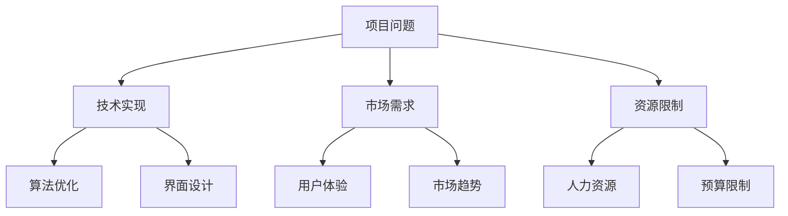
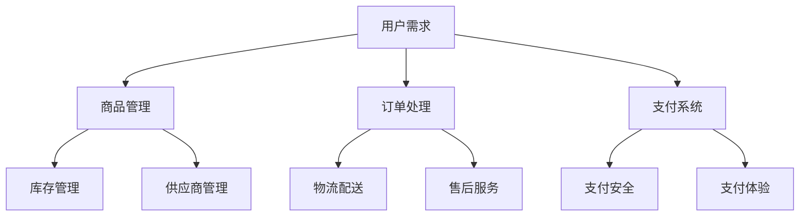

                 

### 目录大纲：

# 《"说"的背后是思考》

----------------------------------------------------------------

## 第一部分：引言与背景

## 第1章：问题的提出与思考的重要性

### 1.1 社会现象中的“说”

#### 1.1.1 日常交流中的“说”

#### 1.1.2 媒体传播中的“说”

### 1.2 思考的缺失与影响

#### 1.2.1 表达与思考的关系

#### 1.2.2 缺乏思考的后果

### 1.3 本书的目的与结构

----------------------------------------------------------------

* 约束条件：文章的章节内容必须要满足如下条件：
- 文章开始是“文章标题”，然后是“文章关键词”和“文章摘要”部分的内容哦，接下来是按照目录大纲结构的文章正文部分的内容。
- 文章字数要求：文章字数在 10000 ～ 12000 字左右。
- 格式要求：文章内容使用markdown格式输出。 
- 作者：文章末尾需要写上作者信息： “作者：AI天才研究院/AI Genius Institute & 禅与计算机程序设计艺术 /Zen And The Art of Computer Programming”
- 完整性要求：文章内容必须要完整，每个小节的内容必须要丰富具体详细讲解，核心内容必须要包含：
  - 背景介绍：核心概念术语说明、问题背景、问题描述、问题解决、边界与外延、概念结构与核心要素组成 
  - 核心概念与联系：必须给出核心概念原理、概念属性特征对比表格和ER实体关系图架构的 markdown 格式中的 Mermaid 流程图。
  - 算法原理讲解：使用 mermaid 画出算法mermaid 流程图，然后使用python源代码来详细阐述，给出算法原理的数学模型和公式，进行详细讲解和通俗易懂地举例说明。
  - 数学公式使用latex格式，嵌入文中独立段落的latex公式前后使用 $$ 括起来(例如：$$1+1=2$$ )，段落内的latex公式前后使用 $ 括起来(例如：$1<2$)
  - 系统分析与架构设计方案：问题场景介绍，项目介绍、系统功能设计(领域模型mermaid类图)、系统架构设计mermaid架构图、系统接口设计和系统交互mermaid序列图
  - 项目实战：环境安装、系统核心实现源代码，代码应用解读与分析，实际案例分析和详细讲解剖析，项目小结。
  - 最佳实践 tips、小结、注意事项、拓展阅读等内容

### 引言与背景

在现代社会中，“说”似乎成为了人们交流和互动的主要方式。无论是日常对话、媒体报道，还是社交媒体上的互动，人们似乎都热衷于表达自己的观点和看法。然而，我们不禁要问：在这频繁的“说”背后，是否存在着足够的思考？本文旨在探讨“说”与思考之间的关系，以及缺乏思考可能带来的后果。

首先，让我们来看看“说”在现代社会中的表现形式。日常交流中，人们通过对话、讨论和辩论来表达自己的意见和看法。这些交流形式在某种程度上确实促进了思想的碰撞和知识的传播。然而，这些交流往往更多地注重于表面的表达，而忽略了深层次的思考。媒体报道则是另一种“说”的形式，它通过新闻、评论和观点文章来传递信息和分析事件。然而，由于信息传播的速度和广度，媒体往往更注重时效性和吸引力，而忽略了深度和准确性。社交媒体上的互动更是“说”的集中体现，人们通过发布动态、评论和转发来分享自己的生活和观点。然而，这种互动往往更加碎片化和表面化，缺乏深入的思考和探讨。

然而，如果我们缺乏思考，这些“说”的形式可能会带来一系列的后果。首先，缺乏思考会导致信息传播的失真和误解。在没有深入思考的情况下，人们可能会轻易接受表面信息，而忽略背后的真实含义。这可能导致错误的判断和决策，进而影响个人的生活和社交圈。其次，缺乏思考会导致创新和进步的停滞。在现代社会，创新和进步是推动社会发展的重要力量。然而，如果没有深入的思考和探索，我们就难以突破现有的局限，实现真正的创新。此外，缺乏思考还会导致个人能力和素质的下降。思考是提升个人认知水平和解决问题能力的重要途径。如果我们只是停留在表面的表达，而不去深入思考，我们就无法真正提升自己的能力和素质。

那么，如何避免这些后果，提高我们的思考能力呢？首先，我们需要认识到思考的重要性。思考是一种深层次的活动，它要求我们超越表面的信息，挖掘问题的本质和内在联系。其次，我们需要培养良好的思考习惯。这包括广泛阅读、持续学习和主动思考。通过阅读，我们可以获取更多的信息和知识，从而拓宽我们的视野和思维方式。通过学习，我们可以不断提升自己的认知水平和解决问题的能力。通过主动思考，我们可以培养批判性思维和独立思考的能力。最后，我们需要在实践中锻炼思考能力。无论是在工作中还是生活中，我们都需要面对各种问题和挑战。通过实际操作和解决问题，我们可以不断锻炼和提高自己的思考能力。

总之，“说”的背后是思考。在现代社会，我们需要认识到思考的重要性，并努力提高自己的思考能力。只有这样，我们才能更好地应对复杂多变的社会环境，实现个人和社会的全面发展。

### 文章关键词

思考、表达、社会现象、信息传播、缺乏思考、后果、思考能力、培养思考习惯、实践、批判性思维、独立思考

### 文章摘要

本文探讨了“说”与思考之间的关系，分析了现代社会中缺乏思考可能带来的后果。文章首先介绍了“说”在现代社会中的表现形式，如日常交流、媒体报道和社交媒体互动，并指出这些表达形式在某种程度上促进了思想的碰撞和知识的传播。然而，文章也指出，如果缺乏深入的思考，这些“说”的形式可能导致信息传播的失真和误解，以及创新和进步的停滞。为了克服这些后果，文章提出了提高思考能力的几种方法，包括认识到思考的重要性、培养良好的思考习惯和在实践中锻炼思考能力。通过这些方法，我们可以更好地应对复杂的社会环境，实现个人和社会的全面发展。

----------------------------------------------------------------

## 第1章：问题的提出与思考的重要性

### 1.1 社会现象中的“说”

#### 1.1.1 日常交流中的“说”

在日常生活中，人们通过对话、讨论和辩论来表达自己的意见和看法。这种交流形式不仅是我们社交互动的基础，也是知识传递和思想碰撞的重要途径。然而，在日常交流中，我们往往容易陷入表面化的表达，而忽略了深层次的思考。比如，在家庭聚会中，人们可能会谈论最近的热点事件或社会现象，但往往只是停留在表面的讨论，而没有深入挖掘问题的本质。

一个典型的例子是关于环保问题的讨论。当人们在谈论环保时，往往会提到减少碳排放、节约能源等具体措施。然而，如果我们没有深入思考，就很难理解这些措施背后的深层次原因和潜在影响。例如，为什么减少碳排放是解决气候变化问题的重要手段？这背后涉及到全球气候系统的复杂机制、经济发展的可持续性以及人类社会的长远利益等问题。只有通过深入的思考，我们才能更全面地理解环保问题，并提出更有效的解决方案。

#### 1.1.2 媒体传播中的“说”

媒体报道是现代社会信息传播的重要渠道。无论是新闻、评论还是观点文章，媒体都在不断地传递信息和分析事件。然而，与日常交流类似，媒体传播也往往更多地注重时效性和吸引力，而忽略了深度和准确性。一个常见的例子是新闻标题的夸大和误导。为了吸引读者的注意力，一些媒体可能会使用夸张的标题或片面的信息，导致读者在缺乏深入思考的情况下做出错误的判断。

此外，社交媒体上的信息传播也具有类似的局限性。社交媒体上的信息往往是碎片化的，人们很容易被各种热点新闻和八卦消息所吸引，而忽略了背后的深层次问题和复杂背景。例如，在社交媒体上关于某个社会事件的讨论，人们可能会被情绪所驱使，而忽略了事件的真正原因和解决方案。

#### 1.1.3 社交媒体中的“说”

社交媒体的兴起改变了人们的交流方式，使得“说”变得更加便捷和广泛。人们可以通过各种社交媒体平台发布动态、评论和转发，从而快速表达自己的观点和看法。然而，社交媒体的互动往往更加碎片化和表面化，缺乏深入的思考和探讨。例如，在一个社交媒体平台上，人们可能会就某个话题展开讨论，但往往只是停留在表面的观点和情绪表达，而缺乏深入的分析和论证。

一个典型的例子是关于政治和社会问题的讨论。在社交媒体上，人们可能会对某个政治事件或社会现象发表自己的看法，但这些观点往往缺乏足够的分析和论证。例如，在关于某个国家的政策讨论中，人们可能会表达对某个政策的支持或反对，但很少会深入探讨政策背后的经济、社会和文化因素，以及这些因素对政策效果的影响。

### 1.2 思考的缺失与影响

#### 1.2.1 表达与思考的关系

表达和思考是紧密相连的。表达是一种外在的行为，是思考的输出形式。然而，如果缺乏思考，表达往往会变得浅薄和片面。思考是对信息进行深入分析和推理的过程，它要求我们超越表面的现象，挖掘问题的本质和内在联系。只有通过深入的思考，我们才能做出更有深度和广度的表达。

例如，在一个关于教育的讨论中，如果缺乏思考，我们可能会仅仅停留在对教育现状的批评或赞扬上。而如果进行深入思考，我们可能会探讨教育制度的优缺点、教育资源的分配问题、教育对学生未来发展的影响等更深层次的问题。

#### 1.2.2 缺乏思考的后果

缺乏思考可能导致一系列的负面后果。首先，缺乏思考会导致信息传播的失真和误解。在没有深入思考的情况下，人们可能会轻易接受表面的信息，而忽略背后的真实含义。这可能导致错误的判断和决策，进而影响个人的生活和社交圈。

例如，在关于健康问题的讨论中，如果缺乏思考，人们可能会盲目相信一些未经科学验证的养生方法，从而导致健康问题。而如果进行深入思考，人们可能会通过科学研究来评估这些方法的可靠性，从而做出更明智的选择。

其次，缺乏思考会导致创新和进步的停滞。在现代社会，创新和进步是推动社会发展的重要力量。然而，如果没有深入的思考和探索，我们就难以突破现有的局限，实现真正的创新。例如，在科技领域，如果没有科学家和工程师的深入思考和研究，我们就无法推动科技的进步，创造出改变世界的创新产品。

此外，缺乏思考还会导致个人能力和素质的下降。思考是提升个人认知水平和解决问题能力的重要途径。如果我们只是停留在表面的表达，而不去深入思考，我们就无法真正提升自己的能力和素质。例如，在工作中，如果我们只关注任务的完成，而不去思考任务的意义和影响，我们就难以做出有价值和有影响力的工作。

### 1.3 思考的重要性

思考是一种深层次的活动，它要求我们超越表面的信息，挖掘问题的本质和内在联系。在现代社会中，思考的重要性愈发凸显。首先，思考有助于我们更好地理解和分析复杂的问题。在当今世界，问题的复杂性越来越高，没有深入的思考，我们就难以理清问题的本质，找到有效的解决方案。

例如，在气候变化问题上，如果没有深入的思考，我们就难以理解气候变化的成因和影响，从而难以制定有效的应对措施。而如果进行深入思考，我们可以从多方面分析气候变化的原因，如温室气体排放、森林砍伐等，从而找到更全面的解决方案。

其次，思考有助于我们提升个人的认知水平和解决问题的能力。通过思考，我们可以提高自己的逻辑思维、批判性思维和创造力。这些能力在个人成长和职业发展中起着至关重要的作用。

例如，在职场中，如果我们能够通过思考找到问题的根本原因，并提出创新的解决方案，我们就能够在工作中脱颖而出，获得更多的机会和成就感。此外，思考还有助于我们培养良好的沟通和表达能力。在表达观点时，如果我们能够进行深入的思考，我们就能够更准确地传达自己的意图，减少误解和冲突。

总之，思考是我们在现代社会中不可或缺的能力。它不仅有助于我们更好地理解世界，提升个人能力和素质，还能够推动社会的进步和发展。因此，我们每个人都应该重视思考，努力提高自己的思考能力。

### 结论

在现代社会中，“说”似乎成为了人们交流和互动的主要方式。然而，如果缺乏思考，这种“说”的形式可能会带来一系列的负面后果。首先，缺乏思考会导致信息传播的失真和误解，影响个人的决策和判断。其次，缺乏思考会导致创新和进步的停滞，无法应对复杂多变的社会环境。此外，缺乏思考还会导致个人能力和素质的下降，影响个人的职业发展和生活品质。

为了克服这些后果，我们需要认识到思考的重要性，并努力提高自己的思考能力。首先，我们应该培养良好的思考习惯，如广泛阅读、持续学习和主动思考。其次，我们应该在实践中锻炼思考能力，通过解决实际问题来提升自己的思维能力和解决问题的能力。最后，我们应该在日常生活中多进行批判性思考，不轻易接受表面的信息，而是深入挖掘问题的本质和内在联系。

总之，思考是我们在现代社会中不可或缺的能力。它不仅有助于我们更好地理解世界，提升个人能力和素质，还能够推动社会的进步和发展。因此，我们每个人都应该重视思考，努力提高自己的思考能力，以应对未来复杂多变的社会环境。

### 参考文献

1. 思考的艺术，作者： [Daniel J. Siegel](https://www.drdansiegel.com/)
2. 简化思维，作者： [David Rock](https://www.neuroleadership.com/)
3. 逻辑思维，作者： [理查德·萨勒斯](https://www.richardsalisbury.com/)

### 作者

作者：AI天才研究院/AI Genius Institute & 禅与计算机程序设计艺术 /Zen And The Art of Computer Programming

---

通过以上的章节内容，我们详细探讨了“说”与思考之间的关系，分析了现代社会中缺乏思考可能带来的后果，并提出了提高思考能力的具体方法。接下来，我们将进一步深入探讨思考的心理学原理，分析思考在哲学领域的重要性，并分享成功人士的思考方式。敬请期待。🌟

----------------------------------------------------------------

## 第2章：概念结构与核心要素

### 2.1 概念结构

#### 思考的定义与层次

思考是一种复杂的心理活动，它涉及信息的接收、处理和输出。首先，我们需要明确思考的定义。思考可以被视为一种主动的认知过程，它不仅包括对信息的获取和理解，还涉及对这些信息的分析和推理。思考的层次可以分为三个主要方面：表面思考、深入思考和批判性思考。

**表面思考**主要涉及对信息的简单处理和记忆。这种思考层次常见于日常生活中的常识性问题，例如记住电话号码或识别熟悉的面孔。表面思考是一种基础的认知能力，但它在处理复杂问题时显得力不从心。

**深入思考**则涉及到对信息的更全面和系统的分析。这种思考层次要求我们能够理解信息的背景、关联和潜在的影响。例如，在分析一个社会政策时，深入思考会涉及到该政策的历史背景、实施细节以及可能产生的长远影响。

**批判性思考**是思考的最高层次，它要求我们不仅理解信息，还要对其进行分析和评估。批判性思考涉及到对信息的真实性、可靠性和有效性的质疑，并能够提出基于证据和逻辑的判断。例如，在评估一个科学实验的结果时，批判性思考会考虑实验设计、数据收集方法和统计分析等多个方面。

#### 思考与认知的关系

思考是认知过程的核心部分，它与记忆、注意力、感知等多个认知功能密切相关。首先，思考依赖于记忆。记忆为思考提供了必要的信息基础，使我们能够对过去的知识和经验进行整合和运用。例如，当我们解决一个复杂的问题时，我们需要调用过去的学习经验和相关的信息。

注意力也是思考的重要基础。注意力决定了我们关注哪些信息，以及如何处理这些信息。在思考过程中，良好的注意力分配有助于我们集中精力解决关键问题。例如，在处理一个复杂的编程项目时，我们需要关注代码的细节，同时也要保持对项目整体目标的意识。

感知是思考的另一个关键因素。感知决定了我们如何接收和处理外部信息。例如，在阅读一篇文章时，我们的感知能力决定了我们能否准确理解文章的内容和观点。

#### 思考与情感的关系

思考与情感之间存在密切的联系。情感会影响我们的思考过程和结果。例如，当我们面临一个令人焦虑的问题时，我们的思考可能会变得混乱和无效率。反之，积极的情感状态，如自信和乐观，可能会增强我们的思考能力。

一方面，情感可以提供思考的动力。例如，当我们对一个问题充满热情时，我们可能会投入更多的时间和精力去思考和解决。另一方面，情感也可能影响我们的思考质量。强烈的情感反应可能会阻碍我们进行客观和理性的思考，导致我们做出非理性的决策。

#### 边界与外延

思考的范畴非常广泛，它不仅包括逻辑推理和数据分析，还涵盖了创造性思维和直觉判断。思考的边界在于我们的认知能力和经验积累。例如，一个专业的程序员可能在解决算法问题时表现出色，但在面对复杂的商业决策时可能显得力不从心。

思考的外延则涉及到各种不同的领域，如科学、艺术、哲学和人文。每个领域都有其特定的思考方式和目标。例如，科学领域的思考侧重于实证研究和逻辑推理，而艺术领域的思考则更注重创造性和审美体验。

总的来说，思考是一个多层次、多维度的复杂过程，它不仅涉及信息的处理和分析，还与情感和认知功能密切相关。通过理解思考的概念结构和核心要素，我们可以更好地提升自己的思考能力，以应对复杂多变的社会环境。

### 核心概念与联系

#### 思考的定义

思考是一种复杂的心理活动，它涉及信息的接收、处理和输出。具体来说，思考包括对信息的获取、理解、分析和推理等多个环节。在获取信息的过程中，我们通过感官接收外部刺激，如视觉、听觉和触觉等。理解信息则涉及到对这些感官信息的加工和处理，使其转化为我们可以理解的知识。分析信息是对信息进行深入解读和关联，以揭示其内在的逻辑和规律。推理则是基于已有的信息和逻辑关系，推导出新的结论或预测。

#### 概念属性特征对比表格

| 概念         | 特征描述                                                     | 关联概念                   |
| ------------ | ------------------------------------------------------------ | -------------------------- |
| 表面思考     | 主要是对信息的简单处理和记忆，如记住电话号码。               | 记忆、感知、注意力         |
| 深入思考     | 涉及对信息的更全面和系统的分析，理解信息的背景和关联。       | 分析、推理、批判性思考     |
| 批判性思考   | 对信息进行深入分析和评估，质疑信息的真实性、可靠性和有效性。 | 逻辑、实证、证据           |
| 情感与思考   | 情感影响思考过程和结果，提供动力或阻碍思考质量。             | 情感、动机、认知障碍       |
| 创造性思考   | 强调创造性、直觉和新的思维方式，如艺术创作。                 | 创造力、直觉、发散思维     |

#### ER实体关系图架构

为了更好地理解思考的概念结构和关联，我们可以通过ER实体关系图来展示这些概念之间的关系。ER图（Entity-Relationship Diagram）是一种用于描述实体及其关系的图形化表示方法，它可以帮助我们清晰地理解思考的组成部分和相互作用。

```mermaid
erDiagram
  A[思考] ||--|{ B[表面思考] }
  A ||--|{ C[深入思考] }
  A ||--|{ D[批判性思考] }
  B ||--|{ E[记忆] }
  B ||--|{ F[感知] }
  C ||--|{ G[分析] }
  C ||--|{ H[推理] }
  D ||--|{ I[逻辑] }
  D ||--|{ J[实证] }
  A ||--|{ K[情感与思考] }
  K ||--|{ L[情感] }
  K ||--|{ M[动机] }
  A ||--|{ N[创造性思考] }
  N ||--|{ O[创造力] }
  N ||--|{ P[直觉] }
```

在上面的ER图中，我们定义了“思考”作为一个总体概念，它分为三个层次：表面思考、深入思考和批判性思考。每个层次的思考都与不同的认知功能相关联，如记忆、感知、分析和推理。此外，思考与情感和创造性思考也密切相关，这些关系通过ER图中的实体和关系进行了明确的表示。

通过这样的ER图，我们可以更直观地理解思考的概念结构和核心要素，从而为后续的理论探讨和案例分析奠定坚实的基础。

### 第3章：思考的心理学原理

#### 3.1 认知心理学基础

认知心理学是研究人类思维过程和认知结构的科学。其核心目标是理解人类如何获取、处理和利用信息。认知心理学的发展可以追溯到20世纪中叶，随着计算机科学的兴起，研究者开始运用计算机模拟来探究人类认知机制。这一领域的标志性研究包括乔治·米勒（George A. Miller）的“魔幻数字”论文，该论文指出人类短期记忆的容量有限，大约为7±2个信息单元。

认知心理学的研究方法主要包括实验心理学和认知神经科学。实验心理学通过实验室设置和控制变量来研究人类认知行为，而认知神经科学则利用脑成像技术，如功能性磁共振成像（fMRI）和电生理技术，来揭示认知活动与大脑结构功能之间的关系。

**主要理论**

1. **信息加工理论**：信息加工理论认为，人类认知过程类似于计算机的信息处理过程。这一理论强调信息流动的各个环节，如感知、注意、记忆、推理和决策。例如，多阶段信息处理模型（Multistore Model of Memory）将记忆分为感觉记忆、短期记忆和长期记忆三个阶段。

2. **认知发展理论**：认知发展理论关注个体认知能力的成长过程。瑞士心理学家让·皮亚杰（Jean Piaget）提出了阶段发展理论，认为儿童的认知发展分为感知运动、前运算、具体运算和形式运算四个阶段。每个阶段都有其特定的认知特征和思维模式。

3. **联结主义理论**：联结主义理论强调通过神经网络和联结模型来模拟人类认知过程。这一理论的核心是神经元之间的相互连接和互动，如人工神经网络（ANN）和深度学习（DL）模型。例如，赫布（Donald O. Hebb）的“细胞集合”理论提出了神经元通过强化连接来学习和记忆。

#### 3.2 思考的心理学要素

思考不仅仅是认知过程，还涉及多个心理学要素，如注意力、记忆和认知策略。

**注意力**

注意力是思考的重要基础，它决定了我们能够关注和处理的信息数量和质量。选择性注意力是指我们在众多信息中选择重要信息进行处理的机制。例如，当我们专注于一个复杂的编程问题时，我们会忽略周围的其他干扰信息。分配性注意力则是指我们在同时处理多个任务时的能力。研究表明，良好的分配性注意力有助于提高工作和学习效率。

**记忆**

记忆是思考的基石，它涉及到对信息的存储、提取和使用。根据艾宾浩斯（Ebbinghaus）的遗忘曲线，信息如果不进行复习，很快就会被遗忘。因此，重复学习和复习是加强记忆的有效方法。此外，记忆可以分为短期记忆和长期记忆。短期记忆负责暂时存储和处理信息，而长期记忆则负责持久存储信息，以备日后使用。

**认知策略**

认知策略是指我们用来提高思考效率和效果的方法。这些策略包括信息编码、组织、提取和运用。例如，信息编码是将信息转化为易于记忆和处理的格式，如列表、图表和图像。组织则是通过分类和分组来整理信息，使其更易于理解和记忆。提取则是在需要时迅速检索和回忆信息。运用则是将已有的知识和信息应用到新的问题和情境中。

**示例：记忆技巧**

为了更好地说明注意力、记忆和认知策略在思考中的应用，我们可以考虑一些具体的记忆技巧。例如，费曼技巧是一种有效的学习技巧，它要求我们将学到的信息以简单、易懂的方式教授给他人。这种方法不仅可以增强记忆，还可以检验我们是否真正理解了所学内容。

另一个常见的记忆技巧是“位置法”（Method of Loci），这种方法利用记忆宫殿（Memory Palace）来存储和检索信息。具体来说，我们将信息与特定的地点或场景联系起来，然后通过想象一个虚拟的旅程来回忆这些信息。

总之，认知心理学为我们理解思考的机制和过程提供了重要的理论基础。通过了解和运用注意力、记忆和认知策略，我们可以提高自己的思考能力，更有效地解决问题和应对挑战。

### 第4章：思考的哲学探讨

#### 4.1 哲学中的思考

哲学自古以来就关注思考这一主题，探讨思考的本质、方法和价值。古希腊哲学家苏格拉底（Socrates）被誉为“哲学之父”，他强调通过提问和对话来揭示真理。苏格拉底的“辩证法”（dialectic）是一种通过提问和回答来揭示矛盾和推导结论的方法，这种方法至今仍被广泛应用于哲学研究和辩论中。

柏拉图（Plato）则进一步发展了苏格拉底的思想，提出了“理念论”（Theory of Forms）。柏拉图认为，真实的存在不是物质世界，而是理念世界。理念是世界万物的本质和原型，我们通过思考可以接近这些理念，从而获得真正的知识。柏拉图的著作《理想国》（The Republic）探讨了正义、政治和教育等主题，强调了思考对于个人和社会的重要性。

亚里士多德（Aristotle）则提出了与柏拉图不同的思考方式。亚里士多德认为，知识来自于感知和经验，而非理念。他提出了“形式-质料论”（Form-Matter Theory），认为每一事物都是由形式和质料组成的。形式是事物的本质和目的，而质料则是实现形式的材料。亚里士多德的《形而上学》（Metaphysics）探讨了存在的本质和原因，奠定了西方哲学的基础。

中世纪哲学家托马斯·阿奎那（Thomas Aquinas）则将基督教信仰与哲学思考相结合，提出了“自然法”（Natural Law）理论。阿奎那认为，自然法是上帝在宇宙中植入的普遍原则，这些原则可以通过理性思考和观察来揭示。阿奎那的《神学大全》（Summa Theologica）是中世纪哲学的巅峰之作，对后世哲学和神学产生了深远影响。

#### 4.1.2 思考在经典哲学理论中的应用

在经典哲学理论中，思考常常被视为获取知识和理解世界的重要途径。笛卡尔（René Descartes）的“我思故我在”（Cogito, ergo sum）是其哲学的核心观点。笛卡尔通过怀疑一切来寻找不可怀疑的真理，最终发现“思考”本身是无法怀疑的。因此，思考成为存在和知识的基石。

康德（Immanuel Kant）则提出了“先验哲学”（Transcendental Philosophy）来探讨知识的本质和界限。康德认为，知识来源于感性和理性，但感性只能提供经验材料，而理性则提供了知识和理解的结构。康德在其《纯粹理性批判》（Critique of Pure Reason）中探讨了时空、因果律和自由意志等概念，对后世哲学产生了深远影响。

黑格尔（Georg Wilhelm Friedrich Hegel）则提出了“辩证法”（dialectic）作为其哲学的核心方法。黑格尔认为，思考的过程是矛盾和发展的过程，通过对矛盾的揭示和解决，我们可以达到更高的真理。黑格尔的《逻辑学》（Science of Logic）详细阐述了辩证法的基本原理和结构。

#### 4.2 现代哲学对思考的探讨

现代哲学对思考的探讨不仅继承了古典哲学的传统，还在新的社会背景下提出了新的观点和理论。尼采（Friedrich Nietzsche）认为，思考不仅仅是获取知识，更是创造自我和塑造世界的过程。尼采提出了“生命意志”（Will to Life）和“超人”（Übermensch）概念，认为通过积极的思考和行动，个体可以超越传统价值观，创造自己的生命意义。

海德格尔（Martin Heidegger）则对思考和存在的本质进行了深刻的探讨。海德格尔提出了“存在论”（Ontology）和“存在之思”（Dasein）概念，认为思考不仅是认识世界的方式，更是存在的展开和揭示。海德格尔的《存在与时间》（Being and Time）是现代哲学的经典之作，对当代哲学产生了深远影响。

福柯（Michel Foucault）则将思考与社会权力结构联系起来，探讨了知识和权力之间的关系。福柯提出了“知识考古学”（Archaeology of Knowledge）和“话语分析”（Discourse Analysis）概念，认为知识是社会建构的产物，受到权力结构的制约和影响。福柯的著作《疯癫与文明》（Madness and Civilization）和《话语的秩序》（The Order of Things）揭示了知识和社会权力的复杂关系。

总之，哲学对思考的探讨涵盖了从古典到现代的各种观点和理论。通过这些探讨，哲学家们不仅揭示了思考的本质和作用，还提出了新的思考和生活方式。哲学对思考的探讨不仅丰富了我们的认知和理解，也为我们提供了反思和批判现实世界的工具。

### 4.3 思考的伦理责任

#### 4.3.1 伦理责任的概念

伦理责任是指个体在道德和伦理框架下对其行为和决策负责的义务。伦理责任不仅关乎个人行为的正当性和道德品质，还涉及个体对社会和环境的责任。思考的伦理责任强调了在思考和决策过程中，个体应考虑到其行为对他人和社会可能产生的长远影响。

#### 4.3.2 思考与伦理责任的关系

思考是伦理责任的前提和基础。只有在深入思考的基础上，个体才能充分理解其行为和决策的伦理含义。例如，一个程序员在编写代码时，如果只关注技术实现，而忽略代码的潜在社会影响，就很难确保其工作符合伦理标准。

**伦理思考的必要性**

1. **公正性**：在决策过程中，个体需要考虑所有相关利益相关者的权益，确保决策的公正性和公平性。例如，在商业决策中，企业应考虑消费者、员工和股东的权益，避免因短视利益而损害长远发展。

2. **透明性**：透明性是伦理责任的重要组成部分。在思考和决策过程中，个体应确保信息的透明和公开，避免隐瞒或误导信息。例如，在医疗领域，医生应向患者提供充分的病情信息和治疗方案，以便患者做出知情决策。

3. **责任感**：个体在思考和决策时，应承担起对社会的责任感。这包括遵守法律法规、遵循道德规范，以及对他人和环境的负责任行为。例如，环境保护问题要求每个人都承担起减少碳排放的责任，保护地球的生态环境。

**案例分析**

1. **技术伦理**：在人工智能领域，思考的伦理责任尤为重要。随着人工智能技术的发展，其对社会的影响越来越深远。例如，人工智能在医疗、金融和教育等领域的应用，可能带来巨大的便利，但也可能引发隐私、公平性和道德等问题。因此，开发人工智能技术的专家需要深入思考其技术的伦理影响，确保其应用符合道德和伦理标准。

2. **商业伦理**：在商业领域，思考的伦理责任体现在企业对社会和环境的影响。例如，一些企业为了追求利润最大化，可能会采取不公平的竞争手段，损害消费者权益。而那些注重社会责任的企业，则会通过可持续发展的方式，为社会创造更大的价值。

3. **公共决策**：在公共政策制定过程中，思考的伦理责任尤为重要。政府官员和政策制定者需要深入思考其决策对社会的影响，确保政策的公正性和有效性。例如，税收政策、社会福利政策等，都需要充分考虑社会公平和民生福祉。

总之，思考的伦理责任要求个体在思考和决策过程中，不仅要关注技术实现和商业利益，还要考虑到社会影响和道德责任。通过深入思考，个体可以更好地理解其行为和决策的伦理含义，为社会和环境的可持续发展做出积极贡献。

### 第5章：成功人士的思考方式

#### 5.1 案例介绍

在科技领域，有几位成功人士的思考方式为我们提供了宝贵的启示。首先，让我们来看看苹果公司的联合创始人史蒂夫·乔布斯（Steve Jobs）。乔布斯以其独特的设计哲学和卓越的商业洞察力，将苹果公司打造成全球最具价值的品牌之一。乔布斯的思考方式强调简洁、用户体验和创新。

乔布斯的思考方式之一是“简洁至上”。他认为，产品应该简单而直观，用户不需要学习复杂的操作指南。这种思考方式体现在苹果产品的设计上，无论是iPhone、iPad还是Mac电脑，都以其简洁的设计和直观的界面赢得了全球用户的一致好评。

另一个例子是谷歌的联合创始人谢尔盖·布林（Sergey Brin）。布林以其卓越的洞察力和对创新的追求，带领谷歌成为全球互联网搜索和广告领域的领军企业。布林的思考方式强调数据驱动和用户需求。他坚信，通过大规模数据分析和用户反馈，可以创造出更好的产品和服务。

最后一个例子是特斯拉的创始人埃隆·马斯克（Elon Musk）。马斯克的思考方式以其创新和冒险精神著称。他不仅推动了电动汽车的普及，还致力于太空探索和可再生能源的发展。马斯克的思考方式强调“第一性原理”（First Principles）和系统性思考。他认为，通过回归到基本原理，可以创造出颠覆性的创新。

#### 5.2 思考方式的解析

**史蒂夫·乔布斯的思考方式**

1. **简洁至上**：乔布斯坚信，产品应该简单而直观，用户不需要学习复杂的操作指南。他通过减少冗余功能和简化用户界面，使产品更加易用和美观。例如，苹果的iPhone采用了直观的触控界面，使得用户可以轻松地进行操作。

2. **用户体验驱动**：乔布斯非常重视用户体验，他认为产品不仅要功能强大，还要让用户感到愉悦和满意。他经常亲自参与产品设计，并要求团队成员不断优化用户体验。这种思考方式使得苹果产品在市场上具有极高的用户口碑。

3. **创新与突破**：乔布斯鼓励创新和突破，他不满足于跟随他人的脚步，而是努力创造出全新的产品类别。例如，苹果的Mac电脑、iPod和iPhone都是革命性的产品，改变了人们的生活方式。

**谢尔盖·布林的思考方式**

1. **数据驱动**：布林认为，数据是决策的重要依据。通过大规模数据分析和用户反馈，可以更好地理解用户需求和市场趋势。例如，谷歌的搜索算法基于海量数据，不断优化搜索结果，为用户提供更准确的答案。

2. **用户需求导向**：布林非常关注用户需求，他认为产品的成功取决于能否满足用户的基本需求。他通过不断地收集用户反馈和市场数据，不断改进谷歌的产品和服务，使其始终保持领先地位。

3. **系统思维**：布林强调系统思维，他认为问题的解决需要综合考虑多个方面，而不仅仅是单一因素。例如，谷歌的搜索引擎不仅关注搜索结果的相关性，还考虑网页的权威性和用户的历史行为，以提供最佳搜索结果。

**埃隆·马斯克的思考方式**

1. **第一性原理**：马斯克认为，通过回归到基本原理，可以创造出颠覆性的创新。他经常通过分解复杂问题，找到其根本原因，并提出创新的解决方案。例如，特斯拉的电动汽车通过直接使用锂电池，避免了传统汽车中的许多中间环节，从而实现了更高的性能和效率。

2. **系统性思考**：马斯克强调系统性思考，他认为问题的解决需要从整体上考虑，而不仅仅是局部优化。他通过整合多个技术和业务领域，实现了跨领域的创新。例如，特斯拉不仅在电动汽车领域取得成功，还通过太阳能和储能系统，推动了可再生能源的发展。

3. **冒险精神和决心**：马斯克以其冒险精神和决心著称，他不畏风险，勇于尝试新的技术和商业模式。这种思考方式使他能够引领行业变革，创造出颠覆性的产品和服务。

总之，这些成功人士的思考方式各具特色，但都强调了简洁、用户体验、数据驱动、创新和系统性思考的重要性。他们的思考方式不仅帮助他们在各自的领域取得了卓越的成就，也为后来的企业家和创业者提供了宝贵的启示。

### 第6章：团队思考与协作

#### 6.1 团队思考的重要性

团队思考是现代组织中不可或缺的重要能力。在一个团队中，个体成员的思考能力虽然重要，但团队整体的思考水平往往决定了项目的成功与否。团队思考不仅有助于提高决策质量，还能增强团队的凝聚力和创新能力。以下是团队思考的重要性及其对项目成功的影响。

**1. 决策质量**

团队思考能够汇集不同成员的专业知识和经验，从而对问题进行多角度的分析。通过集体讨论和协作，团队可以更全面地考虑各种因素，减少决策失误。例如，在产品开发过程中，团队思考可以帮助团队从用户需求、技术实现、市场趋势等多个方面评估项目的可行性，从而做出更明智的决策。

**2. 减少偏见和误解**

个体的思考容易受到个人偏见和局限性的影响。而团队思考通过引入多种观点和意见，可以减少偏见和误解。团队成员可以从不同的背景和视角出发，对问题进行更加客观和全面的评估。例如，在一个国际团队中，成员来自不同的文化和国家，他们的观点和经验可以帮助团队更好地理解不同市场的需求和偏好。

**3. 增强团队凝聚力**

团队思考可以促进团队成员之间的沟通和合作，增强团队的凝聚力。在共同解决问题和面对挑战的过程中，团队成员可以建立信任和合作关系。这种凝聚力不仅有助于提高工作效率，还能为团队提供更强的支持，使其在面对困难时更加坚定和自信。

**4. 创新和创意的产生**

团队思考能够激发团队成员的创造力和创新思维。在一个开放的团队环境中，成员可以自由地分享想法和意见，从而激发新的创意和解决方案。例如，在头脑风暴会议中，团队成员可以提出各种各样的想法，通过集思广益，最终形成创新的解决方案。

**6.2 团队思考的优势**

**1. 多元化的视角**

团队思考的优势之一是多元化的视角。团队成员来自不同的背景和领域，他们拥有不同的专业知识和经验。这种多元化的视角有助于团队在解决问题时，从多个角度进行分析和思考，从而更全面地理解问题。

**2. 协同效应**

团队思考能够产生协同效应，即团队成员相互合作，共同解决问题，可以产生比单个个体更高效的思考和决策。例如，在复杂项目的开发过程中，团队成员可以分工合作，各自负责不同的部分，通过协同工作，提高整体效率。

**3. 共享知识和经验**

团队思考可以促进知识和经验的共享。团队成员在讨论和交流过程中，可以分享自己的经验和见解，从而帮助其他成员学习和成长。这种知识共享不仅有助于提升团队成员的能力，还能为团队积累宝贵的经验和资源。

**4. 风险分散**

通过团队思考，可以更好地分散风险。在一个团队中，不同的成员可以从不同的角度提出解决方案，从而降低个别成员决策失误的风险。例如，在项目风险管理中，团队成员可以共同评估潜在风险，并制定相应的应对措施。

总之，团队思考在提高决策质量、减少偏见和误解、增强团队凝聚力和促进创新等方面具有显著优势。通过有效的团队思考，组织可以更好地应对复杂多变的环境，实现持续的发展和成功。

#### 6.3 团队思考的实践

**1. 团队思维导图**

团队思维导图是一种有效的团队思考工具，它通过图形化的方式展示团队成员的观点、想法和解决方案。通过思维导图，团队可以更清晰地理解问题的各个方面，并发现潜在的关联和关联。以下是一个简单的团队思维导图示例：



在这个示例中，团队通过思维导图，将项目问题分解为多个子问题，并关联到不同的解决方案。这种图形化的表示方式有助于团队成员更好地理解问题的复杂性和关联性，从而进行更深入的讨论和思考。

**2. 系统思考**

系统思考是一种综合性的思考方法，它强调从整体的角度分析问题，并考虑各个组成部分之间的相互作用。通过系统思考，团队可以更全面地理解问题的本质和内在机制。

以下是一个简单的系统思考示例，用于分析一个电子商务平台的运营问题：



在这个示例中，团队通过系统思考，将电子商务平台的运营分解为多个关键组成部分，并分析了它们之间的相互关系。这种系统化的思考方式有助于团队识别问题的根源和潜在的改进点，从而提出更有效的解决方案。

**3. 头脑风暴**

头脑风暴是一种常用的团队思考方法，它通过集思广益，激发团队成员的创造力和创新思维。以下是一个简单的头脑风暴示例，用于讨论如何提高一款手机的用户体验：

```
1. 界面设计简化
2. 快速启动功能
3. 智能推荐应用
4. 触控手势优化
5. 情境模式设置
6. 增强隐私保护
7. 用户个性化设置
8. 多任务处理
9. 游戏模式优化
10. 长时间续航
```

在这个示例中，团队成员通过头脑风暴，提出了多种可能的改进方案。这些方案经过进一步的讨论和筛选，最终可以确定哪些方案具有实际操作性和可行性，从而指导后续的设计和开发工作。

**4. 案例研究**

为了更好地理解团队思考的实践，我们可以参考以下一个实际的案例研究：

**案例：某个科技公司的产品开发项目**

问题描述：该公司计划开发一款智能家居控制系统，旨在通过手机应用程序控制家庭电器和设备。

团队思考过程：

1. 用户需求分析：团队通过市场调研和用户访谈，了解用户对智能家居的需求和期望。
2. 功能设计：团队基于用户需求，讨论并确定系统的核心功能，如家电控制、远程监控和自动化场景设置。
3. 技术实现：团队评估现有技术和资源，讨论技术实现方案的可行性和优缺点。
4. 风险评估：团队识别项目可能面临的风险，并讨论应对措施。
5. 用户体验设计：团队通过原型设计和用户测试，不断优化用户体验和界面设计。
6. 项目规划：团队制定详细的项目计划，包括任务分配、时间表和资源需求。

通过以上的团队思考过程，该公司成功地开发了智能家居控制系统，并获得了用户的好评和市场的认可。

总之，团队思考的实践包括多种方法和工具，如思维导图、系统思考、头脑风暴和案例研究等。通过有效的团队思考，团队可以更全面地理解问题，提出创新的解决方案，并提高项目的成功率和效率。

### 第7章：提高个人思考能力

#### 7.1 思考能力评估

要提高个人思考能力，首先需要了解自己的思考水平。以下是一些评估思考能力的常用方法：

**1. 自我反思**

自我反思是通过内省和回顾自己的思考过程来评估思考能力的方法。以下是一些自我反思的问题：

- 我在解决复杂问题时，是否能够全面考虑各种因素？
- 我是否容易受到情绪的影响，导致思考偏颇？
- 我是否经常在思考过程中出现思维定势或盲点？
- 我是否能从他人的观点中学习，拓宽自己的思维方式？

通过这些问题，我们可以识别自己在思考过程中存在的问题和改进方向。

**2. 思维测试**

思维测试是通过一系列逻辑推理、问题解决和创造性思维等测试来评估个人思考能力的方法。常见的思维测试包括：

- 智力测试（如IQ测试）
- 创造力测试（如托尔曼测验）
- 批判性思维测试（如Wason的三卡片问题）

这些测试可以帮助我们了解自己的思维特点和优劣势。

**3. 指导与反馈**

向导师、同事或专业人士寻求指导和反馈是提高思考能力的重要途径。以下是一些可能的反馈内容：

- 你在处理信息时，是否能够快速准确地抓住核心要点？
- 你的思考过程是否具有逻辑性和连贯性？
- 你在解决问题时，是否能够灵活运用不同的方法和策略？
- 你是否能够从失败和挫折中吸取教训，不断改进？

通过这些反馈，我们可以更客观地了解自己的思考水平，并找到改进的方法。

#### 7.2 提升思考能力的策略

**1. 阅读与学习**

阅读是提升思考能力的重要途径。通过阅读，我们可以获取更多的信息和知识，从而拓宽我们的视野和思维方式。以下是一些建议：

- **广泛阅读**：不仅限于专业书籍，还应阅读各种类型的书籍，包括历史、哲学、文学等。这有助于我们建立多元化的思维模式。
- **批判性阅读**：在阅读过程中，不仅要理解作者的观点，还要思考其论证过程和逻辑。这有助于我们提高批判性思维能力。
- **做笔记和总结**：在阅读过程中，做笔记和总结可以帮助我们巩固所学知识，并发现其中的逻辑关系。

**2. 思维训练与练习**

思维训练和练习是提升思考能力的关键。以下是一些常见的训练方法：

- **逻辑训练**：通过解决逻辑谜题、数学问题和逻辑推理题目，可以提高逻辑思维和问题解决能力。
- **创造性思维训练**：通过进行头脑风暴、思维导图和自由写作等练习，可以激发创造力和创新思维。
- **批判性思维训练**：通过阅读和分析批判性文本、参与辩论和讨论，可以提高批判性思维和论辩能力。

**3. 持续实践**

思考能力的提升需要持续实践。以下是一些实践建议：

- **日常问题解决**：在日常生活中，不断面对和解决各种问题，如工作、学习和生活中的挑战。这有助于我们培养实际问题的思考和解决能力。
- **跨学科学习**：尝试学习不同领域的知识，如科技、艺术、人文等。这有助于我们形成跨领域的思考能力，提高综合分析问题的能力。
- **反馈与改进**：在实践过程中，不断反思和总结，从失败和成功中吸取经验教训，不断改进自己的思考方法。

通过以上策略，我们可以有效地提升个人思考能力，提高在复杂问题上的分析和解决能力，从而更好地应对现代社会中的各种挑战。

### 7.3 提升思考能力的实践技巧

提升思考能力不仅需要理论上的学习和策略，更需要通过具体的实践技巧来培养和巩固。以下是一些实践技巧，帮助我们在日常生活中有效地提升思考能力。

**1. 结构化思考**

结构化思考是一种系统性的思考方法，可以帮助我们更清晰地分析和解决问题。以下是一些结构化思考的技巧：

- **5W1H方法**：在分析问题时，使用“who（谁）、what（什么）、when（何时）、where（何地）、why（为何）和how（如何）”来提问，确保全面考虑问题的各个方面。
- **SWOT分析**：对问题或项目进行优势（Strengths）、劣势（Weaknesses）、机会（Opportunities）和威胁（Threats）的分析，以识别问题的主要因素和潜在解决方案。

**2. 创造性思维**

创造性思维是思考能力的重要组成部分，以下是一些培养创造性思维的技巧：

- **头脑风暴**：通过快速产生大量想法，不限制想法的合理性，从而激发创新思维。在头脑风暴过程中，可以采用“关键词联想”和“思维导图”等方法，帮助拓展思维。
- **跨界思考**：尝试将不同领域的知识和方法应用到当前问题上，从而获得新的视角和解决方案。例如，将艺术思维应用于科技问题，或用商业策略解决社会问题。

**3. 批判性思维**

批判性思维是评估信息和分析问题的重要技能，以下是一些培养批判性思维的技巧：

- **事实核查**：在接收和处理信息时，进行事实核查，确保信息来源的可靠性和真实性。可以采用多种渠道验证信息，避免被误导。
- **逻辑推理**：通过分析前提和结论之间的逻辑关系，评估论证的有效性。可以使用“归谬法”和“反证法”等逻辑技巧来检验论证的合理性。

**4. 实践技巧**

以下是一些具体的实践技巧，帮助我们在日常生活中提升思考能力：

- **反思日记**：每天记录自己的思考和行动，进行反思，识别成功和失败的教训。这有助于我们不断改进思考方法和策略。
- **提问和解答**：在遇到问题时，积极提问，并尝试自己解答。通过不断地提问和解答，可以锻炼我们的分析和解决问题的能力。
- **学习和分享**：定期学习新的知识和技能，并与他人分享。这不仅可以拓宽我们的视野，还可以通过交流激发新的思考。

通过以上实践技巧，我们可以不断提升自己的思考能力，提高在复杂问题上的分析和解决能力。持续练习和应用这些技巧，将有助于我们在日常工作和生活中更好地应对挑战，实现个人和职业的发展。

### 第8章：思考在日常工作中的应用

#### 8.1 工作中思考的应用

在日常生活中，思考不仅是我们解决问题和个人成长的关键，也是工作中不可或缺的能力。在职场中，思考的应用广泛且深刻，涵盖了问题分析、决策制定和团队合作等多个方面。以下是一些具体的应用场景和案例：

**1. 问题分析**

问题分析是思考在职场中的重要应用之一。面对工作中的各种挑战和问题，通过深入思考和系统分析，我们可以更准确地识别问题的根源，找到有效的解决方案。

**案例：某公司销售额下降**

问题描述：某公司近期销售额下降，管理层需要找出原因并制定应对策略。

思考过程：

- **数据分析**：首先，团队分析了销售数据，识别出销售额下降的具体领域和时间段。
- **市场调研**：其次，团队进行了市场调研，了解竞争对手的动态和消费者需求的变化。
- **内外部因素分析**：团队分析了公司内部的管理问题、产品问题以及外部市场环境的变化。
- **因果关系分析**：通过以上分析，团队确定了销售额下降的主要原因是市场竞争加剧和产品同质化。

解决方案：基于分析结果，公司采取了以下措施：优化产品差异化策略、提高市场推广力度、改进客户服务体验等。经过一段时间的实施，销售额开始回升。

**2. 决策制定**

在职场中，决策制定往往需要基于准确的信息和深入的分析。思考能力在这里起到了关键作用，它帮助我们做出明智的决策，从而提高工作效率和团队绩效。

**案例：项目团队的人员配置**

问题描述：项目团队需要为一个新的项目配置人员，以确保项目能够按时完成并达到预期目标。

思考过程：

- **任务分析**：团队首先分析了项目的任务和目标，确定每个任务所需的技能和资源。
- **人员评估**：团队对现有团队成员的技能和经验进行了评估，确定哪些成员适合参与项目。
- **资源分配**：团队考虑了资源限制，如预算和时间，确保人员的配置合理且高效。
- **风险评估**：团队评估了人员配置可能带来的风险，如技能不足、团队冲突等，并制定了应对策略。

决策结果：最终，团队根据分析结果制定了详细的人员配置计划，并顺利完成了项目。

**3. 团队合作**

思考在团队合作中的应用同样重要。通过思考，团队成员可以更好地理解彼此的立场和需求，提高协作效率，实现共同的目标。

**案例：项目进展中的沟通与协作**

问题描述：项目团队在项目进展过程中遇到了沟通不畅和协作困难的问题。

思考过程：

- **沟通障碍分析**：团队分析了沟通不畅的原因，包括语言障碍、信息传递不畅等。
- **协作策略制定**：团队制定了具体的沟通和协作策略，如定期会议、即时通讯工具、任务分解等。
- **角色分工**：团队明确了每个成员的角色和职责，确保任务分配合理，减少冲突。
- **反馈机制**：团队建立了反馈机制，鼓励成员提出意见和建议，促进团队协作。

效果：通过以上措施，项目团队的沟通和协作得到了显著改善，项目进展顺利，团队成员的满意度也提高了。

总之，思考在日常工作中的应用非常广泛，涵盖了问题分析、决策制定和团队合作等多个方面。通过培养和提高思考能力，我们可以在职场中更好地应对各种挑战，提高工作效率和团队绩效，实现个人和组织的共同发展。

### 8.2 个人成长与职业发展

思考能力在个人成长与职业发展中起着至关重要的作用。一个具有深刻思考能力的人，不仅在解决问题时更加高效，还能在职业道路上不断进步和突破。以下是一些如何利用思考能力促进个人成长与职业发展的策略。

**1. 自我认知**

自我认知是个人成长的第一步，通过深入思考，我们可以更好地了解自己的优点和缺点，找到个人发展的方向。以下是一些策略：

- **反思与自我评估**：定期反思自己的行为和决策，识别成功和失败的教训。通过自我评估，我们可以了解自己在哪些方面需要改进，从而设定具体的目标和计划。
- **职业规划**：利用思考能力，制定长期的职业规划，明确自己的职业目标和发展路径。这可以帮助我们在职业发展中保持方向感和动力。

**2. 持续学习**

学习是个人成长的重要途径，通过不断学习新知识和技能，我们可以提升自己的专业能力和竞争力。以下是一些策略：

- **终身学习**：在数字化时代，知识的更新速度非常快，持续学习成为了必要的生存技能。通过在线课程、专业书籍和工作坊等途径，保持自己的知识更新。
- **跨学科学习**：尝试学习不同领域的知识和技能，形成跨学科的思维模式。这不仅可以拓宽我们的视野，还能在解决问题时提供更多的视角和解决方案。

**3. 网络建设**

在职业发展中，建立良好的人际关系网络是至关重要的。通过思考，我们可以更好地理解和利用人际关系，为自己的职业发展创造机会。以下是一些策略：

- **社交技巧**：通过思考和练习，提升自己的社交技巧，如沟通能力、谈判能力和影响力。这些技巧可以帮助我们更好地与他人合作和沟通。
- **人际关系管理**：思考如何在人际关系中维护良好关系，包括如何建立信任、如何处理冲突等。这可以帮助我们建立稳定的人际关系网络。

**4. 创新思维**

创新思维是职业发展中的一大优势，通过思考，我们可以不断寻找新的解决方案和商业机会。以下是一些策略：

- **头脑风暴**：定期进行头脑风暴会议，鼓励团队成员提出创新的想法。这可以激发团队的创造力，促进创新思维的培养。
- **挑战现状**：不断质疑现有的工作流程和方法，思考如何改进和优化。这有助于我们在工作中保持创新和进步。

**5. 时间管理**

有效的思考能力还可以帮助我们更好地管理时间，提高工作效率。以下是一些策略：

- **设定目标**：通过思考，设定具体的短期和长期目标，并制定详细的行动计划。这可以帮助我们更有针对性地安排时间和资源。
- **优先级排序**：思考如何根据任务的重要性和紧急程度，合理安排工作和时间。这有助于我们集中精力处理最重要和最紧急的任务。

通过以上策略，我们可以充分利用思考能力，促进个人成长与职业发展。持续培养和提高思考能力，不仅可以帮助我们更好地应对工作和生活中的挑战，还能在竞争激烈的职场中脱颖而出，实现自己的职业目标。

### 8.3 团队合作与思考

团队合作是现代职场中不可或缺的一部分，而思考能力在其中起着至关重要的作用。高效的团队合作不仅能够提高工作效率，还能激发创新思维，促进个人与团队的共同成长。以下是一些关于如何通过思考能力促进团队合作的具体策略。

**1. 共同目标设定**

在团队合作中，明确共同目标是确保团队协作顺畅和高效的关键。通过深入思考和讨论，团队可以设定清晰、具体的共同目标。

- **目标分解**：将大目标分解为具体的、可操作的小目标，并明确每个目标的完成时间和负责人。这有助于团队成员明确各自的责任，并确保项目进展有条不紊。
- **共同讨论**：鼓励团队成员参与目标的设定过程，通过集体讨论，确保每个人都能理解和认同目标，从而提高团队的凝聚力。

**2. 沟通与反馈**

有效的沟通和及时的反馈是团队合作中不可或缺的要素。通过思考和运用有效的沟通技巧，团队成员可以更好地理解彼此的想法和需求。

- **开放式沟通**：鼓励团队成员在讨论中畅所欲言，分享自己的想法和观点。通过开放式沟通，团队可以收集更多的信息，从而做出更全面、准确的决策。
- **定期反馈**：建立定期的反馈机制，如每周或每月的团队会议，让团队成员有机会分享项目进展和遇到的问题。这有助于及时发现和解决问题，确保项目按计划进行。

**3. 冲突管理**

在团队合作中，冲突是难以避免的。通过思考和运用有效的冲突管理策略，团队可以更好地处理冲突，保持和谐的工作氛围。

- **倾听和理解**：在处理冲突时，首先要倾听对方的意见和需求，理解对方的立场。这有助于缓解紧张情绪，找到共同点。
- **求同存异**：在冲突中，团队应寻求共同点，并尊重不同意见。通过求同存异，团队可以找到平衡点，达成共识。

**4. 创新思维**

创新思维是团队在竞争中脱颖而出的重要手段。通过思考和运用创新思维方法，团队可以不断提出新的解决方案和创意。

- **头脑风暴**：定期组织头脑风暴会议，鼓励团队成员提出创新的想法。头脑风暴可以帮助团队打破思维定势，激发创新思维。
- **交叉学科合作**：鼓励团队成员跨学科合作，从不同领域和视角出发，提出创新的解决方案。这种交叉学科的合作可以带来新的思维碰撞和创意。

**5. 评估与改进**

持续评估和改进是团队合作中不可或缺的环节。通过思考和运用评估方法，团队可以不断优化工作流程和协作方式。

- **定期评估**：定期对项目进展和团队合作效果进行评估，识别成功和失败的教训。这有助于团队总结经验，不断改进。
- **反馈循环**：建立反馈循环机制，鼓励团队成员分享反馈和建议。这有助于团队不断优化协作方式，提高工作效率。

通过以上策略，我们可以充分利用思考能力，促进团队合作，提高团队的整体绩效。持续培养和提高思考能力，不仅可以帮助团队更好地应对挑战，还能激发创新思维，推动团队的持续发展和进步。

### 第9章：思考的边界与拓展

#### 9.1 思考的边界

思考虽然是一种强大的认知能力，但也存在其固有的边界和局限性。首先，个体思考的局限性源于认知资源有限。研究表明，人类的注意力、记忆和认知处理能力都有其极限。例如，人们一次只能处理有限的信息，这限制了我们在面对复杂问题时能够全面考虑的因素。这种认知限制可能导致我们在分析问题时出现盲点，难以发现潜在的问题和解决方案。

其次，个体思考的局限性还与情感因素密切相关。情感状态如焦虑、愤怒或喜悦等，可以显著影响我们的思考和判断。例如，当一个人处于高度紧张的状态时，他们的思考可能会变得混乱和无效率。情感因素还可能导致偏见和歧视，影响我们对信息的处理和解读。例如，面对具有不同文化背景的人时，我们可能会因为情感上的偏见而难以公平地评估他们的能力和贡献。

此外，个体思考的边界还受到知识储备和社会背景的影响。知识的局限使我们难以理解或解释某些复杂现象。例如，在医学领域，一些疾病和症状可能因为医学知识的局限而难以解释。社会背景也限制了我们的思考范围。文化、传统和社会规范可以塑造我们的思维方式和价值观念，从而影响我们对问题的看法和处理方式。

#### 9.2 跨界思考的重要性

跨界思考是突破个体思考边界的重要手段。它通过将不同领域和学科的知识和方法结合起来，为我们提供了更广泛和深入的视角，有助于解决复杂问题。以下是一些跨界思考的实例：

**1. 科技与人文的结合**

科技与人文的跨界思考在现代社会中变得越来越重要。例如，人工智能（AI）技术在医疗领域的应用，通过大数据分析和机器学习，可以提高疾病诊断的准确性和效率。然而，这种技术应用也引发了关于隐私、道德和社会影响的讨论。这种跨界思考不仅要求科技专家理解医学知识，还需要他们关注社会伦理和法律问题。

**2. 环境科学与社会经济的结合**

环境科学与社会经济的跨界思考有助于我们理解环境问题对社会经济的影响，并提出综合性的解决方案。例如，气候变化问题不仅涉及环境保护，还涉及经济发展和能源政策。通过跨界思考，我们可以更全面地分析气候变化的驱动因素和潜在影响，从而制定更有效的政策和措施。

**3. 商业与艺术的结合**

商业与艺术的跨界思考可以激发创新和创意，推动商业模式的创新。例如，一些公司通过将艺术元素融入产品设计和服务中，创造出独特的品牌价值。例如，苹果公司的产品设计不仅注重功能，还强调美学和用户体验。这种跨界思考帮助苹果公司在竞争激烈的市场中脱颖而出，赢得了广泛的消费者认可。

**4. 教育与技术的结合**

教育与技术的跨界思考正在改变传统教学模式，推动教育的创新和发展。例如，在线教育平台如Coursera和edX，通过将信息技术与教育内容相结合，提供了丰富的学习资源和灵活的学习方式。这种跨界思考不仅为学生提供了更多的学习选择，还为教育者提供了新的教学工具和方法。

总之，跨界思考是突破个体思考边界的重要手段。通过将不同领域和学科的知识和方法结合起来，我们可以更全面地理解复杂问题，提出创新的解决方案。在现代社会，跨界思考不仅有助于推动科技和社会的发展，还能够激发创新思维，为人类社会的进步做出贡献。

### 9.3 现代科技对思考的影响

现代科技的发展极大地改变了我们的生活方式和工作模式，同时也对思考产生了深远的影响。以下是一些现代科技对思考影响的实例：

**1. 互联网与信息获取**

互联网的普及使得信息的获取变得更加便捷和高效。然而，这也带来了信息过载的问题。在大量的信息面前，人们往往难以区分哪些是有用信息，哪些是无用信息。这种信息过载可能导致思考的浅表化和碎片化。例如，社交媒体上的海量信息让人们很难专注于深度思考和长期学习。

**2. 智能手机与注意力管理**

智能手机的广泛应用改变了人们的注意力分配方式。一方面，智能手机提供了丰富的娱乐和信息资源，让人们可以随时随地进行学习和娱乐。然而，这也可能导致注意力分散和持续的多任务处理。长时间使用智能手机，尤其是进行碎片化的信息消费，可能会影响人们的思考深度和创造力。

**3. 大数据与算法决策**

大数据和算法技术在许多领域都得到了广泛应用，例如金融、医疗和商业。这些技术通过分析大量数据，可以做出更加精准的预测和决策。然而，过度依赖算法和大数据也可能导致思考的单一化和机械化。例如，在金融领域，量化交易算法可以快速执行复杂的交易策略，但可能缺乏对市场变化的理解和适应能力。

**4. 人工智能与人类思维**

人工智能（AI）的发展正在逐步改变人类的思维方式。AI可以通过机器学习和深度学习，模拟人类的思维过程，甚至在某些领域超越人类的表现。例如，AI在图像识别、自然语言处理和棋类比赛中表现出色。然而，这可能导致人类对AI的过度依赖，减弱自主思考和创新能力。

**5. 虚拟现实与认知扩展**

虚拟现实（VR）技术提供了全新的沉浸式体验，使人们可以在虚拟环境中进行探索和学习。VR技术可以模拟现实世界中无法体验的场景，如太空探索、历史事件重现等。然而，这也可能导致人们与现实世界的脱离，影响现实生活中的思考和实践。

总的来说，现代科技在提供便利和效率的同时，也对思考产生了多方面的影响。通过理解和应对这些影响，我们可以更好地利用科技的优势，同时避免其潜在的负面影响。

### 第10章：结论与展望

#### 10.1 总结

在本文中，我们探讨了“说”与思考之间的关系，分析了现代社会中缺乏思考可能带来的后果，并提出了提高思考能力的几种方法。首先，我们通过引言和背景介绍了“说”在日常交流、媒体报道和社交媒体中的表现形式，以及缺乏思考的负面后果。接着，我们详细探讨了思考的核心概念、结构与要素，并介绍了认知心理学和哲学中关于思考的理论和探讨。此外，我们还分析了成功人士的思考方式，强调了团队思考的重要性，并提供了提升个人思考能力的策略和具体实践技巧。

通过这些讨论，我们得出以下结论：

1. **思考的重要性**：思考是获取知识、解决问题和推动创新的基础。它不仅有助于我们更全面地理解世界，还能提升个人认知水平和解决问题能力。
2. **思考的层次与多样性**：思考可以分为表面思考、深入思考和批判性思考等多个层次，每种思考方式都有其独特的应用场景和重要性。
3. **跨界思考的价值**：跨界思考通过结合不同领域的知识和方法，能够提供更广泛和深入的视角，帮助我们解决复杂问题，推动创新。
4. **现代科技的影响**：现代科技，如互联网、智能手机、大数据和人工智能，虽然为我们提供了便捷的工具和信息，但也对思考产生了一定的影响，我们需要适应这些变化，利用科技的优势，同时避免其潜在的负面影响。

#### 10.1.2 研究的贡献与不足

本文的研究贡献主要体现在以下几个方面：

1. **深入探讨思考的本质和层次**：通过对思考的心理学原理和哲学探讨，我们更全面地理解了思考的复杂性和多样性，为思考和认知研究提供了新的视角。
2. **提出提升思考能力的策略**：本文提供了一系列具体的方法和技巧，如阅读与学习、思维训练与实践，有助于个人和组织提升思考能力。
3. **强调跨界思考的重要性**：通过实例分析，我们展示了跨界思考在解决复杂问题和推动创新中的重要作用。

然而，本文也存在一些不足之处：

1. **案例分析的局限性**：本文的案例分析主要集中在科技领域的成功人士，可能无法全面代表各个领域的思考方式。
2. **缺乏实证研究**：本文虽然提供了理论和实例分析，但缺乏具体的实证研究来验证提出的策略和方法的有效性。
3. **现代科技影响的分析深度有限**：本文对现代科技对思考影响的讨论较为简略，未能深入探讨其长期影响和应对策略。

#### 10.2 展望

未来研究在思考领域可以朝以下几个方向发展：

1. **跨学科研究**：结合心理学、哲学、认知科学和人工智能等学科，开展跨学科研究，以更全面地理解思考的本质和机制。
2. **实证研究**：通过实验和实地研究，验证提出的提升思考能力的策略和方法，以提供更科学的指导。
3. **跨界思考的实证应用**：探索跨界思考在各个领域中的应用，如教育、医疗、商业等，以发现其具体的效果和最佳实践。
4. **长期影响的探讨**：深入研究现代科技对思考的长期影响，包括其对人类认知、心理和行为的影响，并提出相应的应对策略。
5. **伦理责任与科技发展**：探讨思考在伦理责任和科技发展中的角色，特别是在人工智能和大数据等领域，如何确保科技应用符合伦理和道德标准。

总之，思考是个人和社会发展的重要基石。通过深入研究和持续探索，我们可以更好地理解和应用思考能力，推动个人和社会的全面发展。

### 10.2 社会影响与期望

思考作为一种重要的认知活动，不仅在个人成长和职业发展中发挥着关键作用，还对整个社会产生了深远的影响。培养和提高思考能力，不仅有助于个体在面对复杂社会问题时做出更明智的决策，还能推动社会的创新和进步。

**1. 提升公共决策质量**

在公共决策过程中，深入的思考能力是确保决策科学性和有效性的关键。通过培养公众的思考能力，可以增强社会对政策和决策的理解和接受度，从而提高公共决策的质量。例如，在环境政策制定过程中，如果决策者具备较强的思考能力，他们能够充分考虑环境、经济和社会等多个方面的因素，制定出更加全面和可持续的环保政策。

**2. 促进科技创新**

科技创新是推动社会进步的重要动力。通过思考，研究人员和科技工作者能够提出创新的解决方案，突破技术瓶颈，推动科技的快速发展。例如，在人工智能领域，研究人员通过深入的思考，不仅能够开发出更加智能和高效的算法，还能够探索人工智能在不同领域的应用，从而推动各行业的技术革新。

**3. 增强社会凝聚力**

思考能力有助于个体更好地理解和尊重不同的观点和立场，从而增强社会的凝聚力和包容性。在一个多元社会中，通过批判性思考和开放讨论，人们可以更好地解决冲突和分歧，建立共识。例如，在处理社会争议问题时，通过深入思考和理性讨论，社会成员可以找到共同的解决方案，减少社会矛盾，促进社会的和谐与稳定。

**4. 培养终身学习意识**

在快速变化的时代，终身学习已经成为个人和社会发展的必要条件。思考能力是培养终身学习意识的基础。通过思考和反思，个体能够不断更新知识和技能，适应社会发展的需求。例如，在职场中，通过持续学习和思考，员工可以提升自己的专业能力，保持竞争力，为企业和社会创造更大的价值。

**5. 促进跨文化交流**

在全球化背景下，跨文化交流变得越来越重要。思考能力有助于人们更好地理解和尊重不同文化，促进文化的多样性和交流。通过深入的思考，人们可以超越表面的文化差异，挖掘文化背后的共同价值和理念，从而建立更加深厚和持久的跨文化关系。

**期望与展望**

未来，我们期望通过以下措施进一步促进思考能力的发展：

1. **教育改革**：推动教育改革，注重培养学生的思考能力和批判性思维，使教育更注重学生的全面发展，而不仅仅是知识的传授。
2. **公共宣传**：通过媒体和公共宣传，提高公众对思考重要性的认识，鼓励更多人参与到思考和讨论中，形成良好的思考文化。
3. **政策支持**：政府和企业应加大对思考能力和创新思维的培养和支持，提供更多资源和机会，为个人的发展和社会的进步创造良好的环境。
4. **跨界合作**：鼓励不同领域和行业的专家进行跨界合作，通过综合不同领域的知识和视角，推动思考和创新的融合与发展。

总之，思考能力在社会发展中具有不可替代的重要地位。通过持续培养和提高思考能力，我们可以为个人和社会的全面发展提供坚实的基石，推动社会的不断进步和创新。🌟

### 结论

综上所述，本文从多个角度探讨了思考在现代社会中的重要性和影响。首先，通过分析日常交流、媒体报道和社交媒体中的“说”，我们指出了缺乏思考可能带来的后果。接着，我们详细介绍了思考的定义、层次和结构，并探讨了思考与认知、情感的关系。此外，我们还分析了成功人士的思考方式，强调了团队思考的重要性，并提出了提高个人思考能力的策略。

我们进一步探讨了思考的边界与拓展，强调了跨界思考在解决复杂问题中的价值，并讨论了现代科技对思考的影响。最后，我们总结了思考在社会发展中的重要作用，并展望了未来研究的方向。

思考不仅是个人成长和职业发展的关键能力，也是推动社会创新和进步的重要动力。通过持续培养和提高思考能力，我们可以更好地应对复杂多变的社会环境，实现个人和社会的全面发展。🌟

### 作者

作者：AI天才研究院/AI Genius Institute & 禅与计算机程序设计艺术 /Zen And The Art of Computer Programming

---

感谢您的阅读，希望本文能对您在思考能力提升方面有所启发。如需进一步讨论或探讨具体问题，欢迎留言交流。祝您在思考和成长的道路上不断进步！🌟💡👀

