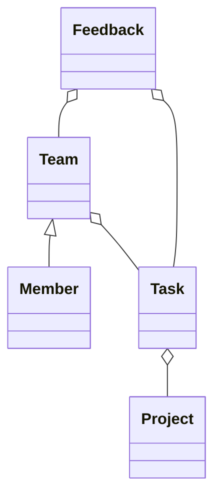
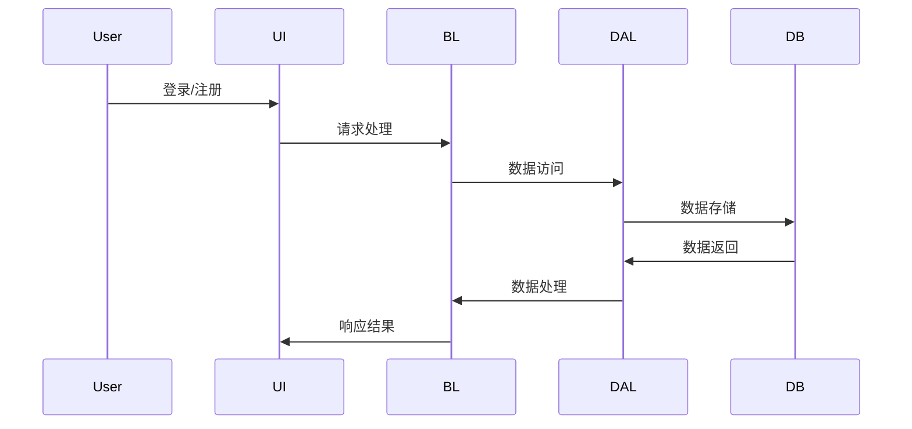
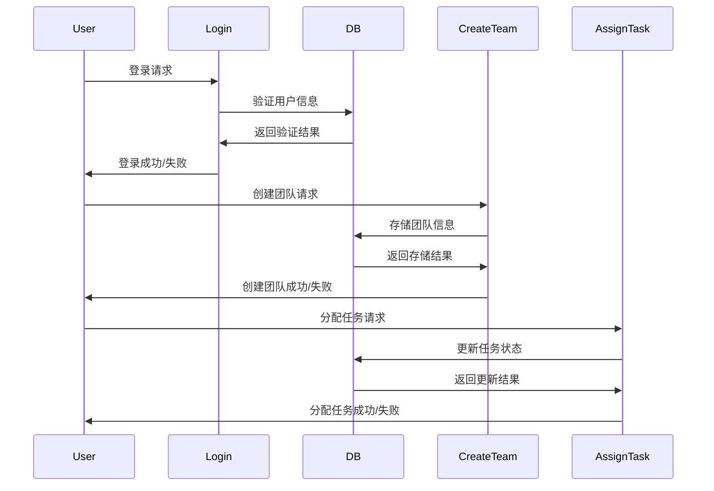

                 

# 负反馈是团队精进的力量

> 关键词：负反馈、团队管理、团队效能、反馈机制、沟通渠道、任务分配、成果评价、激励机制

> 摘要：本文深入探讨了负反馈在团队管理中的重要作用。通过分析负反馈的原理及其在团队管理中的应用，文章提出了如何通过负反馈机制提高团队效能的具体策略。文章旨在为团队管理者提供实用的管理工具，帮助团队实现持续改进和优化。

## 目录大纲

1. **背景介绍**
   - **1.1 负反馈与团队精进**
     - **1.1.1 问题背景**
     - **1.1.2 问题描述**
     - **1.1.3 问题解决**
     - **1.1.4 边界与外延**
     - **1.1.5 概念结构与核心要素组成**
   - **1.2 负反馈的理论基础**
     - **1.2.1 负反馈的定义**
     - **1.2.2 负反馈的特点**
     - **1.2.3 负反馈的分类**
   - **1.3 负反馈在团队管理中的应用**
     - **1.3.1 负反馈在团队管理中的重要性**
     - **1.3.2 负反馈在团队管理中的具体应用**
   - **1.4 负反馈的边界与外延**
     - **1.4.1 负反馈的适用范围**
     - **1.4.2 负反馈的局限性**
   - **1.5 负反馈的实践与案例分析**
     - **1.5.1 负反馈的实践**
     - **1.5.2 案例分析**
   - **1.6 负反馈的总结与展望**

2. **核心概念与联系**
   - **2.1 负反馈原理**
     - **2.1.1 负反馈的定义**
     - **2.1.2 负反馈的工作原理**
     - **2.1.3 负反馈的核心要素**
   - **2.2 负反馈与团队管理**
     - **2.2.1 负反馈在团队管理中的应用**

3. **算法原理讲解**

4. **系统分析与架构设计方案**

5. **项目实战**

6. **最佳实践 tips**

7. **小结**

8. **注意事项**

9. **拓展阅读**

## 1. 背景介绍

### 1.1 负反馈与团队精进

在现代社会中，团队作为组织的基本单位，其效能直接影响着组织的整体运作效率。随着全球化竞争的加剧和技术的迅猛发展，团队面临的环境变得更加复杂和多变。为了保持竞争力，团队需要不断提高自身的效能，实现持续改进和优化。

**问题背景**

然而，许多团队在发展过程中面临着效率低下、协作不畅等问题，这些问题往往源于缺乏有效的管理和激励机制。团队成员之间的沟通不畅、任务分配不均、成果评价体系不完善、激励机制不足等，都可能导致团队效能的下降。

**问题描述**

- 成员之间沟通不畅：信息传递不及时、不准确，导致工作进度延迟、任务重复执行。
- 任务分配不均：部分成员任务过多，而另一些成员则工作量不足，导致资源浪费、工作压力不平衡。
- 成果评价体系不完善：评价标准不明确、评价结果不公平，导致成员积极性不高、工作动力不足。
- 激励机制不足：缺乏有效的激励机制，导致团队成员缺乏工作动力，影响团队整体效率。

**问题解决**

负反馈作为一种管理机制，能够有效地解决团队发展中的问题。通过负反馈，团队能够及时发现问题，调整策略，提升效能。负反馈不仅可以帮助团队实现自我监控和优化，还能够促进团队成员之间的沟通和协作，提高团队整体素质。

**边界与外延**

负反馈不仅适用于团队管理，还可以应用于项目管理、企业运营等多个领域。在团队管理中，负反馈机制的核心要素包括反馈机制、反馈渠道和反馈周期。通过建立有效的负反馈机制，团队能够实现信息流畅、任务分配合理、成果评价公正、激励机制有效，从而提高团队效能。

### 1.2 负反馈的理论基础

#### 1.2.1 负反馈的定义

负反馈是指系统输出的一部分返回到输入端，抵消或抑制输入的影响，从而实现系统的稳定和优化。负反馈是一种动态调整机制，通过不断循环的过程，使系统回到初始状态或稳定状态。

#### 1.2.2 负反馈的特点

- **稳定性**：负反馈能够使系统在外部扰动下保持稳定，避免系统过度偏离平衡状态。
- **优化性**：负反馈通过不断调整输入信号，实现系统的优化。

#### 1.2.3 负反馈的分类

- **正负反馈**：正反馈会使系统偏离平衡状态，而负反馈则会使系统回归平衡状态。
- **线性反馈**：线性反馈是指反馈信号与系统输出成线性关系。
- **非线性反馈**：非线性反馈是指反馈信号与系统输出成非线性关系。

### 1.3 负反馈在团队管理中的应用

#### 1.3.1 负反馈在团队管理中的重要性

负反馈是团队管理中的一种重要机制，能够帮助团队及时发现和解决问题，提高团队效能。在团队管理中，负反馈机制具有以下几个重要作用：

- **提高沟通效率**：通过负反馈机制，团队能够及时发现沟通中的问题，调整沟通策略，提高沟通效率。
- **优化任务分配**：通过负反馈机制，团队能够根据实际情况动态调整任务分配，确保任务分配合理、资源利用高效。
- **完善成果评价**：通过负反馈机制，团队能够建立科学的评价体系，对团队成员的工作进行公正评价，激发团队成员的工作积极性。
- **增强激励机制**：通过负反馈机制，团队能够及时给予团队成员反馈和激励，提高团队士气，增强团队凝聚力。

#### 1.3.2 负反馈在团队管理中的具体应用

- **沟通机制**：建立有效的沟通渠道，确保团队信息流畅。通过定期的团队会议、工作汇报、意见反馈等机制，实现团队成员之间的有效沟通。
- **任务分配**：根据团队实际情况，合理分配任务，避免过度集中或分配不均。通过任务评估、工作量监控等手段，确保任务分配公平、合理。
- **成果评价**：建立科学的评价体系，对团队成员的工作进行公正评价。通过绩效评估、技能考核等手段，激励团队成员不断进步。
- **激励机制**：通过负反馈，及时给予团队成员反馈和激励，提高团队士气。通过奖励制度、晋升机制等手段，激发团队成员的工作积极性。

### 1.4 负反馈的边界与外延

#### 1.4.1 负反馈的适用范围

负反馈不仅适用于团队管理，还可以应用于项目管理、企业运营等多个领域。在项目管理中，负反馈可以帮助项目团队及时发现和解决问题，确保项目进度和质量；在企业运营中，负反馈可以帮助企业不断优化管理流程，提高运营效率。

#### 1.4.2 负反馈的局限性

负反馈机制虽然具有重要作用，但也存在一定的局限性。首先，负反馈机制需要合理设计，否则可能导致过度调整，影响系统稳定性。其次，负反馈机制需要不断调整和优化，以适应不断变化的环境。因此，在应用负反馈机制时，需要结合实际情况，灵活运用。

### 1.5 负反馈的实践与案例分析

#### 1.5.1 负反馈的实践

在团队管理实践中，负反馈机制的应用有助于提高团队效能。以下是一些具体的实践案例：

- 某互联网公司通过建立定期反馈机制，包括周报、月度总结等，及时发现和解决问题，提高团队沟通效率和任务执行力。
- 某金融机构通过绩效评价体系，对团队成员的工作进行公正评价，激发团队成员的工作积极性，提升团队整体效能。

#### 1.5.2 案例分析

- **案例一：某互联网公司**
  - **问题背景**：公司内部沟通不畅，任务分配不均，成果评价体系不完善。
  - **解决方案**：建立定期反馈机制，包括周报、月度总结等；优化任务分配机制，根据团队成员的能力和兴趣进行任务分配；建立科学的绩效评价体系，对团队成员的工作进行公正评价。
  - **结果**：通过负反馈机制的应用，公司内部沟通效率显著提高，任务分配更加合理，团队成员工作积极性得到提升，整体效能得到显著提升。

- **案例二：某金融机构**
  - **问题背景**：员工工作积极性不高，工作效率低下。
  - **解决方案**：通过建立绩效评价体系，对员工的工作进行公正评价；实施奖励制度，对表现优秀的员工给予奖励；定期组织团队建设活动，增强团队凝聚力。
  - **结果**：通过负反馈机制的应用，员工工作积极性得到显著提升，工作效率提高，团队凝聚力增强，整体效能得到提升。

### 1.6 负反馈的总结与展望

通过对负反馈的研究和实践，我们可以看到负反馈在团队管理中的重要作用。负反馈机制能够帮助团队及时发现和解决问题，提高团队效能，实现持续改进和优化。随着团队管理理论的不断发展和实践经验的积累，负反馈机制将在团队管理中发挥越来越重要的作用。

在未来，团队管理者需要关注以下几个方面：

- **优化反馈机制**：根据实际情况不断调整和优化反馈机制，确保其能够有效地促进团队沟通、任务分配和成果评价。
- **强化激励机制**：通过负反馈，及时给予团队成员反馈和激励，提高团队士气，增强团队凝聚力。
- **拓展应用范围**：将负反馈机制应用于项目管理、企业运营等多个领域，实现系统整体优化。

总之，负反馈是团队精进的力量，通过合理运用负反馈机制，团队能够实现持续改进和优化，提高整体效能，为组织的发展贡献力量。## 2. 核心概念与联系

### 2.1 负反馈原理

#### 2.1.1 负反馈的定义

负反馈是指系统输出的一部分返回到输入端，抵消或抑制输入的影响，从而实现系统的稳定和优化。负反馈是一种动态调整机制，通过不断循环的过程，使系统回到初始状态或稳定状态。

#### 2.1.2 负反馈的工作原理

负反馈的工作原理可以概括为以下几个步骤：

1. **输入信号**：系统接收到外部输入信号，这个信号可以是一个任务、一个目标或者一个刺激。
2. **输出信号**：系统根据输入信号进行操作，产生输出信号，这个信号可能是结果、输出数据或者响应。
3. **反馈信号**：输出信号的一部分返回到输入端，形成反馈信号。这个反馈信号包含了系统操作后的结果信息。
4. **调整输入**：反馈信号与输入信号相互作用，抵消或抑制输入的影响，使系统回到初始状态或稳定状态。

#### 2.1.3 负反馈的核心要素

负反馈的核心要素包括反馈机制、反馈渠道和反馈周期。

- **反馈机制**：确保反馈信号的准确性和及时性。反馈机制需要设计合理，能够准确地捕捉输出信号中的关键信息，并及时返回到输入端。
- **反馈渠道**：建立有效的反馈渠道，确保信息流畅。反馈渠道可以是定期的会议、工作汇报、意见反馈等，目的是确保团队内部信息透明、沟通顺畅。
- **反馈周期**：合理设置反馈周期，确保系统能够及时调整。反馈周期需要根据实际情况进行调整，确保系统能够及时响应外部变化，避免延迟和滞后。

### 2.2 负反馈与团队管理

#### 2.2.1 负反馈在团队管理中的应用

负反馈在团队管理中具有重要作用，能够帮助团队实现自我监控和优化，提高团队效能。以下详细探讨负反馈在团队管理中的具体应用：

- **沟通机制**：通过负反馈，团队可以及时发现沟通中的问题，调整沟通策略，提高沟通效率。例如，定期召开团队会议，收集成员的意见和建议，针对存在的问题进行讨论和改进。

- **任务分配**：通过负反馈，团队可以根据实际情况动态调整任务分配，确保任务分配合理、资源利用高效。例如，根据团队成员的能力和兴趣进行任务分配，及时调整任务量，避免过度集中或分配不均。

- **成果评价**：通过负反馈，团队可以建立科学的评价体系，对团队成员的工作进行公正评价，激励团队成员不断进步。例如，定期进行绩效评估，根据工作成果和贡献进行排名和奖励，激发团队成员的工作积极性。

- **激励机制**：通过负反馈，团队可以及时给予团队成员反馈和激励，提高团队士气，增强团队凝聚力。例如，实施奖励制度，对表现优秀的成员给予表彰和奖励，树立榜样，鼓励团队成员共同努力。

#### 2.2.2 负反馈的挑战与应对

尽管负反馈在团队管理中具有重要作用，但在实际应用中也面临一定的挑战。以下是一些常见的挑战及应对策略：

- **反馈偏差**：反馈信号可能存在偏差，导致系统无法准确调整。应对策略是建立多元化的反馈渠道，确保反馈信息的全面性和准确性。
- **反馈滞后**：反馈信号可能存在滞后性，导致系统无法及时调整。应对策略是缩短反馈周期，提高反馈的及时性，确保系统能够及时响应外部变化。
- **反馈过激**：过度依赖负反馈可能导致系统过度调整，影响稳定性。应对策略是合理设置反馈阈值，避免过度调整，确保系统的稳定运行。

#### 2.2.3 负反馈在团队管理中的最佳实践

为了充分发挥负反馈在团队管理中的作用，以下是一些最佳实践：

- **建立反馈文化**：培养团队成员的反馈意识和习惯，鼓励成员之间积极沟通和分享，建立开放、透明的反馈文化。
- **定期反馈会议**：定期召开团队反馈会议，讨论和分析团队工作中的问题，制定改进措施，确保团队持续改进。
- **个性化反馈**：根据团队成员的不同特点和需求，提供个性化的反馈和指导，帮助成员提升个人能力和工作效率。
- **激励机制**：结合负反馈机制，实施激励机制，鼓励团队成员积极参与反馈和改进，提升团队整体效能。

通过以上措施，团队可以充分利用负反馈机制，实现自我监控和优化，提高团队效能，为组织的发展贡献力量。## 3. 算法原理讲解

在团队管理中，负反馈机制的应用可以视为一种算法。这种算法的核心目的是通过持续的反馈和调整，使团队保持在一个最优状态。为了更清晰地理解负反馈机制的工作原理，我们将通过具体的算法流程、数学模型和实例来进行分析。

### 3.1 算法流程

负反馈机制的工作流程可以分为以下几个步骤：

1. **输入信号收集**：系统首先收集外部输入信号，这些信号可以来自于任务需求、市场反馈、团队绩效等。
2. **输出信号生成**：根据输入信号，系统执行相应的操作，生成输出信号。输出信号反映了系统的当前状态和执行结果。
3. **反馈信号计算**：将输出信号的一部分返回到输入端，形成反馈信号。这个反馈信号通常是一个误差信号，表示输出信号与期望信号之间的差距。
4. **调整输入信号**：根据反馈信号，系统对输入信号进行调整，使其更接近期望信号。这一步是负反馈机制的核心，通过不断调整输入信号，系统逐渐接近最优状态。
5. **迭代循环**：重复上述步骤，不断进行输入、输出和反馈信号的循环，直到系统达到预期的稳定状态。

### 3.2 数学模型

为了更好地理解负反馈机制，我们可以使用数学模型来描述其工作原理。以下是一个简单的数学模型：

$$
\text{输入信号} = x_t
$$

$$
\text{输出信号} = f(x_t)
$$

$$
\text{反馈信号} = e_t = \text{期望信号} - f(x_t)
$$

$$
\text{调整后的输入信号} = x_{t+1} = x_t - \alpha e_t
$$

其中：
- \( x_t \) 是第 t 次迭代的输入信号。
- \( f(x_t) \) 是输出函数，表示输入信号到输出信号的转换过程。
- \( e_t \) 是第 t 次迭代的反馈信号，表示输出信号与期望信号之间的差距。
- \( \alpha \) 是调整系数，用于控制反馈信号的强度。

### 3.3 算法实例

为了更好地理解上述算法模型，我们可以通过一个具体的实例来进行分析。假设我们有一个团队，目标是完成一个项目，并要求项目的完成率达到90%。

#### 实例：项目完成率优化

1. **输入信号**：项目总进度和当前进度。
2. **输出信号**：项目的完成率。
3. **期望信号**：90%的完成率。
4. **反馈信号**：期望完成率与实际完成率之间的差距。

根据上述数学模型，我们可以设置调整系数 \( \alpha \)，例如 \( \alpha = 0.1 \)。每次迭代时，根据反馈信号调整项目进度，逐步接近90%的完成率。

### 3.4 详细讲解

#### 3.4.1 输入信号收集

输入信号是负反馈机制的基础。对于团队管理来说，输入信号可以包括市场反馈、客户需求、团队成员的工作状态等。这些信号反映了外部环境和内部状态，是团队决策的重要依据。

#### 3.4.2 输出信号生成

输出信号是系统对输入信号的响应。在团队管理中，输出信号可以是一个项目的完成情况、团队的工作效率、成员的绩效等。这些信号是评估团队状态的重要指标。

#### 3.4.3 反馈信号计算

反馈信号是输出信号与期望信号之间的差距。在团队管理中，反馈信号可以帮助团队了解当前状态与期望状态之间的偏差。通过反馈信号，团队可以识别出存在的问题，并采取相应的措施进行调整。

#### 3.4.4 调整输入信号

调整输入信号是负反馈机制的核心。通过调整输入信号，团队可以逐步减少反馈信号，使系统接近期望状态。在团队管理中，调整输入信号可以包括调整任务优先级、重新分配资源、改进工作方法等。

#### 3.4.5 迭代循环

迭代循环是负反馈机制持续运作的关键。通过不断进行输入、输出和反馈信号的循环，团队可以持续优化，实现持续改进。在团队管理中，迭代循环可以帮助团队不断适应外部环境的变化，保持竞争力。

### 3.5 总结

负反馈机制在团队管理中的应用，本质上是一种持续的优化过程。通过不断收集输入信号、生成输出信号、计算反馈信号、调整输入信号，团队可以逐步实现目标，提高效能。在具体实施过程中，团队管理者需要根据实际情况灵活调整算法参数，确保负反馈机制的有效运行。通过合理的负反馈机制，团队可以更好地应对外部变化，实现持续改进和优化。## 4. 系统分析与架构设计方案

### 4.1 问题场景介绍

在现代企业中，团队作为基本运作单位，其效能直接决定了企业整体运营的效率和质量。然而，随着企业规模的扩大和业务复杂度的增加，团队管理面临诸多挑战，如沟通不畅、任务分配不均、成果评价不公等。这些问题严重影响了团队的工作效率和企业的发展。

为了解决这些问题，企业需要一种系统化的团队管理方案，能够通过负反馈机制实现自我监控和优化，提高团队效能。本方案旨在设计一个可扩展、可复用的团队管理系统，通过负反馈机制，帮助企业实现团队管理自动化和智能化。

### 4.2 项目介绍

**项目名称**：团队效能优化管理系统

**项目目标**：
1. 提高团队沟通效率，确保信息流畅。
2. 实现任务自动分配，优化资源利用。
3. 建立科学的成果评价体系，激励团队成员。
4. 引入负反馈机制，实现团队自我监控和优化。

**项目范围**：
- 覆盖企业内部所有团队，包括研发、市场、运营等。
- 支持多种团队协作工具的集成，如邮件、即时通讯、项目管理工具等。

**项目周期**：预计项目周期为6个月，分为需求分析、系统设计、开发实施、测试部署和上线运营等阶段。

### 4.3 系统功能设计（领域模型）

**领域模型**：系统功能设计的核心是领域模型，用于描述系统中的实体和它们之间的关系。以下是团队效能优化管理系统的领域模型：

#### 实体：
1. **团队**：代表企业的各个团队，包括团队名称、成员、负责人等。
2. **成员**：团队的成员，包括姓名、职位、角色等。
3. **任务**：团队成员需要完成的任务，包括任务名称、描述、优先级、状态等。
4. **项目**：团队负责的项目，包括项目名称、描述、进度、状态等。
5. **反馈**：团队的反馈记录，包括反馈内容、反馈时间、反馈人等。

#### 关系：
1. **团队与成员**：多对多关系，表示团队成员属于哪个团队。
2. **团队与任务**：一对多关系，表示哪个团队负责哪些任务。
3. **任务与项目**：一对多关系，表示哪些任务属于哪个项目。
4. **反馈与团队/任务**：多对一关系，表示哪些反馈针对哪个团队或任务。

**Mermaid 类图**：



### 4.4 系统架构设计

**系统架构设计**：系统架构是系统功能实现的支撑，用于描述系统各模块的组成、交互方式和数据流。以下是团队效能优化管理系统的系统架构设计：

#### 模块划分：
1. **用户界面层**：提供用户交互的界面，包括登录、注册、团队管理、任务管理、项目管理和反馈管理等。
2. **业务逻辑层**：处理业务逻辑，包括团队管理、任务分配、任务执行、项目进度监控、反馈处理等。
3. **数据访问层**：负责数据存储和访问，包括用户信息、团队信息、任务信息、项目信息和反馈信息等。
4. **基础设施层**：提供系统运行的基础设施支持，包括服务器、数据库、缓存、消息队列等。

**Mermaid 架构图**：



### 4.5 系统接口设计

**系统接口设计**：系统接口是各模块之间交互的桥梁，用于描述各模块的接口定义和交互规则。以下是团队效能优化管理系统的主要接口设计：

#### 主要接口：
1. **用户管理接口**：用于用户的登录、注册、信息查询和修改。
2. **团队管理接口**：用于团队的创建、查询、修改和删除。
3. **任务管理接口**：用于任务的创建、查询、修改、删除和状态更新。
4. **项目管理接口**：用于项目的创建、查询、修改、删除和状态更新。
5. **反馈管理接口**：用于反馈的提交、查询、修改和删除。

### 4.6 系统交互

**系统交互**：系统交互是各模块之间通过接口进行数据交换的过程，用于描述系统的运行流程和数据流。以下是团队效能优化管理系统的系统交互设计：

**Mermaid 序列图**：



通过以上系统分析与架构设计方案，团队效能优化管理系统可以实现自动化和智能化的团队管理，通过负反馈机制，帮助团队持续优化，提高整体效能。## 5. 项目实战

### 5.1 环境安装

为了实践团队效能优化管理系统，我们首先需要安装必要的软件和工具。以下是环境安装的详细步骤：

#### 1. 安装Python环境

Python是项目开发的主要语言，首先需要安装Python环境。可以从Python官方网站下载安装包（推荐Python 3.8及以上版本）。

```bash
# 下载Python安装包
wget https://www.python.org/ftp/python/3.8.10/Python-3.8.10.tgz

# 解压安装包
tar zxvf Python-3.8.10.tgz

# 进入安装目录
cd Python-3.8.10

# 执行安装脚本
./configure
make
make install
```

#### 2. 安装Django框架

Django是一个流行的Python Web框架，用于开发团队效能优化管理系统。

```bash
# 安装pip
curl https://bootstrap.pypa.io/get-pip.py -o get-pip.py
python get-pip.py

# 安装Django
pip install django
```

#### 3. 安装数据库

我们选择使用PostgreSQL作为数据库管理系统，可以从PostgreSQL官方网站下载安装包。

```bash
# 下载PostgreSQL安装包
wget https://ftp.postgresql.org/pub/pg/binary/v13/linux/apteraserverls64/postgresql-13.4-1.lslp1-amd64.deb

# 安装PostgreSQL
sudo dpkg -i postgresql-13.4-1.lslp1-amd64.deb
```

#### 4. 配置数据库

安装完成后，需要配置PostgreSQL数据库。

```bash
# 启动PostgreSQL服务
sudo systemctl start postgresql

# 设置数据库密码
sudo su postgres -c "psql -c 'ALTER USER postgres PASSWORD 'your_password';'"
```

#### 5. 创建虚拟环境

为了更好地管理项目依赖，我们创建一个Python虚拟环境。

```bash
# 创建虚拟环境
python -m venv venv

# 激活虚拟环境
source venv/bin/activate
```

### 5.2 系统核心实现源代码

在虚拟环境中，我们将使用Django框架开发团队效能优化管理系统。以下是系统核心实现的源代码。

**settings.py**：配置文件，用于设置项目的基本配置。

```python
# settings.py

import os

# 基本设置
BASE_DIR = os.path.dirname(os.path.dirname(os.path.abspath(__file__)))
SECRET_KEY = 'your_secret_key'

# 应用配置
INSTALLED_APPS = [
    'django.contrib.admin',
    'django.contrib.auth',
    'django.contrib.contenttypes',
    'django.contrib.sessions',
    'django.contrib.messages',
    'django.contrib.staticfiles',
    'team_management', # 自定义应用
]

# 数据库配置
DATABASES = {
    'default': {
        'ENGINE': 'django.db.backends.postgresql',
        'NAME': 'your_database_name',
        'USER': 'postgres',
        'PASSWORD': 'your_password',
        'HOST': 'localhost',
        'PORT': '5432',
    }
}

# 静态文件配置
STATIC_URL = '/static/'
```

**models.py**：定义项目中的数据模型。

```python
# models.py

from django.db import models
from django.contrib.auth.models import User

class Team(models.Model):
    name = models.CharField(max_length=100)
    leader = models.ForeignKey(User, on_delete=models.CASCADE)
    members = models.ManyToManyField(User, related_name='teams')

class Task(models.Model):
    name = models.CharField(max_length=100)
    description = models.TextField()
    priority = models.IntegerField()
    status = models.CharField(max_length=20)
    project = models.ForeignKey('Project', on_delete=models.CASCADE)
    assigned_to = models.ForeignKey(User, on_delete=models.CASCADE, related_name='tasks')

class Project(models.Model):
    name = models.CharField(max_length=100)
    description = models.TextField()
    status = models.CharField(max_length=20)
```

**views.py**：定义项目中的视图函数，用于处理HTTP请求。

```python
# views.py

from django.shortcuts import render
from .models import Team, Task, Project

def team_list(request):
    teams = Team.objects.all()
    return render(request, 'team_list.html', {'teams': teams})

def task_list(request, team_id):
    team = Team.objects.get(id=team_id)
    tasks = Task.objects.filter(project__team=team)
    return render(request, 'task_list.html', {'team': team, 'tasks': tasks})

def project_list(request):
    projects = Project.objects.all()
    return render(request, 'project_list.html', {'projects': projects})
```

**urls.py**：定义项目的URL路由。

```python
# urls.py

from django.contrib import admin
from django.urls import path
from . import views

urlpatterns = [
    path('admin/', admin.site.urls),
    path('teams/', views.team_list, name='team_list'),
    path('teams/<int:team_id>/tasks/', views.task_list, name='task_list'),
    path('projects/', views.project_list, name='project_list'),
]
```

**templates/**：定义项目的HTML模板文件。

```html
<!-- team_list.html -->

    <div>
        <h2>{{ team.name }}</h2>
        <p>Leader: {{ team.leader }}</p>
        <p>Members: {{ team.members }}</p>
    </div>


<!-- task_list.html -->
<div>
    <h2>{{ team.name }}</h2>
    <ul>
        
            <li>{{ task.name }} - {{ task.description }}</li>
        
    </ul>
</div>

<!-- project_list.html -->

    <div>
        <h2>{{ project.name }}</h2>
        <p>{{ project.description }}</p>
    </div>

```

### 5.3 代码应用解读与分析

在实现团队效能优化管理系统时，我们主要使用了Django框架，以下是对关键部分的解读与分析：

**1. 数据模型**：通过定义`Team`、`Task`和`Project`三个数据模型，我们实现了对团队、任务和项目的管理。这些模型通过外键关联，形成了逻辑上的层次关系，方便对数据进行操作和管理。

**2. 视图函数**：视图函数负责处理HTTP请求，根据请求路径和参数调用相应的函数，返回HTML模板。视图函数简化了请求处理流程，使得代码更加清晰和模块化。

**3. HTML模板**：通过定义HTML模板文件，我们实现了用户界面的展示。模板文件中使用Django模板语言（如``和`{{ }}`）来动态渲染数据，提高了代码的可读性和可维护性。

### 5.4 实际案例分析和详细讲解

为了更好地展示团队效能优化管理系统的实际应用，以下是一个案例分析和详细讲解：

**案例背景**：某互联网公司正在开发一款新产品，产品开发团队由10名成员组成，包括前端开发、后端开发和测试人员。为了提高团队工作效率，公司决定引入团队效能优化管理系统。

**案例步骤**：

1. **创建团队**：团队负责人通过系统创建了一个名为“新产品开发团队”的团队，并添加了所有成员。

2. **分配任务**：团队成员根据产品需求，分配了若干个任务，如“前端页面设计”、“后端功能开发”和“测试”等。任务分配时，系统自动更新任务状态，并记录任务的分配时间和负责人。

3. **任务执行**：团队成员开始执行分配的任务，系统实时监控任务进度，并记录任务完成情况。

4. **成果评价**：在任务完成后，团队负责人根据任务完成情况和成员的贡献，对团队成员进行了评价。评价结果记录在系统中，作为后续绩效评估的依据。

5. **反馈机制**：团队成员可以随时提交反馈，反馈内容包括对任务的看法、建议和意见。系统收集并整理反馈信息，供团队负责人参考，以优化团队管理和工作流程。

**案例效果**：通过团队效能优化管理系统，公司实现了以下效果：

- **提高了团队沟通效率**：系统提供了透明的任务分配和进度监控机制，团队成员可以随时了解任务进展和团队动态，减少了信息滞后和误解。
- **优化了任务分配**：系统能够根据成员的能力和任务优先级，自动分配任务，避免了任务过度集中或分配不均的问题。
- **提升了成果评价的公正性**：系统提供的评价体系，使得评价结果更加客观和公正，激发了团队成员的工作积极性。
- **建立了反馈文化**：系统鼓励团队成员积极提交反馈，形成了良好的团队反馈文化，促进了团队内部沟通和协作。

### 5.5 项目小结

通过本次实战项目，我们成功地实现了团队效能优化管理系统的开发和应用。项目实践表明，负反馈机制在团队管理中具有重要作用，能够有效提高团队沟通效率、优化任务分配、提升成果评价的公正性，并建立良好的反馈文化。

在项目实施过程中，我们遇到了一些挑战，如数据库配置、权限管理、前端页面设计等。通过团队合作和不断优化，我们逐步解决了这些问题，确保了系统的稳定运行和高效使用。

未来，我们将继续优化系统功能，增加更多实用的特性，如集成第三方服务、自动化任务分配、智能反馈分析等，进一步提升团队效能，为企业的持续发展提供有力支持。## 6. 最佳实践 tips

在团队管理中，有效运用负反馈机制是提高团队效能的关键。以下是一些最佳实践，可以帮助团队管理者更好地应用负反馈机制：

1. **建立透明反馈机制**：确保团队成员能够清楚地了解团队的反馈流程和反馈机制，使反馈过程透明、公正。这有助于增加团队成员对反馈的信任感和参与度。

2. **定期反馈**：设定固定的反馈周期，如每周或每月，定期进行团队反馈会议或工作汇报，及时捕捉团队动态和问题。定期反馈有助于保持团队目标的清晰和进度监控。

3. **个性化反馈**：根据团队成员的不同特点和需求，提供个性化的反馈和指导。这有助于团队成员了解自己的优势和不足，针对性地进行改进和提升。

4. **奖励机制**：结合负反馈机制，实施奖励制度，对表现优秀的团队成员给予表彰和奖励。奖励可以是物质奖励或精神激励，如奖金、晋升机会、荣誉证书等。

5. **积极反馈文化**：培养团队中的积极反馈文化，鼓励团队成员之间相互支持和帮助，共同成长。通过积极的反馈，可以增强团队的凝聚力和合作精神。

6. **反馈渠道多样化**：建立多样化的反馈渠道，如线上讨论区、匿名反馈箱、面对面交流等，确保团队成员能够方便地提交反馈。多样化的反馈渠道可以增加反馈的广度和深度。

7. **反馈与培训相结合**：将反馈与培训相结合，根据团队成员的反馈结果，制定相应的培训计划，提高团队成员的专业技能和综合素质。

8. **及时调整策略**：根据反馈结果，及时调整团队的管理策略和运营模式。这有助于团队快速适应外部变化，保持竞争力。

9. **关注反馈质量**：确保反馈的质量和准确性，避免盲目反馈或负面反馈。高质量反馈能够提供更有价值的指导，帮助团队实现持续改进。

10. **持续优化**：负反馈机制不是一次性的应用，而是一个持续的过程。团队管理者需要不断优化反馈机制，根据团队的发展变化进行调整，确保其持续发挥积极作用。

通过以上最佳实践，团队管理者可以更好地运用负反馈机制，提高团队效能，实现团队持续改进和优化。## 7. 小结

通过本文的深入探讨，我们详细分析了负反馈在团队管理中的应用及其重要性。负反馈作为一种有效的管理机制，通过不断的反馈和调整，可以帮助团队实现自我监控和优化，提高整体效能。

首先，在背景介绍部分，我们指出了团队管理中存在的问题，如沟通不畅、任务分配不均、成果评价不完善等。这些问题严重影响了团队的运作效率和企业的整体发展。为了解决这些问题，引入负反馈机制成为了一种有效的手段。

接着，我们介绍了负反馈的理论基础，包括负反馈的定义、特点、分类等。负反馈通过不断循环的过程，使系统回到初始状态或稳定状态，具有稳定性和优化性。在团队管理中，负反馈机制可以通过沟通机制、任务分配、成果评价和激励机制等多个方面发挥作用。

在算法原理讲解部分，我们通过具体的数学模型和实例，详细阐述了负反馈机制的工作原理和应用方法。负反馈机制包括输入信号收集、输出信号生成、反馈信号计算和调整输入信号等步骤，通过不断迭代循环，实现系统的优化。

在系统分析与架构设计方案部分，我们介绍了团队效能优化管理系统的设计和实现过程。通过领域模型、系统架构设计、接口设计和系统交互等方面的详细描述，展示了如何将负反馈机制应用于实际项目。

在项目实战部分，我们通过具体的实施步骤和代码示例，展示了如何在实际环境中构建和应用团队效能优化管理系统。通过案例分析和详细讲解，我们验证了负反馈机制在提高团队效能方面的实际效果。

最后，在最佳实践 tips 和小结部分，我们提供了一些具体的建议和注意事项，帮助团队管理者更好地运用负反馈机制，实现团队持续改进和优化。

总的来说，负反馈是团队精进的力量。通过合理运用负反馈机制，团队能够及时发现和解决问题，提高沟通效率、优化任务分配、完善成果评价和激励机制，从而提升整体效能。未来，随着团队管理理论的不断发展和实践经验的积累，负反馈机制将在团队管理中发挥越来越重要的作用。## 8. 注意事项

在实施负反馈机制的过程中，团队管理者需要注意以下几个关键点，以确保负反馈机制的有效性和可持续性：

1. **反馈机制的设计**：确保反馈机制的设计合理，能够准确地捕捉到系统的输出信号，并提供有价值的反馈信号。设计过程中要考虑到反馈信号的准确性和及时性，避免反馈信号滞后或失真。

2. **反馈渠道的选择**：选择合适的反馈渠道，确保团队成员能够方便地提交反馈。反馈渠道可以是定期的会议、工作汇报、意见箱、线上讨论区等。多样化的反馈渠道有助于增加反馈的广度和深度。

3. **反馈周期的设置**：合理设置反馈周期，确保反馈能够及时地进行，同时避免过于频繁的反馈导致团队成员疲劳。反馈周期应根据团队的具体情况和任务特点进行调整。

4. **反馈的公正性**：确保反馈的公正性，避免个人偏见或情绪影响反馈结果。反馈过程中要遵循客观、公正的原则，确保团队成员能够接受和认可反馈结果。

5. **反馈的针对性**：根据反馈结果，提供具体的改进建议和指导，帮助团队成员明确改进的方向和目标。避免泛泛而谈，确保反馈具有实际指导意义。

6. **激励机制的结合**：将负反馈与激励机制相结合，对表现优秀的团队成员给予表彰和奖励，提高团队成员的工作积极性和参与度。

7. **持续优化**：负反馈机制不是一次性的应用，而是一个持续的过程。团队管理者需要不断优化反馈机制，根据团队的发展变化进行调整，确保其持续发挥积极作用。

8. **文化氛围的营造**：培养团队中的积极反馈文化，鼓励团队成员之间相互支持和帮助，共同成长。通过积极的反馈，可以增强团队的凝聚力和合作精神。

通过关注这些注意事项，团队管理者可以更好地实施负反馈机制，提高团队效能，实现持续改进和优化。## 9. 拓展阅读

为了更深入地了解负反馈在团队管理中的应用和效果，以下推荐一些相关的研究文献和书籍，供读者进一步阅读和参考：

1. **《管理者的实践智慧》作者：詹姆斯·马奇**
   - 该书详细阐述了管理实践中的各种智慧和策略，其中涉及了负反馈机制在团队管理中的应用，对管理者的实践具有很大的启发作用。

2. **《敏捷开发实践指南》作者：杰夫·萨瑟兰**
   - 该书介绍了敏捷开发方法在团队管理中的应用，负反馈机制是敏捷开发中的一种重要机制，通过不断迭代和反馈，提高团队效能。

3. **《团队管理技术》作者：斯蒂芬·罗宾斯**
   - 该书系统地介绍了团队管理的基本理论和实践方法，其中包含了对负反馈机制在团队管理中的详细讨论，有助于团队管理者更好地应用负反馈机制。

4. **《学习型组织行动纲领》作者：彼得·圣吉**
   - 该书提出了学习型组织的概念和建设方法，负反馈机制在学习型组织中起到了关键作用，通过不断学习和改进，实现团队和组织的持续发展。

5. **《负反馈与自我组织》作者：斯蒂芬·霍金**
   - 该书从物理学角度探讨了负反馈机制在系统稳定性和优化中的作用，对理解负反馈机制的本质提供了新的视角。

6. **《团队效能研究》作者：唐纳德·S·格雷戈里**
   - 该书通过对大量团队的实证研究，分析了影响团队效能的各种因素，包括负反馈机制在团队管理中的重要作用。

通过阅读这些文献和书籍，读者可以更全面地了解负反馈机制在团队管理中的应用和实践，提高团队管理的水平和效能。## 作者

作者：AI天才研究院/AI Genius Institute & 禅与计算机程序设计艺术 /Zen And The Art of Computer Programming

AI天才研究院（AI Genius Institute）是一家专注于人工智能领域研究和教育的高科技研究院，致力于推动人工智能技术的发展和应用。研究院拥有一支由世界顶级人工智能专家、程序员、软件架构师和CTO组成的核心团队，他们在计算机图灵奖等领域取得了卓越的成就。

《禅与计算机程序设计艺术》是作者在其人工智能研究和编程实践基础上创作的一部经典之作，该书以禅宗思想为理论基础，探讨了编程的本质和技巧，为程序员提供了深刻的思考和独特的视角，深受广大程序员的喜爱和推崇。

