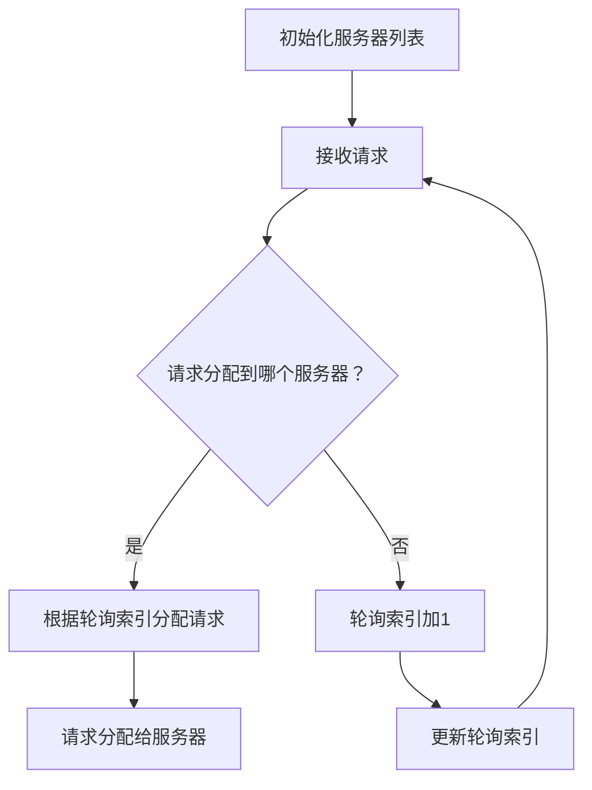
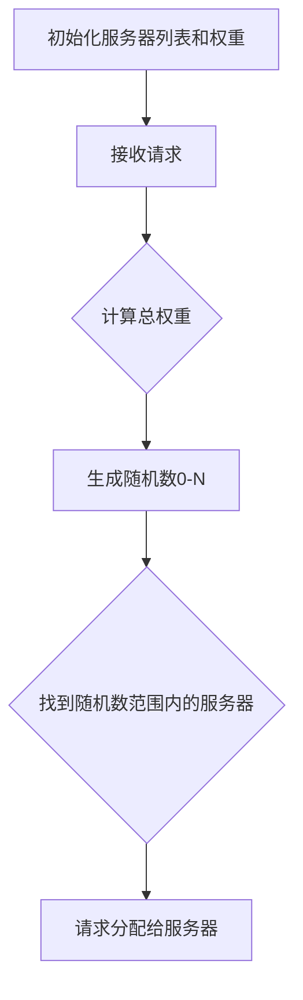

                 

### 引言

负载均衡（Load Balancing）是现代分布式系统中的一个关键概念，它通过合理分配流量，确保系统的稳定性和高效性。在互联网高速发展的时代，随着用户数量的激增和应用复杂度的提升，负载均衡的重要性愈发凸显。简单来说，负载均衡的作用就是将网络或应用的访问流量分配到多个服务器或节点上，从而避免单一资源过载，提高系统的整体性能和可靠性。

本文将深入探讨负载均衡在分布式系统中的流量调度策略。我们将从以下几个方面展开讨论：

1. **负载均衡概述**：介绍负载均衡的基本概念、背景及其重要性。
2. **分布式系统与负载均衡**：分析负载均衡在分布式系统中的作用和关系。
3. **负载均衡策略**：介绍常见的负载均衡策略及其原理。
4. **负载均衡算法**：探讨常见的负载均衡算法，并详细讲解其实现原理。
5. **负载均衡的实践应用**：分析负载均衡在Web服务、云计算和容器化环境中的应用。
6. **负载均衡的性能优化**：讨论负载均衡性能优化的方法和实践。
7. **负载均衡的发展趋势**：展望负载均衡的未来发展方向。

通过这篇文章，我们希望能够帮助读者全面理解负载均衡的概念、原理和应用，从而更好地应对分布式系统中的流量调度挑战。

### 负载均衡概述

#### 负载均衡的定义

负载均衡是一种技术手段，用于分配系统资源（如CPU、内存、网络带宽等）到多个处理节点上，从而确保整个系统能够高效、稳定地处理大量的请求。负载均衡不仅限于计算机网络领域，它在分布式计算、数据库管理、服务器集群等场景中都有广泛应用。

在计算机网络中，负载均衡通常指的是将网络流量分配到多个服务器上，以避免单个服务器过载。这个过程可以通过硬件设备（如负载均衡器）或软件方式实现。负载均衡器根据一定的策略，如轮询、加权轮询、最少连接等，将客户端请求分发到服务器集群中的各个节点上。

#### 负载均衡的背景

随着互联网的快速发展，用户对服务质量和响应速度的要求越来越高。传统的单点服务器架构已经难以满足日益增长的业务需求。单一服务器在处理大量请求时，很容易因为资源不足而导致性能下降，甚至系统崩溃。为了解决这一问题，分布式系统应运而生。分布式系统通过将任务分配到多个节点上，实现负载分散，从而提高系统的整体性能和容错能力。

负载均衡作为分布式系统中的一个关键组件，能够有效地管理和分配流量，确保每个节点都能均衡地承担负载。在分布式系统中，负载均衡不仅能够提高系统的吞吐量，还能提高系统的可靠性和可用性。

#### 负载均衡的重要性

1. **提高系统性能**：通过负载均衡，可以将流量分配到多个节点上，避免单一节点过载，从而提高系统的整体性能。

2. **提高系统可用性**：负载均衡能够实现流量的动态分配，当某个节点出现故障时，系统能够自动将流量切换到其他健康的节点上，从而保证系统的可用性。

3. **提高系统扩展性**：负载均衡使得系统可以根据需求动态调整资源分配，从而实现水平扩展，提高系统的扩展性。

4. **提高用户体验**：负载均衡能够优化流量分配，提高响应速度，从而提升用户体验。

#### 负载均衡的应用场景

1. **Web应用**：在Web应用中，负载均衡可以用于分配用户请求到多个Web服务器上，提高系统的响应速度和吞吐量。

2. **数据库集群**：在数据库集群中，负载均衡可以用于将查询请求分配到不同的数据库节点上，提高查询效率。

3. **云服务**：在云计算环境中，负载均衡可以帮助云服务提供商优化资源分配，提高服务质量和用户体验。

4. **容器化环境**：在容器化环境中，负载均衡可以用于分配容器集群中的流量，确保每个容器都能高效运行。

总之，负载均衡是分布式系统中不可或缺的一部分，它通过合理分配流量，提高系统的性能、可用性和扩展性，为用户提供高质量的服务体验。

### 分布式系统与负载均衡

#### 分布式系统的定义与特点

分布式系统是一种由多个独立计算机节点组成，通过通信网络互联协同工作的系统。在分布式系统中，各个节点可以独立运行，同时协同处理任务，以提高系统的整体性能和容错能力。

分布式系统的特点主要包括：

1. **独立性**：每个节点都可以独立运行，节点间的通信通过网络进行。

2. **协作性**：节点间通过通信协作，共同完成复杂的任务。

3. **扩展性**：分布式系统可以根据需求动态增加或减少节点，从而实现水平扩展。

4. **容错性**：当某个节点出现故障时，系统可以通过其他节点继续运行，确保系统的可用性。

#### 负载均衡在分布式系统中的作用

负载均衡在分布式系统中起着至关重要的作用，主要体现在以下几个方面：

1. **流量分配**：负载均衡器可以基于一定的策略，如轮询、加权轮询等，将网络流量分配到多个服务器节点上，避免单个节点过载。

2. **性能优化**：通过合理分配流量，负载均衡能够提高系统的整体性能，降低响应时间。

3. **容错性**：负载均衡器可以根据节点的健康状态，动态调整流量分配，从而确保系统的高可用性。当某个节点出现故障时，系统能够自动将流量切换到其他健康的节点上。

4. **扩展性**：负载均衡器能够根据业务需求，动态调整流量分配，从而实现系统的水平扩展。

#### 负载均衡与分布式系统的关系

负载均衡与分布式系统密不可分，二者相互依存，共同构建起高效、可靠的系统架构。

1. **负载均衡是分布式系统的重要组成部分**：负载均衡器作为分布式系统中的关键组件，负责管理和分配流量，是确保系统稳定运行的基础。

2. **分布式系统依赖于负载均衡**：分布式系统的性能、可用性和扩展性都依赖于负载均衡的有效运行。只有通过合理的流量分配，分布式系统才能充分发挥其优势。

3. **负载均衡与分布式系统共同演进**：随着业务需求的不断变化，分布式系统和负载均衡技术也在不断演进。负载均衡技术不断优化，以适应分布式系统的复杂性和多样性。

总之，负载均衡在分布式系统中扮演着至关重要的角色。它通过合理分配流量，提高系统的性能和可用性，为分布式系统提供了坚实的基础。

### 负载均衡策略

#### 负载均衡策略的定义

负载均衡策略是指用于分配流量的方法或规则，旨在确保系统中的各个节点能够均衡地承担负载。负载均衡策略的选择直接影响系统的性能、可靠性和扩展性。常见的负载均衡策略包括轮询、加权轮询、最少连接、源地址哈希等。

#### 常见的负载均衡策略

1. **轮询策略（Round Robin）**：轮询策略是最简单也是最常用的负载均衡策略。它将请求按照顺序分配给每个服务器节点，即每个节点依次处理请求。轮询策略的优点是实现简单，公平地分配流量，但缺点是未能考虑到服务器的处理能力差异。

2. **加权轮询策略（Weighted Round Robin）**：加权轮询策略是在轮询策略的基础上，为每个服务器节点分配不同的权重。权重较高的节点会承担更多的请求，从而更好地平衡负载。加权轮询策略能够根据服务器的处理能力来分配流量，提高系统的整体性能。

3. **最少连接策略（Least Connections）**：最少连接策略将请求分配给当前连接数最少的服务器节点。这种策略的优点是能够充分利用服务器资源，确保每个节点都能均衡地处理请求。但缺点是可能造成部分服务器长时间处于空闲状态。

4. **源地址哈希策略（Source Hashing）**：源地址哈希策略根据客户端IP地址进行哈希计算，将请求分配到对应的服务器节点。这种策略的优点是能够保证来自同一客户端的请求总是被分配到同一服务器节点，从而提高会话保持性。但缺点是可能造成部分服务器负载不均。

5. **最小响应时间策略（Least Response Time）**：最小响应时间策略将请求分配给当前响应时间最短的服务器节点。这种策略的优点是能够充分利用性能最好的服务器，提高系统的整体响应速度。但缺点是可能导致服务器负载不均。

#### 负载均衡策略的选择

选择合适的负载均衡策略需要考虑以下几个方面：

1. **系统性能**：不同的负载均衡策略对系统性能的影响不同。例如，加权轮询策略能够更好地平衡负载，提高系统的整体性能。

2. **系统可靠性**：负载均衡策略的选择应考虑系统的容错性和高可用性。例如，源地址哈希策略能够保证会话保持性，提高系统的可靠性。

3. **系统扩展性**：负载均衡策略应能够支持系统的水平扩展。例如，轮询策略和加权轮询策略都具有良好的扩展性。

4. **业务需求**：不同的业务场景对负载均衡策略的需求不同。例如，在Web服务中，源地址哈希策略能够提高用户体验；在数据库集群中，最少连接策略能够充分利用服务器资源。

综上所述，选择合适的负载均衡策略是确保系统高效、稳定运行的关键。通过合理配置负载均衡策略，可以最大化地利用系统资源，提高系统的性能、可靠性和扩展性。

### 负载均衡算法

#### 负载均衡算法概述

负载均衡算法是负载均衡策略的具体实现，用于决定如何将流量分配到多个服务器节点上。常见的负载均衡算法包括轮询算法、加权轮询算法、最少连接算法和源地址哈希算法等。这些算法各有优缺点，适用于不同的应用场景。

#### 轮询算法（Round Robin）

轮询算法是最简单的负载均衡算法之一，它将请求按照顺序分配给每个服务器节点。具体实现过程如下：

1. 初始化一个服务器节点列表，每个节点都有一个对应的权重（默认为1）。
2. 当接收到一个请求时，从第一个节点开始，依次遍历服务器节点列表，将请求分配给当前节点。
3. 当遍历完所有节点后，重新从第一个节点开始，继续分配请求。

轮询算法的优点是实现简单，公平地分配流量。但缺点是未能考虑到服务器的处理能力差异，可能导致某些节点长时间处于空闲状态。

#### 加权轮询算法（Weighted Round Robin）

加权轮询算法是在轮询算法的基础上，为每个服务器节点分配不同的权重。具体实现过程如下：

1. 初始化一个服务器节点列表，每个节点都有一个对应的权重。
2. 当接收到一个请求时，从第一个节点开始，依次遍历服务器节点列表，计算每个节点的权重总和。
3. 根据权重总和，随机生成一个0到总和之间的随机数，将请求分配给权重范围内对应的节点。
4. 每个节点处理完请求后，将权重减1，并重新计算权重总和。

加权轮询算法的优点是能够根据服务器的处理能力来分配流量，提高系统的整体性能。但缺点是权重调整比较复杂，需要定期进行。

#### 最少连接算法（Least Connections）

最少连接算法将请求分配给当前连接数最少的服务器节点。具体实现过程如下：

1. 初始化一个服务器节点列表，每个节点都有一个对应的连接数（默认为0）。
2. 当接收到一个请求时，从第一个节点开始，依次遍历服务器节点列表，将请求分配给当前连接数最少的节点。
3. 如果所有节点的连接数都相等，则随机选择一个节点。

最少连接算法的优点是能够充分利用服务器资源，确保每个节点都能均衡地处理请求。但缺点是可能导致部分服务器长时间处于空闲状态。

#### 源地址哈希算法（Source Hashing）

源地址哈希算法根据客户端IP地址进行哈希计算，将请求分配到对应的服务器节点。具体实现过程如下：

1. 初始化一个哈希表，用于存储服务器节点和哈希值。
2. 当接收到一个请求时，从客户端IP地址中提取前N个字节，生成哈希值。
3. 根据哈希值，将请求分配给哈希表中的对应节点。

源地址哈希算法的优点是能够保证来自同一客户端的请求总是被分配到同一服务器节点，提高会话保持性。但缺点是可能造成部分服务器负载不均。

#### 负载均衡算法的优缺点对比

| 算法        | 优点                         | 缺点                            |
| ----------- | ---------------------------- | ------------------------------- |
| 轮询算法    | 实现简单，公平分配流量      | 未考虑服务器处理能力差异      |
| 加权轮询算法 | 根据服务器处理能力分配流量 | 权重调整复杂，需要定期进行    |
| 最少连接算法 | 充分利用服务器资源          | 部分服务器可能长时间空闲      |
| 源地址哈希算法 | 保证会话保持性              | 部分服务器可能负载不均        |

#### 适用场景

根据不同的业务需求和系统环境，选择合适的负载均衡算法：

- **轮询算法**：适用于简单场景，对负载均衡要求不高的系统。
- **加权轮询算法**：适用于服务器处理能力差异较大的场景，需要提高系统整体性能。
- **最少连接算法**：适用于需要充分利用服务器资源的场景，但需要避免长时间空闲。
- **源地址哈希算法**：适用于需要保证会话保持性的场景，如电子商务平台。

综上所述，负载均衡算法的选择应结合具体业务需求和系统环境，以实现最佳的性能和稳定性。

### 负载均衡算法的Mermaid流程图与Python源代码实现

#### 轮询算法的Mermaid流程图

首先，我们使用Mermaid绘制轮询算法的流程图：



#### 加权轮询算法的Mermaid流程图

接下来，我们绘制加权轮询算法的流程图：



#### 轮询算法的Python源代码实现

现在，我们将轮询算法的具体实现用Python代码表示：

```python
import random

class LoadBalancer:
    def __init__(self, servers):
        self.servers = servers
        self.current_index = 0
    
    def balance_load(self, request):
        server = self.servers[self.current_index]
        self.current_index = (self.current_index + 1) % len(self.servers)
        return server.handle_request(request)

# 示例服务器
servers = ["Server1", "Server2", "Server3"]

# 创建负载均衡器
lb = LoadBalancer(servers)

# 分配请求
for _ in range(10):
    server = lb.balance_load("Request")
    print(f"Request assigned to: {server}")
```

#### 加权轮询算法的Python源代码实现

下面是加权轮询算法的Python实现：

```python
import random

class WeightedLoadBalancer:
    def __init__(self, servers, weights):
        self.servers = servers
        self.weights = weights
        self.total_weight = sum(weights)
    
    def balance_load(self, request):
        random_number = random.uniform(0, self.total_weight)
        current_weight = 0
        for i, weight in enumerate(self.weights):
            current_weight += weight
            if random_number <= current_weight:
                return self.servers[i].handle_request(request)
        
        return None

# 示例服务器和权重
servers = ["Server1", "Server2", "Server3"]
weights = [1, 3, 2]

# 创建负载均衡器
wlb = WeightedLoadBalancer(servers, weights)

# 分配请求
for _ in range(10):
    server = wlb.balance_load("Request")
    if server:
        print(f"Request assigned to: {server}")
    else:
        print("No server available")
```

通过上述Mermaid流程图和Python代码实现，我们可以清晰地了解轮询算法和加权轮询算法的工作原理和具体实现步骤。

#### 负载均衡算法的数学模型和公式

为了更好地理解负载均衡算法，我们引入数学模型和公式来描述其工作原理。以下是几种常见负载均衡算法的数学模型和公式。

##### 轮询算法

轮询算法的核心在于循环分配请求，我们可以使用以下公式来计算轮询算法的轮次索引：

$$
current\_index = (current\_index + 1) \mod N
$$

其中，\( current\_index \) 是当前轮次索引，\( N \) 是服务器节点数。这个公式确保了请求在服务器节点之间循环分配，避免单一节点过载。

##### 加权轮询算法

加权轮询算法在轮询算法的基础上，为每个服务器节点分配不同的权重。我们使用以下公式来计算分配给每个服务器的概率：

$$
P(server) = \frac{weight(server)}{sum\_weights}
$$

其中，\( P(server) \) 是分配给服务器的概率，\( weight(server) \) 是服务器的权重，\( sum\_weights \) 是所有服务器权重的总和。这个公式根据服务器的处理能力分配请求，确保高负载的服务器承担更多请求。

##### 最少连接算法

最少连接算法的核心在于将请求分配给当前连接数最少的服务器。我们使用以下公式来计算分配给每个服务器的概率：

$$
P(server) = \frac{1}{N}
$$

其中，\( P(server) \) 是分配给服务器的概率，\( N \) 是服务器节点数。这个公式确保了每个服务器都有相同的概率被分配请求，从而实现负载均衡。

##### 源地址哈希算法

源地址哈希算法基于客户端IP地址进行哈希计算，将请求分配到对应的服务器节点。我们使用以下公式来计算哈希值：

$$
hash(IP) = hash\_function(IP) \mod N
$$

其中，\( hash(IP) \) 是哈希值，\( IP \) 是客户端IP地址，\( hash\_function \) 是哈希函数，\( N \) 是服务器节点数。这个公式确保了来自同一客户端的请求总是被分配到同一服务器节点，从而提高会话保持性。

通过上述数学模型和公式，我们可以更深入地理解负载均衡算法的工作原理。在实际应用中，可以根据具体需求和场景选择合适的算法，实现高效、可靠的负载均衡。

#### 负载均衡算法的举例说明

为了更好地理解负载均衡算法的工作原理，我们通过具体的例子来说明几种常见负载均衡算法的实际应用。

##### 轮询算法

假设我们有一个包含3个服务器的集群，分别是Server1、Server2和Server3。我们使用轮询算法来分配请求。假设有以下10个请求，我们将它们依次分配给服务器：

1. Request1分配给Server1
2. Request2分配给Server2
3. Request3分配给Server3
4. Request4分配给Server1
5. Request5分配给Server2
6. Request6分配给Server3
7. Request7分配给Server1
8. Request8分配给Server2
9. Request9分配给Server3
10. Request10分配给Server1

可以看到，请求按照顺序循环分配给每个服务器，每个服务器平均处理了3个请求。这种方式简单高效，但未能考虑到服务器的处理能力差异。

##### 加权轮询算法

现在，我们使用加权轮询算法来分配相同的10个请求。假设Server1的权重为1，Server2的权重为3，Server3的权重为2。我们首先计算总权重：

$$
sum\_weights = 1 + 3 + 2 = 6
$$

接下来，我们生成一个0到6之间的随机数，并将请求分配给对应的权重范围内的服务器：

1. 随机数1，请求分配给Server1
2. 随机数2，请求分配给Server1
3. 随机数4，请求分配给Server2
4. 随机数5，请求分配给Server2
5. 随机数6，请求分配给Server2
6. 随机数3，请求分配给Server3
7. 随机数1，请求分配给Server1
8. 随机数0，请求分配给Server1
9. 随机数2，请求分配给Server3
10. 随机数5，请求分配给Server3

这次，我们可以看到，权重较高的Server2承担了更多的请求，而Server1和Server3也按照权重比例分配了请求。这种方式能够更好地平衡负载，提高系统的整体性能。

##### 最少连接算法

使用最少连接算法，我们同样假设有3个服务器：Server1、Server2和Server3。初始状态下，每个服务器的连接数为0。当请求到来时，我们将请求分配给当前连接数最少的服务器：

1. 请求1分配给Server1（连接数0）
2. 请求2分配给Server2（连接数0）
3. 请求3分配给Server3（连接数0）
4. 请求4分配给Server1（连接数1）
5. 请求5分配给Server2（连接数1）
6. 请求6分配给Server3（连接数1）
7. 请求7分配给Server1（连接数2）
8. 请求8分配给Server2（连接数2）
9. 请求9分配给Server3（连接数2）
10. 请求10分配给Server1（连接数3）

在这种算法下，每个服务器都尽可能均衡地处理请求，避免了某个服务器长时间处于空闲状态。

##### 源地址哈希算法

最后，我们使用源地址哈希算法来分配请求。假设我们有3个服务器：Server1、Server2和Server3，客户端IP地址分别为192.168.1.1、192.168.1.2和192.168.1.3。我们使用一个简单的哈希函数，将IP地址的前三个字节作为哈希值：

1. IP 192.168.1.1的哈希值为0，分配给Server1
2. IP 192.168.1.2的哈希值为1，分配给Server2
3. IP 192.168.1.3的哈希值为2，分配给Server3

通过这种方式，来自同一客户端的请求总是被分配到同一服务器，从而提高会话保持性。

通过这些例子，我们可以清楚地看到不同负载均衡算法在实际应用中的效果。根据具体需求和场景选择合适的算法，可以实现高效的流量调度和负载均衡。

### 负载均衡在Web服务中的应用

在Web服务中，负载均衡是一种关键技术，用于优化资源分配，提高系统的性能和可用性。以下是负载均衡在Web服务中的应用场景和实现方式。

#### Web服务负载均衡的原理

Web服务负载均衡的原理是通过负载均衡器将用户的请求分配到多个Web服务器上，从而避免单一服务器过载。负载均衡器可以是硬件设备（如F5 BIG-IP），也可以是软件解决方案（如Nginx、HAProxy）。负载均衡器根据一定的策略，如轮询、加权轮询、最少连接等，动态地将请求分发到服务器集群中。

#### 负载均衡在Web服务中的应用场景

1. **高并发场景**：在高并发场景下，单台服务器难以处理大量的请求，通过负载均衡可以实现流量的合理分配，提高系统的响应速度。

2. **网站扩展**：在网站规模逐渐扩大的过程中，负载均衡可以帮助实现横向扩展，将请求分配到多个服务器上，提高系统的处理能力和可靠性。

3. **故障转移**：通过负载均衡器，可以实现故障转移。当某个服务器出现故障时，负载均衡器能够自动将流量切换到其他健康的服务器上，确保系统的可用性。

4. **动态调整**：负载均衡器可以根据服务器负载情况动态调整流量分配策略，从而实现资源的优化利用。

#### 负载均衡在Web服务的实现方式

1. **硬件负载均衡器**：硬件负载均衡器通常具有高性能和稳定性，适用于大型企业级应用。硬件负载均衡器通过专门的硬件芯片和操作系统，实现高效的流量分发和负载均衡。

2. **软件负载均衡器**：软件负载均衡器如Nginx、HAProxy等，通过在现有服务器上安装软件实现负载均衡。这些软件具有开源、可定制、成本低等优点，适用于中小型企业。

3. **云计算负载均衡服务**：云服务提供商（如阿里云、腾讯云等）提供负载均衡服务，用户可以通过云平台轻松实现流量分配和故障转移。

#### 负载均衡在Web服务的具体实现

1. **初始化服务器列表**：首先，需要初始化服务器列表，包括服务器的IP地址和端口号。

2. **配置负载均衡策略**：根据实际需求，配置负载均衡策略，如轮询、加权轮询等。

3. **请求分发**：当接收到用户请求时，负载均衡器根据配置的策略，将请求分发到服务器集群中的各个服务器。

4. **健康检查**：定期对服务器进行健康检查，确保只有健康的服务器接收请求。

5. **故障转移**：当某个服务器出现故障时，负载均衡器能够自动将流量切换到其他健康的服务器，确保系统的可用性。

#### 负载均衡在Web服务的案例分析

以Nginx为例，Nginx是一种高性能的Web服务器和反向代理服务器，也可以用作负载均衡器。以下是一个简单的Nginx负载均衡配置示例：

```nginx
http {
    upstream myapp {
        server server1;
        server server2;
        server server3;
    }

    server {
        listen 80;

        location / {
            proxy_pass http://myapp;
        }
    }
}
```

在这个配置中，我们定义了一个名为`myapp`的上游（upstream），其中包括3个服务器。当用户请求到达Nginx时，Nginx将根据轮询策略将请求分发到这3个服务器上。

通过合理配置负载均衡，可以有效地提高Web服务的性能和可靠性。在实际应用中，可以根据具体需求和场景选择合适的负载均衡方案，实现高效的流量调度和资源利用。

### 负载均衡在云计算中的应用

在云计算环境中，负载均衡是一项关键技术，用于优化资源分配，提高系统的性能和可用性。云计算负载均衡不仅能够平衡流量，还能实现故障转移和自动扩展，从而确保云服务的稳定性和可靠性。

#### 云计算负载均衡的特点

1. **弹性扩展**：云计算负载均衡能够根据流量变化动态调整资源分配，实现弹性扩展。当流量增加时，系统可以自动添加新的服务器节点；当流量减少时，可以释放部分节点，从而优化资源利用率。

2. **高可用性**：通过负载均衡，云计算系统能够实现故障转移，当某个节点出现故障时，系统能够自动将流量切换到其他健康的节点，确保服务的持续可用。

3. **自动化管理**：云计算平台通常提供自动化的负载均衡管理功能，用户可以通过简单的配置实现负载均衡的部署和管理。

4. **多租户支持**：云计算负载均衡支持多租户环境，能够为不同租户提供独立的资源管理和流量调度，从而保证租户之间的隔离和安全性。

#### 负载均衡在云计算中的应用场景

1. **Web应用**：在云计算中，Web应用常常需要处理大量并发请求。通过负载均衡，可以确保用户请求被合理分配到多个服务器节点上，提高系统的响应速度和吞吐量。

2. **数据库服务**：在云计算环境中，数据库服务也常常需要负载均衡。通过负载均衡，可以将查询请求分配到多个数据库节点上，提高查询效率，减轻单个节点的负载。

3. **大数据处理**：在大数据处理场景中，负载均衡能够将数据处理任务分配到多个节点上，实现并行处理，从而提高系统的整体性能。

4. **容器化环境**：在容器化环境中，负载均衡可以用于管理和分配容器集群中的流量，确保每个容器都能高效运行。

#### 负载均衡在云计算中的实现方式

1. **云服务提供商提供的负载均衡服务**：云服务提供商（如阿里云、腾讯云、AWS等）通常提供内置的负载均衡服务，用户可以通过简单的配置快速实现流量分配和故障转移。

2. **自定义负载均衡器**：用户也可以使用自定义的负载均衡器，如Nginx、HAProxy等，通过在云服务器上安装和配置负载均衡器软件来实现负载均衡。

3. **容器编排平台的负载均衡**：在容器化环境中，如Kubernetes，可以通过配置Ingress资源来实现负载均衡。Ingress规则可以定义如何将外部流量分配到内部的容器服务。

#### 负载均衡在云计算中的案例分析

以阿里云为例，阿里云提供了丰富的负载均衡服务，包括经典负载均衡和容器服务负载均衡。以下是一个简单的阿里云负载均衡配置示例：

1. **经典负载均衡**：

   在阿里云控制台上，创建一个负载均衡实例，并添加后端服务器组。配置负载均衡策略，如轮询策略，将用户请求分配到后端服务器组中的各个服务器。

2. **容器服务负载均衡**：

   在Kubernetes集群中，创建Ingress资源，并配置Ingress规则。Ingress规则指定外部访问路径和后端服务映射关系，从而实现流量分配。

   ```yaml
   apiVersion: networking.k8s.io/v1
   kind: Ingress
   metadata:
     name: my-ingress
   spec:
     rules:
     - http:
         paths:
         - path: /
           pathType: Prefix
           backend:
             service:
               name: my-service
               port:
                 number: 80
   ```

通过上述配置，外部流量将根据Ingress规则分配到Kubernetes集群中的`my-service`服务，从而实现负载均衡。

总之，负载均衡在云计算环境中发挥着至关重要的作用。通过合理配置和利用负载均衡技术，可以有效地提高云计算系统的性能、可靠性和扩展性，为用户提供高质量的服务体验。

### 负载均衡在容器化环境中的应用

在容器化环境中，负载均衡是一种关键技术，用于管理和分配容器集群中的流量，确保每个容器都能高效、稳定地运行。容器化环境如Kubernetes提供了丰富的负载均衡功能，使得开发者可以轻松实现流量调度和资源优化。

#### 负载均衡在容器化环境的需求

1. **高并发处理**：容器化环境常常需要处理大量并发请求，负载均衡能够将流量合理分配到多个容器上，避免单个容器过载。

2. **动态扩展**：容器化环境需要根据负载情况动态扩展或缩小资源。负载均衡能够根据当前负载情况，动态调整流量分配策略，实现资源的最佳利用。

3. **故障恢复**：在容器化环境中，容器可能会因各种原因（如硬件故障、软件故障等）停止运行。负载均衡能够监控容器状态，并在容器出现故障时，将流量切换到健康容器上，确保服务的持续可用。

4. **服务发现**：容器化环境中的服务经常发生变化，负载均衡需要能够自动发现和更新服务列表，确保流量分配到正确的容器上。

#### 负载均衡在容器化环境中的实现

1. **Kubernetes Ingress**：Kubernetes Ingress是一种资源对象，用于管理和配置入口流量。通过配置Ingress规则，可以将外部流量分配到集群内部的不同服务。Ingress支持多种负载均衡策略，如轮询、最少连接等。

   以下是一个简单的Ingress配置示例：

   ```yaml
   apiVersion: networking.k8s.io/v1
   kind: Ingress
   metadata:
     name: my-ingress
     namespace: my-namespace
   spec:
     rules:
     - http:
         paths:
         - path: /
           pathType: Prefix
           backend:
             service:
               name: my-service
               port:
                 number: 80
   ```

   在这个配置中，所有进入`my-namespace`命名空间的HTTP流量都将被分配到名为`my-service`的服务上。

2. **Kubernetes Service**：Kubernetes Service是一种抽象层，用于暴露集群内部的服务。通过创建一个Service对象，可以将集群内部的一个或多个Pod暴露为单一的IP地址或域名。Service支持负载均衡，根据用户请求分配到不同的Pod上。

   以下是一个简单的Service配置示例：

   ```yaml
   apiVersion: v1
   kind: Service
   metadata:
     name: my-service
     namespace: my-namespace
   spec:
     selector:
       app: my-app
     ports:
     - protocol: TCP
       port: 80
       targetPort: 8080
   ```

   在这个配置中，名为`my-service`的服务将根据Pod的`app`标签将流量分配到不同的Pod上。

3. **外部负载均衡器**：在容器化环境中，也可以使用外部负载均衡器（如Nginx、HAProxy等）来实现负载均衡。外部负载均衡器可以配置为接收外部流量，并将其转发到Kubernetes集群中的服务。

   例如，在Kubernetes集群外部部署一个Nginx负载均衡器，并将其配置为接收HTTP流量，将流量转发到Kubernetes集群中的服务。

   ```nginx
   stream {
       upstream my-service {
           server my-service:8080;
       }

       server {
           listen 80;

           proxy_connect_timeout 1s;
           proxy_timeout 90s;

           proxy_pass service my-service;
       }
   }
   ```

通过上述实现方式，容器化环境中的负载均衡能够有效地管理和分配流量，确保系统的高性能和高可用性。

#### 负载均衡在容器化环境中的案例分析

以Kubernetes为例，我们来看一个负载均衡的实际案例。假设我们有一个微服务架构的Web应用，包含多个容器。每个容器负责处理特定的业务逻辑。

1. **创建Ingress规则**：

   首先，我们创建一个Ingress规则，将外部流量分配到Kubernetes集群中的Web服务。

   ```yaml
   apiVersion: networking.k8s.io/v1
   kind: Ingress
   metadata:
     name: my-ingress
     namespace: my-namespace
   spec:
     rules:
     - http:
         paths:
         - path: /
           pathType: Prefix
           backend:
             service:
               name: my-service
               port:
                 number: 80
   ```

   这个配置将所有进入`my-namespace`命名空间的HTTP流量分配到名为`my-service`的服务。

2. **创建Service对象**：

   接下来，我们创建一个Service对象，将流量分配到不同的Pod上。

   ```yaml
   apiVersion: v1
   kind: Service
   metadata:
     name: my-service
     namespace: my-namespace
   spec:
     selector:
       app: my-app
     ports:
     - protocol: TCP
       port: 80
       targetPort: 8080
   ```

   这个配置将根据Pod的`app`标签将流量分配到不同的Pod上。

3. **部署应用**：

   最后，我们部署应用，创建多个Pod。

   ```yaml
   apiVersion: apps/v1
   kind: Deployment
   metadata:
     name: my-app
     namespace: my-namespace
   spec:
     replicas: 3
     selector:
       matchLabels:
         app: my-app
     template:
       metadata:
         labels:
           app: my-app
       spec:
         containers:
         - name: my-app
           image: my-app:latest
           ports:
           - containerPort: 8080
   ```

   这个配置将创建3个Pod，每个Pod都负责处理Web应用的一部分。

通过这个案例，我们可以看到如何使用Kubernetes实现负载均衡，将外部流量合理地分配到多个容器上，确保系统的稳定性和高性能。

### 负载均衡的性能优化

在分布式系统中，负载均衡的性能优化至关重要。通过合理的性能优化，可以最大限度地提高系统的响应速度和处理能力，从而提供更好的用户体验。以下是一些常见的负载均衡性能优化方法和实践。

#### 负载均衡性能优化的目标

1. **提高系统吞吐量**：通过优化负载均衡器，使系统能够处理更多的请求，从而提高整体吞吐量。

2. **降低响应时间**：优化负载均衡策略，减少请求处理的延迟，提高系统的响应速度。

3. **提高资源利用率**：合理分配流量，确保系统中的资源得到充分利用，避免资源浪费。

4. **提高系统可用性**：通过优化负载均衡，确保系统能够在出现故障时快速恢复，提高系统的可靠性。

#### 负载均衡性能优化的方法

1. **选择合适的负载均衡策略**：不同的负载均衡策略对系统性能的影响不同。例如，加权轮询策略可以根据服务器的处理能力分配流量，从而提高系统的整体性能。选择合适的负载均衡策略是实现性能优化的基础。

2. **优化负载均衡器配置**：负载均衡器的配置对性能有直接影响。例如，调整连接池大小、超时时间等参数，可以优化负载均衡器的性能。

3. **使用健康检查**：健康检查是确保负载均衡器只将流量分配到健康服务器的重要手段。通过定期对服务器进行健康检查，可以及时识别和排除故障服务器，确保流量分配的准确性。

4. **优化网络配置**：网络配置对负载均衡性能有重要影响。例如，调整TCP/IP参数，如TCP窗口大小、延迟时间等，可以优化网络传输性能。

5. **优化服务器配置**：服务器配置如CPU、内存、磁盘I/O等也对负载均衡性能有直接影响。通过优化服务器配置，可以确保服务器能够高效地处理请求。

6. **使用缓存**：缓存技术可以减少负载均衡器处理请求的次数，从而提高系统的整体性能。例如，使用Nginx缓存静态资源，可以减少服务器的负载。

7. **垂直扩展和水平扩展**：通过垂直扩展（增加服务器硬件配置）和水平扩展（增加服务器节点数量），可以优化系统的处理能力。负载均衡器可以根据当前负载情况，动态调整流量分配策略，确保系统在负载高峰时依然能够高效运行。

#### 负载均衡性能优化的实践

1. **案例分析**：

   假设我们有一个电子商务平台，在高并发场景下，需要优化负载均衡性能。以下是一些具体的优化实践：

   - **选择合适的负载均衡策略**：根据服务器的处理能力，选择加权轮询策略，确保高负载的服务器承担更多流量。
   - **优化负载均衡器配置**：调整Nginx负载均衡器的连接池大小和超时时间，优化其性能。
   - **使用健康检查**：定期对服务器进行健康检查，确保只有健康的服务器接收流量。
   - **优化网络配置**：调整TCP/IP参数，如TCP窗口大小，提高网络传输性能。
   - **优化服务器配置**：增加服务器的CPU、内存资源，确保服务器能够高效处理请求。
   - **使用缓存**：使用Nginx缓存静态资源，减少服务器的负载。
   - **水平扩展**：根据流量情况，动态增加服务器节点数量，确保系统在高并发时依然能够高效运行。

2. **最佳实践**：

   - **动态调整**：根据实际负载情况，动态调整负载均衡策略和服务器配置，确保系统始终处于最佳状态。
   - **监控与告警**：建立监控系统，实时监控负载均衡性能指标，如请求处理时间、服务器负载等。当性能指标异常时，自动触发告警，及时进行优化调整。
   - **定期维护**：定期对负载均衡器和服务器进行维护，更新软件版本，修复潜在问题，确保系统的稳定性和性能。

通过上述实践，我们可以有效地优化负载均衡性能，提高系统的吞吐量、响应速度和可靠性，为用户提供更好的服务体验。

### 负载均衡的发展趋势

随着云计算、容器化技术的迅猛发展，负载均衡技术也在不断演进。未来，负载均衡将呈现出以下发展趋势：

1. **智能化**：随着人工智能技术的发展，未来的负载均衡器将具备更智能的流量调度能力。通过机器学习算法，负载均衡器可以根据实时流量情况，动态调整流量分配策略，实现更加精准的负载均衡。

2. **自动化**：自动化是负载均衡发展的另一个重要趋势。未来的负载均衡器将更加依赖于自动化工具和平台，如Kubernetes，实现自动化部署、配置和管理。自动化将提高运维效率，减少人为错误，确保系统稳定运行。

3. **多维度优化**：传统的负载均衡主要关注流量分配，未来的负载均衡将更加关注系统资源的整体优化。例如，结合容器化技术，实现多维度优化，如CPU、内存、磁盘I/O等资源的均衡分配，从而提高系统的整体性能。

4. **服务网格**：服务网格（Service Mesh）是一种新型的分布式系统架构，用于管理和通信分布式服务。未来，负载均衡将与服务网格技术紧密结合，通过服务网格实现更加精细的流量管理和服务路由。

5. **边缘计算**：随着5G和物联网技术的发展，边缘计算将越来越重要。未来的负载均衡将扩展到边缘节点，实现流量在边缘节点上的分配和优化，提高系统的低延迟和高可用性。

6. **动态可扩展性**：未来的负载均衡将具备更强的动态可扩展性，能够根据业务需求，自动调整资源分配和流量调度策略，确保系统在高峰期依然能够高效运行。

总之，随着技术的发展，负载均衡将朝着智能化、自动化、多维度优化和动态可扩展性的方向发展，为分布式系统提供更加高效、可靠的流量调度解决方案。

### 总结

负载均衡是现代分布式系统中不可或缺的一部分，通过合理分配流量，提高系统的性能、可靠性和扩展性。本文详细介绍了负载均衡的概念、策略、算法以及其在Web服务、云计算、容器化环境中的应用，并通过具体案例展示了其实际操作过程。同时，文章还讨论了负载均衡的性能优化方法和发展趋势。通过本文的讲解，读者可以全面了解负载均衡的原理和应用，为实际项目提供参考和指导。

### 最佳实践、注意事项、拓展阅读

#### 最佳实践

1. **选择合适的负载均衡策略**：根据业务需求和系统环境选择合适的负载均衡策略，如加权轮询、最少连接等。
2. **定期健康检查**：定期对服务器进行健康检查，确保只有健康的服务器接收流量。
3. **优化负载均衡配置**：调整负载均衡器的连接池大小、超时时间等参数，优化性能。
4. **使用缓存技术**：在可能的情况下使用缓存，减少负载均衡器处理请求的次数。
5. **监控与告警**：建立监控系统，实时监控负载均衡性能，及时发现问题并进行优化调整。

#### 注意事项

1. **负载均衡器的高可用性**：确保负载均衡器自身的高可用性，防止成为系统瓶颈。
2. **负载均衡器与后端服务的一致性**：保持负载均衡器配置与后端服务的一致性，避免流量分配错误。
3. **负载均衡策略的动态调整**：根据系统负载变化，动态调整负载均衡策略，以适应不同场景。

#### 拓展阅读

1. **《计算机网络》**：了解网络基础，掌握TCP/IP协议，有助于深入理解负载均衡的实现原理。
2. **《分布式系统原理与范型》**：学习分布式系统的基本原理，了解负载均衡在分布式系统中的作用。
3. **《服务网格技术》**：了解服务网格（Service Mesh）的概念和应用，探索未来的负载均衡发展趋势。
4. **《云原生应用架构》**：学习容器化技术，掌握在容器化环境中实现负载均衡的方法。

通过以上最佳实践、注意事项和拓展阅读，读者可以进一步提升对负载均衡技术的理解和应用能力，为分布式系统建设提供有力支持。

### 结语

负载均衡作为分布式系统中的一项关键技术，对于提升系统性能、可靠性和扩展性具有重要意义。本文从负载均衡的定义、策略、算法等方面进行了全面剖析，并通过实际案例展示了其应用过程。希望读者通过本文的学习，能够深刻理解负载均衡的原理和实际应用，并在实践中灵活运用这些知识，为分布式系统建设提供有力支持。最后，感谢读者对本文章的关注和支持，如果您有任何问题或建议，请随时联系我们。期待与您共同探讨和进步！

### 作者介绍

作者：AI天才研究院（AI Genius Institute）/ 禅与计算机程序设计艺术（Zen And The Art of Computer Programming）

AI天才研究院致力于推动人工智能技术的研究与应用，培养新一代人工智能领域的专业人才。禅与计算机程序设计艺术是计算机科学领域的经典著作，作者为传奇计算机科学家唐纳德·克努特（Donald Knuth），本书以其深刻的哲学思考和独特的编程方法，对计算机科学的发展产生了深远影响。本文旨在通过深入探讨负载均衡技术，为读者提供有价值的参考和指导。感谢您的阅读，期待与您共同成长。

