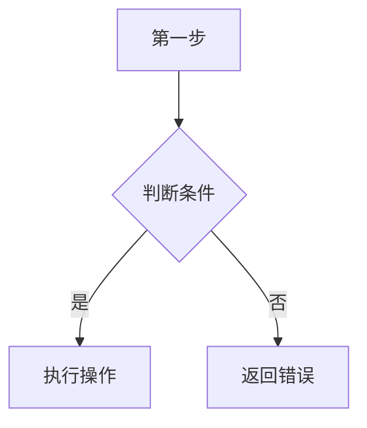

                 

# 跨文化技术团队的管理之道

## 关键词

- 跨文化管理
- 技术团队
- 团队协作
- 领导力
- 沟通技巧
- 冲突解决

## 摘要

随着全球化的深入发展，跨国技术团队的组建和运营越来越普遍。然而，文化差异带来的沟通障碍和冲突管理成为了跨文化技术团队面临的重大挑战。本文将从跨文化团队的概述、基础理论、管理方法、项目实践和案例分析等多个角度，探讨跨文化技术团队的管理之道，以期为企业提供有效的管理策略和最佳实践。

## 第一部分：导论

### 第1章：跨文化技术团队的概述

#### 1.1 问题背景与核心概念

全球化进程的加速使得跨国企业越来越注重跨文化团队的建设。然而，不同文化背景下的员工在价值观、沟通方式和工作习惯等方面存在差异，这些差异往往会影响团队协作效率，甚至导致项目失败。因此，研究跨文化技术团队的管理之道，具有重要的现实意义。

#### 1.2 跨文化团队的重要性

跨文化团队能够汇聚来自不同国家的优秀人才，充分发挥各自的优势，提高技术创新能力和市场竞争力。同时，跨文化团队的管理有助于企业拓展国际市场，增强企业国际化的综合实力。

#### 1.3 跨文化团队面临的挑战

跨文化团队在沟通、协作、冲突管理和领导力等方面面临着诸多挑战。如何克服这些挑战，实现团队的高效运作，是本文要探讨的核心问题。

## 第二部分：跨文化研究基础

### 第2章：跨文化研究基础

#### 2.1 跨文化理论概述

跨文化研究涉及多个学科，如心理学、社会学、人类学等。本文将简要介绍一些主要的理论框架，为后续章节的探讨提供理论基础。

#### 2.2 文化与个人行为

文化对个人行为有着深远的影响。本文将分析文化对价值观、沟通方式、工作态度等方面的影响，为跨文化团队管理提供启示。

#### 2.3 文化差异对技术团队的影响

文化差异对技术团队的影响主要体现在沟通障碍、工作风格冲突和项目管理等方面。本文将结合实例，探讨这些影响及应对策略。

#### 2.4 跨文化沟通原则

有效的跨文化沟通是跨文化团队成功运作的关键。本文将介绍一些跨文化沟通的基本原则和技巧，帮助团队成员建立良好的沟通机制。

## 第三部分：跨文化团队管理方法

### 第3章：建立有效的跨文化团队

#### 3.1 团队组建与人员配置

团队组建和人员配置是跨文化团队管理的第一步。本文将探讨如何根据项目需求，选择合适的团队成员，实现最佳的人员配置。

#### 3.2 团队文化塑造

团队文化对跨文化团队的发展至关重要。本文将介绍如何塑造具有包容性和合作性的团队文化，提高团队的凝聚力和执行力。

#### 3.3 跨文化团队协作机制

跨文化团队的协作机制是确保团队高效运作的重要保障。本文将讨论如何建立有效的协作机制，促进团队成员之间的沟通和合作。

### 第4章：领导力与跨文化管理

#### 4.1 跨文化领导力概述

跨文化领导力是跨文化团队管理的关键。本文将探讨跨文化领导力的内涵、特点以及如何培养具备跨文化领导力的领导者。

#### 4.2 不同文化背景下的领导风格

不同文化背景下的领导风格各异。本文将分析不同文化背景下的领导风格差异，探讨如何根据团队成员的文化背景调整领导策略。

#### 4.3 领导者跨文化认知与调整策略

领导者需要具备跨文化认知能力，以更好地理解和管理跨文化团队。本文将介绍一些领导者跨文化认知的调整策略，帮助领导者更好地应对跨文化挑战。

### 第5章：跨文化沟通技巧

#### 5.1 沟通障碍与解决策略

跨文化团队面临的沟通障碍主要包括语言障碍、非语言沟通差异等。本文将探讨这些障碍及解决策略，提高跨文化沟通的效率。

#### 5.2 跨文化沟通模型

跨文化沟通模型是指导跨文化团队沟通的有效工具。本文将介绍一些常用的跨文化沟通模型，帮助团队成员更好地理解和适应不同文化背景。

#### 5.3 跨文化会议管理

跨文化会议管理是跨文化沟通的重要组成部分。本文将讨论如何提高跨文化会议的效果，确保会议的顺利进行。

### 第6章：跨文化冲突管理

#### 6.1 冲突的类型与原因

跨文化冲突是跨文化团队面临的重要挑战之一。本文将分析冲突的类型、原因及其对团队的影响。

#### 6.2 冲突的解决策略

解决跨文化冲突需要采取有效的策略。本文将介绍一些解决跨文化冲突的方法，帮助团队成员应对冲突，促进团队和谐。

#### 6.3 跨文化冲突案例分析

通过案例分析，我们可以更好地理解跨文化冲突的解决过程。本文将结合实际案例，探讨跨文化冲突的解决策略。

## 第四部分：跨文化团队项目实践

### 第7章：跨文化团队项目规划与执行

#### 7.1 项目规划与目标设定

项目规划与目标设定是跨文化团队项目成功的关键。本文将讨论如何制定合理的项目规划，设定明确的项目目标。

#### 7.2 项目执行中的跨文化问题

项目执行过程中，跨文化团队可能会面临各种问题。本文将分析这些问题的类型、原因及解决策略。

#### 7.3 项目监控与调整

项目监控与调整是确保项目顺利进行的重要环节。本文将介绍如何进行项目监控，及时调整项目进度和资源分配。

### 第8章：跨文化团队绩效评估

#### 8.1 绩效评估方法

绩效评估是跨文化团队管理的重要手段。本文将探讨如何选择合适的绩效评估方法，确保评估的公正性和有效性。

#### 8.2 跨文化绩效评估难点

跨文化绩效评估面临一些特殊难点。本文将分析这些难点，并提出相应的解决方案。

#### 8.3 绩效评估案例分析

通过案例分析，我们可以更好地理解跨文化绩效评估的实施过程。本文将结合实际案例，探讨跨文化绩效评估的方法和技巧。

### 第9章：跨文化团队发展策略

#### 9.1 团队发展模型

团队发展模型是指导跨文化团队成长的重要工具。本文将介绍一些常用的团队发展模型，帮助团队成员实现持续成长。

#### 9.2 跨文化团队学习与成长

跨文化团队的学习与成长是团队发展的重要保障。本文将讨论如何促进跨文化团队的学习与成长，提高团队的整体素质。

#### 9.3 团队国际化发展策略

团队国际化发展策略是企业国际化战略的重要组成部分。本文将探讨如何制定和实施团队国际化发展策略，提高企业的国际竞争力。

## 第五部分：案例研究与最佳实践

### 第10章：跨文化团队管理案例解析

#### 10.1 案例一：跨国软件公司的跨文化融合

本文将分析一个跨国软件公司在跨文化融合方面的成功经验，探讨其跨文化团队管理策略。

#### 10.2 案例二：国际技术团队的项目管理

本文将分析一个国际技术团队在项目管理方面的实践，探讨如何实现跨国项目的成功。

#### 10.3 案例三：跨文化团队的技术创新实践

本文将分析一个跨文化团队在技术创新方面的实践，探讨如何通过跨文化团队的力量推动技术创新。

### 第11章：最佳实践与未来展望

#### 11.1 跨文化团队管理最佳实践总结

本文将总结跨文化团队管理的最佳实践，为企业的跨文化团队管理提供参考。

#### 11.2 未来跨文化团队管理趋势

未来跨文化团队管理将面临新的挑战和机遇。本文将探讨未来跨文化团队管理的趋势，为企业应对未来挑战提供启示。

#### 11.3 拓展阅读与进一步研究

本文将推荐一些拓展阅读资料，供读者进一步研究跨文化团队管理相关领域。同时，本文还将讨论未来跨文化团队管理研究的前沿问题，为读者提供研究方向。

## 结束语

跨文化技术团队的管理之道是一个复杂且富有挑战性的课题。本文从多个角度探讨了跨文化技术团队的管理方法、项目实践和最佳实践，希望能为企业提供有益的参考。在未来的研究中，我们将继续关注跨文化团队管理的最新动态，为企业的跨文化团队建设提供持续的支持和指导。作者：AI天才研究院/AI Genius Institute & 禅与计算机程序设计艺术/Zen And The Art of Computer Programming

## 附录

本文使用Markdown格式编写，部分章节内容涉及Mermaid流程图和LaTeX公式。以下是相关示例：

### Mermaid流程图示例

### LaTeX公式示例

$$ E=mc^2 $$

$$ 1+1=2 $$

## 参考资料

[1] Hall, E. T. (1976). The Hidden Dimension. New York: Doubleday.

[2] Trompenaars, F., & Hampden-Turner, C. (1998). Riding the Waves of Culture: Understanding Cultural Diversity in Business. McGraw-Hill.

[3] Adler, P. S., & Adler, R. F. (1997). Communication Between Cultures. McGraw-Hill.

[4] Tannen, D. (1990). You Just Don't Understand: Women and Men in Conversation. New York: Ballantine Books.

[5] Hargrove, T. J., & Thomas, J. C. (2002). Managing Conflict in Multicultural Organizations. SAGE Publications.

