                 

# 跨文化技术团队的管理技巧

## 关键词
- 跨文化管理
- 技术团队
- 文化差异
- 沟通策略
- 冲突管理
- 绩效评估

## 摘要
在全球化背景下，跨文化技术团队已成为现代企业中的常态。如何有效管理这样的团队，成为企业管理者和技术人员面临的重要课题。本文通过深入分析跨文化技术团队的现状与挑战，探讨文化差异识别、团队建设与管理、沟通策略、冲突管理以及绩效评估等关键问题，为企业管理者提供实用的管理技巧和策略。

## 第一部分：引入跨文化管理的必要性

### 第1章：跨文化技术团队的现状与挑战

#### 1.1 问题背景
随着信息技术的飞速发展，全球化趋势愈发明显，跨国企业间的技术合作和竞争日益激烈。跨文化技术团队在这种背景下应运而生，其成员来自不同国家，具有不同的文化背景和价值观。这种多样性在带来创新活力的同时，也给团队管理带来了前所未有的挑战。

#### 1.2 问题描述
跨文化技术团队面临的主要挑战包括沟通障碍、文化冲突、团队建设困难以及绩效评估难题。这些问题如果不能有效解决，将严重影响团队的协作效率和工作成果。

#### 1.3 问题解决途径
为了应对这些问题，企业管理者需要采取一系列跨文化管理措施，包括文化差异识别、团队建设与管理、沟通策略、冲突管理和绩效评估等。

#### 1.4 边界与外延
本文主要探讨跨文化技术团队的管理问题，但不涉及文化研究、心理学等其他领域的相关内容。

#### 1.5 概念结构与核心要素组成
跨文化技术团队管理涉及多个核心概念和要素，包括文化差异、沟通策略、团队建设、冲突管理和绩效评估等。这些要素相互关联，共同构成了跨文化技术团队管理的理论基础。

### 第2章：核心概念与联系

#### 2.1 跨文化管理的定义与属性特征对比表格

跨文化管理是指在企业内部，针对不同文化背景的员工，采取一系列管理策略，以促进团队协作、提升工作效率的过程。以下是一个简化的跨文化管理属性特征对比表格：

| 特征         | 定义                                                         | 对比结果                           |
| ------------ | ------------------------------------------------------------ | ---------------------------------- |
| 文化差异     | 不同文化间的差异，如价值观、习惯、语言等                       | 文化差异越大，沟通越困难           |
| 沟通策略     | 在跨文化团队中，为了提高沟通效率，采取的沟通方法和技巧         | 有效的沟通策略可减少误解和冲突     |
| 团队建设     | 通过共同的目标、价值观和信任，将团队成员凝聚在一起的策略       | 建立信任是跨文化团队成功的关键     |
| 冲突管理     | 在跨文化团队中，处理冲突的方法和技巧                           | 合理的冲突管理可提高团队凝聚力     |
| 绩效评估     | 对跨文化团队成员的工作表现进行评估的方法和标准                 | 公平、透明的绩效评估可激励团队成员 |

#### 2.2 跨文化技术团队的特点与挑战

跨文化技术团队具有以下几个特点：

- 成员来自不同国家，具有不同的文化背景和专业知识。
- 团队成员之间的沟通可能受到语言障碍的影响。
- 团队成员可能存在不同的工作习惯和时间观念。
- 团队成员可能面临不同的职业发展和晋升机会。

跨文化技术团队面临的挑战包括：

- 文化差异导致的沟通障碍和冲突。
- 团队成员之间的信任问题。
- 团队协作效率的下降。
- 绩效评估的难题。

#### 2.3 跨文化沟通的ER实体关系图架构

ER（实体-关系）图是数据库设计中的重要工具，可以用来描述跨文化沟通中的实体和关系。以下是一个简化的跨文化沟通ER图示例：

```mermaid
erDiagram
    Communication -> Person : has
    Communication : contains |-> Message
    Message : contains |-> Content
    Person : has |-> Culture
```

在这个ER图中，`Communication`表示沟通活动，`Person`表示团队成员，`Message`表示沟通的内容，`Content`表示具体的信息内容，`Culture`表示团队成员的文化背景。通过这个ER图，可以清晰地描述跨文化沟通中的实体和关系。

## 第二部分：跨文化管理技巧

### 第3章：文化差异识别

#### 3.1 文化差异的分类与表现

文化差异可以分为以下几个方面：

- 语言差异：不同语言的表达方式和语法结构可能导致沟通误解。
- 价值观差异：不同文化背景下，人们对工作、生活、道德等方面的认知和看法可能存在差异。
- 礼仪差异：不同文化背景下，人们对礼仪、礼节、尊重等方面的表现可能有所不同。
- 时间观念差异：不同文化背景下，人们对时间的重要性和利用方式可能存在差异。

以下是一个文化差异分类与表现的示例表格：

| 文化差异类别 | 分类依据       | 表现示例                         |
| ------------ | -------------- | -------------------------------- |
| 语言差异     | 语言表达方式   | 英语国家习惯直接表达，而某些文化背景的国家则更倾向于委婉表达 |
| 价值观差异   | 对工作的态度   | 一些文化背景的国家强调工作与生活的平衡，而另一些则强调工作的高效和成就 |
| 礼仪差异     | 礼仪行为       | 某些文化背景的国家在商业场合中更注重礼节，如交换名片时的礼仪 |
| 时间观念差异 | 对时间的态度   | 一些文化背景的国家认为守时非常重要，而另一些则更加灵活 |

#### 3.2 常见的文化差异案例分析

以下是一个关于文化差异的案例分析：

**案例背景**：
一家跨国公司在全球范围内招募了一名技术经理，负责领导一个跨文化团队。团队成员分别来自美国、中国、印度和巴西。

**案例描述**：
在团队组建初期，由于文化差异，团队成员之间出现了以下问题：

- 语言障碍：美国团队成员使用的专业术语，其他国家的团队成员无法理解。
- 价值观差异：中国团队成员认为团队合作比个人成就更重要，而印度团队成员则更注重个人的职业发展。
- 礼仪差异：巴西团队成员在会议中经常迟到，美国团队成员对此感到不满。
- 时间观念差异：印度团队成员经常加班，而美国团队成员认为这是不合理的。

**案例分析**：
通过分析案例，可以发现：

- 语言障碍可以通过培训和交流来解决。
- 价值观差异需要管理者在团队建设过程中引导和平衡。
- 礼仪差异需要团队成员相互尊重和理解。
- 时间观念差异需要管理者在制定工作计划和考核标准时考虑到不同文化背景的团队成员。

#### 3.3 识别文化差异的方法与工具

以下是一些识别文化差异的方法和工具：

- 问卷调查：通过问卷调查了解团队成员的文化背景和价值观。
- 文化培训：为团队成员提供跨文化管理培训，提高他们的跨文化意识。
- 实地考察：管理者可以通过实地考察了解团队成员的文化环境和工作习惯。
- 文化指南：编写跨文化指南，为团队成员提供有关不同文化背景的信息。

### 第4章：团队建设与管理

#### 4.1 团队文化的重要性

团队文化是团队共同价值观、信仰和行为准则的体现。良好的团队文化可以促进团队成员之间的信任、合作和沟通，提高团队的整体绩效。

以下是一个团队文化重要性示意图：

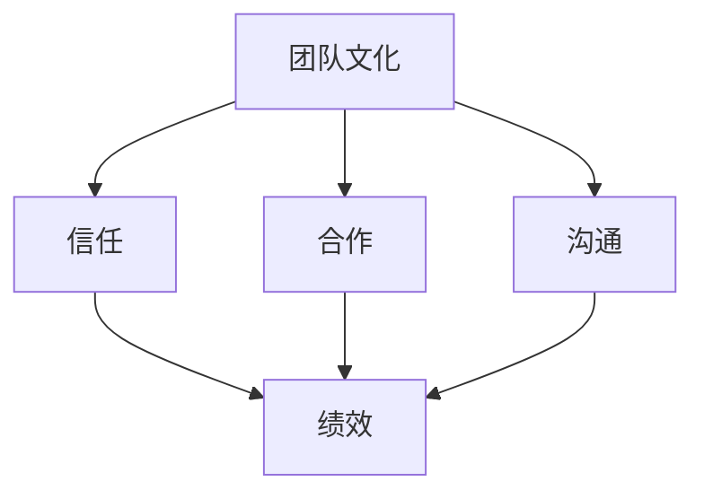

#### 4.2 跨文化团队建设策略

以下是一些跨文化团队建设策略：

- 明确团队目标：确保团队成员对团队目标有清晰的认识，并为之共同努力。
- 建立信任：通过沟通、合作和共同经历，建立团队成员之间的信任。
- 尊重差异：尊重团队成员的文化差异，促进不同文化之间的融合。
- 培养团队精神：通过团队活动和培训，培养团队成员的团队精神。
- 持续改进：不断调整团队建设策略，以适应团队发展需求。

#### 4.3 领导者如何在跨文化团队中发挥影响力

以下是一些领导者如何在跨文化团队中发挥影响力的建议：

- 了解团队成员的文化背景：通过沟通和实地考察，了解团队成员的文化背景和价值观。
- 建立良好的沟通机制：确保团队成员之间的沟通顺畅，减少误解和冲突。
- 引导团队建设：通过培训和活动，引导团队建立良好的团队文化。
- 平衡文化差异：在团队决策过程中，充分考虑不同文化背景的团队成员的意见。
- 激励团队成员：通过激励和奖励，激励团队成员发挥潜力，共同实现团队目标。

### 第5章：沟通策略

#### 5.1 跨文化沟通的原则

以下是一些跨文化沟通的原则：

- 尊重差异：尊重团队成员的文化差异，避免过度批评或贬低。
- 保持开放心态：保持开放的心态，接受和欣赏不同文化的优点。
- 提高沟通效率：采取有效的沟通方法和技巧，提高沟通效率。
- 加强反馈：及时给予反馈，帮助团队成员了解沟通效果。

#### 5.2 沟通障碍与解决策略

以下是一些常见的沟通障碍和解决策略：

| 沟通障碍           | 解决策略                                                     |
| ------------------ | ------------------------------------------------------------ |
| 语言障碍           | 提供语言培训，使用通用语言或翻译服务                         |
| 文化差异           | 提供文化培训，增进对文化差异的理解和尊重                     |
| 信息过载           | 优化信息传递方式，确保关键信息得到准确传达                   |
| 缺乏反馈           | 建立反馈机制，鼓励团队成员主动提问和反馈                     |
| 沟通渠道不畅通     | 优化沟通渠道，确保信息传递的畅通无阻                         |

#### 5.3 跨文化沟通的实践案例

以下是一个关于跨文化沟通的实践案例：

**案例背景**：
一家中国企业在印度设立了一个研发中心，团队由中印两国的技术人员组成。

**案例描述**：
在团队组建初期，由于文化差异和语言障碍，团队成员之间出现了以下问题：

- 语言障碍：中印两国的技术人员在交流时使用不同的语言，导致沟通困难。
- 文化差异：中印两国的技术人员在工作和沟通方式上存在差异，导致协作效率低下。

**案例解决**：

1. 提供语言培训：为印度技术人员提供中文培训，为中方技术人员提供英语培训，提高沟通效率。
2. 文化培训：为两国的技术人员提供文化培训，增进对彼此文化的理解和尊重。
3. 建立跨文化沟通小组：成立一个由中印两国的技术人员组成的沟通小组，负责解决日常沟通中的问题。
4. 优化沟通渠道：建立多渠道沟通机制，如在线会议、邮件、即时通讯工具等，确保信息传递的畅通无阻。

**案例效果**：
通过上述措施，中印两国的技术人员之间的沟通变得更加顺畅，团队协作效率得到了显著提高。

### 第6章：冲突管理

#### 6.1 冲突的类型与原因

跨文化技术团队中常见的冲突类型包括：

- 文化冲突：由于文化差异导致的冲突，如价值观、习惯、礼仪等方面的差异。
- 沟通冲突：由于沟通不畅导致的冲突，如误解、信息过载等。
- 职业发展冲突：由于职业发展机会和晋升机制导致的冲突。
- 利益冲突：由于团队成员之间的利益分配和资源分配导致的冲突。

冲突的原因主要包括：

- 文化差异：文化差异导致团队成员在价值观、习惯等方面存在差异，容易引发冲突。
- 沟通不畅：沟通不畅导致团队成员之间的误解和不满，容易引发冲突。
- 职业发展差异：职业发展机会和晋升机制不合理，导致团队成员之间的竞争和冲突。
- 利益分配问题：利益分配不公，导致团队成员之间的不满和冲突。

#### 6.2 冲突管理的策略

以下是一些冲突管理的策略：

- 预防策略：在团队建设过程中，提前识别潜在的文化差异和冲突，采取预防措施。
- 沟通策略：通过有效的沟通，消除误解和不满，降低冲突发生的概率。
- 合作策略：鼓励团队成员合作，共同解决问题，减少冲突。
- 调解策略：在冲突发生后，通过调解和协商，找到双方都能接受的解决方案。

#### 6.3 跨文化冲突的应对技巧

以下是一些跨文化冲突的应对技巧：

- 了解文化背景：在冲突发生前，了解对方的文化背景和价值观，减少误解。
- 保持冷静：在冲突发生时，保持冷静，避免情绪化，以理性方式处理问题。
- 倾听对方意见：在冲突解决过程中，倾听对方的意见，尊重对方的观点。
- 寻求第三方调解：在冲突难以自行解决时，寻求第三方调解，找到公平合理的解决方案。

### 第7章：多元文化团队的绩效评估

#### 7.1 绩效评估的原则与方法

在跨文化团队中，绩效评估应遵循以下原则：

- 公平性：确保评估标准对所有团队成员都是公平的，不偏袒任何一方。
- 全面性：从多个维度评估团队成员的表现，包括工作质量、工作效率、团队合作等。
- 可衡量性：评估标准应具有可衡量性，能够量化团队成员的表现。
- 及时性：及时给予团队成员反馈，促进其改进和提高。

以下是一些常用的绩效评估方法：

- 定量评估：通过数据分析和量化指标，评估团队成员的工作表现。
- 定性评估：通过主观评价和反馈，评估团队成员的综合素质和工作能力。
- 平行评估：邀请团队成员互相评估，提高评估的客观性和公正性。

#### 7.2 跨文化团队绩效评估的特殊性

跨文化团队绩效评估面临以下特殊性：

- 文化差异：不同文化背景的团队成员可能在绩效评估标准和期望上存在差异。
- 语言障碍：语言障碍可能导致评估过程中信息的误解和误读。
- 时间观念差异：不同文化背景的团队成员可能在工作节奏和效率上存在差异。

#### 7.3 提高跨文化团队绩效的策略

以下是一些提高跨文化团队绩效的策略：

- 文化融合：促进团队成员之间的文化融合，减少文化冲突，提高团队凝聚力。
- 培训和指导：为团队成员提供跨文化培训和指导，提高他们的跨文化意识和沟通能力。
- 激励机制：建立公平、透明的激励机制，激励团队成员积极投入工作，提高绩效。
- 资源共享：优化资源分配，确保团队成员能够公平地获得所需资源，提高工作效率。

## 第三部分：实践与案例分析

### 第8章：成功案例研究

#### 8.1 案例一：跨国公司的跨文化团队建设

**案例背景**：
一家跨国公司在中国、美国和印度设立了研发中心，组建了一个由中、美、印三国技术人员组成的跨文化团队。

**案例描述**：
在团队组建初期，由于文化差异和语言障碍，团队成员之间出现了沟通不畅、合作困难等问题。公司采取了一系列措施，包括：

1. 提供跨文化管理培训，提高团队成员的跨文化意识。
2. 建立跨文化沟通小组，解决日常沟通中的问题。
3. 优化工作流程，确保团队成员之间的协作顺畅。
4. 设立跨文化团队激励计划，激励团队成员积极投入工作。

**案例效果**：
通过上述措施，团队之间的沟通变得顺畅，合作效率提高，项目进展顺利，取得了显著的工作成果。

#### 8.2 案例二：国际技术项目的文化冲突管理

**案例背景**：
一家国际技术项目由中国、美国和法国的三国团队共同参与。

**案例描述**：
在项目执行过程中，由于文化差异和沟通障碍，团队成员之间出现了冲突。项目团队采取了一系列措施，包括：

1. 定期召开跨文化沟通会议，促进团队成员之间的交流和理解。
2. 设立冲突管理小组，及时解决冲突，避免影响项目进度。
3. 提供文化培训，提高团队成员对文化差异的认识和理解。
4. 建立项目共享平台，确保团队成员能够及时获取项目信息。

**案例效果**：
通过上述措施，团队成员之间的冲突得到了有效解决，项目进展顺利，取得了预期的成果。

#### 8.3 案例三：跨文化团队的绩效提升策略

**案例背景**：
一家跨国公司的研发团队由中、美、日三国技术人员组成。

**案例描述**：
在团队管理过程中，公司采取了一系列绩效提升策略，包括：

1. 建立多元化的绩效评估体系，充分考虑不同文化背景的团队成员的绩效表现。
2. 提供跨文化培训和指导，提高团队成员的跨文化沟通能力和团队合作能力。
3. 设立激励机制，激励团队成员积极投入工作，提高绩效。
4. 定期召开团队会议，促进团队成员之间的沟通和协作。

**案例效果**：
通过上述措施，团队成员之间的沟通变得更加顺畅，团队合作效率提高，团队整体绩效显著提升。

### 第9章：实践指南

#### 9.1 跨文化团队管理最佳实践

以下是一些跨文化团队管理的最佳实践：

- 提供跨文化管理培训，提高团队成员的跨文化意识。
- 建立跨文化沟通小组，解决日常沟通中的问题。
- 优化工作流程，确保团队成员之间的协作顺畅。
- 建立多元化的绩效评估体系，充分考虑不同文化背景的团队成员的绩效表现。
- 设立激励机制，激励团队成员积极投入工作，提高绩效。
- 定期召开团队会议，促进团队成员之间的沟通和协作。

#### 9.2 小结与注意事项

跨文化技术团队管理的关键在于尊重文化差异，提高沟通效率，建立信任和合作。以下是一些需要注意的事项：

- 了解团队成员的文化背景，尊重文化差异。
- 加强沟通，确保信息的准确传达。
- 建立信任，促进团队合作。
- 优化绩效评估体系，确保公平、透明。

#### 9.3 拓展阅读与学习资源

以下是一些关于跨文化技术团队管理的拓展阅读和学习资源：

- 《跨文化沟通技巧》
- 《团队管理实战》
- 《绩效管理实战》
- 跨文化管理相关网站和论坛

## 作者信息

作者：AI天才研究院/AI Genius Institute & 禅与计算机程序设计艺术 /Zen And The Art of Computer Programming

## 总结

跨文化技术团队的管理是一个复杂而富有挑战的任务。通过本文的分析和探讨，我们可以看到，尊重文化差异、提高沟通效率、建立信任和合作是成功管理跨文化技术团队的关键。希望本文能为企业管理者提供一些实用的管理技巧和策略，帮助他们在全球化背景下更好地应对跨文化技术团队的管理挑战。## 第一部分：引入跨文化管理的必要性

### 第1章：跨文化技术团队的现状与挑战

在全球化的大背景下，跨文化技术团队已成为现代企业中不可或缺的一部分。随着跨国公司和国际项目的增多，不同文化背景的专业人才汇聚在一起，为企业的创新和发展注入了新的活力。然而，跨文化团队的组建并非一帆风顺，其中充满了挑战和问题。

#### 1.1 问题背景

跨文化技术团队的背景可以分为几个层面：

- **全球化与跨国企业**：跨国公司为了获取全球市场，建立研发中心或办事处，招募来自世界各地的技术人员。
- **国际项目合作**：国际项目常常需要不同国家的团队共同参与，共享资源、知识和技能。
- **文化多样性**：团队成员可能来自不同的国家，有着不同的语言、价值观、习俗和工作方式。

这些因素共同构成了跨文化技术团队的背景，使得团队在沟通、合作和绩效上面临独特的挑战。

#### 1.2 问题描述

跨文化技术团队面临的主要问题包括：

- **沟通障碍**：由于语言和文化差异，团队成员之间的沟通可能变得复杂和困难。
- **文化冲突**：不同文化背景的员工可能对工作方式、价值观和期望有不同的理解，导致冲突。
- **团队建设困难**：建立共同的目标、价值观和信任在多元文化背景下更为复杂。
- **绩效评估难题**：如何公正地评估不同文化背景下的员工绩效成为管理者的一大挑战。

#### 1.3 问题解决途径

为了解决跨文化技术团队面临的问题，管理者可以采取以下途径：

- **文化差异识别**：通过培训和文化交流，识别和理解团队成员的文化背景和价值观。
- **团队建设**：通过共同活动和团队建设活动，增强团队成员之间的信任和合作。
- **沟通策略**：采用有效的沟通技巧和方法，提高团队内部的沟通效率。
- **冲突管理**：建立冲突处理机制，预防和解决文化冲突。
- **绩效评估**：建立多元化、公平透明的绩效评估体系，确保不同文化背景的员工得到公正的评价。

#### 1.4 边界与外延

本文主要关注跨文化技术团队的管理问题，包括文化差异的识别、团队建设、沟通策略、冲突管理和绩效评估。然而，跨文化管理不仅仅局限于技术团队，它适用于所有跨国企业和国际项目。此外，本文讨论的管理技巧和策略是基于理论和实践的结合，旨在提供具有普遍适用性的指导。

#### 1.5 概念结构与核心要素组成

跨文化技术团队管理涉及多个核心概念和要素，包括：

- **文化差异**：不同文化背景的价值观、习惯和沟通方式的差异。
- **沟通策略**：提高跨文化团队内部沟通效率的方法和技巧。
- **团队建设**：通过共同活动和价值观的塑造，增强团队成员之间的合作。
- **冲突管理**：预防和解决团队内部的文化冲突。
- **绩效评估**：建立公正、透明的绩效评估体系。

这些概念和要素相互关联，构成了跨文化技术团队管理的理论基础和实践框架。

### 总结

跨文化技术团队的组建带来了机遇，也带来了挑战。理解文化差异、建立有效的沟通策略、加强团队建设和冲突管理，以及制定公正的绩效评估体系，是管理者成功应对这些挑战的关键。在接下来的章节中，我们将深入探讨这些核心要素，提供实用的管理技巧和策略。

## 第二部分：核心概念与联系

### 第2章：核心概念与联系

#### 2.1 跨文化管理的定义与属性特征对比表格

跨文化管理是指在全球化背景下，企业或组织为应对不同文化背景的员工，采取一系列管理策略和方法，以提高团队协作效率、增强员工满意度和促进组织发展的过程。以下是一个简化的跨文化管理属性特征对比表格：

| 属性特征       | 定义                                                         | 对比结果                           |
| -------------- | ------------------------------------------------------------ | ---------------------------------- |
| 文化差异       | 不同文化之间的差异，包括价值观、习惯、语言等                 | 文化差异越大，沟通越困难           |
| 沟通策略       | 在跨文化团队中，为了提高沟通效率，采取的沟通方法和技巧       | 有效的沟通策略可减少误解和冲突     |
| 团队建设       | 通过共同的目标、价值观和信任，将团队成员凝聚在一起的策略     | 建立信任是跨文化团队成功的关键     |
| 冲突管理       | 在跨文化团队中，处理冲突的方法和技巧                         | 合理的冲突管理可提高团队凝聚力     |
| 绩效评估       | 对跨文化团队成员的工作表现进行评估的方法和标准               | 公平、透明的绩效评估可激励团队成员 |

#### 2.2 跨文化技术团队的特点与挑战

跨文化技术团队的特点主要包括：

- **多样性**：团队成员来自不同的国家和地区，具有不同的文化背景和专业技能。
- **语言差异**：不同的语言背景可能导致沟通障碍，影响团队的协作效率。
- **价值观差异**：不同的文化背景可能导致团队成员对工作、生活、责任和权威有不同的看法，影响团队合作。
- **工作习惯差异**：不同文化背景的团队成员在工作时间、工作方式和工作流程上可能存在差异。

跨文化技术团队面临的挑战包括：

- **沟通障碍**：语言差异和文化差异可能导致信息传递不准确，影响团队协作。
- **文化冲突**：价值观差异和工作习惯差异可能导致团队成员之间的误解和冲突。
- **团队建设**：在多元文化背景下，建立共同的团队目标和价值观更加困难。
- **绩效评估**：如何公正地评估不同文化背景下的员工绩效成为管理者的挑战。

#### 2.3 跨文化沟通的ER实体关系图架构

跨文化沟通的ER（实体-关系）图可以帮助我们理解跨文化沟通中的实体和关系。以下是一个简化的跨文化沟通ER图示例：

```mermaid
erDiagram
    Communication -> Sender : has
    Communication : contains |-> Message
    Message : contains |-> Content
    Sender : has |-> Culture
    Sender : has |-> Language
```

在这个ER图中：

- `Communication` 表示沟通活动。
- `Sender` 表示沟通的发送者，它具有文化背景和语言属性。
- `Message` 表示沟通的内容，包含具体的信息和情感。
- `Content` 表示具体的信息内容。
- `Culture` 表示发送者的文化背景。
- `Language` 表示发送者的语言属性。

通过这个ER图，我们可以清晰地看到跨文化沟通中的主要实体和它们之间的关系，为后续的沟通策略制定提供了基础。

### 总结

跨文化管理涉及多个核心概念和要素，如文化差异、沟通策略、团队建设、冲突管理和绩效评估。通过对比表格和ER图，我们可以更深入地理解这些概念和它们之间的联系，为跨文化技术团队的管理提供理论和实践的基础。在接下来的章节中，我们将逐步探讨这些核心概念的具体应用和实践技巧。

## 第三部分：跨文化管理技巧

### 第3章：文化差异识别

在跨文化技术团队中，文化差异的识别是管理工作的基础。只有充分理解文化差异，才能采取有效的策略来减少沟通障碍和冲突，提高团队协作效率。以下将详细讨论文化差异的分类、常见案例以及识别方法。

#### 3.1 文化差异的分类与表现

文化差异可以分为以下几类：

- **语言差异**：不同语言的表达方式、语法结构和语言习惯可能导致沟通误解。例如，英语中常用的非正式表达可能在某些文化中被视为不礼貌。
- **价值观差异**：不同文化背景下，人们对工作、生活、道德和责任的看法可能存在显著差异。例如，某些文化强调集体主义，而另一些文化则更注重个人主义。
- **习惯差异**：不同文化背景下的生活习惯和工作习惯可能有所不同。例如，时间观念上的差异可能导致一个团队的成员对会议时间安排的理解与另一个团队不同。
- **礼仪差异**：不同文化背景下的礼仪行为和礼仪规范可能存在差异。例如，商务交流中的握手礼在不同文化中可能有不同的含义和方式。

以下是一个简化的文化差异分类与表现的示例表格：

| 文化差异类别 | 分类依据       | 表现示例                         |
| ------------ | -------------- | -------------------------------- |
| 语言差异     | 语言表达方式   | 英语国家习惯直接表达，而某些文化背景的国家则更倾向于委婉表达 |
| 价值观差异   | 对工作的态度   | 一些文化背景的国家强调工作与生活的平衡，而另一些则强调工作的高效和成就 |
| 习惯差异     | 生活和工作习惯 | 某些文化背景的国家工作节奏较快，而另一些则较为缓慢           |
| 礼仪差异     | 礼仪行为       | 某些文化背景的国家在商业场合中更注重礼节，如交换名片时的礼仪 |

#### 3.2 常见的文化差异案例分析

以下是一个关于文化差异的案例分析：

**案例背景**：
一家跨国公司在全球范围内设有多个研发中心，其中包括中国、美国和印度。公司计划将这些研发中心整合，以实现更高效的资源利用和协作。

**案例描述**：
在整合过程中，团队面临以下文化差异：

- **语言差异**：中国和印度团队成员主要使用英语交流，但美国的团队成员则经常使用俚语和行业术语，导致印度和中国的团队成员在理解上存在障碍。
- **价值观差异**：中国和印度团队成员更注重团队的和谐与稳定，倾向于避免冲突，而美国团队成员则更直接、更注重个人成就。
- **习惯差异**：美国团队成员的工作节奏较快，喜欢直接解决问题，而中国和印度团队成员则更喜欢逐步分析和讨论。
- **礼仪差异**：在商务交流中，美国团队成员更倾向于直接表达意见，而中国和印度团队成员则更注重间接表达和关系建立。

**案例分析**：
通过上述案例，我们可以看到文化差异在跨文化团队中的表现。管理者需要通过培训和文化交流来识别和应对这些差异，以减少误解和冲突。

#### 3.3 识别文化差异的方法与工具

以下是一些识别文化差异的方法与工具：

- **问卷调查**：通过问卷调查了解团队成员的文化背景、价值观和工作习惯。问卷设计应涵盖语言、价值观、习惯和礼仪等方面。
- **文化培训**：为团队成员提供文化培训，帮助他们理解和尊重不同文化差异。培训内容应包括文化差异的基本知识和跨文化沟通技巧。
- **文化交流**：组织文化交流活动，如跨文化团队建设工作坊、文化体验活动等，促进团队成员之间的相互了解和尊重。
- **案例研究**：通过研究成功的跨文化团队案例，总结出文化差异识别和管理的方法和技巧。

### 总结

文化差异的识别是跨文化管理的重要一步。通过分类、案例分析和识别方法，我们可以更好地理解和应对文化差异，为跨文化团队的管理提供基础。在接下来的章节中，我们将继续探讨团队建设与管理、沟通策略、冲突管理和绩效评估等关键问题，为企业管理者提供更全面的跨文化管理技巧和策略。

### 第4章：团队建设与管理

#### 4.1 团队文化的重要性

团队文化是团队共同价值观、信仰和行为准则的体现。在一个跨文化技术团队中，建立和维持良好的团队文化尤为重要。以下是一个团队文化重要性示意图：


在这个图中，我们可以看到团队文化对信任、合作和沟通的直接影响，这些因素又共同作用于团队的绩效。良好的团队文化有助于：

- **增强团队成员的归属感和认同感**：通过共同的价值观和行为准则，团队成员更容易产生归属感和认同感，提高工作积极性。
- **促进有效的沟通**：团队文化提供了共同的沟通语言和框架，减少了误解和沟通障碍，提高了团队的协作效率。
- **提高团队凝聚力**：共同的目标和价值观使得团队成员更加团结，在面对挑战时能够共同应对，增强团队的凝聚力。
- **提升绩效**：在一个具有良好团队文化的团队中，成员之间互相支持、协作，能够更高效地完成任务，提升整体绩效。

#### 4.2 跨文化团队建设策略

在跨文化团队中，建设良好的团队文化需要采取一系列策略，以下是一些具体的方法：

- **明确团队目标**：确保所有团队成员对团队目标有清晰的认识和认同。通过设定共同的目标，可以减少文化差异带来的分歧，增强团队的凝聚力。
- **价值观塑造**：通过团队活动和沟通，塑造共同的价值观。这可以包括定期开展团队建设活动，鼓励团队成员分享自己的价值观，并寻找共同点。
- **增强信任**：信任是团队文化的核心，需要通过透明、公正的管理和团队合作来建立。管理者可以通过开放沟通、公平决策和积极反馈来增强团队成员之间的信任。
- **尊重差异**：在团队建设过程中，尊重并接纳团队成员的文化差异。通过提供文化培训和文化交流机会，帮助团队成员更好地理解和接纳不同的文化背景。
- **激励与奖励**：建立公平、透明的激励机制，激励团队成员积极参与团队建设。通过奖励优秀的团队合作和贡献，可以进一步加强团队凝聚力。

以下是一个简化的跨文化团队建设策略示意图：

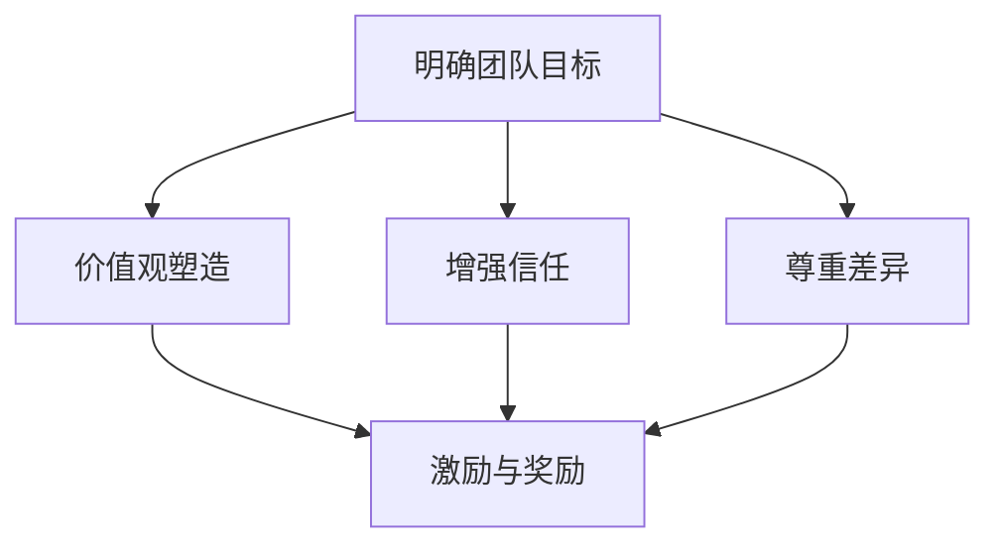

在这个图中，团队目标、价值观塑造、增强信任、尊重差异和激励与奖励相互关联，共同构成了跨文化团队建设的策略框架。

#### 4.3 领导者如何在跨文化团队中发挥影响力

在跨文化团队中，领导者的角色至关重要。以下是一些领导者如何在跨文化团队中发挥影响力的建议：

- **了解团队成员的文化背景**：领导者需要通过沟通和实地考察，了解团队成员的文化背景和价值观。这有助于领导者更好地理解团队动态，采取恰当的管理策略。
- **建立良好的沟通机制**：领导者需要确保团队成员之间的沟通渠道畅通，减少误解和冲突。可以通过定期召开团队会议、建立反馈机制和利用现代沟通工具来实现。
- **引导团队建设**：领导者应通过团队活动和培训，引导团队建立共同的价值观和信任。领导者可以作为榜样，通过自己的行为来影响和激励团队成员。
- **平衡文化差异**：在团队决策过程中，领导者需要充分考虑不同文化背景的团队成员的意见。通过平衡不同的文化观点，可以找到共识，促进团队合作。
- **激励团队成员**：领导者需要建立公平、透明的激励机制，激励团队成员发挥潜力，实现团队目标。这可以通过提供职业发展机会、奖励优秀表现和鼓励创新来实现。

以下是一个简化的领导者影响力示意图：

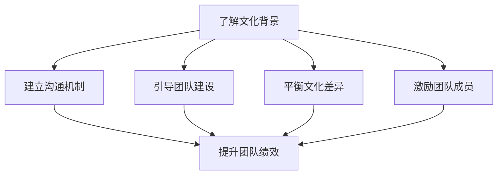

在这个图中，领导者的四个关键行为（了解文化背景、建立沟通机制、引导团队建设和平衡文化差异）以及激励团队成员，共同作用于团队绩效的提升。

### 总结

团队建设与管理是跨文化技术团队成功的关键。通过明确团队目标、塑造共同价值观、增强信任、尊重差异和激励团队成员，领导者可以有效地引导团队建设，提升团队绩效。在接下来的章节中，我们将继续探讨跨文化沟通策略、冲突管理和绩效评估等关键问题，为企业管理者提供更全面的跨文化管理技巧和策略。

### 第5章：沟通策略

在跨文化技术团队中，沟通策略是确保团队高效协作和减少冲突的重要手段。有效的沟通不仅能够传递信息，还能增强团队成员之间的理解和信任。以下将详细讨论跨文化沟通的原则、沟通障碍及其解决策略。

#### 5.1 跨文化沟通的原则

跨文化沟通的原则主要包括以下几个方面：

- **尊重差异**：尊重团队成员的文化背景和价值观，避免因文化差异而产生的误解和冲突。
- **明确性**：确保沟通的信息清晰、明确，减少不必要的歧义。
- **开放性**：鼓励团队成员在沟通中表达自己的观点和感受，促进双向沟通。
- **适应性**：根据不同的文化背景和沟通情境，灵活调整沟通方式和风格。

以下是一个简化的跨文化沟通原则示意图：

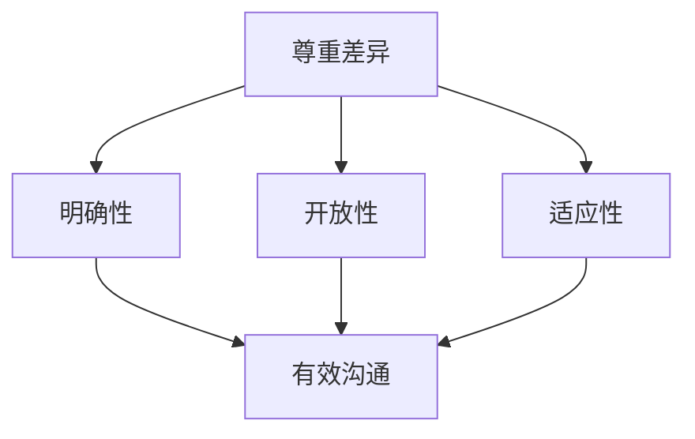

在这个图中，尊重差异、明确性、开放性和适应性共同构成了有效跨文化沟通的基础。

#### 5.2 沟通障碍与解决策略

跨文化沟通中常见的障碍包括语言障碍、文化差异、沟通方式和沟通情境的不同。以下是一些具体的沟通障碍及其解决策略：

- **语言障碍**：
  - **障碍**：团队成员之间的语言不同，可能导致沟通不畅和误解。
  - **解决策略**：提供语言培训，使用共同的语言（如英语）进行交流，或者使用翻译工具辅助沟通。

- **文化差异**：
  - **障碍**：不同的文化背景可能导致对同一问题有不同的看法和解决方案。
  - **解决策略**：进行文化培训，提高团队成员对文化差异的认识和理解，通过文化交流活动增进相互了解。

- **沟通方式**：
  - **障碍**：不同文化背景下的沟通方式可能存在差异，如直接沟通与间接沟通、高语境与低语境沟通。
  - **解决策略**：了解不同文化背景下的沟通偏好，采用适应性沟通策略，确保信息传达的准确性和有效性。

- **沟通情境**：
  - **障碍**：不同的沟通情境（如正式场合与非正式场合）可能导致沟通效果的差异。
  - **解决策略**：根据沟通情境调整沟通方式和内容，确保在不同情境下都能实现有效沟通。

以下是一个简化的沟通障碍与解决策略示意图：

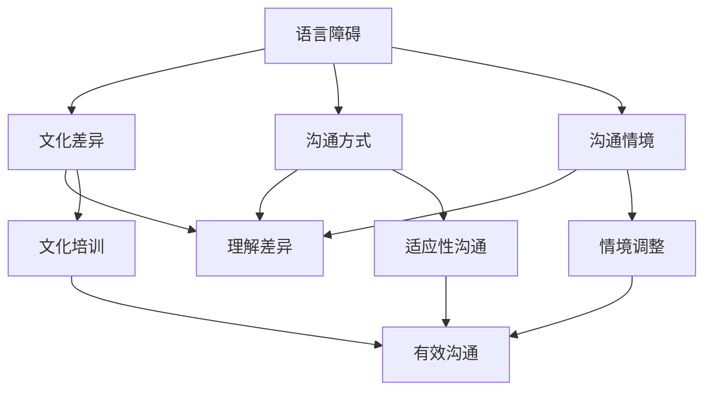

在这个图中，语言障碍、文化差异、沟通方式和沟通情境都是沟通障碍的来源，通过理解差异、文化培训、适应性沟通和情境调整，可以有效解决这些障碍，实现有效沟通。

#### 5.3 跨文化沟通的实践案例

以下是一个关于跨文化沟通的实践案例：

**案例背景**：
一家跨国公司的研发团队由来自中国、美国和印度的成员组成。由于文化差异和语言障碍，团队在项目初期遇到了沟通不畅和合作困难的问题。

**案例描述**：
为了解决沟通问题，团队采取了以下措施：

1. **语言培训**：为团队成员提供英语培训，提高他们的英语水平，确保在共同语言基础上进行沟通。
2. **文化培训**：组织文化培训，帮助团队成员了解不同文化背景下的沟通习惯和价值观。
3. **沟通工具**：引入实时沟通工具（如Zoom、Slack等），确保团队成员可以随时进行交流。
4. **定期会议**：召开定期会议，确保团队成员能够及时分享进度和问题，促进信息传递的准确性。

**案例效果**：
通过上述措施，团队内部的沟通变得更加顺畅，合作效率提高，项目进展顺利，最终取得了预期的成果。

### 总结

跨文化沟通在跨文化技术团队管理中至关重要。通过理解沟通障碍、遵循跨文化沟通原则和采用适当的解决策略，团队可以有效减少误解和冲突，提高协作效率。在接下来的章节中，我们将继续探讨冲突管理和绩效评估等关键问题，为企业管理者提供更全面的跨文化管理技巧和策略。

### 第6章：冲突管理

跨文化技术团队中，冲突是不可避免的。由于文化、价值观和沟通方式的不同，团队成员可能会产生分歧和摩擦。有效的冲突管理是确保团队稳定和高效运作的关键。以下将详细讨论冲突的类型与原因，以及冲突管理的策略和跨文化冲突的应对技巧。

#### 6.1 冲突的类型与原因

在跨文化技术团队中，冲突通常可以分为以下几种类型：

- **沟通冲突**：由于语言障碍和文化差异，团队成员在沟通过程中可能产生误解和矛盾。
- **价值观冲突**：不同文化背景的员工可能在价值观上存在差异，如对工作态度、职业道德和个人自由的看法。
- **职业发展冲突**：团队成员在职业目标、晋升机会和资源分配上可能存在竞争和矛盾。
- **利益冲突**：团队内部或团队之间的利益分配不均可能导致冲突。

以下是一个简化的冲突类型与原因示意图：

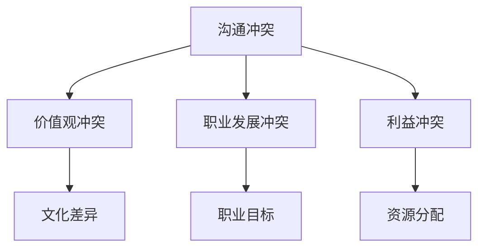

在这个图中，我们可以看到不同类型的冲突及其潜在的原因。

#### 6.2 冲突管理的策略

为了有效管理冲突，管理者可以采取以下策略：

- **预防策略**：在团队组建和项目初期，通过明确的沟通渠道和共同的目标，减少冲突的发生。
- **沟通策略**：通过开放、透明的沟通，促进团队成员之间的理解，避免误解和冲突。
- **合作策略**：鼓励团队成员在遇到问题时共同合作，寻找解决方案，减少对抗性。
- **调解策略**：在冲突发生后，通过调解和协商，找到双方都能接受的解决方案。

以下是一个简化的冲突管理策略示意图：

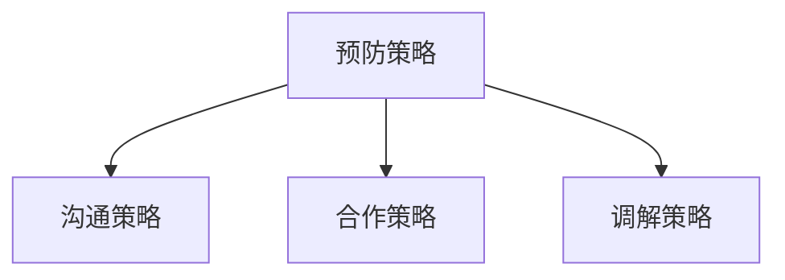

在这个图中，预防策略、沟通策略、合作策略和调解策略共同构成了冲突管理的框架。

#### 6.3 跨文化冲突的应对技巧

在跨文化技术团队中，应对冲突需要特别考虑文化差异。以下是一些具体的应对技巧：

- **了解文化背景**：管理者需要了解团队成员的文化背景，尊重不同的价值观和沟通方式。
- **建立共同目标**：通过共同的目标和价值观，减少文化差异带来的冲突。
- **提供培训**：通过文化差异培训，提高团队成员对文化差异的认识和理解。
- **鼓励交流**：促进团队成员之间的交流，增进相互了解，减少误解和冲突。
- **寻求第三方调解**：在冲突难以自行解决时，可以寻求中立的第三方进行调解。

以下是一个简化的跨文化冲突应对技巧示意图：

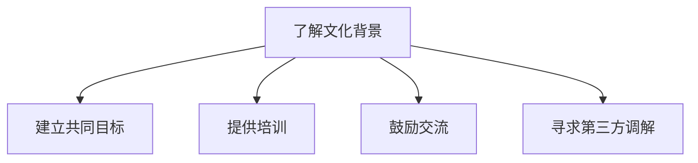

在这个图中，了解文化背景、建立共同目标、提供培训和鼓励交流以及寻求第三方调解是应对跨文化冲突的重要技巧。

### 总结

跨文化技术团队中的冲突管理是一项复杂而重要的任务。通过理解冲突的类型与原因，采取有效的冲突管理策略，以及运用跨文化冲突的应对技巧，管理者可以有效地减少冲突，促进团队稳定和高效运作。在接下来的章节中，我们将探讨多元文化团队的绩效评估，为企业管理者提供更全面的跨文化管理技巧和策略。

### 第7章：多元文化团队的绩效评估

在多元文化团队中，绩效评估是一项具有挑战性的任务，因为它需要平衡不同文化背景下的工作表现，确保评估的公平性和有效性。以下将详细讨论绩效评估的原则与方法，跨文化团队绩效评估的特殊性以及提高绩效的策略。

#### 7.1 绩效评估的原则与方法

有效的绩效评估应遵循以下原则：

- **公平性**：确保评估标准对所有团队成员都是公平的，避免偏见和歧视。
- **全面性**：从多个维度评估团队成员的表现，包括工作质量、工作效率、团队合作和职业发展等。
- **可衡量性**：评估标准应具有可衡量性，确保评估结果能够准确反映团队成员的实际工作表现。
- **及时性**：及时给予团队成员反馈，帮助他们改进和提高。

以下是一些常用的绩效评估方法：

- **定量评估**：通过数据分析和量化指标，如完成的任务数量、项目进度和质量等，评估团队成员的工作表现。
- **定性评估**：通过主观评价和反馈，如领导者的评估、同事的评价和自我评估等，评估团队成员的综合素质和工作能力。
- **360度评估**：邀请团队成员的上级、同事和下属进行评估，从多个角度获取对团队成员工作表现的反馈。
- **平衡计分卡**：结合财务、客户、内部业务流程和学习与成长四个方面，全面评估团队的整体绩效。

以下是一个简化的绩效评估方法示意图：

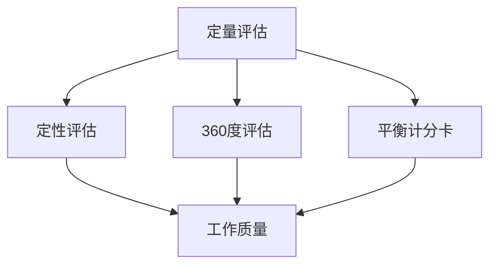

在这个图中，定量评估、定性评估、360度评估和平衡计分卡共同构成了绩效评估的框架。

#### 7.2 跨文化团队绩效评估的特殊性

在多元文化团队中，绩效评估面临以下特殊性：

- **文化差异**：不同文化背景的团队成员可能在价值观、工作习惯和绩效期望上有显著差异，这需要评估者充分考虑。
- **语言障碍**：语言障碍可能导致评估过程中信息的误解和误读，影响评估的准确性。
- **时间观念差异**：不同文化背景下，人们对时间的重要性和利用方式可能存在差异，影响工作节奏和效率。
- **职业发展差异**：不同文化背景的团队成员可能在职业目标和期望上有所不同，这需要评估者关注和平衡。

以下是一个简化的跨文化团队绩效评估特殊性示意图：

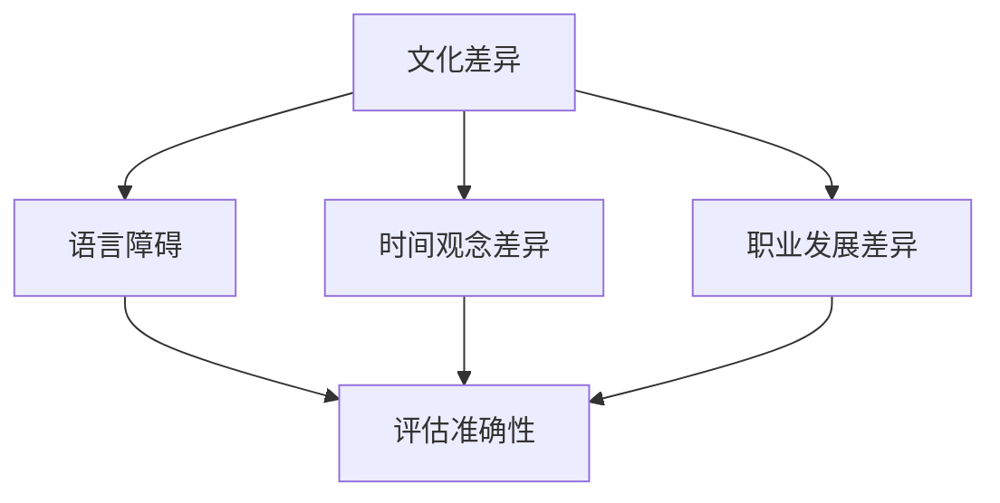

在这个图中，文化差异、语言障碍、时间观念差异和职业发展差异是跨文化团队绩效评估的特殊挑战。

#### 7.3 提高跨文化团队绩效的策略

以下是一些提高跨文化团队绩效的策略：

- **文化融合**：促进团队成员之间的文化融合，减少文化冲突，提高团队凝聚力。
- **培训与指导**：为团队成员提供跨文化培训和指导，提高他们的跨文化沟通能力和团队合作能力。
- **激励与奖励**：建立公平、透明的激励机制，激励团队成员积极投入工作，提高绩效。
- **绩效反馈**：及时给予团队成员绩效反馈，帮助他们了解自己的优势和不足，制定改进计划。
- **资源支持**：确保团队成员能够公平地获得所需资源，如技术支持、培训机会和职业发展机会。

以下是一个简化的提高跨文化团队绩效策略示意图：

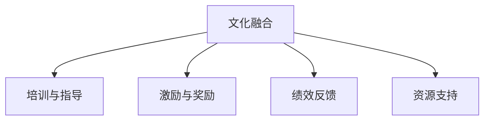

在这个图中，文化融合、培训与指导、激励与奖励、绩效反馈和资源支持共同构成了提高跨文化团队绩效的策略框架。

### 总结

多元文化团队的绩效评估是一个复杂而关键的过程，需要考虑文化差异、语言障碍、时间观念差异和职业发展差异等因素。通过遵循绩效评估原则、采用合适的评估方法，以及实施提高绩效的策略，管理者可以确保评估的公平性和有效性，促进跨文化团队的稳定和高效运作。在接下来的章节中，我们将通过成功案例研究和实践指南，进一步探讨跨文化团队管理的最佳实践和具体操作。

### 第8章：成功案例研究

跨文化团队管理并非易事，但通过成功的案例研究，我们可以学习到一些最佳实践和策略，以应对各种挑战。以下将介绍三个成功案例，探讨跨国公司的跨文化团队建设、国际技术项目的文化冲突管理以及跨文化团队的绩效提升策略。

#### 8.1 案例一：跨国公司的跨文化团队建设

**案例背景**：
某全球知名技术公司在全球范围内设立了多个研发中心，包括美国、中国、印度和德国。为了提升研发效率和创新能力，公司决定将这些研发中心整合为一个跨文化团队。

**案例描述**：
在团队建设初期，公司面临以下挑战：

- **语言障碍**：团队成员来自不同国家，使用的语言包括英语、中文和德语，导致沟通不畅。
- **文化差异**：不同文化背景下，团队成员对工作方式、时间管理和职业发展的期望存在差异。
- **合作难题**：由于文化差异，团队成员在团队合作和决策过程中出现分歧。

公司采取了一系列措施来解决这些问题：

1. **语言培训**：为所有团队成员提供英语培训，确保他们具备基本的英语沟通能力。
2. **文化培训**：组织文化培训，帮助团队成员了解不同文化的价值观和工作习惯。
3. **共同目标**：明确团队目标，确保所有成员对团队目标和期望有共同的理解。
4. **领导力培训**：为领导者提供跨文化管理培训，提高他们在多元文化团队中的领导能力。

**案例效果**：
通过上述措施，团队内部的沟通变得更加顺畅，文化差异带来的冲突减少，团队成员之间的合作更加紧密，研发效率和创新能力得到了显著提升。

#### 8.2 案例二：国际技术项目的文化冲突管理

**案例背景**：
某国际技术项目由中国、美国和法国的三国团队共同参与。项目涉及复杂的技术开发和国际市场推广，要求团队成员紧密合作。

**案例描述**：
在项目执行过程中，团队面临以下文化冲突：

- **沟通障碍**：团队成员的语言和文化背景不同，导致沟通效率低下。
- **时间管理**：不同文化背景下，团队成员对工作时间安排和时间观念存在差异。
- **决策分歧**：在项目决策过程中，团队成员对问题的看法和解决方案存在分歧。

团队采取以下措施来管理文化冲突：

1. **跨文化沟通培训**：为团队成员提供跨文化沟通培训，提高他们的沟通能力和文化敏感度。
2. **设立沟通渠道**：建立多种沟通渠道，如视频会议、即时通讯和电子邮件，确保信息传递的及时性和准确性。
3. **文化适配策略**：根据团队成员的文化背景，调整项目的工作流程和时间安排，以适应不同文化的要求。
4. **共同决策**：在项目决策过程中，鼓励团队成员发表意见，通过协商找到共识。

**案例效果**：
通过上述措施，团队内部的沟通变得更加顺畅，文化冲突得到有效管理，项目进展顺利，最终达到了预期的目标。

#### 8.3 案例三：跨文化团队的绩效提升策略

**案例背景**：
某跨国公司在全球范围内设立了多个研发中心，团队成员来自不同的国家，包括美国、印度、巴西和德国。公司希望在保持创新力的同时，提升整体绩效。

**案例描述**：
为了提升跨文化团队的绩效，公司采取了一系列策略：

1. **绩效评估体系**：建立多元化、公平透明的绩效评估体系，充分考虑不同文化背景的团队成员的绩效表现。
2. **激励机制**：设立激励机制，激励团队成员积极投入工作，提高绩效。
3. **跨文化培训**：为团队成员提供跨文化培训和指导，提高他们的跨文化沟通能力和团队合作能力。
4. **资源支持**：确保团队成员能够公平地获得所需资源，如技术支持、培训机会和职业发展机会。

**案例效果**：
通过上述策略，团队成员的沟通能力和团队合作能力得到显著提升，绩效评估结果更加公正，团队的整体绩效有了明显的提高。

### 总结

通过这些成功案例，我们可以看到，跨文化团队的管理并非不可逾越的难题。通过有效的文化培训、沟通策略、绩效评估和激励机制，企业可以克服文化差异带来的挑战，实现团队的高效运作和绩效提升。在接下来的章节中，我们将进一步总结跨文化团队管理的最佳实践，提供具体的实践指南，以帮助企业更好地应对跨文化团队的挑战。

### 第9章：实践指南

#### 9.1 跨文化团队管理最佳实践

在跨文化团队管理中，最佳实践是企业成功应对文化差异、提升团队效率和绩效的关键。以下是一些关键的最佳实践：

- **文化培训**：定期为团队成员提供文化培训，帮助员工了解和适应不同文化背景下的工作方式和沟通习惯。
- **建立信任**：通过共同的团队目标和价值观，建立团队成员之间的信任，减少误解和冲突。
- **多元化绩效评估**：建立多元化、公平透明的绩效评估体系，确保不同文化背景的团队成员得到公正的评价。
- **沟通机制**：建立多渠道、高效的沟通机制，如定期团队会议、即时通讯工具等，确保信息传递的及时性和准确性。
- **激励机制**：设立公平、透明的激励机制，激励团队成员积极投入工作，提升团队绩效。

以下是一个简化的跨文化团队管理最佳实践示意图：

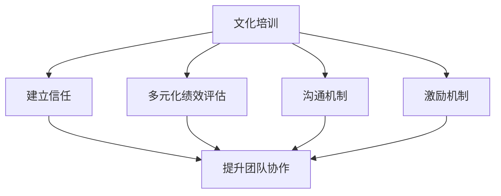

在这个图中，文化培训、建立信任、多元化绩效评估、沟通机制和激励机制共同构成了跨文化团队管理的最佳实践框架。

#### 9.2 小结与注意事项

在实施跨文化团队管理时，以下小结和注意事项将有助于企业更好地应对挑战：

- **尊重文化差异**：尊重团队成员的文化差异，避免过度批评或贬低，促进团队成员之间的理解和接纳。
- **持续培训**：跨文化团队管理是一个持续的过程，需要不断提供培训和指导，以提升团队成员的跨文化意识和能力。
- **透明沟通**：确保沟通渠道的透明和畅通，减少误解和冲突。
- **灵活应变**：根据团队成员的文化背景和项目需求，灵活调整管理策略和团队结构。

#### 9.3 拓展阅读与学习资源

以下是一些关于跨文化团队管理的拓展阅读和学习资源，供企业管理者参考：

- 《跨文化沟通与管理》
- 《跨文化团队建设实践指南》
- 《多元文化团队管理：理论与实践》
- 跨文化管理相关网站和论坛

### 总结

跨文化团队管理是企业全球化进程中的重要一环。通过最佳实践、小结和注意事项，以及拓展阅读与学习资源，企业管理者可以更好地应对跨文化团队带来的挑战，提升团队协作效率和绩效。希望本文能为企业管理者在跨文化团队管理中提供有益的指导和参考。

## 总结与展望

跨文化技术团队的管理是一个复杂而富有挑战的任务，但在全球化的背景下，它也带来了巨大的机遇。本文通过详细分析跨文化技术团队的现状与挑战，探讨了文化差异识别、团队建设与管理、沟通策略、冲突管理和绩效评估等关键问题，提供了实用的管理技巧和策略。

在文化差异识别方面，我们强调了尊重差异、分类识别和案例分析的重要性。通过问卷调查、文化培训和实际案例分析，管理者可以更好地理解团队成员的文化背景和价值观，为团队管理提供科学依据。

在团队建设与管理方面，我们提出了明确团队目标、塑造共同价值观、增强信任和尊重差异等策略。通过这些方法，管理者可以建立良好的团队文化，增强团队成员的归属感和凝聚力。

在沟通策略方面，我们介绍了尊重差异、明确性、开放性和适应性等原则，并提供了沟通障碍的解决策略。通过有效的沟通机制和工具，团队可以减少误解和冲突，提高协作效率。

在冲突管理方面，我们讨论了冲突的类型与原因，并提出了预防策略、沟通策略、合作策略和调解策略。通过这些方法，管理者可以预防和解决文化冲突，维护团队稳定。

在绩效评估方面，我们强调了公平性、全面性和可衡量性等原则，并介绍了定量评估、定性评估、360度评估和平衡计分卡等方法。通过多元化、公平透明的绩效评估体系，管理者可以激励团队成员，提高整体绩效。

通过成功案例研究和实践指南，我们进一步展示了跨文化团队管理的最佳实践，为企业管理者提供了具体的操作指导。

展望未来，随着全球化的深入发展，跨文化技术团队的管理将继续面临新的挑战和机遇。管理者需要不断学习和适应，提升自身的跨文化管理能力和领导力。同时，企业应关注新兴技术和趋势，如人工智能、大数据和云计算等，将这些技术应用于跨文化团队管理，提高管理效率和团队协作能力。

总之，跨文化技术团队的管理是一项系统工程，需要从多个维度进行综合考虑和实施。通过本文的探讨和分析，我们希望能够为企业管理者提供有益的启示和指导，帮助他们在全球化背景下更好地管理跨文化技术团队，实现企业的长期发展和成功。

