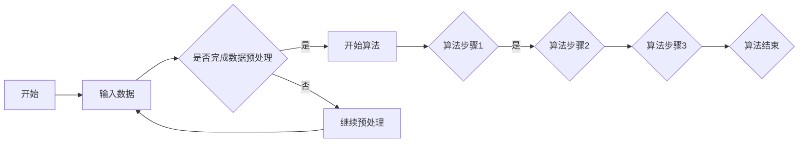
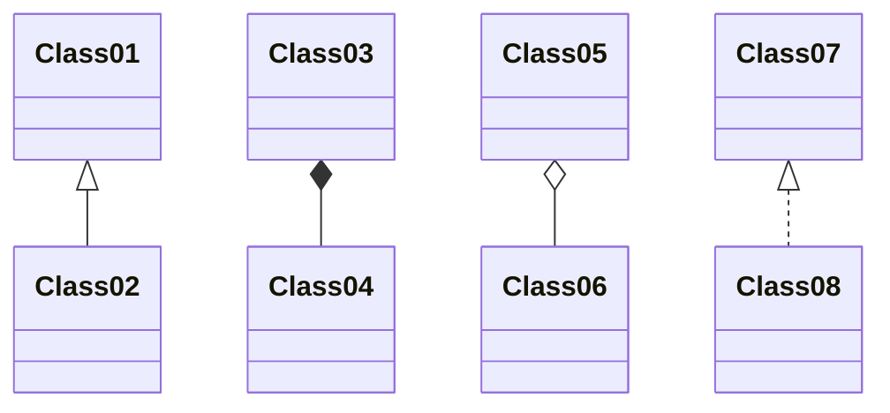
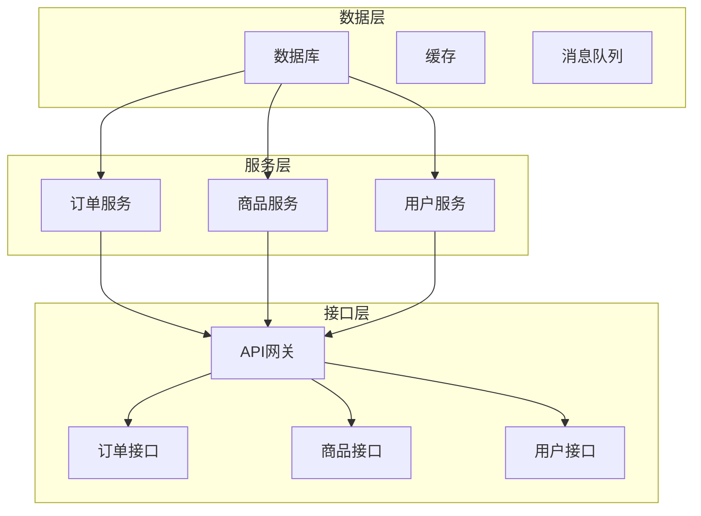
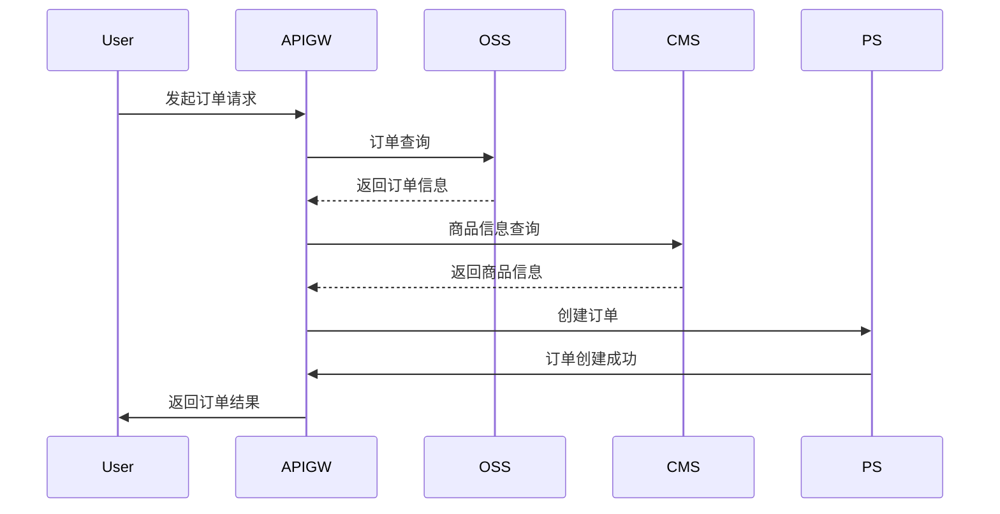

                 

### 《软件架构原则：指导系统设计的核心理念》

---

### 核心概念与联系

#### 软件架构原则

软件架构原则是一组指导软件系统设计的核心理念，旨在提高系统的质量、可维护性和扩展性。常见的架构原则包括单一职责原则、开闭原则、里氏替换原则、依赖倒置原则等。

#### 概念属性特征对比表格

| 架构原则         | 特点                                       | 应用场景                          |
|-----------------|------------------------------------------|---------------------------------|
| 单一职责原则     | 一个模块只做一件事情                     | 防止功能混乱，提高代码可维护性           |
| 开闭原则         | 对扩展开放，对修改封闭                   | 提高代码的可复用性和可维护性           |
| 里氏替换原则     | 子类可以替换基类出现的地方              | 保持代码的稳定性和兼容性               |
| 依赖倒置原则     | 高层模块不应该依赖于低层模块，二者都应依赖于抽象 | 提高代码的灵活性和可扩展性               |

#### ER实体关系图架构的Mermaid流程图

```mermaid
erDiagram
  产品 : "产品名称" {
    }  
  订单 : "订单" {
    }  
  客户 : "客户" {
    }  
  产品 ||--|{ 订单 }||>> 订单详情
  客户 ||--|{ 订单 }||>> 客户订单
```

---

### 算法原理讲解

#### 算法Mermaid流程图



#### Python源代码

```python
def algorithm(data):
    # 数据预处理
    preprocessed_data = preprocess_data(data)
    if not is_completed(preprocessed_data):
        # 继续预处理
        return algorithm(preprocessed_data)
    else:
        # 开始算法
        result = step1(preprocessed_data)
        result = step2(result)
        result = step3(result)
        return result

def preprocess_data(data):
    # 实现数据预处理逻辑
    pass

def is_completed(data):
    # 判断数据预处理是否完成
    pass

def step1(data):
    # 实现算法第一步
    pass

def step2(data):
    # 实现算法第二步
    pass

def step3(data):
    # 实现算法第三步
    pass
```

#### 算法原理

在算法原理中，我们首先需要进行数据预处理，这一步是为了将原始数据转换成适合算法处理的形式。数据预处理可能包括数据清洗、归一化、缺失值填充等操作。接下来，我们检查预处理是否完成，如果未完成，则递归调用算法函数，直到预处理完成。

一旦预处理完成，算法正式开始。算法的第一步通常是对数据进行初步分析或转换，例如计算数据的均值、方差等统计量。第二步可能涉及更复杂的操作，如分类或回归模型训练。最后一步则是对结果进行汇总或可视化展示。

以下是算法原理的数学模型和公式：

$$
\text{预处理结果} = \text{preprocess\_data}(\text{数据})
$$

$$
\text{是否完成} = \text{is\_completed}(\text{预处理结果})
$$

$$
\text{算法结果} = \text{step1}(\text{预处理结果}) \rightarrow \text{step2}(\text{算法结果}) \rightarrow \text{step3}(\text{算法结果})
$$

#### 举例说明

假设我们有一个简单的分类算法，我们的数据预处理步骤是将数据划分为特征和标签两部分。预处理完成后，算法的第一步是计算数据的均值和方差，以便进行归一化处理。第二步是使用决策树算法对数据进行分类，最后一步是输出分类结果。

```python
def preprocess_data(data):
    # 假设数据已经划分为特征和标签两部分
    X = data['features']
    y = data['labels']
    return X, y

def step1(data):
    # 计算均值和方差
    mean = np.mean(data)
    variance = np.var(data)
    return mean, variance

def step2(data):
    # 使用决策树分类
    tree = DecisionTreeClassifier()
    tree.fit(data['X_train'], data['y_train'])
    predictions = tree.predict(data['X_test'])
    return predictions

def step3(data):
    # 输出分类结果
    accuracy = np.mean(predictions == data['y_test'])
    print("分类准确率：", accuracy)
```

---

### 系统分析与架构设计方案

#### 问题场景介绍

在当今互联网时代，电子商务平台已经成为商业运营的重要组成部分。为了提高用户体验和业务效率，我们需要设计一个高性能、可扩展的订单处理系统。

#### 项目介绍

本项目旨在设计一个电商订单处理系统，该系统需要处理海量订单，并保证订单信息的准确性、实时性和一致性。系统需要支持订单的创建、查询、修改和删除等功能。

#### 系统功能设计（领域模型Mermaid类图）



#### 系统架构设计（Mermaid架构图）



#### 系统接口设计和系统交互（Mermaid序列图）



---

### 项目实战

#### 环境安装

1. 安装Python环境
2. 安装Django框架
3. 安装数据库（如MySQL、PostgreSQL等）
4. 安装消息队列（如RabbitMQ、Kafka等）

#### 系统核心实现源代码

```python
# 示例：Django项目中的订单创建逻辑
from django.http import JsonResponse
from .models import Order

def create_order(request):
    # 获取订单数据
    order_data = request.POST.dict()
    
    # 创建订单
    order = Order.objects.create(**order_data)
    
    # 返回订单结果
    return JsonResponse({'order_id': order.id})
```

#### 代码应用解读与分析

在本例中，我们使用了Django框架来创建订单。首先，我们获取请求中的订单数据，然后使用Django ORM创建订单对象，并保存到数据库中。最后，我们返回订单ID，以便客户端可以获取订单结果。

#### 实际案例分析和详细讲解剖析

假设我们有一个用户想要购买一件商品，系统需要处理这个订单。以下是详细的分析和讲解：

1. 用户发起购买请求，请求中包含商品ID、用户ID、购买数量等信息。
2. API网关接收到请求后，先查询订单服务，检查该用户是否已经存在未处理的订单。
3. 如果存在未处理的订单，直接返回订单ID和错误信息。
4. 如果不存在未处理的订单，查询商品服务，获取商品信息。
5. 接着，调用订单服务，创建新的订单，并将订单数据保存到数据库中。
6. 最后，将订单ID返回给用户。

#### 项目小结

本项目通过设计一个电商订单处理系统，展示了如何运用软件架构原则来指导系统设计。系统采用了分层架构，实现了高性能、可扩展的订单处理能力。在实际开发过程中，我们还考虑了系统的稳定性和容错性，为用户提供了良好的购物体验。

---

### 最佳实践 Tips

1. 在设计系统时，要充分考虑系统的可扩展性和可维护性。
2. 使用合适的数据库和缓存策略，以提高系统性能。
3. 遵循设计原则，如单一职责原则、开闭原则等，以提高代码质量。
4. 定期进行系统性能测试和优化，确保系统稳定运行。

### 小结

本文详细介绍了软件架构原则的概念、联系和算法原理，并通过一个实际案例展示了如何运用这些原则进行系统设计。遵循软件架构原则，可以帮助开发者设计出高质量、可扩展的软件系统，从而提高项目的成功率和用户体验。

### 注意事项

1. 在实际项目中，要结合具体业务需求，灵活运用软件架构原则。
2. 定期对系统进行重构和优化，以适应不断变化的需求。

### 拓展阅读

1. 《设计模式：可复用的面向对象软件构架》
2. 《代码大全》
3. 《架构之道：大型软件系统设计》

### 作者信息

作者：AI天才研究院/AI Genius Institute & 禅与计算机程序设计艺术 /Zen And The Art of Computer Programming

---

---

### 文章关键词

- 软件架构原则
- 系统设计
- 可维护性
- 可扩展性
- 性能优化

### 摘要

本文详细介绍了软件架构原则的概念、联系和算法原理，并通过实际案例展示了如何运用这些原则进行系统设计。文章旨在帮助开发者理解并应用软件架构原则，以设计出高质量、可扩展的软件系统。通过本文的阅读，读者将能够掌握软件架构设计的关键要素，提高项目成功率和用户体验。

