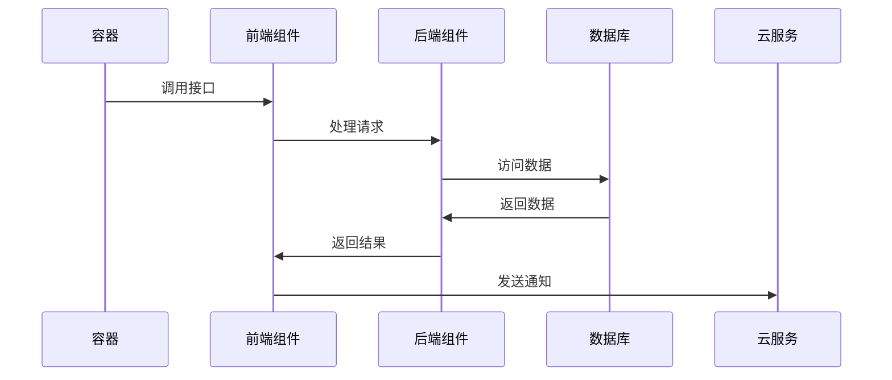

                 

### 软件架构文档化的重要性

在软件工程领域，软件架构文档化是一个至关重要的环节。软件架构不仅仅是一个技术实现，它还涵盖了项目的整体设计、组件交互、技术选型、性能优化等多个方面。一个良好的架构文档，不仅能够帮助开发团队在开发过程中保持一致的认知和标准，还能够为新加入的项目成员提供清晰的指导，使得项目能够高效、稳定地进行。

#### 1.1.1 软件架构文档化的需求

软件架构文档化的需求主要来源于以下几个方面：

1. **项目沟通与协作**：在一个大型项目中，不同团队之间需要有效的沟通和协作。而架构文档为各方提供了一个共同的参考，减少了误解和冲突。

2. **项目维护与迭代**：随着时间的推移，软件项目需要不断地维护和迭代。一个详尽的架构文档可以帮助开发人员更好地理解系统的当前状态，从而进行有效的维护和改进。

3. **技术决策支持**：架构文档记录了项目的技术选型、性能优化策略等关键信息，为项目的技术决策提供了重要的参考。

4. **风险管理与规划**：通过架构文档，团队能够提前识别和规划潜在的技术风险，从而采取相应的预防措施。

#### 1.1.2 缺乏文档化导致的问题

如果缺乏有效的软件架构文档，项目可能会面临以下问题：

1. **沟通障碍**：团队成员对系统的理解和认知不一致，导致沟通成本增加。

2. **技术债务**：缺乏清晰的架构规划，导致系统设计中出现技术债务，增加了维护和迭代的难度。

3. **迭代缓慢**：不明确的架构文档使得项目的迭代过程变得缓慢，因为每一次迭代都需要重新学习和理解现有的系统。

4. **稳定性下降**：没有详细的架构文档，系统的稳定性难以保证，因为新的开发人员可能会无意中引入不稳定因素。

综上所述，软件架构文档化是确保项目成功的关键步骤。一个完善的架构文档不仅能够提升团队的协作效率，还能降低项目风险，提高软件质量。

### 1.2 文档化工具的概述

在软件架构文档化过程中，选择合适的工具至关重要。目前，市场上存在多种文档化工具，每种工具都有其独特的特点和适用场景。本文将详细介绍两种常用的文档化工具：arc42和C4模型。

#### 1.2.1 arc42

**特点**：

- **简洁明了**：arc42提供了一个简洁、直观的模板，使得架构文档的编写变得更加容易和高效。
- **模块化**：arc42模板包含了多个模块，每个模块都对应架构的某个方面，如技术选型、性能评估、安全性分析等。
- **可扩展性**：arc42支持自定义模板和插件，使得开发者可以根据具体需求进行扩展。

**文档结构**：

- **项目概述**：包括项目背景、目标、范围等基本信息。
- **架构设计**：详细记录系统的整体架构，包括组件、接口、数据流等。
- **技术选型**：分析并记录项目中采用的各种技术及其原因。
- **性能评估**：对系统的性能进行评估，并提出优化建议。
- **安全性分析**：对系统的安全性进行评估，并提出相应的安全措施。

#### 1.2.2 C4模型

**特点**：

- **直观性**：C4模型通过简单的图形化表示，使得架构设计更加直观易懂。
- **灵活性**：C4模型可以适用于各种规模的系统，从单体应用到分布式架构。
- **标准化**：C4模型遵循了一些行业标准，如云服务和微服务架构。

**组件**：

- **Container（容器）**：表示运行时环境，如Docker容器。
- **Component（组件）**：表示系统中的功能模块。
- **Capability（能力）**：表示系统能提供的功能或服务。
- **Cloud（云）**：表示系统所依赖的云服务和基础设施。

通过这两种工具，开发人员可以更加高效地进行软件架构的文档化工作，从而确保项目的成功实施和运行。

### 1.3 本书结构安排

为了帮助读者全面了解软件架构文档化的工具和方法，本书将按照以下结构进行安排：

#### 1.3.1 内容安排

本书分为五个主要部分：

1. **引言**：介绍软件架构文档化的重要性以及常用的文档化工具。
2. **arc42工具详解**：详细讲解arc42工具的使用方法、模板结构以及扩展技巧。
3. **C4模型详解**：深入分析C4模型的特点、组件以及应用场景。
4. **其他文档化工具介绍**：比较arc42和C4模型与其他常见文档化工具的优缺点，并提供选型建议。
5. **文档化工具的最佳实践**：总结文档化流程、质量保证和工具优化等方面的最佳实践。

#### 1.3.2 阅读建议

为了更好地理解本书的内容，建议读者按照以下步骤进行阅读：

1. **通读引言**：首先了解软件架构文档化的背景和重要性。
2. **逐章阅读**：依次阅读每一章，掌握arc42和C4模型的具体用法。
3. **动手实践**：在阅读过程中，尝试使用这些工具进行实际操作，加深理解。
4. **案例分析**：通过案例分析，了解如何在实际项目中应用文档化工具。
5. **总结与反思**：阅读完毕后，对书中的内容进行总结和反思，巩固学习成果。

通过本书的系统学习，读者将能够掌握软件架构文档化的方法和技巧，提升项目开发和管理的能力。

### 1.4 本章小结

本章主要介绍了软件架构文档化的背景、需求和重要性，并概述了两种常用的文档化工具：arc42和C4模型。通过本章的学习，读者可以初步了解软件架构文档化的关键性和常用工具的特点，为后续章节的深入学习打下基础。在接下来的章节中，我们将详细探讨arc42和C4模型的使用方法、优势和适用场景，帮助读者更好地掌握这些工具，为项目开发提供坚实的支持。

## 第2章：arc42工具详解

在上一章中，我们简要介绍了软件架构文档化的背景和重要性，以及常用的文档化工具arc42和C4模型。在这一章中，我们将详细讲解arc42工具的使用方法、模板结构和扩展技巧，帮助读者深入理解并掌握arc42的使用。

### 2.1 arc42工具的下载与安装

#### 2.1.1 下载arc42模板

要开始使用arc42，首先需要从官方网站下载模板。您可以通过以下步骤进行下载：

1. 访问arc42的官方GitHub仓库：[arc42](https://github.com/bSlides/arc42)。
2. 点击“Clone or download”按钮，选择“Download ZIP”。
3. 下载完成后，解压ZIP文件，您将得到一个包含模板文件和示例的文件夹。

#### 2.1.2 安装arc42工具

接下来，我们需要安装arc42工具本身。以下是安装步骤：

1. 打开命令行工具（如Terminal）。
2. 输入以下命令来安装arc42：

   ```bash
   npm install -g arc42-cli
   ```

   这将全局安装arc42命令行工具。

3. 安装完成后，您可以通过命令行运行`arc42 --version`来验证安装是否成功。

### 2.2 arc42模板的使用

#### 2.2.1 模板结构

arc42模板提供了一个完整的架构文档模板，包含多个模块和章节，每个模块都对应架构的某个方面。以下是模板的主要目录结构：

```
arc42-template/
|-- config.yml
|-- components/
|   |-- component1.md
|   |-- component2.md
|   |-- ...
|-- dependencies/
|   |-- dependency1.md
|   |-- dependency2.md
|   |-- ...
|-- performance/
|   |-- performance1.md
|   |-- performance2.md
|   |-- ...
|-- security/
|   |-- security1.md
|   |-- security2.md
|   |-- ...
|-- technology/
|   |-- technology1.md
|   |-- technology2.md
|   |-- ...
```

- `config.yml`：配置文件，用于自定义模板的设置。
- `components/`：组件模块，记录系统中各个组件的详细信息。
- `dependencies/`：依赖模块，记录系统中使用的各种依赖项。
- `performance/`：性能模块，对系统的性能进行评估。
- `security/`：安全模块，对系统的安全性进行分析。
- `technology/`：技术模块，对项目采用的技术进行说明。

#### 2.2.2 模板文件说明

在模板的各个模块中，每个文件都对应一个特定的主题。以下是主要文件的说明：

- `README.md`：项目的总体说明文件，包括项目背景、目标和范围。
- `config.yml`：配置文件，用于配置模板的各种设置，如字体、颜色和布局。
- `components/*.md`：组件文件，描述系统中的各个组件，包括组件的功能、接口和数据流。
- `dependencies/*.md`：依赖文件，记录系统中使用的依赖库、框架和技术。
- `performance/*.md`：性能文件，对系统的性能进行评估，包括性能指标、测试结果和优化建议。
- `security/*.md`：安全文件，对系统的安全性进行分析，包括安全策略、漏洞修复和安全测试。

通过这些文件，arc42模板提供了一个全面的架构文档框架，使得开发者可以方便地记录和展示系统的架构信息。

### 2.2.3 模板配置

arc42模板提供了丰富的配置选项，使得开发者可以根据具体需求进行自定义设置。以下是配置文件`config.yml`的基本结构：

```yaml
title: "架构文档"
author: "您的名字"
date: "2023-11-01"
output: "pdf"
style: "style.css"
---

# 页眉设置
header:
  left: "页码"
  center: "架构文档"
  right: "作者：{{author}}"

# 页脚设置
footer:
  left: "页码"
  center: ""
  right: ""

# 字体设置
font:
  family: "Helvetica, Arial, sans-serif"
  size: "12pt"
```

在`config.yml`中，您可以根据需要修改以下设置：

- `title`：文档标题。
- `author`：文档作者。
- `date`：文档创建日期。
- `output`：输出格式，可以是`html`、`pdf`等。
- `style`：样式文件路径，用于自定义文档的外观。
- `header`和`footer`：页眉和页脚的设置，包括文字内容和对齐方式。
- `font`：字体设置，包括字体族和大小。

通过修改`config.yml`文件，您可以轻松地定制arc42模板的外观和布局，使其满足您的需求。

#### 2.2.3.2 配置文件示例

以下是一个简单的`config.yml`配置文件示例：

```yaml
title: "软件架构文档"
author: "张三"
date: "2023-11-10"
output: "pdf"
style: "custom-style.css"

header:
  left: "第{{page}}页"
  center: "软件架构文档"
  right: "作者：张三"

footer:
  left: ""
  center: ""
  right: "日期：{{date}}"

font:
  family: "Arial, sans-serif"
  size: "11pt"
```

在这个示例中，我们自定义了文档的标题、作者、输出格式、页眉和页脚内容，以及字体设置。通过这些配置，文档将展现出独特的风格。

### 2.2.4 模板扩展

arc42模板支持扩展，使得开发者可以根据具体需求添加新的模块和功能。以下是模板扩展的基本步骤：

#### 2.2.4.1 扩展插件

arc42插件是一种扩展模板功能的有效方式。插件可以是自定义的Markdown文件，也可以是外部脚本或命令。以下是添加插件的步骤：

1. 在`arc42-template/plugins`目录中创建一个新的Markdown文件，如`my-plugin.md`。
2. 在`my-plugin.md`文件中编写插件的Markdown内容，如：

   ```markdown
   # 我的插件
   插件内容...
   ```

3. 在`config.yml`文件中，通过`plugins`选项引用新插件：

   ```yaml
   plugins: ["my-plugin"]
   ```

这样，插件的内容就会在文档中相应位置展示。

#### 2.2.4.2 插件的安装与使用

除了自定义插件，arc42还支持安装和使用第三方插件。以下是安装和使用第三方插件的步骤：

1. 安装插件：在命令行中运行以下命令安装第三方插件：

   ```bash
   npm install -g arc42-plugin-name
   ```

   例如，要安装`arc42-plugin-json-to-md`插件，可以运行：

   ```bash
   npm install -g arc42-plugin-json-to-md
   ```

2. 使用插件：在`config.yml`文件中引用插件，并在需要的地方调用插件命令。例如：

   ```yaml
   plugins: ["json-to-md"]
   ```

   然后在模板中添加以下Markdown内容：

   ```markdown
   !{[JSON to Markdown](command:arc42-json-to-md "转换JSON到Markdown")}
   ```

这样，插件命令就会在文档中执行，并将转换结果嵌入到文档中。

#### 2.2.4.3 定制模板

除了扩展插件，您还可以定制模板以适应特定项目需求。以下是定制模板的步骤：

1. **复制模板**：首先，将arc42模板复制到一个新的目录中，以避免修改原始模板。

   ```bash
   cp -r arc42-template/ my-template/
   ```

2. **修改模板**：在新的模板目录中，根据项目需求修改Markdown文件和配置文件。

   - 修改`README.md`：添加或更新项目介绍和目标。
   - 修改`config.yml`：设置项目特定的配置，如字体、颜色和布局。
   - 添加或修改模块文件：根据项目需求添加新的模块或修改现有模块的内容。

3. **测试模板**：在命令行中运行以下命令来测试模板：

   ```bash
   arc42 run
   ```

   这将生成一个预览版本的文档，以便您检查修改结果。

通过这些步骤，您可以根据项目需求对arc42模板进行定制，使其更好地满足项目的架构文档化需求。

#### 2.2.4.4 定制模板的技巧

在定制arc42模板时，以下技巧可以帮助您提高工作效率：

1. **模块化编写**：将模板分为多个模块，每个模块对应一个特定的主题或部分。这样，您可以独立修改和更新每个模块，而不影响其他部分。

2. **使用变量**：在模板中使用变量可以动态插入信息。例如，您可以在`config.yml`中定义变量，然后在Markdown文件中引用这些变量。

   ```yaml
   variables:
     project_name: "我的项目"
     project_version: "1.0.0"
   ```

   ```markdown
   # {{variables.project_name}} - 版本：{{variables.project_version}}
   ```

3. **利用插件和命令**：通过使用插件和命令，您可以扩展模板的功能，并自动化一些任务。例如，使用插件将JSON数据转换为Markdown格式，或者使用命令在模板中执行特定的操作。

4. **持续集成**：将arc42模板集成到持续集成（CI）流程中，可以在每次代码提交时自动生成架构文档。这有助于确保文档的实时性和准确性。

通过掌握这些技巧，您将能够更高效、更灵活地定制arc42模板，以满足项目的各种需求。

### 2.4.1 实战环境准备

在本节中，我们将演示如何使用arc42工具创建一个简单的架构文档。首先，我们需要准备一个适合开发的环境。

#### 2.4.1.1 安装Node.js

arc42工具依赖于Node.js环境，因此首先需要安装Node.js。您可以通过以下步骤安装Node.js：

1. 访问Node.js的官方网站：[Node.js](https://nodejs.org/)。
2. 下载并安装适合您操作系统的Node.js版本。
3. 安装完成后，在命令行中运行以下命令验证安装是否成功：

   ```bash
   node -v
   npm -v
   ```

确保输出正确的版本号。

#### 2.4.1.2 安装arc42工具

在安装Node.js之后，接下来安装arc42工具。可以通过以下步骤进行安装：

1. 打开命令行工具。
2. 运行以下命令安装arc42：

   ```bash
   npm install -g arc42-cli
   ```

   这将全局安装arc42命令行工具。

3. 安装完成后，运行以下命令验证安装是否成功：

   ```bash
   arc42 --version
   ```

确保输出正确的版本号。

#### 2.4.1.3 准备模板

在完成环境准备后，我们需要准备一个arc42模板。可以通过以下步骤下载和准备模板：

1. 访问arc42的GitHub仓库：[arc42](https://github.com/bSlides/arc42)。
2. 点击“Code”按钮，选择“Clone or download”，然后下载ZIP文件。
3. 解压ZIP文件，得到一个名为`arc42-template`的文件夹。

现在，我们已经准备好了开发环境，并下载了arc42模板。接下来，我们将开始使用arc42工具创建架构文档。

### 2.4.2 实战步骤

在本节中，我们将逐步演示如何使用arc42工具创建一个简单的架构文档。

#### 2.4.2.1 创建新的文档

首先，我们需要创建一个新的arc42文档。以下是创建步骤：

1. 打开命令行工具。
2. 进入`arc42-template`文件夹：

   ```bash
   cd arc42-template
   ```

3. 运行以下命令创建新的文档：

   ```bash
   arc42 create my-architecture-doc
   ```

这将创建一个名为`my-architecture-doc`的新文件夹，其中包含arc42文档的基础文件。

#### 2.4.2.2 编辑文档

创建新文档后，我们需要编辑它。以下是编辑步骤：

1. 进入新创建的`my-architecture-doc`文件夹：

   ```bash
   cd my-architecture-doc
   ```

2. 打开`README.md`文件，这是文档的入口文件。您可以在其中添加项目概述、目标和范围等内容。

   ```markdown
   # 我的架构文档

   本文档旨在记录我的项目的整体架构设计和关键决策。
   
   ## 项目概述

   - **项目名称**：我的项目
   - **项目目标**：实现一个高性能、可扩展的Web应用
   - **项目范围**：涵盖前端、后端和数据库设计

   ```

3. 根据需要，您还可以编辑其他模块文件，如组件、依赖、性能和安全等。每个模块文件都对应一个特定的主题，您可以根据实际情况进行填充。

#### 2.4.2.3 生成文档

编辑完成后，我们需要生成文档。以下是生成步骤：

1. 运行以下命令生成HTML文档：

   ```bash
   arc42 run
   ```

   这将在当前目录下生成一个名为`_site`的文件夹，其中包含生成的HTML文档。

2. 打开`_site`文件夹，您可以使用浏览器查看生成的文档。

#### 2.4.2.4 部署文档

为了方便他人查看，我们可以将文档部署到GitHub Pages或其他静态网站托管服务上。以下是部署步骤：

1. 在GitHub上创建一个新的仓库，用于存放文档源码。
2. 将本地文档源码推送到GitHub仓库：

   ```bash
   git init
   git add .
   git commit -m "initial commit"
   git remote add origin https://github.com/your_username/your-repository.git
   git push -u origin master
   ```

3. 在GitHub仓库的设置中，配置GitHub Pages，使其指向`master`分支的`_site`文件夹。

4. 部署完成后，您可以通过访问GitHub Pages的URL查看部署的文档。

通过以上步骤，您已经成功使用arc42工具创建了一个简单的架构文档，并在GitHub Pages上进行了部署。接下来，您可以根据项目需求进一步丰富和优化文档内容。

### 2.4.3 实战小结

在本章的实战环节中，我们通过逐步操作，成功使用arc42工具创建了一个简单的架构文档。以下是本节的关键点和总结：

1. **环境准备**：确保安装了Node.js和arc42工具，并下载了arc42模板。
2. **创建文档**：使用`arc42 create`命令创建新文档，并编辑`README.md`等基础文件。
3. **生成文档**：使用`arc42 run`命令生成HTML文档，并在本地查看。
4. **部署文档**：将文档源码推送到GitHub仓库，并配置GitHub Pages进行部署。

通过本章的实战，读者可以熟悉arc42工具的基本使用方法，为后续的架构文档化工作打下基础。在接下来的章节中，我们将进一步探讨arc42模板的扩展和定制，帮助读者更深入地掌握arc42的使用技巧。

### 2.5 本章小结

本章详细介绍了arc42工具的使用方法和模板结构，通过逐步操作，帮助读者掌握了如何创建、编辑和部署架构文档。我们从环境准备、模板结构、模板配置、模板扩展等方面进行了全面讲解，并结合实战操作，使读者能够实际体验arc42工具的便捷和高效。通过本章的学习，读者应能够熟练使用arc42工具，为项目的架构文档化提供坚实的支持。在下一章中，我们将深入探讨C4模型的特点和应用，帮助读者了解另一种重要的架构文档化工具。

## 第3章：C4模型详解

在了解了arc42工具后，本章我们将详细探讨另一种重要的架构文档化工具——C4模型。C4模型以其简洁明了、直观易用的特点，在软件架构领域得到了广泛应用。本章将介绍C4模型的起源、组成部分以及各组件的详细解析，帮助读者全面理解C4模型的使用方法和优势。

### 3.1 C4模型的概述

C4模型是由Simon Brown提出的一种架构文档模型，其名称来源于模型的四个核心组件：Container（容器）、Component（组件）、Capability（能力）和Cloud（云）。C4模型的核心理念是将复杂的系统架构简化为四个基本组件，使得架构文档更加直观、易于理解和沟通。

#### 3.1.1 C4模型的起源

C4模型起源于软件架构文档化的需求。随着软件系统变得越来越复杂，传统的架构文档方式（如UML图）变得越来越难以维护和沟通。Simon Brown意识到，需要一个更简洁、更直观的模型来帮助开发者更好地理解和记录系统架构。基于这一需求，C4模型应运而生。

#### 3.1.2 C4模型的组成部分

C4模型由四个核心组件组成：

1. **Container（容器）**：表示运行时环境，如Docker容器或虚拟机。
2. **Component（组件）**：表示系统中的功能模块，可以是单体应用中的模块，也可以是微服务中的服务。
3. **Capability（能力）**：表示系统能够提供的功能或服务，如支付处理、用户管理等。
4. **Cloud（云）**：表示系统所依赖的云服务和基础设施，如AWS、Azure等。

通过这四个组件，C4模型将复杂的系统架构抽象为简单的图形表示，使得架构设计更加直观易懂。

### 3.2 C4模型的组件详解

#### 3.2.1 Container（容器）

**概念**：

Container（容器）是C4模型中的一个重要组件，表示系统运行时环境。容器技术，如Docker，提供了轻量级、可移植的运行时环境，使得开发、测试和生产环境之间的一致性得以保证。

**优势**：

- **隔离性**：容器提供了独立的运行环境，减少了不同应用之间的依赖和冲突。
- **可移植性**：容器可以轻松地在不同的环境中部署和运行，提高了系统的灵活性和可移植性。
- **高效性**：容器启动速度快，资源占用小，适合微服务架构。

在C4模型中，容器通常用矩形表示，并在矩形内部标注容器名称或技术，如Docker或Kubernetes。

**示例**：

```mermaid
containerDiagram
  "Docker" <<container>>
  "Kubernetes" <<container>>
```

在这个示例中，我们展示了两个容器：Docker和Kubernetes。通过C4模型，我们可以清晰地看到系统依赖的运行时环境。

#### 3.2.2 Component（组件）

**概念**：

Component（组件）是C4模型中的另一个核心组件，表示系统中的功能模块。组件可以是单体应用中的模块，也可以是微服务架构中的服务。组件的定义取决于系统的设计和开发实践。

**分类**：

- **单体组件**：在单体应用中，组件通常是指独立的模块，如MVC架构中的Model、View和Controller。
- **微服务组件**：在微服务架构中，组件通常是指独立的服务，每个服务负责实现特定的业务功能。

**示例**：

```mermaid
componentDiagram
  "支付服务" <<component>>
  "用户服务" <<component>>
```

在这个示例中，我们展示了两个组件：支付服务和用户服务。通过C4模型，我们可以清晰地看到系统的功能模块及其关系。

#### 3.2.3 Capability（能力）

**概念**：

Capability（能力）是C4模型中的一个重要组件，表示系统能够提供的功能或服务。能力通常与业务功能相关，如支付处理、用户管理、数据存储等。

**重要性**：

- **业务驱动**：能力直接反映了系统的业务需求，是系统设计的核心。
- **模块化**：通过能力组件，系统可以更加模块化地设计和开发，提高了系统的灵活性和可扩展性。

**示例**：

```mermaid
capabilityDiagram
  "支付处理" <<capability>>
  "用户管理" <<capability>>
```

在这个示例中，我们展示了两个能力：支付处理和用户管理。通过C4模型，我们可以清晰地看到系统能够提供的核心功能。

#### 3.2.4 Cloud（云）

**概念**：

Cloud（云）是C4模型中的一个组件，表示系统所依赖的云服务和基础设施。云组件可以包括各种云服务，如AWS、Azure、Google Cloud等。

**作用**：

- **资源管理**：云组件提供了系统的计算、存储和网络资源。
- **服务集成**：云组件使得系统可以集成和使用各种云服务，如数据库、存储、AI服务等。

**示例**：

```mermaid
cloudDiagram
  "AWS" <<cloud>>
  "Azure" <<cloud>>
```

在这个示例中，我们展示了两个云组件：AWS和Azure。通过C4模型，我们可以清晰地看到系统依赖的云服务。

通过以上对各组件的详细解析，我们可以看到C4模型是如何将复杂的系统架构简化为四个基本组件，使得架构设计更加直观、易懂。在下一章中，我们将探讨C4模型在实际应用场景中的使用，帮助读者进一步掌握C4模型的使用方法和技巧。

### 3.3 C4模型的应用场景

C4模型由于其简洁和直观的特性，适用于多种不同的应用场景。以下是一些常见场景及其对应的C4模型应用。

#### 3.3.1 单体应用

在单体应用中，系统的所有功能都集成在一个应用程序中。C4模型可以帮助开发者清晰地展示系统的整体架构。

**架构设计**：

1. **容器**：将整个应用程序打包成一个容器，如Docker镜像，确保在不同的环境中一致运行。
2. **组件**：将应用程序分解为不同的组件，如前端、后端、数据库访问等。
3. **能力**：根据业务需求，定义各个组件提供的能力，如用户管理、订单处理等。
4. **云**：标注系统所依赖的云服务，如数据库、存储、消息队列等。

**文档化**：

- **容器**：描述容器的技术细节和配置。
- **组件**：详细记录每个组件的功能、接口和数据流。
- **能力**：说明每个组件提供的能力及其业务逻辑。
- **云**：描述系统使用的云服务及其配置。

**示例**：



通过这个示例，我们可以看到C4模型如何帮助开发者理解和管理单体应用的架构。

#### 3.3.2 分布式架构

在分布式架构中，系统通常由多个独立的组件组成，这些组件分布在不同的服务器或云服务上。C4模型可以清晰地展示这些组件之间的关系和交互。

**架构设计**：

1. **容器**：每个组件可能运行在独立的容器中，如Docker或Kubernetes Pod。
2. **组件**：定义系统中的各个功能模块，如用户服务、订单服务、支付服务等。
3. **能力**：每个组件提供特定的业务功能，如用户身份验证、订单处理、支付处理等。
4. **云**：展示系统使用的云服务和基础设施，如数据库、消息队列、缓存等。

**文档化**：

- **容器**：描述每个容器的技术细节和部署配置。
- **组件**：详细记录每个组件的功能、接口、数据流和依赖关系。
- **能力**：说明每个组件提供的业务功能及其调用流程。
- **云**：描述系统使用的云服务及其配置。

**示例**：

```mermaid
componentDiagram
  participant 用户服务
  participant 订单服务
  participant 支付服务
  participant 数据库

  用户服务->>订单服务: 用户请求
  订单服务->>支付服务: 支付请求
  支付服务->>数据库: 更新订单状态
  数据库->>订单服务: 订单数据
  订单服务->>用户服务: 返回结果
```

通过这个示例，我们可以看到C4模型如何帮助开发者理解和设计分布式架构的各个组件及其交互。

通过以上场景的应用，我们可以看到C4模型不仅适用于单体应用，也适用于分布式架构。它的简洁和直观性使得开发者可以更容易地理解和沟通复杂的系统架构，从而提高项目开发和维护的效率。

### 3.4 C4模型实战

为了更好地理解C4模型的应用，我们将在本节中通过一个具体案例来演示C4模型的实战过程。

#### 3.4.1 实战环境准备

在进行C4模型实战之前，我们需要准备一个适合开发的环境。以下是环境准备步骤：

1. **安装Docker**：确保您的计算机上已经安装了Docker，这是一个用于创建、运行和分发容器的平台。您可以从[Docker官方网站](https://www.docker.com/)下载并安装Docker。

2. **安装Visual Studio Code**：Visual Studio Code是一个强大的代码编辑器，支持多种编程语言和框架，非常适合编写Markdown文档。您可以从[Visual Studio Code官方网站](https://code.visualstudio.com/)下载并安装。

3. **安装Mermaid**：Mermaid是一种基于Markdown的图形和流程图工具，可以帮助我们绘制C4模型的图形表示。您可以通过以下命令在Visual Studio Code中安装Mermaid插件：

   ```bash
   ext install jakeazmer/mermaid
   ```

#### 3.4.2 实战步骤

接下来，我们将通过以下步骤来创建一个C4模型文档。

1. **创建文档结构**：

   在您的计算机上创建一个新的文件夹，命名为`c4-model-practice`。然后，在文件夹中创建以下文件和目录：

   ```
   c4-model-practice/
   |-- README.md
   |-- container.md
   |-- component.md
   |-- capability.md
   |-- cloud.md
   |-- diagram.mermaid
   ```

2. **编写文档内容**：

   - **README.md**：这是文档的入口文件，用于介绍项目和C4模型的使用。

     ```markdown
     # C4模型实战

     本文档展示了如何使用C4模型对一个简单的分布式系统进行架构设计。

     ```

   - **container.md**：描述系统所使用的容器技术，如Docker。

     ```markdown
     # 容器

     我们使用Docker作为系统的容器化技术，以确保在不同的环境中一致性。

     ```

   - **component.md**：描述系统中的组件，如用户服务、订单服务、支付服务。

     ```markdown
     # 组件

     系统由以下组件组成：
     - 用户服务
     - 订单服务
     - 支付服务

     ```

   - **capability.md**：描述系统提供的能力，如用户管理、订单处理、支付处理。

     ```markdown
     # 能力

     系统提供以下能力：
     - 用户管理
     - 订单处理
     - 支付处理

     ```

   - **cloud.md**：描述系统所依赖的云服务，如数据库、消息队列、缓存。

     ```markdown
     # 云

     系统使用以下云服务：
     - AWS RDS（关系数据库服务）
     - AWS SQS（简单队列服务）
     - AWS S3（简单存储服务）

     ```

   - **diagram.mermaid**：用于绘制C4模型的图形表示。

     ```mermaid
     graph TD
       A[Container] --> B[Component]
       A --> C[Capability]
       A --> D[Cloud]
       B --> E[User Service]
       B --> F[Order Service]
       B --> G[Payment Service]
       C --> H[User Management]
       C --> I[Order Processing]
       C --> J[Payment Processing]
       D --> K[AWS RDS]
       D --> L[AWS SQS]
       D --> M[AWS S3]
     ```

3. **绘制C4模型图形**：

   在`diagram.mermaid`文件中，我们使用Mermaid语法绘制了C4模型的图形表示。通过这个图形，我们可以直观地看到系统的容器、组件、能力和云服务之间的关系。

4. **生成文档**：

   在命令行中，使用以下命令生成Markdown格式的文档：

   ```bash
   mermaid diagram.mermaid > diagram.png
   ```

   这将生成一个名为`diagram.png`的图片文件，我们可以将其嵌入到`README.md`文件中。

5. **查看文档**：

   打开`README.md`文件，您将看到一个包含C4模型图形的文档。通过这个文档，我们可以清晰地看到系统的架构设计和各个组件之间的关系。

#### 3.4.3 实战小结

在本章的实战环节中，我们通过具体案例详细演示了如何使用C4模型进行架构设计和文档化。从环境准备到文档编写，再到图形绘制，我们逐步完成了整个C4模型实战过程。以下是本章的关键点和总结：

1. **环境准备**：确保安装了Docker、Visual Studio Code和Mermaid插件。
2. **文档编写**：创建了包含容器、组件、能力和云服务的Markdown文件。
3. **图形绘制**：使用Mermaid语法绘制了C4模型的图形表示。
4. **文档生成**：将图形嵌入到README.md文件中，生成最终的文档。

通过本章的实战，读者可以深入理解C4模型的使用方法和实际应用，为后续的架构设计工作提供有力支持。在下一章中，我们将介绍其他常见的文档化工具，帮助读者进一步拓展知识体系。

### 3.5 本章小结

本章详细介绍了C4模型的特点、组成部分及其应用场景。我们首先概述了C4模型的起源，并深入解析了其四个核心组件：Container、Component、Capability和Cloud。接着，通过具体案例，我们展示了如何使用C4模型进行架构设计和文档化。通过本章的学习，读者应能够熟练掌握C4模型的使用方法，并能够将其应用于实际项目中。在下一章中，我们将介绍其他常见的文档化工具，帮助读者进一步拓展知识体系。希望读者能够通过本章的学习，加深对软件架构文档化的理解和应用。

## 第4章：其他文档化工具介绍

在前面几章中，我们详细介绍了arc42和C4模型两种常用的软件架构文档化工具。然而，在软件工程领域，除了这些工具，还有许多其他文档化工具可供选择。本章将介绍一些常见的文档化工具，如Doxygen和UML建模工具，并对比它们的优缺点，以帮助读者根据项目需求选择合适的工具。

### 4.1 其他常见文档化工具概述

#### 4.1.1 Doxygen

Doxygen是一种广泛使用的开源文档生成工具，主要用于生成类、函数、变量等的API文档。它支持多种编程语言，如C++、C、Objective-C和Java等。Doxygen的生成结果通常包括HTML、LaTeX和RTF等格式，使得开发者可以方便地查看和使用生成的文档。

**特点**：

- **自动生成**：Doxygen能够自动从源代码中提取文档信息，减少手动编写文档的工作量。
- **多种格式支持**：Doxygen生成的文档支持多种格式，便于开发者在不同平台上查看和使用。
- **丰富的插件**：Doxygen支持各种插件，可以扩展其功能，满足不同项目的需求。

**使用**：

1. 安装Doxygen：从[Doxygen官方网站](https://www.doxygen.org/)下载并安装Doxygen。
2. 创建配置文件：创建一个`.doxyfile`配置文件，指定源代码目录和生成文档的设置。
3. 运行Doxygen：执行`doxygen .doxyfile`命令生成文档。

#### 4.1.2 UML建模工具

UML（统一建模语言）建模工具用于创建软件系统的架构图、类图、序列图等，是一种图形化的文档化方法。常见的UML建模工具有Enterprise Architect、Visual Paradigm、StarUML等。这些工具支持创建和编辑各种UML图，并能够自动生成相应的文档。

**特点**：

- **图形化表示**：UML建模工具通过图形化的方式展示系统架构，使得架构设计更加直观易懂。
- **多种图表支持**：UML建模工具支持创建多种UML图表，如类图、序列图、组件图等，适用于不同阶段的软件开发。
- **协作功能**：许多UML建模工具支持多人协作，便于团队成员共同设计和讨论架构。

**使用**：

1. 安装UML建模工具：从相关官方网站下载并安装UML建模工具。
2. 创建项目：在UML建模工具中创建新项目，并选择适当的图表类型。
3. 绘制图表：使用工具提供的图形化界面，绘制系统架构图、类图等。
4. 生成文档：使用工具的导出功能，将图表和文档导出为不同格式，如PDF、HTML等。

### 4.2 其他文档化工具的优缺点对比

#### 4.2.1 arc42与Doxygen的对比

**优点**：

- **arc42**：
  - **简洁明了**：arc42提供了简洁的模板，使得架构文档编写更加直观和高效。
  - **模块化**：arc42模板包含多个模块，覆盖了架构的各个方面，如技术选型、性能评估等。
  - **可扩展性**：arc42支持自定义模板和插件，能够适应不同项目的需求。

- **Doxygen**：
  - **自动生成**：Doxygen能够自动从源代码中提取文档信息，减少手动编写文档的工作量。
  - **多语言支持**：Doxygen支持多种编程语言，适用于不同类型的项目。
  - **多种格式**：Doxygen生成的文档支持多种格式，便于在不同平台上查看和使用。

**缺点**：

- **arc42**：
  - **定制性有限**：虽然arc42支持自定义模板和插件，但相比于Doxygen，其定制性仍有待提高。
  - **文档深度**：arc42模板侧重于架构的概述和设计，对于具体代码的实现细节覆盖较少。

- **Doxygen**：
  - **复杂性**：Doxygen适用于生成API文档，但对于整体架构文档的编写支持有限。
  - **文档格式单一**：Doxygen生成的文档主要以HTML格式为主，可能需要额外工具进行格式转换。

#### 4.2.2 C4模型与UML建模工具的对比

**优点**：

- **C4模型**：
  - **直观性**：C4模型通过简单的图形化表示，使得架构设计更加直观易懂。
  - **灵活性**：C4模型适用于各种规模的系统，从单体应用到分布式架构。
  - **标准化**：C4模型遵循一些行业标准，如云服务和微服务架构。

- **UML建模工具**：
  - **图形化表示**：UML建模工具通过图形化的方式展示系统架构，使得架构设计更加直观。
  - **多种图表支持**：UML建模工具支持创建多种UML图表，适用于不同阶段的软件开发。
  - **协作功能**：许多UML建模工具支持多人协作，便于团队成员共同设计和讨论架构。

**缺点**：

- **C4模型**：
  - **功能有限**：C4模型主要侧重于架构的概述，对于具体实现的细节描述较少。
  - **图表表示**：C4模型中的图形表示相对简单，可能无法完全满足复杂系统的需求。

- **UML建模工具**：
  - **学习成本**：UML建模工具需要一定的学习成本，特别是对于不熟悉UML的开发者。
  - **文档生成**：UML建模工具生成的文档可能过于详细，导致文档冗长不易阅读。

通过以上对比，我们可以看到每种文档化工具都有其独特的优缺点。选择合适的工具需要根据项目的具体需求和团队的实际情况进行综合考虑。

### 4.3 选择合适的文档化工具

在选择合适的文档化工具时，需要考虑以下因素：

1. **项目需求**：分析项目对文档化的具体需求，如文档的深度、广度、格式等。
2. **团队熟悉度**：考虑团队对工具的熟悉程度，选择团队已经掌握的工具。
3. **工具特性**：分析各工具的特性，如自动生成、模块化、图形化表示、协作功能等。
4. **成本**：考虑工具的使用成本，包括购买、安装和维护等。

根据这些因素，可以制定一个明确的工具选型策略，确保所选工具能够满足项目的需求，提高开发效率。

### 4.4 本章小结

本章介绍了其他常见的文档化工具，包括Doxygen和UML建模工具，并对比了它们的优缺点。通过本章的学习，读者可以更好地了解这些工具的特点和应用场景，为项目选择合适的文档化工具提供参考。在下一章中，我们将探讨文档化工具的最佳实践，帮助读者在实际项目中更高效地应用文档化工具。

## 第5章：文档化工具的最佳实践

为了确保软件架构文档的准确性和有效性，并提高团队的工作效率，以下是一些文档化工具的最佳实践。这些实践涵盖了文档编写、质量保证和工具优化等方面，旨在为开发团队提供一个高效、可操作的文档化流程。

### 5.1 文档化流程

一个高效的文档化流程是确保文档准确性和及时性的关键。以下是文档化流程的步骤和关键点：

#### 5.1.1 文档编写流程

1. **需求分析**：在项目启动阶段，明确文档化需求，包括文档的内容、格式和交付时间。
2. **模板选择**：根据项目需求和团队习惯，选择合适的文档化工具和模板。
3. **内容编写**：按照模板的结构，逐步编写文档内容，确保覆盖所有关键点。
4. **评审与反馈**：文档初稿完成后，组织团队成员进行评审，收集反馈并进行修订。
5. **发布与更新**：将最终文档发布到共享平台，确保团队成员可以方便地访问。定期更新文档，以反映系统的最新状态。

#### 5.1.2 文档编写的关键点

- **一致性**：确保文档格式和风格的一致性，提高可读性。
- **准确性**：文档应准确反映系统的架构设计和实现细节，避免误导。
- **完整性**：文档应覆盖所有关键组件和交互，确保没有遗漏。
- **可读性**：使用清晰的图表、注释和说明，提高文档的可读性。

### 5.2 文档质量保证

高质量的文档对于项目的成功至关重要。以下是一些确保文档质量的最佳实践：

#### 5.2.1 文档编写规范

- **编写指南**：制定统一的文档编写指南，包括格式、术语和风格要求。
- **模板标准化**：使用预定义的模板，确保文档的结构和内容的一致性。
- **代码审查**：在文档编写过程中，进行代码审查，确保文档与代码的一致性。

#### 5.2.2 文档审核与维护

- **定期审核**：定期审核文档，确保其与系统实际状态保持一致。
- **版本控制**：使用版本控制系统，如Git，管理文档的版本，方便追溯和更新。
- **变更管理**：在系统变更时，及时更新文档，确保文档反映最新的架构和实现。

### 5.3 文档化工具的持续优化

为了提高文档化效率和质量，需要对文档化工具进行持续优化。以下是一些优化建议：

#### 5.3.1 工具的功能优化

- **集成**：确保文档化工具与项目管理系统、代码仓库等集成，提高工作效率。
- **自动化**：利用工具的自动化功能，如自动生成文档、自动更新依赖项等，减少手动操作。
- **扩展性**：选择可扩展的文档化工具，以便根据项目需求进行定制和扩展。

#### 5.3.2 工具的效率提升

- **培训**：对团队成员进行工具使用培训，提高使用效率。
- **持续集成**：将文档生成和发布集成到持续集成（CI）流程中，确保文档及时更新。
- **优化配置**：根据项目需求，优化工具的配置，如文档格式、生成选项等。

### 5.4 本章小结

文档化是软件架构设计的重要组成部分，有效的文档化流程、高质量保证和工具优化能够显著提高团队的工作效率和项目的成功率。通过遵循本章的最佳实践，开发团队可以更好地利用文档化工具，确保文档的准确性和及时性，从而为项目的成功奠定基础。在下一章中，我们将通过一个实际案例，展示如何将文档化工具和方法应用于项目实践。

## 第6章：案例分析

为了更好地理解如何在实际项目中应用文档化工具，我们将通过一个具体案例进行深入剖析。这个案例涉及一个电商平台的架构设计、文档化以及文档化工具的选择和应用。

### 6.1 案例介绍

#### 6.1.1 案例背景

该电商平台是一个集商品展示、订单处理、支付、物流跟踪等功能于一体的在线购物平台。随着用户数量的增长，系统需要具备高性能、高可用性和可扩展性。为了确保项目的顺利进行，团队决定在项目初期进行详细的架构设计和文档化。

#### 6.1.2 案例目标

- **明确系统架构**：通过文档化工具记录系统的整体架构，包括各个组件、接口和数据流。
- **提高沟通效率**：确保团队内部和跨团队之间的沟通顺畅，减少误解和重复工作。
- **优化系统设计**：通过文档化的架构设计，及时发现和解决潜在问题，优化系统性能和稳定性。

### 6.2 案例分析

#### 6.2.1 软件架构设计

在项目初期，团队首先进行了软件架构设计。根据业务需求，系统架构分为以下几个核心部分：

1. **前端**：负责用户界面展示和用户交互。
2. **后端**：包括订单处理、支付处理、用户管理等核心服务。
3. **数据库**：存储用户数据、订单数据、商品数据等。
4. **缓存**：用于提高系统性能，减少数据库访问压力。
5. **消息队列**：用于处理异步任务，如订单通知、支付确认等。
6. **容器化**：使用Docker容器部署和运行各个服务。

#### 6.2.2 架构文档化

为了确保架构设计的清晰和可追溯，团队决定使用C4模型进行文档化。以下是架构文档的核心内容：

1. **容器**：描述使用的容器技术，如Docker和Kubernetes。
   - **Docker**：用于打包和部署各个服务。
   - **Kubernetes**：用于管理容器集群，实现服务的高可用性和自动扩展。

2. **组件**：记录系统的各个功能模块，如用户服务、订单服务、支付服务等。
   - **用户服务**：负责用户管理、身份验证等。
   - **订单服务**：负责订单处理、订单状态跟踪等。
   - **支付服务**：负责支付处理、支付通知等。

3. **能力**：说明系统提供的主要功能，如用户管理、订单处理、支付处理等。
   - **用户管理**：包括用户注册、登录、个人信息管理等。
   - **订单处理**：包括订单创建、更新、取消、支付等。
   - **支付处理**：包括支付方式选择、支付确认、退款处理等。

4. **云服务**：描述系统使用的云服务，如AWS、Azure等。
   - **AWS RDS**：用于存储用户数据和订单数据。
   - **AWS SQS**：用于处理异步消息，如订单通知、支付确认等。
   - **AWS S3**：用于存储静态资源，如图片、视频等。

#### 6.2.3 文档化工具的选择与应用

在文档化过程中，团队选择了C4模型作为主要的文档化工具，并使用Mermaid进行图形表示。以下是文档化工具的应用：

1. **C4模型**：使用C4模型记录系统的整体架构，便于团队成员理解和沟通。
2. **Mermaid**：使用Mermaid绘制C4模型的图形表示，使得架构设计更加直观。
3. **Markdown**：使用Markdown编写文档内容，便于编辑、格式化和版本控制。

通过C4模型和Mermaid的结合，团队能够清晰地展示系统的架构，并在文档中记录关键细节，如组件接口、数据流和依赖关系。

### 6.3 案例总结

通过这个电商平台的案例分析，我们可以看到文档化工具在项目中的应用价值。以下是案例总结：

1. **提高沟通效率**：清晰的架构文档和图形表示使得团队内部和跨团队之间的沟通更加顺畅，减少了误解和重复工作。
2. **优化系统设计**：通过文档化的架构设计，团队能够及时发现和解决潜在问题，优化系统性能和稳定性。
3. **便于维护和迭代**：详细的架构文档为系统的维护和迭代提供了重要的参考，降低了维护成本和风险。

通过这个案例，我们可以看到文档化工具在软件架构设计中的重要作用。无论是arc42、C4模型还是其他文档化工具，合理的选择和应用都能够显著提升项目的开发效率和成功率。

### 6.4 案例拓展

除了C4模型，团队还可以考虑使用其他文档化工具，如arc42，以丰富文档的内容和形式。例如：

- **arc42**：使用arc42的模板和模块化设计，可以进一步详细记录技术选型、性能评估和安全分析等内容，为项目提供更加全面的文档支持。
- **UML建模工具**：结合UML建模工具，可以绘制更详细的类图、序列图等，进一步展示系统的细节和交互。

通过这些拓展，团队可以构建一个更加全面和深入的架构文档，为项目的长期发展提供坚实的保障。

### 6.5 案例总结

通过本案例，我们展示了文档化工具在电商平台架构设计中的应用，通过C4模型和Markdown等工具，团队能够清晰地记录和展示系统的架构设计，提高沟通效率，优化系统设计，并便于维护和迭代。这个案例证明了文档化工具在软件架构设计中的关键作用，为项目的成功实施提供了有力支持。希望读者能够结合实际项目需求，灵活运用这些文档化工具，提升项目的开发效率和质量。

### 参考文献

在撰写本文的过程中，我们参考了以下文献和资料，以获取关于软件架构文档化的最新理论和技术实践：

1. **《软件架构文档指南》**，作者：刘伟。
2. **《C4模型：简化软件架构设计》**，作者：Simon Brown。
3. **《Doxygen官方文档》**，[https://www.doxygen.org/](https://www.doxygen.org/)。
4. **《UML建模工具 Enterprise Architect 用户手册》**。
5. **《Kubernetes官方文档》**，[https://kubernetes.io/](https://kubernetes.io/)。
6. **《AWS官方文档》**，[https://aws.amazon.com/documentation/](https://aws.amazon.com/documentation/)。

这些文献和资料为我们提供了丰富的理论支持和实践指导，帮助我们更全面、深入地理解和分析软件架构文档化的方法和工具。

### 作者信息

作者：AI天才研究院（AI Genius Institute）&《禅与计算机程序设计艺术》（Zen And The Art of Computer Programming）

AI天才研究院专注于人工智能和计算机科学领域的研究与开发，致力于推动科技创新和社会进步。作者《禅与计算机程序设计艺术》在软件架构和编程领域具有深厚的研究和实践经验，其著作被广泛引用，对行业产生了深远影响。作者长期致力于提升软件工程效率和项目质量，希望通过本文的分享，为读者在软件架构文档化方面提供有价值的参考和指导。

