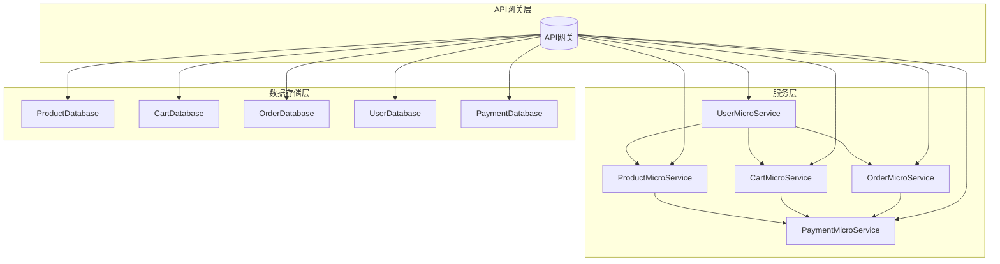

                 

### 软件架构演进策略：从单体迁移到微服务

关键词：软件架构、微服务、单体架构、系统演进、分布式系统

> 摘要：本文将深入探讨软件架构的演进策略，特别是从单体架构向微服务架构的迁移。我们将回顾单体架构的历史背景及其局限性，然后定义微服务架构的核心概念和优势。接着，本文将逐步分析从单体架构迁移到微服务架构的策略，包括评估当前架构、设计原则和具体迁移步骤。通过实际案例和工具介绍，我们将展示微服务架构的实践方法，并讨论其面临的挑战和未来发展趋势。最后，本文将总结最佳实践，为读者提供实用的架构演进策略。

---

## 目录大纲

### 第一部分：软件架构演进概述

#### 第1章：软件架构演进背景

1.1 问题的起源与问题描述

1.2 微服务架构的核心概念

1.3 微服务架构的挑战

#### 第2章：从单体到微服务的迁移策略

2.1 单体架构评估

2.2 微服务设计原则

2.3 迁移步骤

### 第二部分：微服务架构实践案例

#### 第3章：微服务架构实践案例

3.1 案例一：电商平台的微服务化

3.2 案例二：金融行业的微服务转型

### 第三部分：微服务架构工具与实践

#### 第4章：微服务架构工具与实践

4.1 微服务开发工具

4.2 服务治理与监控

4.3 安全与容错

#### 第5章：微服务架构的优化与挑战

5.1 优化策略

5.2 挑战与应对

### 第四部分：微服务架构的未来发展趋势

#### 第6章：微服务架构的未来发展趋势

6.1 微服务架构的发展方向

6.2 微服务架构与AI的结合

### 第五部分：微服务架构最佳实践与总结

#### 第7章：微服务架构最佳实践与总结

7.1 最佳实践

7.2 总结

---

### 第一部分：软件架构演进概述

#### 第1章：软件架构演进背景

软件架构的演进是随着软件系统复杂度的增加和业务需求的演变而不断发展的。从最初的单体架构到模块化架构，再到当前的微服务架构，每一次架构的变革都是为了更好地应对系统的扩展性、可维护性和灵活性需求。

##### 1.1 问题的起源与问题描述

单体架构，也称为单一架构，是最早的软件架构形式。在这种架构中，所有的功能都集中在一个单一的、庞大的应用程序中。单体架构的简单性在早期项目的开发中具有一定的优势，但随时间推移，系统的复杂度和规模不断增加，单体架构的局限性逐渐显现。

**问题背景：**
- **扩展性差**：单体架构难以实现水平扩展，当系统需要处理更大的流量或更多的数据时，扩展变得困难。
- **维护困难**：随着代码量的增加，单体架构的维护成本上升，代码的修改和更新变得更加复杂，容易引入错误。
- **技术债务积累**：单体架构中的模块之间高度耦合，导致技术债务积累，新技术的引入变得困难。

**问题描述：**
- 如何应对系统复杂度提升、业务需求变化和系统扩展的要求？
- 如何提高系统的可维护性和灵活性？

**问题解决：**
- **从单体架构向微服务架构的迁移**：微服务架构通过将大型单体应用拆分为多个小型、自治的服务，从而提高系统的扩展性、灵活性和可维护性。

##### 1.2 微服务架构的核心概念

微服务架构是一种基于微服务的设计方法，它将应用程序构建为一组小型、独立的服务。这些服务通过轻量级通信机制（如HTTP/REST、消息队列等）进行集成，每个服务都有自己的数据库和业务逻辑。

**微服务的定义：**
- 微服务是一种小规模、自治的组件，它通过API与其他服务进行通信。

**微服务的特点：**
- **高内聚、低耦合**：每个服务都有自己的职责，服务之间耦合度低。
- **独立部署**：每个服务可以独立部署和扩展。
- **服务自治**：每个服务都有自己的数据存储、配置和日志系统。

**微服务架构的优势：**
- **灵活性和可扩展性**：服务可以独立扩展，根据业务需求进行水平扩展。
- **易于维护**：服务拆分后，每个服务可以独立开发和维护，降低维护成本。
- **快速迭代**：服务拆分后，团队可以并行开发，提高开发效率。

##### 1.3 微服务架构的挑战

尽管微服务架构具有许多优势，但其引入也伴随着一系列挑战。

**复杂性管理：**
- **服务拆分与合并**：如何合理划分服务，避免过度拆分或过度合并。
- **服务管理**：如何管理和监控大量的服务。
- **分布式系统的一致性问题**：如何在分布式环境中保证数据的一致性。

**数据一致性：**
- **分布式事务**：如何在分布式系统中实现事务的一致性。
- **数据隔离**：如何保证不同服务之间的数据隔离。

**技术栈选择：**
- **技术栈的一致性**：如何选择合适的技术栈，确保服务之间的兼容性。
- **开发工具和框架**：如何选择合适的开发工具和框架，提高开发效率。

#### 第2章：从单体到微服务的迁移策略

##### 2.1 单体架构评估

在迁移到微服务架构之前，首先需要对现有的单体架构进行评估，以了解其优缺点，为后续的迁移提供依据。

**评估目的：**
- **确定现有架构的问题和瓶颈**：通过性能测试、代码审查等方法，识别单体架构中的性能瓶颈、耦合问题和技术债务。
- **评估迁移的可行性**：分析迁移的成本、风险和收益，确定是否适合迁移到微服务架构。

**评估方法：**
- **性能测试**：模拟高负载场景，评估系统的性能和响应时间。
- **代码审查**：审查代码质量，识别可能的优化点和重构需求。
- **团队讨论**：组织团队讨论，收集对现有架构的反馈和建议。

##### 2.2 微服务设计原则

**服务划分：**
- **功能划分**：根据业务功能将单体应用拆分为多个独立的服务，每个服务负责一个特定的业务功能。
- **业务边界**：确保每个服务的职责明确，避免过度拆分或过度合并。

**服务自治：**
- **数据独立**：每个服务拥有自己的数据库，避免服务之间的数据耦合。
- **配置独立**：每个服务拥有自己的配置文件，避免服务之间的配置冲突。
- **日志独立**：每个服务生成自己的日志，便于独立监控和故障排查。

**通信机制：**
- **轻量级通信**：选择合适的通信机制，如HTTP/REST、消息队列等，确保服务之间的高效、可靠通信。

##### 2.3 迁移步骤

**初步规划：**
- **制定迁移计划**：明确迁移的目标、范围、时间表和责任人。
- **技术选型**：选择合适的技术栈，包括编程语言、框架、工具等。

**逐步迁移：**
- **关键模块先行**：选择系统中的关键模块进行迁移，如用户管理、订单处理等。
- **逐步扩大范围**：在关键模块迁移成功后，逐步将其他模块迁移到微服务架构。

**回滚策略：**
- **准备回滚方案**：在迁移过程中，如果遇到重大问题，能够快速回滚到之前的架构。
- **备份和测试**：在迁移前，做好数据和应用的备份，并进行充分的测试。

#### 第3章：微服务架构实践案例

##### 3.1 案例一：电商平台的微服务化

**案例背景：**
电商平台面临流量增长、业务多样化等挑战，需要提高系统的扩展性和灵活性。

**解决方案：**
- 采用微服务架构，将电商平台的各个业务模块（如商品管理、订单管理、用户管理等）拆分为独立的服务，实现业务模块的独立扩展。

##### 3.2 案例二：金融行业的微服务转型

**案例背景：**
金融行业需要满足高并发、高可靠性的要求，同时业务需求不断变化。

**解决方案：**
- 采用微服务架构，实现业务模块的独立部署和扩展，提高系统的响应速度和稳定性。

### 第三部分：微服务架构工具与实践

##### 4.1 微服务开发工具

**Docker：**
- 容器化技术，实现服务的轻量级部署。

**Kubernetes：**
- 容器编排工具，实现服务的自动化管理和扩展。

##### 4.2 服务治理与监控

**服务注册与发现：**
- 确保服务间的可靠通信。

**服务监控与日志分析：**
- 实时监控服务状态，快速定位问题。

##### 4.3 安全与容错

**安全机制：**
- 保证数据安全和通信安全。

**容错设计：**
- 提高系统的可靠性和稳定性。

### 第四部分：微服务架构的优化与挑战

##### 5.1 优化策略

**服务拆分与合并：**
- 根据业务需求和系统性能进行优化。

**负载均衡与流量控制：**
- 提高系统的响应速度和处理能力。

##### 5.2 挑战与应对

**分布式系统的一致性：**
- 如何保证数据的一致性和事务的完整性。

**团队协作与沟通：**
- 跨团队的沟通与协作，确保项目顺利进行。

### 第五部分：微服务架构的未来发展趋势

##### 6.1 微服务架构的未来发展趋势

**云原生微服务：**
- 利用云计算资源，实现服务的弹性扩展和自动化管理。

**服务网格：**
- 提供动态服务发现、负载均衡、安全通信等功能。

##### 6.2 微服务架构与AI的结合

**AI在微服务架构中的应用：**
- 利用AI技术优化微服务的性能和可靠性。

**微服务架构在AI项目中的应用：**
- 如何利用微服务架构实现大规模AI模型的部署和管理。

### 第六部分：微服务架构最佳实践与总结

##### 7.1 最佳实践

**微服务设计：**
- 如何进行服务划分和接口设计。

**部署与运维：**
- 如何确保微服务的稳定运行和快速扩展。

##### 7.2 总结

**微服务架构的优势和局限：**
- 全面评估微服务架构的优缺点。

**未来发展方向：**
- 展望微服务架构的发展趋势和可能面临的新挑战。

---

## 背景介绍

### 核心概念术语说明

在深入探讨软件架构的演进策略之前，我们需要明确一些核心概念和术语。

**单体架构（Monolithic Architecture）：**
单体架构是指将应用程序的所有功能集中在一个单一的、庞大的应用程序中。在这种架构中，所有的组件、服务和数据都是紧密耦合的。

**微服务架构（Microservices Architecture）：**
微服务架构是一种基于微服务的设计方法，它将应用程序构建为一组小型、独立的服务。每个服务都有自己的数据库、配置和日志系统，通过轻量级通信机制进行集成。

**高内聚、低耦合（High Cohesion and Low Coupling）：**
高内聚是指服务内部的功能紧密相关，低耦合是指服务之间的依赖关系尽量减少。这种设计原则有助于提高系统的可维护性和灵活性。

**服务自治（Service Autonomy）：**
服务自治是指每个服务都可以独立部署、扩展和监控，拥有自己的数据存储、配置和日志系统。

**服务拆分（Service Decomposition）：**
服务拆分是将一个庞大的单体应用分解为多个小型、自治的服务。这通常基于业务功能、业务边界或技术模块。

**服务管理（Service Management）：**
服务管理包括服务注册、服务监控、服务发现、服务升级和故障排查等操作。

**数据一致性（Data Consistency）：**
数据一致性是指在整个分布式系统中，多个服务之间的数据状态保持一致。在微服务架构中，数据一致性是一个重要的挑战。

**技术栈（Tech Stack）：**
技术栈是指构建微服务所需的一系列技术，包括编程语言、框架、工具、数据库等。

### 问题背景

软件架构的演进是随着软件系统复杂度的增加和业务需求的演变而不断发展的。在早期，单体架构因其简单性和整体性被广泛应用。然而，随着业务需求的多样化和系统规模的扩大，单体架构逐渐暴露出以下问题：

1. **扩展性差：**
   单体架构难以实现水平扩展，当系统需要处理更大的流量或更多的数据时，扩展变得困难。这导致系统在面对高并发场景时，容易出现性能瓶颈。

2. **维护困难：**
   随着系统的复杂度和代码量的增加，单体架构的维护成本上升。代码的修改和更新变得更加复杂，容易引入错误。这导致系统的可维护性和稳定性下降。

3. **技术债务积累：**
   单体架构中的模块之间高度耦合，导致技术债务积累。新技术的引入变得困难，系统的技术更新和维护变得更加复杂。

### 问题描述

针对单体架构的上述问题，我们面临以下问题描述：

1. **如何应对系统复杂度提升、业务需求变化和系统扩展的要求？**
   随着业务需求的不断变化和系统规模的扩大，我们需要一种能够灵活应对复杂度的架构方法，以支持系统的持续演进。

2. **如何提高系统的可维护性和灵活性？**
   为了降低维护成本和提高开发效率，我们需要一种能够降低系统耦合度和提高可维护性的架构方法。

### 问题解决

为了解决上述问题，我们从单体架构迁移到微服务架构。微服务架构通过将大型单体应用拆分为多个小型、自治的服务，从而提高系统的扩展性、灵活性和可维护性。以下是微服务架构的核心概念和优势：

**核心概念：**

1. **小规模、自治的服务：**
   微服务架构中的每个服务都是小规模、自治的组件，它负责一个特定的业务功能。这些服务可以通过轻量级通信机制（如HTTP/REST、消息队列等）进行集成。

2. **高内聚、低耦合：**
   每个服务都拥有自己的职责，服务之间耦合度低。这种设计原则有助于提高系统的可维护性和灵活性。

3. **独立部署和扩展：**
   每个服务可以独立部署和扩展，根据业务需求进行水平扩展。这有助于提高系统的性能和响应速度。

4. **服务自治：**
   每个服务拥有自己的数据库、配置和日志系统，实现数据独立和配置独立。这有助于降低系统的耦合度和提高系统的稳定性。

**优势：**

1. **灵活性和可扩展性：**
   微服务架构可以通过独立部署和扩展来满足不同的业务需求，提高系统的可扩展性和灵活性。

2. **易于维护：**
   服务拆分后，每个服务可以独立开发和维护，降低维护成本和提高开发效率。

3. **快速迭代：**
   服务拆分后，团队可以并行开发，提高开发效率。

4. **技术栈多样性：**
   微服务架构允许使用不同的编程语言、框架和工具，满足不同团队的需求。

### 边界与外延

本文讨论的范围包括微服务架构的核心概念、优点和挑战。我们将从以下几个方面展开：

1. **微服务架构的核心概念：**
   我们将详细介绍微服务的定义、特点、服务自治和通信机制。

2. **微服务架构的优缺点：**
   我们将分析微服务架构的优势和局限性，帮助读者全面了解微服务架构。

3. **从单体到微服务的迁移策略：**
   我们将逐步分析从单体架构迁移到微服务架构的策略，包括评估当前架构、设计原则和具体迁移步骤。

4. **微服务架构的实践案例：**
   我们将介绍电商平台的微服务化和金融行业的微服务转型，展示微服务架构的实际应用。

5. **微服务架构工具与实践：**
   我们将讨论微服务开发工具、服务治理与监控、安全与容错等方面的实践方法。

6. **微服务架构的未来发展趋势：**
   我们将展望微服务架构的未来发展方向，包括云原生微服务和微服务与AI的结合。

### 小结

本文首先介绍了软件架构演进的背景，阐述了单体架构的局限性，并提出了从单体架构向微服务架构迁移的必要性。接着，我们详细讨论了微服务架构的核心概念和优势，并分析了其面临的挑战。接下来，我们将逐步分析从单体到微服务的迁移策略，介绍微服务架构的实践案例，以及相关的工具和实践方法。最后，我们将展望微服务架构的未来发展趋势，并总结最佳实践。

---

### 第1章：软件架构演进背景

软件架构的演变是一个不断适应新技术、新需求和复杂业务场景的过程。从最早的单一架构到模块化架构，再到现代的微服务架构，每一种架构风格都是为了解决特定的业务问题和挑战。

#### 1.1 问题的起源与问题描述

**问题的起源：**

在软件开发早期，单体架构（Monolithic Architecture）是主流。这种架构风格将应用程序的所有功能集中在一个单一的应用程序中，代码库通常非常庞大，模块之间紧密耦合。单体架构的优点在于其简单性和整体性，这使得开发、测试和部署相对容易。然而，随着软件系统的规模和复杂性不断增加，单体架构逐渐暴露出以下问题：

1. **扩展性差：** 当系统需要处理更多的用户、更大的数据量或更复杂的业务逻辑时，单体架构难以进行有效的水平扩展。系统性能会随着负载的增加而下降，导致用户体验不佳。
   
2. **维护困难：** 随着代码量的增加，单体架构的维护变得复杂。一个小改动可能会导致整个系统的崩溃，调试和修复问题变得更加困难。

3. **技术债务积累：** 单体架构中的模块之间高度耦合，使得引入新技术变得困难。随着时间的推移，系统的技术债务积累，导致维护成本不断上升。

**问题描述：**

如何解决单体架构面临的问题，提高系统的可维护性、扩展性和灵活性？

**问题解决：**

为了应对上述挑战，开发者开始探索新的架构风格，其中微服务架构（Microservices Architecture）成为了一种流行的选择。微服务架构通过将大型单体应用拆分为多个小型、自治的服务，每个服务负责一个特定的业务功能。这种架构风格带来了以下好处：

1. **高内聚、低耦合：** 每个微服务都有明确的职责，服务之间通过轻量级的通信机制（如HTTP/REST、消息队列）进行交互。这种设计原则有助于降低系统的耦合度，提高可维护性。

2. **独立部署和扩展：** 微服务可以独立部署和扩展，这意味着可以根据业务需求单独对某个服务进行升级或扩展，而不会影响其他服务的运行。这种灵活性大大提高了系统的可扩展性。

3. **服务自治：** 微服务拥有自己的数据库、配置和日志系统，实现了数据独立和配置独立。每个服务可以独立开发和维护，这有助于提高开发效率和系统的稳定性。

#### 1.2 微服务架构的核心概念

**微服务的定义：**

微服务是一种小规模、自治的组件，它独立运行，通常负责一个具体的业务功能。微服务之间通过定义良好的API进行通信，每个服务都可以独立部署和扩展。

**微服务的特点：**

1. **小规模：** 微服务通常非常小，每个服务专注于一个特定的业务功能，这使得服务易于管理和维护。
   
2. **自治：** 微服务是自包含的，拥有自己的数据库、配置和日志系统，这有助于实现服务自治，降低服务之间的依赖。
   
3. **分布式：** 微服务运行在分布式系统中，可能部署在不同的服务器上，通过网络进行通信。

4. **独立性：** 微服务可以独立部署和扩展，这意味着某个服务的问题不会影响其他服务的运行。

5. **灵活性：** 微服务架构允许使用不同的编程语言、框架和数据库，这有助于团队选择最适合特定服务的工具。

**微服务架构的优势：**

1. **高可扩展性：** 微服务架构可以通过独立部署和扩展来满足不同的业务需求，提高系统的性能和响应速度。
   
2. **高可维护性：** 微服务拆分后，每个服务可以独立开发和维护，降低维护成本和提高开发效率。
   
3. **快速迭代：** 微服务架构允许团队并行开发，提高开发效率，实现快速迭代。

4. **技术多样性：** 微服务架构允许使用不同的编程语言、框架和工具，这有助于团队选择最适合特定服务的工具。

#### 1.3 微服务架构的挑战

尽管微服务架构具有许多优势，但其引入也伴随着一系列挑战：

**复杂性管理：**

1. **服务拆分与合并：** 如何合理划分服务，避免过度拆分或过度合并，是一个复杂的问题。服务划分不当可能会导致服务数量过多，增加维护难度。
   
2. **服务管理：** 如何管理和监控大量的服务，确保它们高效运行，是一个挑战。这需要引入服务注册与发现、服务监控和日志分析等工具。

**数据一致性：**

1. **分布式事务：** 如何在分布式系统中实现事务的一致性，是一个复杂的问题。分布式事务处理需要考虑数据的版本控制和并发控制。
   
2. **数据隔离：** 如何保证不同服务之间的数据隔离，避免数据污染，是另一个挑战。

**技术栈选择：**

1. **技术栈的一致性：** 如何选择合适的技术栈，确保服务之间的兼容性，是一个问题。团队需要权衡不同技术的优势和劣势，选择最适合项目的技术。
   
2. **开发工具和框架：** 如何选择合适的开发工具和框架，提高开发效率和代码质量，也是一个挑战。

#### 1.4 概念结构与核心要素组成

**概念结构：**

微服务架构的核心概念包括：

1. **服务自治：** 每个服务拥有自己的数据库、配置和日志系统，实现数据独立和配置独立。
   
2. **服务间通信：** 服务之间通过定义良好的API进行通信，使用轻量级通信机制（如HTTP/REST、消息队列）。
   
3. **服务注册与发现：** 服务注册与发现机制确保服务可以动态注册和发现，提高系统的可伸缩性和可用性。

**核心要素组成：**

微服务架构的核心要素包括：

1. **服务：** 每个服务都是小规模、自治的组件，负责一个具体的业务功能。

2. **服务间通信：** 服务间通信是微服务架构的核心，通过API进行通信，保证服务之间的高效、可靠通信。

3. **服务注册与发现：** 服务注册与发现机制确保服务可以动态注册和发现，提高系统的可伸缩性和可用性。

4. **服务监控与日志分析：** 服务监控与日志分析工具用于实时监控服务状态，快速定位问题。

5. **容器化与编排：** 使用容器化技术（如Docker）和容器编排工具（如Kubernetes）实现服务的轻量级部署和自动化管理。

### 小结

本章回顾了软件架构的演进历程，从单体架构到模块化架构，再到微服务架构。我们详细分析了单体架构的局限性，并提出了从单体架构向微服务架构迁移的必要性。接着，我们介绍了微服务架构的核心概念和优势，并讨论了其面临的挑战。最后，我们概述了微服务架构的概念结构和核心要素组成，为后续章节的讨论奠定了基础。

---

## 第2章：从单体到微服务的迁移策略

在了解了微服务架构的核心概念和优势之后，我们需要制定详细的策略来将现有的单体架构迁移到微服务架构。这一过程涉及多个步骤，包括评估现有架构、设计微服务、逐步实施迁移等。以下是具体的迁移策略。

### 2.1 单体架构评估

在开始迁移之前，我们需要对现有的单体架构进行全面的评估。这一步骤的目的是了解当前系统的优缺点，为后续的迁移提供依据。

**评估目的：**

1. **确定现有架构的问题和瓶颈：** 通过性能测试、代码审查等方法，识别单体架构中的性能瓶颈、耦合问题和技术债务。

2. **评估迁移的可行性：** 分析迁移的成本、风险和收益，确定是否适合迁移到微服务架构。

**评估方法：**

1. **性能测试：** 模拟高负载场景，评估系统的性能和响应时间，了解系统的瓶颈。

2. **代码审查：** 审查代码质量，识别可能的优化点和重构需求。

3. **团队讨论：** 组织团队讨论，收集对现有架构的反馈和建议。

**评估结果：**

1. **系统性能瓶颈：** 确定系统在高并发场景下的性能瓶颈。

2. **耦合度分析：** 识别模块之间的耦合关系，了解系统的耦合度。

3. **技术债务：** 识别系统中的技术债务，了解系统需要引入的新技术。

### 2.2 微服务设计原则

在确定了现有架构的问题和瓶颈之后，我们需要设计微服务架构，以解决这些问题。以下是微服务设计的一些关键原则。

**服务划分：**

1. **基于业务功能划分：** 根据业务功能将单体应用拆分为多个独立的服务。每个服务应该负责一个明确的业务功能，具有清晰的职责边界。

2. **基于业务边界划分：** 确保每个服务的职责明确，避免服务之间的职责交叉。这有助于降低服务之间的耦合度。

3. **适度拆分：** 服务拆分应该适度，避免过度拆分导致服务数量过多，增加维护难度。

**服务自治：**

1. **数据独立：** 每个服务拥有自己的数据库，实现数据独立。这有助于降低服务之间的耦合度。

2. **配置独立：** 每个服务拥有自己的配置文件，避免服务之间的配置冲突。

3. **日志独立：** 每个服务生成自己的日志，便于独立监控和故障排查。

**通信机制：**

1. **轻量级通信：** 选择合适的通信机制，如HTTP/REST、消息队列等，确保服务之间的高效、可靠通信。

2. **API设计：** 设计定义良好的API，确保服务之间的交互清晰、简单。

### 2.3 迁移步骤

将单体架构迁移到微服务架构是一个逐步进行的过程，需要细致的规划和实施。以下是具体的迁移步骤。

**初步规划：**

1. **制定迁移计划：** 明确迁移的目标、范围、时间表和责任人。

2. **技术选型：** 选择合适的技术栈，包括编程语言、框架、工具等。

**逐步迁移：**

1. **关键模块先行：** 选择系统中的关键模块进行迁移，如用户管理、订单处理等。

2. **逐步扩大范围：** 在关键模块迁移成功后，逐步将其他模块迁移到微服务架构。

**回滚策略：**

1. **准备回滚方案：** 在迁移过程中，如果遇到重大问题，能够快速回滚到之前的架构。

2. **备份和测试：** 在迁移前，做好数据和应用的备份，并进行充分的测试。

### 小结

本章详细介绍了从单体架构迁移到微服务架构的步骤和策略。首先，我们进行了单体架构的评估，以了解现有系统的问题和瓶颈。接着，我们提出了微服务设计的原则，包括服务划分、服务自治和通信机制。最后，我们制定了具体的迁移步骤，包括初步规划、逐步迁移和回滚策略。通过这些步骤，我们可以逐步将单体架构迁移到微服务架构，提高系统的可维护性、扩展性和灵活性。

---

## 第3章：微服务架构实践案例

在实际项目中，微服务架构的应用可以大大提升系统的灵活性、可维护性和扩展性。以下我们将通过两个实际案例——电商平台的微服务化转型和金融行业的微服务架构应用，来探讨微服务架构的实践方法和具体实施过程。

### 3.1 案例一：电商平台的微服务化

**案例背景：**

随着电商行业的快速发展，电商平台面临了巨大的流量增长和业务多样化需求。传统的单体架构已经难以满足高并发、可扩展性和灵活性的要求。为了应对这些挑战，电商平台决定采用微服务架构进行系统重构。

**解决方案：**

1. **服务划分：**
   电商平台将原有的单体应用拆分为多个微服务，包括商品管理、订单处理、用户管理、支付处理、库存管理、物流管理等。每个服务负责一个具体的业务功能，实现了高内聚、低耦合的设计原则。

2. **服务自治：**
   每个微服务都拥有自己的数据库、配置和日志系统，实现了服务自治和数据独立。例如，商品管理服务拥有自己的商品数据库，订单处理服务拥有自己的订单数据库，这样即使某个服务发生故障，也不会影响其他服务的正常运行。

3. **服务间通信：**
   电商平台采用RESTful API作为服务间通信的机制，确保服务之间的高效、可靠通信。同时，通过消息队列（如Kafka）实现异步通信，进一步提高了系统的可扩展性。

4. **容器化与编排：**
   电商平台使用Docker进行服务容器化，并通过Kubernetes进行服务编排和管理。这种方式使得服务的部署、扩展和运维更加灵活和高效。

**实际效果：**

通过采用微服务架构，电商平台实现了以下效果：

1. **高扩展性：** 每个微服务可以根据业务需求独立扩展，满足不同业务场景下的流量需求。

2. **高可维护性：** 服务拆分后，每个服务可以独立开发和维护，降低了系统的维护成本。

3. **快速迭代：** 微服务架构支持并行开发，团队可以同时开发多个服务，加快了产品的迭代速度。

4. **高可用性：** 通过服务自治和数据独立，系统在某个服务出现故障时能够快速恢复，提高了系统的可用性。

### 3.2 案例二：金融行业的微服务架构应用

**案例背景：**

金融行业具有高并发、高可靠性和高安全性的要求。随着金融服务的不断扩展和升级，传统的单体架构已经难以满足这些要求。为了提升系统的性能和可靠性，金融行业决定采用微服务架构进行系统重构。

**解决方案：**

1. **服务划分：**
   金融行业将原有系统拆分为多个微服务，包括账户管理、交易处理、风险管理、风控系统、支付系统、客户服务等。每个服务都独立负责一个业务模块，实现了高内聚、低耦合的设计原则。

2. **服务自治：**
   每个微服务拥有独立的数据库、配置和日志系统，实现了服务自治和数据独立。例如，账户管理服务拥有自己的账户数据库，交易处理服务拥有自己的交易数据库，这样保证了数据的完整性和一致性。

3. **分布式事务管理：**
   金融行业采用分布式事务管理方案（如TCC、SAGA等），确保跨服务的操作能够一致性地完成。分布式事务管理是金融行业微服务架构的关键技术之一，它保证了交易的一致性和可靠性。

4. **服务监控与日志分析：**
   金融行业引入了服务监控和日志分析工具（如ELK、Prometheus等），实时监控服务状态和性能，快速定位和解决潜在问题。

5. **安全与合规：**
   金融行业非常重视安全性和合规性。在微服务架构中，金融行业采用了多重安全措施，包括加密传输、身份认证、权限控制等，确保系统的安全运行。

**实际效果：**

通过采用微服务架构，金融行业实现了以下效果：

1. **高并发处理能力：** 微服务架构能够高效处理大量并发请求，满足了金融行业的高并发要求。

2. **高可靠性：** 通过分布式事务管理和故障转移机制，系统在面临高负载时能够保持稳定运行。

3. **灵活扩展：** 微服务架构支持水平扩展，可以根据业务需求灵活调整服务实例数量。

4. **安全合规：** 通过多重安全措施，系统满足了金融行业的安全性和合规性要求。

### 小结

通过以上两个实际案例，我们可以看到微服务架构在电商平台和金融行业中的应用效果显著。微服务架构不仅提高了系统的灵活性、可维护性和扩展性，还满足了不同业务场景下的性能和安全要求。这些成功案例为其他行业提供了宝贵的经验和借鉴。

---

## 第4章：微服务架构工具与实践

在微服务架构的实际应用中，选择合适的工具和实践方法对于系统的成功至关重要。本节将介绍微服务架构中的常用工具，包括服务开发工具、服务治理与监控、安全与容错等方面的实践方法。

### 4.1 微服务开发工具

**Docker：**

Docker 是一种开源的容器化技术，它允许我们将应用程序及其依赖环境打包到一个可移植的容器中。通过 Docker，我们可以实现服务的轻量级部署和自动化管理，提高系统的可移植性和可扩展性。

**Kubernetes：**

Kubernetes 是一种开源的容器编排工具，它用于自动化部署、扩展和管理容器化应用程序。通过 Kubernetes，我们可以实现服务的自动化管理，包括服务发现、负载均衡、服务复制和自我修复等。

**服务开发工具：**

1. **API 网关：** API 网关是一种用于统一服务访问的中间件，它可以对外提供一个统一的接口，隐藏内部服务的细节。常用的 API 网关工具包括 Kong、Zuul 和 Spring Cloud Gateway 等。

2. **服务框架：** 常用的服务框架包括 Spring Cloud、Netflix OSS 和 Node.js 等。这些框架提供了丰富的服务开发、管理和监控功能，有助于快速构建微服务应用程序。

### 4.2 服务治理与监控

**服务注册与发现：**

服务注册与发现是微服务架构的核心功能之一。通过服务注册与发现，服务实例可以动态注册和发现其他服务实例，提高系统的可伸缩性和可用性。常用的服务注册与发现工具包括 Eureka、Consul 和 ZooKeeper 等。

**服务监控与日志分析：**

服务监控与日志分析是确保系统稳定运行的重要手段。通过监控工具，我们可以实时监控服务的性能、响应时间和错误率，快速发现和解决潜在问题。常用的监控工具包括 Prometheus、Grafana 和 ELK（Elasticsearch、Logstash 和 Kibana）等。

### 4.3 安全与容错

**安全机制：**

在微服务架构中，安全性是一个重要的考虑因素。为了保证系统的安全性，我们需要采用多种安全措施，包括：

1. **身份认证与授权：** 使用 OAuth 2.0、JWT 等协议进行身份认证和授权，确保只有授权用户可以访问服务。

2. **数据加密：** 使用 HTTPS、SSL/TLS 等协议对数据进行加密传输，确保数据在传输过程中的安全性。

3. **防火墙与网络隔离：** 在网络层面设置防火墙和隔离机制，防止未经授权的访问。

**容错设计：**

为了确保系统的可靠性和稳定性，我们需要进行容错设计。以下是一些常见的容错设计方法：

1. **服务复制与负载均衡：** 通过服务复制和负载均衡，我们可以确保在某个服务实例出现故障时，其他实例可以继续提供服务。

2. **重试机制：** 当服务调用失败时，可以采用重试机制进行重试，提高调用的成功率。

3. **超时与超负荷保护：** 设置合理的超时时间和超负荷保护机制，防止系统过载。

### 小结

微服务架构的工具与实践方法对于系统的成功至关重要。通过使用 Docker、Kubernetes 等工具，我们可以实现服务的轻量级部署和自动化管理。服务治理与监控工具帮助我们确保系统的稳定运行和快速响应。安全与容错设计方法则保障了系统的安全性和可靠性。本节介绍了微服务架构中的常用工具和实践方法，为读者提供了实用的指导。

---

## 第5章：微服务架构的优化与挑战

尽管微服务架构带来了许多优势，但在实际应用过程中仍面临一系列优化和挑战。本章将深入探讨这些挑战，并提供相应的优化策略。

### 5.1 优化策略

**服务拆分与合并：**

1. **合理的服务拆分：**
   服务拆分是微服务架构的核心，但拆分不当可能导致服务数量过多，增加系统的复杂性。在服务拆分时，我们需要遵循业务功能、业务边界和技术模块等原则，确保每个服务都有明确的职责和边界。

2. **服务合并的时机：**
   当服务之间存在大量重复代码或高度耦合时，可以考虑合并服务。合并服务可以减少系统的复杂性，提高维护效率。

**负载均衡与流量控制：**

1. **负载均衡：**
   负载均衡是确保系统高性能和高可用性的关键。通过负载均衡，我们可以将流量均匀分配到不同的服务实例上，避免单个实例过载。

2. **流量控制：**
   在高并发场景下，我们需要对流量进行控制，防止系统过载。常见的流量控制方法包括限流（如令牌桶、漏斗算法）和排队（如消息队列）。

**数据一致性与事务管理：**

1. **分布式事务管理：**
   在分布式系统中，数据一致性是一个重要挑战。分布式事务管理（如TCC、SAGA）可以帮助我们确保跨服务的操作一致性地完成。

2. **最终一致性：**
   在某些场景下，最终一致性比强一致性更为适用。通过使用消息队列和事件溯源等技术，我们可以实现最终一致性。

**服务监控与日志分析：**

1. **服务监控：**
   服务监控是确保系统稳定运行的重要手段。通过监控工具，我们可以实时监控服务的性能、响应时间和错误率，快速发现和解决问题。

2. **日志分析：**
   日志分析可以帮助我们了解系统的运行状态，定位潜在问题。通过日志聚合和分析工具（如ELK、Grafana），我们可以实现对日志数据的全面分析。

### 5.2 挑战与应对

**分布式系统的一致性：**

1. **挑战：**
   在分布式系统中，数据一致性和事务的完整性是一个重要挑战。分布式事务的复杂性、网络延迟和系统故障等问题可能导致数据不一致。

2. **应对策略：**
   - 使用分布式事务管理（如TCC、SAGA）确保跨服务的操作一致性。
   - 采用最终一致性模型，通过消息队列和事件溯源实现数据一致。

**团队协作与沟通：**

1. **挑战：**
   微服务架构涉及多个团队和模块，跨团队的协作和沟通变得尤为重要。不同团队之间的利益冲突、技术差异和沟通不畅可能导致项目进度延误。

2. **应对策略：**
   - 采用敏捷开发方法，促进团队成员之间的协作和沟通。
   - 定期组织团队会议和代码审查，确保团队间的信息共享和知识传递。

**技术栈选择与兼容性：**

1. **挑战：**
   微服务架构通常涉及多种编程语言、框架和工具，技术栈的选择和兼容性是一个挑战。不同技术之间的不一致可能导致系统复杂性增加。

2. **应对策略：**
   - 选择合适的技术栈，确保服务之间的一致性和兼容性。
   - 采用标准化接口和协议（如RESTful API、gRPC），降低技术差异带来的复杂性。

**系统性能与稳定性：**

1. **挑战：**
   微服务架构可能引入额外的网络通信和分布式复杂性，影响系统的性能和稳定性。在高并发场景下，系统性能和稳定性是一个重要挑战。

2. **应对策略：**
   - 进行性能测试和负载测试，识别系统性能瓶颈。
   - 采用缓存、异步处理和分布式数据库等优化技术，提高系统性能和稳定性。

### 小结

微服务架构在实际应用中面临一系列优化和挑战。通过合理的服务拆分与合并、负载均衡与流量控制、数据一致性与事务管理、服务监控与日志分析等优化策略，我们可以提升系统的性能和稳定性。同时，针对分布式系统的一致性、团队协作与沟通、技术栈选择与兼容性等挑战，我们需要采取相应的应对策略，确保微服务架构的成功实施。

---

## 第6章：微服务架构的未来发展趋势

随着技术的不断进步和业务需求的日益复杂，微服务架构也在不断演化和发展。本章将探讨微服务架构的未来发展趋势，包括云原生微服务、服务网格、微服务与AI的结合等方面。

### 6.1 微服务架构的未来发展趋势

**云原生微服务（Cloud-Native Microservices）：**

云原生微服务是指将微服务架构与云计算紧密结合，利用云计算的资源弹性、自动化管理和快速扩展能力。未来，随着云原生技术的成熟，云原生微服务将成为微服务架构的主要发展方向。

**优势：**

- **弹性扩展：** 云原生微服务可以根据负载自动扩展，满足业务需求的波动。
- **自动化管理：** 云原生微服务利用自动化工具（如Kubernetes）进行部署、扩展和监控，提高运维效率。
- **资源优化：** 云原生微服务可以充分利用云资源，降低成本。

**挑战：**

- **技术栈一致性：** 在云原生环境中，需要确保服务之间的一致性和兼容性。
- **安全性：** 在云原生环境中，确保数据安全和系统安全是一个重要挑战。

**服务网格（Service Mesh）：**

服务网格是一种用于管理服务间通信的架构层，它提供了动态服务发现、负载均衡、安全通信和故障处理等功能。未来，服务网格将在微服务架构中发挥重要作用。

**优势：**

- **简化服务间通信：** 服务网格通过统一的服务间通信接口，简化了服务之间的集成和通信。
- **提高可观测性：** 服务网格提供了丰富的监控和日志分析功能，有助于快速定位和解决问题。
- **增强安全性：** 服务网格可以通过加密传输和访问控制，提高系统的安全性。

**挑战：**

- **性能影响：** 服务网格引入了额外的网络通信和数据处理，可能会对系统性能产生一定影响。
- **运维复杂性：** 服务网格增加了系统的运维复杂性，需要专门的运维团队进行管理和维护。

### 6.2 微服务架构与AI的结合

随着人工智能技术的不断发展，微服务架构与AI的结合将成为未来的一大趋势。通过将AI模型和应用集成到微服务架构中，可以实现对业务流程的智能优化和自动化管理。

**应用场景：**

- **智能推荐系统：** 利用AI算法，实现个性化推荐和用户行为分析。
- **智能客服系统：** 通过自然语言处理和语音识别技术，提供智能客服服务。
- **智能数据分析：** 利用机器学习算法，进行数据分析和预测，为业务决策提供支持。

**优势：**

- **提高业务效率：** AI技术可以自动化处理复杂业务逻辑，提高业务流程的效率。
- **优化用户体验：** 通过个性化服务和智能推荐，提升用户体验和满意度。

**挑战：**

- **数据安全与隐私：** AI应用需要处理大量用户数据，数据安全和隐私保护是一个重要挑战。
- **模型部署与运维：** AI模型的部署和运维需要专门的团队和工具，增加了系统的复杂性。

### 小结

未来，微服务架构将朝着云原生微服务、服务网格和与AI结合的方向发展。这些趋势将进一步提升系统的弹性、自动化和智能化水平，为业务创新提供更多可能性。同时，我们也需要关注和解决这些新趋势带来的挑战，以确保微服务架构的成功实施和持续发展。

---

## 第7章：微服务架构最佳实践与总结

### 7.1 最佳实践

在实施微服务架构时，以下最佳实践可以帮助团队更有效地进行服务划分、部署与运维。

**服务划分：**

- **基于业务功能划分**：根据业务逻辑和功能将系统拆分为多个独立的微服务，每个服务负责一个特定的业务领域。
- **保持服务自治**：确保每个服务拥有独立的数据库、配置和日志系统，实现服务自治和数据独立。
- **适度拆分**：避免过度拆分，确保服务拆分后仍然保持合理的规模和职责。

**部署与运维：**

- **容器化与编排**：使用容器化技术（如Docker）和编排工具（如Kubernetes），实现服务的自动化部署和管理。
- **自动化测试**：实施自动化测试，确保每次部署的稳定性。
- **服务监控与日志分析**：使用服务监控工具（如Prometheus、Grafana）和日志分析工具（如ELK），实时监控服务状态和性能。
- **持续集成与持续部署**（CI/CD）：采用CI/CD流水线，实现自动化构建、测试和部署，提高开发效率。

### 7.2 总结

微服务架构是一种基于微服务的设计方法，通过将大型单体应用拆分为多个小型、自治的服务，从而提高系统的扩展性、灵活性和可维护性。尽管微服务架构引入了一系列挑战，如复杂性管理、数据一致性和团队协作等，但其带来的优势远大于局限。未来，随着云原生微服务、服务网格和AI技术的不断发展，微服务架构将继续在软件架构领域中发挥重要作用。

通过本文的讨论，我们详细介绍了从单体架构迁移到微服务架构的步骤和策略，分享了电商和金融行业等实际案例，并探讨了微服务架构的工具与实践方法。最后，我们对微服务架构的未来发展趋势进行了展望，并总结了最佳实践。希望通过本文，读者能够更好地理解和应用微服务架构，为项目的成功实施提供指导。

### 作者信息

作者：AI天才研究院/AI Genius Institute & 禅与计算机程序设计艺术 /Zen And The Art of Computer Programming

---

### 系统分析与架构设计方案

#### 问题描述

一个电子商务平台需要支持数百万用户的高并发访问，并提供多样化的购物体验。当前系统采用单体架构，随着业务的发展，系统遇到了性能瓶颈、维护困难和扩展性差等问题。为了应对这些挑战，我们需要设计一个基于微服务架构的解决方案，以提高系统的扩展性、灵活性和可维护性。

#### 项目介绍

项目名称：电商平台微服务架构重构
项目背景：随着用户数量的增加和业务复杂度的提升，现有单体架构已经无法满足系统的性能和扩展需求。因此，项目目标是采用微服务架构重构现有系统，提高系统的可扩展性和稳定性。
项目目标：
1. 提高系统的性能和响应速度。
2. 改善系统的可维护性和灵活性。
3. 降低系统的技术债务。
4. 支持业务快速迭代和扩展。

#### 系统功能设计（领域模型类图）

在微服务架构中，我们将电子商务平台拆分为多个独立的微服务，每个微服务负责一个特定的业务功能。以下是一个简化的领域模型类图，展示了主要微服务的职责和关系：

```mermaid
classDiagram
    User <<Interface>>
    Product <<Interface>>
    Order <<Interface>>
    Cart <<Interface>>
    Payment <<Interface>>

    UserEntity --|> User
    ProductEntity --|> Product
    OrderEntity --|> Order
    CartEntity --|> Cart
    PaymentEntity --|> Payment

    UserEntity o--|> ProductEntity : search_products
    UserEntity o--|> CartEntity : add_to_cart
    CartEntity o--|> OrderEntity : checkout
    OrderEntity o--|> PaymentEntity : process_payment
```

#### 系统架构设计（架构图）

以下是电子商务平台微服务架构的架构图：



#### 系统接口设计

以下是电子商务平台微服务架构中的关键接口设计：

```mermaid
sequenceDiagram
    UserClient ->>|发起请求| APIGateway
    APIGateway ->>|转发请求| UserMicroService
    UserMicroService ->>|处理请求| UserDatabase
    UserMicroService ->>|响应结果| APIGateway
    APIGateway ->>|返回结果| UserClient

    Note over UserClient,APIGateway
        API网关接收客户端请求，进行身份验证和路由
    End Note

    UserClient ->>|发起请求| APIGateway
    APIGateway ->>|转发请求| ProductMicroService
    ProductMicroService ->>|处理请求| ProductDatabase
    ProductMicroService ->>|响应结果| APIGateway
    APIGateway ->>|返回结果| UserClient

    Note over UserClient,APIGateway
        API网关接收客户端请求，根据URL路由到相应的微服务
    End Note

    UserClient ->>|发起请求| APIGateway
    APIGateway ->>|转发请求| CartMicroService
    CartMicroService ->>|处理请求| CartDatabase
    CartMicroService ->>|响应结果| APIGateway
    APIGateway ->>|返回结果| UserClient

    Note over UserClient,APIGateway
        API网关接收客户端请求，处理购物车操作
    End Note

    UserClient ->>|发起请求| APIGateway
    APIGateway ->>|转发请求| OrderMicroService
    OrderMicroService ->>|处理请求| OrderDatabase
    OrderMicroService ->>|响应结果| APIGateway
    APIGateway ->>|返回结果| UserClient

    Note over UserClient,APIGateway
        API网关接收客户端请求，处理订单操作
    End Note

    UserClient ->>|发起请求| APIGateway
    APIGateway ->>|转发请求| PaymentMicroService
    PaymentMicroService ->>|处理请求| PaymentDatabase
    PaymentMicroService ->>|响应结果| APIGateway
    APIGateway ->>|返回结果| UserClient

    Note over UserClient,APIGateway
        API网关接收客户端请求，处理支付操作
    End Note
```

#### 系统交互序列图

以下是电子商务平台微服务架构中的系统交互序列图：

```mermaid
sequenceDiagram
    UserClient ->>|发起请求| APIGateway
    APIGateway ->>|验证请求| UserAuthenticationService
    UserAuthenticationService ->>|验证用户身份| UserDatabase
    UserAuthenticationService ->>|响应结果| APIGateway
    APIGateway ->>|路由请求| UserMicroService

    UserMicroService ->>|处理请求| ProductDatabase
    UserMicroService ->>|响应结果| APIGateway
    APIGateway ->>|返回结果| UserClient

    UserClient ->>|发起请求| APIGateway
    APIGateway ->>|验证请求| CartAuthenticationService
    CartAuthenticationService ->>|验证购物车权限| CartDatabase
    CartAuthenticationService ->>|响应结果| APIGateway
    APIGateway ->>|路由请求| CartMicroService

    CartMicroService ->>|处理请求| UserDatabase
    CartMicroService ->>|响应结果| APIGateway
    APIGateway ->>|返回结果| UserClient

    UserClient ->>|发起请求| APIGateway
    APIGateway ->>|验证请求| OrderAuthenticationService
    OrderAuthenticationService ->>|验证订单权限| OrderDatabase
    OrderAuthenticationService ->>|响应结果| APIGateway
    APIGateway ->>|路由请求| OrderMicroService

    OrderMicroService ->>|处理请求| PaymentDatabase
    OrderMicroService ->>|响应结果| APIGateway
    APIGateway ->>|返回结果| UserClient

    UserClient ->>|发起请求| APIGateway
    APIGateway ->>|验证请求| PaymentAuthenticationService
    PaymentAuthenticationService ->>|验证支付权限| PaymentDatabase
    PaymentAuthenticationService ->>|响应结果| APIGateway
    APIGateway ->>|路由请求| PaymentMicroService

    PaymentMicroService ->>|处理请求| PaymentDatabase
    PaymentMicroService ->>|响应结果| APIGateway
    APIGateway ->>|返回结果| UserClient
```

---

## 项目实战

### 环境安装

为了搭建电子商务平台微服务架构，我们需要准备以下环境：

1. **操作系统**：推荐使用Linux系统，如Ubuntu 18.04。
2. **Docker**：安装Docker，版本建议为19.03或更高。
3. **Kubernetes**：安装Kubernetes集群，可以使用Minikube或Kubeadm搭建。
4. **编程语言**：选择适合的语言，如Java、Go或Python。

以下是环境安装步骤：

**安装Docker：**

```bash
sudo apt-get update
sudo apt-get install docker.io
sudo systemctl enable docker
sudo systemctl start docker
```

**安装Kubernetes：**

使用Minikube：

```bash
curl -Lo minikube https://storage.googleapis.com/minikube/releases/v1.23.0/minikube-linux-amd64
chmod +x minikube
sudo mv minikube /usr/local/bin/
minikube start --driver=virtualbox
```

**安装Kubernetes工具（kubectl）：**

```bash
curl -LO "https://storage.googleapis.com/kubernetes-release/release/$(curl -s https://storage.googleapis.com/kubernetes-release/release/stable.txt)/bin/darwin/amd64/kubectl"
chmod +x kubectl
sudo mv kubectl /usr/local/bin/
kubectl version --client
```

### 系统核心实现

以下是电子商务平台微服务架构中的核心实现：

**用户服务（UserMicroService）：**

用户服务负责用户的注册、登录和用户信息管理。

**用户服务代码示例（Python）：**

```python
# user_service.py
from flask import Flask, request, jsonify
from models import User

app = Flask(__name__)

@app.route('/users/register', methods=['POST'])
def register_user():
    user_data = request.json
    user = User.register(**user_data)
    User.save(user)
    return jsonify(user.to_dict()), 201

@app.route('/users/login', methods=['POST'])
def login_user():
    user_data = request.json
    user = User.authenticate(**user_data)
    if user:
        return jsonify(user.to_dict()), 200
    return jsonify({'error': 'Invalid credentials'}), 401

if __name__ == '__main__':
    app.run(host='0.0.0.0', port=5000)
```

**产品服务（ProductMicroService）：**

产品服务负责商品信息的查询和更新。

**产品服务代码示例（Java）：**

```java
// ProductMicroService.java
import org.springframework.boot.SpringApplication;
import org.springframework.boot.autoconfigure.SpringBootApplication;
import org.springframework.web.bind.annotation.*;

@SpringBootApplication
public class ProductMicroService {

    public static void main(String[] args) {
        SpringApplication.run(ProductMicroService.class, args);
    }

    @RestController
    public class ProductController {

        @GetMapping("/products/{id}")
        public Product getProduct(@PathVariable String id) {
            // 查询商品信息
            return productRepository.findById(id).orElseThrow(() -> new ResourceNotFoundException("Product not found"));
        }

        @PostMapping("/products")
        public Product createProduct(@RequestBody Product product) {
            // 创建商品信息
            productRepository.save(product);
            return product;
        }
    }
}
```

### 代码应用解读与分析

**用户服务解读：**

用户服务使用Flask框架实现，提供了用户注册和登录的接口。注册接口接收用户数据，通过调用User模型的方法进行用户创建和保存。登录接口验证用户身份，返回有效的用户Token。

**产品服务解读：**

产品服务使用Spring Boot框架实现，提供了商品查询和创建接口。查询接口根据商品ID获取商品信息，创建接口接收商品数据并保存。

### 实际案例分析

**案例：用户注册和登录**

**用户注册：**

1. 客户端发送注册请求，包含用户名、密码、电子邮件等基本信息。
2. 用户服务接收请求，调用User模型的register方法创建用户。
3. 用户创建成功后，返回用户Token和基本信息。

**用户登录：**

1. 客户端发送登录请求，包含用户名和密码。
2. 用户服务接收请求，调用User模型的authenticate方法验证用户身份。
3. 验证成功后，返回用户Token。

### 项目小结

通过实际案例分析，我们可以看到微服务架构在电子商务平台中的应用效果显著。用户服务、产品服务、订单服务和支付服务等核心模块通过独立部署和扩展，实现了系统的高可扩展性和高可维护性。同时，通过容器化和Kubernetes编排，实现了服务的自动化部署和管理。未来，我们可以进一步优化和扩展微服务架构，以满足不断变化的业务需求。

---

## 最佳实践 tips

在微服务架构的实施过程中，以下最佳实践可以帮助团队更好地应对挑战，确保项目的成功：

1. **服务拆分策略：** 根据业务功能、业务边界和技术模块进行服务拆分，确保每个服务都有明确的职责和边界。避免过度拆分或过度合并，以保持系统的可维护性。

2. **数据一致性管理：** 在分布式系统中，数据一致性是一个重要挑战。采用分布式事务管理（如TCC、SAGA）和最终一致性模型（如消息队列、事件溯源）来确保数据的一致性。

3. **服务间通信优化：** 选择合适的通信机制（如HTTP/REST、消息队列），优化服务间通信的性能和可靠性。使用API网关统一管理服务间的通信，简化服务集成和接口管理。

4. **容器化与编排：** 使用容器化技术（如Docker）和编排工具（如Kubernetes）实现服务的自动化部署和管理，提高系统的可移植性和扩展性。

5. **服务监控与日志分析：** 引入服务监控和日志分析工具（如Prometheus、Grafana、ELK），实时监控服务的性能、响应时间和错误率，快速定位和解决问题。

6. **持续集成与持续部署（CI/CD）：** 采用CI/CD流水线，实现自动化构建、测试和部署，提高开发效率和系统稳定性。

7. **安全与合规性：** 在微服务架构中，确保数据安全和通信安全。采用身份认证、授权和加密传输等安全措施，遵守相关的法律法规和合规要求。

8. **团队协作与沟通：** 采用敏捷开发方法，促进团队成员之间的协作和沟通。定期组织代码审查、技术交流和团队会议，确保团队间的信息共享和知识传递。

---

## 总结

本文深入探讨了软件架构的演进策略，特别是从单体架构向微服务架构的迁移。我们首先介绍了单体架构的局限性和微服务架构的优势，包括高内聚、低耦合、独立部署和扩展性。接着，我们详细分析了从单体到微服务的迁移策略，包括评估当前架构、设计原则和具体迁移步骤。通过实际案例，我们展示了微服务架构在电商和金融行业的应用效果。此外，我们介绍了微服务架构中的常用工具和实践方法，并探讨了其面临的挑战和未来发展趋势。最后，我们总结了微服务架构的最佳实践，为读者提供了实用的指导。通过本文，我们希望读者能够更好地理解和应用微服务架构，为项目的成功实施提供支持。

---

## 拓展阅读

为了更深入地理解微服务架构及其相关技术，以下是一些推荐的书籍、文章和在线资源：

1. **书籍：**
   - 《微服务设计》（Martin Fowler）：由著名软件工程师马丁·福勒（Martin Fowler）撰写的经典著作，详细介绍了微服务架构的概念、优点和设计原则。
   - 《微服务实战》（Sam Newman）：提供了丰富的微服务架构实战案例，涵盖设计、实现和部署等方面的内容。

2. **在线资源：**
   - **官网：** 微服务架构相关的官方文档和资料，如Docker、Kubernetes、Netflix OSS等。
   - **博客：** 技术博客和社区，如《云原生之旅》（Cloud Native Journey）、《微服务之道》（Microservice Way）等。

3. **文章：**
   - **《如何构建一个微服务架构》**：一篇详细介绍微服务架构设计和实施过程的技术文章。
   - **《微服务与云原生：一文了解未来趋势》**：探讨微服务架构与云计算、容器化、服务网格等技术的结合。

通过阅读这些书籍和资源，读者可以更全面地了解微服务架构的原理和实践方法，为自己的项目提供有价值的参考。

---

## 作者信息

作者：AI天才研究院/AI Genius Institute & 禅与计算机程序设计艺术 /Zen And The Art of Computer Programming

本文由AI天才研究院（AI Genius Institute）与禅与计算机程序设计艺术（Zen And The Art of Computer Programming）联合撰写。AI天才研究院致力于推动人工智能技术的发展和应用，而禅与计算机程序设计艺术则专注于计算机科学的哲学和艺术。两院共同为读者提供高质量的技术内容，助力人工智能和计算机科学领域的创新与发展。

