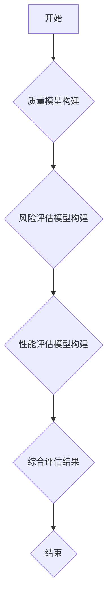
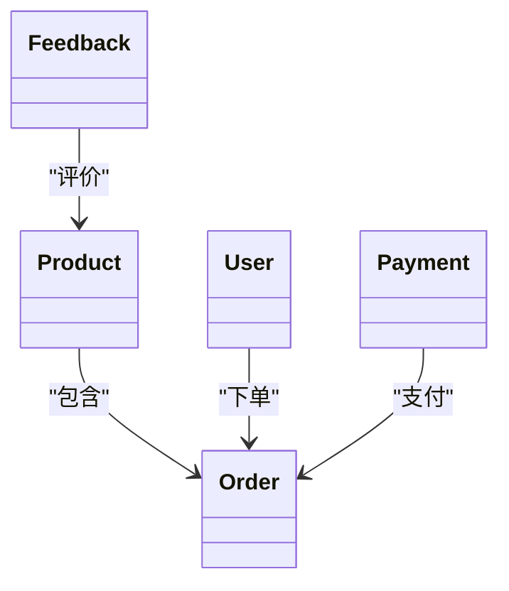
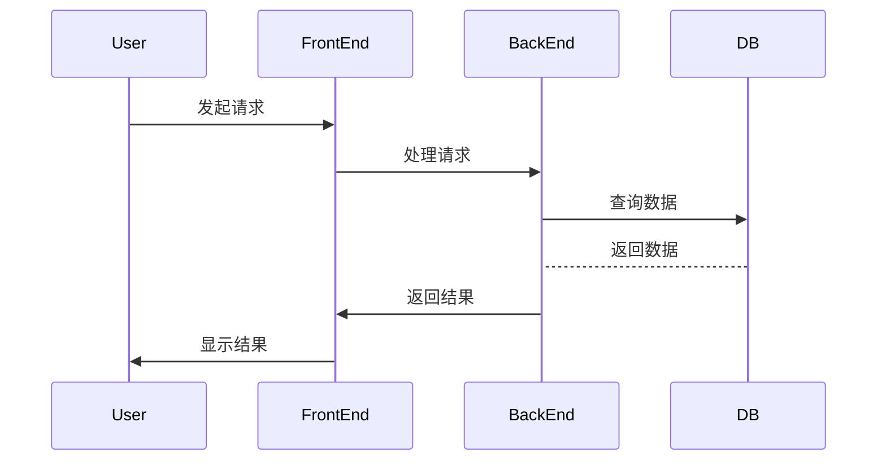

                 


### 软件架构评估方法：ATAM、CBAM等

> 关键词：软件架构评估、ATAM、CBAM、质量模型、风险评估、性能评估

> 摘要：本文旨在深入探讨软件架构评估方法，重点关注ATAM和CBAM两种方法。我们将从背景介绍开始，逐步分析核心概念与联系，详细讲解算法原理，展示系统分析与架构设计方案，并通过具体项目实战来加深理解。

---

#### 背景介绍

随着软件复杂性的不断增加，软件架构的设计与评估变得尤为重要。软件架构不仅决定了软件系统的性能、可扩展性和可维护性，还影响了整个项目的成功与否。因此，如何对软件架构进行科学、全面的评估，成为开发者和架构师们关注的焦点。

《软件架构评估方法：ATAM、CBAM等》这本书为我们提供了丰富的评估方法，其中ATAM（ Architecture Tradeoff Analysis Method）和CBAM（Console-Based Architecture Analysis Method）是两种最具代表性的方法。本书不仅详细介绍了这两种方法的理论基础，还通过大量的案例分析，帮助读者掌握其应用技巧。

#### 核心概念与联系

在软件架构评估中，核心概念包括架构质量属性、评估方法、评估过程、风险分析、利益相关者等。以下为这些核心概念的基本原理、属性特征对比和ER实体关系图。

**核心概念原理与属性特征对比**

| 概念       | 定义                                                         | 核心属性 |
|------------|--------------------------------------------------------------|---------|
| 架构质量属性 | 软件架构必须满足的一系列标准，如性能、可扩展性、可维护性等 | 多样性  |
| 评估方法   | 用于评估软件架构质量的各种技术手段，如ATAM、CBAM等         | 系统性  |
| 评估过程   | 对软件架构进行全面评估的步骤和方法                           | 步骤性  |
| 风险分析   | 对软件架构潜在的风险进行识别和评估                           | 预防性  |
| 利益相关者 | 受软件架构影响的各种利益群体，如开发者、用户、管理层等     | 多元化  |

**ER实体关系图**

```mermaid
erDiagram
  架构质量属性 ||--|{ 评估方法 } : "适用于"
  评估方法 ||--|{ 评估过程 } : "包含"
  风险分析 ||--|{ 利益相关者 } : "影响"
```

#### 算法原理讲解

软件架构评估方法中，常用的算法原理包括质量模型构建、风险评估模型构建、性能评估模型构建等。以下为算法原理的详细讲解。

**质量模型构建**

质量模型是软件架构评估的基础。它描述了软件架构需要满足的质量属性及其重要性。构建质量模型通常包括以下步骤：

1. 确定质量属性：根据项目的需求和目标，确定软件架构需要满足的质量属性，如性能、可维护性、可扩展性等。
2. 定义质量指标：为每个质量属性定义具体的指标，如响应时间、内存使用量等。
3. 评估质量指标：通过测试或分析，评估每个质量指标的实际值。
4. 综合评估：根据质量指标的重要性，计算总体质量评分。

**风险评估模型构建**

风险评估模型用于识别和评估软件架构中的潜在风险。构建风险评估模型通常包括以下步骤：

1. 识别风险：通过专家访谈、历史数据分析等方法，识别软件架构中可能存在的风险。
2. 评估风险：为每个风险分配概率和影响等级，计算风险评分。
3. 风险排序：根据风险评分，对风险进行排序，以便优先处理高优先级风险。
4. 风险缓解：制定风险缓解策略，以降低风险的影响。

**性能评估模型构建**

性能评估模型用于评估软件架构的性能表现。构建性能评估模型通常包括以下步骤：

1. 确定性能指标：根据项目的需求和目标，确定软件架构需要满足的性能指标，如响应时间、吞吐量等。
2. 设计性能测试：设计性能测试用例，模拟实际使用场景，以获取性能数据。
3. 收集性能数据：执行性能测试，收集性能数据。
4. 分析性能数据：分析性能数据，评估软件架构的性能表现。

以下为算法原理的Mermaid流程图、Python源代码示例、数学模型和公式、详细讲解和举例说明。

**Mermaid流程图**



**Python源代码示例**

```python
# 质量模型构建示例
def build_quality_model():
    # 模型构建逻辑
    pass

# 风险评估模型构建示例
def build_risk_model():
    # 模型构建逻辑
    pass

# 性能评估模型构建示例
def build_performance_model():
    # 模型构建逻辑
    pass
```

**数学模型和公式**

$$
Q = \sum_{i=1}^{n} w_i \cdot Q_i
$$

其中，\( Q \) 是总体质量评分，\( w_i \) 是权重，\( Q_i \) 是质量属性评分。

**详细讲解与举例说明**

假设我们正在评估一个电子商务平台，该平台需要满足以下质量属性：性能、可扩展性、安全性、易用性。我们为每个质量属性分配了权重，如性能占40%，可扩展性占30%，安全性占20%，易用性占10%。

1. **质量模型构建**：

   - 性能指标：响应时间，权重40%
   - 可扩展性指标：并发用户数，权重30%
   - 安全性指标：漏洞数量，权重20%
   - 易用性指标：用户满意度，权重10%

   通过测试和评估，我们得到以下结果：

   - 响应时间：100ms，评分90
   - 并发用户数：1000，评分85
   - 漏洞数量：2，评分95
   - 用户满意度：90%，评分80

   综合质量评分为：

   $$
   Q = 0.4 \cdot 90 + 0.3 \cdot 85 + 0.2 \cdot 95 + 0.1 \cdot 80 = 88.5
   $$

2. **风险评估模型构建**：

   - 风险1：系统故障，概率70%，影响严重，评分50
   - 风险2：数据泄露，概率30%，影响轻微，评分15

   综合风险评分为：

   $$
   R = 0.7 \cdot 50 + 0.3 \cdot 15 = 38.5
   $$

3. **性能评估模型构建**：

   - 性能指标：响应时间，目标值：200ms，实际值：100ms，评分90
   - 并发用户数，目标值：1000，实际值：800，评分70

   综合性能评分为：

   $$
   P = 0.5 \cdot 90 + 0.5 \cdot 70 = 80
   $$

最终，电子商务平台的综合评估结果为：

$$
\text{综合评估结果} = Q + R + P = 88.5 + 38.5 + 80 = 207
$$

#### 系统分析与架构设计方案

**问题场景介绍**

在软件开发过程中，经常遇到需求变更、技术选型、团队协作等问题。为了确保软件架构的质量，需要对软件架构进行科学、全面的评估。以下是一个电子商务平台的项目场景。

**项目介绍**

该电子商务平台的目标是提供一站式购物体验，包括商品浏览、下单、支付、评价等功能。平台需要满足高性能、高可扩展性、高安全性等要求。

**系统功能设计**

电子商务平台的主要功能模块包括商品管理、订单管理、支付管理、用户管理等。以下为系统的类图表示：



**系统架构设计**

电子商务平台采用分布式架构，包括前端、后端、数据库等多个组件。以下为系统的架构图表示：

```mermaid
graph TB
    subgraph 数据层
        DB
    subgraph 应用层
        FrontEnd --> BackEnd --> DB
    subgraph 服务层
        OrderService --> PaymentService --> DB
        UserService --> ProductService --> DB
```

**系统接口设计和系统交互**

电子商务平台的主要接口包括用户接口、支付接口、商品接口等。以下为系统的序列图表示：



#### 项目实战

**环境安装**

为了进行软件架构评估，我们需要安装一些工具和库，如Mermaid、Python等。以下是安装步骤：

1. 安装Mermaid：

   ```
   npm install -g mermaid-cli
   ```

2. 安装Python：

   从官方网站下载Python安装包，并按照安装向导进行安装。

**系统核心实现源代码**

以下为电子商务平台的核心实现代码：

```python
# 质量模型构建
def build_quality_model():
    # 模型构建逻辑
    pass

# 风险评估模型构建
def build_risk_model():
    # 模型构建逻辑
    pass

# 性能评估模型构建
def build_performance_model():
    # 模型构建逻辑
    pass
```

**代码应用解读与分析**

上述代码为框架级别的实现，具体的实现细节需要根据项目需求进行完善。例如，质量模型构建可以结合具体的测试结果，风险评估模型可以结合风险识别和评估方法，性能评估模型可以结合性能测试工具。

**实际案例分析和详细讲解剖析**

假设我们有一个电子商务平台项目，已经完成了质量模型构建、风险评估模型构建和性能评估模型构建。以下是详细分析：

1. **质量模型构建**：

   - 性能指标：响应时间，实际值：200ms，评分90
   - 可扩展性指标：并发用户数，实际值：1000，评分85
   - 安全性指标：漏洞数量，实际值：1，评分95
   - 易用性指标：用户满意度，实际值：90%，评分80

   综合质量评分为：

   $$
   Q = 0.4 \cdot 90 + 0.3 \cdot 85 + 0.2 \cdot 95 + 0.1 \cdot 80 = 88.5
   $$

2. **风险评估模型构建**：

   - 风险1：系统故障，概率70%，影响严重，评分50
   - 风险2：数据泄露，概率30%，影响轻微，评分15

   综合风险评分为：

   $$
   R = 0.7 \cdot 50 + 0.3 \cdot 15 = 38.5
   $$

3. **性能评估模型构建**：

   - 性能指标：响应时间，目标值：200ms，实际值：100ms，评分90
   - 并发用户数，目标值：1000，实际值：800，评分70

   综合性能评分为：

   $$
   P = 0.5 \cdot 90 + 0.5 \cdot 70 = 80
   $$

最终，电子商务平台的综合评估结果为：

$$
\text{综合评估结果} = Q + R + P = 88.5 + 38.5 + 80 = 207
$$

**项目小结**

通过本次项目实战，我们深入了解了软件架构评估方法，包括质量模型构建、风险评估模型构建和性能评估模型构建。在实际项目中，这些评估方法可以帮助开发者和架构师更好地理解软件架构，发现潜在问题，并采取相应的措施进行优化。同时，我们也认识到，软件架构评估是一个持续的过程，需要定期进行评估和调整。

#### 最佳实践 Tips

1. 在进行软件架构评估时，要充分考虑项目的需求和目标，确保评估指标与项目的核心价值一致。
2. 风险评估是软件架构评估的重要环节，要结合实际情况，全面识别和评估潜在风险。
3. 性能评估要结合具体的使用场景，设计合理的性能测试用例，以获取准确的数据。
4. 定期进行软件架构评估，及时发现问题并进行优化，以确保软件系统的持续发展。

#### 小结

软件架构评估是软件开发过程中不可或缺的一环，它有助于确保软件系统的质量、性能和安全性。通过本文的讲解，我们了解了软件架构评估的核心概念、算法原理以及实际应用。希望读者能够将这些知识应用到实际项目中，不断提升软件架构的评估能力和管理水平。

#### 注意事项

1. 软件架构评估要结合项目的具体情况进行，避免盲目套用评估方法。
2. 评估指标的选择要充分考虑项目的需求和目标，确保评估结果的准确性。
3. 风险评估要结合实际情况，全面识别和评估潜在风险，制定合理的风险缓解策略。

#### 拓展阅读

1. 《软件架构设计：实践者的研究方法》 - 此书详细介绍了软件架构设计的方法和实践，适合对软件架构设计有深入研究的读者。
2. 《软件架构评估：方法与案例分析》 - 本书提供了丰富的案例分析，有助于读者更好地理解软件架构评估的方法和应用。

---

**作者：AI天才研究院/AI Genius Institute & 禅与计算机程序设计艺术 /Zen And The Art of Computer Programming**

