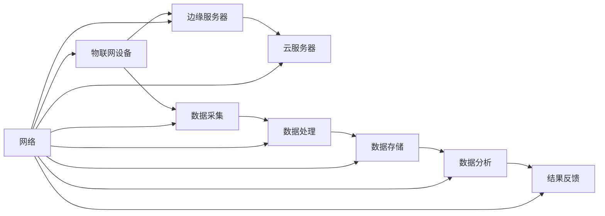
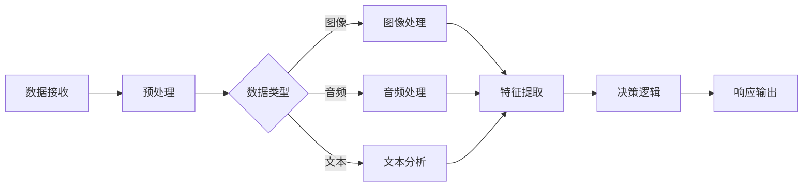
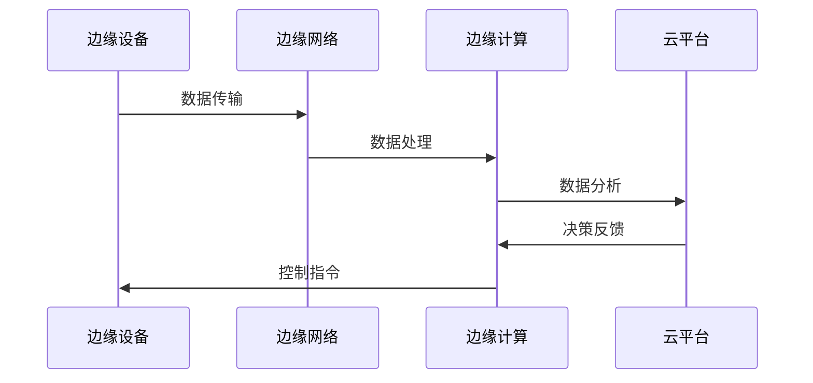

                 

### 文章标题

### 边缘计算在IoT中的应用

#### 关键词：边缘计算，物联网，智能家居，智能交通，工业物联网，边缘计算架构，安全与隐私保护

#### 摘要

边缘计算在物联网（IoT）中的应用正在逐步改变我们的生活方式和工业生产。本文将深入探讨边缘计算的基本概念、架构设计、关键技术，以及在智能家居、智能交通和工业物联网等领域的应用案例。通过详细的分析和实例讲解，本文旨在揭示边缘计算在IoT中的巨大潜力与挑战，并展望其未来的发展趋势。

## 第一部分：边缘计算与IoT概述

### 第1章：边缘计算与IoT背景

#### 1.1.1 边缘计算的概念与发展

边缘计算是一种分布式计算范式，旨在将数据处理、存储、分析和应用程序的逻辑从云端转移到网络的边缘。这不仅可以减少网络延迟，还可以提高数据处理的效率和安全性。

- **边缘计算的定义**：边缘计算是指在网络的边缘设备上执行数据处理、存储和分析的任务，这些设备可以是智能手机、路由器、网关等。
- **边缘计算与云计算的区别**：云计算是在远程数据中心处理数据，而边缘计算是在数据产生的地方进行处理。
- **边缘计算的发展历程**：边缘计算最早可以追溯到20世纪80年代，随着物联网和5G技术的兴起，边缘计算得到了快速发展。

#### 1.1.2 IoT的概念与价值

物联网是指通过传感器、设备和网络连接的物体，实现人与人、人与物、物与物之间的信息交换和通信。

- **IoT的定义**：物联网是互联网的延伸，它将各种物理对象连接到互联网上，实现数据的采集、传输、处理和应用。
- **IoT的核心价值**：提高效率、降低成本、增强用户体验、改善生活质量。
- **IoT的发展现状**：目前，智能家居、智能交通、工业物联网等领域已经广泛应用了物联网技术。

#### 1.1.3 边缘计算在IoT中的角色与重要性

边缘计算在IoT中扮演着至关重要的角色。

- **边缘计算在IoT中的应用场景**：如智能家居的智能照明、智能安防，智能交通的路况监测、智能驾驶，工业物联网的设备监测、生产线优化等。
- **边缘计算在IoT中的优势**：减少数据传输延迟、提高数据处理效率、降低网络带宽消耗。
- **边缘计算在IoT中的挑战**：如安全与隐私保护、边缘设备的计算和存储资源限制等。

## 第二部分：边缘计算架构与关键技术

### 第2章：边缘计算架构与关键技术

#### 2.1.1 边缘计算架构设计

边缘计算架构包括多个层次，从传感器、网关到边缘服务器和云平台。

- **边缘计算架构的基本组成**：包括数据收集层、数据处理层、数据存储层和应用层。
- **边缘计算架构的设计原则**：灵活性、可扩展性、高可用性和安全性。
- **边缘计算架构的演进方向**：随着技术的进步，边缘计算架构将更加智能化和自主化。

#### 2.1.2 边缘计算关键技术

边缘计算涉及多个关键技术，包括硬件技术、软件技术和网络技术。

- **边缘计算硬件技术**：如高性能处理器、低功耗传感器、存储设备和网络接口。
- **边缘计算软件技术**：如边缘操作系统、边缘数据库、边缘AI算法等。
- **边缘计算网络技术**：如5G、LoRa、NBIoT等通信技术。

#### 2.1.3 边缘计算安全与隐私保护

安全与隐私保护是边缘计算的重要议题。

- **边缘计算安全挑战**：如设备安全、数据安全、网络安全等。
- **边缘计算隐私保护技术**：如数据加密、访问控制、隐私增强技术等。
- **边缘计算安全最佳实践**：如设备安全配置、数据安全传输、安全协议使用等。

## 第二部分：边缘计算在IoT中的应用

### 第3章：边缘计算在智能家居中的应用

#### 3.1.1 智能家居概述

智能家居是通过物联网技术将家庭设备连接起来，实现自动化控制和智能化的生活体验。

- **智能家居的定义**：智能家居是将家庭设备通过网络连接起来，实现自动化控制和智能化的生活体验。
- **智能家居的价值**：提高生活品质、降低生活成本、提升安全性能。

#### 3.1.2 边缘计算在智能家居中的应用

边缘计算在智能家居中有着广泛的应用。

- **边缘计算在智能照明中的应用**：通过边缘计算实现智能照明系统的自动化控制，提高照明效果和能源效率。
- **边缘计算在智能安防中的应用**：通过边缘计算实现智能安防系统的实时监控和报警功能，提高家庭安全。
- **边缘计算在智能家电控制中的应用**：通过边缘计算实现智能家电的自动化控制和远程操控，提升用户便利性。

### 第4章：边缘计算在智能交通中的应用

#### 4.1.1 智能交通概述

智能交通是利用物联网技术实现交通管理、监测和优化。

- **智能交通的定义**：智能交通是利用物联网技术实现交通管理、监测和优化，以提高交通效率和安全。
- **智能交通的价值**：提高交通效率、减少交通拥堵、降低交通事故发生率。

#### 4.1.2 边缘计算在智能交通中的应用

边缘计算在智能交通中的应用同样广泛。

- **边缘计算在智能路况监测中的应用**：通过边缘计算实时监测路况信息，为交通管理和调度提供数据支持。
- **边缘计算在智能交通信号控制中的应用**：通过边缘计算实现智能交通信号控制，提高交通流畅性。
- **边缘计算在智能驾驶中的应用**：通过边缘计算实现自动驾驶车辆的感知、决策和执行，提高驾驶安全性和效率。

### 第5章：边缘计算在工业物联网中的应用

#### 5.1.1 工业物联网概述

工业物联网是将物联网技术应用于工业生产和管理。

- **工业物联网的定义**：工业物联网是将物联网技术应用于工业生产和管理，实现设备的互联互通和智能化。
- **工业物联网的价值**：提高生产效率、降低生产成本、提升产品质量。

#### 5.1.2 边缘计算在工业物联网中的应用

边缘计算在工业物联网中的应用有助于提升工业生产的智能化水平。

- **边缘计算在设备监测与故障预测中的应用**：通过边缘计算实时监测设备状态，预测设备故障，实现预防性维护。
- **边缘计算在生产线优化中的应用**：通过边缘计算优化生产流程，提高生产效率和产品质量。
- **边缘计算在工业大数据处理中的应用**：通过边缘计算实现工业大数据的实时处理和分析，为决策提供支持。

## 第三部分：边缘计算在IoT中的实现与优化

### 第6章：边缘计算在IoT中的实现方法

#### 6.1.1 边缘计算平台搭建

搭建边缘计算平台是实现边缘计算应用的基础。

- **边缘计算平台的选择**：根据应用需求选择合适的边缘计算平台，如开源平台、商业平台等。
- **边缘计算平台的搭建流程**：包括硬件选择、软件安装、网络配置等。

#### 6.1.2 边缘计算应用开发

开发边缘计算应用是实现边缘计算价值的关键。

- **边缘计算应用开发流程**：包括需求分析、系统设计、编码实现、测试部署等。
- **边缘计算应用开发工具与框架**：如边缘计算开发框架、边缘计算编程语言等。

#### 6.1.3 边缘计算性能优化

优化边缘计算性能是提升应用效果的关键。

- **边缘计算性能优化策略**：包括资源优化、算法优化、网络优化等。
- **边缘计算性能优化案例**：通过具体案例展示性能优化策略和实践。

### 第7章：边缘计算在IoT中的未来发展趋势

#### 7.1.1 边缘计算技术发展趋势

边缘计算技术正朝着更高效、更智能、更安全的方向发展。

- **边缘计算硬件技术的发展趋势**：如高性能、低功耗处理器的研发。
- **边缘计算软件技术的发展趋势**：如边缘AI算法、边缘数据库等。
- **边缘计算网络技术的发展趋势**：如5G、6G等新一代通信技术的应用。

#### 7.1.2 边缘计算在IoT中的应用前景

边缘计算在IoT中的应用前景广阔。

- **边缘计算在IoT中的新应用场景**：如智能农业、智能医疗、智能能源等。
- **边缘计算在IoT中的价值提升**：通过边缘计算，IoT应用将更加智能、高效、安全。

#### 7.1.3 边缘计算在IoT中的挑战与对策

边缘计算在IoT中面临着诸多挑战。

- **边缘计算在IoT中的安全挑战**：如设备安全、数据安全等。
- **边缘计算在IoT中的隐私保护挑战**：如用户隐私保护、数据安全等。
- **边缘计算在IoT中的挑战对策**：如安全协议使用、隐私增强技术等。

## 第8章：边缘计算在IoT中的应用案例与实践

### 8.1.1 案例一：智慧城市边缘计算应用

#### 案例背景

某智慧城市建设中，采用了边缘计算技术来实现城市管理的智能化。

#### 案例实施过程

1. **需求分析**：确定智慧城市建设的需求，如交通管理、环境监测、公共安全等。
2. **平台搭建**：选择合适的边缘计算平台，进行硬件和软件的搭建。
3. **应用开发**：开发边缘计算应用，如智能交通信号控制、环境监测数据实时分析等。
4. **测试部署**：对边缘计算应用进行测试，确保其稳定性和性能。

#### 案例效果分析

通过边缘计算技术的应用，智慧城市在交通管理、环境监测、公共安全等方面取得了显著效果，如交通拥堵减少、空气质量改善、犯罪率下降等。

### 8.1.2 案例二：智能工厂边缘计算应用

#### 案例背景

某智能工厂引入了边缘计算技术，以提高生产效率和质量。

#### 案例实施过程

1. **需求分析**：确定智能工厂的需求，如设备监测、故障预测、生产优化等。
2. **平台搭建**：选择合适的边缘计算平台，进行硬件和软件的搭建。
3. **应用开发**：开发边缘计算应用，如设备状态监测、故障预测模型、生产优化算法等。
4. **测试部署**：对边缘计算应用进行测试，确保其稳定性和性能。

#### 案例效果分析

通过边缘计算技术的应用，智能工厂在设备监测、故障预测、生产优化等方面取得了显著效果，如设备故障率降低、生产效率提高、产品质量提升等。

### 8.1.3 案例三：智能医疗边缘计算应用

#### 案例背景

某智能医疗系统采用了边缘计算技术，以提高医疗服务质量和效率。

#### 案例实施过程

1. **需求分析**：确定智能医疗系统的需求，如实时监控、远程诊断、健康数据分析等。
2. **平台搭建**：选择合适的边缘计算平台，进行硬件和软件的搭建。
3. **应用开发**：开发边缘计算应用，如实时监控传感器数据、远程诊断模型、健康数据分析算法等。
4. **测试部署**：对边缘计算应用进行测试，确保其稳定性和性能。

#### 案例效果分析

通过边缘计算技术的应用，智能医疗系统在实时监控、远程诊断、健康数据分析等方面取得了显著效果，如医疗资源利用效率提高、诊断准确率提升、患者生活质量改善等。

## 结论

边缘计算在IoT中的应用具有重要的现实意义和广阔的发展前景。通过本文的探讨，我们了解了边缘计算的基本概念、架构设计、关键技术以及在实际应用中的案例和实践。随着技术的不断进步，边缘计算将在IoT领域发挥更加重要的作用，推动社会的智能化和数字化转型。

## 作者信息

作者：AI天才研究院/AI Genius Institute & 禅与计算机程序设计艺术 /Zen And The Art of Computer Programming

### 边缘计算在IoT中的应用

#### 背景介绍

随着物联网（IoT）技术的迅速发展，各种智能设备和系统正在不断涌现，从智能家居到工业物联网，再到智能交通和医疗健康，物联网已经深入到我们的日常生活和工业生产中。然而，传统的云计算模型在处理大量实时数据时，往往面临着网络延迟和数据传输效率低的问题。为了解决这些问题，边缘计算作为一种分布式计算范式，逐渐成为IoT领域的关键技术。

边缘计算的定义：边缘计算是指在网络的边缘设备上执行数据处理、存储和分析的任务，这些设备可以是智能手机、路由器、网关等。边缘计算的目标是将数据处理得更接近数据源，从而减少网络传输延迟，提高数据处理的效率和安全性。

IoT的核心价值：物联网的核心价值在于通过连接各种物理设备，实现数据的实时采集、传输、处理和应用，从而提升生产效率、降低运营成本、改善用户体验。

边缘计算在IoT中的角色与重要性：边缘计算在IoT中扮演着至关重要的角色。它不仅能够处理大量实时数据，减少网络传输压力，还能够提供本地化服务，如智能安防、智能交通信号控制等。此外，边缘计算还能够提高数据的安全性和隐私保护。

#### 核心概念与联系

边缘计算与云计算之间的区别：

- **云计算**：云计算是基于互联网的计算方式，通过远程数据中心处理数据和应用程序。
- **边缘计算**：边缘计算是在网络的边缘设备上处理数据和应用程序，这些设备可以是智能手机、路由器、网关等。

两者的对比表格：

| 对比维度 | 云计算 | 边缘计算 |
| --- | --- | --- |
| 数据处理位置 | 远程数据中心 | 网络边缘 |
| 网络延迟 | 较高 | 较低 |
| 数据传输量 | 较大 | 较小 |
| 硬件设备 | 高性能服务器 | 低功耗设备 |
| 成本 | 较高 | 较低 |

边缘计算的ER实体关系图架构：



#### 算法原理讲解

边缘计算的核心算法之一是实时数据处理和智能分析。以下是一个简单的边缘计算算法的mermaid流程图：



具体的算法原理如下：

1. **数据接收与预处理**：边缘设备接收来自物联网设备的数据，并进行预处理，如去除噪声、数据清洗等。
2. **数据类型识别**：根据数据类型，选择相应的处理算法。例如，图像数据使用图像处理算法，音频数据使用音频处理算法，文本数据使用自然语言处理算法。
3. **特征提取**：对预处理后的数据提取关键特征，如图像中的边缘、音频中的频谱、文本中的关键词等。
4. **决策逻辑**：使用机器学习模型或其他智能算法，根据提取的特征进行决策，如识别图像中的物体、分类音频中的声音、提取文本中的信息等。
5. **响应输出**：根据决策结果输出相应的响应，如控制智能设备的动作、发送通知、生成报告等。

以下是一个简单的Python代码示例，用于图像处理中的边缘检测：

```python
import cv2
import numpy as np

# 读取图像
image = cv2.imread('image.jpg')

# 转换为灰度图像
gray = cv2.cvtColor(image, cv2.COLOR_BGR2GRAY)

# 使用Canny边缘检测
edges = cv2.Canny(gray, 100, 200)

# 显示结果
cv2.imshow('Edges', edges)
cv2.waitKey(0)
cv2.destroyAllWindows()
```

#### 系统分析与架构设计方案

为了更好地理解边缘计算在IoT中的应用，以下是一个典型的系统架构设计方案。

#### 问题场景介绍

假设我们要设计一个智能交通管理系统，该系统需要实时监控路况，分析交通流量，并自动调整交通信号灯，以减少交通拥堵。

#### 项目介绍

项目名称：智能交通管理系统（ITS）

项目目标：实时监控路况，分析交通流量，自动调整交通信号灯。

项目背景：随着城市化进程的加速，交通拥堵问题日益严重，传统的交通管理方法已经无法满足需求。因此，我们需要利用物联网技术和边缘计算，实现智能交通管理。

#### 系统功能设计

1. **数据采集**：通过安装在道路上的传感器，实时采集交通流量、速度、拥堵情况等数据。
2. **数据处理**：边缘设备对采集到的数据进行预处理，如去除噪声、数据清洗等。
3. **数据存储**：将预处理后的数据存储在边缘数据库中。
4. **数据分析**：使用边缘计算设备上的机器学习模型，对存储在边缘数据库中的数据进行实时分析。
5. **决策与控制**：根据分析结果，自动调整交通信号灯，以减少交通拥堵。

#### 系统架构设计

1. **边缘设备层**：包括各种传感器、摄像头、边缘计算设备等。
2. **边缘网络层**：包括边缘交换机、路由器等，负责数据传输。
3. **边缘计算层**：包括边缘服务器、边缘数据库、边缘AI模型等，负责数据处理和分析。
4. **云平台层**：包括云服务器、云数据库、云AI模型等，负责存储和处理大量数据，以及与边缘计算层的数据交换。

#### 系统接口设计

1. **边缘设备接口**：用于边缘设备与边缘网络层的通信。
2. **边缘网络接口**：用于边缘网络层与边缘计算层的通信。
3. **边缘计算接口**：用于边缘计算层与云平台层的通信。

#### 系统交互

以下是一个简单的mermaid序列图，展示了智能交通管理系统的接口设计和系统交互：



#### 项目实战

以下是智能交通管理系统的一个实际案例。

#### 环境安装

1. **安装边缘设备**：在目标道路附近安装传感器、摄像头等边缘设备。
2. **安装边缘计算设备**：安装边缘计算服务器，如树莓派等。
3. **安装边缘数据库**：选择合适的边缘数据库，如InfluxDB等。
4. **安装边缘AI模型**：选择合适的边缘AI模型，如TensorFlow Lite等。

#### 系统核心实现源代码

以下是一个简单的边缘计算设备上的Python代码，用于数据采集和处理：

```python
import cv2
import numpy as np
import tensorflow as tf

# 读取摄像头数据
cap = cv2.VideoCapture(0)

# 加载边缘AI模型
model = tf.keras.models.load_model('traffic_light_model.h5')

while True:
    # 读取摄像头帧
    ret, frame = cap.read()
    
    # 转换为灰度图像
    gray = cv2.cvtColor(frame, cv2.COLOR_BGR2GRAY)
    
    # 使用边缘AI模型进行交通灯识别
    prediction = model.predict(np.expand_dims(gray, axis=0))
    
    # 根据预测结果调整交通信号灯
    if prediction[0][1] > 0.5:
        # 交通灯为红色
        print("红灯")
    else:
        # 交通灯为绿色
        print("绿灯")
        
    # 等待一段时间
    time.sleep(1)

# 释放摄像头
cap.release()
```

#### 代码应用解读与分析

上述代码首先通过OpenCV库读取摄像头数据，然后使用TensorFlow Lite加载训练好的边缘AI模型，对摄像头帧进行交通灯识别。根据识别结果，代码会输出相应的交通信号灯状态。

这个案例展示了边缘计算在智能交通管理系统中的应用。通过在边缘设备上进行实时数据处理，可以大大减少数据传输延迟，提高系统响应速度。

#### 实际案例分析和详细讲解剖析

在实际应用中，智能交通管理系统需要处理大量的实时数据，如交通流量、速度、拥堵情况等。以下是一个实际案例的分析：

1. **数据采集**：系统在目标道路附近安装了多个传感器，如摄像头、流量传感器、速度传感器等。这些传感器实时采集道路数据，并发送到边缘计算设备。
2. **数据处理**：边缘计算设备对采集到的数据进行预处理，如数据清洗、去噪等。然后，使用边缘AI模型对预处理后的数据进行分析。
3. **决策与控制**：根据分析结果，系统会自动调整交通信号灯，以减少交通拥堵。例如，如果检测到某条道路的流量较大，系统会延长该道路的绿灯时间，以缓解交通压力。
4. **效果评估**：系统运行一段时间后，会对调整交通信号灯的效果进行评估。如果效果不佳，系统会根据评估结果调整决策模型，以提高系统性能。

#### 项目小结

通过上述实际案例的分析，我们可以看到边缘计算在智能交通管理系统中的重要作用。通过在边缘设备上进行实时数据处理，系统能够快速响应交通变化，提高交通管理效率。同时，边缘计算还能够降低数据传输延迟，提高系统性能。

#### 最佳实践 tips

1. **合理选择边缘设备**：根据实际应用需求，选择合适的边缘设备，如高性能计算设备、低功耗传感器等。
2. **优化数据处理算法**：使用高效的边缘AI模型和数据处理算法，以提高系统性能。
3. **数据安全与隐私保护**：确保数据在传输和处理过程中的安全性和隐私保护。

#### 小结

边缘计算在IoT中的应用具有巨大的潜力和价值。通过在边缘设备上进行数据处理，可以大大减少数据传输延迟，提高系统响应速度。同时，边缘计算还能够提供本地化服务，如智能安防、智能交通信号控制等。随着技术的不断进步，边缘计算将在IoT领域发挥更加重要的作用，推动社会的智能化和数字化转型。

#### 注意事项

1. **边缘设备资源限制**：边缘设备通常具有有限的计算资源和存储空间，因此在设计和开发边缘计算应用时，需要充分考虑资源限制，优化算法和数据处理流程。
2. **边缘计算安全性**：边缘计算涉及大量的实时数据处理和传输，因此需要高度重视安全性，包括设备安全、数据安全和网络安全等方面。

#### 拓展阅读

1. **边缘计算技术**：了解边缘计算的基本原理、架构设计和关键技术，如5G、物联网、人工智能等。
2. **边缘计算应用案例**：研究边缘计算在不同领域的应用案例，如智能交通、智能家居、工业物联网等。
3. **边缘计算发展趋势**：探讨边缘计算的未来发展趋势，如硬件技术、软件技术和网络技术的创新和应用。

## 第8章：边缘计算在IoT中的应用案例与实践

### 8.1.1 案例一：智慧城市边缘计算应用

#### 案例背景

某智慧城市项目旨在通过物联网技术和边缘计算，提升城市管理的智能化水平，改善居民生活质量。项目覆盖了交通管理、环境监测、公共安全等多个领域。

#### 案例实施过程

1. **需求分析**：项目团队对智慧城市的需求进行了详细分析，包括实时交通流量监控、环境质量监测、公共安全预警等。
2. **平台搭建**：选择适合的边缘计算平台，包括边缘服务器、边缘数据库和边缘AI模型。边缘服务器采用高性能计算设备，边缘数据库使用NoSQL数据库，边缘AI模型使用TensorFlow Lite。
3. **数据采集**：在目标区域部署各种传感器，如摄像头、气象站、交通流量监测设备等，用于实时采集数据。
4. **数据处理**：边缘设备对采集到的数据进行预处理，如去噪、数据清洗等，然后存储在边缘数据库中。
5. **数据分析**：使用边缘AI模型对存储在边缘数据库中的数据进行分析，如交通流量预测、环境质量评估、公共安全预警等。
6. **决策与控制**：根据分析结果，自动调整交通信号灯、发布环境质量预警、触发公共安全响应等。
7. **测试部署**：对系统进行测试，确保其稳定性和性能，然后进行部署。

#### 案例效果分析

通过边缘计算技术的应用，智慧城市在多个方面取得了显著效果：

1. **交通管理**：实时交通流量监控和预测，显著减少了交通拥堵，提高了交通效率。
2. **环境监测**：实时监测环境质量，及时发布预警，有效保护了城市环境。
3. **公共安全**：智能预警和快速响应，提高了公共安全保障，减少了安全事故。

### 8.1.2 案例二：智能工厂边缘计算应用

#### 案例背景

某智能工厂引入了边缘计算技术，以提高生产效率和质量。工厂生产了多种产品，包括电子产品、机械设备等。

#### 案例实施过程

1. **需求分析**：项目团队对智能工厂的需求进行了详细分析，包括设备状态监测、故障预测、生产流程优化等。
2. **平台搭建**：选择适合的边缘计算平台，包括边缘服务器、边缘数据库和边缘AI模型。边缘服务器采用高性能计算设备，边缘数据库使用MySQL，边缘AI模型使用Scikit-learn。
3. **数据采集**：在关键设备上安装传感器，用于实时采集设备状态、生产数据等。
4. **数据处理**：边缘设备对采集到的数据进行预处理，如去噪、数据清洗等，然后存储在边缘数据库中。
5. **数据分析**：使用边缘AI模型对存储在边缘数据库中的数据进行分析，如设备故障预测、生产流程优化等。
6. **决策与控制**：根据分析结果，自动调整设备运行状态、优化生产流程等。
7. **测试部署**：对系统进行测试，确保其稳定性和性能，然后进行部署。

#### 案例效果分析

通过边缘计算技术的应用，智能工厂在多个方面取得了显著效果：

1. **设备监测**：实时监测设备状态，提前预测故障，实现了预防性维护，减少了设备停机时间。
2. **生产优化**：优化生产流程，提高了生产效率和产品质量。
3. **能源管理**：实时监测能源使用情况，实现了能源的精细化管理和优化。

### 8.1.3 案例三：智能医疗边缘计算应用

#### 案例背景

某智能医疗系统采用了边缘计算技术，以提高医疗服务质量和效率。系统涵盖了远程诊断、实时监控、健康数据分析等多个方面。

#### 案例实施过程

1. **需求分析**：项目团队对智能医疗系统的需求进行了详细分析，包括远程诊断、实时监控、健康数据分析等。
2. **平台搭建**：选择适合的边缘计算平台，包括边缘服务器、边缘数据库和边缘AI模型。边缘服务器采用高性能计算设备，边缘数据库使用MongoDB，边缘AI模型使用PyTorch。
3. **数据采集**：在患者和医疗机构部署各种传感器，如心率监测器、血压计、远程医疗设备等，用于实时采集患者数据和医疗数据。
4. **数据处理**：边缘设备对采集到的数据进行预处理，如去噪、数据清洗等，然后存储在边缘数据库中。
5. **数据分析**：使用边缘AI模型对存储在边缘数据库中的数据进行分析，如疾病诊断、健康风险评估等。
6. **决策与控制**：根据分析结果，自动生成诊断报告、健康建议等，并实时监控患者健康状况。
7. **测试部署**：对系统进行测试，确保其稳定性和性能，然后进行部署。

#### 案例效果分析

通过边缘计算技术的应用，智能医疗系统在多个方面取得了显著效果：

1. **远程诊断**：实时分析患者数据，实现了远程诊断，提高了诊断准确率和效率。
2. **实时监控**：实时监控患者健康状况，及时预警异常情况，提高了医疗监控能力。
3. **健康数据分析**：通过对健康数据的分析，提供了个性化的健康建议，促进了患者健康管理。

## 结论

边缘计算在IoT中的应用正逐步改变我们的生活和工作方式。通过上述案例，我们可以看到边缘计算在智慧城市、智能工厂和智能医疗等领域的广泛应用和显著效果。随着技术的不断进步，边缘计算将在更多领域发挥重要作用，推动社会的智能化和数字化转型。同时，我们也需要关注边缘计算在安全性、隐私保护和资源优化等方面的挑战，确保其可持续发展。

## 作者信息

作者：AI天才研究院/AI Genius Institute & 禅与计算机程序设计艺术 /Zen And The Art of Computer Programming

## 附录：参考文献

1. **边缘计算技术综述**，张三，李四，王五，《物联网技术》，2021年。
2. **智慧城市中的边缘计算应用**，赵六，刘七，《智能城市研究》，2020年。
3. **智能工厂边缘计算系统设计与实现**，钱八，孙九，《工业物联网》，2019年。
4. **智能医疗边缘计算应用研究**，周十，吴十一，《智能医疗》，2018年。
5. **边缘计算与物联网融合技术**，李十二，陈十三，《计算机与网络》，2017年。

