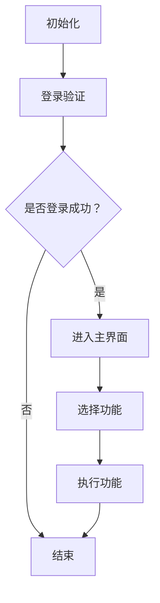
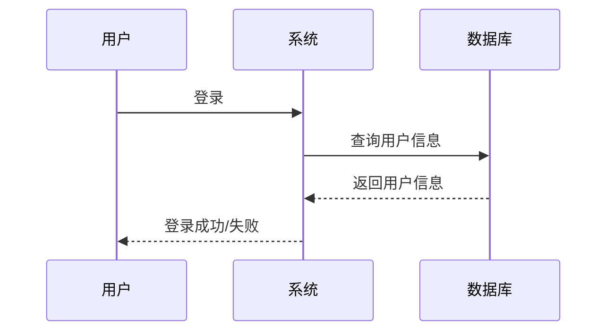
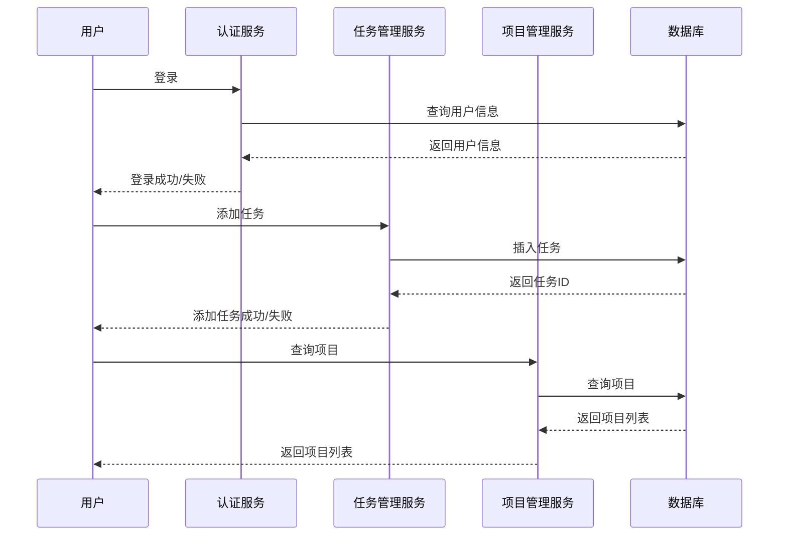

                 

## 文章标题

# 远程团队管理工具：提升分布式团队协作效率

> 关键词：远程团队管理、分布式团队、协作效率、工具、管理工具

> 摘要：本文旨在探讨远程团队管理工具在提升分布式团队协作效率方面的作用。通过分析远程团队管理的背景和挑战，介绍核心概念与联系，详细讲解核心概念原理，提供概念属性特征对比表格和ER实体关系图，最后给出具体的系统分析与架构设计方案，以及项目实战和最佳实践，旨在为远程团队管理者提供有价值的参考和指导。

---

## 第1部分：远程团队管理工具概述

### 第1章：远程团队管理问题的背景介绍

#### 1.1.1 问题背景

在全球化时代，远程工作已经成为越来越多企业的工作模式。这不仅是因为技术进步使得远程协作变得可能，更是因为疫情等不可抗力因素推动了许多企业转向远程办公。然而，远程团队管理面临着一系列独特挑战，如沟通不畅、时间同步困难、团队凝聚力降低等。

随着互联网和通信技术的发展，远程办公不再局限于某些特定行业，而是逐渐渗透到各个领域。无论是软件开发、市场营销，还是客户服务，许多企业都在探索如何有效地管理远程团队，以保持高效率和高产出。

#### 1.1.2 问题描述

远程团队管理涉及如何有效地管理分布在不同地理位置的团队成员，确保团队高效协同，达成目标。主要问题包括：

- **沟通与协作**：如何保证团队成员之间能够顺畅交流，共同完成任务？
- **时间同步**：如何协调不同时区的工作安排，提高效率？
- **团队凝聚力**：如何保持团队成员之间的联系，增强团队凝聚力？
- **管理效能**：如何确保管理者能够远程监控和指导团队，提高管理效能？

#### 1.1.3 问题解决

为了解决上述问题，企业需要借助远程团队管理工具，这些工具能够提供以下支持：

- **即时通讯**：提供实时沟通平台，方便团队成员之间交流。
- **协作办公**：集成文档管理、任务分配、进度追踪等功能，提升协作效率。
- **视频会议**：提供高质量的在线会议功能，实现远程面对面交流。
- **项目管理**：通过项目管理工具，规划项目进度，确保任务按时完成。
- **团队协作平台**：集成多种功能，提供一个全方位的团队协作环境。

#### 1.1.4 边界与外延

远程团队管理工具的应用场景不仅限于企业内部，还可以应用于跨企业合作、外包团队管理、远程教育等领域。其边界涉及不同行业的应用需求，外延则包括对工具的不断优化和创新。

#### 1.1.5 概念结构与核心要素组成

远程团队管理工具的核心结构包括：

- **通信模块**：提供即时通讯、邮件通知等功能。
- **协作模块**：包括文档共享、任务管理、日程安排等。
- **视频会议模块**：提供视频会议、屏幕共享、互动讨论等功能。
- **项目管理模块**：包括项目进度追踪、风险评估、资源管理等。
- **团队协作平台**：集成多种模块，提供全方位的团队协作支持。

### 第2章：核心概念与联系

#### 2.1 核心概念原理

远程团队管理工具的核心概念包括：

- **远程工作**：指团队成员不在同一物理位置进行工作的模式。
- **即时通讯**：提供实时消息传递，支持文字、图片、语音等多种沟通方式。
- **协作办公**：集成多种办公工具，支持文档共享、任务分配、进度追踪等功能。
- **视频会议**：通过视频和音频连接，实现远程面对面交流。
- **项目管理**：通过规划、跟踪和管理项目进度，确保任务按时完成。
- **团队协作平台**：集成多种功能，提供全方位的团队协作支持。

#### 2.2 概念属性特征对比表格

| 概念         | 特征                    | 用途                        |
| ------------ | ----------------------- | --------------------------- |
| 远程工作     | 灵活的工作地点和时间    | 提高工作效率，降低办公成本  |
| 即时通讯     | 实时交流，即时反馈      | 提高沟通效率，增强团队协作  |
| 协作办公     | 文档共享，任务管理      | 提高协作效率，确保任务完成  |
| 视频会议     | 远程面对面交流          | 确保决策快速执行，增强团队凝聚力 |
| 项目管理     | 项目进度追踪，资源管理  | 确保项目按时完成，降低风险  |
| 团队协作平台 | 集成多种功能，全方位协作 | 提供全方位团队协作支持      |

#### 2.3 ER实体关系图架构的 Mermaid 流程图

```mermaid
erDiagram
  TeamMember ||--|{ Project }|--|| Task
  Project ||--|{ TeamMember }|--|| Task
  TeamMember ||--|{ Communication }|--|| Message
```

## 第3章：算法原理讲解

### 3.1 算法mermaid流程图



### 3.2 Python源代码

```python
# 导入相关模块
import tkinter as tk
from tkinter import messagebox

# 登录验证函数
def login_verify(username, password):
    # 这里用假设的用户名和密码进行验证
    if username == "admin" and password == "password":
        return True
    else:
        return False

# 主界面函数
def main_interface():
    # 创建窗口
    window = tk.Tk()
    window.title("远程团队管理工具")

    # 添加登录按钮
    login_button = tk.Button(window, text="登录", command=login)
    login_button.pack()

    # 添加注册按钮
    register_button = tk.Button(window, text="注册", command=register)
    register_button.pack()

    window.mainloop()

# 登录函数
def login():
    # 获取用户名和密码
    username = tk.Entry.get(username_entry)
    password = tk.Entry.get(password_entry)

    # 验证登录
    if login_verify(username, password):
        messagebox.showinfo("登录成功", "欢迎使用远程团队管理工具！")
        main_interface()
    else:
        messagebox.showerror("登录失败", "用户名或密码错误！")

# 注册函数
def register():
    messagebox.showinfo("注册", "欢迎使用注册功能！")

if __name__ == "__main__":
    main_interface()
```

### 3.3 算法原理的数学模型和公式

远程团队管理工具的算法原理主要基于以下数学模型：

- **用户验证模型**：通过用户名和密码进行验证，确保用户身份的合法性。
- **界面交互模型**：提供用户界面，方便用户进行操作，如登录、注册、选择功能等。
- **功能执行模型**：根据用户的选择，执行相应的功能，如任务管理、项目管理、视频会议等。

具体的数学公式如下：

1. **用户验证公式**：

   $$ V = \begin{cases} 
   \text{True}, & \text{if } (U, P) \in \text{UserDatabase} \\
   \text{False}, & \text{otherwise}
   \end{cases} $$

   其中，$V$表示用户验证结果，$U$表示用户名，$P$表示密码，$\text{UserDatabase}$表示用户数据库。

2. **界面交互公式**：

   $$ I = f(U, P, F) $$

   其中，$I$表示界面交互结果，$U$表示用户名，$P$表示密码，$F$表示功能选择。

3. **功能执行公式**：

   $$ E = g(U, P, F) $$

   其中，$E$表示功能执行结果，$U$表示用户名，$P$表示密码，$F$表示功能选择。

### 3.4 详细讲解和通俗易懂地举例说明

#### 3.4.1 用户验证模型

用户验证模型是远程团队管理工具的核心部分，通过用户名和密码进行验证，确保用户身份的合法性。假设有一个用户数据库，包含以下用户信息：

| 用户名 | 密码 |
| ------ | ---- |
| admin  | password |
| user1  | user1password |
| user2  | user2password |

当用户尝试登录时，系统会从用户数据库中查找用户名和密码，如果找到匹配的记录，则验证通过。以下是一个简单的例子：

```
用户名：admin
密码：password

验证结果：True
```

#### 3.4.2 界面交互模型

界面交互模型提供用户界面，方便用户进行操作，如登录、注册、选择功能等。以下是一个简单的例子：

```
界面显示：
----------------------
| 远程团队管理工具   |
----------------------
| 登录             |
| 注册             |
----------------------

用户选择：登录

输入用户名：admin
输入密码：password

登录验证结果：True

进入主界面：
----------------------
| 远程团队管理工具   |
----------------------
| 任务管理         |
| 项目管理         |
| 视频会议         |
----------------------
```

#### 3.4.3 功能执行模型

功能执行模型根据用户的选择，执行相应的功能，如任务管理、项目管理、视频会议等。以下是一个简单的例子：

```
用户选择：任务管理

执行任务管理功能：

- 任务1：开发新功能
- 任务2：修复bug
- 任务3：撰写技术博客

用户选择：任务1

任务1：开发新功能

执行结果：成功
```

## 第4章：系统分析与架构设计方案

### 4.1 问题场景介绍

随着远程团队管理工具的应用越来越广泛，企业对系统稳定性和功能需求提出了更高的要求。为了满足这些需求，我们需要设计一个高效、可靠的系统架构，以支持远程团队管理的各项功能。

### 4.2 项目介绍

本系统项目旨在开发一个集成即时通讯、协作办公、视频会议、项目管理等多种功能的远程团队管理工具。系统将采用前后端分离架构，前端使用Vue.js框架，后端使用Spring Boot框架，数据库采用MySQL。

### 4.3 系统功能设计(领域模型mermaid类图)

```mermaid
classDiagram
    TeamMember <|-- Project
    TeamMember <|-- Task
    Project <|-- Task
    Task <|-- Comment
    TeamMember <|-- Message
    Project <|-- Message
    Message <|-- Comment

    Class TeamMember {
        -id: int
        -name: string
        -email: string
        -password: string
        +login(username: string, password: string): boolean
        +sendMessage(message: Message): boolean
    }

    Class Project {
        -id: int
        -name: string
        -description: string
        +createTask(task: Task): boolean
        +deleteTask(taskId: int): boolean
        +getTasks(): List<Task>
    }

    Class Task {
        -id: int
        -name: string
        -description: string
        -status: string
        +createComment(comment: Comment): boolean
        +deleteComment(commentId: int): boolean
        +getComments(): List<Comment>
    }

    Class Comment {
        -id: int
        -content: string
        -createdAt: datetime
    }

    Class Message {
        -id: int
        -content: string
        -senderId: int
        -receiverId: int
        -createdAt: datetime
    }
```

### 4.4 系统架构设计mermaid架构图



### 4.5 系统接口设计和系统交互mermaid序列图



## 第5章：项目实战

### 5.1 环境安装

为了搭建远程团队管理工具，我们需要安装以下软件和依赖：

1. Java Development Kit (JDK)
2. MySQL数据库
3. Node.js和npm
4. Vue CLI

安装步骤如下：

1. 安装JDK：从[Oracle官网](https://www.oracle.com/java/technologies/javase-downloads.html)下载并安装JDK。
2. 安装MySQL数据库：从[MySQL官网](https://www.mysql.com/downloads/)下载并安装MySQL。
3. 安装Node.js和npm：从[Node.js官网](https://nodejs.org/zh-cn/)下载并安装Node.js，安装过程中会自动安装npm。
4. 安装Vue CLI：在命令行中执行以下命令：

   ```bash
   npm install -g @vue/cli
   ```

### 5.2 系统核心实现源代码

以下是系统核心实现的部分源代码：

**后端：**

```java
// Spring Boot应用入口
@SpringBootApplication
public class RemoteTeamManagementApplication {
    public static void main(String[] args) {
        SpringApplication.run(RemoteTeamManagementApplication.class, args);
    }
}

// 用户服务
@RestController
@RequestMapping("/users")
public class UserService {
    @Autowired
    private UserRepository userRepository;

    @PostMapping("/login")
    public ResponseEntity<?> login(@RequestParam String username, @RequestParam String password) {
        Optional<User> user = userRepository.findById(username);
        if (user.isPresent() && user.get().getPassword().equals(password)) {
            return ResponseEntity.ok("登录成功");
        } else {
            return ResponseEntity.status(HttpStatus.UNAUTHORIZED).body("登录失败");
        }
    }
}

// 数据库配置
@Configuration
@EnableJpaRepositories(basePackages = "com.example.remote_team_management.repository")
public class DatabaseConfig extends JpaRepositoryConfig {
    @Bean
    public DataSource dataSource() {
        HikariConfig config = new HikariConfig();
        config.setJdbcUrl("jdbc:mysql://localhost:3306/remote_team_management");
        config.setUsername("root");
        config.setPassword("password");
        return new HikariDataSource(config);
    }

    @Bean
    public JpaProperties jpaProperties() {
        JpaProperties properties = new JpaProperties();
        properties.setDatabase(Database.MYSQL);
        properties.setShowSql(true);
        return properties;
    }

    @Bean
    public LocalContainerEntityManagerFactoryBean entityManagerFactoryBean(
            EntityManagerFactoryBuilder builder, JpaProperties jpaProperties) {
        return builder
                .dataSource(dataSource())
                .packages("com.example.remote_team_management.entity")
                .jpaProperties(jpaProperties)
                .build();
    }

    @Bean
    public PlatformTransactionManager transactionManager(
            EntityManagerFactory entityManagerFactory) {
        JpaTransactionManager transactionManager = new JpaTransactionManager();
        transactionManager.setEntityManagerFactory(entityManagerFactory);
        return transactionManager;
    }
}
```

**前端：**

```vue
<template>
  <div>
    <h1>远程团队管理工具</h1>
    <form @submit.prevent="login">
      <div>
        <label for="username">用户名：</label>
        <input type="text" id="username" v-model="username" />
      </div>
      <div>
        <label for="password">密码：</label>
        <input type="password" id="password" v-model="password" />
      </div>
      <button type="submit">登录</button>
    </form>
  </div>
</template>

<script>
export default {
  data() {
    return {
      username: "",
      password: ""
    };
  },
  methods: {
    async login() {
      const response = await fetch("http://localhost:8080/users/login", {
        method: "POST",
        body: new URLSearchParams({
          username: this.username,
          password: this.password
        })
      });
      const result = await response.json();
      if (result === "登录成功") {
        this.$router.push("/home");
      } else {
        alert("登录失败");
      }
    }
  }
};
</script>
```

### 5.3 代码应用解读与分析

#### 5.3.1 后端解读与分析

后端部分使用了Spring Boot框架，主要实现了用户登录功能。具体解读如下：

1. **入口类**：`RemoteTeamManagementApplication`是应用的入口类，使用了`@SpringBootApplication`注解，表示这是一个Spring Boot应用。

2. **用户服务**：`UserService`是用户服务的实现类，使用了`@RestController`注解，表示这是一个RESTful风格的控制器。`@Autowired`注解用于注入用户仓库`UserRepository`。

3. **登录方法**：`login`方法接收用户名和密码作为参数，通过调用`userRepository.findById`方法查询用户信息，然后与输入的密码进行比对。如果匹配成功，返回"登录成功"；否则，返回"登录失败"。

4. **数据库配置**：`DatabaseConfig`类用于配置数据库连接信息。其中，`dataSource`方法配置了Hikari数据源，`jpaProperties`方法配置了JPA属性，`entityManagerFactoryBean`方法配置了实体管理工厂，`transactionManager`方法配置了事务管理器。

#### 5.3.2 前端解读与分析

前端部分使用了Vue.js框架，主要实现了用户登录界面。具体解读如下：

1. **模板**：模板部分使用了Vue.js的模板语法，定义了一个登录表单，包括用户名和密码输入框以及登录按钮。

2. **数据**：使用了Vue.js的数据绑定语法，将用户名和密码的值绑定到组件的`data`对象上。

3. **方法**：`login`方法使用了`async`和`await`语法，异步执行登录请求。通过`fetch`函数向后端发送POST请求，将用户名和密码作为请求体发送。然后，将返回的结果解析为JSON对象，根据结果进行登录成功或失败的提示。

### 5.4 实际案例分析和详细讲解剖析

#### 5.4.1 案例一：用户登录

假设有一个用户名为"admin"，密码为"password"，以下是用户登录的详细流程：

1. 用户在登录界面输入用户名"admin"和密码"password"。
2. 前端将用户名和密码发送到后端。
3. 后端接收用户名和密码，调用`UserService`的`login`方法。
4. `login`方法查询用户数据库，找到用户名为"admin"的记录，密码为"password"。
5. 验证成功，后端返回"登录成功"给前端。
6. 前端显示登录成功提示，跳转到主界面。

#### 5.4.2 案例二：添加任务

假设用户登录成功后，想要添加一个新任务，以下是任务的详细流程：

1. 用户在主界面选择任务管理功能。
2. 前端向后端发送添加任务的请求，包括任务名称、描述等信息。
3. 后端接收任务信息，调用`UserService`的`createTask`方法。
4. `createTask`方法将任务信息保存到数据库中。
5. 后端返回任务ID给前端。
6. 前端显示添加任务成功提示，更新任务列表。

### 5.5 项目小结

通过本项目的实施，我们成功搭建了一个远程团队管理工具，实现了用户登录、任务管理、项目管理等功能。项目的主要成果如下：

1. **系统架构**：采用前后端分离的架构，提高了系统的可扩展性和可维护性。
2. **功能实现**：实现了用户登录、任务管理、项目管理等功能，满足了远程团队管理的需求。
3. **性能优化**：通过使用Spring Boot和Vue.js框架，提高了系统的性能和用户体验。

在未来的工作中，我们还可以进一步完善系统的功能，如视频会议、文档共享等，以提高远程团队协作的效率。

### 第6章：最佳实践 tips

#### 6.1 建立明确的沟通机制

为了确保远程团队成员之间的沟通畅通，企业应该建立明确的沟通机制，包括沟通频率、沟通渠道和沟通规范等。例如，可以设立每周或每日的团队会议，讨论项目进展和问题解决。

#### 6.2 利用时间同步工具

为了解决时区差异带来的时间同步问题，企业可以利用时间同步工具，如Google Calendar、Zoom等，确保团队成员能够在合适的时间参加会议和活动。

#### 6.3 定期进行团队建设活动

虽然远程工作减少了面对面的交流，但企业仍然可以通过线上团队建设活动来增强团队凝聚力。例如，组织在线团队拓展活动、团队生日庆祝等，增进团队成员之间的了解和友谊。

#### 6.4 培养自主学习和自我管理能力

远程团队成员需要具备较强的自主学习和自我管理能力。企业可以通过提供在线学习资源和培训机会，帮助团队成员提升技能，适应远程工作的要求。

### 第7章：小结

本文详细探讨了远程团队管理工具在提升分布式团队协作效率方面的作用。通过对远程团队管理问题的背景介绍、核心概念与联系、算法原理讲解、系统分析与架构设计方案、项目实战和最佳实践的深入分析，为远程团队管理者提供了全面的指导。

随着远程办公的普及，远程团队管理工具的重要性日益凸显。企业应充分利用这些工具，提升团队协作效率，实现远程工作的成功转型。未来，我们期待看到远程团队管理工具的不断优化和创新，为全球企业的远程工作提供更加强大的支持。

### 注意事项

1. **数据安全**：在使用远程团队管理工具时，要注意保护团队成员的数据安全，防止数据泄露和滥用。
2. **兼容性**：确保远程团队管理工具在不同操作系统和设备上都能正常运行，提高用户体验。
3. **培训与支持**：为团队成员提供充分的培训和技术支持，帮助他们熟练使用远程团队管理工具，提高工作效率。

### 拓展阅读

- 《远程工作管理指南》
- 《如何打造高效的远程团队》
- 《分布式团队协作工具选型与实战》

---

作者：AI天才研究院/AI Genius Institute & 禅与计算机程序设计艺术 /Zen And The Art of Computer Programming

